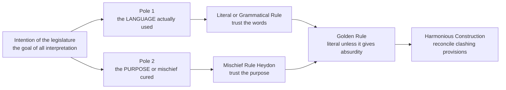
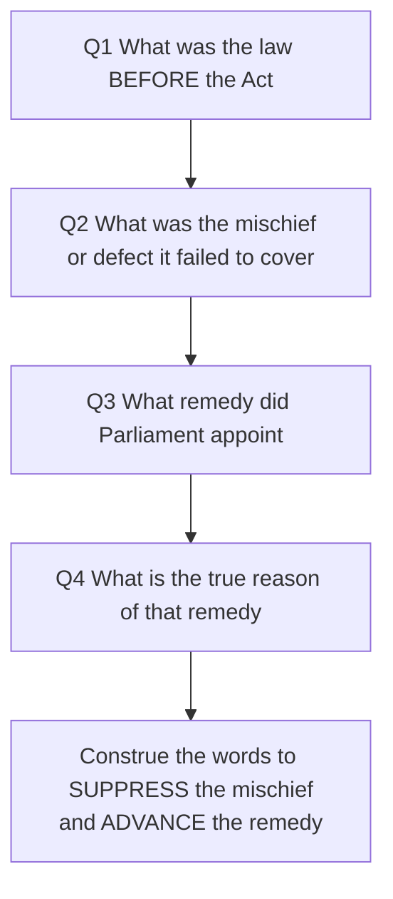
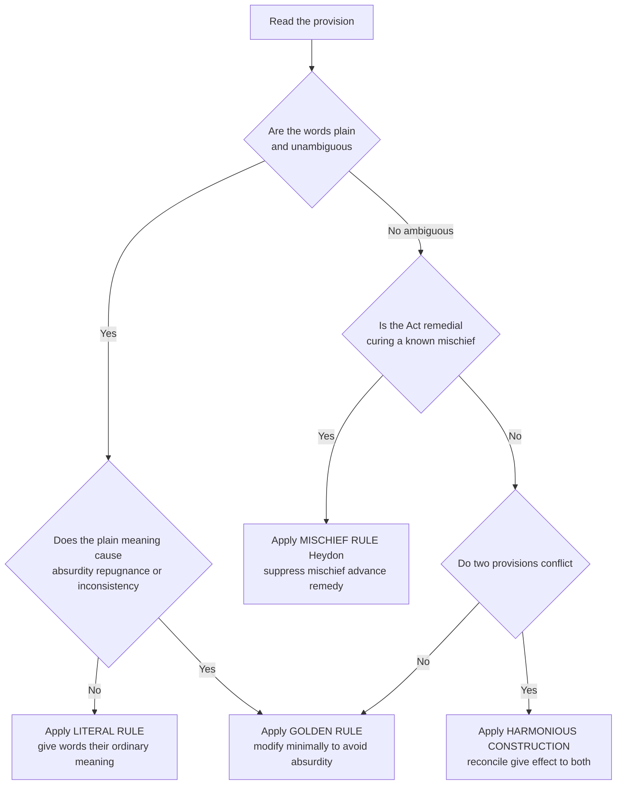
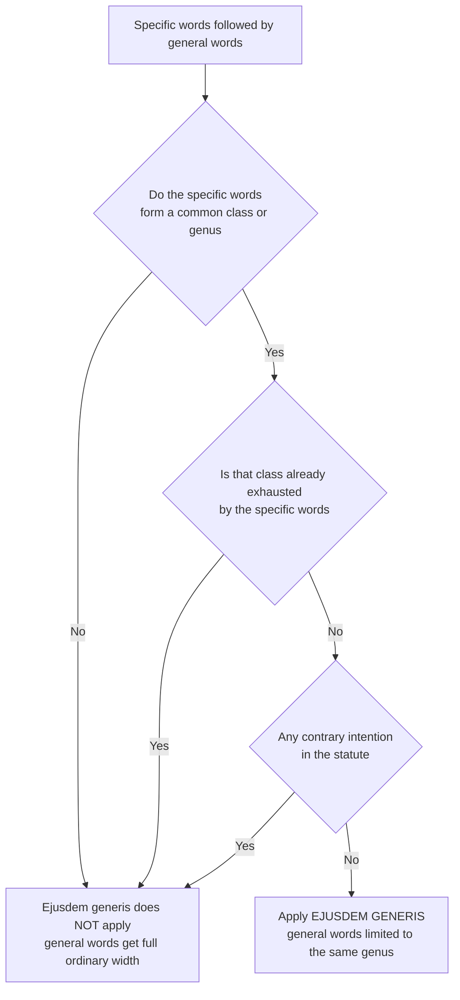
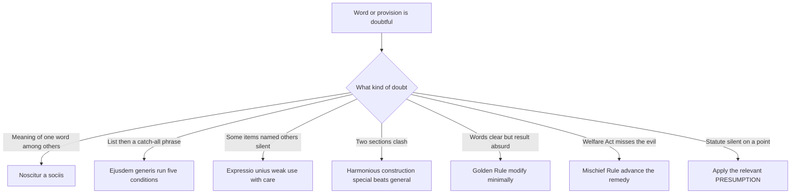
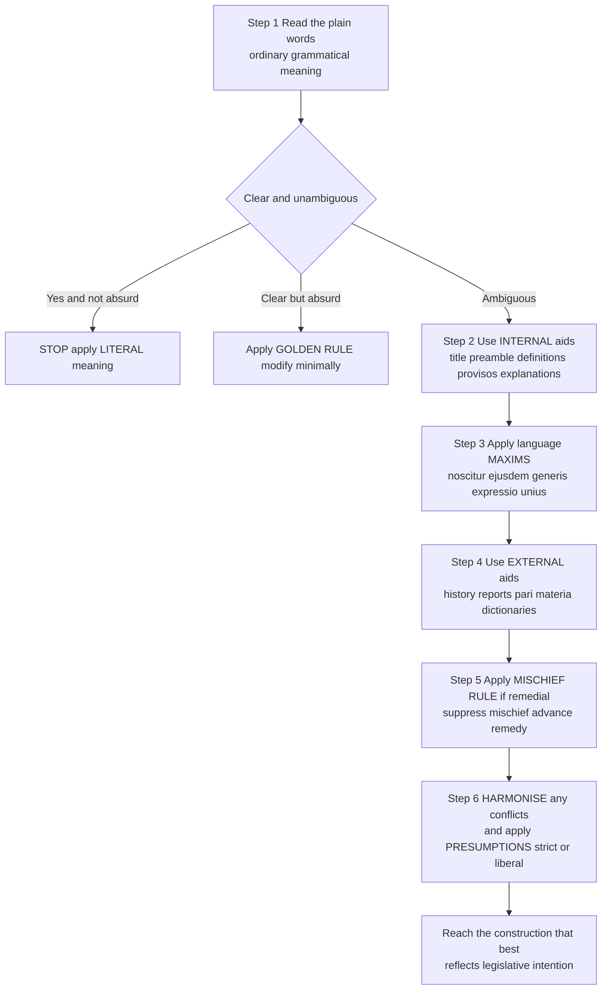

<!-- v2-deep -->

# Chapter 13 — Interpretation of Statutes

## 1. The Problem — Why can't we just "read" the law?

Imagine Parliament passes a law that says: *"No vehicle shall be allowed in the public park."* Clean sentence. Ten words. Everyone understands it.

Now watch it break.

- A father wheels his toddler in a **pram**. Is a pram a "vehicle"?
- An ambulance races in to save a collapsed jogger. Is the ambulance banned?
- The park committee wants to mount a **decommissioned army tank** on a concrete plinth as a war memorial. It has wheels, an engine. Is it a "vehicle"?
- A child rides a **skateboard**. A **bicycle**? A **battery scooter**?

Suddenly the "obvious" sentence is a minefield. The lawmaker who wrote it never imagined a war-memorial tank. The words on the page are a *frozen snapshot* of an intention — but life keeps generating new situations the words never anticipated.

Here is the deeper problem. When a dispute reaches a judge, the judge is stuck between two failures:

1. **Read too literally** and you get absurd results — the ambulance is banned, the injured jogger dies. You honour the *words* but betray the *purpose*.
2. **Read too freely** and every judge becomes a mini-legislator, inventing whatever meaning suits the case. Two judges, same statute, opposite answers. The law becomes unpredictable, and citizens can no longer know in advance what is legal.

So the real problem is not "what do these words mean?" It is: **How do we find the legislature's intention in a way that is consistent, disciplined, and predictable — so that different judges, on different days, reading the same statute, reach the same answer?**

That discipline is what "Interpretation of Statutes" gives us. It is a *toolbox of rules for reading* — not to let the judge do whatever they like, but precisely to *constrain* the judge, so meaning is discovered, not manufactured.

**Why does interpretation even become necessary? The four generators of doubt.** It is worth naming *why* words fail, because the examiner often asks "when does the question of interpretation arise?" A statute needs interpreting when the language is:

- **Ambiguous** — the word genuinely carries two meanings (is a "bank" a riverbank or a lender?).
- **Over-inclusive** — the words, read plainly, catch cases the legislature never aimed at (the ambulance).
- **Under-inclusive** — the words fail to catch a case that is squarely within the evil the Act targets (the mischief slips through a loophole).
- **Silent / has a gap (casus omissus)** — the situation simply was not foreseen (the pram).

Only the *third* and *fourth* are truly about "intention beyond words"; the first two are about "meaning of words." Keep that split in mind — it maps directly onto the interpretation-vs-construction distinction in Section 2.

> **Memory hook — "The Vehicle in the Park".** Every rule in this chapter is an answer to some version of the pram/ambulance/tank problem. Whenever a rule feels abstract, ask: *which version of the park problem does this fix?*

---

## 2. The Core Idea — Interpretation vs Construction, and the Golden Thread

**Interpretation** is the process of ascertaining the *true, legal* meaning of the words used in a statute. **Construction** is the process of drawing *conclusions* about cases that lie *beyond* the direct expression of the text — filling the gaps the words leave. In practice the exam uses the two words almost interchangeably, but the flavour differs:

| Term | What it does | Park example |
|------|-------------|--------------|
| **Interpretation** | Finds the meaning of the words actually used | "Does the word *vehicle* include a bicycle?" |
| **Construction** | Deduces the answer for situations words don't cover | "The Act is silent on prams — what result did the legislature intend?" |

A cleaner way to separate them for the exam: **interpretation** looks *at* the text and asks *what does this word mean*; **construction** looks *through* and *around* the text and asks *what legal effect follows in a situation the words do not squarely address*. Every act of construction contains interpretation, but not every interpretation needs construction. When the examiner writes "distinguish interpretation from construction," give (i) the definitions, (ii) "meaning of words vs effect in unforeseen situations," and (iii) "interpretation is the narrower, first step; construction is the broader inference."

The **golden thread** running through the entire subject — repeat this until it is reflex:

> **The object of all interpretation is to discover the *intention of the legislature*, and that intention is primarily gathered from the *language actually used*.**

Notice the tension baked into that single sentence. We want the *intention* (the purpose, the mischief being cured), **but** we look for it first in the *language* (the actual words). The whole chapter is a negotiation between these two poles:

- Lean entirely on **language** → you get the **Literal Rule**.
- Lean entirely on **intention/purpose** → you get the **Mischief Rule**.
- The **Golden Rule** and **Harmonious Construction** are the referees standing in between.

**A finer distinction the exam tests — the two senses of "intention."** Judges say "intention of the legislature," but this phrase hides an ambiguity that examiners exploit:

- **Subjective intention** — what the actual legislators, as people, had in their minds. This is largely *unknowable* and *irrelevant*; hundreds of members voted, many silent, many with different reasons. The law does **not** chase this.
- **Objective intention** — the meaning a *reasonable reader* would attribute to the words in their context. This is what courts actually seek. That is precisely *why* a legislator's speech is not conclusive evidence of meaning (see External Aids): it reveals subjective motive, not the objective meaning of the enacted text.

Getting this right lets you answer the trap "can a minister's speech in Parliament fix the meaning of a section?" The answer: it is admissible to understand *the mischief and background*, but it does **not** bind the objective meaning of the words.

*Figure 1 — the two poles interpretation must balance, and where each primary rule sits.*

---

## 3. Why It's Built This Way — the constitutional bargain

Why not just let judges do "justice" freely? Because of a bargain baked into a democracy.

**Separation of powers.** The *legislature* makes law; the *judiciary* applies it. If judges could freely rewrite statutes to reach the outcome they prefer, they would be *making* law — usurping Parliament. So the primary rule (Literal) is deliberately **modest**: it tells the judge *"assume the legislature said exactly what it meant; your job is to read, not to improve."*

**Predictability and the rule of law.** A citizen must be able to plan their conduct by reading the statute book. If meaning shifted with each judge's sense of fairness, "knowing the law" would be impossible. Rules of interpretation exist to make the *reading* reproducible.

**But language is imperfect.** Words are ambiguous, over-inclusive, under-inclusive, and can't foresee the future (the war-memorial tank). Rigid literalism sometimes produces absurdity or defeats the very object of the Act. So the system layers *escape valves* — the Golden Rule (avoid absurdity) and the Mischief Rule (serve the purpose) — but these are **subordinate**. They activate *only when literal reading fails.* This ordering is the whole architecture: start modest, escalate only when forced.

Think of it as a **hierarchy of trust**: trust the plain words first; distrust them only when they produce nonsense or defeat the statute's evident aim.

**Why this ordering (and not the reverse)?** Deeper first-principles: if the *purpose* rule came first, every judge would begin by asking "what did Parliament really want?" — a question with as many answers as there are judges. Purpose is contestable; the printed word is fixed. By forcing the judge to *start* from the fixed word and *escalate* to purpose only on proven failure (absurdity, or the Act missing its target), the system caps the judge's discretion. Discretion is not banned; it is *rationed* and made to earn its way in. That rationing is the entire genius of the scheme — it is not a hierarchy of importance (purpose obviously matters), it is a hierarchy of *who has to justify departing from the default.* The literal reader justifies nothing; anyone leaving the literal meaning must *prove* absurdity or defeated purpose. The burden sits on the one who wants to move.

---

## 4. Full Technical Content — the rules, aids, maxims and presumptions (each with its "why")

### 4.1 The Primary Rules of Interpretation

#### (a) The Literal / Grammatical Rule — "the words are the law"

**The problem it fixes:** the danger of judges inventing meaning. If we always looked past the words to "what the judge thinks was meant," the text would become decorative.

**The rule:** where the language of the statute is *plain and unambiguous*, it must be given effect to, in its **natural, ordinary, grammatical** meaning — *regardless* of whether the result seems harsh or inconvenient. The court presumes the legislature *chose its words deliberately*. You do not add words, subtract words, or read words differently.

Two supporting doctrines live inside the Literal Rule:

- **Casus omissus** — "a case omitted." A matter that should have been, but was *not*, provided for **cannot be supplied by the court**. If Parliament forgot to mention prams, the judge may not silently insert "prams." (Otherwise the judge legislates.)
- **Ut res magis valeat quam pereat** — "let the thing have effect rather than perish." A construction that makes the statute *workable* is preferred over one that makes it a dead letter. The legislature is presumed not to waste words.

**A third doctrine to carry:** ***A verbis legis non est recedendum*** — "from the words of the law there must be no departure." This is the Latin spine of the Literal Rule; quote it when asked to state the maxim underlying literal construction.

**When it applies:** as the **default and first** rule, whenever the words are clear.

**A subtle point examiners probe — "plain meaning" is judged *in context*, not in a vacuum.** The Literal Rule does not mean grabbing a dictionary and stopping. The "ordinary grammatical meaning" is the meaning the word bears *in that statute, on that subject.* The word "bank" is plain — but whether it means a lender or a riverside depends on whether the Act is about finance or flood control. So even the Literal Rule reads the word inside the sentence, the section, and the Act. What it forbids is going *beyond* a clear meaning to substitute what the judge wishes the legislature had said.

**Its weakness (and why more rules are needed):** the plain words can produce absurdity (ambulance banned) or defeat the object. Enter the Golden Rule.

> **Hook:** *Literal = "the letter of the law."* Read exactly what is written.

#### (b) The Golden Rule — "literal, unless it turns to nonsense"

**The problem it fixes:** blind literalism producing an *absurd, repugnant, or inconsistent* result that the legislature could not possibly have intended (banning the ambulance).

**The rule:** start with the literal meaning; **but** if that meaning leads to an **absurdity, repugnance, or inconsistency** with the rest of the statute, the court may **modify or depart** from the ordinary meaning *just enough* to avoid the absurdity — and no further. It is the Literal Rule with a *safety valve*.

**Two intensities:**
- **Narrow application** — used to choose between *two possible meanings* of an ambiguous word (pick the one that isn't absurd).
- **Wider application** — used even where there is only *one* literal meaning, if that meaning is so repugnant the court must strain the language to avoid it.

**The high threshold — "absurdity" is not "I don't like the result."** This is the most examined nuance of the Golden Rule. The escape valve opens only for results that are *absurd, repugnant, or self-contradictory* — not results that are merely *harsh, unfair, or inconvenient.* A statute may deliberately be harsh; harshness is Parliament's prerogative. The judge who bends the words because the outcome feels unkind has crossed back into legislating. So the test is high: the literal result must be one *no reasonable legislature could have intended.* If a candidate writes "the result was unfair, so apply the Golden Rule," that is wrong — unfairness alone is not enough.

**When it applies:** when the literal reading is clear *but* the outcome is absurd/repugnant. It is a *correction*, not a free rewrite — the departure must be minimal.

**Classic illustration:** a statute lets a person "inherit" from another; a son murders his mother to inherit. Literally he qualifies. Golden Rule: no one may profit from their own crime — so read the provision as impliedly excluding the murderer, to avoid a repugnant result.

> **Hook:** *Golden = "letter of the law, unless it produces lead."* Literal first; bend only to escape absurdity.

#### (c) The Mischief Rule (Heydon's Case, 1584) — "cure the disease Parliament targeted"

**The problem it fixes:** words that are clear enough but, read literally, *fail to catch the very evil the Act was passed to stop* — or catch things the Act was never aimed at. Here we need the *purpose*.

**The rule:** identify the **mischief** (the defect in the pre-existing law) the statute was designed to remedy, and interpret the words so as to **suppress the mischief and advance the remedy.** From *Heydon's Case*, the court asks **four questions**:

1. **What was the common law (the law) before the Act?**
2. **What was the mischief or defect** for which that law did *not* provide?
3. **What remedy** did Parliament resolve and appoint to cure the mischief?
4. **What is the true reason of the remedy?** — and the judge must then construe the Act to *suppress the mischief and advance the remedy.*

**When it applies:** especially to **remedial / welfare** statutes (labour law, consumer protection, anti-evasion tax provisions) — wherever the point of the Act is to *fix a social evil*, and a literal reading would let the evil slip through.

**The modern descendant — purposive construction.** The Mischief Rule of 1584 has grown into what modern courts call **purposive construction**: read the words in the light of the *object and purpose* of the Act as a whole, giving them the meaning that best carries that purpose forward. The difference in emphasis: the old Mischief Rule was backward-looking (what evil *pre-existed*?), while purposive construction is forward-looking (what *object* does this Act pursue?). For the exam, treat purposive construction as the Mischief Rule modernised — and note it is now the dominant approach for taxation anti-avoidance and welfare legislation. Do **not**, however, use purposive construction to *rewrite* a charging section in a tax Act — a citizen is taxed by clear words, not by the spirit (this is the boundary where strict construction pushes back).

*Figure 2 — Heydon's four questions as a decision flow.*

> **Hook:** *Mischief = "spirit of the law."* Ask "what evil was this Act hunting?" and read the words to catch that prey.

#### (d) Harmonious Construction — "make the parts agree"

**The problem it fixes:** two provisions of the *same* statute (or two statutes) that appear to **contradict** each other. If you obey one you disobey the other.

**The rule:** the statute must be read as a *whole*; the court must **reconcile** the conflicting provisions so that **both are given effect** as far as possible. The legislature is presumed *not to contradict itself.* A construction that reduces one provision to a **dead letter (redundant)** is to be avoided. Only if reconciliation is genuinely impossible does one provision yield — and even then the court gives each the widest operation that leaves room for the other.

**Special rule of harmony:** where a **general** provision and a **special** provision clash, the **special prevails** over the general on the subject it specially covers — *generalia specialibus non derogant* ("general things do not derogate from special things").

**The five principles of harmonious construction (exam-ready list).** When asked to *state* the doctrine rather than merely apply it, courts have distilled it into these rules of thumb:
1. Read the statute as a whole; give effect to **all** provisions.
2. Where two provisions conflict, seek an interpretation that **reconciles** them.
3. Prefer the construction that keeps **both** alive over one that renders either **redundant / a dead letter**.
4. Where reconciliation is impossible, the provision **later in position** or the **special** one may prevail on its subject — but this is a last resort.
5. A court will **not** reduce a provision to a nullity unless it is *driven* to that by an unavoidable contradiction.

**When it applies:** internal contradictions; overlapping entries/lists; general-vs-specific conflicts.

> **Hook:** *Harmonious = "make peace, don't pick a fight."* Give both provisions a job; kill neither.

*Figure 3 — the master decision tree: which primary rule fires?*

#### (e) Beneficial (Liberal) vs Strict Construction — a rule of *tone*, not a fifth primary rule

Students sometimes list "beneficial construction" as a separate primary rule. Be precise: it is not a *free-standing* method like the four above — it is a **direction of lean** applied *within* interpretation when the words are doubtful.

- **Beneficial / liberal construction** applies to **remedial and welfare** statutes. Where two readings are open, choose the one that *advances the benefit* to the class the Act protects. It draws its energy directly from the Mischief Rule.
- **Strict construction** applies to **penal and taxing** statutes. Where two readings are open, choose the one that *favours the subject* — nothing is punished or taxed unless caught by clear words.

The crucial exam point: *tone only breaks a tie.* If the words are **plain**, even a welfare statute is read literally and even a penal statute bites — you do not stretch a beneficial Act beyond its clear words, nor narrow a penal Act below its clear words. Beneficial/strict construction resolves *ambiguity*; it does not manufacture it. (The full "swords narrow, shields wide" treatment sits in Section 4.5.)

### 4.2 Internal Aids to Construction (found *inside* the statute)

When words are doubtful, the court first looks *within the four corners of the Act itself.* These are **internal aids** — and each answers a specific doubt.

| Internal aid | What doubt it resolves | Key rule / caution |
|--------------|------------------------|--------------------|
| **Long Title** | What is the Act broadly *about*? | Part of the Act; may be used to understand general scope and object, but cannot override clear enacting words. |
| **Short Title** | Merely a *label* for citation (e.g., "The Companies Act 2013") | Only for identification; **no interpretive value**. |
| **Preamble** | The *reason and object* — the "why" of the Act | A key to the maker's mind; useful when enacting words are ambiguous. **But** where the enacting section is clear, the preamble **cannot cut it down**. |
| **Marginal notes / headings** | Quick gist of a section | Generally **NOT** a legitimate aid (they aren't voted on by the legislature); may be looked at *only* in case of ambiguity, with great caution. |
| **Definition / Interpretation clause** | The *stipulated* meaning of a term for that Act | "**means**" = exhaustive/restrictive; "**includes**" = extends/enlarges the ordinary meaning; "**means and includes**" = exhaustive but broadened; watch for "**unless the context otherwise requires**". |
| **Proviso** | Carves out an *exception* to the main provision | Deals only with the main provision it is attached to; it **qualifies/excepts**, it does not *enlarge*. |
| **Explanation** | *Clarifies* or explains the main provision | Explains meaning, removes doubt, may fill a gap — but does **not** widen or contradict the section. |
| **Illustrations** | Worked *examples* of the section | Valuable to show application; but cannot **modify** the language of the section if they conflict with it. |
| **Schedules** | Detailed matter (forms, rates, lists) | Part of the Act; but the enacting section prevails if a schedule conflicts with it. |
| **Punctuation** | Commas, semicolons | A *minor* aid; the meaning must first be gathered from the words. Older statutes were sometimes unpunctuated. |
| **Non-obstante clause** ("notwithstanding anything…") | Which provision *overrides* in a clash | Gives the section it heads **overriding effect** over the provisions it names; but its reach is limited to what it actually says. |
| **Saving clause** | What survives a repeal/amendment | Preserves existing rights/pending actions; if it conflicts with the main provision, the main provision usually prevails. |

**Why the "means vs includes" distinction matters so much** — it is a repeat exam favourite:

- **"means"** → the definition is a *sealed box.* The term means *only* what is listed. Nothing outside gets in. (Restrictive.)
- **"includes"** → the definition is an *open door.* The term keeps its ordinary dictionary meaning **plus** the listed items. (Extensive/enlarging.)
- **"means and includes"** → exhaustive *and* deemed to cover the listed items — comprehensive, treated as a hard-and-fast definition.
- **"unless the context otherwise requires"** → the stipulated meaning is the *default*, but if a particular section's context demands a different meaning, context wins.

**The two darlings of drafting — proviso vs non-obstante clause.** These are constantly confused and constantly tested:

- A **proviso** looks *backward and inward* at the very section it is attached to and *carves an exception* out of it. Its job is to *take something out* of the main provision's reach. It cannot travel to other sections, and it cannot *add* to the main provision — only subtract. The tell-tale word is **"Provided that…"**.
- A **non-obstante clause** ("**notwithstanding** anything contained in…") looks *outward* and gives its own provision **overriding force** over other, possibly conflicting, provisions. Its job is to *win the clash* it names. But it overrides only what it actually mentions — a non-obstante clause naming "this Act" does not override some *other* Act unless it says so.

So a proviso *narrows*, a non-obstante clause *dominates*. Mixing these up is a frequent MCQ loss.

**Ranking among internal aids — what beats what.** When two internal aids point different ways, the order of authority is roughly: **enacting words > definition clause > proviso/explanation (as to their own section) > long title/preamble (object) > headings/marginal notes > punctuation.** The single unbreakable rule: *no internal aid overrides clear enacting words.* An aid is a torch to read the words in the dark — not a knife to cut them.

### 4.3 External Aids to Construction (found *outside* the statute)

If internal aids don't settle the doubt, the court may look **outside** the Act — but cautiously, because these are secondary.

- **Dictionaries** — for the ordinary meaning of a word (but the statutory/contextual meaning prevails over the dictionary).
- **Historical background / the state of things when the Act was passed** — to understand the mischief.
- **Statement of Objects and Reasons** and **legislative history / Parliamentary debates** — admissible to understand the *background and mischief*, but **not** as *direct evidence of meaning* of the specific words (a legislator's speech doesn't bind the statute's meaning).
- **Reports of Committees / Commissions** (e.g., a Law Commission report that preceded the Bill) — good evidence of the mischief the Act sought to cure.
- **Earlier and later statutes on the same subject (*statutes in pari materia*)** — Acts dealing with the same matter are read together as one system.
- **Contemporanea expositio** — how a statute was understood *at the time it was passed* (see maxims below).
- **Usage and practice** — long, consistent administrative practice under an old statute can be a guide to its meaning.
- **Foreign decisions** — persuasive only, where the statute is *in pari materia* with the foreign one; Indian conditions and the Constitution prevail.

**Why debates are demoted but reports are trusted — the principled line.** Students find it odd that a *committee report* is good evidence while a *floor speech* is weak. The reason tracks the objective-intention idea from Section 2. A committee/commission report exists *before* the Bill and describes the **mischief** — the state of affairs Parliament set out to fix; it lights up the *problem*, not the meaning of the chosen words. A minister's speech, by contrast, is one person's *view of the solution*, offered in the heat of debate; treating it as the meaning of the section would let one speaker's subjective gloss bind the whole House's enacted text. So: reports and history → admissible to find the **mischief**; individual speeches → **not** conclusive on the **meaning** of the words. That is the line to draw in an answer.

**A distinction worth banking — dictionary meaning vs statutory meaning.** A dictionary gives *a range* of ordinary meanings; the court picks the one that fits the *subject and context* of the Act, and a **defined** term always overrides the dictionary. So "dictionary is an external aid" is true, but it ranks *below* the Act's own definition clause and below context. If an Act defines "vehicle," the dictionary is irrelevant.

> **Hook — "Inside before Outside."** Internal aids first (Title → Preamble → Definitions → Provisos → Explanations); only then external aids. And *no aid* — internal or external — can override the **plain, clear words** of the enacting provision.

### 4.4 The Key Maxims (rules of *language*)

These are sub-rules that tell the court how words *keep company* with one another. Each solves a precise ambiguity.

#### (a) *Noscitur a sociis* — "a word is known by the company it keeps"

**Problem:** a word standing among others has an uncertain scope. **Rule:** a word takes colour/meaning from the *surrounding words.* If a doubtful word sits in a list, interpret it consistently with its neighbours.
*Example:* in "houses, buildings, and other structures," the word "structures" is coloured by "houses/buildings" — you wouldn't stretch it to a sandcastle.

#### (b) *Ejusdem generis* — "of the same kind" (a *specialised form* of noscitur a sociis)

**Problem:** a statute lists *specific* items and then adds a general catch-all ("… and other **such** things"). Does the catch-all mean *literally anything*, or only things like the listed ones? **Rule:** where **specific words** forming a *distinct genus (category)* are **followed by general words**, the general words are **restricted to the same kind/class (genus)** as the specific ones.

**Conditions for it to apply** (all needed):
1. The statute contains an **enumeration of specific words**;
2. The specific items **constitute a class or genus** (they share a common category);
3. The class is **not exhausted** by the enumeration;
4. **General words follow** the specific ones;
5. There is **no contrary legislative intent**.

*Example:* "cats, dogs, and other animals" in a pet-licensing law → "other animals" means *other domestic pets* (same genus), not lions or whales. **But** if the specific words do **not** form a single genus, ejusdem generis does **not** apply, and the general words get their full width.

**The relationship to *noscitur a sociis* (often muddled).** *Noscitur a sociis* is the parent principle — "colour from neighbours" — and applies whenever words sit together, in *any* arrangement. *Ejusdem generis* is a **special case** of it, triggered only by the specific *structure* "specific words → general words." So every ejusdem generis situation is a noscitur situation, but not vice-versa. If an answer needs the broad idea, cite noscitur; if the exact "list-then-catch-all" pattern appears, name ejusdem generis and run its five conditions.

*Figure 4 — does ejusdem generis apply?*

#### (c) *Expressio unius est exclusio alterius* — "to express one is to exclude the other"

**Problem:** the statute expressly mentions *some* things. Does mentioning them *imply* that unmentioned things are excluded? **Rule:** the *express* mention of one or more things of a class may imply the **exclusion** of others of the same class not mentioned.
*Caution (heavily tested):* this is a **weak, unsafe maxim** — a guide, not a command. The omission might be *deliberate exclusion* **or** simply an *oversight/abundant caution.* Apply it only when the mention was clearly meant to be *exhaustive.*
*Example:* a rule granting relief to "widows" may, by expressio unius, exclude "widowers" — *unless* context shows the omission was accidental.

#### (d) *Contemporanea expositio est optima et fortissima in lege* — "contemporaneous exposition is the best and strongest in law"

**Problem:** what did an *old* statute's words mean? **Rule:** the meaning given to a statute *at the time of its enactment*, by those who administered it soon after, is a strong guide to its meaning — usage over long time crystallises meaning. **Caution:** applied mainly to **old/ancient** statutes; it is **not** applied to *modern* statutes, whose words are read in their present sense.

#### (e) *Expressum facit cessare tacitum* — "what is expressed makes what is silent cease"

**Problem:** does an express provision leave any room for an implied one on the same point? **Rule:** where a matter is *expressly* dealt with, there is **no room for implication** on that matter — the express provision governs and silences any competing implied term. This is the sibling of *expressio unius*: the first says "expressing some excludes others"; this says "expressing a thing kills the implied version of that same thing."
*Example:* if a contract statute expressly states the mode of giving notice, a court will not imply some *other* mode; the express mode occupies the field.

#### (f) A few more worth carrying into the exam

- ***Generalia specialibus non derogant*** — special provisions override general ones (the harmony rule seen above).
- ***Reddendo singula singulis*** — "rendering each to each": where a sentence has several subjects and several objects, match each to its appropriate counterpart. *E.g.,* "I devise and bequeath my real and personal property" → *devise* attaches to *real* property, *bequeath* to *personal* property.
- ***Ut res magis valeat quam pereat*** — prefer the construction that makes the statute effective over one that makes it futile.
- ***A verbis legis non est recedendum*** — do not depart from the words of the law (the Latin spine of the Literal Rule).

### 4.5 Presumptions in Interpretation

When the text is silent or doubtful, courts fall back on **default assumptions** about what a rational legislature intends — unless the statute clearly says otherwise. Know these:

| Presumption | The court presumes… | Rebuttable by |
|-------------|---------------------|---------------|
| **Against ousting jurisdiction of courts** | The legislature does **not** intend to take away the ordinary courts' jurisdiction | Clear, express words |
| **Against retrospective operation** | A statute operates **prospectively**; it does **not** take away vested rights or impose new liabilities for the past — *especially* penal statutes | Express words or necessary implication (procedural laws are generally retrospective) |
| **Against exceeding territory** | Legislation applies **within India** only, not extra-territorially | Express extra-territorial provision |
| **Constitutionality** | The legislature intends a **valid, constitutional** law; read it to save it if possible | Only if unconstitutionality is unavoidable |
| **Against absurdity / injustice / inconvenience** | The legislature did not intend absurd, unjust or inconvenient results | The plain words compel it |
| **Mens rea in criminal statutes** | A guilty mind is required for a crime, unless the statute excludes it | Words creating strict/absolute liability |
| **Words used in the same sense throughout** | The same word carries the same meaning across the Act | Contrary context |
| **Against implied repeal / surplusage** | The legislature wastes no words and does not repeal earlier law by implication | Irreconcilable inconsistency |

**Two escalators inside the retrospectivity presumption (a favourite tweak).** The bare rule is "statutes are prospective." But two layers sit under it:
- **Substantive vs procedural.** The presumption *against* retrospectivity protects **substantive** rights (rights, obligations, penalties). **Procedural / machinery** provisions (rules of evidence, limitation, forum, mode of trial) are generally treated as **retrospective** — because no one has a vested right in *procedure*. So an amendment changing *how* you appeal usually applies to pending matters; an amendment changing *whether* you are liable does not reach back.
- **Beneficial retrospectivity.** A *curative or beneficial* amendment (e.g., one that reduces a penalty or clarifies a benefit) may be read retrospectively to serve its object, even absent express words — because the presumption exists to protect the subject, and here retrospective reading *helps* the subject.

**Strict vs Liberal construction — the presumption that decides tone:**
- **Penal and taxing statutes are construed *strictly*.** Why? Because they *hurt* the citizen (jail; money taken). If two readings are possible, the one **favouring the subject** is preferred, and nothing is taxed/punished unless clearly within the letter. The State must speak plainly before it punishes or taxes.
- **Remedial / welfare / beneficial statutes are construed *liberally*.** Why? Their purpose is to *help* people; a generous reading advances the remedy (Mischief Rule energy). Ambiguity is resolved in favour of the class the Act protects.

**The boundary of strict construction (deeper than most notes go).** "Strict" does **not** mean "narrowest imaginable" or "read against the State at all costs." It means: (i) find the natural meaning of the charging/penal words; (ii) *if* — and only if — a real ambiguity survives, resolve it for the subject. Strict construction is a **tie-breaker at the end**, not a licence to ignore plain words that clearly cover the case. A taxpayer clearly within the charge cannot escape by demanding an artificially narrow reading; equally, the State cannot tax by "intendment" or by stretching words to their spirit. Two matching slogans: *"There is no equity about a tax"* (you are taxed by the letter, not by fairness) and *"nothing is to be read in, nothing is to be implied"* in a charging section.

> **Hook:** *"Sword statutes narrow, shield statutes wide."* Laws that wound (penal/tax) are read narrowly; laws that protect (welfare) are read widely.

*Figure 6 — mapping doubt-type to the tool that resolves it.*

---

## 5. Applied Scenarios (exam-style)

**Scenario 1 — The war-memorial tank (Literal vs Golden vs Mischief).**
A municipal bye-law: *"No vehicle shall enter the park."* The committee mounts a decommissioned tank as a memorial. A citizen sues, saying a tank is a "vehicle."
- **Literal:** a tank has wheels and an engine → it is a vehicle → banned. But this is *absurd* — a static memorial threatens no one.
- **Golden Rule:** modify to avoid absurdity — the bolted-down memorial is not "entering" as a vehicle.
- **Mischief Rule (best):** the mischief was *danger and disturbance to park-users from moving traffic.* A static tank causes neither. Read "vehicle" to mean *vehicles used for transport/movement.* Memorial is allowed. **Answer:** applying the Mischief/Golden approach, the tank is permitted; the purpose, not the bare word, controls.

**Scenario 2 — "means" vs "includes" (definition clause).**
Act A says *"'factory' **means** any premises where 10 or more workers work with power."* Act B says *"'worker' **includes** an apprentice."* A dispute: does Act A's "factory" cover a premises with 8 workers but huge output? Does Act B's "worker" cover a trainee not formally an apprentice?
- Act A uses **"means"** → *sealed box.* Only premises with 10+ power-workers qualify. 8 workers → **not** a factory, however large the output. Court cannot stretch it (casus omissus — the gap can't be judicially filled).
- Act B uses **"includes"** → *open door.* "Worker" keeps its ordinary meaning **plus** apprentices; a trainee doing a worker's job can be covered because the definition is *enlarging*, not exhaustive. **Answer:** the drafting verb decides the width.

**Scenario 3 — Ejusdem generis (the catch-all list).**
A licensing law requires a permit to keep *"any dog, cat, rabbit or other animal."* X keeps a python and argues no permit is needed because it's a reptile; the department says "other animal" covers everything.
- Test the conditions: specific words (dog, cat, rabbit) → do they form a **genus**? Yes — *common domestic pet animals.* The class isn't exhausted; general words follow; no contrary intent. → **Ejusdem generis applies**: "other animal" is limited to *animals of the same kind* (domestic pets). Whether a python fits turns on whether it is a kept domestic pet — but the department **cannot** claim the phrase covers *literally any* creature. **Answer:** the catch-all is confined to the genus of the listed animals, not the entire animal kingdom.

**Scenario 4 — Strict construction of a penal/tax provision.**
A tax entry levies duty on *"manufactured tobacco."* The revenue seeks to tax a semi-processed leaf that is arguably not yet "manufactured."
- Taxing statute → **strict construction.** If it is genuinely doubtful whether the leaf is "manufactured tobacco," the doubt is resolved **in favour of the assessee** (the subject). Nothing is taxed unless it falls *clearly* within the letter of the charge. **Answer:** absent clear coverage, the levy fails; the State must draft plainly.

**Scenario 5 — Harmonious construction (two clashing sections).**
Section 12 of an Act says *"every appeal shall be filed within 30 days."* Section 40 says *"the Tribunal may condone delay for sufficient cause."* Do they conflict?
- Read as a whole, presuming no self-contradiction: Section 12 sets the *normal* limit; Section 40 is a *special* power to relax it for sufficient cause. **Both are given effect** — the limit stands, the condonation power operates as an exception. (Also *generalia specialibus*: the specific condonation power qualifies the general limit.) **Answer:** no true conflict; harmonious reading keeps both alive.

**Scenario 6 — Reddendo singula singulis (matching subjects to objects; a numerical-style parsing).**
A pension rule reads: *"A member and his widow shall be paid Rs 20,000 and Rs 12,000 respectively per month."* On the member's death, the administrator argues the widow gets Rs 20,000 (the first, higher figure).
- Apply **reddendo singula singulis** — render each to each, in order. Two subjects (*member*, *widow*) map onto two amounts (*Rs 20,000*, *Rs 12,000*) *respectively*: member → Rs 20,000; widow → Rs 12,000.
- **Self-check by reconciliation:** the word "respectively" is the drafting signal that pairs list-1 with list-2 positionally. Total design: member's pension Rs 20,000; on his death the widow's pension is the *lower* Rs 12,000 figure (typical of survivor benefits). The administrator's reading would make "respectively" meaningless — violating *ut res magis valeat* (no word is surplus). **Answer:** the widow is entitled to **Rs 12,000**, not Rs 20,000. *What if the examiner drops the word "respectively"?* Then the pairing is no longer textually forced; the court would fall back on context/purpose (survivor benefits are usually lower) but the clean maxim answer weakens — flag that the whole force of reddendo singula singulis here rides on "respectively."

**Scenario 7 — Retrospectivity: substantive vs procedural (a date-driven tweak).**
A tax amendment is notified on **01 April 2026**. Version (a): it *raises the rate* of tax on income. Version (b): it *changes the time limit* to file an appeal from 30 to 60 days. An assessee whose income arose in FY 2024-25 and whose appeal was pending on 01 April 2026 asks how each applies.
- **Version (a) — substantive (rate/liability):** the presumption **against retrospectivity** protects the vested position. A rate increase is a *substantive* change to liability; absent clear retrospective words, it applies **prospectively** — it does **not** reach back to FY 2024-25 income. **Answer:** old rate governs the past year.
- **Version (b) — procedural (limitation/forum):** rules of *procedure* carry **no vested right**; a change to the appeal period is machinery. It is generally **retrospective** and applies to the **pending** appeal, giving the assessee the benefit of the longer 60-day window. **Answer:** the new 60-day limit applies to the pending matter.
- **Reconciliation / why the split holds:** the presumption exists to protect *acquired rights*. You *acquire* a right in your tax liability (so it is frozen as at the year it arose); you *never acquire* a right in the mechanics of how courts run (so procedure can move under you). *What if version (b) instead* ***shortened*** *the period from 60 to 30 days and the assessee's 45th day had already passed?* Courts avoid using "retrospective procedure" to *destroy* an already-accrued right to appeal — so a shortened limitation would not be applied to bar an appeal that was still alive under the old period. The procedural-retrospectivity rule bends where it would extinguish a vested remedy.

**Scenario 8 — Proviso vs non-obstante clause (which one wins the clash).**
Section 8 of an Act says: *"Notwithstanding anything contained in any other law, the Authority may seize goods. Provided that perishable goods shall be released within 48 hours."* Two questions: (i) does Section 8 override a conflicting provision in a *different* Act that bars seizure? (ii) does the proviso let the Authority *also* seize goods from unregistered dealers (a power not in the main clause)?
- **(i) Non-obstante clause:** "notwithstanding anything in any other law" gives Section 8 **overriding effect** over the conflicting provision in the other Act — that is exactly the job of a non-obstante clause, and here it expressly names "any other law," so its reach is wide. **Answer:** Section 8 prevails; the seizure stands.
- **(ii) Proviso:** a proviso only **carves an exception** out of its own main clause — it *cannot enlarge* the power. It says perishables must be *released* early; it grants **no new seizure power** over unregistered dealers. Reading it as a *source* of extra power reverses the nature of a proviso. **Answer:** no; the proviso subtracts (early release), it does not add a fresh power.
- **Trap check:** the tempting wrong move is to treat the proviso as if it *expanded* Section 8. Provisos qualify; they do not enlarge — pair this with *"a proviso is not a substantive enacting provision."*

---

## 6. Procedure / Summary — the order a court actually follows

*Figure 5 — the interpretation workflow, top to bottom.*

**One-line summary of the whole system:** *Trust the words; escape only for absurdity; when in doubt look inside then outside; obey the mischief for welfare laws, reconcile clashes, and lean the way the presumption points (narrow for swords, wide for shields).*

**How to structure a full-marks answer to "interpret this provision."** Examiners reward a *visible method*, not a guessed conclusion. Use this skeleton:
1. **State the golden thread** — intention of the legislature, gathered primarily from the language.
2. **Start literal** — give the words their ordinary meaning; say whether they are plain or ambiguous.
3. **Test for absurdity** — if plain but absurd/repugnant, invoke the Golden Rule and *say why the result is absurd, not merely harsh.*
4. **If ambiguous, reach for the right tool** — name the specific aid or maxim (definition verb, proviso, ejusdem generis…) and *run its conditions.*
5. **Bring purpose in for remedial Acts** — Heydon's four questions / purposive construction.
6. **Set the tone** — penal/tax strict for the subject; welfare liberal for the protected class.
7. **Conclude** — state the construction that best reflects legislative intention, and apply it to the facts. Always land on a definite answer.

---

## 7. Connections — where this plugs into the rest of the syllabus

- **The General Clauses Act, 1897** (next in most CA schemes) is the *statutory partner* of this chapter: it supplies default **definitions** ("person", "month", "immovable property"), rules on **commencement**, **repeal and re-enactment**, and computation of time — codified interpretation aids. This chapter is the *theory*; the General Clauses Act is the *statutory toolkit*. Concretely: the presumption *against implied repeal* here is backed by Section 6 (effect of repeal) there; "means/includes" logic here is what you use to read every General Clauses Act definition.
- **Companies Act / SEBI / FEMA:** every time you read a definition clause ("**means**" vs "**includes**"), decide whether a **proviso** narrows a section, or reconcile two apparently clashing provisions, you are *applying this chapter.* E.g., reading whether "officer in default" includes a given person is pure interpretation. Non-obstante clauses ("notwithstanding anything in the Companies Act…") recur across SEBI and IBC — that is the overriding-clause doctrine from 4.2.
- **Taxation papers:** the *strict construction of taxing statutes* and *ejusdem generis* over tariff/entry lists are constantly used; so is the *substantive-vs-procedural* retrospectivity split (rate changes vs limitation changes).
- **Constitutional law:** *harmonious construction* famously reconciles Fundamental Rights with Directive Principles, and Union vs State legislative entries; the *presumption of constitutionality* saves statutes where a reading is available.
- **Contract & FEMA penalties:** the *presumption of mens rea* and *strict construction of penal provisions* shape how offences and penalties are read.

---

## 8. Traps & Examiner Tricks

1. **"Literal rule = the highest rule always."** *False.* Literal is the *starting default*, not an absolute. It yields to the Golden Rule on absurdity. Watch for questions where literal reading gives a silly result — the examiner wants the Golden/Mischief answer.
2. **"means" vs "includes" swapped.** The single most common definition trap. *"means" = exhaustive/restrictive (sealed box); "includes" = extensive/enlarging (open door).* If you flip them you fail the sub-question. "means and includes" = exhaustive but broad.
3. **Applying *ejusdem generis* when the specific words DON'T form a genus.** If the listed items share no common class, the maxim **does not apply** and the general words get full width. Also fails if the genus is *exhausted* by the list, or a contrary intention appears.
4. **Treating *expressio unius* as a hard rule.** It is **weak and unsafe** — the omission could be deliberate *or* an oversight. Never apply it mechanically; only where the mention was meant to be exhaustive.
5. **Short title vs long title vs preamble confusion.** *Short* title = mere label, **no** interpretive value. *Long* title and *preamble* = legitimate aids to object/scope, but **cannot override clear enacting words.**
6. **Marginal notes / headings as aids.** Generally **not** legitimate aids (not enacted by the legislature); usable only in ambiguity, with caution. A tempting wrong option.
7. **Proviso vs Explanation vs Illustration.** *Proviso* = **exception/qualification** (carves out); *Explanation* = **clarifies** (removes doubt, doesn't enlarge); *Illustration* = **example** (can't override the section). Examiners love mismatching these.
8. **Casus omissus.** A gap the legislature left **cannot** be filled by the court. If the words don't cover a case, the answer is "not covered" — *not* "the court will read it in."
9. **Strict vs liberal direction reversed.** *Penal & taxing = strict, in favour of the subject.* *Welfare/remedial = liberal.* Getting the direction backwards is an automatic loss.
10. **Retrospectivity default.** Presumed **prospective** (especially penal). But *procedural* amendments are generally retrospective — a classic distinguishing trap. Deeper tweak: a *beneficial* amendment may be read retrospectively, and procedural retrospectivity will **not** be used to *extinguish an already-accrued right* (e.g., an appeal already alive).
11. **Contemporanea expositio on a modern Act.** It applies to **old** statutes; do **not** invoke it for a recent enactment.
12. **"External aids override the words."** Never. No aid — internal or external, no debate or report — can defeat the **plain, unambiguous** language of the enacting provision.
13. **Proviso mistaken for an enlarging or a substantive provision.** A proviso **subtracts** from its own section; it neither adds a fresh power nor travels to other sections. "A proviso is not itself a substantive enacting provision."
14. **Non-obstante clause treated as unlimited.** "Notwithstanding" overrides only what it **names**. A clause saying "notwithstanding anything in *this Act*" does **not** override some *other* Act. Read the *scope* of the override before you apply it.
15. **"Golden Rule applies whenever the result is unfair."** No — the threshold is **absurdity/repugnance**, not mere harshness or unfairness. Parliament is allowed to be harsh; the judge is not allowed to soften plain words just because the outcome stings.
16. **Minister's speech = meaning of the section.** No — legislative debates are admissible for **mischief/background** only, **not** as direct evidence of the meaning of the enacted words. Reports/history light up the *problem*, not the *meaning*.
17. **Dictionary beats the Act's own definition.** Never — a **defined** term and the **context** override the dictionary; the dictionary only supplies an *ordinary* meaning when the Act is silent.

---

## 9. First-Principles Recap — rebuild the chapter from one sentence

Start from the single fault line: **words are frozen, life is fluid.** A statute is a set of words written at one moment, trying to govern situations no one foresaw. Two failures loom — the judge who reads too literally (bans the ambulance) and the judge who reads too freely (becomes a legislator). Everything else is the machinery that steers between them.

- To stop the *free-reading* judge, we start with the **Literal Rule**: the words are the law; you may not add, subtract, or invent (casus omissus; *a verbis legis non est recedendum*).
- To stop the *absurd* result, we add the **Golden Rule**: bend the words *minimally* when literal reading gives nonsense — and only for true absurdity, not mere harshness.
- To make sure the Act *does its job*, we add the **Mischief Rule** (now grown into purposive construction): find the evil Parliament hunted and read the words to catch it — especially for welfare laws.
- To keep the Act *internally coherent*, we add **Harmonious Construction**: reconcile clashing provisions; kill none; special beats general.
- To *find* meaning when words are doubtful, we look **inside** (title, preamble, definitions, provisos, explanations, non-obstante clauses) then **outside** (history, reports, pari materia, dictionaries) — but never against the plain words, and never letting a debate override the text.
- To handle *how words behave in company*, we use the **maxims** (noscitur a sociis, ejusdem generis, expressio unius, expressum facit cessare tacitum, contemporanea expositio, reddendo singula singulis).
- To resolve *silence*, we lean on **presumptions** (prospective — but procedure moves; constitutional; mens rea; against ousting courts) — and we set the *tone*: narrow for swords (penal/tax), wide for shields (welfare).

The unifying insight beneath all seven moves: the entire scheme is a device for **rationing judicial discretion** — the judge starts with zero freedom (read the words) and earns more only by *proving* the words have failed. Meaning is *discovered*, not *manufactured*. If you can regenerate those seven moves from the "frozen words, fluid life" problem, you own the chapter.

---

## 10. Quick-Revision Sheet

**Golden thread:** find the *intention of the legislature*, primarily from the *language used*.

**Interpretation vs construction:** interpretation = *meaning of words used*; construction = *effect in situations words don't cover*. Interpretation is the narrower first step.

**Primary rules (and trigger):**

| Rule | Fires when | Do |
|------|-----------|----|
| **Literal / Grammatical** | Words plain & unambiguous | Give ordinary meaning; don't add/subtract (casus omissus; ut res magis valeat) |
| **Golden** | Literal gives absurdity/repugnance/inconsistency (**not** mere harshness) | Modify *minimally* to avoid it |
| **Mischief (Heydon)** | Remedial Act; literal misses the evil | 4 Qs → suppress mischief, advance remedy (= purposive construction) |
| **Harmonious** | Two provisions conflict | Reconcile; give effect to both; special over general |

**Definition verbs:** *means* = exhaustive (sealed box) · *includes* = enlarging (open door) · *means and includes* = exhaustive + broad · *unless context otherwise requires* = context can override.

**Internal aids (inside → cautious):** Long title (scope) · Preamble (object) · Definitions · Proviso (**exception, subtracts**) · Explanation (clarifies) · Illustration (example) · Schedule · Non-obstante clause (**overrides what it names**) · Saving clause · Headings/marginal notes (weak) · Punctuation (minor). Short title = label only. **No internal aid overrides clear enacting words.**

**External aids:** dictionaries · historical background · Objects & Reasons · committee/commission reports (→ **mischief**) · debates (→ background only, **not** meaning) · statutes *in pari materia* · usage/practice · foreign decisions (persuasive). **None** overrides plain words.

**Maxims:**
- *Noscitur a sociis* — word known by its company (the parent rule).
- *Ejusdem generis* — general words after specific words of a genus = limited to that genus (needs: specifics form a class, class not exhausted, general words follow, no contrary intent). A *special case* of noscitur.
- *Expressio unius est exclusio alterius* — express one, exclude the rest (**weak/unsafe**).
- *Expressum facit cessare tacitum* — an express provision leaves no room for an implied one on the same point.
- *Contemporanea expositio* — old statutes read as understood when enacted (not modern Acts).
- *Generalia specialibus non derogant* — special beats general.
- *Reddendo singula singulis* — match each subject to its object ("respectively" is the trigger word).
- *Ut res magis valeat quam pereat* — prefer the effective construction.
- *A verbis legis non est recedendum* — do not depart from the words (spine of the Literal Rule).

**Presumptions:** prospective (esp. penal; **procedural = retrospective**, but not to kill an accrued right; beneficial amendments may be retrospective) · against ousting court jurisdiction · constitutionality · mens rea in crimes · territorial · no surplusage/implied repeal · against absurdity/injustice.

**Tone:** *Penal & Taxing = STRICT, favour the subject* ("no equity about a tax"; tie-breaker only, plain words still bite). *Welfare/Remedial = LIBERAL, favour the protected class.* Mnemonic: **"Swords narrow, shields wide."**

**One-liner:** *Trust the words → escape absurdity (not harshness) → look inside then outside → serve the mischief → harmonise → let the presumption point the way.*
