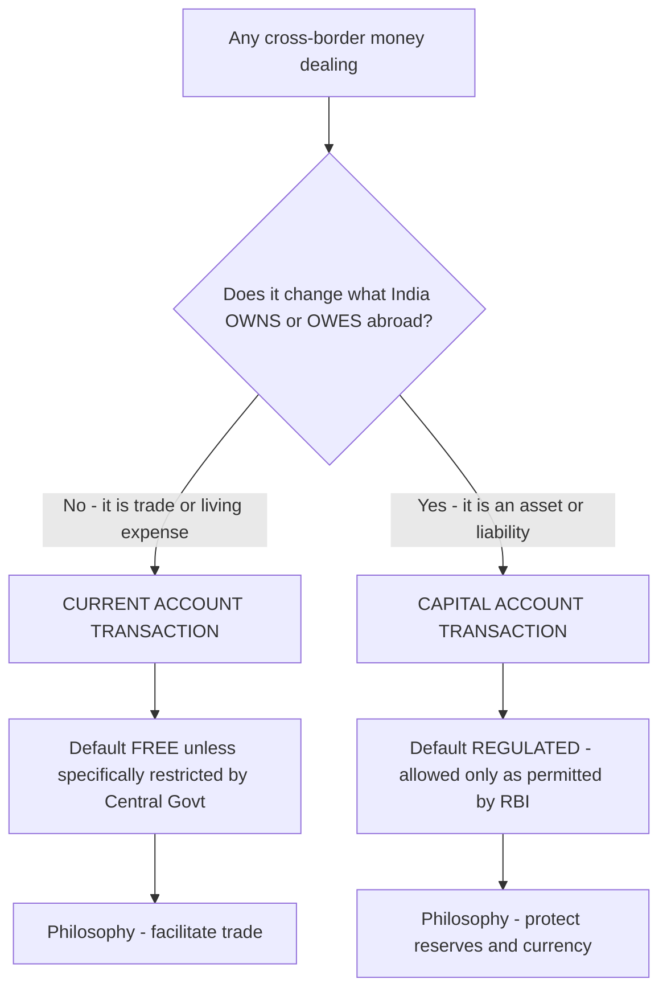
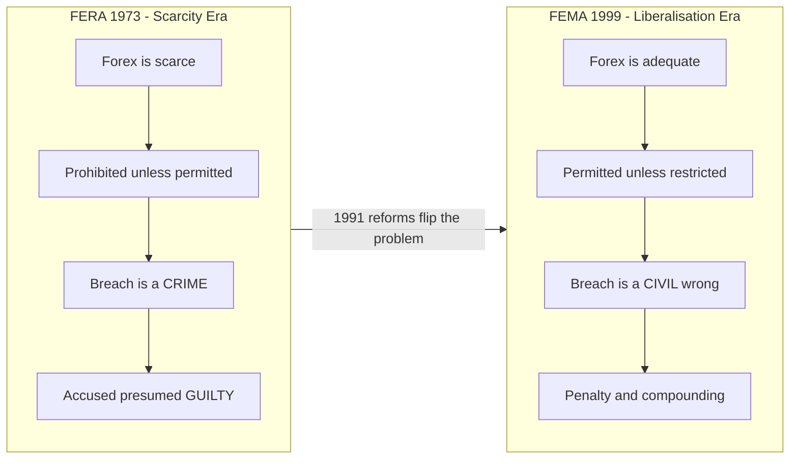
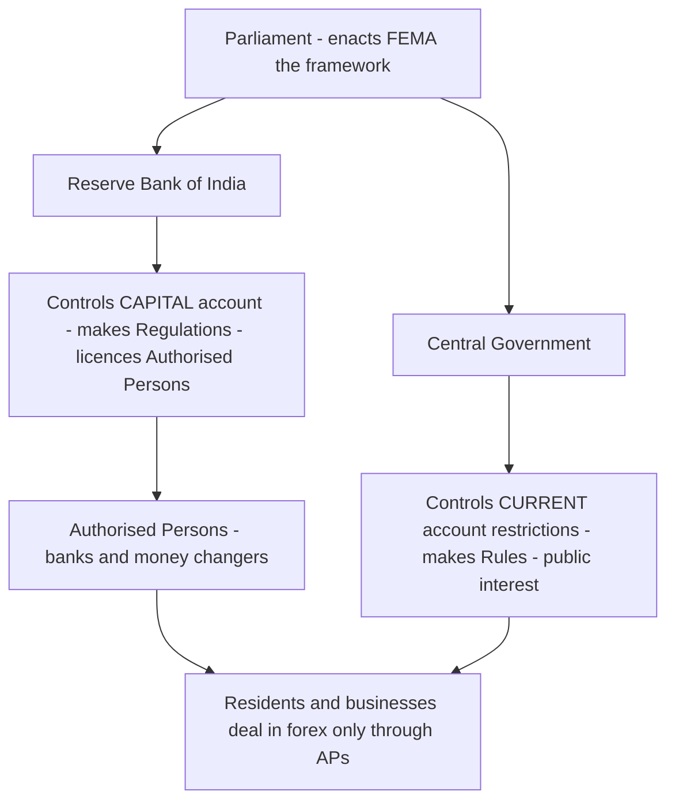
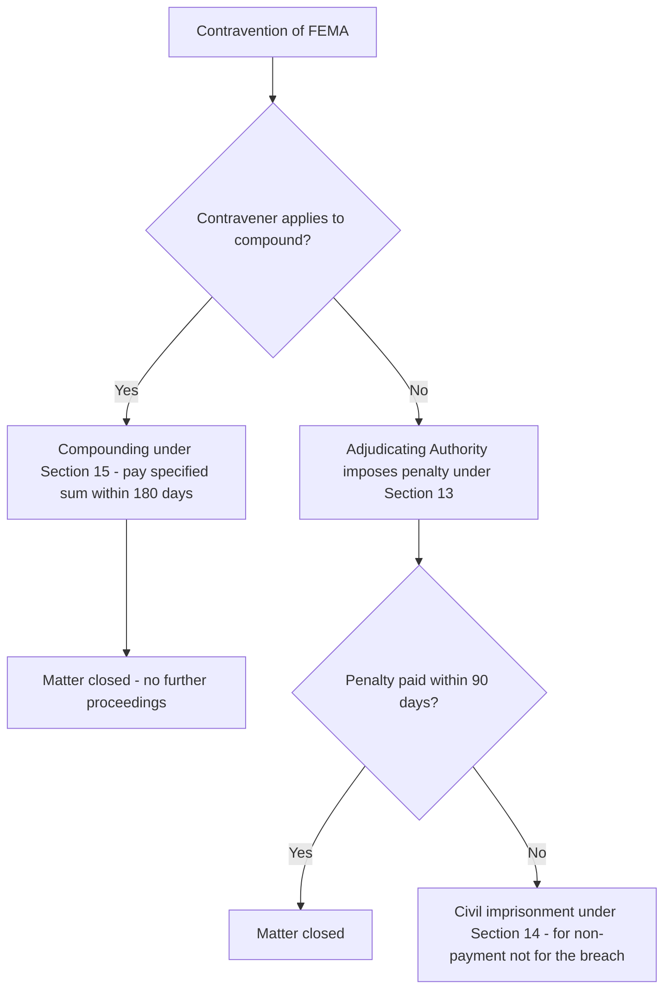
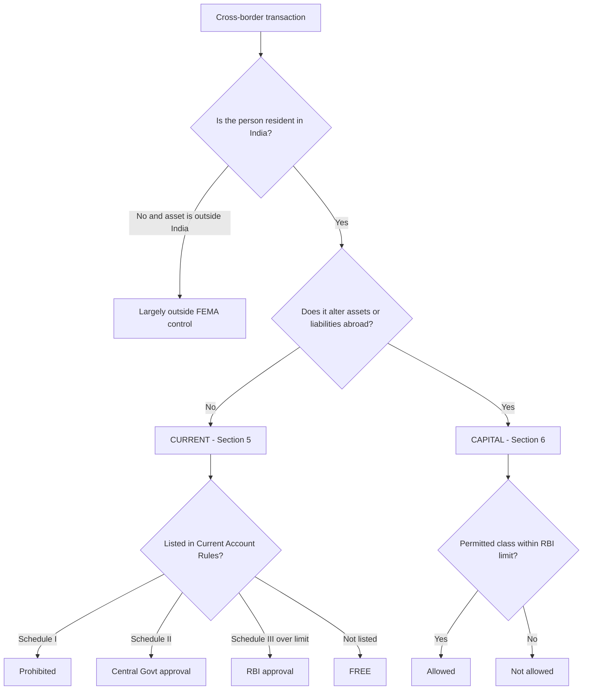

# Chapter 14 — Foreign Exchange Management Act, 1999 (Basics)

## 1. The Problem

Imagine you run the treasury of a poor country. You have almost no US dollars, pounds or yen in your vault — and yet almost everything your economy needs from abroad (crude oil, machinery, medicines, defence equipment) can only be bought with those foreign currencies. Foreign exchange, to you, is not just "money" — it is a **scarce, strategic national resource**, like water in a desert.

Now ask the natural question: what happens if you let every citizen, business and trader freely buy, hoard, send abroad or speculate in foreign currency? Three disasters follow:

1. **The reserves drain.** If everyone can freely convert rupees into dollars and send them out, the little foreign currency you have vanishes. Then you cannot pay for the oil that keeps the economy running. This is a **balance of payments crisis** — precisely what India faced in **1990–91**, when reserves fell to barely two to three weeks of imports.
2. **The currency collapses.** If people can freely sell rupees to buy dollars, the rupee's value crashes, imports become ruinously expensive, and inflation explodes.
3. **Money escapes control.** Wealth quietly leaves the country ("capital flight"), tax is evaded through fake invoices, and the government loses its grip on the economy.

So a scarce-forex nation builds a wall around foreign exchange. India's first wall was the **Foreign Exchange Regulation Act, 1973 (FERA)**. Its philosophy was blunt: *foreign exchange is so scarce that every dealing in it is presumed suspicious and prohibited unless the government specifically permits it.* Breaking the rules was a **crime**. You could be arrested. The burden was on **you** to prove your innocence.

That wall made sense in a starving-for-forex economy. But by the 1990s the problem had **flipped**. After the 1991 liberalisation, India opened up, foreign investment poured in, exports grew, and reserves became comfortable. Now the old wall was strangling the very growth it was meant to protect. A businessman importing a machine had to beg for permission; a criminal-law regime terrified honest traders and choked global trade.

**The new problem was therefore the opposite of the old one:** how do you *manage* a now-adequate stock of foreign exchange to keep the currency stable and promote orderly trade — without treating every honest importer and exporter as a smuggler? FERA could not do this. It was built for scarcity and suspicion. India needed a law built for **abundance and facilitation**. That law is the **Foreign Exchange Management Act, 1999 (FEMA)** — note the word: *Management*, not *Regulation*.

> **Memory hook:** FERA = **F**ear + **R**estriction (control, criminal). FEMA = **M**anagement + **F**acilitation (civil, orderly). The single letter change (R → M) is the entire philosophy change.

---

## 2. The Core Idea

FEMA rests on one elegant shift in default assumptions.

**FERA's default:** *Everything in forex is prohibited unless permitted.* (Guilty until proven innocent.)

**FEMA's default:** *Everything in forex is permitted unless restricted* — **BUT** with one crucial split. FEMA divides all cross-border money dealings into two boxes:

- **Current account transactions** (the money for day-to-day living and trade — importing goods, paying for a foreign trip, sending money to a child studying abroad). Default here = **FREE**. These are the *income statement* of the nation.
- **Capital account transactions** (money that changes what you *own or owe* abroad — buying foreign shares, foreign property, giving/taking cross-border loans). Default here = **REGULATED** by the RBI. These are the *balance sheet* of the nation.

Why this split? Because current-account outflows are self-limiting and productive — you can only import so much oil, take so many holidays. But **capital flows are volatile and dangerous**: hot money can flood in and rush out overnight, and free capital flight can empty the reserves in days. So FEMA says: *let the living and trading money flow freely; keep a hand on the ownership-and-debt money.*

And because the goal is now **management, not punishment**, breaking FEMA is a **civil wrong** — you pay a **penalty**, you can **compound** (settle) the matter — not a **crime** you get jailed for.

> **One-line essence:** *FEMA keeps forex orderly by freeing everyday trade money, regulating cross-border ownership money, and treating breaches as civil settlements rather than crimes.*

*Figure 14.1 — The two-box philosophy of FEMA: current account flows freely, capital account is regulated.*

---

## 3. Why It's Built This Way

Before drilling into provisions, understand the four design decisions that shape every section of FEMA. If you understand *why* these choices were made, you never have to memorise the sections — you can reconstruct them.

**Design choice 1 — Management, not regulation.** The 1991 reforms meant forex was no longer desperately scarce. A control regime (FERA) was now a cost, not a protection. So FEMA's stated purpose (its Preamble) is *"facilitating external trade and payments and promoting the orderly development and maintenance of the foreign exchange market in India."* Every ambiguity in FEMA is resolved in favour of **facilitation**, not restriction — the opposite of how FERA was read.

**Design choice 2 — Civil, not criminal.** Under FERA, an accused was presumed guilty and could be **arrested**; the burden lay on him. This terrified legitimate business. FEMA converts contraventions into **civil offences** attracting **monetary penalties**, removes the presumption of guilt, and — critically — allows **compounding** (voluntary settlement by paying a sum). Jail (civil imprisonment) appears only as a last resort if you refuse to pay the penalty. The logic: an economy that wants to *attract* foreign capital cannot jail investors for paperwork errors.

**Design choice 3 — A clean division of labour.** Parliament sets the frame (the Act). The **Central Government**, being politically accountable for trade policy, controls the **current account** side (it can restrict trade payments in public interest). The **RBI**, the monetary and reserves guardian, controls the **capital account** side (it regulates flows that affect reserves and the currency). Day-to-day dealings happen only through licensed intermediaries — **Authorised Persons** (mainly banks) — so the system is monitored without the government micromanaging every transaction.

**Design choice 4 — A rule-book that can breathe.** Forex conditions change fast. So FEMA is a thin **framework Act**; the operational detail lives in **Rules** (made by the Central Government) and **Regulations** (made by the RBI), which can be amended quickly without reopening Parliament. This is why exam answers must say "as prescribed / as per Rules / as per Regulations" — the numbers live outside the Act itself.

*Figure 14.2 — FERA to FEMA: the philosophy flip.*

---

## 4. Full Technical Content (rules and provisions, each with its "why")

FEMA has **49 sections** across 7 chapters, extends to the **whole of India** (and to all branches, offices and agencies **outside India owned or controlled by a person resident in India**), and came into force on **1 June 2000**. Below is the exam-required content, each provision paired with its reason.

### 4.1 The Preamble and Objectives (the "why" baked into the Act)

The Preamble states the Act consolidates and amends the law relating to foreign exchange **with the objective of**:
- **facilitating external trade and payments**, and
- **promoting the orderly development and maintenance of the foreign exchange market in India.**

*Why it matters:* When two interpretations of a FEMA provision are possible, courts and the RBI lean towards the one that *facilitates* trade — because the Preamble commands it. Contrast FERA, whose object was to *conserve* and *regulate*. Two verbs — "facilitate" vs "conserve" — capture the entire generational shift.

### 4.2 Key Definitions (Section 2) — and why each is drawn the way it is

These definitions are the most heavily examined part of the chapter. Learn the *logic* of each boundary.

#### (a) Person Resident in India — Section 2(v)

*Why residence matters:* FEMA applies its restrictions based on **residential status**, not citizenship. A resident's global forex dealings are within FEMA's reach; a non-resident is largely outside it. So *who is a resident* decides *who FEMA can control*. Citizenship is irrelevant — a foreign national living and working in India can be a resident; an Indian citizen settled abroad is a non-resident.

**The test has two limbs — a day-count limb and a purpose limb.**

A **"person resident in India"** means:

**(i)** A person **residing in India for more than 182 days during the preceding financial year** — BUT this does **not** include:
- a person who has gone out of / stays outside India for **employment** outside India, or
- for carrying on a **business or vocation** outside India, or
- for any other purpose indicating an **intention to stay outside India** for an uncertain period;

AND it does **not** include a person who has **come to / stays in India** *otherwise than* for:
- taking up **employment** in India, or
- carrying on **business or vocation** in India, or
- any other purpose indicating an **intention to stay in India** for an uncertain period.

*Translate the logic:* The 182-day count is only the **starting gate**. The **purpose/intention** test then overrides it. If you *leave* India for employment/business/settling abroad, you become a **non-resident immediately** — even if you were here 300 days last year. If you *come* to India for employment/business/settling, you become a **resident immediately**. Purpose beats the calendar.

> **Trap alert:** FEMA counts days in the **preceding financial year** (April–March). This is different from the **Income-tax Act**, which counts days in the **current** previous year and uses **60/182-day** dual tests. Do not mix them.

The definition also expressly **includes**:
- **(ii)** any **person or body corporate registered or incorporated in India** (so an Indian company is always a resident);
- **(iii)** an **office, branch or agency in India** owned or controlled by a person resident **outside** India; and
- **(iv)** an **office, branch or agency outside India** owned or controlled by a person resident **in** India.

*Why (iii) and (iv):* FEMA "follows the control." A foreign company's Indian branch operates inside India's forex system, so it is treated as resident (iii). And an Indian company's foreign branch is an extension of an Indian resident, so India keeps jurisdiction over it (iv) — this is how the Act reaches "outside India."

**Person resident outside India — Section 2(w):** simply *"a person who is not resident in India."* (Defined by exclusion — clean and complete.)

#### (b) Person — Section 2(u)

"Person" is deliberately wide, so no one escapes on a technicality. It includes: an **individual**, a **HUF**, a **company**, a **firm**, an **association of persons or body of individuals** (whether incorporated or not), **every artificial juridical person**, and **any agency, office or branch** owned or controlled by such person. *Why so broad:* forex can be moved by any legal form; the net must catch them all.

#### (c) Foreign Exchange — Section 2(n) and Foreign Security — Section 2(o)

**Foreign exchange** means **foreign currency** and includes:
- **deposits, credits and balances** payable in any foreign currency;
- **drafts, travellers' cheques, letters of credit or bills of exchange** expressed or drawn in Indian currency but **payable in any foreign currency**;
- drafts, travellers' cheques, letters of credit or bills of exchange **drawn by banks/institutions/persons outside India but payable in Indian currency.**

*Why the odd inclusions:* the drafters chased the **economic substance**, not the label. An instrument in rupees but *payable abroad in dollars* is really a claim on foreign exchange, so it is caught. **Foreign security** (2(o)) similarly covers securities denominated in foreign currency, and even rupee-denominated securities where redemption/interest is payable in foreign currency.

#### (d) Currency and Current Account Transaction

**Currency — Section 2(h):** includes currency notes, coins, **postal notes, money orders, cheques, drafts, travellers' cheques, letters of credit, bills of exchange, promissory notes, credit cards** and such other similar instruments as the RBI may notify. *Why so wide:* value moves through many instruments, not just notes; RBI can add new ones (e.g., new digital instruments) by notification without amending the Act.

**Current account transaction — Section 2(j):** defined as *a transaction other than a capital account transaction* and, **without limiting its generality, includes**:
- **(i)** payments due in connection with **foreign trade, other current business, services, and short-term banking and credit facilities** in the ordinary course of business;
- **(ii)** payments due as **interest on loans** and as **net income from investments**;
- **(iii)** **remittances for living expenses** of parents, spouse and children residing abroad; and
- **(iv)** **expenses in connection with foreign travel, education and medical care** of parents, spouse and children.

*Why defined "in the negative + examples":* Rather than list every possible current transaction (impossible), FEMA defines it as *"anything that is not capital account"* and then gives illustrative buckets so ordinary trade and living payments obviously qualify. **Memory hook — the four buckets are TRADE, RETURNS, FAMILY-UPKEEP, TEMS (Travel, Education, Medical care of family).**

#### (e) Capital Account Transaction — Section 2(e)

A transaction which **alters the assets or liabilities** (including contingent liabilities) **outside India of persons resident in India, or the assets or liabilities in India of persons resident outside India**; and includes transactions referred to in **Section 6(3)**.

*Why this definition is the heart of FEMA:* the phrase **"alters assets or liabilities"** is the litmus test. If money merely pays for a service or good consumed now → current. If money *creates, transfers or extinguishes a cross-border asset or liability* (a share you now own abroad, a loan you now owe abroad, property you bought abroad) → capital. **Assets/liabilities = balance sheet = capital; income/expense = P&L = current.**

Examples of capital account transactions (from the Regulations / illustrative list): investment in foreign securities; foreign direct investment; acquisition/transfer of immovable property abroad by a resident (or in India by a non-resident); borrowing/lending in foreign exchange; giving guarantees; export-import of currency; and deposits between residents and non-residents.

#### (f) Authorised Person — Section 2(c)

An **authorised person** means an **authorised dealer, money changer, off-shore banking unit or any other person** for the time being **authorised by the RBI under Section 10(1)** to deal in foreign exchange or foreign securities.

*Why the gatekeeper exists:* FEMA does not let residents deal in forex directly with the world. All legitimate forex must flow **through licensed intermediaries** — mostly banks (authorised dealers) and money changers. This gives the RBI a **monitoring choke-point**: it can watch, guide and regulate the whole market through a few hundred licensed entities instead of policing a billion citizens. The AP is FEMA's "eyes on the ground."

### 4.3 Regulation of Transactions — the operative heart (Sections 3, 5, 6, 7)

#### Section 3 — The general prohibition (the fence)

No person shall, **except with the general or special permission of the RBI or an authorised person**:
- (a) deal in or transfer any foreign exchange/foreign security to any person not an authorised person;
- (b) make any payment to or for the credit of any person resident outside India in any manner;
- (c) receive any payment by order or on behalf of any person resident outside India in any manner (this catches **hawala** — receiving rupees here against a promise to pay someone abroad, with no forex actually crossing the border);
- (d) enter into any financial transaction as consideration for or in association with acquisition or creation of a right to an asset outside India.

*Why Section 3 exists:* it is the **outer fence** ensuring all forex dealing is routed through the authorised channel. Everything else (Sections 5–7) is a controlled gate in this fence.

#### Section 5 — Current account transactions (the free gate)

*"Any person may sell or draw foreign exchange to or from an authorised person if such sale or drawal is a current account transaction."* **Provided** the **Central Government** may, in **public interest** and in **consultation with the RBI**, impose **reasonable restrictions** on current account transactions.

*The logic (crucial):* The default is **FREEDOM** — a resident can freely buy forex for a current transaction. But the freedom is **not absolute**; the Central Government (the trade-policy authority) can carve out restrictions for public interest. These restrictions live in the **Foreign Exchange Management (Current Account Transactions) Rules, 2000**, which sort current transactions into three lists:

| Schedule | Nature | Example (confirm exact list in ICAI / bare Rules) |
|---|---|---|
| **Schedule I** | **Prohibited** entirely | Remittance out of lottery winnings; income from racing/riding; purchase of a lottery ticket; remittance of dividend where dividend-balancing applies |
| **Schedule II** | Allowed only with **prior Central Government approval** | Remittances for certain cultural tours; multi-modal transport operators' remittances to agents abroad; certain advertising in foreign print media by State Governments/PSUs |
| **Schedule III** | Allowed with **RBI approval** only above a **monetary limit** (below the limit = free) | Private/business travel, gifts, donations, studies abroad, medical treatment, maintenance of relatives etc. — governed by the **Liberalised Remittance Scheme (LRS)** |

*Why three lists, not a blanket "free":* even everyday spending needs a few guardrails — you cannot let forex bleed out on lotteries (Schedule I), some things need government sign-off (Schedule II), and large personal remittances need a ceiling so the aggregate outflow stays orderly (Schedule III). Under **LRS**, a resident individual may remit up to **USD 2,50,000 per financial year** for permitted current (and certain capital) account transactions *(confirm the current cap in ICAI material / RBI Master Direction — it has changed over time)*.

#### Section 6 — Capital account transactions (the regulated gate)

- **6(1):** Any person may sell or draw foreign exchange for a capital account transaction **only to the extent permitted.**
- **6(2):** The **RBI** may, in consultation with the Central Government, **specify the permissible classes** of capital account transactions and the **limits** up to which forex is admissible. *(Post the 2015 amendment, the power over debt instruments/capital flows is shared between the Central Government and RBI — the Central Government prescribes rules for capital account transactions involving **debt instruments**, while RBI regulates **non-debt instruments** and the rest. Confirm the exact split in current ICAI material.)*
- **6(3)** *(originally)* listed classes of capital account transactions RBI may regulate: transfer/issue of foreign securities by residents; transfer/issue of Indian securities by non-residents; borrowing/lending in forex and in rupees between residents and non-residents; deposits; export/import of currency; transfer of immovable property outside India by residents and in India by non-residents; guarantees, etc. *(Section 6(3) was **omitted by the Finance Act, 2015**, shifting this listing into rules/regulations — note this if the exam asks about amendments.)*
- **6(4):** A resident may **hold, own, transfer or invest** in foreign currency, foreign security or immovable property outside India **if** it was **acquired/held when he was a non-resident** or **inherited** from a person who was a non-resident. *(Protects legitimately-earned foreign assets.)*
- **6(5):** A non-resident may **hold, own, transfer or invest** in Indian assets if acquired when he was a resident or inherited from a resident.

*Why capital account is only "to the extent permitted":* because volatile capital flows are the real threat to reserves and currency stability (recall the 1991 crisis and later emerging-market crises where hot money fled overnight). The RBI keeps this gate on a **positive-permission** basis — you may do it only if a class/limit permits it — which is the mirror image of the current-account "free unless restricted" rule.

#### Section 7 — Export of goods and services

Exporters must **declare** to the RBI the **full export value** (or, if not ascertainable, the value expected to be received) and furnish other particulars, and must take **reasonable steps to realise and repatriate** the proceeds.

*Why:* an exporter earns foreign exchange that belongs, in effect, to the national reserve pool. If exporters could leave earnings parked abroad, it would be capital flight through the back door. So the law compels **declaration + realisation + repatriation** of export proceeds.

### 4.4 Realisation, repatriation and the "no-holding" rule (Sections 8–9)

- **Section 8 — Realisation and repatriation:** where any amount of foreign exchange is **due or has accrued** to a resident, he must take **reasonable steps to realise and repatriate** it to India, as prescribed. *Why:* forex owed to India must actually come to India.
- **Section 9 — Exemptions:** carves out sensible exceptions — e.g., possession of foreign currency/coins up to limits, foreign currency accounts held as permitted, foreign exchange acquired before a threshold date, forex received as gift/inheritance held under 6(4), forex from employment/business/services rendered while abroad, etc. *Why:* the Act should not criminalise a traveller holding leftover holiday currency; it targets systemic leakage, not ordinary life.

### 4.5 Role and Powers of the RBI (Sections 10, 11, and Chapter III)

The RBI is the **operational regulator** of the entire forex market. Its key powers:

- **Section 10 — Authorised Persons:** RBI **authorises** persons to deal in forex (grants the licence), can **impose conditions**, and can **revoke** the authorisation in public interest or for breach (after a hearing). Authorised persons must **comply with RBI directions** and **not engage in transactions** not permitted; before undertaking a transaction, an AP must require a **declaration** and information from the customer to satisfy itself the transaction is not designed to contravene FEMA. If the AP has reason to believe a contravention is intended, it must **refuse** and **report** to the RBI.
- **Section 11 — RBI's power to give directions to Authorised Persons:** RBI can direct APs, inspect them, and impose penalties (up to prescribed limits) for non-compliance. *Why via APs:* controlling a few hundred licensed dealers controls the market.
- **Making Regulations (Section 47):** RBI frames the operational **Regulations** (capital account, borrowing/lending, immovable property abroad, etc.).

*Why the RBI, specifically:* the RBI holds the reserves, sets monetary policy, and manages the exchange rate. Forex management is inseparable from these functions, so the natural custodian is the central bank — Parliament merely sets the frame; the RBI runs the market.

*Figure 14.3 — Who decides what under FEMA.*

### 4.6 Contravention and Penalties — the civil regime (Sections 13–15)

This is where FEMA's "civil not criminal" philosophy becomes concrete.

- **Section 13 — Penalties:** on contravention of any provision, rule, regulation, direction or condition, a person is liable to a **penalty up to thrice the sum involved** where the amount is **quantifiable**, or **up to ₹2,00,000** where it is **not quantifiable**. If the contravention is **continuing**, a **further penalty up to ₹5,000 per day** during continuance. *(Newer sub-sections (13(1A) onwards, inserted in 2015) deal specifically with acquiring foreign exchange/foreign security/immovable property abroad **exceeding the prescribed threshold** — higher penalties, possible confiscation, and imprisonment for wilful cases. Confirm the exact figures in current ICAI/bare Act.)*
- **Adjudicating Authority (Section 16):** an officer of the Central Government adjudicates and imposes the penalty after a hearing. Note the language — **"adjudicate," not "prosecute"** — the tell-tale sign of a civil regime.
- **Section 14 — Enforcement of the penalty:** if a person **fails to pay** the penalty within **90 days**, he is liable to **civil imprisonment**. *Read this carefully:* imprisonment is **not** the punishment for the forex breach itself — it is the consequence of **refusing to pay a civil debt** (the penalty), exactly like defaulting on a court-ordered payment. FERA jailed you for the *offence*; FEMA can detain you only for *non-payment of the penalty*.
- **Section 15 — Compounding of contraventions (the master idea):** any contravention under Section 13 **may be compounded** — i.e., **voluntarily settled** — by the contravener **paying a specified sum**, on an application to the RBI (or the Directorate of Enforcement). Compounding must be completed **within 180 days** of receiving the application. Once compounded, **no further proceedings** for that contravention.

*Why compounding is the beating heart of the new regime:* it converts a potential legal battle into a quick, one-time monetary settlement. It signals FEMA's whole intent — the State wants **compliance and revenue, not incarceration**. An honest importer who missed a filing pays a compounding fee and moves on, instead of being dragged through criminal courts as under FERA.

*Figure 14.4 — The civil enforcement path of FEMA.*

### 4.7 The appeal ladder and the Directorate of Enforcement

- **Directorate of Enforcement (ED):** investigates and can adjudicate contraventions; the **Director/officers** have powers of investigation.
- **Appeals:** from the Adjudicating Authority → to the **Special Director (Appeals)** and/or the **Appellate Tribunal**; a further appeal on a **question of law** lies to the **High Court** within 60 days. *Why an appeal ladder:* civil due process demands review; a person penalised must have a route to challenge the order.

---

## 5. Applied Scenarios (exam-style)

**Scenario 1 — Residential status (purpose beats day-count).**
*Mr. A, an Indian citizen, left India on 1 August 2023 to take up permanent employment in Dubai. During FY 2022–23 he was physically in India for 320 days. In September 2023 he wishes to open a bank account. Is he a person resident in India under FEMA?*

**Answer:** No. Although the 182-day count for the preceding financial year is satisfied (320 days), Section 2(v) **excludes** a person who has gone out of India for **employment outside India**. The **purpose test overrides the day-count**. From the moment he leaves for employment abroad, he becomes a **person resident outside India**. *Contrast:* under the Income-tax Act the answer could differ — do not conflate the two laws.

**Scenario 2 — Current vs capital classification.**
*Classify each: (i) Mr. B remits ₹10 lakh to his son studying in the UK for tuition and living costs; (ii) Mr. C buys shares worth ₹10 lakh in a company listed in New York; (iii) an Indian company pays interest on a foreign-currency loan it took from a US bank.*

**Answer:**
(i) **Current account transaction** — Section 2(j)(iv) expressly includes expenses for **education of children abroad** (governed under LRS / Schedule III). Free up to the prescribed limit.
(ii) **Capital account transaction** — Mr. C now *owns a foreign security*; his **assets outside India are altered** (Section 2(e)). Permitted only to the extent RBI allows.
(iii) **Current account transaction** — Section 2(j)(ii) includes **interest on loans**. (The *loan* itself is capital; the *interest* is a current payment. Distinguish the principal from the servicing.)

**Scenario 3 — The nature of enforcement.**
*Mr. D contravened a FEMA provision involving ₹50 lakh. He argues he cannot be jailed because FEMA is "civil." Advise on (a) maximum penalty, (b) whether he can settle, (c) whether imprisonment is possible.*

**Answer:**
(a) Under **Section 13**, since the amount (₹50 lakh) is **quantifiable**, penalty may extend to **thrice** the sum = **up to ₹1.5 crore** (plus ₹5,000/day if continuing).
(b) Yes — under **Section 15** he may **compound** (settle) the contravention by applying to the RBI/ED and paying a specified sum, closing the matter within 180 days.
(c) Imprisonment is **not** a punishment for the contravention itself, but under **Section 14**, if he **fails to pay the penalty within 90 days**, he becomes liable to **civil imprisonment** — for non-payment, not for the forex breach. So his "civil" argument is only half-right.

**Scenario 4 — The hawala catch.**
*Mr. E, in India, receives ₹20 lakh in cash from a local agent, against an arrangement that his cousin in the USA will be paid an equivalent amount in dollars there. No money crosses the border. Is FEMA attracted?*

**Answer:** Yes. **Section 3(c)/3(b)** prohibits **receiving any payment by order or on behalf of a person resident outside India** without RBI/AP permission and prohibits making payment to the credit of a non-resident "in any manner." This informal value-transfer (**hawala**) is squarely hit even though no currency physically crosses the border — FEMA follows the **economic substance**, not the physical movement of notes.

---

## 6. Procedure / Summary

**Deciding how a cross-border transaction is treated under FEMA — the working algorithm:**

1. **Identify the person's residential status** (Section 2(v)/(w)) — apply the **day-count** *then* the **purpose/intention** override. This decides whether FEMA even bites.
2. **Classify the transaction:** does it **alter cross-border assets/liabilities**? → **Capital** (Section 6, RBI-regulated, "only to the extent permitted"). If not → **Current** (Section 5, free unless restricted).
3. **For current:** check the **Current Account Rules 2000** — is it in **Schedule I** (prohibited), **Schedule II** (Central Govt approval), or **Schedule III** (RBI approval above LRS limit)? Otherwise **free**.
4. **For capital:** check whether RBI **Regulations** permit that class and within what **limit**.
5. **Route it through an Authorised Person** (Section 10) — all legitimate forex flows through licensed banks/money changers.
6. **If it is an export,** ensure **declaration + realisation + repatriation** (Sections 7–8).
7. **If a breach occurs:** it is a **civil contravention** → **penalty** under Section 13 → option to **compound** under Section 15 → **civil imprisonment** only if the penalty is unpaid (Section 14).

*Figure 14.5 — Master decision flow for any transaction under FEMA.*

---

## 7. Connections

- **FERA, 1973 → FEMA, 1999:** the *same subject* re-engineered from control/criminal to management/civil. Understanding FERA's scarcity logic explains *why every FEMA default flipped*.
- **Income-tax Act, 1961 — residential status:** both use day-counts, but the **tests differ** (FEMA: 182 days in *preceding* FY + purpose override; IT Act: 182/60-day dual test in the *current* previous year, no purpose override). A favourite examiner trap — see Section 8 traps below.
- **Companies Act, 2013 — foreign companies and FDI:** cross-border investment (FDI/ODI) is a **capital account transaction** governed by FEMA Regulations, dovetailing with company-law compliance for foreign companies.
- **Prevention of Money Laundering Act (PMLA), 2002:** the **Directorate of Enforcement** administers *both* FEMA and PMLA. FEMA breaches (esp. hawala) often overlap with money-laundering investigations — but FEMA itself remains **civil**, whereas PMLA is **criminal**.
- **General Clauses Act / Interpretation of Statutes:** the **Preamble** ("facilitating trade") is a key interpretive aid — when a FEMA provision is ambiguous, it is read to *facilitate*, illustrating the "purposive interpretation" studied in the Interpretation chapter.
- **RBI Act, 1934 & FEMA:** FEMA operationalises the RBI's mandate over the exchange rate and reserves; the two are functionally intertwined.

---

## 8. Traps and Examiner Tricks

1. **"Regulation" vs "Management".** If a question asks the *object* of FEMA, the answer is **facilitating external trade/payments and orderly forex-market development** — NOT "conservation/regulation" (that was FERA). Writing "conserve foreign exchange" as FEMA's object is a classic loss of marks.
2. **Residential status — preceding vs current year.** FEMA counts **more than 182 days in the *preceding* financial year**; do not import the Income-tax **60/182-day** rules. And remember the **purpose test overrides** the day-count — a person leaving for employment abroad is a non-resident *immediately*, regardless of 320 days spent here.
3. **Citizenship ≠ residence.** FEMA looks at **residence, not citizenship**. A foreign citizen can be a resident; an Indian citizen can be a non-resident.
4. **Interest vs principal of a loan.** The **loan** (borrowing/lending in forex) is a **capital** account transaction; the **interest** on it is a **current** account transaction (Section 2(j)(ii)). Examiners love splitting these in one question.
5. **Current = "free"? Not absolutely.** The default is free, **but** the Central Government may impose **reasonable restrictions in public interest** (Schedules I–III). Saying "all current account transactions are freely permitted" is wrong.
6. **Who controls what.** **Current account → Central Government** (restrictions in public interest, in consultation with RBI). **Capital account → RBI** (permissible classes and limits). Swapping these two is a frequent error.
7. **"FEMA is civil, so no jail — ever."** Half-true. There is no jail for the *contravention*, but **Section 14 civil imprisonment** applies for **non-payment of the penalty within 90 days**. State the nuance to get full marks.
8. **Penalty figure.** **Up to *thrice* the sum** (if quantifiable) or **up to ₹2,00,000** (if not), plus **₹5,000/day** for continuing default. Students often quote only one limb.
9. **Compounding timelines.** Compounding under Section 15 must be done **within 180 days** of the application; the penalty (if imposed) must be paid within **90 days** to avoid civil imprisonment. Two different clocks — don't swap 90 and 180.
10. **Hawala without border-crossing.** A receipt/payment "on behalf of a non-resident" is caught by **Section 3** even if no currency physically leaves India. Test of *substance*, not physical movement.
11. **Extent of the Act.** FEMA extends to the **whole of India** *and* to **branches/offices/agencies outside India owned or controlled by a resident** — it deliberately reaches beyond India's borders through the "control" concept.
12. **Amendment awareness.** **Section 6(3) was omitted (Finance Act, 2015)** and the debt/non-debt split introduced; if a question tests amendments, mention this rather than quoting the old 6(3) as current law. *Flag exact current wording against ICAI material.*

---

## 9. First-Principles Recap

Strip everything away and rebuild FEMA from a single fact: **a nation's foreign exchange is a shared strategic resource, and its value/quantity affects everyone.** From that one fact, every FEMA rule is *derivable*:

- Because forex affects the whole nation → **the State must have some control** → hence a law at all.
- Because after 1991 forex was **adequate**, not scarce → control should **facilitate**, not strangle → hence **"Management," civil, permitted-unless-restricted**.
- Because **everyday trade/living flows are self-limiting and productive** → let them run **free** → hence **current account default = free (Section 5)**.
- Because **ownership/debt flows are volatile and can drain reserves overnight** → keep a hand on them → hence **capital account = regulated, only to the extent permitted (Section 6)**.
- Because you can't police a billion people → funnel forex through **licensed banks** → hence **Authorised Persons (Section 10)**.
- Because you want investors, not prisoners → make breaches **civil**, allow **compounding**, and jail only those who **refuse to pay** → hence **Sections 13–15**.
- Because forex conditions change fast → keep the Act **thin** and push detail into **Rules (Govt) and Regulations (RBI)** → hence "as prescribed."

If you ever forget a provision, ask: *"What would a liberalising nation do to keep forex orderly while facilitating trade?"* — and you will reconstruct FEMA.

---

## 10. Quick-Revision Sheet

| Item | Essence |
|---|---|
| **Full name / date** | Foreign Exchange Management Act, **1999**; in force **1 June 2000**; **49 sections**, 7 chapters; extends to **whole of India** + offices abroad controlled by residents |
| **Replaced** | **FERA, 1973** (control/criminal) → FEMA (management/civil), driven by **1991 liberalisation** |
| **Objective (Preamble)** | **Facilitate external trade and payments**; **orderly development/maintenance of the forex market** |
| **Person resident in India — 2(v)** | **>182 days in *preceding* FY** BUT **purpose/intention test overrides**; includes Indian-incorporated bodies and India-branches of foreigners + abroad-branches of residents; **residence not citizenship** |
| **Current account txn — 2(j)** | "Not capital"; includes **trade payments, interest/net investment income, family living expenses, foreign travel/education/medical**. Default **FREE** (Section 5) |
| **Capital account txn — 2(e)** | **Alters cross-border assets/liabilities**; default **REGULATED**, "only to the extent permitted" (Section 6) |
| **Authorised Person — 2(c)** | Authorised dealer / money changer / OBU / other, licensed by **RBI under Section 10** — the gatekeeper |
| **Current account control** | **Central Government** — reasonable restrictions in **public interest**, consulting RBI; **Rules 2000**, Schedules **I (prohibited) / II (Govt approval) / III (RBI approval over LRS limit)** |
| **Capital account control** | **RBI** — specifies permissible **classes and limits**; **6(4)/6(5)** protect assets acquired while non-resident/resident |
| **LRS** | Resident individual may remit up to **USD 2,50,000 / FY** *(confirm current cap)* |
| **Section 3** | General prohibition — no forex dealing/payment to/for non-residents except via RBI/AP (**catches hawala**) |
| **Section 7–8** | Exporter must **declare + realise + repatriate** export proceeds; residents must repatriate forex due |
| **RBI's role** | Operational regulator — licenses APs (S.10), directs/inspects them (S.11), frames Regulations (S.47) |
| **Penalty — S.13** | Up to **3× sum** (if quantifiable) or up to **₹2,00,000** (if not) + **₹5,000/day** continuing |
| **Civil imprisonment — S.14** | Only if **penalty unpaid within 90 days** — for non-payment, **not** for the breach |
| **Compounding — S.15** | **Voluntary settlement** by paying a sum; complete within **180 days**; then no further proceedings |
| **Enforcement/appeals** | **Directorate of Enforcement** → Special Director (Appeals) / **Appellate Tribunal** → **High Court** (question of law, 60 days) |
| **One-line philosophy** | *Free the trade money, guard the ownership money, settle breaches with rupees not handcuffs.* |

> **Flag for confirmation against current ICAI Study Material / bare Act:** exact LRS cap, current penalty figures under Section 13(1A) for foreign-asset threshold breaches, and the precise post-2015 debt/non-debt division of powers between the Central Government and RBI. The *principles* above are stable; the *numbers/wording* are periodically updated.
