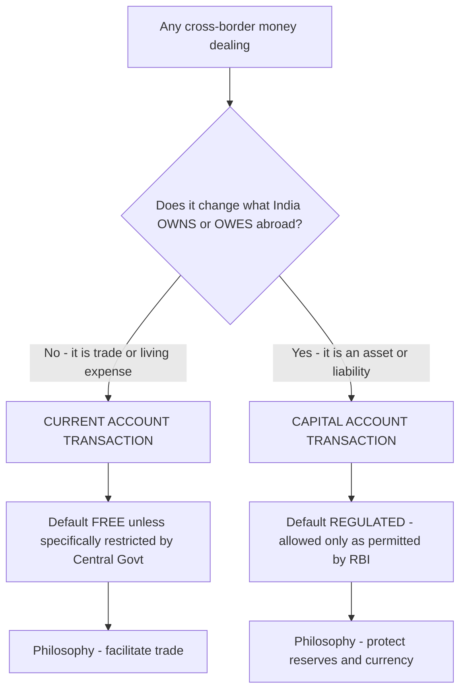
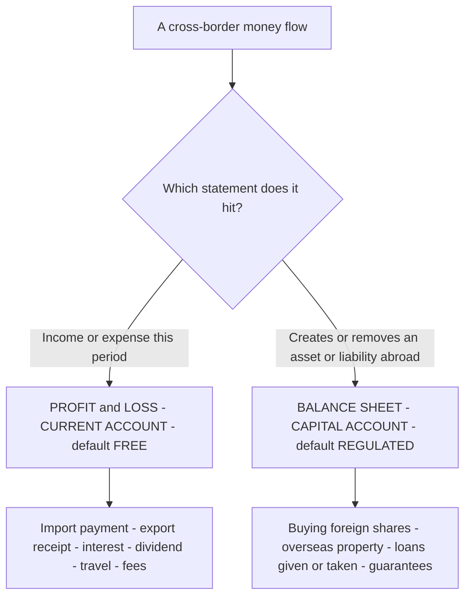
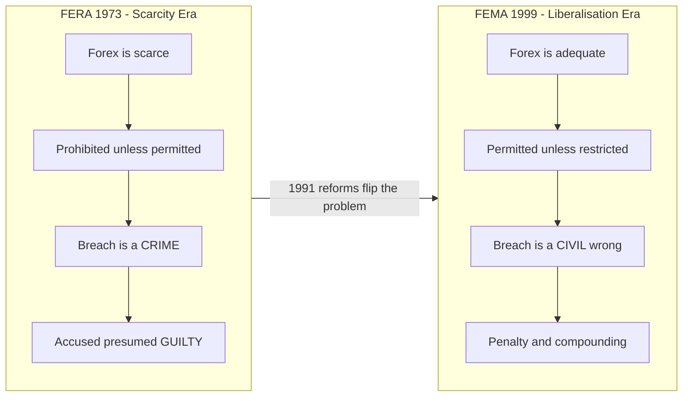
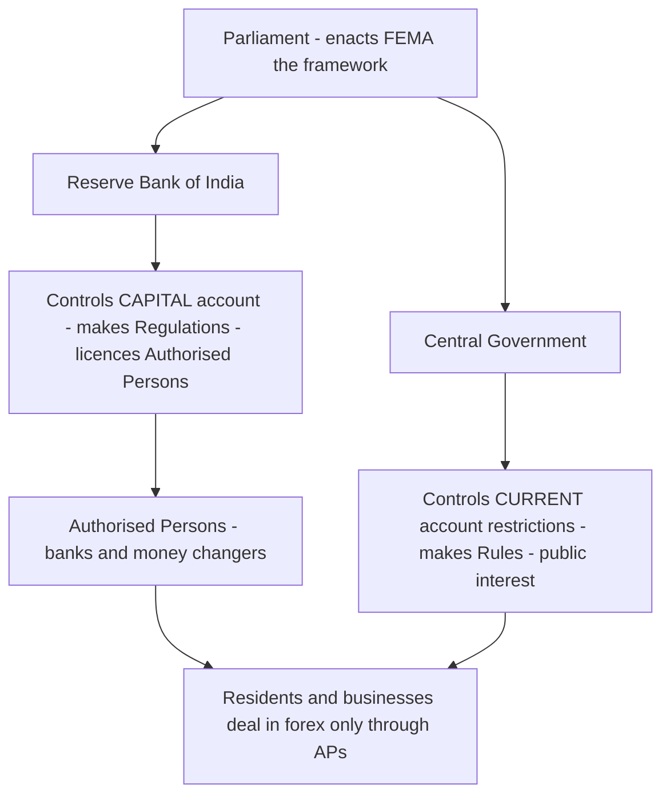
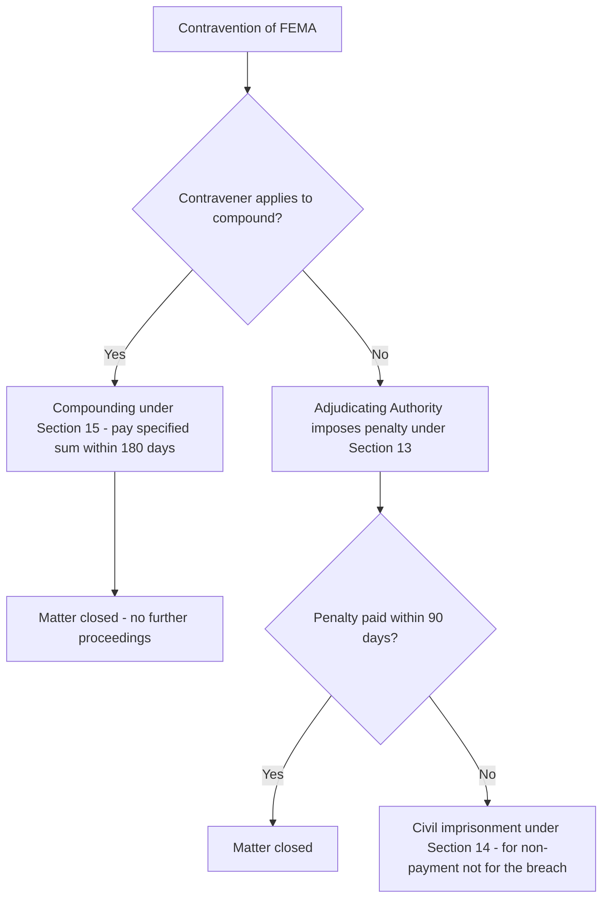
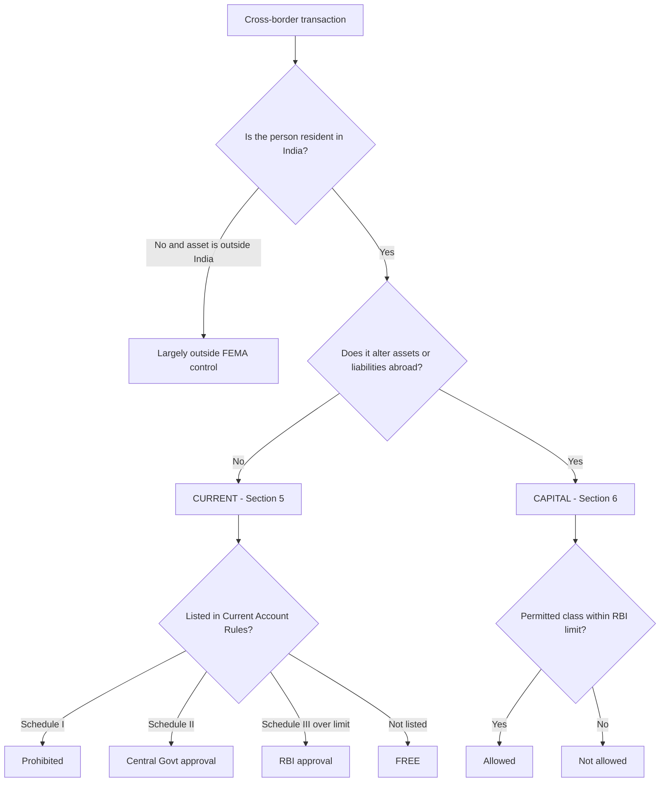
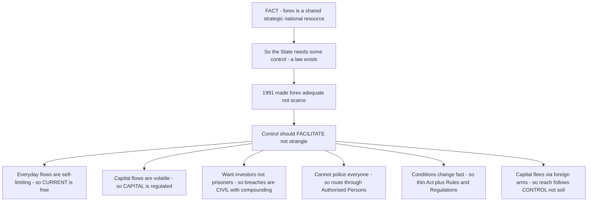

<!-- v2-deep -->

# Chapter 14 — Foreign Exchange Management Act, 1999 (Basics)

## 1. The Problem

Imagine you run the treasury of a poor country. You have almost no US dollars, pounds or yen in your vault — and yet almost everything your economy needs from abroad (crude oil, machinery, medicines, defence equipment) can only be bought with those foreign currencies. Foreign exchange, to you, is not just "money" — it is a **scarce, strategic national resource**, like water in a desert.

Now ask the natural question: what happens if you let every citizen, business and trader freely buy, hoard, send abroad or speculate in foreign currency? Three disasters follow:

1. **The reserves drain.** If everyone can freely convert rupees into dollars and send them out, the little foreign currency you have vanishes. Then you cannot pay for the oil that keeps the economy running. This is a **balance of payments crisis** — precisely what India faced in **1990–91**, when reserves fell to barely two to three weeks of imports.
2. **The currency collapses.** If people can freely sell rupees to buy dollars, the rupee's value crashes, imports become ruinously expensive, and inflation explodes.
3. **Money escapes control.** Wealth quietly leaves the country ("capital flight"), tax is evaded through fake invoices, and the government loses its grip on the economy.

So a scarce-forex nation builds a wall around foreign exchange. India's first wall was the **Foreign Exchange Regulation Act, 1973 (FERA)**. Its philosophy was blunt: *foreign exchange is so scarce that every dealing in it is presumed suspicious and prohibited unless the government specifically permits it.* Breaking the rules was a **crime**. You could be arrested. The burden was on **you** to prove your innocence.

That wall made sense in a starving-for-forex economy. But by the 1990s the problem had **flipped**. After the 1991 liberalisation, India opened up, foreign investment poured in, exports grew, and reserves became comfortable. Now the old wall was strangling the very growth it was meant to protect. A businessman importing a machine had to beg for permission; a criminal-law regime terrified honest traders and choked global trade.

**The new problem was therefore the opposite of the old one:** how do you *manage* a now-adequate stock of foreign exchange to keep the currency stable and promote orderly trade — without treating every honest importer and exporter as a smuggler? FERA could not do this. It was built for scarcity and suspicion. India needed a law built for **abundance and facilitation**. That law is the **Foreign Exchange Management Act, 1999 (FEMA)** — note the word: *Management*, not *Regulation*.

**Dig one level deeper — why not simply *amend* FERA?** Because FERA's DNA was prohibition. Its every section began from "thou shalt not." You cannot bolt a facilitative spirit onto a prohibitive skeleton; the courts would still read each provision restrictively. A liberalising nation needed the *default* itself inverted — and a default lives in the architecture of an Act, not in its amendments. That is why FERA was **repealed** and FEMA **freshly enacted**, not patched. The lesson the examiner tests: FEMA is a *replacement*, born of a *changed economic problem*, not a mere update.

**A second subtlety — why keep any wall at all, if forex is now adequate?** Because "adequate" is not "infinite," and capital flows are fickle. Reserves that look comfortable can evaporate in a currency panic (as several emerging markets learned in 1997–98). So FEMA does not tear the wall down; it converts it from a **prison wall** (FERA: keep everything in) into a **traffic-management system** (FEMA: let trade flow, meter the dangerous capital flows, watch the gates). The wall becomes a *valve*, not a *dam*.

> **Memory hook:** FERA = **F**ear + **R**estriction (control, criminal). FEMA = **M**anagement + **F**acilitation (civil, orderly). The single letter change (R → M) is the entire philosophy change.

---

## 2. The Core Idea

FEMA rests on one elegant shift in default assumptions.

**FERA's default:** *Everything in forex is prohibited unless permitted.* (Guilty until proven innocent.)

**FEMA's default:** *Everything in forex is permitted unless restricted* — **BUT** with one crucial split. FEMA divides all cross-border money dealings into two boxes:

- **Current account transactions** (the money for day-to-day living and trade — importing goods, paying for a foreign trip, sending money to a child studying abroad). Default here = **FREE**. These are the *income statement* of the nation.
- **Capital account transactions** (money that changes what you *own or owe* abroad — buying foreign shares, foreign property, giving/taking cross-border loans). Default here = **REGULATED** by the RBI. These are the *balance sheet* of the nation.

Why this split? Because current-account outflows are self-limiting and productive — you can only import so much oil, take so many holidays. But **capital flows are volatile and dangerous**: hot money can flood in and rush out overnight, and free capital flight can empty the reserves in days. So FEMA says: *let the living and trading money flow freely; keep a hand on the ownership-and-debt money.*

And because the goal is now **management, not punishment**, breaking FEMA is a **civil wrong** — you pay a **penalty**, you can **compound** (settle) the matter — not a **crime** you get jailed for.

**The accountant's lens (make this your permanent mental model).** Every transaction a nation has with the outside world lands in one of two financial statements:

- If it belongs on the nation's **Profit & Loss / income statement** — you *earned* it, *spent* it, or it flowed through as *income or expense this period* — it is **current account**. Nothing on your balance sheet changed; you are simply richer or poorer by that flow.
- If it belongs on the nation's **Balance Sheet** — it created, transferred or extinguished an *asset* or a *liability* that straddles the border — it is **capital account**. You now *own* something abroad, or *owe* something abroad, that you did not before.

This single test — "P&L or Balance Sheet?" — resolves 90% of classification questions faster than any statutory list. A CA student already thinks in these terms; use that edge.

> **One-line essence:** *FEMA keeps forex orderly by freeing everyday trade money, regulating cross-border ownership money, and treating breaches as civil settlements rather than crimes.*

*Figure 14.1 — The two-box philosophy of FEMA: current account flows freely, capital account is regulated.*

*Figure 14.1A — The same split seen through a CA's eyes: which financial statement does the flow belong to.*

---

## 3. Why It's Built This Way

Before drilling into provisions, understand the four design decisions that shape every section of FEMA. If you understand *why* these choices were made, you never have to memorise the sections — you can reconstruct them.

**Design choice 1 — Management, not regulation.** The 1991 reforms meant forex was no longer desperately scarce. A control regime (FERA) was now a cost, not a protection. So FEMA's stated purpose (its Preamble) is *"facilitating external trade and payments and promoting the orderly development and maintenance of the foreign exchange market in India."* Every ambiguity in FEMA is resolved in favour of **facilitation**, not restriction — the opposite of how FERA was read.

**Design choice 2 — Civil, not criminal.** Under FERA, an accused was presumed guilty and could be **arrested**; the burden lay on him. This terrified legitimate business. FEMA converts contraventions into **civil offences** attracting **monetary penalties**, removes the presumption of guilt, and — critically — allows **compounding** (voluntary settlement by paying a sum). Jail (civil imprisonment) appears only as a last resort if you refuse to pay the penalty. The logic: an economy that wants to *attract* foreign capital cannot jail investors for paperwork errors.

**Design choice 3 — A clean division of labour.** Parliament sets the frame (the Act). The **Central Government**, being politically accountable for trade policy, controls the **current account** side (it can restrict trade payments in public interest). The **RBI**, the monetary and reserves guardian, controls the **capital account** side (it regulates flows that affect reserves and the currency). Day-to-day dealings happen only through licensed intermediaries — **Authorised Persons** (mainly banks) — so the system is monitored without the government micromanaging every transaction.

**Design choice 4 — A rule-book that can breathe.** Forex conditions change fast. So FEMA is a thin **framework Act**; the operational detail lives in **Rules** (made by the Central Government) and **Regulations** (made by the RBI), which can be amended quickly without reopening Parliament. This is why exam answers must say "as prescribed / as per Rules / as per Regulations" — the numbers live outside the Act itself.

**Design choice 5 — Territoriality by *control*, not just geography.** Most Acts stop at the national border. FEMA deliberately reaches **branches, offices and agencies outside India that are owned or controlled by a person resident in India** (Section 1(3) read with Section 2(v)(iv)). *Why?* Because capital flight's favourite trick is to route money through a foreign arm of an Indian entity — if FEMA stopped at the coastline, an Indian company could park earnings in its Dubai branch and the reserves would leak. By following *control* rather than *soil*, FEMA closes that escape hatch. The concept the examiner rewards: FEMA is **extra-territorial through the control principle**.

**Design choice 6 — Regulate the *transaction*, watch the *person*.** FEMA's twin levers are (i) the residential status of the *person* (which decides *whether* FEMA bites) and (ii) the character of the *transaction* — current or capital (which decides *how* it bites). Almost every problem in the exam is solved by asking these two questions in order: *Who is the person?* then *What is the transaction?* Keep them separate; students who blur them lose marks.

*Figure 14.2 — FERA to FEMA: the philosophy flip.*

**A compact FERA-vs-FEMA contrast table (a perennial 4–5 mark question).**

| Dimension | FERA, 1973 | FEMA, 1999 |
|---|---|---|
| **Underlying economics** | Forex scarce | Forex adequate |
| **Object** | Conserve and regulate forex | Facilitate trade; orderly forex market |
| **Default rule** | Prohibited unless permitted | Permitted unless restricted |
| **Nature of breach** | Criminal offence | Civil contravention |
| **Presumption** | Accused presumed guilty | Presumption of innocence |
| **Arrest / imprisonment** | Yes, for the offence | Only civil imprisonment for non-payment of penalty |
| **Settlement** | Not on the same footing | Compounding available (Section 15) |
| **Number of sections** | 81 sections | 49 sections *(leaner framework Act)* |
| **Definition of "resident"** | Tied more to citizenship-type notions | Based on residence, not citizenship |
| **Governing spirit** | Control | Management |

---

## 4. Full Technical Content (rules and provisions, each with its "why")

FEMA has **49 sections** across 7 chapters, extends to the **whole of India** (and to all branches, offices and agencies **outside India owned or controlled by a person resident in India**), and came into force on **1 June 2000**. Below is the exam-required content, each provision paired with its reason.

### 4.1 The Preamble and Objectives (the "why" baked into the Act)

The Preamble states the Act consolidates and amends the law relating to foreign exchange **with the objective of**:
- **facilitating external trade and payments**, and
- **promoting the orderly development and maintenance of the foreign exchange market in India.**

*Why it matters:* When two interpretations of a FEMA provision are possible, courts and the RBI lean towards the one that *facilitates* trade — because the Preamble commands it. Contrast FERA, whose object was to *conserve* and *regulate*. Two verbs — "facilitate" vs "conserve" — capture the entire generational shift.

*Sharper still — the Preamble is a legal tool, not decoration.* In the Interpretation-of-Statutes chapter you learn that a Preamble is a **key to the mind of the legislature** and an admissible aid where a provision is ambiguous. FEMA is the textbook example: because the Preamble says "facilitating," a genuinely doubtful provision is read the *permissive* way. So when the examiner asks "how does one resolve an ambiguity in FEMA?", the answer is *purposively, in favour of facilitation, guided by the Preamble* — a cross-chapter link worth flagging in your answer.

### 4.2 Key Definitions (Section 2) — and why each is drawn the way it is

These definitions are the most heavily examined part of the chapter. Learn the *logic* of each boundary.

#### (a) Person Resident in India — Section 2(v)

*Why residence matters:* FEMA applies its restrictions based on **residential status**, not citizenship. A resident's global forex dealings are within FEMA's reach; a non-resident is largely outside it. So *who is a resident* decides *who FEMA can control*. Citizenship is irrelevant — a foreign national living and working in India can be a resident; an Indian citizen settled abroad is a non-resident.

**The test has two limbs — a day-count limb and a purpose limb.**

A **"person resident in India"** means:

**(i)** A person **residing in India for more than 182 days during the preceding financial year** — BUT this does **not** include:
- a person who has gone out of / stays outside India for **employment** outside India, or
- for carrying on a **business or vocation** outside India, or
- for any other purpose indicating an **intention to stay outside India** for an uncertain period;

AND it does **not** include a person who has **come to / stays in India** *otherwise than* for:
- taking up **employment** in India, or
- carrying on **business or vocation** in India, or
- any other purpose indicating an **intention to stay in India** for an uncertain period.

*Translate the logic:* The 182-day count is only the **starting gate**. The **purpose/intention** test then overrides it. If you *leave* India for employment/business/settling abroad, you become a **non-resident immediately** — even if you were here 300 days last year. If you *come* to India for employment/business/settling, you become a **resident immediately**. Purpose beats the calendar.

**Read the double-negative carefully — the drafting trap.** Limb (i) tells you *who is a resident*, then strips out those who *left* for a settling-abroad purpose. The second half tells you a returning person is a resident *only if* he came to India **for** employment/business/settling — i.e., a person who comes to India for some *temporary* purpose (a holiday, a short medical visit, a six-week project) is **not** a resident even if he ends up staying a while, because his *intention* is not to settle. The statutory phrasing is deliberately in the negative ("does not include… otherwise than for…"). Convert it in your head to the positive: **come to settle → resident from day one; come temporarily → not resident.**

*The order of operations that never fails:*
1. Was the person in India **> 182 days in the *preceding* financial year**? If **no**, he is **not** a resident on the day-count and you usually stop (subject to a fresh-arrival purpose test below). If **yes**, go to step 2.
2. Apply the **purpose override**: has he *left* to settle abroad (employment/business/uncertain-period intention)? If yes → **non-resident** despite the day-count.
3. For a person newly *arriving* in India, ignore last year's count if he has come **to settle** (employment/business/uncertain-period intention) — he is a **resident from arrival**.

> **Trap alert:** FEMA counts days in the **preceding financial year** (April–March). This is different from the **Income-tax Act**, which counts days in the **current** previous year and uses **60/182-day** dual tests. Do not mix them.

The definition also expressly **includes**:
- **(ii)** any **person or body corporate registered or incorporated in India** (so an Indian company is always a resident);
- **(iii)** an **office, branch or agency in India** owned or controlled by a person resident **outside** India; and
- **(iv)** an **office, branch or agency outside India** owned or controlled by a person resident **in** India.

*Why (iii) and (iv):* FEMA "follows the control." A foreign company's Indian branch operates inside India's forex system, so it is treated as resident (iii). And an Indian company's foreign branch is an extension of an Indian resident, so India keeps jurisdiction over it (iv) — this is how the Act reaches "outside India."

**A finer distinction the exam loves:** the day-count/purpose test in limb (i) applies to **individuals**. Clauses (ii)–(iv) are **status-by-definition** — a company incorporated in India is a resident *automatically*, no day-count needed; a foreign company's Indian branch is a resident *by control*, again with no day-count. So never apply the 182-day test to a company; it is decided by *place of incorporation* and *control*, not by days.

**Person resident outside India — Section 2(w):** simply *"a person who is not resident in India."* (Defined by exclusion — clean and complete.) *Why by exclusion:* residence is binary in FEMA — everyone on earth is either 2(v) or 2(w), with no gap and no overlap. This mutual-exclusivity is itself examinable: there is no "partly resident" status under FEMA (unlike the "Resident but Not Ordinarily Resident" category in tax law).

#### (b) Person — Section 2(u)

"Person" is deliberately wide, so no one escapes on a technicality. It includes: an **individual**, a **HUF**, a **company**, a **firm**, an **association of persons or body of individuals** (whether incorporated or not), **every artificial juridical person**, and **any agency, office or branch** owned or controlled by such person. *Why so broad:* forex can be moved by any legal form; the net must catch them all. Note the two-step nesting: a *branch* of a person is itself a "person," which is exactly what makes the extra-territorial reach of 2(v)(iv) operate — the foreign branch is a *person*, and its *residence* is fixed by control.

#### (c) Foreign Exchange — Section 2(n) and Foreign Security — Section 2(o)

**Foreign exchange** means **foreign currency** and includes:
- **deposits, credits and balances** payable in any foreign currency;
- **drafts, travellers' cheques, letters of credit or bills of exchange** expressed or drawn in Indian currency but **payable in any foreign currency**;
- drafts, travellers' cheques, letters of credit or bills of exchange **drawn by banks/institutions/persons outside India but payable in Indian currency.**

*Why the odd inclusions:* the drafters chased the **economic substance**, not the label. An instrument in rupees but *payable abroad in dollars* is really a claim on foreign exchange, so it is caught. **Foreign security** (2(o)) similarly covers securities denominated in foreign currency, and even rupee-denominated securities where redemption/interest is payable in foreign currency.

**The unifying principle across (n) and (o) — "look at where the value is really claimed."** Both definitions refuse to be fooled by the *currency of denomination*. A rupee-denominated bill *payable in dollars* is forex; a rupee-denominated bond whose *interest is paid in dollars* is a foreign security. Conversely, a dollar-*looking* instrument that is finally payable in rupees to a domestic party may not be. The examiner's favourite tweak: give an instrument denominated in one currency but *payable* in another and ask you to classify — always follow the **currency of ultimate payment/realisation**, not the currency printed on the face.

#### (d) Currency and Current Account Transaction

**Currency — Section 2(h):** includes currency notes, coins, **postal notes, money orders, cheques, drafts, travellers' cheques, letters of credit, bills of exchange, promissory notes, credit cards** and such other similar instruments as the RBI may notify. *Why so wide:* value moves through many instruments, not just notes; RBI can add new ones (e.g., new digital instruments) by notification without amending the Act. This delegated add-power is Design Choice 4 in miniature — the Act stays evergreen because the RBI can extend "currency" to future instruments by notification.

**Current account transaction — Section 2(j):** defined as *a transaction other than a capital account transaction* and, **without limiting its generality, includes**:
- **(i)** payments due in connection with **foreign trade, other current business, services, and short-term banking and credit facilities** in the ordinary course of business;
- **(ii)** payments due as **interest on loans** and as **net income from investments**;
- **(iii)** **remittances for living expenses** of parents, spouse and children residing abroad; and
- **(iv)** **expenses in connection with foreign travel, education and medical care** of parents, spouse and children.

*Why defined "in the negative + examples":* Rather than list every possible current transaction (impossible), FEMA defines it as *"anything that is not capital account"* and then gives illustrative buckets so ordinary trade and living payments obviously qualify. **Memory hook — the four buckets are TRADE, RETURNS, FAMILY-UPKEEP, TEMS (Travel, Education, Medical care of family).**

**The residual-definition logic is itself an exam point.** Because 2(j) says "a transaction *other than* a capital account transaction," the **capital-account definition is the master key** — you decide "capital?" first; if the answer is no, it is current *by default*. The four listed buckets are only "for the avoidance of doubt" (the phrase "without limiting the generality" tells you they are illustrative, not exhaustive). So never argue "it isn't in the four buckets, therefore it isn't current" — that reverses the logic. Anything not capital is current, listed or not.

**Watch the word "short-term."** Limb (i) captures **short-term** banking and credit facilities in the ordinary course of business as *current*. A **long-term** loan is a *capital* transaction. The maturity is the switch. This is a classic split-question setup — the same "loan" word appears in both boxes depending on tenor and on whether you are looking at the principal or the interest.

#### (e) Capital Account Transaction — Section 2(e)

A transaction which **alters the assets or liabilities** (including contingent liabilities) **outside India of persons resident in India, or the assets or liabilities in India of persons resident outside India**; and includes transactions referred to in **Section 6(3)**.

*Why this definition is the heart of FEMA:* the phrase **"alters assets or liabilities"** is the litmus test. If money merely pays for a service or good consumed now → current. If money *creates, transfers or extinguishes a cross-border asset or liability* (a share you now own abroad, a loan you now owe abroad, property you bought abroad) → capital. **Assets/liabilities = balance sheet = capital; income/expense = P&L = current.**

**Do not skip the words "including contingent liabilities."** A **guarantee** creates no immediate outflow — it is only a *contingent* liability that crystallises if the principal defaults. FEMA deliberately pulls contingent liabilities into the capital-account net so that a resident cannot dodge control simply by issuing a guarantee (which is economically an off-balance-sheet cross-border exposure) instead of a loan. So a guarantee given by a resident in favour of a non-resident is a **capital account transaction** even though not a rupee has yet moved. Examiners test this with a "no money has changed hands, so surely FEMA does not apply" trap — the answer is that the *contingent liability abroad* has been altered, so it does.

**Two directions, one test.** Section 2(e) is symmetric: it covers (a) a **resident's assets/liabilities *outside* India** *and* (b) a **non-resident's assets/liabilities *in* India**. So a US citizen buying a flat in Mumbai alters "assets in India of a person resident outside India" — capital account, on the *inbound* leg — just as an Indian buying a flat in London alters "assets outside India of a resident" on the *outbound* leg. Both are capital; FEMA guards *both gates* of the wall, not just the exit.

Examples of capital account transactions (from the Regulations / illustrative list): investment in foreign securities; foreign direct investment; acquisition/transfer of immovable property abroad by a resident (or in India by a non-resident); borrowing/lending in foreign exchange; giving guarantees; export-import of currency; and deposits between residents and non-residents.

#### (f) Authorised Person — Section 2(c)

An **authorised person** means an **authorised dealer, money changer, off-shore banking unit or any other person** for the time being **authorised by the RBI under Section 10(1)** to deal in foreign exchange or foreign securities.

*Why the gatekeeper exists:* FEMA does not let residents deal in forex directly with the world. All legitimate forex must flow **through licensed intermediaries** — mostly banks (authorised dealers) and money changers. This gives the RBI a **monitoring choke-point**: it can watch, guide and regulate the whole market through a few hundred licensed entities instead of policing a billion citizens. The AP is FEMA's "eyes on the ground."

**Distinguish the sub-species (occasionally asked).** An **Authorised Dealer** (typically a bank) handles the full range of forex and trade transactions; a **money changer** deals mainly in the conversion of currency and travellers' cheques (a narrower licence); an **Off-shore Banking Unit** is a bank branch in a Special Economic Zone / IFSC dealing in foreign currency. All four sit inside the umbrella term "Authorised Person," each licensed and conditioned by the RBI under Section 10. The point for the exam: "Authorised Person" is the *genus*; authorised dealer, money changer and OBU are *species*.

### 4.3 Regulation of Transactions — the operative heart (Sections 3, 5, 6, 7)

#### Section 3 — The general prohibition (the fence)

No person shall, **except with the general or special permission of the RBI or an authorised person**:
- (a) deal in or transfer any foreign exchange/foreign security to any person not an authorised person;
- (b) make any payment to or for the credit of any person resident outside India in any manner;
- (c) receive any payment by order or on behalf of any person resident outside India in any manner (this catches **hawala** — receiving rupees here against a promise to pay someone abroad, with no forex actually crossing the border);
- (d) enter into any financial transaction as consideration for or in association with acquisition or creation of a right to an asset outside India.

*Why Section 3 exists:* it is the **outer fence** ensuring all forex dealing is routed through the authorised channel. Everything else (Sections 5–7) is a controlled gate in this fence.

**Read clauses (b) and (c) together — they are the anti-hawala pincer.** Clause (b) blocks *paying* a non-resident "in any manner"; clause (c) blocks *receiving* a payment "by order or on behalf of" a non-resident. Hawala works precisely by splitting a cross-border transfer into two *domestic-looking* legs (rupees paid to someone here; dollars paid to someone there) so that no forex ever crosses the border. FEMA defeats it by catching **each leg independently** — the phrase **"in any manner"** is the killer, because it refuses to care about the mechanism. This is the statutory embodiment of the "substance over form" principle. Note the exception built into the opening words — with **RBI or AP permission**, these acts are lawful; Section 3 prohibits only the *unauthorised* channel, not the *act* of paying a non-resident as such.

#### Section 5 — Current account transactions (the free gate)

*"Any person may sell or draw foreign exchange to or from an authorised person if such sale or drawal is a current account transaction."* **Provided** the **Central Government** may, in **public interest** and in **consultation with the RBI**, impose **reasonable restrictions** on current account transactions.

*The logic (crucial):* The default is **FREEDOM** — a resident can freely buy forex for a current transaction. But the freedom is **not absolute**; the Central Government (the trade-policy authority) can carve out restrictions for public interest. These restrictions live in the **Foreign Exchange Management (Current Account Transactions) Rules, 2000**, which sort current transactions into three lists:

| Schedule | Nature | Example (confirm exact list in ICAI / bare Rules) |
|---|---|---|
| **Schedule I** | **Prohibited** entirely | Remittance out of lottery winnings; income from racing/riding; purchase of a lottery ticket; remittance of dividend where dividend-balancing applies |
| **Schedule II** | Allowed only with **prior Central Government approval** | Remittances for certain cultural tours; multi-modal transport operators' remittances to agents abroad; certain advertising in foreign print media by State Governments/PSUs |
| **Schedule III** | Allowed with **RBI approval** only above a **monetary limit** (below the limit = free) | Private/business travel, gifts, donations, studies abroad, medical treatment, maintenance of relatives etc. — governed by the **Liberalised Remittance Scheme (LRS)** |

*Why three lists, not a blanket "free":* even everyday spending needs a few guardrails — you cannot let forex bleed out on lotteries (Schedule I), some things need government sign-off (Schedule II), and large personal remittances need a ceiling so the aggregate outflow stays orderly (Schedule III). Under **LRS**, a resident individual may remit up to **USD 2,50,000 per financial year** for permitted current (and certain capital) account transactions *(confirm the current cap in ICAI material / RBI Master Direction — it has changed over time)*.

**The grammar of the three schedules (memory device).** Read them as a rising staircase of control on an *otherwise-free* base:
- **Schedule I — a red light.** No approval will help; the transaction is outlawed as a class (e.g., remitting lottery winnings). *Why prohibited, not merely capped:* these outflows are pure leakage with no productive return.
- **Schedule II — a government checkpoint.** Permitted, but only after the **Central Government** signs off (policy-sensitive items).
- **Schedule III — a metered gate.** Free **below** a threshold; **RBI** approval **above** it. The LRS ceiling lives here.
- **Everything not in any Schedule — open road.** Free, because default-free is the base rule of Section 5.

So the answer sequence for any current transaction is: *Schedule I? → Schedule II? → Schedule III over the limit? → else FREE.*

**A subtle but examinable point — LRS straddles both boxes.** The Liberalised Remittance Scheme is normally taught under current-account Schedule III, but the *same* USD 2,50,000 annual envelope also covers **certain permissible capital-account** remittances by a resident individual (e.g., acquiring shares or property abroad within the cap). So LRS is the one place where the current/capital wall has a *shared door*. If an examiner asks "can a resident individual buy foreign shares under LRS?", the answer is yes — within the LRS cap — even though buying shares is *capital* account. Flag the exact permissible capital uses against current ICAI material.

#### Section 6 — Capital account transactions (the regulated gate)

- **6(1):** Any person may sell or draw foreign exchange for a capital account transaction **only to the extent permitted.**
- **6(2):** The **RBI** may, in consultation with the Central Government, **specify the permissible classes** of capital account transactions and the **limits** up to which forex is admissible. *(Post the 2015 amendment, the power over debt instruments/capital flows is shared between the Central Government and RBI — the Central Government prescribes rules for capital account transactions involving **debt instruments**, while RBI regulates **non-debt instruments** and the rest. Confirm the exact split in current ICAI material.)*
- **6(3)** *(originally)* listed classes of capital account transactions RBI may regulate: transfer/issue of foreign securities by residents; transfer/issue of Indian securities by non-residents; borrowing/lending in forex and in rupees between residents and non-residents; deposits; export/import of currency; transfer of immovable property outside India by residents and in India by non-residents; guarantees, etc. *(Section 6(3) was **omitted by the Finance Act, 2015**, shifting this listing into rules/regulations — note this if the exam asks about amendments.)*
- **6(4):** A resident may **hold, own, transfer or invest** in foreign currency, foreign security or immovable property outside India **if** it was **acquired/held when he was a non-resident** or **inherited** from a person who was a non-resident. *(Protects legitimately-earned foreign assets.)*
- **6(5):** A non-resident may **hold, own, transfer or invest** in Indian assets if acquired when he was a resident or inherited from a resident.

*Why capital account is only "to the extent permitted":* because volatile capital flows are the real threat to reserves and currency stability (recall the 1991 crisis and later emerging-market crises where hot money fled overnight). The RBI keeps this gate on a **positive-permission** basis — you may do it only if a class/limit permits it — which is the mirror image of the current-account "free unless restricted" rule.

**Grasp the exact mirror-image relationship (a 2-mark distinction that is really the whole chapter):**

| | **Current account (Section 5)** | **Capital account (Section 6)** |
|---|---|---|
| Default | **Free** | **Not permitted** |
| Rule structure | *Free unless restricted* | *Restricted unless permitted* |
| Who controls | **Central Government** | **RBI** (with debt/non-debt split post-2015) |
| Test to apply | Is it in a *prohibition/restriction*? | Is it in a *permitted class within the limit*? |

Getting this table backwards — saying capital is "free unless restricted" — is one of the most common ways students throw away marks.

**Why 6(4) and 6(5) exist — the fairness valves.** Suppose an Indian professional works in the US for ten years (a non-resident), lawfully buys a house and shares there, then returns to India and becomes a resident. Must he now liquidate everything because a resident's foreign assets are "regulated"? That would be confiscatory and absurd. Section **6(4)** says no — assets *legitimately acquired while he was a non-resident* (or *inherited* from a non-resident) may be **freely held, transferred and invested**. Section **6(5)** is the symmetric protection for a non-resident's Indian assets acquired while he was a resident (or inherited from a resident). *Principle:* FEMA regulates *fresh* cross-border asset creation, not the *legacy* of a person's lawful past status. The examiner's tweak: an NRI *inherits* foreign shares from another NRI — protected under 6(4); but if he acquires *new* foreign shares *after* becoming a resident, that fresh acquisition is regulated under 6(1)/6(2).

#### Section 7 — Export of goods and services

Exporters must **declare** to the RBI the **full export value** (or, if not ascertainable, the value expected to be received) and furnish other particulars, and must take **reasonable steps to realise and repatriate** the proceeds.

*Why:* an exporter earns foreign exchange that belongs, in effect, to the national reserve pool. If exporters could leave earnings parked abroad, it would be capital flight through the back door. So the law compels **declaration + realisation + repatriation** of export proceeds.

**Note the anti-under-invoicing design.** The exporter must declare the **full export value**, and where it is not ascertainable, **the value expected to be received in an open-market arm's-length sale**. *Why the second limb?* To stop the oldest trick in trade: **under-invoicing** exports (declaring a low value, pocketing the difference abroad). By fixing the benchmark at the *true* market value, Section 7 makes the declared figure the floor of what must be repatriated — closing the leak. Section 7 is, in essence, capital-flight control disguised as an export-documentation rule.

### 4.4 Realisation, repatriation and the "no-holding" rule (Sections 8–9)

- **Section 8 — Realisation and repatriation:** where any amount of foreign exchange is **due or has accrued** to a resident, he must take **reasonable steps to realise and repatriate** it to India, as prescribed. *Why:* forex owed to India must actually come to India.
- **Section 9 — Exemptions:** carves out sensible exceptions — e.g., possession of foreign currency/coins up to limits, foreign currency accounts held as permitted, foreign exchange acquired before a threshold date, forex received as gift/inheritance held under 6(4), forex from employment/business/services rendered while abroad, etc. *Why:* the Act should not criminalise a traveller holding leftover holiday currency; it targets systemic leakage, not ordinary life.

**Understand the "reasonable steps" standard — FEMA imposes an obligation of *effort*, not of *result*.** Sections 7 and 8 do not say the exporter/resident *guarantees* the money comes home; they say he must take **reasonable steps** to realise and repatriate. *Why the softer standard?* Because a genuine bad debt abroad (a foreign buyer goes bankrupt) is a commercial misfortune, not a forex crime. So if the resident has *diligently pursued* realisation (invoices, reminders, legal action, RBI write-off permission where allowed), he has complied even if the money never arrives. The examiner tests this by giving a debtor who defaulted despite the exporter's chasing — no contravention, provided reasonable steps were taken. Contrast: a resident who simply *chose* to leave earnings parked abroad has taken *no* steps — that *is* a contravention.

**Section 9 protects ordinary life — the "de-minimis and legacy" carve-outs.** The unifying theme: FEMA is aimed at *systemic leakage*, so it exempts (i) *small holdings* (leftover travel currency within notified limits), (ii) *legally-earned legacy* forex (assets under 6(4), gifts/inheritance, earnings from services rendered while abroad), and (iii) *permitted accounts* (e.g., holding a foreign-currency account as the RBI allows). The point for the exam: Section 9 is the **safety-valve** that keeps FEMA proportionate — quote it whenever a fact pattern involves a traveller's small change or an NRI's lawfully-earned foreign salary.

### 4.5 Role and Powers of the RBI (Sections 10, 11, and Chapter III)

The RBI is the **operational regulator** of the entire forex market. Its key powers:

- **Section 10 — Authorised Persons:** RBI **authorises** persons to deal in forex (grants the licence), can **impose conditions**, and can **revoke** the authorisation in public interest or for breach (after a hearing). Authorised persons must **comply with RBI directions** and **not engage in transactions** not permitted; before undertaking a transaction, an AP must require a **declaration** and information from the customer to satisfy itself the transaction is not designed to contravene FEMA. If the AP has reason to believe a contravention is intended, it must **refuse** and **report** to the RBI.
- **Section 11 — RBI's power to give directions to Authorised Persons:** RBI can direct APs, inspect them, and impose penalties (up to prescribed limits) for non-compliance. *Why via APs:* controlling a few hundred licensed dealers controls the market.
- **Making Regulations (Section 47):** RBI frames the operational **Regulations** (capital account, borrowing/lending, immovable property abroad, etc.).

*Why the RBI, specifically:* the RBI holds the reserves, sets monetary policy, and manages the exchange rate. Forex management is inseparable from these functions, so the natural custodian is the central bank — Parliament merely sets the frame; the RBI runs the market.

**The AP is deputised as a private-sector compliance officer — this is the genius of Section 10.** Notice what the Act does: instead of stationing a government official at every bank counter, it *makes the bank itself* responsible for policing the transaction. The AP must (a) demand a **declaration** from the customer, (b) **satisfy itself** the transaction is bona fide, and (c) **refuse and report** if it smells a contravention. In effect FEMA converts hundreds of banks into an outsourced first line of enforcement — cheap, ubiquitous and close to the transaction. This "gatekeeper does the screening" model is why the whole billion-person market can be watched through a few hundred licensees. Examinable phrasing: the AP has a **positive due-diligence duty**, not merely a passive one.

**Distinguish the three RBI hats.** (i) *Licensor* under Section 10 — grants, conditions and revokes AP authorisations. (ii) *Director* under Section 11 — issues directions, inspects, and penalises APs for non-compliance. (iii) *Rule-maker* under Section 47 — frames the capital-account and allied **Regulations**. Students often merge Sections 10 and 11; keep them apart — 10 is about the *licence relationship*, 11 is about *ongoing command and inspection* of the licensee.

*Figure 14.3 — Who decides what under FEMA.*

### 4.6 Contravention and Penalties — the civil regime (Sections 13–15)

This is where FEMA's "civil not criminal" philosophy becomes concrete.

- **Section 13 — Penalties:** on contravention of any provision, rule, regulation, direction or condition, a person is liable to a **penalty up to thrice the sum involved** where the amount is **quantifiable**, or **up to ₹2,00,000** where it is **not quantifiable**. If the contravention is **continuing**, a **further penalty up to ₹5,000 per day** during continuance. *(Newer sub-sections (13(1A) onwards, inserted in 2015) deal specifically with acquiring foreign exchange/foreign security/immovable property abroad **exceeding the prescribed threshold** — higher penalties, possible confiscation, and imprisonment for wilful cases. Confirm the exact figures in current ICAI/bare Act.)*
- **Adjudicating Authority (Section 16):** an officer of the Central Government adjudicates and imposes the penalty after a hearing. Note the language — **"adjudicate," not "prosecute"** — the tell-tale sign of a civil regime.
- **Section 14 — Enforcement of the penalty:** if a person **fails to pay** the penalty within **90 days**, he is liable to **civil imprisonment**. *Read this carefully:* imprisonment is **not** the punishment for the forex breach itself — it is the consequence of **refusing to pay a civil debt** (the penalty), exactly like defaulting on a court-ordered payment. FERA jailed you for the *offence*; FEMA can detain you only for *non-payment of the penalty*.
- **Section 15 — Compounding of contraventions (the master idea):** any contravention under Section 13 **may be compounded** — i.e., **voluntarily settled** — by the contravener **paying a specified sum**, on an application to the RBI (or the Directorate of Enforcement). Compounding must be completed **within 180 days** of receiving the application. Once compounded, **no further proceedings** for that contravention.

*Why compounding is the beating heart of the new regime:* it converts a potential legal battle into a quick, one-time monetary settlement. It signals FEMA's whole intent — the State wants **compliance and revenue, not incarceration**. An honest importer who missed a filing pays a compounding fee and moves on, instead of being dragged through criminal courts as under FERA.

**Read the "thrice the sum" cap as a *ceiling*, not a *fixed* penalty.** Section 13 says penalty **up to** three times the amount involved. The Adjudicating Authority has **discretion** to levy *less*, weighing the gravity, whether it was wilful, whether it was a first offence, and the amount of undue gain. A student who writes "the penalty **is** three times the sum" is wrong — it is a **maximum**. The same "up to" logic applies to the ₹2,00,000 figure (for un-quantifiable contraventions) and the ₹5,000/day continuing penalty.

**Section 14's imprisonment scales with the penalty — the graded ladder.** Under the enforcement mechanics, the *duration* of civil imprisonment is tied to the size of the unpaid penalty (larger unpaid sums can attract longer detention, with the classic split around whether the amount exceeds ₹1 crore — *verify the exact slab in current ICAI material / bare Act*). But the conceptual point dominates the numbers: **you are detained for defying a monetary order, not for the forex breach.** The moment you pay, the basis for detention disappears — which is impossible under a truly *criminal* regime, where paying up does not erase the offence.

**Compounding is a *right to apply*, not a *right to settle*.** The contravener may **apply**; whether it is compounded, and on what sum, rests with the **compounding authority** (RBI / Directorate of Enforcement), which must dispose of the application within **180 days**. Certain **serious contraventions** (e.g., those involving money-laundering, national-security concerns, or where investigation by another agency is ongoing) may be **refused** compounding. So the correct exam statement is: *"a contravention may be compounded on application, at the discretion of the authority, within 180 days"* — not "the contravener can always settle."

*Figure 14.4 — The civil enforcement path of FEMA.*

### 4.7 The appeal ladder and the Directorate of Enforcement

- **Directorate of Enforcement (ED):** investigates and can adjudicate contraventions; the **Director/officers** have powers of investigation.
- **Appeals:** from the Adjudicating Authority → to the **Special Director (Appeals)** and/or the **Appellate Tribunal**; a further appeal on a **question of law** lies to the **High Court** within 60 days. *Why an appeal ladder:* civil due process demands review; a person penalised must have a route to challenge the order.

**Trace the ladder rung by rung (a favourite short-note).**
1. **Adjudicating Authority** (Section 16) — the first-instance forum that imposes the penalty after a hearing.
2. **Special Director (Appeals)** — hears appeals against orders of *junior* adjudicating officers.
3. **Appellate Tribunal** — the principal appellate body against adjudication orders (post-2016 restructuring, the functions are exercised through the Appellate Tribunal framework; *verify the exact nomenclature and any merger of tribunals in current ICAI material*).
4. **High Court** — a final appeal, **only on a question of law**, within **60 days** of the Tribunal's order (extendable by a further 60 days for sufficient cause).

**Two things the examiner probes here:**
- The **High Court appeal is confined to a *question of law*** — you cannot re-agitate the *facts* there. This mirrors the general appellate principle that final courts settle law, not fact.
- The **Appellate Tribunal / appellate authority may require pre-deposit** of the penalty (or dispense with it for hardship) before hearing the appeal — a civil-litigation feature (*verify current wording*). It underscores that the penalty is a *civil debt*.

Also distinguish the **Directorate of Enforcement (ED)** — the *investigating and adjudicating arm* — from the **Adjudicating Authority** and the appellate forums, which *decide and review*. The ED both administers **FEMA** (civil) and **PMLA** (criminal); the overlap is deliberate, because forex leakage and money-laundering are often the same money seen from two angles.

---

## 5. Applied Scenarios (exam-style)

**Scenario 1 — Residential status (purpose beats day-count).**
*Mr. A, an Indian citizen, left India on 1 August 2023 to take up permanent employment in Dubai. During FY 2022–23 he was physically in India for 320 days. In September 2023 he wishes to open a bank account. Is he a person resident in India under FEMA?*

**Answer:** No. Although the 182-day count for the preceding financial year is satisfied (320 days), Section 2(v) **excludes** a person who has gone out of India for **employment outside India**. The **purpose test overrides the day-count**. From the moment he leaves for employment abroad, he becomes a **person resident outside India**. *Contrast:* under the Income-tax Act the answer could differ — do not conflate the two laws.

**Scenario 2 — Current vs capital classification.**
*Classify each: (i) Mr. B remits ₹10 lakh to his son studying in the UK for tuition and living costs; (ii) Mr. C buys shares worth ₹10 lakh in a company listed in New York; (iii) an Indian company pays interest on a foreign-currency loan it took from a US bank.*

**Answer:**
(i) **Current account transaction** — Section 2(j)(iv) expressly includes expenses for **education of children abroad** (governed under LRS / Schedule III). Free up to the prescribed limit.
(ii) **Capital account transaction** — Mr. C now *owns a foreign security*; his **assets outside India are altered** (Section 2(e)). Permitted only to the extent RBI allows.
(iii) **Current account transaction** — Section 2(j)(ii) includes **interest on loans**. (The *loan* itself is capital; the *interest* is a current payment. Distinguish the principal from the servicing.)

**Scenario 3 — The nature of enforcement.**
*Mr. D contravened a FEMA provision involving ₹50 lakh. He argues he cannot be jailed because FEMA is "civil." Advise on (a) maximum penalty, (b) whether he can settle, (c) whether imprisonment is possible.*

**Answer:**
(a) Under **Section 13**, since the amount (₹50 lakh) is **quantifiable**, penalty may extend to **thrice** the sum = **up to ₹1.5 crore** (plus ₹5,000/day if continuing). *Note "up to" — the Adjudicating Authority may levy less.*
(b) Yes — under **Section 15** he may **apply to compound** (settle) the contravention by applying to the RBI/ED and paying a specified sum, to be disposed of within 180 days. (Compounding is at the authority's discretion, not automatic.)
(c) Imprisonment is **not** a punishment for the contravention itself, but under **Section 14**, if he **fails to pay the penalty within 90 days**, he becomes liable to **civil imprisonment** — for non-payment, not for the forex breach. So his "civil" argument is only half-right.

**Scenario 4 — The hawala catch.**
*Mr. E, in India, receives ₹20 lakh in cash from a local agent, against an arrangement that his cousin in the USA will be paid an equivalent amount in dollars there. No money crosses the border. Is FEMA attracted?*

**Answer:** Yes. **Section 3(c)/3(b)** prohibits **receiving any payment by order or on behalf of a person resident outside India** without RBI/AP permission and prohibits making payment to the credit of a non-resident "in any manner." This informal value-transfer (**hawala**) is squarely hit even though no currency physically crosses the border — FEMA follows the **economic substance**, not the physical movement of notes.

**Scenario 5 — The returning NRI and Section 6(4) (legacy assets).**
*Ms. F worked in Canada for eight years as a non-resident and, while there, lawfully bought a condominium in Toronto and shares in a Canadian company. In April 2024 she returns to India permanently and becomes a resident. (a) Must she sell or repatriate the Toronto property and shares? (b) In June 2024, as a resident, she wants to buy fresh shares in a UK company — is that free?*

**Answer:**
(a) **No.** Under **Section 6(4)**, a resident may **hold, own, transfer and invest** in foreign currency, foreign security or immovable property outside India that was **acquired when she was a non-resident**. The Toronto condo and the Canadian shares were lawfully acquired while she was a non-resident, so they are **protected legacy assets** — she is not compelled to bring them home. (The rental income / dividends she now earns on them are *current* receipts.)
(b) **Not free.** The UK shares would be a **fresh acquisition made *after* she became a resident** — a **capital account transaction** under Section 2(e)/6(1), permitted **only to the extent RBI allows** (e.g., within the LRS envelope). *Reconcile:* the *legacy* is protected (6(4)); the *fresh* cross-border asset creation is regulated (6(1)). This is the exact line the examiner tests — same person, two opposite answers, split by *when* the asset was acquired.

**Scenario 6 — Interest vs principal, and short-term vs long-term (the loan splitter).**
*XYZ Ltd, an Indian company, (i) borrows USD 1 million from a foreign bank for 5 years, (ii) pays the annual interest of USD 60,000 on it, and (iii) separately takes a 30-day short-term buyer's credit to pay for imported raw material. Classify each leg.*

**Answer:**
(i) The **5-year borrowing of USD 1 million** *creates a liability outside India* → **capital account transaction** (Section 2(e); it is an external commercial borrowing, permitted only within RBI's ECB framework). 
(ii) The **annual interest of USD 60,000** is **net income servicing on a loan** → **current account transaction** (Section 2(j)(ii) — "payments due as interest on loans"). The *principal* is capital; its *servicing* is current — the classic split.
(iii) The **30-day buyer's credit** for raw material is a **short-term banking/credit facility in the ordinary course of business** → **current account transaction** (Section 2(j)(i), which expressly includes *short-term* banking and credit facilities). *Reconcile:* both (i) and (iii) are "borrowings," but tenor flips the box — long-term = capital, short-term trade credit = current. Verify against the *self-test*: does the flow sit on the balance sheet as a lasting liability (capital) or wash through as ordinary trade financing (current)?

**Scenario 7 — Inbound capital (the non-resident buying in India).**
*Mr. G, a US citizen who has never been a resident of India, buys a commercial building in Bengaluru for ₹5 crore. His Indian friend argues "FEMA only controls Indians sending money out, so this inbound purchase is outside FEMA." Is the friend right?*

**Answer:** **No.** Section 2(e) is **symmetric** — a capital account transaction includes one that alters **"the assets or liabilities *in India* of persons resident *outside* India."** Mr. G's purchase creates an *Indian asset* for a *non-resident*, so it is squarely a **capital account transaction** and is permitted **only to the extent** the RBI's acquisition-of-immovable-property regulations allow (there are restrictions on the kinds of persons and property involved — *verify current Regulations*). FEMA guards **both gates** of the wall, inbound and outbound; the friend's "only outflows" reading is wrong.

---

## 6. Procedure / Summary

**Deciding how a cross-border transaction is treated under FEMA — the working algorithm:**

1. **Identify the person's residential status** (Section 2(v)/(w)) — apply the **day-count** *then* the **purpose/intention** override. This decides whether FEMA even bites.
2. **Classify the transaction:** does it **alter cross-border assets/liabilities**? → **Capital** (Section 6, RBI-regulated, "only to the extent permitted"). If not → **Current** (Section 5, free unless restricted).
3. **For current:** check the **Current Account Rules 2000** — is it in **Schedule I** (prohibited), **Schedule II** (Central Govt approval), or **Schedule III** (RBI approval above LRS limit)? Otherwise **free**.
4. **For capital:** check whether RBI **Regulations** permit that class and within what **limit**.
5. **Route it through an Authorised Person** (Section 10) — all legitimate forex flows through licensed banks/money changers.
6. **If it is an export,** ensure **declaration + realisation + repatriation** (Sections 7–8).
7. **If a breach occurs:** it is a **civil contravention** → **penalty** under Section 13 → option to **compound** under Section 15 → **civil imprisonment** only if the penalty is unpaid (Section 14).

*Figure 14.5 — Master decision flow for any transaction under FEMA.*

**A one-line self-check to run on every answer:** *Person first, transaction second, schedule/limit third, channel fourth, enforcement last.* If your written answer follows that spine, you have almost certainly hit every mark the examiner allocated.

---

## 7. Connections

- **FERA, 1973 → FEMA, 1999:** the *same subject* re-engineered from control/criminal to management/civil. Understanding FERA's scarcity logic explains *why every FEMA default flipped*.
- **Income-tax Act, 1961 — residential status:** both use day-counts, but the **tests differ** (FEMA: 182 days in *preceding* FY + purpose override; IT Act: 182/60-day dual test in the *current* previous year, no purpose override). A favourite examiner trap — see Section 8 traps below.
- **Companies Act, 2013 — foreign companies and FDI:** cross-border investment (FDI/ODI) is a **capital account transaction** governed by FEMA Regulations, dovetailing with company-law compliance for foreign companies.
- **Prevention of Money Laundering Act (PMLA), 2002:** the **Directorate of Enforcement** administers *both* FEMA and PMLA. FEMA breaches (esp. hawala) often overlap with money-laundering investigations — but FEMA itself remains **civil**, whereas PMLA is **criminal**.
- **General Clauses Act / Interpretation of Statutes:** the **Preamble** ("facilitating trade") is a key interpretive aid — when a FEMA provision is ambiguous, it is read to *facilitate*, illustrating the "purposive interpretation" studied in the Interpretation chapter.
- **RBI Act, 1934 & FEMA:** FEMA operationalises the RBI's mandate over the exchange rate and reserves; the two are functionally intertwined.
- **Negotiable Instruments Act, 1881:** the definitions of "currency" (2(h)) and "foreign exchange" (2(n)) borrow the vocabulary of NI law — bills of exchange, promissory notes, drafts, letters of credit. Knowing what these instruments *are* (from NI law) is what lets you decide whether the one in the question is "payable in foreign currency" and hence forex.
- **Constitutional angle — reasonable restrictions:** Section 5's phrase "reasonable restrictions in public interest" echoes the Article 19 vocabulary; a current-account restriction that is *unreasonable* or not genuinely in *public interest* is vulnerable — the same proportionality idea studied in constitutional/interpretation contexts.

---

## 8. Traps and Examiner Tricks

1. **"Regulation" vs "Management".** If a question asks the *object* of FEMA, the answer is **facilitating external trade/payments and orderly forex-market development** — NOT "conservation/regulation" (that was FERA). Writing "conserve foreign exchange" as FEMA's object is a classic loss of marks.
2. **Residential status — preceding vs current year.** FEMA counts **more than 182 days in the *preceding* financial year**; do not import the Income-tax **60/182-day** rules. And remember the **purpose test overrides** the day-count — a person leaving for employment abroad is a non-resident *immediately*, regardless of 320 days spent here.
3. **Citizenship ≠ residence.** FEMA looks at **residence, not citizenship**. A foreign citizen can be a resident; an Indian citizen can be a non-resident.
4. **Interest vs principal of a loan.** The **loan** (borrowing/lending in forex) is a **capital** account transaction; the **interest** on it is a **current** account transaction (Section 2(j)(ii)). Examiners love splitting these in one question.
5. **Current = "free"? Not absolutely.** The default is free, **but** the Central Government may impose **reasonable restrictions in public interest** (Schedules I–III). Saying "all current account transactions are freely permitted" is wrong.
6. **Who controls what.** **Current account → Central Government** (restrictions in public interest, in consultation with RBI). **Capital account → RBI** (permissible classes and limits). Swapping these two is a frequent error.
7. **"FEMA is civil, so no jail — ever."** Half-true. There is no jail for the *contravention*, but **Section 14 civil imprisonment** applies for **non-payment of the penalty within 90 days**. State the nuance to get full marks.
8. **Penalty figure.** **Up to *thrice* the sum** (if quantifiable) or **up to ₹2,00,000** (if not), plus **₹5,000/day** for continuing default. Students often quote only one limb — and forget "**up to**" makes it a *ceiling*, not a fixed amount.
9. **Compounding timelines.** Compounding under Section 15 must be done **within 180 days** of the application; the penalty (if imposed) must be paid within **90 days** to avoid civil imprisonment. Two different clocks — don't swap 90 and 180.
10. **Hawala without border-crossing.** A receipt/payment "on behalf of a non-resident" is caught by **Section 3** even if no currency physically leaves India. Test of *substance*, not physical movement.
11. **Extent of the Act.** FEMA extends to the **whole of India** *and* to **branches/offices/agencies outside India owned or controlled by a resident** — it deliberately reaches beyond India's borders through the "control" concept.
12. **Amendment awareness.** **Section 6(3) was omitted (Finance Act, 2015)** and the debt/non-debt split introduced; if a question tests amendments, mention this rather than quoting the old 6(3) as current law. *Flag exact current wording against ICAI material.*
13. **Company residence needs no day-count.** The 182-day test is only for *individuals*. A company incorporated in India is a resident *automatically* (2(v)(ii)); a foreign company's Indian branch is resident *by control* (2(v)(iii)). Applying "182 days" to a company is a giveaway error.
14. **Contingent liabilities are capital too.** A **guarantee** by a resident in favour of a non-resident is a **capital** account transaction (2(e) expressly says "including contingent liabilities") even though no money moves at inception. The "no cash flowed, so no FEMA" argument is wrong.
15. **Inbound transactions are covered.** FEMA is *symmetric* — a non-resident acquiring Indian assets is a capital account transaction (assets *in India* of a person resident *outside* India). The "FEMA only controls money going out" claim is false.
16. **Compounding is not an automatic right.** The contravener may **apply**; the authority may **grant or refuse** (serious/PMLA-linked cases can be refused). Write "may apply to compound," not "can always settle."
17. **6(4)/6(5) legacy protection.** Assets lawfully acquired while the person held the *opposite* status (or inherited) are protected and need not be liquidated; only *fresh* cross-border acquisitions are regulated. Split by *timing of acquisition*.
18. **LRS is dual-natured.** The USD 2,50,000 LRS envelope covers *both* certain current and certain capital account remittances by a resident individual — the one shared door in the wall. *(Confirm the current cap and permissible uses.)*
19. **"Reasonable steps," not a guarantee (Sections 7–8).** The exporter/resident must *try* to realise and repatriate; a genuine commercial default despite diligent effort is not a contravention. Effort standard, not result standard.
20. **High Court appeal — law only.** The final FEMA appeal to the High Court lies **only on a question of law** within 60 days; facts are settled below. Don't say "appeal to HC on any ground."

---

## 9. First-Principles Recap

Strip everything away and rebuild FEMA from a single fact: **a nation's foreign exchange is a shared strategic resource, and its value/quantity affects everyone.** From that one fact, every FEMA rule is *derivable*:

- Because forex affects the whole nation → **the State must have some control** → hence a law at all.
- Because after 1991 forex was **adequate**, not scarce → control should **facilitate**, not strangle → hence **"Management," civil, permitted-unless-restricted**.
- Because **everyday trade/living flows are self-limiting and productive** → let them run **free** → hence **current account default = free (Section 5)**.
- Because **ownership/debt flows are volatile and can drain reserves overnight** → keep a hand on them → hence **capital account = regulated, only to the extent permitted (Section 6)**.
- Because you can't police a billion people → funnel forex through **licensed banks** → hence **Authorised Persons (Section 10)**.
- Because you want investors, not prisoners → make breaches **civil**, allow **compounding**, and jail only those who **refuse to pay** → hence **Sections 13–15**.
- Because forex conditions change fast → keep the Act **thin** and push detail into **Rules (Govt) and Regulations (RBI)** → hence "as prescribed."
- Because capital flees through *foreign arms* of Indian entities → follow **control, not soil** → hence the **extra-territorial reach** over branches abroad (Section 1(3), 2(v)(iv)).
- Because a person's *lawful past status* should not be punished retrospectively → protect **legacy assets** → hence **Sections 6(4) and 6(5)**.
- Because forex leakage and money-laundering are the *same money seen twice* → let **one agency (the ED)** run both FEMA and PMLA → hence the shared enforcement architecture.

If you ever forget a provision, ask: *"What would a liberalising nation do to keep forex orderly while facilitating trade?"* — and you will reconstruct FEMA.

*Figure 14.6 — The whole Act derived from one fact.*

---

## 10. Quick-Revision Sheet

| Item | Essence |
|---|---|
| **Full name / date** | Foreign Exchange Management Act, **1999**; in force **1 June 2000**; **49 sections**, 7 chapters; extends to **whole of India** + offices abroad controlled by residents |
| **Replaced** | **FERA, 1973** (control/criminal, 81 sections) → FEMA (management/civil, 49 sections), driven by **1991 liberalisation** |
| **Objective (Preamble)** | **Facilitate external trade and payments**; **orderly development/maintenance of the forex market** |
| **Person resident in India — 2(v)** | **>182 days in *preceding* FY** BUT **purpose/intention test overrides**; individuals only for day-count; includes Indian-incorporated bodies (auto) and India-branches of foreigners + abroad-branches of residents (by control); **residence not citizenship** |
| **Person resident outside India — 2(w)** | Anyone "not resident in India" — residence is **binary**, no in-between status |
| **Current account txn — 2(j)** | "Not capital"; includes **trade payments, interest/net investment income, family living expenses, foreign travel/education/medical**; note **short-term** credit is current. Default **FREE** (Section 5) |
| **Capital account txn — 2(e)** | **Alters cross-border assets/liabilities** (incl. **contingent** — guarantees); symmetric (outbound *and* inbound); default **REGULATED**, "only to the extent permitted" (Section 6) |
| **Mirror rule** | Current = *free unless restricted* (Central Govt); Capital = *restricted unless permitted* (RBI) |
| **Authorised Person — 2(c)** | Authorised dealer / money changer / OBU / other, licensed by **RBI under Section 10** — the gatekeeper with a **due-diligence duty** |
| **Section 3** | General prohibition — no forex dealing/payment to/for non-residents except via RBI/AP (**catches hawala**, "in any manner") |
| **Current account control** | **Central Government** — reasonable restrictions in **public interest**, consulting RBI; **Rules 2000**, Schedules **I (prohibited) / II (Govt approval) / III (RBI approval over LRS limit)** |
| **Capital account control** | **RBI** — specifies permissible **classes and limits**; **6(4)/6(5)** protect **legacy** assets acquired while non-resident/resident or inherited |
| **LRS** | Resident individual may remit up to **USD 2,50,000 / FY**; covers **both** certain current and capital uses *(confirm current cap)* |
| **Section 7–8** | Exporter must **declare (full value) + realise + repatriate**; residents must repatriate forex due; standard = **reasonable steps** (effort, not guarantee) |
| **Section 9** | Exemptions — small holdings, permitted FC accounts, legacy/gift/inherited forex — keeps the Act **proportionate** |
| **RBI's role** | Operational regulator — licenses APs (S.10), directs/inspects them (S.11), frames Regulations (S.47) |
| **Penalty — S.13** | **Up to** **3× sum** (if quantifiable) or **up to ₹2,00,000** (if not) + **up to ₹5,000/day** continuing — a *ceiling*, discretion to levy less |
| **Civil imprisonment — S.14** | Only if **penalty unpaid within 90 days** — for non-payment, **not** for the breach; duration scales with unpaid amount *(verify slab)* |
| **Compounding — S.15** | **Voluntary settlement** on application; authority's discretion; complete within **180 days**; then no further proceedings; serious/PMLA cases may be refused |
| **Enforcement/appeals** | **Directorate of Enforcement** (runs FEMA + PMLA) → Special Director (Appeals) / **Appellate Tribunal** → **High Court** (question of law, 60 days) |
| **One-line philosophy** | *Free the trade money, guard the ownership money, settle breaches with rupees not handcuffs.* |

> **Flag for confirmation against current ICAI Study Material / bare Act:** exact LRS cap and its permissible capital uses, current penalty figures under Section 13(1A) for foreign-asset threshold breaches, the civil-imprisonment duration slabs under Section 14, the current appellate-tribunal nomenclature/pre-deposit rule, and the precise post-2015 debt/non-debt division of powers between the Central Government and RBI. The *principles* above are stable; the *numbers/wording* are periodically updated.
