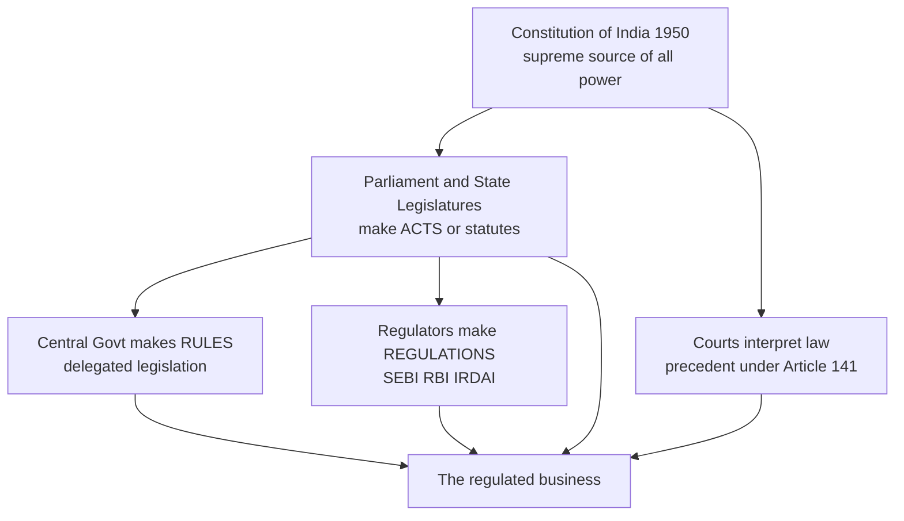
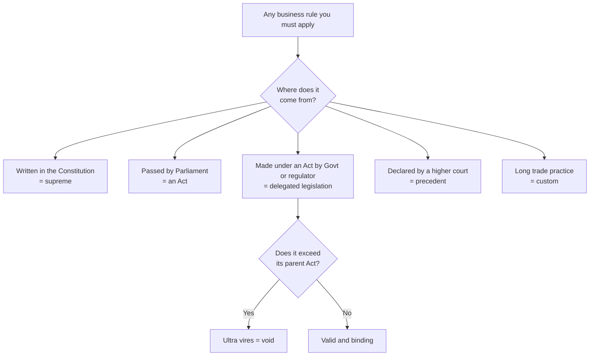
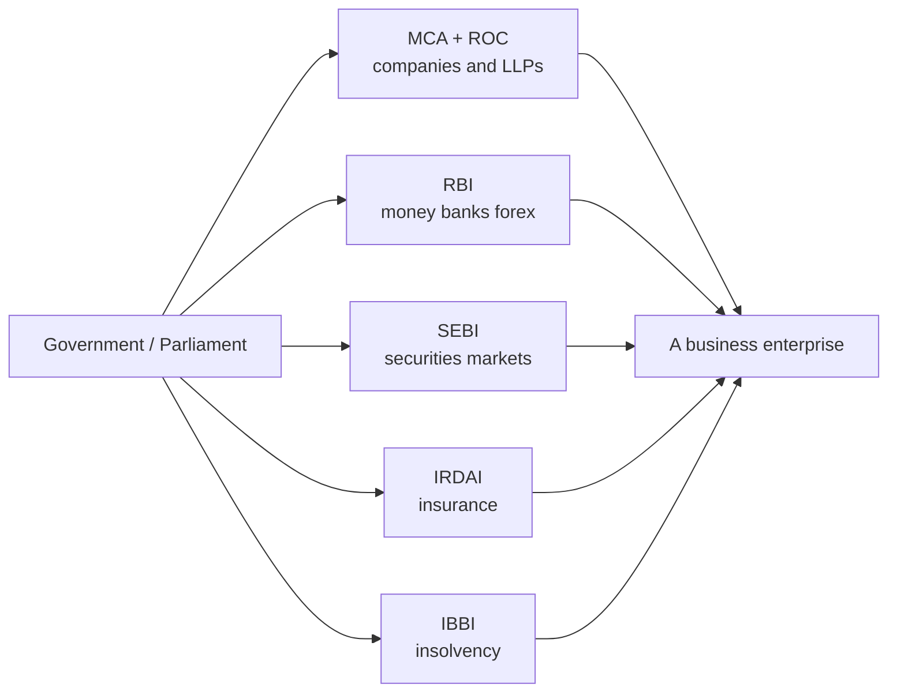
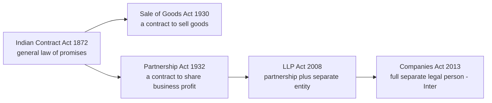

# Foundation: Indian Regulatory Framework

> *"Before you can learn any single business law, you must first learn the map of all of them — where law comes from, who makes it, who enforces it, and how one statute hands the baton to the next. A CA does not practise one law; a CA stands at the crossroads of a dozen laws at once. This chapter is that crossroads."*

---

## 1. The Problem it solves — Why a CA needs a *map* before the *territory*

Picture the very first day a newly-qualified Chartered Accountant walks into a client's office. The client is a private company that manufactures auto-parts. In the space of a single morning the CA is asked five ordinary questions:

1. *"We want to raise ₹5 crore from a bank — do we need to register anything?"*
2. *"A foreign buyer wants a 26% stake in our company — is that even allowed?"*
3. *"We're listing on the stock exchange next year — who regulates that?"*
4. *"Our factory keeps its books in Tally — is that legally acceptable for the auditor?"*
5. *"We import steel and pay in dollars — which law governs that payment?"*

Notice something. **Not one of these is a pure accounting question.** Each one is a *legal* question with an accounting consequence. And crucially, **each one is governed by a different law and a different regulator**:

- Registering the bank's charge on assets → **Companies Act, 2013**, enforced by the **MCA / Registrar of Companies (ROC)**.
- The foreign 26% stake → **FEMA, 1999** and the **FDI policy**, enforced by the **RBI**.
- The stock-exchange listing → **SEBI Act, 1992** and the **Companies Act**, enforced by **SEBI**.
- Whether Tally-based books are legal → **Companies Act, 2013 (Section 128)** read with the **Information Technology Act, 2000** for electronic records.
- The dollar payment for imports → **FEMA, 1999**, again enforced by the **RBI**.

Here is the trap that catches every fresh entrant: **you cannot answer any of these questions correctly if you do not first know which drawer to open.** A student who has memorised the Indian Contract Act in isolation, or the Companies Act in isolation, is like a doctor who has memorised the anatomy of the hand but has never seen a picture of the whole body. When a real problem walks in, they cannot even tell which specialist to send it to.

**The problem this chapter solves is disorientation.** It gives you the single overhead map of the entire Indian business-law landscape — *what* the sources of law are, *who* the regulators are, *what* each major statute does, and *how* they connect — so that for the rest of your CA journey, every new law you learn slots into a place you already understand. Learn the map first, and every later chapter becomes "filling in a country you already have the outline of." Skip the map, and every law feels like a disconnected pile of sections to be crammed and forgotten.

There is a second, subtler problem. India is a **federal** country with a **written Constitution**, a **common-law inheritance from the British**, and a modern overlay of **specialist economic regulators**. That means Indian business law does not come from one place — it comes from at least five different *sources*, each with a different authority and a different way of being changed. A CA who does not understand *where a rule comes from* cannot judge how strong it is, whether it can be challenged, or which rule wins when two rules collide. This chapter teaches you to trace any rule back to its source.

---

## 2. Core Idea — Law is a *layered system of delegated authority*

The single central idea of this whole chapter is this:

> **Indian business regulation is a pyramid of delegated authority. The Constitution sits at the top and authorises Parliament to make laws; Parliament makes broad statutes (Acts) and then *delegates* the fine detail to the Government (rules) and to expert regulators (regulations); the regulators enforce the detail day-to-day. Every business rule you will ever meet lives somewhere on this pyramid, and its power depends on which layer it sits on.**

Everything else in this chapter is a consequence of that one idea. When you see "the Companies (Incorporation) Rules, 2014" you should instantly know: *this is delegated legislation, made by the Central Government under the Companies Act, sitting one layer below the Act itself.* When you see "SEBI (LODR) Regulations, 2015" you should know: *this is made by an expert regulator under a power Parliament gave it, and it binds only the entities SEBI regulates.*

The reason the system is built as a **pyramid of delegation** rather than one giant book of rules is entirely practical, and understanding *why* is the whole point of a concept-first course:

- Parliament meets for only a few weeks a year and cannot possibly debate the exact format of a company's balance sheet or the precise margin a stockbroker must post. So it writes the *principle* into the Act and *delegates* the *detail* to those with the time and expertise.
- Financial markets change weekly. A statute takes years to amend. A **regulation** made by SEBI or RBI can be issued in days. So the fast-moving detail is pushed *down* to regulators who can react at market speed, while the slow-moving principle stays *up* in the Act.
- Expertise is specialised. Parliament is not expert in banking, insurance, securities and corporate governance simultaneously. So it creates **specialist regulators** — RBI for money and banks, SEBI for securities, IRDAI for insurance, MCA for companies — and hands each a slice of authority.

So the Core Idea in one line: **broad law flows from a single constitutional source, then fans out and downward through delegation into the specialist rules that actually govern a business.**

---

## 3. Why it works this way — First-principles reasoning

Do not accept the pyramid as a rule to be memorised. Derive it. Ask: *if you were designing a legal system for a billion people and millions of businesses from scratch, what would force you into exactly this shape?*

**First principle: legitimacy must have a single root.** In a democracy, the *right* to coerce people — to fine them, jail them, seize their goods — cannot come from nowhere. It must trace back to the people themselves. The **Constitution of India (1950)** is the document in which "the people of India" gave themselves a government and defined its powers. So *every* valid law must be traceable to a power the Constitution grants. A rule that cannot be traced to the Constitution is **ultra vires** (beyond power) and a court will strike it down. This is why the Constitution *has* to sit at the apex: it is the only thing that makes everything below it legitimate.

**Second principle: a legislature cannot write everything itself.** If Parliament tried to legislate every detail — every form, every fee, every deadline — it would (a) never finish and (b) never keep the detail current. The only workable answer is **delegation**: Parliament writes the skeleton (the Act) and authorises someone else to write the flesh (rules and regulations). This is not a loophole; it is a necessity of scale. But delegation is dangerous — you have handed law-making power to unelected officials. So the law surrounds it with limits: the delegate can only make rules *within* the boundaries the Act sets, the rules must usually be *laid before Parliament*, and courts can strike down any rule that exceeds the parent Act. Delegated power is real power, but it is *leashed* power.

**Third principle: markets need referees who move faster than legislators.** A stock market where a fraud can be run for three years while Parliament debates a fix is a market no one will invest in. Investors need a referee who can blow the whistle *today*. That referee must be (a) expert, (b) independent of the government of the day, and (c) armed with power to make binding rules, investigate, and punish — all without going back to Parliament each time. That is precisely what a **statutory regulator** (SEBI, RBI, IRDAI) is: Parliament creates it by an Act, gives it a defined turf, and then largely lets it self-govern that turf. The trade-off — concentrated, fast, expert power in an unelected body — is accepted because the alternative (a slow, generalist legislature refereeing live markets) is worse.

**Fourth principle: India inherited the common law, so judges are a *source* of law too.** Under British rule India absorbed the English **common-law** tradition, in which the decisions of higher courts *bind* lower courts (the doctrine of **precedent / stare decisis**). This means law in India is not only *written by legislators* — it is also *made by judges* interpreting that writing. The **Supreme Court of India** is the apex interpreter; under **Article 141** of the Constitution, its declared law binds all courts in India. So when you ask "what does Section 2(20) of the Companies Act actually mean?", the honest answer is often "what the Act says *as interpreted by* the Supreme Court." Judge-made law is a genuine source, sitting alongside the written statutes.

**Fifth principle: federalism forces a division of subjects.** India is a Union of States. Two legislatures exist — Parliament (Centre) and the State Legislatures. If both could legislate on everything, chaos would follow. So the Constitution's **Seventh Schedule** divides subjects into three **Lists**: the **Union List** (only Centre — e.g. banking, insurance, foreign affairs), the **State List** (only States — e.g. local trade, agriculture), and the **Concurrent List** (both — e.g. contracts, bankruptcy). Almost every subject a CA cares about — companies, banking, insurance, securities, negotiable instruments — is in the **Union List or Concurrent List**, which is *why* business law is overwhelmingly *central* law, uniform across India. That uniformity is not an accident; it is a deliberate constitutional design so that a company in Chennai and a company in Chandigarh obey the *same* company law.

Put these five principles together and the pyramid is *forced*: a single legitimate root (Constitution), a broad central legislature that must delegate (Parliament → Acts → rules), fast expert referees for markets (regulators → regulations), an interpreting judiciary (courts → precedent), and a federal split that keeps business law central and uniform. You have *derived* the Indian regulatory framework rather than memorised it.

---

## 4. Full technical content

### 4.1 The Constitution as the fountainhead

The **Constitution of India** came into force on **26 January 1950**. For a business-law student four features matter:

| Feature | What it means for business law | Key provision |
|---|---|---|
| Supreme law | Any Act, rule or regulation inconsistent with it is void | Article 13 |
| Fundamental Rights | Limit what laws can do; e.g. right to trade | Article 19(1)(g) — freedom of trade, business, profession |
| Distribution of powers | Decides whether Centre or State can legislate a subject | Article 246 + Seventh Schedule |
| Binding precedent | Supreme Court's law binds all courts | Article 141 |

The **freedom to carry on any trade or business** under **Article 19(1)(g)** is *not* absolute — Article 19(6) lets the State impose "reasonable restrictions" in the public interest. This is the constitutional hook on which *all* business regulation hangs: licensing, professional-conduct rules for CAs, restrictions on foreign investment — all are "reasonable restrictions" on the freedom to trade.

### 4.2 The three Lists (Seventh Schedule) — who legislates what

| List | Who can legislate | Business-relevant subjects (illustrative) |
|---|---|---|
| Union List (List I) | Only Parliament | Banking; insurance; stock exchanges & futures markets; foreign exchange & foreign trade; RBI; corporation tax; audit of Union accounts |
| State List (List II) | Only State Legislatures | Local markets & fairs; money-lending; taxes on agricultural income; State GST components |
| Concurrent List (List III) | Both (Centre prevails on conflict — Art. 254) | Contracts; partnership; bankruptcy & insolvency; transfer of property; economic & social planning; trade unions |

Notice that **companies, banking, insurance and securities are Union subjects** — this is why the Companies Act, Banking Regulation Act, Insurance Act and SEBI Act are *single central laws* applying identically across India. **Contract and insolvency are Concurrent** — but the Centre has occupied the field, so again we have single central Acts (Indian Contract Act, Insolvency and Bankruptcy Code).

### 4.3 The sources of Indian law — the five drawers

Every rule a CA meets comes from one of these five sources. Learn to name the source of any rule you cite.

| # | Source | What it is | Example |
|---|---|---|---|
| 1 | **The Constitution** | The supreme, foundational law | Article 19(1)(g) |
| 2 | **Statutes / Acts (primary legislation)** | Laws passed by Parliament or State Legislatures | Companies Act, 2013; Indian Contract Act, 1872 |
| 3 | **Delegated / subordinate legislation** | Rules, regulations, notifications, orders, bye-laws made *under* an Act by the executive or a regulator | Companies (Incorporation) Rules, 2014; SEBI (LODR) Regulations, 2015 |
| 4 | **Judicial precedent (case law)** | Higher courts' interpretations, binding on lower courts | Salomon v Salomon (separate legal entity); SC rulings under Art. 141 |
| 5 | **Customs & usage** | Long-established trade practices recognised by law where not overridden by statute | Trade usages under Section 1 of the Contract Act; Hundi customs |

A useful hierarchy when two rules clash: **Constitution beats Act beats Rule/Regulation.** A regulation that contradicts its parent Act is *ultra vires* and void; an Act that contradicts the Constitution is void. Precedent operates *within* this hierarchy — it tells you what the higher-level text *means*, it does not override it.

### 4.4 Primary vs delegated legislation — the crucial distinction

Because a huge fraction of what a CA applies day-to-day is *delegated* legislation, you must be crystal-clear on the difference.

| Aspect | Primary legislation (Act/Statute) | Delegated legislation (Rules/Regulations) |
|---|---|---|
| Made by | Legislature (Parliament / State) | Executive (Central Govt) or a regulator (SEBI/RBI/IRDAI) |
| Authority to make | The Constitution directly | A specific "enabling section" in a parent Act |
| Typical name | "…Act, [year]" | "…Rules", "…Regulations", "…Notification", "…Order" |
| Speed to change | Slow — needs legislative process | Fast — issued by notification |
| Can be struck down if it exceeds the parent Act? | N/A | Yes — *ultra vires* doctrine |
| Example | Companies Act, 2013 (Section 469 empowers rule-making) | Companies (Incorporation) Rules, 2014 |

**"Rules" vs "Regulations" — a fine but examinable point:** *Rules* are usually made by the **Central Government**; *Regulations* are usually made by a **statutory body/regulator** (SEBI, RBI, IRDAI) or, inside a company, by the company itself (Articles of Association are the company's "regulations"). Both are delegated legislation; both must stay within the parent Act.

### 4.5 The four key regulators a Foundation CA must know

These four bodies are the "referees" of Indian business. Memorise, for each: the **enabling Act**, the **turf**, and the **CA touch-point** (why an accountant meets it).

| Regulator | Full name | Established by / year | Turf (what it regulates) | Where a CA meets it |
|---|---|---|---|---|
| **MCA / ROC** | Ministry of Corporate Affairs; Registrar of Companies | Government ministry; ROC under Companies Act, 2013 | Incorporation, filings, corporate governance, LLPs | Every company filing — incorporation, annual return, charges, financial statements on MCA-21 portal |
| **RBI** | Reserve Bank of India | RBI Act, 1934 | Monetary policy, banks, NBFCs, foreign exchange (FEMA), payment systems | Foreign investment, ECBs, import/export payments, bank audits |
| **SEBI** | Securities and Exchange Board of India | SEBI Act, 1992 (statutory) | Securities markets, stock exchanges, listed companies, brokers, mutual funds | IPOs, listed-company compliance (LODR), insider-trading rules |
| **IRDAI** | Insurance Regulatory and Development Authority of India | IRDA Act, 1999 | Insurance companies, intermediaries, policyholder protection | Audit of insurers, solvency compliance |

A fifth body worth knowing at Foundation level is the **IBBI (Insolvency and Bankruptcy Board of India)**, established under the **Insolvency and Bankruptcy Code, 2016**, which regulates insolvency professionals and the insolvency process — a CA can qualify as an Insolvency Professional.

### 4.6 The major commercial statutes a CA must know

The CA Foundation Business Laws paper and its Inter successor rest on a defined set of Acts. Here is the master table — the "statute stack."

| Act (with year) | One-line purpose | Regulator / forum | CA Foundation coverage |
|---|---|---|---|
| **Indian Contract Act, 1872** | Rules for when a promise is legally enforceable | Civil courts | Core — offer, acceptance, consideration, capacity, free consent, discharge, breach, remedies; special contracts (indemnity, guarantee, bailment, pledge, agency) |
| **Sale of Goods Act, 1930** | Contracts specifically for buying/selling goods | Civil courts | Core — conditions & warranties, transfer of property/ownership, unpaid seller |
| **Indian Partnership Act, 1932** | Rules for firms owned by 2+ persons sharing profits | Registrar of Firms | Core — nature, registration, rights/duties of partners, dissolution |
| **Limited Liability Partnership Act, 2008** | A hybrid: partnership flexibility + limited liability | MCA / ROC | Core — LLP as a body corporate, incorporation, partners |
| **Companies Act, 2013** | The complete code for companies | MCA / ROC | Foundation touches the *idea* of a company; full detail is in Inter |
| **Negotiable Instruments Act, 1881** | Cheques, bills of exchange, promissory notes | Civil/criminal courts | Often studied in Inter; foundation-relevant for banking |
| **FEMA, 1999** | Manages foreign exchange and cross-border money | RBI | Overview at Foundation; detail in Inter |
| **SEBI Act, 1992** | Governs securities markets and protects investors | SEBI | Overview |
| **General Clauses Act, 1897** | The "dictionary" that interprets all other Acts | Applies across all law | Definitions and interpretation |

The **CA Foundation Paper 2 (Business Laws, 2024 New Scheme)** concentrates on the first four "core" Acts — **Contract, Sale of Goods, Partnership, and LLP** — plus this framework overview. The Companies Act, FEMA, SEBI, Negotiable Instruments and General Clauses Acts are met in full at **CA Intermediate (Corporate & Other Laws)**. This chapter's job is to show you *where each one sits* so the transition is seamless.

### 4.7 How the Foundation statutes fit together — the "contract spine"

There is a hidden logic to the *order* in which these Acts are taught, and seeing it makes them stick.

Everything starts with the **Indian Contract Act, 1872**. It is the *general* law of all agreements — the grammar of commercial law. Every other commercial Act is a **special case** of a contract:

- A **sale of goods** is a *contract* to transfer ownership of goods for a price → so the **Sale of Goods Act, 1930** is a *specialised* contract law. It was literally carved *out of* the old Contract Act (Sections 76–123 of the Contract Act were repealed and replaced by the 1930 Act).
- A **partnership** is a *contract* among persons to share the profits of a business → so the **Partnership Act, 1932** is *contract law applied to co-owners of a business*. Section 4 defines partnership as "the *relation between persons who have agreed*…" — an agreement, i.e. a contract.
- An **LLP** is a partnership given a *separate legal personality* and *limited liability* → so the **LLP Act, 2008** is the *bridge* from partnership (people-based) to company (entity-based).
- A **company** is the full realisation of a *separate immortal legal person* → the **Companies Act, 2013**, met next at Inter.

So the Foundation syllabus is a *staircase from promise to person*:

Once you see that **every commercial Act is contract law with a specialisation bolted on**, the whole edifice becomes one connected structure instead of five things to cram.

### 4.8 Interpretation aids — the General Clauses Act and rules of construction

When any Act uses a word like "month", "person", "document" or "shall", how do you know what it means? Parliament does not re-define these in every Act. Instead there is a master dictionary: the **General Clauses Act, 1897**. For example, under it "**month**" means a month reckoned by the British (Gregorian) calendar; "**person**" *includes* a company or association; "**shall**" is generally mandatory while "**may**" is generally directory. Courts also apply canons of interpretation — the **literal rule** (read plain words plainly), the **golden rule** (depart from literal meaning only to avoid absurdity), and the **mischief rule** (read the Act to suppress the "mischief" it was passed to cure). These become a full chapter at Inter, but at Foundation you must know the *idea* that Acts are read through a shared interpretive lens.

### 4.9 The law-making process — how a Bill becomes an Act

| Stage | What happens |
|---|---|
| Drafting | A Bill is prepared by the concerned ministry |
| Introduction & readings | Introduced in either House (Lok Sabha / Rajya Sabha), debated in three readings |
| Passage by both Houses | Must be passed by both Houses (Money Bills have a special route) |
| Presidential assent | The President assents under Article 111 → the Bill becomes an **Act** |
| Commencement | The Act comes into force on a notified date (may be in parts) |
| Rule-making | The Government/regulator issues **rules/regulations** under the Act's enabling section |

The takeaway: an **Act** is not fully "live" until (a) it receives assent and (b) it is *notified into force*, and it is not fully *operational* until its **rules** are made. This is why, for instance, the Companies Act 2013 came into force in stages between 2013 and 2019.

---

## 5. Worked examples (Issue → Rule → Application → Conclusion)

Because this is a *law* chapter, the "worked examples" are application scenarios solved in **IRAC** style. Each identifies the **Issue**, states the **Rule** with the source, **Applies** it, and reaches a reasoned **Conclusion**.

### Worked Example 1 — Which drawer? Classifying the source of a rule

**Facts.** A CA student reads that "Every company must file its annual return within 60 days of the AGM in Form MGT-7." She wants to know: is this requirement a *statute*, a *rule*, or a *regulation*, and who can change it?

**Issue.** What *source* of law does this requirement come from, and what is its rank in the hierarchy?

**Rule.** Under the sources-of-law framework, a requirement stated in a numbered **Section** of an Act is *primary legislation*; a requirement that lives in a **Form** or in "…Rules" is *delegated legislation* made by the Central Government under an enabling section (here, Section 469 of the Companies Act, 2013). Delegated legislation is valid only if it stays within the parent Act (not *ultra vires*).

**Application.** The *duty to file an annual return* is created by **Section 92 of the Companies Act, 2013** — that part is **primary legislation** (only Parliament can change it). But the *format* — that it is "Form MGT-7" — comes from the **Companies (Management and Administration) Rules, 2014**, which is **delegated legislation** made by the Central Government. The Government can change the *form* by notification without going back to Parliament, but it cannot abolish the *duty to file*, because that sits one layer above, in the Act.

**Conclusion.** The obligation is a *blend*: the **duty** is statutory (Section 92, changeable only by Parliament), while the **form and mechanics** are delegated (Rules, changeable by Government notification). This is the pyramid in action — principle in the Act, detail in the Rules.

### Worked Example 2 — Which regulator? Routing a real client question

**Facts.** "SteelKart Pvt Ltd", an Indian private company, wants to (a) list its shares on the NSE next year, (b) accept a 40% equity investment from a company in Singapore, and (c) register a bank's charge over its factory as security for a ₹5-crore loan. The CA must tell the client *which regulator and which law* governs each step.

**Issue.** For each of the three actions, which statute applies and which regulator enforces it?

**Rule.**
- Listing of securities → **SEBI Act, 1992** and SEBI (ICDR/LODR) Regulations → regulator **SEBI**.
- Foreign equity investment → **FEMA, 1999** read with the FDI policy → regulator **RBI** (with DPIIT policy).
- Creation/registration of a charge on company assets → **Sections 77–87, Companies Act, 2013** → regulator **MCA / ROC**.

**Application.**
- (a) The listing is a *securities-market* activity; **SEBI** must clear the offer document and the company will thereafter obey SEBI's LODR Regulations, 2015. The Companies Act also applies to the *issue* of shares, but the *market* regulator is SEBI.
- (b) The 40% stake is *foreign direct investment*; it is governed by **FEMA, 1999** and the sectoral FDI caps. For most manufacturing, 100% FDI is allowed under the "automatic route," so a 40% investment is permissible — but the inflow must be reported to the **RBI** (through the authorised-dealer bank, in the prescribed forms).
- (c) The bank's charge must be **registered with the ROC within 30 days** of its creation (Section 77); failure makes the charge void against the liquidator and creditors. This is purely an **MCA/ROC** matter.

**Conclusion.** Three actions, three different laws, three different regulators: **SEBI** for the listing, **RBI/FEMA** for the foreign investment (permissible under the automatic route but reportable), and **MCA/ROC** for the charge (register within 30 days). A CA who knew only one of these would mis-advise the client on the other two. This is exactly why the *map* comes before the *territory*.

### Worked Example 3 — The contract spine: is this even a contract law problem?

**Facts.** Two friends, Arjun and Bhavya, "agree to run a garment-trading business together and share profits equally." Later Arjun sells 500 shirts to a customer, Chetan, who refuses to pay. Arjun also claims Bhavya is not liable for a separate ₹2-lakh business loan because "she never signed it." Identify *which Foundation Acts* govern (i) the Arjun–Bhavya relationship, (ii) the Arjun–Chetan shirt sale, and (iii) Bhavya's liability for the loan.

**Issue.** Map each leg of the dispute to the correct Foundation statute using the "contract spine."

**Rule.**
- A relation between persons who *agree to share the profits of a business* is a **partnership** — **Section 4, Indian Partnership Act, 1932**.
- A *contract to transfer ownership of goods for a price* is a **sale of goods** — **Section 4, Sale of Goods Act, 1930**.
- In a partnership, *every partner is jointly and severally liable* for acts of the firm done in the ordinary course of business — **Sections 25 & 18–19, Indian Partnership Act, 1932** (each partner is an agent of the firm).

**Application.**
- (i) Arjun and Bhavya "agreed to share profits of a business" → this is the *definition* of partnership (Section 4). Their relationship is governed by the **Partnership Act, 1932**, which itself is *contract law applied to co-owners* — so the **Indian Contract Act, 1872** supplies the background (their agreement must satisfy free consent, lawful object, etc.).
- (ii) Arjun selling 500 shirts to Chetan for a price is a *contract for sale of goods* → governed by the **Sale of Goods Act, 1930**. Chetan's refusal to pay makes him a defaulting buyer; Arjun, as an unpaid seller, has remedies (suit for price, lien) under that Act.
- (iii) Bhavya's "I never signed it" defence *fails*: under Sections 18–19 and 25, each partner is an **agent of the firm**, so a loan taken by Arjun in the ordinary course of the firm's business binds the firm — and every partner is **jointly and severally liable**. Bhavya is liable for the ₹2-lakh loan despite not signing.

**Conclusion.** One dispute, three Acts, all descending from contract: the **Partnership Act** governs the co-ownership, the **Sale of Goods Act** governs the shirt sale, and the **Contract Act** underpins both (a partner is an *agent*, and agency is a special contract under the Contract Act). Bhavya cannot escape the loan. This shows the "staircase from promise to person": every commercial relationship is a specialised contract.

### Worked Example 4 — Ultra vires delegated legislation

**Facts.** Suppose a regulator issues a *regulation* stating that "any company that fails to file its return will be *imprisoned*." The parent Act only authorises the regulator to prescribe *fees and forms*, and says nothing about imprisonment. A company challenges the regulation.

**Issue.** Is the regulation valid?

**Rule.** Delegated legislation is valid only if it stays *within the four corners* of the power granted by the parent Act. A rule/regulation that travels beyond the enabling section is **ultra vires** and void. Imprisonment (a criminal penalty) can be created *only by the Act itself*, not by a delegate authorised merely to set fees and forms.

**Application.** The parent Act authorised only *fees and forms*; it did not authorise the regulator to create an offence punishable by imprisonment. The regulator has legislated beyond its delegated power. Under the *ultra vires* doctrine and Article 13, a court will strike the imprisonment clause down.

**Conclusion.** The regulation is **void to the extent it prescribes imprisonment**. This confirms the hierarchy: a delegate cannot manufacture powers the legislature never gave it — the leash on delegated legislation is real and judicially enforced.

---

## 6. Connections — how this feeds into CA Intermediate

This Foundation map is the *trunk* from which every Inter law chapter branches. Trace the branches so you can see the payoff:

- **Sources of law + delegated legislation** → unlocks **Inter: The General Clauses Act, 1897** and **Interpretation of Statutes**, where you learn the literal/golden/mischief rules and the exact meaning of "shall/may/month/person."
- **MCA / ROC + the idea of a company** → unlocks the *entire* **Inter: Companies Act, 2013** syllabus — incorporation, prospectus, share capital, charges, management, dividend, accounts, audit (Chapters 01–10 of your Inter Law notes).
- **LLP as a bridge entity** → unlocks **Inter: LLP Act, 2008** in full.
- **RBI + FEMA overview** → unlocks **Inter: FEMA, 1999** (current vs capital account transactions, FDI/ODI).
- **SEBI overview** → underlies listed-company compliance you meet in **Inter: Companies Act** and in **CA Final** securities laws.
- **The contract spine (Contract → Sale of Goods → Partnership)** → these Foundation Acts are *assumed known* throughout Inter and Final; e.g. **agency** (a special contract) is the doctrine that makes directors bind a company and partners bind a firm.
- **Interpretation aids** → directly feed **Inter: Interpretation of Statutes** and the way *every* section is read in every paper thereafter.

In short: master this chapter and you are not learning one topic — you are pre-loading the skeleton onto which the *whole* of CA Inter Corporate & Other Laws will attach.

---

## 7. Traps & common mistakes

1. **Confusing an Act with its Rules.** Students cite "the Rules" when they mean the Act, or vice versa. Remember: **duty comes from the Act; format/mechanics come from the Rules.** In an exam, name the *Section* for the duty and the *Rules* for the form.
2. **Thinking delegated legislation is "lower-quality" law.** It is *fully binding* — a company that violates a validly-made Rule is as liable as if it broke the Act. "Delegated" means *derived*, not *optional*.
3. **Mixing up the regulators.** Classic error: attributing foreign-investment approval to SEBI, or share-listing to RBI. Fix the anchors: **SEBI = securities; RBI = money/forex; MCA = companies; IRDAI = insurance.**
4. **Forgetting the Constitution is the root.** Students treat Acts as self-standing. Every Act draws its validity from the Constitution; an Act violating Fundamental Rights is void (Article 13).
5. **Assuming "may" and "shall" mean the same.** Generally **"shall" = mandatory, "may" = directory/discretionary** — but context can flip this, so read the whole section.
6. **Believing business law is State law.** It is overwhelmingly **central** (Union/Concurrent Lists), which is why the Acts are uniform India-wide. Do not say "each State has its own Companies Act" — there is one.
7. **Ignoring the "notified into force" step.** An Act that has received Presidential assent may still not be *in force* until notified; parts of the Companies Act 2013 came into force years apart.
8. **Treating precedent as optional.** A Supreme Court interpretation *is* law under Article 141 and binds all courts — you cannot argue the "plain words" against a settled SC ruling.
9. **Not distinguishing "Rules" (Govt) from "Regulations" (regulator/company).** Small point, frequently tested — Articles of Association are a company's *regulations*; SEBI issues *regulations*; the Central Government issues *rules*.

---

## 8. First-principles recap

- **One root, many branches.** All valid law traces to the **Constitution (1950)**; anything untraceable to it is *ultra vires* and void (Article 13).
- **The pyramid of delegation.** Parliament writes the broad **Act**; it *delegates* the detail to the Government (**Rules**) and to expert regulators (**Regulations**) because it cannot and should not write everything itself.
- **Four (five) referees.** **MCA/ROC** (companies), **RBI** (money & forex), **SEBI** (securities), **IRDAI** (insurance) — plus **IBBI** (insolvency) — are fast, expert, independent regulators created *by* Acts to police live markets.
- **Five sources.** Constitution, Statutes, Delegated legislation, Judicial precedent, and Custom — a CA must be able to name the source of any rule cited.
- **The contract spine.** Every Foundation commercial Act is a *specialised contract*: **Contract Act → Sale of Goods → Partnership → LLP → Company** — a staircase from *promise* to *person*.
- **Federal but uniform.** Business subjects sit on the **Union/Concurrent Lists**, so business law is central and identical across India — deliberately, so investors face one rulebook.

---

## 9. Quick-reference

| Item | Key fact / section |
|---|---|
| Constitution in force | 26 January 1950 |
| Freedom of trade/business | **Article 19(1)(g)**, restrictable under **19(6)** |
| Supremacy of Constitution | **Article 13** (inconsistent laws void) |
| Distribution of powers | **Article 246** + **Seventh Schedule** (Union / State / Concurrent Lists) |
| Central law prevails on Concurrent conflict | **Article 254** |
| Supreme Court precedent binding | **Article 141** |
| Presidential assent to a Bill | **Article 111** |
| Five sources of law | Constitution • Statute • Delegated legislation • Precedent • Custom |
| Ultra vires test | Delegated law void if beyond parent Act |
| Rules vs Regulations | Rules = Central Govt; Regulations = regulator/company |
| MCA/ROC — law | Companies Act, 2013 (ROC on MCA-21) |
| RBI — law | RBI Act, 1934; enforces FEMA, 1999 |
| SEBI — law | SEBI Act, 1992 |
| IRDAI — law | IRDA Act, 1999 |
| IBBI — law | Insolvency and Bankruptcy Code, 2016 |
| Contract Act | **Indian Contract Act, 1872** — general law of agreements |
| Sale of Goods | **Sale of Goods Act, 1930** — s.4 defines "sale" |
| Partnership | **Indian Partnership Act, 1932** — s.4 defines partnership; s.25 joint & several liability |
| LLP | **LLP Act, 2008** — body corporate + limited liability |
| Interpretation dictionary | **General Clauses Act, 1897** |
| Charge registration with ROC | **Section 77**, Companies Act — within 30 days |
| Annual return | **Section 92**, Companies Act — Form MGT-7 (via Rules) |
| "shall" vs "may" | shall = mandatory; may = directory (context-dependent) |

*Master this map and every later law chapter becomes "filling in a country you already have the outline of."*
