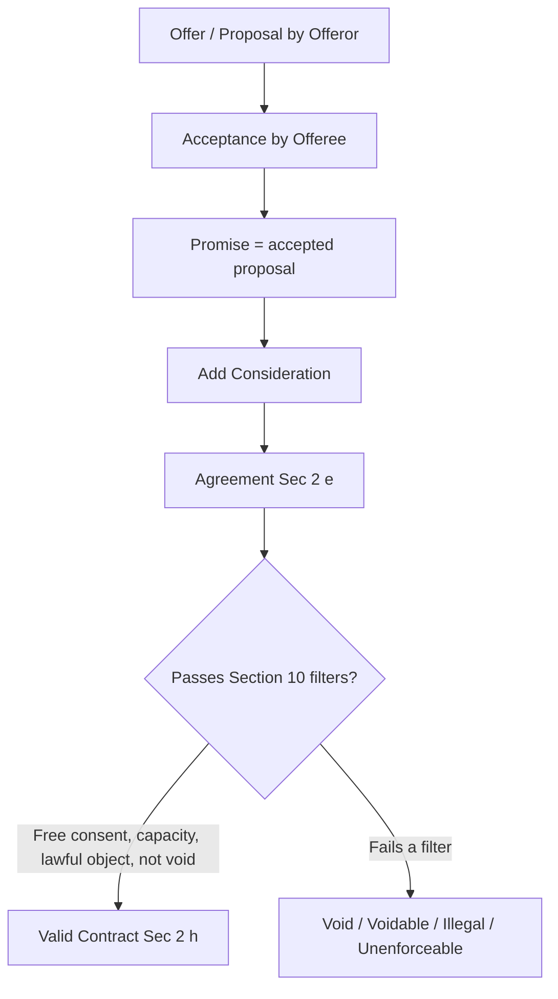
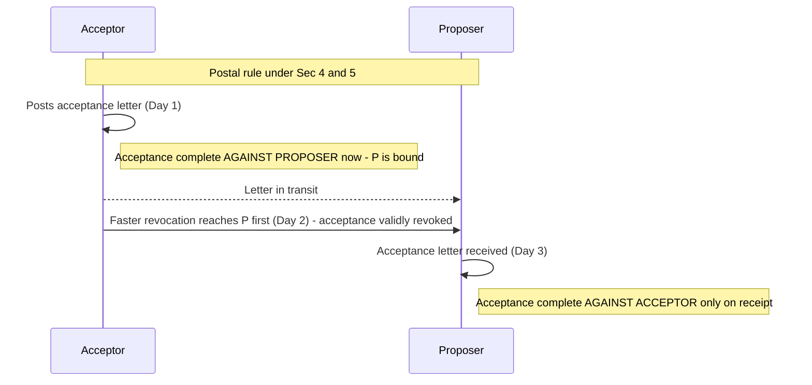
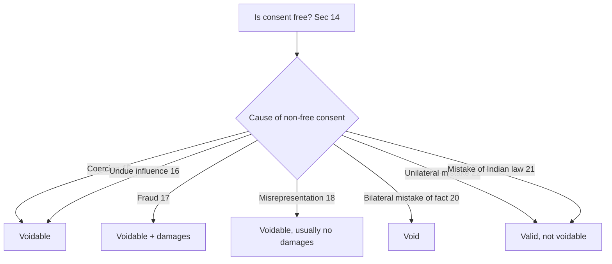

# Foundation: Indian Contract Act 1872 — Formation of Contract

## The Problem it solves

Every business transaction — buying raw material, hiring an employee, taking a loan, renting a shop, selling shares — is a *promise exchanged for something*. But promises are cheap. People say things, change their minds, deny they ever agreed, or agree under pressure. The moment money and goods start flowing on the strength of a spoken or written promise, we need a system that answers one hard question:

> **When does a promise become something a court will actually enforce — and when is it just talk?**

The Indian Contract Act, 1872 is that system. It is the oldest and most foundational commercial law in India, and it sits underneath *everything* you will later study in accounting, audit, tax and company law. When you record a *Sundry Debtor* in the books, you are recording a legally enforceable claim created by a contract of sale. When an auditor checks whether *revenue* can be recognised, they are checking whether a valid, performable contract exists. When a company issues shares, the application-allotment mechanism is pure offer-and-acceptance. Contract law is the plumbing of commerce; accounting merely measures what flows through it.

This chapter answers: *how does a legally binding contract come into existence?* — the formation stage. (Performance, breach and remedies come in the next chapter.)

## Core Idea

**A contract = an agreement + enforceability by law.**

The Act expresses this as a two-step machine (Section 2):

1. **Offer/Proposal + Acceptance = Promise** — one person signals willingness to do or abstain from something, the other says "yes" to *exactly* that.
2. **Promise + Consideration = Agreement** — the promise is backed by something of value moving both ways ("you give me X, I give you Y").
3. **Agreement + Enforceability by law = Contract.**

Put as the single most quoted line in all of Indian commercial law (Section 10):

> **"All agreements are contracts if they are made by the free consent of parties competent to contract, for a lawful consideration and with a lawful object, and are not hereby expressly declared to be void."**

So a contract is not *any* agreement. It is an agreement that survives six filters: (1) offer + acceptance, (2) intention to create legal relations, (3) lawful consideration, (4) capacity of the parties, (5) free consent, and (6) lawful object + not expressly declared void. Fail any one filter and you have, at best, an unenforceable arrangement.

**All contracts are agreements, but all agreements are not contracts.** Memorise that sentence — it is the thesis of the whole chapter.

## Why it works this way

The law is not being fussy for its own sake. Each filter exists because, without it, the enforcement machine would either grind honest people down or reward cheats.

- **Why offer + acceptance?** Because a contract is a *meeting of minds* (consensus ad idem — "agreement on the same thing in the same sense"). If I offer to sell my Maruti and you think I'm selling my Honda, there is no shared object to enforce. The law needs a precise moment where two minds lock onto one identical bargain.

- **Why consideration ("something for something")?** Because the courts refuse to be a free enforcement service for one-sided gifts. If I merely *promise* to give you ₹1,00,000 next year for nothing in return, and then don't, the law says: you gave up nothing, you lost nothing, go away. Enforcement is reserved for *bargains*, not generosity. This is the doctrine "no consideration, no contract" (Section 25) — with narrow, sensible exceptions.

- **Why capacity?** Because enforcing a promise squeezed out of a 14-year-old or a person who was blackout-drunk would be unjust. The law protects those who cannot protect themselves in a bargain.

- **Why free consent?** Because "yes" said with a gun to your head, or extracted by a lie, is not real agreement — it only *looks* like agreement. The law strips out consent that was manufactured by coercion, undue influence, fraud, misrepresentation or mistake.

- **Why lawful object?** Because the state will not lend its courts to enforce a contract to smuggle goods or bribe an official. Enforcing crime would make the court an accomplice.

Every rule below is a *consequence* of these five reasons. If you ever forget a rule, reconstruct it from first principles: *would enforcing this promise be fair, consensual, and lawful?*

## Full technical content

### 1. The key definitions (Section 2)

The Act front-loads its vocabulary in Section 2. You must be able to reproduce these verbatim-ish with the clause letter, because Foundation examiners award marks for citing the exact sub-clause.

| Clause | Term | Definition (essence) |
|--------|------|----------------------|
| 2(a) | **Proposal / Offer** | When one person signifies to another his *willingness to do or to abstain from doing* anything, with a view to obtaining the assent of that other to such act or abstinence. |
| 2(b) | **Acceptance / Promise** | When the person to whom the proposal is made *signifies his assent* thereto, the proposal is said to be accepted. A proposal, when accepted, becomes a **promise**. |
| 2(c) | **Promisor & Promisee** | The person making the proposal is the *promisor*; the person accepting it is the *promisee*. |
| 2(d) | **Consideration** | When, at the desire of the promisor, the promisee or any other person has *done or abstained from doing*, or *does or abstains from doing*, or *promises to do or abstain from doing*, something, such act/abstinence/promise is called consideration. |
| 2(e) | **Agreement** | Every promise and every set of promises forming the consideration for each other. |
| 2(f) | **Reciprocal promises** | Promises which form the consideration or part of the consideration for each other. |
| 2(g) | **Void agreement** | An agreement *not enforceable by law* is void. (Void from the beginning — *void ab initio*.) |
| 2(h) | **Contract** | An agreement enforceable by law. |
| 2(i) | **Voidable contract** | An agreement enforceable by law at the *option* of one or more parties, but not at the option of the other(s). |
| 2(j) | **Void contract** | A contract which *ceases to be enforceable* by law becomes void when it ceases to be enforceable. (Note: it was valid once, then became void.) |

**The single most important distinction here:** a *void agreement* (2(g)) was never enforceable from the start; a *void contract* (2(j)) was valid and later became void (e.g. a contract to import goods from a country that becomes an enemy country on war being declared).

### 2. Essentials of a valid contract (Section 10)

Section 10 lists what turns an agreement into a contract. Standard exam list of **essential elements**:

| # | Essential | Governing sections |
|---|-----------|-------------------|
| 1 | Offer and acceptance (two parties, consensus ad idem) | 2(a), 2(b), 3–9 |
| 2 | Intention to create legal relationship | (judge-made; not a section) |
| 3 | Lawful consideration | 2(d), 23, 25 |
| 4 | Capacity of parties (competency) | 11, 12 |
| 5 | Free consent | 13, 14, 15–22 |
| 6 | Lawful object | 23 |
| 7 | Agreement not expressly declared void | 24–30, 56 |
| 8 | Certainty of meaning | 29 |
| 9 | Possibility of performance | 56 |
| 10 | Legal formalities (writing/registration where law requires) | (various special Acts) |

**Intention to create legal relations** is not written in the Act but is read into it by courts. *Social and domestic agreements* (a husband promising his wife ₹30 a month; two friends agreeing to meet for dinner) are presumed *not* to be intended as legally binding — *Balfour v. Balfour* is the classic case. *Commercial agreements* are presumed to be legally binding.

### 3. Classification of contracts

You should be able to slot any contract into these buckets.

**(a) On the basis of validity / enforceability:**

| Type | Meaning | Example |
|------|---------|---------|
| **Valid** | Enforceable, all essentials present | A sells goods to B for a price, all elements present |
| **Void agreement** | Never enforceable (2(g)) | Agreement with a minor; agreement in restraint of trade |
| **Voidable** | Enforceable at option of aggrieved party (2(i)) | Consent obtained by coercion/fraud |
| **Illegal / unlawful** | Object or consideration forbidden by law; void + collateral transactions also tainted | Agreement to smuggle |
| **Unenforceable** | Valid in substance but cannot be enforced due to a technical defect (writing, stamp, registration, limitation) | Time-barred debt; unstamped document |

**Key relationship: every illegal agreement is void, but every void agreement is not illegal.** Illegality is "worse" than mere voidness — it also poisons *collateral* (connected) transactions. A void-but-legal agreement (e.g. an agreement with uncertain terms) does not taint collateral deals.

**(b) On the basis of formation:**

| Type | Meaning |
|------|---------|
| **Express contract** | Made by words spoken or written (Sec 9) |
| **Implied contract** | Inferred from conduct/circumstances (boarding a bus = implied promise to pay fare) (Sec 9) |
| **Quasi-contract** | Not a real contract; obligation imposed by law to prevent unjust enrichment (Sec 68–72) |
| **E-contract / Tele-contract** | Formed through electronic means |

**(c) On the basis of performance:**

| Type | Meaning |
|------|---------|
| **Executed** | Both parties have performed |
| **Executory** | Something remains to be done by one or both |
| **Unilateral** | One party has performed; obligation outstanding on the other only (reward cases) |
| **Bilateral** | Obligations outstanding on both sides |

### 4. Offer / Proposal (Sec 2(a), 3–9)

**Rules of a valid offer:**

1. Offer may be **express** (words) or **implied** (conduct).
2. It must be capable of creating **legal relations** — a social invitation is not an offer.
3. Terms must be **certain**, not vague.
4. An offer must be **communicated** to the offeree; you cannot accept an offer you don't know about (*Lalman Shukla v. Gauri Datt* — a servant who found the lost boy before learning of the reward could not claim it).
5. An offer may be **conditional**; the offeror may prescribe the mode of acceptance.
6. An **invitation to offer** is *not* an offer. Goods on a shop display, price catalogues, tenders invited, prospectus of a company, auction announcements — these merely *invite* offers. The customer makes the offer; the shopkeeper accepts.
7. A **mere statement of intention** or an **answer to a question about price** is not an offer (*Harvey v. Facey* — "Lowest price for Bumper Hall Pen ₹900" was information, not an offer).

**Types of offer:** General (to the world at large — *Carlill v. Carbolic Smoke Ball Co.*), Specific (to a definite person), Cross offer (identical offers crossing in post — no contract, because neither is an acceptance of the other), Counter offer (rejects and destroys the original), Standing/Open/Continuing offer (a tender for supply as and when required).

**Lapse / revocation of an offer (Sec 6):** an offer comes to an end by —
(i) communication of **notice of revocation** by the offeror before acceptance;
(ii) **lapse of time** prescribed, or reasonable time;
(iii) failure of the acceptor to fulfil a **condition precedent**;
(iv) **death or insanity** of the offeror, *if* the fact comes to the acceptor's knowledge before acceptance;
(v) a **counter offer** or rejection;
(vi) the offer not being accepted in the **prescribed mode**;
(vii) subsequent **illegality** or destruction of subject-matter.

### 5. Acceptance (Sec 2(b), 7–9)

**Rules of a valid acceptance:**

1. Acceptance must be **absolute and unqualified** (Sec 7(1)). A conditional or partial "yes" is a *counter offer*, not acceptance.
2. It must be in the **prescribed manner**, or if none prescribed, in a **usual and reasonable manner** (Sec 7(2)). If the offeror prescribes a mode and acceptor deviates, the offeror may (within reasonable time) insist on the prescribed mode; if he keeps silent, he is deemed to accept the deviated mode.
3. Acceptance must be **communicated** — mental acceptance or silence is not acceptance. The offeror cannot impose "your silence will be treated as acceptance" (*Felthouse v. Bindley*).
4. Acceptance must be given by the **person to whom offer is made** (or his authorised agent).
5. Acceptance must be given **within the time** prescribed / reasonable time, and *before the offer lapses or is revoked*.
6. Acceptance must be made **while the offer subsists**.
7. Mere **acknowledgement** of receipt of an offer is not acceptance.

**The "mirror image" rule:** acceptance must mirror the offer exactly. Any change = counter offer.

### 6. Communication and revocation — the timing rules (Sec 4 & 5)

This is a favourite exam area because the *postal rule* creates a mismatch between when the two parties are bound.

**Communication is complete (Sec 4):**

| Event | Complete against |
|-------|------------------|
| Communication of **proposal** | When it comes to the knowledge of the person to whom it is made |
| Communication of **acceptance — against the proposer** | When it is *put in course of transmission* to him, so as to be out of the power of the acceptor (i.e., when the letter is *posted*) |
| Communication of **acceptance — against the acceptor** | When it comes to the *knowledge* of the proposer (i.e., when the letter is *received/read*) |
| Communication of **revocation — against the person who makes it** | When it is *put into course of transmission* so as to be out of his power |
| Communication of **revocation — against the person to whom it is made** | When it comes to *his knowledge* |

**Revocation (Sec 5):**
- A **proposal** may be revoked at any time *before* the communication of its acceptance is complete as against the proposer (i.e., before the acceptance letter is posted), but not afterwards.
- An **acceptance** may be revoked at any time *before* the communication of the acceptance is complete as against the acceptor (i.e., before the acceptance letter reaches the proposer), but not afterwards.

**Practical upshot of the postal rule:** the offeror is bound the *instant the acceptor posts* the letter, but the acceptor can still race a faster revocation (telegram/courier) to reach the offeror *before or with* the acceptance letter. This is examined constantly with dated fact-patterns — always draw a timeline.

### 7. Consideration (Sec 2(d), 23, 25)

Consideration is the *price* for which the promise is bought — "something in return" (*quid pro quo*).

**Legal rules of consideration:**

1. It must move **at the desire of the promisor** (an act done at the desire of a stranger, or voluntarily, is not consideration — *Durga Prasad v. Baldeo*).
2. It may move from the **promisee or any other person** (privity of consideration — a *stranger to consideration* can sue in India, unlike English law — *Chinnaya v. Ramayya*). But a **stranger to the contract** generally cannot sue (doctrine of privity of contract, with exceptions).
3. It may be **past, present (executed), or future (executory)**. Indian law recognises **past consideration** (English law does not).
4. It **need not be adequate** (Explanation 2 to Sec 25) — the law asks only that *some* consideration exists, not that it is a fair price. Inadequacy is, however, evidence to examine whether consent was free.
5. It must be **real and not illusory** — a promise to do something physically impossible, or a pre-existing legal/contractual duty, is no consideration.
6. It must be **lawful** (Sec 23) — not forbidden by law, not defeating any law, not fraudulent, not injurious to person/property, not immoral or against public policy.

**"No consideration, no contract" (Sec 25)** — general rule. But Sec 25 itself lists **exceptions** where an agreement *without* consideration is still valid:

| Exception (Sec 25) | Condition |
|--------------------|-----------|
| **(1) Natural love and affection** | Agreement (a) expressed in **writing**, (b) **registered**, (c) made on account of natural love and affection, (d) between parties **standing in near relation** to each other |
| **(2) Past voluntary service** | A promise to compensate, wholly or in part, a person who has *already voluntarily done something* for the promisor, or something the promisor was legally compellable to do |
| **(3) Promise to pay a time-barred debt** | A written and signed (by debtor/agent) promise to pay a debt barred by the Limitation Act |
| Also valid without consideration | **Completed gift** (Explanation 1); **Agency** (Sec 185 — no consideration needed to create agency); **Bailment**; **Charity where the promisee acts on the faith of the promise** and incurs liability |

### 8. Capacity to contract (Sec 11 & 12)

Section 11: *"Every person is competent to contract who is (a) of the age of majority according to the law to which he is subject, (b) of sound mind, and (c) is not disqualified from contracting by any law to which he is subject."*

**(a) Minors** — a person who has not completed **18 years** (or 21 where a guardian is appointed by court, per older law; Foundation follows 18 as the general age). Rules from the landmark *Mohori Bibee v. Dharmodas Ghose*:

- An agreement with a minor is **void ab initio** — absolutely void, not merely voidable.
- A minor can be a **beneficiary/promisee** — he can *enforce* a contract that is for his benefit (e.g., a promissory note executed in his favour).
- **No ratification** on attaining majority — a void agreement cannot be validated later. He must make a *fresh* contract with fresh consideration.
- **No estoppel** — even if the minor lied about his age, he can still plead minority.
- **Restitution** — a minor may be asked to *restore* property/goods still traceable in his hands (equitable restitution), but not to repay money that is untraceable.
- **Necessaries** — a person who supplies *necessaries* (food, clothes, education, legal advice suited to the minor's condition in life) to a minor may recover the price from the **minor's property** (Sec 68 — quasi-contract), *not* from the minor personally.
- A minor can be an **agent** (binding the principal) but is not personally liable; can be a **partner only for benefits** (with consent of all partners, Sec 30 Partnership Act); cannot be adjudged **insolvent**.

**(b) Persons of unsound mind (Sec 12).** A person is of sound mind *for contracting* if, at the time he makes the contract, he is capable of understanding it and of forming a rational judgment as to its effect on his interests. Includes idiots, lunatics (valid contract during a lucid interval), and persons made incompetent by drunkenness/delirium at the time. Contract by a person of unsound mind is **void**.

**(c) Disqualified persons.** By status or law: **alien enemies** (during war), **foreign sovereigns/diplomats** (sue only with sanction), **convicts** (while undergoing sentence), **insolvents** (until discharge), and **corporations** (limited by their memorandum/objects — *ultra vires* acts are void).

### 9. Free consent (Sec 13, 14) and the five vitiating factors (Sec 15–22)

**Consent (Sec 13):** two or more persons are said to consent when they agree upon the same thing in the same sense (*consensus ad idem*).

**Free consent (Sec 14):** consent is *free* when it is **not caused** by (1) Coercion (15), (2) Undue influence (16), (3) Fraud (17), (4) Misrepresentation (18), or (5) Mistake (20–22).

**Golden rule of effect:**
- Consent caused by **coercion, undue influence, fraud, or misrepresentation** → contract is **VOIDABLE** at the option of the party whose consent was so caused (Sec 19, 19A).
- Consent caused by **bilateral mistake of fact essential to the agreement** → agreement is **VOID** (Sec 20).

| Factor | Section | Definition (essence) | Effect |
|--------|---------|----------------------|--------|
| **Coercion** | 15 | Committing/threatening to commit any act forbidden by the IPC, or unlawfully detaining/threatening to detain any property, to make a person enter into the agreement | Voidable; anything received must be restored (Sec 72) |
| **Undue influence** | 16 | Where relations subsist such that one party is in a *position to dominate the will* of the other and uses it to obtain an *unfair advantage* | Voidable; burden of proof on the dominant party |
| **Fraud** | 17 | A false representation of fact made *knowingly*, or without belief in its truth, or recklessly, with *intent to deceive*; also active concealment, false promise, and any act fitted to deceive | Voidable; aggrieved party may rescind AND claim damages |
| **Misrepresentation** | 18 | An *innocent/unintentional* false statement of fact, made believing it to be true, which misleads the other party | Voidable; can rescind, generally no damages |
| **Mistake** | 20–22 | Erroneous belief about something | See below |

**Position to dominate the will (Sec 16(2))** is *presumed* where a party (a) holds real or apparent authority / stands in a fiduciary relation, or (b) contracts with a person whose mental capacity is temporarily or permanently affected by age, illness, or mental/bodily distress. Classic relations: doctor–patient, solicitor–client, guardian–ward, trustee–beneficiary, spiritual guru–disciple. (Note: *husband–wife* and *creditor–debtor* are **not** presumed.)

**Coercion vs Undue influence** — coercion is *physical/threat* pressure (forbidden by IPC); undue influence is *mental/moral* pressure arising from a dominating relationship.

**Fraud vs Misrepresentation** — the pivotal difference is **intention to deceive / knowledge of falsity**. Fraud = deliberate; misrepresentation = innocent. Consequence: in *fraud*, aggrieved party can **rescind + claim damages**; in *misrepresentation*, generally **rescind only** (no damages). Also, in misrepresentation the deceiving party can defend by showing the other party *had the means to discover the truth with ordinary diligence*; in fraud this defence is *not* available (except where fraud is by silence and the party had means to discover).

**Mistake (Sec 20–22):**

| Type | Section | Effect |
|------|---------|--------|
| **Bilateral mistake of fact** (both parties mistaken about a fact essential to the agreement) | 20 | Agreement is **VOID** |
| **Unilateral mistake of fact** (only one party mistaken) | 22 | Contract is **NOT voidable** merely because one party was under a mistake |
| **Mistake of law in force in India** | 21 | *No relief* — ignorance of law is no excuse |
| **Mistake of foreign law** | 21 | Treated like a mistake of **fact** → may make agreement void |

### 10. Lawful object and lawful consideration (Sec 23)

The **consideration** *and* the **object** of an agreement are lawful unless (Sec 23):

1. It is **forbidden by law**;
2. It is of such a nature that, if permitted, it would **defeat the provisions of any law**;
3. It is **fraudulent**;
4. It involves or implies **injury to the person or property of another**;
5. The court regards it as **immoral**; or
6. The court regards it as **opposed to public policy**.

In each of these cases the consideration or object is *unlawful*, and **every agreement of which the object or consideration is unlawful is void** (and, being forbidden, is *illegal*).

**Agreements opposed to public policy** (judge-made heads): trading with an enemy, stifling prosecution, maintenance and champerty, trafficking in public offices, agreements tending to create monopolies, agreements interfering with the course of justice, marriage brokerage agreements, and agreements to defraud creditors/revenue.

### 11. Agreements expressly declared void (Sec 24–30, 56)

Even if the object looks fine, the Act *itself* declares certain agreements void:

| Section | Void agreement |
|---------|----------------|
| **24** | Agreement void if **consideration and object are unlawful in part** (and the parts cannot be separated) |
| **25** | Agreement **without consideration** (subject to the three exceptions) |
| **26** | Agreement in **restraint of marriage** (of any person other than a minor) is void |
| **27** | Agreement in **restraint of trade** is void — *Exception:* sale of goodwill (reasonable local limits); also statutory exceptions under the Partnership Act |
| **28** | Agreement in **restraint of legal proceedings** is void (with exceptions for arbitration references) |
| **29** | Agreement **uncertain / not capable of being made certain** in meaning is void |
| **30** | Agreement **by way of wager** (bet) is void; collateral transactions are not necessarily void |
| **56** | Agreement to do an **impossible act** is void; and a contract to do an act which *afterwards becomes impossible or unlawful* becomes void when the act becomes impossible/unlawful (doctrine of **frustration / supervening impossibility**) |

**Wagering agreements (Sec 30):** an agreement on an uncertain future event where each party stands to *win or lose* purely on the outcome, with no other interest. Void but *not illegal* in most of India (special note: void in Maharashtra/Gujarat historically). Insurance contracts, share-trading with delivery, skill competitions and games of skill are **not** wagers because a party has an insurable interest or the outcome depends on skill.

## Worked examples (Issue → Rule → Application → Conclusion)

### Worked Example 1 — Offer, acceptance and the postal rule (with a timeline)

**Facts.** On **1 July**, A (Mumbai) posts a letter to B (Delhi) offering to sell 500 bags of cement at ₹360 per bag. B receives it on **4 July** and posts his acceptance the same day. Meanwhile, A changes his mind and posts a *revocation* on **3 July**, which reaches B on **6 July**. B's acceptance letter reaches A on **7 July**. Is there a contract? At what price and value?

**Issue.** Was A's offer validly revoked before acceptance became complete against him?

**Rule.** Under **Sec 4**, communication of acceptance is complete *as against the proposer* when the acceptance is *put in course of transmission* (posted). Under **Sec 5**, a proposal may be revoked *only before* the communication of acceptance is complete as against the proposer. Revocation (Sec 4) is complete against the person to whom it is made only when it *reaches his knowledge*.

**Application.**
- B posted acceptance on **4 July** → acceptance is complete against A on **4 July**. A is **bound** from that instant.
- A's revocation, though posted on 3 July, only becomes effective against B when it *reaches B's knowledge* — i.e., **6 July**.
- Since 6 July (revocation received) is *after* 4 July (acceptance posted), the revocation is **too late**.

**Conclusion.** A valid contract came into existence on **4 July**. A is bound to sell 500 bags at ₹360.
**Contract value = 500 × ₹360 = ₹1,80,000.** A's revocation is ineffective; if he refuses to supply, he is in breach.

*Self-check:* 500 × 360 = 180,000. The controlling dates are "posted 4 Jul" vs "revocation received 6 Jul"; 4 < 6, so acceptance wins. Consistent.

### Worked Example 2 — "No consideration, no contract" and the Sec 25 exceptions

**Facts.** Consider three separate promises:
1. **X**, out of natural love and affection for his younger brother **Y**, executes a *registered written* deed promising to pay Y ₹2,00,000. X later refuses.
2. **P** found and returned **Q's** lost briefcase last month without being asked. Grateful, Q *now promises in writing* to pay P ₹5,000. Q refuses.
3. **R** owes **S** ₹50,000 which has become *time-barred* under the Limitation Act. R signs a written promise to pay ₹30,000 of it. R refuses.

For each, can the promisee enforce the promise despite the absence of fresh consideration?

**Issue.** Does each promise fall within a Sec 25 exception to "no consideration, no contract"?

**Rule.** Sec 25 — an agreement without consideration is void *unless* (1) it is in writing, registered, made from natural love and affection between parties in near relation; (2) it is a promise to compensate a person who has already voluntarily done something for the promisor; or (3) it is a written, signed promise to pay a time-barred debt.

**Application & Conclusion.**
1. Writing ✔, registration ✔, natural love and affection ✔, near relation (brothers) ✔ → falls squarely in **Sec 25(1)**. **Enforceable — Y can recover ₹2,00,000.**
2. P *voluntarily* did something for Q, and Q *later* promised to compensate → **Sec 25(2)**. **Enforceable — P can recover ₹5,000.**
3. Written and signed promise to pay a time-barred debt → **Sec 25(3)**. The promise is enforceable *to the extent promised*. **Enforceable — S can recover ₹30,000** (not the full ₹50,000, because R only promised ₹30,000).

*Self-check:* Each amount is limited to what the exception's wording supports — full ₹2,00,000 (deed amount), ₹5,000 (promised), ₹30,000 (the promised part, not the ₹50,000 original). Internally consistent.

### Worked Example 3 — Minor's agreement, necessaries, and no ratification (with a settlement figure)

**Facts.** M, aged **17**, borrows ₹80,000 from a moneylender L by executing a mortgage of his house, falsely representing that he is 19. He spends ₹50,000 and ₹30,000 worth of the borrowed money is still identifiable as a fixed deposit in M's name. Separately, a college supplies M with tuition and books costing ₹12,000 (necessaries suited to his condition). On turning 18, M "ratifies" the mortgage in writing. L sues to enforce the mortgage. What can L and the college recover?

**Issue.** (a) Is the mortgage enforceable? (b) Does M's false age or later ratification help L? (c) Can restitution be ordered? (d) Can the college recover for necessaries?

**Rule.**
- An agreement with a minor is **void ab initio** — *Mohori Bibee v. Dharmodas Ghose*.
- **No estoppel** against a minor even if he lied about age; **no ratification** on majority.
- **Equitable restitution** (Sec 33, Specific Relief Act / equity): a minor may be ordered to restore property/money *still traceable* in his hands, but not what is spent and untraceable.
- **Necessaries** supplied to a minor are recoverable from the *minor's property* under **Sec 68** (quasi-contract), not from the minor personally.

**Application.**
- The mortgage is **void** — L cannot enforce it as a contract, cannot foreclose the house.
- M's false representation gives L **no estoppel**; M's post-majority "ratification" is **ineffective** because a void agreement cannot be ratified.
- **Restitution:** the ₹30,000 still identifiable as an FD in M's name is traceable → the court can order M to **restore ₹30,000**. The ₹50,000 already spent and untraceable **cannot** be recovered.
- **Necessaries:** the college can recover the ₹12,000 out of M's property under Sec 68.

**Conclusion.**
- Mortgage: **unenforceable/void**; house not liable.
- L recovers only the **traceable ₹30,000** by way of restitution; **loses ₹50,000**.
- College recovers **₹12,000** from M's property under Sec 68 (not from M personally).

*Self-check:* Borrowed ₹80,000 = ₹50,000 spent (untraceable, lost to L) + ₹30,000 traceable (restored). 50,000 + 30,000 = 80,000 ✔. Necessaries ₹12,000 is a separate Sec 68 claim. All figures reconcile.

### Worked Example 4 — Free consent: coercion vs undue influence vs fraud

**Facts.** Three separate transactions:
1. **A** threatens to file a false criminal complaint against **B**'s son unless B sells his shop to A for ₹10,00,000 (market value ₹18,00,000). B signs.
2. An aged, illiterate widow **W**, dependent on her spiritual advisor **G**, gifts G property worth ₹25,00,000 after G tells her it will secure her salvation.
3. **D**, selling a used machine, tells buyer **E** it was overhauled last year *knowing that is false*. E buys for ₹4,00,000; a genuine overhaul would have been worth ₹1,00,000 more in value; repairs now cost E ₹90,000.

Classify each vitiating factor and state the remedy.

**Issue.** Which vitiating factor applies and what is the legal effect on each contract?

**Rule.** Coercion (Sec 15) — threat of an act forbidden by IPC. Undue influence (Sec 16) — abuse of a dominating relationship to gain unfair advantage; burden shifts to the dominant party. Fraud (Sec 17) — knowingly false statement with intent to deceive → rescission **plus damages** (Sec 19).

**Application & Conclusion.**
1. Threatening a false criminal complaint is a threat to commit an act forbidden by the IPC → **Coercion (Sec 15)**. The contract is **voidable at B's option**; B may rescind and, on rescinding, must restore any benefit (Sec 64). B is **not** bound to sell at ₹10,00,000.
2. G stands in a **fiduciary/spiritual** relation and is in a position to dominate W's will; the gift is unconscionable → **Undue influence (Sec 16)**. The transaction is **voidable at W's option**; the **burden is on G** to prove the gift was made with free consent. W can recover the property worth ₹25,00,000.
3. D made a knowingly false statement of fact with intent to deceive → **Fraud (Sec 17)**. E may **rescind** the contract, or affirm it and **claim damages** for the loss. If E keeps the machine, E's recoverable loss is the **₹90,000 repair cost** he actually incurred to put the machine in the promised state.

*Self-check:* Remedies map correctly — coercion & undue influence → voidable (restore benefits); fraud → voidable + damages, with the damages figure (₹90,000) tied to E's actual out-of-pocket loss. Consistent.

## Connections — how this feeds into CA Intermediate

- **Inter Law — The Companies Act, 2013:** share application → allotment is literally offer-and-acceptance; a *prospectus* is an *invitation to offer*; **misstatement in a prospectus** is fraud/misrepresentation applied to company law. Pre-incorporation contracts turn on capacity and privity.
- **Inter Law — The Indian Partnership Act & LLP:** a partnership is a *contract* between partners (Sec 5); minors "admitted to benefits" (Sec 30) flows straight from the minor-capacity rules here.
- **Inter Law — Sale of Goods Act, 1930 and Negotiable Instruments Act, 1881:** both are *special contracts* that assume the general formation rules of the Contract Act. "Consideration" in a cheque, "unpaid seller's" rights — all built on this base.
- **Inter Accounting & Audit — Revenue recognition (Ind AS 115 / AS 9):** "identify the contract with a customer" is step 1 of the revenue model. Auditors test whether an *enforceable* contract exists before revenue can be booked — directly this chapter.
- **Inter Audit — occurrence & rights/obligations assertions:** a debtor is real only if a valid contract created it; a contingent liability may arise from a *voidable* or disputed contract.

## Traps & common mistakes

1. **Void agreement vs void contract vs voidable.** *Void agreement* = void from birth (2(g)); *void contract* = valid then became void (2(j)); *voidable* = valid until the aggrieved party rescinds (2(i)). Examiners set traps swapping these.
2. **"Illegal" ≠ "void."** Every illegal agreement is void, but not every void agreement is illegal. Illegality taints **collateral** transactions; mere voidness does not.
3. **Invitation to offer treated as an offer.** Shop displays, catalogues, tenders, prospectus, auction notices are *invitations*, not offers. The customer offers.
4. **Cross offers create a contract — WRONG.** Two identical offers crossing in the post do **not** form a contract; neither is an acceptance of the other.
5. **Consideration must be adequate — WRONG.** It need *not* be adequate (Explanation 2 to Sec 25); it must merely exist and be *real*.
6. **Stranger to consideration cannot sue — WRONG in India.** In India consideration may move from a *third person* (Chinnaya v. Ramayya). But a **stranger to the contract** generally cannot sue (privity of contract).
7. **Minor's agreement is voidable — WRONG.** It is **void ab initio**; no ratification, no estoppel even if the minor lied.
8. **Necessaries make the minor personally liable — WRONG.** Recovery is only against the **minor's property** (Sec 68), never a personal liability.
9. **Mistake of law in India gives relief — WRONG.** Sec 21 — no relief. But *foreign* law mistake is treated as a mistake of *fact*.
10. **Fraud and misrepresentation give the same remedy — WRONG.** Fraud → rescission **+ damages**; misrepresentation → rescission, generally **no damages**.
11. **Unilateral mistake makes a contract voidable — WRONG.** Sec 22 — a contract is *not* voidable merely because one party was mistaken. Only **bilateral** mistake of an essential fact makes it **void** (Sec 20).
12. **Wager is illegal — mostly WRONG.** A wager is **void**, not illegal, in most of India; collateral transactions to a wager are generally enforceable.

## First-principles recap

- A **contract** is an agreement the law will *enforce*; enforcement is reserved for bargains that are consensual, backed by consideration, made by capable parties, freely consented to, and lawful (Sec 10).
- **Offer + acceptance** must produce *consensus ad idem* — the same thing in the same sense — and acceptance must **mirror** the offer and be **communicated**; timing is governed by the **postal rule** (Sec 4, 5).
- **Consideration** is the price of a promise; it need not be adequate but must be *real* and *lawful*; "no consideration, no contract" with three statutory exceptions (Sec 25).
- **Capacity** protects minors (void ab initio), the unsound-minded, and disqualified persons — the law will not enforce a bargain against those who cannot fairly make one.
- **Free consent** strips out coercion, undue influence, fraud and misrepresentation (→ *voidable*) and bilateral mistake of fact (→ *void*).
- **Lawful object** (Sec 23) refuses the court's help to crime, fraud, injury, immorality and public-policy violations; certain agreements are **expressly declared void** (Sec 24–30, 56).

## Quick-reference

| Topic | Key rule | Section |
|-------|----------|---------|
| Contract = agreement + enforceability | 2(h) | Sec 2(h) |
| Essentials of valid contract | Free consent, competent parties, lawful consideration & object, not void | **Sec 10** |
| Proposal / acceptance / promise | Definitions | 2(a), 2(b) |
| Communication complete | Proposal: on knowledge; Acceptance vs proposer: on posting; vs acceptor: on receipt | **Sec 4** |
| Revocation of offer/acceptance | Offer: before acceptance posted; Acceptance: before it reaches proposer | **Sec 5** |
| Lapse of offer | Revocation, time, death/insanity known, counter-offer, non-conformity | Sec 6 |
| Acceptance must be absolute | Mirror image; communicated; prescribed mode | Sec 7 |
| Consideration definition | At desire of promisor; may move from any person | 2(d) |
| No consideration no contract | Exceptions: love & affection (writing+registered+near relation), past voluntary service, time-barred debt | **Sec 25** |
| Capacity | Majority + sound mind + not disqualified | Sec 11 |
| Sound mind test | Understand + rational judgment at time of contract | Sec 12 |
| Minor's agreement | Void ab initio; no ratification/estoppel; necessaries → Sec 68 | 11; 68 |
| Free consent | Not caused by coercion/UI/fraud/misrep/mistake | Sec 14 |
| Coercion | Act forbidden by IPC / unlawful detention → **voidable** | Sec 15 |
| Undue influence | Domination + unfair advantage → **voidable**, burden on dominant party | Sec 16 |
| Fraud | Knowing falsehood + intent to deceive → **voidable + damages** | Sec 17 |
| Misrepresentation | Innocent false statement → **voidable**, no damages | Sec 18 |
| Bilateral mistake of fact | **Void** | Sec 20 |
| Mistake of Indian law | No relief; foreign law = fact | Sec 21 |
| Unilateral mistake | Not voidable | Sec 22 |
| Unlawful object/consideration | Forbidden/defeats law/fraudulent/injurious/immoral/public policy → void | **Sec 23** |
| Expressly void | Restraint of marriage 26, trade 27, legal proceedings 28, uncertain 29, wager 30, impossible 56 | 24–30, 56 |

*Act: **The Indian Contract Act, 1872**. CA Foundation Paper 2 — Business Laws, 2024 New Scheme.*
