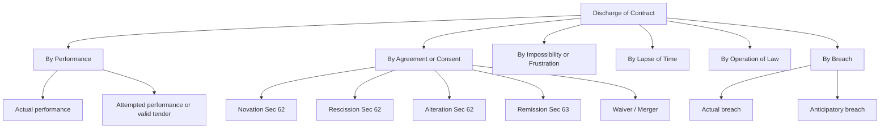
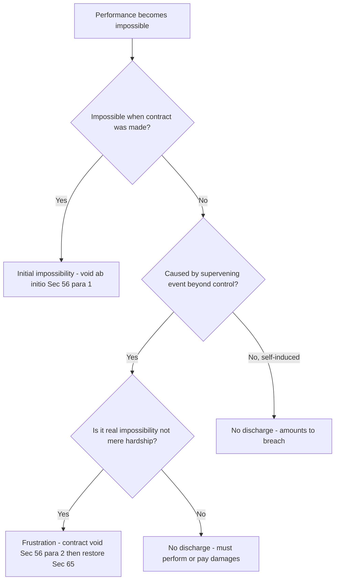
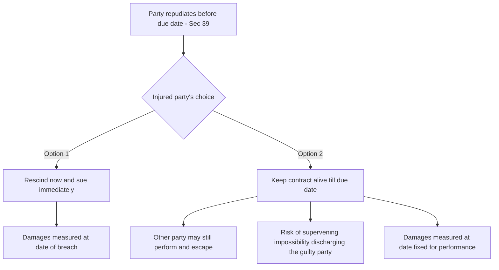
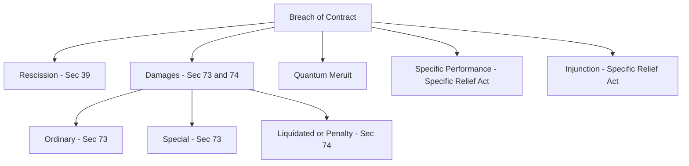

# Foundation: Indian Contract Act 1872 — Performance, Discharge, Breach & Remedies

## The Problem it solves

A valid contract is only the *beginning* of a commercial relationship, not the end. Once two parties have a legally binding agreement (offer + acceptance + consideration + capacity + free consent + lawful object), a whole set of practical questions immediately follows:

- **Who** actually has to do the promised work — must the promisor do it personally, or can he send a substitute?
- **When and where** must the money be paid or the goods delivered?
- If a debtor owes three separate loans and sends part-payment, **which loan** does that payment reduce?
- What happens when performance becomes **impossible** — a factory burns down, a war breaks out, a law is passed banning the very thing that was promised?
- If one party simply **refuses to perform**, what can the injured party actually recover in a court — the full profit? Only actual loss? A pre-agreed penalty?
- If a builder does 80% of a job and then the owner cancels, can the builder claim payment for the part he *did* finish?

The first half of the Contract Act (Sections 1–30) tells you **when a contract is born**. This chapter deals with the second half (Sections 37–75) — **how a live contract is carried out, how it comes to an end, and what the law does when someone breaks it.** Every audit of a business contract, every recovery suit, every "damages" line item in a company's books traces back to these rules. Before you can audit a provision for a lawsuit or a penalty clause (CA Inter Audit and Law), you must know exactly what the law will and will not enforce.

Two special families of obligation also sit here:

- **Contingent contracts** — promises that only spring to life *if something else happens* (insurance is the classic example).
- **Quasi-contracts** — situations where there is *no real agreement at all*, yet the law forces one party to pay, because letting him keep a benefit for free would be unjust.

## Core Idea

A contract creates **obligations**; the law is obsessed with two life-events of every obligation — **its performance (or excusal) and its discharge**. When the obligation is fulfilled as promised, the contract dies a natural death. When it is broken, the law does **not** normally force the wrongdoer to actually perform — instead it makes him **pay money (damages) to put the injured party in the position he would have been in had the promise been kept.** Everything in this chapter is a variation on those two sentences.

The single organising principle for remedies is **compensation, not punishment.** Indian contract law heals the victim's wallet; it does not punish the wrongdoer. Hold that idea and most of Sections 73–75 becomes obvious.

## Why it works this way

First principles, reasoned rather than memorised:

1. **A promise is a transfer of a future certainty.** When A promises to deliver goods to B next month, B rearranges his affairs relying on that certainty (he resells, he plans production). So the law must protect B's *reliance* and *expectation*. That is why the default remedy is money measured by B's expected position — the "benefit of the bargain."

2. **The law prefers money to force.** Forcing a specific person to do specific work (specific performance) is intrusive, hard to supervise, and often pointless — if a tailor refuses to sew your suit, the court cannot usefully stand over him with a needle. Money is fungible, measurable, and lets B buy a substitute. Hence damages are the rule and specific performance is the *exception*, reserved for cases where money genuinely cannot substitute (unique land, rare paintings).

3. **You cannot recover losses you could have avoided.** If B could have bought identical goods elsewhere for a small extra cost, the law will not let him sit still, watch losses pile up, and bill A for all of it. This is the **duty to mitigate** — a direct consequence of "compensation, not punishment."

4. **Remoteness limits liability.** A promisor accepts responsibility only for consequences that were within reasonable contemplation when the contract was made. Otherwise every small breach could expose a party to unlimited, unforeseeable liability, and no one would dare contract. This is the logic of *Hadley v. Baxendale*, imported into **Section 73**.

5. **Impossibility that no one caused should fall on no one as fault.** If a supervening event destroys the very foundation of the contract, punishing either party is unjust — neither is to blame. So the contract is simply **voided** (Section 56), and the parties are restored, rather than one side being made to pay damages for a breach he never committed.

6. **Unjust enrichment must be reversed.** Even without a contract, if you receive a benefit you were never meant to keep for free (a wrong-address delivery, a mistaken payment), keeping it enriches you unjustly at another's expense. Quasi-contract (Sections 68–72) is the law plugging that moral gap.

## Full technical content

### A. Contingent contracts (Sections 31–36)

**Section 31 — definition.** A *contingent contract* is a contract to do or not to do something **if** some event, **collateral** (i.e., not part of the main promise itself) to the contract, does or does not happen.

> Example: "I will pay you ₹1,00,000 if your house is destroyed by fire." The payment obligation is *contingent* on the fire. All contracts of **insurance, indemnity and guarantee** are contingent contracts.

Key features:
- Performance depends on a **future uncertain event**.
- The event is **collateral** (incidental) to the contract, not the reciprocal promise itself.
- The event must **not be the mere will of the promisor** (else it is not a real contract at all).

**Rules for enforcement:**

| Section | Situation | Rule |
|---|---|---|
| 32 | Contingent on an event *happening* | Enforceable only when/if the event happens; **void** if the event becomes impossible |
| 33 | Contingent on an event *not happening* | Enforceable only when the event becomes impossible (i.e., it is certain it will not happen) |
| 34 | Event = future conduct of a living person | Event treated as **impossible** if that person does anything making it impossible within a definite time |
| 35 | Contingent on event happening **within a fixed time** | Void if the event does not happen (or becomes impossible) within that time |
| 35 | Contingent on event **not** happening within a fixed time | Enforceable if the event does not happen within the time, or becomes impossible before the time expires |
| 36 | Contingent on an **impossible** event | **Void**, whether or not the parties knew of the impossibility at the time |

**Contingent vs. Wagering:** a wagering agreement (Section 30) is *void*; a contingent contract is *valid*. In a wager both parties stand to win or lose purely on the event and have no other interest; in a contingent contract (like insurance) the party has a real interest (insurable interest) and the event is collateral.

### B. Quasi-contracts / "certain relations resembling those created by contract" (Sections 68–72)

There is **no offer, no acceptance, no agreement** — yet the law imposes an obligation to prevent unjust enrichment. The Act deliberately avoids the word "contract" in the heading; these are obligations *resembling* contract.

| Section | Relation | Rule | Illustration |
|---|---|---|---|
| 68 | Necessaries supplied to a person incapable of contracting (minor/lunatic) or to someone he is legally bound to support | Supplier is reimbursed **from the incapable person's property** (not personally, as a minor is not personally liable) | A supplies food/clothes suited to a minor B's station in life → A recovers from B's estate |
| 69 | Payment by an *interested* person of money which another is *bound by law* to pay | The payer is entitled to be **reimbursed** by the person bound | B's land is about to be sold for arrears of government revenue that A owes; the tenant B pays to save his tenancy → recovers from A |
| 70 | A person lawfully does something for another, or delivers something, **not intending to do so gratuitously**, and the other **enjoys the benefit** | The beneficiary must **compensate** or restore | A, a tradesman, leaves goods at B's house by mistake; B treats them as his own → B must pay |
| 71 | Finder of goods | A finder of goods belonging to another has the **same responsibility as a bailee** (must take reasonable care, try to find the owner) | Finder of a lost wallet must attempt to trace owner; can sell in limited circumstances |
| 72 | Money paid, or thing delivered, **by mistake or under coercion** | Must be **repaid or returned** | A pays B ₹1,000 twice by mistake; B must repay the second ₹1,000 |

The measure of a quasi-contractual claim is *restitutionary* — the value of the benefit conferred — not the "expectation" measure used in real contracts.

### C. Performance of contracts (Sections 37–67)

**Section 37 — obligation to perform.** The parties **must either perform, or offer to perform**, their respective promises, unless performance is dispensed with or excused under the Act. On the death of a promisor, the obligation binds his **legal representatives**, unless a contrary intention appears or the contract was for personal skill.

**Section 38 — tender / attempted performance.** Where a promisor *offers* to perform (a valid **tender**) and the offer is not accepted, the promisor:
- is **not responsible for non-performance**, and
- **does not lose his rights** under the contract.

A valid tender must be: **unconditional**, at the **proper time and place**, of the **whole obligation**, giving the promisee a reasonable opportunity to inspect, and made to the proper person.

**Who must perform (Sections 40–45):**

| Section | Rule |
|---|---|
| 40 | If the contract shows the parties **intended personal performance** (personal skill — a painter, a singer), the **promisor himself** must perform. Otherwise the promisor **or his representative** may employ a competent person |
| 41 | If the promisee **accepts performance from a third person**, he **cannot afterwards enforce it against the promisor** |
| 42 | **Joint promisors** — all must **jointly** fulfil the promise; on death, representatives jointly with survivors; on death of all, the representatives of all |
| 43 | Any **one or more** joint promisors may be compelled to perform the **whole** (joint *and several* liability); a performing joint promisor may claim **contribution** from the others; a defaulting sharer's shortfall is shared by the rest |
| 44 | Release of one joint promisor by the promisee does **not** discharge the others, nor does it free the released one from the others' claim for contribution |
| 45 | **Joint promisees** — the right to claim performance rests with all the promisees jointly (during their joint lives, then survivor(s), then representatives) |

**Time and place of performance (Sections 46–50):**

| Section | Situation | Rule |
|---|---|---|
| 46 | No time specified | Perform within a **reasonable time** (a question of fact) |
| 47 | Day specified but no hour | Perform during **usual business hours** on that day, at the proper place |
| 48 | Day specified, promisee to apply for performance | Promisee must apply at a **proper place and within usual hours** |
| 49 | No place fixed, no application | Promisor must **apply to the promisee to fix a reasonable place** and perform there |
| 50 | Manner/time to be prescribed by promisee | Performance in the **manner and at the time the promisee prescribes** |

**Is time of the essence?** In ordinary commercial (especially sale-of-goods) contracts, **failure to perform on time makes the contract voidable at the option of the promisee**, *if* time was intended to be of the essence. Where time is **not** of the essence, delay does not void the contract, but the promisee may claim compensation for loss caused by delay. Time is generally **not** presumed to be of the essence in contracts relating to immovable property.

**Performance of reciprocal promises (Sections 51–58):**

| Section | Rule |
|---|---|
| 51 | Simultaneous reciprocal promises — a promisor **need not perform unless the other is ready and willing** to perform his part |
| 52 | Order of performance follows the **express order**, or (if none) the **nature of the transaction** requires |
| 53 | If one party **prevents** the other from performing, the contract becomes **voidable** at the option of the party so prevented, who may also claim compensation |
| 54 | Where one promise cannot be performed until the other party has performed his **prior** promise, and the latter fails, he **cannot claim performance** and must **compensate** the other for loss |
| 55 | Effect of **failure to perform at a time fixed** where time is of the essence — contract voidable; if not of the essence, compensation only (see above) |
| 56 | **Doctrine of impossibility / frustration** (covered under Discharge) |
| 57 | Reciprocal promise to do legal *and also* illegal things — legal part is a contract, illegal part is void |
| 58 | Alternative promise, one branch illegal — only the **legal branch** can be enforced |

**Appropriation of payments (Sections 59–61)** — the rule for a debtor who owes *several distinct debts* and pays an amount insufficient to clear all:

| Section | Who decides | Rule |
|---|---|---|
| 59 | **Debtor** appropriates (expressly, or by circumstances implying intention) | Payment must be applied to the debt the debtor indicates |
| 60 | **Creditor** appropriates (where debtor gives no instruction) | Creditor may apply it to **any lawful debt**, including a **time-barred** debt |
| 61 | **Neither** appropriates | Payment applied **in order of time** (oldest debt first); if debts are equal in date, **proportionately** |

**Note:** Under the rule in *Clayton's Case* (a common-law gloss on Section 59–61), in a running account the **first item on the debit side is discharged by the first item on the credit side** — first in, first out.

**Contracts that need not be performed (Sections 62–67):**

| Section | Mode | Effect |
|---|---|---|
| 62 | **Novation, rescission, alteration** | If the parties agree to substitute a new contract, rescind, or alter the existing one, the **original need not be performed** |
| 63 | **Remission** | Promisee may **dispense with or remit** performance wholly/partly, extend time, or accept any satisfaction he thinks fit — **no fresh consideration needed** |
| 64 | Consequence of rescinding a voidable contract | The rescinding party must **restore any benefit** received |
| 65 | Agreement discovered void, or contract becomes void | Any person who received an **advantage** must **restore it or compensate** |
| 66 | Mode of communicating/revoking rescission | Same rules as communicating/revoking a **proposal** |
| 67 | Neglect of promisee to afford promisor reasonable facilities | Promisor **excused** for non-performance caused by that neglect |

### D. Discharge of a contract

"Discharge" = the contractual obligation comes to an end and the parties are freed. There are **six modes**:

**1. Discharge by performance (Sections 37–38).** Both parties fulfil their obligations exactly as agreed — the natural, ideal end. Includes **actual performance** and **attempted performance (valid tender)** that the promisee wrongly refuses.

**2. Discharge by mutual agreement / consent (Sections 62–63).** Because a contract is *created* by agreement, it can be *destroyed* by agreement:
- **Novation** — substitute a new contract (new terms, or new parties) for the old; the old contract is extinguished. Requires a valid new contract.
- **Rescission** — parties agree to cancel; obligations wiped out.
- **Alteration** — a term of the existing contract is changed by mutual consent; the unaltered contract is discharged and the altered one substituted.
- **Remission (Sec 63)** — the promisee accepts a lesser fulfilment; needs no fresh consideration (an Indian departure from the English rule in *Pinnel's Case*).
- **Waiver** — deliberate abandonment of a right.
- **Merger** — an inferior right merges into a superior one (e.g., a tenant buying the freehold).

**3. Discharge by impossibility of performance — the doctrine of frustration (Section 56).** This is heavily tested.

- **Initial impossibility** (impossible at the very time of agreement): an agreement to do an act *impossible in itself* is **void ab initio**. If the promisor **knew or should have known** of the impossibility while the promisee did not, the promisor must **compensate** the promisee for any loss (Section 56, para 3).
- **Supervening impossibility** (contract possible when made, but becomes impossible *later* due to an event beyond the parties' control): the contract becomes **void** when the act becomes impossible or unlawful.

Grounds recognised for **supervening impossibility / frustration**:
- **Destruction of the subject-matter** (music-hall burns down — *Taylor v. Caldwell*).
- **Non-existence / non-occurrence of a state of things** that formed the basis of the contract (coronation cancelled — *Krell v. Henry*).
- **Death or incapacity** for a contract of personal service.
- **Change of law** rendering performance unlawful.
- **Outbreak of war** or declaration of a party as an alien enemy.

Grounds that do **NOT** frustrate a contract (performance is *not* excused):
- **Commercial hardship** / the deal merely becoming more expensive or less profitable.
- **Difficulty** of performance short of impossibility.
- **Failure of a third person** on whom the promisor relied.
- **Strikes, lockouts, civil disturbances** (unless the contract says so).
- **Self-induced impossibility** (a party's own act or default).
- **Partial impossibility** where the main object can still be achieved.

Effect: on frustration the contract is **void**, and **Section 65** applies — any advantage received under the now-void contract must be **restored**.

**4. Discharge by lapse of time.** Governed by the **Limitation Act 1963**. If a party fails to enforce his right within the prescribed limitation period (generally **3 years** for a suit on a simple contract/debt from when the cause of action arose), the **remedy** is barred — the contract is discharged as far as legal enforcement is concerned. Note: the *debt* survives, only the *remedy* dies; this is why a creditor can appropriate a payment to a time-barred debt under Section 60.

**5. Discharge by operation of law.** The contract ends by force of law, independent of the parties' wishes:
- **Death** — for contracts of personal skill.
- **Insolvency** — the insolvent is discharged from contracts entered before adjudication.
- **Merger** — inferior right merges into a superior right.
- **Unauthorised material alteration** of a written contract by one party without the other's consent discharges the other party.

**6. Discharge by breach.** One party fails or refuses to perform; the injured party is discharged from his own obligation and acquires a **right of action for damages**. Breach is either **actual** or **anticipatory**.

### E. Anticipatory breach (Section 39)

**Section 39** — when a party has **refused to perform, or disabled himself from performing, his promise in its entirety** *before* the time for performance arrives, the promisee may:
1. **Put an end to the contract** (treat it as discharged) and **sue immediately** for damages, **without waiting** for the due date; **or**
2. **Keep the contract alive** — treat it as operative, wait until the time of performance, and hold the other party liable if he still does not perform.

If the promisee **keeps the contract alive**, he keeps it alive *for both parties*. The consequences:
- The other party may still perform on the due date and escape liability.
- The contract remains open to the risk of **supervening impossibility** — a later frustrating event may discharge the guilty party altogether (as in *Avery v. Bowden*, where the outbreak of war rescued the party who had earlier committed anticipatory breach).
- **Damages are measured on the date fixed for performance**, not on the date of the anticipatory refusal.

If the promisee **accepts the breach immediately**, damages are measured as at the **date of breach**.

### F. Remedies for breach of contract

On breach, the injured party has up to **five** remedies:

1. **Rescission** of the contract (Section 39) — refuse further performance.
2. **Damages** (Sections 73–74) — monetary compensation.
3. **Quantum meruit** — payment for value of work actually done.
4. **Specific performance** — court order to actually perform (Specific Relief Act 1963).
5. **Injunction** — court order restraining a party from doing something (Specific Relief Act 1963).

**Damages — Section 73.** The party who suffers breach is entitled to compensation for:
- loss or damage **naturally arising in the usual course of things** from the breach (**general/ordinary damages**), and
- loss the parties **knew, when they made the contract, to be likely** from the breach (**special damages**).

The section expressly states: compensation is **not** given for any **remote and indirect** loss. And **Explanation to Section 73**: in estimating loss, the **means available for remedying the inconvenience** (i.e., the duty to mitigate) must be considered. This codifies *Hadley v. Baxendale*.

**Types of damages recognised:**

| Type | Meaning |
|---|---|
| Ordinary (general) | Loss arising naturally, in the usual course — always recoverable |
| Special | Loss from special circumstances **communicated** to the other party at contract time |
| Nominal | Token sum where a breach occurred but **no real loss** — right vindicated |
| Vindictive / exemplary | Punitive; generally **not** allowed except (a) breach of promise to marry, (b) wrongful dishonour of a customer's cheque by a banker |
| Liquidated | A genuine **pre-estimate** of likely loss, stated in the contract |
| Remote/indirect | **Not recoverable** (barred by Sec 73) |

**Liquidated damages vs penalty — Section 74.** When the contract itself **names a sum** payable on breach (or contains a penalty stipulation), the injured party is entitled to **reasonable compensation not exceeding the amount named**, whether or not actual loss is proved.

This is a major **Indian departure** from English law. Under English law a *penalty* clause is unenforceable and only *liquidated damages* (a genuine pre-estimate) are recoverable; the court must first classify the clause. **Section 74 abolishes that distinction** — Indian courts do **not** insist on classifying the clause as penalty or liquidated damages; in **all** cases the court awards **reasonable compensation up to the stipulated ceiling**, and the named sum operates as the **maximum**, not an automatic entitlement. Actual loss is a guide to what is "reasonable", but the injured party need not always prove precise loss.

| Feature | English law | Indian law (Sec 74) |
|---|---|---|
| Penalty clause | Void / unenforceable | Enforceable up to reasonable compensation |
| Liquidated damages | Recoverable in full as fixed | Recoverable only as *reasonable* compensation, capped at the named sum |
| Must court classify? | Yes | No |
| Ceiling | The genuine pre-estimate | The stipulated sum is the **maximum** |

Section 74 also covers a **stipulation by way of increased interest from the date of default** and **bonds/security to Government** — the same "reasonable compensation not exceeding" principle applies.

**Quantum meruit** ("as much as is earned/deserved"). Where one party has done part of the work and further performance is prevented — by the other's breach, or by the contract becoming void — he can claim payment for the value of what he has actually done, on a *restitutionary* basis. It arises:
- when a contract is **discharged by the other party's breach** (the innocent party who did part-work can sue on quantum meruit *in addition to* damages);
- when work is done under a contract later **discovered void** (Section 65) or **becoming void**;
- when work is done under an **implied** understanding of payment (Section 70);
- when a party who is **not in default** elects to be paid for what he has done rather than sue for damages.
A party who is **himself in default** generally cannot claim quantum meruit (except in limited divisible-contract situations).

**Specific performance (Specific Relief Act 1963).** A court order compelling the defaulting party to **actually carry out** the contract. Granted where **damages are not an adequate remedy** — e.g., sale of **land** (every plot is unique), **rare/unique goods** (an heirloom, an antique). **Not** granted where: damages are adequate; the contract is for **personal service** (courts will not force a person to work); the contract requires **continuous supervision**; or the contract is determinable/uncertain.

**Injunction (Specific Relief Act 1963).** A court order **restraining** a party from doing an act that would breach the contract — essentially specific performance of a *negative* stipulation. Classic case: *Warner Bros v. Nelson* — an actress who agreed not to work for anyone else could be **restrained** from doing so, though she could not be **forced** to act.

## Worked examples

These are law "problem sums" — solved in **Issue → Rule → Application → Conclusion (IRAC)** style. Where the question involves numbers, the arithmetic is worked and checked.

---

### Worked example 1 — Section 73 damages, remoteness and mitigation (with numbers)

**Facts.** Anil, a cloth merchant, contracts to buy 500 metres of a specific printed fabric from Bharat Mills at **₹200/metre**, delivery on 1 August, for onward resale. Anil has *not* told Bharat about any resale. Bharat fails to deliver. On 1 August the same fabric is freely available in the market at **₹230/metre**. Anil in fact had a special contract to resell the 500 m to a boutique at **₹300/metre**, on which he would have earned an extra margin; the boutique cancels and Anil claims (i) the market-price difference and (ii) his lost resale profit.

**Issue.** What compensation can Anil recover under Section 73 — the market difference, the lost special profit, or both?

**Rule.** Section 73 allows (a) loss **naturally arising** in the usual course (ordinary damages), and (b) special loss **only if the special circumstances were communicated** at contract time. Remote/indirect loss is not recoverable. The **Explanation** imposes a duty to mitigate — the injured party must use available means (here, buy substitute fabric in the open market).

**Application.**
- *Ordinary loss:* the natural measure for a buyer on a seller's non-delivery is the difference between the **contract price and the market price** on the breach date, because Anil can (and must) buy a substitute. 
  - Market price ₹230 − contract price ₹200 = **₹30/metre**. 
  - ₹30 × 500 m = **₹15,000**. This is recoverable.
- *Special loss (lost boutique profit ₹300 − ₹230 = ₹70/m = ₹35,000):* Anil never **communicated** the resale contract to Bharat. Under Section 73 this special profit was **not within Bharat's contemplation** and is **too remote**. It is **not recoverable**.

**Conclusion.** Anil recovers **₹15,000** (ordinary damages), and **nothing** for the lost boutique profit, because the special circumstances were not communicated. Verification: had Bharat delivered, Anil would have spent ₹1,00,000 (500 × ₹200) for goods worth ₹1,15,000 in the market — a ₹15,000 advantage; the ₹15,000 award restores exactly that position. Internally consistent.

*(Contrast: if Anil **had** told Bharat about the boutique resale at contract time, the ₹35,000 special profit would also have been recoverable — total ₹50,000 — because it would then be within contemplation.)*

---

### Worked example 2 — Section 74, liquidated damages vs penalty (with numbers)

**Facts.** Chetan agrees to construct a warehouse for Deepa by 31 March. The contract states: *"If the contractor fails to complete on time, he shall pay ₹5,000 per day of delay as damages."* Chetan completes **20 days late**. Deepa's **actual proven loss** from the delay (extra rent she had to pay for her old godown) is **₹40,000**. The stipulated amount for 20 days = ₹5,000 × 20 = **₹1,00,000**. Deepa claims the full ₹1,00,000.

**Issue.** Is Deepa entitled to the full stipulated ₹1,00,000, or only reasonable compensation?

**Rule.** Section 74 — where a sum is named in the contract as payable on breach, the injured party gets **reasonable compensation not exceeding the amount named**, whether or not actual damage is proved. The named figure is a **ceiling**, not an automatic entitlement; the court does not need to label the clause "penalty" or "liquidated damages."

**Application.**
- The named sum ₹1,00,000 is the **maximum**.
- Deepa's proven actual loss is ₹40,000.
- The court awards **reasonable compensation**. With actual loss clearly proved at ₹40,000, the reasonable compensation is **₹40,000** — well within the ₹1,00,000 ceiling. The extra ₹60,000 looks like a penalty and is not awarded merely because it was named.

**Conclusion.** Deepa recovers **₹40,000**, not ₹1,00,000. Check: award (₹40,000) ≤ ceiling (₹1,00,000) ✔ and equals proven loss ✔. If Deepa had suffered a loss she *could not precisely prove*, the court could still award a reasonable sum up to ₹1,00,000 — but never above it.

---

### Worked example 3 — Appropriation of payments, Sections 59–61 (with numbers)

**Facts.** Farhan owes Gita three separate unsecured loans:
- Loan A: **₹20,000**, taken 1 Jan 2022 (now time-barred);
- Loan B: **₹30,000**, taken 1 Jan 2024;
- Loan C: **₹25,000**, taken 1 Jan 2025.
Total owed = ₹75,000. On 1 July 2026 Farhan sends Gita **₹30,000**. Analyse three scenarios.

**Issue.** To which debt(s) is the ₹30,000 applied?

**Rule.** Sec 59 — if the **debtor** expressly or impliedly indicates, payment goes to that debt. Sec 60 — if the debtor is silent, the **creditor** may apply it to any lawful debt, **including a time-barred debt**. Sec 61 — if neither indicates, apply **in order of time** (oldest first); equal-dated debts, proportionately.

**Application & Conclusion.**

*Scenario 1 — Farhan writes "towards Loan C."* Sec 59 governs. The full ₹30,000 clears **Loan C (₹25,000)** and the remaining **₹5,000** reduces… nothing is specified for the rest, so the ₹5,000 surplus, if not directed, then falls to Sec 61 (oldest first) → applied to the **time-barred Loan A**, reducing it to ₹15,000. Remaining balances: A ₹15,000, B ₹30,000, C ₹0. Total ₹45,000. Check: 75,000 − 30,000 = 45,000 ✔.

*Scenario 2 — Farhan gives no instruction; Gita chooses.* Sec 60 lets Gita apply it to the **time-barred Loan A** (₹20,000) first — her rational choice, since that remedy is otherwise dead. ₹20,000 clears Loan A; remaining ₹10,000 she applies to Loan B, reducing it to ₹20,000. Balances: A ₹0, B ₹20,000, C ₹25,000. Total ₹45,000 ✔.

*Scenario 3 — Neither indicates.* Sec 61 — oldest first. ₹30,000 clears **Loan A ₹20,000**, then ₹10,000 reduces **Loan B** to ₹20,000. Balances: A ₹0, B ₹20,000, C ₹25,000. Total ₹45,000 ✔.

All three scenarios reconcile to the same ₹45,000 total outstanding — only the *allocation* differs, exactly as Sections 59–61 intend.

---

### Worked example 4 — Frustration under Section 56 (application scenario)

**Facts.** Ravi hires an auditorium from Sneha for a music concert on 15 August for ₹2,00,000, paying ₹50,000 advance. On 10 August the auditorium is **destroyed by an accidental fire** with no fault of either party.

**Issue.** Is the contract discharged, and what happens to the ₹50,000 advance?

**Rule.** Section 56, para 2 — a contract to do an act which, after the contract is made, becomes impossible by an event the promisor could not prevent, becomes **void** when the act becomes impossible. Destruction of the subject-matter (*Taylor v. Caldwell*) is a recognised ground of frustration. Section 65 — when a contract becomes void, any person who received an **advantage** must **restore** it.

**Application.** The auditorium (the very subject-matter) is destroyed through no one's fault; performance is genuinely impossible, not merely harder. The contract is therefore **void** from 10 August. Under Section 65, Sneha received an advantage of ₹50,000 under a contract that has become void and must **restore** it.

**Conclusion.** The contract is **discharged by supervening impossibility (Section 56)**; neither party is liable in damages (no breach), and Sneha must **refund ₹50,000** to Ravi under Section 65. Check: Ravi paid ₹50,000, is refunded ₹50,000 → net zero, restored to pre-contract position ✔.

---

### Worked example 5 — Anticipatory breach, Section 39 (application scenario)

**Facts.** Tara agrees to sing at Uday's festival on 20 December for ₹1,00,000. On 1 December Tara writes to Uday: "I have accepted a foreign tour; I will not be able to sing at your festival." Uday wants to know his options and their consequences.

**Issue.** What are Uday's rights on Tara's repudiation *before* the performance date (anticipatory breach), and how do the options differ?

**Rule.** Section 39 — where a party refuses to perform his promise in its entirety before the due date, the promisee may (1) treat the contract as at an end and **sue immediately**, or (2) **keep it alive** and wait for the due date.

**Application.**
- **Option 1 — rescind now:** Uday treats the contract as discharged on 1 December, engages a substitute singer immediately, and sues Tara at once for damages measured at the **date of breach** (1 December). He is freed to mitigate early.
- **Option 2 — keep alive:** Uday waits until 20 December. Risks: (a) Tara might reconsider and perform, escaping liability; (b) if a **supervening event** (say, a government ban on all public gatherings on 20 December) intervenes, the contract is **frustrated** and Tara is **discharged altogether** — Uday loses his damages claim (the *Avery v. Bowden* trap). If Uday keeps it alive, damages are measured at the **due date**.

**Conclusion.** Uday should ordinarily **accept the anticipatory breach immediately** (Option 1), sue at once, and mitigate by hiring a replacement — this both crystallises his damages and avoids the risk that a later frustrating event rescues Tara. Because this is a contract of **personal skill**, specific performance is **not** available — money damages are the remedy.

## Connections

- **CA Inter — Law (Corporate & Other Laws):** the *Indian Contract Act* foundation here directly underpins Inter's **special contracts** — Indemnity & Guarantee (Sec 124–147, all contingent contracts), Bailment & Pledge (finder-of-goods Sec 71 grows into full bailment), and Agency. You cannot understand a *contract of guarantee* without contingent-contract logic from Sec 31.
- **CA Inter — Law (Companies Act 2013):** a company acts only through contracts; pre-incorporation contracts, and the enforceability of contracts entered by directors/agents, rest on performance and breach rules learned here.
- **CA Inter & Final — Audit:** auditing **provisions and contingent liabilities (Ind AS 37 / AS 29)** for pending damages suits, penalty clauses, and onerous contracts requires you to judge whether a contractual liability is probable and measurable — a direct application of Sec 73–74 and frustration.
- **CA Inter — Advanced Accounting:** accounting for **liquidated damages received/paid**, warranty provisions, and revenue recognition on **long-term construction contracts** (percentage-completion) draws on quantum meruit and part-performance concepts.
- **CA Inter — FM:** the enforceability of loan covenants, penalty interest (Sec 74 "increased interest"), and debt appropriation (Sec 59–61) matters when analysing a firm's debt obligations.

## Traps & common mistakes

1. **"Penalty clauses are void in India."** Wrong — that is *English* law. Under **Section 74** the court awards **reasonable compensation up to the named sum**; it never exceeds the ceiling and does not classify the clause. Stating the English rule as Indian law is the single most common Sec 74 error.
2. **Confusing contingent contracts with wagering agreements.** Contingent contracts (insurance) are **valid**; wagers (Sec 30) are **void**. The difference is *insurable interest* and the event being *collateral*.
3. **Treating commercial hardship as frustration.** A deal merely becoming costlier, harder, or unprofitable does **NOT** frustrate a contract under Sec 56. Only genuine impossibility/illegality/destruction does.
4. **Forgetting the duty to mitigate.** Students award the full loss ignoring that the injured party must take reasonable steps to reduce it (Explanation to Sec 73). Unmitigated loss is not recoverable.
5. **Special damages without communication.** Lost special profit is recoverable **only if** the special circumstances were **communicated at the time of contracting**. Don't award them by default.
6. **Anticipatory breach — the measurement date.** If the injured party **keeps the contract alive**, damages are measured at the **due date**, and he risks losing everything to a later frustrating event. If he **accepts** the breach, damages are at the date of breach. Mixing these up loses marks.
7. **Section 65 restitution overlooked.** When a contract becomes void (frustration, discovered void), you **must** mention restoration of any advantage under Sec 65 — the answer is incomplete without it.
8. **Time-barred debt and appropriation.** A **creditor** (Sec 60) may apply a payment to a **time-barred** debt; a debtor's silence lets the creditor revive an otherwise dead remedy. Many students wrongly think a time-barred debt cannot be touched.
9. **Specific performance for personal-service contracts.** Courts will **never** force personal service (a singer, an employee). The remedy there is **damages** (and possibly an **injunction** on a negative stipulation), not specific performance.
10. **Joint promisors — several liability.** Under Sec 43, the promisee can compel **any one** joint promisor to perform the **whole** obligation; students wrongly assume liability is only proportionate.

## First-principles recap

- A contract's second life is about **performance and discharge**; breach is just failed performance, and the law's answer is almost always **money that restores the injured party — compensation, not punishment.**
- **Damages (Sec 73)** cover natural loss always and special loss only if **communicated**; remote loss never; and the victim must **mitigate**.
- **Section 74** flattens the English penalty/liquidated-damages distinction into one rule — **reasonable compensation, capped at the stipulated sum.**
- **Frustration (Sec 56)** discharges a contract only for *genuine* supervening impossibility/illegality — not hardship — and triggers **restitution under Sec 65**.
- **Quasi-contracts (Sec 68–72)** and **quantum meruit** exist to reverse **unjust enrichment** where there is no real bargain or only part-performance.
- **Contingent contracts (Sec 31–36)** are valid promises that activate on a collateral uncertain event — the backbone of insurance, indemnity and guarantee.

## Quick-reference

| Topic | Key sections | One-line rule |
|---|---|---|
| Contingent contract — definition | 31 | Do/not do something IF a collateral uncertain event happens |
| Contingent — impossible event | 36 | Void, even if parties unaware |
| Quasi — necessaries to incapable person | 68 | Reimburse from his property |
| Quasi — payment of another's legal due | 69 | Interested payer reimbursed |
| Quasi — benefit of non-gratuitous act | 70 | Beneficiary must compensate |
| Quasi — finder of goods | 71 | Duties of a bailee |
| Quasi — money paid by mistake/coercion | 72 | Must repay/return |
| Obligation to perform | 37 | Perform or offer to perform |
| Valid tender / attempted performance | 38 | Tender excuses non-performance, rights preserved |
| Personal-skill contracts | 40 | Promisor must perform personally |
| Joint promisors — several liability | 43 | Any one may be compelled for the whole |
| Time — no time specified | 46 | Reasonable time |
| Appropriation — debtor decides | 59 | Applied as debtor directs |
| Appropriation — creditor decides | 60 | Any lawful debt, incl. time-barred |
| Appropriation — neither decides | 61 | Oldest debt first |
| Novation / rescission / alteration | 62 | Original need not be performed |
| Remission | 63 | Accept less; no fresh consideration needed |
| Restore advantage on void contract | 65 | Return benefit received |
| Anticipatory breach | 39 | Rescind now OR keep alive |
| Impossibility / frustration | 56 | Supervening impossibility → void |
| Damages — general & special | 73 | Natural loss + communicated special loss; mitigate |
| Liquidated damages / penalty | 74 | Reasonable compensation, capped at named sum |
| Quantum meruit | (case law / 65, 70) | Pay for value of work actually done |
| Specific performance & injunction | Specific Relief Act 1963 | Order to perform / restrain; when damages inadequate |
| Lapse of time | Limitation Act 1963 | Generally 3 years; remedy barred, debt survives |
