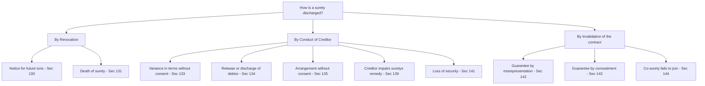
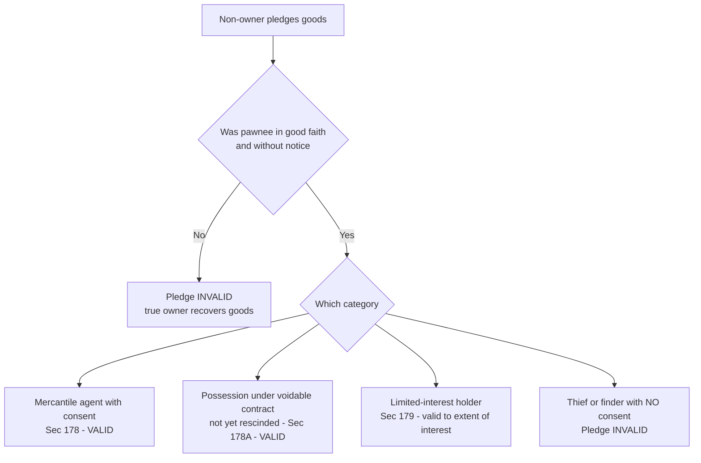
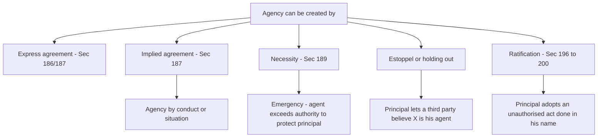
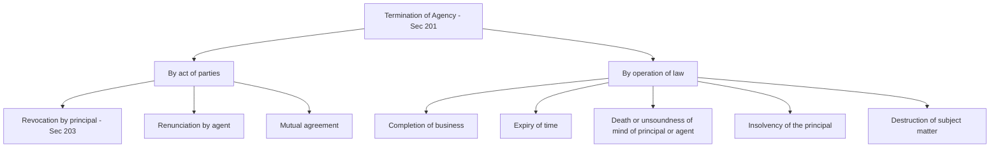

<!-- v1-foundation -->

# Foundation: Indian Contract Act 1872 — Special Contracts

> *"An ordinary contract is a promise between two people. A special contract is what the law builds when a THIRD interest walks into the room — a guarantor who stands behind a debtor, a warehouse that holds goods it does not own, an agent who signs deals in someone else's name. The moment a transaction stops being 'you and me' and becomes 'you, me, and a stranger whose money or goods are now on the line', ordinary contract law is not enough. Sections 124 to 238 are the law's answer to the three-cornered deal."*

---

## 1. The Problem it solves — Why ordinary contract law runs out

You already know the general law of contract (offer, acceptance, consideration, free consent, a lawful object — Sections 1–75). That law answers the two-party question beautifully: *A promises B something, B promises A something, and if either breaks the promise the other sues.* Clean.

But real commerce is almost never two clean parties. Three situations keep breaking the two-party model, and the general law simply has no vocabulary for them.

**Problem 1 — Nobody will lend to a person who has no track record.**
A bank will not give a ₹5,00,000 business loan to a fresh entrepreneur with no assets. The entrepreneur is a good bet, but the bank cannot *prove* it. The deal dies — unless a **third person** (a father, a business partner, an established firm) steps in and says *"Lend it to him. If he doesn't pay, I will."* Now there are three parties: the lender, the borrower, and the person standing behind the borrower. What exactly did that third person promise? When can the lender chase him? If he pays the bank, can he then chase the borrower? Ordinary contract law never contemplated a promise to answer for **someone else's** default. This is the **contract of guarantee** (and its cousin, **indemnity** — a promise to cover someone's loss). Sections **124–147**.

**Problem 2 — You constantly hand your goods to people who are not their owners.**
You give your car to a mechanic. Your suit to a dry-cleaner. Your gold to a bank locker or a jeweller. Your laptop to a courier. In every case **you still own the thing**, but someone else is physically holding it, and both of you understand it must come back (or go where you direct). What are that holder's duties? If your car is stolen from the garage, who bears the loss? Can the mechanic sell your car to recover his unpaid bill? What if a **finder** picks up a wallet on the road — does he own it now? Ordinary contract law, obsessed with promises, has nothing to say about the **custody of another's goods**. This is **bailment**, and its security-flavoured version **pledge**. Sections **148–181**.

**Problem 3 — One person cannot physically be everywhere or know everything.**
A Mumbai exporter cannot personally negotiate with a buyer in Chennai, sign the shipping papers in Kolkata, and stand in the auction hall in Delhi all at once. He must **act through other people** — a manager, a broker, a commission agent, an auctioneer. But the instant someone signs a contract *"on behalf of"* the exporter, a dangerous question appears: **is the exporter bound by what his agent did?** Even if the agent went beyond instructions? Even if the third party had no idea the agent was exceeding his authority? The whole machinery of modern business — every company, every bank branch, every power of attorney — runs on one person's acts binding another. This is the **contract of agency**. Sections **182–238**.

Notice the common thread. In each case a **third interest** enters: a surety's wallet, an owner's goods in another's hands, a principal bound by an agent's pen. General contract law assumes the two people in front of you are the only interests that matter. Special contracts are the rules for when that assumption breaks.

---

## 2. Core Idea — Three named relationships, each redistributing a risk

Strip away the section numbers and there is one idea running through the entire chapter:

> **A special contract is the law pre-writing the rulebook for a standard three-party risk, so the parties don't have to negotiate it every time.**

Each special contract is really an **answer to one question: when things go wrong, who bears the loss?**

| Special contract | The third interest | The core question it answers |
|---|---|---|
| **Indemnity** (124–125) | The indemnifier's money | If I suffer a loss because of you or a third party, do you make me whole? |
| **Guarantee** (126–147) | The surety's money | If the principal debtor defaults, can the creditor turn to the surety — and can the surety then recover from the debtor? |
| **Bailment** (148–171) | The owner's goods | While my goods sit in your hands, whose fault must it be before you pay for their loss? |
| **Pledge** (172–181) | Goods as security | Can a lender hold goods as security and **sell** them if the loan isn't repaid? |
| **Agency** (182–238) | The principal's legal position | When does one person's act legally count as another person's act? |

The genius of Sections 124–238 is that they are **default rules**. The parties can vary most of them by express agreement, but if they say nothing, the Act fills the gap with a fair, tested allocation of risk. That is why a dry-cleaner and a customer never sign a three-page contract — the Contract Act already wrote it for them in 1872.

---

## 3. Why it works this way — First-principles reasoning

Rote learners memorise "surety has rights against creditor, debtor and co-sureties." Let's instead *derive* each rule from a single fairness principle, so you never have to memorise — you can reconstruct.

**Principle A — A person who pays another's debt should be able to recover it.**
This one principle generates half of guarantee law. If the surety is forced to pay the bank because the borrower defaulted, it would be grotesque for the borrower to walk away debt-free while the surety is out of pocket. So the law gives the surety, on payment, **all the rights the creditor had against the debtor** (the right of **subrogation**, Sec 140) — the surety *steps into the creditor's shoes*. From the same principle: if there are several sureties, one who pays more than his share can make the others chip in (**right of contribution**, Sec 146–147). And because the surety is doing the creditor a favour by guaranteeing, the law protects him: if the creditor and debtor secretly change the deal, or the creditor releases the debtor, or loses a security, the surety is **discharged** (Sec 133–141). *The surety agreed to guarantee the deal he saw, not a different deal cooked up behind his back.*

**Principle B — Custody is not ownership; the holder owes the owner care, but is not an insurer.**
Why isn't the mechanic automatically liable when your car is stolen from his garage? Because he is a **bailee, not an insurer**. He promised *care*, not a *guarantee against all loss*. So the law asks a middle question: did he take **as much care as an ordinary prudent man would take of his own goods** (Sec 151)? If yes, and the car was stolen despite reasonable care, the loss falls on *you the owner* (Sec 152). If he was careless, the loss is his. This is the beating heart of bailment: **liability follows fault (negligence), not mere custody.** Everything else — the finder's duties, the bailee's lien, the bailor's duty to disclose defects — is just this fault principle applied to different facts.

**Principle C — You cannot give a better title than you have (nemo dat quod non habet) — but commerce needs exceptions.**
If a thief pledges your stolen watch to a pawnbroker, the pawnbroker gets nothing, because the thief had nothing to give. That is the default (**nemo dat**). But if the law stopped there, trade would freeze — buyers and lenders would have to investigate the entire ownership history of every object. So the Act carves **narrow exceptions** (Sec 178–178A: pledge by a mercantile agent, by a person in possession under a voidable contract, by a seller/buyer in possession) where an **innocent lender who acts in good faith** is protected. The tension between *protecting true owners* and *protecting honest commerce* is resolved case by case — and knowing *which* wins is exactly what the exam tests.

**Principle D — A principal who sends an agent into the world must bear the risks of that agency.**
Why is a principal bound even when his agent exceeds instructions, as long as the third party reasonably believed the agent was authorised (**apparent/ostensible authority**, Sec 237)? Because *the principal chose to act through an agent and clothed him with the appearance of authority.* Between two innocents — the third party who trusted the appearance, and the principal who created the appearance — the loss falls on the one who **created the risk**. The principal can then sue his agent for disobeying, but he cannot throw the loss onto the innocent outsider. This single idea — *the principal bears the risk of the appearance he creates* — explains apparent authority, agency by estoppel, and why a principal is bound by an agent's fraud committed in the course of business.

Hold these four principles in your head and you can *derive* nearly every section in this chapter without memorising a list.

---

## 4. Full technical content — ICAI-aligned (CA Foundation 2024)

### PART A — Indemnity and Guarantee (Sections 124–147)

#### A1. Contract of Indemnity (Sec 124–125)

**Definition (Sec 124):** A contract by which one party promises to save the other from loss caused to him **by the conduct of the promisor himself, or by the conduct of any other person.**

- The person who **promises to make good the loss** = **Indemnifier** (promisor).
- The person **whose loss is to be made good** = **Indemnity-holder / Indemnified** (promisee).

**Key points:**
- It is a **contingent contract** — the indemnifier's liability arises only if the contingency (the loss) occurs.
- Under the strict wording of Sec 124, only losses caused by *human conduct* are covered. Loss by **accident, fire, or act of God** is *not* an indemnity under Sec 124 (though English law and insurance practice take a wider view — an important trap).
- **Insurance contracts** (fire, marine, motor) are contracts of indemnity in substance; **life insurance is NOT** an indemnity (life has no measurable "loss" value — it is a contingent assurance).

**Rights of the indemnity-holder (Sec 125)** — when sued, he can recover from the indemnifier:
1. All **damages** he is compelled to pay in any suit regarding the matter covered;
2. All **costs** he is compelled to pay in bringing/defending such suit (if he acted prudently or with indemnifier's authority);
3. All **sums paid under a compromise** of such suit (if the compromise was prudent or authorised).

#### A2. Contract of Guarantee (Sec 126–147)

**Definition (Sec 126):** A contract of guarantee is a contract **to perform the promise, or discharge the liability, of a third person in case of his default.**

Three parties:
| Party | Role | Section term |
|---|---|---|
| **Surety** | Person who gives the guarantee | Surety |
| **Principal Debtor** | Person in respect of whose default the guarantee is given | Principal debtor |
| **Creditor** | Person to whom the guarantee is given | Creditor |

- A guarantee may be **oral or written** (Sec 126) — unlike English law which requires writing.
- There must be **three contracts**: creditor–debtor, creditor–surety, and an implied debtor–surety.
- **Consideration (Sec 127):** Anything done, or any promise made, **for the benefit of the principal debtor**, is sufficient consideration to the surety for giving the guarantee. The surety need not personally receive any benefit.
- **Liability of surety is co-extensive** with that of the principal debtor (**Sec 128**) — the surety is liable for exactly what the debtor is liable for, unless the contract provides otherwise. The creditor can proceed against the surety **without first exhausting remedies against the debtor** (surety's liability is immediate on default).

**Guarantee obtained by misrepresentation or concealment is INVALID:**
- **Sec 142:** Guarantee obtained by **misrepresentation** by the creditor about a material fact is **invalid**.
- **Sec 143:** Guarantee obtained by the creditor's **concealment** (keeping silence) of a material circumstance is **invalid**.
- **Sec 144:** Where a person gives a guarantee on condition that a **co-surety shall join**, and that co-surety does not join, the guarantee is **not valid**.

**Continuing Guarantee (Sec 129–131):**
- **Sec 129:** A guarantee which extends to a **series of transactions** is a *continuing guarantee* (e.g., guaranteeing all supplies made to X over the next year, not just one supply).
- **Sec 130:** A continuing guarantee may at any time be **revoked by the surety, as to future transactions, by notice** to the creditor. (Past transactions remain guaranteed.)
- **Sec 131:** A continuing guarantee is **revoked by the death of the surety** as to future transactions (unless a contrary intention appears). Again, past transactions stay covered.

#### A3. Distinction — Indemnity vs Guarantee

| Basis | Indemnity (124) | Guarantee (126) |
|---|---|---|
| **Parties** | Two — indemnifier & indemnity-holder | Three — surety, principal debtor, creditor |
| **Number of contracts** | One | Three |
| **Nature of liability** | Primary — indemnifier's own liability | Secondary — surety liable only on debtor's default; debtor is primarily liable |
| **Purpose** | To protect the promisee from a loss | To give assurance/security to the creditor for a debt |
| **Existing debt/duty** | No existing debt — liability is on a contingency that may never arise | A pre-existing (or contemplated) debt/duty of the principal debtor |
| **Request** | Indemnifier acts on his own; no request needed | Surety usually acts at the debtor's request |
| **Right to recover** | Indemnifier cannot sue third parties in his own name | Surety, on payment, is subrogated to creditor's rights against debtor (Sec 140) |

#### A4. Rights of the Surety

**(i) Against the Principal Debtor:**
- **Right of subrogation (Sec 140):** On payment/performance of the guaranteed debt, the surety steps into the creditor's shoes — he gets **all the rights the creditor had against the debtor**.
- **Right of indemnity (Sec 145):** In every contract of guarantee there is an **implied promise by the debtor to indemnify the surety**. The surety can recover from the debtor everything he has **rightfully paid** (but nothing he paid *wrongfully*).

**(ii) Against the Creditor:**
- **Right to securities (Sec 141):** The surety is entitled to the **benefit of every security** the creditor holds against the debtor at the time the guarantee is given — whether or not the surety knew of it. If the creditor **loses or parts with** such security without the surety's consent, the surety is **discharged to the extent of the value** of that security.
- **Right to set-off:** The surety can use, against the creditor, any set-off or counter-claim the debtor had.

**(iii) Against Co-sureties (Sec 146–147):**
- **Sec 146 (Right of contribution):** Where two or more persons are co-sureties for the same debt, they are liable, **as between themselves, to pay each an equal share** of the whole debt (or of the unpaid part), in the absence of a contract otherwise.
- **Sec 147:** Co-sureties bound in **different sums** are liable to pay **equally as far as the limits of their respective obligations permit** (equal shares up to the lowest maximum, then the next, etc.).

#### A5. Discharge of Surety (Sec 130–141) — how a surety escapes liability

**Detailed grounds of discharge:**

| Section | Ground | Effect on surety |
|---|---|---|
| **130** | Revocation of continuing guarantee by notice | Discharged as to **future** transactions |
| **131** | Death of surety | Discharged as to **future** transactions |
| **133** | **Variance** — any change in the terms of the debtor–creditor contract **without the surety's consent** | **Discharged** as to transactions after the variance (the surety guaranteed the *original* deal) |
| **134** | Creditor **releases the debtor**, or does any act/omission whose legal consequence is the debtor's discharge | Surety **discharged** |
| **135** | Creditor **compounds** with (makes a composition with), or **promises to give time to**, or agrees **not to sue** the debtor — without surety's consent | Surety **discharged** |
| **139** | Creditor does any act **inconsistent with the surety's rights**, or **omits** a duty owed to the surety, impairing the surety's eventual remedy against the debtor | Surety **discharged** |
| **141** | Creditor **loses or parts with security** without surety's consent | Discharged **to the extent of the value** of the security |

**Important non-discharge points (traps):**
- **Sec 136:** The creditor giving time to the debtor by **agreement with a third person** (not the debtor) does **not** discharge the surety.
- **Sec 137:** **Mere forbearance to sue** the debtor, or to enforce any remedy against him, does **not** (absent a contrary contract) discharge the surety.
- **Sec 138:** Where there are **co-sureties**, release by the creditor of **one** co-surety does **NOT** discharge the others; the released co-surety also **remains liable to the others** for contribution.

---

### PART B — Bailment and Pledge (Sections 148–181)

#### B1. Bailment defined (Sec 148)

**Bailment** = the **delivery of goods by one person to another for some purpose, upon a contract that the goods shall, when the purpose is accomplished, be returned or otherwise disposed of according to the directions of the person delivering them.**

- Person **delivering** the goods = **Bailor**.
- Person to whom they are delivered = **Bailee**.
- The **ownership stays with the bailor**; only **possession** passes to the bailee.

**Three essentials of bailment:**
1. **Delivery of possession** (actual or constructive — e.g., handing over the keys of a warehouse).
2. **For a purpose** (repair, safe custody, carriage, hire, pledge, etc.).
3. **Return of the same goods** (in original or altered form) — this distinguishes bailment from a sale. If the goods need not be returned but an equivalent given (e.g., money deposited in a bank), it is **not** bailment.

**Kinds of bailment (by benefit):** (a) for the benefit of the bailor (free safe custody), (b) for the benefit of the bailee (gratuitous loan of an article to the bailee), (c) for mutual benefit (repair for a fee, hire, pledge). The standard of care and liability tilt with who benefits.

#### B2. Duties of the Bailee

| Sec | Duty | Substance |
|---|---|---|
| **151** | **Reasonable care** | Take as much care of the goods as a **man of ordinary prudence** would take of his own goods of the same bulk, quality and value. Same standard whether gratuitous or for reward. |
| **152** | Not liable for loss despite care | If the bailee took the Sec 151 care, he is **not responsible** for loss/destruction/deterioration (subject to a special contract). |
| **153–154** | **No unauthorised use** | Not to make any use inconsistent with the terms; if he does, the bailment is voidable at the bailor's option (154) and he is liable for any loss even by accident. |
| **155–157** | **No mixing** | Not to mix the bailor's goods with his own without consent (rules on separable / inseparable mixtures). |
| **160–161** | **Return on time** | Return the goods (without demand) once the purpose is accomplished or time expires; if he fails, he is liable for any loss thereafter **even without negligence** (161). |
| **163** | **Deliver accretions** | Deliver any increase or profit accruing from the goods (e.g., a calf born to a bailed cow) unless contract says otherwise. |

#### B3. Duties of the Bailor

| Sec | Duty | Substance |
|---|---|---|
| **150** | **Disclose defects** | A **gratuitous** bailor must disclose faults **known** to him. A bailor **for reward** is liable for **all** defects (known or not) — he cannot escape by pleading ignorance. |
| **158** | **Bear necessary expenses** | Where the bailment is **gratuitous** (bailee to receive no remuneration), the bailor must repay **necessary expenses** incurred for the purpose of the bailment. |
| **164** | **Indemnify bailee** | Bailor is responsible to the bailee for any loss suffered because the bailor was **not entitled** to make the bailment, receive back the goods, or give directions. |

#### B4. Rights of the Bailee — especially LIEN (Sec 170–171)

A **lien** is the right to **retain** the goods until the bailee's dues are paid. Two kinds:

| Type | Section | When it arises | Scope |
|---|---|---|---|
| **Particular lien** | **170** | Bailee has by his **labour or skill** improved the goods (mechanic who repaired the car, tailor who stitched cloth) | Retain **only those specific goods** worked on, until paid for **that** work. Does **not** cover unrelated dues. |
| **General lien** | **171** | Available only to **bankers, factors, wharfingers, attorneys of a High Court, policy-brokers** (or by express agreement) | Retain **any** goods of the debtor for a **general balance of account** — any amount due, not just for these goods. |

- A particular lien requires **value added by skill/labour**; mere custody (pure safe-keeping) gives **no** particular lien unless agreed.

#### B5. Finder of Goods (Sec 71 + 168–169)

A person who **finds goods belonging to another and takes them into custody** is treated as a **bailee** (Sec 71). His position:

- He must take reasonable care (Sec 151) and try to find the true owner; he cannot appropriate the goods.
- **Rights (Sec 168):** He may **retain** the goods against the owner until compensated for **trouble and expense** voluntarily incurred to preserve the goods and find the owner. He **cannot sue** the owner for such compensation, **but** where the owner had offered a **specific reward**, the finder may **sue for that reward** and may retain the goods until it is paid.
- **Right to sell (Sec 169):** The finder may **sell** when: (a) the owner cannot with reasonable diligence be found, **or** refuses to pay lawful charges; **AND** either the thing is **in danger of perishing / losing the greater part of its value**, **OR** the **finder's lawful charges amount to two-thirds of the value** of the thing.

#### B6. Pledge (Sec 172–181) — bailment as security

**Pledge (Sec 172):** the **bailment of goods as security for payment of a debt or performance of a promise.**
- Bailor here = **Pawnor** (Pledgor). Bailee = **Pawnee** (Pledgee).
- A pledge is a **special kind of bailment** — the *purpose* is security. All bailment duties apply, plus the special pledge rights below.

**Rights of the Pawnee:**
| Sec | Right |
|---|---|
| **173** | **Retainer** — retain the pledged goods for the debt, interest, and all necessary expenses. |
| **174** | Retainer limited to the debt for which goods were pledged (no retainer for other debts unless agreed). |
| **175** | Recover **extraordinary expenses** for preservation (right to *recover*, not to *retain*). |
| **176** | On **default**, two alternative remedies: (a) **sue** on the debt and retain the goods as collateral security; **OR** (b) **sell** after giving the pawnor **reasonable notice**. Surplus goes to the pawnor; shortfall remains recoverable. **Notice of sale is mandatory.** |
| **177** | **Right of redemption** — the pawnor may **redeem** the goods any time **before the actual sale**, on paying the debt and any expenses caused by his default. |

#### B7. Pledge by Non-Owners (Sec 178, 178A, 179) — the nemo dat exceptions

General rule: only the **owner** can create a valid pledge (nemo dat quod non habet). Exceptions where a non-owner's pledge **binds the true owner** if the pawnee acted in **good faith and without notice**:

| Sec | Who can pledge though not owner | Condition |
|---|---|---|
| **178** | A **mercantile agent** in possession of goods (or documents of title) **with the owner's consent** | Pawnee in good faith, without notice the agent lacked authority to pledge |
| **178A** | A person in possession under a **voidable contract** (Sec 19/19A) **not yet rescinded** | Valid if pawnee in good faith, without notice of the defect in title |
| **179** | A person with only a **limited interest** in the goods | Pledge valid **only to the extent of that interest** |

Also (Sale of Goods Act parallels): a **seller in possession** after sale, and a **buyer in possession** before full payment, can pass a good pledge to an innocent pawnee.

---

### PART C — Contract of Agency (Sections 182–238)

#### C1. Foundations (Sec 182–185)

- **Agent (Sec 182):** a person **employed to do any act for another, or to represent another in dealings with third persons.**
- **Principal:** the person for whom such act is done, or who is so represented.
- The defining function of an agent is to **create a legal relationship between the principal and a third party.** An agent is a *conduit*, not a party in his own right.
- **Who may be a principal (Sec 183):** any person **of the age of majority** and **of sound mind**.
- **Who may be an agent (Sec 184):** **any person** may become an agent — even a **minor or a person of unsound mind** — but such an agent is **not personally liable** to the principal. Between principal and third party the agency is fully effective.
- **Consideration not necessary (Sec 185):** **No consideration is needed** to create an agency — a famous exception to the general rule.

#### C2. Modes of creation of agency

- **Express / Implied (Sec 186–187):** Authority may be **express** (spoken or written) or **implied** — inferred from circumstances, conduct, or the ordinary course of dealing.
- **Agency by necessity (Sec 189):** In an **emergency**, an agent has authority to do all acts a **person of ordinary prudence** would do to **protect his principal from loss** (e.g., a carrier of perishable goods, unable to reach the owner, sells them to prevent total loss).
- **Agency by estoppel / holding out:** If a principal by words or conduct **leads a third party to believe** a person is his agent, and the third party acts on it, the principal is **estopped** from denying the agency (foundation of *apparent authority*).
- **Agency by ratification (Sec 196–200):** see C5.

#### C3. Kinds of agents

| Agent | What he does |
|---|---|
| **Del credere agent** | For **extra commission**, **guarantees** to his principal that the buyers he introduces will pay — agent **and surety** for the buyer's solvency. |
| **Factor** | A mercantile agent **entrusted with possession** of goods, with authority to sell in his own name; may have a general lien. |
| **Broker** | A mercantile agent who **negotiates** deals but is **not** given possession; makes contracts between buyer and seller. |
| **Auctioneer** | An agent to sell goods **by public auction**; the seller's agent (and becomes the buyer's agent on the fall of the hammer). |
| **Commission / Mercantile agent** | Buys/sells for a principal for commission, in the ordinary course of business. |
| **Sub-agent & Substituted agent** | See C6. |

#### C4. Authority of an agent

| Type | Section | Meaning |
|---|---|---|
| **Actual authority** | 186–187 | Authority actually conferred — **express** (words) or **implied** (conduct/course of business). |
| **Apparent / Ostensible authority** | 237 | Authority the agent **appears** to have because the **principal's conduct** led the third party to believe it — even without actual authority. Principal is **bound**. |
| **Authority in emergency** | 189 | Extended authority to protect the principal from loss in an emergency. |

- **Extent of authority (Sec 188):** An agent authorised to do an act has authority to do **every lawful thing necessary** to do it; an agent authorised to carry on a business may do everything **usual** in the ordinary course of that business.
- **Sec 237 (core rule of apparent authority):** When an agent has, **without authority, done acts or incurred obligations** to third persons, the **principal is bound** if he has by his **words or conduct induced** the third persons to believe the agent acted within authority.

#### C5. Agency by Ratification (Sec 196–200)

**Ratification = subsequent adoption of an unauthorised act as though it had been authorised from the start.** When a person acts on behalf of another without authority, the other may **reject** or **ratify**.

**Conditions for a valid ratification:**
1. **Act done on behalf of the person ratifying** — the agent must have purported to act for a **named or identifiable principal** (cannot ratify an act done in the actor's own name).
2. **Principal in existence and competent** to contract at the time the act was done (crucial for company promoters — a company not yet in existence cannot ratify a pre-incorporation contract).
3. **Full knowledge (Sec 198):** No valid ratification where knowledge of the facts is **materially defective**.
4. **Ratify the whole (Sec 199):** Ratification of **part** of an unauthorised act = ratification of the **whole** transaction.
5. **Lawful act** — a void/unlawful act cannot be ratified.
6. **Sec 200:** Ratification cannot **subject a third party to damages, or terminate any right or interest** of a third person that had vested before ratification.

**Effect (Sec 197):** Ratification may be **express or implied**; once ratified, the act is treated as **authorised from the beginning** (doctrine relates back — *ratihabitio retrotrahitur*).

#### C6. Sub-agent (Sec 190–195) and Substituted agent

A **sub-agent** is a person **employed by, and acting under the control of, the original agent** in the business of the agency (Sec 191).

- **General rule (Sec 190):** An agent **cannot lawfully delegate** — *delegatus non potest delegare* — unless the custom of trade permits, the nature of the work requires it, or the principal consents.
- **Properly appointed sub-agent (Sec 192):** the principal is bound by, and responsible for, the sub-agent's acts **as if he were the agent's own agent**; the **agent** is responsible to the principal for the sub-agent; the **sub-agent is responsible to the agent** (not to the principal, except for fraud/wilful wrong).
- **Improperly appointed sub-agent (Sec 193):** the **agent alone is responsible** to the principal and to third parties; the principal is **not** represented by, nor responsible for, the sub-agent's acts.
- **Substituted agent (Sec 194–195):** Where the agent, **with the principal's authority, names another person to act for the principal**, that person is a **substituted agent** (not a sub-agent) — the **principal's direct agent**. The agent's job was merely to *select* him, and the agent is only bound to select with reasonable care (Sec 195).

| Basis | Sub-agent (191) | Substituted agent (194) |
|---|---|---|
| Appointed to | act **under the control of the agent** | act **directly for the principal** |
| Privity with principal | **No privity** (except fraud) | **Direct privity** — he is the principal's agent |
| Agent's liability | Agent responsible for sub-agent's acts | Agent only liable for **negligent selection** |

#### C7. Duties and Rights of an agent

**Duties of the agent:**
| Sec | Duty |
|---|---|
| 211 | Conduct the business **according to the principal's directions**, or the custom of trade |
| 212 | Act with **reasonable skill and diligence**; compensate for losses from want of skill |
| 213 | Render **proper accounts** on demand |
| 214 | Use reasonable **diligence to communicate** in difficulty and seek instructions |
| 215–216 | **Not to deal on his own account** without consent (no secret profit; principal may repudiate (215) or claim the benefit (216)) |
| 217–218 | **Pay over all sums received**; no secret profit; **not to set up an adverse title** (fiduciary) |

**Rights of the agent:**
| Sec | Right |
|---|---|
| 217 | **Retainer** — retain, out of sums received, his **remuneration and expenses** |
| 219 | **Remuneration** — due when the act is completed (unless otherwise agreed) |
| 220 | **No remuneration** for business misconducted |
| 221 | **Lien** — retain the principal's goods/papers until dues are paid |
| 222–225 | **Indemnity** — against consequences of **lawful acts** (222), acts done in **good faith** (223), and injury from the principal's neglect (225); **no** indemnity for **criminal acts** (224) |

#### C8. Personal liability of the agent to third parties (Sec 230)

**General rule (Sec 230):** absent a contrary contract, an agent **can neither personally enforce nor be bound by** contracts made on behalf of his principal. The **principal** is the contracting party.

**Three presumptions where the agent IS personally liable (Sec 230):**
1. Contract by an agent for sale/purchase of goods for a **merchant resident abroad** (foreign principal);
2. Agent does **not disclose the name of his principal** (undisclosed principal);
3. **Principal, though disclosed, cannot be sued** (e.g., foreign sovereign, minor principal).

Plus: personally liable if he **expressly agrees**, acts for a **non-existent/incompetent principal** (promoter for an unformed company), or **exceeds authority** (breach of warranty of authority).

#### C9. Termination of Agency (Sec 201–210)

**Key rules on revocation:**
- **Sec 202 — Agency coupled with interest is IRREVOCABLE:** Where the agent **himself has an interest in the subject-matter** (e.g., goods consigned against advances he made), the agency **cannot be terminated** to the prejudice of that interest, absent an express contract. It also **survives the principal's death/insanity**.
- **Sec 203–204:** The principal may revoke authority **before it has been exercised**; he **cannot revoke** after the agent has **partly exercised** it as regards acts already done and obligations already arisen.
- **Sec 205:** For an agency for a **fixed period**, premature revocation/renunciation **without sufficient cause** entitles the other party to **compensation**.
- **Sec 206:** **Reasonable notice** of revocation/renunciation must be given, else liability for resulting damage.
- **Sec 208 — When termination takes effect:** Termination does **not take effect against the agent** until **known to him**, and **against third parties** until **known to them** (protects innocent third parties).
- **Sec 209:** On the principal's death/insanity, the agent must take **reasonable steps to protect** the interests entrusted to him.
- **Sec 210:** Termination of the agent's authority **terminates the authority of all sub-agents** under him.

---

## 5. Worked examples (Issue–Rule–Application–Conclusion)

### Example 1 — Guarantee: discharge by variance and loss of security (Sec 133 & 141)

**Facts.** A **bank (creditor)** lends **₹8,00,000** to **Ravi (principal debtor)** for one year at 12% p.a., against (i) a personal **guarantee from Meena (surety)** and (ii) the bank's charge over Ravi's machinery worth **₹3,00,000**. Six months later, **without telling Meena**, the bank (a) agrees with Ravi to **raise interest to 15%** and **extend** the loan by another year, and (b) **releases the charge on the machinery** so Ravi can sell it. Ravi defaults owing **₹8,00,000** principal. The bank sues Meena for the whole ₹8,00,000.

**Issue.** To what extent, if any, is Meena liable?

**Rule.**
- **Sec 133** — Any **variance in the terms** of the creditor–debtor contract, made **without the surety's consent**, **discharges the surety**. The rate change (12%→15%) and time extension are exactly such a variance.
- **Sec 141** — If the creditor **loses or parts with a security** without the surety's consent, the surety is **discharged to the extent of the value** of that security (here ₹3,00,000).

**Application.**
- The bank altered the interest rate and tenure **without Meena's consent** → under **Sec 133** Meena is **wholly discharged**. She guaranteed a 12%, one-year loan, not a 15%, two-year loan. A *variance* (not mere forbearance) gives **total** discharge.
- Independently, releasing the ₹3,00,000 machinery security without consent would have discharged her **to the extent of ₹3,00,000** under **Sec 141**, leaving at most ₹5,00,000.

**Conclusion.** Because of the unauthorised **variance (Sec 133)**, **Meena is completely discharged and owes nothing.** (Had only the security been released, she would owe ₹8,00,000 − ₹3,00,000 = **₹5,00,000**.) The bank must pursue Ravi alone.

*Self-check:* ₹8,00,000 − ₹3,00,000 = ₹5,00,000 (Sec 141 figure); Sec 133 supersedes → ₹0. Consistent.

---

### Example 2 — Pledge: sale on default, surplus/shortfall accounting (Sec 176)

**Facts.** **Sunil (pawnor)** borrows **₹1,00,000** from **Gold Finance Ltd (pawnee)** and pledges gold jewellery. Interest accrues to **₹12,000**; the pawnee incurs **₹3,000** on safe custody/insurance (necessary expenses, Sec 173). Sunil defaults. After **reasonable notice** (Sec 176), the pawnee **sells** the jewellery.

- **Scenario A** — sale fetches **₹1,40,000.**
- **Scenario B** — sale fetches **₹1,05,000.**

**Issue.** How is the sale price distributed, and does any liability survive?

**Rule.** On default the pawnee may **sell after reasonable notice (Sec 176)**, first recovering the **debt + interest + necessary expenses (Sec 173)**. **Surplus** belongs to the pawnor; a **shortfall** remains recoverable from the pawnor as a personal debt.

**Application — total dues:**
| Item | Amount (₹) |
|---|---|
| Principal | 1,00,000 |
| Interest | 12,000 |
| Necessary expenses (Sec 173) | 3,000 |
| **Total due to pawnee** | **1,15,000** |

**Scenario A (₹1,40,000):** 1,40,000 − 1,15,000 = **Surplus ₹25,000** → payable to Sunil. Check: 1,15,000 + 25,000 = 1,40,000 ✓

**Scenario B (₹1,05,000):** 1,05,000 − 1,15,000 = **Shortfall ₹10,000** → Sunil remains personally liable. Check: 1,05,000 + 10,000 = 1,15,000 ✓

**Conclusion.** In A, the pawnee keeps ₹1,15,000 and **returns ₹25,000** to Sunil. In B, the pawnee applies the full ₹1,05,000 and **may sue Sunil for the ₹10,000 balance**. A sale **without** reasonable notice would be invalid as a sale (though the debt could still be sued on) and could make the pawnee liable to Sunil.

---

### Example 3 — Bailee: reasonable care vs unauthorised use (Sec 151, 152, 154)

**Facts.** **Anita** leaves her car (value **₹6,00,000**) with **QuickFix Garage** for servicing, on terms it be kept in the locked workshop.
- **(i)** Despite a locked, alarmed workshop, thieves break in overnight and steal the car.
- **(ii)** A mechanic, without permission, **takes the car for a joyride** to another city, where it is destroyed in an accident.

**Issue.** In which situation is the garage liable to pay ₹6,00,000?

**Rule.**
- **Sec 151/152** — the bailee must take the care of an **ordinary prudent man**; if he did, he is **not liable** for loss.
- **Sec 154** — for **unauthorised use** inconsistent with the terms, the bailee is liable for **any loss, even by accident** — liability becomes **absolute**.

**Application.**
- **(i)** Locking and alarming the workshop is ordinary-prudent-man care; the theft occurred **despite** it. Under **Sec 152** the garage is **not liable**; the ₹6,00,000 loss falls on Anita. Custody is not insurance.
- **(ii)** The joyride is a use **wholly inconsistent** with the bailment. Under **Sec 154** the garage is liable for **any** ensuing loss **even by accident**; negligence need not be proved.

**Conclusion.** In **(i)** the garage owes **nothing**; in **(ii)** it is **absolutely liable for ₹6,00,000**. The dividing line is not *how bad the loss* but *whether the bailee stayed within the terms.*

---

### Example 4 — Agency: apparent authority and ratification (Sec 237, 196–199)

**Facts.** **Mehta & Co.** appoints **Karan** as showroom manager with written authority to sell **up to ₹2,00,000** per contract, but routinely lets Karan sign **larger** deals and honours them. A regular customer, **Deepak**, buys stock worth **₹3,50,000** from Karan, who signs "for Mehta & Co." Separately, Karan — **with no authority at all** — buys a delivery van for **₹4,00,000** "on behalf of Mehta & Co." from **Verma Motors**. Mehta & Co. then **uses the van and pays the first instalment.**

**Issue.** (a) Is Mehta & Co. bound to Deepak for ₹3,50,000 though Karan's written cap was ₹2,00,000? (b) Is it bound to Verma Motors for the van?

**Rule.**
- **Sec 237** — a principal is **bound** by an agent's unauthorised act if the principal's **own conduct induced** the third party to believe the agent had authority (apparent authority).
- **Sec 196–199** — a principal may **ratify** an unauthorised act done on his behalf; ratification may be **implied by conduct** (197), and ratifying **part** ratifies the **whole** (199); once ratified the act is authorised **from the beginning**.

**Application.**
- **(a)** By habitually honouring above-cap deals, Mehta & Co. **held Karan out** as having wider authority. Deepak reasonably relied. Under **Sec 237** the apparent authority **binds Mehta & Co.** for ₹3,50,000, despite Karan breaching his *internal* ₹2,00,000 limit. Mehta & Co. may separately proceed against Karan.
- **(b)** Karan had **no** authority and was never held out for vehicle purchases, so Sec 237 does not apply. **But** by **using the van and paying an instalment**, Mehta & Co. **impliedly ratified** the purchase (Sec 197). Ratification relates back (Sec 196) and, having taken the benefit, it cannot ratify only part — it ratifies the **whole ₹4,00,000** (Sec 199). Mehta & Co. is **bound for ₹4,00,000**.

**Conclusion.** Mehta & Co. is liable to **Deepak (₹3,50,000) via apparent authority (Sec 237)** and to **Verma Motors (₹4,00,000) via ratification (Sec 196–199)** — two routes by which an unauthorised act still binds the principal. Total enforceable exposure created by Karan: ₹3,50,000 + ₹4,00,000 = **₹7,50,000**.

---

## 6. Connections — what this unlocks in CA Intermediate

- **Guarantee & indemnity → Inter Auditing & Financial Statements:** bank guarantees and letters of credit are **contingent liabilities** to disclose and audit; co-extensive liability (Sec 128) explains why they sit off-balance-sheet until crystallised.
- **Ratification & pre-incorporation contracts → Inter Company Law (Incorporation, Promoters):** the Sec 196 rule that a principal must **exist** at the time of the act is *the* reason a company **cannot ratify** a promoter's pre-incorporation contract — a directly examined Inter point.
- **Agency → Inter Company Law (Directors & KMP):** directors are the company's agents; **actual/apparent/ostensible authority**, the **doctrine of indoor management**, and **ultra vires** are agency (Sec 186–237) transplanted into the Companies Act.
- **Pledge & bailee's lien → Inter Registration of Charges & banking:** hypothecation and pledge of stock as loan security build on Sec 172–176.
- **Del credere agent & bailment → Inter consignment accounting:** consignor–consignee and del credere commission are agency law expressed as ledger entries.

---

## 7. Traps & common mistakes

- **Indemnity = TWO parties; guarantee = THREE.** Do not draw three parties into an indemnity answer.
- **Sec 124 covers only loss by human conduct.** Loss by **fire/accident/act of God** is *not* an indemnity under the strict definition. Don't blindly say "insurance = indemnity."
- **Guarantee can be ORAL (Sec 126).** "Must be in writing" is English law, not Indian.
- **Variance (Sec 133) discharges WHOLLY; loss of security (Sec 141) only to the EXTENT of the security.** Don't confuse magnitudes.
- **Mere forbearance to sue (Sec 137) does NOT discharge**, but *giving time by binding agreement / compounding* (Sec 135) **does**.
- **Release of ONE co-surety (Sec 138) does NOT release the others** — the released one even stays liable for contribution.
- **Bailee's standard is the SAME (Sec 151) whether gratuitous or for reward** — the *reward* affects the *bailor's* disclosure duty (Sec 150), not the bailee's care standard.
- **Particular lien (170) needs skill/labour; general lien (171) only for bankers, factors, wharfingers, attorneys, policy-brokers.**
- **Pledge sale (Sec 176) REQUIRES reasonable notice**; pawnor may redeem **any time before actual sale** (Sec 177).
- **Sub-agent (191) has NO privity with the principal; substituted agent (194) IS the principal's direct agent.**
- **Ratification needs an existing, competent, NAMED principal (196), full knowledge (198), and ratifies the WHOLE (199).**
- **No consideration for agency (185); a minor can be an agent (184).**
- **Termination binds the agent only when he KNOWS, third parties only when they KNOW (Sec 208).**
- **Agency coupled with interest is irrevocable (Sec 202)** — a principal cannot *always* revoke.

---

## 8. First-principles recap

- **A special contract is the law's pre-written rulebook for a three-party risk** — indemnity/guarantee (whose money covers a default), bailment/pledge (whose fault before the holder pays), agency (when one person's act counts as another's).
- **A person forced to pay another's debt should recover it** — generating the surety's subrogation (140), indemnity (145) and contribution (146–147) rights.
- **Custody is not insurance** — a bailee owes *reasonable care* (151); loss despite it falls on the **owner** (152); step outside the terms (154) and liability turns **absolute**.
- **Nemo dat quod non habet** — you cannot pass a better title than you hold, but narrow good-faith exceptions (178, 178A, 179) keep honest commerce moving.
- **A principal bears the risk of the appearance he creates** — apparent authority (237) and ratification (196–200) both make an unauthorised act bind the principal.
- **Agency needs no consideration and even a minor may be an agent** — the agent is a legal *conduit*, not a contracting party in his own right.

---

## 9. Quick-reference table

| Topic | Key sections | One-line rule |
|---|---|---|
| Indemnity — definition & rights | **124, 125** | Save from loss by human conduct; recover damages, costs, compromise sums |
| Guarantee — definition | **126** | Perform/discharge a third person's liability on default; oral or written |
| Consideration for guarantee | **127** | Benefit to the **principal debtor** suffices |
| Surety's liability co-extensive | **128** | Surety liable exactly as debtor, immediately on default |
| Continuing guarantee & revocation | **129, 130, 131** | Series of transactions; revocable for future by notice / surety's death |
| Discharge — variance | **133** | Unauthorised change → surety **wholly** discharged |
| Discharge — release/arrangement | **134, 135** | Release of debtor / giving time / composition → discharged |
| No discharge — forbearance | **136, 137** | Mere delay in suing does **not** discharge |
| Co-sureties | **138, 146, 147** | Release of one keeps others liable; equal contribution |
| Surety's rights | **140, 141, 145** | Subrogation; benefit of securities; indemnity from debtor |
| Guarantee invalid | **142, 143, 144** | Misrepresentation / concealment / co-surety fails to join |
| Bailment — definition & care | **148, 151, 152** | Possession for a purpose, to be returned; ordinary-prudent-man care |
| Bailor's duties | **150, 158, 164** | Disclose defects; pay expenses (gratuitous); indemnify |
| Bailee's lien | **170, 171** | Particular (skill/labour) vs general (banker/factor) |
| Finder of goods | **71, 168, 169** | Bailee's duties; retain for expenses; sell in defined cases |
| Pledge | **172** | Bailment of goods **as security** |
| Pawnee's remedies on default | **176** | **Sell after reasonable notice** or sue; surplus to pawnor, shortfall recoverable |
| Pawnor's redemption | **177** | Redeem any time **before actual sale** |
| Pledge by non-owner | **178, 178A, 179** | Good-faith pawnee protected — mercantile agent / voidable contract / limited interest |
| Agency — definition & capacity | **182, 183, 184, 185** | Agent represents principal; minor may be agent; **no consideration** |
| Authority | **186, 187, 188, 189, 237** | Actual (express/implied), incidental, emergency, **apparent** |
| Ratification | **196–200** | Adopt an unauthorised act; existing+named principal, full knowledge, whole act |
| Sub-agent vs substituted agent | **190–195** | Sub-agent under agent's control (no privity); substituted = principal's own |
| Agent's duties | **211–218** | Directions, skill, accounts, no secret profit, no adverse title |
| Agent's rights | **217, 219, 221, 222–225** | Retainer, remuneration, lien, indemnity |
| Agent's personal liability | **230** | Bound if foreign principal / undisclosed / principal can't be sued |
| Termination of agency | **201–210** | Act of parties / operation of law; **202 irrevocable**; **208 notice** |
