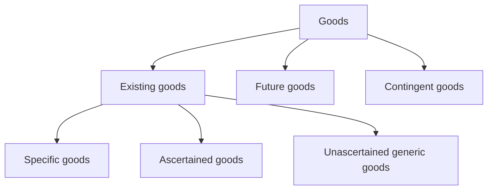
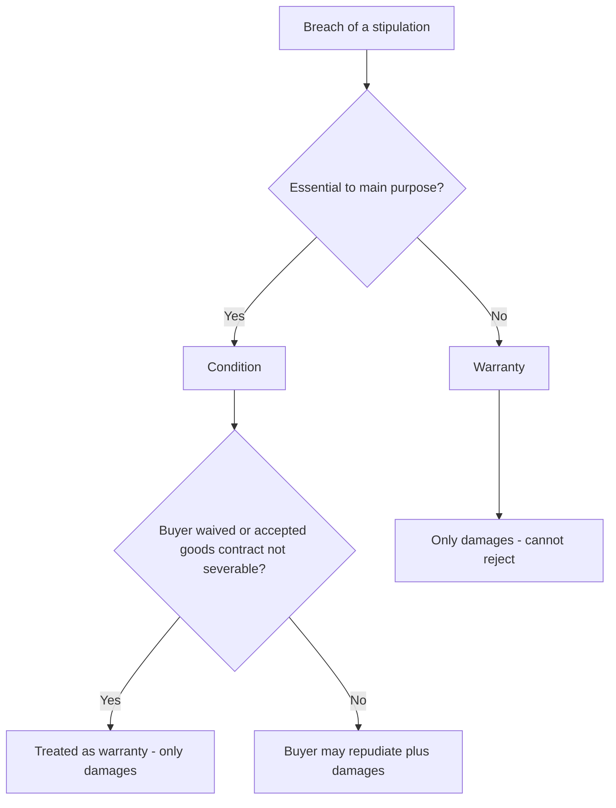
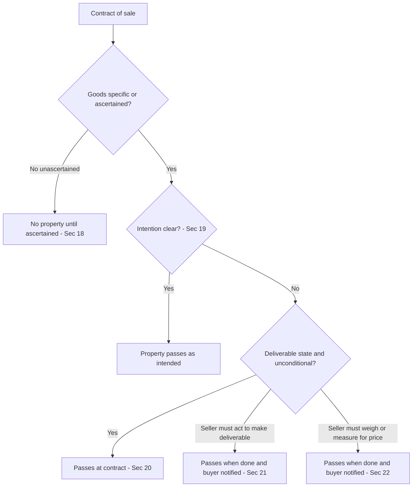
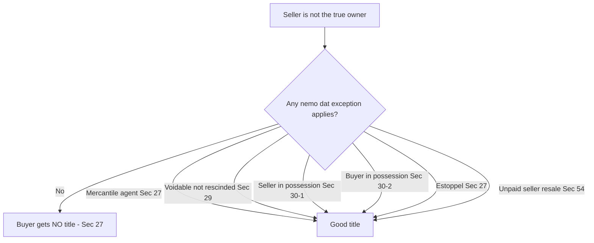
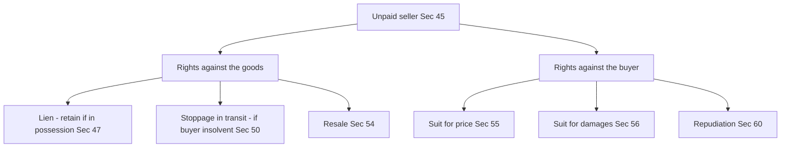

# Foundation: The Sale of Goods Act, 1930

## The Problem it solves

Imagine a fabric wholesaler in Surat agrees to supply 500 metres of silk to a boutique in Mumbai. Before the cloth leaves the warehouse, a fire destroys the godown. Who bears the loss — the seller who still had the goods, or the buyer who had already agreed to buy them? Now imagine the boutique took delivery but never paid; can the wholesaler grab the cloth back off the delivery truck? And what if the "silk" turns out to be a polyester blend — can the buyer reject it, or is she stuck with it because she never inspected it?

These are not hypothetical. Every commercial transaction in India where movable goods change hands for money runs on answers to exactly these questions:

- **When does ownership actually pass** — because whoever *owns* the goods bears the loss if they perish.
- **What quality can the buyer insist on**, and what happens if the goods are defective.
- **What can a seller do when the buyer doesn't pay** — even after the goods have left the seller's hands.
- **Who can give good title** — if a thief sells your car, does the innocent buyer get to keep it?

The general law of contract (the Indian Contract Act, 1872) tells you *when a contract is formed and enforceable*. But it says nothing specific about the peculiar mechanics of buying and selling **goods** — the passing of property, the seller's self-help remedies, the implied promises about quality. The **Sale of Goods Act, 1930** is the specialised statute that fills this gap. It was carved out of the old Contract Act (it used to be Sections 76–123 of the Contract Act) precisely because trade in goods needed its own detailed rulebook.

For a CA, this Act is not academic. When you audit a company, "when did property in goods pass?" is the same question as "when should revenue be recognised and inventory be de-recognised?" The accounting rule and the legal rule are two faces of one coin.

## Core Idea

**A sale of goods is a contract by which the seller transfers (or agrees to transfer) the *ownership* of movable goods to the buyer for a money consideration called the price — and the entire Act is a set of default rules deciding, at each moment, *who owns the goods, who bears the risk, and who can do what if things go wrong.***

Strip away the detail and the whole statute answers one master question in different situations: **"Where does the property (ownership) sit right now?"** Almost everything — risk of loss, the right to sue for the price, the unpaid seller's remedies, the ability to pass good title — flows from the location of *property in the goods*.

## Why it works this way

Start from first principles. Two parties want to exchange goods for money. The law could have said "nothing changes hands until money and goods swap simultaneously." But real commerce doesn't work that way — goods travel by rail for a week, credit is extended for 30 days, buyers order goods that don't exist yet (next season's crop). So the law needs rules for the *gap* between agreement and completion.

**Why separate "sale" from "agreement to sell"?** Because the moment of ownership transfer determines who suffers if the goods are destroyed. If ownership has passed, the goods are the buyer's — the buyer must pay even though he has nothing to show for it (*res perit domino* — the thing perishes for its owner). If ownership hasn't passed, the loss is the seller's. So the law draws a bright line: has property passed or not?

**Why the elaborate conditions/warranties machinery?** Because "the goods are defective" is too blunt. Some defects go to the *root* of the deal (you ordered a car and got a scooter) — the buyer must be able to walk away. Other defects are peripheral (the car's clock doesn't work) — it would be commercially absurd to let the buyer reject a ₹10 lakh car over a broken clock; he should get money compensation instead. So the law grades broken promises by *how central they are to the contract*.

**Why *caveat emptor* — "let the buyer beware"?** Because in a market economy the buyer chooses what to buy. If the law made the seller guarantee every purchase was fit for the buyer's private purpose, sellers couldn't price risk and trade would seize up. The default is: inspect before you buy, it's your risk. *But* — and this is the genius of the exceptions — where the buyer *reasonably relies on the seller's skill*, or the seller *actively conceals* a defect, the rationale for buyer-beware collapses, so the law shifts the risk back to the seller.

**Why give an unpaid seller special powers (lien, stoppage, resale)?** Because a seller who has parted with goods but not received money is dangerously exposed. A mere contractual right to sue for the price is cold comfort if the buyer is insolvent. So the law gives the seller *real* (property-based) self-help remedies against the goods themselves — but carefully limited, because once the buyer has paid or the goods are firmly in the buyer's possession, those powers must end.

**Why the *nemo dat* rule and its exceptions?** The base principle is *nemo dat quod non habet* — "no one can give what he does not have." A person without title cannot pass title. This protects true owners. But rigidly applied, it would make every purchase terrifying — you'd have to trace the ownership history of everything you buy. So the law creates careful exceptions that protect *innocent buyers* in situations where the true owner is the one who created the risk (e.g. left goods with a mercantile agent). The whole area is a balance between **protecting ownership** and **protecting the security of commercial transactions**.

Once you see the Act as a *risk-allocation engine* rather than a list of rules to memorise, every section has a reason.

## Full technical content

### 1. Scope, definitions and the contract of sale

The Act extends to the whole of India. It deals only with **goods** — i.e. **movable** property — and only where they are transferred **for a price** (money). It does **not** cover immovable property (land, buildings — governed by the Transfer of Property Act) nor gifts/barter (no money price) nor pure service contracts.

**Section 4 — Contract of sale.** A contract of sale of goods is a contract whereby the seller transfers or agrees to transfer the property in goods to the buyer for a price. It is the **genus**; "sale" and "agreement to sell" are its two **species**.

- Where property **passes at once** → it is a **sale** (Section 4(3)).
- Where property is to **pass at a future time** or **subject to some condition** to be fulfilled → it is an **agreement to sell** (Section 4(3)).
- An agreement to sell **becomes a sale** when the time elapses or the conditions are fulfilled (Section 4(4)).

**Essential elements of a contract of sale (Section 4):**

| # | Element | Explanation |
|---|---------|-------------|
| 1 | Two parties | A buyer and a seller must be different persons. One cannot buy one's own goods. (A part-owner can sell to another part-owner.) |
| 2 | Goods | Subject-matter must be **movable** goods (Section 2(7)). |
| 3 | Transfer of property | Ownership must be transferred or agreed to be transferred. Mere possession is not enough. |
| 4 | Price | Consideration must be **money**. Goods-for-goods = barter/exchange (not a sale). Goods partly for goods + partly money **can** be a sale. |
| 5 | All essentials of a valid contract | Free consent, competent parties, lawful object, consideration, etc. (via the Contract Act, 1872). |
| 6 | Includes both absolute and conditional | Covers outright sales and agreements to sell. |

**Sale vs Agreement to sell — the master distinction:**

| Basis | Sale | Agreement to sell |
|-------|------|-------------------|
| Nature of contract | Executed (completed) | Executory (to be completed) |
| Transfer of property | Passes immediately to buyer | Passes at a future date / on condition |
| Type of goods | Existing, specific goods | Future or contingent goods (usually) |
| Risk of loss (*res perit domino*) | Buyer bears loss even if goods still with seller | Seller bears loss (still owner) |
| Nature of right created | **Jus in rem** — right against the goods / whole world | **Jus in personam** — right against the person (buyer/seller) |
| Seller's remedy on breach | Sue for the **price** (goods are buyer's) | Sue for **damages** for non-acceptance only |
| Buyer's remedy if seller resells | Buyer can sue *later buyer* (owner) | Buyer can only claim **damages** from seller |
| On buyer's insolvency (price unpaid) | Seller can claim price / retain lien; goods are buyer's | Seller may refuse delivery (still owner) |
| On seller's insolvency (price paid) | Buyer can recover goods from Official Assignee | Buyer only proves as creditor for the amount paid |

**Sale distinguished from similar transactions:**

| Transaction | Key difference from sale |
|-------------|--------------------------|
| **Hire-purchase** | Possession given but ownership passes only on payment of last instalment; hirer may return goods any time. In sale, ownership+obligation to pay is fixed. |
| **Barter / exchange** | Goods for goods; no money price. |
| **Gift** | No consideration at all. |
| **Bailment** | Only *possession* transferred for a purpose; goods to be returned. No transfer of ownership. |
| **Contract for work and labour** | Skill/labour is the substance; goods incidental (e.g. a painter painting a portrait). If the substance is the transfer of a chattel, it is a sale. |

### 2. Goods and their classification (Sections 2(7), 6, 7, 8)

**Section 2(7) — "Goods"** means every kind of **movable property** other than **actionable claims** and **money**; and includes **stock and shares, growing crops, grass, and things attached to or forming part of the land which are agreed to be severed** before sale or under the contract of sale.

- *Money* is excluded (it is the medium of exchange, not goods). But old/rare coins sold as curios are goods.
- *Actionable claims* (e.g. a debt) are excluded.

**Classification of goods:**

**A. Existing goods** — owned or possessed by the seller at the time of contract. Sub-divided:

| Type | Meaning |
|------|---------|
| **Specific goods** [Sec 2(14)] | Goods **identified and agreed upon** at the time the contract is made (e.g. "my Maruti car bearing registration MH-01-AB-1234"). |
| **Ascertained goods** | Judicially, goods identified *after* the contract is made, in accordance with the agreement (a subset later marked off). |
| **Unascertained / generic goods** | Goods defined only by description, not yet identified (e.g. "100 bags of wheat out of my godown stock of 1,000 bags"). |

**B. Future goods** [Sec 2(6)] — goods to be **manufactured, produced or acquired** by the seller *after* making the contract. A present sale of future goods always operates as an **agreement to sell** (Sec 6(3)), never an immediate sale, because you cannot pass property in goods you don't yet have.

**C. Contingent goods** [Sec 6(2)] — a type of future goods whose acquisition by the seller depends on an **uncertain contingency** (e.g. "I will sell you the goods if the ship carrying them arrives").

**Effect of perishing of goods (Sections 7 and 8):**

| Section | Situation | Effect |
|---------|-----------|--------|
| **Sec 7** | **Specific** goods have **already perished** (or become so damaged as to no longer answer their description) at the time of the contract, **without the seller's knowledge** | Contract is **void** (mistake as to existence of subject-matter). |
| **Sec 8** | **Specific** goods perish **after** the agreement to sell but **before** property passes, **without fault** of seller or buyer | Agreement is **void** (frustration; risk had not yet passed to buyer). |

Note: Sections 7 & 8 apply only to **specific** goods. Generic goods do not "perish" in law — if your stock is destroyed you must still procure and deliver from elsewhere (*genus numquam perit* — the genus never perishes).

### 3. The Price (Sections 2(10), 9, 10, 12(2), 64A)

**Section 2(10) — "Price"** means the **money consideration** for a sale of goods.

**Section 9 — How price is fixed.** The price may be:
1. Fixed by the **contract**, or
2. Left to be fixed in a **manner agreed** (e.g. by valuation of a third party), or
3. Determined by the **course of dealing** between the parties.
4. Where none of these apply, the buyer must pay a **reasonable price** (a question of fact).

**Section 10 — Agreement to sell at valuation.** Where price is to be fixed by a **third party** and he **cannot or does not** make the valuation, the agreement is **void**. But if goods (or part) have already been **delivered to and appropriated by the buyer**, he must pay a **reasonable price** for them. If the third party is prevented from valuing by the **fault** of the seller or buyer, the party not at fault may sue the party in fault for **damages**.

**Section 64A** deals with the effect of changes in **taxes/duties** on the price (increase or decrease) unless a contrary intention appears in the contract.

### 4. Conditions and Warranties (Sections 11–17)

This is the heart of quality-liability. A **stipulation** in a contract of sale with reference to goods may be a condition or a warranty (Sec 12(1)).

**Section 12 — Condition vs Warranty:**

| Basis | Condition [Sec 12(2)] | Warranty [Sec 12(3)] |
|-------|----------------------|----------------------|
| Meaning | A stipulation **essential** to the main purpose of the contract | A stipulation **collateral** (subsidiary) to the main purpose |
| Goes to | The **root** of the contract | Not the root — a minor term |
| Breach entitles the buyer to | **Repudiate** the contract *and* claim damages; or treat it as a warranty | **Only claim damages**; cannot reject goods or repudiate |
| Dependence | An independent stipulation | A subordinate stipulation |

*Whether a stipulation is a condition or warranty depends on the **construction of the contract** — not on the word the parties used (Sec 12(4)).* A stipulation may be a condition even if called a "warranty," and vice-versa.

**Section 13 — When a condition sinks to a warranty (must-know):**

A breach of condition can be *treated only as* a breach of warranty (i.e. buyer loses the right to reject, keeps only damages) in these cases:

1. **Voluntary waiver** — the buyer *waives* the condition, or *elects* to treat the breach of condition as a breach of warranty [Sec 13(1)]. (Buyer's choice.)
2. **Acceptance** — where the contract is **not severable** and the buyer has **accepted** the goods (or part of them), the breach of any condition **can only** be treated as a breach of warranty — the buyer cannot now reject — **unless** the contract's terms say otherwise [Sec 13(2)]. (Compulsory, by law.)
3. **Impossibility** — where fulfilment of the condition is **excused by law** by reason of impossibility (Sec 13 read with frustration principles).

**Express and Implied conditions/warranties.** Parties may write in express terms (Sec 14 preserves them). The Act *also implies* certain conditions and warranties unless the contract shows a contrary intention:

**Implied CONDITIONS:**

| Section | Implied condition | Substance |
|---------|-------------------|-----------|
| **Sec 14(a)** | Condition as to **title** | The seller has a **right to sell** the goods (in a sale) / will have the right at the time property passes (agreement to sell). If title fails, buyer can recover the full price even after use. |
| **Sec 15** | Sale by **description** | Goods must **correspond with the description**. |
| **Sec 15** | Sale by description **and** sample | Bulk must match **both** the sample **and** the description. |
| **Sec 16(1)** | Fitness for **buyer's particular purpose** | Where the buyer *makes known* his particular purpose *and relies on the seller's skill/judgment*, and the goods are of a description the seller deals in — there is an implied condition they are **reasonably fit** for that purpose. |
| **Sec 16(2)** | **Merchantable quality** | Where goods are bought **by description from a seller who deals in such goods**, there is an implied condition they are of **merchantable quality** (saleable, fit for ordinary use). Proviso: if the buyer **examined** the goods, no condition as to defects a reasonable examination *ought to have revealed*. |
| **Sec 16(3)** | Condition implied by **trade usage** | An implied condition/warranty may be annexed by the usage of trade. |
| **Sec 17** | Sale by **sample** | (a) bulk must correspond with sample in quality; (b) buyer must have reasonable opportunity to compare bulk with sample; (c) goods must be free from any defect rendering them unmerchantable, not apparent on reasonable examination of the sample. |

**Implied WARRANTIES:**

| Section | Implied warranty | Substance |
|---------|------------------|-----------|
| **Sec 14(b)** | Warranty of **quiet possession** | Buyer shall have and enjoy quiet possession of the goods. |
| **Sec 14(c)** | Warranty of **freedom from encumbrances** | Goods shall be free from any charge or encumbrance in favour of a third party not declared to the buyer. |
| **Sec 16(3) / trade usage** | Warranty by **usage of trade** | As annexed by custom. |
| Judicial | Warranty to **disclose dangerous nature** | Where goods are inherently dangerous and the buyer is ignorant, the seller must warn; breach makes seller liable for injury. |

### 5. Caveat Emptor and its exceptions (Section 16)

**The rule — *caveat emptor* ("let the buyer beware").** Opening words of Section 16: *"Subject to the provisions of this Act… there is **no implied warranty or condition as to the quality or fitness** for any particular purpose of goods supplied under a contract of sale."* In other words, the buyer buys at his own risk; it is his duty to examine goods and satisfy himself. The seller is under no duty to point out defects.

**Exceptions (where the risk shifts to the seller):**

| # | Exception | Source |
|---|-----------|--------|
| 1 | **Fitness for buyer's purpose** — buyer makes purpose known and relies on seller's skill/judgment | Sec 16(1) |
| 2 | **Merchantable quality** — goods bought by description from a dealer in such goods | Sec 16(2) |
| 3 | **Sale by sample** — bulk must match sample; free from latent unmerchantable defect | Sec 17 |
| 4 | **Sale by description** — goods must correspond with description | Sec 15 |
| 5 | **Usage of trade** — fitness/quality implied by custom | Sec 16(3) |
| 6 | **Consent by fraud / concealment of defect** — where the seller obtains consent by fraud or **actively conceals a latent defect**, *caveat emptor* does not protect him | General law of fraud |

The unifying logic: *caveat emptor* protects a seller who was **passive and honest**. The moment the buyer *reasonably relies on the seller*, or the seller is *dishonest*, the maxim gives way to *caveat venditor* ("let the seller beware").

### 6. Transfer of property (ownership) — the pivot (Sections 18–20, 23–25)

"Property" here means **ownership**, not possession. Why it matters (recap): risk follows property (Sec 26); only the owner can generally pass title; the seller's remedy (price vs damages) depends on it.

**Section 19 — the golden rule: property passes when the parties *intend* it to pass** (for specific/ascertained goods). Intention is gathered from the terms of the contract, conduct of the parties, and circumstances. Where intention is unclear, the Act supplies **rules of ascertainment** (Sections 20–24).

**Section 18 — precondition for unascertained goods:** *No property* in unascertained goods passes until the goods are **ascertained**. (You cannot own "100 unspecified bags" — ownership needs a specific thing.)

**Rules for ascertaining intention:**

| Section | Situation | When property passes |
|---------|-----------|----------------------|
| **Sec 20** | **Specific goods in a deliverable state**, unconditional contract | Property passes **at the time of the contract**. Time of payment or delivery is immaterial. |
| **Sec 21** | Specific goods, seller **bound to do something to put them in a deliverable state** | Property passes when that **thing is done** *and* the **buyer has notice** of it. |
| **Sec 22** | Specific goods in deliverable state, but seller must **weigh/measure/test to ascertain the price** | Property passes when the act is done *and* the **buyer has notice**. |
| **Sec 23** | **Unascertained / future goods sold by description** | Property passes when goods of that description in a deliverable state are **unconditionally appropriated** to the contract (by one party with the other's assent). Delivery to a carrier for transmission (without reserving disposal) = appropriation. |
| **Sec 24** | Goods sent **on approval / "on sale or return"** | Property passes when the buyer (a) signifies **approval/acceptance**, or (b) **retains** the goods beyond the agreed/reasonable time without notice of rejection, or (c) does an **act adopting the transaction**. |
| **Sec 25** | Seller **reserves right of disposal** | Property does **not** pass until the conditions imposed (e.g. payment against documents) are fulfilled, even though goods delivered to a carrier. |

**"Deliverable state" (Sec 2(3))** = such a state that the buyer would, under the contract, be bound to take delivery of the goods.

### 7. Transfer of RISK (Section 26)

**Section 26 — Risk *prima facie* passes with property.** Unless otherwise agreed, goods remain at the **seller's risk until property is transferred to the buyer**; after property passes, they are at the **buyer's risk** — whether or not delivery has been made.

Three riders:
1. Where **delivery has been delayed** through the fault of either party, the goods are at the risk of the **party in fault** as regards any loss which might not have occurred but for the fault.
2. Risk and property may be **separated by agreement** (parties can agree risk passes at a different time).
3. This does not affect the duties/liabilities of either party as a **bailee** of the other's goods.

This section is why the "Who bears the fire loss?" question in the opener has a precise answer: locate the property, and the risk sits there.

### 8. Transfer of title by non-owners — *nemo dat quod non habet* (Sections 27–30)

**Section 27 — the rule.** *No one can give a better title than he himself has.* Where goods are sold by a person who is **not the owner** and who does not sell under the authority or consent of the owner, the **buyer acquires no better title than the seller had** — even a bona fide buyer for value gets nothing (subject to the exceptions below).

**Exceptions — where a non-owner CAN pass good title (protecting the innocent buyer):**

| # | Exception | Section | Condition |
|---|-----------|---------|-----------|
| 1 | **Sale by a mercantile agent** | Sec 27 (proviso) | Agent in possession of goods/documents **with owner's consent**, sells in ordinary course of business, buyer acts in good faith without notice of lack of authority. |
| 2 | **Sale by one of joint owners** | Sec 28 | A co-owner in **sole possession with consent** of the others passes good title to a good-faith buyer without notice. |
| 3 | **Sale under a voidable contract** | Sec 29 | Seller acquired goods under a contract **voidable** (e.g. by fraud/coercion) but **not yet rescinded**; buyer in good faith without notice gets good title. |
| 4 | **Seller in possession after sale** | Sec 30(1) | Seller who has sold but **continues in possession** of goods/documents, sells again to a good-faith buyer without notice → second buyer gets good title. |
| 5 | **Buyer in possession before property passes** | Sec 30(2) | Buyer who obtained possession **with seller's consent** before property passed, sells/pledges to a good-faith transferee → transferee gets good title. |
| 6 | **Estoppel** | Sec 27 | Where the **true owner by his conduct** leads the buyer to believe the seller had authority to sell, he is **estopped** from denying the seller's authority. |
| 7 | **Sale by an unpaid seller** exercising right of resale | Sec 54 | A resale by an unpaid seller under Sec 54 passes good title to the new buyer. |
| 8 | **Sale under other Acts** | — | e.g. sale by a **pawnee/pledgee** (Contract Act), **finder of goods**, **Official Assignee/Receiver**, or under statutory powers. |

### 9. Performance of the contract of sale (Sections 31–44)

**Section 31 — Duties.** It is the duty of the seller to **deliver** the goods and of the buyer to **accept and pay** for them, in accordance with the contract.

**Section 32 — Delivery and payment are *concurrent* conditions** (unless otherwise agreed): the seller must be ready and willing to give possession against payment, and the buyer ready and willing to pay against possession.

**Delivery (Sec 2(2))** — voluntary transfer of possession. Types:

| Type | Meaning |
|------|---------|
| **Actual** | Goods physically handed over. |
| **Symbolic** | Means of obtaining possession handed over (keys of a warehouse; a bill of lading). |
| **Constructive** (by attornment) | Third party in possession acknowledges holding goods on the buyer's behalf. |

**Rules as to delivery (Sec 33–39):**

| Section | Rule |
|---------|------|
| Sec 34 | Delivery of part **may** operate as delivery of the whole (if so intended); part-delivery to sever goods = delivery of only that part. |
| Sec 35 | Buyer must **apply for delivery** (no delivery duty until buyer asks, unless otherwise agreed). |
| Sec 36(1) | **Place of delivery** — as per contract; else the place at which goods are **at the time of sale** (or, for future goods, at the place of manufacture/production). |
| Sec 36(2) | If seller must send goods but no time fixed → within a **reasonable time**. |
| Sec 36(4) | Delivery demand/tender at an **unreasonable hour** is ineffectual. |
| Sec 37 | **Wrong quantity/mixed goods** — buyer may reject if short/excess/mixed, or accept the contract quantity and reject the rest, or accept the whole. |
| Sec 38 | **Instalment deliveries** — buyer is not bound to accept delivery by instalments unless agreed. |
| Sec 39 | **Delivery to carrier** — delivery to a carrier for transmission to the buyer is *prima facie* delivery to the buyer; seller must make a reasonable contract with the carrier. |
| Sec 41 | **Buyer's right to examine** — buyer not deemed to have accepted until he has had a reasonable opportunity to examine the goods to see they conform to the contract. |
| Sec 42 | **Acceptance** — buyer is deemed to accept when he (a) intimates acceptance, (b) does an act inconsistent with the seller's ownership, or (c) retains the goods beyond a reasonable time without rejecting. |
| Sec 43 | Buyer who rightly **refuses** goods is **not bound to return** them; enough to intimate refusal. |
| Sec 44 | If seller tenders delivery and buyer wrongfully **refuses/neglects** to take, buyer liable for any loss + reasonable **storage charges**. |

### 10. Rights of an unpaid seller (Sections 45–54)

**Section 45 — Who is an "unpaid seller"?** The seller is unpaid when (a) the **whole price has not been paid or tendered**, or (b) a **bill of exchange or other negotiable instrument** was received as conditional payment and the condition has not been fulfilled (e.g. the cheque bounced). The term "seller" includes an agent (e.g. a consignor/agent who has paid or is directly responsible for the price).

The unpaid seller has **two sets of rights**:

**A. Rights against the GOODS** (real rights — the powerful ones):

| Right | Section | When available | What it does |
|-------|---------|----------------|--------------|
| **Lien** | 46, 47, 48, 49 | Property has passed to buyer, but **goods still in seller's possession** | Right to **retain possession** until paid. Available where (i) goods sold without credit; (ii) credit term expired; (iii) buyer becomes insolvent. **Lost** when goods delivered to carrier (without reserving disposal), or buyer/agent lawfully obtains possession, or seller **waives** the lien. Note: lien is only for **price**, not storage; it is a right to *retain*, not resell. |
| **Stoppage in transit** | 50, 51, 52 | Property passed, seller **parted with possession**, buyer becomes **insolvent**, goods **in transit** (with a middleman carrier) | Right to **resume possession** while goods are in transit and retain them until paid. Transit ends when buyer/agent takes delivery, or carrier acknowledges holding for buyer, or buyer obtains delivery before arrival. Exercised by taking actual possession or giving **notice** to the carrier. |
| **Right of resale** | 54 | Lien or stoppage exercised (seller back in possession) | Seller may **resell** where (i) goods are **perishable**; (ii) seller gives **notice** to buyer of intention to resell and buyer still fails to pay within reasonable time; (iii) seller **expressly reserved** a right of resale. |

**Right of withholding delivery** — where property has **not** passed, the unpaid seller has, in addition, a right to withhold delivery similar to and co-extensive with lien and stoppage (Sec 46(2)).

**Effect of sub-sale/pledge by buyer (Sec 53):** the unpaid seller's lien or stoppage is **not affected** by any sale or pledge the buyer may have made, **unless** the seller **assented** to it, or a **document of title** has been transferred to a buyer who takes it in good faith for value (then transfer defeats lien/stoppage; if by way of pledge, the seller's right is subject to the pledge).

**Effect of resale under Sec 54:** A resale (whether or not notice was required/given):
- gives the **new buyer good title** as against the original buyer (Sec 54(3));
- where notice **was given** and there is a **loss** on resale, the seller can recover the loss as **damages**, and keeps any **profit**;
- where notice was **not given** (and it was required), the seller **cannot** recover the loss and **must account** to the buyer for any **profit** on resale.

**B. Rights against the BUYER personally** (in personam):

| Right | Section |
|-------|---------|
| Suit for the **price** (where property has passed / price payable on a day certain) | 55 |
| Suit for **damages** for non-acceptance | 56 |
| **Repudiation** before due date (anticipatory breach) → sue immediately | 60 |
| Suit for **interest** / special damages | 61 |

### 11. Auction sale (Section 64)

**Section 64** lays down the rules for sale by public auction:

| Sub-section | Rule |
|-------------|------|
| 64(1) | Where goods are put up in **lots**, each lot is *prima facie* a **separate contract of sale**. |
| 64(2) | Sale is **complete** when the auctioneer announces completion by the **fall of the hammer** or other customary manner. **Until then any bidder may retract** his bid. |
| 64(3) | Right to bid may be **reserved expressly** by or on behalf of the seller; then the seller (or one person on his behalf) may bid. |
| 64(4) | If the sale is **not** notified as subject to a right to bid on the seller's behalf, it is **unlawful** for the seller to bid himself, or employ a **puffer** (fake bidder to run up price). Such a sale may be treated as **fraudulent** by the buyer. |
| 64(5) | Sale may be notified **subject to a reserve (upset) price**. |
| 64(6) | If the seller uses **pretended bidding** to raise the price, the sale is **voidable** at the buyer's option. |

**Section 64A** — dealt with earlier: in the absence of a contrary agreement, changes in tax/duty after the contract are added to / deducted from the price accordingly.

## Worked examples

*(Law "problem sums" are application scenarios. Each is solved in Issue → Rule → Application → Conclusion (IRAC) style. Where numbers appear, they are internally verified.)*

### Worked Example 1 — Risk follows property, not possession (Sec 20 & 26)

**Facts.** On 1 April, Anand agrees to sell his specific consignment of 200 identified bales of cotton lying in his godown to Bharat for ₹8,00,000. The contract is unconditional and the cotton is in a deliverable state. Payment and delivery are fixed for 10 April. On the night of 5 April the godown catches fire (no fault of either party) and all 200 bales are destroyed. Bharat refuses to pay, arguing he never received the cotton. Can Anand recover the price?

**Issue.** Had *property* (ownership) in the cotton passed to Bharat before the fire, so that the risk of loss was his?

**Rule.**
- Sec 20: In an **unconditional** contract for the sale of **specific goods in a deliverable state**, property passes to the buyer **at the time the contract is made** — the time of payment or delivery is immaterial.
- Sec 26: Risk *prima facie* passes with property; goods are at the buyer's risk once property passes, whether or not delivery has been made.

**Application.** The goods were specific (200 identified bales), in a deliverable state, and the contract was unconditional. Therefore, under Sec 20, property passed to Bharat on **1 April** — the very day of the contract — even though delivery and payment were deferred to 10 April. Under Sec 26 the risk was Bharat's from 1 April. The fire on 5 April, without fault, destroyed *Bharat's own goods*.

**Conclusion.** The loss falls on Bharat (*res perit domino*). Anand can recover the **full price of ₹8,00,000**, even though Bharat receives nothing. (Accounting mirror: Anand would recognise the sale/revenue of ₹8,00,000 and the receivable; Bharat would carry a purchase and an ₹8,00,000 payable and book an ₹8,00,000 abnormal loss.)

*Verification:* Price ₹8,00,000 = receivable ₹8,00,000 in Anand's books = payable ₹8,00,000 in Bharat's books = loss ₹8,00,000 to Bharat. Consistent.

### Worked Example 2 — Condition sinking to a warranty on acceptance (Sec 13 & 16)

**Facts.** Chetna, a baker, tells Diamond Mills she needs "flour fit for making bread" and relies on the mill's judgment. She orders 50 quintals at ₹3,000 per quintal (total ₹1,50,000). She takes delivery, pays in full, and over three weeks uses 30 quintals before discovering the entire lot was substandard — bread made from it fails to rise. She wants to reject the whole 50 quintals and get her ₹1,50,000 back. What are her rights?

**Issue.** (i) Was there a breach of an implied *condition*? (ii) Having accepted and part-used the goods, can Chetna still reject, or is she limited to damages?

**Rule.**
- Sec 16(1): Where the buyer makes known the particular purpose and relies on the seller's skill/judgment (seller dealing in such goods), there is an implied **condition** the goods are reasonably fit for that purpose.
- Sec 13(2): Where the contract is **non-severable** and the buyer has **accepted** the goods (or part), the breach of a condition **can only** be treated as a breach of **warranty** — buyer cannot reject — unless the contract provides otherwise.
- Sec 42: Buyer is deemed to have accepted when he does an act inconsistent with the seller's ownership (here, consuming 30 quintals) or retains beyond a reasonable time.

**Application.** Chetna disclosed her purpose and relied on the mill's judgment — so Sec 16(1) implied a condition of fitness, which was breached (flour unfit for bread). *However*, she had **accepted** the goods: she paid, retained for three weeks, and used 30 of 50 quintals (an act inconsistent with the seller's ownership — Sec 42). The contract for a single lot is **non-severable**. Under **Sec 13(2)**, once she accepted, the broken condition is compulsorily reduced to a **warranty**. She therefore **cannot reject** the goods or reclaim the price.

**Conclusion.** Chetna is entitled only to **damages**, not rejection. Damages = the difference between the value the flour would have had if fit and its actual (defective) value, plus consequential loss.

*Illustrative quantification (verified):* If sound flour was worth ₹3,000/quintal and the defective flour had a salvage value of only ₹800/quintal, damages for diminished value = 50 × (₹3,000 − ₹800) = 50 × ₹2,200 = **₹1,10,000**. Plus, say, ₹15,000 wasted ingredients/consequential loss = **₹1,25,000** total claim. She keeps the goods (worth 50 × ₹800 = ₹40,000 salvage). Net position: ₹1,25,000 (damages) + ₹40,000 (salvage retained) = ₹1,65,000 — she is placed roughly where she'd have been with sound flour (₹1,50,000 paid + ₹15,000 lost ingredients avoided). Internally consistent.

### Worked Example 3 — Unpaid seller: stoppage in transit and resale (Sec 50, 54)

**Facts.** Eshwar sells 100 LED televisions to Falcon Electronics for ₹40,00,000 (₹40,000 each) on 30 days' credit, and dispatches them by a road transporter from Chennai to Delhi. Two days into the six-day transit, Eshwar learns Falcon has been declared **insolvent** and has paid nothing. Eshwar gives written notice to the transporter to stop and redeliver the goods. He then, after notifying Falcon, resells all 100 sets to a new buyer for ₹36,00,000. Advise Eshwar.

**Issue.** (i) Is Eshwar an unpaid seller entitled to stop the goods in transit? (ii) Is the resale valid, and can he recover the shortfall?

**Rule.**
- Sec 45: A seller is "unpaid" when the whole price has not been paid — here, nothing paid.
- Sec 50: An unpaid seller may **stop goods in transit** and resume possession when the **buyer becomes insolvent** and the goods are still **in transit** (in the hands of a middleman carrier).
- Sec 52: Stoppage is effected by taking possession or giving **notice to the carrier**.
- Sec 54: After stoppage, an unpaid seller who **gives notice** to the buyer of intention to resell may **resell**; on resale he can recover any **loss** as damages, and the new buyer gets **good title**.

**Application.** Eshwar is unpaid (nothing received). The goods were in transit with the transporter (a middleman) and had not reached Falcon; Falcon is insolvent. So the conditions of **Sec 50** are met — Eshwar validly resumed possession by notice to the carrier (Sec 52). Having regained possession and given Falcon due **notice** of resale, his resale under **Sec 54** is valid; the new buyer obtains good title; and because notice was given, Eshwar may recover the **loss** on resale as damages from Falcon.

**Conclusion.** Loss on resale = ₹40,00,000 − ₹36,00,000 = **₹4,00,000**, recoverable from Falcon as damages (Eshwar proves as a creditor in Falcon's insolvency for ₹4,00,000). The new buyer keeps the televisions.

*Verification:* Original price ₹40,00,000 (100 × ₹40,000) − resale ₹36,00,000 (100 × ₹36,000) = ₹4,00,000 shortfall. Had the resale *exceeded* the contract price, Eshwar would keep the profit (having given notice). Numbers tie out.

### Worked Example 4 — *Nemo dat*: sale under a voidable contract (Sec 29)

**Facts.** Gaurav, by misrepresentation, induces Harish to sell him a diamond ring worth ₹5,00,000, taking possession on 1 May. On 4 May, before Harish rescinds the contract, Gaurav sells the ring to Ishaan, a jeweller who buys in good faith for ₹4,80,000 with no notice of the fraud. On 6 May Harish discovers the fraud and demands the ring back from Ishaan. Can he recover it?

**Issue.** Did Gaurav, whose own title was *voidable*, pass a good title to Ishaan?

**Rule.**
- Sec 27: *Nemo dat quod non habet* — normally a non-owner cannot pass title.
- Sec 29 (exception): When the seller has obtained possession under a **voidable contract** (Sec 19/19A of the Contract Act — voidable for fraud/coercion/misrep) but the contract **has not been rescinded** at the time of sale, a buyer who buys **in good faith and without notice** of the seller's defect of title acquires a **good title**.

**Application.** Harish's contract with Gaurav was **voidable** (induced by misrepresentation), not void. As on 4 May it had **not been rescinded**. Gaurav therefore had a voidable-but-subsisting title and could pass good title. Ishaan bought in **good faith, for value (₹4,80,000), without notice** of the fraud. All Sec 29 conditions are satisfied.

**Conclusion.** Ishaan gets **good title**; Harish **cannot recover** the ring from him. Harish's only remedy is against **Gaurav** — for damages/price. Had Harish rescinded *before* 4 May (e.g. by informing authorities/Gaurav), Gaurav's title would have revested in Harish and Sec 29 would not protect Ishaan.

*Consistency check:* Ring value ₹5,00,000; Ishaan paid ₹4,80,000 in good faith → protected. Harish's loss (₹5,00,000 asset gone) is pursued against the fraudster Gaurav, not the innocent Ishaan — the risk falls on the party (Harish) who chose to deal with Gaurav. Logically coherent.

### Worked Example 5 — Perishing of specific goods before property passes (Sec 8)

**Facts.** Jayant agrees to sell to Kiran a specific racehorse for ₹12,00,000, delivery and payment in one week. Two days later, before property has passed and without anyone's fault, the horse dies of a sudden illness. Kiran sues for non-delivery; Jayant claims the price. Who is right?

**Issue.** What is the effect of the destruction of specific goods after an agreement to sell but before property (and risk) passes?

**Rule.** Sec 8: Where there is an **agreement to sell specific goods**, and the goods **perish** or become so damaged as to no longer answer their description **without any fault** of seller or buyer, **before the risk passes to the buyer**, the agreement is thereby **void**.

**Application.** The horse was **specific**; the arrangement was an **agreement to sell** (property to pass in a week); the horse perished **without fault** before property/risk passed to Kiran. All conditions of Sec 8 are met.

**Conclusion.** The agreement is **void**. Neither party is liable: Kiran cannot claim damages for non-delivery, and Jayant **cannot recover the ₹12,00,000 price**. Any advance paid by Kiran must be **refunded** in full. (Contrast Worked Example 1: there, property had *already* passed under Sec 20, so the buyer bore the loss; here property had *not* passed, so the loss stays with the seller.)

*Verification:* If Kiran had paid an advance of, say, ₹2,00,000, Jayant must refund ₹2,00,000; net cash position of both parties returns to zero — consistent with a void agreement (restitution to status quo ante).

## Connections — how this feeds CA Intermediate

- **Revenue recognition (Ind AS 115 / AS 9) — Advanced Accounting:** "Transfer of property/risk" (Sec 19–26) is the legal skeleton of "transfer of control" and "significant risks and rewards." When you decide *when to recognise revenue and de-recognise inventory*, you are applying the SOGA passing-of-property analysis in accounting language. Goods sent "on approval / sale or return" (Sec 24) directly drives cut-off testing.
- **Audit — cut-off, existence and the assertion of "rights and obligations":** An auditor verifying year-end sales and inventory is literally testing whether property had passed by the balance-sheet date. Sec 24/25/26 underpin cut-off procedures and goods-in-transit adjustments.
- **Law at Inter level — The Companies Act & Negotiable Instruments:** The conditional-payment idea in Sec 45 (bill/cheque as payment) links to the Negotiable Instruments Act. The agency exception (Sec 27, mercantile agent) links to the Contract Act's law of agency you deepen at Inter.
- **Insolvency mechanics:** The unpaid seller's remedies (lien, stoppage, resale) and the buyer-insolvency triggers preview the priority-of-creditors and secured-vs-unsecured logic you meet in the Insolvency and Bankruptcy Code topics.
- **Documentary sales / import-export:** Sec 25 (reservation of right of disposal, documents against payment) and Sec 39 (delivery to carrier) are the legal roots of CIF/FOB and letter-of-credit mechanics.

## Traps & common mistakes

1. **Confusing possession with ownership.** Property (ownership) can pass while goods sit in the seller's godown (Sec 20); possession can be with the buyer while ownership stays with the seller (Sec 24/25/hire-purchase). Always ask *where is the property*, not *who is holding it*.
2. **Thinking risk follows delivery.** Risk follows **property** (Sec 26), not physical delivery. This is the single most tested trap.
3. **Assuming a "condition" always lets the buyer reject.** After **acceptance** of goods under a non-severable contract, a breach of condition sinks to a warranty (Sec 13(2)) — buyer keeps damages only. Watch for facts showing the buyer used/retained the goods.
4. **Applying Sec 7/8 to generic goods.** They apply only to **specific** goods. Generic goods "never perish" — the seller must still deliver from other stock.
5. **Forgetting *caveat emptor* still has teeth.** Students over-apply the exceptions. If the buyer *did not* make his purpose known, or *examined* the goods and the defect was one a reasonable exam would reveal, the seller is protected (Sec 16 proviso).
6. **Mixing up lien and stoppage in transit.** **Lien** = goods still *in seller's possession*; **stoppage** = goods have *left* the seller and are *in transit*, and it needs **buyer's insolvency**. They are sequential, not alternative, and stoppage revives a lien once possession is resumed.
7. **Resale without notice.** Under Sec 54, if the seller resells *without* giving required notice, he **cannot recover the loss** and must **hand over any profit** to the buyer. Many candidates flip this.
8. **Barter/exchange treated as sale.** Money price is essential (Sec 2(10)). Goods-for-goods is not a sale under this Act.
9. **Retraction of bids at auction.** Until the hammer falls, *any* bidder may retract (Sec 64(2)) — a bid is only an offer. Students wrongly treat a bid as binding.
10. **"Seller's own bidding is always fraud."** Only unlawful if the sale was *not notified* as subject to the seller's right to bid (Sec 64(3)/(4)). A notified reserve-price/right-to-bid auction is perfectly valid.

## First-principles recap

- A **sale** transfers ownership **now**; an **agreement to sell** transfers it **later/on a condition** — and that timing decides who bears loss (*res perit domino*).
- **Property is the pivot:** risk (Sec 26), the seller's remedy (price vs damages), and the power to pass title all follow the location of ownership.
- **Quality liability is graded:** essential terms are **conditions** (reject + damages); minor terms are **warranties** (damages only); acceptance under a non-severable contract melts a condition into a warranty (Sec 13).
- ***Caveat emptor*** is the default (buyer beware), but it **flips to caveat venditor** wherever the buyer reasonably relies on the seller or the seller is dishonest (Sec 16 exceptions).
- ***Nemo dat*** protects true owners, but **innocent buyers** are protected in defined situations where the owner created the risk (Sec 27–30).
- An **unpaid seller** has *real* self-help rights over the **goods** (lien, stoppage, resale) plus *personal* rights against the **buyer** (price, damages) — but the real rights end once the buyer is paid up or firmly in possession.

## Quick-reference

| Topic | Key section(s) | One-line rule |
|-------|----------------|----------------|
| Contract of sale defined | **Sec 4** | Transfer of property in goods for a price. |
| Sale vs agreement to sell | Sec 4(3)/(4) | Property now = sale; later/conditional = agreement to sell. |
| Goods defined | Sec 2(7) | Movable property except money & actionable claims. |
| Perishing before contract | **Sec 7** | Specific goods already perished → contract **void**. |
| Perishing before property passes | **Sec 8** | Specific goods perish without fault → agreement **void**. |
| Price | Sec 9, 10 | Fixed by contract/manner/dealing; else reasonable price. |
| Condition vs warranty | **Sec 12** | Condition = root (reject); warranty = collateral (damages). |
| Condition → warranty | **Sec 13** | Waiver, or acceptance of non-severable goods, reduces it. |
| Implied condition of title | Sec 14(a) | Seller has right to sell. |
| Sale by description | Sec 15 | Goods must match description. |
| Fitness / merchantability | **Sec 16(1)/(2)** | Fit for known purpose (reliance); merchantable if bought by description from dealer. |
| Sale by sample | Sec 17 | Bulk to match sample; free from latent unmerchantable defect. |
| *Caveat emptor* | **Sec 16 (opening)** | No implied warranty of quality/fitness — buyer beware. |
| Property passes by intention | **Sec 19** | Specific/ascertained goods — as parties intend. |
| Unascertained goods | Sec 18, 23 | No property till ascertained; passes on appropriation. |
| Specific goods, deliverable | **Sec 20** | Property passes at contract. |
| Goods on approval | Sec 24 | Passes on acceptance/retention/adopting act. |
| Reservation of disposal | Sec 25 | Property withheld till conditions met. |
| Risk follows property | **Sec 26** | Risk passes with ownership, not delivery. |
| *Nemo dat* | **Sec 27** | No one gives better title than he has (+ exceptions Sec 27–30, 54). |
| Duties/performance | Sec 31, 32 | Deliver vs accept & pay — concurrent conditions. |
| Delivery to carrier | Sec 39 | Prima facie delivery to buyer. |
| Acceptance | Sec 42 | Intimation / inconsistent act / retention. |
| Unpaid seller defined | **Sec 45** | Whole price unpaid / instrument dishonoured. |
| Lien | **Sec 46–49** | Retain goods (in possession) till paid. |
| Stoppage in transit | **Sec 50–52** | Resume goods in transit if buyer insolvent. |
| Right of resale | **Sec 54** | Resell if perishable / after notice / reserved right. |
| Suit for price / damages | Sec 55, 56 | Price if property passed; else damages. |
| Auction sale | **Sec 64** | Each lot separate; hammer completes; bids retractable till then. |
| Tax change | Sec 64A | Adjusts price unless contrary agreement. |
