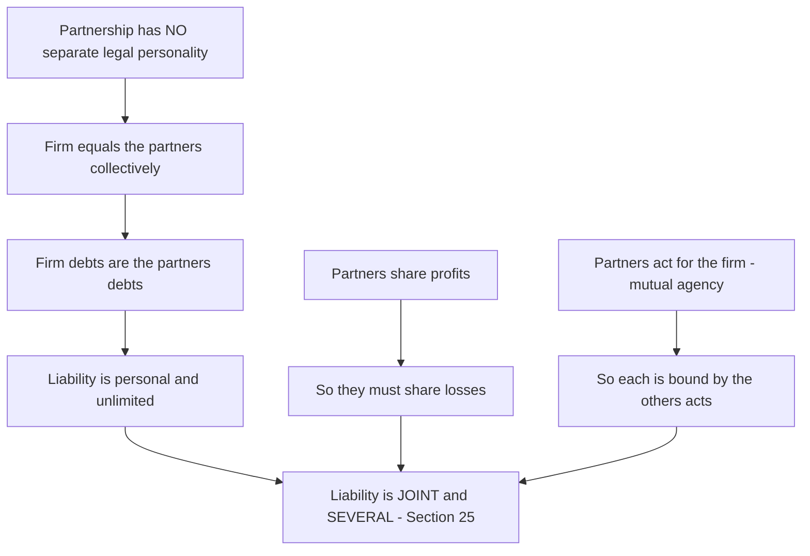
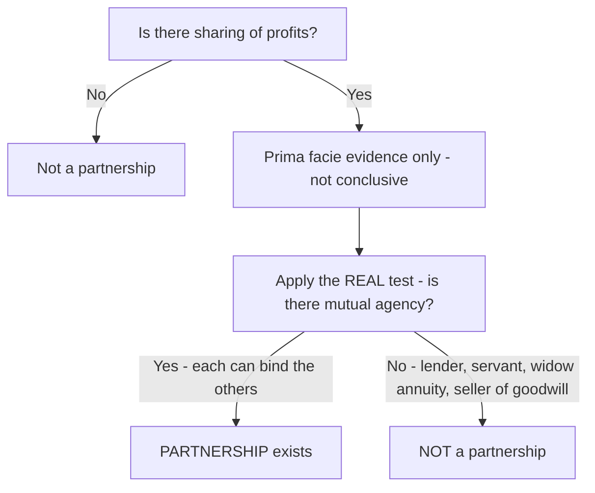
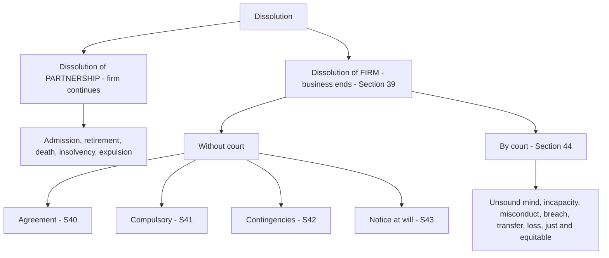

<!-- v1-foundation -->

# Foundation: The Indian Partnership Act, 1932

## 1. The Problem it solves

Two friends want to start a business together. One has ₹5,00,000 in savings; the other has ten years of trade contacts and the willingness to run the shop daily. They pool their strengths, open "Kumar & Sharma Traders," and begin selling. Now the awkward questions start pouring in — the *unspoken* questions that will one day turn into a lawsuit if nobody answers them in advance:

- If the business borrows ₹8,00,000 from a bank and then collapses, whose house does the bank take — the firm's, or the partners' personal homes? Both partners', or only the one who signed the loan?
- When Sharma (who never put in cash but runs the shop) signs a contract with a supplier for ₹2,00,000 of stock, is *Kumar* bound by that contract even though he never saw it?
- If they never wrote down a profit-sharing ratio, and one partner worked twice as hard, does he get more profit — or is it split equally?
- A creditor of the firm is owed money. A *private* creditor of Kumar personally is also owed money. When the firm's assets are sold, who gets paid first out of the firm's property?
- One partner secretly runs a competing side-business and pockets ₹50,000. Can the firm claw that profit back?
- Kumar dies. Does the firm automatically die with him? Can his son walk in as a partner?

A business run by two-or-more people is not just an accounting arrangement — it is a **web of legal relationships**: partner-to-partner, partner-to-firm, and firm-to-outsiders. Left undefined, every one of these relationships is a lawsuit waiting to happen. The **Indian Partnership Act, 1932** exists to supply the *default answers* to all of these questions, so that even partners who wrote nothing down are governed by a fair, predictable rulebook. It defines what a partnership *is*, who is liable for what, what one partner can bind the others to, and how the whole thing is unwound when it ends.

For a CA specifically, this matters twice over. First, a huge share of Indian businesses — the small factory, the CA firm itself, the trading concern — are partnerships, and you will audit them, prepare their accounts, and advise them. Second, partnership *accounting* (admission, retirement, death, dissolution, goodwill) sits on top of this *legal* skeleton. You cannot correctly pass a retiring-partner's journal entry until you know the *law* of what a retiring partner is entitled to.

## 2. Core Idea

A partnership is **a contract between persons to carry on a business together and share its profits, where each partner is simultaneously a principal and an agent of the others.**

That last clause is the whole engine. The one central idea from which every rule in the Act flows is **mutual agency**: *every partner is an agent of the firm and of every other partner for the purpose of the business.* When Sharma buys stock for the firm, he is not acting only for himself — he is acting as Kumar's agent, so the act binds Kumar too. And because Sharma is *also* a principal (a co-owner), he is bound by what Kumar does. Each partner wears both hats at once.

Section 4 puts it precisely:

> "**Partnership** is the relation between persons who have agreed to share the profits of a business carried on by all or any of them acting for all."

Read the emphasised phrase — "**carried on by all or any of them acting for all**." That *is* mutual agency, sitting in the very definition. Everything else — liability, implied authority, dissolution — is a logical consequence.

## 3. Why it works this way

Why should Kumar be personally liable, to the last rupee of his private house, for a loan Sharma signed? The answer is *first-principles fairness combined with commercial trust*, and it runs like this:

**Step 1 — A partnership has no separate legal personality.** Unlike a company (which the law treats as an artificial "person" distinct from its shareholders), a partnership firm is *not* a separate legal entity. In the eyes of the law, "the firm" is just a convenient collective name for the partners themselves — "a compendious name for the partners." There is no legal wall between the business and the humans behind it. So a debt of the firm is, logically, a debt of the persons who *are* the firm. That is *why* liability is personal and unlimited: there is no artificial person to absorb it.

**Step 2 — Because they share profits, they must share losses.** A partner takes the upside of the business. Fairness demands he also carries the downside. You cannot pocket profits in good years and disclaim debts in bad ones. Unlimited liability is simply the mirror image of unlimited profit entitlement.

**Step 3 — Because they trust each other to act for the firm, they must answer for each other.** The entire *point* of a partnership is that partners can transact for the firm without running back for the others' signature each time — otherwise the business would grind to a halt. That convenience (mutual agency) has a price: if you empower your partner to bind you, you must honour what he binds you to. An outsider dealing with Sharma is entitled to assume Sharma speaks for the firm; the law protects that reasonable assumption by making all partners liable. **Liability is the flip side of agency.**

**Step 4 — Liability is joint AND several.** Not merely joint (all together) but also several (each one individually, in full). Section 25 makes every partner liable "jointly with all the other partners and also severally" for all acts of the firm done while he is a partner. So the bank can pursue Kumar *alone* for the *entire* ₹8,00,000, leaving Kumar to recover Sharma's share from Sharma. Why so harsh? Because it protects the innocent *outsider* — the creditor should not have to chase multiple partners across multiple courts; he should be able to grab whichever partner is solvent and let the partners sort out contribution among themselves. The law places the burden of a defaulting partner on the *other partners*, not on the innocent creditor.

Once you internalise "no separate personality → personal liability → mutual agency → joint and several liability," you can *derive* most of the Act rather than memorise it.

*Figure 1 — Deriving unlimited joint-and-several liability from first principles.*

## 4. Full technical content

### 4.1 Definition and the essential elements (Sections 4)

Section 4 gives three linked terms:
- **Partnership** — the *relation* between the persons.
- **Partners** — the persons who have entered into partnership *with one another*.
- **Firm** — the collective name under which they carry on business.
- **Firm name** — the name under which the business is carried on.

From the definition, the courts (and ICAI) extract **essential elements** of a partnership. A useful memory frame: **"A-B-S-M"** plus the underlying *association of persons*.

| # | Essential element | What it requires | Section anchor |
|---|---|---|---|
| 1 | **Association of two or more persons** | At least 2 persons, each competent to contract | S.4; competence via Indian Contract Act |
| 2 | **Agreement (A)** | Must arise from a *contract*, not from status. "Partnership arises from contract, not from status" | S.5 |
| 3 | **Business (B)** | Must carry on a *business* (any trade, occupation, or profession — S.2(b)). A one-off, non-recurring transaction is generally not "business" | S.2(b), S.4 |
| 4 | **Sharing of profits (S)** | An agreement to *share the profits* of that business | S.4 |
| 5 | **Mutual agency (M)** | Business carried on by *all or any of them acting for all* — the true/final test | S.4, S.18 |

**The single most important exam point:** sharing of profits is *essential but not conclusive*. The **true test** of partnership is **mutual agency** (Section 6 read with the *Cox v. Hickman* principle). A person may receive a share of profits and *still not be a partner* — e.g., a lender paid interest varying with profits, a servant/agent paid a commission on profits, the widow of a deceased partner receiving an annuity, or the seller of goodwill paid out of profits. In each case there is profit-sharing but **no agency and no right to bind the firm**, so no partnership.

### 4.2 The "true test" — Section 6

Section 6 says that in determining whether a group of persons is a firm, regard shall be had to the **real relation between the parties, as shown by all relevant facts taken together** — not merely the label the parties use. Profit-sharing is *prima facie* (first-glance) evidence of partnership, but the *conclusive* test is **whether the business is carried on by all or any of them acting for all**, i.e., mutual agency.

*Figure 2 — Section 6 decision logic: profit-sharing opens the door, mutual agency decides.*

### 4.3 Partnership distinguished from other relations

| Feature | Partnership | Co-ownership | Hindu Undivided Family (HUF) business | Company |
|---|---|---|---|---|
| Created by | Contract (S.5) | May arise without agreement (e.g., inheritance) | Status/birth into the family | Registration under Companies Act |
| Business necessary? | Yes | Not necessary | Not necessary | Yes (per objects) |
| Separate legal entity? | No | No | No | **Yes** |
| Profit sharing? | Essential | Not necessarily | By survivorship / on partition | Dividends |
| Mutual agency? | **Yes** | No | Only the **Karta** manages/binds | Directors/board bind the company |
| Liability | Unlimited, joint & several | Limited to own share | Karta unlimited; coparceners limited to their share in HUF property | Limited to unpaid share |
| Max members | 50 (Rule 10, Companies (Misc.) Rules 2014) | No limit | No limit | 200 (private); unlimited (public) |
| Death of a member | May dissolve firm | No effect on co-ownership | No dissolution — continues | No effect (perpetual succession) |
| Transfer of interest | Only with consent of all | Freely transferable | Not transferable | Freely (public) / restricted (private) |

**Maximum number of partners:** The Partnership Act itself is silent on the maximum. The ceiling now comes from **Section 464 of the Companies Act, 2013** read with **Rule 10 of the Companies (Miscellaneous) Rules, 2014**, which sets the maximum at **50 partners**. (The Act permits up to 100; the Rule currently prescribes 50.) A firm exceeding this becomes an *illegal association*. Minimum is **2**.

### 4.4 Types of partnership and types of partners

**Types of partnership (by duration / scope):**

| Type | Meaning | Section |
|---|---|---|
| **Partnership at will** | No fixed period and no provision for determination; any partner may dissolve by giving notice | S.7, S.43 |
| **Particular partnership** | Formed for a *single venture* or a *particular undertaking* | S.8 |
| **Fixed-term partnership** | Constituted for a fixed period; if continued after expiry, becomes partnership at will | S.7, S.17(b) |

**Types of partners:**

| Type of partner | Contributes capital? | Takes part in management? | Shares profits? | Liable to third parties? | Notes |
|---|---|---|---|---|---|
| **Active / Actual / Ostensible** | Yes | Yes | Yes | Yes (fully) | Must give public notice to escape liability on retirement (S.32) |
| **Sleeping / Dormant** | Yes | **No** | Yes | Yes (fully) | Need NOT give public notice on retirement |
| **Nominal** | **No** | No | **No** | **Yes** — because he lends his name | Liable to outsiders who relied on his name |
| **Partner in profits only** | Usually yes | Sometimes | Profits only, **not losses** | Yes to third parties | Cannot be made to share losses internally |
| **Sub-partner** | — | No | Shares another partner's profit | **No** — no privity with the firm | Not a partner of the firm at all |
| **Partner by estoppel / holding out** | No | No | No | **Yes** — to the one who gave credit relying on the representation | S.28 |
| **Minor admitted to benefits** | Yes (through guardian) | No (limited) | Yes | Liable only to the extent of his share in the firm | S.30 |

### 4.5 Partner by holding out / estoppel — Section 28

If a person, **by words spoken or written or by conduct, represents himself, or knowingly permits himself to be represented, as a partner** in a firm, he is **liable as a partner** to anyone who has, *on the faith of such representation*, given credit to the firm — whether or not he knew the representation reached that person. This is the doctrine of *holding out*. It rests on estoppel: you cannot let the world believe you are a partner, watch a creditor extend credit on that belief, and then deny you are a partner when the bill falls due.

### 4.6 Minor admitted to the benefits of partnership — Section 30

A minor cannot be a *partner* (a contract with a minor is void ab initio under the Contract Act), but **with the consent of all partners a minor may be admitted to the benefits** of an existing partnership.

- **During minority:** He has a right to his agreed share of *profits and property*; he may inspect and copy the firm's *accounts* (but not the books generally); his liability is **limited to his share** in the firm — his personal assets are never touched, and he is not personally liable.
- He **cannot sue** the partners for accounts or payment of his share *except* when severing his connection with the firm.
- **On attaining majority**, he must, within **6 months** of attaining majority *or* of knowing he was admitted to benefits (whichever is later), **give public notice** electing to *become* or *not become* a partner. If he gives no notice, he is **deemed to have become a partner** on the expiry of those 6 months.
- If he **becomes** a partner: his liability becomes personal and unlimited, and it dates back to when he was *first admitted to the benefits*.
- If he **elects not to** become a partner: his rights and liabilities continue as those of a minor up to the date of the public notice, and his share is not liable for acts of the firm after that date.

### 4.7 The partnership deed

A partnership can be **oral or written** — writing is *not* legally compulsory. But a written deed (the **partnership deed**), on stamped paper, is strongly advisable and usually required for registration and for opening bank accounts / income-tax purposes. Typical contents:

| Clause | What it fixes |
|---|---|
| Name and address of firm and all partners | Identity |
| Nature and place of business | Scope |
| Date of commencement and duration | At will / fixed term / particular |
| Capital contributed by each partner | Capital accounts |
| **Profit-sharing ratio** | Division of profits and losses |
| Interest on capital / drawings; partner's salary/commission | Appropriations |
| Duties, powers, and restrictions of partners | Management |
| Method of valuing **goodwill** | Admission/retirement/death |
| Procedure on admission, retirement, death, dissolution | Continuity |
| Method of settling accounts on dissolution | Winding up |
| Arbitration clause | Dispute resolution |

**Rules that apply in the ABSENCE of a deed (Section 13)** — memorise these, they are heavily tested:
- Profits and losses shared **equally**, regardless of capital contributed.
- **No interest on capital.**
- **No interest on drawings.**
- **No salary/remuneration** to any partner for taking part in the business.
- Interest on a partner's **loan/advance** to the firm (beyond his capital) is payable at **6% per annum**.
- Every partner has a right to take part in the business.

### 4.8 Registration of firms and consequences of non-registration (Sections 56–71)

Registration of a firm with the **Registrar of Firms** is **optional, not compulsory** — but it is heavily *incentivised* because non-registration cripples the firm's ability to *sue*. Registration is done by filing a statement (Form A) with the Registrar (S.58) giving firm name, place of business, names/addresses of partners, dates of joining, etc., signed by all partners and verified. Registration can be effected **at any time** — even after disputes arise — but the *disability* of non-registration bites at the moment the suit is filed.

**Consequences of non-registration — Section 69 (the exam favourite):**

| Who / what is barred | Detail |
|---|---|
| **Partner v. firm or co-partners** — S.69(1) | An **unregistered** firm's partner **cannot sue** the firm or any co-partner to enforce a right arising from the contract or the Act (e.g., cannot sue for his share of profits). |
| **Firm v. third party** — S.69(2) | The **firm cannot sue** a third party to enforce a right arising from a contract. |
| **Set-off** — S.69(3) | The firm/partner cannot claim a **set-off exceeding ₹100** or other proceedings to enforce a contractual right. |

**What is NOT affected (registration NOT required) — the exceptions to S.69:**
1. A **third party can always sue** the unregistered firm (the disability is one-way — it protects outsiders, not the firm).
2. The right to sue for **dissolution** of the firm, or for **accounts of a dissolved firm**, or to realise the property of a dissolved firm.
3. Proceedings by an **Official Assignee/Receiver** to realise a insolvent partner's property.
4. Firms with **no place of business in India**, or whose places are in territories where Chapter VII does not apply.
5. A claim **not exceeding ₹100** in value (small-cause suits), and set-offs not exceeding ₹100.
6. Any **non-contractual right** (e.g., a suit for an injury/tort, or to recover firm property from someone who never contracted with the firm) — S.69 bars only rights "arising from a contract."

> Memory hook: registration is your *ticket to the courtroom as a plaintiff*. Without it you can be *sued* but you can barely *sue*. The one thing you can always do unregistered is sue to *dissolve* the firm — the law won't trap people together forever.

### 4.9 Relations of partners to ONE ANOTHER (Sections 9–17)

These are the *internal* duties, most of which can be varied by the deed (they are default rules), except the absolute duties.

**Absolute duties (cannot be excluded by agreement):**
- **General duties (S.9):** to carry on the business to the greatest common advantage, to be **just and faithful** to each other, and to render true accounts and full information.
- **Duty to indemnify for fraud (S.10):** every partner must indemnify the firm for losses caused by his **fraud** in the conduct of the business.

**Qualified duties (default; can be varied):**
- **S.12** — conduct of the business (right to take part; decisions on ordinary matters by majority, but *no change in the nature of business* without unanimous consent; right of access to books).
- **S.13** — mutual rights and liabilities (the "absence of deed" defaults listed in 4.7 above; plus a partner must **indemnify the firm** for wilful neglect, and the **firm must indemnify a partner** for payments made and liabilities incurred in the ordinary and proper conduct of business or to protect the firm).
- **S.16 — Personal profits:** if a partner derives any profit *for himself* from any transaction of the firm, or from the use of the firm's property, name, or business connection, he must **account for and pay it to the firm**. Likewise, if he carries on a **competing business**, he must account for and pay over all profits of that competing business.
- **S.14 — Property of the firm:** property originally brought in, acquired for the firm, or bought with firm money, plus the firm's goodwill, is **firm property** and must be used exclusively for firm purposes (S.15).

### 4.10 Relations of partners to THIRD PARTIES (Sections 18–30)

This is the *external* face — where mutual agency does its work.

- **S.18 — Partner as agent of the firm:** every partner is the agent of the firm for the purpose of its business.
- **S.19 — Implied authority:** an act done by a partner to carry on, *in the usual way*, business of the kind carried on by the firm **binds the firm**. This "implied authority" is the default power each partner has.

**Acts WITHIN implied authority (bind the firm even without express authority):** buying and selling goods in which the firm deals; receiving payments of firm debts and giving receipts; engaging employees; borrowing money on the firm's credit *if it is a trading firm*; drawing/accepting/endorsing negotiable instruments in the firm's name; pledging firm goods.

**Acts OUTSIDE implied authority (S.19(2)) — a partner CANNOT, without express authority, do these:**

| # | Act a partner cannot do alone |
|---|---|
| 1 | Submit a dispute of the firm to **arbitration** |
| 2 | Open a **bank account** in his own name on behalf of the firm |
| 3 | **Compromise or relinquish** any claim or portion of a claim of the firm |
| 4 | **Withdraw a suit** or proceeding filed on behalf of the firm |
| 5 | **Admit any liability** in a suit or proceeding against the firm |
| 6 | **Acquire immovable property** on behalf of the firm |
| 7 | **Transfer immovable property** belonging to the firm |
| 8 | Enter into **partnership** on behalf of the firm |

> Mnemonic for the 8 restricted acts: **"A-B-C-W-A-A-T-P"** — Arbitration, Bank account (own name), Compromise, Withdraw suit, Admit liability, Acquire immovable property, Transfer immovable property, Partnership.

- **S.20 — Extension/restriction of implied authority:** partners may, by contract, extend or restrict a partner's implied authority. But a **restriction does not bind an outsider** who deals with the partner *without knowing* of the restriction (this protects the innocent third party).
- **S.22 — Mode of acting:** to bind the firm, the act must be done in the *firm name*, or in a manner showing intent to bind the firm.
- **S.25 — Joint and several liability** for all acts of the firm done while a person is a partner.
- **S.26 — Liability for wrongful acts** of a partner (torts) done in the ordinary course — the firm is liable to the same extent as the partner.
- **S.27 — Misapplication by partners** — the firm is liable if a partner receives money/property from a third party and misapplies it, or if the firm receives it and it is misapplied.

### 4.11 Reconstitution: admission, retirement, expulsion, insolvency, death (Sections 31–38)

"Reconstitution" means the firm *continues* but its composition changes. Each event has a liability rule.

| Event | Section | Core rule | Liability of the incoming/outgoing partner |
|---|---|---|---|
| **Admission** of a new partner | S.31 | Only with **consent of all** existing partners (unless deed says otherwise) | A new partner is **not liable for acts done before** he joined |
| **Retirement** | S.32 | By consent of all, or per an express agreement, or (in partnership at will) by written notice | Liable for acts **before** retirement; escapes liability for acts **after** retirement **only if public notice is given** |
| **Expulsion** | S.33 | Valid ONLY if: (a) power exists in the contract, (b) exercised by a **majority**, and (c) in **good faith** for the benefit of the firm | Treated like a retired partner for liability; must be given a chance to be heard |
| **Insolvency** of a partner | S.34 | The insolvent **ceases to be a partner** from the date of the insolvency order; the firm is not necessarily dissolved | His estate is **not liable** for firm acts done after the date of the order; the firm is not liable for his acts after that date |
| **Death** of a partner | S.35 | Subject to contract, death dissolves the firm; but the deed usually provides for continuation | The estate is **not liable** for acts of the firm done **after** death (no public notice needed) |

**Key liability mechanics for third parties:**
- **S.32(3) — Public notice on retirement:** until public notice is given, a retiring partner and the partners continue to be liable to third parties for acts done as if he were still a partner. *Exception:* a **dormant/sleeping partner** and the estate of a **deceased** or **insolvent** partner do **not** need to give public notice.
- **S.36 — Rights of an outgoing partner to compete** — he may carry on a competing business but (subject to agreement) may **not** (i) use the firm name, (ii) represent himself as carrying on the firm's business, or (iii) solicit the firm's old customers.
- **S.37 — Right of outgoing partner to share subsequent profits:** if a deceased/outgoing partner's share is **not settled** and the firm continues using his share of assets, he (or his estate) may, at his option, claim either **interest at 6% p.a.** on the unsettled amount, *or* the **share of profits** attributable to the use of his share. (This becomes crucial in Inter-level "death of a partner" accounting.)

### 4.12 Dissolution of a firm (Sections 39–47)

**Distinction to nail first:** *dissolution of partnership* (a partner leaves, firm continues — that's reconstitution) vs *dissolution of the firm* (Section 39 — the **whole firm** is wound up, business stops, assets realised, accounts settled). Only the latter is "dissolution of a firm."

**Modes of dissolution:**

| Mode | Section | Trigger |
|---|---|---|
| **By agreement** | S.40 | All partners agree to dissolve |
| **Compulsory dissolution** | S.41 | (a) All but one partner become **insolvent**, or (b) the business becomes **unlawful** |
| **On happening of contingencies** | S.42 | Expiry of term; completion of the venture; death of a partner; insolvency of a partner (subject to contract) |
| **By notice** (partnership at will) | S.43 | Any partner gives **written notice** of intention to dissolve; firm dissolves from the date named, or from the date of communication |
| **By the Court** | S.44 | On a partner's suit: partner of **unsound mind**; permanent **incapacity**; **misconduct** affecting business; persistent **breach of agreement**; **transfer** of whole interest by a partner; business can only be carried on at a **loss**; any **just and equitable** ground |

*Figure 3 — The two meanings of "dissolution" and the six ways a firm is wound up.*

- **S.45 — Liability after dissolution:** partners remain liable to third parties for acts done after dissolution **until public notice** of dissolution is given. (Again, estate of deceased, insolvent, and dormant partners excepted.)
- **S.46 — Right to have business wound up:** on dissolution every partner is entitled to have the firm's property applied to pay its debts, and the surplus distributed.
- **S.47 — Continuing authority for winding up:** partners' authority continues only so far as necessary to **wind up** and complete unfinished transactions.

### 4.13 Settlement of accounts on dissolution — Section 48 (the accounting heart)

When a firm is dissolved and its assets realised, **Section 48** prescribes the exact *order* in which the money is applied. This is the legal rule behind the *Realisation Account* you will draw in accounting.

**Section 48 — order of application of assets:**

**(a) Losses**, including deficiencies of capital, are paid **first out of profits, next out of capital, and lastly, if necessary, by the partners individually in their profit-sharing ratio.**

**(b) The assets of the firm** (including any contributions from partners to make up deficiencies) are applied in the following **order**:

| Priority | Payment |
|---|---|
| 1st | Paying the **debts of the firm to THIRD PARTIES** (outside creditors) |
| 2nd | Paying each partner **rateably what is due to him from the firm for ADVANCES** (loans, as distinct from capital) |
| 3rd | Paying each partner **rateably what is due on account of CAPITAL** |
| 4th | The **residue (surplus)** is divided among the partners **in their profit-sharing ratio** |

> Memory order: **Outsiders → partners' Loans → partners' Capital → Surplus in PSR.** External creditors *always* come before any partner gets a rupee, even for his loan.

**Section 49 — payment of firm debts and separate (private) debts:** Where there are joint (firm) debts and separate (private) debts of a partner:
- **Firm property** is applied *first* to firm debts; any surplus is divided among partners and *then* each partner's share is applied to his private debts.
- **A partner's separate property** is applied *first* to his private debts; the surplus, if any, is applied to firm debts.

This is the **"joint estate for joint debts, separate estate for separate debts"** rule.

**Garner v. Murray rule (loss on insolvency of a partner):** If, on dissolution, a partner's capital account shows a **debit balance which he is unable to pay** (he is insolvent), the deficiency is borne by the *solvent* partners **in the ratio of their last-agreed CAPITALS** (not in the profit-sharing ratio), and each solvent partner brings in cash equal to his share of the realisation loss. This is a classic that Foundation introduces and Inter examines fully in accounting.

## 5. Worked examples (application / IRAC style)

> For law, each "worked example" is a fact-scenario solved in **Issue → Rule → Application → Conclusion (IRAC)** style. Where numbers appear, every figure is checked to tally.

### Worked Example 1 — Profit-sharing without a deed (Section 13)

**Facts.** Anil and Bharat start "AB Traders" with no written deed. Anil contributes ₹6,00,000 capital; Bharat contributes ₹2,00,000 and also gives the firm a further **loan of ₹1,00,000**. At year-end the firm earns a profit of ₹1,80,000 *before* any interest. Bharat claims (i) interest on capital, (ii) interest on his loan, and (iii) a larger profit share because he put in the loan and does more work. Anil disputes all three.

**Issue.** In the absence of a partnership deed, is Bharat entitled to interest on capital, interest on his loan, and an unequal profit share?

**Rule.** Section 13: absent a contrary agreement — (a) partners share profits *equally* irrespective of capital; (b) *no* interest on capital; (c) a partner is entitled to **interest at 6% p.a.** on any *loan/advance* beyond his capital; (d) no salary for taking part in business.

**Application.**
- *Interest on capital* — **denied.** No deed, so S.13 gives no interest on capital, even though Anil contributed three times as much.
- *Interest on Bharat's ₹1,00,000 loan* — **allowed at 6% p.a.** A loan is distinct from capital. Interest = ₹1,00,000 × 6% = **₹6,000**. This is a *charge* against profit (payable even out of the profit before division), so it is deducted first.
- *Unequal profit share* — **denied.** S.13 mandates equal sharing absent agreement; extra effort or the loan does not change the ratio.

**Numbers (self-checked).**
Profit before interest on loan = ₹1,80,000
Less: interest on Bharat's loan (6% × ₹1,00,000) = ₹6,000
Divisible profit = ₹1,80,000 − ₹6,000 = **₹1,74,000**
Each partner's share (equal) = ₹1,74,000 ÷ 2 = **₹87,000 each.**
Bharat's total receipt = ₹87,000 (profit) + ₹6,000 (loan interest) = **₹93,000.** Anil's = **₹87,000.**
*Check:* ₹93,000 + ₹87,000 = ₹1,80,000 = the original profit. ✔ Tallies.

**Conclusion.** Bharat gets only ₹6,000 loan interest; profits are split equally at ₹87,000 each. His claims for interest on capital and a larger share fail.

### Worked Example 2 — Implied authority and the outsider (Sections 19–20)

**Facts.** "Metro Textiles" is a trading firm of partners P, Q, and R. Their (unregistered internal) agreement says "no partner may borrow more than ₹50,000 without the others' written consent." Partner Q, in the firm name and to buy stock, borrows **₹3,00,000** from a bank that has *no knowledge* of this internal restriction. The business fails. The bank sues the firm and all three partners for ₹3,00,000. P and R argue Q had no authority beyond ₹50,000, so they are not liable.

**Issue.** Are P and R bound by Q's ₹3,00,000 borrowing despite the internal cap?

**Rule.** S.19 — a partner's act done to carry on the firm's usual business (including borrowing on credit in a **trading firm**) binds the firm. S.20 — partners may restrict implied authority *among themselves*, but a restriction does **not** bind a third party who deals *without notice* of it. S.25 — all partners are jointly and severally liable.

**Application.** Borrowing to buy stock is within the ordinary business of a trading firm and thus within Q's implied authority. The ₹50,000 cap is a valid *internal* restriction under S.20, but the bank had **no notice** of it, so the restriction cannot be raised against the bank. Under S.25 the bank may recover the full ₹3,00,000 from **any one** of P, Q, or R.

**Conclusion.** The firm and all three partners are liable for the full **₹3,00,000**. P and R must pay the bank and may then recover Q's excess borrowing from Q *internally* (their remedy is against Q, not against the innocent bank). The internal cap protects them against Q, not against outsiders.

### Worked Example 3 — Settlement of accounts on dissolution (Section 48)

**Facts.** Firm "XYZ & Co." (partners X, Y, Z sharing profits **2 : 2 : 1**) is dissolved. After realising all assets, the position is:

- Cash realised from all assets: **₹9,00,000**
- Outside creditors (trade + bank): **₹4,00,000**
- Loan given to the firm by partner X (separate from capital): **₹1,00,000**
- Capital account balances: X ₹3,00,000; Y ₹2,00,000; Z ₹1,00,000 (all credit balances)

Apply Section 48 and show the final distribution.

**Issue.** In what order and amounts is the ₹9,00,000 distributed?

**Rule.** S.48(b): apply assets in order — (1) outside creditors, (2) partners' *loans/advances*, (3) partners' *capital*, (4) surplus in PSR.

**Application — step by step (all figures tallied):**

| Step | Payment | Amount | Cash remaining |
|---|---|---|---|
| Start | Cash available | — | ₹9,00,000 |
| 1 | Outside creditors (first priority) | ₹4,00,000 | ₹5,00,000 |
| 2 | Partner X's **loan** to firm | ₹1,00,000 | ₹4,00,000 |
| 3 | Capital: X ₹3,00,000 + Y ₹2,00,000 + Z ₹1,00,000 = ₹6,00,000 needed | see note | — |

At Step 3, only **₹4,00,000** cash remains but capital claims total **₹6,00,000** — a shortfall of **₹2,00,000**. This ₹2,00,000 is a **realisation loss** (assets realised ₹6,00,000 short of book capital + loans... let us verify: total claims = 4,00,000 + 1,00,000 + 6,00,000 = ₹11,00,000; cash = ₹9,00,000; loss = **₹2,00,000**). Under S.48(a) this loss is borne by partners in their **profit-sharing ratio 2:2:1**:

- X's share of loss = ₹2,00,000 × 2/5 = **₹80,000**
- Y's share of loss = ₹2,00,000 × 2/5 = **₹80,000**
- Z's share of loss = ₹2,00,000 × 1/5 = **₹40,000**
- *Check:* 80,000 + 80,000 + 40,000 = ₹2,00,000 ✔

**Final capital payable after absorbing loss:**

| Partner | Capital (Cr) | Less: loss share | Net payable |
|---|---|---|---|
| X | ₹3,00,000 | ₹80,000 | **₹2,20,000** |
| Y | ₹2,00,000 | ₹80,000 | **₹1,20,000** |
| Z | ₹1,00,000 | ₹40,000 | **₹60,000** |
| **Total** | ₹6,00,000 | ₹2,00,000 | **₹4,00,000** |

**Final cash trail (self-checked):**
Creditors ₹4,00,000 + X's loan ₹1,00,000 + Capital repaid (2,20,000 + 1,20,000 + 60,000 = ₹4,00,000) = **₹9,00,000.** ✔ Equals cash available. The account closes exactly.

**Conclusion.** Outside creditors are paid in full (₹4,00,000), X's loan next (₹1,00,000), and the residual ₹4,00,000 goes to capital *after* charging the ₹2,00,000 realisation loss in the 2:2:1 ratio — X ₹2,20,000, Y ₹1,20,000, Z ₹60,000. Note how S.48 forces *outsiders before any partner*, and a partner's *loan before his capital*.

### Worked Example 4 — Holding out / Section 28

**Facts.** Suresh is not a partner of "Modern Electricals." At a trade meeting, in Suresh's presence, partner Ramesh introduces him to a supplier, Vikas, as "my new partner." Suresh smiles and says nothing. Relying on this, Vikas supplies goods worth **₹1,50,000** on credit to the firm. The firm defaults. Vikas sues Suresh personally.

**Issue.** Is Suresh liable to Vikas although he is not actually a partner?

**Rule.** S.28 — a person who by words or conduct represents himself, **or knowingly permits himself to be represented**, as a partner is liable as a partner to anyone who gives credit *on the faith of that representation*.

**Application.** Suresh knowingly allowed himself to be represented as a partner (his silence in the face of Ramesh's statement, in a business context, is conduct that permits the representation). Vikas extended ₹1,50,000 of credit on the faith of it. All elements of holding out are satisfied.

**Conclusion.** Suresh is liable to Vikas for **₹1,50,000** as a partner by holding out under S.28, even though he never was a real partner and shares no profits.

## 6. Connections — what this unlocks in CA Intermediate

- **Advanced Accounting (Inter) — Partnership Accounts:** *Admission, retirement, and death of a partner* accounting (goodwill valuation, revaluation of assets, treatment of reserves, gaining/sacrificing ratio) sits directly on Sections 31, 32, 35 and 37 you learned here. **S.37's "6% or share of profits" option** is the legal basis for the "amount due to deceased partner" and interest thereon.
- **Advanced Accounting — Dissolution of firms:** the **Realisation Account, piecemeal distribution, and the Garner v. Murray rule** are pure accounting expressions of **Section 48 (order of settlement)** and **Section 49 (joint vs separate estate)**.
- **Advanced Accounting — Amalgamation/Conversion of firm into a company** builds on the dissolution mechanics.
- **Corporate & Other Laws (Inter) — LLP Act, 2008:** the LLP is explicitly a *reform of partnership law* — you cannot appreciate why LLP gives "limited liability and no mutual liability for a co-partner's wrong" unless you first feel the *pain* of unlimited joint-and-several liability in the 1932 Act.
- **Auditing (Inter):** auditing a *partnership firm* — verifying the deed, profit-sharing, partners' capital and current accounts — assumes this legal foundation.
- **Taxation (Inter):** a "firm" is a distinct assessee; s.40(b) limits on partners' interest (max 12%) and remuneration are the tax-law overlay on the S.13 concepts of interest on capital and salary.

## 7. Traps & common mistakes

1. **Thinking profit-sharing *proves* partnership.** It is only *prima facie* evidence. The **true test is mutual agency (S.6)**. A lender/servant/widow sharing profits is *not* a partner. This exact trap appears almost every attempt.
2. **Confusing "dissolution of partnership" with "dissolution of firm."** Retirement/death = reconstitution (partnership dissolved, firm continues). Only **S.39** winding-up = dissolution of the *firm*.
3. **Forgetting public notice is NOT needed for dormant/deceased/insolvent partners.** Only *active/retiring* partners must give public notice under S.32(3)/S.45 to cut off future liability.
4. **Getting the S.48 order wrong** — writing "capital before loans." Correct order: **outsiders → partners' loans → partners' capital → surplus in PSR.**
5. **Saying a minor is a "partner."** A minor is only *admitted to the benefits* (S.30); he is never a full partner, and his liability is limited to his share.
6. **Assuming registration is compulsory.** It is **optional** — but non-registration disables the firm/partner from *suing* (S.69). A third party can *always* sue an unregistered firm.
7. **Applying profit-sharing ratio to the Garner v. Murray deficiency.** The insolvent partner's capital deficiency is borne by solvent partners in the ratio of their **last-agreed capitals**, *not* PSR. (But the *realisation loss itself* is shared in PSR.)
8. **Mixing up the maximum number of partners.** It is **50** (Rule 10, Companies (Misc.) Rules 2014) — not 20 (old Companies Act 1956 figure) and not 100 (the ceiling in s.464 before the Rule).
9. **Thinking a firm can sue on a tort only if registered.** S.69 bars only rights *arising from a contract*. Non-contractual (tort/property) claims are outside S.69.
10. **Believing interest on a partner's loan needs a deed.** No — even *without* a deed, a partner's loan carries **6% p.a.** (S.13). Interest on *capital*, by contrast, needs a deed.

## 8. First-principles recap

- A partnership has **no separate legal personality** — the firm *is* the partners; therefore their liability is **personal, unlimited, joint and several** (S.25).
- The single central idea is **mutual agency** (S.4, S.18): each partner is both principal and agent, so each can bind, and is bound by, the others.
- **Profit-sharing is essential but not conclusive**; the **true test is mutual agency** (S.6).
- The Act mostly supplies **default rules** (S.13) that a deed can override — except the *absolute duties* of good faith (S.9) and to indemnify for fraud (S.10).
- **Registration is optional but strategically vital**: without it you can be sued but can barely sue (S.69).
- On winding up, money flows **outsiders → partners' loans → partners' capital → surplus in PSR** (S.48) — outsiders always first.

## 9. Quick-reference

| Item | Rule / Section |
|---|---|
| Definition of partnership | **S.4** — relation between persons who agreed to share profits of a business carried on by all or any acting for all |
| Business includes | S.2(b) — trade, occupation, profession |
| Partnership arises from | **S.5** — contract, not status |
| True test of partnership | **S.6** — mutual agency (real relation from all facts) |
| Types: at will / particular | S.7 / S.8 |
| Min / Max partners | Min **2**; Max **50** (Rule 10, Cos (Misc) Rules 2014 under s.464 Cos Act 2013) |
| Absence-of-deed defaults | **S.13** — equal profits; no interest on capital; no salary; **6% p.a. on partner's loan** |
| Partner as agent | S.18 |
| Implied authority | S.19; restriction not binding on outsider without notice — S.20 |
| 8 acts outside implied authority | S.19(2) — Arbitration, own-name bank a/c, Compromise, Withdraw suit, Admit liability, Acquire/Transfer immovable property, enter Partnership |
| Joint & several liability | **S.25** |
| Holding out / estoppel | **S.28** |
| Minor admitted to benefits | **S.30** — liable only to extent of share; elect within **6 months** of majority |
| Admission / Retirement / Expulsion | S.31 / S.32 / S.33 |
| Insolvency / Death of partner | S.34 / S.35 |
| Outgoing partner: subsequent profits | **S.37** — 6% p.a. **or** share of profits, at his option |
| Registration (optional) | S.58–59; effects of non-registration — **S.69** |
| Modes of dissolution | S.40 agreement; S.41 compulsory; S.42 contingencies; S.43 notice (at will); **S.44 by court** |
| Public notice cuts off liability | S.32(3), S.45 (not needed for dormant/deceased/insolvent) |
| **Settlement order on dissolution** | **S.48** — losses first; assets: creditors → partners' loans → capital → surplus in PSR |
| Joint vs separate estate | S.49 |
| Garner v. Murray | Insolvent partner's capital deficiency borne by solvent partners in ratio of **last-agreed capitals** |
