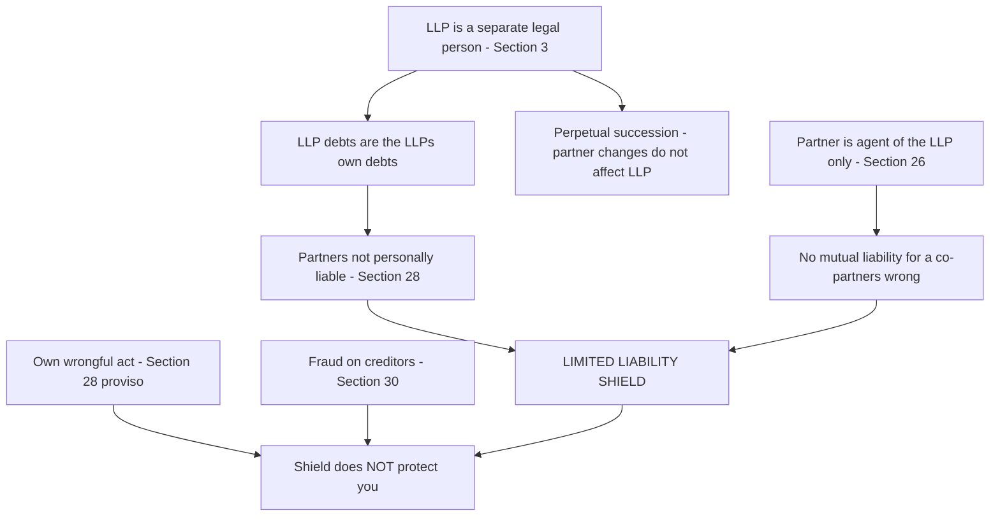
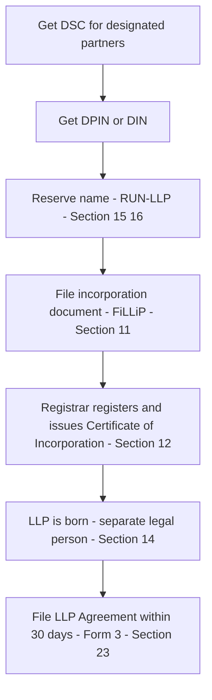
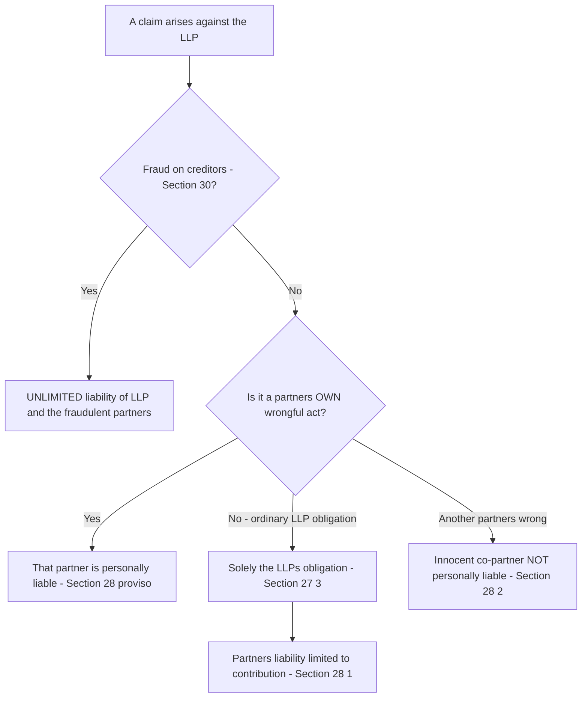

<!-- v1-foundation -->

# Foundation: The Limited Liability Partnership Act, 2008

## 1. The Problem it solves

Picture three chartered accountants — or three software engineers, or two architects — who want to build a firm together. India, until 2009, forced them to choose between exactly two legal vehicles, and **each one carried a hidden knife.**

**Door 1 — the traditional partnership (Indian Partnership Act, 1932).** It is cheap, private, and gloriously flexible. You and your partners agree — on a stamp paper or even orally — how to split profits and run the shop, and that is that. No board, no minimum capital, no filing your accounts for the world to read. But behind this door waits the trap that has destroyed families: **unlimited, joint and several liability.** If the firm borrows ₹2 crore and collapses, the bank does not stop at the firm's assets — it comes for your *personal house, car and savings,* and not just for your slice but for the *whole* debt. Worse still, because of **mutual agency**, you are liable for your co-partner's blunders. Your partner in Chennai signs a reckless contract; the creditor sells *your* flat in Delhi. You did nothing wrong, yet you pay everything. On top of that, a traditional firm cannot hold property or sue cleanly in its own name, it legally *dies* whenever a partner leaves or dies (no perpetual succession), and the number of partners is capped, choking growth.

**Door 2 — the company (Companies Act).** This door solves the liability problem beautifully: **limited liability** — your loss is capped at what you invested, and the company is a separate legal "person" that owns property, sues, and outlives its members. But behind this door is a *different* knife: **rigidity and cost.** A company forces on you a governance suit of armour designed for a large body of *passive* investors and *separate* professional managers — a board distinct from shareholders, statutory board meetings and AGMs with notice and quorum, statutory registers, mandatory audit whatever your size, annual returns, and limits on how directors are paid. For a two-person consultancy where the owners *are* the managers, this is like wearing plate armour to walk to the corner shop.

So the smart small business faced a cruel choice: **flexibility with ruinous liability (partnership), or safety with crushing compliance (company).** There was no vehicle that gave you *both* the internal freedom of a partnership *and* the limited liability and separate personality of a company.

The **Limited Liability Partnership Act, 2008** — brought into force on 31 March 2009, drawing on the Naresh Chandra and J.J. Irani committee recommendations — is India's answer. It creates a **third door**: a hybrid vehicle that is internally as flexible as a partnership but externally as safe as a company. For a CA this matters twice over. First, an enormous and growing share of Indian professional firms, start-ups and SMEs are now LLPs — you will incorporate them, audit them, file their returns and advise them. Second, this Foundation orientation is the launch-pad for the *full* LLP chapter you meet in CA Intermediate Corporate & Other Laws.

## 2. Core Idea

A Limited Liability Partnership is **a body corporate — a separate legal person with perpetual succession — in which partners run the business with the internal flexibility of a partnership, but each partner's liability is limited and no partner is liable for another partner's independent wrongdoing.**

Hold on to one sentence, because every rule flows from it:

> **An LLP is a separate legal entity distinct from its partners.** (Section 3)

That single idea — separate legal personality — is the engine. In a 1932 partnership the firm was *not* a separate person; it was just a collective name for the partners, so the partners' liability was personal and unlimited. The LLP inverts this. Because the LLP is its *own* legal person, **the LLP's debts are the LLP's debts, not the partners' debts.** The partners are merely its members and agents. That is *why* liability is limited, *why* the entity can own property and sue in its own name, *why* it has perpetual succession (partners come and go, the person survives), and *why* one partner is shielded from another's misconduct.

Section 3 says it in three linked clauses:

> "(1) A limited liability partnership is a **body corporate** formed and incorporated under this Act and is a **legal entity separate from that of its partners.**
> (2) A limited liability partnership shall have **perpetual succession.**
> (3) Any change in the partners of a limited liability partnership shall **not affect the existence, rights or liabilities** of the limited liability partnership."

## 3. Why it works this way

Why should partners in an LLP walk away safe when partners in a 1932 firm lose their homes? The reasoning is pure first principles.

**Step 1 — Give the business its own legal personhood, and liability follows the person who incurs it.** The law's oldest trick for capping risk is to *create an artificial person* and put the business inside it. Once the LLP is a separate legal "person" (S.3), the money it borrows is *its* obligation. A creditor's claim runs against the LLP's assets. The partners stand outside that wall. This is exactly the *Salomon v. Salomon* logic that makes a company a separate person — the LLP borrows it wholesale. **Separate personality is the cause; limited liability is the effect.**

**Step 2 — Limited liability is the whole point, so make it explicit.** Section 27(3) states that an obligation of the LLP is **solely the obligation of the LLP,** met out of the LLP's property. Section 28(1) says a partner is **not personally liable, directly or indirectly,** for an obligation of the LLP solely by reason of being a partner. Your downside is capped at your agreed contribution. This is the mirror image of the partnership rule and it is deliberate.

**Step 3 — Kill "mutual liability" but keep "mutual agency."** In a 1932 firm, every partner was an agent of *every other partner,* so B's wrong bound A personally. The LLP surgically removes that. **Section 26** makes every partner the agent of the **LLP** — but **not an agent of the other partners.** So a partner acts for the *entity,* and the entity bears the consequence; a co-partner's personal estate is untouched. Section 28(2) confirms this: one partner is *not* personally liable for the *wrongful act or omission* of *any other partner.* This is the single biggest practical upgrade over the old firm.

**Step 4 — But do not let limited liability become a licence to cheat.** Limited liability is a shield, not a sword. So the Act keeps two doors open to reach the partner personally: (a) **a partner remains fully liable for his OWN wrongful act or omission** (S.28(1) proviso to the shield — you cannot hide your own tort behind the LLP); and (b) if the LLP or a partner carries on business **with intent to defraud creditors** or for any fraudulent purpose, **unlimited liability** attaches to the LLP and to those partners who acted with fraudulent intent (**Section 30**). Fairness demands that the shield protects the honest, not the fraudster.

**Step 5 — Internally, leave them free.** Because the *external* creditor is already protected by the entity wall, the law does not need to dictate *internal* governance. So the mutual rights and duties of the partners are governed by a private contract — the **LLP agreement (Section 23, Schedule I)** — which the partners may write almost however they wish, exactly like a partnership deed. No compulsory board, no AGM, no minimum capital. Flexibility inside, safety outside.

Once you feel "**separate personality → limited liability → agent of the LLP not of co-partners → but own-fault and fraud still bite → internal freedom by contract,**" you can derive most of the Act instead of memorising it.

*Figure 1 — Deriving limited liability and its two exceptions from separate legal personality.*

## 4. Full technical content

### 4.1 What an LLP is — the salient features (Sections 2, 3)

Distil the Act's opening provisions into the features ICAI wants listed:

| # | Salient feature | Provision |
|---|---|---|
| 1 | **Body corporate** — an incorporated entity, a "body corporate" as defined in S.2(1)(d) | S.3(1) |
| 2 | **Separate legal entity** — distinct from its partners; can own property, sue and be sued in its own name | S.3(1), S.14 |
| 3 | **Perpetual succession** — its existence is unaffected by change, death or insolvency of partners | S.3(2), S.3(3) |
| 4 | **Limited liability** of partners — capped at agreed contribution | S.26, 27, 28 |
| 5 | **Minimum 2 partners; no maximum** — at least 2, and there is *no upper ceiling* on the number of partners | S.6(1) |
| 6 | **At least 2 designated partners, one resident in India** | S.7(1) |
| 7 | **Governed by a contract** — the LLP agreement (else Schedule I default rules apply) | S.23, Sch. I |
| 8 | **Artificial legal person but not a citizen** — cannot claim fundamental rights meant only for citizens |  — |
| 9 | **Common seal (optional)** and can hold property in its own name | S.14 |
| 10 | **Perpetual existence independent of partners** — a partner is not an agent of other partners | S.26 |

Key defined terms (**Section 2(1)**): *"body corporate"* [2(1)(d)]; *"business"* includes every trade, profession, service and occupation [2(1)(e)]; *"designated partner"* [2(1)(j)]; *"limited liability partnership"* [2(1)(n)]; *"LLP agreement"* [2(1)(o)]; *"partner"* [2(1)(q)].

### 4.2 Nature of an LLP — the hybrid

An LLP deliberately borrows from *both* older forms:

| It takes from a **partnership** | It takes from a **company** |
|---|---|
| Internal flexibility — governance by private agreement | Separate legal personality (S.3) |
| No minimum capital requirement | Limited liability of members (S.28) |
| Partners directly manage the business | Perpetual succession (S.3(2)) |
| No compulsory board / AGM / statutory registers | Registration with the Registrar (RoC) |
| Profit-sharing among partners | Can own property and sue in its own name (S.14) |

Because it is a *body corporate* it is regulated by the **Registrar of Companies (RoC)** under the **Ministry of Corporate Affairs (MCA)**, filings are done on the **MCA / LLP portal**, not with the Registrar of Firms. The LLP Act, 2008 is administered separately from the Partnership Act, 1932; note that **the Indian Partnership Act, 1932 does NOT apply to an LLP** (S.4).

### 4.3 LLP distinguished from a traditional partnership

This is the single most examined table at Foundation level.

| Basis | **Traditional partnership (1932 Act)** | **LLP (2008 Act)** |
|---|---|---|
| Governing law | Indian Partnership Act, 1932 | LLP Act, 2008 |
| Regulator | Registrar of Firms | Registrar of Companies (MCA) |
| Legal status | **Not** a separate legal entity; firm = partners | **Separate legal entity** (S.3) |
| Registration | **Optional** (but non-registration bars suits) | **Compulsory** — must incorporate to exist |
| Perpetual succession | **No** — dissolves on death/retirement (subject to contract) | **Yes** (S.3(2)) |
| Liability of partners | **Unlimited, joint and several** | **Limited** to agreed contribution (S.28) |
| Liability for co-partner's act | Each liable for the others' acts (mutual agency) | **Not** liable for another partner's wrongful act (S.28(2)) |
| Maximum partners | **50** (Rule 10, Companies (Misc.) Rules 2014) | **No maximum** (min 2) |
| Property | Cannot own in firm's name | Can own in **its own name** (S.14) |
| Can sue/be sued | Firm sues through partners; disability if unregistered | In **its own name** |
| Minor as member | May be admitted to *benefits* (S.30 Partnership Act) | A minor **cannot** be a partner (must be competent to contract) |
| Audit | Not statutorily required | Required **above thresholds** (turnover > ₹40 lakh or contribution > ₹25 lakh) |
| Annual filing | None | **Form 8** (Statement of Account & Solvency) and **Form 11** (Annual Return) |

### 4.4 LLP distinguished from a company

| Basis | **LLP (2008 Act)** | **Company (Companies Act, 2013)** |
|---|---|---|
| Members called | Partners | Shareholders / members |
| Managed by | Partners themselves (owners = managers) | Board of Directors (distinct from members) |
| Governing document | **LLP agreement** (private, flexible) | **Memorandum & Articles** (public, prescribed) |
| Internal governance | Flexible, by contract | Rigid — board meetings, AGM, quorum, registers |
| Minimum members | 2 partners | 2 (private) / 7 (public) |
| Minimum management | 2 **designated partners** | 2 directors (private) / 3 (public) |
| Minimum capital | **None** | None (post-2015) but share-capital framework applies |
| Statutory meetings | **Not required** | Board meetings + AGM mandatory |
| Audit | Only above thresholds | **Mandatory** for every company |
| Distribution to owners | Share of profit per agreement | Dividend (out of profits, with rules) |
| Compliance burden | **Light** | **Heavy** |
| Digital signature / DIN | DPIN/DIN for designated partners | DIN for directors |

Common ground: **both are bodies corporate, both have separate legal personality, perpetual succession, limited liability, and both register with the RoC.** The difference is *governance rigidity,* not legal status.

### 4.5 Partners and designated partners (Sections 5, 6, 7)

**Who can be a partner (Section 5).** Any **individual** or **body corporate** may be a partner in an LLP. An individual is disqualified if a court declares him of **unsound mind,** or he is an **undischarged insolvent,** or he has applied to be adjudicated insolvent and the application is pending. (A **minor cannot** be a partner because he is not competent to contract — a sharp contrast with the 1932 firm.)

**Number of partners (Section 6).** Minimum **two.** There is **no maximum.** If at any time the number falls **below two** and the LLP carries on business for **more than six months** with a single partner, that sole remaining partner (who knows of the fact) becomes **personally liable** for the obligations of the LLP incurred during that period (S.6(2)).

**Designated partners (Section 7).** Every LLP must have at least **two designated partners** who are **individuals,** and **at least one of them must be resident in India** ("resident in India" = stayed in India ≥ **120 days** during the financial year, per the current provision). Designated partners are the LLP's *responsible officers* — analogous to a company's directors for compliance purposes. If the incorporation document names all partners as designated partners, all are; if it says the designated partners are to be from time to time nominated, the LLP nominates them.

- Every designated partner must obtain a **Designated Partner Identification Number (DPIN)** (S.7(6)) — in practice unified with the DIN framework — and a **Digital Signature Certificate (DSC)** to file forms.
- **Section 8 — liabilities of designated partners:** a designated partner is **responsible** for doing all acts, matters and things required to be done by the LLP under the Act (filings, compliances) and is **liable to all penalties** imposed on the LLP for contravention of those provisions. This is why the role carries weight.
- **Section 9:** the LLP must ensure it always has at least two designated partners; a vacancy must be filled within **30 days.** If no designated partner is appointed, or at any time there is only one, **every partner** is deemed to be a designated partner.

### 4.6 Incorporation of an LLP (Sections 11–14)

An LLP comes into existence **only on incorporation** — it cannot exist informally like a 1932 firm. The steps:

| Step | What happens | Provision / Form |
|---|---|---|
| 1 | Obtain **DSC** for proposed designated partners | — |
| 2 | Obtain **DPIN/DIN** for designated partners | S.7(6) |
| 3 | **Reserve the name** — apply for name approval; must not be undesirable or identical to an existing LLP/company/trademark | S.15, 16 — **RUN-LLP** form |
| 4 | File **incorporation document** with the Registrar, subscribed by at least two partners, plus a statement of compliance | **S.11 — FiLLiP form** |
| 5 | Registrar registers the document and issues the **Certificate of Incorporation** | **S.12** |
| 6 | File the **LLP agreement** within **30 days** of incorporation | **S.23 — Form 3** |

**Section 11 — Incorporation document.** Must state: the **name** of the LLP; the **proposed business;** the **registered office** address; the **name and address of each partner** and of the designated partners; and it must be **subscribed by at least two persons** associated for carrying on a lawful business with a view to profit. It is filed with a **statement** (by an advocate/CA/CS/CMA involved in the formation *and* by a subscriber) that all requirements of the Act regarding incorporation have been complied with. Making a **false statement** here is an offence (S.11(3)) — imprisonment up to 2 years and fine.

**Section 12 — Certificate of Incorporation.** On registration the Registrar issues a **Certificate of Incorporation,** which is **conclusive evidence** that the LLP is incorporated by the name stated. From the date on the certificate the LLP is born as a body corporate.

**Section 14 — Effect of registration.** On incorporation the LLP becomes, by its registered name, capable of: (a) **suing and being sued;** (b) **acquiring, owning, holding and developing property** — movable, immovable, tangible and intangible; (c) having a **common seal** (if it chooses); and (d) doing all other acts that a body corporate may lawfully do.

**Registered office and name (Sections 13, 15, 21).** Every LLP must have a **registered office** to which communications may be sent (S.13). The **name must end with the words "Limited Liability Partnership" or the abbreviation "LLP"** (S.15(1)). Every LLP must ensure that its **invoices, correspondence and official publications** bear its name, registered office address, registration number, and a statement that it is registered with limited liability (S.21).

*Figure 2 — The incorporation pipeline from digital signature to a living LLP.*

### 4.7 The LLP agreement (Sections 22, 23; Schedule I)

The **LLP agreement** is the LLP's private constitution — the counterpart of a partnership deed. **Section 2(1)(o)** defines it as *any written agreement between the partners of the LLP, or between the LLP and its partners, which determines the mutual rights and duties of the partners and their rights and duties in relation to the LLP.*

- **Section 22 — Relationship of partners:** the mutual rights and duties of partners, and of the LLP and its partners, are governed by the LLP agreement.
- **Section 23 — the agreement and its effect:** the agreement (and any changes) must be **filed with the Registrar in Form 3** in the prescribed manner. Where the agreement is **silent** on any matter, or where **there is no agreement at all,** the mutual rights and duties are governed by the **default provisions in Schedule I** to the Act.

**Typical contents of an LLP agreement:** name and business; contribution of each partner and interest thereon; **profit/loss-sharing ratio;** rights, duties and restrictions of partners; management and decision-making; admission, retirement, cessation and expulsion of partners; remuneration/interest to partners; meetings and books; method of resolving disputes (arbitration); winding-up procedure.

**Schedule I — default rules (apply when the agreement is silent), the Foundation must-knows:**

| # | Default rule (Schedule I) |
|---|---|
| 1 | All partners are entitled to **share equally in the capital, profits and losses** of the LLP. |
| 2 | The LLP shall **indemnify** each partner for payments made and personal liabilities incurred in the ordinary and proper conduct of the business. |
| 3 | Every partner may **take part in the management** of the LLP. |
| 4 | **No partner is entitled to remuneration** for acting in the business or management. |
| 5 | A **new partner** may be introduced only with the **consent of all** existing partners. |
| 6 | Ordinary matters are decided by a **majority** of partners; every partner has the right to be heard; but **no change in the nature of the business** without consent of all. |
| 7 | The LLP must **maintain proper books/records,** open to inspection by all partners. |
| 8 | Each partner must **render true accounts and full information** of things affecting the LLP to any partner or his legal representatives. |
| 9 | A partner must **account to the LLP for any private profit** derived from any transaction of the LLP, or from use of its property, name or business connection. |
| 10 | A partner must **account for profits of a competing business** carried on without consent. |
| 11 | **No majority can expel a partner** unless a power to do so has been conferred by express agreement. |
| 12 | Disputes between partners not resolvable by the agreement are referred to **arbitration** under the Arbitration and Conciliation Act, 1996. |

Note how Schedule I echoes the 1932 Act's Section 13/16 defaults — the internal logic of partnership survives inside the LLP.

### 4.8 Extent and limitation of liability (Sections 26, 27, 28, 30)

This cluster is the heart of the Act.

- **Section 26 — Partner as agent:** every partner is the **agent of the LLP,** but **not of the other partners.** (Contrast S.18 of the 1932 Act, where a partner is agent of the firm *and* of every other partner.)
- **Section 27 — Extent of liability of the LLP:**
  - (1) The LLP is **not bound** by anything done by a partner in dealing with a person if (a) the partner has **no authority** to act for the LLP in that matter, **and** (b) the person **knows** he has no authority or does not know/believe him to be a partner of the LLP.
  - (2) The LLP is **liable** if a partner is liable for a wrongful act or omission done **in the course of business** of the LLP or **with its authority.**
  - (3) An **obligation of the LLP,** whether arising in contract or otherwise, is **solely the obligation of the LLP.** The liabilities of the LLP are met out of the **property of the LLP.**
- **Section 28 — Extent of liability of a partner:**
  - (1) A partner is **not personally liable, directly or indirectly,** for an obligation of the LLP (whether in contract or otherwise) **solely by reason of being a partner.**
  - (2) The limitation in (1) does **not** affect the **personal liability of a partner for his OWN wrongful act or omission** — but a partner is **not personally liable for the wrongful act or omission of ANY OTHER partner** of the LLP.
- **Section 29 — Holding out:** anyone who, by words or conduct, represents himself (or knowingly permits himself to be represented) as a partner of an LLP is **liable** to a person who, on the faith of that representation, gave credit to the LLP — mirroring S.28 of the 1932 Act.
- **Section 30 — Unlimited liability in case of fraud:** if the LLP or a partner carries on business with **intent to defraud** creditors or for any fraudulent purpose, the **liability of the LLP AND of the partners who acted with intent to defraud is UNLIMITED.** The LLP is also liable to compensate persons who suffered loss, unless it establishes the act was done without its knowledge or authority. This is the **anti-abuse override** — the shield vanishes for fraud.

So the shield (S.28) has **two holes:** your **own** wrongful act, and **fraud** (S.30). Everything else is capped at your contribution.

*Figure 3 — Liability decision logic: when the shield holds and when it breaks.*

### 4.9 Contribution and financial disclosures (Sections 32, 33, 34, 35)

- **Section 32 — Form of contribution:** a partner's contribution may be **tangible or intangible property, money, promissory notes, other agreements to contribute cash or property, or contracts for services performed or to be performed.** The **monetary value** of a non-cash contribution is stated and disclosed in the accounts.
- **Section 33 — Obligation to contribute:** the obligation of a partner to contribute is as per the LLP agreement. A creditor who, without notice of any compromise, **relied on such an obligation** may enforce the original obligation.
- **Section 34 — Maintenance of books of account, other records and audit:** every LLP must **maintain proper books of account** (on cash or accrual basis, by double entry) at its registered office, and prepare a **Statement of Account and Solvency** within **6 months** of the end of each financial year, signed by the designated partners, and file it (**Form 8**). Accounts must be **audited** as prescribed — audit is required only if **turnover exceeds ₹40 lakh** *or* **contribution exceeds ₹25 lakh** (below both thresholds, audit is not compulsory).
- **Section 35 — Annual return:** every LLP must file an **Annual Return (Form 11)** with the Registrar within **60 days** of the end of the financial year.

### 4.10 Conversion into an LLP (Sections 55–58; Schedules II–IV)

The Act lets existing entities *migrate* into the LLP form without breaking their business — a Foundation-level overview:

| Conversion | Section | Schedule | Who may convert |
|---|---|---|---|
| **Firm → LLP** | S.55 | Schedule II | An existing partnership firm (all partners of the firm become partners of the LLP, and only they) |
| **Private company → LLP** | S.56 | Schedule III | A private company (all shareholders become partners; no security interest subsisting; up-to-date filings) |
| **Unlisted public company → LLP** | S.57 | Schedule IV | An unlisted public company (similar conditions) |

- **Section 58 — Registration and effect of conversion:** on conversion the Registrar issues a **certificate of registration** as an LLP. On and from the date in the certificate: (a) the LLP is by its name registered; (b) **all tangible/intangible property, assets, interests, rights, privileges, liabilities and obligations** of the firm/company **vest in the LLP;** and (c) the firm/company is **deemed dissolved** and removed from the records of the Registrar of Firms / RoC. Pending proceedings continue, and existing agreements/contracts continue with the LLP substituted. The conversion **does not affect existing liabilities** — they carry over.
- **Effect note:** on conversion, every partner is bound to notify concerned authorities, and for a period the entity must state on its documents that it was converted from a firm/company (transparency to creditors).

### 4.11 Winding up and dissolution — overview (Sections 63–65)

An LLP, being a body corporate, is not simply "dissolved" like a 1932 firm — it must be formally **wound up** and then **dissolved.** Two routes:

| Mode | Provision | Trigger (overview) |
|---|---|---|
| **Voluntary winding up** | S.63 | The partners themselves decide to wind up |
| **Winding up by the Tribunal (NCLT)** | S.64 | On specified grounds |

**Section 64 — grounds for winding up by the Tribunal:**
1. The LLP **decides** that it be wound up by the Tribunal;
2. The number of partners is **reduced below two** for more than **six months;**
3. The LLP is **unable to pay its debts;**
4. The LLP has acted against the **sovereignty/integrity of India,** security of the State, or public order;
5. The LLP has **defaulted** in filing the Statement of Account and Solvency or the Annual Return for **five consecutive financial years;**
6. The Tribunal is of the opinion that it is **just and equitable** that the LLP be wound up.

**Section 65** empowers the Central Government to make rules for winding up and dissolution (the LLP (Winding up and Dissolution) Rules). There is also an easier exit: an LLP that is **defunct / not carrying on business** may apply to have its name **struck off** the register (Form 24) — the LLP equivalent of a company's fast-track exit. On completion of winding up the LLP is **dissolved** and ceases to exist.

## 5. Worked examples (application / IRAC style)

> For law, each worked example is a fact-scenario solved **Issue → Rule → Application → Conclusion.** Where numbers appear, every figure is checked to tally.

### Worked Example 1 — The limited-liability shield vs. a partner's own wrong (Sections 27, 28)

**Facts.** "Pinnacle Consulting LLP" has three partners — A, B and C — sharing profits **equally,** each having contributed ₹5,00,000 (total contribution ₹15,00,000). The LLP borrows ₹40,00,000 from a bank for a genuine business project; the project fails and the LLP's realisable assets are only ₹22,00,000. *Separately,* partner B — while acting on his own frolic, outside the LLP's business and authority — negligently damages a client's equipment, causing a ₹6,00,000 loss. The bank and the client both look to recover. A and C claim they are personally safe.

**Issue.** (i) Are A, B and C personally liable for the ₹40,00,000 bank loan beyond LLP assets? (ii) Who bears the ₹6,00,000 client loss caused by B's own act?

**Rule.** S.27(3) — an obligation of the LLP is **solely the obligation of the LLP,** met out of LLP property. S.28(1) — a partner is **not personally liable** for an obligation of the LLP solely by being a partner. S.28(2) — the shield does not protect a partner from **his own** wrongful act, but no partner is personally liable for **another** partner's wrongful act. (No fraud, so S.30 is not triggered.)

**Application.**
- *Bank loan* — an ordinary LLP obligation. It is solely the LLP's. The bank recovers from **LLP assets (₹22,00,000)** and the remaining ₹18,00,000 shortfall **cannot** be recovered from the partners personally (S.28(1)). The partners' exposure is capped at their contribution, which is already in the LLP.
- *Client loss* — this arose from **B's own wrongful act.** Under S.28(2) B is **personally liable** for it. A and C are **not** personally liable for B's independent wrong. (The LLP is liable under S.27(2) only if the act was in the course of the LLP's business or with its authority — here it was on B's personal frolic, outside authority, so B alone answers.)

**Numbers (self-checked).**
Bank claim ₹40,00,000 − LLP assets ₹22,00,000 = **₹18,00,000 unrecovered,** borne by the bank as a business loss; partners pay ₹0 more.
Client loss ₹6,00,000 → **B personally ₹6,00,000;** A and C ₹0.
Each partner's *maximum* capital loss = ₹5,00,000 (contribution already sunk in the LLP). *Check:* 3 × ₹5,00,000 = ₹15,00,000 = total contribution absorbed by LLP assets. ✔

**Conclusion.** The partners lose only their ₹5,00,000 contributions each on the loan; the bank absorbs the ₹18,00,000 shortfall. B alone bears the ₹6,00,000 for his own negligence, while A and C stay protected. This is precisely the outcome a 1932 firm could **never** deliver — there, all three would have lost their homes.

### Worked Example 2 — Schedule I applies when the agreement is silent (Sections 23, Schedule I)

**Facts.** "Bright Ideas LLP" is incorporated with partners X, Y and Z. In their hurry they file the incorporation document but **never file an LLP agreement** and never write one. X contributed ₹8,00,000, Y ₹4,00,000, Z ₹4,00,000 (total ₹16,00,000). In its first year the LLP earns a **profit of ₹6,00,000.** X claims profit in proportion to capital (8:4:4, i.e. 2:1:1) and also claims a **management salary** of ₹1,00,000 because he ran the office. Y and Z object.

**Issue.** In the absence of an LLP agreement, how are the ₹6,00,000 profit and X's salary claim decided?

**Rule.** S.23 — where there is **no LLP agreement** on a matter, the mutual rights and duties are governed by **Schedule I.** Schedule I rule 1 — partners share **equally** in capital, profits and losses, **regardless of contribution.** Schedule I rule 4 — **no partner is entitled to remuneration** for managing the business.

**Application.**
- *Profit ratio* — because there is no agreement, Schedule I overrides X's capital-ratio claim. Profits are shared **equally.**
- *Salary* — Schedule I rule 4 denies any remuneration for management; X gets **no salary** for running the office.

**Numbers (self-checked).**
Divisible profit = ₹6,00,000. Equal share = ₹6,00,000 ÷ 3 = **₹2,00,000 each.**
X ₹2,00,000 + Y ₹2,00,000 + Z ₹2,00,000 = ₹6,00,000. ✔ Tallies.
X's salary claim = **₹0.** So X receives ₹2,00,000, not the ₹2,00,000 profit + ₹1,00,000 salary + extra capital share he wanted.

**Conclusion.** Profits are split **₹2,00,000 each** and X gets **no salary.** The lesson: without a filed LLP agreement, Schedule I's *equal-sharing, no-remuneration* defaults govern — often *not* what a capital-heavy partner expects. Always draft and file the agreement (Form 3) within 30 days.

### Worked Example 3 — Falling below two partners (Section 6)

**Facts.** "Duo Tech LLP" has only two partners, M and N. On 1 April, N dies. M, wishing to keep the goodwill alive, **continues the business alone** and admits no new partner. He carries on for **9 months,** during which the LLP incurs fresh trade debts of **₹10,00,000.** A creditor now seeks to hold M **personally** liable for these debts, though M insists the LLP shield protects him.

**Issue.** Is M personally liable for the ₹10,00,000 of debts incurred while he was the sole partner?

**Rule.** S.6(1) — an LLP must have a **minimum of two partners.** S.6(2) — if the LLP carries on business with **fewer than two partners for more than six months,** the person who is the **only partner** during that time, and who **knows** he is carrying on business alone, is **personally liable** for the obligations of the LLP incurred **during that period** (i.e., after the six months).

**Application.** From N's death the LLP had one partner. M continued for 9 months — **3 months beyond** the 6-month grace period. For obligations incurred in that **excess period,** M loses the shield and is **personally liable.** (Debts incurred within the first 6 months remain the LLP's alone.)

**Numbers (self-checked).**
6-month grace period ends 30 September. M continues to 31 December (9 months) — 3 months of exposed trading.
Of the ₹10,00,000 debts, those incurred **after 30 September** attach to M **personally.** Suppose ₹6,00,000 were incurred Oct–Dec: M is **personally liable for ₹6,00,000;** the ₹4,00,000 incurred Apr–Sep remains the LLP's obligation only. (The split depends on when each debt arose; the principle is what matters.)

**Conclusion.** M's belief was wrong: by trading alone beyond six months **with knowledge,** he forfeited the limited-liability shield for debts incurred in the excess period. The fix would have been to **admit a second partner within six months.** Perpetual succession keeps the *LLP* alive, but the *shield* is conditional on maintaining two partners.

### Worked Example 4 — Conversion of a firm into an LLP (Sections 55, 58)

**Facts.** "Sharma & Associates," a registered partnership firm of two CAs with assets of ₹30,00,000, liabilities (a bank loan) of ₹12,00,000, and an ongoing recovery **suit it had filed** against a debtor for ₹5,00,000, converts into "Sharma & Associates LLP" under S.55. After conversion, the debtor argues the pending suit lapses because the old firm no longer exists, and the bank argues its ₹12,00,000 loan is wiped out because the borrower firm is "dissolved."

**Issue.** On conversion, (i) what happens to the firm's assets, the pending suit, and (ii) is the bank's ₹12,00,000 loan extinguished?

**Rule.** S.55 read with Schedule II — a firm may convert into an LLP. S.58(4) — on conversion, **all property, assets, interests, rights, privileges, liabilities and obligations** of the firm **vest in the LLP;** the firm is **deemed dissolved;** and **pending proceedings** may be continued by or against the LLP. Conversion **does not extinguish existing liabilities.**

**Application.**
- *Assets (₹30,00,000)* and the *pending recovery suit (₹5,00,000)* automatically **vest in / continue with the LLP** — the LLP is simply substituted as the plaintiff. The suit does **not** lapse.
- *Bank loan (₹12,00,000)* is an **existing liability** that carries over to the LLP under S.58; it is **not** wiped out. The bank remains a creditor, now of the LLP.

**Numbers (self-checked).**
Opening net worth of firm = Assets ₹30,00,000 − Liabilities ₹12,00,000 = **₹18,00,000.**
After conversion the LLP's balance sheet: Assets ₹30,00,000 = Bank loan ₹12,00,000 + Partners' capital ₹18,00,000. **₹30,00,000 = ₹30,00,000.** ✔ The balance sheet carries over intact and balances.

**Conclusion.** Everything transfers wholesale: assets, the ₹5,00,000 suit (LLP continues it), and the ₹12,00,000 loan (LLP owes it). Conversion is a **change of legal skin, not a fresh start** — creditors and litigants are protected because liabilities do not vanish on conversion.

## 6. Connections — what this unlocks in CA Intermediate

- **Corporate & Other Laws (Inter) — "The Limited Liability Partnership Act, 2008":** this Foundation orientation is the direct feeder into the *full* Inter LLP chapter (in this kit, Chapter 11), which drills the same Sections 3, 7, 23, 28, 30, 55–58, 64 in examinable depth, plus procedural detail on designated partners, e-filing forms, and winding-up rules. Everything you learned here — separate personality, the liability shield and its fraud exception, Schedule I defaults, conversion — is assumed knowledge there.
- **Corporate & Other Laws (Inter) — Companies Act, 2013:** the LLP's *separate legal personality, perpetual succession and limited liability* are the same concepts you apply to a company (incorporation, lifting the corporate veil, Salomon principle). Mastering them on the simpler LLP makes the company chapter easier.
- **Advanced Accounting (Inter) — Conversion of a partnership firm into an LLP / company:** S.55–58 is the *legal* basis for the *accounting* of conversion (revaluation, vesting of assets and liabilities, opening the LLP's books) — the balance-sheet carry-over in Worked Example 4 is exactly that accounting.
- **Auditing & Ethics (Inter):** auditing an LLP (the S.34 threshold audit), verifying the LLP agreement and designated-partner compliances, builds on this foundation.
- **Taxation (Inter):** an LLP is a distinct assessee taxed like a firm (flat rate, no dividend distribution issues), and partners' remuneration/interest limits under s.40(b) sit on the LLP-agreement concepts introduced here.

## 7. Traps & common mistakes

1. **Saying partners are "not liable at all."** They *are* liable — up to their **contribution,** and **fully** for their **own** wrongful act (S.28) and where **fraud** is involved (S.30). "Limited," not "zero."
2. **Confusing "agent of the LLP" with "agent of other partners."** S.26 makes a partner an agent of the **LLP only.** This is *why* there is no mutual liability — a favourite one-mark distinction.
3. **Applying the Indian Partnership Act, 1932 to an LLP.** It does **not** apply (S.4). An LLP is governed by the 2008 Act and (internally) by its agreement/Schedule I.
4. **Getting the number of partners wrong.** Minimum **2, no maximum** — do not import the "50" ceiling from the 1932 firm. And below 2 for **6 months** exposes the sole partner (S.6(2)).
5. **Forgetting the designated-partner rules.** At least **2 designated partners, both individuals, at least one resident in India** (S.7). Missing this is a common blank in answers.
6. **Thinking an LLP exists without registration.** Unlike a 1932 firm (which can exist unregistered), an LLP **must** be incorporated (S.11–12) to exist — registration is **constitutive,** not optional.
7. **Mixing up the forms and time limits.** Incorporation = **FiLLiP;** LLP agreement = **Form 3 within 30 days;** Statement of Account & Solvency = **Form 8;** Annual Return = **Form 11 within 60 days.** Examiners love the form/timeline.
8. **Believing every LLP must be audited.** Audit is required **only** if turnover > **₹40 lakh** or contribution > **₹25 lakh** (S.34/Rules) — below both, no compulsory audit.
9. **Saying the LLP name can be anything.** The name must **end with "LLP" or "Limited Liability Partnership"** (S.15).
10. **Thinking conversion wipes out old liabilities.** On conversion (S.58) **liabilities carry over** to the LLP; creditors are not defeated. Pending suits continue too.
11. **Allowing a minor as a partner.** A minor **cannot** be a partner of an LLP (must be competent to contract) — do not carry over the 1932 "minor admitted to benefits" rule.
12. **Assuming fraud only affects the LLP.** Under S.30 the **fraudulent partners themselves** get **unlimited** personal liability — the shield collapses for them.

## 8. First-principles recap

- An LLP is a **body corporate — a separate legal person** (S.3) — which is *why* it can own property, sue in its own name, and enjoy **perpetual succession** (partner changes don't touch it).
- Because the LLP is its own person, **its debts are its own;** partners' liability is **limited** to their contribution (S.27(3), S.28(1)).
- Each partner is an **agent of the LLP, not of the other partners** (S.26) — so there is **no mutual liability** for a co-partner's wrong (S.28(2)).
- The shield has exactly **two holes:** your **own** wrongful act (S.28 proviso) and **fraud on creditors** (S.30, unlimited liability).
- It is a **hybrid:** company-like *outside* (personality, limited liability, RoC registration) but partnership-like *inside* (governed by the **LLP agreement,** or **Schedule I** if silent — S.23).
- **Minimum 2 partners, no maximum; at least 2 designated partners, one resident in India** (S.6, S.7); it exists **only on incorporation** (S.11–12), unlike an optionally-registered 1932 firm.
- Existing firms and companies can **convert** into LLPs (S.55–58) with **all assets and liabilities vesting** in the LLP; winding up is via **voluntary** or **Tribunal** route (S.63–64).

## 9. Quick-reference

| Item | Rule / Section |
|---|---|
| LLP is a body corporate & separate legal entity | **S.3(1)** |
| Perpetual succession; partner change doesn't affect LLP | **S.3(2), 3(3)** |
| Partnership Act 1932 does not apply to LLP | S.4 |
| Who may be a partner (individual or body corporate; not a minor) | **S.5** |
| Min 2 partners; **no maximum;** sole-partner exposure after 6 months | **S.6** |
| Min **2 designated partners,** both individuals, ≥1 resident in India | **S.7** |
| Liabilities & DPIN of designated partners; vacancy filled in 30 days | S.8, S.9 |
| Incorporation document (subscribed by ≥2) — **FiLLiP** | **S.11** |
| Certificate of Incorporation — conclusive evidence | **S.12** |
| Registered office | S.13 |
| Effect of registration — sue, own property, common seal | **S.14** |
| Name must end with "LLP" / "Limited Liability Partnership" | **S.15** |
| Partner is agent of the **LLP only,** not of other partners | **S.26** |
| Obligation is **solely** the LLP's; met from LLP property | **S.27(3)** |
| Partner **not personally liable** for LLP obligation; own act & co-partner rule | **S.28** |
| Holding out | S.29 |
| **Unlimited liability for fraud** on creditors | **S.30** |
| Form of contribution (cash / property / services) | S.32 |
| Books, Statement of Account & Solvency — **Form 8;** audit if T/O > ₹40L or contribution > ₹25L | **S.34** |
| Annual Return — **Form 11,** within 60 days | **S.35** |
| LLP agreement governs; **Schedule I** if silent — **Form 3** in 30 days | **S.22, S.23** |
| Conversion: firm → LLP / Pvt co → LLP / public co → LLP | **S.55 / S.56 / S.57** (Sch. II/III/IV) |
| Effect of conversion — assets & liabilities vest; firm/co dissolved | **S.58** |
| Winding up — voluntary / by Tribunal (NCLT) | **S.63 / S.64** |
| Central Govt rule-making for winding up | S.65 |
