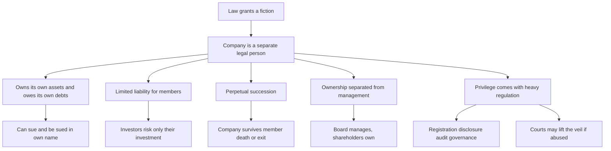
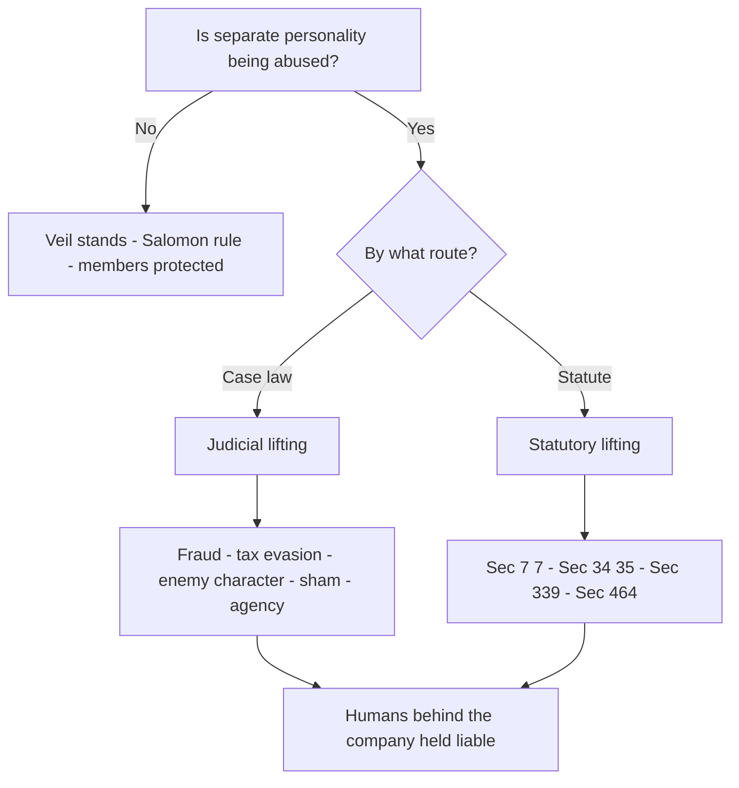
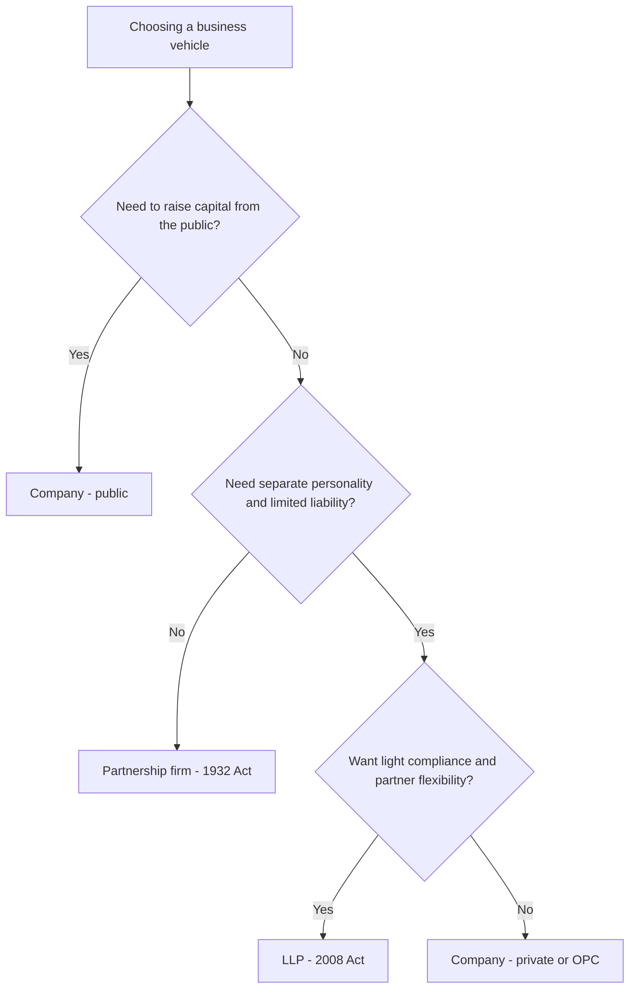
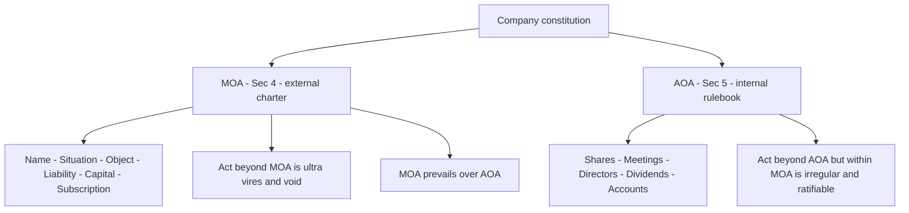

<!-- v1-foundation -->

# Foundation: The Companies Act, 2013 — Foundation Orientation

## 1. The Problem it solves

Picture a mid-sized ambition. Four engineers want to build a factory that makes electric-scooter batteries. The plan needs about ₹40 crore of capital — far more than any one of them has. They will need to raise money from hundreds, maybe thousands, of outside investors; buy land in the firm's own name; hire 300 workers; sign supply contracts running for a decade; and, crucially, they want to sleep at night knowing that if the venture fails, the bank cannot come and sell their personal homes to recover a ₹40-crore loan.

A **partnership firm cannot do any of this cleanly.** As you saw in the Partnership Act chapter, a firm is not a separate legal person — it is just a "compendious name for the partners." That creates four hard walls the four engineers keep slamming into:

- **Unlimited liability.** If the firm borrows ₹40 crore and collapses, the creditors reach straight through to the partners' private houses and savings. Nobody sane risks their family home on a factory.
- **No capital-raising machinery.** You cannot invite the general public to put ₹10,000 each into a partnership. A firm is capped at a small number of partners and has no mechanism for freely transferable ownership.
- **No perpetual existence.** If one of the four dies or walks out, the firm can dissolve. A ten-year supply contract signed by a firm that might vanish next year is a shaky thing.
- **Ownership is glued to management.** In a firm, owners *are* the managers. There is no clean way to have thousands of passive investors own the business while a small professional board runs it.

The economy needs a vehicle that solves all four problems at once — a business form that can **raise large amounts of capital from strangers, protect those strangers from personal ruin, live forever regardless of who comes and goes, and separate the people who own the business from the people who run it.** That vehicle is the **company**, and the rulebook that creates it, governs it, and controls it is the **Companies Act, 2013**.

For a CA this is not one topic among many — it is the *spine* of professional life. You will audit companies (that is literally a statutory monopoly of Chartered Accountants), prepare and certify their accounts, advise on their incorporation and compliance, and sign off on their financial statements. Every later CA subject — Advanced Accounting's company final accounts, Audit's company audit, Corporate Laws in its entirety — assumes you already understand *what a company is and why it behaves the way it does.* This Foundation chapter builds that base.

## 2. Core Idea

A company is **an artificial person created by law** — an entity that the legal system treats as a "person" completely separate from the human beings who own it or run it.

That one move — "the law pretends the company is a person" — is the master key. From it everything else unlocks:

- Because the company is a *separate person*, it owns its own assets, owes its own debts, sues and is sued in its own name, and its members' liability can be capped (**limited liability**).
- Because it is an *artificial* person, it can only act through humans (directors, officers) and only in the ways its charter documents permit.
- Because its existence is *granted by law*, not by the lives of its members, it can live forever (**perpetual succession**) — members die, the company sails on.

Section 2(20) of the Companies Act, 2013 gives the formal (and famously circular) definition:

> "**company** means a company incorporated under this Act or under any previous company law."

The definition is circular on purpose — it tells you *how* a company is born (by incorporation under the Act) rather than *what* it is philosophically. The substance is supplied by the case law and the features. The single most important idea in this entire chapter, and arguably in all of company law, is one sentence you should be able to recite in your sleep:

> **A company is a legal person separate and distinct from its members.**

## 3. Why it works this way

Why would a legal system invent a fictional "person"? Because doing so solves the four walls from Section 1 in one elegant stroke, and each solution follows from first principles.

**Step 1 — Separate legal personality is the enabling fiction.** If you want an entity that can own property, borrow money, and be sued *without* those consequences flowing back to the humans behind it, you must give that entity its own legal identity. There is no halfway house. Once the law says "the company is a person," the company — not the shareholders — owns the factory, and the company — not the shareholders — owes the bank. The famous case **Salomon v. Salomon & Co. Ltd. (1897)** established this: once a company is validly incorporated, it is a distinct person, and even a one-man-controlled company's debts are the *company's* debts, not the owner's. Salomon had lent money to his own company and secured it; when the company failed, the court held he ranked as a secured creditor *of a separate person* — he could not be made personally liable for the company's unsecured debts.

**Step 2 — Limited liability is a deliberate incentive, not a loophole.** Here is the reasoning that a smart finance mind should appreciate: if investors risked *everything they own* every time they bought a share, almost nobody would invest in anything risky, and large-scale industry would never get funded. So the law strikes a bargain. It says to the investor: "You may lose the money you put in — but no more." A shareholder's maximum loss is the amount unpaid on his shares (or the amount he guaranteed). This caps the downside at a *known* number, which is exactly what makes it rational for thousands of strangers to pool capital into a factory they will never visit. Limited liability is the price society pays to unlock large-scale investment — and it only works because the *company itself* absorbs the losses beyond that cap, which is only possible because the company is a separate person (Step 1).

**Step 3 — Perpetual succession follows from artificiality.** A human dies. But an artificial person created by a legal register does not have a biological lifespan — it exists until the law says it stops existing (winding up / strike-off). So the death, insolvency, or exit of any member changes nothing about the company's existence. "Members may come and go, but the company goes on forever." This is what makes a company able to sign a 30-year lease or a decade-long supply contract with a straight face.

**Step 4 — Separation of ownership and management follows from scale.** Once you have thousands of shareholders, they *cannot* all run the business. So ownership (shares) is separated from control (the Board of Directors). Shareholders own; directors manage. This is why company law spends so much energy on directors' duties, board meetings, and shareholder protections — because the owners have handed the keys to managers and need safeguards.

**The trade-off — regulation is the cost of the privilege.** All four benefits are *granted* privileges. Society does not hand out separate personality and limited liability for free. In return, companies accept heavy regulation: mandatory registration, public disclosure of accounts, statutory audit, formal governance, and the power of courts to **lift the corporate veil** when the fiction is abused. The Companies Act, 2013 is essentially the terms-and-conditions of this bargain. Understand the bargain, and the Act stops being a list of rules to memorise and becomes a logical system.

## 4. Full technical content

### 4.1 Definition and the source law

- **Governing statute:** the **Companies Act, 2013** (Act 18 of 2013), which replaced the Companies Act, 1956. Administered by the **Ministry of Corporate Affairs (MCA)** through the **Registrar of Companies (ROC)** in each state, the **Regional Directors**, the **National Company Law Tribunal (NCLT)** (the adjudicating body), and the **National Financial Reporting Authority (NFRA)** (audit oversight for larger companies).
- **Section 2(20):** *"company means a company incorporated under this Act or under any previous company law."*
- A company comes into existence only on **incorporation** — the ROC issues a **Certificate of Incorporation**, and from its date the company is "born" as a body corporate.

### 4.2 The characteristics (features) of a company

These eight features are the heart of every theory question. Learn them as a set.

| # | Characteristic | Meaning | Anchor / authority |
|---|----------------|---------|--------------------|
| 1 | **Separate Legal Entity** | The company is a person distinct from its members; it owns assets and owes debts in its own name. | Sec 9; *Salomon v. Salomon* |
| 2 | **Limited Liability** | A member's liability is capped at the unpaid amount on shares (company limited by shares) or the guaranteed amount (company limited by guarantee). | Sec 2(22), 2(21) |
| 3 | **Perpetual Succession** | Continuous existence unaffected by death, insolvency, insanity or exit of members. "Members come and go, the company goes on." | Sec 9 |
| 4 | **Common Seal (now optional)** | Formerly the company's signature. After the 2015 amendment, a common seal is **optional**; if none, documents are signed by two directors / a director + company secretary. | Sec 22 (as amended) |
| 5 | **Transferability of Shares** | Shares of a **public** company are freely transferable (Sec 44). A **private** company **restricts** transfer by its articles. | Sec 44; Sec 2(68) |
| 6 | **Separate Property** | Company's property is its own; a shareholder has **no insurable interest** in it. | *Macaura v. Northern Assurance Co.* |
| 7 | **Capacity to Sue and Be Sued** | The company litigates in its own name. | — |
| 8 | **Artificial Legal Person / acts through agents** | A creation of law with no physical body; acts only through the Board and officers, within its objects. | Sec 2(20) |

**Two classic English cases you must be able to cite:**

- **Salomon v. Salomon & Co. Ltd. (1897)** — establishes *separate legal entity*. A validly incorporated company is distinct from its members even if one person effectively owns and controls it.
- **Macaura v. Northern Assurance Co. Ltd. (1925)** — establishes *separate property*. Macaura owned all shares of a timber company and insured the timber **in his own name**. When it burnt, the insurer refused to pay: the timber belonged to the *company*, and Macaura (a shareholder) had **no insurable interest** in the company's assets. A shareholder does not own the company's property.
- (Bonus) **Lee v. Lee's Air Farming Ltd. (1961)** — a person can simultaneously be the controlling shareholder, sole director, *and* an employee of his own company, because company and man are two separate persons. Lee's widow could claim workers' compensation on his death because Lee was an *employee* of a *separate* company.

### 4.3 Lifting / piercing the corporate veil

The "veil" is the metaphorical curtain of separate personality that hides the members from the company's liabilities. Normally the veil is respected (that is the whole point). But when the fiction is **abused** — used to commit fraud, evade law, or defeat justice — courts and statutes will **lift the veil**, look at the humans behind it, and hold *them* liable.

Two routes:

**(A) Judicial lifting (by courts, on case law).** Courts pierce the veil where the company is used for:

| Ground | Illustration |
|--------|-------------|
| **Fraud or improper conduct** | A person forms a company purely to defraud creditors. *Gilford Motor Co. v. Horne* — an ex-employee bound by a non-compete formed a company to solicit his old employer's customers; the court treated the company as a sham and enforced the covenant against it. |
| **Evasion of tax** | A company created solely to dodge tax; the court looks through it. *Sir Dinshaw Maneckjee Petit* — companies formed only to split income and avoid tax were disregarded. |
| **Enemy character in wartime** | *Daimler Co. v. Continental Tyre* — a company's "nationality" was traced to its controllers to determine enemy character. |
| **Company as agent or sham** | Where the company is a mere façade or agent of its controllers. |
| **Protecting revenue / public interest** | Courts look at economic reality. |

**(B) Statutory lifting (the Act itself pierces the veil).** The Companies Act, 2013 fixes personal liability on individuals in specific sections — you do not need a court's discretion, the statute does it:

| Section | Situation | Consequence |
|---------|-----------|-------------|
| **Sec 7(7)** | Company incorporated by furnishing false information | Tribunal may pass orders including making liability of members **unlimited** |
| **Sec 34 / 35** | Misstatement in prospectus | Criminal (34) and civil (35) liability of directors/promoters |
| **Sec 39(3), 339** | Fraudulent conduct of business during winding up | Persons knowingly party to it become **personally liable without limit** |
| **Sec 251(1)** | Fraudulent application for removal of name | Personal liability |
| **Sec 464** | Association of persons exceeding the permitted limit without registration | Members personally liable |

**Key exam framing:** the veil is lifted only in *exceptional* cases; the *default rule* (Salomon) is that the veil stands. Do not over-apply it.

### 4.4 Classes of companies

The Act classifies companies along several independent axes. A single company can sit in several boxes at once (e.g., a company can be public + listed + holding + limited by shares simultaneously).

**(A) On the basis of incorporation**

| Type | Meaning |
|------|---------|
| **Chartered company** | Created by royal charter (historical; e.g. East India Company) — not relevant in modern India. |
| **Statutory company** | Created by a special Act of Parliament/State Legislature (e.g. RBI, LIC, SBI). |
| **Registered company** | Incorporated under the Companies Act, 2013 (or a previous company law) — the normal case. |

**(B) On the basis of liability**

| Type | Section | Liability of members |
|------|---------|----------------------|
| **Limited by shares** | 2(22) | Limited to the **unpaid amount on shares held**. The overwhelmingly common form. |
| **Limited by guarantee** | 2(21) | Limited to the **amount each member guarantees** to contribute on winding up. Typical of clubs, NGOs, trade associations. May or may not have share capital. |
| **Unlimited company** | 2(92) | **No limit** — members personally liable for the company's debts, yet the company is still a separate legal entity. Rare. |

**(C) On the basis of number of members / control — the big one**

| Type | Section | Key thresholds & features |
|------|---------|---------------------------|
| **Private company** | 2(68) | By its **articles**: (i) **restricts** the right to transfer shares; (ii) limits members to a **maximum of 200** (excluding present & past employee-members); (iii) **prohibits** any invitation to the public to subscribe to its securities. Minimum **2** members, minimum **2** directors. Name ends with **"Private Limited"**. |
| **Public company** | 2(71) | A company that is **not private**; a private company that is a **subsidiary of a public company** is deemed public. Minimum **7** members, minimum **3** directors, **no** upper limit on members. Name ends with **"Limited"**. |
| **One Person Company (OPC)** | 2(62) | A company with **only one member**. A *new* creation of the 2013 Act. Must be limited (by shares or guarantee), must nominate a **nominee** (who takes over on the member's death/incapacity), minimum **1** director. Only a **natural person who is an Indian citizen** (resident or otherwise, per amended rules) may form one. Name written as **"OPC Private Limited"**. |

**(D) Special / status-based classes**

| Type | Section | Defining test |
|------|---------|---------------|
| **Small company** | 2(85) | A company (other than a public company) whose **paid-up capital ≤ ₹4 crore** *and* **turnover ≤ ₹40 crore** (current thresholds under the 2022 rules; the Act's base limits were ₹50 lakh / ₹2 crore, raised by notification). **Not** available to a holding/subsidiary company, a Section 8 company, or a company governed by a special Act. Gets compliance relaxations. |
| **Government company** | 2(45) | A company in which **≥ 51%** of the paid-up share capital is held by the Central Govt, State Govt(s), or partly by both. Includes a subsidiary of a Government company. |
| **Holding & Subsidiary** | 2(46), 2(87) | **Holding company** = a company of which another is a subsidiary. **Subsidiary** = a company in which the holding company **controls the composition of the Board** *or* exercises/controls **more than one-half of the total voting power** (directly or through subsidiaries). An **associate company** (Sec 2(6)) = one in which another has **significant influence** — ≥ 20% of total voting power — but which is not a subsidiary. |
| **Listed company** | 2(52) | A company which has **any** of its securities listed on a recognised stock exchange. (After amendment, certain public companies may be exempted from being "listed" merely by listing debt on private placement, but the base definition is listing of securities.) |
| **Section 8 company** | 8 | A company formed to promote **commerce, art, science, sports, education, research, social welfare, religion, charity, protection of environment** or similar objects, that **applies its profits (if any) in promoting its objects and prohibits payment of dividend** to members. Enjoys a licence from the Central Govt, need not use "Limited"/"Private Limited" in its name, and gets several exemptions. The modern NGO-as-company. |
| **Foreign company** | 2(42) | A company incorporated **outside India** which has a **place of business in India** (physically or through an agent, or electronically) and conducts business activity in India. |
| **Dormant company** | 455 | A company formed for a future project / to hold an asset or IP, with **no significant accounting transaction**, may apply to the ROC for **dormant** status. |
| **Producer company** | Part IXA (of 1956 Act, saved) / Ch XXIA | A body corporate of primary producers (farmers etc.) with objects relating to production, harvesting, marketing of produce. |

**A comparison you must memorise — Private vs Public:**

| Feature | Private company (Sec 2(68)) | Public company (Sec 2(71)) |
|---------|-----------------------------|----------------------------|
| Minimum members | 2 | 7 |
| Maximum members | 200 | No limit |
| Minimum directors | 2 | 3 |
| Transfer of shares | Restricted by articles | Freely transferable (Sec 44) |
| Invitation to public | Prohibited | Permitted (via prospectus) |
| Name suffix | "Private Limited" | "Limited" |
| Commencement / public deposits | More relaxed | More stringent |

### 4.5 Company vs Partnership vs LLP

This distinction is a favourite Foundation question. The reasoning ties straight back to Sections 2–3.

| Basis | Partnership firm | LLP (LLP Act, 2008) | Company (Companies Act, 2013) |
|-------|------------------|---------------------|-------------------------------|
| **Governing law** | Indian Partnership Act, 1932 | Limited Liability Partnership Act, 2008 | Companies Act, 2013 |
| **Separate legal entity** | **No** — firm = the partners | **Yes** — body corporate | **Yes** — body corporate |
| **Liability of owners** | Unlimited, joint & several | Limited to contribution (except for own wrongful acts) | Limited (to unpaid share / guarantee) |
| **Perpetual succession** | No — affected by death/exit | Yes | Yes |
| **Max members/partners** | 50 (Rule under Sec 464) | No maximum | Private: 200; Public: no limit |
| **Registration** | Optional | Mandatory | Mandatory |
| **Ownership vs management** | Owners manage | Partners manage (or designated partners) | Separated — Board manages, members own |
| **Regulation / disclosure** | Light | Moderate | Heavy — audit, filings, public accounts |
| **Minimum persons** | 2 | 2 partners | Private 2 / Public 7 / OPC 1 |

Mental model: **LLP is the hybrid** — it grafts a company's *separate personality + limited liability* onto a partnership's *flexibility and lighter compliance*. A company gives the strongest protection and capital-raising power but carries the heaviest compliance load.

### 4.6 Incorporation — how a company is born

Incorporation is the legal event that creates the separate person. Overview of the process under **Sections 3–11**:

| Stage | Section | What happens |
|-------|---------|-------------|
| Minimum persons to form | **Sec 3** | Public: 7; Private: 2; OPC: 1 — subscribe their names to the memorandum. |
| Name reservation | Sec 4(4) + **RUN / SPICe+ Part A** | Apply to ROC to reserve a unique name (not identical/undesirable, not violating trademark). Reserved for 20 days. |
| Filing incorporation documents | **Sec 7** | File the MOA, AOA, declarations, address, director details, DIN, DSC via the integrated web form **SPICe+ (INC-32)** with **e-MOA (INC-33)** and **e-AOA (INC-34)**. |
| Declaration of compliance | Sec 7(1)(b) | A professional (CA/CS/CWA/advocate) and a director declare all requirements are complied with. |
| Registration & birth | **Sec 7(2), 9** | ROC registers the documents and issues the **Certificate of Incorporation** with a **CIN** (Corporate Identity Number). From this date the company is a body corporate. |
| Commencement of business | **Sec 10A** | A company with share capital must file a **declaration (INC-20A)** within **180 days** that subscribers have paid the money agreed, before it can start business or borrow. |

The **Certificate of Incorporation is conclusive evidence** that the company is duly registered (Sec 7(2) read with the general rule) — once issued, the validity of incorporation cannot ordinarily be questioned.

### 4.7 The two constitutional documents — MOA and AOA

Every company is created and governed by two charter documents. Understanding the *division of labour* between them is the point.

**Memorandum of Association (MOA) — the "charter" / the company's constitution facing the outside world.** It defines the *boundaries* of the company: who it is, where it operates, what it may do, and the limit of members' liability. Section 4 prescribes its clauses; the format is in **Tables A–E of Schedule I**.

| MOA Clause | Section | Contents |
|-----------|---------|----------|
| **Name clause** | 4(1)(a) | The company's name, ending in "Limited" / "Private Limited" (or exempt for Sec 8). |
| **Registered office / Situation clause** | 4(1)(b) | The State in which the registered office is situated. |
| **Object clause** | 4(1)(c) | The objects for which the company is incorporated and matters necessary for them. Acts beyond the objects are **ultra vires**. |
| **Liability clause** | 4(1)(d) | States that members' liability is limited (by shares or by guarantee) or unlimited. |
| **Capital clause** | 4(1)(e) | The authorised (nominal) share capital and its division into shares. |
| **Subscription clause** | 4(1)(f) | The subscribers agree to take at least one share each and sign the MOA. (For OPC, the nominee clause.) |

**Articles of Association (AOA) — the internal rulebook.** The AOA (Sec 5) contains the **regulations for the internal management** of the company: rules on shares, calls, transfers, board meetings, general meetings, voting, dividends, directors' powers, borrowing, accounts, winding up. Model articles are in **Tables F–J of Schedule I** (Table F = a company limited by shares). A company may adopt Table F wholly or partly, or draft its own.

**MOA vs AOA — the exam table:**

| Basis | Memorandum (Sec 4) | Articles (Sec 5) |
|-------|--------------------|--------------------|
| Nature | Charter — defines company's **relationship with the outside world** | Rulebook — governs **internal management** |
| Defines | Powers & objects (the *what*) | The manner of exercising them (the *how*) |
| Supremacy | **Supreme** — AOA is subordinate to MOA | Subordinate to MOA and to the Act |
| Alteration | Harder — often needs special resolution + sometimes Central Govt/Tribunal approval | Easier — generally by special resolution (Sec 14) |
| Ultra vires effect | Act beyond MOA is **void**, cannot be ratified even by all members | Act beyond AOA but within MOA is **irregular** — can be ratified by members |
| Model tables | Tables A–E, Schedule I | Tables F–J, Schedule I |

**The doctrine of ultra vires** (literally "beyond the powers): any act outside the *object clause of the MOA* is void from the start and cannot be ratified even by unanimous consent of all shareholders, because it protects creditors and investors who relied on the stated objects. An act within the MOA but beyond the AOA is merely *irregular* and can be ratified. (The related *doctrine of indoor management* / Turquand's rule and *doctrine of constructive notice* are studied in depth at Inter level.)

## 5. Worked examples (application / IRAC style)

For law, a "worked example" is a fact scenario solved in **Issue → Rule → Application → Conclusion (IRAC)** style. The numbers are chosen to be internally consistent so you can also see the *financial* logic of limited liability.

### Worked Example 1 — Separate legal entity and the reach of creditors (Salomon-type)

**Facts.** Mr. Verma incorporates *Verma Batteries Pvt. Ltd.* as a company limited by shares. Authorised and issued capital: 4,00,000 equity shares of ₹10 each = ₹40,00,000, fully called and fully paid. Mr. Verma personally holds 3,60,000 shares (90%); four relatives hold the rest. Mr. Verma also *lends* the company ₹25,00,000 as a **secured** loan against a charge on the plant. The company borrows a further ₹60,00,000 unsecured from a bank. The venture fails. On winding up, the company's assets realise only ₹70,00,000. The bank demands that Mr. Verma pay the shortfall from his personal wealth of ₹2 crore, arguing "he *is* the company."

**Issue.** (a) Is Mr. Verma personally liable for the company's unsecured bank debt? (b) In what order are claims paid, and does Mr. Verma's own secured loan rank ahead of the bank?

**Rule.** By **Sec 2(20) + Sec 9** and *Salomon v. Salomon & Co. Ltd. (1897)*, a validly incorporated company is a **separate legal person**; its debts are its own, not the members'. Under **limited liability (Sec 2(22))**, a shareholder's liability is capped at the **unpaid amount on his shares** — here **nil**, because shares are fully paid. A member who is *also a secured creditor* deals with the company as a *separate person* and ranks as a secured creditor.

**Application — the money maths.**
- Company assets realised: **₹70,00,000**.
- Mr. Verma's secured loan (charge on plant): **₹25,00,000** — paid *first* out of the charged asset.
- Remaining for unsecured creditors: ₹70,00,000 − ₹25,00,000 = **₹45,00,000**.
- Bank's unsecured claim: **₹60,00,000**. It recovers ₹45,00,000 and suffers a shortfall of ₹60,00,000 − ₹45,00,000 = **₹15,00,000**.
- Can the bank reach Mr. Verma's ₹2 crore? **No.** His shares are fully paid, so his liability as a member is **₹0**. The ₹15,00,000 shortfall is the company's debt, and the company is a separate person.

**Conclusion.** Mr. Verma pays **nothing** more; his maximum exposure as a member was the unpaid amount on shares = nil. His secured loan of ₹25,00,000 validly ranks ahead of the bank because he contracted with a *separate legal person*. The bank absorbs the ₹15,00,000 loss. This is limited liability and separate personality working exactly as designed — and precisely the outcome the four engineers in Section 1 were seeking.

### Worked Example 2 — Shareholder has no insurable interest in company property (Macaura-type)

**Facts.** Ms. Nair owns **100%** of the shares of *Green Timber Ltd.*, whose only asset is a timber stock worth ₹80,00,000 (also the company owes the company ₹30,00,000 to trade creditors). Ms. Nair takes a fire-insurance policy on the timber **in her own personal name** for ₹80,00,000, paying the premium herself. A fire destroys the entire timber. She claims ₹80,00,000 from the insurer.

**Issue.** Can a shareholder — even a 100% shareholder — insure and claim for the *company's* property in her personal name?

**Rule.** By the **separate-property** feature and *Macaura v. Northern Assurance Co. (1925)*, the company's assets belong to the **company**, not to its shareholders. A shareholder has **no insurable interest** in the company's property; she owns *shares*, not the underlying assets.

**Application.** The timber is owned by *Green Timber Ltd.*, a separate person. Ms. Nair, though she owns every share, does not own the timber and would suffer no *direct* legal loss to *her property* from its destruction — her loss is to the *value of her shares*, an indirect interest the law does not treat as insurable interest over the asset. The policy was taken in the *wrong person's* name. Note the internal figures are consistent: even the company's net asset backing her shares was only ₹80,00,000 − ₹30,00,000 = **₹50,00,000**, further showing her economic interest (share value) differs from the ₹80,00,000 asset she purported to insure.

**Conclusion.** The insurer is **not liable**; the claim fails for want of insurable interest. Correct course of action: the **company** should have taken the policy. The lesson — separate personality cuts both ways: it shields the shareholder from the company's debts (Example 1) but also bars her from claiming the company's assets as her own.

### Worked Example 3 — Lifting the veil for tax/fraud evasion (Dinshaw Petit / Gilford type)

**Facts.** Mr. Rao earns large professional income taxed at the top slab. On advice, he forms **four** private companies — *Rao Holdings A, B, C, D Pvt. Ltd.* — and routes his income through them purely to split it and pay less tax; the companies carry on **no real business**, do not trade, and exist only as conduits. Each company then "lends" the money straight back to Mr. Rao. The tax authority seeks to **ignore** the companies and tax the whole income in Mr. Rao's hands.

**Issue.** Will the court respect the separate personality of the four companies, or lift the veil?

**Rule.** The default rule (Salomon) is that companies are separate persons. **But** courts will **lift the corporate veil** where a company is formed as a **mere device / sham to evade tax or perpetrate fraud** — *Sir Dinshaw Maneckjee Petit* (companies formed solely to avoid tax were disregarded) and *Gilford Motor Co. v. Horne* (company as a façade). Statutorily, revenue protection and fraud (cf. Sec 339) support the same result.

**Application.** The four companies do no genuine business; their *sole* purpose is to fragment Mr. Rao's income and dodge tax, and the money loops back to him. This is exactly the abuse the veil-lifting doctrine targets. The economic reality is that the income is Mr. Rao's; the corporate structure is a curtain hiding a single taxpayer.

**Conclusion.** The court will **lift the veil**, disregard the four companies for this purpose, and tax the aggregated income **in Mr. Rao's own hands**. Separate personality is a shield, not a cloak for fraud — when abused, the law looks straight through it.

### Worked Example 4 — Classifying a company and testing "small company" status

**Facts.** *Sunrise Foods Pvt. Ltd.* has: paid-up capital ₹3,50,00,000 (₹3.5 crore); turnover last year ₹38,00,00,000 (₹38 crore); 45 members; it is **not** a subsidiary of any company and holds no subsidiary; it is not a Section 8 company. Separately, *Sunrise* holds 55% of the voting power in *Sunrise Retail Pvt. Ltd.*

**Issue.** (a) Is *Sunrise Foods* a "small company"? (b) What is the relationship between *Sunrise Foods* and *Sunrise Retail*, and does that affect the small-company status?

**Rule.** **Sec 2(85):** a small company (other than a public company) must have **paid-up capital ≤ ₹4 crore** *and* **turnover ≤ ₹40 crore**, and must **not** be a holding or subsidiary company, a Sec 8 company, or governed by a special Act — **both** monetary tests **and** the exclusion tests must be met. **Sec 2(87):** a company controlling **> one-half of the total voting power** of another is its **holding company**, the other its **subsidiary**.

**Application.**
- Monetary tests for *Sunrise Foods*: capital ₹3.5 cr ≤ ₹4 cr **(pass)**; turnover ₹38 cr ≤ ₹40 cr **(pass)**.
- Exclusion test: *Sunrise Foods* holds **55% (> 50%)** of *Sunrise Retail*'s voting power → *Sunrise Foods* is a **holding company** and *Sunrise Retail* is its **subsidiary**.
- Under Sec 2(85), a **holding company cannot be a small company**, regardless of size.

**Conclusion.** (a) *Sunrise Foods* is **not** a small company — although it passes both monetary limits, it is a **holding company**, which is expressly excluded. (b) *Sunrise Foods* is the **holding company** and *Sunrise Retail* the **subsidiary** (55% voting control). Teaching point: the small-company test has **two gates** — the money gate *and* the status gate — and failing *either* disqualifies you.

## 6. Connections — what this unlocks at CA Intermediate

This orientation is the launchpad for a large chunk of the CA Intermediate syllabus:

- **Inter — Corporate & Other Laws, Ch 1 "Preliminary" (Sec 1–2 definitions)** flows straight from Section 4.4 here: every class of company you just learned is *defined* there in enforceable detail.
- **Inter — "Incorporation of Company" (Sec 3–22)** expands Section 4.6–4.7 above: the full mechanics of MOA/AOA, alteration procedures, the **doctrine of constructive notice**, the **doctrine of indoor management (Turquand's rule)**, and conversion between company types.
- **Inter — "Prospectus & Allotment"** builds on the public-company idea (public invitation, Sec 34/35 misstatement liability introduced here as veil-lifting).
- **Inter — "Share Capital & Debentures"** is the detailed engine behind the *capital clause* and *limited liability* you saw here.
- **Inter — Advanced Accounting (Company Accounts):** you cannot prepare a company's financial statements, issue shares, or account for a bonus/buy-back until you know that the company is a separate person owning its own assets — the exact idea Examples 1 and 2 drilled.
- **Inter — Auditing & Ethics (Company Audit, Sec 139–147):** the statutory audit exists *because* a company's owners (shareholders) are separated from managers (directors) and need an independent check — the ownership-management split from Section 3.
- **Later — Insolvency & Winding Up:** perpetual succession and separate personality determine *whose* debts get paid and in what order (Example 1's waterfall is the seed of insolvency law).

In short: **master "a company is a separate legal person," and half of company law at Inter becomes deduction rather than memorisation.**

## 7. Traps & common mistakes

- **Saying "shareholders own the company's assets."** They do **not** — the company owns them (Macaura). Shareholders own *shares*. This is the single most-punished error.
- **Treating limited liability as "the company's liability is limited."** Wrong — the **company's** liability is *unlimited* (it owes all its debts); it is the **members'** liability that is limited. Always say *members'/shareholders'* liability.
- **Over-applying veil-lifting.** The default is Salomon — the veil **stands**. Lift it only for fraud, evasion, sham, enemy character, or specific statutory sections. Do not lift it just because one person controls the company (Lee's case).
- **Confusing MOA and AOA.** MOA = external charter/objects (the *what*); AOA = internal rules (the *how*). MOA is supreme. Ultra vires MOA = void & non-ratifiable; ultra vires AOA (but intra vires MOA) = irregular & ratifiable.
- **Mixing up member and director minimums.** Private: **2 members, 2 directors**; Public: **7 members, 3 directors**; OPC: **1 member, 1 director**. Members ≠ directors.
- **Wrong "small company" logic.** Both tests are **cumulative** (capital ≤ ₹4 cr **AND** turnover ≤ ₹40 cr) *and* the status exclusions apply (no holding/subsidiary/Sec 8/special-Act company). Use current thresholds (₹4 cr / ₹40 cr), not the old ₹50 lakh / ₹2 cr.
- **Forgetting the common seal is now optional** (2015 amendment, Sec 22). Old textbooks still call it mandatory.
- **Assuming a Section 8 company must use "Limited."** It is *exempt* from using "Limited"/"Private Limited" in its name.
- **Saying a subsidiary is defined only by shareholding.** Control of **Board composition** *or* **> 50% voting power** — either limb makes it a subsidiary (Sec 2(87)).
- **Calling the certificate of incorporation "just a formality."** It is **conclusive evidence** of valid incorporation and the moment the separate person is *born*.

## 8. First-principles recap

- The law invents a **fiction** — the company is an **artificial legal person separate from its members** (Sec 2(20); *Salomon*). Every other rule is a consequence of this one move.
- That fiction delivers four powers: **separate property**, **limited liability** (members risk only their investment), **perpetual succession** (the company outlives its members), and **separation of ownership from management**.
- These powers are *privileges granted in exchange for regulation* — registration, disclosure, audit, governance — and courts/statute can **lift the veil** when the fiction is abused for fraud or evasion.
- Companies come in classes along independent axes: by **liability** (shares/guarantee/unlimited), by **members/control** (private/public/OPC), and by **status** (small, government, holding-subsidiary, listed, Section 8, foreign).
- A company is created by **incorporation** (Sec 3–11) and governed by two documents: the **MOA** (external charter/objects, supreme) and the **AOA** (internal rulebook, subordinate).
- Contrast the vehicles: **partnership** (no separate entity, unlimited liability) → **LLP** (separate entity + limited liability, light compliance) → **company** (strongest protection + capital-raising, heaviest compliance).

## 9. Quick-reference

| Item | Key content / section |
|------|----------------------|
| Company defined | **Sec 2(20)** — incorporated under this or a previous Act |
| Separate legal entity | **Sec 9**; *Salomon v. Salomon (1897)* |
| Separate property | *Macaura v. Northern Assurance (1925)* — no insurable interest |
| Company + man = 2 persons | *Lee v. Lee's Air Farming (1961)* |
| Limited by shares / guarantee / unlimited | **Sec 2(22) / 2(21) / 2(92)** |
| Private company | **Sec 2(68)** — restricts transfer, max 200, no public invite; min 2 members, 2 directors |
| Public company | **Sec 2(71)** — not private; min 7 members, 3 directors, no max |
| One Person Company | **Sec 2(62)** — 1 member, nominee required, 1 director |
| Small company | **Sec 2(85)** — capital ≤ ₹4 cr AND turnover ≤ ₹40 cr; not holding/subsidiary/Sec 8 |
| Government company | **Sec 2(45)** — ≥ 51% govt holding |
| Holding / Subsidiary | **Sec 2(46) / 2(87)** — board control OR > 50% voting power |
| Associate company | **Sec 2(6)** — significant influence (≥ 20% voting power) |
| Listed company | **Sec 2(52)** — securities listed on a recognised exchange |
| Section 8 company | **Sec 8** — charitable objects, no dividend, name exemption |
| Foreign company | **Sec 2(42)** — incorporated abroad, place of business in India |
| Lifting veil (statutory) | **Sec 7(7), 34/35, 339, 464** |
| Incorporation | **Sec 3–11**; SPICe+ (INC-32), e-MOA (INC-33), e-AOA (INC-34) |
| Commencement of business | **Sec 10A** — INC-20A within 180 days |
| MOA clauses | **Sec 4** — Name, Situation, Object, Liability, Capital, Subscription |
| AOA | **Sec 5** — internal management; Table F (limited by shares), Schedule I |
| Alteration of articles | **Sec 14** — special resolution |
| Common seal (optional) | **Sec 22** (2015 amendment) |
| Members' max liability (shares) | = unpaid amount on shares held |

---

*Foundation orientation complete. Next: at CA Intermediate, "Incorporation of Company" (Sec 3–22) takes the MOA/AOA and veil doctrines from this chapter to full statutory depth.*
