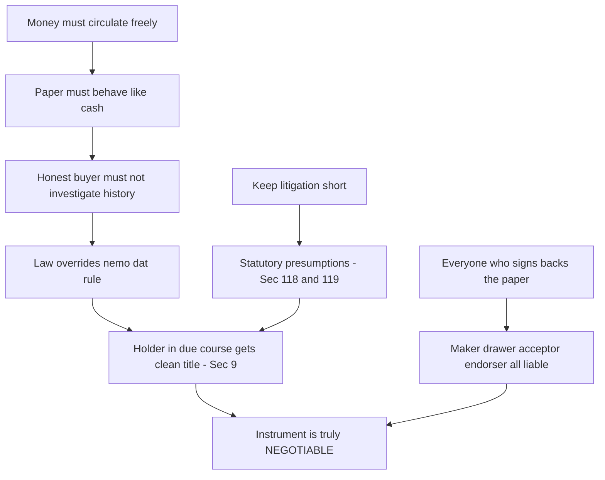
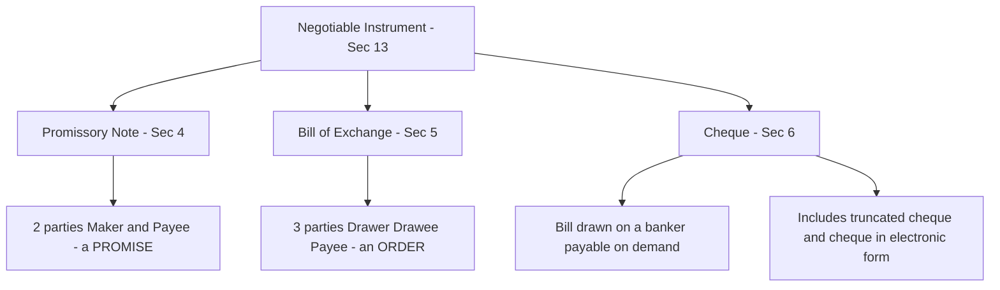
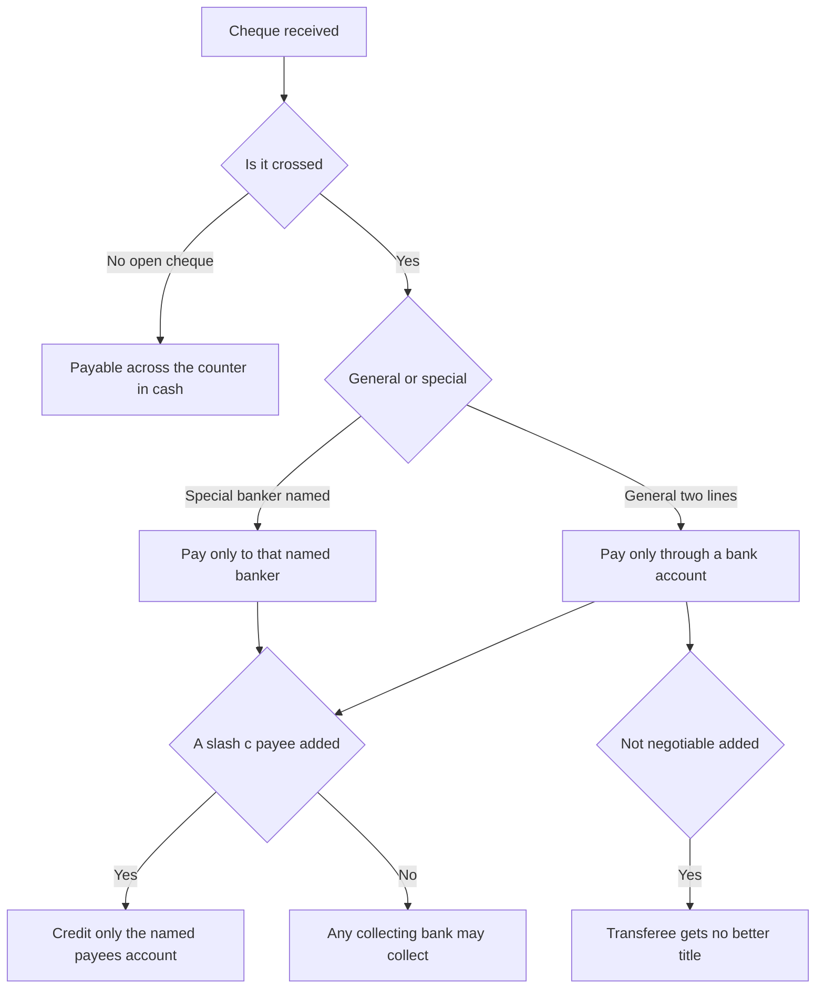
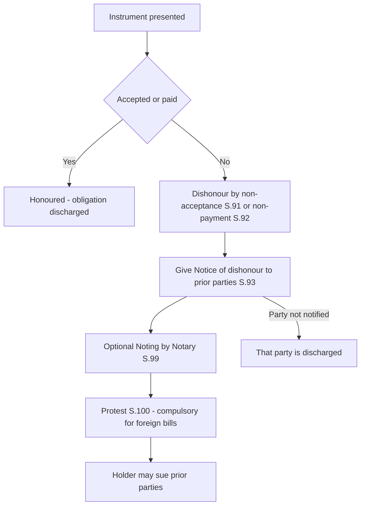

<!-- v1-foundation -->

# Foundation: The Negotiable Instruments Act, 1881

## 1. The Problem it solves

Imagine India before cheques, bills and promissory notes were legally special. A Mumbai cloth merchant sells ₹5,00,000 of fabric to a Delhi garment-maker who cannot pay today but will pay in three months. How does the merchant carry the *right to receive ₹5,00,000* around, or sell it, or use it to pay his own supplier, without physically hauling coins across the country and without a lawsuit every time the debt changes hands?

Ordinary contract law is clumsy here. Under the Indian Contract Act, a debt is a "chose in action" — a mere right to sue. If you want to transfer that right to someone else (assignment), the new owner takes it **subject to all defects** in the old owner's title: if the original debtor had a defence ("the cloth was defective, I owe nothing"), that defence follows the debt into the hands of everyone who later buys it. Worse, the debtor must usually be *notified* of every transfer. A right to money that carries its whole grubby history with it, and that must be re-papered every time it moves, is almost useless as a substitute for cash.

Commerce needed a piece of paper that behaves **like money itself** — something that:
- can be passed from hand to hand and thereby transfer the *ownership* of the money it represents,
- gives an honest buyer a **clean, better title than the seller had** (so he need not investigate the paper's history), and
- lets the holder **sue in his own name** without proving the whole chain.

That paper is a **negotiable instrument**. The **Negotiable Instruments Act, 1881** is the rulebook that creates three such instruments — the **promissory note**, the **bill of exchange**, and the **cheque** — defines who is liable on them, how they move, how they are honoured or dishonoured, and (via the 1988 amendment) makes bouncing a cheque a criminal offence under **Section 138**.

For a CA this is bread-and-butter. You will see cheques, bills of exchange and promissory notes in every audit, every set of books, every financing arrangement. "Bills receivable" and "bills payable" in a balance sheet *are* negotiable instruments. You cannot pass a bills-of-exchange journal entry, advise a client on a bounced cheque, or vouch a bank reconciliation without knowing this law.

## 2. Core Idea

A negotiable instrument is **a written, signed promise or order to pay a fixed sum of money — to a named person or to bearer — that the law treats almost like cash: it can be transferred by delivery (and, where needed, endorsement), and an honest transferee for value gets a title free of the defects in the transferor's title.**

The one central idea — the thing that makes it "negotiable" rather than merely "transferable" — is **negotiability**: the property in the instrument passes to the transferee, and a *holder in due course* (an honest buyer for value, before maturity) obtains a **good and complete title even if the person he took it from had a defective title**. That is a startling privilege. Nowhere else in law can you buy from a thief and end up owning the thing. On a negotiable instrument, you can — provided you paid value, took it honestly, and took it before it was overdue.

Section 13(1) defines it functionally:

> "A **negotiable instrument** means a promissory note, bill of exchange or cheque **payable either to order or to bearer**."

Everything else in the Act — parties, endorsement, crossing, dishonour, notice — is machinery built around that single privilege of a clean, transferable title.

## 3. Why it works this way

Why should the law hand an honest buyer a *better* title than his seller owned, overturning the ancient rule *nemo dat quod non habet* ("no one gives what he does not have")? Because **commerce runs on trust in paper, and trust in paper collapses the moment a buyer must investigate its history.**

**Step 1 — Money must circulate freely.** The whole economic purpose of the instrument is to be a *substitute for cash*. Cash has a magic property: if a shopkeeper honestly takes a ₹500 note in payment, he owns it, no matter that three owners ago it was stolen. If negotiable paper did *not* have the same property, no sensible person would ever accept it, because he would have to trace its entire chain of title before parting with goods. To make the paper *usable*, the law had to give it money-like finality.

**Step 2 — Certainty over investigation.** The law makes a deliberate trade: it protects the *honest current holder* rather than the *earlier victim of fraud/theft*. Yes, that occasionally lets a fraudster's transferee keep the money — but the alternative (making every holder liable to lose the paper to an earlier owner's complaint) would freeze commerce entirely. Between "a few fraud victims bear the loss" and "nobody trusts commercial paper," the law chose the former. The victim can still sue the fraudster personally; he just cannot claw the instrument back from the innocent holder in due course.

**Step 3 — Presumptions do the heavy lifting.** To keep litigation short, the Act (**Sections 118–119**) *presumes* — until the contrary is proved — that every instrument was made for consideration, was dated correctly, was accepted and endorsed in order, and that the holder is a holder in due course. So the holder need not *prove* he gave value; the person resisting payment must *disprove* it. Presumptions shift the burden onto the party crying foul.

**Step 4 — Liability follows the signature.** Anyone who signs the instrument (maker, drawer, acceptor, endorser) puts his own credit behind it and can be sued on it. That is why a bill "backed" by many endorsers is safer than one with few — each signature is another pocket the holder can reach. Signing = promising = liable.

Once you internalise "paper must behave like cash → honest holder gets a clean title → presumptions protect him → every signer is liable," the entire Act becomes derivable rather than memorised.

*Figure 1 — Deriving negotiability from the need for money-like paper.*

## 4. Full technical content

### 4.1 What "negotiable instrument" means and its characteristics

The Act does not exhaustively define "negotiable instrument" beyond listing the three statutory ones. **Section 13** says a negotiable instrument means a promissory note, bill of exchange or cheque payable either **to order** or **to bearer**. By usage, other instruments (hundis, government promissory notes, banker's drafts, dividend warrants, share warrants payable to bearer) are also treated as negotiable.

**Characteristics (features) of a negotiable instrument:**

| # | Characteristic | Meaning |
|---|---|---|
| 1 | **Written and signed** | Must be in writing and signed by the maker/drawer |
| 2 | **Free transferability** | Property passes by mere delivery (bearer) or endorsement + delivery (order) |
| 3 | **Title free of defects** | A holder in due course gets a title better than the transferor's |
| 4 | **Right to sue in own name** | The holder can sue on it without joining prior parties |
| 5 | **Certain sum of money** | Payable in money only, and the sum must be certain |
| 6 | **Payable to order or bearer** | The pay-ee must be identifiable — a named person "or order," or bearer |
| 7 | **Presumptions apply** | Sections 118–119 presumptions attach automatically |
| 8 | **Consideration presumed** | Deemed made for value until the contrary is shown |

**Negotiability vs. Assignability** — a key exam distinction:

| Basis | Negotiation (NI Act) | Assignment (Transfer of Property Act) |
|---|---|---|
| How | Delivery / endorsement + delivery | Written instrument of assignment |
| Notice to debtor | Not required | Required |
| Title of transferee | Can be **better** than transferor (HDC) | **Subject to** all defects (no better than transferor) |
| Consideration | **Presumed** | Must be proved |
| Right to sue | In own name, no need to join others | May have to join the assignor |

### 4.2 The three instruments — definitions

**Promissory Note — Section 4.** An instrument in writing (not being a bank/currency note) containing an **unconditional undertaking, signed by the maker, to pay a certain sum of money only to, or to the order of, a certain person, or to the bearer** of the instrument.
- Two parties: **Maker** (who promises to pay) and **Payee** (who receives).
- It is a *promise* to pay one's own debt.
- A currency note is expressly excluded. A promissory note **cannot** be made payable to bearer on demand (that would compete with currency — RBI Act bar), but bills/cheques can be.

**Bill of Exchange — Section 5.** An instrument in writing containing an **unconditional order, signed by the maker, directing a certain person to pay a certain sum of money only to, or to the order of, a certain person, or to the bearer** of the instrument.
- Three parties: **Drawer** (who orders payment / the creditor), **Drawee** (who is ordered to pay; becomes **acceptor** once he signs across the bill accepting it), and **Payee** (who receives).
- It is an *order* to pay. It needs **acceptance** by the drawee to bind him.
- Drawer and payee can be the same person (drawer draws it "pay to me"). Drawer and drawee can even be the same (a draft).

**Cheque — Section 6.** A **bill of exchange drawn on a specified banker and not expressed to be payable otherwise than on demand**, and it **includes the electronic image of a truncated cheque and a cheque in electronic form**.
- Three parties: **Drawer** (account holder), **Drawee** (always a *bank*), **Payee**.
- A cheque is a *species of bill of exchange* with two constants: (a) drawee is always a banker, (b) always payable on demand.
- **Truncated cheque** = a cheque truncated (stopped) in the clearing cycle and its electronic image used instead of the physical cheque. **Cheque in electronic form** = a cheque generated, drawn and issued in a secure electronic system using digital signature.

*Figure 2 — The classification tree of statutory negotiable instruments.*

### 4.3 Distinctions between the three instruments

| Basis | Promissory Note (S.4) | Bill of Exchange (S.5) | Cheque (S.6) |
|---|---|---|---|
| Nature | Promise to pay | Order to pay | Order to pay |
| Parties | 2 (maker, payee) | 3 (drawer, drawee, payee) | 3 (drawer, banker, payee) |
| Drawee | None | Any person | Always a **bank** |
| Maker's liability | Primary & absolute | Secondary (drawer); acceptor primary | Drawer primary vis-à-vis payee |
| Acceptance | Not required | Required (drawee must accept) | Not required |
| Payable to bearer on demand | **Not allowed** | Allowed | Allowed |
| Grace days | 3 days (time instruments) | 3 days (time instruments) | **No grace** (always on demand) |
| Crossing | Not possible | Not possible | **Possible** (unique to cheques) |
| Notice of dishonour | Necessary | Necessary | Drawer not entitled to notice (he knows) |
| Stamp | Required | Required | Not required |

### 4.4 Key definitions of parties

**Holder — Section 8.** The person **entitled in his own name** to the possession of the instrument and to receive/recover the amount due from the parties. Note the two limbs: (a) *entitled to possession* (legal right, not mere physical possession — a thief is not a holder), and (b) *entitled to recover*. A payee/endorsee who has lost the instrument but is still entitled is still the "holder."

**Holder in Due Course (HDC) — Section 9.** A person who, **for consideration**, became the **possessor** (if bearer) or the **payee/endorsee** (if order), **before the amount became payable (before maturity)**, and **without sufficient cause to believe** that any defect existed in the title of the transferor. Four conditions, all mandatory:

| # | Condition for HDC (Sec 9) |
|---|---|
| 1 | Obtained the instrument **for consideration** (value given) |
| 2 | Became holder **before maturity** (before it was overdue) |
| 3 | Took it **in good faith / without notice of defect** in transferor's title |
| 4 | The instrument was **complete and regular** on its face |

**Privileges of a Holder in Due Course** (why HDC status is gold):
- Gets a **title free of all defects** (Sec 53) — better than the transferor's.
- Every prior party is liable to him until the instrument is duly satisfied (Sec 36).
- Against him, no party can plead that the instrument was **lost, or obtained by fraud/unlawful means or for unlawful consideration** (Sec 58).
- The **maker/acceptor cannot deny** the payee's capacity to endorse (Sec 120–122 estoppels).
- An **inchoate (incomplete) stamped instrument** later completed for a larger sum is still enforceable by an HDC up to the amount the stamp covers (Sec 20).
- A person who takes from an HDC gets the HDC's clean title even if he himself had notice of the defect (Sec 53) — the clean title "washes through."

Holder vs Holder in Due Course:

| Basis | Holder (S.8) | Holder in Due Course (S.9) |
|---|---|---|
| Consideration | Not essential | **Essential** |
| Timing | Any time | **Before maturity** |
| Good faith | Not essential | **Essential** |
| Title | Same as transferor's (defects follow) | **Free of defects** — better title |
| Privileges | Basic | Extensive (Secs 20, 36, 53, 58, 120–122) |

### 4.5 Negotiation and endorsement

**Negotiation — Section 14.** When an instrument is transferred to any person so as to **constitute that person the holder**, it is negotiated. Two modes:
- **By delivery (Sec 47)** — a **bearer** instrument is negotiated by mere delivery.
- **By endorsement and delivery (Sec 48)** — an **order** instrument is negotiated by the holder signing (endorsing) it and delivering it.

**Endorsement — Section 15.** When the maker/holder of an instrument **signs it (on the back or face, or on an allonge/slip attached to it)** for the purpose of negotiation, he *endorses* it, and is called the **endorser**; the person to whom it is transferred is the **endorsee**.

**Types of endorsement:**

| Type | Section | What it does |
|---|---|---|
| **Blank / general** | S.16(1) | Endorser signs only his name — instrument becomes **payable to bearer**, negotiable by delivery |
| **Full / special** | S.16(2) | Adds the name of the endorsee — "Pay to X" then signs — only X can further negotiate |
| **Restrictive** | S.50 | Restricts/prohibits further negotiation — "Pay X only" — X cannot negotiate further |
| **Partial** | S.56 | Purporting to transfer only part of the amount — **invalid** (does not operate as negotiation) |
| **Conditional / qualified** | S.52 | Endorser limits or excludes his own liability ("sans recourse"), or makes his liability conditional |

- **"Sans recourse" endorsement** — endorser excludes his personal liability by adding words like "without recourse to me." He becomes a mere conduit.
- **Conversion of blank to full** — a holder who receives a blank-endorsed instrument may, without signing himself, write "Pay to X" above the endorser's signature, converting it into a full endorsement (Sec 49) — this protects him without adding his own liability.

### 4.6 Crossing of cheques (unique to cheques — Sections 123–131A)

Crossing = drawing **two parallel transverse lines** across the face of a cheque, with or without words. Its effect: the cheque **cannot be paid at the counter in cash** — it must be paid only **through a bank account**, creating a traceable trail. Crossing is a safety device: if a crossed cheque is stolen, the thief cannot simply cash it; it must go through an account that can be traced.

| Type of crossing | Section | Form | Effect |
|---|---|---|---|
| **General crossing** | S.123 | Two parallel transverse lines, with or without "& Co." / "not negotiable" | Paid only **to a banker** (collected through some bank account) |
| **Special crossing** | S.124 | Name of a **specific banker** written across (lines not essential) | Paid only **to that named banker** |
| **Restrictive / "Account Payee"** | Practice (recognised by RBI) | "A/c Payee" added | Proceeds credited **only to the named payee's account** — not transferable in effect |
| **"Not Negotiable" crossing** | S.130 | Words "not negotiable" added to a crossing | Cheque **remains transferable but the transferee gets no better title** than the transferor — kills the HDC privilege |

- **"Not negotiable" does NOT mean "not transferable."** The cheque still moves, but the special magic (clean title) is switched off — everyone now takes subject to defects, just like an ordinary assignment. This is the single most common trap.
- **Who may cross:** the drawer may cross generally or specially; the holder may cross an uncrossed cheque, or convert general → special, or add "not negotiable"; the banker may cross specially to another banker for collection (Sec 125).
- **Payment in due course of a crossed cheque (Sec 128 / 126–127):** a banker who pays a crossed cheque in accordance with the crossing is protected and can debit the customer's account.

*Figure 3 — Crossing decision logic for cheques.*

### 4.7 Presentment (presentation)

An instrument must be **presented** to the right party at the right time and place to fix liability.
- **Presentment for acceptance (Secs 61):** only bills of exchange payable *after sight* must be presented to the drawee for acceptance so the maturity date can be fixed. Must be presented before maturity, during business hours, on a business day.
- **Presentment for payment (Secs 64):** promissory notes, bills and cheques must be presented for payment to the maker/acceptor/drawee by or on behalf of the holder. If not presented, the other parties (drawer, endorsers) are **discharged**.
- **Cheque timing:** a cheque should be presented within a reasonable time. Banks in practice honour cheques for **3 months** from the date (RBI directive). If a drawer suffers loss because the cheque was not presented in reasonable time and the bank fails meanwhile, the drawer is discharged to the extent of the loss (Sec 84).

### 4.8 Maturity and days of grace (Sections 22–25)

- **Maturity** = the date on which a time instrument falls due.
- **Days of grace:** every promissory note or bill of exchange **not payable on demand** is entitled to **three days of grace**. So a bill dated for payment "3 months after date" matures on the corresponding date + 3 days.
- Cheques and demand instruments get **no grace** (payable on demand).
- If maturity falls on a **public holiday**, the instrument falls due on the **preceding business day** (Sec 25) — note: *preceding*, not next.

### 4.9 Dishonour, notice of dishonour, noting and protest

**Dishonour** occurs in two ways:
- **Dishonour by non-acceptance (Sec 91):** the drawee of a *bill* refuses/fails to accept it within 48 hours, or cannot accept, or is incompetent to contract.
- **Dishonour by non-payment (Sec 92):** the maker/acceptor/drawee, on due presentment, **fails to pay**.

**Notice of dishonour (Secs 93):**
- When an instrument is dishonoured, the holder (or an endorser who is liable) must give **notice of dishonour** to all prior parties whom he wishes to hold liable (the drawer and all prior endorsers). A party to whom notice is not given is **discharged**.
- Notice may be oral or written, and must be given within a **reasonable time** after dishonour.
- **When notice is NOT necessary (Sec 98):** e.g., when it is dispensed with by the party entitled; when the drawer has countermanded (stopped) payment; when the party charged could not suffer damage for want of notice; when the party entitled to notice cannot after due diligence be found; **the drawer of a cheque need not be given notice** where he has stopped payment (he already knows).

**Noting (Sec 99):** where a bill/note is dishonoured, the holder may get the fact of dishonour **recorded ("noted") by a Notary Public** upon the instrument, stating the date of dishonour, the reason, and the notary's charges. Noting is *authentic evidence* of dishonour but is **optional** for inland instruments.

**Protest (Sec 100):** a **formal certificate** by the Notary Public **attesting the dishonour** of the bill. For **foreign bills**, protest is **compulsory** if the law of the place so requires; for inland instruments it is optional. A special protest — **"protest for better security"** — is made when the acceptor becomes insolvent before maturity, so the holder can proceed against prior parties.

| Concept | Section | Compulsory? | By whom |
|---|---|---|---|
| Noting | S.99 | Optional (inland) | Notary Public |
| Protest | S.100 | Compulsory for **foreign** bills where local law requires | Notary Public |

*Figure 4 — Process flow on dishonour of an instrument.*

### 4.10 Dishonour of cheque for insufficiency of funds — Section 138 (overview)

Inserted by the 1988 amendment to give cheques *credibility as near-cash*. **Section 138** makes it a **criminal offence** to bounce a cheque for insufficiency of funds.

**Ingredients of the offence (all must be satisfied):**
1. A cheque is drawn by a person on his account for **discharge of a legally enforceable debt or liability** (not a gift/donation).
2. The cheque is presented **within its validity period (3 months** or the period of its validity, whichever is earlier).
3. It is **returned unpaid** for insufficiency of funds *or* because it exceeds the arrangement (overdraft limit).
4. The **payee gives a written demand notice** to the drawer **within 30 days** of receiving the bank's return memo.
5. The drawer **fails to pay** within **15 days** of receiving that notice.
6. On such failure, the offence is complete; the payee may file a **complaint within one month** of the cause of action arising (i.e., after the 15-day period expires).

**Punishment (Sec 138):** imprisonment up to **2 years**, or fine up to **twice the cheque amount**, or both.

**Related provisions:** Sec 139 (presumption in favour of the holder that the cheque was for a debt), Sec 140 (drawer cannot plead he had no reason to believe it would bounce), Sec 141 (offences by companies — directors liable), Sec 142 (cognizance only on written complaint by payee within one month), Sec 143A (interim compensation up to 20% of cheque amount), Sec 148 (appellate court may order 20% deposit).

| Step | Time limit |
|---|---|
| Present cheque | Within 3 months / validity |
| Bank returns unpaid | Trigger event |
| Payee sends demand notice | Within **30 days** of return memo |
| Drawer must pay | Within **15 days** of notice |
| Payee files complaint | Within **1 month** after the 15 days lapse |
| Max punishment | 2 years and/or fine up to 2× cheque amount |

## 5. Worked examples

*Law "problem sums" are application scenarios. Each is solved Issue → Rule → Application → Conclusion. Where money entries are involved, the accounting is shown and balanced.*

### Worked Example 1 — Holder in Due Course and a defective title

**Facts.** Anil, by fraud, obtains a bearer promissory note for **₹1,00,000** from Bhavna. He passes it to Chetan for **₹95,000** cash; Chetan takes it honestly, before maturity, unaware of the fraud. Chetan later gifts the note to his nephew Deepak. Bhavna discovers the fraud and refuses to pay. From whom, and how much, can each party recover?

**Rule.** Sec 9 — an HDC is one who takes for consideration, before maturity, in good faith. Sec 53 — an HDC gets a title free of defects; and a person who *derives title through* an HDC (even without value/notice) gets the same clean title. Sec 58 — against an HDC no party may set up fraud in obtaining the instrument.

**Application.**
- Anil obtained the note by fraud → **defective title**; he is *not* an HDC and cannot enforce it against Bhavna.
- Chetan gave **₹95,000 consideration**, took it **before maturity**, and **in good faith** → Chetan satisfies all Sec 9 conditions → **Chetan is a Holder in Due Course.** His title is clean; Bhavna cannot plead fraud against him (Sec 58).
- Deepak received the note **by gift (no consideration)** so he is *not himself* an HDC. **But** he *derives* his title *through* Chetan, an HDC. Under Sec 53, the clean title "washes through": Deepak enjoys Chetan's defect-free title.

**Conclusion.** **Deepak can recover the full ₹1,00,000 from Bhavna.** Bhavna's remedy is to sue **Anil** personally for the fraud (₹1,00,000), but she cannot resist the note in Deepak's hands. Note the economics: Chetan paid ₹95,000 and, had he retained it, would have collected ₹1,00,000 — a ₹5,000 gain reflecting the discount for taking an unmatured note.

### Worked Example 2 — "Not Negotiable" crossing switches off the HDC magic

**Facts.** Rekha draws a cheque for **₹2,00,000** in favour of Suresh, crossed **generally** and marked **"Not Negotiable."** Suresh's clerk steals the cheque, forges nothing, endorses it in blank by delivery to Tarun (a shopkeeper) in payment for goods worth ₹2,00,000; Tarun takes it honestly and for value. The theft comes to light. Can Tarun enforce the cheque and keep the ₹2,00,000?

**Rule.** Sec 130 — where a cheque is crossed "not negotiable," a person taking it **does not get, and cannot give, a better title than the transferor had**. The cheque remains transferable, but the HDC privilege (clean title) is removed.

**Application.**
- The clerk (thief) had **no title** to the cheque.
- Ordinarily, an honest holder for value before maturity (Tarun) would be an HDC and would get a clean title.
- **But** the "Not Negotiable" crossing means Tarun **cannot get a better title than the clerk had** — and the clerk had *none*. So Tarun's title is as defective as the thief's.

**Conclusion.** **Tarun cannot enforce the cheque against Rekha and must return it / bear the loss** (his remedy is against the clerk). Had the cheque *not* carried "Not Negotiable," Tarun as an HDC would have kept the ₹2,00,000. This is exactly why cautious drawers add "Not Negotiable" and "A/c Payee": it makes a stolen cheque nearly worthless to a thief's transferee. Contrast with Example 1, where no such crossing existed and the clean title passed.

### Worked Example 3 — Maturity, grace days and holiday rule

**Facts.** A bill of exchange for **₹3,00,000** is dated **1 August 2026** and made payable **"three months after date."** Determine the date of maturity. Second, if that maturity date turns out to be a **public holiday**, when does the bill fall due? Third, show the drawer's and drawee's journal entries for drawing and acceptance.

**Rule.** Sec 22–25 — a time bill is entitled to **3 days of grace**; the term "3 months after date" runs to the corresponding date of the third month; if maturity falls on a public holiday, it falls due on the **preceding** business day.

**Application (dates).**
- Three months after 1 August 2026 = **1 November 2026**.
- Add 3 days of grace → nominal maturity = **4 November 2026**.
- If 4 November 2026 is a public holiday → the bill matures on the **preceding business day = 3 November 2026**.

**Application (accounting).** Say Xavier (drawer/seller) draws the ₹3,00,000 bill on Yash (drawee/buyer) for goods sold, and Yash accepts.

*In Xavier's (drawer's) books:*
| Particulars | Dr (₹) | Cr (₹) |
|---|---|---|
| Bills Receivable A/c   Dr | 3,00,000 | |
| &nbsp;&nbsp;To Yash (Debtor) A/c | | 3,00,000 |

*In Yash's (drawee/acceptor's) books:*
| Particulars | Dr (₹) | Cr (₹) |
|---|---|---|
| Xavier (Creditor) A/c   Dr | 3,00,000 | |
| &nbsp;&nbsp;To Bills Payable A/c | | 3,00,000 |

On the maturity date (3 Nov 2026), when Yash honours the bill:

*Xavier's books:* Bank A/c Dr 3,00,000 / To Bills Receivable A/c 3,00,000.
*Yash's books:* Bills Payable A/c Dr 3,00,000 / To Bank A/c 3,00,000.

**Conclusion.** Maturity = **4 November 2026** normally, or **3 November 2026** if the 4th is a holiday. Each pair of entries balances (Dr ₹3,00,000 = Cr ₹3,00,000), and the "Bills Receivable" in Xavier's books mirrors the "Bills Payable" in Yash's — the same ₹3,00,000 obligation seen from both sides. This is the exact mechanism behind "Bills Receivable/Payable" on a balance sheet, which you will vouch as a CA.

### Worked Example 4 — Section 138 timeline

**Facts.** Meena issues a cheque of **₹4,50,000** dated **1 March 2026** to Nitin to repay a loan. Nitin deposits it on **10 March 2026**; the bank returns it **"funds insufficient"** on **12 March 2026**. Nitin wants to prosecute. Set out the deadlines and the maximum punishment.

**Rule.** Sec 138 — the cheque must be for a *legally enforceable debt* (here, loan repayment — yes); presented within validity (3 months — yes, 10 March is within 3 months of 1 March); demand notice within **30 days** of return memo; drawer given **15 days** to pay; complaint within **1 month** after that.

**Application.**
- Return memo received: 12 March 2026.
- **Demand notice** must be sent by Nitin **on or before 11 April 2026** (within 30 days).
- Suppose notice served on 20 March 2026. Meena then has **15 days** (up to 4 April 2026) to pay ₹4,50,000.
- If Meena does not pay by 4 April 2026, the **offence is complete on 5 April 2026**; Nitin may file a complaint **within one month, i.e., by 5 May 2026**.
- **Punishment:** imprisonment up to **2 years**, or fine up to **2 × ₹4,50,000 = ₹9,00,000**, or both. Court may also order interim compensation up to **20% = ₹90,000** under Sec 143A.

**Conclusion.** All conditions are met, so Meena is liable under Sec 138. The chain is: return (12 Mar) → notice within 30 days → pay within 15 days → complaint within 1 month. Miss any deadline and the complaint fails — timing is everything in Sec 138.

## 6. Connections — what this unlocks at CA Intermediate

- **Advanced Accounting / Accounting (Inter) — "Bills of Exchange" is no longer in the Inter syllabus separately but the mechanics you learned here (Bills Receivable/Payable, acceptance, dishonour, retirement, renewal, noting charges) feed straight into accounting for trade receivables and payables**, and into how you *vouch* B/R and B/P during audit.
- **Corporate and Other Laws (Inter)** — the Foundation NI Act is the base for understanding how companies issue and endorse instruments, banker–customer relationships, and negotiable-instrument aspects of the Companies Act and the payment-and-settlement framework.
- **Auditing and Ethics (Inter)** — vouching of cash/bank, verifying bills receivable and payable, and checking Section 138 contingencies and bank reconciliations all rest on knowing what a cheque, crossing, and dishonour legally are.
- **Law of banking / dishonour** — Section 138 jurisprudence recurs in Inter and Final in the context of company liability (Sec 141) and financial-crime advisory.

## 7. Traps & common mistakes

- **"Not negotiable" ≠ "not transferable."** A "not negotiable" cheque *still moves*; it only strips the transferee of a *better* title. This is the #1 tested trap.
- **Confusing "holder" with "possessor."** A thief possesses but is *not* a holder (Sec 8 needs *entitlement in one's own name*). A holder who lost the paper but is still entitled *is* the holder.
- **Assuming every profit-... no — that's partnership.** Here the parallel trap is assuming *every* holder is an HDC. HDC needs **all four** Sec 9 conditions; miss consideration, or take after maturity, or take with notice → you are only a "holder," and defects follow you.
- **Grace days on a cheque.** Cheques get **no** days of grace (always on demand). Grace (3 days) applies only to *time* notes and bills.
- **Holiday rule direction.** If maturity falls on a public holiday, the instrument falls due on the **preceding** business day — not the next one.
- **Promissory note payable to bearer on demand.** *Not allowed* (it would rival currency). Bills and cheques *can* be bearer-on-demand.
- **Notice of dishonour to the drawer of a cheque.** Not required where the drawer stopped payment / already knows (Sec 98) — but generally notice *is* required to hold prior parties.
- **Noting vs Protest.** Noting = preliminary record by notary (optional). Protest = formal certificate (compulsory for foreign bills). Do not swap them.
- **Section 138 deadlines.** Notice within **30 days** of return; drawer gets **15 days** to pay; complaint within **1 month** after. Mixing these numbers loses easy marks.
- **Partial endorsement is invalid** (Sec 56); a *conditional/sans-recourse* endorsement is valid.

## 8. First-principles recap

- A negotiable instrument is **paper that behaves like cash**: transferable by delivery/endorsement, giving an honest holder a **clean title** (Sec 13, Sec 9).
- The law **overrides *nemo dat*** for a **holder in due course** because commerce needs paper you can trust without investigating its history (Secs 9, 53, 58).
- Three statutory instruments: **promissory note** (a *promise*, 2 parties, Sec 4), **bill of exchange** (an *order*, 3 parties, Sec 5), **cheque** (a bill on a banker payable on demand, Sec 6).
- **Endorsement + delivery** moves an *order* instrument; mere **delivery** moves a *bearer* one (Secs 14–16, 47–48).
- **Crossing** (Secs 123–131) is a cheque-only safety device; **"Not Negotiable"** (Sec 130) keeps it transferable but kills the clean-title privilege.
- On **dishonour**, give **notice** (Sec 93), optionally **note** (Sec 99) and (for foreign bills) **protest** (Sec 100); a bounced cheque for insufficient funds is a **crime under Sec 138**.

## 9. Quick-reference table

| Item | Rule / Section |
|---|---|
| Negotiable instrument defined | S.13 — PN, BoE or cheque payable to order or bearer |
| Promissory note | S.4 — unconditional *promise* to pay; 2 parties |
| Bill of exchange | S.5 — unconditional *order* to pay; 3 parties; needs acceptance |
| Cheque | S.6 — bill on a banker, payable on demand; incl. truncated/e-cheque |
| Holder | S.8 — entitled in own name to possession & recovery |
| Holder in due course | S.9 — for consideration, before maturity, in good faith |
| HDC privileges | Ss.20, 36, 53, 58, 120–122 |
| Presumptions | Ss.118–119 (consideration, date, order, HDC presumed) |
| Negotiation | S.14; delivery S.47; endorsement+delivery S.48 |
| Endorsement (blank/full) | S.16; restrictive S.50; conditional/sans-recourse S.52; partial (invalid) S.56 |
| General / special crossing | S.123 / S.124 |
| "Not negotiable" crossing | S.130 — no better title than transferor |
| Crossing after issue / who may cross | S.125 |
| Days of grace (3 days) | Ss.22–25; holiday → preceding business day (S.25) |
| Dishonour by non-acceptance / non-payment | S.91 / S.92 |
| Notice of dishonour / when not necessary | S.93 / S.98 |
| Noting / Protest | S.99 / S.100 (foreign bills compulsory) |
| Dishonour of cheque for insufficient funds | **S.138** — up to 2 yrs and/or fine up to 2× amount |
| S.138 timeline | Present within 3 months → notice within 30 days → pay within 15 days → complaint within 1 month |
| Companies liability / interim compensation | S.141 / S.143A (up to 20%) |
