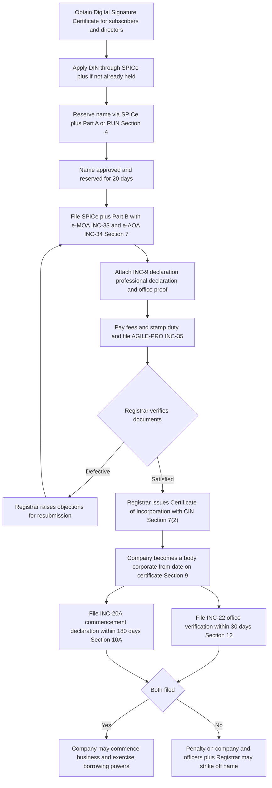

# Q&A — Incorporation of a Company

> Exam-oriented question bank for CA Intermediate, Corporate & Other Laws. Every question is followed immediately by a complete model answer citing the relevant Sections of the Companies Act, 2013 (and, where relevant, the Specific Relief Act, 1963). Cases are used only as decided law; no provision is invented.

---

## Part A — Concept-Check Questions (short, definitional)

**A1. Who is a "promoter" under the Companies Act, 2013?**
**Answer.** Under **Section 2(69)**, a promoter is a person: (a) named as such in the prospectus or in the annual return under **Section 92**; or (b) who has control over the affairs of the company, directly or indirectly, whether as a shareholder, director or otherwise; or (c) in accordance with whose advice, directions or instructions the Board of Directors is accustomed to act. A person acting merely in a professional capacity (e.g., a lawyer or CA advising on formation) is expressly excluded.

**A2. What is the legal status of a promoter towards the company?**
**Answer.** A promoter is neither an agent nor a trustee of the company (the company does not exist when he acts), but stands in a **fiduciary relationship** to it. He must not make any secret profit, must make full disclosure of his interest, and any undisclosed profit is recoverable. He may be liable for mis-statements in the prospectus under **Sections 34 and 35** and for fraud under **Section 447**.

**A3. Name the clauses of the Memorandum of Association under Section 4.**
**Answer.** Under **Section 4**, the MOA contains six clauses: (1) **Name** clause, (2) **Situation/Registered office** clause (the State), (3) **Object** clause, (4) **Liability** clause, (5) **Capital** clause, and (6) **Subscription/Association** clause. Mnemonic: N-S-O-L-C-S.

**A4. What is the Doctrine of Ultra Vires?**
**Answer.** An act done beyond the objects stated in the MOA (Section 4 object clause) is **ultra vires the company** and **void ab initio**. It cannot be ratified even by unanimous consent of members, because ratification cannot cure an act the company never had capacity to do. Leading case: *Ashbury Railway Carriage & Iron Co. v Riche (1875)*.

**A5. What are the minimum members required to form a company under Section 3?**
**Answer.** Under **Section 3**: a **public** company requires **7 or more** members, a **private** company requires **2 or more** members, and a **One Person Company (OPC)** requires **1** member.

**A6. What is the effect of the Certificate of Incorporation under Sections 7(2) and 9?**
**Answer.** On registration, the Registrar issues a **Certificate of Incorporation** with a Corporate Identity Number (CIN) under **Section 7(2)**. From the date mentioned, under **Section 9**, the company becomes a **body corporate** — a separate legal person with perpetual succession, capable of owning property, contracting, and suing/being sued in its own name — and the subscribers become its members.

**A7. Distinguish the Doctrine of Constructive Notice from the Doctrine of Indoor Management.**
**Answer.** **Constructive notice** deems every person dealing with the company to have read and understood its public documents (MOA and AOA); it **protects the company**. The **doctrine of indoor management (Turquand's rule)** allows an outsider dealing in good faith to assume that internal procedural requirements have been complied with; it **protects the outsider**. Source cases: *Royal British Bank v Turquand (1856)*.

**A8. Can a company be bound by a contract made before its incorporation?**
**Answer.** No. Before incorporation the company has no legal existence and no capacity, so it is not bound and **cannot ratify** a pre-incorporation contract; the promoter is personally liable. However, under **Sections 15(h) and 19(e) of the Specific Relief Act, 1963**, if the contract was for the purposes of the company and the company **adopts/warrants** it after incorporation, the other party may enforce it against the company.

**A9. What is the requirement for commencement of business under Section 10A?**
**Answer.** A company having share capital incorporated on or after 2 November 2018 cannot commence business or exercise borrowing powers unless: (i) every subscriber files a declaration in **Form INC-20A** within **180 days** of incorporation confirming payment for shares taken, and (ii) it has filed verification of registered office in **Form INC-22** (within **30 days** under **Section 12**).

**A10. What are entrenchment provisions in the Articles?**
**Answer.** Under **Section 5(3) and 5(4)**, articles may contain **entrenchment provisions** requiring conditions **more restrictive than a special resolution** (e.g., unanimous consent) for altering specified provisions. Entrenchment must be notified to the Registrar.

---

## Part B — Applied Scenario Questions (Facts → Legal Analysis → Conclusion)

**B1. Pre-incorporation contract.**
*Facts:* Before "GreenAgro Pvt Ltd" was incorporated, promoter P signed a contract in the company's name to buy farmland from F. After incorporation the company refuses to pay, arguing it never signed the contract. F sues the company.
*Legal analysis:* At the date of the contract the company did not exist and had no capacity to contract; therefore it cannot **ratify** the contract (there was no principal in existence). Under general company law the promoter **P is personally liable** on such a pre-incorporation contract. However, under **Sections 15(h) and 19(e) of the Specific Relief Act, 1963**, if the contract was entered into for the purposes of the company and the company **adopts** it after incorporation, F may enforce it against the company.
*Conclusion:* If the company adopted/warranted the contract, F can enforce it against the company; if it did not, F's remedy lies against P personally. The company "cannot ratify but can adopt."

**B2. Ultra vires act versus internal irregularity.**
*Facts A:* A company whose object is "manufacture of textiles" lends Rs 2 crore to finance a friend's film. *Facts B:* The same company borrows Rs 2 crore for its textile mill; the board resolution authorising the borrowing was never actually passed, but the lender bank read the AOA (which permits borrowing on board authorisation) and lent in good faith.
*Legal analysis A:* Financing a film is outside the object clause under **Section 4**, hence **ultra vires the company** and **void**; it cannot be ratified even unanimously (*Ashbury* principle). Directors are personally liable to restore the funds.
*Legal analysis B:* Borrowing is within the company's objects and powers; the defect is purely internal (no resolution). Having read the public documents (constructive notice), the bank may **assume internal compliance under Turquand's rule** as nothing was suspicious.
*Conclusion:* Loan A is void and unenforceable — the company is not liable. Loan B binds the company — the bank recovers. Same amount, opposite result, because one breached the outer limit (MOA) and the other only an inner procedure.

**B3. Separate legal personality and insurable interest.**
*Facts:* Mr M owns 99% of "Timber Co Ltd", which owns a stock of timber. M insures the timber in his own personal name. Fire destroys it and M claims.
*Legal analysis:* On incorporation under **Section 9** the company is a separate legal person and the timber belongs to the company, not to M. A member does not own the company's property and therefore has **no insurable interest** in it (*Macaura v Northern Assurance Co.*). Ownership of shares is not ownership of company assets (*Salomon v Salomon & Co Ltd*).
*Conclusion:* M's claim fails. The separateness that gives M limited liability also denies him personal ownership of company assets.

**B4. Forged share certificate and Turquand's rule.**
*Facts:* A company's secretary forges the directors' signatures on a share certificate and issues it to T, who claims to be a member relying on the indoor management rule.
*Legal analysis:* Turquand's rule permits an outsider to assume procedural regularity, but it **never validates a forgery**; a forged instrument is a nullity (*Ruben v Great Fingall Consolidated*). There is nothing "regular" to assume where the underlying document is forged.
*Conclusion:* T acquires no rights and the company is not bound.

**B5. Shell company trading before commencement.**
*Facts:* "Nimbus Trading Ltd" (having share capital) is incorporated on 1 January 2025. On day 40 it takes a bank loan and starts trading, but subscribers have not paid for their shares and no Form INC-20A or INC-22 has been filed.
*Legal analysis:* Under **Section 10A**, a company with share capital cannot commence business or exercise borrowing powers until it files the **INC-20A** declaration of paid subscription (within 180 days) and verifies its registered office in **INC-22** (within 30 days under **Section 12**). Nimbus borrowed prematurely.
*Conclusion:* Penalty is attracted on the company and every officer in default under Section 10A; the borrowing was in violation of the section, and the Registrar may act to strike off the company for not carrying on genuine business.

**B6. Alteration of registered office from one State to another.**
*Facts:* XYZ Ltd, registered in Maharashtra, wants to shift its registered office to Gujarat. It passes a special resolution and files it, then treats the shift as complete.
*Legal analysis:* Under **Section 13(4)**, altering the situation clause to shift the registered office from one State to another requires a special resolution **plus confirmation by the Regional Director (Central Government)**, because the change affects jurisdiction and the interests of creditors and employees who must be heard. The alteration takes effect only on registration with the Registrar of both States.
*Conclusion:* The special resolution alone is insufficient; the shift is invalid until Regional Director confirmation is obtained and the change is registered.

**B7. Fraud in obtaining incorporation.**
*Facts:* Promoters of "Vega Ltd" obtain the certificate of incorporation by furnishing false identity documents and suppressing material facts about a subscriber.
*Legal analysis:* Although the certificate is conclusive as to procedural regularity, under **Sections 7(5), 7(6) and 7(7)**, where incorporation is obtained by furnishing false information or suppressing material facts, the promoters, first directors and persons making the declaration are liable for **fraud under Section 447**, and the **Tribunal (NCLT)** may pass orders including regulation of the company, alteration of members' liability, or removal of the name / winding up.
*Conclusion:* The certificate is no shield against fraud; the promoters face Section 447 liability and NCLT action.

---

## Part C — Past-Paper-Style Descriptive Questions

**C1. Explain the doctrine of ultra vires and distinguish an act ultra vires the company from one ultra vires the directors.**
**Answer.** The doctrine of ultra vires holds that any act beyond the objects stated in the MOA (**Section 4**) is void and cannot be ratified, protecting members and creditors from managers exceeding the stated purpose (*Ashbury Railway Carriage v Riche*). An act **ultra vires the company** is beyond the object clause itself — it is void ab initio and cannot be ratified even by unanimous shareholders; a member may seek an injunction and directors are personally liable to restore funds. An act **ultra vires the directors or the Articles** is within the company's capacity but exceeds the internal authority conferred on the Board; such an act is only irregular and **can be ratified** by the members in general meeting. Only the former is fatal — a favourite examiner distinction.

**C2. Explain the doctrine of indoor management and its exceptions.**
**Answer.** Under the doctrine of indoor management (*Royal British Bank v Turquand*), an outsider dealing with a company in good faith is entitled to assume that all internal procedural requirements have been duly complied with; he need only ensure that the transaction is permitted by the public documents, not that internal formalities actually occurred. It is the counterpart to constructive notice — the outsider can read public documents but cannot see inside the boardroom. **Exceptions** (where the rule does not protect the outsider): (1) **actual knowledge** of the irregularity; (2) **suspicion / negligence** where circumstances put the person on inquiry; (3) **forgery**, which the rule never validates (*Ruben v Great Fingall*); (4) acts **beyond apparent/ostensible authority** of the officer; and (5) where the person had **no knowledge of the articles** and did not rely on them.

**C3. Discuss the consequences of incorporation with reference to decided cases.**
**Answer.** On incorporation under **Section 9**, the company becomes a body corporate with these consequences: (a) **Separate legal entity** — the company is distinct from its members (*Salomon v Salomon & Co Ltd*); members do not own company property (*Macaura v Northern Assurance*). (b) **Limited liability** — members risk only the unpaid amount on their shares or the guaranteed sum. (c) **Perpetual succession** — members may change but the company continues. (d) **Capacity to sue, be sued, contract and hold property** in its own name. (e) **Lifting the corporate veil** — courts and statute look behind the entity where it is used for fraud, tax evasion, to defeat law, or as a sham (*Gilford Motor Co v Horne*; *Daimler v Continental Tyre* on enemy character), so incorporation is not a licence to cheat.

**C4. State the documents to be filed with the Registrar for incorporation under Section 7.**
**Answer.** Under **Section 7(1)** (filed via SPICe+/INC-32 with e-MOA INC-33 and e-AOA INC-34): (i) the **MOA and AOA** signed by all subscribers; (ii) a **declaration by a professional** (advocate/CA/CS/CWA) and by a person named as director that all requirements of the Act have been complied with; (iii) a **declaration by each subscriber and first director in INC-9** under Section 7(1)(c) that he is not convicted or guilty of any fraud in connection with formation; (iv) the **address for correspondence** until the registered office is fixed; (v) **particulars of subscribers and first directors** with identity/address proof and DIN; and (vi) **consent of first directors (DIR-2)**. Registered office proof is filed in **INC-22** within 30 days if not given at incorporation.

**C5. Explain the alteration of the Articles of Association under Section 14 and its limits.**
**Answer.** Under **Section 14**, a company may alter its articles by passing a **special resolution**, filing it with the Registrar. This is easier than altering the MOA because the articles are the members' own internal arrangement. The **limits** are: the alteration must not conflict with the MOA or the Act; must not **increase the liability** of a member to contribute more without written consent; must be **bona fide for the benefit of the company as a whole**; must not be illegal or against public policy or override a Tribunal order; and conversion of a public company into a private company by altering the articles requires **Tribunal/Regional Director approval** under the proviso to Section 14. The MOA and AOA constitute a **statutory contract** binding the company and members inter se under **Section 10**, but confer no rights on outsiders (*Eley v Positive Life Assurance*).

**C6. Write short notes on conversion of a company under Section 18, and the effect of conversion on existing liabilities.**
**Answer.** Under **Section 18**, a company may convert from one class to another by altering its MOA/AOA and re-registering; the Registrar issues a fresh certificate reflecting the changed status. A **private-to-public** conversion needs a special resolution and raising members to 7 and directors to 3, and is comparatively easy as it increases transparency. A **public-to-private** conversion needs a special resolution **plus Regional Director approval**, as it reduces public oversight. Crucially, under **Section 18(3)**, conversion **does not affect** any debts, liabilities, obligations or contracts incurred before conversion — they continue and may be enforced as if there were no conversion. The company changes its coat, not its history.

---

## Part D — MCQs and Case Scenarios

**D1.** An act which is ultra vires the company can be ratified by:
(a) An ordinary resolution
(b) A special resolution
(c) A unanimous resolution of all members
(d) None — it cannot be ratified at all
**Answer: (d).** An ultra vires act is void ab initio (Section 4 objects; *Ashbury*) and cannot be ratified even unanimously.

**D2.** The minimum number of members required to form a public company under Section 3 is:
(a) 2  (b) 3  (c) 7  (d) 1
**Answer: (c) 7.** Section 3 fixes 7 for public, 2 for private, 1 for OPC.

**D3.** The doctrine that deems every outsider to have read the company's public documents is:
(a) Indoor management  (b) Constructive notice  (c) Ultra vires  (d) Ratification
**Answer: (b) Constructive notice.** It protects the company by deeming knowledge of the registered MOA and AOA.

**D4.** A company having share capital must file Form INC-20A for commencement of business within:
(a) 30 days  (b) 90 days  (c) 180 days  (d) 365 days
**Answer: (c) 180 days.** Section 10A requires the declaration of commencement within 180 days of incorporation.

**D5.** The rule in *Royal British Bank v Turquand* does NOT protect an outsider where:
(a) The board resolution was passed  (b) The document was forged  (c) The transaction was within objects  (d) The outsider acted in good faith
**Answer: (b) The document was forged.** Turquand's rule never validates a forgery (*Ruben v Great Fingall*).

**D6.** Shifting the registered office from one State to another requires a special resolution plus confirmation by:
(a) The Registrar only  (b) The Tribunal  (c) The Regional Director (Central Government)  (d) The Central Bank
**Answer: (c) Regional Director.** Section 13(4) requires Regional Director confirmation for an inter-State shift.

**D7. Case scenario.** Mr A insures, in his own name, a building owned by "Alpha Ltd" in which he holds 95% shares. The building is destroyed and A claims. The insurer denies liability.
Which is correct?
(a) A can claim as majority shareholder  (b) A cannot claim as he has no insurable interest in company property  (c) A can claim half the value  (d) The company and A share the claim
**Answer: (b).** Under Section 9 the property belongs to the company, a separate person; a member has no insurable interest in company assets (*Macaura*).

**D8. Case scenario.** Before incorporation, promoter Q signs a lease "for and on behalf of Beta Ltd (under formation)". After incorporation Beta Ltd wants to enforce the lease against the landlord who now refuses.
Which is correct?
(a) Beta Ltd can ratify the lease automatically  (b) Beta Ltd can never enforce it  (c) Beta Ltd can enforce it if it adopts the contract, being for its purposes, under the Specific Relief Act, 1963  (d) Only Q can be sued
**Answer: (c).** A company cannot ratify a pre-incorporation contract but may enforce it by adoption under Sections 15(h)/19(e) of the Specific Relief Act, 1963.

**D9.** The certificate of incorporation is conclusive evidence of regular incorporation, EXCEPT where:
(a) There is a minor typing error  (b) Incorporation was obtained by false information or suppression of material facts  (c) A director later resigns  (d) The name is later changed
**Answer: (b).** Under Sections 7(5)–(7), fraud/false information exposes promoters to Section 447 and NCLT action; the certificate is no fraud shield.

**D10.** Model articles for a company limited by shares are contained in:
(a) Table A  (b) Table F  (c) Table H  (d) Table J
**Answer: (b) Table F.** Under Section 5 and Schedule I, Table F applies to a company limited by shares.

---

## Incorporation Procedure — Mermaid Diagram

*Figure: The incorporation pipeline under the Companies Act, 2013 — from digital signatures to a living body corporate, then through the Section 10A commencement gate.*

---

*Statute base: Companies Act, 2013 and the Companies (Incorporation) Rules, 2014; pre-incorporation contracts governed by the Specific Relief Act, 1963. Verify the current name-reservation window, OPC threshold position (post-2021) and exact filing windows against the latest ICAI Study Material / bare Act, as these figures have been amended over time.*
