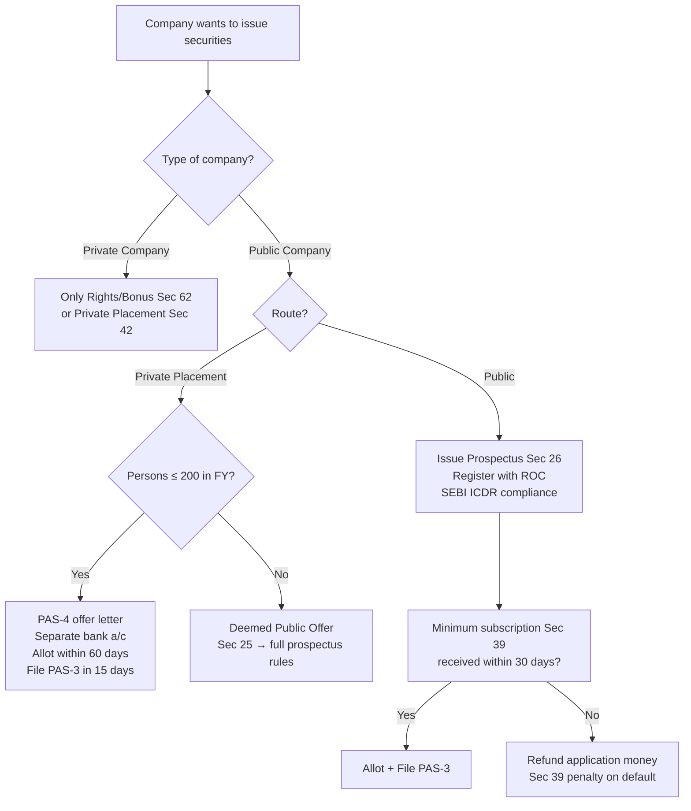

# Q&A — Prospectus & Allotment of Securities

> CA Intermediate | Corporate & Other Laws | Companies Act, 2013 — Sections 23 to 42
> Exam-oriented question bank. Every question is followed immediately by a complete model answer citing the relevant section. Where a point is not settled purely by the bare Act, uncertainty is flagged.

---

## SECTION A — Concept-Check Questions (with answers)

**A1. What are the modes by which a public company and a private company may issue securities under Section 23?**

*Answer:* Under **Section 23(1)**, a **public company** may issue securities: (a) to the public through a **prospectus** (public offer), (b) through a **private placement** (Sec 42), or (c) through a **rights issue or bonus issue** (Sec 62), and in case of a listed company or intending-to-be-listed company, in compliance with SEBI provisions. Under **Section 23(2)**, a **private company** may issue securities only by (a) **rights/bonus issue** (Sec 62) or (b) **private placement** (Sec 42). A private company cannot make a public offer.

**A2. Define "prospectus" and list the four types of documents that fall within the definition.**

*Answer:* Under **Section 2(70)**, a "prospectus" means any document described or issued as a prospectus and includes a **red herring prospectus (Sec 32)**, a **shelf prospectus (Sec 31)**, or any notice, circular, advertisement or other document inviting offers from the public for the subscription or purchase of securities of a body corporate. The essential test is a **public invitation to subscribe/purchase securities**.

**A3. What is a "public offer" versus a "private placement"?**

*Answer:* A **public offer** (Sec 23 read with Sec 25/26) is an invitation to the public at large to subscribe to securities via a prospectus. A **private placement** under **Section 42** is an offer/invitation to a **select group of identified persons** (not exceeding **200** in a financial year, excluding QIBs and employees under ESOP) through a **private placement offer-cum-application letter (PAS-4)**, without any public advertisement.

**A4. What is an "abridged prospectus" and when must it be issued?**

*Answer:* Under **Section 2(1)**, an abridged prospectus is a memorandum containing the salient features of a prospectus as specified by SEBI. Under **Section 33**, every application form for securities must be accompanied by an abridged prospectus, except where it is a bona fide invitation to a person to enter into an underwriting agreement, or where securities are not offered to the public.

**A5. What is a "shelf prospectus" and a "red herring prospectus"?**

*Answer:* A **shelf prospectus (Sec 31)** is a prospectus filed by classes of companies (as SEBI prescribes) allowing them to make multiple issues of securities within **one year** without issuing a fresh prospectus for each offer; an **information memorandum (Form PAS-2)** updates material facts for subsequent offers. A **red herring prospectus (Sec 32)** is a prospectus that **does not contain complete particulars of the quantum or price** of securities and is issued prior to the main prospectus in a book-building issue.

**A6. State the meaning and effect of a "deemed prospectus" under Section 25.**

*Answer:* Under **Section 25**, where a company **allots or agrees to allot securities to an issuing house/intermediary with a view to those securities being offered for sale to the public**, the offer-for-sale document is **deemed to be a prospectus** issued by the company. All provisions on contents and liability apply as if the company itself issued it. This prevents companies from evading prospectus liability by routing the issue through an intermediary.

**A7. What is the minimum subscription requirement and its consequence?**

*Answer:* Under **Section 39(1)**, no allotment can be made unless the amount stated in the prospectus as the **minimum subscription** has been subscribed and the **application money (at least 5% of nominal value of the share, or as SEBI specifies)** has been received. Under **Section 39(3)**, if minimum subscription is not received within **30 days** of issue of prospectus (or such period specified by SEBI), the application money must be **refunded** within the prescribed time (15 days from closure per SEBI ICDR); default attracts penalty under **Section 39(5)**.

**A8. Distinguish civil liability (Sec 35) from criminal liability (Sec 34) for misstatements in a prospectus.**

*Answer:* **Section 34** imposes **criminal liability** for issuing a prospectus that includes an untrue/misleading statement, punishable under **Section 447 (fraud)**. **Section 35** imposes **civil liability** — the company and specified persons (directors, promoters, experts, persons who authorised issue) are liable to **compensate** every person who subscribed relying on a misstatement and suffered loss. Sec 34/35 target misstatements; **Section 36** targets fraudulently inducing persons to invest.

---

## SECTION B — Applied Problem / Scenario Questions (ICAI style)

**B1.** *ABC Ltd, a public unlisted company, wishes to raise capital by inviting subscription from 350 identified high-net-worth individuals through a private placement offer letter, without issuing a prospectus. Advise on validity.*

- **Facts:** Offer to 350 identified persons via private placement route.
- **Law:** **Section 42(2)** limits a private placement to a maximum of **200 persons in the aggregate in a financial year** (per kind of security), excluding QIBs and employees under ESOP. Under **Section 42(7)**, no public advertisement may be made. An offer to more than 200 persons is **deemed to be a public offer**, requiring compliance with prospectus provisions (Sec 23–26) and SEBI regulations, per the second proviso to Sec 25(1)/Sec 42 explanation.
- **Analysis:** The offer to 350 persons exceeds the 200-person ceiling. It therefore ceases to be a private placement and is **deemed a public offer**, mandating a prospectus.
- **Conclusion:** ABC Ltd **cannot** validly raise money from 350 persons via private placement; it must either restrict the number to 200 or issue a prospectus and comply with public-offer requirements. Contravention attracts penalty under **Section 42(10)** (amount raised or ₹2 crore, whichever lower, and refund within 30 days).

**B2.** *A prospectus issued by XYZ Ltd stated that a well-known industrialist had agreed to join the Board. On the strength of this, Mr. P subscribed. The statement was false. What are Mr. P's remedies?*

- **Facts:** Untrue statement in prospectus induced subscription; loss suffered.
- **Law:** **Section 35(1)** provides civil liability — the company, every director, promoter, and person who authorised issue is liable to **compensate** for loss/damage sustained by reason of an untrue statement. **Section 34** provides criminal liability, and **Section 36** covers fraudulent inducement. The investor may also rescind the contract of allotment for misrepresentation under general contract law.
- **Analysis:** The false statement about the industrialist is a **material misstatement**. Mr. P relied on it and suffered loss, satisfying Sec 35.
- **Conclusion:** Mr. P can (i) claim **compensation under Sec 35**, and (ii) **rescind** the allotment. Directors may escape liability under **Section 35(2)** by proving withdrawal of consent before issue, lack of knowledge/consent, or reasonable belief in the truth of the statement.

**B3.** *Directors of LMN Ltd wish to raise the criminal-liability defence under Section 34. On what grounds can they escape liability?*

- **Law:** The proviso to **Section 34** exempts a person if he proves that (a) the **statement/omission was immaterial**, OR (b) he had **reasonable grounds to believe, and did up to the time of issue believe, that the statement was true** or the inclusion/omission was necessary.
- **Conclusion:** Directors escape **Sec 34** criminal liability only by discharging this burden; otherwise punishment is under **Section 447**.

**B4.** *PQR Ltd allotted shares 40 days after issuing the prospectus, having received only 80% of the stated minimum subscription. Advise on the validity of the allotment.*

- **Law:** **Section 39(1)** bars allotment unless minimum subscription is received; **Section 39(3)** requires refund if minimum subscription is not received within **30 days** of issue of prospectus (or the SEBI period).
- **Analysis:** Minimum subscription was not met, and 30 days had elapsed. Allotment is **irregular/void**, and application money should have been refunded.
- **Conclusion:** The allotment is **invalid**; PQR Ltd must refund the application money. Default attracts penalty under **Section 39(5)** — ₹1,000 per day of default or ₹1,00,000, whichever is less, on the company and each officer in default.

**B5.** *DEF Ltd raised money by private placement but utilised the funds before filing the return of allotment. Comment.*

- **Law:** Under **Section 42(4)/42(8)**, money received on private placement must be kept in a **separate bank account** and **cannot be utilised** until the **return of allotment (Form PAS-3)** is filed with the Registrar. Allotment must be completed within **60 days** of receipt of application money (Sec 42(6)); PAS-3 must be filed within **15 days** of allotment.
- **Conclusion:** DEF Ltd's utilisation of funds before filing PAS-3 is a **contravention** attracting penalty under **Section 42(10)**. (Note: post-2018 amendment, allotment money cannot be used until PAS-3 is filed.)

**B6.** *GHI Ltd (unlisted public company) wants to make repeated bond issues over a year without a fresh prospectus each time. Which route applies?*

- **Law:** **Section 31** — a **shelf prospectus** may be filed by prescribed classes of companies, valid for **one year**, with an **information memorandum (PAS-2)** filed for each subsequent offer.
- **Conclusion:** GHI Ltd may use the **shelf prospectus** mechanism, provided it belongs to the class prescribed by SEBI (typically for debt securities / financial institutions). Flag: eligibility depends on SEBI's prescribed classes.

---

## SECTION C — Past-Paper-Style Descriptive Questions

**C1. Explain the provisions relating to variation in terms of contract or objects referred to in the prospectus (Section 27).**

*Answer:* Under **Section 27(1)**, a company shall **not vary the terms of a contract or the objects for which the prospectus was issued** except by way of a **special resolution** passed at a general meeting. Details of the notice must be published (as SEBI/rules prescribe) in newspapers. Under **Section 27(2)**, **dissenting shareholders** (those who have not agreed to the variation) must be given an **exit offer** by promoters/controlling shareholders at a SEBI-prescribed exit price. Under **Section 27(3)**, money cannot be used for any object other than stated in the prospectus except after such approval. This protects investors who subscribed on the faith of stated objects.

**C2. Discuss the "golden rule" of prospectus and the matters to be stated under Section 26.**

*Answer:* The **"Golden Rule"** (New Brunswick v. Muggeridge) requires that a prospectus disclose the whole truth with **strict and scrupulous accuracy** — nothing should be stated as fact that is not so, and no material fact should be concealed. **Section 26(1)** codifies this by requiring every prospectus to state prescribed information — details of the company, directors, promoters, objects, capital structure, terms of issue, and reports (auditor's report, financial information) — and disclosures required by SEBI. Under **Section 26(4)**, a prospectus must be **dated, signed, and delivered to the Registrar for registration** before publication. A prospectus not registered is **invalid**; issuing an unregistered prospectus attracts penalty under **Section 26(9)**.

**C3. Write a note on the allotment of securities in the electronic form / return of allotment (Section 39 and Section 42(8)).**

*Answer:* On every allotment of securities, the company must file a **return of allotment in Form PAS-3** with the Registrar. For public issues under **Section 39(4)**, PAS-3 must be filed in the prescribed manner; for private placements under **Section 42(8)**, PAS-3 must be filed within **15 days** of allotment, listing the identity of allottees and the price. This return creates a public record and enables monitoring of the 200-person ceiling and utilisation restrictions. Default attracts penalty under **Sec 39(5)** and **Sec 42(10)** respectively.

**C4. Explain the criminal and civil liabilities for mis-statements in a prospectus (Sections 34, 35, 36).**

*Answer:*
- **Section 34 (Criminal liability):** Where a prospectus includes any **untrue or misleading statement**, or omits a material matter likely to mislead, every person who **authorised its issue** is liable under **Section 447 (fraud)** — imprisonment (6 months–10 years) and fine (up to 3× the amount involved). Defence: immateriality or reasonable belief in truth.
- **Section 35 (Civil liability):** The company, directors, promoters, experts and authorisers must **compensate subscribers** who suffered loss relying on an untrue statement. Sec 35(2) provides defences (withdrawal of consent, no knowledge, reasonable belief). Sec 35(3): if the misstatement was made with intent to defraud, liability is **unlimited and personal**.
- **Section 36 (Fraudulently inducing investment):** Any person who **knowingly or recklessly makes false/misleading/deceptive statements** to induce another to invest is punishable under **Section 447**.

**C5. Distinguish between a prospectus and a statement in lieu of prospectus / private placement offer letter, and explain "public offer" limits.**

*Answer:* A **prospectus (Sec 2(70), Sec 26)** is a public invitation registered with the Registrar. A **private placement offer-cum-application letter (Form PAS-4, Sec 42)** is a serially-numbered, address-specific offer to identified persons (≤200), **not** advertised to the public, and not renounceable. Any offer that crosses **200 persons**, or is advertised publicly, becomes a **deemed public offer** (Sec 25/42), triggering full prospectus and SEBI compliance. (Note: the "statement in lieu of prospectus" of the 1956 Act has no direct equivalent; the 2013 Act relies on the private placement/PAS-4 regime — flag as a change from the old law.)

---

## SECTION D — MCQs / Case Scenarios

**D1.** The maximum number of persons to whom securities may be offered under private placement in a financial year (excluding QIBs and ESOP employees) is:
(a) 50 (b) 100 (c) 200 (d) 500
**Answer: (c) 200** — Section 42(2); exceeding it makes it a deemed public offer.

**D2.** A "red herring prospectus" is one which:
(a) contains false statements (b) does not contain particulars of price or quantum of securities (c) is issued after allotment (d) is a foreign prospectus
**Answer: (b)** — Section 32; issued in book-building before the final price is fixed.

**D3.** Minimum subscription, if not received, must trigger refund within the SEBI-prescribed period after the prospectus is open; the base timeline in Section 39(3) is:
(a) 15 days (b) 30 days (c) 60 days (d) 90 days
**Answer: (b) 30 days** — Section 39(3) (SEBI ICDR further specifies refund within 15 days of issue closure).

**D4.** Which document is deemed to be a prospectus when shares are allotted to an issuing house for offer to the public?
(a) Shelf prospectus (b) Abridged prospectus (c) Offer for sale document (deemed prospectus) (d) Information memorandum
**Answer: (c)** — Section 25 (deemed prospectus).

**D5.** Variation in the objects stated in a prospectus requires:
(a) Board resolution (b) Ordinary resolution (c) Special resolution + exit to dissenters (d) Central Government approval
**Answer: (c)** — Section 27; dissenting shareholders get an exit offer.

**D6.** Private placement money must be kept in a separate bank account and cannot be utilised until:
(a) the AGM (b) return of allotment (PAS-3) is filed (c) shares are listed (d) one year passes
**Answer: (b)** — Section 42(4)/(8).

**D7.** *Case scenario:* Mr. X, an expert, gave his consent to a statement in the prospectus but withdrew it in writing before the prospectus was delivered for registration. A subscriber sues him under Sec 35. Is he liable?
(a) Yes, absolutely (b) No, withdrawal before issue is a valid defence (c) Yes, but only 50% (d) Only criminally liable
**Answer: (b)** — Section 35(2)(a); withdrawal of consent before issue is a statutory defence.

**D8.** A private company may issue securities by:
(a) public offer (b) rights/bonus issue or private placement (c) only public offer (d) shelf prospectus
**Answer: (b)** — Section 23(2); a private company cannot make a public offer.

---

## Procedure Diagram — Public Offer vs Private Placement Decision

---

## Traps & Examiner Tricks (Quick Recall)

- **200-person limit** is **per financial year and per kind of security** — QIBs and ESOP employees are **excluded** (Sec 42).
- **Minimum subscription base period is 30 days** (Sec 39(3)); students often wrongly write 60 or 120 days.
- **Variation of objects** needs **special resolution + exit to dissenters** (Sec 27), NOT ordinary resolution.
- **Deemed prospectus** (Sec 25) traps offer-for-sale arrangements — company cannot dodge liability via an intermediary.
- **Sec 34 = criminal, Sec 35 = civil, Sec 36 = fraudulent inducement** — do not interchange.
- Private placement money **cannot be used until PAS-3 is filed** (Sec 42(8), post-2018 amendment).
- A **private company can never make a public offer** (Sec 23(2)).

## First-Principles Recap

Sections 23–42 exist to protect the investing public through **disclosure (prospectus/golden rule), gatekeeping (registration, minimum subscription), accountability (civil & criminal liability), and containment (private-placement ceilings)**. The unifying idea: *money should only be raised on the basis of full, true, registered disclosure, and protected until legitimately allotted.*

---

*Provisions cited: Companies Act, 2013 — Sec 2(70), 2(1), 23, 25, 26, 27, 31, 32, 33, 34, 35, 36, 39, 42, 62, 447. Procedural timelines/thresholds are read with SEBI ICDR Regulations and the Companies (Prospectus and Allotment of Securities) Rules; where a threshold is SEBI-driven rather than in the bare Act, this has been flagged in the text.*
