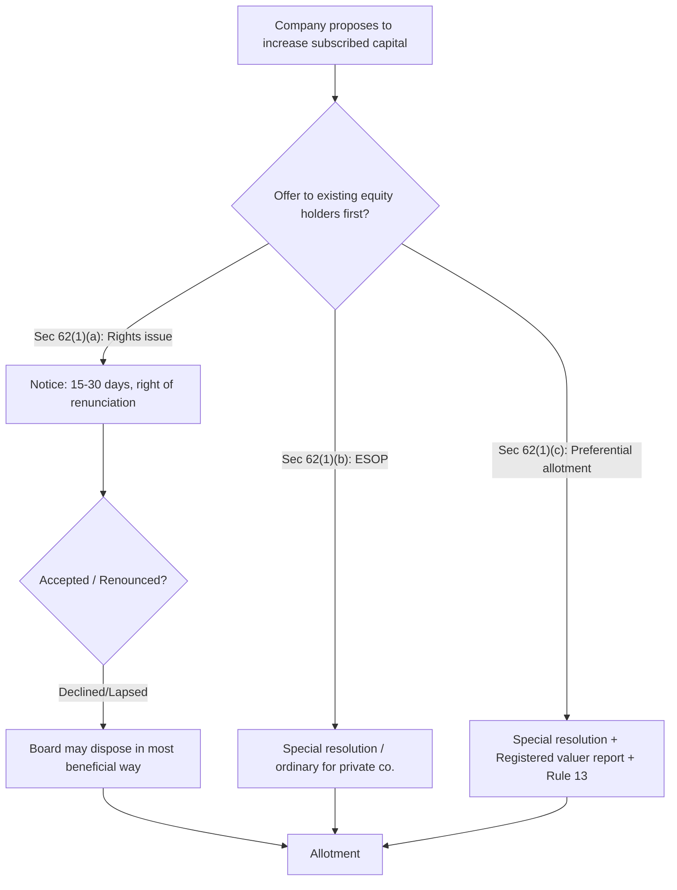

# Q&A — Share Capital & Debentures

> CA Intermediate · Corporate & Other Laws · Companies Act, 2013 (Sections 43–72, read with the Companies (Share Capital and Debentures) Rules, 2014). Every question is followed immediately by a complete, section-cited model answer. Where a figure or rule is version-sensitive, it is flagged.

---

## Section A — Concept-Check Questions (with answers)

**A1. What are the two kinds of share capital recognised for a company limited by shares?**
Under **Section 43**, share capital is of two kinds: **(a) equity share capital** — either with voting rights, or with differential rights as to dividend/voting (DVR); and **(b) preference share capital**. Preference shares carry a preferential right to dividend and to repayment of capital on winding up. Companies producing a private company may be exempt from Sec 43 if its memorandum/articles so provide (exemption notification).

**A2. What is the legal nature of a share? Is it the same as a share certificate?**
Per **Section 44**, shares/debentures/other interest of a member are **movable property**, transferable in the manner provided by the articles. A share is a bundle of rights (a chose-in-action); the **share certificate** issued under **Section 46** is only *prima facie* evidence of title, not the share itself.

**A3. Can a company issue shares at a discount?**
No. **Section 53** prohibits issue of shares at a discount; any share issued at a discount is **void**. Exceptions: **sweat equity shares** under **Section 54**, and (per Section 53(2A)) shares issued at a discount to creditors on conversion of debt into shares under a statutory resolution/restructuring scheme. Penalty: company and officers liable; refund with interest at 12% p.a.

**A4. What is the "securities premium account" and can it be used to pay dividends?**
Under **Section 52**, premium received on issue of securities is credited to the **Securities Premium Account**, treated as if it were paid-up capital for reduction purposes. Permitted uses: issue of **bonus shares**, writing off preliminary expenses, writing off share/debenture issue expenses & commission/discount, providing premium payable on redemption of preference shares/debentures, and **buy-back** under Section 68. It **cannot** be distributed as ordinary dividend.

**A5. Within what period must redeemable preference shares be redeemed?**
Under **Section 55**, a company cannot issue **irredeemable** preference shares. Redeemable preference shares must be redeemed **within 20 years** of issue. Exception: companies engaged in **infrastructure projects** may issue preference shares redeemable beyond 20 years (up to 30 years, redeeming a minimum 10% p.a. from year 21 at holder's option, per the Rules).

**A6. Out of what sources may preference shares be redeemed, and what is the CRR?**
Section 55 permits redemption only out of **(a) profits available for dividend**, or **(b) proceeds of a fresh issue** of shares made for redemption. Only **fully paid-up** shares may be redeemed. Where redeemed out of profits, a sum equal to the nominal amount redeemed must be transferred to the **Capital Redemption Reserve (CRR)** (**Section 69**), which is treated as paid-up capital and can be used to issue bonus shares.

**A7. Does a preference shareholder have voting rights?**
Under **Section 47(2)**, a preference shareholder votes only on resolutions **directly affecting** the rights attached to preference shares, and on winding up/repayment/reduction of capital. However, if **dividend is in arrears for two years or more**, preference shareholders acquire voting rights on **every resolution**.

**A8. What is the debenture redemption reserve, and can debentures carry voting rights?**
Under **Section 71**, a company **cannot** issue debentures carrying voting rights. Where required, it must create a **Debenture Redemption Reserve (DRR)** out of profits available for dividend and, per the Rules, also invest/deposit a specified amount for redemption. *Flag:* the DRR percentage requirements have been amended repeatedly by the Companies (Share Capital and Debentures) Rules; listed companies and NBFCs/HFCs are largely exempt from DRR — verify the current Rule 18 threshold before quoting a percentage in the exam.

---

## Section B — Applied / Scenario Questions (ICAI style: Facts → Law → Analysis → Conclusion)

**B1. Rights issue vs. bypassing existing shareholders.**
*Facts:* ABC Ltd (unlisted) wants to raise ₹50 lakh by issuing fresh equity. Two directors propose allotting all new shares to a friendly investor, ignoring existing members.
*Law:* **Section 62(1)** — where a company proposes to increase subscribed capital by further shares, they must **first be offered to existing equity shareholders** in proportion to paid-up capital (**rights issue**), by notice giving **not less than 15 and not more than 30 days**, with a right of renunciation. Shares may go to outsiders only via **preferential allotment (Sec 62(1)(c)) by special resolution**, ESOP (special resolution / ordinary for private co. per exemption), or after the rights offer lapses.
*Analysis:* Directly allotting to an outsider without a rights offer or the Sec 62(1)(c) special-resolution route violates pre-emption rights.
*Conclusion:* The proposal is invalid unless ABC Ltd either makes a rights offer under Sec 62(1)(a), or passes a **special resolution** for preferential allotment under Sec 62(1)(c) read with Rule 13 (with a registered valuer's report).

**B2. Bonus issue funded from revaluation reserve.**
*Facts:* XYZ Ltd wants to issue bonus shares using a surplus created by revaluing its factory building.
*Law:* **Section 63** permits bonus shares only out of **free reserves, securities premium account, or capital redemption reserve**. It expressly bars capitalising **reserves created by revaluation of assets**. Conditions: authorised by articles, recommended by Board, approved in general meeting, no default on deposits/debt interest, all partly-paid shares made fully paid-up, and the bonus is not in lieu of dividend.
*Analysis:* Revaluation reserve is unrealised and specifically excluded.
*Conclusion:* The bonus issue from revaluation reserve is **not permissible** under Section 63(2). XYZ must use free reserves/securities premium/CRR instead.

**B3. Buy-back exceeding limits.**
*Facts:* PQR Ltd (paid-up equity ₹10 crore, free reserves ₹6 crore) proposes to buy back shares worth ₹5 crore by a Board resolution alone. Its debt after buy-back would be ₹34 crore.
*Law:* **Section 68** — buy-back must be ≤ **25% of aggregate paid-up capital + free reserves** (and in a year, ≤25% of paid-up **equity** capital). Post-buy-back **debt-equity ratio must not exceed 2:1**. A **Board resolution** authorises buy-back up to **10%** of paid-up equity + free reserves; beyond that up to **25%** needs a **special resolution**.
*Analysis:* 10% of (10+6) = ₹1.6 crore is the Board-only ceiling; ₹5 crore exceeds it, so a special resolution is required. Also 25% ceiling = ₹4 crore, so ₹5 crore breaches the absolute limit. Post-buy-back equity ≈ ₹11 crore; debt ₹34 crore gives ~3:1, breaching 2:1.
*Conclusion:* The buy-back is **invalid** on two counts — it exceeds the 25% limit and violates the 2:1 debt-equity ceiling under Section 68.

**B4. Financial assistance for purchase of own shares.**
*Facts:* A public company lends money to an employee to buy shares in its holding company.
*Law:* **Section 67** prohibits a public company (and its subsidiaries) from giving, directly or indirectly, **financial assistance** for purchase of its own shares or those of its holding company. Exceptions: lending by a banking company in ordinary course; a scheme for purchase of fully-paid shares held in trust for employees; and loans to employees (other than directors/KMP) to buy fully-paid shares up to their salary/wages for six months.
*Analysis:* If the loan falls within the employee-scheme exception and the employee is not a director/KMP and the shares are fully paid, it is permitted; otherwise it is barred.
*Conclusion:* Permissible **only** within the Section 67(3) exceptions; a general loan for this purpose is prohibited.

**B5. Sweat equity and lock-in.**
*Facts:* A start-up wishes to issue sweat equity to its technical founder for know-how, one month after incorporation.
*Law:* **Section 54** allows sweat equity to directors/employees for know-how/IP/value additions, subject to a **special resolution**, and the Rules. The company must be carrying on business — sweat equity may be issued only after the class of shares has been issued; the Rules also cap issuance and prescribe a **lock-in of 3 years**.
*Analysis:* Sweat equity requires a special resolution specifying number, current market price, consideration and class; issuance is subject to Rule limits and lock-in.
*Conclusion:* Permissible under Section 54 if a special resolution is passed and Rule conditions (limits, valuation, lock-in) are met.

---

## Section C — Past-Paper-Style Descriptive Questions (with model answers)

**C1. Explain the procedure and grounds for reduction of share capital under Section 66.**
Reduction of capital under **Section 66** requires: (i) authorisation by the **articles**; (ii) a **special resolution**; and (iii) confirmation by the **Tribunal (NCLT)**. Modes: (a) extinguishing/reducing liability on unpaid capital; (b) cancelling paid-up capital lost or unrepresented by assets; (c) paying off excess paid-up capital. The Tribunal gives notice to the **Central Government, ROC, SEBI (for listed cos.) and creditors**, considers representations, and may confirm on such terms as it thinks fit. No reduction is allowed if the company is in **arrears of deposits/interest**. The order and minute are registered with the ROC; the reduced capital is then recorded. Reduction is distinct from **buy-back (Sec 68)** and **diminution of unissued capital (Sec 61)**, neither of which needs NCLT confirmation.

**C2. Distinguish between shares and debentures.**
A **share** (Sec 43/44) represents **ownership**; the holder is a **member** with voting rights (Sec 47) and receives **dividend** out of profits (payable at the company's discretion). A **debenture** (Sec 71) is an **acknowledgement of debt**; the holder is a **creditor** with **no voting rights** (Sec 71(2)), entitled to **interest** payable whether or not profits are earned, and ranking ahead of shareholders on winding up. Shares generally cannot be issued at a discount (Sec 53); debentures can. Debentures may be secured/convertible; conversion into shares requires a **special resolution**.

**C3. Write a note on calls in advance and variation of shareholders' rights.**
**Calls in advance (Section 50):** A company may, if authorised by its articles, **accept from a member the whole or part of the amount remaining unpaid** even though it has not been called up. The member is **not entitled to voting rights** in respect of the money so paid until it is called up. Interest may be paid on calls in advance as per the articles.
**Variation of rights (Section 48):** Where a company has different classes of shares, the rights of any class may be varied with **consent of holders of ≥ 3/4 in nominal value** of that class (in writing) **or by a special resolution** of that class. Dissenting holders of **not less than 10%** who did not consent may apply to the **Tribunal** to have the variation cancelled within 21 days; the Tribunal's decision is binding.

**C4. Explain the provisions relating to issue of Debenture Trustees and the offer of debentures.**
Under **Section 71**, a company may issue debentures with an option to convert (conversion needs special resolution). Where debentures are offered to the **public or to more than 500 persons**, the company must appoint a **debenture trustee** before issue and execute a **debenture trust deed** to protect debenture-holders' interests; a trustee must not have conflicting interests. The company must create a **DRR** out of profits available for dividend and redeem debentures per the terms. If the company fails to redeem/ pay interest, debenture-holders/trustee may apply to the **Tribunal**, which may direct redemption with interest. *Flag:* exact DRR/investment percentages are governed by Rule 18 (amended several times) — confirm current text.

---

## Section D — MCQs / Case Scenarios (correct option + one-line reasoning)

**D1.** A company issues equity shares at a discount. The issue is:
A) Valid B) Voidable C) **Void** D) Valid with CG approval
**Answer: C** — Section 53(1)/(2) declares any share issued at a discount void (except Sec 54 sweat equity / Sec 53(2A) conversion).

**D2.** Redeemable preference shares (non-infrastructure) can be redeemed after a maximum of:
A) 10 years B) **20 years** C) 30 years D) No limit
**Answer: B** — Section 55(2): redemption within 20 years.

**D3.** In a rights issue under Section 62(1)(a), the offer notice period is:
A) 7–15 days B) **15–30 days** C) 21–30 days D) 30–60 days
**Answer: B** — Section 62(2): not less than 15 nor more than 30 days, with right of renunciation.

**D4.** Bonus shares may NOT be issued out of:
A) Free reserves B) Securities premium C) Capital redemption reserve D) **Revaluation reserve**
**Answer: D** — Section 63(2) bars capitalising revaluation reserves.

**D5.** Preference shareholders get voting rights on every resolution when dividend is in arrears for:
A) 1 year B) **2 years or more** C) 3 years D) 5 years
**Answer: B** — Section 47(2) proviso.

**D6.** Buy-back authorised by only a Board resolution is limited to:
A) 5% B) **10%** C) 15% D) 25% of paid-up equity + free reserves
**Answer: B** — Section 68(2)(b) proviso; beyond 10% up to 25% needs special resolution.

**D7.** *Case scenario:* Sunrise Ltd's articles are silent on reduction of capital, yet the Board passes a special resolution and reduces capital without approaching NCLT. This is:
A) Valid B) **Invalid — needs articles authorisation + NCLT confirmation** C) Valid if ROC informed D) Valid if creditors consent
**Answer: B** — Section 66 requires authorisation by articles, special resolution, and Tribunal confirmation.

**D8.** The Capital Redemption Reserve created under Section 69 may be used for:
A) Paying dividend B) **Issuing fully paid bonus shares** C) Writing off revaluation loss D) Redeeming debentures
**Answer: B** — CRR is treated as paid-up capital and may be applied for bonus shares.

---

## Mermaid — Decision Flow: Further Issue of Share Capital (Section 62)

---

## One-Line Section Map (quick revision)

Sec 43 kinds of capital · 44 shares = movable property · 46 certificate · 47 voting rights · 48 variation of rights · 50 calls in advance · 52 securities premium · 53 no discount · 54 sweat equity · 55 redeemable preference (20 yrs) · 62 further issue · 63 bonus · 66 reduction (NCLT) · 67 financial assistance bar · 68 buy-back (25% / 2:1 / 10% board) · 69 CRR · 71 debentures (no voting, DRR, trustee >500). Rules: Companies (Share Capital and Debentures) Rules, 2014.

*Uncertainty flags: DRR percentages under Rule 18 and infrastructure preference-share redemption schedule are amendment-sensitive — verify against the latest Rules before the exam.*
