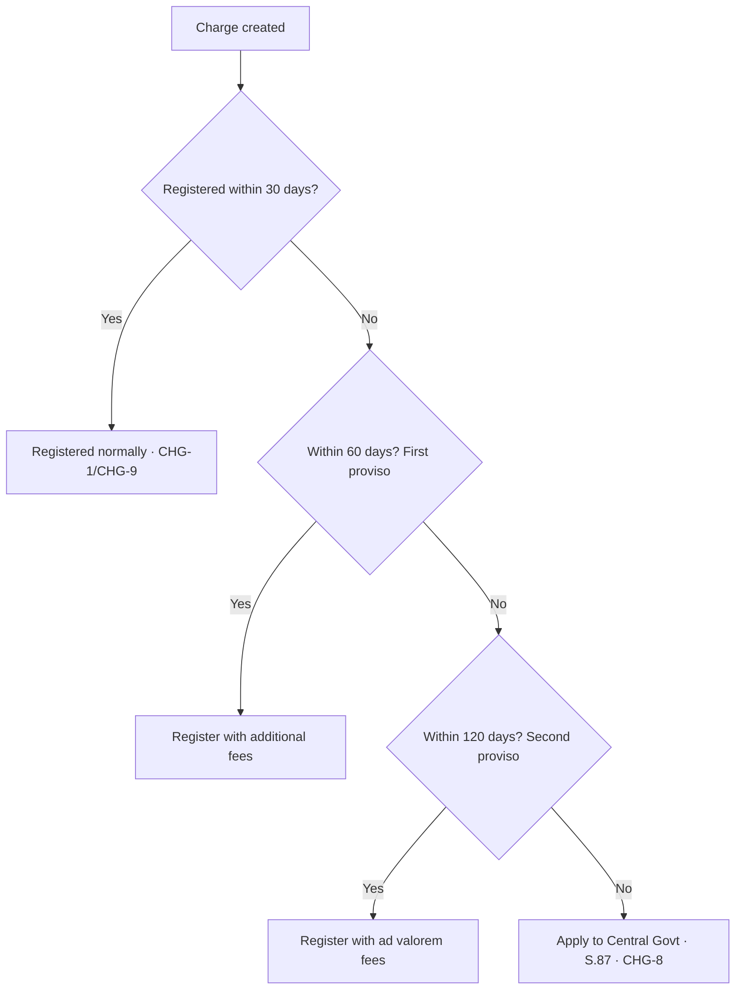
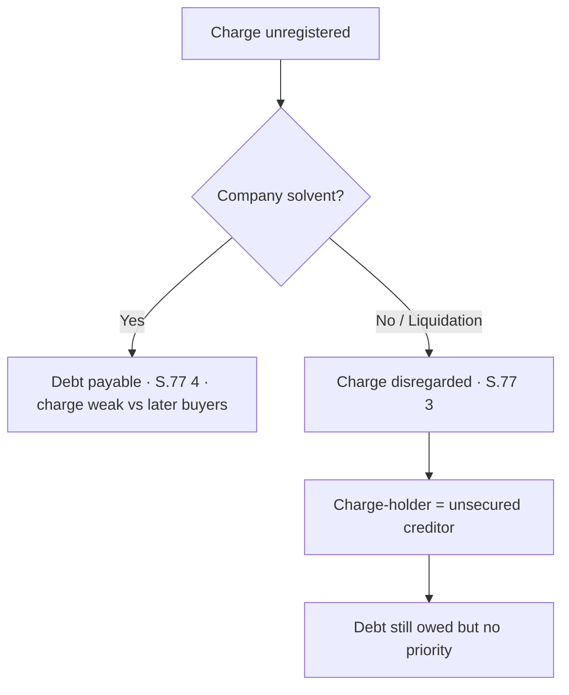

# Q&A — Registration of Charges

*CA Intermediate · Corporate & Other Laws · Companies Act, 2013 (Sections 2(16), 77–87)*

All section references are to the **Companies Act, 2013** and the **Companies (Registration of Charges) Rules, 2014**, incorporating the **Companies (Amendment) Act, 2019** timelines. Where a point is unsettled or fact-dependent, it is flagged.

---

## Section A — Concept-Check (Short Questions + Answers)

**A1. Define "charge" under the Companies Act, 2013.**
**Answer.** Under **Section 2(16)**, a "charge" means *an interest or lien created on the property or assets of a company or any of its undertakings, or both, as security and includes a mortgage.* The essence is a **security interest** over company property to secure a debt — it need not transfer ownership.

**A2. Distinguish a fixed charge from a floating charge.**
**Answer.** A **fixed charge** attaches to a specific, identifiable asset (e.g., land, machinery); the company cannot deal with that asset freely without the charge-holder's consent. A **floating charge** hovers over a class of assets that changes in the ordinary course (e.g., stock-in-trade, book debts); the company may deal with them until the charge **crystallises** (on default, winding-up, or cessation of business), whereupon it fixes on the assets then existing. The Act (S.2(16), S.77) covers **both**.

**A3. Within what period must a charge be registered, and with whom?**
**Answer.** Under **Section 77(1)**, the company must register **every charge** it creates with the **Registrar of Companies** within **30 days** of creation, in **Form CHG-1** (non-debenture charges) or **Form CHG-9** (debentures), with the instrument creating the charge.

**A4. What is the effect of registration on third parties?**
**Answer.** Under **Section 80**, registration operates as **constructive (deemed) notice** to any person acquiring the property or an interest in it — from the date of registration the whole world is deemed to know of the charge. This is the statutory purpose of the whole scheme: converting a private security into a public fact.

**A5. If a charge is not registered, is the loan itself wiped out?**
**Answer.** No. Under **Section 77(4)**, non-registration does **not** prejudice the **contract or obligation to repay** the money secured. Only the **security** is affected: under **Section 77(3)** an unregistered charge is **not taken into account by the liquidator** (including under the IBC) or any creditor — the charge-holder is demoted to an **unsecured creditor** but the debt survives.

**A6. Who else, apart from the company, may apply to register a charge?**
**Answer.** Under **Section 78**, if the company fails to register within the 30-day period, the **person in whose favour the charge is created** (the charge-holder) may apply for registration. The Registrar gives the company **14 days' notice** to show cause; if the company does not register or object, the Registrar registers it on the charge-holder's application. The charge-holder may recover the registration fee from the company.

**A7. What is Form CHG-7 and where is it kept?**
**Answer.** Under **Section 85**, every company must keep, at its **registered office**, its **own register of charges in Form CHG-7**, recording all charges and floating charges with particulars. It is open to inspection by members and creditors (free) and any other person (on fee) — this is **separate** from the Registrar's register.

---

## Section B — Applied Problem/Scenario Questions (Facts → Law → Conclusion)

**B1.** *Zenith Ltd created a charge over its factory land on 5 April 2024 to secure a bank loan. Due to an oversight the charge was not filed with the Registrar. On 20 October 2024 Zenith went into liquidation. The bank claims priority as a secured creditor.*

**Facts.** Charge created 05.04.2024; never registered; company in liquidation.
**Law.** **Section 77(1)** required registration within 30 days (extendable up to 120 days under the provisos). **Section 77(3)** provides that a charge required to be registered but not registered *shall not be taken into account by the liquidator or any other creditor*. **Section 77(4)** preserves the debt itself.
**Analysis.** The bank missed the entire registration window. Its security interest is therefore void against the liquidator; it cannot claim priority over the factory land.
**Conclusion.** The bank ranks as an **unsecured creditor** for the loan amount. The debt is still owed under S.77(4), but the security is disregarded in liquidation.

---

**B2.** *Orion Ltd created a charge on 10 January 2025 but forgot to register it. Its finance manager realises the omission on 25 March 2025 (74 days later). Can it still be registered, and how?*

**Facts.** Charge created 10.01.2025; discovered on day 74.
**Law.** **Section 77(1)** first proviso allows the Registrar, on application, to permit registration within **60 days** of creation on payment of **additional fees**. The second proviso allows a **further 60 days** (total **120 days** from creation) on payment of **ad valorem fees**.
**Analysis.** Day 74 is beyond 60 days but within 120 days. Registration is therefore still possible, but only under the **second proviso**, requiring an application to the Registrar and payment of **ad valorem fees** (Form CHG-1 with the instrument).
**Conclusion.** Orion can register within the 120-day outer limit by paying ad valorem fees. Had it crossed 120 days, it would need **condonation of delay by the Central Government under Section 87**.

*(Timeline flag: the 30/60/120 structure applies to charges created on or after 02.11.2018. Charges created before that date follow the old 300-day rule.)*

---

**B3.** *Vega Ltd repaid its term loan in full on 1 June 2025 and the bank issued a no-dues letter. The charge remains on the Registrar's records. What must Vega do?*

**Facts.** Charge fully satisfied on 01.06.2025.
**Law.** **Section 82** requires the company to give **intimation of satisfaction** to the Registrar within **30 days** of payment/satisfaction, in **Form CHG-4**. The proviso allows the Registrar to permit intimation within **300 days** on application with additional fees. Under **Section 83**, the Registrar may, even without intimation, enter a memorandum of satisfaction on evidence.
**Analysis.** Vega must file **CHG-4** within 30 days (by ~01.07.2025). The Registrar then issues notice to the charge-holder and records satisfaction under **Section 82/83**.
**Conclusion.** File Form CHG-4 within 30 days; otherwise seek the 300-day extension. Failure attracts penalties under **Section 86**.

---

**B4.** *A debenture-holder of Comet Ltd appoints a receiver over the company's assets under the terms of a floating charge. Comet's directors argue no filing is needed since the charge is already registered.*

**Facts.** Receiver appointed under a registered floating charge.
**Law.** **Section 84** requires the person appointing a **receiver or manager** of company property under powers in an instrument to give **notice to the company and the Registrar within 30 days** in **Form CHG-6**; the Registrar enters it in the register of charges. This is **independent** of the original charge registration.
**Analysis.** Registration of the charge does not dispense with the separate S.84 intimation of the receiver's appointment.
**Conclusion.** The appointer must file **Form CHG-6** within 30 days. The directors are incorrect.

---

## Section C — Past-Paper-Style Descriptive Questions (Model Answers)

**C1. Explain the consequences of non-registration of a charge under the Companies Act, 2013.**

**Answer.** The consequences flow mainly from **Sections 77(3), 77(4) and 86**:

1. **Void against liquidator and creditors (S.77(3)).** A charge required to be registered but not registered is **not taken into account** by the liquidator (including a liquidator/RP under the Insolvency and Bankruptcy Code) or by any other creditor. The charge-holder loses secured status and its priority.
2. **Debt survives (S.77(4)).** Non-registration does not prejudice the contract to repay the money secured — it becomes **immediately payable** and the creditor may sue as an **unsecured creditor**.
3. **Penalty (S.86).** The company and every officer in default are punishable with fine; furnishing **false or incorrect information** for registration attracts liability for **fraud under Section 447**.
4. **Practical effect.** The security is worthless in insolvency, defeating the lender's protection — hence lenders insist on timely CHG filing.

**C2. Describe the time limits for registration of a charge, including the powers of the Registrar and the Central Government to allow delayed registration.**

**Answer.** Under **Section 77(1)** (as amended by the 2019 Amendment, for charges created on or after 02.11.2018):

- **Normal period:** within **30 days** of creation of the charge.
- **First proviso:** the Registrar may, on application, allow registration within **60 days** of creation, on payment of **additional fees**.
- **Second proviso:** if still not registered, the Registrar may, on application, allow a **further period of 60 days** (i.e., up to **120 days** from creation), on payment of **ad valorem fees**.
- **Beyond 120 days:** registration under S.77 is no longer available. The company must apply to the **Central Government under Section 87** for **rectification / condonation of delay** in Form CHG-8, if the omission was accidental, inadvertent, or does not prejudice creditors/shareholders.

*(For charges created before 02.11.2018, the older regime of 300 days / six-month window applies — flag this distinction in dated problems.)*

**C3. Write short notes on: (a) Company's register of charges; (b) Rectification by Central Government.**

**Answer.**
**(a) Company's register of charges (S.85).** Every company keeps, at its **registered office**, a register in **Form CHG-7** with particulars of all charges and floating charges and copies of the instruments. It is preserved permanently (the instrument copies for 8 years after satisfaction) and is open to inspection by members/creditors without fee and others on payment. It supplements — but does not replace — the Registrar's register.

**(b) Rectification by Central Government (S.87).** Where there is an **omission or misstatement** in registering a charge, or a **delay** beyond the S.77 limits, the **Central Government** (powers delegated to the Regional Director) may, on being satisfied that the default was **accidental / inadvertent / due to sufficient cause** or **not prejudicial to creditors/shareholders**, order the delay/omission to be **rectified** — effectively condoning the delay. Application is made in **Form CHG-8**.

---

## Section D — MCQs / Case Scenarios (Correct Option + Reasoning)

**D1.** The definition of "charge" is contained in —
A. S.2(15)  B. **S.2(16)**  C. S.77  D. S.2(30)
**Answer: B.** Section 2(16) defines "charge" as an interest/lien created as security, including a mortgage.

**D2.** The normal period for registration of a charge under S.77(1) is —
A. 15 days  B. **30 days**  C. 60 days  D. 90 days
**Answer: B.** Registration is within 30 days of creation, extendable via provisos.

**D3.** The **outer limit** (with ad valorem fees, second proviso) for registering a charge created after 02.11.2018 is —
A. 60 days  B. 90 days  C. **120 days**  D. 300 days
**Answer: C.** 30 + 60 (first proviso) + a further 60 (second proviso) = 120 days from creation.

**D4.** An unregistered charge, in the winding-up of the company —
A. Gives full priority
B. **Is not taken into account by the liquidator**
C. Extinguishes the debt
D. Is automatically registered
**Answer: B.** Under S.77(3) the liquidator/creditors disregard it; the debt still stands under S.77(4).

**D5.** Registration of a charge operates as notice to the world under —
A. S.79  B. **S.80**  C. S.82  D. S.85
**Answer: B.** Section 80 makes registration deemed (constructive) notice.

**D6.** Intimation of **satisfaction** of a charge is filed in —
A. CHG-1  B. **CHG-4**  C. CHG-7  D. CHG-9
**Answer: B.** Form CHG-4 under Section 82, within 30 days of satisfaction (extendable to 300 days).

**D7.** A charge created to secure **debentures** is registered in —
A. CHG-1  B. CHG-4  C. **CHG-9**  D. CHG-6
**Answer: C.** Form CHG-9 is used for charges relating to debentures; CHG-1 for others.

**D8.** If a company fails to register within 30 days, the **charge-holder** may apply under —
A. S.77  B. **S.78**  C. S.83  D. S.87
**Answer: B.** Section 78 lets the charge-holder register; the Registrar gives the company 14 days' notice.

**D9.** Notice of appointment of a **receiver/manager** is filed under S.84 in —
A. CHG-4  B. **CHG-6**  C. CHG-7  D. CHG-8
**Answer: B.** Form CHG-6 within 30 days of appointment.

**D10.** Condonation of delay beyond the S.77 limits is granted by —
A. The Registrar  B. The Tribunal (NCLT)  C. **The Central Government (S.87)**  D. The Court
**Answer: C.** Section 87 empowers the Central Government (via Regional Director) using Form CHG-8.

---

## Procedure Diagrams

**Registration timeline (charge created on/after 02.11.2018):**

**Non-registration consequence (decision logic):**

---

## Connections, Traps & Quick Revision

**Connections.** (i) **IBC** — S.77(3) expressly ties into insolvency: an unregistered charge is ignored by the resolution professional/liquidator, so the lender falls into the unsecured pool under the IBC waterfall. (ii) **Deposits/Debentures** — secured debentures require a charge registered via CHG-9; links to Chapter on Deposits and to debenture trustees. (iii) **Constructive notice (S.80)** — a buyer of company property is deemed to know registered charges, so cannot claim to be a bona fide purchaser without notice.

**Examiner traps.**
- *Debt vs security:* Non-registration voids the **security**, not the **debt** (S.77(4)). Do not write "loan is cancelled."
- *"Void" nuance:* The charge is void **against the liquidator and creditors**, not void inter se between company and charge-holder.
- *Timeline confusion:* 30 → 60 → 120 days is measured **from creation**, not sequentially added after each stage; beyond 120 days go to **S.87**, not the Registrar.
- *Right form:* CHG-1 (others) vs **CHG-9 (debentures)**; CHG-4 (satisfaction); CHG-6 (receiver); CHG-7 (company register); CHG-8 (condonation).
- *Two registers:* Registrar's register (S.81) **and** company's own register (S.85, CHG-7) — both exist.

**First-principles recap.** A charge is invisible — a secret pact between borrower and lender (S.2(16)). Left secret, later lenders and buyers are deceived and priority is chaotic. The Act converts the private security into a **public fact** by compelling registration (S.77), backs it with **deemed notice** (S.80), and enforces it with a **penalty that bites where it hurts** — the charge is disregarded in insolvency (S.77(3)) — while sparing the honest borrower's debt (S.77(4)).

**Quick-revision section/limit table.**

| Provision | Subject | Key limit / form |
|---|---|---|
| S.2(16) | Definition of charge | Includes mortgage; fixed & floating |
| S.77 | Duty to register | 30 days → 60 → 120; CHG-1/CHG-9 |
| S.77(3) | Effect of non-registration | Void vs liquidator/creditors |
| S.77(4) | Saving | Debt remains payable |
| S.78 | Charge-holder registration | On company default; 14-day notice |
| S.79 | Modification of charge | Same rules as creation |
| S.80 | Deemed notice | Registration = constructive notice |
| S.81 | Registrar's register | Index of charges |
| S.82 | Satisfaction | 30 days → 300; CHG-4 |
| S.83 | Registrar's entry of satisfaction | Suo motu on evidence |
| S.84 | Receiver/manager | 30 days; CHG-6 |
| S.85 | Company's register | CHG-7 at registered office |
| S.86 | Penalty | Fine; false info → S.447 fraud |
| S.87 | Rectification/condonation | Central Govt; CHG-8 |
