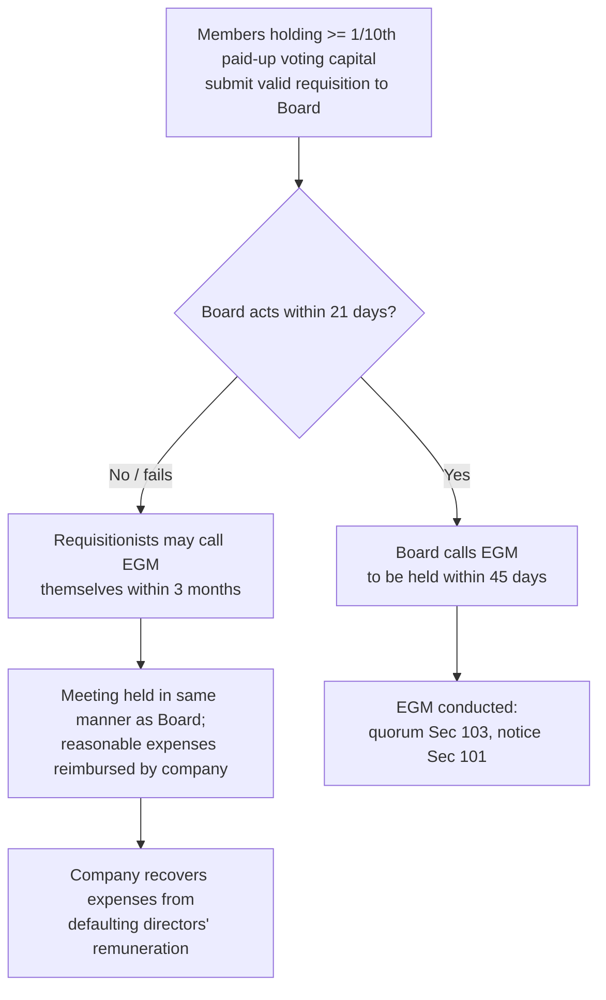

# Q&A — Management & Administration

> Chapter: **Management & Administration** (Companies Act, 2013 — Sections 12, 88–94, 96–122).
> Exam-oriented question bank. Every question is followed by a **complete model answer citing the relevant Section**. Cross-verify only against the bare Act — no invented provisions.

---

## SECTION A — Concept-Check (short, direct)

**A1. Within how many days must a company have a registered office, and within how many days must a change be notified to the Registrar?**
**Answer (Sec 12):** A company must have a registered office capable of receiving communications **within 30 days of incorporation** [Sec 12(1)]. Verification of the registered office is filed within 30 days. Notice of **any change** in the situation of the registered office must be given to the Registrar in **Form INC-22 within 30 days** of the change [Sec 12(4)]. A change of registered office **outside the local limits of a city/town** requires a **special resolution** [Sec 12(5)]; a shift from the jurisdiction of one Registrar to another within a State requires **Regional Director** confirmation.

**A2. What must every company paint/affix and print under Sec 12(3)?**
**Answer (Sec 12(3)):** Every company must (a) **paint or affix its name and registered office address** outside every office/place of business, in legible letters and in the local language too; (b) **engrave its name on its seal** (if it has one); (c) **print its name, registered office address, CIN, telephone, fax, e-mail and website** (if any) on all business letters, billheads, letter papers, notices and official publications; and (d) print its name on hundis, promissory notes, bills of exchange. A company that changed its name in the last 2 years must also print the **former name**.

**A3. Where must the Register of Members be maintained and what does it contain?**
**Answer (Sec 88):** Every company must keep a **register of members** (equity and preference separately), a **register of debenture-holders**, and a **register of any other security holders** [Sec 88(1)]. It contains details of each member/holder. An **index** is required where members exceed 50 (unless the register itself is in index form). A company may keep **foreign registers** of members/debenture-holders resident outside India [Sec 88(4)].

**A4. Distinguish Sec 89 (declaration of beneficial interest) from Sec 90 (Significant Beneficial Owner).**
**Answer:** **Sec 89** deals with **declaration where the registered holder is not the beneficial owner** — the registered owner (Form MGT-4), the beneficial owner (Form MGT-5), and the company (Form MGT-6 to Registrar within 30 days) file declarations. **Sec 90** deals with the **Significant Beneficial Owner (SBO)** — an individual who ultimately holds (alone/together) **not less than 10%** of shares/voting rights/right to distributable dividend, or exercises significant influence/control. The SBO files **Form BEN-1**; the company maintains **Form BEN-3** register and files **Form BEN-2** with the Registrar.

**A5. What is the time limit for filing the Annual Return and who signs it?**
**Answer (Sec 92):** The annual return in **Form MGT-7** (MGT-7A for OPC/small company) must be filed with the Registrar **within 60 days from the date of the AGM** (or, if no AGM is held, within 60 days from the date the AGM should have been held, with reasons) [Sec 92(4)]. It is **signed by a director and the company secretary**; where there is no CS, by a **company secretary in practice**. For **listed companies** and companies with **paid-up capital ≥ ₹10 crore or turnover ≥ ₹50 crore**, the annual return must be certified by a PCS in **Form MGT-8** [Sec 92(2)].

**A6. Where are statutory registers kept, and can they be kept elsewhere?**
**Answer (Sec 94):** Registers under Sec 88 and returns are kept at the **registered office**. They may be kept at **any other place in India** where more than one-tenth of the members entered in the register reside, if approved by a **special resolution** and a copy filed with the Registrar in advance [Sec 94(1) proviso]. They are open to **inspection** by members/debenture-holders **free of charge** and by others on payment [Sec 94(2)].

**A7. State the time limits for holding the first AGM and subsequent AGMs.**
**Answer (Sec 96):** The **first AGM** must be held within **9 months** from the close of the first financial year. **Subsequent AGMs** must be held within **6 months** from the close of the financial year, and the gap between two AGMs must **not exceed 15 months**. The Registrar may extend the time for holding an AGM (other than the first AGM) by up to **3 months** for special reasons. AGM is held during **business hours (9 a.m.–6 p.m.)**, on a day that is **not a National Holiday**, at the registered office or within the same city/town/village. **One Person Company is not required to hold an AGM** [Sec 96(1) proviso].

**A8. What length of notice is required for a general meeting and how may it be given?**
**Answer (Sec 101):** A general meeting is called by **not less than 21 clear days' notice** in writing or through electronic mode. A meeting may be called at **shorter notice** if consent is given by **not less than 95% of the members entitled to vote** (in the case of an AGM), and for other meetings, by members holding 95% of the paid-up capital / voting power. "Clear days" excludes the day of service and the day of meeting.

**A9. What is the quorum for a general meeting?**
**Answer (Sec 103):** **Private company:** **2 members** personally present. **Public company:** **5 members** personally present if members ≤ 1000; **15 members** if members are 1000–5000; **30 members** if members exceed 5000. If quorum is not present within **half an hour**, the meeting (if called on requisition) stands **cancelled**; otherwise it is **adjourned to the same day next week**, same time and place (or as the Board decides). If quorum is still absent at the adjourned meeting, the **members present shall be the quorum**.

**A10. Who can appoint a proxy and what are the key restrictions (Sec 105)?**
**Answer (Sec 105):** A member entitled to attend and vote may appoint a **proxy** to attend and vote **on a poll** on his behalf. A proxy **need not be a member**. A proxy **cannot speak** at the meeting and **cannot vote except on a poll** (i.e., not on a show of hands). The proxy instrument must be deposited **at least 48 hours before the meeting**. A person can act as proxy for **not more than 50 members** and members holding **not more than 10%** of total voting share capital; if a member holds more than 10%, that member's proxy is for that member only. Companies **without share capital** cannot appoint proxies unless the articles allow.

---

## SECTION B — Applied Scenario Questions (Facts → Law → Conclusion)

**B1. Registered office change across cities.**
*Facts:* XYZ Ltd wishes to shift its registered office from Pune to Nagpur (both in Maharashtra, different Registrar jurisdiction within the same State). The Board passes only an ordinary resolution.
**Answer:**
- *Law:* Under **Sec 12(5)**, a change of registered office **outside the local limits of the city/town** requires a **special resolution**. Where the shift is from the jurisdiction of **one Registrar to another within the same State**, the change also requires **confirmation by the Regional Director** [Sec 12(6)], to be filed with the Registrar within 60 days who registers it within 30 days.
- *Analysis:* An ordinary resolution is insufficient. XYZ Ltd needs (i) a **special resolution**, and (ii) **RD confirmation** because the Registrar's jurisdiction changes.
- *Conclusion:* The Board action is invalid; the company must pass a special resolution, obtain RD approval, and file Form INC-22/INC-23 accordingly.

**B2. Beneficial interest not declared.**
*Facts:* Mr. A holds 5,000 shares of PQR Ltd in his name but the beneficial interest belongs to Mr. B. Neither files any declaration. B later claims dividend rights.
**Answer:**
- *Law:* Under **Sec 89**, the **registered owner (A)** files a declaration (Form MGT-4), the **beneficial owner (B)** files (Form MGT-5), and the **company** files a return (Form MGT-6) with the Registrar within **30 days**. Under **Sec 89(8)**, **no right in relation to a share** in respect of which a declaration is required but **not made** shall be **enforceable** by the beneficial owner.
- *Analysis:* Because B has not filed the required declaration, his beneficial rights (including dividend/voting enforcement) are **not enforceable** against the company. Penalties also apply for non-filing.
- *Conclusion:* B cannot enforce his beneficial interest until the Sec 89 declarations are duly made.

**B3. Shorter notice AGM.**
*Facts:* LMN Ltd, a public company with 400 members, calls its AGM at 10 days' notice with consent of 90% of members entitled to vote.
**Answer:**
- *Law:* **Sec 101(1)** requires **21 clear days' notice**; a shorter notice AGM is valid only with consent of **not less than 95%** of members entitled to vote.
- *Analysis:* Only 90% consent was obtained, below the 95% threshold.
- *Conclusion:* The shorter notice is **invalid**; the AGM so convened is not validly called. LMN Ltd must obtain 95% consent or give full 21 clear days' notice.

**B4. Quorum failure.**
*Facts:* RST Ltd (public, 800 members) convenes an AGM; only 4 members are present half an hour after the scheduled time. The meeting was NOT called on requisition.
**Answer:**
- *Law:* Under **Sec 103**, quorum for a public company with ≤1000 members is **5 members** personally present. If quorum is absent within half an hour and the meeting was **not requisitioned**, it stands **adjourned to the same day in the next week**, same time and place.
- *Analysis:* Only 4 present — quorum (5) not met. Since not a requisitioned meeting, it is adjourned, not cancelled.
- *Conclusion:* The AGM is **adjourned to the same day next week**; at the adjourned meeting, if quorum is again absent, the **members present** constitute the quorum.

**B5. Ordinary vs Special resolution.**
*Facts:* DEF Ltd passes a resolution to alter its articles; votes cast — 60% in favour, 40% against, on a poll.
**Answer:**
- *Law:* Alteration of articles requires a **special resolution** (Sec 14). Under **Sec 114(2)**, a special resolution requires votes cast in favour to be **not less than three times** the votes against (i.e., **≥ 75%**). An **ordinary resolution** [Sec 114(1)] needs a **simple majority (>50%)**.
- *Analysis:* 60% in favour meets ordinary-resolution majority but **fails the 75% special-resolution threshold**.
- *Conclusion:* The special resolution is **not passed**; the alteration of articles cannot take effect.

**B6. Proxy validity.**
*Facts:* Mr. P is appointed proxy by 60 members of GHI Ltd. He also wishes to speak and vote on a show of hands.
**Answer:**
- *Law:* Under **Sec 105**, a proxy can act for **not more than 50 members**; a proxy **cannot speak** and can **vote only on a poll**, not on a show of hands.
- *Analysis:* P is appointed by 60 members (exceeds 50) and seeks to speak and vote on show of hands, all impermissible.
- *Conclusion:* P can validly act for a **maximum of 50 members**; the appointment beyond 50 is invalid, and he may **neither speak nor vote on a show of hands** — only on a poll.

**B7. Failure to file resolution.**
*Facts:* JKL Ltd passes a special resolution but does not file it with the Registrar; 45 days pass.
**Answer:**
- *Law:* **Sec 117(1)** requires **specified resolutions and agreements** (including all special resolutions — Sec 117(3)) to be filed in **Form MGT-14 within 30 days** of passing. **Sec 117(2)** imposes penalties on the company and officers in default for non-filing.
- *Analysis:* The 30-day period has lapsed; the resolution is unfiled.
- *Conclusion:* JKL Ltd and its officers are **liable to penalty** under Sec 117(2); the resolution should be filed immediately with additional fees.

---

## SECTION C — Past-Paper-Style Descriptive Questions

**C1. Explain the provisions relating to e-voting / voting by electronic means and postal ballot (Sec 108, 110).**
**Answer:**
- **Sec 108 (voting through electronic means):** The Central Government may prescribe classes of companies (Rule 20 of the Companies (Management and Administration) Rules — **every listed company** and companies with **≥ 1000 members**) that must provide members the facility to exercise votes by **electronic means** at general meetings. E-voting rules require a notice, remote e-voting window, appointment of a **scrutinizer**, and a secured platform.
- **Sec 109 (demand for poll):** On a resolution, a **poll** may be ordered by the Chairman *suo motu* or demanded by members holding **≥ 1/10th of voting power** or shares of paid-up value **≥ ₹5,00,000**. A poll on adjournment/appointment of Chairman is taken forthwith; on other questions within 48 hours.
- **Sec 110 (postal ballot):** Certain items must be transacted **only by postal ballot** (except by OPC and companies with ≤ 200 members). Items which cannot be transacted by postal ballot include **ordinary business** and business requiring the presence of directors/auditors to be heard. A resolution assented to by the requisite majority via postal ballot is deemed **duly passed at a general meeting**. Items which are required to be transacted through postal ballot may be transacted at a general meeting where the company is required to provide **e-voting** facility.

**C2. Describe the provisions relating to minutes of meetings (Sec 118) and inspection (Sec 119).**
**Answer:**
- **Sec 118 — Minutes:** Every company must, within **30 days** of every general meeting, Board meeting, and committee meeting, prepare and keep **minutes** in books maintained for the purpose, with pages consecutively numbered. Minutes must contain a **fair and correct summary** of proceedings. The Chairman may exclude matters that are **defamatory, irrelevant/immaterial, or detrimental to the company's interests**. Minutes are **evidence** of the proceedings [Sec 118(7)]. Where minutes are duly kept, the meeting is **deemed duly held** and all proceedings deemed valid [Sec 118(8)] until contrary proved. Companies must observe **Secretarial Standards (SS-1 and SS-2)** issued by ICSI and approved by the Central Government [Sec 118(10)]. **Tampering** with minutes attracts penalty [Sec 118(12)].
- **Sec 119 — Inspection of minute books of general meeting:** The minute books of general meetings are kept at the **registered office** and open to **inspection by members free of charge**. A member may obtain **copies within 7 working days** on payment of prescribed fees. Refusal attracts penalty; the Tribunal may direct immediate inspection/copies.

**C3. State the provisions for extraordinary general meeting (EGM) including calling by requisition and by the Tribunal (Sec 100 / Sec 98).**
**Answer:**
- **Sec 100 — EGM:** The **Board may call an EGM** whenever it deems fit. The Board **must call** an EGM on **requisition** of members holding **≥ 1/10th of paid-up share capital** carrying voting rights (or, for a company without share capital, ≥ 1/10th of total voting power). On a valid requisition, the Board must, **within 21 days**, call a meeting to be **held within 45 days**. If the Board fails, the **requisitionists themselves** may call the meeting within **3 months** of the requisition, and reasonable expenses are **reimbursed by the company** (recoverable from defaulting directors).
- **Sec 98 — Power of Tribunal to call meetings:** If it is **impracticable** to call, hold, or conduct a meeting (other than an AGM) in the manner prescribed, the **Tribunal** may, on application or *suo motu*, order a meeting to be called and conducted as it directs, including directing that **one member present shall be deemed to constitute the meeting**.

**C4. Explain "special notice" (Sec 115) and the resolutions requiring it.**
**Answer (Sec 115):** Where any provision of the Act or the articles requires **special notice** for a resolution, notice of intention to move it must be given to the company by members holding **not less than 1% of total voting power** or holding shares on which aggregate **paid-up value ≤ ₹5,00,000**, at least **14 days before the meeting** (exclusive of the meeting day). The company then gives its members notice of the resolution. Examples requiring special notice: **appointing an auditor other than the retiring auditor** or providing that the retiring auditor shall not be re-appointed (Sec 140), and **removal of a director** and appointing someone in his place (Sec 169).

**C5. Explain Sec 113 (representation of body corporate) and Sec 112 (representation of President/Governor).**
**Answer:**
- **Sec 113:** A **body corporate** which is a member of a company may, by **resolution of its Board**, authorise a person as its **representative** at a meeting. Such a **corporate representative** is entitled to exercise the **same rights and powers as an individual member**, including voting on a show of hands and on a poll, and can be counted for **quorum**. This differs from a proxy (who cannot vote on show of hands / not counted for quorum).
- **Sec 112:** The **President of India or Governor of a State**, if a member, may appoint a representative to attend meetings and exercise the rights of a member.

---

## Mermaid Diagram — EGM by Requisition (Sec 100)

---

## SECTION D — MCQs / Case Scenarios (correct option + one-line reason)

**D1.** Notice of change in situation of registered office must be filed with the Registrar within:
(a) 15 days (b) 30 days (c) 45 days (d) 60 days
**Answer: (b) 30 days** — Sec 12(4), filed in Form INC-22.

**D2.** An index of members is compulsory when the number of members exceeds:
(a) 20 (b) 50 (c) 100 (d) 200
**Answer: (b) 50** — Sec 88(2) (unless register is itself in index form).

**D3.** The threshold for being a Significant Beneficial Owner is holding not less than:
(a) 5% (b) 10% (c) 25% (d) 26%
**Answer: (b) 10%** — Sec 90 read with SBO Rules (shares/voting/dividend rights).

**D4.** The annual return must be filed within ___ days of the AGM:
(a) 30 (b) 45 (c) 60 (d) 90
**Answer: (c) 60 days** — Sec 92(4), Form MGT-7.

**D5.** The first AGM of a company must be held within ___ from the close of the first financial year:
(a) 6 months (b) 9 months (c) 12 months (d) 15 months
**Answer: (b) 9 months** — Sec 96(1) proviso.

**D6.** Minimum clear days' notice for a general meeting:
(a) 14 (b) 21 (c) 30 (d) 7
**Answer: (b) 21 clear days** — Sec 101(1).

**D7.** Quorum for a public company having 3,000 members is:
(a) 5 (b) 15 (c) 30 (d) 2
**Answer: (b) 15 members** — Sec 103(1)(a) (members between 1000 and 5000).

**D8.** A proxy instrument must be deposited before the meeting at least:
(a) 24 hours (b) 48 hours (c) 72 hours (d) 12 hours
**Answer: (b) 48 hours** — Sec 105(4).

**D9.** A special resolution is passed when votes in favour are not less than ___ the votes against:
(a) two times (b) three times (c) equal to (d) four times
**Answer: (b) three times** (i.e., ≥ 75%) — Sec 114(2).

**D10.** Every specified resolution (incl. special resolutions) must be filed in Form MGT-14 within:
(a) 15 days (b) 30 days (c) 45 days (d) 60 days
**Answer: (b) 30 days** — Sec 117(1)/(3).

**D11.** Minutes of a general/Board meeting must be prepared and entered within ___ of the meeting:
(a) 7 days (b) 15 days (c) 30 days (d) 45 days
**Answer: (c) 30 days** — Sec 118(1).

**D12.** A poll may be demanded by members holding paid-up shares of value not less than:
(a) ₹1,00,000 (b) ₹5,00,000 (c) ₹10,00,000 (d) ₹50,000
**Answer: (b) ₹5,00,000** or ≥ 1/10th voting power — Sec 109(1).

**D13.** Which entity is NOT required to hold an AGM?
(a) Public company (b) Private company (c) One Person Company (d) Listed company
**Answer: (c) One Person Company** — Sec 96(1) proviso; also relevant to Sec 122 (OPC provisions).

**D14.** Special notice under Sec 115 must be given at least ___ before the meeting:
(a) 7 days (b) 14 days (c) 21 days (d) 3 days
**Answer: (b) 14 days** — Sec 115.

**D15. Case Scenario:** A body corporate, a member of ABC Ltd, sends Mr. X as its representative under a Board resolution. At the AGM, ABC's Chairman refuses to count X for quorum, treating him as a proxy.
(a) Chairman is right — X is a proxy
(b) Chairman is wrong — X is a corporate representative and counts for quorum
(c) X can vote only on a poll
(d) X cannot vote at all
**Answer: (b)** — Under **Sec 113**, a corporate representative has the **same rights as an individual member**, counts for **quorum**, and votes on show of hands and poll — unlike a proxy.

**D16.** Registers under Sec 88 may be kept at a place other than the registered office only if approved by:
(a) Ordinary resolution (b) Board resolution (c) Special resolution (d) Registrar's order
**Answer: (c) Special resolution** — Sec 94(1) proviso (place where >1/10th members reside).

**D17.** For which companies is MGT-8 (PCS certification of annual return) mandatory?
(a) All companies (b) Listed cos. & those with paid-up capital ≥ ₹10 cr or turnover ≥ ₹50 cr (c) OPC only (d) Private companies only
**Answer: (b)** — Sec 92(2) read with the Rules.

**D18. Case Scenario:** MNO Ltd (400 members) wants to pass a resolution for buy-back by postal ballot but also transacts its ordinary business (adoption of accounts) by postal ballot.
(a) Both are valid by postal ballot
(b) Buy-back is valid by postal ballot; ordinary business cannot be transacted by postal ballot
(c) Neither can be by postal ballot
(d) Only ordinary business can be by postal ballot
**Answer: (b)** — Under **Sec 110**, **ordinary business** and items where directors/auditors have a right to be heard **cannot** be transacted by postal ballot.

---

### Quick citation index
Sec 12 (registered office & publication) · Sec 88 (register of members) · Sec 89 (beneficial interest) · Sec 90 (SBO) · Sec 92 (annual return) · Sec 94 (place/inspection of registers) · Sec 96 (AGM) · Sec 98 (Tribunal-called meetings) · Sec 100 (EGM/requisition) · Sec 101 (notice) · Sec 102 (explanatory statement) · Sec 103 (quorum) · Sec 105 (proxy) · Sec 107–110 (voting/poll/e-voting/postal ballot) · Sec 112–113 (representation) · Sec 114–116 (resolutions & special notice) · Sec 117 (filing resolutions) · Sec 118–119 (minutes & inspection) · Sec 120–122 (e-records / AGM report / OPC).
