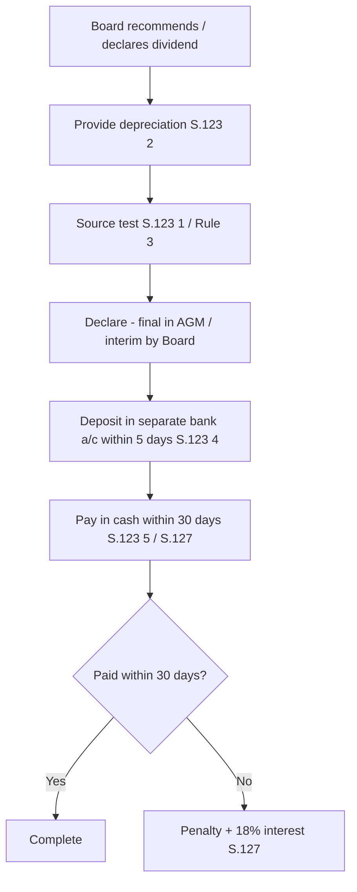
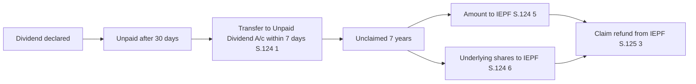
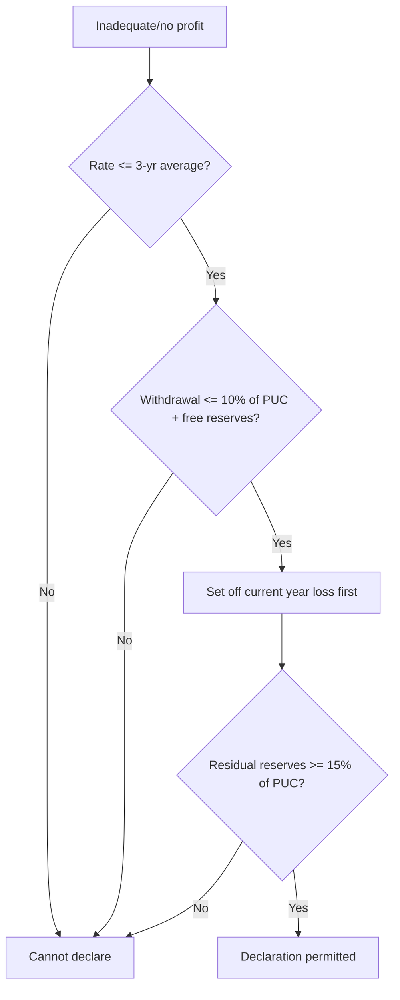

# Q&A — Declaration & Payment of Dividend

> CA Intermediate — Corporate & Other Laws. Statute: **Companies Act, 2013**, Sections **123–127**, definitions **S.2(35)** and **S.2(43)**, and the **Companies (Declaration and Payment of Dividend) Rules, 2014**. Every answer cites the governing provision. No provision is invented.

---

## Section A — Concept-Check Questions (with answers)

**A1. Define "dividend" and state where it is defined.**
*Answer:* Under **S.2(35)**, "dividend" includes any interim dividend. It is not exhaustively defined; judicially it means the portion of distributable profit paid to shareholders as a return on their investment. The word derives from "dividendum" (that which is to be divided). This ties to the core idea: dividend is a **reward from real profit**, not a withdrawal of the shareholders' capital cushion.

**A2. What are the three permitted sources of dividend under S.123(1)?**
*Answer:* Per **S.123(1)**, dividend for a financial year may be paid out of: (a) **profits of the company for that year** arrived at after providing for depreciation per S.123(2); (b) **profits for previous financial years** (accumulated after providing depreciation) remaining undistributed; or (c) **money provided by the Central/State Government** for dividend in pursuance of a guarantee. Profits from any of (a) and (b) may be used, but only after transfers to reserves the company chooses to make. This enforces **capital maintenance** — you distribute the harvest, not the seed corn.

**A3. Is transfer to reserves before declaring dividend mandatory?**
*Answer:* No. Under the second proviso to **S.123(1)**, a company **may** (before declaring dividend) transfer such percentage of profits to reserves as it considers appropriate. The earlier mandatory transfer regime is gone; reserve transfers are now **voluntary**.

**A4. Must depreciation be provided before dividend? Under which provision?**
*Answer:* Yes. **S.123(2)** requires depreciation to be provided in accordance with **Schedule II** before profits are treated as available for dividend. Distributing without charging depreciation would inflate profit and erode capital — the classic "eating the seed corn" fraud.

**A5. Where must dividend be deposited once declared, and within what time?**
*Answer:* Under **S.123(4)**, the amount of declared dividend (including interim) must be **deposited in a separate bank account** within **5 days** of declaration. This ring-fences shareholders' money so it cannot be recycled into working capital.

**A6. In what form must dividend be paid? Can it be paid in kind?**
*Answer:* Under **S.123(5)**, dividend must be paid **in cash** (or by cheque, warrant, or electronic mode) to the registered shareholder or his order. It **cannot be paid in kind**. Capitalisation of profits into bonus shares is not "dividend" and is governed separately (S.63).

**A7. Who may declare interim dividend and out of what?**
*Answer:* Under **S.123(3)**, the **Board of Directors** may declare interim dividend during any financial year (or between year-end and AGM) out of the **surplus in the profit and loss account and/or profits of the current financial year**. If the company has incurred a loss up to the end of the quarter immediately preceding the date of declaration, the interim dividend **rate cannot exceed the average dividend declared in the immediately preceding three financial years**.

**A8. A company has defaulted on repayment of deposits. Can it declare dividend?**
*Answer:* No. Under **S.123(6)**, a company that has **failed to comply with S.73 (acceptance of deposits) and S.74 (repayment of deposits)** shall **not declare any dividend** so long as the default continues. This is a "clean hands" gate — creditor obligations outrank shareholder rewards.

**A9. What happens to dividend that remains unpaid or unclaimed after 30 days?**
*Answer:* Under **S.124(1)**, if declared dividend is not paid/claimed within **30 days** of declaration, the company must, within **7 days** after those 30 days (i.e., by day 37), transfer the unpaid amount to a special account called the **"Unpaid Dividend Account"** opened in a scheduled bank.

**A10. When does unpaid dividend move to the IEPF, and what else moves with it?**
*Answer:* Under **S.124(5)**, money in the Unpaid Dividend Account that remains unpaid/unclaimed for **7 years** from the date of transfer to that account is transferred to the **Investor Education and Protection Fund (IEPF)**. Under **S.124(6)**, the **underlying shares** on which dividend has not been claimed for 7 consecutive years are also transferred to the IEPF.

**A11. Can a shareholder recover money once it goes to the IEPF?**
*Answer:* Yes. Under **S.125(3)** read with the IEPF Rules, a claimant may apply to the IEPF Authority to reclaim the amount/shares transferred. Transfer to IEPF is not forfeiture — the shareholder's claim survives.

**A12. What is the penalty for failure to pay declared dividend within 30 days?**
*Answer:* Under **S.127**, where a dividend has been declared but not paid/warrant not posted within **30 days**, every director knowingly a party to the default is punishable with **imprisonment up to 2 years and fine not less than Rs. 1,000 per day** during default, and the company is liable to pay **interest at 18% p.a.** during the period of default.

---

## Section B — Applied Scenario Questions (Facts → Legal Analysis → Conclusion)

**B1. Depreciation skipped to show profit.**
*Facts:* Alpha Ltd earned an operating surplus of Rs. 50 lakh but did not charge depreciation of Rs. 20 lakh, and declared dividend on the Rs. 50 lakh "profit".
*Analysis:* **S.123(2)** mandates depreciation per Schedule II before profit is available for dividend. True distributable profit is Rs. 30 lakh, not Rs. 50 lakh. Declaring on the un-depreciated figure distributes capital.
*Conclusion:* The declaration is **not in accordance with S.123(1)/(2)**; dividend may only be paid on profit after providing Rs. 20 lakh depreciation.

**B2. Dividend out of past reserves in a loss year.**
*Facts:* Beta Ltd earns no profit this year but wishes to declare dividend out of accumulated free reserves. Its rate history and reserves must be tested.
*Analysis:* **Rule 3** of the Dividend Rules permits dividend out of accumulated profits transferred to free reserves, subject to conditions: (i) the **rate shall not exceed the average of the rates of the three immediately preceding years**; (ii) total amount drawn **shall not exceed 1/10th (10%) of paid-up capital + free reserves**; (iii) the drawn amount is first used to **set off the current year's loss**; and (iv) the balance of reserves after withdrawal **shall not fall below 15% of paid-up share capital**. (Condition (i) does not apply to a company that has not declared dividend in each of the three preceding years.)
*Conclusion:* Beta may declare only if all four limbs — **3-year-average rate, 10% ceiling, loss set-off, and 15% floor** — are satisfied.

**B3. Interim dividend after a loss-making quarter.**
*Facts:* Gamma Ltd's Board wants to declare interim dividend in Q3, but the company incurred a loss during the current financial year up to the end of Q2. Its average dividend over the last three years was 12%. The Board proposes 15%.
*Analysis:* Under the proviso to **S.123(3)**, where the company has incurred a loss during the current FY up to the end of the quarter immediately preceding the date of declaration, the interim dividend rate **cannot exceed the average dividend declared during the immediately preceding three financial years** (12%).
*Conclusion:* The 15% proposal is **invalid**; interim dividend cannot exceed **12%**.

**B4. Deposit default but strong profits.**
*Facts:* Delta Ltd has robust profits but has failed to repay matured public deposits under S.74. It proposes to declare a 20% dividend.
*Analysis:* **S.123(6)** bars any company that has failed to comply with S.73 and S.74 from declaring dividend while the default subsists, regardless of profitability.
*Conclusion:* Delta **cannot declare any dividend** until the deposit default is fully cured.

**B5. Unclaimed dividend not transferred.**
*Facts:* Epsilon Ltd declared dividend on 1 April; by 1 May, Rs. 3 lakh remained unclaimed. The company kept the money in its current account and used it for operations.
*Analysis:* Under **S.124(1)**, the unpaid Rs. 3 lakh had to be transferred to a **Unpaid Dividend Account** within 7 days after the 30-day period (by ~7 May). Under **S.124(3)**, if not transferred, the company must pay **interest at 12% p.a.** on the amount, and the interest enures to the members. Using the money as working capital breaches the ring-fencing under S.123(4)/124.
*Conclusion:* Epsilon is in default of **S.124(1)**, liable for **12% interest** under **S.124(3)**, and officers face penalties under **S.124(7)**.

---

## Section C — Past-Paper-Style Descriptive Questions (model answers)

**C1. "Dividend can only be paid out of profits." Discuss the sources of dividend under the Companies Act, 2013.**
*Answer:* **S.123(1)** codifies three sources: (a) **current year's profits** after providing depreciation under **S.123(2)** (Schedule II); (b) **undistributed profits of previous years** transferred to reserves; and (c) **money provided by Government** under a guarantee. The second proviso makes transfer to reserves **voluntary**. Where profits are inadequate/absent, **Rule 3** allows drawing from free reserves subject to the **3-10-15** discipline: rate not exceeding the **3-year average**, withdrawal capped at **10% of (paid-up capital + free reserves)**, and residual reserves not below **15% of paid-up capital**, with the sum first applied to set off current-year losses. Underlying all this is **capital maintenance** — dividend rewards real profit and must never return capital to members ahead of creditors, which is the price of **limited liability**.

**C2. Explain the statutory scheme for unpaid/unclaimed dividend and the IEPF (S.124–S.125).**
*Answer:* **S.124(1):** unpaid/unclaimed dividend must be moved to an **Unpaid Dividend Account** within **7 days** after the **30-day** payment window. **S.124(2):** the company must, within 90 days, place a statement of unclaimed amounts on its website and the IEPF/MCA website. **S.124(3):** default in transfer attracts **12% p.a. interest** for members' benefit. **S.124(5):** amounts unclaimed for **7 years** in that account go to the **IEPF**. **S.124(6):** the **shares** underlying 7-year unclaimed dividends are transferred to the IEPF (a nominee mechanism). **S.125** establishes the **IEPF**, credits to it, and its uses (refunds to claimants, investor education, etc.), with a claimant's right to reclaim under **S.125(3)**. The philosophy: unclaimed money is stewarded, never confiscated.

**C3. Distinguish interim dividend from final dividend and state the safeguards on interim dividend (S.123(3)).**
*Answer:* A **final dividend** is recommended by the Board and **declared by members** in the AGM; an **interim dividend** is declared **by the Board** between two AGMs under **S.123(3)**. Sources of interim dividend are the **surplus in the P&L account and current-year profits**. Safeguard: if the company has **incurred a loss during the current FY up to the end of the preceding quarter**, interim dividend rate cannot exceed the **average dividend of the preceding three years**. Both interim and final dividends must be **deposited in a separate account within 5 days** (**S.123(4)**), paid **in cash** (**S.123(5)**), and paid within **30 days** (**S.127**).

**C4. State the consequences of failure to distribute declared dividend within 30 days (S.127) and the exceptions.**
*Answer:* Under **S.127**, on failure to pay declared dividend or post the warrant within **30 days**, every defaulting director faces **imprisonment up to 2 years and fine of at least Rs. 1,000/day** during default, and the company pays **interest at 18% p.a.**. **Exceptions (provisos):** no offence if (a) non-payment is due to **operation of law**; (b) a shareholder has given **directions that could not be complied with** and this was communicated; (c) there is a **dispute over entitlement**; (d) the dividend was **lawfully adjusted** against a sum due from the shareholder; or (e) the default was **not due to any fault of the company**.

---

## Section D — MCQs / Case Scenarios (correct option + one-line reasoning)

**D1.** Declared dividend must be deposited in a separate bank account within —
A) 30 days  B) 7 days  C) 5 days  D) 90 days
**Answer: C.** S.123(4) requires deposit within **5 days** of declaration.

**D2.** Unpaid dividend is transferred to the Unpaid Dividend Account within —
A) 7 days of declaration  B) 7 days after the 30-day period  C) 30 days after 7 days  D) 90 days
**Answer: B.** S.124(1) — transfer within 7 days after the 30-day window (day 37).

**D3.** Shares are transferred to IEPF when dividend is unclaimed for —
A) 3 years  B) 5 years  C) 7 consecutive years  D) 10 years
**Answer: C.** S.124(6) — 7 consecutive years of unclaimed dividend.

**D4.** Interest payable by the company for failure to distribute declared dividend within 30 days (S.127) is —
A) 12%  B) 15%  C) 18%  D) 24%
**Answer: C.** S.127 fixes interest at **18% p.a.**

**D5.** Interest for failure to transfer unpaid dividend to the Unpaid Dividend Account (S.124(3)) is —
A) 12% p.a. for members  B) 18% p.a.  C) 9% p.a.  D) No interest
**Answer: A.** S.124(3) — **12% p.a.**, enuring to the members.

**D6.** Under Rule 3, reserves remaining after withdrawal for dividend must not fall below —
A) 10% of paid-up capital  B) 15% of paid-up capital  C) 25% of free reserves  D) 5% of turnover
**Answer: B.** Rule 3 — residual free reserves must be at least **15% of paid-up share capital**.

**D7.** Dividend may be paid in —
A) Cash only (incl. cheque/warrant/electronic)  B) Kind  C) Bonus shares  D) Any mode the Board chooses
**Answer: A.** S.123(5) — payable **in cash**, not in kind.

**D8. Case scenario:** Zeta Ltd defaulted under S.73 on repayment of deposits and simultaneously had large profits. It declared dividend. Which provision is breached?
A) S.123(2)  B) S.123(4)  C) S.123(6)  D) S.127
**Answer: C.** S.123(6) prohibits dividend while a deposit default (S.73/S.74) subsists.

**D9. Case scenario:** A shareholder is untraceable and dividend stays unclaimed for 7 years in the Unpaid Dividend Account. What happens?
A) It is forfeited  B) It goes to IEPF but remains claimable  C) It reverts to the company  D) It is paid to directors
**Answer: B.** S.124(5) + S.125(3) — transferred to IEPF but the member may reclaim.

**D10.** "Dividend includes any interim dividend" is stated in —
A) S.2(43)  B) S.2(35)  C) S.123(3)  D) S.2(31)
**Answer: B.** S.2(35) defines "dividend" to include interim dividend. (S.2(43) defines "free reserves".)

---

## Procedure — Mermaid Diagrams

**Diagram 1: Declaration to payment timeline**

**Diagram 2: Unpaid dividend to IEPF**

**Diagram 3: Rule 3 dividend-out-of-reserves test**

---

## Traps & Examiner Tricks (quick hits)

1. **Depreciation is mandatory (S.123(2)) but reserve transfer is voluntary** — don't reverse these.
2. **5 days** = deposit in separate account; **30 days** = pay; **37 days (7 after 30)** = Unpaid Dividend Account. Don't confuse the three clocks.
3. **7 years** unclaimed → IEPF (amount **and** shares) — not 3 or 5.
4. **S.124(3) interest = 12%** (delayed transfer to Unpaid A/c) vs **S.127 interest = 18%** (delayed payment to member). Different rates, different defaults.
5. **Rule 3 numbers: 3 (avg rate), 10% (ceiling), 15% (floor)** — plug in exactly.
6. **Deposit default (S.123(6)) is an absolute bar** — profitability is irrelevant.
7. **Dividend is cash only (S.123(5))** — "dividend in kind" is a trap; bonus shares are S.63, not dividend.
8. **Interim dividend is declared by the Board (S.123(3))**, final dividend by members in AGM — a common mix-up.
9. **Interim dividend loss-quarter cap** = 3-year average rate — students forget this proviso.
10. **Transfer to IEPF is not forfeiture** — the member retains a right to reclaim (S.125(3)).
11. **S.126 (abeyance):** where shares are subject to a registration/transfer dispute, dividend is **kept in abeyance / transferred to Unpaid Dividend Account** pending resolution — not paid to the transferor by default.
12. **"Profits" for dividend need not equal book profits** — they are post-depreciation, post-set-off distributable profits.
13. **S.127 exceptions** (operation of law, shareholder's un-compliable directions, disputed entitlement, lawful adjustment, no fault of company) — cite them, don't assume the penalty is automatic.

---

## First-Principles Recap — Two Seeds

- **Seed 1 — Distribute the harvest, never the seed corn.** Dividend flows only from *real, post-depreciation profit* (S.123(1)/(2)); paying out of capital would let owners escape with the cushion that protects creditors. This is **capital maintenance**, the quid pro quo for **limited liability**.
- **Seed 2 — Shareholders' money, once declared, is held in trust.** Ring-fencing (S.123(4)), cash-only payment (S.123(5)), the Unpaid Dividend Account and IEPF (S.124–125), abeyance (S.126) and penalties (S.127) all exist so that a declared dividend reaches the right owner and is never quietly recycled or forfeited.

---

## Quick-Revision Sheet

**Key Sections Table**

| Section | Subject |
|---|---|
| S.2(35) | Definition of "dividend" (includes interim) |
| S.2(43) | Definition of "free reserves" |
| S.123(1) | Sources of dividend |
| S.123(2) | Depreciation before dividend (Schedule II) |
| S.123(3) | Interim dividend by Board; loss-quarter cap |
| S.123(4) | Deposit in separate account within 5 days |
| S.123(5) | Dividend payable in cash only |
| S.123(6) | Bar on dividend during deposit default (S.73/74) |
| Rule 3 | Dividend out of reserves — 3 / 10% / 15% |
| S.124 | Unpaid Dividend Account and IEPF transfer |
| S.125 | Investor Education and Protection Fund; refunds |
| S.126 | Right to dividend kept in abeyance (disputed shares) |
| S.127 | Penalty for non-payment within 30 days; 18% interest |

**Time-Limits / Thresholds Table**

| Trigger | Limit | Provision |
|---|---|---|
| Deposit in separate bank account | 5 days of declaration | S.123(4) |
| Pay dividend to member | 30 days of declaration | S.127 |
| Transfer unpaid to Unpaid Dividend A/c | 7 days after the 30-day window | S.124(1) |
| Interest for delayed transfer to Unpaid A/c | 12% p.a. (for members) | S.124(3) |
| Publish unclaimed statement | within 90 days | S.124(2) |
| Unclaimed → IEPF (amount + shares) | 7 years | S.124(5)/(6) |
| Interest for non-payment to member | 18% p.a. | S.127 |
| Reserve-withdrawal rate cap | 3-year average rate | Rule 3 |
| Reserve-withdrawal amount cap | 10% of (PUC + free reserves) | Rule 3 |
| Residual reserves floor | 15% of paid-up capital | Rule 3 |
