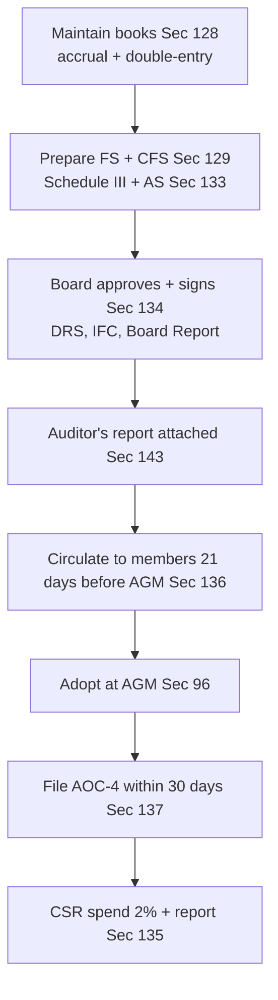

# Q&A — Accounts of Companies

*CA Intermediate · Corporate & Other Laws · Companies Act, 2013, Chapter IX (Sections 128–138) + Section 132*

---

## Section A — Concept-Check Questions (short, with answers)

**A1. Where must a company keep its books of account, and can they be kept elsewhere?**
Under **Sec 128(1)**, every company shall keep books of account at its **registered office**. The Board may decide to keep them at **any other place in India**, but must file **notice in writing with the Registrar (AOC-5)** within **7 days**, giving the full address. Books must give a **true and fair view**, be kept on **accrual basis** and **double-entry system**.

**A2. Can books of account be maintained in electronic form?**
Yes. **Proviso to Sec 128(1) r/w Rule 3, Companies (Accounts) Rules 2014** permits electronic maintenance, provided records remain **accessible in India**, are **retained completely** in original format, remain **legible**, and a **back-up** is kept on servers physically located in India (for foreign-server records, back-up must be periodically taken and kept in India).

**A3. For how long must books of account be preserved?**
**Sec 128(5):** books together with vouchers must be kept in good order for **not less than 8 financial years** immediately preceding the current year. If an **investigation** is ordered, the Central Government may direct a longer period.

**A4. Whose responsibility is maintenance of books, and what is the penalty for default?**
**Sec 128(6):** MD, WTD in charge of finance, CFO, or any other person charged by the Board. Penalty (**Sec 128(6)**): imprisonment up to **1 year** or fine **₹50,000–₹5,00,000**, or both.

**A5. Define "financial statement" under the Act.**
**Sec 2(40):** includes (i) balance sheet, (ii) profit & loss account (or income & expenditure account for non-profit), (iii) cash flow statement, (iv) statement of changes in equity (if applicable), and (v) explanatory notes. **A One Person Company, small company, dormant company and start-up private company need NOT prepare a cash flow statement.**

**A6. What is a "true and fair view" and Schedule III?**
**Sec 129(1):** financial statements must give a true and fair view, comply with **accounting standards (Sec 133)**, and be in the **form given in Schedule III**. For specified entities (banks, insurance, electricity), the respective governing Act's form prevails.

**A7. When must Consolidated Financial Statements (CFS) be prepared?**
**Sec 129(3):** where a company has one or more **subsidiaries, associates or joint ventures**, it shall prepare a CFS in the same form and manner as its own statements, laid before the AGM in addition to standalones. "Subsidiary" here **includes associate and JV** (Explanation).

**A8. Who prescribes accounting standards?**
**Sec 133:** the Central Government prescribes standards **recommended by ICAI in consultation with, and after examination by, NFRA**.

---

## Section B — Applied Scenario Questions (Facts → Analysis → Conclusion)

**B1. CSR applicability trigger.**
*Facts:* Alpha Ltd for FY 2024-25 has net worth ₹450 crore, turnover ₹900 crore, net profit ₹4.2 crore. It contends CSR does not apply as profit is small.
*Analysis:* **Sec 135(1)** applies if **any one** threshold is met in the immediately preceding FY — net worth **≥ ₹500 cr**, or turnover **≥ ₹1,000 cr**, or net profit **≥ ₹5 cr**. Alpha meets none (net worth < 500, turnover < 1000, profit < 5).
*Conclusion:* CSR provisions do **not** apply to Alpha for the year. Had any single limit been crossed, it must spend **2% of average net profit of the preceding 3 FYs** (Sec 135(5)).

**B2. Unspent CSR amount.**
*Facts:* Beta Ltd, covered under CSR, was required to spend ₹80 lakh but spent only ₹50 lakh. ₹20 lakh relates to an ongoing project; ₹10 lakh is unspent with no ongoing project.
*Analysis:* **Sec 135(6):** amount relating to **ongoing projects** must be transferred to a **special "Unspent CSR Account"** within **30 days** of FY-end and spent within **3 financial years**. **Sec 135(5) proviso:** unspent amount **not** relating to ongoing projects must be transferred to a **Schedule VII fund** (e.g., PM CARES) within **6 months** of FY-end.
*Conclusion:* ₹20 lakh → Unspent CSR Account within 30 days; ₹10 lakh → Schedule VII fund within 6 months. Non-compliance attracts penalty under **Sec 135(7)**.

**B3. Circulation of financial statements.**
*Facts:* Gamma Ltd, a listed company, wishes to send only salient features instead of full statements to members holding shares in physical form.
*Analysis:* **Sec 136(1):** a copy of the financial statements, CFS, auditor's report and every attached document must be sent **21 days before the AGM** to every member, trustee for debenture-holders, and other entitled persons. **Listed companies** may send **salient features in the prescribed form (AOC-3)** if full statements are made available on the website — but must send **full statements to members who ask**.
*Conclusion:* Gamma may send salient features provided the full documents are on its website and available on request; otherwise full statements are mandatory.

**B4. Filing with the Registrar after AGM not held.**
*Facts:* Delta Ltd could not hold its AGM. Directors are unsure whether to file financial statements.
*Analysis:* **Sec 137(1):** adopted financial statements must be filed with the Registrar in **AOC-4** within **30 days of the AGM**. **First proviso:** if not adopted at AGM/adjourned AGM, file **unadopted** statements within 30 days as provisional. **Sec 137(1) third proviso:** where **AGM is not held**, file the statements along with reasons **within 30 days of the last date before which the AGM should have been held**.
*Conclusion:* Delta must still file within 30 days of the due date of the AGM, with reasons for non-holding.

**B5. Internal audit.**
*Facts:* Epsilon Ltd (unlisted public) has paid-up capital ₹60 crore and outstanding loans from banks ₹120 crore. It has no internal auditor.
*Analysis:* **Sec 138 r/w Rule 13:** internal audit is mandatory for an **unlisted public company** if it has paid-up capital **≥ ₹50 cr**, or turnover **≥ ₹200 cr**, or outstanding loans/borrowings from banks/PFIs **> ₹100 cr**, or deposits **≥ ₹25 cr** (any one). Epsilon crosses two limits.
*Conclusion:* Epsilon must appoint an **internal auditor** (a CA/CMA or such professional, whether or not in employment). Default is a **non-compliance** under Sec 138.

---

## Section C — Past-Paper-Style Descriptive Questions (model answers)

**C1. Explain the contents of the Board's Report under Section 134, and the Directors' Responsibility Statement.**
**Sec 134(3)** requires the Board's Report to include, inter alia: web-address of annual return (Sec 92); number of Board meetings; **Directors' Responsibility Statement**; details of frauds reported by the auditor (Sec 143(12)); a statement on declaration by independent directors; company's policy on directors' appointment and remuneration; comments on qualifications/adverse remarks in the auditor's/CS's reports; particulars of loans, guarantees and investments (Sec 186); related-party contracts (Sec 188 – AOC-2); dividend recommended; material changes affecting financial position; conservation of energy, technology absorption, foreign exchange; risk management policy; **CSR policy** (Sec 135); and **adequacy of internal financial controls (IFC)**.
The **Directors' Responsibility Statement (Sec 134(5))** confirms: applicable accounting standards followed; accounting policies applied consistently and prudent judgments made to give a true and fair view; proper and sufficient care for maintenance of accounting records and prevention of fraud; accounts on **going concern** basis; (for listed companies) **internal financial controls** laid down were adequate and operating effectively; and proper systems to ensure compliance with all laws were in place and operating.
The report is signed by the **Chairperson if authorised, else by at least two directors** (one being MD where there is one) — **Sec 134(6)**. Penalty for default: company **₹3,00,000** and every officer in default **₹50,000** (**Sec 134(8)**).

**C2. Discuss the constitution and functions of the National Financial Reporting Authority (NFRA) under Section 132.**
**Sec 132(1)** empowers the Central Government to constitute **NFRA** to provide for matters relating to accounting and auditing standards. **Powers/functions (Sec 132(2))**: (a) recommend accounting and auditing standards; (b) monitor and enforce compliance; (c) oversee the quality of service of professions associated with ensuring compliance and suggest measures for improvement. **Sec 132(4):** NFRA may **investigate** professional or other misconduct of prescribed classes of companies/bodies corporate or their **CAs**; for this it has powers of a **civil court**. Where misconduct is proved it can impose **penalty** — for individuals **₹1 lakh up to 5 times fees**, for firms **₹10 lakh up to 10 times fees** — and **debar** the member/firm from practice for **6 months to 10 years**. Appeals lie to the **Appellate Tribunal (Sec 132(5))**. Once NFRA initiates action, no other institute/body can initiate parallel proceedings in the same matter.

**C3. State the provisions for re-opening and voluntary revision of financial statements (Sec 130 & 131).**
**Sec 130 (compulsory re-opening / recasting):** a company shall **not** re-open its books or recast financial statements except on an **order of a court or the Tribunal (NCLT)**, made on an application by the Central Government, Income-tax authorities, SEBI, any other statutory regulatory body or authority, or any person concerned, where earlier accounts were prepared in a **fraudulent manner** or the affairs were **mismanaged** casting doubt on reliability. Notice is given to affected parties. **No order** shall relate to a period **beyond 8 financial years** (except where Sec 128(5) directs longer retention).
**Sec 131 (voluntary revision):** if it appears to the directors that the **financial statements or Board's report do not comply** with Sec 129 or Sec 134, they may prepare **revised** statements/report for **any of the 3 preceding financial years** after obtaining **Tribunal approval**. Revision is confined to correction of non-compliance; may be done **only once** in a financial year.

---

## Section D — MCQs / Case Scenarios (answer + one-line reason)

**D1.** Notice to the Registrar for keeping books at a place other than the registered office (AOC-5) must be filed within:
(a) 15 days (b) 30 days (c) **7 days** (d) 60 days.
**Ans: (c)** — Proviso to **Sec 128(1)**.

**D2.** Minimum period for preservation of books of account:
(a) 5 years (b) 6 years (c) **8 years** (d) 10 years.
**Ans: (c)** — **Sec 128(5)**.

**D3.** Financial statements must be filed with the Registrar within ____ of the AGM:
(a) 7 days (b) **30 days** (c) 60 days (d) 21 days.
**Ans: (b)** — **Sec 137(1)**, in Form **AOC-4**.

**D4.** A CSR committee is required to have at least:
(a) 2 directors (b) **3 directors, one of whom is independent** (c) 5 directors (d) only the MD.
**Ans: (b)** — **Sec 135(1)**. *(An unlisted/private company not required to appoint an independent director may constitute the committee without one; where CSR spend ≤ ₹50 lakh, the committee itself is not mandatory and the Board discharges its functions.)*

**D5.** CFS is required when a company has:
(a) only subsidiaries (b) only associates (c) **subsidiaries, associates or joint ventures** (d) only JVs.
**Ans: (c)** — **Sec 129(3)** Explanation includes associate & JV.

**D6.** Financial statements must be circulated to members before the AGM at least:
(a) 14 days (b) **21 days** (c) 7 days (d) 30 days.
**Ans: (b)** — **Sec 136(1)**.

**D7.** The Directors' Responsibility Statement requirement on effectiveness of **internal financial controls** applies specifically to:
(a) all companies (b) **listed companies** (c) OPCs (d) small companies.
**Ans: (b)** — **Sec 134(5)(e)**.

**D8.** Unspent CSR amount **not** relating to an ongoing project must be transferred to a Schedule VII fund within:
(a) 30 days (b) 3 months (c) **6 months** (d) 1 year.
**Ans: (c)** — **Proviso to Sec 135(5)**.

---

## Procedure — Adoption, Circulation & Filing of Financial Statements

---

## Connections to Other Provisions

- **Sec 92** — Annual Return; web-link disclosed in Board's Report (Sec 134(3)(a)).
- **Sec 96** — AGM at which financial statements are laid and adopted (feeds Sec 137 filing).
- **Sec 123** — Dividend declared out of profits computed from these financial statements; recommended in the Board's Report.
- **Sec 139–143** — Auditor appointment and audit; the **auditor's report** is attached to and read with the financial statements (Sec 134/136); fraud reporting (Sec 143(12)) flows into the Board's Report.
- **Sec 148** — Cost records/cost audit for prescribed companies, forming part of the books under Sec 128.
- **Sec 198** — Manner of computing **net profit**, used to determine the **average net profit** for CSR spend under Sec 135(5).
- **Sec 447** — Punishment for **fraud**; underlies Sec 130 re-opening (fraudulent accounts) and NFRA action under Sec 132.

---

## Traps & Examiner Tricks (12)

1. **AOC-5 is 7 days, not 30** — filing for books kept away from registered office.
2. **8 years preservation** for books (Sec 128(5)) vs **3 preceding FYs** for voluntary revision (Sec 131) vs **8 FYs** cap on re-opening (Sec 130). Don't mix.
3. **CSR thresholds use "immediately preceding FY"** for applicability but **average of 3 preceding FYs** for the 2% spend.
4. **CSR spend basis is Sec 198 net profit**, not book profit.
5. **CFS includes associates & JVs**, not just subsidiaries (Sec 129(3) Explanation).
6. **Cash flow statement exemption** — OPC, small company, dormant company, start-up private company (Sec 2(40) proviso). Do not extend to all private companies.
7. **IFC effectiveness in DRS** is for **listed** companies only (Sec 134(5)(e)).
8. **AOC-4 is 30 days from AGM**; when **no AGM is held**, 30 days from the **due date** of the AGM (with reasons).
9. **Sec 130 re-opening needs Court/Tribunal order** — a company **cannot** re-open books on its own.
10. **Sec 131 revision requires Tribunal approval** and can be done **only once per FY**, for the last **3 FYs**.
11. **CSR committee not mandatory** where CSR obligation ≤ ₹50 lakh — Board discharges its functions.
12. **NFRA vs ICAI** — once NFRA initiates misconduct proceedings, ICAI cannot act on the same matter (Sec 132(4)).

---

## First-Principles Recap

The management–ownership split lets managers control assets they do not own — the gap that enabled **Satyam** and **Enron**. Chapter IX closes that gap through a chain: **capture** honestly (Sec 128 books), **present** truthfully (Sec 129 + 133 + Schedule III), **consolidate** the whole group (Sec 129(3) CFS), **own** the numbers (Sec 134 Board Report + DRS + IFC), **give back** to society (Sec 135 CSR), and **police** the system (Sec 136 members' copies, Sec 137 public filing, Sec 138 internal audit, Sec 132 NFRA). Each rule removes one hiding place for fraud.

---

## Quick-Revision Sheet

**Sections table**

| Sec | Subject |
|-----|---------|
| 128 | Books of account (accrual, double-entry, 8-yr preservation, AOC-5 in 7 days) |
| 129 | Financial statements, true & fair, Schedule III; **129(3)** CFS |
| 130 | Re-opening/recasting on Court/Tribunal order |
| 131 | Voluntary revision (3 preceding FYs, Tribunal approval) |
| 132 | NFRA |
| 133 | Accounting standards (CG on ICAI + NFRA advice) |
| 134 | Board's Report, DRS, IFC, signing |
| 135 | CSR |
| 136 | Right of members to copies (21 days) |
| 137 | Filing with Registrar (AOC-4, 30 days) |
| 138 | Internal audit |

**CSR thresholds (any one, Sec 135(1)):** Net worth ≥ **₹500 cr** · Turnover ≥ **₹1,000 cr** · Net profit ≥ **₹5 cr**. Spend = **2% of average net profit of 3 preceding FYs (Sec 198)**.

**Internal audit thresholds (Rule 13):** Unlisted public — capital ≥ ₹50 cr / turnover ≥ ₹200 cr / bank-PFI loans > ₹100 cr / deposits ≥ ₹25 cr. Private — turnover ≥ ₹200 cr / bank-PFI loans > ₹100 cr. Every **listed** company: always.

**Time limits:** AOC-5 — **7 days**; books preserved — **8 years**; circulate FS — **21 days** before AGM; file AOC-4 — **30 days** after AGM; unspent CSR (ongoing) transfer — **30 days**, spend within **3 FYs**; unspent CSR (non-ongoing) to Schedule VII fund — **6 months**.

**Key definitions:** *Financial statement* — Sec 2(40); *Books of account* — Sec 2(13); *True & fair view* — Sec 129(1).
