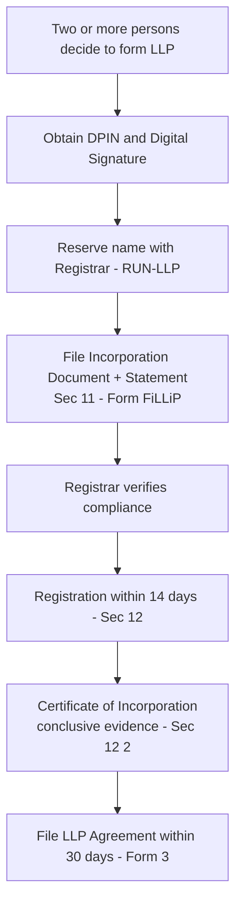
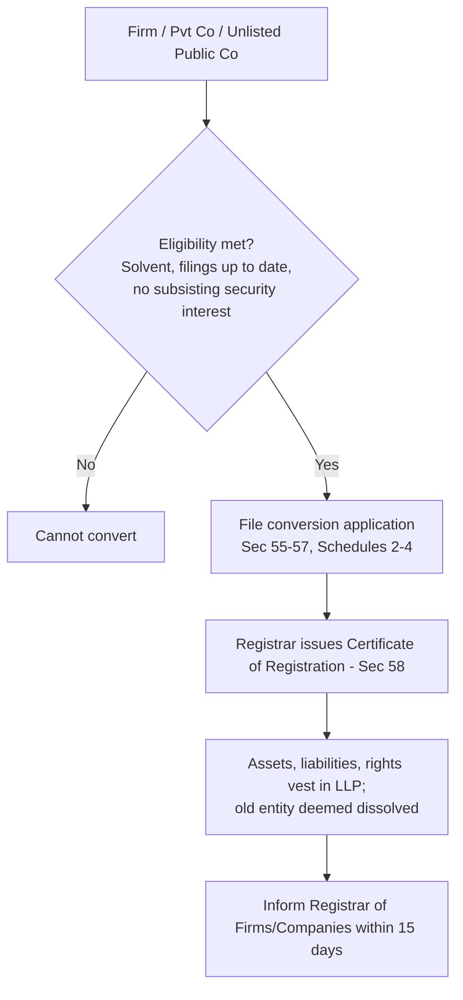

# Q&A — The Limited Liability Partnership Act 2008

> Exam-oriented question bank. Every question is immediately followed by a complete model answer with section citations. All references are to the **Limited Liability Partnership Act, 2008** (LLP Act) unless otherwise stated. Companies Act 2013 and Indian Partnership Act 1932 are cited where relevant.

---

## SECTION A — Concept-Check (Short Questions + Answers)

**A1. Define a Limited Liability Partnership. What is its legal character?**
**Answer:** Under **Section 2(1)(n)**, an LLP is a partnership formed and registered under the Act. **Section 3** declares that an LLP is a **body corporate** formed and incorporated under the Act, and is a **legal entity separate from its partners** having **perpetual succession**. Any change in partners does not affect the existence, rights or liabilities of the LLP. Thus it combines the organisational flexibility of a partnership with the separate-entity and limited-liability features of a company.

**A2. Does the Indian Partnership Act, 1932 apply to an LLP?**
**Answer:** No. **Section 4** expressly provides that the provisions of the **Indian Partnership Act, 1932 shall not apply** to an LLP. The mutual rights and duties of partners and of the LLP are governed by the **LLP agreement**, and in its absence by **Schedule I**.

**A3. Who can be a partner in an LLP and what is the minimum requirement?**
**Answer:** Under **Section 5**, any **individual or body corporate** may be a partner. An individual is disqualified only if declared of unsound mind, an undischarged insolvent, or one whose insolvency application is pending. **Section 6(1)** requires a **minimum of two partners**. Under **Section 6(2)**, if the number falls below two and business is carried on for more than **6 months** with a single partner, that sole partner (who knows the fact) becomes **personally liable** for the obligations incurred during that period.

**A4. What is a "designated partner"? What are the statutory requirements?**
**Answer:** Under **Section 7**, every LLP must have at least **two designated partners** who are **individuals**, and **at least one must be resident in India** (stayed in India ≥ **120 days** during the financial year). Designated partners are responsible for compliance and are answerable for penalties. Every designated partner must obtain a **Designated Partner Identification Number (DPIN)** under **Section 7(6)**. **Section 8** makes designated partners responsible for doing all acts required under the Act and liable for penalties on contravention.

**A5. State the effect of Section 14 (effect of registration).**
**Answer:** On registration, by its name an LLP is **capable of** (a) suing and being sued, (b) acquiring, owning, holding and developing/disposing of **property** (movable/immovable, tangible/intangible), (c) having a **common seal** (if it chooses), and (d) doing and suffering such other acts as bodies corporate may lawfully do. This confirms separate legal personality.

**A6. When does a person cease to be a partner (Section 24)?**
**Answer:** A person may cease to be a partner per the **LLP agreement**, or in absence of agreement by giving **30 days' notice** in writing to the other partners. A person also ceases on **death**, **dissolution** of the LLP, being declared of **unsound mind**, or being **adjudged insolvent**. The cessation does not by itself discharge liability already incurred.

**A7. Explain the extent of liability of partners under Section 27 and Section 28.**
**Answer:** **Section 27(3)** provides that an obligation of the LLP, whether in contract or otherwise, is **solely the obligation of the LLP**, met out of its property. **Section 28(1)** provides that a partner is **not personally liable**, directly or indirectly, for obligations of the LLP solely by reason of being a partner. However, **Section 27(1)** — no vicarious liability for a partner's wrongful acts done without authority — and the **fraud exception in Section 30** are the limits to this shield.

**A8. What is the position on liability in case of fraud (Section 30)?**
**Answer:** Under **Section 30(1)**, where the LLP or a partner acts with **intent to defraud** creditors or for any fraudulent purpose, the liability of the LLP **and** the partners who acted with such intent is **unlimited** for all debts/obligations. **Section 30(2)** imposes a fine of **₹50,000 to ₹5,00,000** and possible imprisonment. This is the LLP's "veil-piercing" provision.

---

## SECTION B — Applied Scenario Questions (Facts → Legal Analysis → Conclusion)

**B1. Falling below minimum partners.**
**Facts:** XY LLP has two partners, X and Y. Y dies on 1 April. X continues the business alone for 8 months and incurs a debt of ₹10 lakh to a supplier. X argues the debt is the LLP's alone.
**Analysis:** **Section 6(1)** requires a minimum of two partners. **Section 6(2)** states that where business is carried on with **only one partner for more than 6 months**, the sole partner who knows he is the only one becomes **personally liable** for the obligations of the LLP incurred during that period. Here X carried on for 8 months (> 6 months) knowing Y had died.
**Conclusion:** X is **personally liable** for the ₹10 lakh debt incurred after the 6-month grace period, jointly with the LLP. The limited-liability shield of Section 28 is lost for that period.

**B2. Partner acting without authority.**
**Facts:** P, a partner of ABC LLP, borrows ₹5 lakh from Z in the LLP's name for his personal use. Z knew P had no authority to bind the LLP and also knew P was not acting for the firm.
**Analysis:** Under **Section 27(1)**, an LLP is **not bound** by anything done by a partner in dealing with a person if (a) the partner has **no authority** to act, **and** (b) the person **knows** he has no authority or does not know/believe him to be a partner of the LLP. Both conditions are satisfied — Z knew P lacked authority and knew it was personal.
**Conclusion:** The LLP is **not liable** to Z. Z can proceed only against P personally. Had Z been unaware of the lack of authority, **Section 27(2)** (partner as agent of LLP) would have bound the LLP.

**B3. Fraudulent conduct.**
**Facts:** Two partners of MNO LLP siphon funds and deliberately incur liabilities to defraud creditors before winding up. Creditors seek to reach the partners' personal assets.
**Analysis:** **Section 30(1)** removes the limited-liability protection where business is carried on **with intent to defraud creditors** or for a fraudulent purpose. In such a case the liability of the LLP **and of the partners who acted with fraudulent intent** becomes **unlimited**.
**Conclusion:** The two fraudulent partners are **personally and unlimitedly liable** to creditors, and are additionally liable to a fine of **₹50,000–₹5,00,000** with possible imprisonment under **Section 30(2)**. Innocent partners are not caught by the unlimited liability.

**B4. Holding out.**
**Facts:** R is not a partner of DEF LLP but allows the LLP to represent to a bank that he is a partner. On the faith of that, the bank extends credit. The LLP defaults.
**Analysis:** **Section 29(1)** provides that a person who **by words or conduct represents himself, or knowingly permits himself to be represented, as a partner** is liable to any person who has on the faith of such representation given credit to the LLP — whether or not the person represented is aware of it.
**Conclusion:** R is liable to the bank as though he were an actual partner (**liability by holding out**), even though he is not on the register.

**B5. Business transfer / assignment of partner's interest.**
**Facts:** G, a partner in GHI LLP, assigns his profit-share to his creditor C to settle a personal debt. C claims he is now a partner and demands access to accounts and management.
**Analysis:** Under **Section 42**, the rights of a partner to a **share of profits and losses and to receive distributions** are **transferable** (wholly or in part). However, such transfer does **not** by itself cause the partner's cessation nor entitle the transferee to **participate in management** or to access information about the LLP's transactions.
**Conclusion:** C is entitled only to receive G's share of profits/distributions. C is **not a partner** and has **no management or information rights**. G continues as partner.

---

## SECTION C — Past-Paper-Style Descriptive Questions (Model Answers)

**C1. "An LLP is a hybrid of a company and a partnership." Discuss the salient features of an LLP under the LLP Act, 2008.**
**Answer:**
1. **Body corporate / separate legal entity** — Section 3; distinct from partners with perpetual succession.
2. **Limited liability** — Section 27(3) and Section 28: obligations are the LLP's own; partners not personally liable merely for being partners.
3. **Partnership Act excluded** — Section 4; internal relations governed by LLP agreement / Schedule I.
4. **Perpetual succession** — Section 3(2): change of partners does not dissolve the LLP.
5. **Minimum two partners** — Section 6; at least **two designated partners**, one resident in India — Section 7.
6. **Capacity** — Section 14: can sue/be sued, own property, common seal.
7. **Mutual agency** — Section 26: each partner is an agent of the **LLP** but **not** of other partners (unlike Section 18 of the Partnership Act 1932).
8. **Perpetual existence independent of partners; property held in LLP's name.**

**C2. Explain the provisions relating to incorporation of an LLP (Sections 11 to 13).**
**Answer:**
- **Section 11 — Incorporation document:** Two or more persons associated for carrying on a lawful business **with a view to profit** subscribe their names to an incorporation document, file it with the Registrar (of the State where the registered office is situated) with the prescribed fee, along with a **statement** by an advocate/CA/CS/Cost Accountant engaged in formation and by a subscriber that the requirements of the Act have been complied with. The incorporation document states the name, proposed business, registered office address, name/address of every partner and designated partner. Making a **false statement** knowingly attracts imprisonment up to 2 years and fine (₹10,000–₹5,00,000).
- **Section 12 — Incorporation by registration:** The Registrar registers the document within **14 days** and issues a **certificate of incorporation**, which is **conclusive evidence** that the LLP is incorporated.
- **Section 13 — Registered office:** Every LLP must have a registered office to which communications may be addressed. Change of registered office is made per the LLP agreement; the Act prescribes filing of notice of change with the Registrar.

**C3. Discuss the requirement and role of "Designated Partners" (Sections 7, 8, 9, 10).**
**Answer:**
- **Section 7(1):** Minimum **two designated partners**, both individuals, **at least one resident in India** (in India ≥ 120 days in the financial year).
- **Section 7(3)–(4):** Consent of each designated partner to be filed; particulars to be with the Registrar.
- **Section 7(6):** Every designated partner must have a **DPIN**.
- **Section 8:** Designated partners are **responsible** for compliance with the Act (filings, returns) and **liable to penalties** for contravention.
- **Section 9:** LLP must ensure it always has the requisite number; a vacancy must be filled within **30 days**; if no designated partner is appointed or only one exists, **every partner** is deemed a designated partner.
- **Section 10:** Penalty for contravention of Sections 7/8/9 — the LLP and its partners are punishable with fine.

**C4. Explain the provisions relating to conversion of a firm/private company/unlisted public company into an LLP (Sections 55–58, Schedules 2–4).**
**Answer:**
- **Section 55** read with **Schedule 2** — a **firm** may convert into an LLP; all partners of the firm become partners of the LLP and no one else.
- **Section 56** read with **Schedule 3** — a **private company** may convert into an LLP; all shareholders become partners and no one else.
- **Section 57** read with **Schedule 4** — an **unlisted public company** may convert into an LLP; likewise all shareholders become partners.
- **Section 58** — On conversion the Registrar issues a **certificate of registration**; the LLP must within **15 days** inform the concerned Registrar of Firms/Companies. On and from the date in the certificate, **all assets, liabilities, interests, rights, privileges, obligations** of the firm/company vest in the LLP, and the firm/company is **deemed dissolved / removed** from the records. Pending proceedings continue against the LLP. Conditions in the Schedules include that there is **no security interest** subsisting/in force at the time (for firm conversion) and that the entity is **solvent** and up-to-date on filings.

**C5. Write short notes on: (a) Extent of liability of LLP (Section 27); (b) Whistle blowing (Section 31).**
**Answer:**
**(a) Section 27 — Extent of liability of LLP:** The LLP is **not bound** by an unauthorised act of a partner where the other party knew of the lack of authority (Sec 27(1)). The LLP is **liable** if a partner is liable for a wrongful act/omission in the course of business or with authority (Sec 27(2)). Any such liability is **met out of the property of the LLP** and is the LLP's obligation alone (Sec 27(3)/(4)).
**(b) Section 31 — Whistle blowing:** The Court/Tribunal may **reduce or waive penalty** against a partner or employee of an LLP who provides useful information leading to conviction or detection of an offence. Such a partner/employee is **protected against discharge, demotion, suspension, harassment or discrimination** in the terms of employment merely for providing such information. This encourages internal disclosure of fraud/wrongdoing.

---

## SECTION D — MCQs / Case Scenarios (Correct Option + One-line Reasoning)

**D1.** Minimum number of designated partners in an LLP is:
(a) 1 (b) 2 (c) 3 (d) 7
**Answer: (b) 2** — Section 7(1) requires at least two designated partners, at least one resident in India.

**D2.** The maximum number of partners in an LLP is:
(a) 20 (b) 50 (c) 100 (d) No limit
**Answer: (d) No limit** — Section 6(1) prescribes only a **minimum of two**; there is no statutory maximum.

**D3.** The Registrar shall register the incorporation document within:
(a) 7 days (b) 14 days (c) 30 days (d) 60 days
**Answer: (b) 14 days** — Section 12(1).

**D4.** If an LLP carries on business with a single partner for more than 6 months, the sole partner:
(a) Has no liability (b) Is personally liable for obligations during that period (c) Faces LLP dissolution automatically (d) Is fined ₹1 lakh
**Answer: (b)** — Section 6(2) imposes personal liability on the sole partner who knew.

**D5.** The Indian Partnership Act, 1932 in relation to an LLP:
(a) Applies fully (b) Applies partly (c) Does not apply (d) Applies only to designated partners
**Answer: (c) Does not apply** — Section 4.

**D6.** In the absence of an LLP agreement, mutual rights and duties are governed by:
(a) Companies Act 2013 (b) Schedule I to the LLP Act (c) Partnership Act 1932 (d) The Registrar's directions
**Answer: (b) Schedule I** — default provisions apply where the agreement is silent.

**D7.** A resident partner for Section 7 must have stayed in India during the financial year for at least:
(a) 60 days (b) 120 days (c) 182 days (d) 240 days
**Answer: (b) 120 days** — Section 7(1) Explanation (as amended).

**D8.** Where a person carries on business with intent to defraud creditors, liability of the LLP and the guilty partners is:
(a) Limited to capital (b) Nil (c) Unlimited (d) Limited to ₹5 lakh
**Answer: (c) Unlimited** — Section 30(1); plus fine ₹50,000–₹5,00,000 under Section 30(2).

**D9.** A partner's right assignable under Section 42 is:
(a) Right to manage (b) Right to a share of profits and distributions (c) Right to access accounts (d) All rights of a partner
**Answer: (b)** — Section 42; assignment does not give management or information rights.

**D10.** The Statement of Account and Solvency and Annual Return are filed under:
(a) Sections 34 & 35 (b) Sections 11 & 12 (c) Sections 55 & 56 (d) Sections 63 & 64
**Answer: (a) Sections 34 & 35** — Section 34 (accounts/Statement of Account and Solvency within 6 months of year-end) and Section 35 (Annual Return within 60 days of close of financial year).

**D11.** A certificate of incorporation issued under Section 12 is:
(a) Prima facie evidence (b) Conclusive evidence of incorporation (c) Not evidence (d) Evidence of solvency
**Answer: (b) Conclusive evidence** — Section 12(2).

**D12.** Winding up of an LLP may be:
(a) Only voluntary (b) Only by Tribunal (c) Voluntary or by the Tribunal (d) Only by the Registrar
**Answer: (c)** — Section 63 (voluntary or by Tribunal); Section 64 lists grounds for winding up by Tribunal.

---

## Key Procedure — Incorporation of an LLP (Mermaid)



## Key Procedure — Conversion into LLP (Mermaid)



---

## First-Principles Recap

- An LLP exists to solve **two traps**: unlimited personal liability in a partnership (Partnership Act 1932) and the rigidity/compliance burden of a company (Companies Act 2013).
- It is a **body corporate** (Section 3) yet governed internally by **contract** (Section 4 + LLP agreement + Schedule I) — company-like shell, partnership-like flexibility.
- The **liability shield** (Sections 27–28) is real but is **defeated by fraud** (Section 30), by **falling below two partners** for 6 months (Section 6(2)), and by **holding out** (Section 29).
- Each partner is agent of the **LLP only**, not of co-partners (Section 26) — this is the design fix that makes limited liability workable.
- Compliance rests on **designated partners** (Sections 7–10) who file the **Statement of Account & Solvency (Sec 34)** and **Annual Return (Sec 35)**.

---

## Quick-Revision Sheet

### Key Sections Table
| Section | Subject |
|---|---|
| 2 | Definitions (LLP, partner, designated partner) |
| 3 | LLP is a body corporate / separate legal entity |
| 4 | Partnership Act 1932 not to apply |
| 5 | Who may be a partner |
| 6 | Minimum two partners; sole-partner liability |
| 7 | Designated partners; resident condition; DPIN |
| 8–10 | Duties, changes and penalties re designated partners |
| 11–13 | Incorporation document, registration, registered office |
| 14 | Effect of registration (capacity) |
| 15–17 | Name, reservation, change of name |
| 21 | Publication of name and limited liability |
| 22–25 | Partners, relationship, cessation, registration of changes |
| 26 | Partner as agent of LLP |
| 27–28 | Extent of liability of LLP and of partners |
| 30 | Unlimited liability in case of fraud |
| 31 | Whistle blowing |
| 34–35 | Accounts / Statement of Account & Solvency; Annual Return |
| 42 | Transfer of partner's economic rights |
| 55–58 | Conversion (firm / pvt co / unlisted public co) |
| 59 | Foreign LLPs |
| 63–65 | Winding up and dissolution; rules |
| Sch I–IV | Default terms; conversion conditions |

### Limits / Deadlines Table
| Item | Limit / Period | Section |
|---|---|---|
| Minimum partners | 2 | 6(1) |
| Minimum designated partners | 2 (one resident) | 7(1) |
| Resident stay in India | ≥ 120 days | 7(1) |
| Sole-partner grace period | 6 months | 6(2) |
| Registration of incorporation | within 14 days | 12(1) |
| Notice of cessation (no agreement) | 30 days | 24 |
| Fill designated-partner vacancy | 30 days | 9 |
| File LLP agreement | 30 days | Rules |
| Statement of Account & Solvency | within 6 months of FY end | 34 |
| Annual Return | within 60 days of FY close | 35 |
| Inform Registrar post-conversion | 15 days | 58 |
| Fraud fine | ₹50,000–₹5,00,000 | 30(2) |

### Contrast Table — LLP vs Company vs Partnership
| Feature | LLP (LLP Act 2008) | Company (Companies Act 2013) | Partnership (Partnership Act 1932) |
|---|---|---|---|
| Legal status | Separate body corporate (Sec 3) | Separate body corporate | No separate entity |
| Liability of members | Limited (Sec 28) | Limited | Unlimited, joint & several |
| Governing internal law | LLP agreement / Sch I (Sec 4) | Articles + Act | Partnership deed / Act 1932 |
| Perpetual succession | Yes (Sec 3) | Yes | No |
| Min members | 2 (Sec 6) | 2 private / 7 public | 2 |
| Max members | No limit | 200 private / unlimited public | 50 (Rules under Cos Act) |
| Agency | Partner = agent of LLP only (Sec 26) | Directors/officers | Each partner = agent of firm & partners |
| Registration | Mandatory (Sec 12) | Mandatory | Optional |
```
