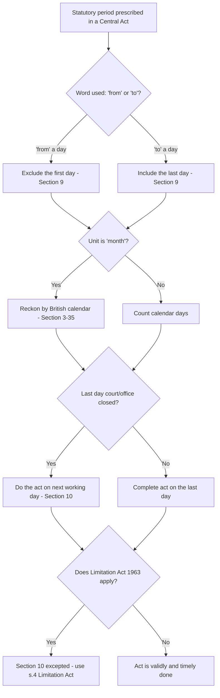

# Q&A — The General Clauses Act 1897

> Exam-oriented question bank for CA Intermediate — Corporate & Other Laws.
> Every question is followed by a complete model answer with the exact Section cited.
> Statute referenced: **The General Clauses Act, 1897** (with cross-references to the Companies Act, 2013 where relevant). No invented provisions.

---

## SECTION A — Concept-Check Questions (with answers)

**A1. What is the object and utility of the General Clauses Act, 1897?**
**Answer:** The General Clauses Act, 1897 is an "interpretation Act." Its object is to (a) shorten the language of Central legislation by avoiding repetition of definitions and standard provisions, (b) provide uniform definitions of recurring words and expressions, (c) state rules of construction to guard against slips and mistakes, and (d) preserve accrued rights when statutes are repealed. It applies to all Central Acts and Regulations unless a **different intention appears** in the enactment concerned (Sections 3 and 4).

**A2. Define "financial year" under the General Clauses Act.**
**Answer:** Under **Section 3(21)**, "financial year" means the year commencing on the **1st day of April**. This is distinct from a "year" which, under **Section 3(66)**, means a year reckoned according to the British calendar (1 January to 31 December).

**A3. How is "month" defined and why does it matter?**
**Answer:** Under **Section 3(35)**, "month" means a month reckoned according to the **British calendar**. Therefore a month runs from a date in one calendar month to the corresponding date in the next, not as 30 days. E.g., a period of one month from 15 January ends on 15 February.

**A4. Distinguish "immovable property" and "movable property" as defined.**
**Answer:** **Section 3(26)** — "immovable property" includes land, benefits to arise out of land, and things attached to the earth or permanently fastened to anything attached to the earth. **Section 3(36)** — "movable property" means property of every description **except immovable property**.

**A5. What do Sections 3(7), 3(22) and 3(60) define regarding "Government"?**
**Answer:** **Section 3(7)** defines "Central Government," **Section 3(60)** defines "State Government," and **Section 3(23)** deals with Government securities. "Government" (Section 3(23)... "Government" per 3(23) is Government securities; "Government" itself under 3(23)?) — precisely, **Section 3(23)** = "Government/Govt." includes both Central and State Government. These uniform definitions save every Central Act from re-defining who exercises executive power.

**A6. State the rule of construction regarding gender and number.**
**Answer:** Under **Section 13**, in every Central Act and Regulation, unless a contrary intention appears — (1) words importing the **masculine gender** shall be taken to include females; and (2) words in the **singular** shall include the plural, and vice versa.

**A7. What does Section 9 lay down about the words "from" and "to"?**
**Answer:** **Section 9** provides that in any Central Act/Regulation, to exclude the first day in a series of days or a period, the word **"from"** is used, and to include the last day the word **"to"** is used. Effect: "from" excludes the opening day; "to" includes the closing day.

---

## SECTION B — Applied Scenario Questions (Facts → Legal Analysis → Conclusion)

**B1.** *A notice under a Central Act must be given "within 15 days from 1st March." Mr. X gives it on 16th March. Is it in time?*
**Answer (Facts → Analysis → Conclusion):**
- **Facts:** Period of 15 days computed "from 1st March"; notice served 16th March.
- **Analysis:** **Section 9** states that the word "from" **excludes** the first day. Hence 1st March is excluded and counting begins on 2nd March. Fifteen days therefore run 2nd–16th March, so the 15th day is 16th March.
- **Conclusion:** The notice given on 16th March is **within time** and valid.

**B2.** *A statutory application had to be filed "within one month" from 30th January. The office was closed on the last day. When can it validly be filed?*
**Answer:**
- **Facts:** Limitation of "one month" from 30th January; last day a holiday.
- **Analysis:** "Month" = British calendar month (**Section 3(35)**), so one month from 30th January expires on the corresponding date in February. As February has no 30th, it expires on the last day of February. Under **Section 10**, where an act is allowed to be done within a prescribed period and the **court/office is closed** on the last day, the act may be done on the **next day it is open**. (Note: Section 10 excepts the Limitation Act, 1963 which has its own s.4.)
- **Conclusion:** The application filed on the next working day after the closed last day is **valid**.

**B3.** *A Central Act empowers the Government to "issue a notification fixing rates." Later the Government wants to amend those rates. Does it need fresh statutory authority?*
**Answer:**
- **Facts:** Power to issue notification given; Government now wishes to amend/rescind.
- **Analysis:** Under **Section 21**, where a Central Act confers power to issue notifications, orders, rules or bye-laws, that power **includes** a power, exercisable in the like manner and subject to like conditions, to **add to, amend, vary or rescind** the notification, order, rule or bye-law.
- **Conclusion:** No fresh authority is needed; the Government may amend or rescind the rates under Section 21, following the same procedure as for the original notification.

**B4.** *An authority is empowered "to appoint" an officer to a post. Can the same authority suspend or dismiss that officer?*
**Answer:**
- **Facts:** Power "to appoint" conferred; question of power to suspend/dismiss.
- **Analysis:** **Section 16** provides that where a Central Act/Regulation confers power to make an appointment, the authority having such power shall, unless a different intention appears, also have the power to **suspend or dismiss** the person appointed. (Complementarily, **Section 15** allows appointment by name or by virtue of office.)
- **Conclusion:** The appointing authority also possesses the power to suspend or dismiss the officer.

**B5.** *A repealed Act had imposed a penalty on Mr. Y for a contravention committed before repeal. After repeal, can proceedings still continue?*
**Answer:**
- **Facts:** Contravention and liability accrued under an Act later repealed.
- **Analysis:** Under **Section 6**, unless a different intention appears, repeal does not — (a) revive anything not in force; (b) affect the previous operation of the repealed enactment or **anything duly done**; (c) affect any **right, privilege, obligation or liability acquired, accrued or incurred**; (d) affect any **penalty, forfeiture or punishment** incurred; or (e) affect any investigation, legal proceeding or remedy — which may be continued as if the repealing Act had not been passed.
- **Conclusion:** The penalty and proceedings against Mr. Y **survive the repeal** and may be continued under Section 6.

**B6.** *A notice under the Companies Act, 2013 is sent by registered post, properly addressed and stamped. The addressee claims he never received it. Is service proved?*
**Answer:**
- **Facts:** Notice properly addressed, pre-paid and posted by registered post; non-receipt alleged.
- **Analysis:** **Section 27** of the General Clauses Act provides that where any Act requires a document to be served **"by post,"** service is deemed effected by properly addressing, pre-paying and posting the letter, and unless the contrary is proved, service is deemed to be effected at the time the letter **would be delivered in the ordinary course of post**. This aligns with service provisions under Section 20 of the Companies Act, 2013.
- **Conclusion:** Service is presumed to be validly effected; the burden shifts to the addressee to prove non-delivery.

---

## SECTION C — Past-Paper-Style Descriptive Questions (with model answers)

**C1. Explain the effect of repeal of an enactment under Section 6 of the General Clauses Act, 1897.**
**Model Answer:** Section 6 protects the past operation of a repealed law. Where any Central Act or Regulation is repealed, then unless a different intention appears, the repeal shall **not**: (a) revive anything not in force at the time of repeal; (b) affect the previous operation of the repealed enactment or anything duly done or suffered thereunder; (c) affect any right, privilege, obligation or liability acquired, accrued or incurred under it; (d) affect any penalty, forfeiture or punishment incurred in respect of any offence committed against it; or (e) affect any investigation, legal proceeding or remedy in respect of such right, liability, penalty or forfeiture. Such proceedings may be instituted, continued or enforced as if the repealing Act had not been passed. The provision thus safeguards **vested/accrued rights and pending actions** and prevents a repeal from operating retrospectively to defeat them.

**C2. Write short notes on: (i) "Coming into operation of enactments" and (ii) "Effect of repeal of a repealing Act."**
**Model Answer:**
(i) **Section 5** — Where any Central Act is not expressed to come into operation on a particular day, it comes into operation on the day it receives the **assent of the President** (for Acts passed after commencement of the Constitution). Thus the date of enforcement is fixed unless the Act itself provides otherwise.
(ii) **Section 7 & Section 6A** — Under **Section 7**, to revive a repealed enactment, express words are required; a repeal does not automatically revive earlier repealed law. Under **Section 6A**, where a Central Act repeals any enactment by which the text of any Central Act was **amended** by express omission, insertion or substitution, the repeal shall not affect the continuance of the amendment already made unless a contrary intention appears.

**C3. Explain the rules relating to computation of time under Sections 9 and 10.**
**Model Answer:** **Section 9** governs the exclusion/inclusion of terminal days: the word **"from"** excludes the first day of a period, and the word **"to"** includes the last day. **Section 10** deals with acts to be done within a prescribed period: if the last day on which an act (proceeding in a court or office) may be done is a day when the court/office is **closed**, the act is deemed done in time if done on the **next day the court/office reopens**. However, Section 10 does **not** apply to any act to which the **Limitation Act, 1963** applies, since that Act contains its own provision (Section 4). Together these sections ensure fairness in reckoning statutory periods.

**C4. Discuss the rule of construction that "power to make includes power to add, amend, vary or rescind" and its practical significance for delegated legislation.**
**Model Answer:** **Section 21** codifies a fundamental rule for subordinate/delegated legislation: where a Central Act or Regulation confers a power to issue **notifications, orders, rules or bye-laws**, that power carries with it an implied power to **add to, amend, vary or rescind** any such instrument, exercisable in the **like manner and subject to like sanction and conditions** as the original power. Practical significance: the executive need not seek fresh legislative authority each time a subordinate instrument requires modification; but the power to amend is **co-extensive** with the power to make — it must follow the same procedure (e.g., previous publication, consultation) that governed the original. This provides both flexibility and procedural discipline in administrative rule-making.

**C5. State the rules of construction contained in Sections 13, 14 and 15 of the Act.**
**Model Answer:**
- **Section 13 (Gender and number):** Masculine includes feminine; singular includes plural and vice versa — unless a contrary intention appears.
- **Section 14 (Powers exercisable from time to time):** Where a Central Act confers a power, that power may be exercised **from time to time as occasion requires**, unless a different intention appears. Thus a power once used is not exhausted.
- **Section 15 (Power to appoint):** Where power is given to appoint a person to fill an office or execute a function, the appointment may be made either by **name or by virtue of office**.
These uniform construction rules avoid repetitive drafting and prevent narrow interpretations that would frustrate the statute's purpose.

---

## SECTION D — MCQs / Case Scenarios (correct option + one-line reasoning)

**D1.** "Financial year" under the General Clauses Act commences on:
(a) 1 January (b) 1 April (c) 1 July (d) 1 October
**Answer: (b) 1 April.** *Reason:* Section 3(21) defines financial year as the year commencing on 1st April.

**D2.** The word "month" means:
(a) 30 days (b) 28 days (c) a month per the British calendar (d) a lunar month
**Answer: (c) a month per the British calendar.** *Reason:* Section 3(35) reckons a month by the British calendar, not fixed days.

**D3.** In a Central Act, the word "from" a specified day:
(a) includes that day (b) excludes that day (c) includes only if a holiday (d) depends on context
**Answer: (b) excludes that day.** *Reason:* Section 9 provides "from" excludes the first day and "to" includes the last day.

**D4.** Power to issue a notification includes the power to amend or rescind it under:
(a) Section 6 (b) Section 16 (c) Section 21 (d) Section 27
**Answer: (c) Section 21.** *Reason:* Section 21 confers implied power to add to, amend, vary or rescind such instruments.

**D5.** A repeal does **not** affect any right accrued under the repealed Act. This is provided by:
(a) Section 5 (b) Section 6 (c) Section 7 (d) Section 8
**Answer: (b) Section 6.** *Reason:* Section 6 preserves accrued rights, liabilities, penalties and pending proceedings.

**D6.** Service "by post" is deemed effected when the letter would be delivered in the ordinary course of post, under:
(a) Section 25 (b) Section 26 (c) Section 27 (d) Section 3(39)
**Answer: (c) Section 27.** *Reason:* Section 27 raises a rebuttable presumption of service on proper addressing, pre-paying and posting.

**D7.** Where power is conferred to make an appointment, the same authority may also suspend or dismiss the appointee. This flows from:
(a) Section 14 (b) Section 15 (c) Section 16 (d) Section 21
**Answer: (c) Section 16.** *Reason:* Section 16 attaches power to suspend/dismiss to the power to appoint.

**D8.** A Central Act silent on its commencement comes into force on:
(a) date of gazette printing (b) date of Presidential assent (c) 1 April following (d) date of introduction
**Answer: (b) date of Presidential assent.** *Reason:* Section 5 fixes the assent date as the commencement date absent a contrary provision.

**D9.** Movable property under Section 3(36) means:
(a) only goods (b) property of every description except immovable property (c) shares only (d) currency only
**Answer: (b) property of every description except immovable property.** *Reason:* Section 3(36) defines it residually against immovable property in Section 3(26).

**D10.** A power conferred by a Central Act, unless a contrary intention appears, may be exercised:
(a) only once (b) from time to time as occasion requires (c) within one year only (d) only by the Central Government
**Answer: (b) from time to time as occasion requires.** *Reason:* Section 14 makes statutory powers recurrently exercisable.

---

## Mermaid Diagram — Applying the General Clauses Act to a Statutory Time Limit

---

## Quick-Revision Pointers (Section-linked)

- **Definitions:** Financial year — 1 April (**3(21)**); Year — British calendar (**3(66)**); Month — British calendar (**3(35)**); Immovable property (**3(26)**); Movable property (**3(36)**); Person — includes company/association (**3(42)**).
- **Commencement & Repeal:** Enforcement on assent (**5**); Effect of repeal — saves accrued rights (**6**); Repeal of textual-amendment Act (**6A**); Revival needs express words (**7**); References to repealed enactments read as re-enacted law (**8**).
- **Time:** "From" excludes / "to" includes (**9**); Closed last day → next open day, except Limitation Act (**10**).
- **Construction:** Gender & number (**13**); Power exercisable from time to time (**14**); Appointment by name/office (**15**); Power to appoint includes suspend/dismiss (**16**); Power to make includes amend/rescind (**21**).
- **Service:** Deemed service by post (**27**).
- **Golden rule:** All above apply "**unless a different intention appears**" (**Sections 3 & 4**) — the parent Act always prevails.
