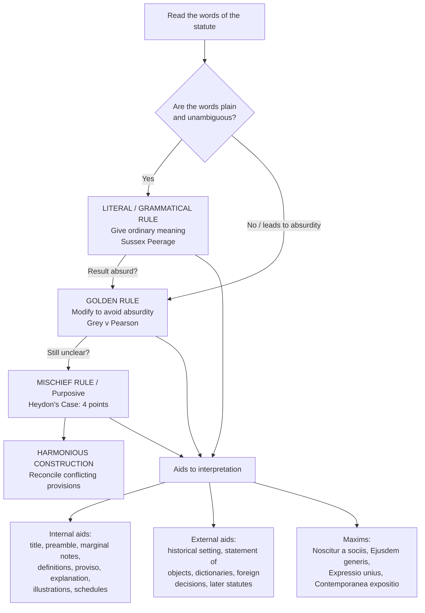

# Q&A — Interpretation of Statutes

> CA Intermediate — Corporate & Other Laws. Every question is followed immediately by a complete model answer. Cite the rule/maxim by name in the exam; examiners reward precise terminology.

---

## How the rules fit together (revision map)

---

## SECTION A — Concept-Check (short questions + answers)

**A1. Distinguish "interpretation" from "construction".**
*Answer:* **Interpretation** is the process of ascertaining the true, literal sense/meaning of the words used in a statute. **Construction** goes a step further — it is the drawing of conclusions about matters that lie *beyond* the direct expression of the text, resolving the legal effect of ambiguous, obscure or conflicting provisions in a way that gives effect to the legislature's intention. Interpretation looks at *what the words mean*; construction decides *how they apply* to facts. In practice the terms are used interchangeably.

**A2. State the Literal Rule and give the leading authority.**
*Answer:* Where the language of a statute is **plain, clear and unambiguous**, effect must be given to it regardless of consequences; the court cannot add to or subtract from the words. The intention of the legislature is to be gathered from the words actually used. Authority: **Sussex Peerage Case** — "the only rule is to expound the words in their natural and ordinary sense." Also called the grammatical rule.

**A3. State the Golden Rule.**
*Answer:* Start from the literal/grammatical meaning, but if that produces an **absurdity, inconsistency or repugnancy**, the ordinary sense may be **modified/departed from** to the extent necessary to avoid that absurdity — but no further. Authority: **Grey v. Pearson** ("the grammatical and ordinary sense... may be modified so as to avoid that absurdity and inconsistency, but no farther").

**A4. State the Mischief Rule and its four considerations.**
*Answer:* From **Heydon's Case** — to suppress the mischief and advance the remedy, the court considers four points: (1) What was the **common law** before the Act; (2) What was the **mischief and defect** for which the common law did not provide; (3) What **remedy** Parliament resolved; (4) The **true reason of the remedy**. The court adopts the construction that suppresses the mischief and advances the remedy. Also called the *purposive* rule.

**A5. What is Harmonious Construction?**
*Answer:* When two provisions of the same statute (or two statutes) appear to conflict, they must be read together and interpreted so that **both are given effect** and neither is rendered redundant. A construction reducing one provision to a "dead letter" is not harmonious. The court avoids a head-on clash and seeks to reconcile.

**A6. Define an internal aid and list six.**
*Answer:* Internal aids are found **within the statute itself**. Examples: (1) **Long title/short title**, (2) **Preamble**, (3) **Marginal notes/headings**, (4) **Definition/interpretation clause**, (5) **Proviso**, (6) **Explanation**, plus **illustrations** and **schedules**.

**A7. Define an external aid and list four.**
*Answer:* External aids lie **outside the statute**. Examples: (1) **Historical setting / parliamentary history**, (2) **Statement of Objects and Reasons**, (3) **Dictionaries**, (4) **Foreign decisions**; also **later Acts (in pari materia)**, government publications and text-books.

**A8. What is the function of a "proviso", an "explanation", and an "illustration"?**
*Answer:* A **proviso** carves out an **exception** to the main enactment; it operates only on the subject matter of the main clause. An **explanation** clarifies/removes doubt about the main provision (does not ordinarily widen or restrict it, though it may make explicit what was implicit). **Illustrations** show how the section applies to concrete facts; they are helpful but cannot override the plain words of the section.

**A9. Explain "Noscitur a sociis".**
*Answer:* "A word is known by the company it keeps." An ambiguous word takes colour from **words associated with it** in the same context/clause. E.g., in "books, pamphlets, newspapers and other documents", "documents" is read alongside the reading-material class.

**A10. Explain "Ejusdem generis" and its condition.**
*Answer:* Where **specific words forming a distinct genus** are followed by **general words**, the general words are limited to things of the **same kind/class** as the specific ones. Condition: the specific words must constitute a category/genus that is not exhausted; if there is no common genus, the rule does not apply and the general words get their full meaning. (It is a species of *noscitur a sociis*.)

**A11. Explain "Expressio unius est exclusio alterius".**
*Answer:* The **express mention of one thing implies the exclusion of another** not mentioned. Where a statute expressly enumerates the subjects to which it applies, matters not enumerated are taken to be excluded. It is a useful servant but a dangerous master — applied cautiously, as omission may be accidental.

**A12. Explain "Contemporanea expositio est optima et fortissima in lege".**
*Answer:* "Contemporaneous exposition is the best and strongest in law." The meaning given to a (usually old) statute by those who **applied it soon after enactment** and by long usage is a strong guide to its interpretation. Applies mainly to ancient statutes, not modern ones.

**A13. List four presumptions courts make while interpreting statutes.**
*Answer:* (1) Statute is **not intended to be unconstitutional/ultra vires** (presumption of constitutionality); (2) Words are **not superfluous** — the legislature does nothing in vain; (3) Statute is **not retrospective** (a substantive law operates prospectively unless expressed/necessarily implied); (4) The legislature **knows the existing law** and does not intend injustice or to oust the jurisdiction of courts / to take away vested rights without clear words. Also: penal statutes are construed strictly in favour of the accused.

**A14. What is the "golden thread" running through all the rules?**
*Answer:* The overriding object of every rule is to ascertain and give effect to the **intention of the legislature** ("*legislative intent*") as expressed in the words used, read in their context. Every rule and aid is only a means to that single end.

---

## SECTION B — Applied Scenario Questions (full reasoned answers)

**B1. The classic "No vehicles in the park" rule.**
A municipal bye-law states: "No vehicle shall be permitted to enter the public park." (a) Does it bar a child's tricycle? (b) Does it bar an ambulance entering to save a collapsed visitor? Apply the rules.
*Answer:* (a) **Literal Rule:** a tricycle is arguably a "vehicle" on the plain word, so it would be barred. But the **purpose/mischief** (Heydon) of the rule is to keep the park peaceful and safe from motorised traffic; **noscitur a sociis** and purposive reading suggest "vehicle" targets motorised traffic, so a tricycle used by a child likely falls outside the mischief. (b) A literal reading bars the ambulance, but that produces an **absurd/unjust result** (a life lost to enforce a parking rule). Applying the **Golden Rule (Grey v. Pearson)** and the **Mischief Rule**, "vehicle" is construed so as **not** to prohibit an emergency ambulance, because the legislature never intended so absurd a consequence. **Conclusion:** context and purpose modify the literal word to serve legislative intent.

**B2. General words after specific ones.**
A statute empowers seizure of "houses, offices, rooms and other places" used for gaming. Police seize an **open piece of land** used for gaming. Valid?
*Answer:* Apply **ejusdem generis**. The specific words "houses, offices, rooms" form a **genus of enclosed/indoor premises**. The general words "other places" are therefore limited to places of the **same kind** — enclosed places. An **open field** is not of that genus, so it falls outside "other places", and the seizure is **not authorised**. (Illustrates that general words are cut down to the class of the preceding specific words.)

**B3. When ejusdem generis does NOT apply.**
An Act imposes a duty on "any theatre, cinema, hall, or other place of public entertainment." Does a **sports stadium** fall within "other place of public entertainment"?
*Answer:* First test whether the specific words form a **single distinct genus**. Arguably they share the genus "places of public entertainment / assembly." A stadium is a place of public entertainment of the **same class**, so it is covered. But note the limiting principle: if the enumerated items are **so varied that no common genus exists** (or the general words are followed by words showing the widest intent, e.g. "of whatsoever kind"), *ejusdem generis* is **excluded** and the general words take their full natural meaning. State both possibilities and conclude on the genus test.

**B4. Proviso vs main enactment.**
Section X: "Every company shall hold an AGM within six months of the financial year-end; provided that the Registrar may, for special reasons, extend the period by up to three months." A company claims the proviso gives a general right to a nine-month gap. Correct?
*Answer:* No. A **proviso is construed as an exception** to the main enactment and operates **only within its field**. The main rule remains six months; the proviso merely enables the **Registrar**, on **special reasons**, to grant an extension. It confers **no automatic right** on the company and cannot be read to enlarge the substantive rule for everyone. A proviso should be read strictly and not so as to defeat the main provision. **Conclusion:** the company's claim fails.

**B5. Two apparently conflicting sections.**
A statute in one section confers on tribunals the power to decide "all disputes" under the Act, and another section says civil courts "shall have jurisdiction to try suits of a civil nature." A litigant argues the two clash and one must be struck down. Advise.
*Answer:* Apply **Harmonious Construction**. Courts do not presume conflict; the provisions must be read together so **both operate**. The specific conferment of "all disputes under the Act" on the tribunal is read as a **special jurisdiction** carved out of the general civil-court jurisdiction (also supported by *generalia specialibus non derogant* — general provisions do not derogate from special ones). Thus disputes arising **under the Act** go to the tribunal, while the civil court retains its **general** jurisdiction over other civil suits. Neither provision is rendered a dead letter. No question of striking down arises.

---

## SECTION C — Past-Paper-Style Descriptive Questions (model answers)

**C1. "The intention of the Legislature is the primary rule of interpretation." Explain the four primary rules of interpretation of statutes.** *(≈ 6 marks)*
*Answer:*
The cardinal principle is that a statute must be read to give effect to the **intention of the legislature**. The four primary rules are:

1. **Literal / Grammatical Rule** — Where words are plain and unambiguous, give them their natural and ordinary meaning; nothing is to be added or taken away (*Sussex Peerage Case*). The court presumes the legislature meant what it said.
2. **Golden Rule** — Begin with the literal meaning, but where it leads to **absurdity, repugnancy or inconsistency**, modify the ordinary sense just enough to avoid that result — "but no farther" (*Grey v. Pearson*). It is a modification/relaxation of the literal rule.
3. **Mischief Rule (Heydon's Case)** — The court looks to (i) the earlier law, (ii) the mischief/defect, (iii) the remedy provided, and (iv) the true reason of the remedy, and construes the Act so as to **suppress the mischief and advance the remedy**. This is the purposive approach.
4. **Rule of Harmonious Construction** — When provisions conflict, they are read together so that **each is given effect** and none is rendered nugatory.
These rules are not watertight compartments; the court moves from the literal to the others only as ambiguity or absurdity requires, always to reach the legislative intent.

**C2. Explain "Internal Aids" and "External Aids" to interpretation with examples.** *(≈ 5–6 marks)*
*Answer:*
**Internal aids** are those found **within the statute** which the court uses to understand its provisions:
- **Long and Short Title** — indicate the general purpose (the long title is part of the Act and may be referred to).
- **Preamble** — expresses the scope, object and purpose; a key to the maker's mind, though it cannot control clear enacting words.
- **Marginal Notes / Headings** — may throw light where a section is ambiguous, but ordinarily are not decisive (they are not voted upon).
- **Definition / Interpretation Clause** — assigns special meanings ("means", "includes"); "includes" is generally **extensive**, "means" is **exhaustive**.
- **Proviso** (an exception), **Explanation** (clarifies), **Illustrations** (show application), and **Schedules** (form part of the Act).

**External aids** lie **outside the statute**:
- **Historical setting / Parliamentary history** and the **Statement of Objects and Reasons** — help reveal the mischief and purpose.
- **Dictionaries** — for ordinary meaning of undefined words (in the sense used in the Act).
- **Foreign decisions** — persuasive where the law is similar.
- **Later/earlier statutes in pari materia** and **government publications / reports**.
External aids are used chiefly when the language is ambiguous.

**C3. Explain the maxims (a) Noscitur a sociis, (b) Ejusdem generis, (c) Expressio unius est exclusio alterius, (d) Contemporanea expositio.** *(≈ 6–8 marks)*
*Answer:*
**(a) Noscitur a sociis** — "known by its associates." The meaning of a doubtful word is gathered from the **words surrounding it**; a word takes colour from its context. It prevents a word from being read in isolation.
**(b) Ejusdem generis** — "of the same kind." Where **specific words of a common genus** are followed by **general words**, the general words are confined to the **same class** as the specific ones (e.g., "other places" after "houses, offices, rooms" means enclosed places). It applies only if the specific words form a genus and that genus is not exhausted; a contrary intention (e.g., "of whatsoever nature") excludes it. It is a facet of *noscitur a sociis*.
**(c) Expressio unius est exclusio alterius** — "expression of one is exclusion of the other." Express mention of specified things **impliedly excludes** those not mentioned. Applied with caution, as silence may be unintentional.
**(d) Contemporanea expositio** — the exposition placed on a statute by those who **administered it soon after it was passed**, confirmed by long usage, is a strong guide; applied mainly to **ancient statutes**.

**C4. What presumptions do courts make while interpreting a statute? State any five.** *(≈ 5 marks)*
*Answer:* Courts proceed on certain presumptions (rebuttable):
1. **Constitutionality** — a statute is presumed intra vires the Constitution; the court leans in favour of validity.
2. **Words are not superfluous** — every word is presumed to have been used purposefully; the legislature does nothing in vain (avoid redundancy).
3. **No retrospective operation** — a statute (especially one affecting substantive/vested rights or penal in nature) is presumed **prospective** unless retrospectivity is expressed or necessarily implied.
4. **Legislature knows the existing law** — and does not intend to make a change beyond what it declares, nor to produce injustice/inconvenience.
5. **Jurisdiction of courts is not ousted / vested rights not taken away** without clear and express words; and **penal statutes** are strictly construed in favour of the subject.

---

## SECTION D — MCQs / Case Scenarios (correct option + one-line reasoning)

**D1.** The rule that words must be given their natural and ordinary meaning where they are plain is the:
A) Golden Rule  B) Literal Rule  C) Mischief Rule  D) Harmonious Rule
**Ans: B.** Plain, unambiguous words get their ordinary meaning (Sussex Peerage Case).

**D2.** "Grey v. Pearson" is the leading authority for the:
A) Mischief Rule  B) Ejusdem generis  C) Golden Rule  D) Literal Rule
**Ans: C.** It permits modifying the literal meaning to avoid absurdity, "but no farther."

**D3.** The four considerations of the earlier law, the mischief, the remedy and the true reason of the remedy come from:
A) Heydon's Case  B) Sussex Peerage Case  C) Grey v. Pearson  D) River Wear case
**Ans: A.** Heydon's Case lays down the four-point Mischief Rule.

**D4.** "Houses, shops, rooms and other places" — "other places" is limited to enclosed premises. This applies:
A) Expressio unius  B) Ejusdem generis  C) Contemporanea expositio  D) Noscitur only
**Ans: B.** General words after specific words of a genus are restricted to that class.

**D5.** A word takes its meaning from the accompanying words in the clause. This is:
A) Ejusdem generis  B) Noscitur a sociis  C) Expressio unius  D) Reddendo singula singulis
**Ans: B.** Noscitur a sociis — a word is known by the company it keeps.

**D6.** A "proviso" to a section ordinarily:
A) Enlarges the main provision  B) Is an exception to the main enactment  C) Overrides the whole Act  D) Has no legal effect
**Ans: B.** A proviso carves out an exception operating within the main clause's field.

**D7.** In a definition clause, the word "**includes**" generally makes the definition:
A) Exhaustive  B) Restrictive  C) Extensive/enlarging  D) Void
**Ans: C.** "Includes" is normally extensive; "means" is exhaustive.

**D8.** The presumption that a statute does not operate on past transactions is the presumption against:
A) Constitutionality  B) Retrospectivity  C) Redundancy  D) Ouster of jurisdiction
**Ans: B.** Statutes are presumed prospective unless retrospectivity is expressed/implied.

**D9. Case scenario.** A tax Act levies duty on "cloth, garments, textiles and other goods." The department levies duty on **steel utensils** under "other goods." The assessee objects.
Which is correct?
A) Duty valid — "other goods" is unlimited
B) Duty invalid — ejusdem generis limits "other goods" to textile-class goods
C) Golden rule applies to widen it
D) Contemporanea expositio saves the levy
**Ans: B.** The specific words form the genus "textile goods"; "other goods" is confined to that class, so steel utensils are outside the charge.

**D10. Case scenario.** Section A of an Act gives an appellate authority power over "all matters"; Section B reserves certain matters to a special tribunal. The court should:
A) Strike down Section B  B) Ignore Section A  C) Read both harmoniously so each operates  D) Prefer the earlier section
**Ans: C.** Harmonious construction reconciles the two, aided by *generalia specialibus non derogant* (special prevails over general in its field).

---

## One-line memory hooks
- **Literal** → words are king (Sussex Peerage). **Golden** → bend words to kill absurdity, no farther (Grey v. Pearson). **Mischief** → suppress the evil, advance the cure (Heydon's 4 points). **Harmonious** → make both live.
- **Noscitur** → company you keep. **Ejusdem** → same family. **Expressio unius** → name one, exclude the rest. **Contemporanea** → old statute, old usage wins.
- Internal aids live **inside** the Act; external aids live **outside**. Golden thread throughout: **give effect to legislative intent.**
