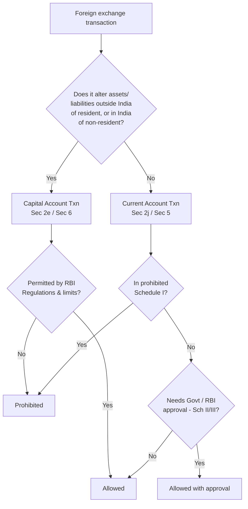

# Q&A — Foreign Exchange Management Act 1999 (Basics)

> Scope: Preliminary, key definitions, and the current-account/capital-account architecture of FEMA, 1999 as relevant to CA Intermediate "Corporate & Other Laws". Cite sections as written; no invented provisions.

---

## Section A — Concept-Check Questions (with answers)

**A1. Why was FERA, 1973 replaced by FEMA, 1999?**
FERA was a *control* and prohibition-based law framed for a foreign-exchange-scarce economy, with criminal liability and reversed burden of proof. Post-1991 liberalisation, India moved to a *management* regime. FEMA's Preamble states its object: "to consolidate and amend the law relating to foreign exchange with the objective of facilitating external trade and payments and for promoting the orderly development and maintenance of foreign exchange market in India." The shift is from *regulation of scarcity* to *facilitation of trade*, and from criminal to civil (monetary) liability.

**A2. State the extent and applicability of FEMA (Section 1).**
FEMA extends to the whole of India (Section 1(2)). It also applies to all branches, offices and agencies **outside India** owned or controlled by a person resident in India, and to any contravention committed outside India by any person to whom the Act applies (Section 1(3)). It came into force on 1 June 2000.

**A3. Distinguish "Capital Account Transaction" from "Current Account Transaction".**
- **Capital account transaction** [Section 2(e)]: a transaction which alters the assets or liabilities, including contingent liabilities, **outside India** of persons resident in India, or **in India** of persons resident outside India; it includes transactions referred to in Section 6(3).
- **Current account transaction** [Section 2(j)]: a transaction other than a capital account transaction. It is defined **inclusively** — payments due in connection with foreign trade, other current business, services, short-term banking/credit facilities in the ordinary course; interest on loans and net income from investments; remittances for living expenses of parents, spouse and children abroad; and expenses for foreign travel, education and medical care of parents, spouse and children.
- **Golden rule:** current-account transactions are **generally permitted** (freely allowed unless restricted); capital-account transactions are **generally prohibited** unless permitted. This is the reverse-mirror logic of FEMA.

**A4. Define "person resident in India" (Section 2(v)) in brief.**
Broadly, a person residing in India for **more than 182 days during the preceding financial year** — but *excluding* one who has gone out of / stays outside India for employment, business or an uncertain-period stay, and *including* one who has come to / stays in India for such purposes. It also covers any person or body corporate registered/incorporated in India, an office/branch/agency in India owned or controlled by a person resident outside India, and an office/branch/agency outside India owned or controlled by a person resident in India.

**A5. What is "foreign exchange" and "foreign security"?**
- **Foreign exchange** [Section 2(n)]: foreign currency and includes (i) deposits, credits and balances payable in any foreign currency; (ii) drafts, travellers' cheques, letters of credit or bills of exchange expressed or drawn in Indian currency but payable in foreign currency; and (iii) drafts, travellers' cheques, letters of credit or bills of exchange drawn by banks/institutions/persons outside India but payable in Indian currency.
- **Foreign security** [Section 2(o)]: any security in the form of shares, stocks, bonds, debentures or any other instrument denominated or expressed in foreign currency, including securities expressed in foreign currency but where redemption or interest is payable in Indian currency.

**A6. Which authority administers FEMA, and who is the "Authorised Person"?**
The **Reserve Bank of India (RBI)** administers FEMA and frames Regulations. An **Authorised Person** [Section 2(c)] is an authorised dealer, money changer, off-shore banking unit or any other person authorised under **Section 10(1)** to deal in foreign exchange or foreign securities. Enforcement of contraventions rests with the **Directorate of Enforcement (Section 36)**.

---

## Section B — Applied Scenario Questions (with reasoned answers)

**B1.** *Mr. A, an Indian citizen, left India on 15 June 2024 to take up employment in Dubai. On 10 August 2024 he needs to be classified for a FEMA transaction. Is he "resident in India"?*

**Answer.** Residential status under FEMA is **purpose-driven**, not merely day-count based. Under Section 2(v), a person who has **gone out of India for taking up employment outside India** is *excluded* from "person resident in India" — irrespective of the 182-day test — from the very date of departure. Since Mr. A left on 15 June 2024 to take up employment abroad, he becomes a **person resident outside India** from 15 June 2024. Therefore on 10 August 2024 he is **non-resident** under FEMA.

**B2.** *An Indian company wants to remit USD 50,000 for its Managing Director's business travel and USD 2,50,000 to acquire equity shares of a company in the USA. Classify each transaction and state the regulatory route.*

**Answer.**
- **Business travel remittance** — this is a **current account transaction** (payment in connection with current business/foreign travel). It is *generally permitted* under Section 5, subject to the Current Account Transaction Rules (i.e., is it in the prohibited Schedule I, or restricted Schedule II/III). Business travel is freely allowed.
- **Acquisition of foreign equity shares** — this **alters the assets outside India** of a person resident in India, hence a **capital account transaction** [Section 2(e), overseas direct investment]. It is permitted **only** to the extent allowed under Section 6 read with RBI Regulations (Overseas Investment framework). It is *generally prohibited unless permitted*, so it must fall within the permissible limits/route.

**B3.** *Section 4 states "no person resident in India shall acquire, hold, own, possess or transfer any foreign exchange, foreign security or any immovable property situated outside India." Mr. B, resident in India, inherited a house in London from his father who was resident outside India. Is this a contravention?*

**Answer.** No. The prohibition in Section 4 is subject to the words "**save as otherwise provided in this Act**." Section 6(4) permits a person resident in India to **hold, own, transfer or invest in foreign currency, foreign security or immovable property situated outside India if such** asset was acquired, held or owned when he was resident outside India **or inherited from a person who was resident outside India**. Since Mr. B inherited the London house from a person resident outside India, he may lawfully hold it. No contravention arises.

**B4.** *X Ltd. remitted foreign exchange declaring it was for import of machinery, but the machinery was never brought into India. What is the consequence under FEMA?*

**Answer.** Section 10(6) obliges any person acquiring foreign exchange for a declared purpose to use it **only for that purpose**, or return it to an authorised person if it cannot be so used. Section 8 further requires reasonable steps to realise and repatriate foreign exchange due. Non-use/non-import makes the remittance a **contravention** under Section 13, attracting a penalty up to **thrice the sum involved** where quantifiable (or up to Rs. 2 lakh where not), and Rs. 5,000 per day for continuing default. It is a **civil** contravention, not a crime (unlike FERA).

**B5.** *A non-resident wishes to open a branch office in India to carry on trading business. Under which limb of "person resident in India" and which section does approval flow?*

**Answer.** An office/branch/agency **in India** owned or controlled by a person resident outside India is itself a **person resident in India** [Section 2(v)(iii)]. However, establishment of a branch/office in India by a person resident outside India, and its activities, are **capital account transactions** governed by Section 6(3)(g)–(h) read with RBI's Establishment of Branch/Office Regulations. Approval therefore flows through the **RBI route** (and, for certain sectors, prior Government approval).

---

## Section C — Past-Paper-Style Descriptive Questions (with model answers)

**C1. "FEMA marks a paradigm shift from FERA." Explain the key structural differences. (5 marks)**

**Model Answer.**
| Basis | FERA, 1973 | FEMA, 1999 |
|---|---|---|
| Object | Conserve/regulate scarce forex (control) | Facilitate external trade; manage forex (facilitation) |
| Nature of offence | Criminal — imprisonment | Civil — monetary penalty |
| Burden of proof | On the accused (presumption of guilt) | On the enforcement authority |
| Presumption | Everything prohibited unless permitted | Current-account free; capital-account restricted only |
| Arrest/Prosecution | Wide powers of arrest | Arrest only on **wilful non-payment** of penalty (Section 14) |
| Drafting | Negative, prohibitory | Positive, enabling |

FEMA thus decriminalises forex management, narrows the State's role to *management* of the forex market, and aligns Indian law with a liberalised, convertible-current-account economy.

**C2. Explain the scheme of Sections 3 to 9 of FEMA. (6 marks)**

**Model Answer.**
- **Section 3** — Dealing in foreign exchange is prohibited *except through an authorised person*; bars unauthorised payments to/for the credit of non-residents (this is the anti-*hawala* provision).
- **Section 4** — Bars holding, owning or transferring foreign exchange, foreign security or immovable property outside India, save as provided in the Act.
- **Section 5** — Permits **current account transactions**; Central Government may, in public interest and in consultation with RBI, impose reasonable restrictions.
- **Section 6** — Governs **capital account transactions**; RBI (in consultation with Government) may specify permissible classes and limits; Section 6(3) lists categories; Section 6(4)/(5) protect legacy assets held abroad/in India.
- **Section 7** — **Export of goods and services**: exporter must furnish true declarations of full export value.
- **Section 8** — Duty to **realise and repatriate** foreign exchange due to India within the prescribed period.
- **Section 9** — Exemptions from realisation and repatriation (e.g., forex up to prescribed limits, foreign currency accounts held with RBI's permission).

**C3. Discuss the powers of RBI and Central Government to make rules/regulations under FEMA. (4 marks)**

**Model Answer.**
FEMA distributes delegated legislation between two authorities:
- **Central Government** frames **Rules** — e.g., the **Foreign Exchange Management (Current Account Transactions) Rules, 2000** under Section 5 read with Section 46, classifying current-account transactions into Schedule I (prohibited), Schedule II (Government approval) and Schedule III (RBI/limit-based).
- **RBI** frames **Regulations** under Section 47 for capital account transactions (Section 6), export/import of currency, realisation and repatriation, and the like.
This dual structure keeps **policy** (current-account convertibility, prohibitions) with the Government and **operational/market management** (capital account, dealer authorisation) with the RBI.

---

## Section D — MCQs / Case Scenarios (correct option + reasoning)

**D1.** FEMA, 1999 came into force on:
(a) 1 January 2000 (b) **1 June 2000** (c) 1 April 2000 (d) 29 December 1999
**Ans: (b)** — Enforced 1 June 2000, though enacted 29 Dec 1999.

**D2.** A transaction which alters assets or liabilities outside India of a resident is a:
(a) Current account transaction (b) **Capital account transaction** (c) Exempt transaction (d) Prohibited transaction
**Ans: (b)** — Matches Section 2(e).

**D3.** Under FEMA, "person resident in India" primarily depends on residence for more than ____ days in the preceding financial year:
(a) 90 (b) 120 (c) **182** (d) 365
**Ans: (c)** — Section 2(v), subject to the purpose test.

**D4.** Dealing in foreign exchange other than through an authorised person is barred by:
(a) Section 4 (b) **Section 3** (c) Section 6 (d) Section 8
**Ans: (b)** — Section 3 is the anti-hawala provision.

**D5.** Penalty under Section 13 where the amount is quantifiable may extend up to:
(a) Twice the sum (b) **Thrice the sum** involved (c) Equal to the sum (d) Five times the sum
**Ans: (b)** — Up to thrice; plus Rs. 5,000/day for continuing contravention.

**D6.** *Case scenario:* Mrs. R, resident in India, remits USD 4,000 for her son's tuition fees in Canada. This is:
(a) Capital account, prohibited (b) **Current account, generally permitted** (c) Capital account, RBI approval (d) Prohibited under Section 4
**Ans: (b)** — Education expense of a child is expressly within the inclusive definition of current account transaction [Section 2(j)].

**D7.** Enforcement of FEMA contraventions is entrusted to:
(a) SEBI (b) CBI (c) **Directorate of Enforcement** (d) Serious Fraud Investigation Office
**Ans: (c)** — Section 36 provides for the Directorate of Enforcement.

**D8.** Which authority frames Regulations for capital account transactions?
(a) SEBI (b) Central Government (c) **RBI** (d) Ministry of Commerce
**Ans: (c)** — RBI under Section 6 read with Section 47.

---

## Mermaid — FEMA Transaction Classification Logic

*Reading the diagram:* the **default** for current-account is "Allowed" (bottom-right), the **default** for capital-account is "Prohibited" — the reverse-mirror rule that examiners test.

---

## Traps & Examiner Tricks (rapid-fire Q&A)

- **Trap:** "Residential status = 182 days only." **Reality:** The **purpose test overrides** the day count — departure for employment/business makes one non-resident immediately (B1).
- **Trap:** "All capital account transactions are prohibited." **Reality:** They are prohibited *unless permitted* by RBI; legacy assets under Section 6(4)/(5) are protected (B3).
- **Trap:** "FEMA offences lead to imprisonment." **Reality:** FEMA imposes **civil monetary penalty**; imprisonment (Section 14) arises **only** on wilful non-payment of the penalty.
- **Trap:** Confusing rule-maker: **Current account = Central Government Rules (Sec 5/46)**; **Capital account = RBI Regulations (Sec 6/47)**.
- **Trap:** "Foreign exchange means only foreign currency." **Reality:** It **includes** instruments drawn in Indian currency but payable in foreign currency, and vice versa [Section 2(n)].

---

## Quick-Revision Sheet

- **Preamble object:** facilitate external trade & payments; orderly development of forex market.
- **Sec 1:** whole of India + branches/offices abroad of residents; in force 1 June 2000.
- **Sec 2:** (c) authorised person, (e) capital account, (j) current account, (n) foreign exchange, (o) foreign security, (v) person resident in India.
- **Sec 3:** no dealing except via authorised person (anti-hawala).
- **Sec 4:** no holding forex/security/property abroad, save as provided.
- **Sec 5:** current account — free (Govt may restrict via Rules).
- **Sec 6:** capital account — RBI-regulated; 6(4)/(5) legacy-asset protection.
- **Sec 7–9:** export declaration; realise & repatriate; exemptions.
- **Sec 10:** authorised persons & their duties (10(6) purpose-restriction).
- **Sec 13–14:** penalty up to thrice the sum (or Rs. 2 lakh); Rs. 5,000/day; civil, not criminal.
- **Sec 36–37:** Directorate of Enforcement.
- **Golden rule:** *Current account free, capital account restricted.*
