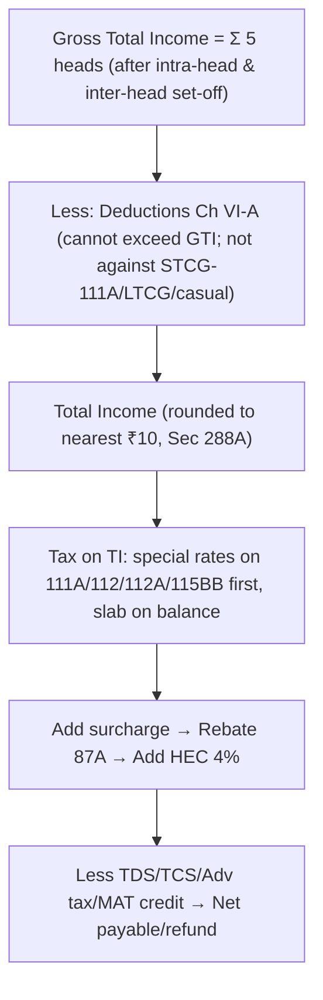
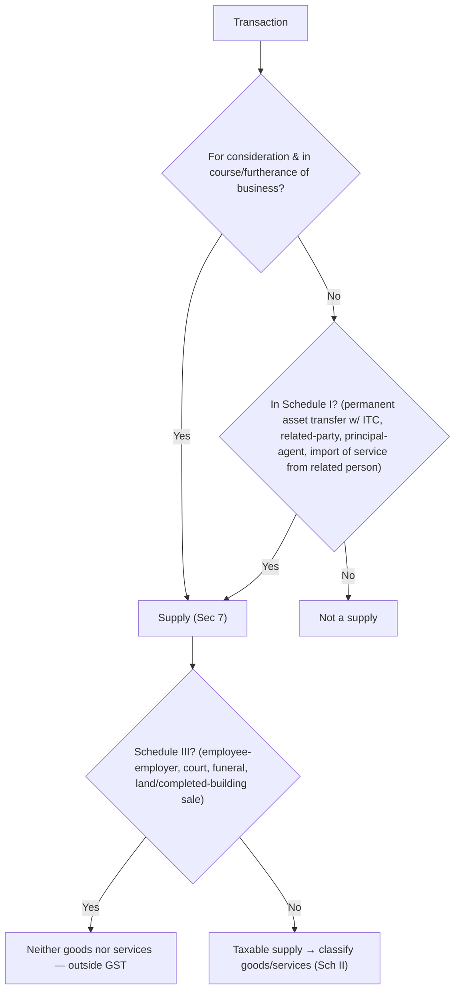

# Taxation (Income Tax & GST) — Quick-Revision Cheat-Sheet

> **CA Intermediate — last-mile scan.** Terse, understanding-first. **⚠ All rates/limits/slabs are AY-specific — verify against current ICAI Study Material / Finance Act applicable to your attempt.** Default framing below is the *current* AY under the Finance Act in force; treat every ₹ figure as "confirm before exam."

---

## PART A — INCOME TAX

### A1. The Master Flow (why order matters)

**Residential status drives scope (Sec 5–6).** ROR: global income. RNOR & NR: Indian-source + received-in-India; NR excludes foreign business controlled from abroad. Basic conditions Sec 6(1): 182 days OR 60+365(prev 4 yrs). RNOR test Sec 6(6): NR in 9/10 PY **or** ≤729 days in 7 PY.

### A2. Five Heads — computation skeletons

**1. Salary (Sec 15–17)**
| Item | Rule |
|---|---|
| Basis | Due **or** receipt, whichever earlier |
| Std deduction 16(ia) | Fixed ₹ cap (regime-dependent — verify) |
| Entertainment 16(ii) | Govt employees only: least of ⅕ salary / stated cap / actual |
| Prof tax 16(iii) | Actual paid |
| HRA 10(13A) | Least of: actual HRA / rent−10% salary / 50%(metro) or 40% salary |
| Gratuity 10(10) | Govt exempt; covered Act: least of 15/26×last sal×yrs, cap, actual |
| Perquisites 17(2) | RFA, car, ESOP, interest-free loan (SBI rate), etc. |

**2. House Property (Sec 22–27)** — taxed on *annual value*, not receipt.
- GAV = higher of (Expected rent = higher of MV/FR, capped at SR) vs Actual rent; if vacancy loss, actual may be lower.
- NAV = GAV − Municipal tax **paid by owner**.
- Deductions **30% std (24a)** on NAV + **Interest 24(b)**: let-out full; **self-occupied cap ₹2,00,000** (₹30k if not fulfilling conditions). Pre-construction interest: 1/5th over 5 yrs.
- Loss from HP set-off vs other heads capped **₹2,00,000/yr**; balance c/f 8 yrs (only vs HP).

**3. PGBP (Sec 28–44)** — start from book profit, then adjust.
- Disallow: 40(a) TDS defaults, 40A(3) cash >₹10,000/day, 40A(2) related-party excess, 43B (pay-before-due-date items: tax, interest to bank/**NBFC**, PF, leave, bonus, MSME 43B(h)).
- Depreciation 32: **block of assets, WDV, half-rate if used <180 days**; additional depr 20% on new P&M.
- Presumptive: **44AD** 8%/6% (turnover ≤ threshold), **44ADA** 50% (professionals), **44AE** per-vehicle.

**4. Capital Gains (Sec 45–55)**
| | STCG | LTCG |
|---|---|---|
| Holding | ≤ threshold | > threshold |
| Listed equity/eq-MF | ≤12m | >12m |
| Immovable/unlisted | ≤24m | >24m |
| Other | ≤36m | >36m |
- **Full value − (cost + improvement + transfer exp)**; LTCG indexation (CII) where allowed (verify post-amendment position; equity 112A no index).
- **Rates:** 111A STCG (STT equity) & 112A LTCG equity (exempt up to threshold) — **verify AY rate**; 112 other LTCG.
- Exemptions: **54** (residential→residential), **54F** (any LTA→house), **54EC** (bonds NHAI/REC, ₹50L cap, 6m), **54B** (agri land). CG deposit scheme if not reinvested by due date.

**5. Other Sources (Sec 56–59)** — residual.
- 56(2)(x): gifts >₹50,000 aggregate taxable (relatives/marriage/will exempt). Dividends taxable; casual income (lottery) **115BB flat rate, no deduction, no basic exemption benefit**. Interest, family pension (std ded 1/3 or cap).

### A3. Clubbing & Set-off — the trap zone
- **Clubbing (60–64):** spouse remuneration (no tech qual), transfer w/o adequate consideration, minor child income (exempt ₹1,500/child, clubbed with higher-income parent), revocable transfer, 64(2) HUF conversion.
- **Set-off order:** intra-head → inter-head → carry forward.

| Loss | Set-off vs | C/F yrs | On C/F, only vs |
|---|---|---|---|
| House property | any head (cap ₹2L) | 8 | HP |
| Non-spec business | any except salary | 8 | business |
| Speculation | speculation only | 4 | speculation |
| STCL | STCG or LTCG | 8 | CG |
| LTCL | **LTCG only** | 8 | LTCG |
| Sec 35AD | 35AD only | ∞ | 35AD |
| Owning/maint. racehorses | same only | 4 | same |
- **Return-filing (139(1)) mandatory to c/f** business/CG/spec losses (HP loss exempt from this rule).

### A4. Deductions Ch VI-A (only vs GTI, not special-rate income)
| Sec | Item (verify caps/regime availability) |
|---|---|
| 80C | LIC, PF, PPF, ELSS, tuition, principal repay — ₹1,50,000 |
| 80CCC / 80CCD(1) | Pension fund / NPS employee — within 80CCE ₹1.5L |
| 80CCD(1B) | NPS extra **₹50,000** (over & above 1.5L) |
| 80CCD(2) | Employer NPS — % of salary, **outside** 1.5L; allowed even in new regime |
| 80D | Medical insurance ₹25k (₹50k senior) + preventive ₹5k |
| 80DD/80U | Disability — fixed ₹75k / ₹1.25L |
| 80DDB | Specified disease — capped |
| 80E | Education loan **interest**, no cap, 8 yrs |
| 80EEA/80EEB | Housing / EV loan interest (conditions) |
| 80G | Donations 50%/100%, some with 10%-of-AGTI ceiling |
| 80GG | Rent (no HRA) — least of ₹5,000/m, 25% TI, rent−10%TI |
| 80TTA / 80TTB | Savings int ₹10k / senior ₹50k (all interest) |

> **New regime 115BAC (default):** lower slabs, **most Ch VI-A & exemptions disallowed** (80CCD(2), std deduction retained; verify list). Old regime by opt-out — compare before choosing.

### A5. Rebate, Surcharge, Advance Tax, TDS
- **87A rebate** — resident individual, TI ≤ threshold (higher & marginal relief under new regime — **verify AY**).
- **Surcharge slabs** on income >₹50L/1cr/2cr/5cr (+ marginal relief); capped rate on 111A/112A/dividend.
- **Advance tax:** liability ≥₹10,000; 15/45/75/100% by 15 Jun/Sep/Dec/Mar (234C); 234A late filing, 234B <90% paid.
- **TDS quick:** 194A interest, 194C contractor (1%/2%), 194H commission, 194I rent (2%/10%), 194J prof/tech (2%/10%), 194Q purchase >₹50L, 194IA immovable ≥₹50L (1%). Thresholds AY-specific.

---

## PART B — GST

### B1. Is it a supply? (Sec 7 + Sch I/II/III)

- **Composite supply:** naturally bundled → rate of **principal** supply. **Mixed supply:** not natural → **highest** rate.

### B2. Charge & RCM (Sec 9 CGST / 5 IGST)
- Forward charge default. **RCM = recipient pays** (must be registered; ITC available if eligible; self-invoice + pay in cash, cannot use ITC to discharge RCM).
- Common RCM: GTA, legal (advocate), director services, sponsorship, import of service, govt services (some), specified goods (cashew, tobacco leaves, etc.).
- **9(5)/ECO:** e-commerce operator pays for notified services (passenger transport, accommodation, restaurant-via-app).

### B3. Time of Supply (Sec 12/13)
| | Goods (12) | Services (13) |
|---|---|---|
| Forward | Earlier of invoice (or due date u/s 31) **or** payment* | Earlier of invoice (if within 30d) **or** payment*; else completion |
| RCM | Earlier of receipt of goods / payment / 30d from invoice | Earlier of payment / **60d** from invoice |
> *For **goods**, advance is **not** taxed (TOS = invoice); advances taxable only for **services**.

### B4. Value of Supply (Sec 15)
- **Transaction value** when supplier & recipient **unrelated + price sole consideration**.
- **Include:** taxes (other than GST), incidental exp, packing, commission, interest/late fee for delay, subsidies (non-govt), reimbursements not as pure agent.
- **Exclude:** GST itself; discounts — **pre-supply** (on invoice) always; **post-supply** only if agreed pre-supply + linked to invoice + recipient reverses ITC.

### B5. Input Tax Credit — the 4 gates (Sec 16)
1. **Possession** of tax invoice/debit note.
2. **Receipt** of goods/services (bill-to-ship-to deemed receipt).
3. Tax **actually paid** to govt by supplier; **invoice appears in GSTR-2B** (16(2)(aa)) & 38.
4. **Return filed** (GSTR-3B).
- **Pay supplier within 180 days** else reverse ITC (re-avail on payment).
- **Time limit:** earlier of 30 Nov following FY or annual return.
- **Blocked ITC (Sec 17(5)):** motor vehicles (≤13 seats, exceptions), food/beverage/health/club, works contract & construction of immovable (own account), personal consumption, goods lost/stolen/gifted/free samples, CSR (verify), tax paid u/s 74 (verify).
- **17(2) reversal:** common credits apportioned exempt vs taxable (Rule 42/43).

### B6. Registration (Sec 22–25)
| Trigger | Threshold (verify AY/state) |
|---|---|
| Goods (normal states) | ₹40 lakh |
| Goods (special-category states) | ₹20 lakh |
| Services | ₹20 lakh (₹10 lakh special) |
- **Compulsory (Sec 24) — no threshold:** inter-state supply of goods, casual/non-resident taxable person, RCM liability, ECO & suppliers via ECO, agents, ISD, TDS/TCS deductors.
- **Composition (Sec 10):** turnover ≤ ₹1.5 cr (₹75L special); rates **1%** trader/manufacturer, **5%** restaurant, **6%** services (≤₹50L). **No ITC, no inter-state outward, no tax collection on invoice, bill of supply.** Reg within 30 days of becoming liable.

### B7. Place of Supply (quick logic)
- **Goods (IGST 10/11):** location where movement terminates for delivery; no movement → location at delivery time.
- **Services default (12/13):** B2B → recipient's location; B2C → supplier's (if address unavailable). Special: immovable property → property location; events, restaurant, transport → performance/where done.
- **Nature:** supplier & PoS same state → **CGST+SGST**; different states / export-import → **IGST**.

### B8. Returns & Payments (snapshot)
- **GSTR-1** (outward, 11th/quarterly QRMP), **GSTR-3B** (summary + pay, 20th/22-24th), **2B** auto ITC statement, **9** annual, **9C** reconciliation (turnover > threshold).
- **E-invoice** above turnover limit; **E-way bill** consignment >₹50,000.
- **Interest** 18% on delayed tax (on net cash portion), 24% on excess/undue ITC. **Electronic cash vs credit ledger** — RCM & interest/penalty from **cash** only.

---

### One-line memory hooks
- **IT order:** heads → set-off → Ch VI-A → special-rate tax → surcharge → 87A → HEC → prepaid taxes.
- **ITC:** *Invoice, Receipt, Paid-to-govt (2B), Return* + pay in 180d.
- **RCM:** recipient registered, cash payment, self-invoice, no advance issue for goods.
- **Supply test:** consideration+business → Sch I override → Sch III exclusion → composite(principal)/mixed(highest).
- **Set-off:** LTCL only↔LTCG; speculation↔speculation; HP loss cap ₹2L then only↔HP.

> **⚠ Final reminder:** every slab, surcharge %, rebate ceiling, threshold and holding period above is **AY/Finance-Act specific**. Cross-check with the ICAI material for your exact attempt before relying on any number.
