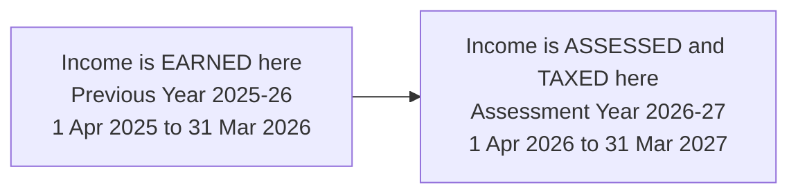
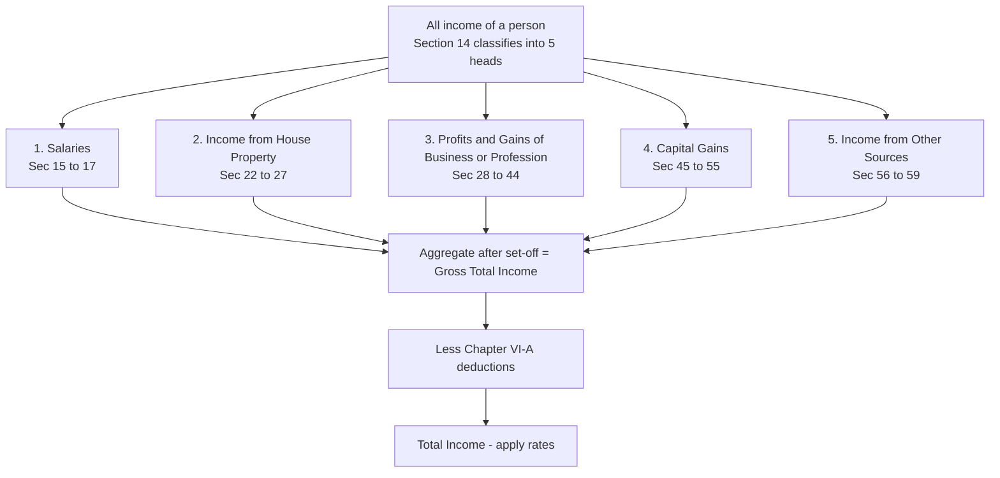
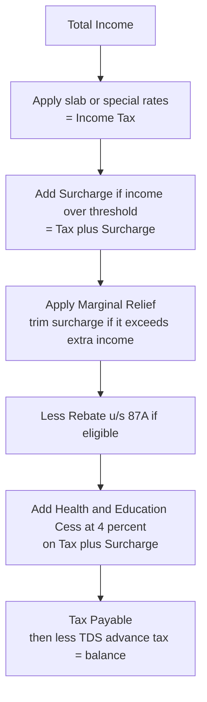
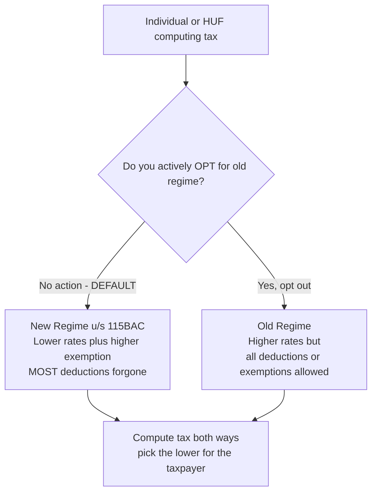

# Chapter 01 — Basic Concepts of Income Tax

> **Applicable-AY flag:** This chapter teaches the *structure and logic* that almost never change. The *numbers* (slab rates, surcharge thresholds, rebate ceilings, cess rate) DO change with every Finance Act. The figures used below are drawn from recent Finance Acts and are illustrative of the mechanism. **Before your attempt, verify the exact rates, limits, and the applicable Assessment Year in the current ICAI Study Material / RTP for your exam sitting.** If you learn *why* a slab or surcharge exists, plugging in the year's actual number is trivial.

---

## 1. The Problem — why does an income tax exist at all, and why is it so complicated?

A government must pay for things nobody buys individually: national defence, courts, highways, public health, the tax administration itself. It needs a steady, large, recurring pool of money. Where does it come from?

Three broad options exist:

1. **Tax what people *own*** (wealth tax, property tax) — but wealth is hard to value every year and taxing a static stock discourages saving.
2. **Tax what people *spend*** (GST, customs) — good, but it hits the poor proportionally harder because they spend nearly all they earn.
3. **Tax what people *earn*** — income. This is the sweet spot: income is a *flow* that recurs every year, it can be measured reasonably objectively, and — critically — it can be made to rise *more than proportionally* with the earner's capacity to pay.

That last point is the entire moral engine of an income tax. A person earning ₹5,00,000 and a person earning ₹5,00,00,000 both need food and shelter; the second person's *surplus* capacity to contribute is vastly larger. So the state says: **tax should rise with ability to pay** — the principle of *progressivity*. This single idea forces almost every structural feature you are about to learn (slabs, surcharge, rebate, exemption limit).

But now three hard sub-problems appear, and the Income-tax Act, 1961 is essentially a giant machine built to answer them:

- **WHO do we tax?** (Every human? Companies? Foreigners? Trusts?) → gives us *person*, *assessee*, *residential status*.
- **WHAT exactly is "income"?** (Salary obviously — but a lottery win? A gift? A capital gain? Agricultural produce?) → gives us the *definition of income* and the *5 heads*.
- **WHEN and HOW MUCH?** (Earned continuously — when do we cut the year and compute? At what rate?) → gives us *previous year vs assessment year*, *charge of tax (Sec 4)*, *rates/surcharge/cess*.

Everything in this chapter is one of those three questions being answered.

---

## 2. The Core Idea

> **Income tax = a progressive, annual charge on the total income of a "person," computed by first classifying income into heads, aggregating it for a defined "previous year," and taxing it in the following "assessment year" at rates that climb with ability to pay.**

Read that sentence again — it contains, in order, every keyword of the chapter:

- *progressive* → slabs, surcharge, marginal relief
- *annual* → previous year / assessment year split
- *person* → the taxable unit
- *total income* → the aggregate after heads + set-off + deductions
- *classifying into heads* → the 5 heads and why
- *charge* → Section 4, the switch that turns the machine on
- *rates that climb* → the rate schedule, regimes (old vs new / Sec 115BAC)

The Act is not a random pile of sections. It is a **pipeline**:

*Person → determine residential status → identify income under each of 5 heads → aggregate (Gross Total Income) → subtract Chapter VI-A deductions → Total Income → apply rate schedule → add surcharge → subtract rebate → add cess → Tax Payable.*

Hold that pipeline in your head. Every later chapter is a zoom-in on one pipe segment.

---

## 3. Why it's built this way

**Why an *Act* and not just a rate card?** Because "income" is slippery. Tax the naive way ("pay 20% of what you earn") and every taxpayer will argue their receipt isn't income, or is income of a different year, or of a different person. The Act exists to **remove discretion and disputes** by defining terms precisely, fixing timing rules, and prescribing computation for each type of income. Complexity is the price of *fairness + certainty*.

**Why classify income into heads instead of one big pot?** Because *different kinds of income behave differently* and deserve different rules:

- A salary is a near-certain periodic receipt with almost no expenses — so it's taxed on a near-gross basis with a flat standard deduction.
- A business income is volatile and needs you to spend money (rent, salaries, raw material) to earn it — so it's taxed on *net profit* after allowing those expenses.
- A capital gain is a *one-time* accretion on an asset held for years — taxing it at full slab rates in the year of sale would be brutally unfair (the gain accrued over many years but lands in one), so it gets *special rates* and indexation logic.

If you dumped all these into one formula you couldn't give each the deduction/rate logic it deserves. **Heads = specialised sub-machines, each with its own computation.** (Detailed in §4.)

**Why a separate "previous year" and "assessment year"?** Because income is earned *over* a year, but you can only *know* the full year's income *after* the year ends. You cannot assess income that hasn't finished happening. So the law fixes: earn in Year 1 (previous year), declare-and-assess in Year 2 (assessment year). More on the elegance of this in §4.

**Why progressive rates + surcharge + rebate?** Ability-to-pay. But pure progressivity creates edge-effects (a rupee more of income pushing you into a higher bracket could cost more than a rupee of tax) — hence *marginal relief* and *slab-wise* (not flat) taxation. Each corrective exists to smooth an unfairness the previous rule created.

---

## 4. Full Technical Content — every provision, wrapped in its reason

### 4.1 The taxable unit — "Person" [Sec 2(31)] and "Assessee" [Sec 2(7)]

**The problem:** "Tax people" is too narrow — a company is not a "person" in ordinary English, yet it clearly earns and must be taxed. A partnership firm, a temple trust, a club, the local municipality — all handle money. The law needs a *bucket wide enough to catch every money-handling entity*.

**Sec 2(31) — "Person" includes SEVEN categories:**

| # | Category | Memory hook / why separate |
|---|----------|----------------------------|
| 1 | **I**ndividual | A natural human being |
| 2 | **H**UF (Hindu Undivided Family) | A uniquely Indian joint-family entity — taxed separately from its members |
| 3 | **C**ompany | Separate legal person; different rate structure |
| 4 | **F**irm (incl. LLP) | Partnership as a unit |
| 5 | **A**OP / **B**OI (Association of Persons / Body of Individuals) | People who band together for a common income-earning purpose but aren't a firm |
| 6 | **L**ocal authority | Municipality, panchayat, cantonment board |
| 7 | **A**JP (Artificial Juridical Person) | Catch-all for entities that fit none above — e.g., a deity, a university, an idol |

> **Memory hook:** "**I HFC A B — LA, AJP**" or simply remember the sweep: *humans → families → companies → firms → groups → government bodies → everything-else*. The 7th category (AJP) exists precisely so **nothing escapes**.

**Sec 2(7) — "Assessee":** a person *by whom any tax or any other sum (interest, penalty) is payable*, OR against whom any proceeding has been taken, OR who is deemed to be an assessee, OR an assessee-in-default (e.g., an employer who failed to deduct TDS). 

> **Why the distinction between "person" and "assessee"?** *Person* is the universe of potential taxpayers (a definitional category). *Assessee* is a person who has actually entered the tax machinery — owes something or is under proceedings. Every assessee is a person; not every person is an assessee in a given year.

**Representative assessee & deemed assessee:** where the real earner can't be taxed directly (a minor, a non-resident, a deceased person's estate), the law taxes a *representative* (guardian, agent, legal heir) so the income doesn't slip through. Reason: **collect from someone who can actually pay/answer.**

### 4.2 "Income" [Sec 2(24)] — an *inclusive*, not exhaustive, definition

**The problem:** if the law lists income exhaustively, the first clever taxpayer invents a receipt not on the list and pays nothing. So Sec 2(24) says income "**includes**" — an open-ended list that can stretch.

Key inclusions worth knowing (each is there because it was once argued *not* to be income):

- profits and gains of business/profession;
- dividends;
- **voluntary contributions** received by a charitable trust (else trusts would claim donations aren't income);
- the value of **perquisites / profits in lieu of salary**;
- any **capital gains** chargeable u/s 45;
- **winnings** from lotteries, crosswords, races, card games, gambling, betting (taxed at a flat high rate — see §4.7);
- any sum received under a **Keyman insurance policy**;
- **gifts** — money/property received without consideration exceeding the threshold u/s 56(2)(x).

**Core characteristics of income (conceptual tests examiners love):**

1. **Regular or one-time — both can be income.** Salary recurs; a lottery win is once — both taxed.
2. **Cash or kind.** A rent-free flat (perquisite) is income though no cash changes hands.
3. **Legal or illegal source is irrelevant.** Smuggling profits are still income — the taxman doesn't bless the source, he taxes the gain.
4. **Temporary or permanent — irrelevant.**
5. **Received or accrued — either triggers tax** (see PY discussion).
6. **Application vs diversion of income:** if income is diverted *before it reaches you* by an overriding legal obligation (diversion at source by *overriding title*) it's not your income; if it reaches you and you then *spend/apply* it toward an obligation, it *is* your income first, then spent. (A recurring exam trap — see §8.)
7. **Income must come from *outside*** — you cannot earn taxable income by trading with yourself (mutuality).

> **Reason for the inclusive definition:** the state wants a *net* wide enough to catch tomorrow's cleverness, not just today's known receipts.

### 4.3 Gross Total Income vs Total Income [Sec 2(45), Sec 80B(5)] — and why two levels

- **Gross Total Income (GTI)** = sum of income under all 5 heads *after* intra/inter-head set-off, but *before* Chapter VI-A deductions.
- **Total Income (TI)** = GTI **minus** deductions under Chapter VI-A (80C, 80D, 80G, etc.). This is the figure on which tax is finally computed.

**Why two levels?** Because the *heads* answer "what did you earn?" while *Chapter VI-A* answers "what socially-desirable things did you do with it (save, insure, donate, repay an education loan)?" The state first measures your economic income (GTI), then rewards chosen behaviours with deductions to arrive at the amount it will actually tax (TI). Keeping them separate keeps *measurement* and *policy incentive* cleanly distinguishable.

### 4.4 Previous Year [Sec 3] and Assessment Year [Sec 2(9)] — WHY two years

**Assessment Year (AY) [Sec 2(9)]:** the period of 12 months commencing on **1st April** every year, in which income of the previous year is *assessed to tax*.

**Previous Year (PY) [Sec 3]:** the financial year (1 April – 31 March) *immediately preceding* the assessment year — the year in which the income is actually *earned*.

So income earned in **PY 2025-26 (1 Apr 2025 – 31 Mar 2026)** is taxed in **AY 2026-27 (1 Apr 2026 – 31 Mar 2027)**.

> **Why can't earning-year and tax-year be the same?** You can't compute a full year's income until the year is over. Salary of March, business profit of the last quarter, a capital gain on 31 March — all belong to the year and must be counted. Assessing *during* the year would mean guessing. So: **earn fully first (PY), then declare-and-assess (AY).** The one-year lag is the price of accuracy.


*Figure 4.4 — The one-year lag: you finish earning, then you compute and pay. PY is always the FY immediately before the AY.*

**Uniform PY for everyone [Sec 3]:** every taxpayer's PY is the *financial year* (Apr–Mar), regardless of when they keep their books. Reason: a single national tax calendar makes filing, TDS, and administration uniform — no chaos of a million different accounting periods.

**Exceptions — when income of a PY is taxed *in the same year* (why the lag is dropped):** if the state waited a full year, the money might vanish (person leaving India, a one-off venture, a body about to dissolve). The Act therefore taxes *immediately* in five situations:

| Sec | Situation | Why taxed in same year |
|-----|-----------|------------------------|
| 172 | Non-resident's **shipping** business | Ship may sail away; collect before it leaves |
| 174 | Persons **leaving India** likely permanently | May not return to be assessed next year |
| 174A | **AOP/BOI/AJP formed for a particular event/purpose**, likely to dissolve | Entity may cease to exist by next AY |
| 175 | Person likely to **transfer assets to avoid tax** | Prevent asset-stripping before assessment |
| 176 | **Discontinued business** | Business gone; assess the final stretch now |

> **Memory hook — "Ships Leaving Are Transferring & Discontinuing" (172, 174, 174A, 175, 176).** All five share one logic: *the taxpayer or the income might not be around next year, so tax now.*

### 4.5 Charge of Income Tax [Sec 4] — the master switch

**The problem:** you can define income, persons, and years perfectly, but *nothing is taxable until a law says "charge it."* Sec 4 is that command.

**Sec 4(1)** — where any Central Act (the annual Finance Act) enacts that income tax shall be charged for any assessment year at the specified rate(s), tax shall be charged **for that AY** on the **total income of the previous year** of every person, at those rates.

Unpack the four things Sec 4 stitches together (notice it *references everything above*):

1. **Charge is created by the annual Finance Act** — that's *why* rates change yearly and *why* you must verify the AY's rates. The Income-tax Act provides the *machinery*; the Finance Act provides the *rate*.
2. **Charged for the assessment year** — ties to Sec 2(9).
3. **On total income of the previous year** — ties to Sec 3 and Sec 2(45).
4. **Of every person** — ties to Sec 2(31).

**Sec 4(2)** — income tax is *deducted at source (TDS)* or *paid in advance* where the Act so requires, even though the final charge is by reference to the AY. Reason: the government can't wait a year for cash flow; **pay-as-you-earn** (TDS/advance tax) funds the state through the year, and it's all reconciled at assessment.

> **One-line intuition for Sec 4:** *"For each year Parliament announces, tax every person on last year's total income at this year's rates — and collect some of it in advance."* It is the constitutional-style trigger the whole Act hangs on.

### 4.6 The Five Heads of Income [Sec 14] — and WHY exactly five

**The problem (restated):** different income *types* need different computation and rate logic (§3). But how many buckets? Too few and you can't tailor rules; too many and it's chaos. The Act settles on **five**, each defined by *the source/nature of the income*:


*Figure 4.6 — Section 14's five heads funnel into GTI, then deductions give Total Income. Head 5 is the residuary catch-all.*

| # | Head | Sections | Why it deserves its own machine (the logic) |
|---|------|----------|---------------------------------------------|
| 1 | **Salaries** | 15–17 | Employer–employee relationship; near-certain periodic pay, minimal expenses → taxed near-gross with a **standard deduction** instead of itemising expenses |
| 2 | **House Property** | 22–27 | Tax on the *inherent earning capacity* of owned property (annual value), not actual rent alone → needs a **notional-income** concept and a standard 30% deduction for upkeep |
| 3 | **Profits & Gains of Business/Profession (PGBP)** | 28–44 | You spend money to make money; profit is volatile → taxed on **net** profit after allowing genuine business expenses/depreciation |
| 4 | **Capital Gains** | 45–55 | *One-time* accretion on a capital asset accrued over years → needs **special rates**, holding-period rules (short vs long term) and indexation to avoid bunching injustice |
| 5 | **Income from Other Sources** | 56–59 | The **residuary** head — anything that is income but fits none of the above (interest, dividends, lottery, gifts, family pension). Reason: guarantees *no income falls through the cracks* |

> **Why classification matters practically:** the *same* rupee can be taxed differently depending on its head. Interest on a business's idle funds may be PGBP or Other Sources; rent may be House Property or PGBP (if letting is the business). The head decides the deductions and sometimes the rate — hence exams test *head identification* relentlessly.

**Memory hook:** "**S**he **H**as **B**ig **C**apital **O**utflows" → Salaries, House property, Business, Capital gains, Other sources. Head 5 (Other Sources) is always the *last resort residuary* — if it's income and homeless, it lives here.

### 4.7 Rates of Tax — the progressive schedule (VERIFY the year's figures)

**The logic first.** Ability-to-pay demands rates that *rise* with income. The Act achieves this with **slabs** — not a single flat rate on the whole income, but *marginal* rates applied slice-by-slice. Crucially:

> **A higher slab rate applies only to the income *within* that slab, never to your whole income.** Crossing into the 30% bracket does *not* tax your entire income at 30% — only the rupees above the threshold. This is *why* "I don't want a raise, it'll push me into a higher bracket and I'll take home less" is (almost always) a myth.

There are now **two regimes** (see §4.9). Illustrative slab schedules:

**Old regime — resident individual < 60 yrs (illustrative):**

| Total Income slab | Rate |
|-------------------|------|
| Up to ₹2,50,000 | Nil |
| ₹2,50,001 – ₹5,00,000 | 5% |
| ₹5,00,001 – ₹10,00,000 | 20% |
| Above ₹10,00,000 | 30% |

*(Basic exemption is higher for senior citizens — ₹3,00,000 for 60–80 yrs, ₹5,00,000 for 80+ — because earning capacity falls with age: ability-to-pay again.)*

**New regime u/s 115BAC (illustrative, per recent Finance Act):**

| Total Income slab | Rate |
|-------------------|------|
| Up to ₹4,00,000 | Nil |
| ₹4,00,001 – ₹8,00,000 | 5% |
| ₹8,00,001 – ₹12,00,000 | 10% |
| ₹12,00,001 – ₹16,00,000 | 15% |
| ₹16,00,001 – ₹20,00,000 | 20% |
| ₹20,00,001 – ₹24,00,000 | 25% |
| Above ₹24,00,000 | 30% |

> **⚠ Verify these slabs, the exemption limit, and the AY against current ICAI material — they were revised by recent Finance Acts and change often. Learn the *shape* (more, finer slabs + higher entry threshold in the new regime), not the digits.**

**Rebate u/s 87A — why the "zero-tax up to X" headline exists.** A resident *individual* whose total income is up to a ceiling gets a rebate that wipes out the tax up to a cap. Purpose: **relieve small taxpayers entirely** — collecting tiny amounts from low earners costs more in administration/hardship than it's worth. The ceiling and cap differ by regime and change yearly (e.g., historically ₹5,00,000 income / ₹12,500 rebate under old regime; a substantially higher income ceiling and rebate under the new regime). **Verify current figures.** Note: 87A rebate does *not* apply to income taxed at *special rates* (like lottery winnings).

**Special (non-slab) rates** — some income bypasses slabs entirely because of its nature:

- **Winnings from lottery/betting/gambling [Sec 115BB]** — flat high rate (e.g., 30% + surcharge + cess), *no basic exemption, no deductions, no 87A*. Reason: windfall, no effort, no expenses — the state taxes it hard and clean.
- **Long-term capital gains** and certain **short-term capital gains on listed securities** — concessional special rates (learnt in the Capital Gains chapter).

### 4.8 Surcharge, Marginal Relief, and Health & Education Cess — why three add-ons stack on top

The base slab rate isn't the end. Three layers sit above it, each solving a distinct problem:

**(a) Surcharge — extra progressivity for the very rich.** Slabs top out at 30%. But should someone earning ₹6 crore pay the same *marginal* rate as someone earning ₹11 lakh? Ability-to-pay says no. **Surcharge is a % *of the tax*** (not of income) levied once income crosses high thresholds — pushing the effective rate higher for the wealthy. Illustrative individual surcharge slabs:

| Total Income exceeds | Surcharge rate (on tax) |
|----------------------|-------------------------|
| ₹50 lakh | 10% |
| ₹1 crore | 15% |
| ₹2 crore | 25% |
| ₹5 crore | 37% (capped lower — e.g., 25% — under the new regime) |

> **Verify the thresholds, rates, and the new-regime cap for your AY.** Logic to remember: *surcharge = a surtax on the tax of the rich, in bands.*

**(b) Marginal Relief — the fairness patch on surcharge (and on the exemption edge).** 

**The problem it fixes:** surcharge kicks in the moment income *crosses* ₹50 lakh. Without a patch, earning ₹1 more than ₹50,00,000 could trigger surcharge on the *entire* tax — so a ₹1 extra of income could cost you thousands of extra rupees of tax. That's absurd (you'd be worse off for earning more).

**Marginal relief rule:** the **extra tax (including surcharge)** payable on crossing the threshold **cannot exceed the extra income** earned above that threshold. In effect, surcharge is trimmed so that *income above ₹50 lakh is never taxed at more than ~100% at the margin.*

> **Intuition:** marginal relief guarantees "*a rupee more of income never costs you more than a rupee more of tax.*" It smooths the cliff created by surcharge. (Worked in Example 3.)

**(c) Health & Education Cess — earmarked top-up.** After surcharge, a **cess (illustratively 4%) is levied on (income tax + surcharge)**. Reason: it *earmarks* revenue for health and education — a small, universal, ability-neutral top-up on everyone who pays tax. It applies to *all* taxpayers who have a tax liability, rich or modest.

**Order of stacking (memorise the sequence):**


*Figure 4.8 — The stacking order: rate → surcharge → marginal relief → rebate → cess. Cess is always LAST and computed on tax-plus-surcharge.*

### 4.9 Old vs New Regime — Section 115BAC

**The policy problem:** the old regime is riddled with *dozens* of exemptions and deductions (HRA, LTA, 80C, 80D, home-loan interest…). This is great for tax-planning but (a) complex to comply with, (b) distorts choices (people invest to save tax, not because it's a good investment), and (c) benefits mostly those who can afford advisers. The government's response: offer a **simpler, lower-rate regime with *most* deductions stripped away** — you choose lower rates *or* the deductions, not both.

**Sec 115BAC — the "new regime":**

- **Now the *default* regime.** If you do nothing, you're taxed under the new regime. (Reason: nudge the nation toward simplicity.)
- **Lower slab rates + higher basic exemption** (see §4.7), **but most exemptions/deductions are forgone** — no 80C, 80D (largely), HRA, LTA, etc. A limited **standard deduction on salary** and **employer's NPS contribution (80CCD(2))** are still allowed. *(Verify the exact allowed/disallowed list for your AY — it has been loosened over time.)*
- **Opting out (choosing the old regime):** a salaried person with no business income can choose each year. A person with **business/professional income** who opts out can generally switch back to the new regime **only once** — reason: businesses shouldn't flip-flop yearly to game rates; the law wants a stable, considered choice.


*Figure 4.9 — 115BAC decision tree. New regime is the default; you must actively opt out to claim the old regime's deductions. In practice you compute both and choose the lower.*

> **How to reason about it, not memorise it:** the new regime wins for people who *don't* have big deductions (little 80C investment, no home loan, no HRA). The old regime wins for people *loaded* with deductions. The exam-and-life skill is to **compute both and compare.**

---

## 5. Worked Examples — full step-by-step computations

> All examples use illustrative slab/surcharge/rebate/cess figures. **Verify the AY's actual numbers.** The *method* is what transfers.

### Example 1 (Easy) — Identify person, PY, AY, and the head

*Mr. A, aged 35, resident, earns during 1 Apr 2025 – 31 Mar 2026: salary ₹8,00,000; interest on savings bank ₹6,000; rent from a let-out flat ₹1,20,000; profit from his part-time trading business ₹40,000; and ₹10,000 winnings from an online quiz. Classify each and state PY and AY.*

**Solution.**
- **Person:** Individual [Sec 2(31)(i)]. He is an **assessee** as tax is payable by him [Sec 2(7)].
- **Previous Year [Sec 3]:** 2025-26 (1 Apr 2025 – 31 Mar 2026).
- **Assessment Year [Sec 2(9)]:** 2026-27.
- **Head classification [Sec 14]:**

| Receipt | Head | Section family |
|---------|------|----------------|
| Salary ₹8,00,000 | Salaries | 15–17 |
| Rent ₹1,20,000 | Income from House Property | 22–27 |
| Business profit ₹40,000 | PGBP | 28–44 |
| SB interest ₹6,000 | Income from Other Sources | 56 |
| Quiz winnings ₹10,000 | Income from Other Sources (special rate, Sec 115BB) | 56 / 115BB |

**Reconciliation check:** every receipt has found exactly one head; the residuary head (Other Sources) absorbed the two that fit nowhere else. ✔

---

### Example 2 (Moderate) — Full tax computation, new vs old regime, with rebate

*Ms. B, aged 40, resident. For PY 2025-26: salary income ₹9,50,000 (before standard deduction). She has 80C investments of ₹1,50,000 and 80D medical insurance of ₹25,000. Standard deduction on salary is ₹50,000 (old) / ₹75,000 (new) — illustrative. Compute tax under BOTH regimes and advise. Use illustrative slabs from §4.7; 87A rebate: old regime nil-tax up to TI ₹5,00,000; new regime nil-tax up to TI ₹12,00,000. Cess 4%.*

**Solution.**

**Old regime:**

| Step | ₹ |
|------|---|
| Gross salary | 9,50,000 |
| Less: Standard deduction | (50,000) |
| Income under Salaries = GTI | 9,00,000 |
| Less: 80C | (1,50,000) |
| Less: 80D | (25,000) |
| **Total Income** | **7,25,000** |

Tax on ₹7,25,000 (old slabs):
- 0–2,50,000 → Nil
- 2,50,001–5,00,000 → 5% × 2,50,000 = 12,500
- 5,00,001–7,25,000 → 20% × 2,25,000 = 45,000
- **Tax = 57,500**
- 87A rebate? TI ₹7,25,000 > ₹5,00,000 → **not eligible**.
- Add cess 4% × 57,500 = 2,300
- **Tax payable (old) = ₹59,800**

**New regime:**

| Step | ₹ |
|------|---|
| Gross salary | 9,50,000 |
| Less: Standard deduction (new) | (75,000) |
| **Total Income** (80C & 80D NOT allowed) | **8,75,000** |

Tax on ₹8,75,000 (new slabs):
- 0–4,00,000 → Nil
- 4,00,001–8,00,000 → 5% × 4,00,000 = 20,000
- 8,00,001–8,75,000 → 10% × 75,000 = 7,500
- **Tax before rebate = 27,500**
- 87A rebate? TI ₹8,75,000 ≤ ₹12,00,000 → **eligible → rebate wipes out the ₹27,500.**
- Tax after rebate = **Nil**; cess on nil = nil.
- **Tax payable (new) = ₹0**

**Advice:** New regime → **₹0** vs Old regime → **₹59,800**. Choose the **new regime**; the generous 87A ceiling makes her tax-free despite losing 80C/80D. 

**Reconciliation/insight:** the deductions she loses (₹1,75,000) are worth *less* to her than the new regime's higher exemption + huge rebate. This is exactly the "compute both, compare" skill. ✔

---

### Example 3 (Exam-hard) — Surcharge + Marginal Relief

*Mr. C, resident individual, aged 45, PY 2025-26, Total Income = ₹51,00,000 (all normal-rate income, old regime). Illustrative: surcharge 10% once TI exceeds ₹50,00,000; cess 4%; old slabs from §4.7. Compute tax payable, demonstrating marginal relief.*

**Solution.**

**Step 1 — Income tax on ₹51,00,000 (old slabs):**
- 0–2,50,000 → Nil
- 2,50,001–5,00,000 → 5% × 2,50,000 = 12,500
- 5,00,001–10,00,000 → 20% × 5,00,000 = 1,00,000
- 10,00,001–51,00,000 → 30% × 41,00,000 = 12,30,000
- **Income tax = ₹13,42,500**

**Step 2 — Surcharge @10% (TI > ₹50 lakh):**
- 10% × 13,42,500 = **₹1,34,250**
- Tax + surcharge = 13,42,500 + 1,34,250 = **₹14,76,750**

**Step 3 — Marginal Relief test.** Compare with the tax on exactly ₹50,00,000 (no surcharge there):

Tax on ₹50,00,000:
- Nil + 12,500 + 1,00,000 + (30% × 40,00,000 = 12,00,000) = **₹13,12,500** (no surcharge).

- **Extra income** above ₹50,00,000 = ₹1,00,000.
- **Extra tax (with surcharge)** = 14,76,750 − 13,12,500 = ₹1,64,250.
- Since extra tax (₹1,64,250) **exceeds** extra income (₹1,00,000), **marginal relief applies.**
- Relief = 1,64,250 − 1,00,000 = **₹64,250.**
- Surcharge after relief = 1,34,250 − 64,250 = **₹70,000.**

**Step 4 — Recompute:**
- Tax + surcharge after relief = 13,42,500 + 70,000 = 14,12,500
- Add cess 4% × 14,12,500 = 56,500
- **Tax payable = ₹14,69,000**

**Reconciliation/insight:** without marginal relief the tax-plus-surcharge was ₹14,76,750; the earner's *extra* ₹1,00,000 of income should never cost more than ₹1,00,000 of extra tax. After relief, tax-plus-surcharge (₹14,12,500) − tax at ₹50L (₹13,12,500) = exactly **₹1,00,000**. Marginal relief did precisely its job. ✔

---

## 6. Computation Format / Presentation (memorise this skeleton)

Every income-tax answer follows this master format. Reproduce it exactly in exams — examiners award method marks for the structure itself.

```
Computation of Total Income of <Assessee> for AY 20XX-XX
(Residential status: ______;  Regime: Old / New u/s 115BAC)

1. Income from Salaries                         xxxxx
2. Income from House Property                   xxxxx
3. Profits & Gains of Business or Profession    xxxxx
4. Capital Gains (short-term / long-term shown separately)  xxxxx
5. Income from Other Sources                    xxxxx
                                                ------
   Gross Total Income                           xxxxx
   Less: Deductions under Chapter VI-A          (xxxx)
                                                ------
   TOTAL INCOME (rounded to nearest ₹10, Sec 288A)  xxxxx
                                                ======

Computation of Tax Liability
   Tax on Total Income (slab / special rates, shown separately)   xxxx
   Add: Surcharge (if applicable)                                 xxxx
   Less: Marginal Relief (if applicable)                          (xx)
   Less: Rebate u/s 87A (if eligible)                             (xx)
                                                                  ----
   Tax + Surcharge                                                xxxx
   Add: Health & Education Cess @ 4%                              xxxx
                                                                  ----
   Gross Tax Liability                                            xxxx
   Less: TDS / TCS / Advance Tax / Relief 89/90/91                (xx)
                                                                  ----
   Tax Payable / (Refund) (rounded, Sec 288B)                     xxxx
                                                                  ====
```

**Presentation rules (each with its reason):**
- **Special-rate income (lottery, LTCG) is shown and taxed *separately*** from slab income — because 87A/basic-exemption don't apply to it.
- **Round Total Income to nearest ₹10 [Sec 288A]** and **tax payable to nearest ₹10 [Sec 288B]** — administrative simplicity.
- **State residential status and regime at the top** — because both change the very numbers you compute.

---

## 7. Connections — how this chapter wires into the rest of the syllabus

- **→ Residential Status (next chapter):** Sec 4 taxes the *total income* — but *scope* of total income (Sec 5) depends on whether the person is Resident/Not-Ordinarily-Resident/Non-Resident. This chapter defines *what* and *when*; residence defines *how much of the world's income* India can tax.
- **→ Each of the 5 head chapters:** Salaries, House Property, PGBP, Capital Gains, Other Sources are each a deep-dive into one bucket of §4.6.
- **→ Clubbing & Set-off:** the "aggregate the heads" step hides two sub-rules — clubbing others' income into yours, and setting off losses across heads — done *before* GTI.
- **→ Chapter VI-A deductions:** the GTI → TI step (80C, 80D, 80G…).
- **→ Advance tax / TDS / Return filing:** Sec 4(2)'s pay-as-you-earn promise is operationalised there.
- **→ GST/indirect tax:** contrast — income tax is *direct* (borne by the earner, progressive); GST is *indirect* (borne by the consumer, on spending). Same government, opposite base.

---

## 8. Traps & Examiner Tricks

1. **"Higher slab taxes all income" myth.** Only the *slice* in a slab is taxed at that slab's rate. Never apply 30% to the whole income.
2. **87A on special-rate income.** Rebate u/s 87A does **not** reduce tax on lottery/casual winnings (Sec 115BB) or (generally) on special-rate capital gains. Examiners plant a small lottery win to see if you wrongly zero-out the tax.
3. **Cess is on (tax + surcharge), not on income, and comes AFTER marginal relief and after rebate.** Order matters — compute cess last.
4. **Marginal relief direction.** It only *reduces* surcharge (or tax at the exemption edge); it never increases tax. Apply the "extra tax ≤ extra income" test only when income just crosses a threshold.
5. **Default regime is NEW.** If the question says nothing, tax under **115BAC (new)**. A candidate who defaults to the old regime out of habit loses marks. Business-income assessees who opt out get *one* switch back.
6. **PY = same-year taxation exceptions (172/174/174A/175/176).** A question about "a person leaving India permanently in Oct 2025" wants same-year assessment, not next-year.
7. **Application vs diversion of income.** "Mr. X's income is paid, under a court decree, directly to his ex-wife before it reaches him" = **diversion by overriding title → not X's income.** "Mr. X earns income and then pays his ex-wife maintenance out of it" = **application → fully X's income first.** The trigger word is *before it reaches him*.
8. **Illegal income is still taxable.** Don't exclude smuggling/bribe income.
9. **Rounding.** Round Total Income and tax to nearest ₹10 (Sec 288A/288B) — small marks, easy to bag.
10. **HUF/AOP are separate persons.** Income of an HUF is taxed in the HUF's hands, *not* the karta's — a classic "who is the assessee" trap.
11. **Senior/super-senior higher exemption applies only in the OLD regime** (the new regime's exemption is uniform regardless of age). Verify current stance.
12. **"Person" ≠ "assessee".** A person with only exempt/agricultural income below limits may not be an assessee at all.

---

## 9. First-Principles Recap

Rebuild the whole chapter from one seed idea: **a state needs recurring revenue and should collect it in proportion to ability to pay.** From that alone:

- To tax *ability to pay*, tax **income** (a recurring flow), progressively → **slabs, surcharge, rebate**.
- To tax fairly you must know *whom* → **person [2(31)]** (seven buckets so nothing escapes) and *who's in the machine* → **assessee [2(7)]**.
- You must know *what counts* → **income [2(24)]**, defined *inclusively* so cleverness can't dodge it.
- You can only measure income *after* the year ends → split **previous year [Sec 3]** from **assessment year [2(9)]**; drop the lag when the taxpayer might vanish (172/174/174A/175/176).
- A law must *command* the tax → **Sec 4**, which ties the Finance Act's *rates* to the *AY* on the *PY's total income* of *every person*, and lets the state collect early via TDS/advance tax.
- Different income types need different treatment → **5 heads [Sec 14]**, aggregating into **GTI**, less **Chapter VI-A** = **Total Income**.
- Apply the climbing rate schedule → slab rate → **surcharge** (extra progressivity) → **marginal relief** (patch the cliff) → **rebate 87A** (spare the small) → **cess** (earmark for health/education).
- Simplify the whole thing → **new regime u/s 115BAC** (default; low rates, few deductions) vs **old regime** (high rates, many deductions) → *compute both, choose lower.*

If you can narrate that chain aloud, you never have to memorise the chapter — you can *derive* it.

---

## 10. Quick-Revision Sheet

**Key sections & definitions:**

| Section | Concept | One-line why |
|---------|---------|--------------|
| 2(7) | Assessee | Person who owes tax / is under proceeding |
| 2(9) | Assessment Year | 12 months from 1 Apr; year of assessment |
| 2(24) | Income | *Inclusive* definition — nets future cleverness |
| 2(31) | Person (7 categories) | Wide net so nothing escapes |
| 2(45) | Total Income | GTI minus Chapter VI-A; base for tax |
| 3 | Previous Year | FY in which income is earned |
| 4 | **Charge of tax** | Master switch: FA rates × AY × PY's TI × every person |
| 5 | Scope of total income | (Next ch.) depends on residence |
| 14 | Heads of income | 5 buckets — S/H/B/C/O |
| 15–17 | Salaries | Head 1 |
| 22–27 | House Property | Head 2 |
| 28–44 | PGBP | Head 3 |
| 45–55 | Capital Gains | Head 4 |
| 56–59 | Other Sources | Head 5 (residuary) |
| 80B(5) | Gross Total Income | Pre-deduction aggregate |
| 87A | Rebate | Spare small taxpayers |
| 115BB | Winnings — flat rate | No exemption/deduction/87A |
| 115BAC | New (default) regime | Low rates, few deductions |
| 172/174/174A/175/176 | PY = AY exceptions | Taxpayer/income may vanish |
| 288A / 288B | Rounding TI / tax | Nearest ₹10 |

**Same-year taxation (memory hook):** *Ships(172) Leaving(174) Associations-for-an-event(174A) Transferring(175) Discontinuing(176).*

**Heads memory hook:** **S**he **H**as **B**ig **C**apital **O**utflows.

**Persons memory hook:** Individual, HUF, Company, Firm, AOP/BOI, Local authority, AJP — *humans → families → companies → firms → groups → govt bodies → everything else.*

**Stacking order of tax:** Slab/special rate → **+Surcharge** → **−Marginal relief** → **−87A rebate** → **+4% Cess** → −TDS/Advance tax = **Tax payable.**

**Illustrative limits to VERIFY each year:**

| Item | Illustrative figure | ⚠ Verify |
|------|--------------------|----------|
| Basic exemption (old, <60) | ₹2,50,000 | Yes |
| Basic exemption (new) | ₹4,00,000 | Yes |
| Senior / super-senior exemption (old) | ₹3,00,000 / ₹5,00,000 | Yes |
| 87A ceiling (old / new) | TI ₹5,00,000 / ₹12,00,000 | Yes |
| Surcharge bands | 10/15/25/37% (new-regime cap lower) | Yes |
| Health & Education Cess | 4% | Yes |
| Lottery rate (115BB) | 30% flat | Yes |

> **Final reminder:** every number above is *illustrative of the mechanism*. Rates, thresholds, exemption limits, the 87A ceiling, surcharge bands and the list of deductions allowed under 115BAC are amended almost every Finance Act. **Confirm the exact figures and the applicable Assessment Year from current ICAI Study Material / RTP / Finance Act for your attempt.** Master the *structure* here; slot in the year's digits at revision time.
