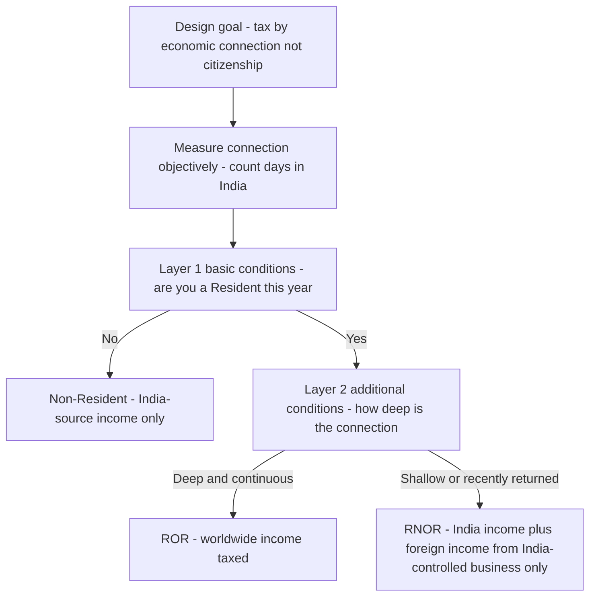
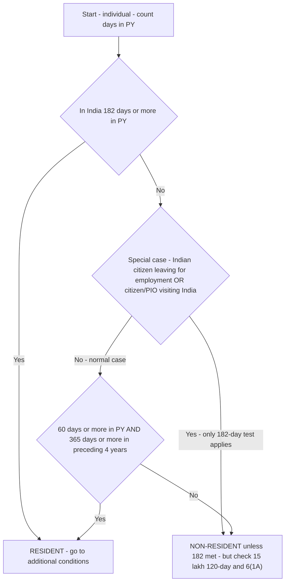
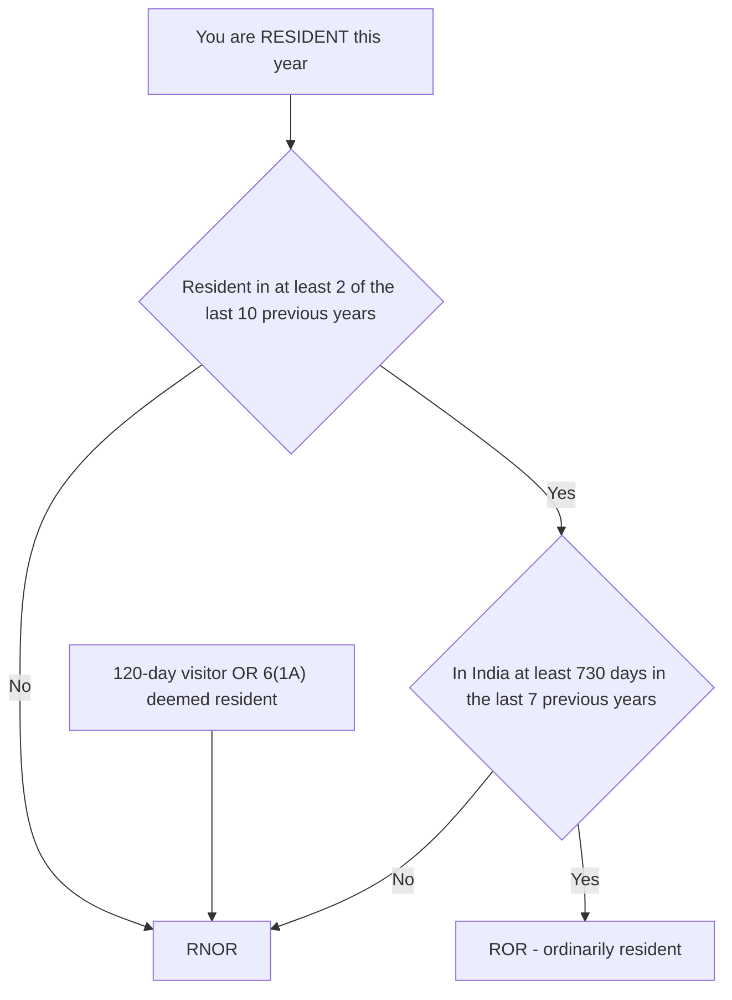
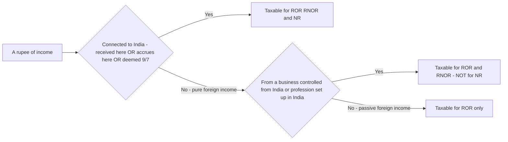
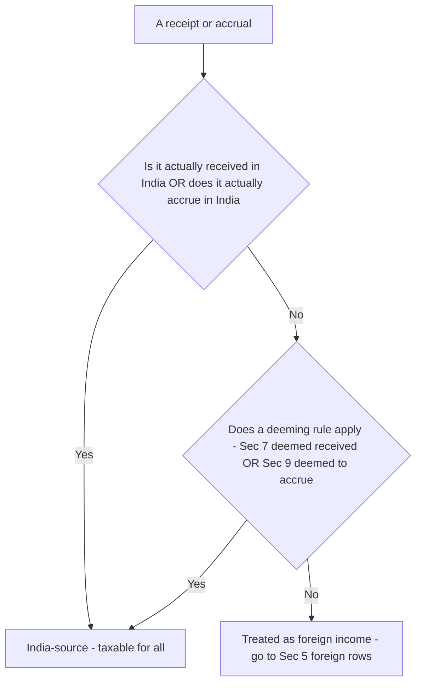

<!-- v2-deep -->

# Chapter 02 — Residential Status & Scope of Total Income

> **Rates & limits change every year.** This chapter teaches the *structure and logic* of residence and the scope of income — which almost never changes. The day-count numbers (182, 60, 365, 730) and the ₹15 lakh threshold are stable but **always verify the exact figures, provisos, and the applicable Assessment Year against current ICAI study material before your attempt.**

---

## 1. The Problem — Who does a country get to tax, and on what?

Imagine you are the Government of India designing an income-tax. You immediately hit a boundary question that comes *before* any rate, any head of income, any deduction:

**Whose income can I legitimately tax, and how much of it — only the income that arose inside my borders, or their worldwide income?**

This is not a trivia question. Consider four people, all earning income in the same year:

- **A** — born, lives, works, and earns entirely in Mumbai.
- **B** — an Indian citizen who took a job in Dubai on 1 April and will live there for years, but still earns rent from a flat in Pune.
- **C** — a British consultant who flew into India for a 3-week project, earned a fee here, and flew home.
- **D** — a returning NRI who came back to India permanently after 20 years abroad and still has a US bank account earning interest.

If India taxes **worldwide income of everyone physically present**, then C — here for 3 weeks — would have to disclose and pay Indian tax on his UK salary, his UK house, his UK dividends. That is absurd and unenforceable; no country would accept it, and no professional would ever visit India. If instead India taxes **only income arising in India, for everyone**, then B could shift his entire economic life offshore, keep deep roots in India, and pay India almost nothing — a giant leak.

So a flat rule fails at both ends. The tax base must depend on **how strongly a person is connected to India** — and that connection must be measured by something *objective, verifiable, and hard to game*, not by a subjective "does he feel Indian?" test.

That measuring device is **residential status**. It is the gatekeeper of the entire Income-tax Act: before you can compute a single rupee of tax, you must know *which basket of income is even taxable* — and that depends on residence, not on citizenship, not on domicile, not on where the person banks.

**Where this sits in the computation pipeline.** The Act is applied in a fixed order and residence is the *very first substantive gate*: (1) identify the **person** [Ch.1] → (2) fix the **previous year** [Ch.1] → (3) determine **residential status** [this chapter, Sec 6] → (4) draw the **scope of total income** [Sec 5] → (5) classify each item under the **five heads** → (6) apply exemptions, deductions, set-off → (7) apply **rates**. If you get Step 3 wrong, every rupee downstream is potentially mis-taxed. That is why the exam loads marks onto this chapter far beyond its page-count: it is a *foundation* skill that gates the whole paper.

---

## 2. The Core Idea — Tax follows *economic allegiance* (nexus), measured by presence

The organising principle behind residence is called **economic allegiance** or, in modern terms, **nexus**: a country may tax income to the extent a person *benefits from and is connected to* that country's economy, infrastructure, legal protection, and markets.

There are two natural nexuses:

| Nexus | Question it asks | Who it should catch |
|---|---|---|
| **Source nexus** | Did the income *arise here*? | Everyone, regardless of where they live — India built the road, the market, the court that made the income possible. |
| **Residence nexus** | Does the person *live here* / have their economic home here? | Residents — India provides them ongoing protection and services, so it can reach their *global* income. |

India's design decision, embodied in **Section 5**, is:

- **Everyone** pays tax on **India-source income** (source nexus is universal — you can't escape it by living abroad).
- **Residents additionally** pay tax on **foreign income** (residence nexus is the "extra reach" that only applies once you're economically anchored here).

The crucial insight your notes should burn in:

> **Residential status does NOT decide the *rate* of tax. It decides the *SCOPE* — the size of the net, i.e. *which* income falls into the taxable basket.** Two people with identical incomes but different residential statuses can owe very different tax, purely because one basket includes foreign income and the other doesn't.

And how do we *measure* residence objectively? Not by intention (unprovable), not by citizenship (a person can be a citizen yet live abroad for decades). We measure it by **physical presence in India, counted in days.** Days are on the passport, on immigration records, on flight tickets — hard to fake, easy to verify. That is *why* the whole test is a day-count test.

**Two more distinctions the exam expects you to hold firmly:**

- **Residence is not domicile, and not nationality.** *Domicile* is a private-law concept about your permanent home for succession/personal law; *nationality/citizenship* is a political bond; *residence* under the Act is a purely mechanical, year-by-year, day-count (or control) determination. A person can be an Indian domiciliary, an Indian citizen, and still be a **Non-Resident** for a given previous year. Never let one leak into the reasoning for another.
- **Residence is tested afresh every previous year.** There is no "once a resident, always a resident." A globe-trotting individual can be ROR in Year 1, NR in Year 2, RNOR in Year 3 — you re-run Sec 6 from scratch each year. The *additional* conditions look back at prior years, but the *test itself* is annual.

---

## 3. Why it's built this way — the logic behind every design choice

Before the sections, understand the five design decisions. Once these click, the rules feel inevitable rather than arbitrary.

**(a) Why citizenship is irrelevant.** Citizenship is a legal/political bond; income tax is about *economic* connection. A US citizen running a factory in India for 5 years is economically Indian; an Indian citizen who has settled in Canada is not. Taxing by citizenship would tax the wrong people. (The USA is a rare exception that taxes citizens worldwide — India deliberately does not.)

**(b) Why days, not intention.** Intention ("I meant to leave permanently") is unverifiable and manipulable. Days present are objective. So residence = a function of *days in India during the previous year* (and, for one category, prior years too).

**(c) Why there are TWO layers of conditions (basic + additional).** A simple resident/non-resident split is too blunt. Consider the returning NRI (D above): the day he lands permanently, he becomes a resident — but is it *fair* to instantly tax his foreign pension, foreign interest, foreign business built up over 20 years, the moment he steps off the plane? He hasn't re-integrated yet; taxing his global income immediately would punish return and encourage people to stay away. So India inserts a **middle, transitional category** — *Resident but Not Ordinarily Resident (RNOR)* — a soft-landing status. To sort people into ROR / RNOR / NR you need a *second* test measuring **depth and continuity** of connection, not just presence this year. Hence **additional conditions**.

**(d) Why 182 / 60 / 365 days.** These thresholds encode "roughly half the year, OR here-this-year-plus-substantial-recent-history." 182 ≈ half of 365 (majority of the year → clearly resident). The 60-days-this-year *plus* 365-days-in-4-prior-years combination catches someone who spends part of every year in India — no single year hits 182, but the *pattern* shows a real, recurring connection. The **relaxations** to 60→182 exist to *not punish* Indians who leave for employment or come home to visit.

**(e) Why RNOR is a shield only for *foreign* income.** RNOR still lives in India this year, so India's *source* nexus is full — all Indian income is taxed. What RNOR shields is *foreign* income (except foreign income from a business *controlled from* India). The logic: give the returnee time to repatriate/settle before the global net closes on him.

**(f) Why the ₹15 lakh / "stateless" bolt-on exists (added later).** The original architecture had a hole: a wealthy Indian could tune his days to be resident *nowhere on earth* and thus tax-resident nowhere, paying almost no income tax while enjoying Indian markets. This is not "planning" in the source-vs-residence sense — it is the *absence* of any residence. The 2020 amendments (Sec 6(1A) deemed residence + the 120-day sub-rule) plug this by saying: a high-income Indian citizen with no tax home elsewhere is deemed to have his residence *default back to India*. This is the newest piece of the logic and the one examiners love because it is where students' mental model breaks.


*Figure 1 — The policy logic: two layers of tests sort people into three baskets of scope.*

---

## 4. Full Technical Content — sections, definitions, tests, and their "why"

### 4.1 The statutory map

| Section | Deals with | One-line "why" |
|---|---|---|
| **Sec 6** | *How* residential status is determined (individuals, HUF, firm, company) | The measuring device (day-count / control tests) |
| **Sec 5** | *Scope* of total income for each status | The gatekeeper — which income basket is taxable |
| **Sec 7** | Income *deemed to be received* in India | Plug a timing/location loophole |
| **Sec 9** | Income *deemed to accrue or arise* in India | Plug a "where did it arise?" loophole |

**Memory hook:** *"6 decides WHO you are; 5 decides WHAT is caught; 7 & 9 stop you from arguing your way out."*

### 4.2 Residential status of an INDIVIDUAL — Section 6(1)

Everything starts with **Previous Year (PY)** presence. (Recall Ch.1: PY = the year income is earned; AY = the following year it is taxed.) You test residence *for each PY separately* — a person can be resident one year, NR the next.

**The five possible labels for an individual** (fix these before anything else):

1. **Non-Resident (NR)** — fails both basic conditions.
2. **Resident and Ordinarily Resident (ROR)** — passes a basic condition *and* both additional conditions.
3. **Resident but Not Ordinarily Resident (RNOR)** — passes a basic condition but fails an additional condition (or is pulled in by a special rule).

There is *no fourth or fifth* — but note that RNOR can be reached by **four different routes** (fail additional (i); fail additional (ii); the 120-day high-income visitor; the 6(1A) deemed resident). Students who think RNOR has only one route mis-handle the amendment cases.

#### Step 1 — Basic Conditions [Sec 6(1)]: Are you a RESIDENT at all?

An individual is **Resident** in India for a PY if he satisfies **at least ONE** of these:

- **(a)** In India for **≥ 182 days** during the PY; **OR**
- **(b)** In India for **≥ 60 days** during the PY **AND ≥ 365 days** during the **4 years immediately preceding** the PY.

If he satisfies **neither**, he is a **Non-Resident (NR)**.

> **Why "at least one"?** Either you're here most of the year (182), or you're here a chunk this year *and* have a clear recent pattern of coming (60 + 365). Both signal a real connection.

**Memory hook for the numbers:** *"182 = half a year. 60-this-year + 365-over-4-years = a habit, not a visit."*

**Subtlety — the two limbs of (b) are cumulative, not alternative.** Condition (b) needs BOTH the 60-days-this-year AND the 365-days-in-4-years. A person here 200 days this year but who never set foot in India in the prior 4 years still becomes resident — but via condition **(a)**, not (b). Conversely, someone here 70 days this year with 400 days across the prior 4 years is resident via **(b)**. Always name *which* limb you used; examiners deduct for a bare "resident" with no condition cited.

#### The relaxations to condition (b) — 60 days becomes 182 days [Explanation 1 to Sec 6(1)]

Condition (b)'s 60-day trigger is *harsh* for two sympathetic groups. So the law **replaces 60 with 182** (i.e. only condition (a) can make them resident) in these cases:

1. **An Indian citizen who leaves India during the PY for the purpose of employment outside India** (or as a member of the crew of an Indian ship). — *Why:* We should not tax the global salary of Indians going abroad to work merely because they were physically here for the first two months before departing. Punishing labour export makes no policy sense.

2. **An Indian citizen or Person of Indian Origin (PIO)** who, being outside India, **comes on a visit to India** during the PY. — *Why:* NRIs visiting family should not risk becoming residents (and exposing worldwide income) just for a long holiday.

> **PIO definition (remember it):** A person is of Indian origin if **he, or either of his parents, or any of his grandparents, was born in undivided India** (i.e. India as it existed before Partition — includes present-day Pakistan and Bangladesh territory). *Why grandparents?* To keep the diaspora connection meaningful across generations without being infinite.

**Two razor-fine points on the "employment abroad" relaxation the examiner tests:**

- **"For the purpose of employment" is read widely.** It is not limited to salaried jobs; ICAI accepts that leaving India to *start or carry on a business/profession/vocation* abroad also qualifies. A doctor leaving to set up practice abroad gets the relaxation. But merely leaving India for a *holiday, medical treatment, or study* is **not** "for employment" — those keep the ordinary 60-day rule.
- **The relaxation only applies in the year of *leaving*.** It attaches to the citizen who *departs during the PY* for employment. In *later* years, once he is settled abroad and only *visits* India, he falls under relaxation (2) (citizen/PIO on a visit) instead. Match the person's situation to the right limb.

#### The high-income NRI carve-back — the ₹15 lakh rule [Explanation 1(b) proviso & Sec 6(1A)]

A modern anti-abuse layer. Wealthy Indians were arranging their days to be resident *nowhere* ("stateless" for tax) and paying tax in no country. Two responses:

- **Modified visit relaxation:** For the PIO/citizen *visiting* India whose **total income (other than foreign-source income) exceeds ₹15,00,000** in the PY, the 60-day limit is relaxed only to **120 days** (not 182). So a high-earning visitor who stays 120+ days can become resident. *Why:* the relaxation was meant to protect ordinary NRIs, not high-income individuals gaming presence.

- **Deemed resident [Sec 6(1A)]:** An **Indian citizen** with **total income (other than foreign source) > ₹15,00,000** who is **not liable to tax in any other country** by reason of domicile/residence → **deemed to be resident in India** regardless of days. *Why:* to end "stateless" tax residency for high-income Indian citizens. Such a person is always classified **RNOR** (see below) — India gets its source income but doesn't overreach on genuine foreign income.

> **Verify:** the ₹15,00,000 figure and the 120-day figure — confirm both in the current AY's ICAI material.

**The four preconditions of Sec 6(1A) — ALL must hold** (a favourite "spot the missing element" question):
1. The person is an **Indian citizen** (a PIO is *not* covered — 6(1A) is citizen-only).
2. **Total income other than foreign-source income > ₹15,00,000.**
3. He is **not liable to tax in any other country** by reason of domicile/residence/similar criterion.
4. **Order of priority:** 6(1A) is a *fallback* — it applies **only if the person is not already a resident under 6(1)** on the ordinary day-count. If he is already resident under 6(1), you never reach 6(1A). So the logical sequence is: test 6(1) first; only if NR under 6(1) do you ask whether 6(1A) deems him resident.

> **"Not liable to tax" nuance:** "Liable to tax" means there is a *right* of the other country to tax him — not that he actually paid tax there. A person can be "liable to tax" in a country that happens to levy zero on his income. Conversely, a UAE resident with no personal income tax and no tax treaty coverage may be "not liable to tax" — the exact fact pattern 6(1A) targets. Read the words carefully.


*Figure 2 — Step 1 decision tree: are you a Resident (basic conditions and their relaxations)?*

#### Step 2 — Additional Conditions [Sec 6(6)]: ROR or RNOR?

*Only if* Step 1 made you a Resident. Now measure **depth/continuity** of the connection. A resident is **Resident and Ordinarily Resident (ROR)** only if he satisfies **BOTH** additional conditions:

- **(i)** He has been **Resident in India in at least 2 out of the 10** previous years immediately preceding the PY; **AND**
- **(ii)** He has been in India for **≥ 730 days in the 7** previous years immediately preceding the PY.

If a resident **fails either** of these → he is **Resident but Not Ordinarily Resident (RNOR)**.

> **Why "2 out of 10" and "730 in 7"?** Both encode *established, long-term* presence. "Resident in 2 of last 10 years" screens out someone only recently connected. "730 days in 7 years" ≈ an average of ~104 days/year — a genuine, sustained physical footprint. Fail either → you're too new (or too intermittent) to have your *global* income taxed → the softer RNOR basket.

**Memory hook:** *"To be ORDINARY (ROR) you need HISTORY: 2/10 and 730/7. Miss the history → you're 'not ordinarily' (RNOR)."*

**Two things students get wrong on the additional conditions:**

- **Condition (i) counts RESIDENT-years, condition (ii) counts DAYS.** They are different units. (i) asks *"in how many of the last 10 years were you a resident?"* — you must, in principle, re-run the basic-condition test for each of those years (though the question usually tells you). (ii) asks *"add up your actual days present across the last 7 years — is the total ≥ 730?"* Mixing these up (e.g. counting resident-years for the 730 test) is a classic slip.
- **The look-back windows differ: 10 years for (i), 7 years for (ii).** Do not use 10 for both.

**Additional RNOR triggers (attach to the same test):**
- The **120-day visitor** (₹15L case) who becomes resident is treated as **RNOR**.
- The **Sec 6(1A) deemed resident** is treated as **RNOR**.
- A person who is resident this year but was NR in 9 of the last 10 years, or here <730 days in last 7, is the classic *returning NRI* → RNOR for a couple of years until history builds up.

**How long does a returning NRI stay RNOR? (the "soft-landing window").** Work it from first principles rather than memorising. Suppose a genuine NRI of 20 years returns permanently and stays every day thereafter. In the *first* return year he fails (i) (not resident in 2 of prior 10). He typically continues to fail (i) until he has accumulated 2 resident years, and fails (ii) until his day-total over the trailing 7 years crosses 730. In practice this makes him RNOR for roughly the **first two previous years** after permanent return, becoming ROR from the third — but always *derive* it from the numbers in the question, because a person who visited India in some of the earlier years can cross the thresholds sooner.


*Figure 3 — Step 2: ROR needs BOTH additional conditions; failing either (or being a special-case resident) means RNOR.*

### 4.3 Residential status of an HUF — Section 6(2)

An HUF (Hindu Undivided Family) is a person too, but it can't "be present" in days. So the test shifts to **where the family's decisions are made**:

- **Resident:** an HUF is resident if the **control and management of its affairs is situated wholly or partly IN India** during the PY.
- **Non-Resident:** only if control & management is situated **wholly OUTSIDE** India.

> **Why "wholly or partly in India" for resident, but "wholly outside" for NR?** The bar to be resident is *low* (even partial Indian control ⇒ resident) and the bar to escape is *high* (must be **entirely** offshore). This reflects source-country protection of the tax base — it's easy to be caught, hard to slip out.

**ROR vs RNOR for HUF:** determined by testing the **KARTA** (manager) against the *individual additional conditions* [Sec 6(6)(b)]. If the karta satisfies both additional conditions → HUF is ROR; else RNOR. *Why the karta?* He is the mind and will of the family; his depth of Indian connection stands in for the family's.

**The two-layer trap for HUF (test the *right* person at the *right* layer):**
- **Layer 1 (Resident vs NR):** look at *control and management* — an attribute of the **family/affairs**, not any one person's days.
- **Layer 2 (ROR vs RNOR):** now look at the **karta's** personal additional conditions (2/10 resident-years and 730/7 days). If mid-year the karta changes, ICAI's position is to apply the conditions to the karta; where a question gives a successor karta, test the karta who managed during the PY. Verify the exact treatment in current material if a question hinges on a karta change.

### 4.4 Residential status of a FIRM / AOP / other persons — Section 6(2) & 6(4)

Same **control-and-management** logic as HUF, but no ROR/RNOR sub-split (that split exists only for individuals and HUFs):

- **Resident** if control & management is **wholly or partly in India**.
- **Non-Resident** only if **wholly outside** India.

> **"Control and management" = the head-and-brain, not day-to-day operations.** It means the *controlling and directive power* — where the policy decisions are taken (typically where the partners meet and decide) — not where clerks process paperwork or where the business physically trades. A firm trading entirely abroad but whose partners meet and decide policy in Chennai is **resident**. This "central control" idea comes from the classic *De Beers* principle and is worth a line in your answer.

### 4.5 Residential status of a COMPANY — Section 6(3)

A company is resident in India in a PY if **either**:

- **(a)** it is an **Indian company** (incorporated in India) — *always resident*, no matter where managed; **OR**
- **(b)** its **Place of Effective Management (POEM)** is **in India** in that year.

> **Why two tests?** (a) Incorporation is a bright-line: if you chose to register under Indian law and enjoy its corporate personality, you're in. (b) **POEM** — "the place where key management and commercial decisions necessary for the conduct of the business as a whole are, in substance, made" — is a *substance-over-form* test to stop a foreign-incorporated shell that is really run from a Mumbai boardroom from claiming NR status. It replaced the older, easily-gamed "control and management *wholly* in India" test. *Memory hook:* **"Indian company = always resident; foreign company = resident only if the real brain (POEM) sits in India."**

**POEM finer points the exam may probe:**
- A company has **no ROR/RNOR split** — it is simply Resident or Non-Resident. Applying "ordinarily resident" language to a company is wrong.
- POEM is assessed on **substance**, looking at where the *board* actually decides in reality, not where board meetings are formally minuted. A board that rubber-stamps decisions really made by an Indian parent has its POEM in India.
- POEM is generally **not triggered** merely because a foreign company has some Indian shareholders, some Indian directors, or a local support office — the test is *effective* management of the business *as a whole*.
- There is a de-minimis relief: companies with turnover below a notified threshold (verify current figure) are outside the POEM regime for practical purposes — check current ICAI/CBDT guidance before relying on it.

---

### 4.6 SCOPE OF TOTAL INCOME — Section 5 (the payoff)

Now that Sec 6 has labelled the person, **Sec 5 tells us which income basket is taxable.** Build it from three raw types of income:

1. **Income received or deemed to be received in India** (Sec 7 handles the "deemed received").
2. **Income which accrues or arises, or is deemed to accrue or arise, in India** (Sec 9 handles the "deemed").
3. **Income which accrues or arises AND is received OUTSIDE India** (pure foreign income).

The scope table — the single most important table in this chapter:

| Type of income | ROR | RNOR | NR |
|---|:---:|:---:|:---:|
| Received / deemed received **in India** | ✔ Taxable | ✔ Taxable | ✔ Taxable |
| Accrues / deemed to accrue **in India** | ✔ Taxable | ✔ Taxable | ✔ Taxable |
| Accrues **AND** received **outside India**, from a **business controlled from / profession set up in India** | ✔ Taxable | ✔ Taxable | ✘ Not taxable |
| Accrues **AND** received **outside India**, **any other** foreign income | ✔ Taxable | ✘ Not taxable | ✘ Not taxable |

**Read the pattern, don't memorise the grid:**

- **All three statuses** pay on **anything connected to India** (received in India or accruing in India). That's the *universal source nexus* — nobody escapes India-source income.
- **ROR** additionally pays on **all foreign income** — full *residence nexus*, worldwide.
- **RNOR** is ROR *minus* passive foreign income — it pays foreign income **only if it flows from a business controlled from India / profession set up in India.** *Why that one exception?* Because a business run *from* India is really an extension of Indian economic activity; only genuinely detached foreign income gets the shield.
- **NR** pays on **India-connected income only** — nothing foreign.

**The "two-question" reduction (carry this into the hall).** For *any* income item, you only ever ask two questions in order:
1. **Is it India-connected?** (received/deemed-received in India OR accrues/deemed-to-accrue in India). If **yes → taxable for everyone (ROR, RNOR, NR).** Stop.
2. If it is *foreign* income (accrues *and* received outside India), ask: **does it flow from a business controlled from India / profession set up in India?** If **yes → taxable for ROR and RNOR, not NR.** If **no (passive foreign) → taxable for ROR only.**

That is the whole grid rebuilt from two questions. Memorising the grid is fragile; re-deriving it is bomb-proof.


*Figure 4 — Scope of income as a flow: follow the rupee and ask "how connected to India is it?"*

> **Trap on "received":** *Received* means **first receipt**. If salary is *first received* in India and then remitted abroad, it was received in India. But **remittance to India of income already received abroad is NOT "received in India"** — it was received the first time, abroad. Re-bringing money to India does not create fresh taxability. *Why:* to tax it again on remittance would be double-counting the same receipt event.

**The "past untaxed foreign income brought into India" corollary.** A closely related favourite: income that *accrued in an earlier year abroad* and is **brought into India in a later year** is **not** taxable in the later year for anyone — it is neither "received in India" (first receipt was abroad) nor "accruing in India". The word "**income**" in Sec 5 refers to the income *of the previous year*; a mere later remittance of old savings is capital movement, not fresh income. Examiners plant a line like "he remitted ₹10 lakh of his past US savings to India" precisely to see if you wrongly tax it.

**Distinguish "accrue/arise" from "receive" — they are separate events.** *Accrual* is when the *right to receive* the income arises (you have earned it and it is due). *Receipt* is when it actually comes into your hands. The same income can accrue in one place and be received in another; Sec 5 catches it if *either* event is (or is deemed to be) in India. This is why "salary earned in India but paid into a foreign account" is still Indian-source: it *accrued* in India (services rendered here) regardless of where it was received.

### 4.7 Income *deemed to accrue or arise* in India — Section 9 (why it exists)

Left alone, "accrues in India" could be argued away. Sec 9 **defines** certain incomes as arising in India *by law*, closing the argument. Know the main heads and each rationale:

| Sec 9(1) item | Deemed to arise in India because… |
|---|---|
| **(i)** Income from any **business connection** in India, **property/asset/source** in India, or **transfer of a capital asset situate in India** | The economic root is Indian soil/market. Includes **indirect transfer** of shares deriving substantial value from Indian assets — *anti-avoidance so you can't sell "the Indian business" by selling an offshore holding company*. |
| **(ii)** **Salary** for services **rendered in India** | Work physically done here → India-source, even if paid abroad. |
| **(iii)** **Salary** paid by the **Government of India** to an **Indian citizen** for services **outside India** | India is the paymaster of its own citizen-servants; a sovereign taxing its diplomats' pay is fair. *(The allowances/perks abroad are separately exempt u/s 10 — different chapter.)* |
| **(iv) & (v)** **Dividend** paid by an **Indian company**; **Interest** payable by Govt / by a resident (with exceptions) / by an NR on money used for a business in India | The payer is Indian / the funds fuel Indian business → Indian source. |
| **(vi) & (vii)** **Royalty** and **Fees for Technical Services (FTS)** payable by Govt / by a resident / by an NR for use in a business in India | The IP or service is *consumed* in India → India taxes the source. |

**Memory hook for Sec 9:** *"Business connection, Indian property, salary-for-work-here, Govt-salary-to-citizens, and India-sourced dividend/interest/royalty/FTS — the law refuses to let you pretend these arose abroad."*

**The "source rule" symmetry for interest/royalty/FTS.** Notice items (v), (vi), (vii) share one structure: the income is Indian-source if the **payer is a resident** (the money leaves India), *except* when the resident payer uses it for a business/profession carried on *outside* India or for earning income from a source *outside* India — then it is *not* Indian-source. Conversely, even a *non-resident* payer creates Indian-source income if the borrowing/IP/service is used for a business *in* India. So the test is genuinely "**where is the money/IP/service put to work**", not merely "who paid". This "payer-residence with a used-abroad exception" pattern is examinable in one-liners.

**Business connection & the "only the India-attributable part" rule.** Where a non-resident has a *business connection* in India, only **so much of the income as is reasonably attributable to the operations carried out in India** is deemed to arise in India [Explanation to Sec 9(1)(i)]. So a foreign manufacturer who merely *sells* into India, with all manufacturing abroad, is taxed only on the profit attributable to Indian operations — not the whole global profit. Purchase of goods in India purely for export, and a few other carve-outs, are specifically *excluded* from "business connection". Know that attribution exists; the detailed computation is an advanced topic.

**Section 7 — income deemed to be *received*:** e.g. the **employer's contribution to a recognised provident fund** in excess of limits, and **interest credited** to RPF beyond the notified rate, and **transferred balance** — treated as received even though not paid out in cash. *Why:* prevents disguising real receipts as untouchable fund entries. **Key exam point:** because these are *deemed received in India*, they are taxable for **all three statuses** (ROR, RNOR, NR) under the first row of the Sec 5 grid — the deeming drags them into the universal "received in India" basket.


*Figure 5 — Sections 7 and 9 exist to convert "arguably foreign" income into India-source income by legal deeming.*

---

## 5. Worked Examples — full, reconciling computations

> These illustrate *classification* (the exam's favourite) and then *scope application*. Use the figures as method, not as current-year law.

### Example 1 (Easy) — plain individual, both basic conditions in play

**Facts:** Mr. Arun stayed in India **65 days** in PY 2025-26. In the **4 preceding years** he was present **100 + 90 + 95 + 120 = 405 days**. He is an ordinary Indian resident (no employment-abroad, not a visitor). Classify him.

**Solution — Step 1 (basic):**
- Condition (a): 65 days ≥ 182? **No.**
- Condition (b): 65 days ≥ 60? **Yes.** AND 405 days ≥ 365 in prior 4 years? **Yes.** → Condition (b) **satisfied.**
- Satisfies at least one basic condition ⇒ **RESIDENT.**

**Step 2 (additional)** — assume he has lived in India every year for the last decade, so easily: resident in ≥2 of last 10 (yes) and ≥730 days in last 7 (yes). ⇒ Both satisfied ⇒ **Resident and Ordinarily Resident (ROR).**

**Reconciliation:** He was here only 65 days this year, but the *recurring pattern* (405 days across 4 years) plus deep history makes him ROR — exactly the "habit, not a visit" logic. **His worldwide income is taxable.**

### Example 2 (Moderate) — the employment-abroad relaxation

**Facts:** Mr. Bhaskar, an **Indian citizen**, left India for the **first time on 15 September 2025** to take up employment in Singapore. He had lived in India all his life before that. Days in India in PY 2025-26 = 1 April to 15 September = **168 days** (assume). His non-foreign total income is ₹8 lakh. Classify.

**Solution — Step 1:**
- Because he is an Indian citizen **leaving for employment abroad**, the relaxation applies: condition (b)'s 60-day trigger is **replaced by 182 days** → *only* condition (a) can make him resident.
- Condition (a): 168 days ≥ 182? **No.**
- (₹15L rule doesn't bite: this relaxation is the pure "employment abroad" one under 6(1A)/Expl.1(a); his income ₹8L < ₹15L anyway, and the 120-day variant is for *visitors*, not those leaving for employment.)
- ⇒ **NON-RESIDENT** for PY 2025-26.

**Scope consequence (Sec 5):** As NR, **only his India-connected income is taxable** — his Indian salary for 1 April–15 Sept (services rendered in India, Sec 9(1)(ii)) and any Indian rent/interest. His **Singapore salary from 16 Sept onwards is foreign income → NOT taxable in India.**

**Reconciliation:** The relaxation did its job — India isn't taxing the global salary of a citizen who left to work abroad merely because he was here for the first 168 days. Note the knife-edge: had he stayed **182+ days** before leaving, condition (a) alone would make him resident.

### Example 3 (Exam-hard) — returning NRI, RNOR, and full scope computation

**Facts:** Ms. Chandni, an Indian citizen, had lived in the **USA for 20 years** (NR throughout). She returned to India **permanently on 1 April 2025**, so she is present in India the **entire PY 2025-26 (365 days)**. During PY 2025-26 she earned:

1. Salary for consultancy performed in India — **₹18,00,000** (received in India).
2. Rent from her flat in Bengaluru — **₹3,00,000** (received in India).
3. Interest on her US bank deposits — **₹4,00,000** (accrued and received in USA; a passive foreign source).
4. Profit from a **software business she controls from India**, operations in USA, income received in USA — **₹6,00,000**.
5. Dividend from a US company, received in USA — **₹1,00,000** (passive foreign).

Determine her residential status and her **total income taxable in India.**

**Step 1 — basic conditions:** Present 365 days ≥ 182 ⇒ **RESIDENT.**

**Step 2 — additional conditions:**
- (i) Resident in ≥ 2 of the **last 10** previous years? She was **NR in all 10** prior years (20 years abroad). **Fails.**
- Failing even one ⇒ **Resident but Not Ordinarily Resident (RNOR).**

**Step 3 — apply the Sec 5 scope grid to each item:**

| # | Income | Nature | Taxable for RNOR? | Amount ₹ |
|---|---|---|:---:|---:|
| 1 | Consultancy salary, services in India, received in India | India-source (received + accrues here) | ✔ | 18,00,000 |
| 2 | Bengaluru rent, received in India | India-source | ✔ | 3,00,000 |
| 3 | US bank interest, accrues + received in USA | Passive foreign | ✘ | — |
| 4 | Business income received in USA but **controlled from India** | Foreign income from India-controlled business | ✔ | 6,00,000 |
| 5 | US dividend, received in USA | Passive foreign | ✘ | — |
| | **Total income taxable in India** | | | **27,00,000** |

**Reconciliation & the teaching point:** Items 3 and 5 (₹5,00,000 of passive foreign income) escape *only because* she is RNOR, not ROR. The RNOR shield protects **passive** foreign income but **not** item 4 — a business **controlled from India** is treated as economically Indian, so ₹6,00,000 is caught. This is exactly the design in Section 4.6.

**Contrast — if she had been ROR** (say she'd returned years earlier and built the required history): items 3 and 5 would *also* be taxable, giving total income of **₹32,00,000**. Same person, same money — **₹5,00,000 difference in the tax base created purely by residential status.** That is Section 2's core idea made numerical.

**Contrast — if she were NR:** item 4 would *also* fall out (NR is never taxed on foreign income, even from an India-controlled business), leaving only items 1 + 2 = **₹21,00,000**.

| Status | Items taxed | Total income ₹ |
|---|---|---:|
| **ROR** | 1,2,3,4,5 | 32,00,000 |
| **RNOR** | 1,2,4 | 27,00,000 |
| **NR** | 1,2 | 21,00,000 |

*One set of facts, three baskets — the entire chapter in one table.*

### Example 4 (Exam-hard) — the ₹15 lakh high-income visitor and the 120-day line

**Facts:** Mr. Dev, a **Person of Indian Origin** settled in Dubai (UAE has no personal income tax; assume he is *not liable to tax* there), came **on a visit to India** in PY 2025-26 and stayed **130 days**. In the **4 preceding years** he was in India **400 days** in total. His income comprises: Indian-source income (rent + interest + capital gains) of **₹22,00,000**, and foreign-source income of ₹50,00,000. Classify him and note the twist if he were instead an *Indian citizen*.

**Solution — Step 1 (basic), applying the visit relaxation with the ₹15L modification:**
- He is a **PIO on a visit** → the ordinary 60-day trigger is relaxed. But his **non-foreign total income = ₹22,00,000 > ₹15,00,000**, so the relaxation is only up to **120 days**, not 182.
- Condition (a): 130 days ≥ 182? **No.**
- Modified condition (b): 130 days ≥ **120**? **Yes.** AND 400 days ≥ 365 in prior 4 years? **Yes.** ⇒ Condition (b) **satisfied** ⇒ **RESIDENT.**

**Step 2 (additional):** Being a long-settled NRI, he was NR in most/all of the last 10 years and is well under 730 days in the last 7 → **fails** the additional conditions ⇒ **RNOR.**

**Scope:** As RNOR, his ₹22,00,000 Indian income is fully taxable; his ₹50,00,000 foreign income is **not** taxable (assume none of it is from a business controlled from India).

**The twist (why 6(1A) does NOT apply here):** Sec 6(1A) is **citizen-only**. Mr. Dev is a **PIO, not a citizen**, so even though he is high-income and not-liable-to-tax-in-UAE, 6(1A) cannot deem him resident. He became RNOR *only because he actually crossed 120 days*. Had he stayed just **119 days**, condition (b) would fail (119 < 120), condition (a) fails, and — being a PIO — 6(1A) is unavailable → he would be **Non-Resident**, and even his classification changes the exposure of any India-controlled foreign business.

**Reconciliation:** This example isolates the two 2020 amendments and shows they are *different tools*: the **120-day rule** turns a high-income *visitor* (citizen OR PIO) into a resident once he crosses 120 days with the 4-year history; **6(1A)** deems a high-income *citizen* resident irrespective of days *only when he is tax-resident nowhere*. Mismatching who each rule covers is the single most common amendment-era error.

### Example 5 (Exam-hard) — HUF control test + karta's ordinary-residence, with a scope wrinkle

**Facts:** The *Ramanujam HUF* carries on a trading business. During PY 2025-26 its affairs were controlled **partly from Chennai and partly from Colombo**. Its karta, Mr. R, is an Indian citizen who has been **resident in India in 6 of the last 10 years and present 900 days in the last 7 years**. The HUF earned: (a) trading profit from India-managed operations **₹12,00,000** (received in India); (b) profit from a Sri Lanka branch, **controlled from Colombo**, received in Colombo **₹8,00,000**; (c) interest on a Chennai bank FD **₹2,00,000**. Classify the HUF and compute its taxable income.

**Solution — Layer 1 (Resident vs NR):** Control and management is **partly in India** (Chennai) ⇒ HUF is **RESIDENT** (it would be NR only if control were *wholly* outside India).

**Layer 2 (ROR vs RNOR) — test the KARTA on the individual additional conditions:**
- (i) Karta resident in ≥ 2 of last 10 years? 6 ≥ 2 → **Yes.**
- (ii) Karta present ≥ 730 days in last 7 years? 900 ≥ 730 → **Yes.**
- Both satisfied ⇒ HUF is **Resident and Ordinarily Resident (ROR).**

**Scope (Sec 5) for an ROR:** worldwide income is taxable, so all three items are caught:

| # | Income | Nature | ROR taxable? | ₹ |
|---|---|---|:---:|---:|
| a | India-managed trading profit, received in India | India-source | ✔ | 12,00,000 |
| b | Sri Lanka branch profit, controlled from Colombo, received abroad | Foreign income | ✔ (because ROR) | 8,00,000 |
| c | Chennai FD interest | India-source | ✔ | 2,00,000 |
| | **Total taxable** | | | **22,00,000** |

**The wrinkle — why the status of the karta flips the answer.** Suppose instead the karta had been **RNOR** (say resident in only 1 of the last 10 years). The HUF would then be **RNOR**, and item (b) — foreign income from a branch **controlled from *Colombo*, not from India** — would become **non-taxable**, dropping total income to **₹14,00,000**. Contrast this with Example 3 item 4: there the foreign business was *controlled from India*, so it stayed taxable for RNOR. The deciding phrase is always **"is the foreign business controlled *from India*?"** — the location of *control*, not the location of *operations* or *receipt*.

**Reconciliation:** This example forces you to (1) test the *family's control* for Layer 1, (2) test the *karta's personal history* for Layer 2, and (3) apply the RNOR business-control exception correctly at the scope stage — three distinct skills the examiner bundles into one question.

---

## 6. Computation Format / Presentation (how to write it in the exam)

Examiners award marks for a **clean, staged layout.** Use this skeleton:

**Part A — Determination of Residential Status**
```
Step 1  Basic conditions [Sec 6(1)]
        (a) Days in PY .......... = XX  → ≥182 ?  Yes/No
        (b) Days in PY ≥ 60 ?  Yes/No
            Days in preceding 4 yrs = XXX → ≥365 ?  Yes/No
        [Note any relaxation: Indian citizen employment abroad / PIO visit → 60 replaced by 182 (or 120 if non-foreign income > ₹15L)]
        [If NR under 6(1): check deemed residence u/s 6(1A) — citizen + non-foreign income > ₹15L + not liable to tax anywhere]
        Conclusion: Resident / Non-Resident

Step 2  (only if Resident) Additional conditions [Sec 6(6)]
        (i)  Resident in ≥2 of last 10 PYs ?  Yes/No
        (ii) In India ≥730 days in last 7 PYs ?  Yes/No
        Conclusion: ROR (both satisfied) / RNOR (either failed / special-case resident)
```

**Part B — Scope of Total Income [Sec 5]** — one row per income item, a column of "Taxable? (reason)", and a total. Always **state the reason** (received in India / accrues in India / deemed u/s 9 / foreign income from India-controlled business / passive foreign). The reason column is where the marks live.

Golden rules:
- Determine status **first, completely**, then apply scope. Never mix.
- **Count days carefully** — day of arrival and day of departure are *both* counted as days in India (a standard ICAI convention). Verify the convention in your material.
- Quote the **section** beside each conclusion.
- For **day counting across a stay that straddles the year-end**, count only days *within the previous year* (1 April–31 March). A stay from 20 March to 20 April contributes only 12 days (20–31 March) to that PY; the April days belong to the *next* PY. Splitting a continuous stay across two previous years is a frequent slip.
- **When the question gives a leap-year PY**, 182 still governs — but total days available are 366, so "182" is a hair under half. Do not "adjust" the threshold; it is fixed by statute.
- **Show the arithmetic of the 4-year and 7-year windows explicitly** (list each year's days and sum) — the examiner is checking you used the right *number of years* (4 vs 10 vs 7), which is where most marks are lost.

---

## 7. Connections — where this plugs into the rest of the syllabus

- **Chapter 1 (Basic Concepts):** *Previous Year* and *Assessment Year* — residence is tested **per previous year**. *Person* — each type of person has its own Sec 6 test.
- **Salary head:** Sec 9(1)(ii)/(iii) decide when foreign-earned salary is Indian-source; the RNOR/NR shield decides whether foreign salary is taxed at all.
- **Capital Gains:** Sec 9(1)(i) + **indirect transfer** rule decides when a non-resident's sale of shares is taxed in India.
- **Deductions & DTAA / Sec 90/91 (relief from double taxation):** an ROR taxed on worldwide income may have *already* paid foreign tax — hence **foreign tax credit / double-tax relief**. Residence is the *reason* double taxation arises. DTAAs also contain their own "tie-breaker" residence rules (permanent home → centre of vital interests → habitual abode → nationality → mutual agreement) that override the Act when a person is resident in two countries — worth knowing exists.
- **TDS (Sec 195):** payments to non-residents are the trigger for withholding — you must know NR status to apply it.
- **Exempt incomes (Sec 10):** several exemptions (e.g. for non-residents, for Govt employees abroad) interact with the deeming rules.
- **Special rates for NRs (Chapter XII / Sec 115A–115H etc.):** once classified NR, certain investment incomes are taxed at concessional flat rates — status is the entry ticket to those regimes.
- **Return filing & residential status disclosure:** the ITR requires you to declare status and, for RNOR/NR, schedule foreign assets differently — a downstream compliance consequence of this chapter.

---

## 8. Traps & Examiner Tricks

1. **Citizenship ≠ residence.** A foreign citizen present 182+ days is a *resident*; an Indian citizen abroad can be *NR*. The exam plants this constantly.
2. **"Received in India" vs "remitted to India."** Foreign income *remitted* to India stays foreign — remittance is **not** first receipt. Don't tax NR/RNOR on money they merely bring home. Same for **past-year foreign income later brought in** — never taxable.
3. **Forgetting the relaxation.** For an Indian citizen *leaving for employment* or a *citizen/PIO visiting*, the 60-day condition is **inoperative (raised to 182, or 120 if non-foreign income > ₹15L)**. Students wrongly apply 60 and mis-classify.
4. **The RNOR business exception.** Foreign income from a **business controlled from India / profession set up in India** *is* taxable for RNOR. Students often exempt all foreign income for RNOR — wrong. The deciding word is the location of **control**, not of operations or receipt.
5. **Day counting.** Both arrival and departure days count as in-India days. Off-by-one errors flip 182/60/730 thresholds. Count only days *within the PY* when a stay straddles 31 March.
6. **"2 out of 10" tests RESIDENT-years, not presence-years.** Condition 6(6)(i) asks in how many of the last 10 years he was a *resident*, not how many days. And it uses a **10-year** window while (ii) uses **7 years** and **730 days** — never swap the windows.
7. **HUF/firm/company use CONTROL, not days.** Applying the day-count to an HUF or company is a classic error. And: **Indian company is *always* resident** regardless of POEM.
8. **RNOR only exists for individuals & HUFs.** Firms/AOP/companies are just Resident or NR — no "ordinarily" split.
9. **Sec 6(1A) deemed resident** applies only to **Indian citizens** (not PIOs) with non-foreign income > ₹15L who are **not liable to tax anywhere** — and they are **RNOR**, not ROR. It is a *fallback* used only if the person is NR under the ordinary 6(1) test.
10. **Salary by Govt to citizen abroad** is deemed to arise in India [Sec 9(1)(iii)] — taxable even for an NR, because the source is Indian. But a *non-Government* employer paying an NR for services rendered *abroad* is foreign income — not taxable for the NR.
11. **The 120-day rule vs 6(1A) mix-up.** 120-day rule = high-income *visitor* (citizen OR PIO) who *actually crosses 120 days*; 6(1A) = high-income *citizen* deemed resident *regardless of days* only when tax-resident nowhere. Different triggers, different persons.
12. **"Business connection" ≠ whole global profit.** For an NR with an Indian business connection, only the part **attributable to Indian operations** is deemed to arise in India.
13. **Testing the wrong person for an HUF.** Layer 1 uses the *family's* control; Layer 2 uses the *karta's* personal additional conditions. Don't test the karta's *days* for Layer 1, or the family's control for Layer 2.
14. **Assuming an NRI is automatically RNOR on return.** He may be ROR immediately if his prior visits already satisfy 2/10 and 730/7 — always *check the numbers*, never assume the soft-landing applies.

---

## 9. First-Principles Recap

Strip everything away and one chain remains:

> A country taxes income to the extent it has an **economic claim (nexus)** on it. India has a **source claim** on all income arising here — so *everyone* pays on India-connected income. India has a **residence claim** on those economically anchored here — so *residents* additionally pay on foreign income. Because "anchored" is a matter of degree, India uses **objective day-counts** (Sec 6) to sort people into **NR** (no anchor → source income only), **RNOR** (new/shallow anchor → source income + India-controlled foreign business, a soft landing), and **ROR** (deep anchor → worldwide). **Section 5** is just this logic written as a grid; **Sections 7 & 9** stop taxpayers from arguing that Indian-source income arose or was received abroad; **Sec 6(1A)** stops the wealthy from anchoring *nowhere*.

If you can re-derive Figure 4 and the Sec 5 grid from "source nexus is universal, residence nexus is the extra reach," you never need to memorise the grid — you can *rebuild* it. And if you can re-derive the *classification* from "182 = half the year; 60+365 = a habit; relaxations protect genuine NRIs; 2/10 & 730/7 = the history needed to be *ordinarily* resident," you never need to memorise Sec 6 either — the numbers become consequences of the ideas.

---

## 10. Quick-Revision Sheet

### Sections at a glance
| Section | Content |
|---|---|
| **6(1)** | Basic conditions for individual — Resident or NR |
| **6(1A)** | Deemed resident — Indian citizen, non-foreign income > ₹15L, not taxable anywhere → RNOR |
| **6(2)** | HUF / firm / AOP — control & management test |
| **6(3)** | Company — Indian company OR POEM in India |
| **6(6)** | Additional conditions — ROR vs RNOR (individual & HUF) |
| **Expl. 1 to 6(1)** | Relaxations: 60→182 (employment abroad / citizen-PIO visit); 60→120 if visitor's non-foreign income > ₹15L |
| **5** | Scope of total income by status |
| **7** | Income deemed to be received (e.g. excess RPF employer contribution/interest) |
| **9** | Income deemed to accrue/arise in India |

### Day-count / threshold table (VERIFY current AY)
| Test | Threshold | Meaning |
|---|---|---|
| Basic (a) | **182 days** in PY | Majority of year → resident |
| Basic (b) | **60 days** in PY **+ 365 days** in prior 4 yrs | Recurring pattern → resident |
| Relaxation | 60 → **182** | Citizen leaving for employment / citizen-PIO visiting |
| Relaxation (high income) | 60 → **120** | Visitor with non-foreign income **> ₹15,00,000** |
| Deemed resident 6(1A) | non-foreign income **> ₹15,00,000**, stateless | Indian citizen (not PIO) → RNOR |
| Additional (i) | Resident in **≥ 2 of last 10** PYs | Long-term connection (resident-*years*) |
| Additional (ii) | **≥ 730 days in last 7** PYs | Sustained presence (actual *days*) |

### Status → scope (the grid to reproduce)
| Income | ROR | RNOR | NR |
|---|:--:|:--:|:--:|
| Received / accrues **in India** (incl. deemed 7 & 9) | ✔ | ✔ | ✔ |
| Foreign income from **business controlled from / profession set up in India** | ✔ | ✔ | ✘ |
| Other (passive) **foreign** income | ✔ | ✘ | ✘ |

### The four routes into RNOR (don't forget the last two)
1. Resident this year but **fails additional condition (i)** (not resident in 2 of last 10).
2. Resident this year but **fails additional condition (ii)** (< 730 days in last 7).
3. **120-day high-income visitor** (citizen or PIO) who becomes resident.
4. **Sec 6(1A) deemed resident** (high-income citizen, tax-resident nowhere).

### Non-individual persons
| Person | Resident if… | ROR/RNOR split? |
|---|---|:--:|
| **HUF** | control & mgmt **wholly or partly in India**; ROR/RNOR by testing **karta** on 6(6) | Yes |
| **Firm / AOP** | control & mgmt wholly or partly in India | No |
| **Company** | **Indian company (always)** OR **POEM in India** | No |

### Three memory hooks
- **"6 = WHO, 5 = WHAT, 7 & 9 = no escape."**
- **"182 half-a-year; 60+365 a habit; 2/10 & 730/7 = history for ROR."**
- **"Source nexus catches everyone; residence nexus is the extra reach that only closes fully on ROR."**

> **Final reminder:** confirm the ₹15,00,000 threshold, the 120-day figure, day-counting convention, POEM turnover threshold, and every numeric limit against **current ICAI study material for your applicable Assessment Year** before the exam.
