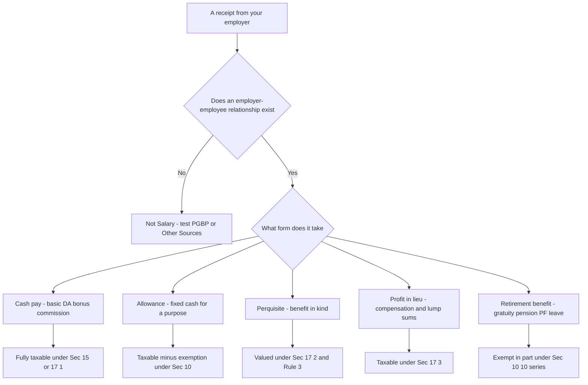
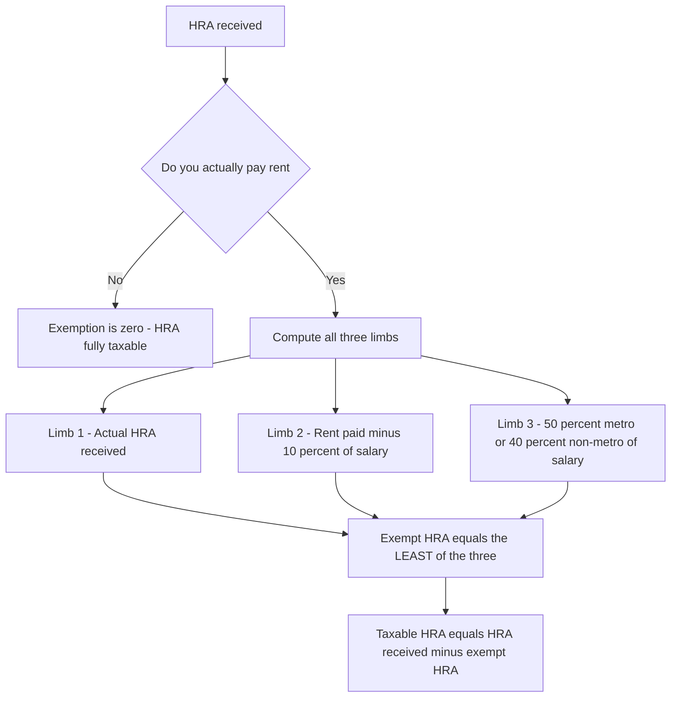
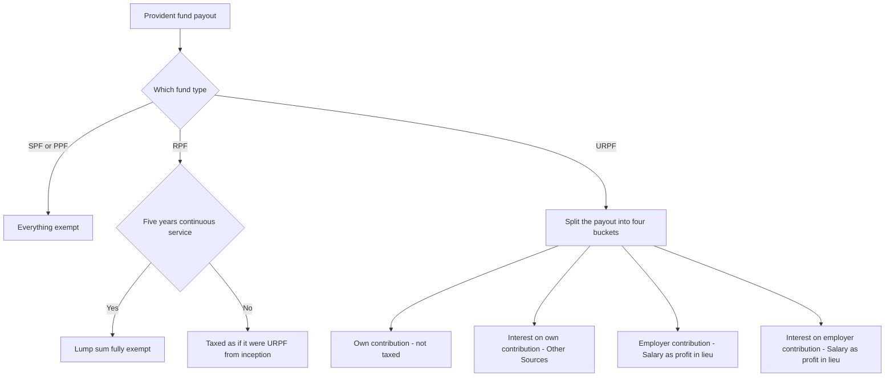
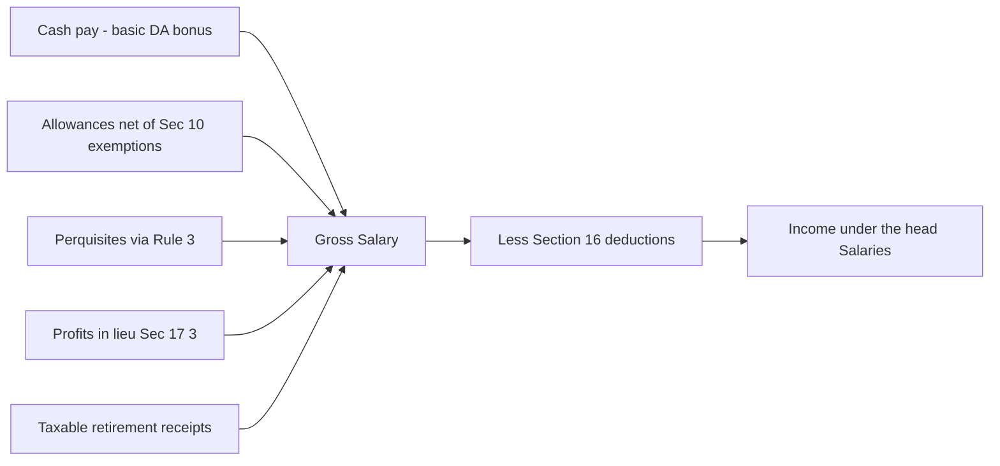

<!-- v2-deep -->

# Chapter 03 — Income under the Head "Salaries"

> **A note on rates and limits before we begin.** This chapter teaches the *structure and logic* of salary taxation, which is stable across decades. The exact monetary limits (HRA caps, gratuity ceiling, standard deduction amount, perquisite valuation rates) are tuned by Parliament almost every year. **Always verify the exact rates, limits and the applicable Assessment Year in current ICAI study material for your attempt.** The reasoning below tells you *why* a limit exists; that never changes.

---

## 1. The Problem — Why "Salaries" Needs Its Own Rulebook

Imagine you are the tax department. A country has crores of earners, and by far the largest, most disciplined, most *visible* group is salaried employees. Their income arrives monthly, from an identifiable payer (the employer), through a bank, on a fixed contract. This is the easiest income in the entire economy to see and to tax.

But "salary" is deceptively messy. An employer rarely pays a clean single number. She pays:

- a **basic** amount, plus
- a **house rent allowance**, a **transport allowance**, a **medical reimbursement**,
- a **car** the employee drives home, a **flat** the company owns, **subsidised** canteen food,
- an interest-free **loan**, **stock options**, a **club membership**,
- and at the end — **gratuity, pension, leave encashment, provident fund**.

Every one of these is a *benefit flowing from employer to employee*. If the law taxed only the word "salary" printed on the payslip, every clever employer would relabel pay as "reimbursement" or "perquisite" and the largest tax base in the country would evaporate.

**So the problem is threefold:**

1. **Scope** — how do we capture *every* form of value an employee receives, not just the cash line?
2. **Timing** — salary is promised, then paid, sometimes in advance, sometimes in arrears. *When* do we tax it?
3. **Fairness** — some receipts (a retirement gratuity after 30 years, rent paid out of a city allowance) aren't really "surplus income" — they replace a genuine cost or a lifetime of service. Taxing them fully would be unjust.

The head "Salaries" (Sections **15 to 17** of the Income-tax Act, 1961) is the machinery built to solve exactly these three problems.

**A fourth, quieter problem — the regime split.** Since the arrival of the **optional new regime (Section 115BAC)**, the *same* salary can produce two different taxable figures depending on which regime the employee is in. The new regime buys lower slab rates by *withdrawing* most exemptions and deductions (HRA, LTC, most Sec 10(14) allowances, entertainment allowance, professional-tax deduction under one reading — verify). So a modern salary problem is really *two* computations, and the very first thing an examiner tests is whether you noticed which regime applies. Keep this in view through every section below; §7 and §8 return to it.

---

## 2. The Core Idea — Tax the *Total Employment Reward*, on the Earlier of Due or Receipt

Strip away the detail and the head "Salaries" rests on one sentence:

> **Everything of value that flows to you *because* an employer-employee relationship exists is salary, and it is taxed the moment you become *entitled* to it or actually *receive* it — whichever happens first.**

Two design choices are packed into that sentence:

**(a) The relationship is the trigger, not the label.** The law does not ask "is this called salary?" It asks "does a master–servant (employer–employee) relationship exist, and did this benefit arise from it?" If yes → head Salaries. If the same work were done by an independent professional, the *identical* payment would fall under "Profits and Gains of Business or Profession". The relationship is the dividing line (we return to this in §4).

**(b) Due-or-receipt, whichever is earlier (Section 15).** Most heads of income tax you when money arrives. Salary is special: it is taxed on **accrual (due) OR receipt, whichever is earlier** — so you cannot dodge tax by asking your employer to *hold* your March salary, and you cannot be taxed twice when the held amount is finally paid.

That single "whichever is earlier, but never twice" rule is the spine of §3.

**Why "total reward" and not "net gain"?** A subtle first-principles point: the head taxes the *gross reward* of employment, and then hands back only a short, closed list of deductions (Section 16). It deliberately refuses to let an employee net off his personal costs of earning (commuting, clothes, a home office) the way a businessman nets off expenses. The justification is that (i) the employer already bore and deducted the genuine business costs, and (ii) an employee's costs are hopelessly entangled with private consumption. So "salary income" is closer to *gross receipts* than to *profit* — a structural feature that explains why §16 is so stingy.

---

## 3. Why It's Built This Way — The Design Logic

### 3.1 Why "due or receipt, whichever is earlier"?

Consider three timing games an employee (or a colluding employer) might play:

| Game | What they'd try | How the rule blocks it |
|---|---|---|
| **Defer** | "Don't pay my bonus this year; pay it next year when I'll be in a lower slab." | If it became **due** this year, it is taxed this year even if received later. |
| **Advance** | "Pay me next year's salary now." | **Advance salary** is taxed on **receipt** now (received before due). |
| **Double-count** | Tax authorities try to tax the *arrear* both when it accrued and again when paid. | Section 15's proviso: salary already taxed on due basis is **not** taxed again on receipt. |

The rule is therefore an **anti-timing-arbitrage** device. Notice the asymmetry with other heads — this exists precisely because salary is contractual and predictable, so the accrual date is *knowable*, unlike (say) a business windfall.

> **Memory hook — "Section 15 = the 1-5 gate."** Salary passes through a gate that opens on the *earlier* of two dates, and the gate lets each rupee through *only once*.

**A refinement examiners exploit — bonus and commission.** Salary generally accrues *month by month*, but a **bonus** usually does not become "due" until it is declared/sanctioned. So a bonus is often taxed on **receipt** even though the effort relates to an earlier year — because there was no enforceable "due" date before declaration. Contrast **contractual commission** payable on a fixed date: that accrues on its due date. The lesson: "due" means *legally enforceable entitlement*, not "morally earned". When the problem is silent on a bonus's due date, tax it when received.

**Arrears and Section 89(1) relief.** When an arrear or advance bunches into one year and pushes the employee into a higher slab, **Section 89(1)** grants relief by re-spreading the arrear to the years it relates to and taxing at those years' rates. This does *not* change the *head* or the year of charge under Section 15 — the amount is still taxed in the year of receipt/due — it only recomputes the *tax*. Keep the two ideas separate: Section 15 fixes the *year*; Section 89(1) softens the *rate impact*. (Section 89 relief is generally *not* available under the new regime for certain items — verify current position.)

### 3.2 Why does the employer-employee relationship matter so much?

Because the *same rupee* is taxed under different rules depending on the relationship, and taxpayers will always route income to the cheapest head. A director's *sitting fee* (no master-servant control) is "Other Sources"; a director who is also a whole-time *employee* earns "Salary". A partner's remuneration from his firm is **business income**, not salary, because a person cannot be his own employee. The law needs a bright-line concept — **control and supervision** — to sort receipts into the right head with the right deductions.

**The four boundary cases you must be able to place instantly:**

| Receipt | Correct head | Reason |
|---|---|---|
| Director who is a **whole-time employee** — remuneration | **Salaries** | Master-servant control exists |
| **Non-executive** director — sitting fees / commission | **Other Sources** | No employment; independent office |
| **Partner's** salary/remuneration from firm | **PGBP** | You cannot employ yourself; firm ≠ separate master |
| **MP / MLA** salary and allowances | **Other Sources** | Constitutional office, not employment |
| Pension to a **widow/legal heir** (family pension) | **Other Sources** (with a Sec 57 standard deduction) | No employment relationship survives the deceased |

That last row is a favourite trap: **the employee's own pension is Salary; family pension to the heir is Other Sources.** Same word, different head, different deduction.

### 3.3 Why exempt parts of allowances and retirement benefits?

Here the policy is **"tax surplus, spare cost-recovery and reward-for-life-of-service."**

- An allowance given to *meet an expense* (rent in an expensive city, travel on tour) is not really surplus — so the law exempts it **to the extent it is actually spent / capped**. Beyond the cap, it *is* surplus → taxable.
- Retirement benefits (gratuity, pension, leave encashment, PF) represent **decades of deferred reward and social security**. Fully taxing a lump sum received once, at retirement, in the year's slab, would be brutal and would discourage saving. So the law grants **structured exemptions** — always the *least of* a few figures, so the relief is real but not unlimited.

Every exemption you will memorise is an instance of one of these two ideas. If you understand the idea, you can *reconstruct* the "least of the following" formula rather than recall it blindly.

**Why "least of", specifically — the anti-abuse geometry.** Notice that a "least of the following" cap is a device with two jaws. One jaw is the **actual amount** (you can never exempt more than you received — no phantom relief). The other jaws are **objective ceilings** (a statutory rupee cap, a formula tied to salary and service). Together they guarantee the relief tracks *genuine* burden and *cannot be inflated* by a co-operating employer paying an absurd gratuity. Once you see that every retirement exemption is "actual, bounded above by objective ceilings", you never have to memorise which figure wins — you compute all of them and take the smallest.

*Figure 3.1 — The master decision tree for any employer receipt. Every later section is just a branch of this tree.*

---

## 4. Full Technical Content — Sections, Definitions, Format (each with its "why")

### 4.1 The charging section — Section 15

Section 15 charges to tax:
1. Salary **due** from an employer (whether paid or not),
2. Salary **paid or allowed** before it became due (advance salary),
3. **Arrears** of salary paid/allowed and not taxed in any earlier year.

**Why the three limbs?** Limbs (1) and (2) are the "earlier of due/receipt" rule split into its two triggers. Limb (3) is the safety net catching anything that slipped through. The **proviso** prevents double taxation.

> ⚠️ **Advance salary vs. Advance *against* salary (loan).** A genuine loan later adjusted against salary is **not** taxed on receipt — it is a loan, not salary due. Examiners love this distinction.

**Two more distinctions hiding in Section 15:**

- **Advance salary vs. arrears of salary.** *Advance* salary is next period's pay received early → taxed **now** (limb 2). *Arrears* are past pay received late → taxed **now** as well (limb 3) *if not already taxed on due basis*. The proviso ensures neither is taxed twice. So both accelerate/catch tax to the year of receipt, but for opposite time directions.
- **"Salary" vs. "Profit in lieu".** Section 15 charges salary *and* profits in lieu (via 17(1)(iv) → 17(3)). A signing bonus received *before* joining is a profit in lieu but is still salary of the year of receipt. There is no "gap year" where employment income falls out of the head just because the employment hadn't started or had ended.

### 4.2 What "Salary" includes — Section 17(1)

Section 17(1) defines *salary* inclusively. Memory hook: **"WAGP-F-PL"** — Wages, Annuity/pension, Gratuity, fees/commission/**Perquisites**, **Profits in lieu**, advance salary, leave encashment, employer's PF contribution & interest beyond limits, and the transferred NPS/pension-scheme contributions.

The definition is deliberately **inclusive ("includes")**, not exhaustive — so nothing escapes by not being listed.

**The full statutory list (17(1) sub-clauses), for completeness:** (i) wages; (ii) any annuity or pension; (iii) any gratuity; (iv) any fees, commission, perquisites or profits in lieu of or in addition to salary/wages; (v) any advance of salary; (vi) leave encashment; (vii) the taxable transferred balance in a recognised PF; (viii) the employer's contribution to the notified pension scheme (Sec 80CCD/NPS) to the extent taxable. You do not need to recite the numbering, but you must recognise each of these as *salary* rather than another head — that recognition is the whole point of an inclusive definition.

### 4.3 Basis of charge & other structural rules

- **No deduction for expenses** (except those specifically allowed — see §4.7). Because employment costs are personal, and the employer already bears business costs.
- **Salary from more than one employer** in a year → aggregate all. (Practical corollary: if two employers each give a standard deduction / each stop TDS at the basic exemption, the employee will be under-deducted — hence Section 192(2) lets an employee report prior-employer salary to the current one so TDS is computed on the *aggregate*.)
- **Foregone salary** is still taxable (you can't escape tax by *surrendering* salary already due) — but salary *surrendered to the Central Government* under the Voluntary Surrender of Salaries Act is not taxed.
- **Place of accrual**: salary for services rendered in India is deemed to accrue in India (links to residential status, Chapter 02). *Leave salary* paid abroad for service rendered in India is likewise deemed to accrue in India.
- **Salary vs. reimbursement.** A true reimbursement of an employer's own expense incurred by the employee (e.g., the employee buys stationery for the office and is repaid) is not income at all — there is no benefit, only a wash. But a fixed *allowance* labelled "reimbursement" that is not tied to actual vouched spend is salary. Substance over label.
- **Tax-free / net-of-tax salary (grossing up).** If the employer agrees to pay salary "free of tax" and bear the employee's tax, the **tax borne by the employer is itself a perquisite/monetary benefit** added to the employee's income; the salary must be *grossed up*. This is a favourite twist — the employee's taxable salary is higher than the cash he pockets.

### 4.4 Allowances — the "spare the cost, tax the surplus" family (Section 10)

An **allowance** is a *fixed sum in cash* given to meet a particular requirement. The taxability spectrum:

| Type | Examples | Rule | Why |
|---|---|---|---|
| **Fully taxable** | Dearness allowance, City compensatory, Overtime, Servant, Warden, Non-practising | Whole amount is salary | Pure cash surplus — no cost being reimbursed |
| **Exempt up to a limit (Sec 10(14))** | Children education allowance, Hostel allowance, Transport for the disabled, Tour/travel/daily allowances | Exempt = amount spent or notified cap, whichever lower | Meant to meet a real expense — relief only to that extent |
| **House Rent Allowance — Sec 10(13A)** | HRA | Least-of-three formula (below) | Reimburses genuine rent cost in excess of a baseline |
| **Fully exempt** | Allowances to High Court/Supreme Court judges, UN employees | Whole amount exempt | Special policy/constitutional reasons |

**Two families inside Sec 10(14) — don't merge them.** The section has two distinct sub-clauses with different logic:

- **10(14)(i) — expense-linked, "spend to save".** Allowances for performing duties (travelling/tour, daily allowance on tour, conveyance in duty, helper for duty, research/academic, uniform). Exempt = **actual amount spent** for the purpose (capped at the amount received). If you don't spend, you don't save. *No fixed rupee cap; the cap is your spending.*
- **10(14)(ii) — flat notified caps, spending irrelevant.** Personal allowances with fixed statutory exemptions regardless of spend: **Children Education Allowance** (₹100 per child per month, max 2 children — verify), **Hostel Expenditure Allowance** (₹300 per child per month, max 2 children — verify), **Transport Allowance for a disabled employee**, and special-area/border/tribal allowances. Here you get the cap even if you spent nothing.

> **Trap:** Children education *allowance* (a cash allowance, 10(14)(ii), ₹100/child cap) is different from the education *perquisite* of a free school run by the employer (Rule 3, ₹1,000/month per child cost benchmark). Same theme, two different provisions and two different numbers. Read whether the problem gives *cash* or a *facility*.

**Transport allowance nuance:** for the general employee, the earlier blanket transport-allowance exemption was largely **subsumed into the standard deduction** — a plain transport allowance to commute is now generally fully taxable, *except* the higher exemption still available to an employee who is **blind/deaf-and-dumb/orthopaedically disabled**. Verify the current figure and eligibility, and do not reflexively exempt transport allowance.

#### The HRA logic — Section 10(13A) read with Rule 2A

**The problem HRA solves:** Two employees earn the same. One owns her home; one rents in Mumbai. The renter has a genuine, unavoidable cost the owner doesn't. HRA exemption equalises them — but only for *rent actually paid above a reasonable share of salary*, and only *up to a city-linked cap*.

**Exempt HRA = LEAST of the following three:**

1. **Actual HRA** received;
2. **Rent paid − 10% of salary** (the "excess over a reasonable self-share" — the logic core);
3. **50%** of salary (metro cities) **/ 40%** of salary (non-metro) — the city cap.

*"Salary" here = Basic + Dearness Allowance (if it enters retirement benefits) + commission as a fixed % of turnover.*

> **Why "rent − 10% of salary"?** The law assumes you'd spend *at least* 10% of salary on housing anyway (that's not a special cost of the job). Only the *excess* is the reimbursable burden. **Why the 50/40 cap?** To stop high earners in cheap housing from claiming huge exemptions — the relief is tied to city cost norms, not personal extravagance.

> **If you pay no rent, limb 2 = 0, so exemption = 0 — HRA is fully taxable.** This is the single most common HRA trap.

**The "period-wise" subtlety — HRA must be computed for the exact months the facts hold.** If salary, rent, HRA, or city changes mid-year (a raise in October, a move from Chennai to a non-metro in January, a period of no rent while staying with parents), you **cannot** use annual totals. You must slice the year into homogeneous periods, apply the least-of-three *within each period*, and sum the exempt amounts. Blindly annualising is the error the examiner is fishing for when the problem mentions any mid-year change.

**The four "metro" cities** for the 50% limb are **Delhi, Mumbai, Kolkata, Chennai** — and only these four. Bengaluru, Hyderabad, Pune, etc. take **40%** despite being large. Do not be seduced by city size.

**HRA and Section 80GG.** An employee who receives *no* HRA (or a self-employed person) can instead claim a deduction for rent under **Section 80GG** (least of ₹5,000/month, 25% of total income, or rent − 10% of total income — verify). You cannot claim both 10(13A) and 80GG. This is the fallback when there is no HRA to exempt.

*Figure 4.1 — HRA exemption is always the least of three. Note limb 2 collapses to zero when no rent is paid.*

### 4.5 Perquisites — benefits in kind — Section 17(2), valued by Rule 3

A **perquisite** ("perk") is any *benefit or amenity* granted by reason of employment, in a form other than plain cash. The definition problem: if a benefit is a car, a flat, a subsidised loan — *what rupee value* do we tax? The answer is **Rule 3**, which converts each perk into a taxable money value using a fixed formula, so two employees with the same real benefit are taxed the same regardless of the employer's actual cost.

**Three tiers of perquisites (why the split matters):**

| Tier | Taxable in whose hands | Logic |
|---|---|---|
| **Taxable for all employees** | Everyone | Genuine personal benefit e.g. rent-free house, interest-free loan, ESOP, employer paying employee's obligation |
| **Taxable only for "specified" employees** | Directors, >20% shareholders, or salary (excl. non-monetary perks) above the threshold | Car, free/subsidised services, gardener/sweeper/watchman — historically these were hard to value, so limited to higher earners |
| **Exempt perquisites** | None | Medical facilities within limits, telephone, employer contribution to recognised funds, refreshments, LTC within limits — because they are welfare/tools of trade, not surplus |

**Who is a "specified employee" — the three-gate test (Sec 17(2)(iii)).** An employee is *specified* if **any** of these is true:
1. He is a **director** of the employer company; **or**
2. He holds (with relatives, beneficially) **more than 20% of voting power**; **or**
3. His **monetary salary** (from all employers, after Sec 16 deductions, and *excluding non-monetary perquisites*) **exceeds ₹50,000** (verify current threshold).

*Why exclude non-monetary perks from the gate-3 test?* Otherwise the very perk whose taxability you're deciding would push the employee over the threshold — circular. So gate 3 counts only cash-equivalent salary. Note gates 1 and 2 have **no monetary floor**: a director earning ₹40,000 is still specified.

**The "employer's obligation paid by employer" perquisite (17(2)(iv)) — taxable for ALL.** If the employer discharges a liability that was legally the *employee's* (his income-tax, his club bill in his own name, his child's school fee billed to him), the amount is a perquisite for **every** employee, not just specified ones. Contrast a facility the *employer* contracts for and provides (a company club membership, a company car): that is a *facility*, often specified-employee-only. The dividing question: *whose bill was it?* If the employee's own legal liability was met, it's taxable to all.

**Exempt perquisites you must be able to list** (welfare / tools of trade, not surplus): telephone/mobile reimbursement; employer's contribution to recognised PF/approved superannuation within limits; free refreshments during office hours; recreational/club facilities available to all staff; use of laptop/computer owned by employer; medical facilities within prescribed limits; goods sold to employees at wholesale/concessional trade price; interest-free loan up to a small ceiling or for specified medical treatment; and LTC within Sec 10(5) limits. Each is exempt because it is a tool of the job or a bounded welfare measure — not disposable surplus.

**Key valuation rules (Rule 3) — learn the *principle*, verify the *rate*:**

- **Rent-free / concessional accommodation:** valued as a % of salary (govt vs. non-govt, population-slab based) less rent recovered. *Why a % of salary?* Because the benefit's worth scales with the standard of living the job supports; verify current % slabs.
- **Motor car:** value depends on *who owns* the car, *who pays* running costs, and *engine capacity* (fixed monthly figures). *Why fixed figures?* Splitting official vs. personal use exactly is impossible, so the law uses a standardised assumed personal-use value.
- **Interest-free/concessional loan:** taxable value = interest at the **SBI rate** on the outstanding balance *minus* interest actually charged. Small loans and medical-treatment loans are exempt. *Why SBI rate?* A neutral market benchmark for the benefit of cheap money.
- **ESOP / sweat equity:** taxable = **FMV on date of exercise − price paid**, taxed as a perquisite (then FMV becomes cost for future capital gains). *Why on exercise?* That's when the benefit crystallises.
- **Free education, domestic servants, gas/electricity, gifts (above a small limit), credit card & club expenses:** each has its own Rule 3 valuation, always "cost/value to employer less amount recovered from employee."

**Deeper on the three headline perks (the ones exams weight):**

*(1) Accommodation.* Three variables move the number: **(a) government vs private** employer; **(b) whether the employer owns the house or leases it**; **(c) population** of the city (the % slab rises with population, because the benefit is worth more in a bigger city). If the house is **leased** by the employer, the value is generally the **lower of lease rent paid by employer and the percentage-of-salary figure**. If **furnished**, add **10% p.a. of the cost of furniture** (or actual hire charges). Then subtract **rent recovered** from the employee. A *hotel* stay (except brief on-transfer stays within limits) has its own percentage. **"Salary" for accommodation** = basic + DA (if in retirement benefits) + bonus + commission + all taxable allowances + any monetary payment — but **excludes** perquisites and employer's PF contribution. This "salary" is *not* the same as the HRA "salary" — a classic base-mismatch trap.

*(2) Motor car — the decision grid.* Ask three questions: **owned by whom? costs borne by whom? used for what?**

| Scenario | Taxable perquisite |
|---|---|
| Employer's car, **wholly official**, logbook maintained | **Nil** (with proper records) |
| Employer's car, **wholly personal** | Actual running + driver + 10% p.a. of car cost (or hire) − amount recovered |
| Employer's car, **both** uses, employer bears costs | Fixed monthly figure by engine cc (≤1.6L vs >1.6L) + driver figure — *verify* |
| Employer's car, **both** uses, **employee** bears running costs | Lower fixed monthly figure + driver — *verify* |
| **Employee's own** car, employer reimburses running for both uses | Reimbursement − fixed official portion (by cc) − amount recovered |

*Why fixed slabs?* Exact official/personal apportionment is unverifiable, so the law legislates an assumed personal-use value; only a maintained logbook proving *wholly official* use escapes it.

*(3) Interest-free/concessional loan.* Value = (**SBI lending rate for that type of loan as on the first day of the FY**, applied to the **maximum monthly outstanding balance**) **minus interest actually recovered**. **Exempt** if (a) the aggregate original loan does not exceed ₹20,000 (verify), or (b) it is a loan for **medical treatment of specified diseases** (to the extent not reimbursed by insurance). *Why "first day SBI rate on max monthly balance"?* A single fixed benchmark and a mechanical balance rule avoid daily interest computation disputes.

> **Memory hook for the perk universe: "HALE-CG"** — Housing, Automobile, Loans, ESOP, Concessional services, Gifts. Every Rule 3 item is one of these.

### 4.6 Profits in lieu of salary — Section 17(3)

These are **lump sums that stand in place of salary** — the law taxes them so that "compensation" cannot be used as a tax-free wrapper for what is really pay. Includes: **terminal compensation** on termination/modification of employment, payments from an **unrecognised** PF (employer's share + interest), **keyman insurance** proceeds, and any amount received *before joining* or *after leaving* employment.

*Why tax these?* Without §17(3), an employer could label a golden handshake as non-salary "compensation." The section closes that door — while genuine hardship relief flows through the **Section 10(10B) retrenchment / VRS** exemptions instead.

**The two escape valves that sit alongside 17(3):**

- **Section 10(10B) — retrenchment compensation.** Exempt = least of (i) actual, (ii) amount under the Industrial Disputes Act, (iii) a notified ceiling — verify. Beyond that, taxable as profit in lieu.
- **Section 10(10C) — Voluntary Retirement Scheme (VRS).** Exempt up to a ceiling (commonly ₹5,00,000 — verify) if the scheme satisfies the prescribed conditions (offered broadly, economic-viability driven, etc.). **Once 10(10C) is claimed, Section 89(1) relief cannot also be claimed on the same amount** — a deliberate anti-double-relief bar examiners test.

**What is NOT a profit in lieu:** payments that are already specifically exempt (an exempt gratuity portion, the exempt commuted pension, house-rent allowance) are carved out of 17(3) — the section catches only what would otherwise slip the net, not what another provision already handled.

### 4.7 Deductions from salary — Section 16

Because salary is otherwise taxed gross, §16 gives back three specific deductions:

| Sec | Deduction | Why it exists |
|---|---|---|
| **16(ia)** | **Standard deduction** — a flat amount (verify current figure), no proof needed | Replaces the old ad-hoc expense claims; a simple, universal recognition that earning salary has *some* cost. Capped at the flat figure or salary, whichever is lower. |
| **16(ii)** | **Entertainment allowance** — deduction only for **government** employees (least of: 1/5 of basic salary, statutory cap, or actual allowance) | A narrow historical relic; private employees get *no* deduction, only the government cap. |
| **16(iii)** | **Professional tax / tax on employment** actually paid | It's a state levy on the very act of employment — taxing salary on money already taken as tax would be double taxation. If the *employer* pays it, it's first added as a perquisite, then deducted. |

> **The standard deduction differs under the old vs. new tax regime — verify the current AY figure for each regime in ICAI material.**

**Three fine points on Section 16 that decide marks:**

- **Standard deduction is a flat figure, not per-employer.** With two employers, you still get one standard deduction on the *aggregate* salary — not one per job.
- **Entertainment allowance (16(ii)) — the mechanics.** For a **government** employee, deduction = **least of** (a) actual entertainment allowance received, (b) ₹5,000 (verify), (c) **20% of basic salary** (basic only — *exclude* DA, allowances, perks). Crucially, the allowance is **first fully added** to salary, then this deduction is given — so a government employee is not fully relieved. A **non-government** employee gets **no deduction at all** — the allowance is simply taxable.
- **Professional tax (16(iii)) — deduct on payment, not accrual.** Only PT *actually paid during the year* is deductible; unpaid arrears of PT are not. If the **employer pays** the employee's PT, that payment is (i) first added as a perquisite [employer discharging employee's obligation], then (ii) deducted under 16(iii) — but because the addition inflates percentage-based valuations and the base salary, the round trip is **not** a perfect wash.

> **Under the new regime (115BAC), the standard deduction generally survives, but the entertainment-allowance and professional-tax deductions under 16(ii)/16(iii) are generally NOT available — verify the exact position for your AY and regime.**

### 4.8 Retirement benefits — the "reward for a life of service" family

Here is the deepest exemption logic. Each benefit answers: *"How do we relieve a once-in-a-lifetime lump sum from a full slab hit, without letting it become a tax shelter?"* The answer is always **"exempt the least of the following."**

#### (a) Gratuity — Section 10(10)

A thank-you for long service, paid on retirement/death.

| Employee type | Exemption = LEAST of |
|---|---|
| **Government employee** | **Fully exempt** |
| **Covered by Payment of Gratuity Act** | (i) Actual gratuity; (ii) statutory ceiling (verify); (iii) 15/26 × last drawn salary × years of service (part-year > 6 months rounds up) |
| **Other employees** | (i) Actual; (ii) statutory ceiling; (iii) ½ month **average** salary (last 10 months) × completed years (ignore part-year) |

*Why "15/26" for Act-covered?* The Act deems a month = 26 working days and grants 15 days' wages per year — that fraction is the statutory formula, not arbitrary.

**The three definitional differences that cause 90% of gratuity errors:**

| Feature | Act-covered | Non-Act |
|---|---|---|
| **"Salary"** | **Last drawn** = Basic + **full DA** (DA always counts under the Act) | **Average of last 10 months** = Basic + DA-in-retirement + commission-on-turnover |
| **Days/months per year** | **15/26** (26-day month) | **½ month** (i.e., 15/30) |
| **Part-year rounding** | > 6 months **rounds up** to a full year | Part-year **ignored** (count only completed years) |

So for the *same* facts the two formulae give *different* numbers — the examiner picks whichever employee category exposes the difference. **The statutory monetary ceiling is shared across all gratuities received in a lifetime** — if an employee received an exempt gratuity earlier, the current exemption is reduced by what was already used (verify).

**Gratuity on death** received by the legal heir has its own treatment; broadly the exemption logic applies, but confirm the current position for death-cum-retirement gratuity.

#### (b) Pension — Section 10(10A)

- **Uncommuted** (monthly) pension → **fully taxable** as salary (it's just deferred monthly pay).
- **Commuted** (lump-sum) pension → exempt:
  - Government employees: **fully exempt**.
  - Others: **1/3** of full value if they *also* receive gratuity; **1/2** if they *don't*. *Why the ½ vs ⅓?* If you got no gratuity, the law is more generous with the pension lump sum to compensate.

**Computing "full value of commuted pension" from a partial commutation.** Problems usually say "commuted 40% of pension for ₹X". You must first **gross up** to the full value: full value = X ÷ 0.40. Then apply ⅓ or ½ to that full value. Forgetting to gross up is a standard slip.

**Family pension is not here.** Pension received by the **employee** is Salary (this section). Pension received by the **family** after the employee's death is **Other Sources**, with a **Section 57** standard deduction of ⅓ or ₹15,000, whichever lower (verify). Do not apply 10(10A) to family pension.

#### (c) Leave encashment — Section 10(10AA)

Encashing unused earned leave.

| When | Rule |
|---|---|
| **During service** | Fully taxable |
| **On retirement — Government employee** | Fully exempt |
| **On retirement — Other** | LEAST of: (i) actual; (ii) notified ceiling (verify — raised substantially in recent years); (iii) 10 months' average salary; (iv) cash equivalent of leave (max 30 days per completed year) |

**The two computations inside limb (iv):** "Leave to the credit at retirement" is first *capped* at **30 days per completed year of service** (i.e., the law disregards any leave accrual policy more generous than 30 days/year), then whichever is *lower* — the credited leave or the 30-day-cap leave — is converted at the **average of last 10 months' salary**. So limb (iv) has its own internal min *before* it competes with the other three limbs. The lifetime ceiling in limb (ii) is **aggregate across employers over a lifetime** — reduce by exemption already availed.

#### (d) Provident Fund — the four-fund logic

A PF has **four money streams**: employee's contribution, employer's contribution, interest on each. Tax treatment depends on *which fund*:

| Fund type | Employer contribution | Interest credited | Lump sum at retirement |
|---|---|---|---|
| **Statutory PF (SPF)** | Exempt | Exempt | Fully exempt |
| **Recognised PF (RPF)** | Exempt up to 12% of salary (excess taxable); *plus* contributions above the annual PF-cap and interest thereon are taxable | Exempt up to a notified rate; excess taxable | Exempt if 5 yrs continuous service (else taxable) |
| **Unrecognised PF (URPF)** | Not taxed yearly | Not taxed yearly | Employer's share + interest → **taxed as "profits in lieu"**; employee's own interest → "Other Sources"; own contribution → not taxed |
| **Public PF (PPF)** | N/A (self) | Exempt | Fully exempt |

*Why does RPF cap the employer's contribution at 12% and interest at a notified rate?* Because contributions are **deferred salary**. Below the cap, the state is subsidising retirement saving (good policy). Above it, the "fund" is being used to park excess pay tax-free — so the excess is pulled back into salary. **Employee's own contribution to RPF** qualifies for **Section 80C** deduction (Chapter on deductions) — the fund is thus **EEE** (Exempt-Exempt-Exempt) within limits.

**The modern aggregate caps (post-2020) — often tested now.** Two newer limits sit *on top of* the classic 12% rule and apply to RPF/NPS/superannuation collectively:
- **Employer's aggregate contribution** to RPF + NPS + approved superannuation exceeding **₹7,50,000 in a year** is a **taxable perquisite** (17(2)(vii)); and
- **Annual accretion (interest/return)** on that excess is itself taxable (17(2)(viia)).
- Separately, **interest on the employee's *own* RPF contribution beyond ₹2,50,000 in a year** (₹5,00,000 where there is no employer contribution) is taxable. *Why?* High earners were routing large sums into PF to enjoy tax-free interest; these caps restore the "deferred-salary, bounded-subsidy" logic.

**URPF at maturity — the split you must show line by line.** When an URPF is paid out (URPF becomes recognised, or is paid on retirement), decompose the lump sum: (i) **employee's own contribution** → not taxed (already-taxed salary); (ii) **interest on employee's contribution** → **Other Sources**; (iii) **employer's contribution** and (iv) **interest on employer's contribution** → **Salary, as profit in lieu**. Four buckets, three different treatments.

> **Memory hook — retirement exemptions are all "LEAST OF."** Gratuity, leave encashment, commuted pension all follow *actual / statutory cap / formula*. If you remember "the law wants relief to be *real but bounded*," you can rebuild every table.

*Figure 4.2 — Provident fund at payout. Only URPF and a short-service RPF force the four-bucket split.*

---

## 5. Worked Examples (full step-by-step, easy → exam-hard)

> All figures are illustrative. **Confirm the exact caps (HRA metro %, gratuity ceiling, standard deduction) for your AY.** The *method* is what these examples lock in.

### Example 1 — Warm-up: HRA exemption

**Facts.** Ms A works in Mumbai (metro). Basic salary ₹40,000/month, DA ₹10,000/month (enters retirement benefits), HRA received ₹18,000/month. She pays rent of ₹22,000/month. Compute taxable HRA for the year.

**Step 1 — Annualise and define "salary."**
Salary for HRA = Basic + DA (as it enters retirement benefits) = (40,000 + 10,000) × 12 = **₹6,00,000**.
HRA received = 18,000 × 12 = **₹2,16,000**. Rent paid = 22,000 × 12 = **₹2,64,000**.

**Step 2 — The three limbs.**

| Limb | Computation | Amount |
|---|---|---|
| 1. Actual HRA | — | 2,16,000 |
| 2. Rent − 10% of salary | 2,64,000 − 60,000 | 2,04,000 |
| 3. 50% of salary (metro) | 50% × 6,00,000 | 3,00,000 |

**Step 3 — Least of three = ₹2,04,000 (exempt).**
**Taxable HRA = 2,16,000 − 2,04,000 = ₹12,000.**

*Reconciliation check:* limb 2 (the "genuine excess cost") binds, which is typical when rent is high but not extreme — logic confirms the number.

---

### Example 2 — Retirement benefits: gratuity + leave encashment

**Facts.** Mr B, a *non-government* employee **not covered** by the Gratuity Act, retires after **26 years 8 months**. Last-drawn salary is ₹50,000/month (Basic ₹40,000 + DA ₹10,000, DA fully enters retirement benefits). Average salary of the **last 10 months** = ₹48,000/month. He receives **gratuity of ₹9,00,000** and **leave encashment of ₹3,00,000** (leave standing to credit = 240 days; leave entitlement was 30 days per year of service). Assume gratuity ceiling ₹20,00,000 and leave-encashment ceiling ₹25,00,000 (verify current figures).

**Part A — Gratuity (non-Act employee, so ignore part-year → 26 completed years).**

| Limb | Computation | Amount |
|---|---|---|
| (i) Actual | — | 9,00,000 |
| (ii) Statutory ceiling | — | 20,00,000 |
| (iii) ½ month avg salary × completed years | ½ × 48,000 × 26 | 6,24,000 |

**Exempt = least = ₹6,24,000. Taxable gratuity = 9,00,000 − 6,24,000 = ₹2,76,000.**

**Part B — Leave encashment (non-govt).** "Salary" = average of last 10 months = ₹48,000.
Cash equivalent of leave allowed = **max 30 days per completed year** = 30 × 26 = 780 days entitlement; leave *actually standing* = 240 days, so use the lower actual credit → 240 days = 240/30 = 8 months.

| Limb | Computation | Amount |
|---|---|---|
| (i) Actual | — | 3,00,000 |
| (ii) Statutory ceiling | — | 25,00,000 |
| (iii) 10 months' avg salary | 10 × 48,000 | 4,80,000 |
| (iv) Cash equiv of leave (max 30 days/yr) | 8 × 48,000 | 3,84,000 |

**Exempt = least = ₹3,00,000. Taxable leave encashment = 3,00,000 − 3,00,000 = ₹0.**

*Reconciliation:* the *actual* amount is the smallest, so the entire receipt is exempt — sensible, because he encashed less than the formula ceilings allow.

**Examiner tweak — what if Mr B were covered by the Gratuity Act?** Then Part A changes on all three definitional axes: use **last-drawn** salary (Basic + **full DA** = ₹50,000), the **15/26** fraction, and **round 26y 8m up to 27 years**. Limb (iii) = 15/26 × 50,000 × 27 = **₹7,78,846**. New exempt = least of (9,00,000; 20,00,000; 7,78,846) = **₹7,78,846**; taxable gratuity falls to **₹1,21,154**. Same facts, a very different answer — proof that "which category?" must be your first question.

---

### Example 3 — Exam-hard: full salary computation with perquisites, allowances and PF

**Facts (Assessment Year — verify current figures).** Mr C is employed in **Delhi (metro)** by XYZ Ltd. For the year:

- Basic salary: ₹80,000/month.
- Dearness allowance: ₹20,000/month (**50% enters retirement benefits**).
- Bonus: ₹1,20,000.
- HRA received: ₹30,000/month; rent paid: ₹28,000/month.
- Children education allowance: ₹1,000/month for 2 children (assume exemption ₹100/child/month).
- Transport/car: employer provides a **1.8-litre company car** with driver, for **both official and personal** use; employer meets all running costs. (Assume Rule 3 value: ₹2,400 + ₹900 driver = ₹3,300/month — *verify current figures*.)
- **Rent-free unfurnished accommodation** owned by employer in Delhi (population > 40 lakh). (Assume valuation = 10% of salary — *verify current % under Rule 3*.)
- Employer contributes **14% of (Basic+DA)** to a **Recognised PF**; Mr C contributes an equal amount.
- Interest credited on RPF at **11%** (assume notified exempt rate = 9.5%): interest credited ₹66,000.
- Professional tax paid: ₹2,400. Standard deduction: assume ₹50,000 (**verify current figure and regime**).

> **Order of operations (this is the reusable format).** Compute (1) cash pay, (2) taxable allowances, (3) perquisites, (4) taxable PF/interest, gross it up, then subtract §16 deductions.

**Step 1 — Cash components.**
Basic = 80,000 × 12 = **9,60,000**
DA = 20,000 × 12 = **2,40,000**
Bonus = **1,20,000**

**Step 2 — "Salary" for HRA & for accommodation.**
Salary for HRA = Basic + DA-in-retirement (50% of DA) + commission = 9,60,000 + 1,20,000 = **₹10,80,000**.
HRA received = 30,000 × 12 = 3,60,000. Rent = 28,000 × 12 = 3,36,000.

| HRA limb | Computation | Amount |
|---|---|---|
| Actual HRA | — | 3,60,000 |
| Rent − 10% salary | 3,36,000 − 1,08,000 | 2,28,000 |
| 50% of salary (metro) | 50% × 10,80,000 | 5,40,000 |

Exempt = **2,28,000**. **Taxable HRA = 3,60,000 − 2,28,000 = ₹1,32,000.**

**Step 3 — Children education allowance.**
Received = 1,000 × 12 = 12,000. Exempt = ₹100 × 2 children × 12 = 2,400.
**Taxable CEA = 12,000 − 2,400 = ₹9,600.**

**Step 4 — Motor car perquisite.**
Car used for both purposes, employer bears all costs, >1.6 L engine, with driver.
Perquisite = 3,300 × 12 = **₹39,600** (verify current per-month values).

**Step 5 — Rent-free accommodation.**
Valuation base "salary" for accommodation = Basic + DA(in retirement) + bonus + taxable allowances + CEA taxable etc. For this illustration take salary = Basic + DA-in-retirement + Bonus + taxable HRA + taxable CEA = 9,60,000 + 1,20,000 + 1,20,000 + 1,32,000 + 9,600 = **13,41,600**.
Perquisite at assumed 10% = **₹1,34,160** (verify current % / population slab).

**Step 6 — Recognised PF.**
Employer contribution = 14% of (Basic + full DA? — only DA in retirement counts as "salary" for the 12% test; here DA-in-retirement = ₹1,20,000, Basic = ₹9,60,000, so salary for PF = ₹10,80,000).
Employer contributed 14% × 10,80,000 = 1,51,200. **Exempt only up to 12%** = 1,29,600.
**Taxable employer PF = 1,51,200 − 1,29,600 = ₹21,600.**
Interest: credited at 11%, exempt at 9.5%. Taxable interest = 66,000 × (11 − 9.5)/11 = **₹9,000.**

**Step 7 — Assemble Gross Salary.**

| Component | ₹ |
|---|---|
| Basic salary | 9,60,000 |
| Dearness allowance | 2,40,000 |
| Bonus | 1,20,000 |
| Taxable HRA | 1,32,000 |
| Taxable children education allowance | 9,600 |
| Motor car perquisite | 39,600 |
| Rent-free accommodation perquisite | 1,34,160 |
| Taxable employer RPF contribution | 21,600 |
| Taxable interest on RPF | 9,000 |
| **Gross Salary** | **16,65,960** |

**Step 8 — Section 16 deductions.**

| Deduction | ₹ |
|---|---|
| Standard deduction (16(ia)) — assumed | 50,000 |
| Entertainment allowance (16(ii)) — private employee | Nil |
| Professional tax (16(iii)) | 2,400 |
| **Total deductions** | **52,400** |

**Step 9 — Income under the head "Salaries".**

> **Gross Salary 16,65,960 − Deductions 52,400 = ₹16,13,560.**

*Reconciliation:* every taxable line is a benefit exceeding its exemption cap, every exempt slice was subtracted before it entered gross — the figure is internally consistent. Mr C's own PF contribution (₹1,51,200) does **not** appear here; it is a **Section 80C** deduction claimed later from *Gross Total Income*, not from salary.

> **Examiner tweak — new regime.** If Mr C had opted for the **new regime**, the HRA exemption (₹2,28,000) and the CEA exemption (₹2,400) would **vanish** — the *full* HRA (₹3,60,000) and *full* CEA (₹12,000) become taxable, and the 16(iii) professional-tax deduction generally disappears. Gross salary would rise, but he would pay tax at the lower 115BAC slabs. The whole point of the two-regime exam question is to make you *not* reflexively apply exemptions. Verify exactly which items are withdrawn for your AY.

---

### Example 4 — Timing trap: advance salary, arrears, and the Section 15 proviso

**Facts.** Mr D's employer, short of cash in FY 2024-25, did not pay his **March 2025 salary of ₹1,00,000** (which was *due* on 31 March 2025); it was actually paid in **April 2025**. Separately, in **February 2025** the employer paid Mr D **₹2,00,000 as advance salary** for April–May 2025. In **May 2025** an **arrear of ₹50,000** relating to a FY 2023-24 pay revision was received (never taxed before). Determine the year of taxability of each amount.

**Reasoning — apply "earlier of due or receipt, once only":**

| Amount | Due date | Receipt date | Taxed in | Why |
|---|---|---|---|---|
| March salary ₹1,00,000 | 31-Mar-2025 (FY 24-25) | Apr-2025 (FY 25-26) | **FY 24-25** | Due is earlier; taxed on accrual even though received later |
| Advance salary ₹2,00,000 | Apr–May 2025 (FY 25-26) | Feb-2025 (FY 24-25) | **FY 24-25** | Receipt is earlier; advance taxed on receipt |
| Arrear ₹50,000 | FY 23-24 | May-2025 (FY 25-26) | **FY 25-26** | Never taxed earlier → limb 3 catches it on receipt |

**The proviso check:** when the March salary (already taxed FY 24-25 on due basis) is *received* in April 2025, it is **not taxed again** in FY 25-26. Likewise the ₹2,00,000 advance, taxed on receipt in FY 24-25, will **not** be taxed again when it becomes "due" in April–May 2025.

*Reconciliation:* FY 24-25 picks up ₹1,00,000 + ₹2,00,000 = ₹3,00,000 of these items; FY 25-26 picks up only the ₹50,000 arrear. Nothing is taxed twice, nothing escapes — exactly what Section 15 is engineered to guarantee. Mr D may additionally claim **Section 89(1)** relief on the ₹50,000 arrear (spreading it back to FY 23-24 rates) — that changes the *tax*, not the *year*.

---

### Example 5 — Concessional loan + net-of-tax salary (two under-tested perks)

**Facts.** Mr E receives a **cash salary of ₹8,00,000** (fully taxable, all other exemptions ignored) which the employer has agreed to pay **"free of tax"** — the employer will bear Mr E's income tax of **₹72,000**. Separately, the employer gave Mr E an **interest-free housing loan** whose **maximum monthly outstanding balance during the year was ₹6,00,000**; assume the SBI rate for such a loan as on the first day of the year is **9%**; Mr E paid no interest. Compute the salary impact of these two items (ignore standard deduction for clarity).

**Item 1 — Concessional (here, interest-free) loan perquisite.**
Value = SBI rate × max monthly outstanding − interest recovered = 9% × 6,00,000 − 0 = **₹54,000**.
(The loan exceeds the ₹20,000 exemption floor and is not for specified medical treatment, so it is taxable — verify current floor.)

**Item 2 — Tax borne by employer (grossing up).**
The ₹72,000 tax the employer pays *on Mr E's behalf* is a **monetary perquisite — employer discharging the employee's own liability** — so it is added to salary:

| Component | ₹ |
|---|---|
| Cash salary | 8,00,000 |
| Add: tax borne by employer (perquisite) | 72,000 |
| Add: interest-free loan perquisite | 54,000 |
| **Salary impact** | **9,26,000** |

*Reconciliation:* Mr E pockets ₹8,00,000 cash and a free loan, yet is taxed on ₹9,26,000 — because a "tax-free salary" simply shifts the tax into the taxable base, and cheap money is a measurable benefit valued at the SBI benchmark. The two items are exactly the pair students most often *forget to add*, so the reconciled total is higher than the cash the employee sees — the intended lesson.

---

## 6. The Reusable Salary Computation Format

Commit this skeleton to memory — every exam salary problem is filling in these rows.

| # | Particulars | ₹ | ₹ |
|---|---|---|---|
| 1 | Basic salary | XXX | |
| 2 | Dearness allowance / pay | XXX | |
| 3 | Bonus, commission, fees | XXX | |
| 4 | Allowances (gross) less exempt portion (Sec 10) | XXX | |
| 5 | Taxable value of perquisites (Sec 17(2), Rule 3) | XXX | |
| 6 | Profits in lieu of salary (Sec 17(3)) | XXX | |
| 7 | Taxable retirement receipts (gratuity/pension/leave/PF over limits) | XXX | |
| | **Gross Salary** | | **XXX** |
| | Less: Deductions u/s 16 — Standard (16(ia)) | (XXX) | |
| | Less: Entertainment allowance (16(ii)) — govt only | (XXX) | |
| | Less: Professional tax (16(iii)) | (XXX) | |
| | **Income under the head "Salaries"** | | **XXX** |

*Figure 6.1 — The computation flow: five inflows build Gross Salary; one deduction block converts it to taxable salary.*

**Six discipline habits that turn this skeleton into full marks:**
1. **State the regime first**, in one line, before any exemption — it decides which of rows 4, and the 16(ii)/16(iii) deductions, survive.
2. **Write the "salary" definition you are using** next to each of HRA, accommodation, gratuity, and PF — they differ, and showing the base earns method marks even if a rate is stale.
3. **Slice into periods** whenever anything changes mid-year (raise, city move, rent gap) and compute row 4 period-wise.
4. **Never net the employee's own PF/LIC/NPS inside the head** — those are Chapter VI-A (80C/80CCD) deductions from Gross Total Income, shown *after* leaving the salary head.
5. **Add before you deduct** for employer-borne items (professional tax, income tax) — perquisite first, deduction (if any) second.
6. **Reconcile the sign of every line**: exempt slices are *subtracted before* entering Gross; taxable excesses are *added*. If a "benefit" reduced Gross Salary, you have an error.

---

## 7. Connections — How This Head Links to the Rest of the Act

- **Residential status (Chapter 02):** whether foreign salary is taxable in India depends on residence *and* on where services were rendered (salary for services in India is deemed to accrue here regardless of residence).
- **Deductions Chapter 80C–80U:** employee's PF/PPF contribution, life insurance and NPS feed **Section 80C/80CCD** — claimed from Gross Total Income, *not* inside the salary head. Don't double-count. Note **80CCD(2)** — the *employer's* NPS contribution — is a deduction that **survives under the new regime** (within limits), a rare exception worth flagging.
- **Capital Gains:** ESOP shares taxed as a perquisite on exercise take their **FMV as cost of acquisition**; later sale is capital gains — the two heads hand off cleanly.
- **Income from House Property:** if the employee *owns* the house whose HRA she claims, or lets out a second house, that's a *different* head — HRA exemption and house-property income can coexist.
- **Income from Other Sources:** the boundary cases (family pension, MP/MLA salary, non-executive director fees) fall here, not in Salaries — see §3.2.
- **TDS (Section 192):** the employer deducts tax on estimated salary monthly — the practical reason your salary computation matters in real life. Under 192, the employee may declare *other-head income and prior-employer salary* so TDS is right; and from AY where the new regime is default, the employer deducts under the **new regime unless the employee opts out** — verify.
- **Relief under Section 89(1):** softens the rate impact of arrears/advance/commuted-pension bunching without changing the head or year — see §3.1 and Example 4.
- **Old vs. New Regime (115BAC):** many salary *exemptions* (HRA, LTC, most allowances) and the entertainment-allowance / professional-tax deductions are **not available under the new regime**; standard deduction and employer-NPS (80CCD(2)) survive. This changes which lines survive — *verify per regime for your AY.*

---

## 8. Traps & Examiner Tricks

1. **HRA with no rent paid → exemption is NIL** (limb 2 = 0). Fully taxable. The classic trap.
2. **"Salary" is not one number.** For HRA it's Basic + DA(in retirement) + turnover-commission; for gratuity (non-Act) it's the *last-10-months average*; for Act-gratuity it's *last-drawn with full DA*; for RFA it's yet another base. **Read which definition each provision uses.**
3. **DA "enters retirement benefits" or not** — if it does, it counts in the HRA/PF/gratuity "salary"; if it doesn't, exclude it. The problem always tells you; students skip the phrase.
4. **Advance salary is taxed on receipt; a loan against salary is not.** And an advance already taxed is not taxed again when it becomes due (Sec 15 proviso). *Advance* salary ≠ *arrears* of salary — opposite time directions, both land in the year of receipt.
5. **Uncommuted pension is fully taxable** — only *commuted* pension gets the ⅓/½ exemption. And you must **gross up** a partial commutation to the full value before applying ⅓ or ½.
6. **Gratuity part-year rounding:** *Act-covered* employees round > 6 months up to a full year; *non-Act* employees **ignore** the part-year entirely. Different rules — examiners test both. (And Act uses 15/26 + full DA; non-Act uses ½-month + 10-month average.)
7. **Employee's own PF contribution is NOT a salary deduction** — it's an 80C item. Employer's *excess* contribution (over 12%, or over the ₹7.5 lakh aggregate cap) *is* added to salary.
8. **Entertainment allowance deduction is for government employees only** — and even then it is *first added* to salary, then a capped deduction (least of ₹5,000 / 20% of *basic* / actual) is given. Private-sector: add fully, deduct nothing.
9. **Professional tax paid by the employer** is first *added* as a perquisite, then *deducted* under 16(iii) — net effect isn't zero because it inflates other percentage-based valuations first. Also: PT is deductible only **on actual payment**, not on accrual.
10. **Foregone/surrendered salary is still taxable** (unless surrendered to the Central Government under the specific Act).
11. **Specified vs. non-specified employee** decides whether car/servant-type perks are taxable — check the ₹50,000 monetary-salary threshold **and** director/>20%-shareholder status (either of the latter makes you specified with no floor).
12. **Regime mismatch:** applying old-regime HRA exemption while computing under the new regime — a costly, common error. Confirm the regime first.
13. **Family pension is Other Sources, not Salary** — with a Section 57 deduction, not Section 16. The employee's *own* pension is Salary.
14. **"Tax-free" salary must be grossed up** — the employer-borne tax is itself a perquisite added to income.
15. **Period-wise HRA:** any mid-year change (raise, city move, rent gap) forces per-period computation; annualising the totals gives the wrong exemption.
16. **RFA "salary" excludes perquisites and employer PF** but includes taxable allowances — a base different from both HRA-salary and gratuity-salary. Don't reuse one base for all three.

---

## 9. First-Principles Recap

- The head "Salaries" exists to capture **the total reward of an employer-employee relationship**, in every form — cash, allowance, kind, or deferred — because that reward is the most visible tax base in the economy.
- **Timing (Sec 15):** tax on the **earlier of due or receipt**, **once only** — an anti-arbitrage rule made possible because salary accrual is knowable; **Section 89(1)** then softens the rate shock of bunched arrears without disturbing the year.
- **Scope (Sec 17):** an **inclusive** definition so nothing escapes by relabelling; perquisites are **standard-valued (Rule 3)** so equal benefits bear equal tax; profits in lieu (17(3)) stop "compensation" being a tax-free wrapper.
- **Fairness through exemptions:** allowances are exempt **to the extent they meet a real cost** (spare-the-cost); retirement benefits are exempt as the **least of actual / statutory cap / formula** (reward-for-service, but bounded) — the "least of" being a two-jawed anti-abuse device (never more than actual, never more than an objective ceiling).
- **Deductions (Sec 16)** give back a flat standard amount, professional tax, and (for government staff) entertainment allowance — modest, because salary is taxed close to *gross receipts*, not profit.
- **The regime overlay:** the new regime buys lower rates by withdrawing most of the above reliefs — so the first analytical act is always to fix the regime, then decide which lines survive.
- If you internalise **"tax the surplus, spare the cost, reward a life of service — but bound every relief,"** you can *derive* nearly every formula in this chapter instead of memorising it.

---

## 10. Quick-Revision Sheet

### Sections at a glance

| Section | Governs | One-line memory hook |
|---|---|---|
| **15** | Charge — due or receipt, whichever earlier, once only | "The 1-5 gate opens on the earlier date" |
| **16(ia)** | Standard deduction (flat) | Universal cost recognition |
| **16(ii)** | Entertainment allowance | Government employees only; add first, then cap |
| **16(iii)** | Professional tax | State levy → deductible on payment |
| **17(1)** | Definition of "salary" (inclusive) | "WAGP-F-PL" |
| **17(2)** | Perquisites (valued by Rule 3) | "HALE-CG" |
| **17(3)** | Profits in lieu of salary | Compensation ≠ tax-free |
| **10(5)** | Leave travel concession | Exempt within notified limits |
| **10(10)** | Gratuity | Least of three (govt fully exempt) |
| **10(10A)** | Pension (commuted) | ⅓ if gratuity, ½ if not |
| **10(10AA)** | Leave encashment | Least of four (govt fully exempt) |
| **10(10B)/(10C)** | Retrenchment / VRS | Bounded relief; VRS bars Sec 89 |
| **10(13A)** | HRA exemption | Least of three |
| **10(14)** | Special allowances (education, travel etc.) | (i) spend-to-save; (ii) flat notified caps |
| **89(1)** | Relief for arrears/advance | Re-spread to earlier years' rates |
| **115BAC** | New regime | Lower rates, most exemptions withdrawn |

### Exemption formulae (least of…) — *verify caps for your AY*

| Benefit | Exempt = LEAST of |
|---|---|
| **HRA (10(13A))** | Actual HRA / (Rent − 10% salary) / 50% (metro) or 40% (non-metro) of salary |
| **Gratuity — Act-covered (10(10))** | Actual / statutory ceiling / (15/26 × last salary × years, >6m rounds up); salary = last-drawn Basic + full DA |
| **Gratuity — non-Act (10(10))** | Actual / statutory ceiling / (½ × 10-month avg salary × completed years, ignore part-year) |
| **Commuted pension (10(10A))** | Govt: full. Others: ⅓ of full value (if gratuity received) or ½ (if not) — gross up partial commutation first |
| **Leave encashment — non-govt (10(10AA))** | Actual / notified ceiling / 10-month avg salary / cash equiv (max 30 days per completed year) |
| **VRS (10(10C))** | Actual scheme amount / notified ceiling (commonly ₹5,00,000) — bars Sec 89(1) |

### Provident fund treatment

| Fund | Employer contribution | Interest | Lump sum |
|---|---|---|---|
| **SPF** | Exempt | Exempt | Fully exempt |
| **RPF** | Exempt ≤12% of salary; excess taxable (plus aggregate >₹7.5L cap) | Exempt ≤ notified rate; excess taxable (plus own-contribution >₹2.5L interest cap) | Exempt if ≥5 yrs service |
| **URPF** | Not taxed yearly | Not taxed yearly | Four-bucket split: own contrib nil; own interest → Other Sources; employer share + its interest → profit in lieu |
| **PPF** | Self-contribution | Exempt | Fully exempt |

### Allowance quick-sort

- **Fully taxable:** DA, CCA, overtime, servant, warden, non-practising, plain transport (general employee).
- **Exempt up to spent (10(14)(i)):** tour/travel, daily allowance on tour, conveyance in duty, uniform, helper, research.
- **Exempt up to flat cap (10(14)(ii)):** children education (₹100/child ×2), hostel (₹300/child ×2), disabled transport, border/tribal.
- **Formula-exempt:** HRA (least of three).
- **Fully exempt:** allowances to HC/SC judges, UN employees.

### The four things to check first in any problem
1. **Which regime** (old vs new) — decides which exemptions survive.
2. **Does DA enter retirement benefits?** — changes every "salary" base.
3. **Government or non-government employee?** — flips gratuity/pension/leave/entertainment rules. (And, for gratuity, **Act-covered or not?**)
4. **Specified vs non-specified employee?** — decides car/servant perquisite taxability.

> **Final reminder:** the *logic* above is durable; the *numbers* (standard deduction, HRA %, gratuity ceiling, car values, PF caps, notified interest rate, ₹7.5L/₹2.5L aggregate caps, VRS ceiling) are revised frequently. **Before your attempt, reconcile every limit and rate in this chapter against the current ICAI Study Material for your Assessment Year.**
