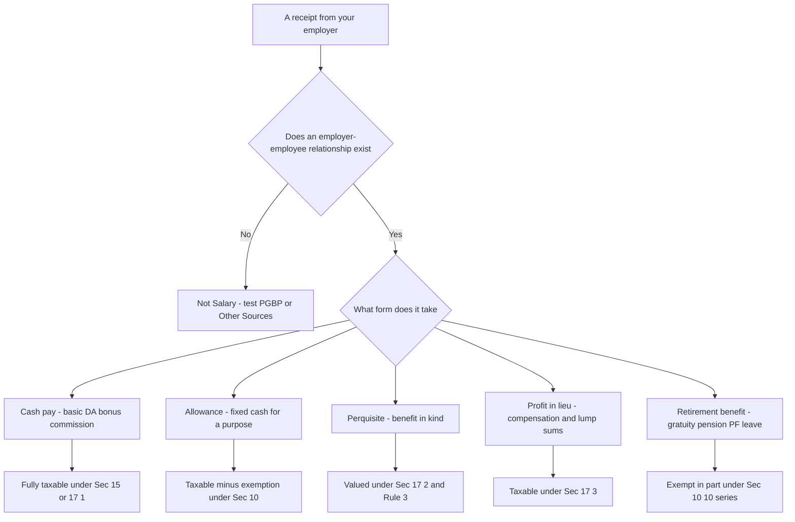
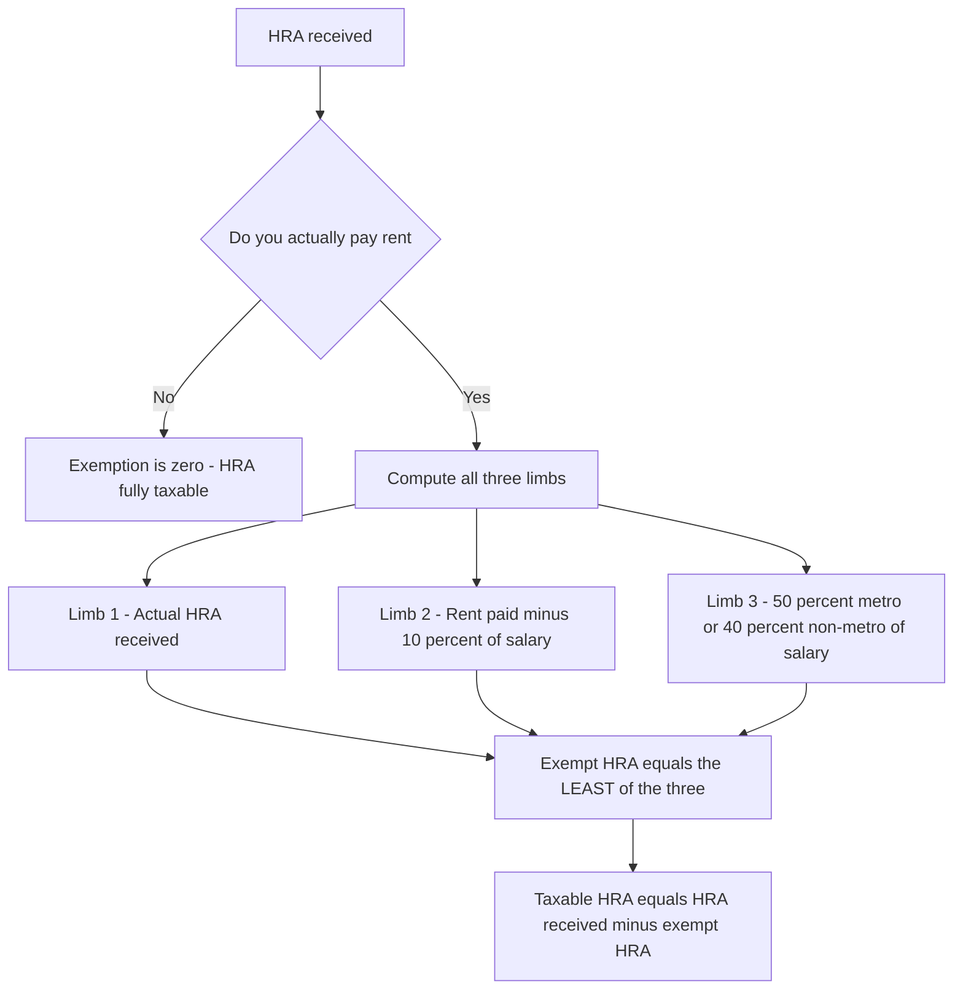
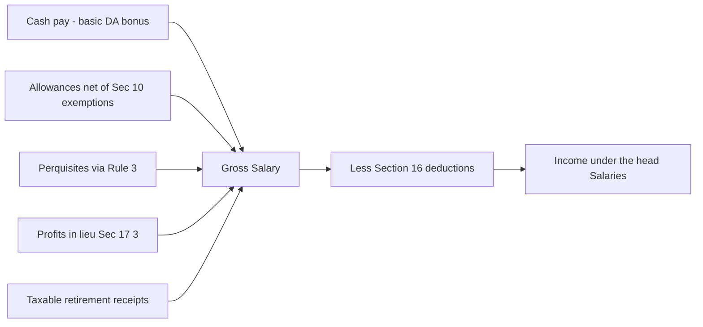

# Chapter 03 — Income under the Head "Salaries"

> **A note on rates and limits before we begin.** This chapter teaches the *structure and logic* of salary taxation, which is stable across decades. The exact monetary limits (HRA caps, gratuity ceiling, standard deduction amount, perquisite valuation rates) are tuned by Parliament almost every year. **Always verify the exact rates, limits and the applicable Assessment Year in current ICAI study material for your attempt.** The reasoning below tells you *why* a limit exists; that never changes.

---

## 1. The Problem — Why "Salaries" Needs Its Own Rulebook

Imagine you are the tax department. A country has crores of earners, and by far the largest, most disciplined, most *visible* group is salaried employees. Their income arrives monthly, from an identifiable payer (the employer), through a bank, on a fixed contract. This is the easiest income in the entire economy to see and to tax.

But "salary" is deceptively messy. An employer rarely pays a clean single number. She pays:

- a **basic** amount, plus
- a **house rent allowance**, a **transport allowance**, a **medical reimbursement**,
- a **car** the employee drives home, a **flat** the company owns, **subsidised** canteen food,
- an interest-free **loan**, **stock options**, a **club membership**,
- and at the end — **gratuity, pension, leave encashment, provident fund**.

Every one of these is a *benefit flowing from employer to employee*. If the law taxed only the word "salary" printed on the payslip, every clever employer would relabel pay as "reimbursement" or "perquisite" and the largest tax base in the country would evaporate.

**So the problem is threefold:**

1. **Scope** — how do we capture *every* form of value an employee receives, not just the cash line?
2. **Timing** — salary is promised, then paid, sometimes in advance, sometimes in arrears. *When* do we tax it?
3. **Fairness** — some receipts (a retirement gratuity after 30 years, rent paid out of a city allowance) aren't really "surplus income" — they replace a genuine cost or a lifetime of service. Taxing them fully would be unjust.

The head "Salaries" (Sections **15 to 17** of the Income-tax Act, 1961) is the machinery built to solve exactly these three problems.

---

## 2. The Core Idea — Tax the *Total Employment Reward*, on the Earlier of Due or Receipt

Strip away the detail and the head "Salaries" rests on one sentence:

> **Everything of value that flows to you *because* an employer-employee relationship exists is salary, and it is taxed the moment you become *entitled* to it or actually *receive* it — whichever happens first.**

Two design choices are packed into that sentence:

**(a) The relationship is the trigger, not the label.** The law does not ask "is this called salary?" It asks "does a master–servant (employer–employee) relationship exist, and did this benefit arise from it?" If yes → head Salaries. If the same work were done by an independent professional, the *identical* payment would fall under "Profits and Gains of Business or Profession". The relationship is the dividing line (we return to this in §4).

**(b) Due-or-receipt, whichever is earlier (Section 15).** Most heads of income tax you when money arrives. Salary is special: it is taxed on **accrual (due) OR receipt, whichever is earlier** — so you cannot dodge tax by asking your employer to *hold* your March salary, and you cannot be taxed twice when the held amount is finally paid.

That single "whichever is earlier, but never twice" rule is the spine of §3.

---

## 3. Why It's Built This Way — The Design Logic

### 3.1 Why "due or receipt, whichever is earlier"?

Consider three timing games an employee (or a colluding employer) might play:

| Game | What they'd try | How the rule blocks it |
|---|---|---|
| **Defer** | "Don't pay my bonus this year; pay it next year when I'll be in a lower slab." | If it became **due** this year, it is taxed this year even if received later. |
| **Advance** | "Pay me next year's salary now." | **Advance salary** is taxed on **receipt** now (received before due). |
| **Double-count** | Tax authorities try to tax the *arrear* both when it accrued and again when paid. | Section 15's proviso: salary already taxed on due basis is **not** taxed again on receipt. |

The rule is therefore an **anti-timing-arbitrage** device. Notice the asymmetry with other heads — this exists precisely because salary is contractual and predictable, so the accrual date is *knowable*, unlike (say) a business windfall.

> **Memory hook — "Section 15 = the 1-5 gate."** Salary passes through a gate that opens on the *earlier* of two dates, and the gate lets each rupee through *only once*.

### 3.2 Why does the employer-employee relationship matter so much?

Because the *same rupee* is taxed under different rules depending on the relationship, and taxpayers will always route income to the cheapest head. A director's *sitting fee* (no master-servant control) is "Other Sources"; a director who is also a whole-time *employee* earns "Salary". A partner's remuneration from his firm is **business income**, not salary, because a person cannot be his own employee. The law needs a bright-line concept — **control and supervision** — to sort receipts into the right head with the right deductions.

### 3.3 Why exempt parts of allowances and retirement benefits?

Here the policy is **"tax surplus, spare cost-recovery and reward-for-life-of-service."**

- An allowance given to *meet an expense* (rent in an expensive city, travel on tour) is not really surplus — so the law exempts it **to the extent it is actually spent / capped**. Beyond the cap, it *is* surplus → taxable.
- Retirement benefits (gratuity, pension, leave encashment, PF) represent **decades of deferred reward and social security**. Fully taxing a lump sum received once, at retirement, in the year's slab, would be brutal and would discourage saving. So the law grants **structured exemptions** — always the *least of* a few figures, so the relief is real but not unlimited.

Every exemption you will memorise is an instance of one of these two ideas. If you understand the idea, you can *reconstruct* the "least of the following" formula rather than recall it blindly.

*Figure 3.1 — The master decision tree for any employer receipt. Every later section is just a branch of this tree.*

---

## 4. Full Technical Content — Sections, Definitions, Format (each with its "why")

### 4.1 The charging section — Section 15

Section 15 charges to tax:
1. Salary **due** from an employer (whether paid or not),
2. Salary **paid or allowed** before it became due (advance salary),
3. **Arrears** of salary paid/allowed and not taxed in any earlier year.

**Why the three limbs?** Limbs (1) and (2) are the "earlier of due/receipt" rule split into its two triggers. Limb (3) is the safety net catching anything that slipped through. The **proviso** prevents double taxation.

> ⚠️ **Advance salary vs. Advance *against* salary (loan).** A genuine loan later adjusted against salary is **not** taxed on receipt — it is a loan, not salary due. Examiners love this distinction.

### 4.2 What "Salary" includes — Section 17(1)

Section 17(1) defines *salary* inclusively. Memory hook: **"WAGP-F-PL"** — Wages, Annuity/pension, Gratuity, fees/commission/**Perquisites**, **Profits in lieu**, advance salary, leave encashment, employer's PF contribution & interest beyond limits, and the transferred NPS/pension-scheme contributions.

The definition is deliberately **inclusive ("includes")**, not exhaustive — so nothing escapes by not being listed.

### 4.3 Basis of charge & other structural rules

- **No deduction for expenses** (except those specifically allowed — see §4.7). Because employment costs are personal, and the employer already bears business costs.
- **Salary from more than one employer** in a year → aggregate all.
- **Foregone salary** is still taxable (you can't escape tax by *surrendering* salary already due) — but salary *surrendered to the Central Government* under the Voluntary Surrender of Salaries Act is not taxed.
- **Place of accrual**: salary for services rendered in India is deemed to accrue in India (links to residential status, Chapter 02).

### 4.4 Allowances — the "spare the cost, tax the surplus" family (Section 10)

An **allowance** is a *fixed sum in cash* given to meet a particular requirement. The taxability spectrum:

| Type | Examples | Rule | Why |
|---|---|---|---|
| **Fully taxable** | Dearness allowance, City compensatory, Overtime, Servant, Warden, Non-practising | Whole amount is salary | Pure cash surplus — no cost being reimbursed |
| **Exempt up to a limit (Sec 10(14))** | Children education allowance, Hostel allowance, Transport for the disabled, Tour/travel/daily allowances | Exempt = amount spent or notified cap, whichever lower | Meant to meet a real expense — relief only to that extent |
| **House Rent Allowance — Sec 10(13A)** | HRA | Least-of-three formula (below) | Reimburses genuine rent cost in excess of a baseline |
| **Fully exempt** | Allowances to High Court/Supreme Court judges, UN employees | Whole amount exempt | Special policy/constitutional reasons |

#### The HRA logic — Section 10(13A) read with Rule 2A

**The problem HRA solves:** Two employees earn the same. One owns her home; one rents in Mumbai. The renter has a genuine, unavoidable cost the owner doesn't. HRA exemption equalises them — but only for *rent actually paid above a reasonable share of salary*, and only *up to a city-linked cap*.

**Exempt HRA = LEAST of the following three:**

1. **Actual HRA** received;
2. **Rent paid − 10% of salary** (the "excess over a reasonable self-share" — the logic core);
3. **50%** of salary (metro cities) **/ 40%** of salary (non-metro) — the city cap.

*"Salary" here = Basic + Dearness Allowance (if it enters retirement benefits) + commission as a fixed % of turnover.*

> **Why "rent − 10% of salary"?** The law assumes you'd spend *at least* 10% of salary on housing anyway (that's not a special cost of the job). Only the *excess* is the reimbursable burden. **Why the 50/40 cap?** To stop high earners in cheap housing from claiming huge exemptions — the relief is tied to city cost norms, not personal extravagance.

> **If you pay no rent, limb 2 = 0, so exemption = 0 — HRA is fully taxable.** This is the single most common HRA trap.

*Figure 4.1 — HRA exemption is always the least of three. Note limb 2 collapses to zero when no rent is paid.*

### 4.5 Perquisites — benefits in kind — Section 17(2), valued by Rule 3

A **perquisite** ("perk") is any *benefit or amenity* granted by reason of employment, in a form other than plain cash. The definition problem: if a benefit is a car, a flat, a subsidised loan — *what rupee value* do we tax? The answer is **Rule 3**, which converts each perk into a taxable money value using a fixed formula, so two employees with the same real benefit are taxed the same regardless of the employer's actual cost.

**Three tiers of perquisites (why the split matters):**

| Tier | Taxable in whose hands | Logic |
|---|---|---|
| **Taxable for all employees** | Everyone | Genuine personal benefit e.g. rent-free house, interest-free loan, ESOP, employer paying employee's obligation |
| **Taxable only for "specified" employees** | Directors, >20% shareholders, or salary (excl. non-monetary perks) above the threshold | Car, free/subsidised services, gardener/sweeper/watchman — historically these were hard to value, so limited to higher earners |
| **Exempt perquisites** | None | Medical facilities within limits, telephone, employer contribution to recognised funds, refreshments, LTC within limits — because they are welfare/tools of trade, not surplus |

**Key valuation rules (Rule 3) — learn the *principle*, verify the *rate*:**

- **Rent-free / concessional accommodation:** valued as a % of salary (govt vs. non-govt, population-slab based) less rent recovered. *Why a % of salary?* Because the benefit's worth scales with the standard of living the job supports; verify current % slabs.
- **Motor car:** value depends on *who owns* the car, *who pays* running costs, and *engine capacity* (fixed monthly figures). *Why fixed figures?* Splitting official vs. personal use exactly is impossible, so the law uses a standardised assumed personal-use value.
- **Interest-free/concessional loan:** taxable value = interest at the **SBI rate** on the outstanding balance *minus* interest actually charged. Small loans and medical-treatment loans are exempt. *Why SBI rate?* A neutral market benchmark for the benefit of cheap money.
- **ESOP / sweat equity:** taxable = **FMV on date of exercise − price paid**, taxed as a perquisite (then FMV becomes cost for future capital gains). *Why on exercise?* That's when the benefit crystallises.
- **Free education, domestic servants, gas/electricity, gifts (above a small limit), credit card & club expenses:** each has its own Rule 3 valuation, always "cost/value to employer less amount recovered from employee."

> **Memory hook for the perk universe: "HALE-CG"** — Housing, Automobile, Loans, ESOP, Concessional services, Gifts. Every Rule 3 item is one of these.

### 4.6 Profits in lieu of salary — Section 17(3)

These are **lump sums that stand in place of salary** — the law taxes them so that "compensation" cannot be used as a tax-free wrapper for what is really pay. Includes: **terminal compensation** on termination/modification of employment, payments from an **unrecognised** PF (employer's share + interest), **keyman insurance** proceeds, and any amount received *before joining* or *after leaving* employment.

*Why tax these?* Without §17(3), an employer could label a golden handshake as non-salary "compensation." The section closes that door — while genuine hardship relief flows through the **Section 10(10B) retrenchment / VRS** exemptions instead.

### 4.7 Deductions from salary — Section 16

Because salary is otherwise taxed gross, §16 gives back three specific deductions:

| Sec | Deduction | Why it exists |
|---|---|---|
| **16(ia)** | **Standard deduction** — a flat amount (verify current figure), no proof needed | Replaces the old ad-hoc expense claims; a simple, universal recognition that earning salary has *some* cost. Capped at the flat figure or salary, whichever is lower. |
| **16(ii)** | **Entertainment allowance** — deduction only for **government** employees (least of: 1/5 of basic salary, statutory cap, or actual allowance) | A narrow historical relic; private employees get *no* deduction, only the government cap. |
| **16(iii)** | **Professional tax / tax on employment** actually paid | It's a state levy on the very act of employment — taxing salary on money already taken as tax would be double taxation. If the *employer* pays it, it's first added as a perquisite, then deducted. |

> **The standard deduction differs under the old vs. new tax regime — verify the current AY figure for each regime in ICAI material.**

### 4.8 Retirement benefits — the "reward for a life of service" family

Here is the deepest exemption logic. Each benefit answers: *"How do we relieve a once-in-a-lifetime lump sum from a full slab hit, without letting it become a tax shelter?"* The answer is always **"exempt the least of the following."**

#### (a) Gratuity — Section 10(10)

A thank-you for long service, paid on retirement/death.

| Employee type | Exemption = LEAST of |
|---|---|
| **Government employee** | **Fully exempt** |
| **Covered by Payment of Gratuity Act** | (i) Actual gratuity; (ii) statutory ceiling (verify); (iii) 15/26 × last drawn salary × years of service (part-year > 6 months rounds up) |
| **Other employees** | (i) Actual; (ii) statutory ceiling; (iii) ½ month **average** salary (last 10 months) × completed years (ignore part-year) |

*Why "15/26" for Act-covered?* The Act deems a month = 26 working days and grants 15 days' wages per year — that fraction is the statutory formula, not arbitrary.

#### (b) Pension — Section 10(10A)

- **Uncommuted** (monthly) pension → **fully taxable** as salary (it's just deferred monthly pay).
- **Commuted** (lump-sum) pension → exempt:
  - Government employees: **fully exempt**.
  - Others: **1/3** of full value if they *also* receive gratuity; **1/2** if they *don't*. *Why the ½ vs ⅓?* If you got no gratuity, the law is more generous with the pension lump sum to compensate.

#### (c) Leave encashment — Section 10(10AA)

Encashing unused earned leave.

| When | Rule |
|---|---|
| **During service** | Fully taxable |
| **On retirement — Government employee** | Fully exempt |
| **On retirement — Other** | LEAST of: (i) actual; (ii) notified ceiling (verify); (iii) 10 months' average salary; (iv) cash equivalent of leave (max 30 days per completed year) |

#### (d) Provident Fund — the four-fund logic

A PF has **four money streams**: employee's contribution, employer's contribution, interest on each. Tax treatment depends on *which fund*:

| Fund type | Employer contribution | Interest credited | Lump sum at retirement |
|---|---|---|---|
| **Statutory PF (SPF)** | Exempt | Exempt | Fully exempt |
| **Recognised PF (RPF)** | Exempt up to 12% of salary (excess taxable); *plus* contributions above the annual PF-cap and interest thereon are taxable | Exempt up to a notified rate; excess taxable | Exempt if 5 yrs continuous service (else taxable) |
| **Unrecognised PF (URPF)** | Not taxed yearly | Not taxed yearly | Employer's share + interest → **taxed as "profits in lieu"**; employee's own interest → "Other Sources"; own contribution → not taxed |
| **Public PF (PPF)** | N/A (self) | Exempt | Fully exempt |

*Why does RPF cap the employer's contribution at 12% and interest at a notified rate?* Because contributions are **deferred salary**. Below the cap, the state is subsidising retirement saving (good policy). Above it, the "fund" is being used to park excess pay tax-free — so the excess is pulled back into salary. **Employee's own contribution to RPF** qualifies for **Section 80C** deduction (Chapter on deductions) — the fund is thus **EEE** (Exempt-Exempt-Exempt) within limits.

> **Memory hook — retirement exemptions are all "LEAST OF."** Gratuity, leave encashment, commuted pension all follow *actual / statutory cap / formula*. If you remember "the law wants relief to be *real but bounded*," you can rebuild every table.

---

## 5. Worked Examples (full step-by-step, easy → exam-hard)

> All figures are illustrative. **Confirm the exact caps (HRA metro %, gratuity ceiling, standard deduction) for your AY.** The *method* is what these examples lock in.

### Example 1 — Warm-up: HRA exemption

**Facts.** Ms A works in Mumbai (metro). Basic salary ₹40,000/month, DA ₹10,000/month (enters retirement benefits), HRA received ₹18,000/month. She pays rent of ₹22,000/month. Compute taxable HRA for the year.

**Step 1 — Annualise and define "salary."**
Salary for HRA = Basic + DA (as it enters retirement benefits) = (40,000 + 10,000) × 12 = **₹6,00,000**.
HRA received = 18,000 × 12 = **₹2,16,000**. Rent paid = 22,000 × 12 = **₹2,64,000**.

**Step 2 — The three limbs.**

| Limb | Computation | Amount |
|---|---|---|
| 1. Actual HRA | — | 2,16,000 |
| 2. Rent − 10% of salary | 2,64,000 − 60,000 | 2,04,000 |
| 3. 50% of salary (metro) | 50% × 6,00,000 | 3,00,000 |

**Step 3 — Least of three = ₹2,04,000 (exempt).**
**Taxable HRA = 2,16,000 − 2,04,000 = ₹12,000.**

*Reconciliation check:* limb 2 (the "genuine excess cost") binds, which is typical when rent is high but not extreme — logic confirms the number.

---

### Example 2 — Retirement benefits: gratuity + leave encashment

**Facts.** Mr B, a *non-government* employee **not covered** by the Gratuity Act, retires after **26 years 8 months**. Last-drawn salary is ₹50,000/month (Basic ₹40,000 + DA ₹10,000, DA fully enters retirement benefits). Average salary of the **last 10 months** = ₹48,000/month. He receives **gratuity of ₹9,00,000** and **leave encashment of ₹3,00,000** (leave standing to credit = 240 days; leave entitlement was 30 days per year of service). Assume gratuity ceiling ₹20,00,000 and leave-encashment ceiling ₹25,00,000 (verify current figures).

**Part A — Gratuity (non-Act employee, so ignore part-year → 26 completed years).**

| Limb | Computation | Amount |
|---|---|---|
| (i) Actual | — | 9,00,000 |
| (ii) Statutory ceiling | — | 20,00,000 |
| (iii) ½ month avg salary × completed years | ½ × 48,000 × 26 | 6,24,000 |

**Exempt = least = ₹6,24,000. Taxable gratuity = 9,00,000 − 6,24,000 = ₹2,76,000.**

**Part B — Leave encashment (non-govt).** "Salary" = average of last 10 months = ₹48,000.
Cash equivalent of leave allowed = **max 30 days per completed year** = 30 × 26 = 780 days entitlement; leave *actually standing* = 240 days, so use the lower actual credit → 240 days = 240/30 = 8 months.

| Limb | Computation | Amount |
|---|---|---|
| (i) Actual | — | 3,00,000 |
| (ii) Statutory ceiling | — | 25,00,000 |
| (iii) 10 months' avg salary | 10 × 48,000 | 4,80,000 |
| (iv) Cash equiv of leave (max 30 days/yr) | 8 × 48,000 | 3,84,000 |

**Exempt = least = ₹3,00,000. Taxable leave encashment = 3,00,000 − 3,00,000 = ₹0.**

*Reconciliation:* the *actual* amount is the smallest, so the entire receipt is exempt — sensible, because he encashed less than the formula ceilings allow.

---

### Example 3 — Exam-hard: full salary computation with perquisites, allowances and PF

**Facts (Assessment Year — verify current figures).** Mr C is employed in **Delhi (metro)** by XYZ Ltd. For the year:

- Basic salary: ₹80,000/month.
- Dearness allowance: ₹20,000/month (**50% enters retirement benefits**).
- Bonus: ₹1,20,000.
- HRA received: ₹30,000/month; rent paid: ₹28,000/month.
- Children education allowance: ₹1,000/month for 2 children (assume exemption ₹100/child/month).
- Transport/car: employer provides a **1.8-litre company car** with driver, for **both official and personal** use; employer meets all running costs. (Assume Rule 3 value: ₹2,400 + ₹900 driver = ₹3,300/month — *verify current figures*.)
- **Rent-free unfurnished accommodation** owned by employer in Delhi (population > 40 lakh). (Assume valuation = 10% of salary — *verify current % under Rule 3*.)
- Employer contributes **14% of (Basic+DA)** to a **Recognised PF**; Mr C contributes an equal amount.
- Interest credited on RPF at **11%** (assume notified exempt rate = 9.5%): interest credited ₹66,000.
- Professional tax paid: ₹2,400. Standard deduction: assume ₹50,000 (**verify current figure and regime**).

> **Order of operations (this is the reusable format).** Compute (1) cash pay, (2) taxable allowances, (3) perquisites, (4) taxable PF/interest, gross it up, then subtract §16 deductions.

**Step 1 — Cash components.**
Basic = 80,000 × 12 = **9,60,000**
DA = 20,000 × 12 = **2,40,000**
Bonus = **1,20,000**

**Step 2 — "Salary" for HRA & for accommodation.**
Salary for HRA = Basic + DA-in-retirement (50% of DA) + commission = 9,60,000 + 1,20,000 = **₹10,80,000**.
HRA received = 30,000 × 12 = 3,60,000. Rent = 28,000 × 12 = 3,36,000.

| HRA limb | Computation | Amount |
|---|---|---|
| Actual HRA | — | 3,60,000 |
| Rent − 10% salary | 3,36,000 − 1,08,000 | 2,28,000 |
| 50% of salary (metro) | 50% × 10,80,000 | 5,40,000 |

Exempt = **2,28,000**. **Taxable HRA = 3,60,000 − 2,28,000 = ₹1,32,000.**

**Step 3 — Children education allowance.**
Received = 1,000 × 12 = 12,000. Exempt = ₹100 × 2 children × 12 = 2,400.
**Taxable CEA = 12,000 − 2,400 = ₹9,600.**

**Step 4 — Motor car perquisite.**
Car used for both purposes, employer bears all costs, >1.6 L engine, with driver.
Perquisite = 3,300 × 12 = **₹39,600** (verify current per-month values).

**Step 5 — Rent-free accommodation.**
Valuation base "salary" for accommodation = Basic + DA(in retirement) + bonus + taxable allowances + CEA taxable etc. For this illustration take salary = Basic + DA-in-retirement + Bonus + taxable HRA + taxable CEA = 9,60,000 + 1,20,000 + 1,20,000 + 1,32,000 + 9,600 = **13,41,600**.
Perquisite at assumed 10% = **₹1,34,160** (verify current % / population slab).

**Step 6 — Recognised PF.**
Employer contribution = 14% of (Basic + full DA? — only DA in retirement counts as "salary" for the 12% test; here DA-in-retirement = ₹1,20,000, Basic = ₹9,60,000, so salary for PF = ₹10,80,000).
Employer contributed 14% × 10,80,000 = 1,51,200. **Exempt only up to 12%** = 1,29,600.
**Taxable employer PF = 1,51,200 − 1,29,600 = ₹21,600.**
Interest: credited at 11%, exempt at 9.5%. Taxable interest = 66,000 × (11 − 9.5)/11 = **₹9,000.**

**Step 7 — Assemble Gross Salary.**

| Component | ₹ |
|---|---|
| Basic salary | 9,60,000 |
| Dearness allowance | 2,40,000 |
| Bonus | 1,20,000 |
| Taxable HRA | 1,32,000 |
| Taxable children education allowance | 9,600 |
| Motor car perquisite | 39,600 |
| Rent-free accommodation perquisite | 1,34,160 |
| Taxable employer RPF contribution | 21,600 |
| Taxable interest on RPF | 9,000 |
| **Gross Salary** | **16,65,960** |

**Step 8 — Section 16 deductions.**

| Deduction | ₹ |
|---|---|
| Standard deduction (16(ia)) — assumed | 50,000 |
| Entertainment allowance (16(ii)) — private employee | Nil |
| Professional tax (16(iii)) | 2,400 |
| **Total deductions** | **52,400** |

**Step 9 — Income under the head "Salaries".**

> **Gross Salary 16,65,960 − Deductions 52,400 = ₹16,13,560.**

*Reconciliation:* every taxable line is a benefit exceeding its exemption cap, every exempt slice was subtracted before it entered gross — the figure is internally consistent. Mr C's own PF contribution (₹1,51,200) does **not** appear here; it is a **Section 80C** deduction claimed later from *Gross Total Income*, not from salary.

---

## 6. The Reusable Salary Computation Format

Commit this skeleton to memory — every exam salary problem is filling in these rows.

| # | Particulars | ₹ | ₹ |
|---|---|---|---|
| 1 | Basic salary | XXX | |
| 2 | Dearness allowance / pay | XXX | |
| 3 | Bonus, commission, fees | XXX | |
| 4 | Allowances (gross) less exempt portion (Sec 10) | XXX | |
| 5 | Taxable value of perquisites (Sec 17(2), Rule 3) | XXX | |
| 6 | Profits in lieu of salary (Sec 17(3)) | XXX | |
| 7 | Taxable retirement receipts (gratuity/pension/leave/PF over limits) | XXX | |
| | **Gross Salary** | | **XXX** |
| | Less: Deductions u/s 16 — Standard (16(ia)) | (XXX) | |
| | Less: Entertainment allowance (16(ii)) — govt only | (XXX) | |
| | Less: Professional tax (16(iii)) | (XXX) | |
| | **Income under the head "Salaries"** | | **XXX** |

*Figure 6.1 — The computation flow: five inflows build Gross Salary; one deduction block converts it to taxable salary.*

---

## 7. Connections — How This Head Links to the Rest of the Act

- **Residential status (Chapter 02):** whether foreign salary is taxable in India depends on residence *and* on where services were rendered (salary for services in India is deemed to accrue here regardless of residence).
- **Deductions Chapter 80C–80U:** employee's PF/PPF contribution, life insurance and NPS feed **Section 80C/80CCD** — claimed from Gross Total Income, *not* inside the salary head. Don't double-count.
- **Capital Gains:** ESOP shares taxed as a perquisite on exercise take their **FMV as cost of acquisition**; later sale is capital gains — the two heads hand off cleanly.
- **Income from House Property:** if the employee *owns* the house whose HRA she claims, or lets out a second house, that's a *different* head — HRA exemption and house-property income can coexist.
- **TDS (Section 192):** the employer deducts tax on estimated salary monthly — the practical reason your salary computation matters in real life.
- **Old vs. New Regime:** many salary *exemptions* (HRA, most allowances) and the entertainment-allowance deduction are **not available under the new regime**; standard deduction is. This changes which lines survive — *verify per regime for your AY.*

---

## 8. Traps & Examiner Tricks

1. **HRA with no rent paid → exemption is NIL** (limb 2 = 0). Fully taxable. The classic trap.
2. **"Salary" is not one number.** For HRA it's Basic + DA(in retirement) + turnover-commission; for gratuity (non-Act) it's the *last-10-months average*; for RFA it's yet another base. **Read which definition each provision uses.**
3. **DA "enters retirement benefits" or not** — if it does, it counts in the HRA/PF/gratuity "salary"; if it doesn't, exclude it. The problem always tells you; students skip the phrase.
4. **Advance salary is taxed on receipt; a loan against salary is not.** And an advance already taxed is not taxed again when it becomes due (Sec 15 proviso).
5. **Uncommuted pension is fully taxable** — only *commuted* pension gets the ⅓/½ exemption.
6. **Gratuity part-year rounding:** *Act-covered* employees round > 6 months up to a full year; *non-Act* employees **ignore** the part-year entirely. Different rules — examiners test both.
7. **Employee's own PF contribution is NOT a salary deduction** — it's an 80C item. Employer's *excess* contribution (over 12%) *is* added to salary.
8. **Entertainment allowance deduction is for government employees only.** Private-sector: add the allowance fully, deduct nothing.
9. **Professional tax paid by the employer** is first *added* as a perquisite, then *deducted* under 16(iii) — net effect isn't zero because it inflates other percentage-based valuations first.
10. **Foregone/surrendered salary is still taxable** (unless surrendered to the Central Government under the specific Act).
11. **Specified vs. non-specified employee** decides whether car/servant-type perks are taxable — check the ₹ threshold and director/shareholder status.
12. **Regime mismatch:** applying old-regime HRA exemption while computing under the new regime — a costly, common error. Confirm the regime first.

---

## 9. First-Principles Recap

- The head "Salaries" exists to capture **the total reward of an employer-employee relationship**, in every form — cash, allowance, kind, or deferred — because that reward is the most visible tax base in the economy.
- **Timing (Sec 15):** tax on the **earlier of due or receipt**, **once only** — an anti-arbitrage rule made possible because salary accrual is knowable.
- **Scope (Sec 17):** an **inclusive** definition so nothing escapes by relabelling; perquisites are **standard-valued (Rule 3)** so equal benefits bear equal tax.
- **Fairness through exemptions:** allowances are exempt **to the extent they meet a real cost** (spare-the-cost); retirement benefits are exempt as the **least of actual / statutory cap / formula** (reward-for-service, but bounded).
- **Deductions (Sec 16)** give back a flat standard amount, professional tax, and (for government staff) entertainment allowance — modest, because employment costs are personal.
- If you internalise **"tax the surplus, spare the cost, reward a life of service — but bound every relief,"** you can *derive* nearly every formula in this chapter instead of memorising it.

---

## 10. Quick-Revision Sheet

### Sections at a glance

| Section | Governs | One-line memory hook |
|---|---|---|
| **15** | Charge — due or receipt, whichever earlier, once only | "The 1-5 gate opens on the earlier date" |
| **16(ia)** | Standard deduction (flat) | Universal cost recognition |
| **16(ii)** | Entertainment allowance | Government employees only |
| **16(iii)** | Professional tax | State levy → deductible |
| **17(1)** | Definition of "salary" (inclusive) | "WAGP-F-PL" |
| **17(2)** | Perquisites (valued by Rule 3) | "HALE-CG" |
| **17(3)** | Profits in lieu of salary | Compensation ≠ tax-free |
| **10(13A)** | HRA exemption | Least of three |
| **10(14)** | Special allowances (education, travel etc.) | Exempt to extent spent/capped |
| **10(10)** | Gratuity | Least of three (govt fully exempt) |
| **10(10A)** | Pension (commuted) | ⅓ if gratuity, ½ if not |
| **10(10AA)** | Leave encashment | Least of four (govt fully exempt) |

### Exemption formulae (least of…) — *verify caps for your AY*

| Benefit | Exempt = LEAST of |
|---|---|
| **HRA (10(13A))** | Actual HRA / (Rent − 10% salary) / 50% (metro) or 40% (non-metro) of salary |
| **Gratuity — Act-covered (10(10))** | Actual / statutory ceiling / (15/26 × last salary × years, >6m rounds up) |
| **Gratuity — non-Act (10(10))** | Actual / statutory ceiling / (½ × 10-month avg salary × completed years) |
| **Commuted pension (10(10A))** | Govt: full. Others: ⅓ of full value (if gratuity received) or ½ (if not) |
| **Leave encashment — non-govt (10(10AA))** | Actual / notified ceiling / 10-month avg salary / cash equiv (max 30 days per completed year) |

### Provident fund treatment

| Fund | Employer contribution | Interest | Lump sum |
|---|---|---|---|
| **SPF** | Exempt | Exempt | Fully exempt |
| **RPF** | Exempt ≤12% of salary; excess taxable | Exempt ≤ notified rate; excess taxable | Exempt if ≥5 yrs service |
| **URPF** | Not taxed yearly | Not taxed yearly | Employer share + interest → profits in lieu |
| **PPF** | Self-contribution | Exempt | Fully exempt |

### Allowance quick-sort

- **Fully taxable:** DA, CCA, overtime, servant, warden, non-practising.
- **Exempt up to spent/cap:** children education, hostel, transport (disabled), tour/travel/daily.
- **Formula-exempt:** HRA (least of three).
- **Fully exempt:** allowances to HC/SC judges, UN employees.

### The four things to check first in any problem
1. **Which regime** (old vs new) — decides which exemptions survive.
2. **Does DA enter retirement benefits?** — changes every "salary" base.
3. **Government or non-government employee?** — flips gratuity/pension/leave/entertainment rules.
4. **Specified vs non-specified employee?** — decides car/servant perquisite taxability.

> **Final reminder:** the *logic* above is durable; the *numbers* (standard deduction, HRA %, gratuity ceiling, car values, PF caps, notified interest rate) are revised frequently. **Before your attempt, reconcile every limit and rate in this chapter against the current ICAI Study Material for your Assessment Year.**
