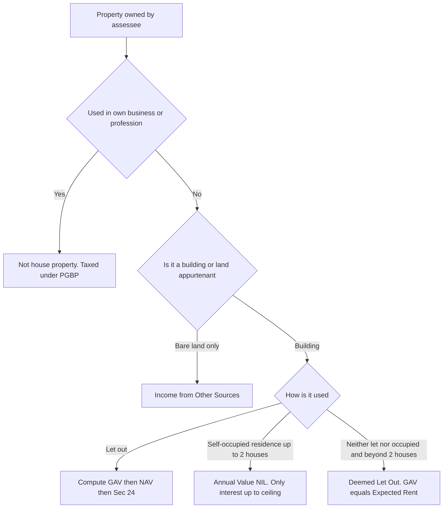
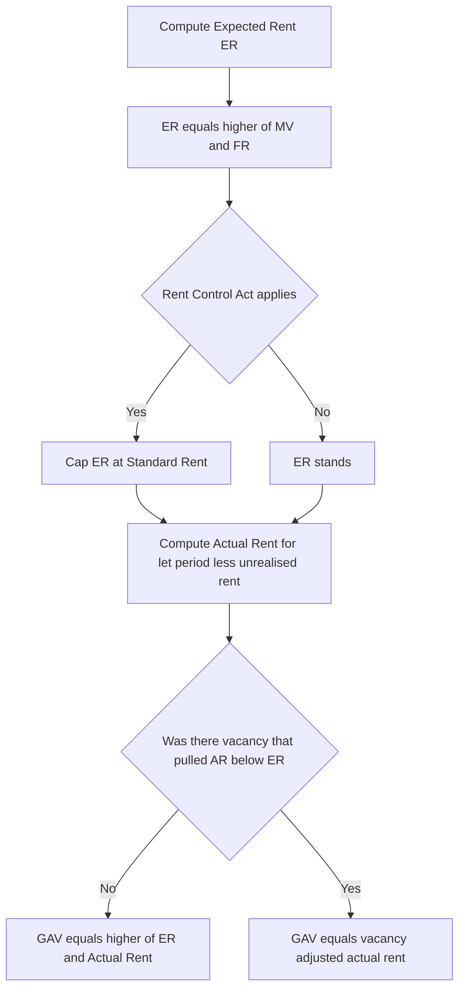
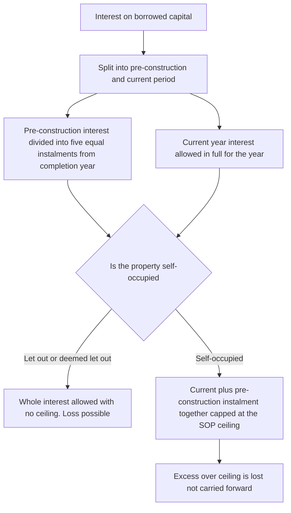

<!-- v2-deep -->

# Chapter 04 — Income from House Property

> **A note on rates & years:** This chapter teaches the *structure and logic* of house property taxation, which is remarkably stable. But the standard deduction percentage, the interest ceiling for self-occupied property, and the treatment of set-off change by amendment. **Always verify the exact limits and the Assessment Year applicable to your attempt against current ICAI study material.** The reasoning below will still hold; only the numbers may shift.

---

## 1. The Problem

Imagine two people. Anil owns a shop and rents it out for ₹40,000 a month. The rent lands in his bank account — clearly income, clearly taxable. Nobody argues.

Now meet Bina. Bina owns an identical shop next door. She *could* rent it out for ₹40,000 a month too. But she chooses to keep it locked and empty because she doesn't feel like dealing with tenants. She earns nothing in cash from it.

Here is the uncomfortable question the tax system must answer: **Should Bina pay less tax than Anil purely because she chose not to exploit an asset that is obviously capable of producing income?**

If your answer is "yes, tax only actual cash received," you have just created a giant loophole. Every wealthy person would hold property, declare it "not let out," collect rent quietly in cash or in the form of favours, and pay nothing. The property's *earning capacity* — its ability to throw off rent — would escape tax entirely, simply by the owner refusing to formally rent it.

There is a second problem hiding underneath. Suppose Chandan rents out a building, but he *also* runs a hotel business inside another building he owns. Both involve buildings. Both produce income. Should they be taxed the same way? If we lump them together, we destroy the ability to give property owners simple, predictable treatment while giving businesspeople the messy, expense-heavy treatment their operations require.

There is even a *third* problem, subtler still. Suppose Deepa owns a building but has quietly gifted it "on paper" to her minor son, or sold it under an unregistered agreement while continuing to pocket the rent herself. Who is the "owner" the law should chase — the name on the municipal register, or the person actually enjoying the income? If the law fixates on paper title, every rent stream can be laundered through a relative or a half-completed sale deed.

So the tax system faces three design challenges:
1. **How do we tax the earning capacity of property, not just the cash it happens to produce?**
2. **How do we separate "I own a building and let it earn passively" from "I run a business that happens to use a building"?**
3. **How do we make sure the *real* economic owner is taxed, even when paper title has been shuffled to a spouse, a minor, or a not-yet-registered buyer?**

Income from House Property is the head of income built to solve exactly these three problems — and once you see them as three problems rather than a pile of sections, the chapter organises itself.

---

## 2. The Core Idea

The central, almost philosophical decision of this head is this:

> **We tax the *inherent earning capacity* of a building — its "annual value" — not merely the rent that actually changed hands.**

This is why the tax base is called the **Annual Value**: a *notional* figure representing what the property is inherently capable of earning in a year. Anil (who rents) and Bina (who keeps it empty) both own an asset with the same earning power, so the law's instinct is to tax that power.

Two crucial softening decisions make this fair rather than brutal:

- **The family home is spared.** Taxing someone on the "notional rent" of the house they actually live in would be politically and morally absurd — you'd be taxing people for the sin of having a roof. So a **self-occupied residential house** is given an Annual Value of **NIL**. The earning-capacity principle bends here for a home you live in.
- **Only two deductions are allowed, both flat or structural.** Because the income is *notional*, the law refuses to get dragged into verifying thousands of small repair and maintenance bills. Instead it gives a single **flat standard deduction** (a fixed percentage) to cover *all* such costs, plus a deduction for **interest on money borrowed to acquire the property** (because that's a real, large, verifiable financing cost). Nothing else. This flat treatment is the signature of the head.

And the separation problem is solved by a simple ownership-and-use test: this head captures income from **buildings/land owned by you and NOT used for your own business or profession**. If the building feeds your business, its income belongs to "Profits and Gains of Business or Profession," not here.

So the mental model is: **House Property = tax on the passive rent-earning power of buildings you own but don't use in your own trade, softened by a NIL value for your own home and a generous flat deduction.**

**A distinction worth burning in early:** the *label* on income (rent) does not decide the *head*. The head is decided by the **source** (a building) and the **relationship** (ownership, non-business use). Rent from a bare plot is still rent, but it is **not** house property income because there is no building. Rent you earn as a *sub-tenant* is still rent, but it is not house property income because you are not the owner. Keep asking "building? owner? not own business?" — not "is it called rent?"

---

## 3. Why It's Built This Way

Let's justify each design choice, because once you see the *why*, the sections stop being arbitrary.

**Why tax notional value at all?** Because the alternative — taxing only received rent — is trivially gamed. The law taxes *ability to earn*, using the reasonable market rent as the yardstick. This is the single most counter-intuitive idea in the head, and every downstream rule flows from it.

**Why require ownership?** Because the earning capacity of a building belongs to whoever owns it. A tenant who sub-lets doesn't own the earning power of the *building* — his profit from sub-letting is business/other income, not house property income. Tying the charge to ownership keeps the right person taxed.

**Why exclude property used in one's own business?** Because a factory or a shop you operate from isn't earning *rent* — it's an input into a business that's taxed under its own head, where you already deduct depreciation, actual repairs, electricity, everything. Taxing its "notional rent" as well would double-count. So the law says: if the building serves your own business/profession, it exits this head entirely.

**Why a flat 30% standard deduction instead of actual expenses?** Two reasons. First, administrative simplicity — the income is already notional, so verifying every collection charge, insurance premium, and repair invoice would be a nightmare for both taxpayer and department. Second, certainty — the owner knows in advance exactly what he can deduct. The flat percentage is a rough-justice proxy for "the costs of holding and maintaining a rented building." You get it *whether or not* you actually spent anything, and you get *only* it, no matter how much you actually spent. That's the deal.

**Why allow interest on borrowed capital separately?** Because financing a property is a genuine, large, and verifiable cost, and it's not the kind of thing a flat maintenance percentage is meant to cover. If the law didn't allow interest, buying property on a loan would be brutally taxed — you'd pay tax on rent while also servicing a loan out of the same money. Allowing interest recognises the real economics of leveraged property ownership.

**Why give the self-occupied home a NIL value but *still* allow interest?** The NIL value spares you from being taxed on your own roof. But the government *also* wants to encourage home ownership, so it lets you deduct home-loan interest even on the house you live in — creating a genuine *loss* under this head that can shelter your other income. That's a deliberate housing-policy subsidy embedded in the tax code.

**Why deduct municipal taxes only when *paid*, but interest when *payable*?** These look inconsistent until you see their different natures. The municipal-tax deduction is a **specific statutory concession** — the law didn't have to allow it at all (it's a personal civic levy on the owner, not strictly a cost of *earning* rent), so it attaches a strict condition: you get it only when you have actually parted with the cash. Interest, by contrast, is a **genuine cost of producing the income**, and Indian income tax generally allows real income-earning expenses on **accrual**. So the mismatch isn't an accident — it reflects that one is a grudging concession and the other is a normal expense.

**Why cap self-occupied interest but not let-out interest?** A let-out property produces taxable income, so its full financing cost should logically be set against that income — no ceiling needed. A self-occupied home produces *no* taxable income (NIL AV), so allowing unlimited interest there would be a bottomless subsidy that the richest borrowers (with the biggest loans) would exploit most. The ceiling caps the housing subsidy at a socially sensible amount.

**Why cap the *inter-head set-off* of house property loss at ₹2,00,000?** Because self-occupied interest deliberately creates a loss, and without a cap a wealthy taxpayer with a huge home loan could wipe out large amounts of salary or business income. The ₹2,00,000 inter-head ceiling (with the balance carried forward) keeps the shelter from becoming a general tax-avoidance device while still delivering the housing incentive to ordinary borrowers. **Verify the current cap for your AY.**

Everything else in this chapter is mechanics serving these ideas.

---

## 4. Full Technical Content

### 4.1 The Charging Section — Section 22

> **Section 22:** The **annual value** of **property consisting of any buildings or lands appurtenant thereto** of which the assessee is the **owner**, *other than* such portions of the property as he may occupy for the purposes of any **business or profession carried on by him**, the profits of which are chargeable to income-tax, shall be chargeable to income-tax under the head **"Income from house property."**

Break Section 22 into its three load-bearing conditions — **all three must be satisfied**:

| # | Condition | The "why" | Memory hook |
|---|-----------|-----------|-------------|
| 1 | There must be a **building or land appurtenant to a building** | The head taxes *buildings*, not bare land. Rent from a vacant plot (with no building) is taxed under "Other Sources," not here. "Appurtenant" land = the courtyard, garden, garage attached to the building. | "**B**uilding, not bare land" |
| 2 | The assessee must be the **owner** | Earning capacity belongs to the owner. | "**O**wner" |
| 3 | The property must **NOT be used by the owner for his own business/profession** whose profits are taxable | If it feeds his own taxed business, it exits this head (avoids double-counting). | "**N**ot own business" |

**Memory hook for all three: "B-O-N" — Building, Owner, Not-own-business.** Fail any one and the income leaves this head.

**Key consequence of condition 1:** Rent from a *vacant plot of land* → **Income from Other Sources**. Rent from a building → House Property. This is a classic exam trap (see §8).

**Key consequence of condition 3:** A doctor who owns a building and runs her clinic from it earns *no* house property income on it — the building is absorbed into her profession. But if she rents out the top floor to a chemist, that floor's rent *is* house property income.

**Finer point — what counts as a "building"?** A building means any structure with a roof, and the head is not limited to residential houses. **Shops, offices, godowns, factory sheds, cinema halls, auditoriums, and even a residential-cum-commercial complex** are "buildings." What is *not* a building: an **open plot, a swimming pool, or open land used as a stadium/parking** with no structure. If a question gives you "rent of open land for a circus / car park," reach for Other Sources unless a building is involved.

**Finer point — "appurtenant" land.** Land *appurtenant* to a building (the garden, drive-way, garage, playground of a school) is taxed *with* the building under this head. But land let out on its own, unconnected to any building, is not. The word "appurtenant" is what pulls the garden into house property; without a building to be appurtenant *to*, land falls out of the head.

**Finer point — ownership of the *building* even if the *land* belongs to someone else.** A person can be taxed on house property income for a **building he owns that stands on land owned by another** (e.g., a superstructure on leased land). Ownership of the building, not the land, is the trigger for the building's annual value.

**A subtle but heavily-tested exception — property situated *outside* India.** House property income arises regardless of where the building is located. For a **resident and ordinarily resident**, rent from a property abroad is taxable in India under this head (subject to relief for foreign tax). The *computation* mechanics (GAV, 30%, interest) are identical; only chargeability depends on residential status. Examiners slip a "flat in London" into a resident's computation to see if you drop it.

### 4.2 Who is the "Owner"? — the deeming provisions

"Owner" means the person entitled to receive income *in his own right*, and it's broader than the person whose name is on the municipal register. **Section 27** *deems* certain persons to be owners so that clever arrangements can't dodge the charge:

| Deemed owner (Sec. 27) | Why the law deems it |
|---|---|
| An individual who **transfers house property to spouse** (not for adequate consideration, not under an agreement to live apart) or to a **minor child** (other than a married daughter) | Prevents dodging tax by gifting the property to family while still effectively enjoying it |
| **Holder of an impartible estate** | Treated as owner of all properties in the estate |
| A **member of a co-operative society / company / AOP** to whom a building is allotted under a house-building scheme | The member, not the society, enjoys the property |
| A person who acquires property under a **power of attorney** transaction / **Section 53A** part-performance (possession taken, consideration paid, though legal title not yet transferred) | Substance over form — the real enjoyer is taxed |
| A person holding a **lease of ≥ 12 years** (excluding month-to-month or ≤1-year leases) | A long lease is economically like ownership |

**Composite point — "deemed owner" exists because the law taxes economic reality, not paper title.**

**Distinctions the examiner probes inside Section 27:**
- **Transfer to a *married daughter* is NOT caught.** A gift of house property to a married daughter genuinely leaves the family unit, so the transferor is *not* deemed owner — she is. Contrast this with transfer to a *minor child* (deemed-owner trap) or to a *spouse* (deemed-owner trap). "Married daughter escapes" is a favourite one-mark distinction.
- **Transfer to spouse under an agreement to live apart is NOT caught.** The anti-avoidance concern (still enjoying the property via the family) is absent in a separation settlement, so the transferee spouse is the owner.
- **"Adequate consideration" defeats deeming.** If the spouse actually *bought* the property at full value, there's no gifting-to-dodge, so no deeming.
- **The ≥12-year lease rule** treats a long lessee as owner; but a lease renewable **month-to-month** or for **a term not exceeding one year** does *not* make the lessee a deemed owner, however many times it is actually renewed.

**Legal owner vs beneficial receipt.** Where the registered owner has genuinely transferred beneficial enjoyment (e.g., a valid trust for beneficiaries), the person entitled to the income *in his own right* is assessed. The theme is constant: **the person who really owns the earning capacity pays the tax.**

### 4.3 Property held as stock-in-trade / income from house property vs. business

- If a builder holds flats as **stock-in-trade** (unsold inventory), the annual value of such property is treated specially: it is generally taken as **NIL for a specified period from the end of the financial year in which the completion certificate is obtained** (verify the current number of years — this limit has been amended and differs by AY). After that period, notional annual value applies. *Rationale:* don't punish a builder with notional rent on unsold stock right after completion, but don't let inventory sit tax-free forever either.
- If the letting is *inseparable* from letting of plant/machinery, or the property is exploited *commercially* as a business, the income can fall under **Business** or **Other Sources** instead. The dividing question is always: *is this passive rent, or an active business?*

**Three practical dividing-line situations to recognise:**
1. **Letting is subservient to a business.** A company that lets out staff quarters to its own workers, or a mill that lets out shops within its compound *as part of running the mill*, may have that rent treated as **business income** because letting is incidental to the trade. Passive rent → house property; letting that is a limb of the business → PGBP.
2. **The taxpayer's *business itself is* letting.** A person whose business is systematically acquiring properties and letting them, providing services, may still be taxed under house property for the *bare* rent — Indian jurisprudence has generally held that mere ownership-and-letting yields house property income even for a company whose object is letting, unless there is a clear commercial exploitation with services. Where the facts show **complex, service-heavy commercial exploitation** (e.g., running a fully-serviced business centre), income can shift to PGBP. *For exams, state the test and apply the facts given; ICAI usually signals which way to go.*
3. **Composite letting of building + plant/machinery/furniture.** Covered in §4.10 — if inseparable, the whole goes to Business/Other Sources; the building never touches this head.

### 4.4 The computation skeleton (learn this cold)

Every let-out property is computed on this exact ladder. Understand each rung by its logic:

```
        Gross Annual Value (GAV)                         [the earning capacity]
  (–)   Municipal taxes actually PAID by owner           [a real civic cost]
  ────────────────────────────────────────
  =     Net Annual Value (NAV)                            [capacity net of civic dues]
  (–)   Standard deduction @ 30% of NAV  [Sec. 24(a)]     [flat proxy for all upkeep]
  (–)   Interest on borrowed capital     [Sec. 24(b)]     [real financing cost]
  ────────────────────────────────────────
  =     Income from House Property
```

Only **two** deductions after NAV — that's the whole of Section 24. Memorise: **"24 = a + b = 30% + interest."**

**Why the order is non-negotiable.** Municipal taxes come off *GAV* (they are a civic outgo on the gross earning capacity), producing NAV. The 30% is then taken on *NAV*, **not** GAV — because the standard deduction is a proxy for upkeep *after* the property has already borne its civic levy. Take 30% of GAV and you over-deduct; every mark of the answer keys checks that the 30% base is NAV.

### 4.5 Step 1 — Gross Annual Value (Section 23)

GAV answers: *what is this property capable of earning, tested against what it actually earned?* The law compares a notional yardstick with the real rent and, broadly, takes the **higher**, then adjusts for vacancy.

**The building blocks:**

| Term | Meaning | Why it exists |
|---|---|---|
| **Municipal Value (MV)** | Value fixed by the local authority for levying municipal tax | An official estimate of rental worth |
| **Fair Rent (FR)** | Rent a similar property in a similar locality would fetch | Market yardstick |
| **Standard Rent (SR)** | Maximum rent legally chargeable under Rent Control Act (if applicable) | The law can't tax you on rent you're legally forbidden to charge |
| **Actual Rent Received/Receivable (AR)** | Rent actually charged for the let-out period (after excluding unrealised rent, subject to conditions) | The real-world figure |

**The GAV logic in three moves:**

**Move 1 — Compute "Expected Rent" (ER):** the property's notional earning capacity.
- ER = **higher of** Municipal Value and Fair Rent…
- …**but capped at Standard Rent** (if a Rent Control Act applies). *Why the cap? Because it's unjust to tax notional rent higher than the maximum the law lets you legally collect.*

> ER = **[higher of (MV, FR)] but restricted to SR**

**Move 2 — Compare Expected Rent with Actual Rent:**
- Broadly, **GAV = higher of ER and Actual Rent Received/Receivable.**
- *Why higher?* Because if you actually got *more* than the notional estimate, that higher real figure is clearly your earning capacity realised; if you got *less* (e.g., a below-market family arrangement), the law falls back on notional ER so you can't under-report by charging a sweetheart rent.

**Move 3 — Adjust for vacancy (the important exception):**
- If the property was **vacant for part of the year** and, *owing to that vacancy*, the actual rent received is **lower than the Expected Rent**, then the **actual rent received (for the let-out period) becomes the GAV** — i.e., you are not taxed on rent for months the property genuinely stood empty.
- *Why?* Vacancy is a real loss of earning capacity. Taxing notional rent for months no tenant existed would tax phantom income. So genuine vacancy pulls GAV *down* to the actual rent.

**The practical order (a clean algorithm):**
1. Compute ER = higher of (MV, FR), capped at SR.
2. Compute Actual Rent for the let-out period (Rent per month × months let, less unrealised rent if conditions met).
3. If **no vacancy** → GAV = higher of (ER, Actual Rent).
4. If **vacancy caused AR < ER** → GAV = Actual Rent (the vacancy-reduced figure).

*(ICAI presents a step-wise comparison; the safest exam approach is: first find ER; then find AR; then compare, and finally apply the vacancy rule. Worked Example 3 shows every branch.)*

**Two finer distinctions inside the GAV rule that separate a 6-mark answer from a 4-mark one:**

- **Unrealised rent vs vacancy are handled at *different* points and for *different* reasons.** Unrealised rent (a defaulting tenant) is **deducted while computing Actual Rent**, *before* the ER-vs-AR comparison. Vacancy (no tenant at all) is a **downward pull applied *after*** you would otherwise have taken the higher of ER and AR. Compute AR net of unrealised rent first; only then bring in the vacancy adjustment. (Different ICAI illustrations sequence the arithmetic slightly differently but always reach the same GAV — see Example 3 and Example 5.)
- **The "owing to vacancy" causation test.** The vacancy rule only pulls GAV below ER when the *shortfall was caused by the vacancy*. If actual rent for the let period is *already* above ER even after knocking out the vacant months, the property still earned more than its notional yardstick, and GAV is that higher actual figure — vacancy did not "cause" AR to dip below ER. Example 3 hits exactly this branch (GAV lands at the vacancy-reduced actual rent, which is still meaningful) and Example 4 shows the branch where ER wins.

**Special GAV situations:**
- **Property let *and* used for own residence at different times in the year** (e.g., let for 8 months, self-occupied for 4): the property is treated as **let-out for the whole year**; actual rent is taken only for the let months, and there is **no** separate self-occupied NIL benefit for the residence months. Only *genuine vacancy* (available to let but no tenant) reduces GAV — self-residence months do not.
- **Municipal value / fair rent given for the whole year** must **not** be pro-rated for vacancy; only the *actual rent* is time-apportioned. The ER stays annual; the vacancy adjustment does the pro-rating.

### 4.6 Step 2 — Municipal Taxes (deduct from GAV to get NAV)

- Municipal/local taxes (house tax, water tax, etc.) are deductible **only if (a) borne by the owner AND (b) actually PAID during the previous year.**
- *Why "paid," not "payable"?* Because it's a *cash civic outgo* the law lets you net off — but only when you've actually parted with the money. Taxes merely due but unpaid get no deduction. This is a favourite trap.
- Taxes paid by the *tenant* are **not** deductible (the owner didn't bear them).

> **NAV = GAV − Municipal taxes actually paid by owner**

**Finer distinctions on municipal taxes:**
- **Year of payment, not year of levy, governs.** If the owner pays *this year* an arrear of municipal tax that related to an *earlier* year, it is still deductible **this year** (the year of actual payment). Conversely, tax pertaining to this year but paid *next* year gets no deduction this year. The deduction rides entirely on the date the cash leaves the owner's hands.
- **Foreign local taxes** on a foreign property, if borne and paid by the owner, are deductible on the same principle when that property's income is taxed in India.
- **On a self-occupied property, municipal taxes give no benefit** — the AV is already NIL, so there is nothing to net them against. Students reflexively deduct them; there is no NAV to reduce.

### 4.7 Step 3 — Deductions under Section 24

Only two, and *only* these two:

**(a) Standard Deduction — Section 24(a): 30% of NAV.**
- A **flat 30% of NAV**, allowed *irrespective* of actual expenditure.
- *Why flat?* Administrative simplicity + certainty (see §3). You get it even if you spent nothing on repairs; you get *only* it even if you spent 50%.
- **Not available** where NAV is nil (e.g., self-occupied), because 30% of nil is nil.
- **It also swallows expenses students want to deduct separately** — insurance, ground rent, collection charges, land revenue, repairs, painting. *All* of these are inside the 30%. If a question lists them, they are distractors; do **not** deduct them again.

**(b) Interest on Borrowed Capital — Section 24(b).**
- Interest payable on money **borrowed to acquire, construct, repair, renew or reconstruct** the property is deductible.
- Deductible on an **accrual (payable) basis** — you don't need to have actually paid it, unlike municipal taxes. *Why the difference?* Municipal tax deduction is a specific statutory concession tied to payment; interest is a normal income-earning expense allowed as it accrues.
- **Let-out property:** the *entire* interest is deductible (no ceiling). This can create a **loss** from house property.
- **Self-occupied property:** interest is capped (a specified ceiling — commonly ₹2,00,000 for a loan taken for acquisition/construction that is completed within the prescribed period, and a lower ₹30,000 ceiling in other cases such as repair loans or where the completion/loan conditions aren't met). **Verify the current ceilings and completion-period conditions for your AY.**
- *Why cap it for self-occupied but not let-out?* A let-out property produces taxable income against which its full financing cost should logically be set. A self-occupied home produces *no* taxable income (NIL AV), so allowing unlimited interest there would be a bottomless subsidy — the ceiling limits the housing subsidy to a sensible amount.

**Interest — the finer points that get tested:**
- **"Interest on interest" is not allowed.** If you fail to pay interest and the lender charges interest on that unpaid interest, the *penal interest on interest* is **not** deductible — only interest on the *borrowed capital* is.
- **Fresh loan taken to repay the original loan.** Interest on a *second* loan taken *to repay the original* acquisition/construction loan **is** deductible — it stands in the shoes of the original borrowing. But interest on a loan taken to *pay municipal taxes* or for a personal purpose is not.
- **Brokerage / processing commission** paid to arrange the loan is **not** interest and is **not** deductible under 24(b).
- **Loan must fund the property, not something else.** If borrowed money is diverted to a non-property use, the interest is disallowed to that extent.
- **Interest to a resident payee may require TDS.** Where interest is paid without deducting tax at source where required, disallowance provisions of the Act can bite — flag it, but the core house-property computation assumes the interest is otherwise allowable.

### 4.8 Pre-construction interest — the timing fix

**The problem:** You take a loan and start paying interest *while the house is being built* — but there's no income and often no "property" to compute income against yet, in the years *before* completion. Do you lose that interest?

**The solution:** Interest for the **pre-construction period** is not lost — it is **aggregated and allowed in 5 equal annual instalments**, starting from the **year in which the construction is completed / property is acquired**.

- **Pre-construction period** = from the **date of borrowing** up to **31st March immediately preceding** the year of completion/acquisition (or the date of repayment of loan, if earlier).
- So each year after completion you deduct: **(current year's interest) + (1/5 of the accumulated pre-construction interest)**, for five years.
- *Why 5 instalments rather than all at once?* Spreading prevents a single huge deduction in year one and matches the deduction roughly to the years the property is generating benefit. For self-occupied property, the pre-construction instalment still counts *within* the overall ₹2,00,000 / ₹30,000 ceiling — verify.

**Memory hook: "Pre-con = 5 slices, served from completion year."**

**The three sub-traps inside pre-construction interest:**
1. **The cut-off is 31 March *before* completion, not the completion date itself.** Interest of the *year of completion* (from 1 April of that FY up to completion, and beyond) is **current-year interest**, deducted in full (subject to any ceiling), *not* part of the pre-construction pool. The pre-construction pool stops on the 31 March that immediately precedes the completion year.
2. **"5 slices" is 1/5 of the *total* pre-construction interest — the same rupee amount each year for five years**, added on top of that year's current interest. It is not re-computed each year.
3. **For a self-occupied property, current interest + pre-construction instalment together must fit inside the ₹2,00,000 (or ₹30,000) ceiling.** For a let-out property there is no ceiling, so both flow in fully. Example 6 drills the self-occupied squeeze; Example 3 drills the let-out (uncapped) case.

### 4.9 Self-occupied vs. Let-out — the two regimes

| Feature | **Self-Occupied Property (SOP)** | **Let-Out Property (LOP)** |
|---|---|---|
| Governing idea | Don't tax your own roof | Tax the earning capacity |
| **Annual Value** | **NIL** (Sec. 23(2)) | GAV per Sec. 23(1) |
| Municipal taxes | No deduction (NAV already nil) | Deductible if paid by owner |
| Standard deduction 24(a) | Nil (30% of nil) | 30% of NAV |
| Interest 24(b) | Allowed **up to ceiling** (₹2,00,000 / ₹30,000 — verify) | **Full**, no ceiling |
| Resulting figure | Usually a **loss** (0 − interest) | Income or loss |

**How many houses can be self-occupied?** An individual/HUF may treat **up to two** houses as self-occupied (AV nil). *Why the "two"?* Recognises real families keep a home in the home town and another where they work. If you own more houses that are neither let nor used for business, the extra ones are treated as **"Deemed Let Out" (DLO)** — you're taxed on their notional expected rent as if let, because you can't have unlimited tax-free homes. **The aggregate self-occupied interest ceiling (₹2,00,000) applies across the SOP houses combined, not per house — verify current rule.**

**Deemed Let Out (DLO):** compute GAV as the Expected Rent (there's no actual rent), then proceed exactly like a let-out property (30% standard deduction, full interest).

**Two heavily-tested wrinkles in choosing which house is self-occupied:**
- **When you own 3+ eligible houses, YOU choose which (up to) two are self-occupied.** The optimal choice is the one that **minimises total taxable income** — usually keep as SOP the houses with the **highest Expected Rent** (so the largest notional rents are shielded to NIL) and treat the lower-value ones as DLO. Examiners award marks for *stating* that the choice is the assessee's and picking the tax-minimising combination.
- **A house that could not actually be self-occupied because the owner lives elsewhere for employment/business** is still eligible for NIL AV as self-occupied under **Section 23(2)(b)**, *provided* it is not actually let and no other benefit is derived from it. This is the "I work in another city and my home town house lies vacant" concession — treat it as SOP with NIL AV even though nobody lives in it.

**The "part of the year let, part self-occupied" clarification (bears repeating).** If a *single* house is let for part of the year and self-occupied for the rest, it is treated as a **let-out property for the whole year** — you do *not* split it into a SOP portion and a LOP portion. Contrast this with a house that is *physically* split — part let, part self-occupied *simultaneously* — where you *do* apportion by area (§4.10).

### 4.10 Special situations (know the treatment)

| Situation | Treatment | Logic |
|---|---|---|
| **Unrealised rent** later **recovered** | Taxable in the year of recovery under house property, even if you no longer own the property; **30% standard deduction** is still allowed on it | It's realised earning capacity, finally received |
| **Arrears of rent** received | Taxable in year of receipt; **30% standard deduction** allowed | Same logic |
| **Property owned by co-owners** with **definite shares** | Each co-owner taxed on his share; each individually gets the SOP benefit/ceiling | Tax each real owner separately |
| **Composite rent** (building + amenities/plant) | If separable → building portion under House Property, rest under Other Sources/Business. If inseparable → whole under Business/Other Sources | Match the substance |
| **Part let, part self-occupied** (physically divided) | Compute each portion separately; apportion MV/FR/SR/taxes/interest by area | Different regimes for different uses |
| **House Property loss set-off** | Loss can be set off against other heads in the same year up to **₹2,00,000**; unabsorbed loss **carried forward up to 8 years** (set off only against house property income thereafter) | Limits the shelter home-loan interest can give against, say, salary |

**Unrealised rent — the Rule 4 conditions (all must be met before you may exclude it from Actual Rent):**
1. The tenancy is **bona fide**;
2. The defaulting tenant has **vacated**, or steps have been taken to compel him to vacate;
3. The defaulting tenant is **not in occupation of any other property** of the assessee;
4. The assessee has **taken all reasonable steps** to institute legal proceedings for recovery (or satisfies the AO that legal proceedings would be useless).

If these are satisfied, unrealised rent is knocked out of Actual Rent (Example 3, Example 5). If *not* satisfied, the full rent is taxed as though received — you cannot exclude a default just because the tenant didn't pay.

**Unrealised rent *recovered* later (Section 25A) — the finer mechanics:**
- Taxed in the **year of recovery**, under house property, **whether or not** you still own that property.
- A flat **30% deduction** is allowed on the recovered amount — even though no fresh 30% "upkeep" is really incurred, the law gives it for consistency.
- The same 25A treatment applies to **arrears of rent** (a subsequent rent increase, e.g., under a revised agreement or court order, received later). Both get the 30% deduction and both are taxed on receipt.

**Co-ownership — the sharp distinction:**
- **Definite and ascertainable shares** → each co-owner is assessed **separately** on his share, and each independently enjoys the self-occupied NIL benefit and his own interest ceiling. This can be tax-efficient (two ceilings instead of one).
- **Shares NOT definite** → the property is assessed as an **Association of Persons (AOP)**, losing the individual concessions. "Definite shares" is the switch.

**Composite rent — the two-branch test in detail:**
- **Separable** (letting the building and letting the amenities/plant/furniture are two independent lettings, either could survive without the other): split the rent. The **building** portion → House Property; the **amenities/plant/furniture** portion → Other Sources (or Business, if it's a business).
- **Inseparable** (the two lettings are so intertwined that one could not be let without the other — e.g., a fully-fitted factory let with its machinery, or a furnished hall let with sound/lighting as one package): the **whole** rent → **Business or Other Sources**, and the building **never enters** this head. Note the striking result: a building can be entirely absent from "House Property" simply because it was let inseparably with plant.

---

## 5. Worked Examples

### Example 1 — A clean let-out property (build the reflex)

**Facts:** Mr. Rao owns a house, let out for the whole year at ₹25,000/month. Municipal Value ₹2,40,000; Fair Rent ₹2,80,000; no Rent Control Act applies. Municipal taxes ₹30,000, fully paid by Mr. Rao during the year. He borrowed ₹20,00,000 for construction; interest for the year ₹1,50,000. Compute his income from house property.

**Step 1 — Expected Rent (ER):**
- Higher of (MV ₹2,40,000, FR ₹2,80,000) = **₹2,80,000**. No SR (no Rent Control) → ER = ₹2,80,000.

**Step 2 — Actual Rent (AR):** ₹25,000 × 12 = **₹3,00,000.** No vacancy.

**Step 3 — GAV:** higher of (ER ₹2,80,000, AR ₹3,00,000) = **₹3,00,000.**

**Computation:**

| Particulars | ₹ |
|---|---:|
| Gross Annual Value | 3,00,000 |
| Less: Municipal taxes paid | (30,000) |
| **Net Annual Value (NAV)** | **2,70,000** |
| Less: Standard deduction @ 30% of NAV [24(a)] | (81,000) |
| Less: Interest on borrowed capital [24(b)] | (1,50,000) |
| **Income from House Property** | **39,000** |

*Check:* 2,70,000 − 81,000 − 1,50,000 = 39,000. ✓

---

### Example 2 — Self-occupied home with a home loan (see the loss)

**Facts:** Ms. Iyer lives in her own house all year (self-occupied). Home loan taken in FY 2018-19 for acquisition; construction completed FY 2019-20. Interest during the current previous year: ₹2,30,000. She has salary income of ₹9,00,000. Assume the ₹2,00,000 self-occupied ceiling applies (verify for your AY).

**Step 1 — Annual Value:** Self-occupied → **NIL.**

**Step 2 — Deductions:**
- 30% standard deduction = 30% of NIL = **NIL.**
- Interest ₹2,30,000, but **capped at ₹2,00,000** for a self-occupied acquisition loan.

**Computation:**

| Particulars | ₹ |
|---|---:|
| Annual Value (self-occupied) | Nil |
| Less: Standard deduction 24(a) | Nil |
| Less: Interest 24(b), restricted to ceiling | (2,00,000) |
| **Income / (Loss) from House Property** | **(2,00,000)** |

**Set-off:** This ₹2,00,000 loss is set off against salary (within the ₹2,00,000 aggregate limit), reducing taxable salary from ₹9,00,000 to **₹7,00,000.** The ₹30,000 interest above the ceiling is simply lost (not carried forward).

*Insight:* the NIL annual value + capped interest is precisely the housing subsidy of §3 in action.

---

### Example 3 — The exam-hard one: vacancy, unrealised rent, standard rent, and pre-construction interest all together

**Facts:** Mr. Sharma owns a house.
- Municipal Value ₹3,00,000; Fair Rent ₹3,60,000; **Standard Rent ₹3,30,000** (Rent Control applies).
- Let out at ₹32,000/month. It remained **vacant for 2 months**; let out for the other 10 months.
- **Unrealised rent** ₹32,000 (one month's rent, all conditions of Rule 4 satisfied).
- Municipal taxes ₹36,000; Mr. Sharma paid ₹24,000 this year, the tenant paid ₹12,000.
- Loan of ₹15,00,000 taken on **1 July 2019** for construction; construction **completed 31 March 2023**. Interest is ₹1,20,000 per year. (Assume current previous year is FY 2023-24 for the pre-construction spread; verify the AY for your attempt.)

**Step 1 — Expected Rent (ER):**
- Higher of (MV ₹3,00,000, FR ₹3,60,000) = ₹3,60,000.
- Capped at Standard Rent ₹3,30,000 → **ER = ₹3,30,000.**

**Step 2 — Actual Rent for the let-out period:**
- Rent = ₹32,000 × 12 = ₹3,84,000 would be full-year; but let for 10 months.
- Rent for let-out period = ₹32,000 × 10 = ₹3,20,000.
- Less unrealised rent ₹32,000 → **AR (received/receivable) = ₹2,88,000.**

*(Note: the 2 months' vacancy loss is ₹64,000; the 1 month unrealised rent ₹32,000 is deducted separately as it satisfies the conditions.)*

**Step 3 — GAV using the vacancy rule:**
- Compare ER ₹3,30,000 with the rent that *would have been received had there been no vacancy*: ₹32,000 × 11 months (12 less the 1 month unrealised) = ₹3,52,000. Since ₹3,52,000 > ER ₹3,30,000, we start from the higher, ₹3,52,000.
- Now **reduce for the 2 months' vacancy**: ₹3,52,000 − ₹64,000 (2 × ₹32,000) = **GAV ₹2,88,000.**
- *Interpretation:* because the property was vacant and, owing to that vacancy, actual rent fell below ER, the vacancy-adjusted actual rent (₹2,88,000) becomes the GAV. The tenant genuinely wasn't there for 2 months, so you aren't taxed on those.

**Step 4 — Municipal taxes:** only the ₹24,000 **paid by the owner** is deductible; the ₹12,000 paid by the tenant is not.

**Step 5 — Pre-construction interest:**
- Loan taken 1 July 2019; completion 31 March 2023.
- Pre-construction period = 1 July 2019 to **31 March 2022** (the 31st March immediately preceding the year of completion FY 2022-23... note: since completion is on the last day 31 Mar 2023, i.e., FY 2022-23, pre-construction period runs up to 31 March 2022).
- Interest ₹1,20,000/yr. From 1 July 2019 to 31 March 2020 = 9 months = ₹90,000; FY 2020-21 = ₹1,20,000; FY 2021-22 = ₹1,20,000. **Total pre-construction interest = ₹90,000 + ₹1,20,000 + ₹1,20,000 = ₹3,30,000.**
- Allowed in **5 equal instalments** from FY 2022-23 onwards: ₹3,30,000 / 5 = **₹66,000 per year.**
- Current year (FY 2023-24) is the 2nd instalment year, so allow ₹66,000.
- **Current year interest** (FY 2023-24, post-completion) = ₹1,20,000.
- **Total interest deduction this year = ₹1,20,000 + ₹66,000 = ₹1,86,000.**

**Computation:**

| Particulars | ₹ |
|---|---:|
| Gross Annual Value (vacancy-adjusted) | 2,88,000 |
| Less: Municipal taxes paid by owner | (24,000) |
| **Net Annual Value (NAV)** | **2,64,000** |
| Less: Standard deduction @ 30% of NAV [24(a)] | (79,200) |
| Less: Interest 24(b): current ₹1,20,000 + pre-con ₹66,000 | (1,86,000) |
| **Income / (Loss) from House Property** | **(1,200)** |

*Check:* 2,64,000 − 79,200 − 1,86,000 = **−1,200.** A small loss. ✓ (This ₹1,200 loss is eligible for set-off against other heads within the ₹2,00,000 limit.)

*This single example exercises: MV/FR/SR cap, vacancy adjustment, unrealised rent, owner-vs-tenant municipal tax, and the pre-construction 5-instalment spread — the exact combination examiners love.*

---

### Example 4 — Below-market "sweetheart" rent (why the law takes the *higher*)

**Facts:** Mr. Verma lets his flat to his cousin for ₹8,000/month for the whole year — well below market. Municipal Value ₹1,80,000; Fair Rent ₹2,10,000; no Standard Rent. Municipal taxes ₹18,000 paid by the owner. No loan. Compute income from house property.

**Reasoning first (the point of the example):** the cousin pays only ₹96,000 a year, but the flat is *capable* of earning ₹2,10,000. If the law taxed only actual rent, every landlord would "let to a cousin" cheaply and pocket the difference off the books. So the notional ER wins whenever actual rent is lower for a non-vacancy reason.

**Step 1 — ER:** higher of (MV ₹1,80,000, FR ₹2,10,000) = **₹2,10,000** (no SR).
**Step 2 — AR:** ₹8,000 × 12 = **₹96,000.** No vacancy.
**Step 3 — GAV:** higher of (ER ₹2,10,000, AR ₹96,000) = **₹2,10,000** (ER wins; the low rent is ignored because there was no vacancy).

**Computation:**

| Particulars | ₹ |
|---|---:|
| Gross Annual Value | 2,10,000 |
| Less: Municipal taxes paid | (18,000) |
| **Net Annual Value** | **1,92,000** |
| Less: Standard deduction @ 30% [24(a)] | (57,600) |
| Less: Interest 24(b) | (0) |
| **Income from House Property** | **1,34,400** |

*Check:* 1,92,000 − 57,600 = 1,34,400. ✓
*Trap defused:* Mr. Verma is taxed on ₹2,10,000 of capacity even though he pocketed only ₹96,000. Contrast this squarely with Example 3, where a *genuine vacancy* — not a cheap deal — was allowed to pull GAV below ER.

---

### Example 5 — Two-house planning: which to keep self-occupied, plus a Deemed-Let-Out

**Facts:** Mr. Nair owns **three** residential houses, none let out, all used by his family at various times (so all could be self-occupied). Expected Rents (already computed, higher of MV/FR capped at SR) are:
- House A: ER ₹4,80,000; municipal taxes paid ₹40,000; interest on loan ₹2,20,000.
- House B: ER ₹3,00,000; municipal taxes paid ₹25,000; interest ₹90,000.
- House C: ER ₹1,50,000; municipal taxes paid ₹10,000; interest nil.

Only **two** houses can be self-occupied (NIL AV); the third is **Deemed Let Out**. Which combination minimises income? (Assume ₹2,00,000 aggregate SOP interest ceiling; verify for your AY.)

**Reasoning:** shielding the two *highest* Expected Rents to NIL removes the most notional income, so treat **A and B as self-occupied** and **C as DLO**. (For SOP, municipal taxes give no benefit and only interest — capped in aggregate at ₹2,00,000 — is deductible.)

**Self-occupied A + B:**

| Particulars | ₹ |
|---|---:|
| Annual Value (A and B, self-occupied) | Nil |
| Less: Interest 24(b) — A ₹2,20,000 + B ₹90,000 = ₹3,10,000, restricted to aggregate ceiling | (2,00,000) |
| **Loss from self-occupied houses** | **(2,00,000)** |

*(₹1,10,000 of interest above the ceiling is lost.)*

**Deemed-Let-Out C:**

| Particulars | ₹ |
|---|---:|
| GAV (= Expected Rent, no actual rent) | 1,50,000 |
| Less: Municipal taxes paid | (10,000) |
| **NAV** | **1,40,000** |
| Less: Standard deduction @ 30% | (42,000) |
| Less: Interest 24(b) | (0) |
| **Income from House C** | **98,000** |

**Total income from house property = (2,00,000) + 98,000 = (1,02,000) loss.**

*Check the plan:* had he instead kept **C** self-occupied and made **A** (ER ₹4,80,000) Deemed-Let-Out, A's DLO income would be roughly 4,80,000 − 40,000 = 4,40,000 NAV, less 30% (₹1,32,000), less full interest ₹2,20,000 = ₹88,000 income — *plus* only B and C's interest (₹90,000) would shelter the SOP side, capped anyway. The A-and-B-as-SOP choice clearly gives the lower (indeed negative) figure. ✓
*Lesson:* state that the **choice belongs to the assessee** and pick the combination that shields the **largest Expected Rents**; for a DLO there is no actual rent, so **GAV = Expected Rent**, then normal let-out mechanics follow.

---

### Example 6 — Self-occupied with pre-construction interest squeezed under the ceiling

**Facts:** Ms. Rao occupies her own house all year. Loan ₹25,00,000 taken **1 October 2020** for construction; construction **completed 15 June 2023** (FY 2023-24). Interest ₹1,80,000 per year throughout. Current previous year is **FY 2023-24**. Compute income from house property (assume ₹2,00,000 SOP ceiling; verify for your AY).

**Step 1 — Annual Value:** Self-occupied → **NIL.**

**Step 2 — Pre-construction interest:**
- Pre-construction period = **1 Oct 2020 to 31 March 2023** (31 March immediately preceding completion year FY 2023-24).
- FY 2020-21: 1 Oct 2020 – 31 Mar 2021 = 6 months = ₹90,000.
- FY 2021-22: ₹1,80,000. FY 2022-23: ₹1,80,000.
- **Total pre-construction interest = 90,000 + 1,80,000 + 1,80,000 = ₹4,50,000.**
- Instalment = ₹4,50,000 / 5 = **₹90,000 per year** for FY 2023-24 to FY 2027-28.

**Step 3 — Current-year interest (FY 2023-24):** completion 15 June 2023, so interest for the *whole* FY 2023-24 (₹1,80,000) is **current** interest (the year of completion's interest is never pre-construction).

**Step 4 — Total interest before ceiling:** current ₹1,80,000 + pre-con instalment ₹90,000 = ₹2,70,000.

**Step 5 — Apply the self-occupied ceiling:** ₹2,70,000 is **restricted to ₹2,00,000**.

**Computation:**

| Particulars | ₹ |
|---|---:|
| Annual Value (self-occupied) | Nil |
| Less: Standard deduction 24(a) | Nil |
| Less: Interest 24(b): (current 1,80,000 + pre-con 90,000 = 2,70,000), restricted | (2,00,000) |
| **Loss from House Property** | **(2,00,000)** |

*Check:* the ₹70,000 excess is **lost**, not carried forward — the ceiling is absolute for a self-occupied house. ✓
*Contrast with Example 3:* there, the identical ₹1,20,000 + ₹66,000 interest flowed in **fully** because the property was **let out** (no ceiling). Same interest arithmetic, opposite outcome — the regime, not the arithmetic, decides.

---

## 6. Computation Format / Presentation

Present *every* house property answer on this template. Examiners award method marks for the ladder even if a number slips.

```
Computation of Income from House Property — Mr./Ms. X, A.Y. 20XX-XX

Step A: Expected Rent (ER)
        = Higher of (Municipal Value, Fair Rent), restricted to Standard Rent

Step B: Actual Rent received/receivable
        = (Rent p.m. × months let)  −  Unrealised rent (if Rule 4 conditions met)

Step C: Gross Annual Value (GAV)
        = Higher of (ER, Actual Rent)          [if no vacancy]
        = Vacancy-adjusted actual rent          [if vacancy pulled AR below ER]

  ─────────────────────────────────────────────
  Gross Annual Value (GAV)                              XXX
  Less: Municipal taxes ACTUALLY PAID by owner         (XX)
  ─────────────────────────────────────────────
  Net Annual Value (NAV)                               XXX
  Less: Standard deduction @ 30% of NAV  [Sec 24(a)]   (XX)
  Less: Interest on borrowed capital     [Sec 24(b)]   (XX)
        = Current-year interest + 1/5 pre-construction
  ─────────────────────────────────────────────
  Income / (Loss) from House Property                  XXX
  ─────────────────────────────────────────────
```

**Presentation rules that earn marks:**
- Always show ER, AR, and GAV as *separate working notes* — don't jump straight to a number.
- State the SR cap and the vacancy rule *explicitly* when relevant.
- Show pre-construction interest as its own working note (period → total → ÷5).
- Label each property; total multiple properties at the end.
- For SOP, write "Annual Value — NIL (self-occupied, Sec 23(2))" so the examiner sees you *know* why.
- When a house is **part let / part self-occupied by area**, present **two separate columns** and apportion MV, FR, SR, municipal taxes, and interest in the area ratio — then total.
- When the assessee owns **3+ houses**, add a one-line note: *"Assessee has opted Houses ___ as self-occupied being the combination that minimises total income; remaining house treated as Deemed Let Out."* That sentence itself carries marks.

### Decision tree — which regime applies?


*Figure 1 — The B-O-N gate decides entry to the head; use decides the regime.*

### Flow — computing Gross Annual Value


*Figure 2 — The GAV algorithm: build ER, compare with AR, then let genuine vacancy pull it down.*

### Interest under Section 24(b) — which cap and how pre-construction fits


*Figure 3 — Interest routing: pre-construction is spread, then the self-occupied ceiling squeezes the total while let-out flows freely.*

---

## 7. Connections

- **→ Deemed owner (Sec 27) links to Clubbing of Income:** transferring property to spouse/minor child is caught both here (deemed owner) and in the clubbing provisions — the law plugs the same leak twice. Note the mirror-image exceptions (married daughter; agreement to live apart; adequate consideration) appear in both chapters.
- **→ Set-off & Carry-forward chapter:** the ₹2,00,000 inter-head set-off cap and 8-year carry-forward of house property loss are examined jointly with this head. A capped self-occupied interest loss is the classic feeder. The *carried-forward* HP loss can thereafter be set off **only against house property income**, not other heads.
- **→ PGBP:** the *dividing line* — building used in own business exits to PGBP; a builder's stock-in-trade flats have a special NIL-for-a-period rule. Composite/inseparable letting can be business income; letting that is *incidental* to a trade (staff quarters, mill shops) can also be PGBP.
- **→ Income from Other Sources:** bare land rent, separable composite-rent amenity charges, and sub-letting profit of a non-owner land here.
- **→ Deductions under Chapter VI-A:** home-loan *principal* repayment is a **Section 80C** deduction (not a house-property deduction) — don't confuse it with the 24(b) *interest*. Additional interest deductions (e.g., 80EE/80EEA for specified affordable-housing loans) sit in Chapter VI-A, not Section 24 — verify availability for your AY.
- **→ Capital Gains:** when the house is sold, gains are taxed under Capital Gains; the *annual value* concept stops and the *sale* concept begins.
- **→ Residential status:** chargeability of a *foreign* property's rent depends on residential status (ROR taxed on global house property income); the computation mechanics are unchanged.
- **→ Alternative tax regime (Sec 115BAC):** under the concessional/default regime, the **self-occupied interest deduction and the set-off of house-property loss against other heads are curtailed** — flag this if a question specifies the regime, and **verify the exact restriction for your AY.**

---

## 8. Traps & Examiner Tricks

1. **Municipal tax — "paid" vs "payable."** Only taxes *actually paid by the owner during the year* are deductible from GAV. Taxes merely *due*, or taxes *paid by the tenant*, get **nothing.** Watch for split payments (Example 3). Arrears of municipal tax paid this year for an earlier year *are* deductible this year.
2. **Interest is "payable," municipal tax is "paid."** Interest under 24(b) is on **accrual** — deductible even if unpaid. Reversing these two is the most common slip.
3. **Standard deduction is 30% of NAV, not of GAV, not of rent.** And it's **flat** — actual repair bills, insurance, ground rent, collection charges are irrelevant *and already inside the 30%.* If the question lists them, they're distractors; ignore them, take 30% of NAV.
4. **Bare land rent is NOT house property.** No building ⇒ Other Sources. A vacant-plot rent, open-parking rent, or swimming-pool rent slipped into a house-property sum is a classic misdirection.
5. **Vacancy vs. unrealised rent are different reductions at different points.** Vacancy adjusts the *GAV* (no tenant existed) *after* the ER-vs-AR comparison; unrealised rent reduces *actual rent* (tenant existed but defaulted, subject to Rule 4) *before* the comparison. Don't merge them.
6. **Self-occupied: 30% standard deduction is NIL and municipal taxes give nothing.** Because NAV is nil. Students reflexively deduct 30% and municipal taxes — there's nothing to take them *from.*
7. **Self-occupied interest ceiling is aggregate across the (up to two) self-occupied houses, not per house** — and interest above the ceiling is *lost*, not carried forward (Examples 2 and 6). Verify current ceiling.
8. **Pre-construction interest instalments start from the completion year, not the borrowing year**, the cut-off is **31 March *before* completion**, and each instalment is 1/5 of the *accumulated* pre-construction interest, added on top of current-year interest. The completion-year's own interest is *current*, never pre-construction.
9. **80C (principal) ≠ 24(b) (interest).** Principal repayment is a Chapter VI-A deduction; don't deduct it under this head. Brokerage/processing fee on the loan is *neither* — not deductible under 24(b) at all.
10. **Deemed Let Out property** (3rd+ house) is taxed on *Expected Rent* even though it earns nothing — students wrongly treat it as self-occupied. And *you choose* which houses are SOP: shield the highest ERs (Example 5).
11. **Composite rent** must be split (separable → building to HP, amenities to Other Sources) or fully diverted (inseparable → whole to Business/Other Sources, building never enters HP). Don't tax amenity charges as house property when separable.
12. **Unrealised/arrears rent recovered later** is taxable *when received*, still with a 30% deduction, *even if the property has since been sold.* Easy to miss the 30%.
13. **Part-year let, part-year self-occupied (one house)** = treated as **let-out for the whole year**; there is **no** NIL benefit for the self-residence months. Only genuine vacancy reduces GAV. Don't split it — contrast with a *physically* divided house, which you *do* apportion by area.
14. **Married daughter / agreement to live apart / adequate consideration** each *defeat* Section 27 deeming — the transferor is **not** deemed owner. Examiners insert one of these to see if you blindly deem.
15. **Co-owners with definite shares are assessed separately** (two SOP benefits, two ceilings); indefinite shares → assessed as an **AOP** (concessions lost). The word "definite" is the switch.
16. **Foreign property of a resident (ROR)** is taxable here — don't drop the "London flat." Non-resident: only Indian-situated property.

---

## 9. First-Principles Recap

Reconstruct the whole head from one sentence: **tax the earning capacity of owned buildings, softened for the home you live in.**

- Because we tax **capacity, not cash**, the base is a *notional* **Annual Value**, benchmarked against market rent (Sec 22, 23) — which is why a below-market "sweetheart" rent still gets taxed on the higher Expected Rent (Example 4).
- Because capacity belongs to the **owner**, ownership is the trigger — and **Sec 27 deems** the real economic owner where paper title lies elsewhere, *unless* the transfer genuinely left the family (married daughter, living-apart settlement, full-value sale).
- Because a building used in **your own business** is already taxed there, it **exits** this head (the "N" of B-O-N); and letting that is merely *incidental* to a trade can likewise be business income.
- Because you shouldn't be taxed on **your own roof**, up to **two** self-occupied homes get **NIL** value — but to *encourage ownership*, home-loan **interest** is still allowed up to a ceiling, deliberately creating a shelter-loss (with the excess simply lost).
- Because the income is **notional**, upkeep is covered by a **flat 30%** deduction (no bill-checking, and it swallows insurance/repairs/collection charges), and only the large, real **financing cost (interest)** is separately allowed. **Two deductions, full stop.**
- Because **vacancy** and **default** are real losses of capacity, the law lets genuine vacancy pull GAV down *after* the ER-vs-AR test, and lets qualifying unrealised rent reduce actual rent *before* it.
- Because **construction takes years** before any income, pre-construction interest isn't lost — it's **spread over 5 years** from completion (with the completion year's own interest treated as current).
- Because an unlimited interest shelter would be abused, the **inter-head set-off of house-property loss is capped at ₹2,00,000**, the balance carried forward 8 years against house-property income only.

If you can derive each rule from "capacity, not cash, with the home spared," you never need to memorise the sections — they *fall out* of the logic.

---

## 10. Quick-Revision Sheet

### Sections at a glance

| Section | What it does | One-line why |
|---|---|---|
| **22** | Charging section — annual value of owned buildings, not used in own business | Taxes passive rent-earning power |
| **23(1)** | How to compute GAV (ER vs AR, vacancy) | Notional capacity vs actual rent |
| **23(2)** | Self-occupied → Annual Value NIL (incl. 23(2)(b): home vacant due to employment elsewhere) | Don't tax your own roof |
| **23(4)** | More than two houses → extra ones Deemed Let Out | No unlimited tax-free homes |
| **23(5)** | Stock-in-trade flats — AV NIL for a specified period | Don't punish unsold builder inventory immediately |
| **24(a)** | Standard deduction **30% of NAV** | Flat proxy for all upkeep |
| **24(b)** | Interest on borrowed capital (incl. pre-construction in 5 slices) | Real financing cost |
| **25A** | Unrealised rent / arrears recovered — taxable, 30% deduction | Realised capacity, finally received |
| **26** | Co-owners with definite shares taxed separately | Tax each real owner |
| **27** | Deemed owner | Substance over paper title |

### Limits & rules table (**verify all figures for your AY**)

| Item | Rule / Limit | Basis |
|---|---|---|
| Standard deduction 24(a) | **30% of NAV** | Flat, regardless of actual spend |
| Interest 24(b) — **let-out** | **No ceiling** (full interest) | Income exists to absorb it |
| Interest 24(b) — **self-occupied**, qualifying acquisition/construction loan | Ceiling **₹2,00,000** (aggregate, ≤2 SOP houses) | Limits housing subsidy |
| Interest 24(b) — **self-occupied**, other cases (e.g., repair loan / conditions not met) | Ceiling **₹30,000** | Lower subsidy for non-acquisition |
| Pre-construction interest | Accumulate from borrowing to 31 March before completion; deduct in **5 equal annual instalments** from completion year | Spread, match to benefit |
| Municipal taxes | Deductible only if **actually paid by owner** in the year (year of payment governs) | Cash civic outgo |
| Number of self-occupied houses | Up to **2** (individual/HUF); extra = Deemed Let Out; assessee chooses which | Real families keep two homes |
| House property **loss set-off** | Against other heads up to **₹2,00,000** per year | Caps the interest shelter |
| Carry forward of HP loss | **8 assessment years** (vs HP income only) | Standard loss carry rule |
| Principal repayment | **Sec 80C** (Chapter VI-A), NOT Sec 24 | Different head of relief |
| Unrealised rent exclusion | Only if **Rule 4** conditions (bona fide, vacated, no other property, legal steps) met | Genuine default, not sweetheart deal |

### The two-line computation you must be able to write blind

```
GAV → (− municipal tax paid) → NAV → (− 30% of NAV) → (− interest 24b) → Income/Loss
ER = higher(MV, FR) capped at SR;  GAV = higher(ER, AR), reduced for genuine vacancy
```

### Memory hooks
- **B-O-N** — Building, Owner, Not-own-business (the three Sec 22 gates).
- **"24 = a + b = 30% + interest"** — the only two deductions.
- **"Tax paid, interest payable"** — municipal tax on payment; interest on accrual.
- **"Pre-con = 5 slices from completion year."**
- **"NIL roof, capped interest, excess lost"** — the self-occupied regime.
- **"Higher for cheap rent, lower for genuine vacancy"** — the two GAV branches (Examples 4 vs 3).
- **"Married daughter escapes; cousin's cheap rent doesn't"** — the two anti-avoidance edges.

> **Final reminder:** the *logic* above is durable; the *numbers* (30%, ₹2,00,000, ₹30,000, 5 instalments, set-off cap, self-occupied count, stock-in-trade period, and the 115BAC restrictions) are amendment-prone. **Confirm every figure against current ICAI material for your Assessment Year before the exam.**
