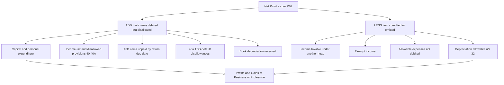
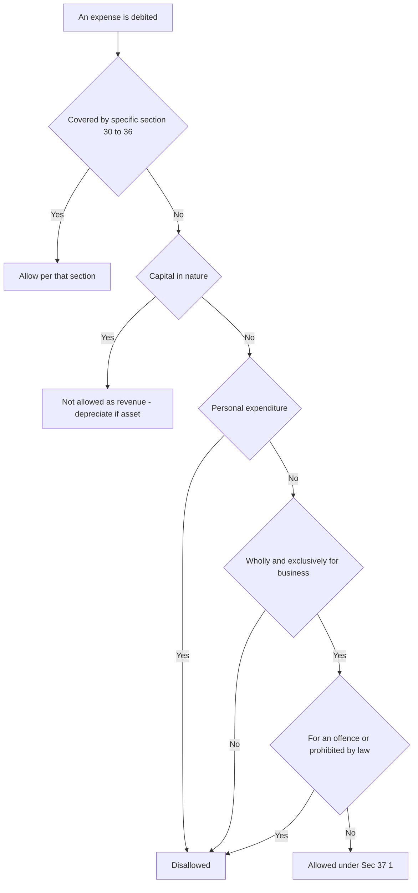
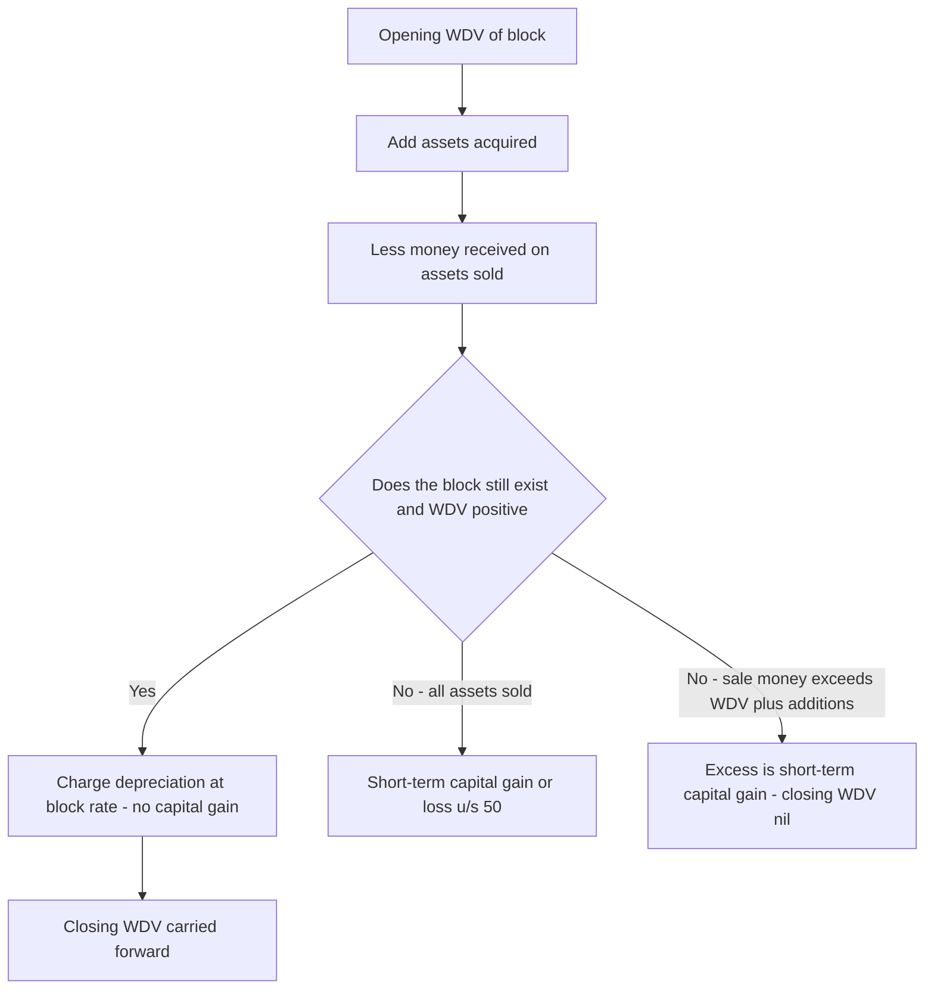
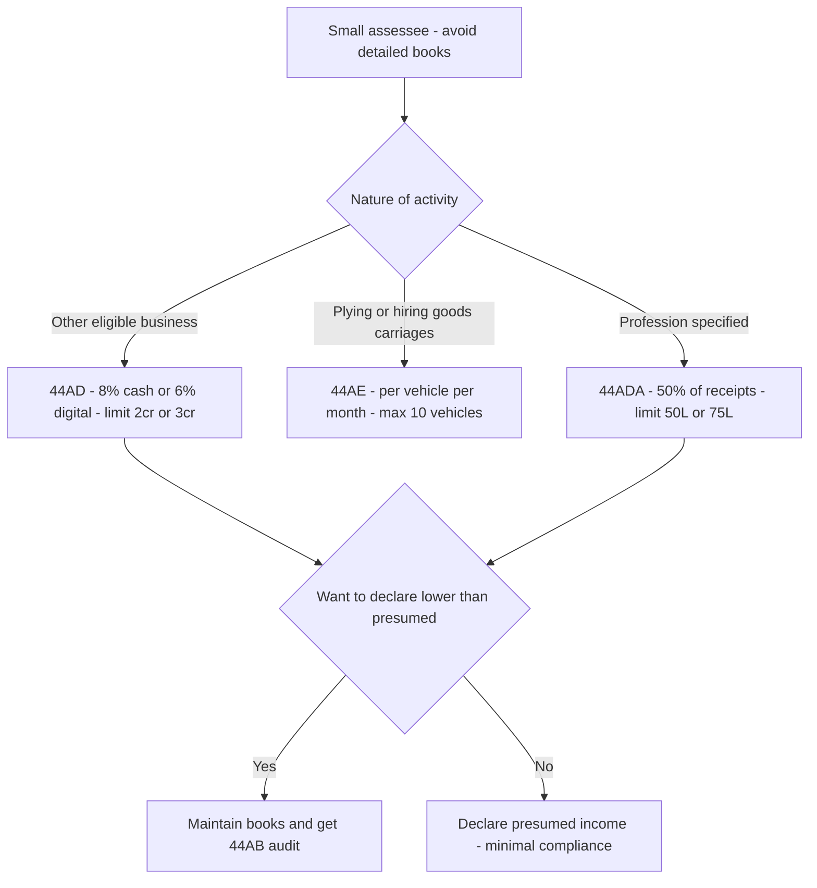
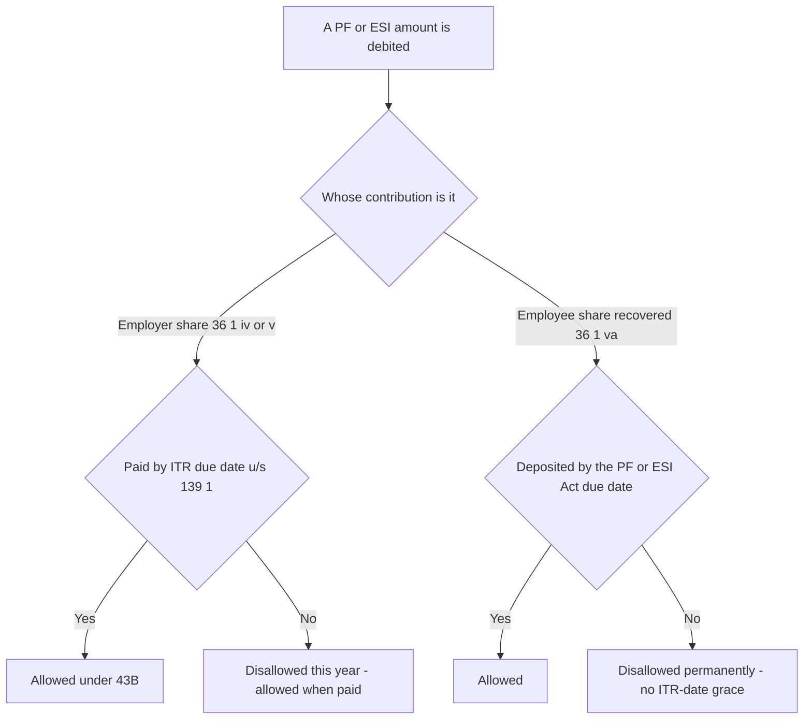
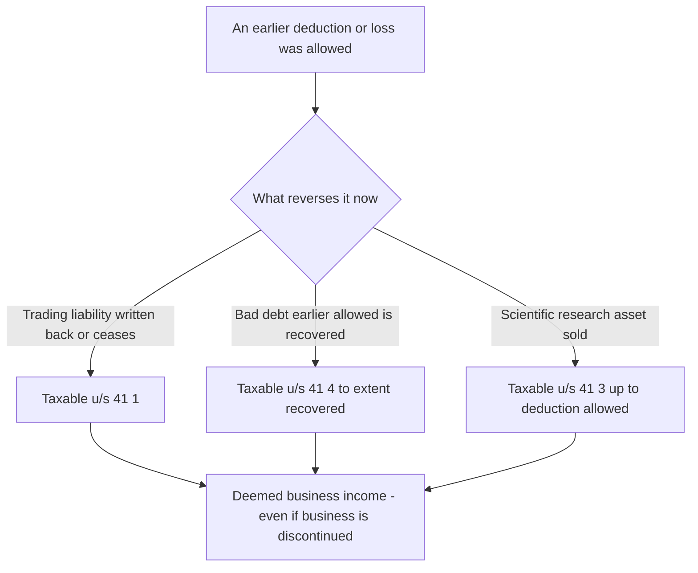

<!-- v2-deep -->

# Chapter 05 — Profits & Gains of Business or Profession (PGBP)

> **Rates & limits caveat:** Tax law changes every Finance Act. This chapter teaches the *structure and logic* of PGBP so you can reason from first principles. Always **verify the exact rates, limits, thresholds and the applicable Assessment Year in current ICAI material for your attempt.** Where a number is given, treat it as an illustrative anchor for the concept, not gospel.

---

## 1. The Problem

Suppose Ramesh runs a garment shop. Over the year his till records ₹80,00,000 of sales. Is Ramesh's *income* ₹80,00,000?

Obviously not. To earn that ₹80 lakh he had to *buy* the garments (₹52 lakh), pay shop rent (₹6 lakh), pay two salesmen (₹4.8 lakh), pay electricity, GST filing fees, the interest on a business loan, and the depreciation on his billing computer and shelves. The ₹80 lakh is **turnover**, not income. What the tax system wants to tax is the *net gain* left over after the costs incurred to produce that turnover.

Now contrast this with Ramesh's neighbour, a salaried manager. The manager's employer pays him ₹80 lakh, and the manager did *not* have to buy inventory or hire staff to earn it. For salary, the gross receipt is very close to the income. For business, the gross receipt is wildly different from income.

This is the core problem PGBP solves. **Business income is fundamentally a *net* concept — a residue after subtracting the expenses genuinely incurred to earn it.** A head of income built for salary (gross-minus-a-few-standard-deductions) cannot handle a business, where the deductions *are* the whole story. Two businesses with identical ₹80 lakh turnover can have profits of ₹15 lakh and ₹2 lakh depending on how efficiently they spend. Tax must follow the profit, not the turnover.

But "let the businessman deduct his expenses" opens three dangerous doors:

1. **The disguise door.** If any expense reduces tax, every rupee the owner spends on himself — his personal car, his son's wedding, a "consultancy fee" to his wife — will be dressed up as a business expense.
2. **The timing door.** A business keeps books on the *accrual* (mercantile) basis: it claims an expense the moment it becomes *due*, even if not yet paid. So a firm could book a ₹10 lakh interest expense to a bank on 31 March, take the deduction this year, and then never actually pay — or pay years later. The deduction and the cash outflow drift apart.
3. **The capital-vs-revenue door.** If Ramesh buys a new delivery van for ₹10 lakh, is that a ₹10 lakh expense this year? The van will earn income for the next eight years. Charging the whole cost to one year would understate this year's profit and overstate the next seven years'.

There is a fourth, subtler door too — **the reversal door**. A business gets a deduction for a liability (say, a supplier bill or a bad debt), reducing its tax. Years later the supplier *waives* the bill, or the "bad" debt is *recovered*. The money the assessee saved on tax must be clawed back, or the deduction becomes a permanent, unearned windfall. Section 41 is the lock on this fourth door (see 4.9).

PGBP is the elaborate machinery the Income-tax Act, 1961 builds to say **"yes, deduct your genuine business costs" while slamming each of those doors shut.** Every rule you are about to learn — "wholly and exclusively", Section 40A, Section 43B, depreciation, blocks of assets, Section 41 — is a lock on one of these doors.

---

## 2. The Core Idea

> **Business income = Revenue earned, minus revenue expenses genuinely and exclusively incurred to earn it, computed on the accounting basis the business regularly follows — but subject to statutory overrides that stop abuse of the "deduct my costs" privilege.**

Three ideas are fused here:

- **Net, not gross.** The taxable figure is *profit*, i.e. income after allowable expenditure. (Sections 30–37 tell you what is allowable.)
- **Nexus.** Only expenditure *connected to the business* — laid out "wholly and exclusively" for it — is deductible. Personal and capital expenditure are filtered out.
- **Statutory override of accounting.** The Act starts from the profit shown in the assessee's own books (usually accrual-based), then *adds back* disallowed items and *deducts* items the books missed or treated differently. **Book profit ≠ taxable profit.** The bridge between them is the heart of every PGBP exam question.

The practical consequence: you almost never compute PGBP from scratch by listing every receipt and payment. Instead you **start from the Net Profit as per the Profit & Loss Account** and *reconcile* it to taxable profit by adjusting only the items where tax law disagrees with accounting. This is the single most important exam technique in this chapter.

**A structural warning about direction.** Every adjustment in PGBP is either an **add-back** (something wrongly reduced book profit) or a **deduction** (something wrongly inflated book profit, or a genuine allowance the books omitted). The commonest careless error in the exam is getting the *direction* wrong — adding what should be subtracted. Before writing any adjustment, silently ask: *"Did this item make the P&L profit too low or too high?"* If too low (an over-claimed or disallowed expense), add it back. If too high (income of another head parked here, or an allowance not yet taken), deduct it. Master the direction and the arithmetic follows.

---

## 3. Why It's Built This Way

**Why a separate head at all?** Because the *measurement rule* for business is uniquely "net of costs incurred". Salary is taxed near-gross; house property uses a notional standard deduction; capital gains net sale price against cost of one asset. Only business/profession needs a full expense-matching engine, running-account of assets, and anti-abuse machinery. It earns its own head (Sections 28–44DB) because no other head's logic fits.

**Why "business" *and* "profession"?** A *business* is trade/commerce/manufacture with a profit motive (Ramesh's shop). A *profession* is the application of intellectual or manual skill (a CA, doctor, lawyer, architect). *Vocation* (e.g. a religious teacher living on offerings) is treated alongside. The Act lumps them under one head [Sec 28] because the *measurement principle is identical* — tax the net gain — even though the activities differ. The distinction matters later only for a few specifics (e.g. which presumptive scheme applies, whether 44ADA vs 44AD, or the books-of-account thresholds under 44AA which are stricter for professionals).

**Why start from book profit and adjust?** Because forcing every business to maintain a *second* set of "tax books" would be absurd and unverifiable. The assessee already prepares audited financial statements under accounting standards. Tax law respects those books as the *starting point* (Sec 145 — income computed per the method regularly employed, cash or mercantile) and then intervenes *only where policy demands*. This is efficient (one set of books) and auditable (the reconciliation is transparent).

**Why the anti-abuse overrides (40, 40A, 43B)?** Because the "deduct your costs" rule, left unpoliced, is the most gameable rule in the entire Act. The overrides are surgical: they don't deny genuine expense, they deny *specific abuse patterns* — payments in cash (untraceable), payments to relatives at inflated rates (profit-shifting), deductions claimed on accrual but never actually paid to the government (timing games), and payments where tax wasn't deducted at source (breaking the TDS chain).

**Why depreciation instead of full write-off?** Because of the *matching principle* dressed in policy clothes. A capital asset earns income over many years; its cost must be spread over those years so each year's profit reflects the asset's contribution *that* year. Depreciation is how the cost of a long-lived asset is rationed out as an annual expense.

**Why is depreciation *compulsory*, not optional?** Historically assessees could *skip* depreciation in loss years to keep more loss to carry forward and set off against the higher-taxed future income. The law now *mandates* depreciation (Explanation 5 to Sec 32) — it is deemed allowed whether or not claimed — precisely to stop this timing arbitrage. You cannot cherry-pick the year in which an asset's cost helps you most. This is the same anti-manipulation instinct that drives 43B and the 44AD lock-in: the Act repeatedly refuses to let the assessee choose *when* a genuine item bites.

**Why claw back reversed deductions (Sec 41)?** Because a deduction is a *promise about reality* — "I owe this, I lost this." If reality later contradicts the promise (the liability is waived, the loss is recouped), the earlier tax saving was, in hindsight, unearned. Section 41 exists so the benefit is *symmetric*: what the deduction gave, the reversal takes back. Without it, a taxpayer could deliberately book liabilities, take deductions, and quietly let them lapse.

---

## 4. Full Technical Content

### 4.1 The charging section — what is taxable [Sec 28]

Section 28 lists what is chargeable under PGBP. The intuition: **anything arising *from* carrying on a business or profession is business income.** Key inclusions:

- Profits and gains of any business/profession carried on during the year.
- Any compensation on termination/modification of a business contract or managing agency.
- Income of trade/professional associations from specific services to members.
- Export incentives (duty drawback, etc.).
- Value of any **benefit or perquisite** (whether convertible into money or not) arising from business or the exercise of a profession — *e.g. a doctor gifted a car by a pharma company*. (This closes the "take it in kind, not cash" dodge.)
- Any sum received under a **Keyman insurance policy** (including bonus).
- Interest, salary, bonus, commission or remuneration received by a **partner from a firm** (to the extent allowed to the firm as deduction).
- Any sum received (or receivable) for **not carrying out any activity** in relation to a business, or **not sharing any know-how, patent, trademark, etc.** — i.e. *non-compete fees*. (Once a capital receipt escaping tax; now expressly charged.)
- Sum received (or receivable) in cash or kind on account of any capital asset (other than land/goodwill/financial instrument) whose expenditure was fully allowed under Sec 35AD.

**The threshold questions Sec 28 forces you to answer first:**

1. *Is there a business at all?* An isolated, one-off transaction may be a capital transaction (taxed under Capital Gains), not business income — unless it bears the "badges of trade" (frequency, profit motive, nature of the asset, dealing-like conduct). A single purchase-and-resale of a plot may be capital gain; systematic land dealing is business.
2. *Is the receipt revenue or capital?* Compensation for loss of a *source of income* (e.g. sterilisation of a profit-making apparatus, cancellation of an agency that was the assessee's entire business) tends to be capital; compensation for loss of *stock-in-trade or ordinary trading contracts* is revenue. This capital-vs-revenue *receipt* distinction mirrors the capital-vs-revenue *expenditure* distinction — the two run through the whole chapter.
3. *Did the income arise during the business, or after it ceased?* Post-cessation recoveries are caught by Sec 176(3A)/41, not Sec 28.

> **Memory hook — Sec *28* = the "*2 activities, 8* streams" gate.** It's the *turnstile*: if income didn't come *through* the business turnstile, it belongs to another head.

**Speculation business [Explanation 2 to Sec 28].** A *speculative transaction* is one settled otherwise than by actual delivery (e.g. squared-off commodity/share contracts). Where speculative transactions constitute a business, it is treated as a **distinct and separate business**. *Why segregate it?* So its losses can be ring-fenced — a **speculation loss can be set off only against speculation profit** (carried forward 4 years). This prevents a real business from absorbing paper-trading losses. (Derivatives on a recognised stock exchange and certain hedging transactions are carved *out* of "speculative" — verify the current exclusions.)

### 4.2 Income computed under other sections / the "deemed income" catch [Sec 29]

Section 29 says PGBP income is computed *in accordance with* Sections 30 to 43D. So Sec 28 opens the head; Sec 29 points to the rulebook (30–43D) for *how* to compute it. Crucially, this rulebook includes the *deeming* sections (41, 43B, 40, 40A) — so "computed in accordance with 30–43D" means computed *after* every add-back and clawback those sections mandate.

### 4.3 The general scheme of deductions [Sec 30–37]

Think of Sections 30–37 as a funnel that gets **wider** as you go:

| Section | Deduction | The "why" |
|---|---|---|
| **30** | Rent, rates, taxes, repairs & insurance of **buildings** used for business | Premises are a running cost of trading; carve them out explicitly. |
| **31** | Repairs & insurance of **plant, machinery, furniture** | Same logic for equipment. *Only repairs* — not replacement (that's capital → depreciation). |
| **32** | **Depreciation** on tangible & intangible assets (block system) | Spread capital cost over useful life (see 4.6). |
| **35** | **Scientific research** expenditure (often weighted deduction) | Policy *incentive* — encourage R&D by allowing more than ₹1 spent. |
| **35D** | Amortisation of **preliminary expenses** | Startup/pre-commencement costs benefit many years; spread them (e.g. over 5 years). |
| **35DDA** | Amortisation of **VRS (voluntary retirement) payments** over 5 years | A lumpy one-time payment benefits future years of lower wage cost; spread it. |
| **36** | A **specified list** of deductions (insurance premia, employer's PF/gratuity contributions, bad debts written off, interest on borrowed capital, employer's contribution to recognised funds, etc.) | Named, common business costs given certainty. |
| **37(1)** | **The residuary / general deduction** | The catch-all safety net (below). |
| **37(2B)** | **Advertisement in a political party's publication** — expressly disallowed | Plug a specific route of disguised political funding. |

**A key ordering rule — specific overrides general.** Sections 30–36 are *specific*; Section 37 is *residuary*. If an item is *dealt with* by a specific section (even if the specific section then *restricts or disallows* it), you cannot fall back on 37 to rescue it. Example: repairs to a building are governed by Sec 30; a *capital* renovation is not "repairs", so it is denied under 30 — and you *cannot* re-route it through 37 because 37 excludes capital expenditure too. The specific/general hierarchy is a favourite trap.

#### Section 30 & 31 — the "repairs" fault line

Both sections allow **repairs but not renewal/replacement**. The exam-critical distinction:

- **Current repairs** (patching a roof, servicing a machine) = revenue = deductible.
- **Replacement / substantial improvement** (a new roof, replacing an entire machine, an enduring improvement) = capital = *not* deductible under 30/31; goes into the depreciation block instead.
- A tenant carrying out repairs (as opposed to the owner) can claim even *capital* repairs to a building he does not own under a specific limb — but a *structural* addition by a tenant may be treated as a deemed building he owns (Explanation 1 to Sec 32) and depreciated. Watch the owner-vs-tenant wrinkle.

#### Section 36 — the named list you must know cold

The most examined limbs of Sec 36(1):

- **(i) Insurance** of stocks/stores against risk of damage/destruction; insurance on the life/health of employees; cattle insurance for certain federal societies.
- **(ib) Health insurance of employees** paid by any mode *other than cash*.
- **(ii) Bonus or commission** to employees — allowed if it would not otherwise have been payable as profit/dividend (i.e. not a disguised dividend). Also subject to **43B** (actual payment).
- **(iii) Interest on borrowed capital** used for business — but interest on capital borrowed to *acquire an asset* until the asset is *first put to use* must be **capitalised** (proviso), not expensed.
- **(iv) Employer's contribution** to a recognised provident fund / approved superannuation fund; **(iva)** contribution to a notified pension scheme (NPS) within limits.
- **(v) Employer's contribution** to an approved gratuity fund.
- **(va) *Employee's* contribution** to PF/ESI etc. — deductible **only if credited to the employee's account in the relevant fund on or before the *due date under the respective Act*** (the PF/ESI Act), *not* the income-tax return due date. This is a razor-sharp distinction (see below).
- **(vii) Bad debts** *actually written off* in the books — provided the debt was earlier taken into income (nexus). You cannot deduct a mere *provision* for doubtful debts; it must be *written off*.
- **(viia) Provision for bad debts** — a *special* concession available only to banks/certain financial institutions, up to a % of total income and rural advances. General businesses do **not** get this.

> **The employer-vs-employee PF trap — memorise this cold.** *Employer's* contribution [36(1)(iv)/(v)] is governed by **Sec 43B** — allowed if paid by the *income-tax return due date* under Sec 139(1). *Employee's* contribution recovered from salary [36(1)(va)] is governed by the **due date under the PF/ESI Act** (e.g. 15th of next month) — and if the employer deposits it even one day late, it is **disallowed permanently** (it is *not* rescued by paying before the ITR due date). The Supreme Court in **Checkmate Services** settled this: the two contributions run on two different clocks. Examiners love a question mixing a late employee-share deposit (disallowed) with a late employer-share deposit paid before ITR filing (allowed).

**Section 37(1) — the general (residuary) deduction.** *Any* expenditure (not being 30–36, not capital, not personal) laid out **wholly and exclusively** for the purposes of the business/profession is allowed. The conditions, each a lock:

1. **Not covered by 30–36** — 37 is residuary; specific sections take priority.
2. **Not capital in nature** — capital goes through depreciation, not straight deduction.
3. **Not personal expenditure** — the disguise door.
4. **Wholly & exclusively for the business** — the nexus test.
5. (Explanation 1) **Not incurred for any purpose which is an offence or prohibited by law** — e.g. bribes, protection money, penalties/fines for law-breaking are *never* deductible. (Explanation 3 extends this to expenditure that is an offence under *foreign* law or that provides a benefit/perquisite in violation of any law — e.g. freebies to doctors banned by the Medical Council regulations.)
6. (Explanation 2) **CSR expenditure** (Companies Act §135 mandated) is expressly deemed *not* to be for the purposes of business — so it is **not a Sec 37 deduction** (though a slice may qualify separately under Chapter VI-A, e.g. 80G).

> **The "wholly & exclusively" logic — read carefully.** It does **not** mean "necessarily" or "reasonably". The businessman is the best judge of what his business needs; the taxman does not sit in the manager's chair. The test is only: *was the whole of this outlay directed to business purposes, with no personal element?* A lavish but genuine business lunch is allowed; a family holiday billed to the firm is not. "Wholly" = the *quantum* is all for business; "exclusively" = the *purpose* is only business. (Contrast Sec 40A(2), which *does* import a reasonableness test — but only for *related-party* payments.)

> **Distinguish penalty from compensation.** A payment for *breach of law* (a fine for overloading a truck, a penalty for selling adulterated goods) is disallowed. But a payment that is *compensatory* — liquidated damages for late delivery, interest for delayed *commercial* payment, a payment to settle a purely contractual dispute — is a normal business cost and *is* allowed. The examiner tests whether you can tell a *punitive* levy from a *compensatory* one.

> **Memory hook — Sec *37* = "3 nots + 1 test = 7 letters of W-H-O-L-L-Y".** Not-specific, not-capital, not-personal; then *wholly & exclusively*.

### 4.4 Disallowances — the anti-abuse locks [Sec 40, 40A, 43B]

Even a genuine, wholly-and-exclusively expense can be *disallowed* if it trips an anti-abuse rule. These sit *on top* of 30–37.

**Section 40 — disallowances for specific defaults (mainly TDS and specific payees).**

- **40(a)(i)/(ia): TDS default.** If tax was deductible at source on a payment (interest, commission, rent, professional fees, payment to contractor, or payments to non-residents) and the assessee *failed to deduct or deposit* it, the expense is disallowed — **100% for payments to non-residents [40(a)(i)]; 30% for specified resident payments [40(a)(ia)]**. *Why:* the deduction is the government's *lever* to enforce TDS. Break the TDS chain and you lose the deduction (restored in the year TDS is finally paid). It makes the payer the tax system's enforcement agent. *Relief:* if the payee has himself paid the tax and filed his return (a certificate is furnished), the payer is deemed to have deducted — no disallowance.
- **40(a)(ii): income-tax itself** (and any cess/surcharge on it) is not deductible. *Why:* tax is an *appropriation of profit*, not a cost of earning it — allowing it would be circular. Note: this covers *Indian* income-tax; certain *foreign* taxes may be treated differently — check the specific provision.
- **40(a)(iii): salary paid *outside India* or to a non-resident** without TDS is disallowed.
- **40(a)(iib): certain state levies** (royalty, licence fee, etc.) exclusively levied on a State Government undertaking by the State — disallowed, to stop states siphoning profit out of PSUs pre-tax.
- **40(b): excess partner remuneration/interest in a firm.** Salary/interest paid by a firm to its partners is deductible only within statutory ceilings (interest ≤ 12% p.a. simple; remuneration within a slab of book profit, and only to *working* partners, only if *authorised by and quantified in the partnership deed*). *Why:* partners *are* the firm; without a cap they'd convert taxable firm profit into (differently taxed) partner payments at will. **The mirror rule:** whatever is *allowed* to the firm under 40(b) is *taxable in the partner's hands* under Sec 28; whatever is *disallowed* as excess is *not* taxed again in the partner's hands (no double tax).
- **40(ba): payments by an AOP/BOI** to its members (interest/salary) — disallowed, the AOP analogue of 40(b).

**The 40(b) remuneration ceiling (structure to know; verify the exact slab for your AY):**

Remuneration to all working partners together is capped at a slab of **book profit** — historically *"on the first ₹3,00,000 of book profit (or loss): ₹1,50,000 or 90% of book profit, whichever is higher; on the balance: 60%."* "Book profit" here = the profit computed under the PGBP head *before* deducting partner remuneration but *after* deducting partner interest allowed under 40(b). **Verify the current slab figures and percentages against current ICAI material — the Finance Act periodically revises them.**

**Section 40A — payments that shift profit or evade traceability.** *(40A opens with a non-obstante clause — it overrides every other provision, so a payment allowed under 30–37 can still be knifed by 40A.)*

- **40A(2): excessive/unreasonable payments to related parties.** Payment to a *specified person* (relative, partner, director, substantial shareholder, or an associated concern), to the *extent it is excessive/unreasonable* having regard to fair market value / legitimate business need, is disallowed. *Why:* the classic profit-shifting door — pay your wife ₹50 lakh "salary" for token work to drain profit. **Only the *excess over fair value* is disallowed, not the fair portion.** (Contrast 40A(3), where the *whole* payment dies.)
- **40A(3): cash payments above the threshold.** If a *payment (or aggregate of payments to one person in a single day)* is made **otherwise than by account-payee cheque/draft/electronic mode** and exceeds the limit (commonly **₹10,000** per person per day; **₹35,000 for transporters** — plying/hiring/leasing goods carriages), the *entire* payment is disallowed (not just the excess). **40A(3A)** does the same for a *liability booked earlier* on accrual and later paid in cash above the limit — that earlier-allowed deduction is *reversed* as income. *Why:* cash is untraceable — it fuels black money and fake vouchers. Forcing banking-channel payments creates an audit trail. *Note the cliff:* ₹10,001 in cash → 100% disallowed; the rule punishes the *mode*, not the amount. **Exceptions (Rule 6DD):** payments where banking was impossible (village with no bank, payment on a bank holiday), payments to producers of agricultural/dairy produce, retirement payments to low-paid employees, etc. — a defined list; genuine hardship is spared.
- **40A(7): provision for gratuity** — only *actual* contributions to an **approved** gratuity fund (or actual gratuity *paid*) are allowed, not a mere *provision*. **40A(9):** contributions to *non-statutory/unapproved* welfare funds/trusts are disallowed. *Why:* stops deduction for money that never actually leaves for the employees' benefit.

**Section 43B — the "actually paid" override (the timing door).**

Certain expenses — though accrued and otherwise allowable — are deductible **only in the year they are *actually paid***, regardless of the accrual/mercantile method. The list (mnemonic to build below):

- Any **tax, duty, cess, fee** payable to government (GST, customs, etc.) — **(a)**.
- **(b)** Employer's contribution to **PF, ESI, superannuation, gratuity** funds *(employer share; the employee share is 36(1)(va), a different clock)*.
- **(c) Bonus or commission** to employees.
- **(d)/(da)** **Interest on loans/advances from banks, financial institutions and NBFCs / deposit-taking NBFCs.**
- **(e)** *(historically also railways / leave encashment)* — **Leave encashment (f)**.
- **(f) Leave encashment** payable to employees.
- **(g)** Sum payable to **Indian Railways** for use of assets.
- **(h) Sum payable to a *micro or small enterprise*** beyond the time limit under the MSMED Act, 2006.

**The safety valve (proviso):** if the amount is *actually paid on or before the due date of filing the return* under Sec 139(1), it is allowed in the year of accrual. *Why 43B exists:* on pure accrual, a firm could book (and deduct) statutory dues and bank interest year after year while never paying the government or the bank — enjoying the deduction indefinitely. 43B says: *no cash to the exchequer/bank, no deduction.* It aligns the tax break with the actual outflow.

**Two 43B sub-rules that are pure exam gold:**

1. **Converting interest into a fresh loan is NOT "payment".** If you owe a bank ₹90,000 interest and the bank "funds" it by adding it to your loan (a funded interest term loan), an Explanation to 43B says this is *deemed not paid* — you can't deduct it until you actually *pay* the converted amount. This closes the "roll it into fresh debt to claim the deduction" dodge.
2. **43B(h) MSE payments get NO grace period.** Payments to *micro/small* enterprises must be *actually paid within the MSMED time limit (15 days without a written agreement / up to 45 days with one)*. The return-filing safety valve does **not** apply to clause (h). If unpaid within that window at year-end, it is disallowed *this* year and allowed only in the year of actual payment — a deliberate lever to force large buyers to pay small suppliers on time.

> **Memory hook — 4*3*B = "Duty, Dues, Debt-interest — paid, or *3* letters D-U-E withheld."** If it's owed to the government, employees' funds, or lenders, *pay it or lose it.* Sub-hook for the list: **"Tax, PF, Bonus, Bank-interest, Leave, Railways, MSE."**

### 4.5 Other important computational provisions

- **Sec 35 — scientific research (know the tiers):**
  - **35(1)(i):** *revenue* expenditure on in-house scientific research related to the business — 100%.
  - **35(1)(iv) r/w 35(2):** *capital* expenditure on scientific research (except land) — **100% in the year incurred** (not depreciated). *Even pre-commencement* research capex (incurred within 3 years before business starts) is allowed on commencement.
  - **35(1)(ii)/(iia)/(iii):** contributions to approved research associations / companies / universities / IITs for scientific, social or statistical research — a *weighted* deduction historically (e.g. 150% or 100% — the weighting has been progressively **phased down to 100%**; **verify current rate**).
  - **35(2AB):** in-house R&D by a company in specified industries in an *approved* facility — historically a **weighted 150%/200%** deduction, now typically **100%** — **verify current AY.**
  *Why weighting existed:* to make R&D "cheaper than free" and pull private investment into innovation; the phase-down reflects a policy shift toward lower rates / fewer incentives.
- **Sec 35AD:** 100% deduction of *capital* expenditure (excluding land, goodwill, financial instruments) for **specified businesses** (cold-chain, warehousing for agri produce, hospitals ≥100 beds, fertiliser plants, etc.) — a targeted investment incentive. Trade-off: such an asset gets *no depreciation*, and if sold or the deduction was claimed, Sec 28/Sec 35AD recapture rules bite.
- **Sec 35D:** *preliminary* expenditure (before commencement, or on extension) — feasibility reports, project reports, legal/registration charges — amortised over **5 years**, subject to an overall ceiling (a % of cost of project / capital employed). *Why:* these costs birth the whole enterprise, so their benefit is spread.
- **Sec 35DDA:** *VRS* payments amortised over **5 years**.
- **Sec 36(1)(iii):** interest on **borrowed capital** used for business is deductible — but interest on capital borrowed for *acquiring an asset* until it is *first put to use* must be **capitalised** (added to asset cost), not expensed. *Why:* pre-use interest is part of getting the asset ready.
- **Sec 36(1)(vii) + 41(4):** **bad debts** actually *written off* are deductible (if earlier offered to income); if later *recovered*, the recovery is taxed under 41(4).
- **Sec 43(1) — "actual cost":** the cost of an asset *less* any portion met by another person, government or subsidy — the base for depreciation. Several **Explanations** adjust "actual cost": asset acquired for personal use then brought into business (actual cost = cost less notional depreciation), second-hand asset bought to inflate depreciation (AO may fix a lower actual cost), asset re-acquired after sale-and-lease-back (cost frozen at pre-sale WDV) — anti-abuse fine print.
- **Sec 43(2)/(3)/(4):** definitions of "paid", "plant" (includes books, vehicles, scientific apparatus — *not* buildings/furniture), etc.
- **Sec 145 & 145A:** income computed per the method of accounting (cash or mercantile) *regularly* followed, subject to notified **ICDS**. **Sec 145A** mandates the *inclusive method* for inventory valuation and requires taxes (like GST) to be *included* in the valuation of purchase, sale and inventory — a common tax-audit adjustment.

### 4.6 Depreciation — Section 32 and the Block of Assets

**The deduction.** Sec 32 allows depreciation on **tangible assets** (building, plant & machinery, furniture) and **intangible assets** (patents, copyrights, trademarks, licences, franchises, know-how — *goodwill of a business/profession is now expressly excluded*), *owned* (wholly or partly) by the assessee and *used* for business, on the **written-down value (WDV)** of the **block**, at prescribed rates.

**Four conditions for depreciation — all must hold:**
1. **Ownership** (registered or *beneficial*; a hire-purchaser using the asset is treated as owner even before title passes; Explanation 1 makes a lessee who builds on leased premises the "owner" of that structure for depreciation).
2. **Used for the business** during the year — *including passive/ready-to-use* in some judicial views, but ICAI expects "put to use".
3. Asset falls in a **block** with a prescribed rate.
4. The **WDV of the block is positive and the block subsists**.

**What is a "block of assets"? [Sec 2(11)]** A block is a *group of assets of the same class* (tangible: buildings / machinery / plant / furniture; or intangibles) carrying the *same rate of depreciation*, pooled together. You do **not** depreciate each machine individually — you depreciate the *pool*.

**WHY blocks? (This is the classic exam "why".)** Before the block concept, every single asset was tracked individually, and *selling* an asset triggered a fiddly "balancing charge/allowance" and often a capital-gains computation on each item. Imagine a factory with 400 machines buying and scrapping dozens each year — an administrative nightmare. The **block system pools same-rate assets so that:**

1. **Individual assets lose identity.** You only track the *block's* WDV.
2. **Purchases** during the year are *added* to the block; **sales** are *reduced* (money received deducted) from the block.
3. **No capital gain / balancing charge** arises on an ordinary sale as long as the block *survives* (WDV positive and at least one asset remains). The gain/loss is simply absorbed into the pool — self-correcting over time.
4. Only in two edge cases does a capital gain arise (below).

This trades a tiny bit of theoretical accuracy for an enormous gain in simplicity — pure administrative-efficiency policy.

**Computing depreciation on a block:**

```
Opening WDV of block
(+) Actual cost of assets ACQUIRED during the year
(–) Money receivable on assets SOLD/discarded during the year
= WDV before depreciation
(×) Depreciation rate  →  Depreciation for the year
= Closing WDV (carried forward)
```

**Half-depreciation rule:** an asset *acquired AND put to use* for **less than 180 days** in the year gets **only 50%** of the normal rate that year. *Why:* an asset used for two months shouldn't get a full year's write-off — rough justice for part-year use, applied via a simple 180-day switch rather than day-counting. **Subtleties:** (a) the half-rate applies *only in the year of acquisition* — from the next year the asset's cost is fully in the block and gets the full rate; (b) the test is *acquired AND put to use* — an asset bought in February but first used in April gets **zero** depreciation this year (not even half); (c) the half-rate attaches to the *asset*, so in a mixed block you effectively split the block into a full-rate slice and a half-rate slice (see Example 2).

**Depreciation rate (a cap of 40%).** The general rates are prescribed (e.g. buildings 10%, furniture 10%, general P&M 15%). Some assets (computers, certain pollution-control equipment, energy-saving devices, books for a professional) attract higher rates, but the *maximum* rate is now **40%** — the old 60%/80%/100% categories were compressed to a 40% ceiling. **Verify current rate schedule.**

**Additional depreciation [Sec 32(1)(iia)]:** an extra **20%** (10% if the new asset is used <180 days) on the actual cost of *new* plant & machinery acquired and installed by an assessee engaged in **manufacture/production of an article** (and certain power businesses) — a one-time investment incentive over and above normal depreciation. **Not available** on: ships/aircraft, office appliances, second-hand machinery, road transport vehicles, or any machinery whose whole cost is allowed as a deduction. **Carry-forward wrinkle:** if the asset was used <180 days, the *remaining 10%* additional depreciation is allowed in the *immediately succeeding year* — a rare instance of depreciation "spilling over" to the next year. *(Verify current availability, as incentives get sunset.)*

**Power sector SLM option [Sec 32(1)(i)].** Undertakings engaged in *generation / generation-and-distribution of power* may opt for the **straight-line method on each asset** (not the block/WDV method) — because their tariff regulation and asset-by-asset accounting suit SLM. On sale, such assets trigger **terminal depreciation / balancing charge** on an individual basis. A niche but examinable exception to "everything is a block".

**Two situations where a block *does* trigger capital gains [Sec 50 — deemed *short-term*]:**

- **(a) Block ceases to exist:** all assets in the block are sold/transferred — nothing left to depreciate. If sale money < WDV → *short-term capital loss*; if sale money > WDV → *short-term capital gain*. (No depreciation is charged in the year the block empties.)
- **(b) Sale money exceeds (opening WDV + additions):** the block's WDV goes *negative* → the excess is a *short-term capital gain* and closing WDV is nil. (Again, no depreciation that year on that block.)

Otherwise, no capital gain — the block just keeps depreciating. *Why "short-term" even for a 20-year-old building?* Because the block system already gave you depreciation over the years; Sec 50 recaptures the excess relief as **short-term** by legal fiction, denying the softer long-term rate/indexation. This is a policy choice, not an accident.

**Unabsorbed depreciation [Sec 32(2)]:** if profits are insufficient to absorb depreciation, the unabsorbed portion is **carried forward indefinitely** and can be set off against *any* head (except **salary**) in future years. It has *no time limit* (unlike business loss, 8 years) and does *not* require the return to be filed on time and does *not* require the business to continue. *Why the generous treatment?* Depreciation is a real, non-cash decline in the asset's value; denying its relief merely because a year was loss-making would be arbitrary — so the Act lets it wait indefinitely for future income.

**Order of set-off (examinable):** in a year, set off first **current depreciation**, then **brought-forward business loss** (8-year limit — use it before it expires), then **brought-forward unabsorbed depreciation** (no limit — use it last). Getting this priority right maximises the assessee's relief and is a favourite MCQ.

### 4.7 Presumptive Taxation — 44AD, 44ADA, 44AE

**The problem it solves.** Ramesh the shopkeeper, a plumber, a small transporter — millions of small assessees genuinely cannot maintain proper double-entry books, hire auditors, or fight over every ₹10,000 cash disallowance. Forcing full PGBP computation on them costs *them* more in compliance than the tax is worth, and costs the *department* more to scrutinise than it collects. **Presumptive taxation is a bargain:** *declare a fixed presumed % of turnover as income, and we won't make you keep detailed books or get audited.* It trades precision for simplicity — for both sides.

| Section | Who | Presumed income | Key conditions & "why" |
|---|---|---|---|
| **44AD** | Resident **individual/HUF/firm** (not LLP) in *any eligible business* (not plying/hiring goods carriages under 44AE, not agency business, not commission/brokerage, not profession) | **8%** of turnover; **6%** for receipts via banking/digital channel *(received by the due date of return)* | Turnover limit ~₹2 crore (raised to **₹3 cr** if cash receipts ≤ 5%). The 6% vs 8% gap is a deliberate *nudge to go digital*. |
| **44ADA** | Resident **individual/firm (not LLP)** in a *specified profession* (legal, medical, engineering, architecture, accountancy, technical consultancy, interior decoration, and other notified) | **50%** of gross receipts | Receipts limit ~₹50 lakh (₹75 lakh if cash ≤ 5%). Professionals have low input costs, so half is presumed profit. |
| **44AE** | Assessee (any) owning ≤ **10 goods carriages** at any time in the year | Per-vehicle per-month: **heavy goods vehicle (>12,000 kg): ₹1,000 per tonne of gross vehicle weight per month**; **other than heavy: ₹7,500** per vehicle per month | No turnover test — income scales with *capacity/months held*, which is easy to verify from the RC book. |

**Common logic across all three:**

- Once you opt in, *all* deductions under **Sec 30–38** are **deemed already allowed** — you cannot separately claim any expense or depreciation. **WDV is *notionally* reduced** as if depreciation had been claimed each year (so a later sale computes gains off the reduced WDV). This "deemed depreciation" is a classic trap: the asset is *not* frozen at cost.
- **44AE part-month rule:** a part of a month counts as a **full month** — a vehicle held from 10 December counts December fully.
- **44AE ownership:** includes vehicles held on **hire-purchase / instalments**; the ≤10 limit is tested *at any time during the year*, so owning an 11th vehicle even briefly *ousts* 44AE entirely.
- **Partner's remuneration/interest under 44AD/44ADA:** older law allowed a *further* deduction of 40(b) partner salary/interest from the presumed income; the **Finance Act (2016 onwards) withdrew this** — the presumed % is now the *final* PGBP figure with *no* further deduction for partner salary/interest. **Verify the current AY position** — this exact point flips in exam papers.
- **The 44AD "lock-in" anti-abuse rule:** if you opt into 44AD and then *opt out* (declare actual, lower profit) in any of the *next 5 years*, you are *barred from 44AD for 5 assessment years* from that year of opting out, AND must maintain books + get audited (if total income exceeds the basic exemption limit). *Why:* stops assessees from cherry-picking — presumptive in good years, actual (to claim losses) in bad years. **(Note: this lock-in applies to 44AD; 44ADA has *no* such 5-year lock-in — a subtle distinction.)**
- You may **declare *higher*** than the presumed %; you may declare *lower* only by maintaining books and getting a Sec 44AB audit (defeating the purpose).
- **Advance tax:** a 44AD assessee pays advance tax in a *single instalment by 15 March* (relaxation), not four instalments.

> **Memory hook:** **44AD** = *"A**D**inary business, 8/6%"*; **44AD*A*** = *"**A**dds an **A** for professions, 50%"*; **44A*E*** = *"**E**ngines/vehicles, per-vehicle."*

### 4.8 Compulsory audit & books [Sec 44AA, 44AB]

- **44AA — books of account:**
  - *Specified professions* (legal, medical, engineering, architecture, accountancy, technical consultancy, interior decoration, film artists, company secretary, authorised representative): must keep *prescribed* books if gross receipts exceed a threshold (~₹1,50,000 in all 3 preceding years / since setup).
  - *Other businesses/professions:* keep books enabling income computation if income exceeds ~₹1,20,000 **or** turnover/receipts exceed ~₹10,00,000 (higher thresholds for individuals/HUF — verify). Also required where a presumptive assessee declares income *below* the presumed rate and it exceeds the basic exemption limit.
- **44AB — tax audit:** business turnover > **₹1 crore** (raised to **₹10 crore** if *both* cash receipts *and* cash payments ≤ 5% of the respective totals), or profession receipts > **₹50 lakh**, or a presumptive assessee (44AD/44ADA/44AE) declaring *lower* than presumed income *and* exceeding the exemption limit. *Why:* audit is the department's assurance mechanism where stakes are high enough to justify the cost. **The ₹5% digital test is the modern lever** — go substantially cashless and the audit threshold rockets from ₹1 cr to ₹10 cr, a huge compliance saving that (like 44AD's 6%) nudges the economy toward traceable payments.

### 4.9 Recovery of deductions — the clawback [Sec 41]

Section 41 is the mirror image of the deduction sections: it taxes, as *deemed business income*, amounts where an earlier deduction/loss is later *reversed by reality* — **even if the business no longer exists** in the year of recovery.

- **41(1) — remission or cessation of a trading liability.** If an allowance/deduction was made for a *loss, expenditure or trading liability*, and later the assessee *obtains* the amount (in cash or benefit) or the liability *ceases* (is written back, waived, or becomes unenforceable), the amount is taxed in the year of recovery/cessation. *Classic case:* a sundry creditor of ₹2,00,000 (for which purchases were deducted) is written back to the P&L after the creditor disappears — that ₹2,00,000 is taxable under 41(1). *Unilateral write-back* in the assessee's own books is expressly deemed a cessation.
- **41(2) — balancing charge (for SLM-depreciated assets, e.g. power sector):** on sale of such an asset, the excess of sale price over WDV, up to the depreciation earlier allowed, is taxed as business income.
- **41(3) — sale of a scientific-research asset** whose cost was allowed under Sec 35: the sale proceeds, to the extent of the deduction earlier allowed, are taxed as business income.
- **41(4) — recovery of a bad debt** earlier allowed under 36(1)(vii): the recovered amount is business income of the year of recovery (even if the business is defunct).
- **41(5):** a *loss* of the discontinued business may be set off against such deemed 41 income — a small fairness valve.

*Why 41 reaches beyond the life of the business:* the benefit was taken *while* the business ran; letting the reversal escape merely because the business later closed would reward closure. So the fiction "deemed business income" survives the business's death.

### 4.10 Non-resident presumptive & special rates (awareness level)

For completeness (lightly examined at Inter): **44B** (shipping, non-resident — 7.5% of freight), **44BB** (oil exploration services — 10%), **44BBA** (aircraft operation — 5%), **44BBB** (turnkey power projects). These are *non-resident* presumptive rates; know they *exist* and that they operate like 44AE (a fixed % of receipts, no books battle) — the *why* is identical: a hard-to-audit non-resident is easier to tax on a rule-of-thumb margin. **Verify rates/current provisions.**

---

## 5. Worked Examples

### Example 1 (Easy) — Net-profit reconciliation, the core skill

Ramesh's P&L shows **Net Profit ₹8,00,000** after debiting/crediting the following. Compute PGBP income.

Items debited to P&L:
- Income-tax paid ₹1,20,000
- Donation to a local temple (personal) ₹40,000
- Depreciation as per Companies Act ₹1,50,000
- Rent, salaries, genuine business repairs (all allowable) — no adjustment

Other facts: Depreciation allowable under Sec 32 (Income-tax) = ₹1,80,000. Interest on savings bank ₹15,000 was credited to this P&L (it's income of *another head*).

**Solution — start from book profit, add back tax-disallowed debits, remove non-business credits, adjust depreciation:**

| Particulars | ₹ | ₹ |
|---|---:|---:|
| **Net Profit as per P&L** | | 8,00,000 |
| **Add: Items debited but *not* allowable** | | |
| Income-tax [40(a)(ii) — appropriation of profit] | 1,20,000 | |
| Personal donation [not wholly & exclusively; Sec 37] | 40,000 | |
| Depreciation as per books (reverse it) | 1,50,000 | 3,10,000 |
| | | **11,10,000** |
| **Less: Depreciation allowable u/s 32** | 1,80,000 | |
| **Less: Interest on savings bank (income of "Other Sources")** | 15,000 | (1,95,000) |
| **Profits & Gains of Business or Profession** | | **9,15,000** |

*Reconciliation logic:* we reverse book depreciation (₹1,50,000) and substitute tax depreciation (₹1,80,000) — net effect −₹30,000. We add back the two disallowed debits (they had wrongly reduced book profit) and remove the SB interest (it belongs to Other Sources, taxed there). **PGBP = ₹9,15,000.**

### Example 2 (Medium) — Depreciation on a block, with the 180-day and sale rules

XYZ Ltd's **Plant & Machinery block** (rate 15%) had **Opening WDV ₹20,00,000** on 01.04. During the year:
- Bought Machine A for ₹5,00,000 on 10.05 (used same day — held > 180 days).
- Bought Machine B for ₹4,00,000 on 01.12 (used same day — held < 180 days).
- Sold an old machine for ₹3,00,000 on 15.09.

Compute depreciation and closing WDV.

**Solution — split the block by 180-day eligibility:**

Step 1 — Assets eligible for **full** rate (opening WDV + additions ≥180 days − sales):

| | ₹ |
|---|---:|
| Opening WDV | 20,00,000 |
| Add: Machine A (≥180 days) | 5,00,000 |
| Less: Sale proceeds | (3,00,000) |
| **Base for full-rate depreciation** | **22,00,000** |

Depreciation @ 15% = ₹3,30,000.

Step 2 — Asset eligible for **half** rate:

| | ₹ |
|---|---:|
| Machine B (<180 days) | 4,00,000 |

Depreciation @ 7.5% (half of 15%) = ₹30,000.

Step 3 — Totals:

| | ₹ |
|---|---:|
| Total depreciation (3,30,000 + 30,000) | **3,60,000** |
| Closing WDV = (22,00,000 + 4,00,000) − 3,60,000 | **22,40,000** |

*Note:* the sale of the old machine created **no capital gain** — the block survives, so ₹3,00,000 is simply netted off. This is the block system doing its job.

> **Examiner tweak — "what if the sale proceeds were ₹28,00,000?"** Then base = 20,00,000 + 5,00,000 − 28,00,000 = **negative ₹3,00,000**. The block goes negative → **no depreciation**; the ₹3,00,000 excess is a **short-term capital gain u/s 50**, and closing WDV = nil. (Machine B's ₹4,00,000, added *after* the block was exhausted by the sale, is caught in the same block computation — first net the sale against opening WDV + all additions; here 20,00,000 + 5,00,000 + 4,00,000 − 28,00,000 = ₹1,00,000 positive, so actually the block *survives* with WDV ₹1,00,000 and STCG does *not* arise. **Always add ALL the year's additions before testing for negativity.**) This tweak tests whether you net *before* or *after* including every addition — do it after.

### Example 3 (Exam-hard) — Full computation with 40A(3), 43B, 40(a)(ia), 40(b)

**ABC & Co.** (a partnership firm) reports **Net Profit ₹12,50,000** as per P&L. Examine the following and compute taxable PGBP. Assume mercantile basis and that the return is filed by the Sec 139(1) due date.

Debited to P&L:
1. Machinery purchased ₹2,00,000 (wrongly charged to P&L as "repairs").
2. Cash payment of ₹45,000 to a supplier for goods, paid in a single day in cash.
3. GST of ₹1,10,000 payable — of which ₹80,000 paid before the return due date, ₹30,000 still unpaid.
4. Interest of ₹90,000 payable to a bank — unpaid as on the return due date.
5. Salary to partners ₹6,00,000 — of which ₹1,00,000 is *in excess* of the Sec 40(b) ceiling.
6. Commission ₹50,000 to a resident contractor — **no TDS deducted**.
7. Provision for gratuity (mere provision, unapproved) ₹70,000.
8. Depreciation debited ₹1,00,000; depreciation allowable u/s 32 = ₹1,45,000 (₹45,000 more, allowing for the machinery in item 1).

**Solution:**

| Particulars | Add (₹) | Less (₹) |
|---|---:|---:|
| **Net Profit as per P&L** | | **12,50,000** (base) |
| 1. Machinery wrongly debited as repairs — capital item, disallow the ₹2,00,000 (add back); depreciation on it captured in item 8 | 2,00,000 | |
| 2. Cash payment ₹45,000 > ₹10,000 limit → **fully** disallowed [40A(3)] | 45,000 | |
| 3. GST ₹30,000 unpaid by return due date → disallowed [43B]; ₹80,000 paid → allowed (no add-back) | 30,000 | |
| 4. Bank interest ₹90,000 unpaid by due date → disallowed [43B] | 90,000 | |
| 5. Excess partner salary ₹1,00,000 over 40(b) ceiling → disallowed | 1,00,000 | |
| 6. Commission ₹50,000 without TDS → **30%** disallowed [40(a)(ia)] = ₹15,000 | 15,000 | |
| 7. Provision for gratuity (unapproved, mere provision) → disallowed [40A(7)] | 70,000 | |
| 8. Book depreciation ₹1,00,000 reversed; allowable ₹1,45,000 claimed → net extra deduction ₹45,000 | | 45,000 |

**Computation:**

| | ₹ |
|---|---:|
| Net Profit as per P&L | 12,50,000 |
| Add: disallowances (2,00,000 + 45,000 + 30,000 + 90,000 + 1,00,000 + 15,000 + 70,000) | 5,50,000 |
| | 18,00,000 |
| Less: extra depreciation allowable | (45,000) |
| **Profits & Gains of Business or Profession** | **17,55,000** |

*Key reconciling checks:* item 2 disallows the **whole** ₹45,000 (mode-based cliff, not just excess); item 6 disallows only **30%** of the resident payment (not 100% — that's for non-residents); items 3 & 4 turn on *actual payment vs the return due date* (the 43B safety valve); item 1 removes a capital item from revenue expense but its cost re-enters through depreciation (item 8). Every rupee is accounted for → **PGBP = ₹17,55,000.**

### Example 4 (Concept) — Presumptive vs actual, and the "why declare higher"

A retail trader (individual) has turnover ₹1,80,00,000, of which ₹1,50,00,000 received digitally and ₹30,00,000 in cash. Actual profit per rough books ≈ ₹9,00,000. Should he use 44AD?

**Presumptive income u/s 44AD:**

| Receipts | Rate | Presumed income (₹) |
|---|---:|---:|
| Digital ₹1,50,00,000 | 6% | 9,00,000 |
| Cash ₹30,00,000 | 8% | 2,40,000 |
| **Total presumed** | | **11,40,000** |

Here presumptive income (₹11.40 lakh) *exceeds* his actual (₹9 lakh) — so opting into 44AD would tax him *more*. He may instead **maintain books, get a 44AB audit, and declare the actual ₹9,00,000** (lower than presumed) — the law *permits* declaring lower only with books + audit. *Trade-off:* he pays tax on ₹2.4 lakh less, but bears audit cost and loses the compliance simplicity. Presumptive taxation is a *convenience*, not always the cheapest — the assessee weighs simplicity against the tax on the gap.

> **Examiner tweak — the lock-in bite.** Suppose he *had* used 44AD last year, and now opts out to declare the lower ₹9 lakh. Then the **5-year lock-in** triggers: he is barred from 44AD for the next 5 AYs and must maintain books + audit throughout. The one-year saving of tax on ₹2.4 lakh may be dwarfed by five years of audit fees and lost flexibility. The "declare lower" decision is not a single-year calculation.

### Example 5 (Exam-hard) — The employee vs employer PF trap [36(1)(va) vs 43B]

A company's P&L for the year debits the following (all otherwise genuine). Determine the deductible amount. The PF Act due date is the 15th of the following month; the income-tax return due date under Sec 139(1) is 31 October of the AY.

| Item | Amount (₹) | Deposited on |
|---|---:|---|
| A. Employer's PF contribution (accrued March) | 2,00,000 | 20 October (before ITR due date) |
| B. Employees' PF contribution recovered (March salary) | 1,50,000 | 20 October (after the PF-Act 15 April due date) |
| C. Employees' ESI recovered (Feb salary) | 40,000 | 12 March (before the PF/ESI-Act due date) |
| D. Employer's ESI contribution (Feb) | 60,000 | 25 October (before ITR due date) |

**Solution — apply two different clocks:**

- **A (Employer PF, ₹2,00,000):** governed by **43B** → allowed if paid by the *ITR due date*. Paid 20 Oct, before 31 Oct → **allowed.**
- **B (Employee PF, ₹1,50,000):** governed by **36(1)(va)** → allowed only if credited to the fund by the *PF-Act due date* (15 April). Paid 20 October → **late → disallowed permanently.** (The ITR-due-date grace of 43B does *not* rescue employee contributions — *Checkmate Services*.) The ₹1,50,000 is *also* treated as income under 2(24)(x) when recovered, but no matching deduction is allowed since it was deposited late.
- **C (Employee ESI, ₹40,000):** 36(1)(va) → paid 12 March, before the ESI-Act due date → **allowed.**
- **D (Employer ESI, ₹60,000):** 43B → paid before ITR due date → **allowed.**

| | ₹ |
|---|---:|
| A Employer PF — allowed | 2,00,000 |
| B Employee PF — **disallowed** (late) | 0 |
| C Employee ESI — allowed | 40,000 |
| D Employer ESI — allowed | 60,000 |
| **Total deductible** | **3,00,000** |

*Only item B is lost* — precisely because it is an *employee* contribution deposited after its *own Act's* due date. Had the examiner instead made item B an *employer* PF paid on 20 October, it would be allowed. **The trap is entirely in reading "whose" contribution it is and "which due date" applies.**

### Example 6 (Medium) — Presumptive transport income [44AE], heavy vs light

Mr. Verma is in the business of plying goods carriages and owns the following vehicles during the year. Compute his presumptive income under Sec 44AE.

| Vehicle | Type / GVW | Held during the year |
|---|---|---|
| Truck 1 | Heavy — 15 tonnes GVW | Whole year (12 months) |
| Truck 2 | Heavy — 20 tonnes GVW | Acquired 10 September (part-month → counts from Sep) |
| Van 3 | Light (not heavy) | Whole year |
| Van 4 | Light (not heavy) | Sold on 5 July |

Rates (verify AY): heavy = ₹1,000 per tonne of GVW per month; other = ₹7,500 per vehicle per month.

**Solution — count each *part month as a full month*:**

- **Truck 1 (heavy, 15 t):** 15 t × ₹1,000 × 12 months = **₹1,80,000**
- **Truck 2 (heavy, 20 t):** held Sep–Mar = **7 months** (Sep counts fully despite 10 Sep). 20 t × ₹1,000 × 7 = **₹1,40,000**
- **Van 3 (light):** ₹7,500 × 12 = **₹90,000**
- **Van 4 (light):** held Apr–Jul (5 Jul counts July fully) = **4 months**. ₹7,500 × 4 = **₹30,000**

| Vehicle | Presumed income (₹) |
|---|---:|
| Truck 1 | 1,80,000 |
| Truck 2 | 1,40,000 |
| Van 3 | 90,000 |
| Van 4 | 30,000 |
| **Total 44AE income** | **4,40,000** |

*Checks:* he owns at most 4 carriages at any time (≤10 → 44AE available); heavy vehicles are taxed **per tonne** (so a 20-t truck earns more presumed income than a 15-t one), light vehicles at a **flat ₹7,500**; every *part month is a full month* (Trucks 2 and Van 4). **Examiner tweak:** if Mr. Verma owned an 11th vehicle even for one day, 44AE is *entirely unavailable* and he must compute actual income with books.

### Example 7 (Exam-hard) — Section 41(1) recovery, with a defunct business twist

Sunrise Traders had, in an earlier year, claimed deductions for the following. In the current year the events below occur. Determine the amount taxable under Sec 41, and note the head.

1. A sundry creditor of ₹3,00,000 (against which purchases were deducted earlier) is *unilaterally written back* to the P&L this year, the creditor being untraceable.
2. A bad debt of ₹1,20,000, written off and allowed under 36(1)(vii) two years ago, is *recovered* ₹80,000 this year.
3. GST of ₹50,000, deducted last year under 43B on actual payment, is *refunded* by the department this year (the levy was found excessive).
4. The firm had *discontinued* its earlier "textile division" three years ago; the ₹3,00,000 creditor above relates to that discontinued division.

**Solution:**

| Item | Section | Taxable as deemed business income (₹) | Reason |
|---|---|---:|---|
| 1. Creditor written back | 41(1) | 3,00,000 | Cessation of a *trading liability* earlier allowed; unilateral write-back = deemed cessation. |
| 2. Bad debt recovered | 41(4) | 80,000 | Recovery of a debt earlier allowed under 36(1)(vii); only the *amount recovered* is taxed. |
| 3. GST refund | 41(1) | 50,000 | Recovery of an expenditure/loss earlier allowed; the refund reverses the deduction. |
| **Total deemed PGBP income u/s 41** | | **4,30,000** | Chargeable **even though** the textile division is defunct (Sec 41 survives discontinuance). |

*Key points:* (a) item 1 shows that a *unilateral write-back* in the assessee's own books is enough — the creditor need not formally waive; (b) item 2 taxes only the **₹80,000 recovered**, not the full ₹1,20,000 originally written off — the unrecovered ₹40,000 stays a genuine loss; (c) item 4 is the trap — the fact that the business is *discontinued* does **not** save the assessee: Sec 41 expressly reaches deemed income even where the business no longer exists in the year of recovery. **Total ₹4,30,000 is taxed under PGBP by fiction.**

---

## 6. Computation Format / Presentation

The universal PGBP working the examiner expects:

```
Net Profit as per Profit & Loss Account                          XXX
ADD:  Expenses debited to P&L but DISALLOWED / not allowable
        • Capital & personal expenditure
        • Income-tax, disallowed provisions [40, 40A]
        • Sec 43B items unpaid by return due date
        • Sec 40(a) TDS-default disallowances (30% / 100%)
        • Employee PF/ESI deposited late [36(1)(va)]
        • Book depreciation (to be reversed)                     XXX
ADD:  Deemed incomes NOT already credited to P&L
        • Sec 41(1) liability written back / recovered
        • Sec 41(4) bad debt recovered                          XXX
                                                               ------
                                                                 XXX
LESS: • Income credited to P&L but taxable under ANOTHER head
        (e.g. rent → House Property, interest → Other Sources)
      • Income exempt / not taxable
      • Expenses allowable but NOT debited in books
      • Depreciation allowable u/s 32                            (XX)
                                                               ------
Profits & Gains of Business or Profession                        XXX
                                                               ======
```

**Golden rules of presentation:**
- Always **start from Net Profit as per P&L** unless the question gives only receipts/payments (then build a Receipts–Payments/Income–Expenditure statement instead).
- **Add back** what wrongly *reduced* book profit (disallowed expenses, book depreciation) **and** deemed incomes (Sec 41) that the P&L did *not* already credit. *(If a written-back creditor is *already* credited in the P&L, do NOT add it again — check whether the item is already in the ₹ base.)*
- **Deduct** what wrongly *increased* book profit (income of other heads, allowable-but-omitted expenses, tax depreciation).
- **Do nothing** for items that are *correctly* treated in the books (a genuine, fully-allowable, already-debited expense needs *no* adjustment — writing "nil adjustment" against it earns the mark for recognising it).
- Show a **narration** (section) against each adjustment — the examiner awards marks for the *reason*, not just the number.

---

## 7. Connections

- **→ Depreciation ↔ Capital Gains [Sec 50].** When a block ceases or goes negative, the *short-term capital gain* is computed and taxed under the **Capital Gains** head — PGBP and CG share the block. Understand 32 before 50. Sec 50 forces STCG treatment (no indexation) precisely because depreciation relief was already enjoyed.
- **→ Other Sources / House Property.** Interest/rent/dividends *credited* to a business P&L are routinely *removed* from PGBP and taxed under **Income from Other Sources** or **House Property** — the head-of-income boundary is a constant exam theme. Conversely, a letting that is *itself* the business (a warehousing company) stays in PGBP.
- **→ Set-off & Carry-forward.** Business *loss* carries forward **8 years** (set off only against business income, and requires timely filing u/s 139(1)); **unabsorbed depreciation** carries forward *indefinitely* against any head (except salary), *without* the timely-filing condition; **speculation loss** only 4 years against speculation profit. The distinctions are heavily examined, including the set-off *order* (current dep → b/f business loss → b/f unabsorbed dep).
- **→ Firm assessment.** Sec 40(b) links to how a *partnership firm's* income is computed before partners are taxed on their share — connects to the "Assessment of Firms" chapter; the firm's allowed remuneration is the partner's Sec 28 income (mirror rule).
- **→ TDS chapter.** Sec 40(a) is the *enforcement teeth* of the TDS provisions — the two chapters are two sides of one coin; the disallowance is *restored* in the year TDS is finally deposited.
- **→ Sec 2(24)(x) & PF.** Employee contributions recovered are *income* (2(24)(x)); the matching deduction lives in 36(1)(va) — link the "income" side to the "deduction" side.
- **→ Income Computation & Disclosure Standards (ICDS)** under Sec 145 modify how certain PGBP items (construction contracts, inventory, forex, government grants, borrowing costs) are computed — and Sec 145A forces GST-inclusive inventory valuation.
- **→ MSMED Act.** Sec 43B(h) imports a *non-tax* statute's payment timelines into income-tax — a cross-statutory hook worth flagging.

---

## 8. Traps & Examiner Tricks

1. **40A(3) is a *cliff*, not a slab.** A ₹10,001 cash payment disallows the *entire* ₹10,001 — not ₹1. Watch for the ₹35,000 transporter limit as a distractor, and the "aggregate to one person in one day" test (three ₹4,000 cash payments to the same party on the same day = ₹12,000 → disallowed).
2. **40(a)(ia) = 30%, 40(a)(i) = 100%.** Resident payment without TDS → only **30%** disallowed; non-resident → **100%**. Examiners plant both to see if you differentiate.
3. **43B turns on the *return-filing due date*, not 31 March.** If a statutory due/bank interest is *paid before the Sec 139(1) due date*, it IS allowed in the accrual year. Only the *unpaid* portion is disallowed. **Exception: 43B(h) MSE payments** get *no* such grace — different rule. **Also: converting interest into a fresh loan is *not* payment** for 43B.
4. **Employee PF (36(1)(va)) ≠ Employer PF (43B).** Employee share runs on the *PF/ESI Act* due date and is *permanently* lost if late; employer share runs on the *ITR* due date. Mixing them up is the single most common 43B error (Example 5).
5. **Income-tax is disallowed; GST/other duties are 43B items (allowed if paid).** Don't lump them together. Also, *interest on late payment of income-tax* is disallowed, but *interest on late GST* is often allowed as business expenditure — check the specific item.
6. **Book depreciation vs tax depreciation.** Always *reverse* the depreciation in the books and substitute Sec 32 depreciation. Forgetting to reverse the book figure double-counts. And **depreciation is compulsory** — you cannot "skip" it to preserve loss.
7. **Capital vs revenue disguise.** "Repairs" that are actually a new asset (Example 3, item 1) must be added back — but remember its cost re-enters via *depreciation*. Only genuine *current repairs* are deductible under 30/31.
8. **The 180-day rule needs *acquired AND put to use*.** An asset bought in February but not used until April gets *no* depreciation this year (not even half) — "put to use" is essential. And add **all** additions before testing a block for negativity (Example 2 tweak).
9. **Goodwill is no longer a depreciable intangible.** A once-standard exam point has flipped — goodwill of a business/profession is *excluded* from Sec 32. Verify current law.
10. **44AD lock-in exists; 44ADA lock-in does not.** Opting out of 44AD within 5 years bars re-entry for 5 years *and* triggers audit; 44ADA has no such lock-in. A favourite conceptual MCQ.
11. **Presumptive ≠ automatically lower tax.** As Example 4 shows, presumptive can *exceed* actual profit; the choice is a trade-off, not a free lunch. And under presumptive, **WDV is notionally reduced** as if depreciation were claimed — the asset is not frozen at cost.
12. **CSR expenditure** (Companies Act) is *not* deductible under Sec 37 — but donations qualifying under Sec 80G may get a separate Chapter VI-A deduction. Don't allow it as a business expense.
13. **Sec 41 survives the business's death.** A creditor written back, or a bad debt recovered, is taxed even if that division/business no longer exists. Discontinuance is *not* a defence.
14. **Only the *excess* is disallowed under 40A(2); the *whole* under 40A(3).** Related-party over-payment → cut the excess over fair value; cash over-limit → cut the entire payment. Don't apply one section's logic to the other.
15. **40(b) needs authorisation in the deed and only *working* partners.** Remuneration to a non-working (sleeping) partner is fully disallowed regardless of the ceiling; and interest/salary not *authorised and quantified in the partnership deed* is disallowed even if within the ceiling.
16. **Speculation loss is ring-fenced.** Don't set it off against normal business profit; only against speculation profit, and only for 4 years c/f.

---

## 9. First-Principles Recap

Reason it out, don't recall it:

- Business income is **net** because turnover isn't gain — so we must subtract the costs of earning it. *(The reason the head exists.)*
- We start from **book profit** because businesses already keep books; tax merely *corrects* those books where policy demands. *(Why we reconcile.)*
- Every adjustment is either an **add-back** (something wrongly lowered book profit) or a **deduction** (something wrongly raised it, or an allowance the books omitted). *(Why the direction test.)*
- We allow only **wholly & exclusively business** expenditure because otherwise every personal rupee becomes a "deduction"; and we deny outlays that are **offences/prohibited by law** because the state won't subsidise law-breaking. *(Why Sec 37's filters.)*
- We disallow **cash payments (40A(3))** to force a traceable banking trail; **excess related-party payments (40A(2))** to stop profit-shifting; **TDS-default payments (40)** to enforce the tax-collection chain; **unpaid statutory dues/bank interest (43B)** to align the deduction with actual outflow; and we run **employee PF (36(1)(va))** on a stricter clock because that money belongs to the worker, not the employer. *(Why the anti-abuse locks — each shuts one specific door.)*
- We **spread capital cost via depreciation**, **pool same-rate assets into blocks**, and make depreciation **compulsory**, because assets earn over years (matching), per-asset tracking is administratively hopeless (simplicity), and letting assessees *choose the year* to claim would invite manipulation. *(Why Sec 32 + block.)*
- We **claw back reversed deductions (Sec 41)** — written-back liabilities, recovered bad debts — because a deduction is a promise about reality; if reality reverses, so must the tax relief, even after the business closes. *(Why the fourth door.)*
- We offer **presumptive taxation** because for tiny assessees the cost of precise computation exceeds its value to both sides — a simplicity-for-precision bargain — with a **lock-in** so the choice can't be gamed year to year. *(Why 44AD/ADA/AE.)*

If you can regenerate the *reasons* above, you can re-derive nearly every rule in this chapter under exam pressure.

---

## 10. Quick-Revision Sheet

### Section map (with hooks)

| Section | Content | Hook |
|---|---|---|
| **28** | Charging section — what's taxable as PGBP (incl. non-compete fees, Keyman, benefits) | The turnstile |
| **29** | Compute per Sec 30–43D (incl. deeming sections) | The rulebook pointer |
| **30 / 31** | Rent/repairs/insurance — buildings / P&M-furniture (repairs not replacement) | Premises & equipment |
| **32** | Depreciation (block, WDV, compulsory) | Spread the cost |
| **32(1)(iia)** | Additional depreciation 20% (new P&M, manufacturer) | Investment nudge |
| **35 / 35AD / 35D / 35DDA** | R&D / specified-business capex / preliminary / VRS | Incentives & spreads |
| **36** | Named deductions (insurance, PF, bad debts, interest, bonus) | The named list |
| **36(1)(va)** | Employee PF/ESI — pay by *Act* due date or lose permanently | The worker's clock |
| **37(1)** | Residuary — wholly & exclusively, not capital/personal/illegal/CSR | The safety net |
| **40(a)(i)/(ia)** | TDS default — 100% (NR) / 30% (resident) | TDS teeth |
| **40(a)(ii)** | Income-tax not deductible | Tax ≠ cost |
| **40(b)** | Excess/unauthorised partner interest/remuneration | Firm cap |
| **40A(2)** | Excessive related-party payment — *excess* disallowed | Anti profit-shift |
| **40A(3)** | Cash payment > limit → **100%** disallowed | The cash cliff |
| **40A(7)/(9)** | Unpaid gratuity provision / unapproved fund | No-outflow, no-deduction |
| **41** | Recovery/write-back of earlier deduction — deemed income | The clawback |
| **43(1)** | Actual cost (less subsidy/contribution) | Depreciation base |
| **43B** | Statutory dues, PF-employer, bonus, bank interest, leave, MSE — *actually paid* | Pay or lose |
| **44AA/44AB** | Books / tax audit thresholds | Record & assure |
| **44AD/ADA/AE** | Presumptive — business / profession / vehicles | Simplicity bargain |
| **50** | Capital gain on depreciable block (STCG) | Block ↔ CG bridge |
| **145 / 145A** | Method of accounting / ICDS / GST-inclusive inventory | Books respected, adjusted |

### Key limits (VERIFY for your AY)

| Item | Anchor value |
|---|---|
| 40A(3) cash payment limit | ₹10,000/person/day (₹35,000 transporters) |
| 40(a)(ia) disallowance (resident, no TDS) | 30% |
| 40(a)(i) disallowance (non-resident) | 100% |
| 40(b) interest to partners ceiling | 12% p.a. simple |
| 40(b) remuneration ceiling | Slab of book profit (verify current slab) — working partners only, deed-authorised |
| Depreciation half-rate trigger | asset acquired & put to use < 180 days |
| Depreciation maximum rate | 40% (verify schedule) |
| Additional depreciation | 20% (10% if <180 days; balance 10% next year) |
| 36(1)(va) employee PF/ESI | Pay by *PF/ESI Act* due date (no ITR-date grace) |
| 44AD presumed income | 8% (cash) / 6% (digital); turnover ≤ ₹2 cr (₹3 cr if cash ≤ 5%) |
| 44ADA presumed income | 50%; receipts ≤ ₹50 L (₹75 L if cash ≤ 5%) |
| 44AE presumed income | Heavy ₹1,000/tonne/month; other ₹7,500/vehicle/month; ≤ 10 vehicles |
| 44AB tax-audit threshold | Turnover > ₹1 cr (₹10 cr if cash ≤ 5% both ways); profession > ₹50 L |
| 43B safety valve | Pay by Sec 139(1) return due date (except 43B(h) MSE — no grace) |
| Unabsorbed depreciation c/f | Indefinite, any head except salary |
| Business loss c/f | 8 years, business income only |
| Speculation loss c/f | 4 years, speculation income only |

### Diagram 1 — Bridge from book profit to taxable PGBP



*Fig 1 — the reconciliation engine: start from book profit, add back what wrongly reduced it, subtract what wrongly inflated it.*

### Diagram 2 — Is an expense deductible? The Sec 37 decision tree



*Fig 2 — Sec 37 is residuary and gated: pass all four locks or be disallowed.*

### Diagram 3 — Depreciation block and when a capital gain arises



*Fig 3 — the block self-absorbs ordinary sales; capital gain arises only if the block dies or goes negative.*

### Diagram 4 — Choosing a presumptive scheme



*Fig 4 — presumptive routing by activity, with the "declare lower needs books + audit" fork.*

### Diagram 5 — Two clocks for provident-fund contributions



*Fig 5 — employer contributions run on the return-filing clock; employee contributions run on the stricter labour-law clock and are lost forever if late.*

### Diagram 6 — Section 41 clawback of earlier relief



*Fig 6 — the clawback: what a deduction gave, a later reversal takes back, surviving even the closure of the business.*

---

**One-line takeaway:** *PGBP taxes the net gain of a business by starting from its own book profit and correcting that figure — locking out disguised, cash, related-party, TDS-defaulting and unpaid expenses, running employee-fund dues on a stricter clock, spreading capital cost through compulsory depreciation blocks, clawing back reversed deductions under Sec 41, and offering the small assessee a presumptive shortcut — so that genuine cost is deducted but abuse is not.*

> Reminder: every rate, limit and threshold above is an anchor for the *logic*. **Confirm the exact figures and the applicable Assessment Year in current ICAI study material before your attempt.**
