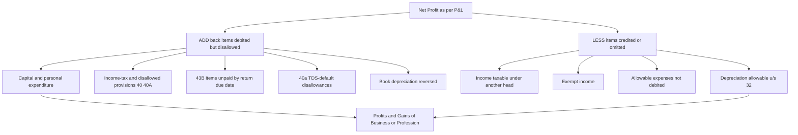
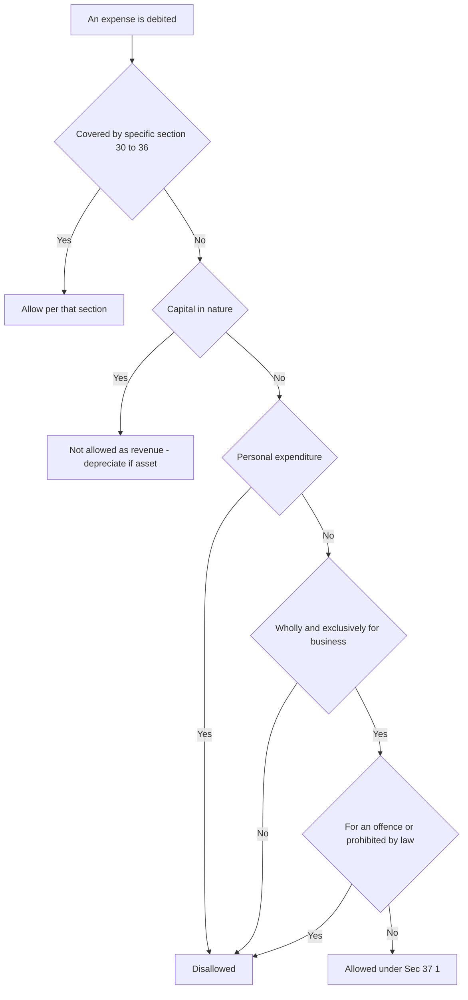
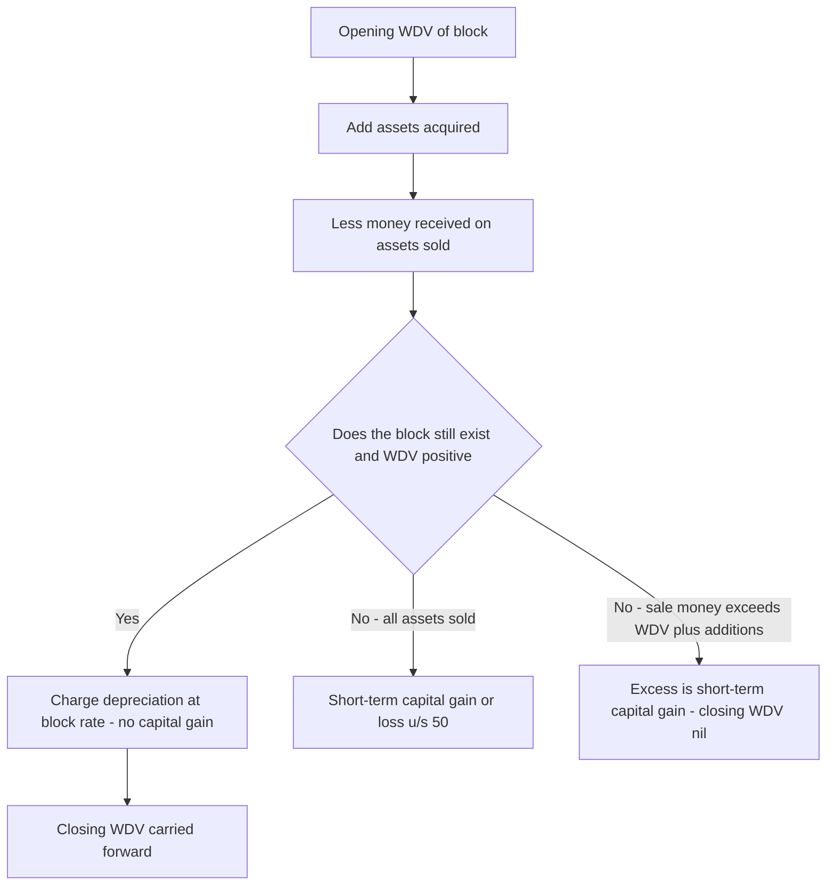
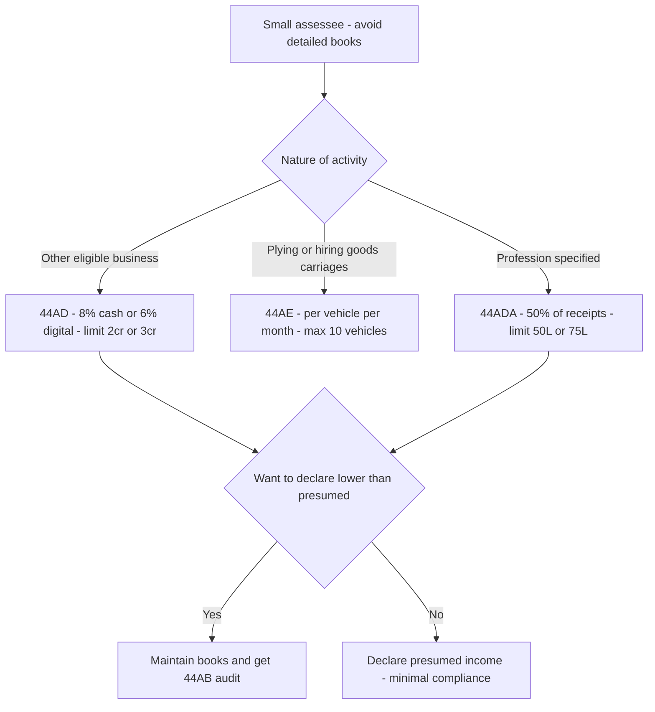

# Chapter 05 — Profits & Gains of Business or Profession (PGBP)

> **Rates & limits caveat:** Tax law changes every Finance Act. This chapter teaches the *structure and logic* of PGBP so you can reason from first principles. Always **verify the exact rates, limits, thresholds and the applicable Assessment Year in current ICAI material for your attempt.** Where a number is given, treat it as an illustrative anchor for the concept, not gospel.

---

## 1. The Problem

Suppose Ramesh runs a garment shop. Over the year his till records ₹80,00,000 of sales. Is Ramesh's *income* ₹80,00,000?

Obviously not. To earn that ₹80 lakh he had to *buy* the garments (₹52 lakh), pay shop rent (₹6 lakh), pay two salesmen (₹4.8 lakh), pay electricity, GST filing fees, the interest on a business loan, and the depreciation on his billing computer and shelves. The ₹80 lakh is **turnover**, not income. What the tax system wants to tax is the *net gain* left over after the costs incurred to produce that turnover.

Now contrast this with Ramesh's neighbour, a salaried manager. The manager's employer pays him ₹80 lakh, and the manager did *not* have to buy inventory or hire staff to earn it. For salary, the gross receipt is very close to the income. For business, the gross receipt is wildly different from income.

This is the core problem PGBP solves. **Business income is fundamentally a *net* concept — a residue after subtracting the expenses genuinely incurred to earn it.** A head of income built for salary (gross-minus-a-few-standard-deductions) cannot handle a business, where the deductions *are* the whole story. Two businesses with identical ₹80 lakh turnover can have profits of ₹15 lakh and ₹2 lakh depending on how efficiently they spend. Tax must follow the profit, not the turnover.

But "let the businessman deduct his expenses" opens three dangerous doors:

1. **The disguise door.** If any expense reduces tax, every rupee the owner spends on himself — his personal car, his son's wedding, a "consultancy fee" to his wife — will be dressed up as a business expense.
2. **The timing door.** A business keeps books on the *accrual* (mercantile) basis: it claims an expense the moment it becomes *due*, even if not yet paid. So a firm could book a ₹10 lakh interest expense to a bank on 31 March, take the deduction this year, and then never actually pay — or pay years later. The deduction and the cash outflow drift apart.
3. **The capital-vs-revenue door.** If Ramesh buys a new delivery van for ₹10 lakh, is that a ₹10 lakh expense this year? The van will earn income for the next eight years. Charging the whole cost to one year would understate this year's profit and overstate the next seven years'.

PGBP is the elaborate machinery the Income-tax Act, 1961 builds to say **"yes, deduct your genuine business costs" while slamming each of those three doors shut.** Every rule you are about to learn — "wholly and exclusively", Section 40A, Section 43B, depreciation, blocks of assets — is a lock on one of these doors.

---

## 2. The Core Idea

> **Business income = Revenue earned, minus revenue expenses genuinely and exclusively incurred to earn it, computed on the accounting basis the business regularly follows — but subject to statutory overrides that stop abuse of the "deduct my costs" privilege.**

Three ideas are fused here:

- **Net, not gross.** The taxable figure is *profit*, i.e. income after allowable expenditure. (Sections 30–37 tell you what is allowable.)
- **Nexus.** Only expenditure *connected to the business* — laid out "wholly and exclusively" for it — is deductible. Personal and capital expenditure are filtered out.
- **Statutory override of accounting.** The Act starts from the profit shown in the assessee's own books (usually accrual-based), then *adds back* disallowed items and *deducts* items the books missed or treated differently. **Book profit ≠ taxable profit.** The bridge between them is the heart of every PGBP exam question.

The practical consequence: you almost never compute PGBP from scratch by listing every receipt and payment. Instead you **start from the Net Profit as per the Profit & Loss Account** and *reconcile* it to taxable profit by adjusting only the items where tax law disagrees with accounting. This is the single most important exam technique in this chapter.

---

## 3. Why It's Built This Way

**Why a separate head at all?** Because the *measurement rule* for business is uniquely "net of costs incurred". Salary is taxed near-gross; house property uses a notional standard deduction; capital gains net sale price against cost of one asset. Only business/profession needs a full expense-matching engine, running-account of assets, and anti-abuse machinery. It earns its own head (Sections 28–44DB) because no other head's logic fits.

**Why "business" *and* "profession"?** A *business* is trade/commerce/manufacture with a profit motive (Ramesh's shop). A *profession* is the application of intellectual or manual skill (a CA, doctor, lawyer, architect). *Vocation* (e.g. a religious teacher living on offerings) is treated alongside. The Act lumps them under one head [Sec 28] because the *measurement principle is identical* — tax the net gain — even though the activities differ. The distinction matters later only for a few specifics (e.g. which presumptive scheme applies, or the books-of-account thresholds).

**Why start from book profit and adjust?** Because forcing every business to maintain a *second* set of "tax books" would be absurd and unverifiable. The assessee already prepares audited financial statements under accounting standards. Tax law respects those books as the *starting point* (Sec 145 — income computed per the method regularly employed, cash or mercantile) and then intervenes *only where policy demands*. This is efficient (one set of books) and auditable (the reconciliation is transparent).

**Why the anti-abuse overrides (40, 40A, 43B)?** Because the "deduct your costs" rule, left unpoliced, is the most gameable rule in the entire Act. The overrides are surgical: they don't deny genuine expense, they deny *specific abuse patterns* — payments in cash (untraceable), payments to relatives at inflated rates (profit-shifting), deductions claimed on accrual but never actually paid to the government (timing games), and payments where tax wasn't deducted at source (breaking the TDS chain).

**Why depreciation instead of full write-off?** Because of the *matching principle* dressed in policy clothes. A capital asset earns income over many years; its cost must be spread over those years so each year's profit reflects the asset's contribution *that* year. Depreciation is how the cost of a long-lived asset is rationed out as an annual expense.

---

## 4. Full Technical Content

### 4.1 The charging section — what is taxable [Sec 28]

Section 28 lists what is chargeable under PGBP. The intuition: **anything arising *from* carrying on a business or profession is business income.** Key inclusions:

- Profits and gains of any business/profession carried on during the year.
- Any compensation on termination/modification of a business contract or managing agency.
- Income of trade/professional associations from specific services to members.
- Export incentives (duty drawback, etc.).
- Value of any **benefit or perquisite** (whether convertible into money or not) arising from business or the exercise of a profession — *e.g. a doctor gifted a car by a pharma company*. (This closes the "take it in kind, not cash" dodge.)
- Any sum received under a **Keyman insurance policy**.
- Interest, salary, bonus, commission or remuneration received by a **partner from a firm** (to the extent allowed to the firm as deduction).
- Sum received (or receivable) in cash or kind on account of any capital asset (other than land/goodwill/financial instrument) whose expenditure was fully allowed under Sec 35AD.

> **Memory hook — Sec *28* = the "*2 activities, 8* streams" gate.** It's the *turnstile*: if income didn't come *through* the business turnstile, it belongs to another head.

### 4.2 Income computed under other sections / the "deemed income" catch [Sec 29]

Section 29 says PGBP income is computed *in accordance with* Sections 30 to 43D. So Sec 28 opens the head; Sec 29 points to the rulebook (30–43D) for *how* to compute it.

### 4.3 The general scheme of deductions [Sec 30–37]

Think of Sections 30–37 as a funnel that gets **wider** as you go:

| Section | Deduction | The "why" |
|---|---|---|
| **30** | Rent, rates, taxes, repairs & insurance of **buildings** used for business | Premises are a running cost of trading; carve them out explicitly. |
| **31** | Repairs & insurance of **plant, machinery, furniture** | Same logic for equipment. *Only repairs* — not replacement (that's capital → depreciation). |
| **32** | **Depreciation** on tangible & intangible assets (block system) | Spread capital cost over useful life (see 4.6). |
| **35** | **Scientific research** expenditure (often weighted deduction) | Policy *incentive* — encourage R&D by allowing more than ₹1 spent. |
| **35D** | Amortisation of **preliminary expenses** | Startup/pre-commencement costs benefit many years; spread them (e.g. over 5 years). |
| **36** | A **specified list** of deductions (insurance premia, employer's PF/gratuity contributions, bad debts written off, interest on borrowed capital, employer's contribution to recognised funds, etc.) | Named, common business costs given certainty. |
| **37(1)** | **The residuary / general deduction** | The catch-all safety net (below). |

**Section 37(1) — the general (residuary) deduction.** *Any* expenditure (not being 30–36, not capital, not personal) laid out **wholly and exclusively** for the purposes of the business/profession is allowed. Four conditions, each a lock:

1. **Not covered by 30–36** — 37 is residuary; specific sections take priority.
2. **Not capital in nature** — capital goes through depreciation, not straight deduction.
3. **Not personal expenditure** — the disguise door.
4. **Wholly & exclusively for the business** — the nexus test.
5. (Explanation) **Not incurred for any purpose which is an offence or prohibited by law** — e.g. bribes, protection money, penalties for law-breaking are *never* deductible. Also CSR expenditure (Companies Act mandated) is expressly *not* a Sec 37 business deduction.

> **The "wholly & exclusively" logic — read carefully.** It does **not** mean "necessarily" or "reasonably". The businessman is the best judge of what his business needs; the taxman does not sit in the manager's chair. The test is only: *was the whole of this outlay directed to business purposes, with no personal element?* A lavish but genuine business lunch is allowed; a family holiday billed to the firm is not. "Wholly" = the *quantum* is all for business; "exclusively" = the *purpose* is only business.

> **Memory hook — Sec *37* = "3 nots + 1 test = 7 letters of W-H-O-L-L-Y".** Not-specific, not-capital, not-personal; then *wholly & exclusively*.

### 4.4 Disallowances — the anti-abuse locks [Sec 40, 40A, 43B]

Even a genuine, wholly-and-exclusively expense can be *disallowed* if it trips an anti-abuse rule. These sit *on top* of 30–37.

**Section 40 — disallowances for specific defaults (mainly TDS and specific payees).**

- **40(a)(i)/(ia): TDS default.** If tax was deductible at source on a payment (interest, commission, rent, professional fees, payment to contractor, or payments to non-residents) and the assessee *failed to deduct or deposit* it, the expense is disallowed — **100% for payments to non-residents [40(a)(i)]; 30% for specified resident payments [40(a)(ia)]**. *Why:* the deduction is the government's *lever* to enforce TDS. Break the TDS chain and you lose the deduction (restored in the year TDS is finally paid). It makes the payer the tax system's enforcement agent.
- **40(a)(ii): income-tax itself** is not deductible. *Why:* tax is an *appropriation of profit*, not a cost of earning it — allowing it would be circular.
- **40(b): excess partner remuneration/interest in a firm.** Salary/interest paid by a firm to its partners is deductible only within statutory ceilings (interest ≤ 12% p.a.; remuneration within a slab of book profit). *Why:* partners *are* the firm; without a cap they'd convert taxable firm profit into (differently taxed) partner payments at will.

**Section 40A — payments that shift profit or evade traceability.**

- **40A(2): excessive/unreasonable payments to related parties.** Payment to a relative or associated concern, to the *extent it is excessive/unreasonable* having regard to fair market value, is disallowed. *Why:* the classic profit-shifting door — pay your wife ₹50 lakh "salary" for token work to drain profit. Only the *excess* is disallowed, not the fair portion.
- **40A(3): cash payments above the threshold.** If a *single* expenditure is paid **otherwise than by account-payee cheque/draft/electronic mode** and exceeds the limit (commonly **₹10,000** per person per day; **₹35,000 for transporters**), the *entire* payment is disallowed (not just the excess). *Why:* cash is untraceable — it fuels black money and fake vouchers. Forcing banking-channel payments creates an audit trail. *Note the cliff:* ₹10,001 in cash → 100% disallowed; the rule punishes the *mode*, not the amount.
- **40A(7): provision for gratuity** — only *actual* contributions to an approved fund (or actual gratuity paid) are allowed, not a mere *provision*. **40A(9):** contributions to non-statutory/unapproved welfare funds disallowed. *Why:* stops deduction for money that never actually leaves for the employees' benefit.

**Section 43B — the "actually paid" override (the timing door).**

Certain expenses — though accrued and otherwise allowable — are deductible **only in the year they are *actually paid***, regardless of the accrual/mercantile method. The list includes:

- Any **tax, duty, cess, fee** payable to government (GST, customs, etc.).
- Employer's contribution to **PF, ESI, superannuation, gratuity** funds.
- **Bonus or commission** to employees.
- **Interest on loans from banks/financial institutions and NBFCs**.
- **Leave encashment**.
- Sum payable to **Indian Railways** for use of assets.
- **(43B(h)) Sum payable to a *micro or small enterprise*** beyond the time limit under the MSMED Act.

**The safety valve (proviso):** if the amount is *actually paid on or before the due date of filing the return* under Sec 139(1), it is allowed in the year of accrual. *Why 43B exists:* on pure accrual, a firm could book (and deduct) statutory dues and bank interest year after year while never paying the government or the bank — enjoying the deduction indefinitely. 43B says: *no cash to the exchequer/bank, no deduction.* It aligns the tax break with the actual outflow. **Special note on 43B(h):** payments to MSEs must be paid within the MSMED time limit (15/45 days) — the return-filing safety valve does *not* apply, forcing large buyers to pay small suppliers on time.

> **Memory hook — 4*3*B = "Duty, Dues, Debt-interest — paid, or *3* letters D-U-E withheld."** If it's owed to the government, employees' funds, or lenders, *pay it or lose it.*

### 4.5 Other important computational provisions

- **Sec 35AD:** 100% deduction of *capital* expenditure for **specified businesses** (cold-chain, warehousing for agri produce, hospitals, etc.) — a targeted investment incentive.
- **Sec 36(1)(iii):** interest on **borrowed capital** used for business is deductible — but interest on capital borrowed for *acquiring an asset* until it is *first put to use* must be **capitalised** (added to asset cost), not expensed. *Why:* pre-use interest is part of getting the asset ready.
- **Sec 36(1)(vii):** **bad debts** actually *written off* in the books are deductible — provided the debt was earlier taken into income (nexus).
- **Sec 43(1) — "actual cost":** the cost of an asset *less* any portion met by another person or subsidy — the base for depreciation.
- **Sec 145:** income computed per the method of accounting (cash or mercantile) *regularly* followed, subject to notified ICDS (Income Computation and Disclosure Standards).

### 4.6 Depreciation — Section 32 and the Block of Assets

**The deduction.** Sec 32 allows depreciation on **tangible assets** (building, plant & machinery, furniture) and **intangible assets** (patents, copyrights, trademarks, licences, franchises — *goodwill of a business is now excluded*), *owned* (wholly or partly) by the assessee and *used* for business, on the **written-down value (WDV)** of the **block**, at prescribed rates.

**What is a "block of assets"? [Sec 2(11)]** A block is a *group of assets of the same class* (e.g. "plant & machinery") carrying the *same rate of depreciation*, pooled together. You do **not** depreciate each machine individually — you depreciate the *pool*.

**WHY blocks? (This is the classic exam "why".)** Before the block concept, every single asset was tracked individually, and *selling* an asset triggered a fiddly "balancing charge/allowance" and often a capital-gains computation on each item. Imagine a factory with 400 machines buying and scrapping dozens each year — an administrative nightmare. The **block system pools same-rate assets so that:**

1. **Individual assets lose identity.** You only track the *block's* WDV.
2. **Purchases** during the year are *added* to the block; **sales** are *reduced* (money received deducted) from the block.
3. **No capital gain / balancing charge** arises on an ordinary sale as long as the block *survives* (WDV positive and at least one asset remains). The gain/loss is simply absorbed into the pool — self-correcting over time.
4. Only in two edge cases does a capital gain arise (below).

This trades a tiny bit of theoretical accuracy for an enormous gain in simplicity — pure administrative-efficiency policy.

**Computing depreciation on a block:**

```
Opening WDV of block
(+) Actual cost of assets ACQUIRED during the year
(–) Money receivable on assets SOLD/discarded during the year
= WDV before depreciation
(×) Depreciation rate  →  Depreciation for the year
= Closing WDV (carried forward)
```

**Half-depreciation rule:** an asset *acquired AND put to use* for **less than 180 days** in the year gets **only 50%** of the normal rate that year. *Why:* an asset used for two months shouldn't get a full year's write-off — rough justice for part-year use, applied via a simple 180-day switch rather than day-counting.

**Additional depreciation [Sec 32(1)(iia)]:** an extra **20%** (10% if used <180 days) on *new* plant & machinery acquired by a manufacturing business — a one-time investment incentive (verify current availability, as incentives get sunset).

**Two situations where a block *does* trigger capital gains [Sec 50 — short-term]:**

- **(a) Block ceases to exist:** all assets in the block are sold — nothing left to depreciate → any WDV left is a *short-term capital loss*, any excess of sale money over WDV is a *short-term capital gain*.
- **(b) Sale money exceeds (opening WDV + additions):** the block's WDV goes *negative* → the excess is a *short-term capital gain* and closing WDV is nil.

Otherwise, no capital gain — the block just keeps depreciating.

**Unabsorbed depreciation:** if profits are insufficient to absorb depreciation, the unabsorbed portion is **carried forward indefinitely** and can be set off against *any* head (except salary) in future years — reflecting that it's a real, non-cash cost that shouldn't be lost.

### 4.7 Presumptive Taxation — 44AD, 44ADA, 44AE

**The problem it solves.** Ramesh the shopkeeper, a plumber, a small transporter — millions of small assessees genuinely cannot maintain proper double-entry books, hire auditors, or fight over every ₹10,000 cash disallowance. Forcing full PGBP computation on them costs *them* more in compliance than the tax is worth, and costs the *department* more to scrutinise than it collects. **Presumptive taxation is a bargain:** *declare a fixed presumed % of turnover as income, and we won't make you keep detailed books or get audited.* It trades precision for simplicity — for both sides.

| Section | Who | Presumed income | Key conditions & "why" |
|---|---|---|---|
| **44AD** | Resident **individual/HUF/firm** (not LLP) in *any eligible business* (not plying/hiring goods carriages, not agency/commission, not profession) | **8%** of turnover; **6%** for receipts via banking/digital channel | Turnover limit ~₹2 crore (raised to **₹3 cr** if cash receipts ≤ 5%). The 6% vs 8% gap is a deliberate *nudge to go digital*. |
| **44ADA** | Resident **professional** (specified professions) | **50%** of gross receipts | Receipts limit ~₹50 lakh (₹75 lakh if cash ≤ 5%). Professionals have low input costs, so half is presumed profit. |
| **44AE** | Assessee owning ≤ **10 goods carriages** | Per-vehicle per-month amount (**heavy: ₹1,000 per tonne**; other: **₹7,500** per vehicle per month) | No turnover test — income scales with *capacity/months held*, which is easy to verify from the RC book. |

**Common logic across all three:**

- Once you opt in, *all* deductions under Sec 30–38 are **deemed already allowed** — you cannot separately claim expenses or depreciation (though WDV is *notionally* reduced as if depreciation were claimed).
- For a **firm** under 44AD (older law), partner's salary/interest treatment must be checked against the current provision — historically allowed as further deduction, but the position has changed; **verify the current AY rule.**
- **The 44AD "lock-in" anti-abuse rule:** if you opt into 44AD and then *opt out* within the next 5 years, you are *barred from 44AD for 5 assessment years* AND must maintain books + get audited (if income exceeds the basic exemption). *Why:* stops assessees from cherry-picking — presumptive in good years, actual (to claim losses) in bad years.
- You may **declare *higher*** than the presumed %; you may declare *lower* only by maintaining books and getting a Sec 44AB audit (defeating the purpose).

> **Memory hook:** **44AD** = *"A**D**inary business, 8/6%"*; **44AD*A*** = *"**A**dds an **A** for professions, 50%"*; **44A*E*** = *"**E**ngines/vehicles, per-vehicle."*

### 4.8 Compulsory audit & books [Sec 44AA, 44AB]

- **44AA:** who must maintain books (professionals above a receipts threshold; businesses above income/turnover thresholds).
- **44AB — tax audit:** business turnover > ₹1 crore (raised to **₹10 crore** if cash receipts *and* payments ≤ 5%), or profession receipts > ₹50 lakh, or a presumptive assessee declaring *lower* than presumed income. *Why:* audit is the department's assurance mechanism where stakes are high enough to justify the cost.

---

## 5. Worked Examples

### Example 1 (Easy) — Net-profit reconciliation, the core skill

Ramesh's P&L shows **Net Profit ₹8,00,000** after debiting/crediting the following. Compute PGBP income.

Items debited to P&L:
- Income-tax paid ₹1,20,000
- Donation to a local temple (personal) ₹40,000
- Depreciation as per Companies Act ₹1,50,000
- Rent, salaries, genuine business repairs (all allowable) — no adjustment

Other facts: Depreciation allowable under Sec 32 (Income-tax) = ₹1,80,000. Interest on savings bank ₹15,000 was credited to this P&L (it's income of *another head*).

**Solution — start from book profit, add back tax-disallowed debits, remove non-business credits, adjust depreciation:**

| Particulars | ₹ | ₹ |
|---|---:|---:|
| **Net Profit as per P&L** | | 8,00,000 |
| **Add: Items debited but *not* allowable** | | |
| Income-tax [40(a)(ii) — appropriation of profit] | 1,20,000 | |
| Personal donation [not wholly & exclusively; Sec 37] | 40,000 | |
| Depreciation as per books (reverse it) | 1,50,000 | 3,10,000 |
| | | **11,10,000** |
| **Less: Depreciation allowable u/s 32** | 1,80,000 | |
| **Less: Interest on savings bank (income of "Other Sources")** | 15,000 | (1,95,000) |
| **Profits & Gains of Business or Profession** | | **9,15,000** |

*Reconciliation logic:* we reverse book depreciation (₹1,50,000) and substitute tax depreciation (₹1,80,000) — net effect −₹30,000. We add back the two disallowed debits (they had wrongly reduced book profit) and remove the SB interest (it belongs to Other Sources, taxed there). **PGBP = ₹9,15,000.**

### Example 2 (Medium) — Depreciation on a block, with the 180-day and sale rules

XYZ Ltd's **Plant & Machinery block** (rate 15%) had **Opening WDV ₹20,00,000** on 01.04. During the year:
- Bought Machine A for ₹5,00,000 on 10.05 (used same day — held > 180 days).
- Bought Machine B for ₹4,00,000 on 01.12 (used same day — held < 180 days).
- Sold an old machine for ₹3,00,000 on 15.09.

Compute depreciation and closing WDV.

**Solution — split the block by 180-day eligibility:**

Step 1 — Assets eligible for **full** rate (opening WDV + additions ≥180 days − sales):

| | ₹ |
|---|---:|
| Opening WDV | 20,00,000 |
| Add: Machine A (≥180 days) | 5,00,000 |
| Less: Sale proceeds | (3,00,000) |
| **Base for full-rate depreciation** | **22,00,000** |

Depreciation @ 15% = ₹3,30,000.

Step 2 — Asset eligible for **half** rate:

| | ₹ |
|---|---:|
| Machine B (<180 days) | 4,00,000 |

Depreciation @ 7.5% (half of 15%) = ₹30,000.

Step 3 — Totals:

| | ₹ |
|---|---:|
| Total depreciation (3,30,000 + 30,000) | **3,60,000** |
| Closing WDV = (22,00,000 + 4,00,000) − 3,60,000 | **22,40,000** |

*Note:* the sale of the old machine created **no capital gain** — the block survives, so ₹3,00,000 is simply netted off. This is the block system doing its job.

### Example 3 (Exam-hard) — Full computation with 40A(3), 43B, 40(a)(ia), 40(b)

**ABC & Co.** (a partnership firm) reports **Net Profit ₹12,50,000** as per P&L. Examine the following and compute taxable PGBP. Assume mercantile basis and that the return is filed by the Sec 139(1) due date.

Debited to P&L:
1. Machinery purchased ₹2,00,000 (wrongly charged to P&L as "repairs").
2. Cash payment of ₹45,000 to a supplier for goods, paid in a single day in cash.
3. GST of ₹1,10,000 payable — of which ₹80,000 paid before the return due date, ₹30,000 still unpaid.
4. Interest of ₹90,000 payable to a bank — unpaid as on the return due date.
5. Salary to partners ₹6,00,000 — of which ₹1,00,000 is *in excess* of the Sec 40(b) ceiling.
6. Commission ₹50,000 to a resident contractor — **no TDS deducted**.
7. Provision for gratuity (mere provision, unapproved) ₹70,000.
8. Depreciation debited ₹1,00,000; depreciation allowable u/s 32 = ₹1,45,000 (₹45,000 more, allowing for the machinery in item 1).

**Solution:**

| Particulars | Add (₹) | Less (₹) |
|---|---:|---:|
| **Net Profit as per P&L** | | **12,50,000** (base) |
| 1. Machinery wrongly debited as repairs — capital item, disallow the ₹2,00,000 (add back); depreciation on it captured in item 8 | 2,00,000 | |
| 2. Cash payment ₹45,000 > ₹10,000 limit → **fully** disallowed [40A(3)] | 45,000 | |
| 3. GST ₹30,000 unpaid by return due date → disallowed [43B]; ₹80,000 paid → allowed (no add-back) | 30,000 | |
| 4. Bank interest ₹90,000 unpaid by due date → disallowed [43B] | 90,000 | |
| 5. Excess partner salary ₹1,00,000 over 40(b) ceiling → disallowed | 1,00,000 | |
| 6. Commission ₹50,000 without TDS → **30%** disallowed [40(a)(ia)] = ₹15,000 | 15,000 | |
| 7. Provision for gratuity (unapproved, mere provision) → disallowed [40A(7)] | 70,000 | |
| 8. Book depreciation ₹1,00,000 reversed; allowable ₹1,45,000 claimed → net extra deduction ₹45,000 | | 45,000 |

**Computation:**

| | ₹ |
|---|---:|
| Net Profit as per P&L | 12,50,000 |
| Add: disallowances (2,00,000 + 45,000 + 30,000 + 90,000 + 1,00,000 + 15,000 + 70,000) | 5,50,000 |
| | 18,00,000 |
| Less: extra depreciation allowable | (45,000) |
| **Profits & Gains of Business or Profession** | **17,55,000** |

*Key reconciling checks:* item 2 disallows the **whole** ₹45,000 (mode-based cliff, not just excess); item 6 disallows only **30%** of the resident payment (not 100% — that's for non-residents); items 3 & 4 turn on *actual payment vs the return due date* (the 43B safety valve); item 1 removes a capital item from revenue expense but its cost re-enters through depreciation (item 8). Every rupee is accounted for → **PGBP = ₹17,55,000.**

### Example 4 (Concept) — Presumptive vs actual, and the "why declare higher"

A retail trader (individual) has turnover ₹1,80,00,000, of which ₹1,50,00,000 received digitally and ₹30,00,000 in cash. Actual profit per rough books ≈ ₹9,00,000. Should he use 44AD?

**Presumptive income u/s 44AD:**

| Receipts | Rate | Presumed income (₹) |
|---|---:|---:|
| Digital ₹1,50,00,000 | 6% | 9,00,000 |
| Cash ₹30,00,000 | 8% | 2,40,000 |
| **Total presumed** | | **11,40,000** |

Here presumptive income (₹11.40 lakh) *exceeds* his actual (₹9 lakh) — so opting into 44AD would tax him *more*. He may instead **maintain books, get a 44AB audit, and declare the actual ₹9,00,000** (lower than presumed) — the law *permits* declaring lower only with books + audit. *Trade-off:* he pays tax on ₹2.4 lakh less, but bears audit cost and loses the compliance simplicity. Presumptive taxation is a *convenience*, not always the cheapest — the assessee weighs simplicity against the tax on the gap.

---

## 6. Computation Format / Presentation

The universal PGBP working the examiner expects:

```
Net Profit as per Profit & Loss Account                          XXX
ADD:  Expenses debited to P&L but DISALLOWED / not allowable
        • Capital & personal expenditure
        • Income-tax, disallowed provisions [40, 40A]
        • Sec 43B items unpaid by return due date
        • Sec 40(a) TDS-default disallowances
        • Book depreciation (to be reversed)                     XXX
                                                               ------
                                                                 XXX
LESS: • Income credited to P&L but taxable under ANOTHER head
        (e.g. rent → House Property, interest → Other Sources)
      • Income exempt / not taxable
      • Expenses allowable but NOT debited in books
      • Depreciation allowable u/s 32                            (XX)
                                                               ------
Profits & Gains of Business or Profession                        XXX
                                                               ======
```

**Golden rules of presentation:**
- Always **start from Net Profit as per P&L** unless the question gives only receipts/payments (then build a Receipts–Payments/Income–Expenditure statement instead).
- **Add back** what wrongly *reduced* book profit (disallowed expenses, book depreciation).
- **Deduct** what wrongly *increased* book profit (income of other heads, allowable-but-omitted expenses, tax depreciation).
- Show a **narration** (section) against each adjustment — the examiner awards marks for the *reason*, not just the number.

---

## 7. Connections

- **→ Depreciation ↔ Capital Gains [Sec 50].** When a block ceases or goes negative, the *short-term capital gain* is computed and taxed under the **Capital Gains** head — PGBP and CG share the block. Understand 32 before 50.
- **→ Other Sources.** Interest/rent/dividends *credited* to a business P&L are routinely *removed* from PGBP and taxed under **Income from Other Sources** or **House Property** — the head-of-income boundary is a constant exam theme.
- **→ Set-off & Carry-forward.** Business *loss* carries forward 8 years (set off only against business income); **unabsorbed depreciation** carries forward *indefinitely* against any head (except salary). The distinction is examined.
- **→ Firm assessment.** Sec 40(b) links to how a *partnership firm's* income is computed before partners are taxed on their share — connects to the "Assessment of Firms" chapter.
- **→ TDS chapter.** Sec 40(a) is the *enforcement teeth* of the TDS provisions — the two chapters are two sides of one coin.
- **→ Income Computation & Disclosure Standards (ICDS)** under Sec 145 modify how certain PGBP items (construction contracts, inventory, forex) are computed.

---

## 8. Traps & Examiner Tricks

1. **40A(3) is a *cliff*, not a slab.** A ₹10,001 cash payment disallows the *entire* ₹10,001 — not ₹1. Watch for the ₹35,000 transporter limit as a distractor.
2. **40(a)(ia) = 30%, 40(a)(i) = 100%.** Resident payment without TDS → only **30%** disallowed; non-resident → **100%**. Examiners plant both to see if you differentiate.
3. **43B turns on the *return-filing due date*, not 31 March.** If a statutory due/bank interest is *paid before the Sec 139(1) due date*, it IS allowed in the accrual year. Only the *unpaid* portion is disallowed. **Exception: 43B(h) MSE payments** get *no* such grace — different rule.
4. **Income-tax is disallowed; GST/other duties are 43B items (allowed if paid).** Don't lump them together. Also, *interest on late payment of income-tax* is disallowed, but *interest on late GST* is often allowed as business expenditure — check the specific item.
5. **Book depreciation vs tax depreciation.** Always *reverse* the depreciation in the books and substitute Sec 32 depreciation. Forgetting to reverse the book figure double-counts.
6. **Capital vs revenue disguise.** "Repairs" that are actually a new asset (Example 3, item 1) must be added back — but remember its cost re-enters via *depreciation*. Only the *excess of repair over capital* is genuinely deductible.
7. **The 180-day rule needs *acquired AND put to use*.** An asset bought in February but not used until April gets *no* depreciation this year (not even half) — "put to use" is essential.
8. **Goodwill is no longer a depreciable intangible.** A once-standard exam point has flipped — verify current law.
9. **44AD lock-in.** Opting out within 5 years bars re-entry for 5 years *and* triggers audit — a favourite conceptual MCQ.
10. **Presumptive ≠ automatically lower tax.** As Example 4 shows, presumptive can *exceed* actual profit; the choice is a trade-off, not a free lunch.
11. **CSR expenditure** (Companies Act) is *not* deductible under Sec 37 — but donations qualifying under Sec 80G may get a separate Chapter VI-A deduction. Don't allow it as a business expense.

---

## 9. First-Principles Recap

Reason it out, don't recall it:

- Business income is **net** because turnover isn't gain — so we must subtract the costs of earning it. *(The reason the head exists.)*
- We start from **book profit** because businesses already keep books; tax merely *corrects* those books where policy demands. *(Why we reconcile.)*
- We allow only **wholly & exclusively business** expenditure because otherwise every personal rupee becomes a "deduction". *(Why Sec 37's filters.)*
- We disallow **cash payments (40A(3))** to force a traceable banking trail; **excess related-party payments (40A(2))** to stop profit-shifting; **TDS-default payments (40)** to enforce the tax-collection chain; and **unpaid statutory dues/bank interest (43B)** to align the deduction with actual outflow. *(Why the anti-abuse locks — each shuts one specific door.)*
- We **spread capital cost via depreciation**, and **pool same-rate assets into blocks**, because assets earn over years (matching) and per-asset tracking is administratively hopeless (simplicity). *(Why Sec 32 + block.)*
- We offer **presumptive taxation** because for tiny assessees the cost of precise computation exceeds its value to both sides — a simplicity-for-precision bargain. *(Why 44AD/ADA/AE.)*

If you can regenerate the *reasons* above, you can re-derive nearly every rule in this chapter under exam pressure.

---

## 10. Quick-Revision Sheet

### Section map (with hooks)

| Section | Content | Hook |
|---|---|---|
| **28** | Charging section — what's taxable as PGBP | The turnstile |
| **29** | Compute per Sec 30–43D | The rulebook pointer |
| **30 / 31** | Rent/repairs/insurance — buildings / P&M-furniture | Premises & equipment |
| **32** | Depreciation (block, WDV) | Spread the cost |
| **32(1)(iia)** | Additional depreciation 20% (new P&M, manufacturer) | Investment nudge |
| **35 / 35D / 35AD** | R&D / preliminary exp / specified-business capex | Incentives |
| **36** | Named deductions (insurance, PF, bad debts, interest) | The named list |
| **37(1)** | Residuary — wholly & exclusively, not capital/personal | The safety net |
| **40(a)(i)/(ia)** | TDS default — 100% (NR) / 30% (resident) | TDS teeth |
| **40(a)(ii)** | Income-tax not deductible | Tax ≠ cost |
| **40(b)** | Excess partner interest/remuneration | Firm cap |
| **40A(2)** | Excessive related-party payment | Anti profit-shift |
| **40A(3)** | Cash payment > limit → 100% disallowed | The cash cliff |
| **40A(7)/(9)** | Unpaid gratuity provision / unapproved fund | No-outflow, no-deduction |
| **43B** | Statutory dues, PF, bonus, bank interest — *actually paid* | Pay or lose |
| **44AA/44AB** | Books / tax audit thresholds | Record & assure |
| **44AD/ADA/AE** | Presumptive — business / profession / vehicles | Simplicity bargain |
| **50** | Capital gain on depreciable block | Block ↔ CG bridge |

### Key limits (VERIFY for your AY)

| Item | Anchor value |
|---|---|
| 40A(3) cash payment limit | ₹10,000/person/day (₹35,000 transporters) |
| 40(a)(ia) disallowance (resident, no TDS) | 30% |
| 40(a)(i) disallowance (non-resident) | 100% |
| 40(b) interest to partners ceiling | 12% p.a. |
| Depreciation half-rate trigger | asset used < 180 days |
| Additional depreciation | 20% (10% if <180 days) |
| 44AD presumed income | 8% (cash) / 6% (digital); turnover ≤ ₹2 cr (₹3 cr if cash ≤ 5%) |
| 44ADA presumed income | 50%; receipts ≤ ₹50 L (₹75 L if cash ≤ 5%) |
| 44AE presumed income | Heavy ₹1,000/tonne/month; other ₹7,500/vehicle/month; ≤ 10 vehicles |
| 44AB tax-audit threshold | Turnover > ₹1 cr (₹10 cr if cash ≤ 5% both ways); profession > ₹50 L |
| 43B safety valve | Pay by Sec 139(1) return due date (except 43B(h) MSE) |

### Diagram 1 — Bridge from book profit to taxable PGBP



*Fig 1 — the reconciliation engine: start from book profit, add back what wrongly reduced it, subtract what wrongly inflated it.*

### Diagram 2 — Is an expense deductible? The Sec 37 decision tree



*Fig 2 — Sec 37 is residuary and gated: pass all four locks or be disallowed.*

### Diagram 3 — Depreciation block and when a capital gain arises



*Fig 3 — the block self-absorbs ordinary sales; capital gain arises only if the block dies or goes negative.*

### Diagram 4 — Choosing a presumptive scheme



*Fig 4 — presumptive routing by activity, with the "declare lower needs books + audit" fork.*

---

**One-line takeaway:** *PGBP taxes the net gain of a business by starting from its own book profit and correcting that figure — locking out disguised, cash, related-party, TDS-defaulting and unpaid expenses, spreading capital cost through depreciation blocks, and offering the small assessee a presumptive shortcut — so that genuine cost is deducted but abuse is not.*

> Reminder: every rate, limit and threshold above is an anchor for the *logic*. **Confirm the exact figures and the applicable Assessment Year in current ICAI study material before your attempt.**
