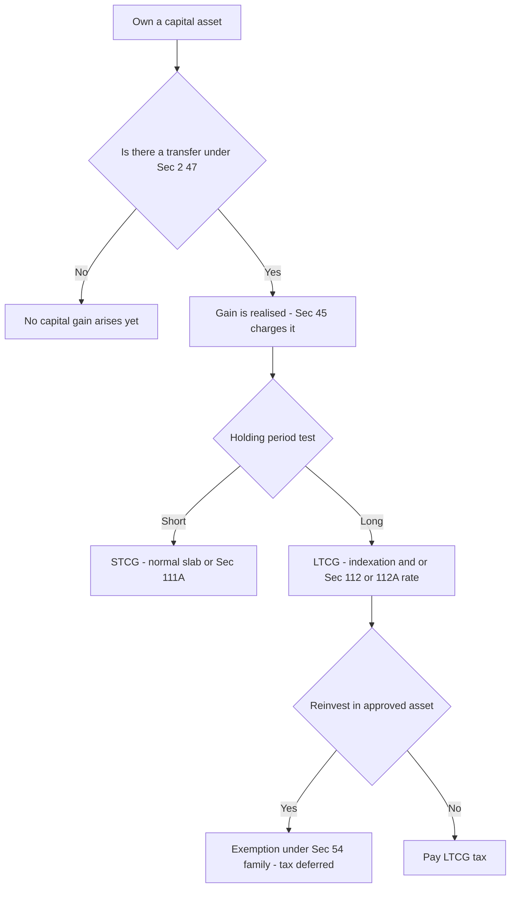
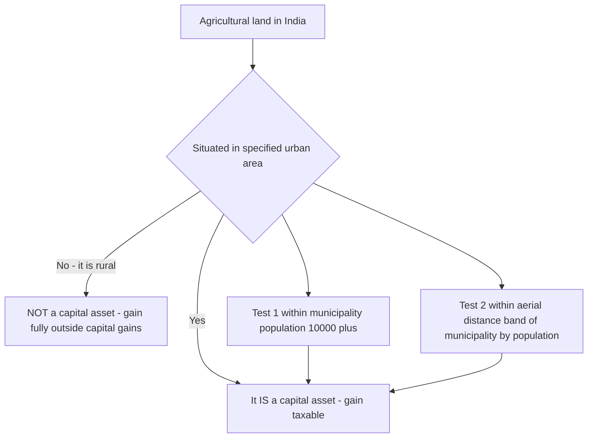
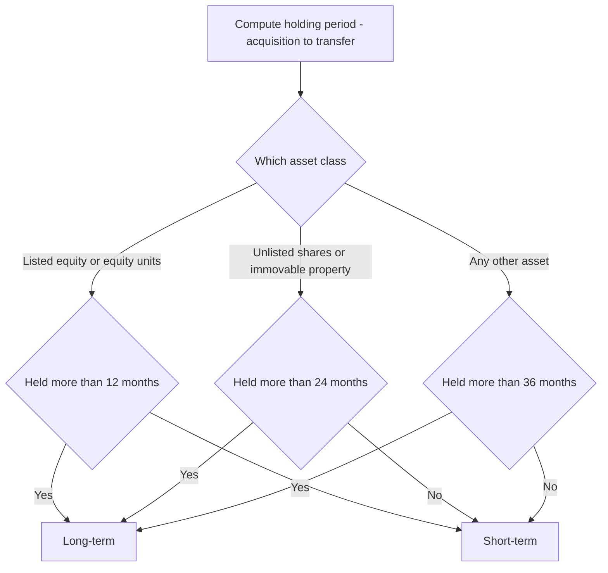
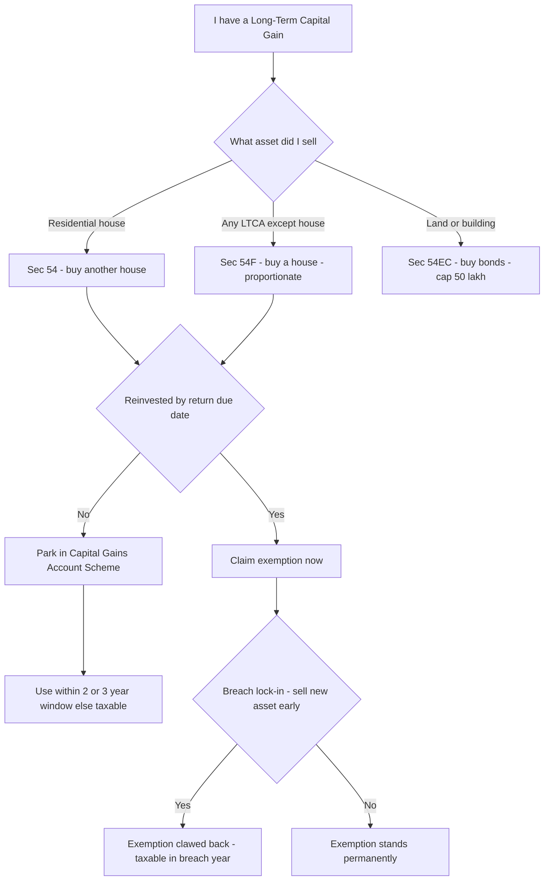
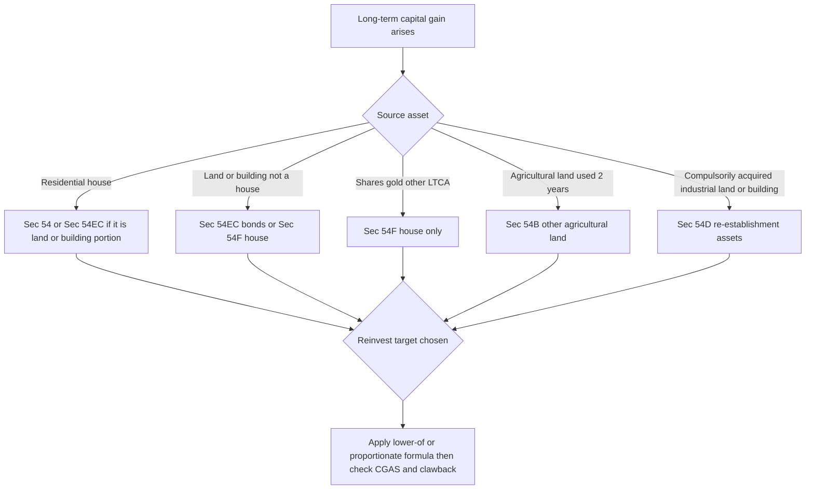

<!-- v2-deep -->

# Chapter 06 — Capital Gains

> **Rates / limits / indexation flag:** The concessional rates, the base year for indexation, the exemption ceilings (₹50 lakh under 54EC, ₹10 crore caps under 54/54F), and even *whether indexation survives at all* have all been moved by recent Finance Acts. This chapter teaches the **structure and logic** so the mechanism is permanent knowledge. **Always verify the exact rates, indexation availability, ceilings, and the applicable Assessment Year against current ICAI study material for your attempt.**

---

## 1. The Problem — Why ordinary income tax breaks down for asset sales

Imagine you buy a plot of land in 2005 for ₹5 lakh and sell it in 2024 for ₹50 lakh. You have ₹45 lakh of "profit." Should the whole ₹45 lakh be taxed like a salary of ₹45 lakh earned this year?

If you say yes, three problems immediately appear, and each one is a genuine injustice — not a loophole:

**Problem 1 — The gain isn't income of *one* year, but tax is annual.** That ₹45 lakh accumulated silently over 19 years. Income tax is an **annual** levy on an **annual** slab system. Dumping 19 years of accretion into a single year artificially rockets you into the top slab, so you pay a top-slab rate on gains that, spread over 19 years, might never have touched the top slab. This is the **"bunching" problem.**

**Problem 2 — Part of the "gain" is fake; it's just inflation.** Prices roughly quadrupled between 2005 and 2024. A part of your ₹45 lakh is not real enrichment — it is the rupee losing value. Taxing inflation is taxing a phantom; the taxpayer is poorer in real terms than the nominal number suggests.

**Problem 3 — Nothing was "earned" until you sold.** Your salary is a *flow* — money keeps arriving. An asset's appreciation is a *stock* that just sits there, unrealised, until the day you convert it to cash. Taxing paper appreciation every year would force people to sell assets just to pay tax. So gain must be recognised only at a single **realisation event.**

Ordinary "income" — salary, interest, rent, business profit — has none of these features. It arrives yearly, it is real, and it is realised as it accrues. **Capital gains behave fundamentally differently, so the Act gives them their own head, their own timing rule, their own inflation adjustment, and their own concessional treatment.** That is the entire reason Capital Gains (Sections 45 to 55A) exists as a *separate* head under Section 14.

**A fourth, quieter problem — double counting across heads.** The same rupee must not be taxed twice, nor must a genuine wealth accretion escape entirely. If "asset sale" and "business sale" were not sharply separated, a trader could dress business profit as capital gain to grab the concessional rate, and an investor could dress a capital gain as "casual income" to duck it. The whole architecture below is an exercise in *drawing clean boundaries* so each rupee lands in exactly one head, once. Keep this boundary-policing instinct alive — it explains Sec 2(14)'s exclusion of stock-in-trade, Sec 50's forced-STCG rule, and the 56(2) forfeiture re-routing later on.

---

## 2. The Core Idea

> **A capital gain is taxed only when a capital asset is *transferred* (realised), and because the gain has silently accumulated over the holding period, the law softens the blow the longer you held it — through indexation and/or a lower rate — and lets you defer tax entirely if you plough the money back into another approved capital asset.**

Four load-bearing words fall out of that sentence, and the whole chapter is just these four unpacked:

1. **Capital asset** — *what* is being sold (Sec 2(14)).
2. **Transfer** — the *trigger* event that makes gain taxable (Sec 2(47)).
3. **Holding period** — *how long* you held it, which decides short-term vs long-term.
4. **Reinvestment exemptions** — a *deferral* mechanism (Sec 54 family) that says "if you didn't really cash out — you rolled into another asset — we'll wait."

The charging section, **Sec 45(1)**, ties them together: *"Any profits or gains arising from the transfer of a capital asset shall be chargeable to tax under the head Capital Gains in the previous year in which the transfer took place."* Notice the timing — the year of **transfer**, not the year of accretion. That single clause solves Problem 3 above.

**The three non-negotiable conditions of Sec 45(1) — a checklist the examiner hides.** For a charge to arise, ALL of the following must be present simultaneously: (a) there must be a **capital asset**; (b) it must be **transferred**; (c) that transfer must have happened in the **previous year**; and (d) a **profit or gain** must arise. Knock out any one and the charge collapses. This is why the exam loves to hand you a "sale" of *rural agricultural land* (fails (a) — not a capital asset) or a *partition of HUF* (fails (b) — not a transfer): the moment one leg breaks, you stop computing and simply write "no capital gain arises." Training yourself to run this four-point gate first saves you from computing tax on transactions that were never chargeable.

**The special sub-charges of Sec 45.** Sec 45(1) is the mother charge, but the section has children for tricky timing situations. Know at least that these exist, because examiners cite the sub-section number:

| Sub-section | Situation | Timing / special rule |
|---|---|---|
| **45(1A)** | Money/asset received under **insurance** on damage or destruction of a capital asset (flood, fire, riot, etc.) | Charged in the year compensation is *received*; FVC = value of money/asset received |
| **45(2)** | **Conversion of capital asset into stock-in-trade** | Charged in the year the *converted stock is sold*; FVC = FMV on date of conversion |
| **45(3)** | Partner/member **introduces a capital asset into a firm/AOP** as capital contribution | FVC = amount *recorded in the firm's books* |
| **45(4)** | **Reconstitution** of a firm/specified entity — asset/money to a retiring or continuing partner (post-2021 rule) | Charged in the firm's hands; **verify current mechanics** |
| **45(5)** | **Compulsory acquisition** with compensation, incl. enhanced compensation | Initial compensation taxed in year *first received*; enhanced compensation taxed in year of *receipt*, cost of enhancement taken as nil |

*The three most examined are 45(2), 45(5) and the newer 45(4).* Do not memorise the wording — memorise the *timing hook* in the last column, because each one exists to answer the question "the transfer and the receipt of money fall in different years — which year taxes it?"

---

## 3. Why It's Built This Way — the design logic behind each feature

Before any section, understand the *design choices* the legislature made, because every rule below is one of these choices in disguise:

| Design choice | The problem it solves | How the Act implements it |
|---|---|---|
| Separate head of income | Bunching + realisation timing | Sec 45 charges only on transfer |
| Distinguish short vs long holding | Long holders suffer more inflation + more bunching | Holding-period test → STCG vs LTCG |
| Indexation of cost | Inflation is not real gain | Cost Inflation Index (CII), Sec 48 2nd proviso |
| Concessional LTCG rate | Long gains deserve gentler treatment | Sec 112 / 112A special rates |
| Reinvestment exemptions | Person hasn't truly consumed the gain | Sec 54, 54B, 54D, 54EC, 54F etc. |
| Deemed full value (Sec 50C, 50CA) | Under-reporting of sale price | Substitute stamp value / FMV |
| Deemed short-term (Sec 50) | Depreciation already given real-terms relief | Block-of-assets gain forced to STCG |
| No-cost assets taxed at nil cost | Self-generated goodwill etc. has no purchase price | Sec 55 fixes COA = nil for listed items |

The elegance: **the longer you hold, the more inflation and bunching hurt you, so the more relief the law gives you.** Short-term gains get neither indexation nor a special rate (with narrow exceptions) — because over a few months, inflation and bunching are trivial, so ordinary treatment is fair. That single principle — *relief scales with holding period* — is the spine of the whole chapter. Memorise the principle, and every rule becomes predictable.

**A second organising principle — "substance over form, in both directions."** The Act reaches *beyond* the paper wherever form and substance diverge. It **expands** the charge where a taxpayer disguises a real cash-out as a non-sale (Sec 2(47) catches exchange, relinquishment, extinguishment; Sec 50C catches under-pricing). It **contracts** the charge where a paper "transfer" hides the absence of a real cash-out (Sec 47 spares gifts, partitions, group restructurings). So whenever a fact pattern feels artificial, ask: *did real economic value actually change hands and get realised?* The answer predicts whether the Act taxes it, almost every time.


*Figure 1 — The master decision path of every capital gains problem: asset → transfer → holding period → rate → possible exemption.*

---

## 4. Full Technical Content

### 4.1 Capital Asset — Sec 2(14)

**Why a definition at all?** Because "asset" is enormous. The law wants to tax *investment/wealth* accretion, not the ordinary tools and stock of daily life or livelihood. So Sec 2(14) starts wide ("property of any kind") and then *carves out* things that logically belong to *other* heads or shouldn't be taxed as wealth appreciation.

**Definition:** A capital asset means **property of any kind held by an assessee**, whether or not connected with business or profession, **and includes** securities held by an FII, and certain unit-linked insurance policies — **but excludes** the following:

| Exclusion | Why it is excluded (the logic) |
|---|---|
| **Stock-in-trade, raw material, consumables** | Selling these is *business*, taxed under PGBP — not wealth appreciation |
| **Personal effects** — movable property for personal use (clothes, furniture, car, mobile) | Household items depreciate; taxing their "gain" is pointless. **But** jewellery, archaeological collections, drawings, paintings, sculptures, art works are **NOT** personal effects — they are investments, so they ARE capital assets |
| **Rural agricultural land in India** | Meant to shield genuine farmers; farming is separately exempt. **Urban** agricultural land IS a capital asset |
| **Specified Gold Bonds / Gold Deposit Bonds / Gold Monetisation Scheme deposits** | Policy incentive to draw idle gold into the economy |

**"Property of any kind" is genuinely vast.** The phrase has been read to include not just tangible assets but **rights** — a right to sue, tenancy rights, a manufacturing licence/quota, route permits, a partner's interest in a firm, a right to obtain a house under a booking, and even **goodwill**. The examiner exploits this width: "surrender of tenancy right for ₹X" is a transfer of a capital asset, taxable — not tax-free "compensation." If it is a *right that can be transferred or extinguished*, presume it is a capital asset unless it falls in an exclusion.

**Memory hook — "SPRAG"** for the exclusions: **S**tock-in-trade, **P**ersonal effects, **R**ural agricultural land, **A**gricultural (rural) — **G**old bonds/schemes. (Personal effects and jewellery is the examiner's favourite trap — see §8.)

**Two finer distinctions the exam tests inside "personal effects":**
- The test is **actual personal use**, not merely *capability* of personal use. A set of gold sovereigns and silver bars used for *puja* was held (Maharaja Rana Hemant Singhji) NOT to be personal effects — they were not articles of *personal wear or ordinary household use*, so they remained capital assets. Utensils of gold/silver used daily may qualify as personal effects; bullion never does.
- The exclusion covers only **movable** property held for personal use. A house you live in is **immovable** and therefore fully a capital asset — self-occupation does not turn it into a "personal effect."

**The rural agricultural land test** deserves its own diagram because it is heavily examined:


*Figure 2 — Only RURAL agricultural land escapes; urban agricultural land is a normal capital asset. Verify the population/distance bands in current material.*

The population-distance bands (broadly: within 2 km if population 10,000–1,00,000; 6 km if 1,00,000–10,00,000; 8 km if above 10,00,000) are a classic memorised table — **verify current bands in ICAI material.** Three refinements the examiner layers on top:
- The distance is measured **aerially** (straight-line), not by road — a deliberate anti-avoidance clarification. A plot 5 km by road but 3 km aerially from a 5-lakh-population town is *urban*.
- **Agricultural land situated OUTSIDE India is always a capital asset** — the rural exclusion is expressly "in India." A resident selling farm land in another country computes capital gains normally.
- If land is *agricultural in records* but *no agricultural operations are actually carried on* and it is plotted for sale, courts may treat it as a capital asset / business asset — substance again beats the revenue-record label.

### 4.2 Transfer — Sec 2(47)

**Why define "transfer" so exhaustively?** Because Sec 45 only bites on transfer. If "transfer" meant only "sale," people would dodge tax by "exchanging," "extinguishing rights," giving up possession under an agreement, etc. So Sec 2(47) is deliberately wide to catch every substance-of-sale event.

**Transfer includes:** sale, **exchange**, **relinquishment** of the asset, **extinguishment of any rights** in it, **compulsory acquisition** under law, **conversion of a capital asset into stock-in-trade** (deemed transfer — taxed when the converted stock is sold, using FMV on conversion date as full value), and **allowing possession of immovable property** under a part-performance contract (Sec 53A of Transfer of Property Act), and transactions transferring enjoyment via membership/shares.

**Distinguishing the four "sale-like" verbs — an exam favourite:**
- **Sale** — ownership passes for a price.
- **Exchange** — two assets swap owners; *each side* is a transfer, and FVC on each side is the *market value of the asset received*. Barter of a flat for a plot triggers capital gains for both parties.
- **Relinquishment** — you *give up your rights* in an asset **but the asset continues to exist** and someone else takes it (e.g. one co-owner releasing his share to the others). You surrender *to another*.
- **Extinguishment of rights** — the *rights themselves are destroyed* (e.g. shares of a company that is liquidated; cancellation of a right). Nothing passes to a transferee necessarily — the bundle of rights simply ceases.

The **part-performance** limb (clause (v), read with Sec 53A of the Transfer of Property Act) is a classic trap: handing over **possession** of immovable property under a written, part-performed agreement is a "transfer" *even though the sale deed is not yet registered*. So a builder who takes the full price and gives possession in Year 1 but registers the conveyance in Year 3 has *transferred* in **Year 1**. The examiner sets the possession date and the registration date in different years precisely to test this.

**Transactions NOT regarded as transfer — Sec 47 (why: no real change of beneficial ownership, so no realisation).** Key ones:

- Distribution of assets on **partition of a HUF** — the family already owned it collectively.
- Transfer under a **gift, will, or irrevocable trust** — no consideration flows; instead the *donee* inherits the previous owner's cost and holding period (see §4.6), so tax is only deferred, not forgiven.
- Transfer of a capital asset by a **holding company to its 100% subsidiary** (or vice versa), subject to conditions — group is economically one entity.
- Transfers under **amalgamation / demerger** to the resulting Indian company, subject to conditions.
- **Conversion of bonds/debentures into shares** of the same company — you have merely changed the form of your investment, not exited it.
- Transfer of a capital asset on **conversion of a firm/sole proprietorship into a company**, or of a private company into an LLP, subject to strict conditions.

**Watch the "subject to conditions" tail on Sec 47.** These exemptions are *conditional deferrals*, not gifts. If the condition is later broken — e.g. the holding company ceases to hold 100% of the subsidiary within the specified period, or the amalgamated company disposes of the asset in breach — **Sec 47A claws the gain back** and taxes the *transferor* in the year the condition fails. Same philosophy as the Sec 54 clawback: relief survives only while the substance (single economic ownership) survives.

**Memory hook:** Sec 4**7** = the "**not**-a-transfer" list (7 looks like an inverted "not"/exemption gate). Its logic is always *"beneficial ownership didn't really change, or consideration didn't flow — so defer, don't tax now."*

### 4.3 Short-term vs Long-term — the holding-period test (Sec 2(42A) / 2(29A))

**Why the distinction is the heart of the chapter:** it decides whether you get indexation and a concessional rate (long-term) or ordinary treatment (short-term). Recall §3 — relief scales with holding period.

**Rule:** compute the period from **date of acquisition to date of transfer.** If it exceeds the threshold → **long-term capital asset (LTCA)** → gain is **LTCG**. Otherwise **short-term (STCA/STCG).**

**But the threshold is not one number — it depends on the asset, because different assets appreciate and are held over different natural horizons:**

| Asset class | Long-term if held for MORE than | Logic |
|---|---|---|
| Listed equity shares, equity-oriented units, units of business trust | 12 months | Liquid, standardised markets; policy pushes retail equity investing |
| Unlisted shares, immovable property (land/building) | 24 months | Less liquid than listed equity, more liquid than "everything else" |
| Any other asset (gold, debt funds pre-rule-change, unlisted debentures, etc.) | 36 months | Default residual horizon |

**Memory hook — "12 / 24 / 36 ladder":** the more liquid and market-traded the asset, the *shorter* the road to "long-term." Listed equity = 12; unlisted shares & real estate = 24; the residual "everything else" = 36.

**"More than," not "equal to" — the boundary-date trap.** The asset becomes long-term only if held for a period **exceeding** the threshold. An asset bought on 1-Apr-2022 and sold on **1-Apr-2023** has been held for *exactly* 12 months — that is **not more than** 12 months, so it is still **short-term**; it turns long-term only from 2-Apr-2023. The date of acquisition is *included* and the date of transfer is *excluded* when counting. Examiners set the two dates precisely one threshold apart to catch the careless.

**Special "date of acquisition" rules the exam hides inside the holding period:**
- **Shares in a company in liquidation** — the period *after* the date of liquidation is excluded.
- **Bonus shares / rights shares** — the holding period runs from the **date of allotment**, not from the date the original shares were bought. Bonus shares issued last month are short-term even if the underlying shares are decades old. (And their **cost** is separately governed — see §4.4.)
- **Right entitlement (the renounced right)** — period runs from the offer date to the renunciation date.
- **Property acquired under gift/will/inheritance/partition** — include the previous owner's period (§4.6).
- **Flat/house acquired from a developer / co-operative society** — usually reckoned from the date of allotment letter (subject to case law) rather than final possession — a genuinely litigated point; **note it, verify current ICAI stance.**

> **Flag:** The holding-period slabs and the treatment of debt mutual funds / market-linked debentures were changed by recent Finance Acts (some now always short-term regardless of period). **Verify the current classification table for your AY.**


*Figure 3 — The 12/24/36 holding-period ladder. Verify current thresholds and any asset-specific overrides.*

### 4.4 The computation engine — Sec 48

Sec 48 gives the **universal formula.** Everything else is a variation on it.

**For SHORT-TERM capital gain:**

```
Full value of consideration received/accruing on transfer
LESS: Expenditure incurred wholly and exclusively in connection with transfer
LESS: Cost of acquisition
LESS: Cost of improvement
= Short-Term Capital Gain (STCG)
```

**For LONG-TERM capital gain (where indexation applies):**

```
Full value of consideration
LESS: Expenditure in connection with transfer
LESS: INDEXED cost of acquisition
LESS: INDEXED cost of improvement
= Long-Term Capital Gain (LTCG)  [before exemptions]
```

**Why the two versions differ — this is the whole point of §1 Problem 2.** Short-term holders barely suffer inflation, so their cost stays at historical value. Long-term holders held through years of inflation, so their cost is *inflated up* (indexed) to today's rupees — removing the phantom inflationary gain before tax.

**The building blocks, each with its logic:**

- **Full value of consideration (FVC):** what you actually receive (cash or the value of what you exchange). *Anti-abuse override:* where immovable property is sold below stamp-duty value, **Sec 50C** deems the stamp value to be the FVC (with a tolerance band, verify current %). For unquoted shares, **Sec 50CA** substitutes FMV. *Why:* stops parties from writing a fake low price on paper.
- **Expenditure on transfer:** brokerage, legal fees, stamp duty on sale, advertisement to find a buyer — costs *of selling*. *Why:* only the *net* enrichment should be taxed. **Not deductible:** any expenditure already claimed under another head, and — critically — **Securities Transaction Tax (STT) is expressly NOT deductible** in computing capital gains (its trade-off is the concessional 111A/112A rate). Deducting STT is a guaranteed mark-loss.
- **Cost of acquisition (COA) — Sec 55:** what you paid to get the asset. Special rules where you didn't pay (gift/inheritance — you take the *previous owner's* cost, §4.6) or where the asset has no cost (self-generated goodwill etc. → cost taken as nil, subject to current law).
- **Cost of improvement — Sec 55:** capital additions after acquisition (building a floor, boundary wall). *Excludes* routine repairs (those are revenue). Improvements *before 1-4-2001* are ignored — see the FMV option below.

**Cost of acquisition — the special Sec 55 cases the exam mines:**

| Asset | Cost of acquisition rule |
|---|---|
| **Bonus shares** allotted on/after 1-4-2001 | **Nil** — you paid nothing for them (their value came out of the original shares) |
| **Bonus shares** allotted before 1-4-2001 | FMV as on 1-4-2001 |
| **Rights shares** subscribed by the shareholder | The **amount actually paid** to the company |
| **Right entitlement** (the renounced right sold to a third party) | Cost = **nil** in the renouncer's hands; buyer's cost = amount paid to renouncer + amount paid to company |
| **Self-generated goodwill, tenancy right, route permit, loom hours, brand, trademark** | Cost = **nil** (no acquisition price), so the *entire* consideration is the gain — but note recent law has altered goodwill/depreciable-intangible treatment; **verify current position** |
| **Asset acquired before 1-4-2001** | Higher of actual cost or **FMV on 1-4-2001**, at assessee's option |

**Indexed Cost formula (Sec 48, 2nd proviso):**

$$\text{Indexed COA} = \text{COA} \times \frac{\text{CII of year of transfer}}{\text{CII of year of acquisition (or 2001-02 if earlier)}}$$

The **Cost Inflation Index (CII)** is a government-notified inflation multiplier with a **base year 2001-02 = 100** (base year may be revised — verify). If you acquired *before* 1-4-2001, you may substitute the **Fair Market Value as on 1-4-2001** for cost (Sec 55) — because tracing a 1970s cost is impractical and unfair, so the law lets you "restart the clock" at 2001 value.

**Three indexation subtleties that separate top answers:**
- Indexation of **cost of improvement** uses the CII of the year the improvement was *incurred*, not the year of acquisition — each improvement is indexed on its own timeline (see Example 2).
- The **FMV-on-1-4-2001** substitution and indexation interact: if you elect FMV on 1-4-2001 as cost, the *indexation denominator* is the CII of 2001-02 (=100), because that is your deemed year of acquisition for cost purposes.
- **No indexation is available to non-residents** on the sale of shares/debentures of an Indian company acquired in foreign currency — instead the **first proviso to Sec 48** gives a *forex-fluctuation* computation (convert cost, expenses and consideration into the same foreign currency, compute the gain, reconvert). Indexation and the forex method are **mutually exclusive**. Note this exists; **verify mechanics/current AY.**

> **Big flag:** Whether indexation is *available at all* on various long-term assets has been curtailed by recent Finance Acts (some LTCG now taxed at a flat lower rate *without* indexation, sometimes with a taxpayer option). The *concept* — remove inflation before taxing long gains — is what you must own; the *mechanics* (rate vs indexation) **must be checked in current ICAI material for your AY.**

### 4.5 The special rates — Sec 111A, 112, 112A

**Why special rates exist:** ordinary slab rates (up to ~30%+) applied to bunched long gains would be punitive (Problem 1). So the Act carves out flat, gentler rates for specified gains. Note the pattern below — **listed-equity gains get their own regime (STT-paid) separate from everything else.**

| Section | Applies to | Nature | Rate (verify current %) | Logic |
|---|---|---|---|---|
| **111A** | STCG on listed equity shares / equity-oriented units where **STT paid** | Short-term | Flat concessional (historically 15%, revised recently) | Encourage equity market participation; STT already collected |
| **112A** | LTCG on listed equity / equity units where STT paid | Long-term | Flat concessional above an annual exemption threshold (historically ₹1 lakh, revised); **no indexation** | Reward long equity holding; the exemption threshold protects small investors |
| **112** | LTCG on **all other** long-term assets (land, building, unlisted shares, gold, debt) | Long-term | Flat rate (historically 20% with indexation; recent law introduced lower flat rate without indexation / option) | General concessional LTCG treatment |

**Memory hook:** **111A = Short equity**, **112A = Long equity** (the "A" pair are the *equity + STT* twins), **112 (no A) = Long everything-else.**

**Finer points on 112A that examiners test:**
- The annual exemption (historically ₹1 lakh, revised — verify) is a **per-year, per-assessee** slice of 112A gains that bears **nil** tax; the concessional rate applies only to the *excess*. It is NOT a deduction from total income and cannot shelter any other gain.
- 112A requires STT paid **both on acquisition and on transfer** for listed shares (with notified exceptions such as IPO/bonus/rights acquisitions where STT-on-purchase could not have been paid). If STT was not paid, the gain falls under **Sec 112** (unlisted-style treatment), not 112A.
- A **grandfathering** rule protects gains accrued up to 31-Jan-2018 for assets held on that date: cost is taken as the *higher of* actual cost and the *lower of* (FMV on 31-Jan-2018, and actual sale consideration). This exists because 112A newly taxed long equity that was previously exempt; **note it, verify.**

Two protective rules that flow from *fairness*, not memorisation:

- **Chapter VI-A deductions (80C etc.) are NOT allowed against 111A/112/112A special-rate income.** *Why:* those deductions are meant to shelter ordinary income; letting them also erase already-concessional capital gains would be double relief. **Exception nuance:** deductions under 80C etc. can still be claimed against *other* (slab) income; they are merely barred from being set against these special-rate gains.
- **Basic exemption limit adjustment (residents):** if a resident individual's *other* income is below the basic exemption limit, the shortfall can be set off against LTCG/STCG-111A first. *Why:* the basic exemption belongs to every resident; it shouldn't be lost merely because income happens to be capital gain. (Available to residents only — a non-resident cannot claim it against these special-rate gains.) **Ordering subtlety:** the shortfall is first adjusted against **112A** gains only to the limited extent the law permits and after the annual 112A exemption — the intended reading is that the basic-exemption shortfall soaks up special-rate gains to minimise tax, but the ₹1-lakh 112A relief is applied first. **Verify the exact ordering in current ICAI material** — it is a common computation-marks battleground.

**Rebate and surcharge interactions (know they exist):**
- The **surcharge on 111A/112A gains is capped** (historically at 15%) even for very high incomes — a deliberate concession to markets. Surcharge on *other* LTCG (Sec 112) under the old regime could be higher; the newer regime altered this. **Verify current caps.**
- Whether the **rebate (87A)** is available against 111A/112A tax has itself been a moving target across Finance Acts — **do not assert a number; flag and verify.**

### 4.6 Cost & period when you didn't buy it — Sec 49 & Explanation to 2(42A)

**The logic:** In Sec 47 "not-a-transfer" cases (gift, inheritance, partition), no tax was charged on the giver *because* the tax is merely **deferred to the eventual sale by the receiver.** For that deferral to work, the receiver must **step into the giver's shoes**:

- **Cost of acquisition = cost to the previous owner** (Sec 49(1)).
- **Holding period includes the previous owner's holding period** (Explanation to Sec 2(42A)) — so an asset inherited yesterday but bought by grandfather in 1990 is long-term.
- For **indexation**, the year of *the previous owner's acquisition* is generally used for the CII (subject to case law / current position — verify).

**"Previous owner" can be a chain.** Sec 49(1) says cost is that of the **last previous owner who actually paid for the asset** (i.e. who acquired it by a mode *other* than the Sec 47 gift/inheritance modes). So if grandfather bought it, gifted to father, who gifted to son, the son's cost is *grandfather's* cost — you trace back through every gratuitous link until you reach a purchase. The holding period, likewise, aggregates every owner's period in the chain.

**The indexation-year controversy (worth one clean sentence in the exam).** The *statutory* wording indexes from the year *the current assessee* first held the asset, but courts (e.g. *Manjula Shah*) held indexation should run from the year the *previous owner* acquired it — which is more favourable and the position ICAI generally follows. **State the previous-owner year but flag that this rests on case law; verify current ICAI treatment.** For holding-period classification (short vs long) there is no controversy — the previous owner's period always counts.

This is a favourite exam theme: a gifted asset sold within months is **still long-term** if the donor held it long. Never test the holding period from the gift date alone.

### 4.7 Advance money forfeited & other adjustments — Sec 51 / 56(2)(ix) interaction

If you received advance money and the deal fell through and you **forfeited** it, historically it reduced your cost of acquisition; under current law such forfeited advance is instead taxed as **Income from Other Sources under Sec 56(2)(ix)** and does **not** reduce cost. *Why the change:* to tax the forfeiture in the year it happens rather than defer it. **Verify current treatment.**

**The timing dividing line (Sec 51):** advance forfeited on or after **1-Apr-2014** → taxed immediately under **56(2)(ix)** as IFOS, and does *not* touch cost. Advance forfeited **before** that date and still lying against the asset → the old rule applies: it is **deducted from the cost of acquisition** in the year the asset is eventually sold. A question that gives a forfeiture in, say, 2012 and a sale in 2024 is testing whether you reduce the cost by that old forfeiture (you do), while a fresh forfeiture is straight IFOS. **Verify the cut-off date for your AY.**

**Sister provision — Sec 50C for the buyer's side is Sec 56(2)(x).** When immovable property is *bought* for less than stamp value beyond the tolerance band, the *buyer* is taxed under **56(2)(x)** on the shortfall as IFOS. So under-pricing is attacked from both ends: seller via 50C (deemed higher FVC), buyer via 56(2)(x) (deemed income). Recognising this symmetry helps you spot which party the examiner is taxing.

---

## 5. Worked Examples

> Every figure below reconciles line-by-line. **Rates and CII values used are illustrative** — plug in the notified CII and current rates for your AY.

### Example 1 (Easy) — Short-term capital gain on listed shares (Sec 111A)

*Facts:* Mr A buys 1,000 listed equity shares on 10-May-2023 at ₹200 each (STT paid). Brokerage on purchase ₹500. He sells all on 1-Feb-2024 at ₹350 each; brokerage on sale ₹700. He has no other income.

**Step 1 — Holding period.** 10-May-2023 to 1-Feb-2024 ≈ 9 months. Listed equity threshold = 12 months. **≤ 12 months → Short-term.**

**Step 2 — Full value of consideration.** 1,000 × ₹350 = **₹3,50,000.**

**Step 3 — Cost of acquisition.** 1,000 × ₹200 = ₹2,00,000, **plus** purchase brokerage ₹500 (part of cost) = **₹2,00,500.**

**Step 4 — Expenditure on transfer.** Sale brokerage = **₹700.**

**Step 5 — STCG.**

| Particulars | ₹ |
|---|---|
| Full value of consideration | 3,50,000 |
| Less: Expenditure on transfer (sale brokerage) | (700) |
| Less: Cost of acquisition (incl. purchase brokerage) | (2,00,500) |
| **Short-Term Capital Gain** | **1,48,800** |

**Step 6 — Tax.** STT-paid listed-equity STCG → **Sec 111A flat concessional rate** (verify %), **not** slab. No 80C deduction against it. (Illustratively at 15%: tax ≈ ₹22,320 + cess, before basic-exemption adjustment.)

*Reconciliation:* Bought for ₹2,00,500, sold net of ₹700 = received ₹3,49,300; ₹3,49,300 − ₹2,00,500 = ₹1,48,800. ✔

### Example 2 (Moderate) — Long-term capital gain on land with indexation

*Facts:* Ms B purchased a plot on 5-June-2010 for ₹8,00,000; registration & stamp duty on purchase ₹40,000. She built a boundary wall in FY 2015-16 for ₹1,00,000. She sells the plot on 20-Dec-2023 for ₹60,00,000; brokerage 1% of sale price. Illustrative CII: 2010-11 = 167, 2015-16 = 254, 2023-24 = 348.

**Step 1 — Holding period.** June-2010 to Dec-2023 ≈ 13.5 years. Immovable property threshold = 24 months. **Long-term.** Indexation applies (per illustrative pre-change law — verify current position).

**Step 2 — Full value of consideration = ₹60,00,000.** (Assume this equals/exceeds stamp value, so Sec 50C doesn't override.)

**Step 3 — Expenditure on transfer.** Brokerage 1% × 60,00,000 = **₹60,000.**

**Step 4 — Indexed cost of acquisition.** COA = ₹8,00,000 + ₹40,000 stamp duty = ₹8,40,000.

$$\text{Indexed COA} = 8,40,000 \times \frac{348}{167} = 8,40,000 \times 2.0838 = \mathbf{₹17,50,395}$$

**Step 5 — Indexed cost of improvement.** ₹1,00,000 × (348 / 254) = 1,00,000 × 1.3701 = **₹1,37,008.**

**Step 6 — LTCG.**

| Particulars | ₹ |
|---|---|
| Full value of consideration | 60,00,000 |
| Less: Expenditure on transfer (brokerage) | (60,000) |
| Less: Indexed cost of acquisition | (17,50,395) |
| Less: Indexed cost of improvement | (1,37,008) |
| **Long-Term Capital Gain** | **40,52,597** |

**Step 7 — Tax.** Land is *not* listed equity → **Sec 112** (illustratively 20% with indexation → ≈ ₹8,10,519 + cess; or the newer flat rate without indexation if opted — **verify which regime applies for your AY**).

*Reconciliation:* Nominal gain = 60,00,000 − 60,000 − 8,40,000 − 1,00,000 = ₹49,00,000. Indexation converts ₹9,40,000 of historical cost into ₹18,87,403 of today's rupees, shaving ₹9,47,403 of *inflationary* gain off the taxable figure → ₹49,00,000 − ₹8,47,403 = ₹40,52,597. ✔ (This ₹8.47 lakh reduction is exactly the "phantom inflation" from §1 Problem 2, made concrete.)

**Examiner tweak — what if the sale price was below stamp value?** Suppose the stamp-duty value was ₹66,00,000 while she sold for ₹60,00,000. Gap = 6/60 = 10%. If the tolerance band is (say) 10%, the gap does **not exceed** the band → actual ₹60,00,000 still stands. But if stamp value were ₹68,00,000 (gap 13.3% > band), **Sec 50C deems FVC = ₹68,00,000**, adding ₹8,00,000 straight to the taxable gain — with no extra cash actually received. **Verify the current tolerance %** — it is the pivot of this whole variation.

### Example 3 (Exam-hard) — LTCG on a *gifted* residential house, with a Sec 54 reinvestment exemption

*Facts:* Mr C received a residential house **as a gift from his father on 1-July-2022.** His father had purchased it on 10-Aug-2005 for ₹12,00,000. Mr C sells the house on 15-Jan-2024 for ₹90,00,000 (stamp value ₹92,00,000). Selling expenses ₹90,000. On 1-Sept-2024 he buys a new residential house for ₹35,00,000. Illustrative CII: 2005-06 = 117, 2023-24 = 348.

**Step 1 — Is it a transfer / a capital asset?** Yes, a sale of a house = transfer of a capital asset. The *gift* to Mr C was NOT a transfer (Sec 47) — so no tax then; tax is deferred to this sale.

**Step 2 — Holding period (the trap).** Do **not** count from 1-July-2022 (gift date). Under Explanation to Sec 2(42A), include the **previous owner's** holding. Father held from Aug-2005; total ≈ 18 years → **Long-term.** (If you wrongly counted from the gift, you'd get ~18 months and mislabel it — the classic examiner trap.)

**Step 3 — Full value of consideration — Sec 50C check.** Actual price ₹90,00,000 < stamp value ₹92,00,000. If the gap exceeds the tolerance band (verify current %, e.g. 10%): here gap = 2/90 ≈ 2.2%, **within** the band → actual ₹90,00,000 stands. FVC = **₹90,00,000.** (If it had exceeded the band, FVC would be deemed ₹92,00,000.)

**Step 4 — Cost of acquisition — Sec 49(1).** Take the **father's cost = ₹12,00,000.**

**Step 5 — Indexed cost.** Using the previous owner's year of acquisition (2005-06):

$$\text{Indexed COA} = 12,00,000 \times \frac{348}{117} = 12,00,000 \times 2.9744 = \mathbf{₹35,69,231}$$

**Step 6 — LTCG before exemption.**

| Particulars | ₹ |
|---|---|
| Full value of consideration | 90,00,000 |
| Less: Expenditure on transfer | (90,000) |
| Less: Indexed cost of acquisition | (35,69,231) |
| **LTCG before exemption** | **53,40,769** |

**Step 7 — Sec 54 exemption (reinvestment in a residential house).** A LTCG on a residential house reinvested in another residential house is exempt to the **lower of (a) the capital gain or (b) the amount invested in the new house.** Here gain ₹53,40,769 vs investment ₹35,00,000 → exemption = **₹35,00,000** (the lower).

**Step 8 — Taxable LTCG.**

| Particulars | ₹ |
|---|---|
| LTCG before exemption | 53,40,769 |
| Less: Exemption under Sec 54 | (35,00,000) |
| **Taxable LTCG (Sec 112)** | **18,40,769** |

*Reconciliation:* Father's ₹12,00,000 grew to a nominal ₹90,00,000 (net ₹89,10,000 after selling cost); indexation lifts cost to ₹35,69,231, giving ₹53,40,769 real gain; reinvesting ₹35 lakh defers tax on that slice, leaving ₹18,40,769 taxable. ✔ Every rupee accounted for.

*Learning:* had Mr C invested ₹55,00,000+ (≥ the whole gain), taxable LTCG would be **nil** — full deferral. This is the reinvestment logic of §4.8 below in action.

### Example 4 (Exam-hard) — Sec 54F proportionate exemption on sale of gold, with the CGAS twist

*Facts:* Ms D sells **gold jewellery** (held 6 years, so long-term) on 10-June-2023 for **net sale consideration ₹40,00,000** (after transfer expenses). Indexed cost of the jewellery is ₹10,00,000, giving an **LTCG of ₹30,00,000**. On 20-Mar-2024 she invests **₹24,00,000** in constructing one residential house (she owns no other house). By the return due date (say 31-Jul-2024) construction is incomplete and only ₹24,00,000 has been spent; she deposits the balance she intends to use, **₹6,00,000**, in a Capital Gains Account Scheme account.

**Step 1 — Which section?** She sold a **non-house LTCA** (gold) and is buying a **residential house** → **Sec 54F**, not Sec 54. She owns no other house, so the eligibility condition is met.

**Step 2 — Amount treated as "invested" for 54F.** Actual construction spend ₹24,00,000 **+** CGAS deposit ₹6,00,000 (deemed invested if used within the window) = **₹30,00,000.**

**Step 3 — 54F is PROPORTIONATE.** Exemption = LTCG × (Amount invested in house ÷ Net sale consideration):

$$\text{Exemption} = 30,00,000 \times \frac{30,00,000}{40,00,000} = 30,00,000 \times 0.75 = \mathbf{₹22,50,000}$$

**Step 4 — Taxable LTCG.**

| Particulars | ₹ |
|---|---|
| LTCG | 30,00,000 |
| Less: Exemption u/s 54F (proportionate) | (22,50,000) |
| **Taxable LTCG (Sec 112)** | **7,50,000** |

*Reconciliation & the 54F lesson:* She reinvested ₹30 lakh of a ₹40 lakh *sale consideration* = 75% of the pot, so **75% of the gain** (₹22.5 lakh) is spared and 25% (₹7.5 lakh) is taxed. Note the contrast with Sec 54: under Sec 54 (source = house) reinvesting the *gain* is enough; under 54F (source ≠ house) you must reinvest the *whole net consideration* for full exemption — investing only part scales the relief down proportionately. **The CGAS twist:** if the ₹6,00,000 parked in CGAS is *not* actually used for construction within the statutory window (3 years to construct), that ₹6,00,000 slice is **withdrawn from exemption and taxed as LTCG in the year the window expires.** Had she wanted the whole ₹30 lakh exempt, she needed to route the *entire* ₹40 lakh net consideration into the house.

*Examiner tweak — "she already owned two houses":* Sec 54F is denied outright if the assessee owns **more than one** residential house (other than the new one) on the date of transfer. One trap-line in the facts flips the entire answer to "54F not available → full ₹30 lakh taxable."

### Example 5 (Moderate) — Sec 50: depreciable business asset, gain forced to short-term

*Facts:* XYZ Ltd owns a block of **plant & machinery** (only asset in the block). WDV of the block on 1-Apr-2023 = ₹8,00,000. No additions during the year. On 5-Jan-2024 it sells the **entire** plant in the block for ₹11,00,000. The plant was originally bought 7 years ago.

**Step 1 — Spot Sec 50.** Depreciation was claimed on this asset (it sits in a block). Even though it was held 7 years (which "feels" long-term), **Sec 50 deems any gain on a depreciable block asset to be SHORT-TERM.** *Why:* the taxpayer already enjoyed real-terms relief through annual depreciation; granting indexation on top would be a double benefit. No indexation, no LTCG rate.

**Step 2 — Block-cease computation.** Because the *whole* block is sold and the block ceases to exist, the short-term capital gain = Sale consideration − (opening WDV + cost of any additions):

| Particulars | ₹ |
|---|---|
| Sale consideration | 11,00,000 |
| Less: WDV of block at start + additions | (8,00,000) |
| **Short-Term Capital Gain (Sec 50)** | **3,00,000** |

**Step 3 — Tax.** ₹3,00,000 is **STCG taxed at normal slab/corporate rate** (Sec 50 STCG does **not** get 111A's concessional rate — that is only for STT-paid listed equity). No indexation.

*Reconciliation & the finer rule:* Sec 50 STCG arises in only two situations — (i) the *sale value exceeds the entire block's WDV plus additions* (excess = STCG, as here), or (ii) the *block ceases to exist* because every asset in it is sold (any positive/negative balance is STCG/STCL). If even one asset remained in the block and the sale value were less than the block WDV, **no capital gain arises at all** — you simply reduce the block and continue claiming depreciation. **Examiner tweak:** add a second machine still held in the block and make the sale value ₹6,00,000 — now the block survives, WDV becomes ₹2,00,000, **no capital gain**, depreciation continues. Recognising when Sec 50 does *not* fire is as important as knowing when it does.

---

## 4.8 (Technical, placed here to feed Example 3) — The reinvestment exemptions: Sec 54, 54F, 54EC

**The unifying logic — "you didn't really cash out."** If you sell your house and immediately buy another house to live in, you haven't *consumed* the gain — you've merely swapped one roof for another. Taxing you would force a sale of the new home to pay tax. So the Act says: *reinvest into an approved capital asset within a time window, and we'll exempt (defer) the gain to the extent reinvested.* Every exemption in this family is the **same idea with different asset pairs.**

| Section | Sell WHAT (source) | Buy WHAT (reinvest) | Who | Exemption = lower of |
|---|---|---|---|---|
| **54** | LTCG on a **residential house** | Another **residential house** (in India) | Individual / HUF | Capital gain OR cost of new house |
| **54F** | LTCG on **any LTCA other than a house** (e.g. shares, gold, plot) | A **residential house** | Individual / HUF (must not own >1 other house) | *Proportionate* — gain × (investment ÷ net sale consideration) |
| **54EC** | LTCG on **land or building** | **Specified bonds** (NHAI/REC etc.), redeemable, 5-yr lock-in | Any assessee | Capital gain OR amount invested, **capped at ₹50 lakh** |
| **54B** | Capital gain (ST or LT) on **agricultural land** used for agriculture for 2 yrs prior | **Other agricultural land** | Individual / HUF | Capital gain OR cost of new agricultural land |
| **54D** | Capital gain on **compulsory acquisition** of land/building of an industrial undertaking | Land/building for shifting/re-establishing the undertaking | Any assessee | Capital gain OR cost of new asset |
| **54G / 54GA** | Gain on shifting an industrial undertaking from **urban area** (54G) or to a **SEZ** (54GA) | New assets at the shifted/SEZ location | Any assessee | Capital gain OR cost of new assets |

**Why 54 vs 54F differ in the exemption formula — a beautiful piece of logic:**
- Under **Sec 54** the source is *itself* a house, so reinvesting the *gain* is enough → exemption capped at gain or new-house cost.
- Under **Sec 54F** the source is *not* a house (say shares). Parliament worries you might sell shares, buy a house partly with the gain and partly pocket cash. So it demands you invest the **entire net sale consideration** to get full exemption; invest only part, and you get a **proportionate** exemption: `Exemption = LTCG × (Amount invested in house ÷ Net sale consideration)`. *This proportionality is the single most tested feature of 54F.*

**Two extra 54F-only conditions the exam plants in the facts:**
- The assessee must **not own more than one** residential house (other than the new one) on the date of transfer — own two already, and 54F is barred entirely.
- The assessee must **not** purchase another new house within 2 years, or construct one within 3 years, *other than* the one on which exemption is claimed — a second new house within the window triggers a **withdrawal** of the earlier exemption. Sec 54 has no such "don't buy a further house" restriction.

**Sec 54 now allows *one house* only, with a limited two-house window.** Under current law the reinvestment under Sec 54 must generally be in **one** residential house; a *once-in-a-lifetime* option to buy **two** houses is available only where the capital gain does **not exceed** a specified limit (historically ₹2 crore). **Verify the ceiling and whether it still applies for your AY** — examiners love the "gain is ₹2.5 crore, can she still split into two houses?" trap (answer: no, exceeds the limit → one house only).

**Why 54EC caps at ₹50 lakh and locks in 5 years:** these are subsidised government infrastructure bonds. An uncapped exemption would let the ultra-rich park unlimited gains tax-free, so ₹50 lakh is the ceiling; the lock-in ensures the money genuinely funds infrastructure. Investment must be made **within 6 months** of transfer. Note two sharp edges: **54EC applies only to land or building** (not to shares, gold, or other assets — a frequent trap), and the ₹50 lakh cap is an **aggregate across the year of transfer and the immediately following year**, killing the old "₹50 lakh in March + ₹50 lakh in April = ₹1 crore" straddle.

**Capital Gains Account Scheme (CGAS):** if you haven't reinvested by the **due date of filing your return**, you must **deposit the unutilised gain in a CGAS account** with a bank to still claim 54/54F, and then use it within the statutory window (2 years to buy / 3 years to construct). *Why:* it stops taxpayers from *claiming* an exemption they only *intend* to fulfil — the money must be ring-fenced. **CGAS applies to 54, 54B, 54D, 54F, 54G/54GA — but NOT to 54EC** (54EC requires actual bond investment within 6 months; there is nothing to "park"). If a CGAS balance is left **unutilised** at the end of the window, that unutilised amount becomes **taxable as capital gain in the year the window expires** — long-term or short-term matching the original gain.

**Clawback (why exemptions aren't permanent gifts):** if the **new house is sold within 3 years** (54/54F) or the **54EC bonds are transferred/loaned against within 5 years**, the exemption is **withdrawn** — the earlier-exempt gain becomes taxable in the year of the breach. *Why:* the relief was for *genuine* long-term reinvestment, not a quick round-trip. **The clawback mechanics differ between 54 and 54F, and the exam tests the difference:**
- Under **Sec 54**: if the new house is sold within 3 years, its **cost of acquisition is reduced** by the exempted gain when computing the (short-term) gain on that new-house sale — so the earlier relief is effectively recaptured.
- Under **Sec 54F**: if the new house is sold within 3 years, the **earlier-exempted LTCG is itself deemed to be LTCG of the year of that sale** — a cleaner "revive the old gain" mechanism.

Recent law also **caps the cost of the new house eligible under 54/54F at ₹10 crore** — investment above ₹10 crore is ignored for the exemption. Verify.


*Figure 4 — The reinvestment-exemption family: same logic (defer tax on money ploughed back), different asset pairs, with CGAS parking and clawback guardrails. Verify ceilings and windows.*

**A decision map for "which reinvestment section applies" — because picking the wrong one is an automatic mark-loss:**


*Figure 5 — Route the gain by SOURCE asset first; the source decides which reinvestment sections are even available before any formula is applied.*

---

## 6. Computation Format / Presentation (use this exact ladder in the exam)

Present **each capital asset separately**, then aggregate. Marks are awarded for the disciplined ladder — show every line even if nil.

```
Computation of Capital Gains for A.Y. 20XX-XX

A) Short-Term Capital Gain — [Asset name]
   Full value of consideration                        XXX
   Less: Expenditure on transfer                     (XXX)
   Less: Cost of acquisition                          (XXX)
   Less: Cost of improvement                          (XXX)
                                                      -----
   Short-Term Capital Gain                             XXX
                                                      =====

B) Long-Term Capital Gain — [Asset name]
   Full value of consideration                        XXX
   Less: Expenditure on transfer                     (XXX)
   Less: Indexed cost of acquisition                  (XXX)
   Less: Indexed cost of improvement                  (XXX)
                                                      -----
   Gross Long-Term Capital Gain                        XXX
   Less: Exemption u/s 54 / 54F / 54EC                (XXX)
                                                      -----
   Taxable Long-Term Capital Gain                      XXX
                                                      =====

Note: STCG u/s 111A and LTCG u/s 112 / 112A are taxed at
special rates and are shown separately from slab income.
Chapter VI-A deductions NOT allowed against them.
```

**Presentation rules examiners reward:**
1. Always **state the section** for the rate (111A / 112 / 112A) beside the figure.
2. Always **show the holding-period working** (dates + threshold) — that one line justifies STCG vs LTCG.
3. Show the **indexation fraction explicitly** (CII_transfer / CII_acquisition).
4. **Round** as per current rules; **carry set-off/exemptions on separate lines.**
5. Where **Sec 50C / 50CA** could apply, add a one-line "FVC = higher of actual and stamp/FMV" note *even when* the actual price wins — it shows the examiner you checked.
6. For **54F**, write the proportionate formula in full before plugging numbers; for **54**, write "lower of gain or investment." The visible formula earns method marks even if arithmetic slips.

**The recommended order of attack for any capital-gains question (internalise this sequence):**
1. Identify the **asset** → is it even a capital asset (Sec 2(14))? If excluded, stop.
2. Confirm a **transfer** (Sec 2(47)); rule out Sec 47 non-transfers.
3. Compute the **holding period** (bring in previous owner's period if gifted/inherited) → STCG or LTCG.
4. Fix **FVC** (apply 50C/50CA overrides), then subtract expenses, (indexed) cost, (indexed) improvement.
5. Apply **reinvestment exemptions** (right section by source asset; right formula).
6. **Classify for rate** (111A / 112 / 112A / slab), block Chapter VI-A, apply basic-exemption adjustment for residents.
7. Do **inter-head/intra-head set-off** of capital losses last.

---

## 7. Connections

- **Head interaction (Sec 14):** Capital Gains is head #4. Selling *stock-in-trade* falls under **PGBP**, not here (that's why Sec 2(14) excludes it). Forfeited advance now lands in **Income from Other Sources (Sec 56)**.
- **Conversion into stock-in-trade — the two-head split:** on conversion, the *appreciation up to the conversion date* is **capital gain** (taxed when the stock is later sold), while any *further appreciation from conversion date to actual sale* is **business income (PGBP)**. One transaction, two heads, two computations — a genuinely testable overlap.
- **Set-off & carry-forward (Chapter VI):** **Short-term capital loss** can be set off against *both* STCG and LTCG; **Long-term capital loss** can be set off *only against LTCG* (logic: don't let a concessionally-taxed long loss wipe out fully-taxed short income). Capital losses **cannot** be set off against income under any *other* head. Both carry forward **8 years** — verify. Note you can carry forward a capital loss only if the **return was filed within the due date** (Sec 139(1)).
- **Clubbing & Sec 49:** gifted-asset gains connect to the "step-into-shoes" cost rule; watch clubbing where a spouse/minor's asset is transferred without consideration — the *capital gain* on later sale may be **clubbed** in the transferor's hands even though the asset stands in the transferee's name.
- **Sec 50 (depreciable assets):** gain on a business asset in a block on which depreciation was claimed is **deemed short-term** regardless of holding period — because you already got depreciation relief; giving indexation too would be double benefit. (Detailed in the PGBP/Depreciation chapter, and Example 5 above.)
- **Sec 50CA / 56(2)(x) pairing:** anti-underpricing on *both* sides of a deal (seller deemed higher FVC; buyer taxed on the bargain element as IFOS).
- **TDS:** Sec 194-IA (1% TDS on immovable property ≥ ₹50 lakh) and 195 (TDS on non-resident's gains) connect the computation to collection.
- **Advance tax:** capital gain is often unforeseeable, so advance-tax instalment shortfalls attributable to a capital gain that *arose after* an instalment date are generally relieved from interest under Sec 234C — a link to the advance-tax chapter.
- **Residential status (Chapter 02):** the basic-exemption-limit adjustment against 111A/112/112A gains is a **resident-only** benefit — non-residents lose it, and non-residents get the **forex** computation / no indexation under the first proviso to Sec 48. This is where residence feeds back into capital gains.

---

## 8. Traps & Examiner Tricks

1. **Jewellery is NOT a personal effect.** "Sale of gold jewellery" → capital asset, gain taxable. Only *ordinary* personal movables (car, furniture, wearing apparel) are excluded. Paintings/sculptures/art likewise taxable. Silver utensils/bullion used for puja are also NOT personal effects.
2. **Gifted/inherited asset — count the previous owner's holding period AND cost.** The single biggest trick (Example 3). Never start the clock at the gift/inheritance date; trace the "previous owner" chain back to the last purchaser.
3. **Rural vs urban agricultural land.** Rural = not a capital asset (gain fully outside tax); urban = fully taxable. Apply the population/**aerial**-distance test. Agricultural land **outside India** is always a capital asset.
4. **Sec 50C tolerance band.** Only substitute stamp value if the gap *exceeds* the permitted % — a small gap keeps the actual price. And it applies to **land/building** only.
5. **54F is proportionate; 54 is not.** Applying the 54 formula to a 54F situation (or vice versa) is a guaranteed mark loss. 54F also requires you *not own more than one other residential house*, and denominator is **net sale consideration**, not the gain.
6. **54EC ₹50 lakh cap, land/building only, and the year-straddle trick.** Examiners set the transfer near a financial-year-end so a naive student invests ₹50 lakh in two years to get ₹1 crore exemption — current law caps the *aggregate* at ₹50 lakh across the two years. Also 54EC does **not** cover shares/gold. Verify.
7. **Chapter VI-A (80C etc.) NOT deductible against special-rate gains.** Students reflexively subtract 80C — wrong against 111A/112/112A income.
8. **CGAS deadline is the return due date, not the reinvestment window's end.** If not reinvested by the *filing due date*, the money must already be parked in CGAS to preserve the exemption. And CGAS does **not** apply to 54EC.
9. **Indexation only for long-term** (and only where current law still allows it) — never index a short-term cost. Also never index the cost when computing a **Sec 50** depreciable-asset STCG.
10. **Clawback on early sale of the new asset** — if the question sells the new house within 3 years, revive the exempt gain in the breach year (54: reduce new-house cost; 54F: revive old LTCG).
11. **Conversion of capital asset into stock-in-trade** is a *deemed* transfer but the gain is taxed in the year the *converted stock is sold*, using FMV on conversion date as the capital-gains full value (the excess over FMV is business income). Two-stage — easy to compress wrongly.
12. **STT is not a deductible transfer expense.** Deducting STT from FVC on listed-equity gains is a classic slip; it is the price paid for the 111A/112A concessional rate.
13. **Bonus shares carry NIL cost (post-1-4-2001) but their own holding period from allotment.** Students wrongly assign them a share of the original cost or the original purchase date — both wrong.
14. **"More than," not "at least," 12/24/36 months.** An asset held for exactly the threshold is still short-term. Count acquisition date in, transfer date out.
15. **Sec 45(5) compulsory acquisition timing.** Initial compensation is taxed in the year *first received* (not the year of acquisition order); *enhanced* compensation is taxed in the year of *receipt* with cost of enhancement taken as nil and litigation costs deductible.
16. **Sec 50 does not always fire.** If the block survives (some asset remains) and sale value is less than block WDV, there is **no capital gain** — just a reduced block that keeps depreciating. Test both directions.

---

## 9. First-Principles Recap

Rebuild the whole chapter from one sentence: **"Wealth appreciation is different from ordinary income, so tax it only when realised, adjust for the years and inflation it accumulated over, and don't tax it at all if it was merely rolled into another asset."**

- *Only when realised* → charge on **transfer** (Sec 45), and define both **capital asset** (Sec 2(14)) and **transfer** (Sec 2(47)) precisely so nothing escapes and nothing wrong is caught. The Sec 45 sub-charges (1A/2/3/4/5) exist purely to answer "which year?" when the transfer and the receipt of money fall apart in time.
- *Adjust for years* → the **holding-period test** (12/24/36) splits short from long; long gains get a **special concessional rate** (Sec 111A / 112 / 112A) to defuse bunching.
- *Adjust for inflation* → **indexation** (Sec 48 + CII) inflates the historical cost so only *real* gain is taxed — where current law still permits it.
- *Rolled into another asset* → **reinvestment exemptions** (Sec 54 / 54F / 54EC and the 54B/54D/54G family) defer tax on the ploughed-back amount, guarded by **CGAS parking** and **clawback** so the relief stays genuine.
- *Don't be fooled by paper* → **substance over form runs both ways**: the Act expands the charge to catch disguised cash-outs (2(47), 50C, 50CA) and contracts it to spare disguised non-events (Sec 47), always asking whether real value truly changed hands.

If you can derive each section from the *reason*, you never need to memorise it. The reasons are permanent; the numbers are not — **so verify every rate, threshold, CII value, ceiling, and the applicable AY in current ICAI material before your attempt.**

---

## 10. Quick-Revision Sheet

**Sections at a glance**

| Section | What it governs | One-line hook |
|---|---|---|
| 45(1) | Charging section — gain taxed in year of transfer | "Realisation = the trigger" |
| 45(1A)/(2)/(3)/(4)/(5) | Timing sub-charges — insurance, conversion, firm intro, reconstitution, compulsory acquisition | "Which year taxes it" |
| 2(14) | Capital asset definition + exclusions | "SPRAG excluded" |
| 2(47) | Transfer definition (wide) | "Every substance-of-sale event" |
| 47 | NOT-a-transfer list (gift, will, HUF partition, holding-subsidiary) | "Sec 47 = the 'not' gate" |
| 47A | Clawback of Sec 47 relief on breach | "Conditional deferral" |
| 2(42A)/2(29A) | Short vs long-term; incl. previous owner's period | "12 / 24 / 36 ladder" |
| 48 | Computation formula + indexation | "FVC − expenses − (indexed) cost − improvement" |
| 49(1) | Cost = previous owner's cost (gift/inheritance) | "Step into the shoes" |
| 50 | Depreciable block asset gain deemed short-term | "Depreciated → always STCG" |
| 50C / 50CA | Deemed FVC = stamp value / FMV | "Anti-underpricing (seller)" |
| 51 / 56(2)(ix) | Forfeited advance — old: reduce cost; new: IFOS | "Post-2014 → IFOS" |
| 55 | Cost of acquisition / improvement; FMV-on-1-4-2001; nil-cost assets | "Restart clock at 2001" |
| 111A | STCG on STT-paid listed equity — flat rate | "Short equity" |
| 112 | LTCG on all other assets | "Long everything-else" |
| 112A | LTCG on STT-paid listed equity, over threshold, no indexation | "Long equity" |
| 54 | House → house exemption | "Roof for roof" |
| 54F | Any LTCA (non-house) → house, proportionate | "Invest full net consideration" |
| 54EC | Land/building → bonds, ₹50 lakh cap, 5-yr lock | "Bonds, capped" |
| 54B / 54D / 54G / 54GA | Agri land / compulsory acq. of industrial land / shifting undertaking | "Special reinvestments" |

**Limits & thresholds (VERIFY current values for your AY)**

| Item | Illustrative value — CONFIRM |
|---|---|
| Long-term threshold — listed equity/units | > 12 months |
| Long-term threshold — unlisted shares & immovable property | > 24 months |
| Long-term threshold — other assets | > 36 months |
| CII base year | 2001-02 = 100 |
| FMV substitution option | Assets acquired before 1-4-2001 |
| 111A STCG rate | historically 15% (revised) |
| 112 LTCG rate | historically 20% with indexation / newer flat rate |
| 112A LTCG rate + annual exemption | above ₹1 lakh threshold (revised); no indexation |
| 112A grandfathering date | FMV as on 31-Jan-2018 |
| 54EC cap / lock-in / investment window / eligible asset | ₹50 lakh / 5 years / within 6 months / land or building only |
| 54 & 54F new-asset cost cap | ₹10 crore |
| 54 two-house option ceiling | gain up to ₹2 crore (once in a lifetime) |
| 54/54F reinvestment window | buy: 1 yr before–2 yrs after; construct: 3 yrs |
| CGAS deposit deadline / non-applicability | return filing due date / NOT for 54EC |
| Clawback period — 54/54F new house | 3 years |
| Set-off: STCL | against STCG & LTCG |
| Set-off: LTCL | against LTCG only |
| Capital loss carry-forward | 8 years (return filed in time) |
| STT | NOT a deductible transfer expense |
| Sec 50C tolerance band | verify current % (e.g. 10%) |

**The one principle to carry into the hall:** *relief scales with holding period* — short-term = ordinary treatment; long-term = indexation + concessional rate + reinvestment deferral. Everything else is detail hanging off that spine.

> **Final reminder:** Every rate, limit, CII figure, holding-period slab, and the very availability of indexation are subject to annual Finance Act changes. **Confirm each against current ICAI study material and the Assessment Year applicable to your exam before relying on a number.**
