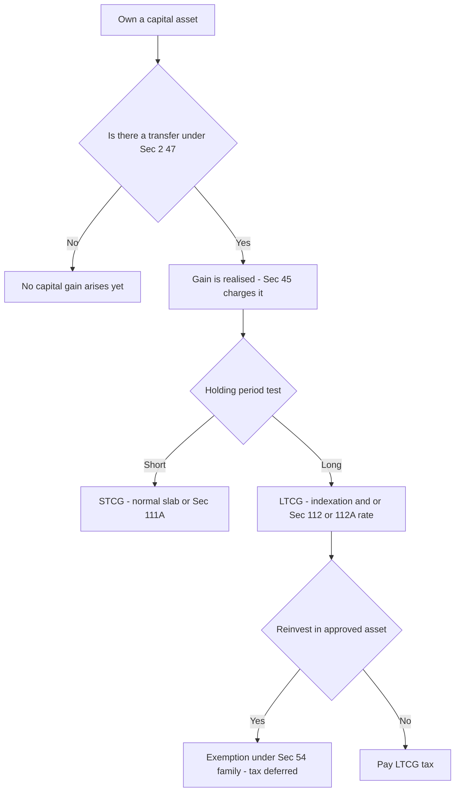
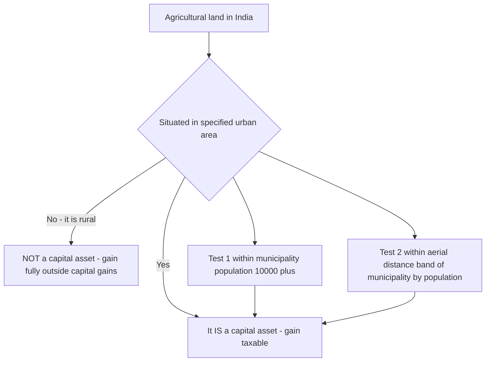
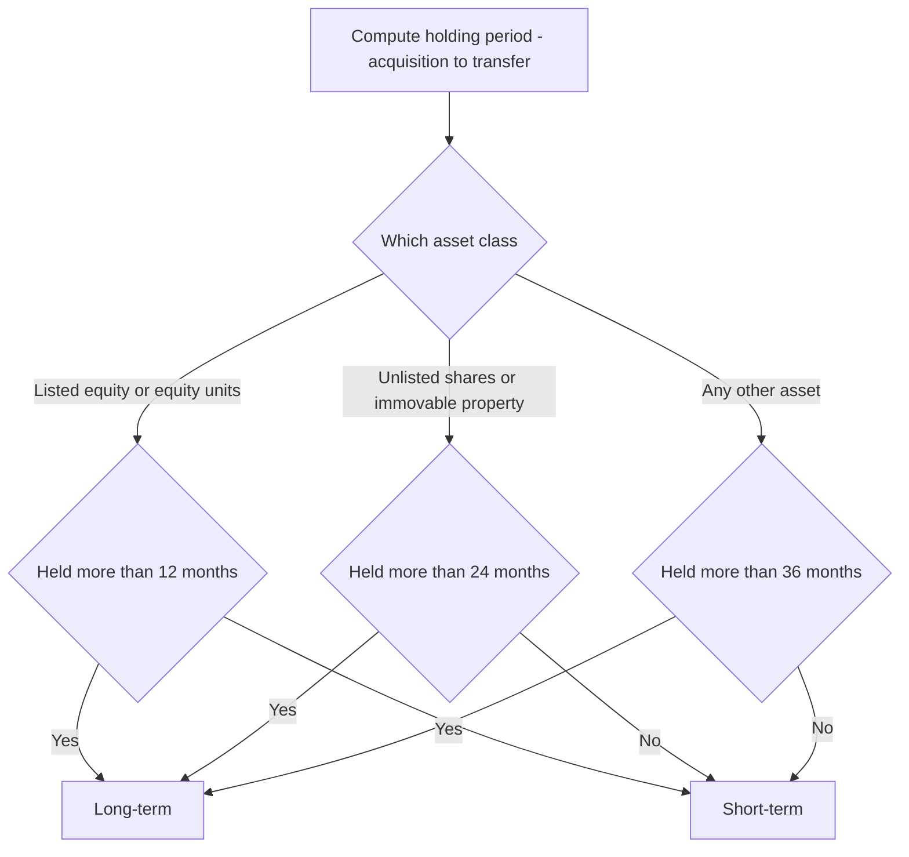
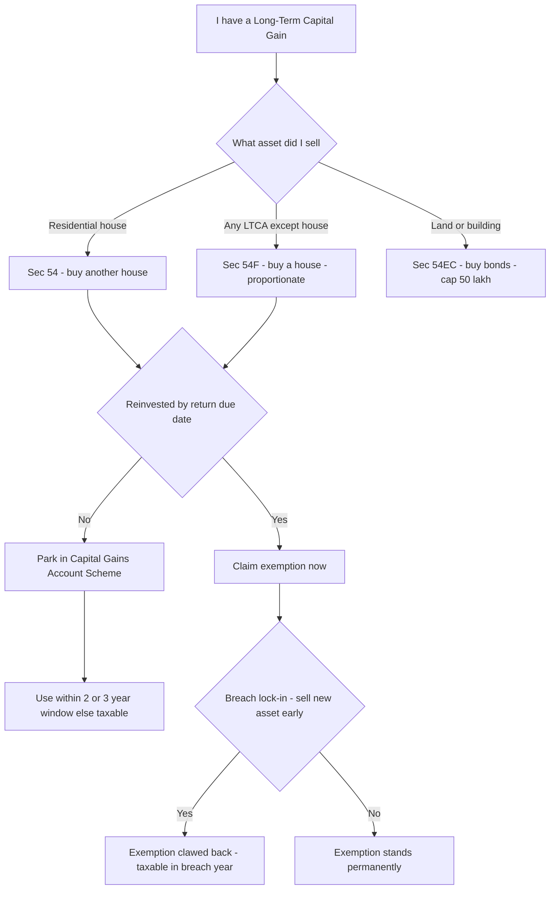

# Chapter 06 — Capital Gains

> **Rates / limits / indexation flag:** The concessional rates, the base year for indexation, the exemption ceilings (₹50 lakh under 54EC, ₹10 crore caps under 54/54F), and even *whether indexation survives at all* have all been moved by recent Finance Acts. This chapter teaches the **structure and logic** so the mechanism is permanent knowledge. **Always verify the exact rates, indexation availability, ceilings, and the applicable Assessment Year against current ICAI study material for your attempt.**

---

## 1. The Problem — Why ordinary income tax breaks down for asset sales

Imagine you buy a plot of land in 2005 for ₹5 lakh and sell it in 2024 for ₹50 lakh. You have ₹45 lakh of "profit." Should the whole ₹45 lakh be taxed like a salary of ₹45 lakh earned this year?

If you say yes, three problems immediately appear, and each one is a genuine injustice — not a loophole:

**Problem 1 — The gain isn't income of *one* year, but tax is annual.** That ₹45 lakh accumulated silently over 19 years. Income tax is an **annual** levy on an **annual** slab system. Dumping 19 years of accretion into a single year artificially rockets you into the top slab, so you pay a top-slab rate on gains that, spread over 19 years, might never have touched the top slab. This is the **"bunching" problem.**

**Problem 2 — Part of the "gain" is fake; it's just inflation.** Prices roughly quadrupled between 2005 and 2024. A part of your ₹45 lakh is not real enrichment — it is the rupee losing value. Taxing inflation is taxing a phantom; the taxpayer is poorer in real terms than the nominal number suggests.

**Problem 3 — Nothing was "earned" until you sold.** Your salary is a *flow* — money keeps arriving. An asset's appreciation is a *stock* that just sits there, unrealised, until the day you convert it to cash. Taxing paper appreciation every year would force people to sell assets just to pay tax. So gain must be recognised only at a single **realisation event.**

Ordinary "income" — salary, interest, rent, business profit — has none of these features. It arrives yearly, it is real, and it is realised as it accrues. **Capital gains behave fundamentally differently, so the Act gives them their own head, their own timing rule, their own inflation adjustment, and their own concessional treatment.** That is the entire reason Capital Gains (Sections 45 to 55A) exists as a *separate* head under Section 14.

---

## 2. The Core Idea

> **A capital gain is taxed only when a capital asset is *transferred* (realised), and because the gain has silently accumulated over the holding period, the law softens the blow the longer you held it — through indexation and/or a lower rate — and lets you defer tax entirely if you plough the money back into another approved capital asset.**

Four load-bearing words fall out of that sentence, and the whole chapter is just these four unpacked:

1. **Capital asset** — *what* is being sold (Sec 2(14)).
2. **Transfer** — the *trigger* event that makes gain taxable (Sec 2(47)).
3. **Holding period** — *how long* you held it, which decides short-term vs long-term.
4. **Reinvestment exemptions** — a *deferral* mechanism (Sec 54 family) that says "if you didn't really cash out — you rolled into another asset — we'll wait."

The charging section, **Sec 45(1)**, ties them together: *"Any profits or gains arising from the transfer of a capital asset shall be chargeable to tax under the head Capital Gains in the previous year in which the transfer took place."* Notice the timing — the year of **transfer**, not the year of accretion. That single clause solves Problem 3 above.

---

## 3. Why It's Built This Way — the design logic behind each feature

Before any section, understand the *design choices* the legislature made, because every rule below is one of these choices in disguise:

| Design choice | The problem it solves | How the Act implements it |
|---|---|---|
| Separate head of income | Bunching + realisation timing | Sec 45 charges only on transfer |
| Distinguish short vs long holding | Long holders suffer more inflation + more bunching | Holding-period test → STCG vs LTCG |
| Indexation of cost | Inflation is not real gain | Cost Inflation Index (CII), Sec 48 2nd proviso |
| Concessional LTCG rate | Long gains deserve gentler treatment | Sec 112 / 112A special rates |
| Reinvestment exemptions | Person hasn't truly consumed the gain | Sec 54, 54B, 54D, 54EC, 54F etc. |
| Deemed full value (Sec 50C, 50CA) | Under-reporting of sale price | Substitute stamp value / FMV |

The elegance: **the longer you hold, the more inflation and bunching hurt you, so the more relief the law gives you.** Short-term gains get neither indexation nor a special rate (with narrow exceptions) — because over a few months, inflation and bunching are trivial, so ordinary treatment is fair. That single principle — *relief scales with holding period* — is the spine of the whole chapter. Memorise the principle, and every rule becomes predictable.


*Figure 1 — The master decision path of every capital gains problem: asset → transfer → holding period → rate → possible exemption.*

---

## 4. Full Technical Content

### 4.1 Capital Asset — Sec 2(14)

**Why a definition at all?** Because "asset" is enormous. The law wants to tax *investment/wealth* accretion, not the ordinary tools and stock of daily life or livelihood. So Sec 2(14) starts wide ("property of any kind") and then *carves out* things that logically belong to *other* heads or shouldn't be taxed as wealth appreciation.

**Definition:** A capital asset means **property of any kind held by an assessee**, whether or not connected with business or profession, **and includes** securities held by an FII, and certain unit-linked insurance policies — **but excludes** the following:

| Exclusion | Why it is excluded (the logic) |
|---|---|
| **Stock-in-trade, raw material, consumables** | Selling these is *business*, taxed under PGBP — not wealth appreciation |
| **Personal effects** — movable property for personal use (clothes, furniture, car, mobile) | Household items depreciate; taxing their "gain" is pointless. **But** jewellery, archaeological collections, drawings, paintings, sculptures, art works are **NOT** personal effects — they are investments, so they ARE capital assets |
| **Rural agricultural land in India** | Meant to shield genuine farmers; farming is separately exempt. **Urban** agricultural land IS a capital asset |
| **Specified Gold Bonds / Gold Deposit Bonds / Gold Monetisation Scheme deposits** | Policy incentive to draw idle gold into the economy |

**Memory hook — "SPRAG"** for the exclusions: **S**tock-in-trade, **P**ersonal effects, **R**ural agricultural land, **A**gricultural (rural) — **G**old bonds/schemes. (Personal effects and jewellery is the examiner's favourite trap — see §8.)

**The rural agricultural land test** deserves its own diagram because it is heavily examined:


*Figure 2 — Only RURAL agricultural land escapes; urban agricultural land is a normal capital asset. Verify the population/distance bands in current material.*

The population-distance bands (broadly: within 2 km if population 10,000–1,00,000; 6 km if 1,00,000–10,00,000; 8 km if above 10,00,000) are a classic memorised table — **verify current bands in ICAI material.**

### 4.2 Transfer — Sec 2(47)

**Why define "transfer" so exhaustively?** Because Sec 45 only bites on transfer. If "transfer" meant only "sale," people would dodge tax by "exchanging," "extinguishing rights," giving up possession under an agreement, etc. So Sec 2(47) is deliberately wide to catch every substance-of-sale event.

**Transfer includes:** sale, **exchange**, **relinquishment** of the asset, **extinguishment of any rights** in it, **compulsory acquisition** under law, **conversion of a capital asset into stock-in-trade** (deemed transfer — taxed when the converted stock is sold, using FMV on conversion date as full value), and **allowing possession of immovable property** under a part-performance contract (Sec 53A of Transfer of Property Act), and transactions transferring enjoyment via membership/shares.

**Transactions NOT regarded as transfer — Sec 47 (why: no real change of beneficial ownership, so no realisation).** Key ones:

- Distribution of assets on **partition of a HUF** — the family already owned it collectively.
- Transfer under a **gift, will, or irrevocable trust** — no consideration flows; instead the *donee* inherits the previous owner's cost and holding period (see §4.6), so tax is only deferred, not forgiven.
- Transfer of a capital asset by a **holding company to its 100% subsidiary** (or vice versa), subject to conditions — group is economically one entity.
- Transfers under **amalgamation / demerger** to the resulting Indian company, subject to conditions.

**Memory hook:** Sec 4**7** = the "**not**-a-transfer" list (7 looks like an inverted "not"/exemption gate). Its logic is always *"beneficial ownership didn't really change, or consideration didn't flow — so defer, don't tax now."*

### 4.3 Short-term vs Long-term — the holding-period test (Sec 2(42A) / 2(29A))

**Why the distinction is the heart of the chapter:** it decides whether you get indexation and a concessional rate (long-term) or ordinary treatment (short-term). Recall §3 — relief scales with holding period.

**Rule:** compute the period from **date of acquisition to date of transfer.** If it exceeds the threshold → **long-term capital asset (LTCA)** → gain is **LTCG**. Otherwise **short-term (STCA/STCG).**

**But the threshold is not one number — it depends on the asset, because different assets appreciate and are held over different natural horizons:**

| Asset class | Long-term if held for MORE than | Logic |
|---|---|---|
| Listed equity shares, equity-oriented units, units of business trust | 12 months | Liquid, standardised markets; policy pushes retail equity investing |
| Unlisted shares, immovable property (land/building) | 24 months | Less liquid than listed equity, more liquid than "everything else" |
| Any other asset (gold, debt funds pre-rule-change, unlisted debentures, etc.) | 36 months | Default residual horizon |

**Memory hook — "12 / 24 / 36 ladder":** the more liquid and market-traded the asset, the *shorter* the road to "long-term." Listed equity = 12; unlisted shares & real estate = 24; the residual "everything else" = 36.

> **Flag:** The holding-period slabs and the treatment of debt mutual funds / market-linked debentures were changed by recent Finance Acts (some now always short-term regardless of period). **Verify the current classification table for your AY.**


*Figure 3 — The 12/24/36 holding-period ladder. Verify current thresholds and any asset-specific overrides.*

### 4.4 The computation engine — Sec 48

Sec 48 gives the **universal formula.** Everything else is a variation on it.

**For SHORT-TERM capital gain:**

```
Full value of consideration received/accruing on transfer
LESS: Expenditure incurred wholly and exclusively in connection with transfer
LESS: Cost of acquisition
LESS: Cost of improvement
= Short-Term Capital Gain (STCG)
```

**For LONG-TERM capital gain (where indexation applies):**

```
Full value of consideration
LESS: Expenditure in connection with transfer
LESS: INDEXED cost of acquisition
LESS: INDEXED cost of improvement
= Long-Term Capital Gain (LTCG)  [before exemptions]
```

**Why the two versions differ — this is the whole point of §1 Problem 2.** Short-term holders barely suffer inflation, so their cost stays at historical value. Long-term holders held through years of inflation, so their cost is *inflated up* (indexed) to today's rupees — removing the phantom inflationary gain before tax.

**The building blocks, each with its logic:**

- **Full value of consideration (FVC):** what you actually receive (cash or the value of what you exchange). *Anti-abuse override:* where immovable property is sold below stamp-duty value, **Sec 50C** deems the stamp value to be the FVC (with a tolerance band, verify current %). For unquoted shares, **Sec 50CA** substitutes FMV. *Why:* stops parties from writing a fake low price on paper.
- **Expenditure on transfer:** brokerage, legal fees, stamp duty on sale, advertisement to find a buyer — costs *of selling*. *Why:* only the *net* enrichment should be taxed.
- **Cost of acquisition (COA) — Sec 55:** what you paid to get the asset. Special rules where you didn't pay (gift/inheritance — you take the *previous owner's* cost, §4.6) or where the asset has no cost (self-generated goodwill etc. → cost taken as nil, subject to current law).
- **Cost of improvement — Sec 55:** capital additions after acquisition (building a floor, boundary wall). *Excludes* routine repairs (those are revenue). Improvements *before 1-4-2001* are ignored — see the FMV option below.

**Indexed Cost formula (Sec 48, 2nd proviso):**

$$\text{Indexed COA} = \text{COA} \times \frac{\text{CII of year of transfer}}{\text{CII of year of acquisition (or 2001-02 if earlier)}}$$

The **Cost Inflation Index (CII)** is a government-notified inflation multiplier with a **base year 2001-02 = 100** (base year may be revised — verify). If you acquired *before* 1-4-2001, you may substitute the **Fair Market Value as on 1-4-2001** for cost (Sec 55) — because tracing a 1970s cost is impractical and unfair, so the law lets you "restart the clock" at 2001 value.

> **Big flag:** Whether indexation is *available at all* on various long-term assets has been curtailed by recent Finance Acts (some LTCG now taxed at a flat lower rate *without* indexation, sometimes with a taxpayer option). The *concept* — remove inflation before taxing long gains — is what you must own; the *mechanics* (rate vs indexation) **must be checked in current ICAI material for your AY.**

### 4.5 The special rates — Sec 111A, 112, 112A

**Why special rates exist:** ordinary slab rates (up to ~30%+) applied to bunched long gains would be punitive (Problem 1). So the Act carves out flat, gentler rates for specified gains. Note the pattern below — **listed-equity gains get their own regime (STT-paid) separate from everything else.**

| Section | Applies to | Nature | Rate (verify current %) | Logic |
|---|---|---|---|---|
| **111A** | STCG on listed equity shares / equity-oriented units where **STT paid** | Short-term | Flat concessional (historically 15%, revised recently) | Encourage equity market participation; STT already collected |
| **112A** | LTCG on listed equity / equity units where STT paid | Long-term | Flat concessional above an annual exemption threshold (historically ₹1 lakh, revised); **no indexation** | Reward long equity holding; the exemption threshold protects small investors |
| **112** | LTCG on **all other** long-term assets (land, building, unlisted shares, gold, debt) | Long-term | Flat rate (historically 20% with indexation; recent law introduced lower flat rate without indexation / option) | General concessional LTCG treatment |

**Memory hook:** **111A = Short equity**, **112A = Long equity** (the "A" pair are the *equity + STT* twins), **112 (no A) = Long everything-else.**

Two protective rules that flow from *fairness*, not memorisation:

- **Chapter VI-A deductions (80C etc.) are NOT allowed against 111A/112/112A special-rate income.** *Why:* those deductions are meant to shelter ordinary income; letting them also erase already-concessional capital gains would be double relief.
- **Basic exemption limit adjustment (residents):** if a resident individual's *other* income is below the basic exemption limit, the shortfall can be set off against LTCG/STCG-111A first. *Why:* the basic exemption belongs to every resident; it shouldn't be lost merely because income happens to be capital gain. (Available to residents only — a non-resident cannot claim it against these special-rate gains.)

### 4.6 Cost & period when you didn't buy it — Sec 49 & Explanation to 2(42A)

**The logic:** In Sec 47 "not-a-transfer" cases (gift, inheritance, partition), no tax was charged on the giver *because* the tax is merely **deferred to the eventual sale by the receiver.** For that deferral to work, the receiver must **step into the giver's shoes**:

- **Cost of acquisition = cost to the previous owner** (Sec 49(1)).
- **Holding period includes the previous owner's holding period** (Explanation to Sec 2(42A)) — so an asset inherited yesterday but bought by grandfather in 1990 is long-term.
- For **indexation**, the year of *the previous owner's acquisition* is generally used for the CII (subject to case law / current position — verify).

This is a favourite exam theme: a gifted asset sold within months is **still long-term** if the donor held it long. Never test the holding period from the gift date alone.

### 4.7 Advance money forfeited & other adjustments — Sec 51 / 56(2)(x) interaction

If you received advance money and the deal fell through and you **forfeited** it, historically it reduced your cost of acquisition; under current law such forfeited advance is instead taxed as **Income from Other Sources under Sec 56(2)(ix)** and does **not** reduce cost. *Why the change:* to tax the forfeiture in the year it happens rather than defer it. **Verify current treatment.**

---

## 5. Worked Examples

> Every figure below reconciles line-by-line. **Rates and CII values used are illustrative** — plug in the notified CII and current rates for your AY.

### Example 1 (Easy) — Short-term capital gain on listed shares (Sec 111A)

*Facts:* Mr A buys 1,000 listed equity shares on 10-May-2023 at ₹200 each (STT paid). Brokerage on purchase ₹500. He sells all on 1-Feb-2024 at ₹350 each; brokerage on sale ₹700. He has no other income.

**Step 1 — Holding period.** 10-May-2023 to 1-Feb-2024 ≈ 9 months. Listed equity threshold = 12 months. **≤ 12 months → Short-term.**

**Step 2 — Full value of consideration.** 1,000 × ₹350 = **₹3,50,000.**

**Step 3 — Cost of acquisition.** 1,000 × ₹200 = ₹2,00,000, **plus** purchase brokerage ₹500 (part of cost) = **₹2,00,500.**

**Step 4 — Expenditure on transfer.** Sale brokerage = **₹700.**

**Step 5 — STCG.**

| Particulars | ₹ |
|---|---|
| Full value of consideration | 3,50,000 |
| Less: Expenditure on transfer (sale brokerage) | (700) |
| Less: Cost of acquisition (incl. purchase brokerage) | (2,00,500) |
| **Short-Term Capital Gain** | **1,48,800** |

**Step 6 — Tax.** STT-paid listed-equity STCG → **Sec 111A flat concessional rate** (verify %), **not** slab. No 80C deduction against it. (Illustratively at 15%: tax ≈ ₹22,320 + cess, before basic-exemption adjustment.)

*Reconciliation:* Bought for ₹2,00,500, sold net of ₹700 = received ₹3,49,300; ₹3,49,300 − ₹2,00,500 = ₹1,48,800. ✔

### Example 2 (Moderate) — Long-term capital gain on land with indexation

*Facts:* Ms B purchased a plot on 5-June-2010 for ₹8,00,000; registration & stamp duty on purchase ₹40,000. She built a boundary wall in FY 2015-16 for ₹1,00,000. She sells the plot on 20-Dec-2023 for ₹60,00,000; brokerage 1% of sale price. Illustrative CII: 2010-11 = 167, 2015-16 = 254, 2023-24 = 348.

**Step 1 — Holding period.** June-2010 to Dec-2023 ≈ 13.5 years. Immovable property threshold = 24 months. **Long-term.** Indexation applies (per illustrative pre-change law — verify current position).

**Step 2 — Full value of consideration = ₹60,00,000.** (Assume this equals/exceeds stamp value, so Sec 50C doesn't override.)

**Step 3 — Expenditure on transfer.** Brokerage 1% × 60,00,000 = **₹60,000.**

**Step 4 — Indexed cost of acquisition.** COA = ₹8,00,000 + ₹40,000 stamp duty = ₹8,40,000.

$$\text{Indexed COA} = 8,40,000 \times \frac{348}{167} = 8,40,000 \times 2.0838 = \mathbf{₹17,50,395}$$

**Step 5 — Indexed cost of improvement.** ₹1,00,000 × (348 / 254) = 1,00,000 × 1.3701 = **₹1,37,008.**

**Step 6 — LTCG.**

| Particulars | ₹ |
|---|---|
| Full value of consideration | 60,00,000 |
| Less: Expenditure on transfer (brokerage) | (60,000) |
| Less: Indexed cost of acquisition | (17,50,395) |
| Less: Indexed cost of improvement | (1,37,008) |
| **Long-Term Capital Gain** | **40,52,597** |

**Step 7 — Tax.** Land is *not* listed equity → **Sec 112** (illustratively 20% with indexation → ≈ ₹8,10,519 + cess; or the newer flat rate without indexation if opted — **verify which regime applies for your AY**).

*Reconciliation:* Nominal gain = 60,00,000 − 60,000 − 8,40,000 − 1,00,000 = ₹49,00,000. Indexation converts ₹9,40,000 of historical cost into ₹18,87,403 of today's rupees, shaving ₹9,47,403 of *inflationary* gain off the taxable figure → ₹49,00,000 − ₹8,47,403 = ₹40,52,597. ✔ (This ₹8.47 lakh reduction is exactly the "phantom inflation" from §1 Problem 2, made concrete.)

### Example 3 (Exam-hard) — LTCG on a *gifted* residential house, with a Sec 54 reinvestment exemption

*Facts:* Mr C received a residential house **as a gift from his father on 1-July-2022.** His father had purchased it on 10-Aug-2005 for ₹12,00,000. Mr C sells the house on 15-Jan-2024 for ₹90,00,000 (stamp value ₹92,00,000). Selling expenses ₹90,000. On 1-Sept-2024 he buys a new residential house for ₹35,00,000. Illustrative CII: 2005-06 = 117, 2023-24 = 348.

**Step 1 — Is it a transfer / a capital asset?** Yes, a sale of a house = transfer of a capital asset. The *gift* to Mr C was NOT a transfer (Sec 47) — so no tax then; tax is deferred to this sale.

**Step 2 — Holding period (the trap).** Do **not** count from 1-July-2022 (gift date). Under Explanation to Sec 2(42A), include the **previous owner's** holding. Father held from Aug-2005; total ≈ 18 years → **Long-term.** (If you wrongly counted from the gift, you'd get ~18 months and mislabel it — the classic examiner trap.)

**Step 3 — Full value of consideration — Sec 50C check.** Actual price ₹90,00,000 < stamp value ₹92,00,000. If the gap exceeds the tolerance band (verify current %, e.g. 10%): here gap = 2/90 ≈ 2.2%, **within** the band → actual ₹90,00,000 stands. FVC = **₹90,00,000.** (If it had exceeded the band, FVC would be deemed ₹92,00,000.)

**Step 4 — Cost of acquisition — Sec 49(1).** Take the **father's cost = ₹12,00,000.**

**Step 5 — Indexed cost.** Using the previous owner's year of acquisition (2005-06):

$$\text{Indexed COA} = 12,00,000 \times \frac{348}{117} = 12,00,000 \times 2.9744 = \mathbf{₹35,69,231}$$

**Step 6 — LTCG before exemption.**

| Particulars | ₹ |
|---|---|
| Full value of consideration | 90,00,000 |
| Less: Expenditure on transfer | (90,000) |
| Less: Indexed cost of acquisition | (35,69,231) |
| **LTCG before exemption** | **53,40,769** |

**Step 7 — Sec 54 exemption (reinvestment in a residential house).** A LTCG on a residential house reinvested in another residential house is exempt to the **lower of (a) the capital gain or (b) the amount invested in the new house.** Here gain ₹53,40,769 vs investment ₹35,00,000 → exemption = **₹35,00,000** (the lower).

**Step 8 — Taxable LTCG.**

| Particulars | ₹ |
|---|---|
| LTCG before exemption | 53,40,769 |
| Less: Exemption under Sec 54 | (35,00,000) |
| **Taxable LTCG (Sec 112)** | **18,40,769** |

*Reconciliation:* Father's ₹12,00,000 grew to a nominal ₹90,00,000 (net ₹89,10,000 after selling cost); indexation lifts cost to ₹35,69,231, giving ₹53,40,769 real gain; reinvesting ₹35 lakh defers tax on that slice, leaving ₹18,40,769 taxable. ✔ Every rupee accounted for.

*Learning:* had Mr C invested ₹55,00,000+ (≥ the whole gain), taxable LTCG would be **nil** — full deferral. This is the reinvestment logic of §4.8 below in action.

---

## 4.8 (Technical, placed here to feed Example 3) — The reinvestment exemptions: Sec 54, 54F, 54EC

**The unifying logic — "you didn't really cash out."** If you sell your house and immediately buy another house to live in, you haven't *consumed* the gain — you've merely swapped one roof for another. Taxing you would force a sale of the new home to pay tax. So the Act says: *reinvest into an approved capital asset within a time window, and we'll exempt (defer) the gain to the extent reinvested.* Every exemption in this family is the **same idea with different asset pairs.**

| Section | Sell WHAT (source) | Buy WHAT (reinvest) | Who | Exemption = lower of |
|---|---|---|---|---|
| **54** | LTCG on a **residential house** | Another **residential house** (in India) | Individual / HUF | Capital gain OR cost of new house |
| **54F** | LTCG on **any LTCA other than a house** (e.g. shares, gold, plot) | A **residential house** | Individual / HUF (must not own >1 other house) | *Proportionate* — gain × (investment ÷ net sale consideration) |
| **54EC** | LTCG on **land or building** | **Specified bonds** (NHAI/REC etc.), redeemable, 5-yr lock-in | Any assessee | Capital gain OR amount invested, **capped at ₹50 lakh** |

**Why 54 vs 54F differ in the exemption formula — a beautiful piece of logic:**
- Under **Sec 54** the source is *itself* a house, so reinvesting the *gain* is enough → exemption capped at gain or new-house cost.
- Under **Sec 54F** the source is *not* a house (say shares). Parliament worries you might sell shares, buy a house partly with the gain and partly pocket cash. So it demands you invest the **entire net sale consideration** to get full exemption; invest only part, and you get a **proportionate** exemption: `Exemption = LTCG × (Amount invested in house ÷ Net sale consideration)`. *This proportionality is the single most tested feature of 54F.*

**Why 54EC caps at ₹50 lakh and locks in 5 years:** these are subsidised government infrastructure bonds. An uncapped exemption would let the ultra-rich park unlimited gains tax-free, so ₹50 lakh is the ceiling; the lock-in ensures the money genuinely funds infrastructure. Investment must be made **within 6 months** of transfer.

**Capital Gains Account Scheme (CGAS):** if you haven't reinvested by the **due date of filing your return**, you must **deposit the unutilised gain in a CGAS account** with a bank to still claim 54/54F, and then use it within the statutory window (2 years to buy / 3 years to construct). *Why:* it stops taxpayers from *claiming* an exemption they only *intend* to fulfil — the money must be ring-fenced.

**Clawback (why exemptions aren't permanent gifts):** if the **new house is sold within 3 years** (54/54F) or the **54EC bonds are transferred/loaned against within 5 years**, the exemption is **withdrawn** — the earlier-exempt gain becomes taxable in the year of the breach. *Why:* the relief was for *genuine* long-term reinvestment, not a quick round-trip. Recent law also **caps the cost of the new house eligible under 54/54F at ₹10 crore** — verify.


*Figure 4 — The reinvestment-exemption family: same logic (defer tax on money ploughed back), different asset pairs, with CGAS parking and clawback guardrails. Verify ceilings and windows.*

---

## 6. Computation Format / Presentation (use this exact ladder in the exam)

Present **each capital asset separately**, then aggregate. Marks are awarded for the disciplined ladder — show every line even if nil.

```
Computation of Capital Gains for A.Y. 20XX-XX

A) Short-Term Capital Gain — [Asset name]
   Full value of consideration                        XXX
   Less: Expenditure on transfer                     (XXX)
   Less: Cost of acquisition                          (XXX)
   Less: Cost of improvement                          (XXX)
                                                      -----
   Short-Term Capital Gain                             XXX
                                                      =====

B) Long-Term Capital Gain — [Asset name]
   Full value of consideration                        XXX
   Less: Expenditure on transfer                     (XXX)
   Less: Indexed cost of acquisition                  (XXX)
   Less: Indexed cost of improvement                  (XXX)
                                                      -----
   Gross Long-Term Capital Gain                        XXX
   Less: Exemption u/s 54 / 54F / 54EC                (XXX)
                                                      -----
   Taxable Long-Term Capital Gain                      XXX
                                                      =====

Note: STCG u/s 111A and LTCG u/s 112 / 112A are taxed at
special rates and are shown separately from slab income.
Chapter VI-A deductions NOT allowed against them.
```

**Presentation rules examiners reward:**
1. Always **state the section** for the rate (111A / 112 / 112A) beside the figure.
2. Always **show the holding-period working** (dates + threshold) — that one line justifies STCG vs LTCG.
3. Show the **indexation fraction explicitly** (CII_transfer / CII_acquisition).
4. **Round** as per current rules; **carry set-off/exemptions on separate lines.**

---

## 7. Connections

- **Head interaction (Sec 14):** Capital Gains is head #4. Selling *stock-in-trade* falls under **PGBP**, not here (that's why Sec 2(14) excludes it). Forfeited advance now lands in **Income from Other Sources (Sec 56)**.
- **Set-off & carry-forward (Chapter VI):** **Short-term capital loss** can be set off against *both* STCG and LTCG; **Long-term capital loss** can be set off *only against LTCG* (logic: don't let a concessionally-taxed long loss wipe out fully-taxed short income). Both carry forward **8 years** — verify.
- **Clubbing & Sec 49:** gifted-asset gains connect to the "step-into-shoes" cost rule; watch clubbing where a spouse/minor's asset is transferred without consideration.
- **Sec 50 (depreciable assets):** gain on a business asset in a block on which depreciation was claimed is **deemed short-term** regardless of holding period — because you already got depreciation relief; giving indexation too would be double benefit. (Detailed in the PGBP/Depreciation chapter.)
- **TDS:** Sec 194-IA (1% TDS on immovable property ≥ ₹50 lakh) and 195 (TDS on non-resident's gains) connect the computation to collection.
- **Residential status (Chapter 02):** the basic-exemption-limit adjustment against 111A/112/112A gains is a **resident-only** benefit — non-residents lose it. This is where residence feeds back into capital gains.

---

## 8. Traps & Examiner Tricks

1. **Jewellery is NOT a personal effect.** "Sale of gold jewellery" → capital asset, gain taxable. Only *ordinary* personal movables (car, furniture, wearing apparel) are excluded. Paintings/sculptures/art likewise taxable.
2. **Gifted/inherited asset — count the previous owner's holding period AND cost.** The single biggest trick (Example 3). Never start the clock at the gift/inheritance date.
3. **Rural vs urban agricultural land.** Rural = not a capital asset (gain fully outside tax); urban = fully taxable. Always apply the population/distance test.
4. **Sec 50C tolerance band.** Only substitute stamp value if the gap *exceeds* the permitted % — a small gap keeps the actual price.
5. **54F is proportionate; 54 is not.** Applying the 54 formula to a 54F situation (or vice versa) is a guaranteed mark loss. 54F also requires you *not own more than one other residential house*.
6. **54EC ₹50 lakh cap and the year-straddle trick.** Examiners set the transfer near a financial-year-end so a naive student invests ₹50 lakh in two years to get ₹1 crore exemption — current law caps the *aggregate* at ₹50 lakh across years. Verify.
7. **Chapter VI-A (80C etc.) NOT deductible against special-rate gains.** Students reflexively subtract 80C — wrong against 111A/112/112A income.
8. **CGAS deadline is the return due date, not the reinvestment window's end.** If not reinvested by the *filing due date*, the money must already be parked in CGAS to preserve the exemption.
9. **Indexation only for long-term** (and only where current law still allows it) — never index a short-term cost.
10. **Clawback on early sale of the new asset** — if the question sells the new house within 3 years, revive the exempt gain in the breach year.
11. **Conversion of capital asset into stock-in-trade** is a *deemed* transfer but the gain is taxed in the year the *converted stock is sold*, using FMV on conversion date as the capital-gains full value (the excess over FMV is business income). Two-stage — easy to compress wrongly.

---

## 9. First-Principles Recap

Rebuild the whole chapter from one sentence: **"Wealth appreciation is different from ordinary income, so tax it only when realised, adjust for the years and inflation it accumulated over, and don't tax it at all if it was merely rolled into another asset."**

- *Only when realised* → charge on **transfer** (Sec 45), and define both **capital asset** (Sec 2(14)) and **transfer** (Sec 2(47)) precisely so nothing escapes and nothing wrong is caught.
- *Adjust for years* → the **holding-period test** (12/24/36) splits short from long; long gains get a **special concessional rate** (Sec 111A / 112 / 112A) to defuse bunching.
- *Adjust for inflation* → **indexation** (Sec 48 + CII) inflates the historical cost so only *real* gain is taxed — where current law still permits it.
- *Rolled into another asset* → **reinvestment exemptions** (Sec 54 / 54F / 54EC) defer tax on the ploughed-back amount, guarded by **CGAS parking** and **clawback** so the relief stays genuine.

If you can derive each section from the *reason*, you never need to memorise it. The reasons are permanent; the numbers are not — **so verify every rate, threshold, CII value, ceiling, and the applicable AY in current ICAI material before your attempt.**

---

## 10. Quick-Revision Sheet

**Sections at a glance**

| Section | What it governs | One-line hook |
|---|---|---|
| 45(1) | Charging section — gain taxed in year of transfer | "Realisation = the trigger" |
| 2(14) | Capital asset definition + exclusions | "SPRAG excluded" |
| 2(47) | Transfer definition (wide) | "Every substance-of-sale event" |
| 47 | NOT-a-transfer list (gift, will, HUF partition, holding-subsidiary) | "Sec 47 = the 'not' gate" |
| 2(42A)/2(29A) | Short vs long-term; incl. previous owner's period | "12 / 24 / 36 ladder" |
| 48 | Computation formula + indexation | "FVC − expenses − (indexed) cost − improvement" |
| 49(1) | Cost = previous owner's cost (gift/inheritance) | "Step into the shoes" |
| 50 | Depreciable block asset gain deemed short-term | "Depreciated → always STCG" |
| 50C / 50CA | Deemed FVC = stamp value / FMV | "Anti-underpricing" |
| 55 | Cost of acquisition / improvement; FMV-on-1-4-2001 option | "Restart clock at 2001" |
| 111A | STCG on STT-paid listed equity — flat rate | "Short equity" |
| 112 | LTCG on all other assets | "Long everything-else" |
| 112A | LTCG on STT-paid listed equity, over threshold, no indexation | "Long equity" |
| 54 | House → house exemption | "Roof for roof" |
| 54F | Any LTCA (non-house) → house, proportionate | "Invest full net consideration" |
| 54EC | Land/building → bonds, ₹50 lakh cap, 5-yr lock | "Bonds, capped" |
| 54B / 54D | Agricultural land / compulsory acquisition of industrial land | "Special reinvestments" |

**Limits & thresholds (VERIFY current values for your AY)**

| Item | Illustrative value — CONFIRM |
|---|---|
| Long-term threshold — listed equity/units | > 12 months |
| Long-term threshold — unlisted shares & immovable property | > 24 months |
| Long-term threshold — other assets | > 36 months |
| CII base year | 2001-02 = 100 |
| FMV substitution option | Assets acquired before 1-4-2001 |
| 111A STCG rate | historically 15% (revised) |
| 112 LTCG rate | historically 20% with indexation / newer flat rate |
| 112A LTCG rate + annual exemption | above ₹1 lakh threshold (revised); no indexation |
| 54EC cap / lock-in / investment window | ₹50 lakh / 5 years / within 6 months |
| 54 & 54F new-asset cost cap | ₹10 crore |
| 54/54F reinvestment window | buy: 1 yr before–2 yrs after; construct: 3 yrs |
| CGAS deposit deadline | return filing due date |
| Clawback period — 54/54F new house | 3 years |
| Set-off: STCL | against STCG & LTCG |
| Set-off: LTCL | against LTCG only |
| Capital loss carry-forward | 8 years |

**The one principle to carry into the hall:** *relief scales with holding period* — short-term = ordinary treatment; long-term = indexation + concessional rate + reinvestment deferral. Everything else is detail hanging off that spine.

> **Final reminder:** Every rate, limit, CII figure, holding-period slab, and the very availability of indexation are subject to annual Finance Act changes. **Confirm each against current ICAI study material and the Assessment Year applicable to your exam before relying on a number.**
