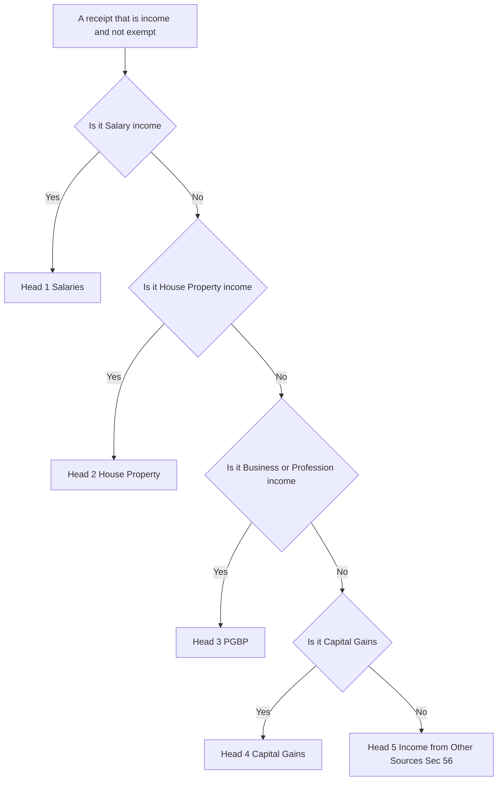
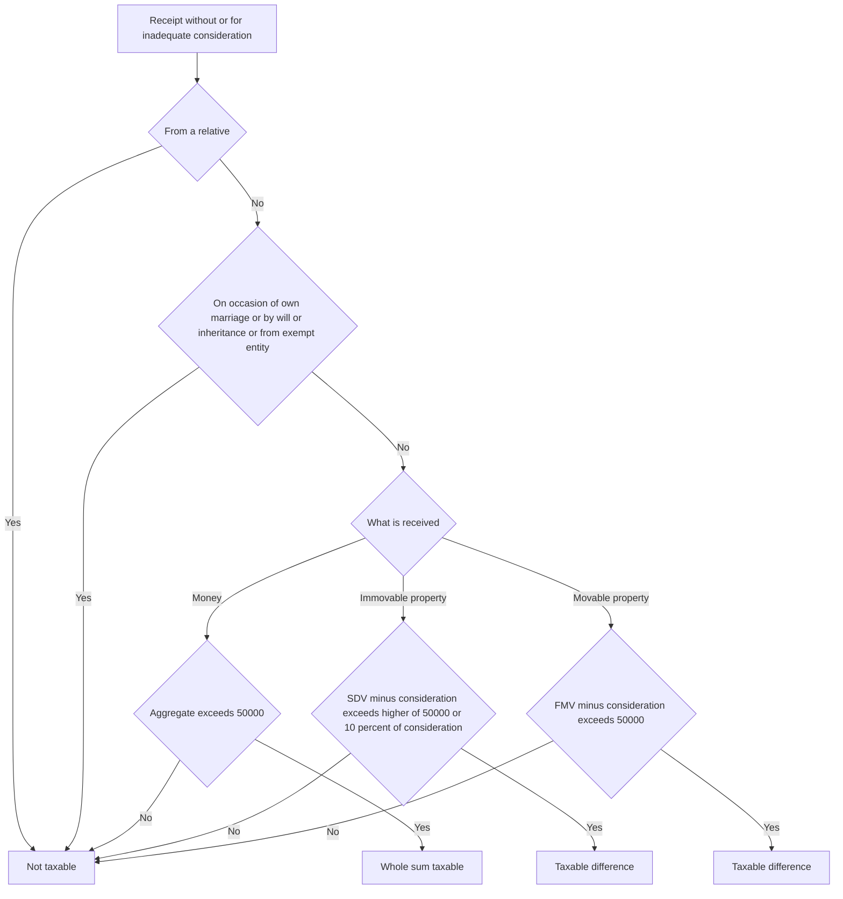
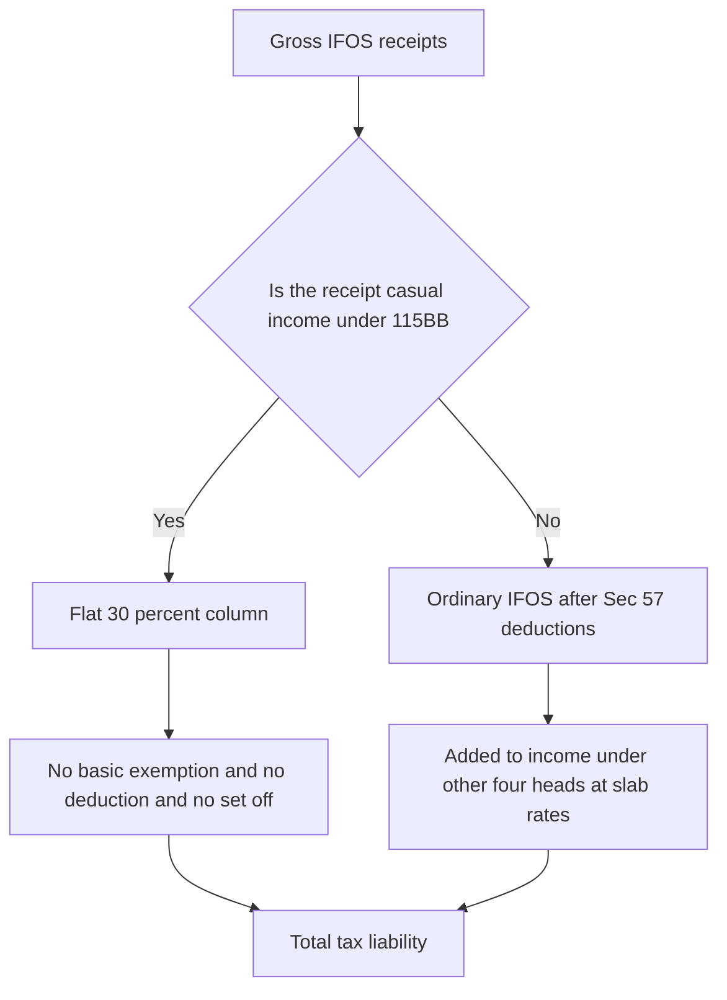

<!-- v2-deep -->

# Chapter 07 — Income from Other Sources

> *Flag:* All rates, monetary limits and threshold figures below are stated for a recent assessment year to build understanding. **Always re-verify the exact rates, limits and the applicable AY against current ICAI study material before your attempt.** The *logic* of each provision, which is what this chapter teaches, does not change year to year.

---

## 1. The Problem — income that belongs nowhere else

The Income-tax Act, 1961 does not tax "income" as one undifferentiated pool. Section 14 splits total income into **five heads**:

1. Salaries
2. Income from House Property
3. Profits and Gains of Business or Profession (PGBP)
4. Capital Gains
5. **Income from Other Sources (IFOS)**

Each of the first four heads has its own machinery: its own charging section, its own rules for what is taxable, when it accrues, and what you can deduct. That specialisation is useful — salary is computed very differently from a capital gain.

But specialisation creates a gap. What happens to income that is genuinely income, yet does not fit the definition of *any* of the first four heads?

Consider:

- You win ₹10 lakh in a game show. It is not salary (no employer), not house property, not business (you are not a professional gambler), and not a capital gain (no capital asset was transferred). Should it escape tax simply because the drafters did not foresee your good luck?
- Your uncle's friend gifts you ₹5 lakh in cash for no reason. Not a capital gain (no transfer), not business income. Tax-free windfall?
- You hold a fixed deposit and earn interest. You are not in the business of lending. Where does it sit?
- A company pays you a dividend. You did not sell the share, so it is not a capital gain.

If the law had **only** four specific heads, all of this would fall through the cracks, and tax planning would degenerate into "structure your income so it fits no head." The tax base would leak badly.

**The problem:** a specific-head system inevitably leaves residual income uncovered, and any uncovered income is, in effect, exempt by accident.

**Sharpen the problem — two kinds of "orphan" income.** It helps to see that IFOS actually catches *two logically different* orphans, and the exam tests both:

- **Genuine income with no natural head** — interest, dividend, family pension, sub-letting. These *are* income on first principles (they are a recurring return or reward); they simply do not fit the four specialised definitions.
- **Capital-type windfalls that would otherwise be non-income** — gifts, share premium above fair value. On first principles these are *not* income at all (a windfall is not the fruit of any activity). The Act must first **deem** them to be income and *then* park them in IFOS. If you keep these two categories separate in your head, you will never confuse "why is a gift taxed?" (because it is deemed income) with "why is interest taxed?" (because it always was income).

This distinction also explains why some IFOS items allow rich deductions (real income, real costs) while others allow none (deemed windfalls, no real cost) — a theme that recurs throughout the chapter.

---

## 2. The Core Idea — a residual, catch-all head

The solution is elegant and is the single idea that explains everything in this chapter:

> **Income from Other Sources is the residual head. If something is *income* under the Act, and it is not exempt, and it does not fall under any of the other four heads, then it is *automatically* taxed here.**

This is the meaning of **Section 56(1)**: income of every kind which is not to be excluded from total income and is not chargeable under heads 1–4 is chargeable under "Income from Other Sources."

Think of IFOS as the **safety net stretched under the other four heads**. Anything that slips past them lands here. Because of this net, the Act can confidently say: *all income is taxed somewhere.*

Two consequences flow immediately from "residual":

- **IFOS is the head of last resort.** You only reach it after checking that the income is not covered by Salaries, House Property, PGBP or Capital Gains. This ordering is not decorative — it decides which set of computation rules and deductions apply.
- **IFOS is deliberately open-ended.** Section 56(1) uses "income of every kind." The drafters could not list every conceivable source, so they wrote a general sweep and then *illustrated* it with a list of common items in **Section 56(2)**.

**A precondition students skip: it must be "income" first.** Section 56(1) only catches a receipt that is already *income* (or is *deemed* income by some provision). A pure capital receipt that is neither income by nature nor deemed to be income is **not** dragged into IFOS at all. This is exactly why gifts needed a separate deeming clause (56(2)(x)) — without it, a gift is a capital receipt and 56(1) alone could not reach it. So the residual net is powerful, but it is a net *for income*, not for every rupee that arrives in your bank account. Keep this precondition in mind whenever an examiner describes an unusual receipt: first ask "is this income or deemed income at all?" before asking "which head?"

*Figure 1 — the residual logic: an item is tested against the four specific heads first, and only lands in IFOS if none of them claims it.*



---

## 3. Why it's built this way — residual sweep plus a named list

If IFOS is purely residual, why does the Act bother to *list* specific items in Section 56(2) — dividends, casual income, gifts, interest on securities? A residual clause would catch them anyway.

Three reasons, and understanding them removes most of the "why is this here?" confusion:

**(a) Certainty for common cases.** Rather than argue every year whether dividend is "income of every kind," the Act names it. The list in 56(2) is *illustrative, not exhaustive* — the word used is "in particular, and without prejudice to the generality" of 56(1). So the list does not shrink the net; it just marks the fish that are caught most often.

**(b) Some items need *special treatment* that only makes sense once the item is pinned to this head.** For example:

- **Gifts** (56(2)(x)) are, in ordinary logic, *capital receipts* — a windfall, not the fruit of any activity. Left alone they would be non-taxable capital receipts. The Act had to *deem* them income and park them in IFOS to tax them at all. This is the classic "the WHY": gifts are taxed here because they had no natural home, and untaxed gifting was a huge route for laundering money and dodging tax.
- **Casual income / lottery** (56(2)(ib)) needs a special flat rate and a *no-deduction, no-set-off* regime. That regime is bolted on precisely because these are IFOS.

**(c) To close specific abuse channels as they were discovered.** Sections like 56(2)(viib) (premium on shares issued above fair value — the "angel tax" logic) were inserted over time as anti-avoidance patches. They are residual by nature but named because they target a precise mischief.

So the architecture is: **one broad residual charge (56(1)) + a growing, illustrative list of named inclusions (56(2)) that either give certainty, deem capital receipts to be income, or plug avoidance.** Keep that framing and you never have to memorise the list as random facts — each entry answers "what gap or abuse does this close?"

**A useful mental sort of every 56(2) clause into three buckets:**

| Bucket | Purpose | Representative clauses | What the deduction regime looks like |
|---|---|---|---|
| "Certainty" inclusions | Name common real income to avoid annual argument | Dividend 56(2)(i); interest on securities 56(2)(id); letting of machinery 56(2)(ii)/(iii) | Normal Sec 57 costs allowed |
| "Deeming" inclusions | Turn a capital-type receipt into income | Gifts 56(2)(x); interest on compensation 56(2)(viii) | Restricted — flat/proxy deductions only |
| "Anti-abuse" inclusions | Plug a discovered avoidance route | Angel-tax premium 56(2)(viib); deemed dividend via 2(22)(e) | Charge only; little or no deduction |

Notice the pattern: the *more artificial* the inclusion (deemed income, anti-abuse), the *stingier* the deduction rules. That is not coincidence — you cannot claim the "cost of earning" income that you never actually earned.

---

## 4. Full Technical Content — sections, formats, rates and limits (each wrapped in its reason)

### 4.1 The charging section — Section 56

- **Sec 56(1):** the general residual charge (explained above).
- **Sec 56(2):** the illustrative list of specific inclusions.

The most exam-relevant items of 56(2):

| Clause | Item | One-line "why it's listed" |
|---|---|---|
| 56(2)(i) | Dividends | Return on shareholding; not a transfer, so not capital gains |
| 56(2)(id) | Interest on securities | Return on debt investment, when not business income |
| 56(2)(ib) | Winnings from lotteries, crossword puzzles, races, card games, gambling, betting, TV game shows | Pure windfall; special flat-rate regime |
| 56(2)(x) | Money/property received without or for inadequate consideration (gifts) | Deems capital-type windfalls to be income; anti-laundering |
| 56(2)(viib) | Consideration for shares exceeding fair market value ("angel tax") | Anti-avoidance on inflated share premium |
| 56(2)(ii)/(iii) | Income from letting of machinery, plant, furniture; and buildings let *along with* such assets where letting is inseparable | Not house property or business — a composite letting |
| 56(2)(viii) | Interest on compensation / enhanced compensation | Certainty on when and how such interest is taxed |

### 4.2 Two default residual items (always IFOS unless business)

**Family pension** — pension received by the *legal heirs* of a deceased employee. The employee's own pension is *salary*; but once he dies, there is no employer-employee relationship with the heir, so it cannot be salary. It lands in IFOS. A **standard deduction under Sec 57(iia)** of 1/3 of the pension or ₹15,000, **whichever is lower**, is allowed — the *reason* being a rough proxy for collection/related costs, mirroring the old salary standard deduction logic. *(Verify the ₹15,000 figure and any updated limit.)*

*Exam nuance on family pension:* certain family pensions are **fully exempt** and never reach IFOS at all — for example, family pension received by the family of a member of the armed forces (including para-military) who died in the course of operational duty, and family pension of a gallantry-award winner's family. When such an exemption applies, you do *not* compute the 1/3-or-₹15,000 deduction — the whole receipt is out of the total income. *(Verify the exact exempt categories under Sec 10 for your AY.)* Examiners like to slip "widow of an army officer killed in action" into a family-pension sum to see if you wrongly apply the standard deduction instead of full exemption.

**Interest income** (bank/FD/others), **director's sitting fees**, **income from sub-letting**, **casual income**, **royalty where not a business** — all default to IFOS.

*Two boundary cases worth pinning down:*
- **Sub-letting.** If *you own* a house and let it out, the rent is **House Property**. If you are a *tenant* who sub-lets, you have no ownership, so the *definition* of house property income (which requires ownership) is not met — the sub-letting surplus is **IFOS**. Ownership is the switch.
- **Director's remuneration vs sitting fees.** A *whole-time/managing* director is an employee → his remuneration is **Salary**. A *non-executive* director who only attends board meetings is not an employee → his **sitting fees** are **IFOS**. The presence or absence of an employer-employee relationship decides the head.

### 4.3 Dividends — Sec 56(2)(i)

**Why the current design exists:** historically dividends were taxed in the company's hands via Dividend Distribution Tax (DDT), so shareholders got them tax-free. DDT was **abolished** (w.e.f. FY 2020-21) because it taxed everyone at the same DDT rate regardless of the shareholder's slab — unfair to small investors. The system reverted to **classical taxation**: dividend is now taxable **in the shareholder's hands under IFOS at slab rates**.

- **Deduction (Sec 57):** only **interest expense** incurred to earn the dividend is allowed, and it is **capped at 20% of the dividend income**. *Why the cap?* To stop taxpayers from wiping out dividend income (or creating a loss) by claiming heavy borrowing costs against a modest dividend. No other expense (e.g., collection charges, portfolio-management fees, demat charges) is allowed.
- **TDS:** the company deducts TDS on dividend above a threshold (commonly ₹5,000 per year per shareholder) — *verify the threshold.*
- **Deemed dividend Sec 2(22)(e):** loans/advances by a closely-held company to a substantial shareholder are treated as dividend, to stop owners extracting profits disguised as "loans."

**Timing — when is dividend taxable?** A **final dividend** is income of the year in which it is *declared, distributed or paid* — precisely, it is taxable when the company in general meeting declares it (that is when the shareholder gets an enforceable right). An **interim dividend** is taxable when it is *unconditionally made available* to the shareholder (broadly, on payment), because the board can rescind it until then. This receipt-oriented timing is one of the forced exceptions to the assessee's regular accounting method (see §4.9).

**Deemed dividend — the finer contours of 2(22):** the clause 2(22) has several limbs, and the exam usually tests (a) and (e):
- **2(22)(a)** — distribution of accumulated profits entailing release of company assets.
- **2(22)(e)** — the big one: a loan/advance by a *closely-held* company to a shareholder holding **≥10% voting power**, or to a concern in which such a shareholder has a *substantial interest*, is deemed dividend **to the extent of the company's accumulated profits.** *Why 10% and accumulated profits?* The mischief is a controlling owner pulling out distributable profits dressed as a repayable "loan"; the deeming bites only up to the profits actually available to distribute, and only where the borrower has enough control to orchestrate it. A genuine loan by a company *whose business is money-lending* is carved out. Note deemed dividend is taxed in the *recipient shareholder's* hands and, unlike a normal dividend, historically was excluded from the DDT net for a reason — always read the facts for "closely-held" and the 10% test.

### 4.4 Interest on securities — Sec 56(2)(id)

Interest on government securities, debentures, bonds. Taxable under IFOS **unless** the securities are held as **stock-in-trade** of a business (then PGBP). **Grossing up** is required when interest is received net of TDS — you add back the TDS to arrive at gross income, because the *income* is the gross amount; the TDS is merely tax already paid on your behalf.

**Grossing-up mechanics (a frequent 2-mark trap).** If you are told the *net* amount received and the TDS rate, gross up as:

> Gross interest = Net received ÷ (1 − TDS rate).

For example, net ₹9,000 received after 10% TDS → gross = 9,000 ÷ 0.90 = **₹10,000**; the ₹1,000 TDS is your prepaid tax credit. If instead you are told the *coupon* (say 8% debentures of face value ₹1,00,000), the gross income is simply the coupon (₹8,000) and TDS is computed *on* it — no grossing up needed because you already have the gross figure. Read carefully whether the number given is "received" (net) or "interest on securities" (gross).

**Timing:** interest on securities is generally taxable on the basis regularly employed, but for *securities with fixed due dates* it is often taxed on the **due date** whether or not received, because the right to it crystallises on that date. Accrued interest on securities bought/sold cum-interest can require apportionment — but that detail is usually beyond Intermediate; verify against your module.

### 4.5 Casual income — Sec 56(2)(ib) read with Sec 115BB

This is the most rule-heavy item, and every rule has a reason rooted in "this is an unearned windfall, and we do not want it gamed."

- **Rate:** taxed at a **flat 30%** (plus surcharge and cess) under **Sec 115BB** — *not* at slab rates. *Why flat and high?* A windfall carries no productive effort and no cost; the state takes a fixed large share, and a flat rate stops high winnings from being sheltered by low slabs.
- **No deduction of any expense** (Sec 58(4)) — the ticket cost, entry fee, travel to the casino: none allowed. *Why?* There is no "cost of earning" a lottery in any real sense, and allowing costs invites fabricated expenses.
- **No basic exemption limit benefit** and **no Chapter VI-A deductions** against it. *Why?* The 30% is meant to be a clean, un-erodable levy.
- **No set-off of losses** against casual income; and **losses from these activities cannot be set off** either. *Why?* Gambling losses are personal; letting them reduce other income would subsidise gambling.
- **TDS Sec 194B / 194BB:** tax deducted at source on winnings above a threshold (e.g., ₹10,000 — *verify; recent law aggregates winnings over the year*). Winnings in kind require the payer to ensure tax is paid before releasing the prize.

**Winnings in kind — the mechanics examiners love.** If you win a *car* or a *gold coin* (a prize wholly in kind), or a prize that is *part cash, part kind*, the payer must ensure tax is paid on the FMV of the prize **before releasing it**. Where the cash part is insufficient to cover the TDS on the whole (cash + kind), the winner must deposit the shortfall with the payer. The **amount taxable in the winner's hands is the FMV of the prize** (grossed to include the tax borne, if the payer bears it). Do not net off the TDS from the value when reporting income — the FMV is the income; TDS is a credit.

**What counts as "casual" — and what does not.** The clause covers lotteries, crossword puzzles, races **including horse races**, card games, gambling and betting of *any form*, and TV/electronic game-show winnings. But note the special carve-out: **income from the activity of owning and maintaining race horses** is *not* pure casual income — it is a quasi-business, so its *expenses are allowed* and it has its own loss-set-off/carry-forward rules (loss can be carried forward up to 4 years and set off only against the same activity). Do not confuse *winnings from betting on a horse race* (pure 115BB casual income, no expense) with *income from owning race horses* (expenses allowed). Also, a genuinely *skill-based* recurring receipt (e.g., a professional bridge player earning a living) can be **business income**, not casual — but at Intermediate, treat game-show/lottery-type receipts as casual unless the facts scream "business."

**Newer digital-age wrinkle:** winnings from **online games** have been carved into their own regime (a dedicated section, taxed at a flat rate on *net winnings* with its own TDS) separate from the classic 115BB lottery bucket. *Verify the exact section, rate and computation for your AY* — ICAI has been updating this; do not conflate it with 194B lottery TDS in an answer.

### 4.6 Gifts — Sec 56(2)(x) — the crown jewel of this chapter

**The WHY, in full.** A gift is a capital receipt — a windfall with no earning activity behind it. Under first principles a capital receipt is not income and not taxable. That created a gaping hole: unaccounted money could be routed as "gifts," and wealth could be transferred to family members in low slabs, all tax-free. Parliament first tried a separate Gift Tax Act (on the *donor*), repealed it, and finally settled on the current design: **tax the recipient by deeming certain gifts to be income under IFOS.** Taxing the receiver, at the receiver's slab, plugs the laundering route and the slab-shifting route at once.

But a blanket tax on every gift would be absurd — birthday cash from your mother, a wedding gift, an inheritance. So the section is built as **a charge with carefully reasoned carve-outs and thresholds.**

**Scope: Sec 56(2)(x) applies to any person** (individual, HUF, firm, company — the earlier versions were limited to individuals/HUF). Three categories:

**(A) Money (any sum of money) without consideration**
- If **aggregate** money received without consideration during the year **exceeds ₹50,000**, the **whole amount** is taxable (not just the excess over ₹50,000).
- *Why "aggregate" and "whole amount"?* Aggregation stops splitting one gift into many small ones. Taxing the whole (once you cross ₹50,000) rather than the excess makes ₹50,000 a genuine *threshold*, not an exemption slab — this is the classic trap (see §8).

**(B) Immovable property**
- *Without consideration:* if **stamp duty value (SDV) > ₹50,000**, the whole SDV is taxable.
- *For inadequate consideration:* taxable if **(SDV − consideration) exceeds the higher of ₹50,000 or 10% of consideration**. *Why the 10% tolerance band?* Because SDV is a government estimate that can genuinely differ from a fair negotiated price; a small gap should not be punished as a "gift." The 10% safe harbour absorbs honest valuation differences. *(Verify the current tolerance percentage — it has been revised.)*
- **SDV on date of agreement** may be used (instead of date of registration) if part of the consideration was paid by a non-cash mode on or before the agreement date — *why?* to protect buyers from SDV rising between booking and registration.

**(C) Movable property** (shares, securities, jewellery, bullion, art, drawings, paintings, sculptures, archaeological collections — a *defined* list; note that a car is **not** in this list, so gifting a car is outside 56(2)(x))
- *Without consideration:* if **aggregate FMV > ₹50,000**, whole FMV taxable.
- *For inadequate consideration:* if **(FMV − consideration) > ₹50,000**, the difference is taxable.

**Three separate ₹50,000 baskets — do not merge them.** The threshold is applied *category-wise*, not to a grand total. Money is one basket, immovable property is another, movable property is a third. ₹40,000 cash + a ₹40,000 painting from friends is **not** taxable (each basket is below ₹50,000), even though the total is ₹80,000. Examiners deliberately arrange facts so the grand total crosses ₹50,000 while each basket stays below — the careless student taxes the lot. Also, *within* a basket the test differs: money and movable use a flat ₹50,000; immovable-inadequate uses the higher-of-₹50,000-or-10% band.

**The exemptions — and their logic (very frequently tested):**

Gifts are **NOT taxed** if received:
1. **From a relative** — *why?* Intra-family transfers are natural provisioning, not income; but "relative" is *defined narrowly* (spouse; brother/sister of self, spouse, or either parent; lineal ascendants/descendants of self or spouse; and spouses of all these) to stop the exemption being abused. A cousin, friend, or uncle's friend is **not** a relative.
2. **On the occasion of marriage of the individual** — *why?* Wedding gifts are a social custom; note it is the *individual's own* marriage, not a child's or sibling's.
3. **Under a will or by inheritance** — *why?* Inheritance is already a distinct transfer of a decedent's estate; taxing it here would be double counting and socially unacceptable.
4. **In contemplation of death of the payer** (donatio mortis causa).
5. **From a local authority, specified fund/foundation/trust/institution, registered charitable trust**, etc. — *why?* These are already regulated/exempt entities; the receipt is not a disguised private windfall.

**The "relative" definition, decoded for an individual (learn it as a picture, not a list).** Starting from *you* (the recipient):
- your **spouse**;
- your **brother or sister**, and your spouse's **brother or sister**;
- the **brother or sister of either of your parents** (i.e., your uncles/aunts on both sides);
- any **lineal ascendant or descendant** of *you* (parents, grandparents, children, grandchildren);
- any **lineal ascendant or descendant** of *your spouse* (parents-in-law, etc.);
- the **spouse of each** of the persons above (so your sister's husband, your uncle's wife, etc.).

*Two asymmetries the examiner exploits:*
- **Uncle → nephew is exempt, but nephew → uncle is NOT.** Why? Because "brother/sister of a parent" is listed from the recipient's viewpoint. When the *nephew* receives from his uncle, the uncle is "brother of his parent" → relative → exempt. When the *uncle* receives from his nephew, the nephew is **not** "brother/sister of the uncle's parent" and is **not** a lineal descendant of the uncle — so the nephew is *not* the uncle's relative → taxable. Always test the relationship **from the receiver looking outward.**
- **HUF as recipient:** for an HUF, "relative" means **any member of the HUF.** So a gift from a member to the HUF is exempt; but the reverse (HUF to a member) and gifts from non-members are tested normally. *(Also keep the clubbing provisions in mind — see §7.)*

*Figure 2 — decision tree for taxing a gift under Sec 56(2)(x).*



**A subtle "double-tax" guard.** When a gifted asset is later **sold**, its **cost of acquisition** for capital-gains purposes is taken as the value that was **charged to tax under 56(2)(x)** (via Sec 49(4)), and the *holding period/cost* rules bridge back to the previous owner for inheritances. *Why?* To avoid taxing the same value twice — once as a gift and again as gain on sale. This is a cross-chapter link (Capital Gains) that IFOS questions sometimes tail with "if he sells it next year, what is his cost?"

**Angel tax — 56(2)(viib) in one paragraph.** When a *closely-held company* issues shares to a resident for a price **above the fair market value** of those shares, the **excess of issue price over FMV** is taxed as the *company's* IFOS. *Why?* Inflated share premium was a channel to introduce unaccounted money as "capital." This is the mirror image of 56(2)(x): there the *receiver of a bargain* is taxed; here the *company receiving excess premium* is taxed. Recognised start-ups meeting prescribed conditions are exempt. *(This provision's scope — including whether non-resident investors are covered — has changed; verify for your AY.)*

### 4.7 Deductions — Section 57 (expenses allowed)

The governing principle mirrors the whole Act: **you may deduct an expense laid out *wholly and exclusively* for the *purpose of earning* that income** (Sec 57(iii)). Specific clauses:

| Sec 57 clause | Allowed deduction | The reason |
|---|---|---|
| 57(i)/(ia) | For dividends & interest on securities: collection charges and interest on money borrowed to invest | Cost of producing the income — but for dividends, interest is **capped at 20%** of dividend (anti-erosion) |
| 57(ii)/(iia) | For family pension: standard deduction of 1/3 or ₹15,000, whichever lower | Proxy for costs, since no actual bills exist |
| 57(iii) | Any other expense wholly & exclusively to earn the income | The general "cost of earning" rule |
| 57(iv) | On interest on compensation/enhanced compensation: a flat **50%** deduction, no other expense allowed | Rough-and-ready allowance because litigation costs are hard to prove |
| — | Depreciation / current repairs on let-out machinery, plant, furniture, building (56(2)(ii)/(iii)) | Wear and tear is a genuine cost of the letting |

**The deep principle in 57(iii) — "purpose", not "result".** The expense must be laid out *to earn* the income; it is **not** required that the expense *actually produced* income. A cost incurred with the genuine object of earning income is deductible even if, in the event, no income arose. *Why does this matter in the exam?* An examiner may say "he borrowed to buy shares but the company declared *no* dividend this year." The interest is *still* deductible under 57(iii)/57(i) (subject to the 20% cap when there *is* dividend) because the *purpose* test — not a *results* test — governs. Contrast this with the *personal-expense* bar (§4.8): the moment the purpose is personal, no deduction, regardless of any incidental income.

**Standard deduction on family pension — mechanics.** It is the **lower** of (i) 1/3 of the pension, or (ii) ₹15,000. Because it is "lower of," the deduction is capped at ₹15,000 once the pension exceeds ₹45,000 (since 1/3 of ₹45,000 = ₹15,000). Below ₹45,000 pension, the 1/3 figure bites. Sketch it: pension ₹30,000 → 1/3 = ₹10,000 (lower) → deduct ₹10,000; pension ₹90,000 → 1/3 = ₹30,000 vs ₹15,000 → deduct ₹15,000.

### 4.8 Disallowances — Section 58 (expenses NOT allowed)

Section 58 lists what you can never deduct, and each is a mirror of a general anti-abuse principle:

- **Personal expenses** — not incurred to earn income.
- **Interest or salary payable *outside India*** without TDS (Sec 58(1)(a)) — enforces the withholding-tax discipline.
- **"Wealth tax"** and tax on income — a tax is not a cost of earning.
- **Sec 58(1A):** amounts disallowed under **40A** (e.g., excessive payments to relatives, cash payments over the limit) apply to IFOS too — consistency with PGBP.
- **Sec 58(4): No deduction whatsoever against casual/lottery income** — the un-erodable-windfall rule. *(Exception: expenses of the *activity of owning and maintaining race horses* are allowed against income from that activity — because that is treated as a quasi-business, not a pure windfall.)*

**Why import PGBP disallowances (58(1A)) into IFOS?** Because otherwise a taxpayer could dress a business-type expense as an "other sources" expense to escape the 40A(3) cash-payment cap or the 40A(2) excessive-related-party cap. Section 58(1A) closes that arbitrage — the *same* anti-abuse discipline follows the *expense*, not the head. The examiner tests this by giving an IFOS expense paid in cash above the prescribed limit and expecting you to disallow it under 58 read with 40A(3).

### 4.9 Method of accounting — Section 145

- Income under IFOS (and PGBP) is computed **either on cash or on mercantile (accrual) basis, as regularly employed** by the assessee (Sec 145(1)).
- *Why the choice?* A small investor keeps no books and is naturally on cash basis; a company on accrual. The Act lets you use your regular method, but you must be **consistent**.
- **Exceptions where the method is *forced*:** dividends are taxed when *declared/paid* (broadly, on receipt); interest on compensation/enhanced compensation is taxed **on receipt** (Sec 145B), *why?* because until the court finally awards it, the right is contingent — taxing accrual would tax income that might vanish on appeal.

**The unifying idea behind the forced-receipt exceptions.** Both dividend and compensation-interest share one feature: the *right to the income is not final until an external event occurs* (declaration by the company; a court's final award). Accrual accounting would recognise income the moment a *legal claim* exists — but a contingent claim can evaporate (dividend can be not declared; enhanced compensation can be reversed on appeal). Taxing on **receipt** avoids taxing income that might never materialise, and spares the assessee from claiming refunds later. Whenever you see "contingent until an outside event," expect a receipt-basis rule.

---

## 5. Worked Examples (full step-by-step)

> All examples use illustrative figures. Reconcile each total yourself.

### Example 1 — Foundational: interest, dividend and the 20% cap

Mr. A (individual, no business) for the year has:
- Bank FD interest (gross) ₹80,000; TDS deducted ₹8,000.
- Dividend from an Indian company ₹1,00,000.
- Interest on a loan taken specifically to buy those dividend-paying shares: ₹30,000.
- Bank locker/collection charges for the FD: ₹1,000.

**Step 1 — classify.** No business; all of this is IFOS.

**Step 2 — interest income.** Taxable amount is the **gross** ₹80,000 (the ₹8,000 TDS is tax paid, not a reduction of income). Collection charge ₹1,000 is deductible under 57(iii). Net FD income = 80,000 − 1,000 = **₹79,000**.

**Step 3 — dividend.** Gross ₹1,00,000. Interest on borrowing is deductible under 57(i) **but capped at 20% of dividend** = 20% × 1,00,000 = **₹20,000** (even though ₹30,000 was actually paid; the extra ₹10,000 is lost). Net dividend = 1,00,000 − 20,000 = **₹80,000**.

**Step 4 — IFOS total.** 79,000 + 80,000 = **₹1,59,000.**

**Step 5 — tax credit.** The ₹8,000 TDS is claimed as a **prepaid tax** against the final liability (it does *not* change the ₹1,59,000).

*Reconciliation:* the only "leakage" is the disallowed ₹10,000 of excess interest — exactly what the anti-erosion cap intends.

---

### Example 2 — Casual income and why it stands apart

Ms. B, salaried, has salary income (net) ₹4,00,000. During the year she also:
- Won ₹2,00,000 (gross) in a TV game show; TDS ₹60,000 was deducted (30%).
- Spent ₹5,000 travelling to the studio.
- Has a short-term capital **loss** of ₹50,000 from shares.

**Step 1 — classify winnings.** Casual income under 56(2)(ib), IFOS, taxed under **Sec 115BB at flat 30%.**

**Step 2 — deductions?** The ₹5,000 travel is **disallowed** (Sec 58(4)). Winnings taxable = **₹2,00,000**.

**Step 3 — set-off?** The ₹50,000 capital loss **cannot** be set off against winnings — casual income cannot be reduced by any loss. (The capital loss is carried forward under its own rules.)

**Step 4 — tax computation (illustrative, old-regime slab logic for the salary part):**
- Tax on winnings = 30% × 2,00,000 = **₹60,000** (flat, ignoring slab, ignoring basic exemption).
- Tax on salary ₹4,00,000 is computed at slab rates *separately* — the winnings do **not** get the benefit of, nor consume, the basic exemption limit.
- Add health & education cess 4% on total tax. *(Verify current cess/surcharge.)*

**Step 5 — TDS credit.** ₹60,000 already deducted is set off against liability; here it exactly covers the tax on winnings.

*Reconciliation:* the flat 30% (₹60,000) equals the TDS, illustrating why 115BB and 194B are designed to move in lockstep — the windfall is taxed at source, cleanly, with nothing deductible or set-off-able.

---

### Example 2A — Winnings in kind, and the shortfall deposit

Mr. K wins a **motorbike** in a lucky draw. FMV of the bike ₹1,20,000. There is no cash component. Applicable TDS rate 30%.

**Step 1 — income.** The income taxable in Mr. K's hands is the **FMV ₹1,20,000** (casual income, 115BB, flat 30%).

**Step 2 — TDS mechanics.** TDS required = 30% × 1,20,000 = **₹36,000.** Because the prize is *wholly in kind*, there is no cash out of which the payer can withhold. The law requires the payer to **release the prize only after** either (a) the winner pays ₹36,000 to the payer for onward deposit, or (b) the payer itself pays the tax. Here Mr. K must hand over **₹36,000** before collecting the bike.

**Step 3 — in Mr. K's return.** Income ₹1,20,000 taxed at 30% = ₹36,000 tax (plus cess); the ₹36,000 already deposited is his TDS credit. No expense, no set-off, no basic-exemption benefit.

*Examiner tweak — "part cash, part kind".* Suppose he won ₹40,000 cash **plus** the ₹1,20,000 bike. Total prize ₹1,60,000; TDS at 30% = ₹48,000. The cash ₹40,000 is not enough to cover ₹48,000, so the payer withholds the entire ₹40,000 cash and the winner must deposit the **₹8,000 shortfall** before the bike is released. Taxable income = **₹1,60,000** (do not net the TDS off the income).

*Reconciliation:* the value received, not the cash received, is the income — the whole point of the in-kind TDS rule is that a purely non-cash windfall cannot escape tax merely because there is no cash to withhold from.

---

### Example 3 — Exam-hard: comprehensive gift computation under 56(2)(x)

Mr. C, an individual, received the following during the previous year. Determine the amount taxable under IFOS.

1. Cash gift of ₹40,000 from a friend on his birthday.
2. Cash gift of ₹30,000 from his father's brother (uncle).
3. ₹1,00,000 received from his employer as a festival bonus.
4. On his marriage, gifts worth ₹3,00,000 (cash and articles) from friends.
5. A plot of land (SDV ₹6,00,000) gifted by his elder brother.
6. A plot of land purchased from a friend for ₹18,00,000; SDV ₹20,00,000.
7. Shares (FMV ₹2,00,000) received free from a friend.
8. Jewellery (FMV ₹1,50,000) purchased from a friend for ₹1,10,000.
9. A painting (FMV ₹80,000) inherited under his late grandmother's will.
10. A car (FMV ₹5,00,000) gifted by a friend.

**Work through each, applying the tree in Figure 2.**

- **Items 1 + 2 — money without consideration, from non-relatives.** Friend: not a relative. Uncle (father's brother) is **not** a "relative" as defined (a *father's brother* is not in the list — the list gives brother/sister of the *parent*, i.e., your uncle **is** a brother of your parent, so an uncle *is* covered). 

  *Careful — resolve this precisely:* the definition of "relative" for an individual **includes brother or sister of either of the parents of the individual.** Your father's brother is a brother of your parent, hence a **relative**. So item 2 (₹30,000 from uncle) is **exempt**.
  Item 1 (₹40,000 from a friend) is a non-relative money gift. Aggregate taxable money gifts from non-relatives = ₹40,000. **This does not exceed ₹50,000, so it is NOT taxable.**

- **Item 3 — ₹1,00,000 festival bonus from employer.** This is **not** a gift under 56(2)(x); a receipt from an employer is a *perquisite/profit in lieu of salary* taxable under **Salaries**, not IFOS. (56(2)(x) itself excludes such employer receipts.) So — not IFOS. *(It is taxable, but under Salaries.)*

- **Item 4 — ₹3,00,000 on the occasion of his own marriage.** **Exempt** (gifts on the occasion of the individual's own marriage), regardless of who gave them.

- **Item 5 — land SDV ₹6,00,000 from elder brother.** Brother is a **relative**. **Exempt.**

- **Item 6 — land bought for ₹18,00,000, SDV ₹20,00,000 (inadequate consideration).** Difference = 20,00,000 − 18,00,000 = ₹2,00,000. Compare with the higher of ₹50,000 or 10% of consideration (10% × 18,00,000 = ₹1,80,000). Higher = ₹1,80,000. Difference ₹2,00,000 **exceeds** ₹1,80,000, so the **entire difference ₹2,00,000 is taxable.**

- **Item 7 — shares FMV ₹2,00,000, free, from a friend.** Movable property without consideration; aggregate FMV ₹2,00,000 **> ₹50,000**, so **whole ₹2,00,000 taxable.**

- **Item 8 — jewellery FMV ₹1,50,000 bought for ₹1,10,000.** Movable property for inadequate consideration; difference = 1,50,000 − 1,10,000 = ₹40,000. This **does not exceed ₹50,000**, so **not taxable.** (Note: for movable property the test is a flat ₹50,000; there is no 10% band — that band is only for immovable property.)

- **Item 9 — painting inherited under a will.** **Exempt** (received under a will/inheritance).

- **Item 10 — car FMV ₹5,00,000 from a friend.** A motor car is **not** in the defined list of "property" (shares, jewellery, bullion, art, etc.) for movable property. Therefore **outside 56(2)(x) — not taxable** at all under this head.

**Total taxable under IFOS from gifts:**

| Item | Taxable amount |
|---|---|
| 6 — land (inadequate consideration) | 2,00,000 |
| 7 — shares (free) | 2,00,000 |
| **Total** | **₹4,00,000** |

*Reconciliation:* every exempt item traces to a *reasoned* carve-out (relative, own marriage, will, employer→salary, below-threshold, or asset-not-listed). The two taxable items are precisely the arm's-length windfalls the section targets. Total taxable **₹4,00,000.**

*Examiner tweaks to rehearse:*
- **If item 6's SDV were ₹19,50,000** (difference ₹1,50,000): now compare with the higher of ₹50,000 or 10% × 18,00,000 = ₹1,80,000. Difference ₹1,50,000 does **not** exceed ₹1,80,000 → **nothing taxable** on item 6. This single change flips ₹2,00,000 to nil — the 10% band is decisive.
- **If item 1 were ₹60,000** from the friend: money-gift basket now ₹60,000 > ₹50,000 → the **whole ₹60,000** becomes taxable (not just ₹10,000). One rupee over the line pulls the entire sum in.
- **If item 7's shares were instead a ₹2,00,000 second-hand car** from the friend: still outside 56(2)(x) (car not listed) → nil — reinforcing that the *nature of the asset*, not its value, is the gate for movables.

---

### Example 4 — Composite IFOS with family pension and let-out assets

Mrs. D (whose husband, a former employee, died) has for the year:
- Family pension received ₹1,80,000.
- Let out machinery with a building (letting inseparable, not a business): rent ₹3,00,000; depreciation on the assets ₹40,000; repairs ₹20,000.
- Interest on enhanced compensation received from government ₹2,00,000.

**Family pension (57(iia)):** standard deduction = lower of 1/3 × 1,80,000 = ₹60,000, or ₹15,000. Lower = **₹15,000.** Net = 1,80,000 − 15,000 = **₹1,65,000.**

**Composite letting (56(2)(iii)):** rent ₹3,00,000 less depreciation ₹40,000 and repairs ₹20,000 = **₹2,40,000.**

**Interest on enhanced compensation (56(2)(viii), 57(iv), 145B):** taxable **on receipt**; flat **50% deduction**. Taxable = 2,00,000 − 1,00,000 = **₹1,00,000.**

**IFOS total** = 1,65,000 + 2,40,000 + 1,00,000 = **₹5,05,000.**

*Reconciliation:* each component uses its *own* deduction rule — a proxy standard deduction for pension, real costs for the letting, and a rough 50% for litigation-type interest. That variety is the whole point of §4.7.

*Examiner tweak — the "war widow" swap.* If Mrs. D's husband had died **in operational service of the armed forces**, her family pension may be **fully exempt** under Sec 10, not merely eligible for the ₹15,000 standard deduction. In that case the family-pension line becomes **nil taxable** and the IFOS total falls to 2,40,000 + 1,00,000 = **₹3,40,000.** Watch the *identity of the deceased*, not just the word "pension."

---

### Example 5 — Grossing up, deemed dividend and the interest cap together

Mr. E (no business) reports:
- Interest on listed debentures, **received net ₹18,000** after 10% TDS.
- A **loan of ₹4,00,000** taken from XYZ Pvt. Ltd. (a closely-held company) in which he holds **15% of the voting power**; the company's accumulated profits on that date were ₹2,50,000.
- Dividend (gross) ₹50,000 from equity shares; interest of ₹15,000 paid on money borrowed to buy those shares; ₹2,000 of demat/PMS charges relating to the shares.

Compute IFOS.

**Step 1 — debenture interest, gross it up.** Net ₹18,000 after 10% TDS → gross = 18,000 ÷ 0.90 = **₹20,000.** Taxable interest on securities = ₹20,000; TDS ₹2,000 is a credit. No expense claimed here.

**Step 2 — deemed dividend, Sec 2(22)(e).** A loan by a closely-held company to a ≥10% shareholder is deemed dividend **to the extent of accumulated profits.** Loan ₹4,00,000 but accumulated profits only ₹2,50,000 → deemed dividend = **₹2,50,000** (capped at accumulated profits; the balance ₹1,50,000 is not deemed dividend). Taxed as IFOS.

**Step 3 — dividend and the 20% cap.** Gross dividend ₹50,000. Interest deductible under 57(i) but **capped at 20% × 50,000 = ₹10,000** (of the ₹15,000 actually paid, ₹5,000 is lost). Demat/PMS charges ₹2,000 are **not** allowed (only *interest* is deductible against dividend). Net dividend = 50,000 − 10,000 = **₹40,000.**

*Does the 20% cap apply to the deemed dividend too?* The ₹10,000 cap here is measured against the ₹50,000 *actual* dividend that the borrowing financed. The deemed dividend of ₹2,50,000 arose from a *loan*, not from money he *borrowed to invest*, so no interest deduction attaches to it. Keep the two dividends separate.

**Step 4 — IFOS total.** Debenture interest 20,000 + deemed dividend 2,50,000 + net dividend 40,000 = **₹3,10,000.**

*Reconciliation:* three distinct mechanics in one sum — gross-up (income is the pre-TDS figure), the accumulated-profits ceiling on deemed dividend (only distributable profits can be "dividend"), and the anti-erosion 20% interest cap with all other share expenses barred. Each rupee disallowed or capped maps to a specific anti-abuse reason.

---

## 6. Computation Format — Income from Other Sources

Use this skeleton in the exam; show every line even if nil.

```
Computation of Income from Other Sources for AY ____

A. Dividends (gross)                                          xxx
   Less: interest on borrowing (max 20% of dividend) 57(i)    (xx)      xxx

B. Interest income  (grossed up where TDS deducted)           xxx
   Less: collection charges 57(iii)                           (xx)      xxx

C. Winnings from lotteries/games etc. (Sec 115BB, no ded.)              xxx
   [taxed separately at flat 30%; no expense, no set-off]

D. Family pension                                             xxx
   Less: std deduction u/s 57(iia) [1/3 or 15,000, lower]     (xx)      xxx

E. Income from letting of machinery/plant/furniture (+bldg)   xxx
   Less: repairs, depreciation, insurance 57(ii)/(iii)        (xx)      xxx

F. Interest on compensation/enhanced compensation (on receipt) xxx
   Less: 50% deduction u/s 57(iv)                             (xx)      xxx

G. Gifts taxable u/s 56(2)(x)
   - money (whole, if aggregate > 50,000)                     xxx
   - immovable prop (if diff > higher of 50,000 or 10% cons.) xxx
   - movable prop (if diff/FMV > 50,000)                      xxx        xxx

H. Any other income (sub-letting, royalty, sitting fees…)     xxx
   Less: allowable expenses 57(iii)                           (xx)      xxx
                                                              --------------
   INCOME FROM OTHER SOURCES                                            XXX
                                                              ==============
```

*Note: item C is kept apart because it is taxed at a special flat rate and is not eligible for basic exemption, deductions or set-off — it flows into the tax computation, not into slab income.*

**Presentation discipline that earns marks:**
- Always **gross up** interest/winnings first, then show TDS *below the line* as a tax credit — never inside the income figure.
- For gifts, apply the ₹50,000 test **basket by basket** and write a one-line reason for each exempt item ("from relative", "own marriage", "asset not listed") — narration fetches step marks even if a number slips.
- Keep **casual income physically separate** from the slab-income subtotal, with a note that it is charged at 30% under 115BB. Merging it into slab income is a substantive error, not a cosmetic one.

*Figure 3 — how the IFOS subtotal splits before it reaches the tax computation: ordinary IFOS joins slab income while casual income branches off to the flat 30% column.*



---

## 7. Connections — how IFOS links to the rest of the Act

- **Ordering with the four heads (Sec 14):** always eliminate the other four heads first. A let-out *building alone* is House Property; the *same building let inseparably with machinery* is IFOS. A share *sold* is Capital Gains; the *dividend* on it is IFOS.
- **Clubbing (Sec 60–64):** income clubbed in your hands (e.g., interest earned by your spouse on money you gifted) is often computed and taxed under IFOS.
- **Set-off & carry forward (Sec 70–80):** ordinary IFOS losses (e.g., loss on letting) can be set off against other heads, **but** casual-income losses and race-horse losses have special ring-fenced rules; casual income cannot be reduced by any loss.
- **Deemed income / Sec 2(22):** deemed dividend from closely-held companies feeds into IFOS.
- **TDS chapter:** 194B (winnings), 194 (dividend), 194A (interest) all key off IFOS receipts; TDS is a *credit*, never a reduction of gross income — hence **grossing up**.
- **PGBP boundary:** the *same* item (interest, letting, royalty) becomes PGBP the moment it is part of a business; the phrase "not chargeable under PGBP" in many 56(2) clauses is the switch.

**The gift → capital-gains bridge (Sec 49(4)).** When property that was taxed under 56(2)(x) is later sold, the value **already charged to tax** becomes its **cost of acquisition** for computing capital gains — preventing the same value from being taxed twice. And an *inherited/gifted-from-relative* asset (exempt under 56(2)(x)) carries the **previous owner's cost and holding period** into the capital-gains computation (Sec 49(1)/2(42A)). So an IFOS gift question can legitimately continue into a Capital Gains sub-part.

**The clubbing overlap — do not double-count.** If a husband gifts cash to his wife (exempt under 56(2)(x) as a relative gift), the *income* she later earns on that cash (say FD interest) is **clubbed** back in the husband's hands under Sec 64 and taxed as *his* IFOS. So the *gift* escapes 56(2)(x), but the *income from the gift* is caught by clubbing — a favourite two-step examiner construction. IFOS and clubbing must be read together.

---

## 8. Traps & Examiner Tricks

1. **Threshold vs exemption (money gifts).** ₹50,000 is a **threshold, not an exemption**. Cross it and the **whole** amount is taxable, not the excess. Aggregate of ₹51,000 → ₹51,000 taxable, not ₹1,000.
2. **Movable vs immovable test differs.** Immovable property inadequate-consideration test uses the **higher of ₹50,000 or 10% of consideration**; movable property uses a **flat ₹50,000** with **no 10% band.** Examiners plant both in one question (Example 3, items 6 and 8).
3. **"Relative" is narrowly defined.** Friend, cousin, and (importantly) a *nephew/niece giving to uncle* differ from *uncle giving to nephew*. The definition is asymmetric in some directions — read it from the *recipient's* viewpoint. A brother of a parent (uncle/aunt) **is** a relative; a parent's *cousin* is not.
4. **Own marriage only.** Gift on the occasion of your *child's* or *sibling's* marriage is **not** exempt — only the individual's *own* marriage.
5. **Employer gifts are Salary, not IFOS.** 56(2)(x) expressly excludes them.
6. **Car (and other unlisted movable assets) are outside 56(2)(x).** Only the *defined list* (shares/securities, jewellery, bullion, art, drawings, paintings, sculptures, archaeological collections) counts as "property."
7. **Casual income: gross it, flat-rate it, deduct nothing, set off nothing, no basic exemption.** Every one of these is separately tested. TDS on winnings is often *not* the full tax after surcharge — do not assume TDS = final tax when surcharge applies.
8. **Grossing up interest/winnings received net of TDS.** Students forget to add back TDS to reach gross income.
9. **Dividend interest cap.** Interest deduction is capped at **20% of dividend**; any excess actually paid is simply lost — do not deduct the full interest.
10. **Family pension standard deduction is the *lower* of 1/3 or ₹15,000** — students often take the *higher*.
11. **Interest on enhanced compensation is taxed on receipt (Sec 145B) with a flat 50% deduction (57(iv))** — not on accrual, and no other expense is allowed.
12. **Three separate ₹50,000 baskets.** Money, immovable and movable each have their *own* ₹50,000 threshold; do not add them into one grand total. Below-threshold in each basket = nil, even if the sum of baskets exceeds ₹50,000.
13. **Only *interest* is deductible against dividend — not demat/PMS/collection charges.** Under classical taxation the sole allowed deduction is interest (capped at 20%); every other share-related expense is barred (contrast interest income, where collection charges *are* allowed).
14. **Deemed dividend 2(22)(e) is capped at accumulated profits.** A ₹10-lakh loan with only ₹3-lakh accumulated profits gives ₹3-lakh deemed dividend, not ₹10 lakh — and only when the company is *closely-held* and the borrower holds ≥10% voting power.
15. **Race-horse income vs betting on races.** Owning-and-maintaining race horses is a quasi-business (expenses allowed, special loss carry-forward up to 4 years); *betting* on a race is pure 115BB casual income (nothing allowed). The examiner blurs the two deliberately.
16. **War-widow / gallantry family pension may be fully exempt** under Sec 10 — do not mechanically apply the ₹15,000 standard deduction to *every* family pension.
17. **"Purpose not result" for 57(iii).** An expense to earn income is deductible even if no income actually resulted that year (e.g., interest on a share loan in a year of no dividend) — subject to any specific cap.
18. **Online-gaming winnings** now sit in their own section on *net winnings* with their own TDS — do not force-fit them into the classic 194B/115BB lottery mould without checking the current provision.

---

## 9. First-Principles Recap

- The Act taxes all income under five heads; a specific-head system **must** have a residual head or income leaks out. That residual is **IFOS (Sec 56(1)).**
- IFOS is reached **only after** the other four heads are ruled out — it is the head of *last resort* — and only for something that is *income or deemed income* in the first place.
- **Sec 56(2)** lists common inclusions not to shrink the net but to give certainty, to **deem** capital-type windfalls (gifts) to be income, and to plug avoidance. The more *artificial* the inclusion, the *stingier* the deductions attached.
- **Deductions (Sec 57)** follow the universal rule — costs *wholly and exclusively* to earn the income, judged by *purpose not result* — with special proxies (family pension 1/3-or-15k, enhanced-compensation 50%) and one anti-erosion cap (dividend interest 20%).
- **Disallowances (Sec 58)** mirror general anti-abuse: no personal expense, no cross-border payment without TDS, 40A discipline imported, and above all **nothing against casual income.**
- **Windfalls** (casual income) are taxed at a **flat 30% (115BB)** precisely because they carry no effort and no cost; **gifts** are taxed at slab in the recipient's hands to close laundering and slab-shifting, softened only by *reasoned* carve-outs (relative, own marriage, inheritance) and *basket-wise* thresholds.
- **Method of accounting** (Sec 145) is the assessee's regular method, overridden to *receipt* basis where the income is contingent on an outside event (compensation interest, dividend).
- IFOS never stands alone: it **feeds** clubbing (income on gifted funds), **hands off** to capital gains (Sec 49(4) cost), and **switches** to PGBP the moment a business exists.

If you can reconstruct each provision from its *reason*, you never need to memorise the list.

---

## 10. Quick-Revision Sheet

| Topic | Key rule | Section |
|---|---|---|
| Residual charge | Income not under other 4 heads, not exempt → IFOS | 56(1) |
| Specific inclusions | Illustrative list (dividend, interest, winnings, gifts…) | 56(2) |
| Dividend | Slab rate; interest deduction capped at 20% of dividend; no other expense | 56(2)(i), 57(i) |
| Deemed dividend | Loan by closely-held co. to ≥10% shareholder, capped at accumulated profits | 2(22)(e) |
| Interest on securities | Gross up for TDS; IFOS unless stock-in-trade | 56(2)(id) |
| Casual income / lottery | Flat **30%**, no deduction, no set-off, no basic exemption | 56(2)(ib), 115BB, 58(4) |
| Winnings in kind | Payer releases prize only after tax on FMV is paid; income = FMV | 194B |
| Money gift | Aggregate **> ₹50,000** → **whole** sum taxable | 56(2)(x)(a) |
| Immovable gift (inadequate) | Taxable if diff **> higher of ₹50,000 or 10% of consideration** | 56(2)(x)(b) |
| Movable gift (inadequate) | Taxable if diff **> ₹50,000** (flat, no 10% band) | 56(2)(x)(c) |
| Three baskets | Money / immovable / movable each get a *separate* ₹50,000 test | 56(2)(x) |
| Gift exemptions | Relative; own marriage; will/inheritance; from exempt entity | proviso to 56(2)(x) |
| "Relative" | Spouse, siblings of self/spouse/parents, lineal ascend./descend. & their spouses | Explanation to 56(2)(x) |
| Angel tax | Excess of share issue price over FMV taxed in *company's* hands | 56(2)(viib) |
| Cost of gifted asset on later sale | Value charged u/s 56(2)(x) becomes cost of acquisition | 49(4) |
| Family pension | Std deduction = lower of 1/3 or **₹15,000**; some fully exempt u/s 10 | 57(iia), 10 |
| Enhanced compensation interest | On **receipt**; flat **50%** deduction | 56(2)(viii), 57(iv), 145B |
| Let-out machinery/plant/furniture | Rent less repairs, depreciation, insurance | 56(2)(ii)/(iii), 57(ii) |
| General deduction rule | Expense wholly & exclusively to earn income (purpose, not result) | 57(iii) |
| Disallowances | Personal exp.; foreign payment w/o TDS; 40A discipline; nothing vs casual income | 58 |
| Method of accounting | Regular cash/mercantile; receipt basis for compensation interest & dividend | 145, 145B |

**Memory hooks**
- **"Last net catches all fish"** → IFOS is the residual net (56(1)), but only for *income or deemed income*.
- **"₹50,000 is a cliff, not a step"** → cross it on money gifts and the *whole* amount falls in.
- **"Three baskets, three cliffs"** → money, immovable, movable each get their own ₹50,000 test.
- **"Immovable gets a 10% cushion; movable gets none."**
- **"Windfall = 30 flat, zero off"** → 30% rate, zero deductions, zero set-off, zero basic exemption.
- **"Pension: take the LOWER; compensation: take HALF; dividend interest: cap at a FIFTH."**
- **"Uncle to nephew yes, nephew to uncle no"** → read 'relative' from the *receiver* outward.
- **"Deemed dividend stops at accumulated profits."**

> *Reminder:* confirm every ₹ figure, %, threshold and the flat rate against the **current ICAI module for your applicable AY** before the exam. The reasoning here is durable; the numbers drift.
