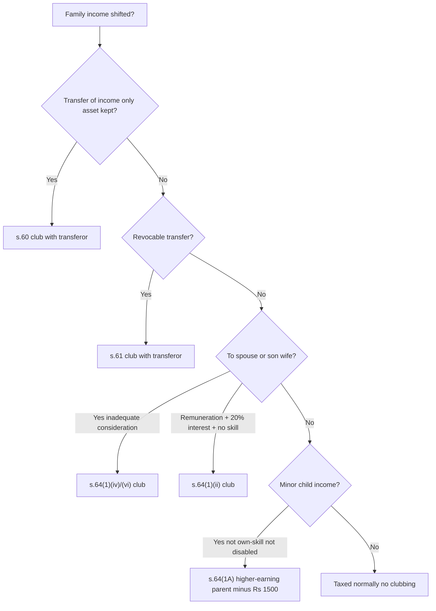
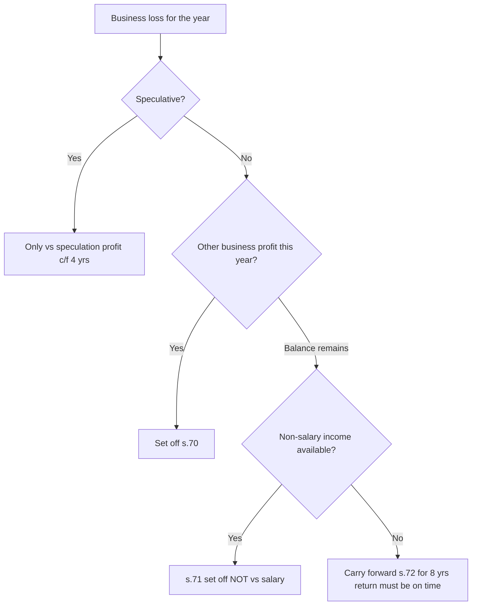
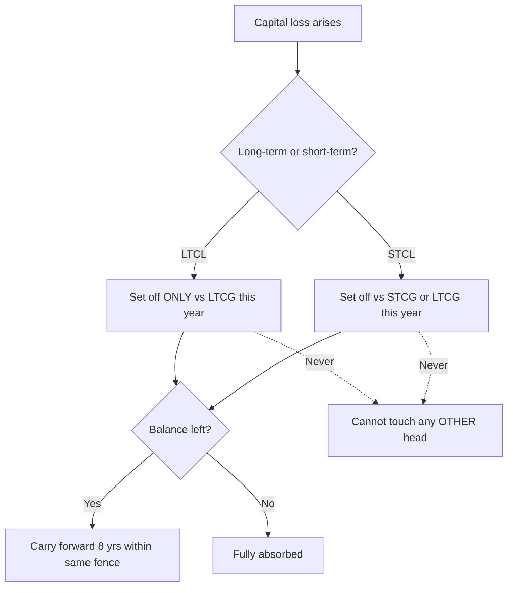
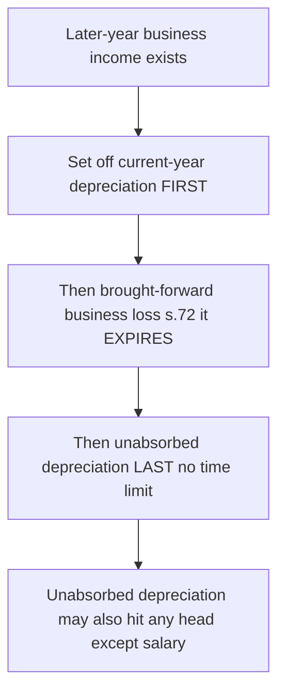

<!-- v2-deep -->

# Chapter 08 — Clubbing of Income & Set-off/Carry-forward of Losses

> *Flag: All rates, monetary limits, exemption thresholds and carry-forward periods below reflect the Income-tax Act, 1961 as commonly examined. Always re-confirm the exact figures and the applicable Assessment Year against the current ICAI Study Material / RTP / Finance Act before the exam.*

---

## Part 1 — The Problem

India taxes income using **slab rates that rise with income** (progressive taxation). That single design choice creates a temptation. If I earn ₹20,00,000, a slice of it is taxed at 30%. But my spouse earns nothing and my minor child earns nothing. What if I could *legally re-label* some of my income as "theirs"? Their slabs are empty; the first few lakhs would be taxed at 0%, 5%, 10% instead of my top 30%. By splitting one large income across several "persons," the family's *total* tax bill shrinks even though the *family's* spending power is unchanged.

Two classic dodges:

1. **Gift-and-earn.** I gift ₹50,00,000 to my non-earning spouse. She invests it in an FD earning ₹3,50,000 interest. On paper that interest is *her* income, taxed in *her* empty slab. But economically nothing left the household — I still control and benefit from the money.
2. **Divert the source.** Instead of gifting cash, I transfer only the *income stream* (e.g., assign the right to receive rent) while keeping ownership of the asset. The asset is still mine; only the fruit is re-labelled.

Notice the deeper structural point: **the taxpayer is the "individual," but the economic unit is the family.** The Act deliberately taxes each person separately (there is no joint "family return" for a nuclear family in India). That gap between the *legal person* taxed and the *economic unit* spending is precisely the crack that income-splitting exploits. Clubbing is the cement Parliament poured into that crack — but only into the specific channels where splitting is artificial, never into genuine intra-family generosity. The whole art of the chapter is learning **where the cement was poured and where it was deliberately left open.**

There is a second, unrelated problem in the same chapter. Income tax is computed **head by head** (Salary, House Property, Business, Capital Gains, Other Sources). A taxpayer can have a *profit* under one head and a *loss* under another — or even a loss within the same head (one house rented at a loss, another at a profit). If losses vanished the moment the year ended, the tax system would be brutally unfair to businesses and investors whose fortunes swing year to year. But if *every* loss could be freely used against *every* income forever, that too would be gamed. So the Act needs rules deciding **which loss can wipe out which income, in what order, and for how many years.**

A subtle third pressure hides inside the second: **timing arbitrage.** Because losses can be carried *forward* but (mostly) not *back*, and because concessional-rate income (LTCG) sits beside full-rate income (salary), a taxpayer who could freely mix losses could engineer *when* and *against what rate* a loss lands. The fences you will learn are as much about protecting the **rate structure** as about protecting the **year-of-taxation**.

This chapter solves both problems. They sit together because both are about **matching income to the right person and the right income**, and both are pure tax-avoidance-versus-fairness balancing acts.

---

## Part 2 — The Core Idea

**Clubbing (Sections 60–64):** *Substance over form.* If you keep the real economic benefit but shift the paper income to a family member or an entity you control, the law ignores the paper and taxes the income **in the hands of the person who really enjoys/controls it** (the "transferor" or the higher-earning relative). Income is "clubbed" — added back — into the real owner's total income.

**Set-off & carry-forward (Sections 70–80):** *A loss is a negative income and deserves relief — but relief is rationed.* You may first cancel losses against income of the **same head** (intra-head, s.70), then against **other heads** (inter-head, s.71), and whatever survives may be **carried to future years** (s.72–74A) to cancel future income — but with **head-specific fences and time limits** that stop the relief from becoming a permanent tax shelter.

Two sentences to hold the whole chapter:

> **Clubbing decides *whose* income it is; set-off decides *how a loss travels* through heads and years.**
>
> **Clubbing works "sideways" (person to person); set-off works "downward and forward" (head to head, year to year).**

A third framing worth internalising: both halves of the chapter are answers to the same question — *"How far may the taxpayer stretch the definition of a taxable unit before the law snaps it back?"* Clubbing snaps back an over-stretched **person**; set-off fences snap back an over-stretched **loss**.

---

## Part 3 — Why It's Built This Way

### Why clubbing exists at all

Progressive slabs mean the *marginal* rupee of a rich person is taxed far higher than the *first* rupee of a poor person. Splitting income is therefore always tempting. Rather than police every transaction, Parliament drew a **bright-line rule**: certain relationships (spouse, minor child, daughter-in-law, HUF) and certain arrangements (transfer of income without the asset, revocable transfers) are treated as **presumptively artificial**. Income arising from them is pulled back to the real earner.

The genius (and the exam trap) is that clubbing is **targeted, not total.** It does *not* say "all family income is one." It surgically catches only the specific channels that split income *without* a genuine, arm's-length transfer of economic ownership. A real gift to an adult son, or a genuine sale for full value, escapes — because there the benefit *actually* moved.

Why these *particular* relatives? Follow the logic of **control retained despite transfer**:
- **Spouse** — you live in one household and pool consumption, so a gift to a spouse leaves the money inside your economic reach. Caught.
- **Minor child** — a minor cannot legally manage assets alone; the parent controls them *de facto*. Caught.
- **Son's wife (daughter-in-law)** — the obvious "one step further" route once spouse and minor were fenced; catching it kills the workaround. Caught.
- **Adult son / adult daughter / parents / siblings** — an adult relative controls their own money; a genuine gift really transfers the benefit. **Not** caught. This is why "gift ₹10 lakh to my adult son" is a legitimate (though other provisions like s.56(2)(x) exemptions for relatives interact) way that clubbing simply does not touch.

The pattern: **clubbing tracks retained control, not blood relationship.** The relatives named are just those where control is presumed to survive the transfer.

### Why losses are allowed to be set off — but fenced

Three competing values:

- **Ability to pay.** Tax should track real net income. A trader who loses ₹5 lakh this year and makes ₹5 lakh next year has zero *net* income across two years; taxing the profit while ignoring the loss overstates ability to pay. → *Allow carry-forward.*
- **Anti-abuse.** If a "hobby" or engineered loss could cancel salary income indefinitely, high earners would manufacture paper losses. → *Fence certain losses (they can only shelter income of the same kind).*
- **Administrability & finality.** The government cannot keep tax years open forever. → *Time-limit carry-forwards (mostly 8 years).*

Every head-specific rule you'll memorise is just one of these three dials turned. Once you see *which* dial explains a rule, you never have to rote-learn it.

**A fourth, quieter dial — rate integrity.** The Act taxes different incomes at different rates: LTCG at concessional rates (s.112/112A), lottery at a flat high 30% (s.115BB), ordinary income at slab. A loss is worth *more* to the taxpayer when it cancels **high-rate** income. So the fences are also drawn to stop a loss generated in a low-rate world from crossing into and eroding high-rate collections, and vice-versa. When you cannot explain a fence by the three main dials, ask "is this protecting a *rate*?" — usually it is (that is the real reason LTCL is locked to LTCG, and lottery income cannot be reduced by anything).

### Why the *order* (intra → inter → carry-forward) is fixed

The sequence is not arbitrary bureaucracy; it maximises the taxpayer's *legitimate* relief while minimising leakage. Same-head set-off is the least controversial (like income, like loss), so it goes first and is nearly unfenced. Cross-head is more aggressive, so it comes second and carries fences. Carry-forward is the most aggressive (it reaches into *future* collections), so it comes last, is the most heavily fenced, and is conditioned on compliance (timely return). **The relief gets progressively harder to obtain the further the loss travels — because the further it travels, the more it looks like avoidance rather than fairness.**

---

## Part 4 — Full Technical Content

### 4A. Clubbing provisions (Sections 60–65)

#### Section 60 — Transfer of income without transfer of asset
**Logic:** You cannot give away the *fruit* while keeping the *tree*. If you assign the right to income but retain ownership of the asset, the income is **still yours**, whether the transfer is revocable or not.
**Rule:** Income is clubbed with the transferor. *Hook: "Tree stays → fruit stays (with you)."*
**Finer point:** s.60 does **not** require any relationship at all — you could assign rent to a friend or a charity and it would still be clubbed with you, because the *asset* never moved. This is the purest "substance over form" section: relationship is irrelevant, only asset-retention matters.

#### Section 61 — Revocable transfer of assets
**Logic:** If you can take the asset *back* whenever you like, you never really parted with it. The transfer is a facade.
**Rule:** Income from a **revocable** transfer of an asset is taxed in the **transferor's** hands.
**Section 62 exception — when it is *not* clubbed:** if the transfer is **irrevocable during the transferee's lifetime** *or* for a **specified period** and you have no power to re-derive benefit during that period and no reassumption of power → not clubbed (until the power to revoke arises). *Hook: "Take-back power = still yours."*
**Meaning of "revocable" (frequently tested):** a transfer is deemed revocable if it contains **any provision to re-transfer** the asset/income (directly or indirectly) to the transferor, or gives the transferor **any right to re-assume power** over the asset/income. Even a *contingent* or *future* right to revoke taints the whole arrangement. Note the timing subtlety in s.62(2): where an irrevocable transfer later becomes revocable, clubbing starts **from the year the power to revoke arises**, not retrospectively.

#### Section 64(1)(ii) — Remuneration to spouse from a concern in which the individual has substantial interest
**Logic:** A no-show or padded "salary" to a spouse is disguised income-splitting.
**Rule:** Salary/commission/fees/any remuneration paid by a concern to the **spouse** is clubbed with the individual **if** the individual has **substantial interest** (≥ 20% of shares/voting power in a company, or ≥ 20% share of profits in any other concern — held individually or with relatives) in that concern.
**Exception (the fairness valve):** if the spouse earns it through **technical or professional qualifications** *and* the income is *solely attributable to* that knowledge/experience, it is **genuine** — not clubbed. Both limbs must be satisfied: (a) a qualification, and (b) the remuneration is *because of* that qualification.
**Both spouses caught?** Where both husband and wife have substantial interest and both draw remuneration, club **both** remunerations in the hands of the spouse whose **total income (excluding this remuneration) is higher.** In a *later* year, once fixed, it continues with that spouse unless the AO, being satisfied and after hearing, decides otherwise. *Hook: "20% interest + no skill = club."*

#### Section 64(1)(iv) — Income from assets transferred to spouse
**Logic:** The gift-and-earn dodge. Transfer an asset to your spouse for **inadequate consideration** and the income it throws off is really yours.
**Rule:** Income from assets transferred (directly/indirectly) to the spouse **otherwise than for adequate consideration** or not in connection with an agreement to live apart → clubbed with the transferor.
**Not clubbed:** (a) adequate consideration paid; (b) transfer under agreement to live apart; (c) relationship did not exist when asset transferred *and* when income arose.
**Adequate vs partial consideration (fine distinction):** if part consideration is paid, only the *proportionate* income attributable to the gifted portion is clubbed. Example: asset worth ₹10,00,000 transferred for ₹4,00,000 → 60% is "gift" → 60% of the income is clubbed.
**Cross-provision link — s.27 & capital gains:** where the transferred asset is a **house property**, s.27(i) deems the transferor to be the "owner" so the *rental income* is taxed under House Property directly in the transferor's hands (not merely clubbed). And on a later *sale* of the clubbed asset, the **capital gain is also clubbed** with the transferor — clubbing is not limited to recurring income; it follows the asset into a capital gain too.

#### Section 64(1)(vi) — Income from assets transferred to son's wife (daughter-in-law)
**Logic:** Same dodge, one relative further out. Closes the "gift to daughter-in-law" loophole. Clubbed with the transferor (father-in-law/mother-in-law) if transferred for inadequate consideration. Same proportionate-consideration and "relationship must exist at transfer date" principles apply.

#### Section 64(1)(vii) & (viii) — Transfers to a person/AOP *for the benefit of* spouse / son's wife
**Logic:** Plugs the indirect route — routing through a trust or third party for the eventual benefit of spouse or daughter-in-law. Clubbed with the transferor to the extent the income is **for the immediate or deferred benefit** of that spouse or son's wife.
**Trap:** the benefit need not be *immediate*. A trust that accumulates income now and pays the spouse later still triggers clubbing — "immediate or deferred benefit" is the statutory phrase.

#### Section 64(1A) — Income of a minor child
**Logic:** A minor cannot earn investment income through their own effort; income on assets gifted to a minor is really the parents' income-splitting.
**Rule:** *All* income of a **minor child** (including step/adopted; and includes a minor married daughter) is clubbed with the **parent whose total income (before this clubbing) is higher.** Once clubbed with one parent, it stays there in later years unless the AO, after hearing, decides otherwise.
**Whose hands when parents' marriage does not subsist:** club with the parent who **maintains** the minor child.
**Exceptions (genuine child effort / helpless child):**
- Income from the minor's **manual work** or activity involving **skill/talent/specialised knowledge and experience** (e.g., a child actor, chess prodigy, singer) → **not clubbed** (it's the child's own effort).
- Income of a **minor with disability** specified under section 80U → **not clubbed** (taxed in the child's own hands).
**Exemption relief — section 10(32):** where a minor's income *is* clubbed, the parent gets an exemption of **₹1,500 per minor child** (or the actual income clubbed, if less) *per child*. This is **per child, not per parent** and applies each time a child's income is clubbed. *Hook: "Minor's money → higher-earning parent, minus ₹1,500."*
**Important layering trap:** income *earned* by the child's own skill is exempt from clubbing — but if that skill-income is then **invested** and earns interest, that *investment income* IS clubbed (because the accretion is passive, not skill-based). So a child-actor's fee is the child's, but interest on the fee deposited in an FD is clubbed with the higher-earning parent.

#### Section 64(2) — Conversion of individual property into HUF property
**Logic:** A member "throws" his self-acquired asset into the family common pool (converts to HUF property, or transfers it to the HUF) for inadequate consideration to split income across the joint family.
**Rule:** Income from such converted property is clubbed with the **individual** (transferor). On a subsequent **partition** of the HUF, the share of the converted property going to the **spouse** of the transferer continues to be clubbed with the individual (via the s.64(1)(iv) route); income enjoyed by the individual's own share obviously remains his. *Hook: "You can't launder your income through the HUF."*

#### Section 65 — Liability of transferee for tax on clubbed income
**Logic:** Since the income is *taxed* in the transferor's hands but the *asset/income* physically sits with the transferee, the Act gives the department a recovery route. **Rule:** the transferee is **jointly and severally liable** (to the extent of the asset held) for the tax attributable to the clubbed income, if the AO so serves notice. Rarely numerically examined but a favourite one-liner in theory/MCQ.

### 4B. The "income on income" rule / accretion (critical, heavily tested)

Clubbing catches income from the **transferred asset**. But what about income earned by **re-investing that clubbed income** (accretion)?

**Rule (settled position):** Income from the **original transferred asset is clubbed.** But income arising from the **accretion** — i.e., income earned by investing the *clubbed income* — is **NOT clubbed**; it is taxed in the transferee's own hands.

*Example intuition:* Gift ₹10,00,000 to spouse → she earns ₹70,000 interest → that ₹70,000 is **clubbed** with you. She reinvests that ₹70,000 and earns ₹5,000 → that ₹5,000 is **her** income, **not clubbed.** *Hook: "First-generation income clubbed; second-generation income free."*

**Why?** The clubbed ₹70,000 has *already suffered tax in your hands*. Once taxed, it is legitimately hers to keep and re-invest; taxing its offspring in your hands again would be double-counting. This is the same logic as "you can gift post-tax money freely." **The dividing line is: has the base sum already been taxed to the transferor?** If yes, its further income is the transferee's.

**Examiner's three-generation trick:** problems often give (i) gifted capital, (ii) income on it, (iii) income on that income. Only (ii) is clubbed. Watch for a *fourth* twist where the transferee gifts *her* accretion onward — trace each rupee to "was this base already taxed to the original transferor?"

### 4C. Set-off of losses

#### Section 70 — Intra-head set-off (loss vs income within the SAME head)
First line of relief: a loss under a head cancels income under the **same** head.
**Fences inside a head:**
- **Speculation-business loss** → only against **speculation-business profit** (s.73). *Why: speculation is high-risk, near-gambling; the law won't let it shelter ordinary business.*
- **Long-term capital loss (LTCL)** → only against **long-term capital gain (LTCG)**. **Short-term capital loss (STCL)** → against **STCG or LTCG.** *Why: LTCG enjoys a concessional rate; letting an LTCL cancel high-rate income would be a rate-arbitrage giveaway. STCL is more flexible because STCG is taxed more normally.*
- Loss from **owning & maintaining race horses** → only against income from the same activity (s.74A).
- **Specified business (s.35AD)** loss → only against another specified-business profit (s.73A).
- Losses **cannot** be set off against **casual income** (lottery, card games, gambling, betting — s.58(4)/115BB); that income is taxed **gross** at a flat rate with no deduction and no set-off.
- A **loss under "Income from Other Sources"** from an activity of **owning race horses** is silo-ed (above); other OS losses are generally set-off-able within the head and inter-head normally.

**Two nuances often missed:**
1. **Exempt-income losses don't exist for set-off.** If income from a source is exempt (e.g., agricultural income, or LTCG exempt under a provision), a *loss* from that source cannot be set off against taxable income — you cannot cherry-pick the loss from an otherwise tax-free basket.
2. **Intra-head allows a loss from one source to set against another source in the same head freely** *unless* a specific fence exists (speculation, race horses, 35AD, LTCL). So business loss of Unit A freely cancels business profit of Unit B; house-property loss of House 1 freely cancels house-property income of House 2.

#### Section 71 — Inter-head set-off (remaining loss vs OTHER heads)
After intra-head, a leftover loss can cross into other heads, **with fences:**
- **Business loss** → **cannot** be set off against **Salary** income. *Why: salary is a clean, easily-verified income; letting engineered business losses erase salary invites abuse.* (Business loss *can* still go against House Property, Capital Gains, or Other Sources.)
- **Capital-gains loss** → **cannot** be set off against **any other head** (only within Capital Gains). *Why: protects the concessional CG regime from leaking into ordinary income.*
- **Speculation / race-horse / specified-business losses** → never leave their silo.
- **House-property loss** → can be set off against other heads but only **up to ₹2,00,000** in a year (s.71(3A)); the excess is carried forward. *Why: caps the interest-on-home-loan shelter that high earners were using to slash salary tax.*
- **You cannot set off any loss against "winnings from lotteries/crossword/races/card games/gambling" (casual income).** This is absolute.

**Directionality trap:** the *fences are on the loss, not the profit.* "Business loss cannot go against salary" — but "salary" is fine as a *target* for a *house-property* loss. Always ask *which head the LOSS is coming from*, then check what it may NOT hit.

#### Sections 72–74A & 71B — Carry-forward (whatever still survives)

| Loss type | Section | Carry-forward against | Years | Return-filing on time mandatory? |
|---|---|---|---|---|
| House-property loss | 71B | Only House-Property income | **8** | No (allowed even if late) |
| Non-speculation business loss | 72 | Only Business income (spec + non-spec) | **8** | **Yes** (s.80) |
| Speculation-business loss | 73 | Only speculation profit | **4** | **Yes** |
| Specified-business (35AD) loss | 73A | Only specified-business profit | **No limit** | **Yes** |
| Loss "owning race horses" | 74A | Only that same activity | **4** | **Yes** |
| Long-term capital loss | 74 | Only LTCG | **8** | **Yes** |
| Short-term capital loss | 74 | STCG or LTCG | **8** | **Yes** |
| Unabsorbed depreciation | 32(2) | Any income (except salary) | **No limit** | No |

**Note on carried-forward business loss (s.72):** once *carried forward*, a non-speculation business loss can be set off in a future year against **any business income — including speculation profit** (a b/f non-speculation loss is not itself fenced to non-speculation profit). But a b/f *speculation* loss can only hit speculation profit. Also, to carry a business loss forward the **business need not continue** in the year of set-off (s.72 does not require continuity of the same business — a settled and frequently-tested relaxation).

**Why the differences (the WHY table):**
- **8 years is the "normal" business/investment cycle** the Act treats as a fair window — hence house property, ordinary business and capital losses all get 8.
- **Speculation & race-horses get only 4** because they are speculative/quasi-gambling — the law tolerates them less and wants a shorter shelter.
- **Specified-business (35AD)** losses have **no time limit** because s.35AD gives a 100% capital deduction to nationally-useful infrastructure businesses (cold chains, warehouses, hospitals) — Parliament *wants* these, so it removes the time pressure.
- **Unabsorbed depreciation has no time limit and can hit almost any head** because depreciation is not a "loss" from risk-taking; it's the recognition that a genuine asset is wearing out. Denying it would tax phantom income. But it still **cannot** touch salary (business relief shouldn't erase salary).
- **Return-filing discipline (s.80):** to *carry forward* most losses you must file the return by the s.139(1) due date. *Why: carry-forward is a privilege; the state grants it only to compliant taxpayers.* The two exceptions — **house-property loss** and **unabsorbed depreciation** — are allowed even with a late return, because they are seen as structural/automatic rather than discretionary claims. (Note: s.80 governs *carry-forward*, not *current-year* set-off — you can always set off *within the same year* even with a belated return; only the *carrying forward* of the unabsorbed balance is denied.)

**Continuity-of-ownership rule for closely-held companies (s.79) — flag for awareness:** in a company (other than a company in which the public are substantially interested), a carried-forward loss cannot be set off unless, on the last day of the year, shares carrying **not less than 51%** of the voting power are **beneficially held by the same persons** who held them on the last day of the year the loss was incurred. *Why: stops "loss-company shopping" — buying a shell company purely to inherit its accumulated losses.* (Exact conditions and the start-up carve-outs — verify current ICAI material / AY.)

**Order of set-off within carry-forward years:** In a later year, **current-year depreciation** is set off first, then **brought-forward business loss (s.72)**, and **unabsorbed depreciation last** (because b/f loss has a time limit and depreciation does not — use the expiring relief first). *Hook: "Use what expires first."* More precisely the statutory priority is: (1) current-year depreciation and current-year capital expenditure on scientific research etc., (2) brought-forward business loss under s.72, (3) unabsorbed depreciation, unabsorbed capital expenditure on scientific research, and family-planning expenditure carried forward.

---

## Part 5 — Worked Examples

### Example 1 (Easy) — Spouse gift and the "income on income" trap
Mr. A gifts ₹8,00,000 to his wife (a homemaker with no other income). She invests it in a bank FD @ 7% and earns **₹56,000** interest in FY. She reinvests that ₹56,000 in another FD earning **₹4,000**.

**Solve:**
1. Asset (cash) transferred to spouse for **no consideration** → s.64(1)(iv) applies. Interest from the *original gifted amount* = **₹56,000 clubbed with Mr. A.**
2. The ₹4,000 is income on the *accretion* (income earned on the clubbed income) → **NOT clubbed** → taxed in **Mrs. A's** hands (and within her basic exemption, so likely nil tax).

**Answer:** ₹56,000 added to Mr. A's "Income from Other Sources"; ₹4,000 stays with Mrs. A.
*Reconciliation: total interest ₹60,000 = ₹56,000 (clubbed) + ₹4,000 (spouse). ✓*

### Example 2 (Medium) — Minor children with the s.10(32) exemption
Mr. B's total income (before clubbing) = ₹12,00,000. Mrs. B's = ₹15,00,000. They have:
- Minor son C: interest on gifted bonds = **₹40,000**; prize from a TV singing contest (his own talent) = **₹25,000**.
- Minor daughter D: interest income = **₹1,000**.

**Solve:**
1. Whose hands? Minor income clubs with the **higher-earning parent** = **Mrs. B** (₹15,00,000 > ₹12,00,000).
2. Son C's **talent income ₹25,000** → child's own skill → **NOT clubbed** → taxed in C's own return.
3. Son C's bond interest ₹40,000 → clubbed. s.10(32) exemption = ₹1,500 → net **₹38,500.**
4. Daughter D's interest ₹1,000 → clubbed. s.10(32) exemption = **min(₹1,500, ₹1,000) = ₹1,000** → net **₹0.**

**Answer — clubbed with Mrs. B:** ₹38,500 + ₹0 = **₹38,500.** C's ₹25,000 talent income is C's own.
*Reconciliation: gross clubbable ₹41,000 (40,000+1,000); exemptions ₹1,500+₹1,000 = ₹2,500; net ₹38,500. ✓*

### Example 2A (Medium, examiner tweak) — Partial consideration + capital gain on the gifted asset
Mr. G transfers to his wife a plot worth **₹20,00,000** in exchange for **₹8,00,000** cash (partial consideration). One year later she sells the plot for **₹26,00,000**. During the holding period the plot earned no income.

**Solve:**
1. Consideration paid = ₹8,00,000 of ₹20,00,000 → **40% adequate, 60% gift.** Only the **60% "gift" portion** is exposed to clubbing under s.64(1)(iv).
2. Capital gain on sale = ₹26,00,000 − ₹20,00,000 = **₹6,00,000** (ignore indexation nuance for illustration; verify indexation applicability for the AY).
3. **60% of the gain = ₹3,60,000 is clubbed with Mr. G**; the remaining **40% = ₹2,40,000 is Mrs. G's own** capital gain.

**Answer:** ₹3,60,000 clubbed with Mr. G (Capital Gains); ₹2,40,000 taxed in Mrs. G's hands.
*Reconciliation: total gain ₹6,00,000 = ₹3,60,000 (clubbed, 60%) + ₹2,40,000 (own, 40%). ✓ Teaching point: clubbing follows the asset into the CAPITAL GAIN, and partial consideration proportions the clubbing.*

### Example 2B (Medium, trap-buster) — Relationship-timing and remuneration skill exception
Mr. H owns 30% of the shares of XYZ Pvt Ltd (substantial interest). Facts:
- His wife, a **qualified company secretary**, is the whole-time CS of XYZ drawing **₹9,00,000** p.a. commensurate with the role.
- His fiancée (they marry *after* the transfer) received a gift of shares worth ₹5,00,000 from him **before marriage**; those shares pay a **₹30,000** dividend in the year (dividend arises *after* marriage).

**Solve:**
1. Wife's ₹9,00,000 salary: substantial interest test met (30% ≥ 20%), BUT she holds a **professional qualification (CS)** and the pay is *attributable to that qualification* → **skill exception, s.64(1)(ii) proviso → NOT clubbed.** Taxed as her salary.
2. Shares gifted **before marriage**: for s.64(1)(iv), the husband-wife relationship must exist **both** when the asset was transferred *and* when the income arose. At transfer they were **not** married → condition fails → **dividend ₹30,000 NOT clubbed**, even though the dividend accrues after marriage.

**Answer:** Nothing is clubbed. ₹9,00,000 is the wife's salary; ₹30,000 dividend is her own income.
*Teaching point: two independent exceptions — the "skill" valve and the "relationship must exist at transfer AND at accrual" timing rule — each defeat clubbing on their own.*

### Example 3 (Exam-hard) — Full set-off & carry-forward ordering
Mr. E's figures for the year (all after intra-head computation within each source):

| Source | Amount |
|---|---|
| Salary | ₹9,00,000 |
| House Property 1 (let-out) | Loss ₹3,50,000 |
| House Property 2 (let-out) | Profit ₹40,000 |
| Business X (non-speculative) | Loss ₹2,00,000 |
| Business Y (non-speculative) | Profit ₹1,20,000 |
| Speculation business | Loss ₹60,000 |
| STCG | ₹80,000 |
| LTCL | (₹1,00,000) |
| Income from Other Sources (interest) | ₹50,000 |

**Step 1 — Intra-head set-off (s.70):**
- House Property: −3,50,000 + 40,000 = **HP net loss ₹3,10,000.**
- Business (non-spec): −2,00,000 + 1,20,000 = **Business net loss ₹80,000.**
- Speculation loss ₹60,000: no speculation profit → **stays; carried forward (4 yrs).**
- Capital Gains: LTCL ₹1,00,000 can offset **only LTCG**. There is none, and it *cannot* touch STCG (LTCL is LT-only). STCG ₹80,000 remains a **gain**; LTCL ₹1,00,000 **carried forward (8 yrs).**

**Step 2 — Inter-head set-off (s.71):**
- **HP loss ₹3,10,000:** capped at **₹2,00,000** against other heads (s.71(3A)). Set ₹2,00,000 against Salary/other income; remaining **₹1,10,000 carried forward (8 yrs, s.71B).**
- **Business loss ₹80,000:** cannot go against Salary. Set it against other non-salary income: STCG ₹80,000. → Business loss ₹80,000 vs STCG ₹80,000 = **both nil.**

**Step 3 — Compute Gross Total Income:**
- Salary 9,00,000 − HP set-off 2,00,000 = **7,00,000**
- Other Sources = **50,000**
- STCG 80,000 − Business loss 80,000 = **0**
- **GTI = 7,00,000 + 50,000 = ₹7,50,000.**

**Step 4 — Losses carried forward:**
- House-property loss **₹1,10,000** (8 yrs)
- Speculation loss **₹60,000** (4 yrs, vs future speculation profit only)
- LTCL **₹1,00,000** (8 yrs, vs future LTCG only)

*Reconciliation: Salary 9,00,000 + HP net −3,10,000 (but only 2,00,000 usable now) + Business net −80,000 + STCG 80,000 + OS 50,000. Usable reductions: −2,00,000 (HP cap) and −80,000 (biz vs STCG). 9,00,000+80,000+50,000 = 10,30,000 income; minus 2,00,000 minus 80,000 = 7,50,000. ✓ Carried: 1,10,000 + 60,000 + 1,00,000.*

**Examiner tweak — what if the HP loss were only ₹1,80,000?** Then it is under the ₹2,00,000 cap, fully set off inter-head, nothing carried forward on HP account. Students who blindly write "carry forward HP loss" lose marks — always test against the cap *before* concluding carry-forward.

**Second tweak — what if STCG were ₹50,000 (not ₹80,000)?** Business loss ₹80,000 would absorb only ₹50,000 of STCG (→ STCG nil), and the **remaining ₹30,000 business loss** — since it cannot touch salary and no other non-salary income remains — would be **carried forward under s.72 (8 yrs), provided the return is filed on time.** This shows the salary fence *forcing* a carry-forward that would otherwise not exist.

### Example 4 (Concept check) — Salary fence
Mr. F: Salary ₹6,00,000; Business loss ₹4,00,000; House-property loss ₹1,50,000.
- Business loss **cannot** touch salary → carried forward ₹4,00,000 (s.72, 8 yrs, if return timely).
- HP loss ₹1,50,000 (under the ₹2,00,000 cap) → set off against salary → Salary taxable = ₹4,50,000.
**GTI = ₹4,50,000; c/f business loss ₹4,00,000.**
*Reconciliation: the business loss is quarantined from salary by design; only HP loss reaches salary. ✓*

### Example 5 (Exam-hard) — Future-year priority: current depreciation vs b/f loss vs unabsorbed depreciation
In AY 2 Mr. J's business shows: **Business profit before depreciation ₹5,00,000; current-year depreciation ₹1,50,000.** Brought forward from AY 1: **business loss (s.72) ₹2,40,000** and **unabsorbed depreciation ₹1,80,000.** He also has **Other Sources income ₹40,000** this year.

**Solve (apply "use what expires first"):**
1. **Current-year depreciation ₹1,50,000** set off first → 5,00,000 − 1,50,000 = **₹3,50,000** business income.
2. **B/f business loss (s.72) ₹2,40,000** next (it expires; depreciation does not) → 3,50,000 − 2,40,000 = **₹1,10,000** business income.
3. **Unabsorbed depreciation ₹1,80,000** last → it can absorb the ₹1,10,000 business income *and* (being like current depreciation) can also set off against **Other Sources ₹40,000** (any head except salary).
   - Absorbs 1,10,000 (business) + 40,000 (OS) = **₹1,50,000 used**; **₹30,000 unabsorbed depreciation carried forward** (no time limit).

**Answer:** GTI = **Nil** (business 1,10,000 and OS 40,000 both wiped by unabsorbed depreciation); carry forward **unabsorbed depreciation ₹30,000**. No business loss remains (fully absorbed).
*Reconciliation: total shelter available after current dep = b/f loss 2,40,000 + unabs dep 1,80,000 = 4,20,000 against income (3,50,000 business + 40,000 OS = 3,90,000). Used 3,90,000; leftover shelter 30,000 = unabsorbed depreciation c/f. ✓ Teaching point: the ORDER matters — using b/f loss before unabsorbed depreciation preserved the expiring relief and left only the never-expiring relief unused.*

### Example 6 (Concept check) — Casual income cannot be sheltered
Mr. K has: **Lottery winnings ₹2,00,000; Business loss ₹1,20,000; STCL ₹50,000.**
- Lottery income is taxed **gross** at the flat s.115BB rate — **no set-off** of business loss or capital loss against it, and no expenditure deduction.
- Business loss ₹1,20,000 → carried forward (no non-salary, non-lottery income to absorb it) → s.72, 8 yrs (if timely).
- STCL ₹50,000 → carried forward (no capital gain) → s.74, 8 yrs.
**Answer:** Tax on ₹2,00,000 lottery at flat rate stands in full; ₹1,20,000 business loss and ₹50,000 STCL both carried forward.
*Trap: candidates instinctively net the business loss against the lottery — the Act forbids it absolutely.*

---

## Part 6 — Computation Format

*Standard order to apply in any set-off problem — memorise the sequence, not the numbers.*

```
Step A  Compute income/loss under EACH head separately (after intra-head s.70)
        - apply intra-head fences (spec vs spec, LTCL vs LTCG only, STCL vs STCG/LTCG,
          race-horse silo, 35AD silo)
        - remember: no set-off vs casual/lottery income; no loss from an exempt source
Step B  Inter-head set-off (s.71), respecting fences:
        - Business loss: NOT vs Salary
        - Capital-gains loss: stays within Capital Gains only
        - House-property loss: max Rs 2,00,000 against other heads
        - Speculation / race-horse / 35AD losses: never leave their silo
        - Nothing may be set off against casual/lottery income
Step C  Arrive at Gross Total Income (GTI)
Step D  Carry forward unabsorbed losses head-wise (note year limits & s.80 filing;
        HP loss and unabsorbed depreciation survive a late return)
Step E  In FUTURE years, set-off order:
        current depreciation -> b/f business loss (s.72) -> unabsorbed depreciation
```

*Clubbing format (do this BEFORE Step A, at the source level):*
```
For each family transaction:
  1. Identify the section (60 / 61 / 64(1)(ii)/(iv)/(vi)/(vii)/(viii) / 64(1A) / 64(2))
  2. Is there an exception? (skill/qualification, adequate consideration,
     child's own effort, 80U disability, relationship not existing at transfer)
  3. If partial consideration: club only the PROPORTIONATE (gift) share
  4. Club FIRST-generation income only; accretion income stays with transferee
  5. Follow the asset into its CAPITAL GAIN too (gain on gifted asset is clubbed)
  6. If minor: club with higher-earning parent; deduct s.10(32) Rs 1,500 per child
```

---

## Part 7 — Connections

- **Chapter on Heads of Income:** Set-off presupposes you've computed each head. House-property loss usually comes from **interest on borrowed capital** (s.24(b)); that's why the ₹2,00,000 inter-head cap mirrors the self-occupied interest limit.
- **Ownership deeming (s.27):** When you gift a house to a spouse/minor, s.27 deems *you* the owner, so the rental income is taxed under House Property in your hands directly — clubbing and deemed-ownership reinforce each other.
- **Capital Gains chapter:** The LTCL-vs-LTCG-only fence exists because LTCG is taxed at concessional rates (e.g., s.112/112A). Rate concessions must be sealed off from ordinary income. Also, a gain on the *sale of a clubbed asset* is itself clubbed (s.64 read with capital-gains computation).
- **Other Sources / s.56(2)(x):** Gifts between "relatives" are exempt from tax as income under s.56(2)(x), but the *income those gifted assets subsequently generate* can still be clubbed under s.64 — two different provisions, don't conflate "gift not taxed" with "income not clubbed."
- **Return filing (s.139/80):** Carry-forward is the tangible reward for filing on time — connects to procedure/compliance chapters. s.79 (change in shareholding) connects to company taxation.
- **Deductions (Chapter VI-A):** Set-off happens *before* GTI; Chapter VI-A deductions (80C, 80D…) come *after* GTI. You cannot create a loss with Chapter VI-A deductions.
- **Rate/AMT chapters:** Unabsorbed depreciation's "any head except salary, no time limit" treatment interacts with how business income is finally taxed. Under the **default new regime (s.115BAC)**, the treatment of house-property loss set-off and certain carry-forwards differs — *verify the current-AY interaction of s.115BAC with s.71/71B in ICAI material.*

---

## Part 8 — Traps & Examiner Tricks


*Figure 8.1 — Clubbing decision tree: identify the channel, then check the exception.*

**Traps:**
1. **Accretion trap.** Clubbing is only on income from the *original* asset. Income on re-invested clubbed income is NOT clubbed. Examiners give three "generations" to catch you.
2. **Relationship-timing trap (spouse).** No clubbing if the relationship of husband-wife did **not exist** both when the asset was transferred *and* when income arose (e.g., transfer before marriage).
3. **Skill exception.** Spouse remuneration or minor's income from genuine **professional qualification / personal skill** is NOT clubbed — even if the 20% interest test is met (for spouse) or bonds exist (for minor).
4. **Cross-parent stickiness.** Once a minor's income is clubbed with one parent, it stays with that parent in later years (unless AO orders otherwise) even if incomes reverse.
5. **s.10(32) is per child and capped at actual income.** If a child's clubbed income is ₹1,000, exemption is ₹1,000 (not ₹1,500).
6. **Business-loss-vs-salary.** The single most common set-off error. Business loss **never** cancels salary. But *unabsorbed depreciation* also can't hit salary — students wrongly think depreciation is unrestricted.
7. **LTCL is long-term-only; STCL is flexible.** Reversing these loses marks.
8. **House-property ₹2,00,000 inter-head cap.** Excess is *carried forward* (not lost) but only against future HP income — and always test the loss *against* the cap before writing "carry forward."
9. **Speculation & race-horse = 4 years, not 8.** And they never leave their silo.
10. **Return-filing condition (s.80).** Late return = lose carry-forward — *except* HP loss and unabsorbed depreciation. But note: *current-year* set-off is still allowed with a late return; only *carrying forward* the balance is denied.
11. **Casual income (lottery) — no set-off, no expenditure.** Losses cannot be set off against it, and it can't be reduced.
12. **Order in future years:** current depreciation → b/f business loss → unabsorbed depreciation ("use the expiring relief first").
13. **Partial-consideration trap.** Inadequate ≠ nil. When part consideration is paid, club only the *proportionate gift portion* of income — not the whole.
14. **Clubbing follows the asset into a capital gain.** Gain on sale of a gifted asset is clubbed too, not just its recurring income.
15. **s.60 needs no relationship.** Transfer of income without the asset is clubbed even to a stranger/charity — relationship is irrelevant here.
16. **Loss from an exempt source is a phantom.** It cannot be set off against taxable income.
17. **B/f business loss can hit speculation profit later** (s.72 loss is not fenced to non-speculation profit), but b/f *speculation* loss cannot hit non-speculation profit. Direction matters.
18. **s.79 (closely-held company).** A change of >49% beneficial shareholding kills the carry-forward of losses (subject to carve-outs) — the "loss-shopping" plug.


*Figure 8.2 — The life-cycle of a loss: same head, then other heads, then future years, then it expires.*


*Figure 8.3 — Business loss routing: the salary fence and the speculation silo in one view.*


*Figure 8.4 — Capital-loss fences: LTCL is long-term-only, STCL is flexible, neither leaves Capital Gains.*


*Figure 8.5 — Future-year priority ladder: spend the expiring relief before the never-expiring relief.*

---

## Part 9 — First-Principles Recap

Start from one fact — **India uses progressive slabs** — and everything in this chapter regenerates:

1. Progressive slabs → incentive to **split income** across low-income relatives → the law must **club** it back with the real earner.
2. Clubbing must be **surgical** (only fake transfers), so each sub-section targets one channel (income-only transfer, revocable transfer, spouse gift, daughter-in-law, minor, HUF conversion), each with a **genuineness exception** (skill/qualification, adequate consideration, child's own effort, disability, relationship-not-existing).
3. Clubbing tracks **retained control**, not blood — which is why adult sons and genuine full-value sales escape.
4. Clubbing catches the **first fruit only**; second-generation income is genuinely the transferee's (it was already taxed once).
5. Clubbing **follows the asset** — into partial-consideration proportions and into the capital gain on eventual sale.
6. Separately, **fairness (ability to pay)** demands losses get relief → **set-off & carry-forward**.
7. **Anti-abuse + rate-integrity** demand relief be fenced → same-head fences (speculation, LTCL), salary immunity from business loss, the ₹2,00,000 house-property cap, capital-loss quarantine, no shelter for lottery income.
8. **Finality** demands time limits → 8 years normal, 4 for speculative/race-horse, none for 35AD and depreciation.
9. **Compliance discipline** → carry-forward needs a timely return (s.80), except structural items (HP loss, depreciation); and **anti-shopping** (s.79) protects the loss from changing hands with a company.

If you can rebuild the rules from these nine pressures, you never memorised anything — you *understood* it.

---

## Part 10 — Quick-Revision Sheet

**CLUBBING (s.60–65)**
- **s.60** transfer of income, asset kept → transferor (no relationship needed). **s.61** revocable transfer → transferor (**s.62** exception: irrevocable for life/period + no benefit → not clubbed; clubbing begins the year power to revoke arises).
- **s.64(1)(ii)** spouse remuneration + **≥20% substantial interest** + **no genuine skill** → club with higher-earning spouse (skill/qualification exception applies).
- **s.64(1)(iv)** asset to spouse for inadequate consideration → transferor (partial consideration → proportionate clubbing; relationship must exist at transfer AND accrual; gain on sale also clubbed). **(vi)** to son's wife. **(vii)/(viii)** for immediate or deferred benefit of spouse/son's wife.
- **s.64(1A)** minor's income → **higher-earning parent** (or maintaining parent if marriage doesn't subsist); exceptions: own **skill/manual work**, **80U disability**. **s.10(32):** exempt **₹1,500 per child** (or actual income if less).
- **s.64(2)** self-property converted to HUF → transferor (spouse's share after partition still clubbed).
- **s.65** transferee jointly liable for tax on clubbed income.
- **Accretion rule:** first-generation income clubbed; income on clubbed income NOT clubbed.

**SET-OFF ORDER**
- s.70 intra-head → s.71 inter-head → carry forward.

**KEY FENCES**
- Speculation loss ↔ speculation profit only (c/f **4 yrs**).
- LTCL ↔ LTCG only; STCL ↔ STCG/LTCG (c/f **8 yrs**).
- Business loss ≠ Salary; c/f **8 yrs** (s.72; business need not continue; b/f loss can later hit speculation profit).
- Capital-gains loss: within Capital Gains only.
- House-property loss: inter-head cap **₹2,00,000** (s.71(3A)); c/f **8 yrs** (s.71B).
- Specified business (35AD): silo, **no time limit**.
- Race horses (74A): silo, **4 yrs**.
- Unabsorbed depreciation (32(2)): any head **except salary**, **no time limit**.
- Casual income (lottery): **no set-off**, no expense, taxed gross.
- Loss from exempt source: cannot be set off at all.

**FILING (s.80):** timely return needed to carry forward — **except** HP loss & unabsorbed depreciation. (Current-year set-off still allowed even with a late return.)

**COMPANY ANTI-SHOPPING (s.79):** closely-held company loses c/f if >49% beneficial shareholding changes (subject to carve-outs — verify AY).

**FUTURE-YEAR ORDER:** current depreciation → b/f business loss → unabsorbed depreciation.

---
*End of Chapter 08. Re-verify all monetary limits, carry-forward years and the applicable Assessment Year against current ICAI Study Material before the exam.*
