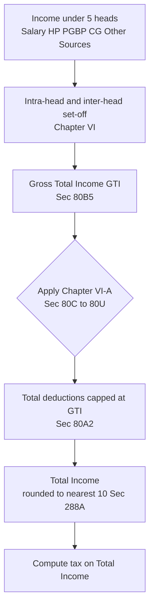
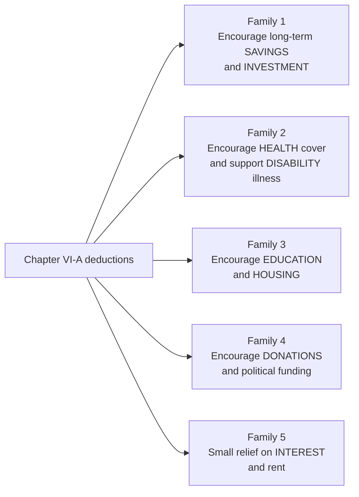
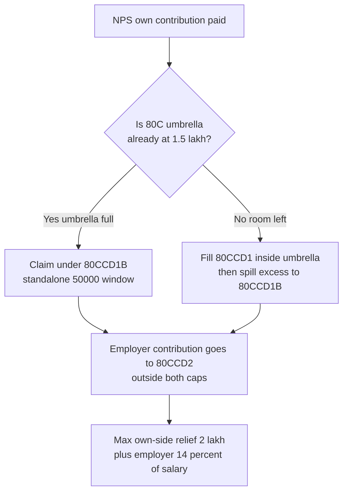
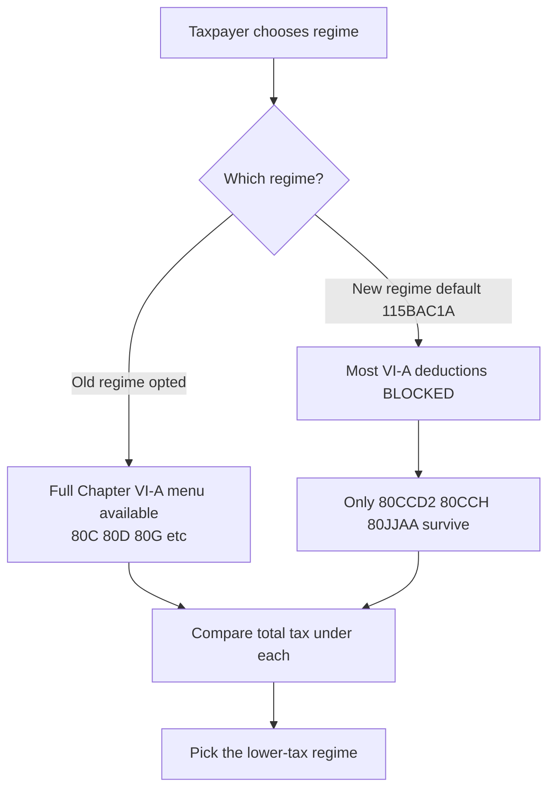

<!-- v2-deep -->

# Chapter 09 — Deductions under Chapter VI-A

> **Rates & limits caveat:** Tax law changes with every Finance Act, and Chapter VI-A limits are prime targets for tinkering. This chapter teaches the *logic and architecture* of the deductions so you can reason about any of them. Numbers are illustrative anchors for **AY 2025-26 (PY 2024-25)** unless stated. **Always verify the exact limits, thresholds, sunset dates and the applicable Assessment Year in current ICAI material for your attempt.**

---

## 1. The Problem

Meet two people. Both earn a salary of ₹12,00,000 a year. On paper they are identical taxpayers.

But look closer. Anita pays ₹1,50,000 into a Public Provident Fund and a life-insurance premium for her children, ₹25,000 for a family health-insurance policy, ₹40,000 as interest on an education loan for her sister's engineering degree, and ₹20,000 as a donation to the Prime Minister's National Relief Fund. Every one of those payments is money she *cannot spend on herself* — it is locked into retirement savings, risk cover, human capital, and public good.

Rahul spends his identical ₹12,00,000 exactly as he pleases — dining out, holidays, gadgets. Nothing is set aside, nothing insured, nothing donated.

Now ask the hard question: **should Anita and Rahul pay the same income tax?**

If your instinct says "Anita is doing socially useful things with her money and the tax system ought to notice", you have already discovered the entire logic of Chapter VI-A. The heads of income (Salary, House Property, PGBP, Capital Gains, Other Sources) measure *how much you earned*. They are blind to *what you did with it*. But the government has goals beyond merely collecting revenue — it wants citizens to save for old age (so they don't become a state burden), to insure against medical catastrophe (so hospital bills don't bankrupt families), to invest in education, to give to charity, to fund pensions. The tax code cannot *order* you to do these things, but it can make them *cheaper* by refunding some tax when you do.

Chapter VI-A is that refund machine. It is the point in the tax computation where the state stops asking "what did you earn?" and starts asking **"what did you do with it that we approve of?"** — and rewards the approved behaviour with a deduction.

The problem it must solve carefully, though, is threefold:

1. **Where in the computation do these deductions sit?** They cannot reduce any single head (Anita's PPF has nothing to do with her salary *per se*). They must operate on the aggregate.
2. **How do you stop the incentive from becoming a loophole?** If any donation or "investment" reduced tax, people would route money to fake charities, over-insure to relatives, or claim deductions exceeding their actual income and manufacture refunds.
3. **How do you make the incentive fair and finite?** An unlimited deduction favours the rich (who have surplus to park). Caps and eligibility rules keep the incentive targeted.

**A fourth problem the chapter quietly solves: *timing and eligibility of the claimant*.** Notice that Anita's ₹40,000 education-loan interest is for her *sister* — will the law allow that? And her ₹1,50,000 PPF may include a contribution made on 5 April, *after* the previous year closed on 31 March — is that this year's deduction or next year's? Chapter VI-A is not just about *how much* you spent on approved ends; it polices *who* the beneficiary may be, *when* the payment counts, *how* it was paid (cash vs cheque), and *whether* you even claimed it in a timely return. A deduction is a bundle of five tests — amount, relationship, timing, mode, and claim — and the examiner can attack any one of them.

---

## 2. The Core Idea

> **Chapter VI-A deductions are subtractions from Gross Total Income, granted as a reward for spending or investing money in ways the government wants to encourage. They convert social/economic policy goals into tax savings — but each is capped, conditioned, and can never, in total, exceed the Gross Total Income.**

Three ideas are fused here:

- **They act on the *aggregate*, not on a head.** You first compute income under all five heads, set off losses, and arrive at **Gross Total Income (GTI)** [Sec 80B(5)]. *Then* Chapter VI-A deductions are applied to GTI to yield **Total Income** — the figure on which tax is actually charged.

- **They are behavioural incentives, not cost recoveries.** Unlike a business expense (money spent to *earn* income), a Chapter VI-A deduction is for money spent *after* earning, on policy-favoured ends. The state is effectively co-paying your PPF contribution or insurance premium by giving back tax.

- **They are bounded by the "cannot exceed GTI" rule** [Sec 80A(2)]. A deduction can wipe your Total Income down to zero, but never below. You cannot use deductions to create a loss or a refund out of thin air. Incentives reward what you *did with income you had* — no income, no reward.

The mental model: **GTI is the pool. Chapter VI-A deductions are approved withdrawals from that pool. Total Income is what remains and gets taxed.**

$$\text{Gross Total Income} - \text{Chapter VI-A deductions} = \text{Total Income}$$

**The two shapes every deduction takes.** Beneath the fifteen-odd sections there are really only two structural templates, and spotting which one you are in halves the work:

- **Type A — "Deduction in respect of certain *payments*"** (Sections 80C to 80GGC). The reward is for money you *paid out* — premiums, contributions, donations, interest, rent. These come first in the Act and are what most students mean by "Chapter VI-A".
- **Type B — "Deduction in respect of certain *incomes*"** (Sections 80-IA to 80U, e.g. 80JJAA, 80QQB, 80RRB, 80TTA/TTB, and the profit-linked 80-IA/IB family). The reward is for having *earned* a favoured kind of income — royalty, savings interest, profits of a priority undertaking, or simply the taxpayer's own disability status. A vital consequence flows from this: a Type B deduction **can never exceed the amount of that particular income** already included in GTI. You cannot deduct ₹10,000 of savings interest under 80TTA if only ₹6,000 of savings interest sits in your GTI.

This Type A / Type B split is not decoration — it is the reason 80TTA is capped by your actual interest, why 80QQB needs royalty *in* your income, and why the disability sections (80U) sit oddly among the "income" deductions (they reward a *status*, administered like an income deduction).

---

## 3. Why It's Built This Way

**Why a separate "Chapter" (Sections 80A to 80U) instead of tucking these into each head?** Because these deductions have nothing to do with *earning* — they relate to the *application* of income. A life-insurance premium doesn't help you earn salary; it serves a social goal. Bolting it onto the Salary head would be conceptually wrong and administratively messy (which head would a self-employed person's PPF reduce?). By pooling everything into GTI first and then applying VI-A, the Act keeps head-computation "pure" (measuring earning) and quarantines all the policy-driven incentives in one predictable place at the end.

**Why "Gross Total Income" as the base?** Because the incentives are about *your overall taxpaying capacity and your overall good behaviour*, both of which are aggregate concepts. Losses under one head reducing income under another (inter-head set-off, Chapter VI) must happen *first* — you incentivise based on real net earning power, not a single inflated head.

**Why the "cannot exceed GTI" ceiling [Sec 80A(2)]?** Because an incentive is a *discount on tax you would otherwise pay*. If your GTI is ₹1,00,000 and you donated ₹3,00,000, the state will refund tax on the ₹1,00,000 you had — it will not pay you for the extra ₹2,00,000. Otherwise deductions would generate negative income (a loss), which could be carried forward or set off — turning a *reward* into a *subsidy that survives having no income*. The ceiling keeps VI-A a tax-*reducer*, never a loss-*creator*.

**Why caps on each deduction (₹1.5 lakh for 80C, etc.)?** Two reasons. First, **cost control**: an uncapped incentive is an open-ended drain on the exchequer. Second, **fairness**: without caps, the wealthy (with large surpluses to invest) would harvest disproportionate benefit. A flat cap gives everyone the *same maximum* nudge.

**Why conditions (approved funds, mode of payment, relationship rules)?** Because an unpoliced incentive is a laundering channel. Requiring donations to *approved* institutions, health-insurance premiums paid by *non-cash* modes, and deductions only for *specified relatives* stops the incentive being abused to shift money to oneself or fake entities while claiming a deduction.

**Why did the new tax regime [Sec 115BAC] strip most of them away?** This is the deepest "why". The old regime's philosophy was *"we'll keep rates high but reward good behaviour with deductions"* — a paternalistic, nudge-heavy design. The new regime's philosophy is the opposite: *"we'll cut rates for everyone and stop micromanaging your choices"*. So the new regime offers lower slab rates but **disallows almost all Chapter VI-A deductions**. Understanding this trade-off — deductions vs. lower rates — is the single most examinable planning decision in modern Indian income tax.

**Why does the Act insist on the *timely-filed return* for the profit-linked deductions [Sec 80AC]?** Because Type B profit-linked deductions (the 80-IA/IB/IE and 80JJAA family) are large and audit-sensitive; the state wants them claimed on the record, on time, so they can be scrutinised. Miss the return-filing due date under Sec 139(1) and the deduction is **lost entirely** — a harsh, deliberately deterrent rule that does *not* apply to ordinary 80C-type payment deductions. This is the Act saying: the bigger the reward, the stricter the discipline.

**Why is *double deduction* forbidden [Sec 80A(3), (4)]?** The same rupee cannot be rewarded twice. If a partnership firm claims a deduction on an amount, the partners cannot claim it again on their share; if a deduction is allowed under any 80-IA-family "Part C" section, no other Part-C deduction can be claimed on the same profits. An incentive is priced once — allowing a second bite would double the exchequer's cost for a single unit of good behaviour.

---

## 4. Full Technical Content

### 4.1 The architecture: GTI → deductions → Total Income



*Figure 1 — Chapter VI-A sits between Gross Total Income and Total Income; it can reduce Total Income to zero but never below.*

**Four structural rules that govern every VI-A deduction** [Sec 80A]:

| Rule | Section | Plain meaning |
|---|---|---|
| Deductions apply to GTI only | 80A(1) | Never deducted from a single head |
| Total VI-A deductions ≤ GTI | 80A(2) | Cannot create a loss/refund |
| No double deduction | 80A(3) partner clause | Same amount not deductible twice (e.g. firm and partner) |
| Must be claimed in the return | 80A(5) / 80AC | Certain deductions (80-IA family, etc.) lost if return filed late |

A crucial sub-point: certain incomes are **excluded from the GTI base for the *percentage-of-income* deductions**. For example, deductions computed as a % of GTI (like some 80G limits) are worked on GTI *reduced by* long-term capital gains, short-term gains under 111A, and amounts already deducted under other VI-A sections. This prevents stacking a percentage deduction on income that is separately taxed at special rates.

**A deeper structural rule — Sec 80A(4) and the "no deduction against special-rate income" principle.** Chapter VI-A deductions of the *payment* type (80C, 80D, 80G, etc.) are conceptually a reward carved out of your *ordinary-rate* income. Incomes taxed at *special flat rates* — LTCG u/s 112/112A, STCG u/s 111A, winnings u/s 115BB, and other 115-series incomes — are ring-fenced: **no Chapter VI-A deduction may be set against them.** The mechanism is that when the law needs a "% of income" base (like 80G's 10% or 80GG's 25%), it uses **Adjusted GTI / Adjusted Total Income**, which surgically removes those special-rate incomes. The intuition: the state already gave those incomes a *concession* (a low flat rate), so it will not *also* let you shelter them with deductions — one favour per rupee.

**The five-test checklist for any payment deduction.** Before granting a single rupee, mentally run:

1. **Amount** — how much was actually paid/incurred?
2. **Ceiling** — the section's own cap, then any shared umbrella (80CCE), then the 80A(2) GTI ceiling.
3. **Eligible person** — is the beneficiary a *permitted* relative (spouse, children, parents — the exact list differs section to section)?
4. **Mode** — cash allowed, or non-cash mandatory (80D premiums, 80G > ₹2,000, all political contributions)?
5. **Claim** — old regime (menu open) or new regime (mostly closed); and, for profit-linked deductions, return filed by the Sec 139(1) due date [80AC]?

### 4.2 Grouping by POLICY PURPOSE

Do not memorise 15 sections as a flat list. They cluster into **five policy families**. Learn the *purpose*, and the section's shape follows.



*Figure 2 — The five policy families of Chapter VI-A; the government's goal dictates each section's cap and conditions.*

---

#### FAMILY 1 — Long-term savings & investment (the "80C family")

**Policy goal:** push households to lock money into retirement/long-horizon instruments so they are self-reliant in old age and so the government has a captive pool of long-term capital.

**Section 80C — the workhorse.** Deduction for *specified* payments/investments, up to **₹1,50,000**. Eligible items (illustrative, not exhaustive): life-insurance premium (on self, spouse, children), Employees'/Public Provident Fund (EPF/PPF), 5-year tax-saving fixed deposit, National Savings Certificate (NSC), ELSS mutual funds, principal repayment of a housing loan, tuition fees (for max 2 children, in India), Sukanya Samriddhi, contribution to approved superannuation. *Why a mix of insurance, savings and even loan-principal?* All lock money into long-horizon, socially-approved uses. *Why the "tuition fees but not development/donation fees" carve-out?* The incentive targets genuine education cost, not capitation.

**The finer distinctions inside 80C that examiners love:**

- **Life-insurance premium ceiling relative to sum assured.** Only premium up to a *percentage of the sum assured* qualifies — **10%** for policies issued on/after 1 April 2012 (**15%** where the insured is a person with disability u/s 80U or disease u/s 80DDB). Pay ₹1,00,000 premium on a ₹5,00,000 policy issued in 2015 and only ₹50,000 (10% of ₹5 lakh) is eligible. *Why?* The section rewards *insurance*, not an investment dressed as insurance; a low sum-assured, high-premium policy is really a savings plan, so the excess is denied. *Verify the current percentages for your AY.*
- **Who counts as "children" for LIC / tuition?** For **LIC premium**, "children" includes *married daughters and independent children* — the relationship, not dependency, is what matters. For **tuition fees**, it is restricted to **any two children** and must be *tuition* (not donation, development fees, or private coaching), paid to a school/college/university *in India*.
- **Housing-loan principal** qualifies under 80C, but the **interest** goes to Sec 24(b) under House Property — never confuse the two halves of an EMI. And if the house is **sold within 5 years** of the end of the year of possession, the principal deductions already claimed under 80C are **reversed** — they get *added back* to income in the year of sale. *Why?* The reward was for a *long-term* first-home commitment; a quick flip breaks the bargain.
- **5-year FD, NSC, Sukanya** — the *investment* is rewarded on payment, but note NSC *accrued interest* (except the final year's) is *reinvested* and separately qualifies for 80C — a favourite two-mark point.

**Section 80CCC — pension fund premium.** Contribution to an annuity/pension plan of an insurer, deductible within the *same* ₹1.5 lakh umbrella. Note the mirror: when the annuity is later *received* (pension, or surrender), it is **taxable** under Other Sources — the deduction defers tax, it doesn't forgive it.

**Section 80CCD(1) — employee/self-employed contribution to NPS (National Pension System).** Deductible up to **10% of salary** (salaried) or **20% of GTI** (self-employed), again inside the ₹1.5 lakh umbrella. Here "salary" = **basic + dearness allowance** (to the extent DA enters retirement benefits) — *not* gross salary. Choosing the wrong salary base is a classic slip.

**The umbrella cap — Section 80CCE.** This is the crucial "why they group": **80C + 80CCC + 80CCD(1) together cannot exceed ₹1,50,000.** You cannot get ₹1.5 lakh under *each*; they share one ceiling. *Why?* Because they all serve the identical goal (long-term savings), so the government caps the *goal*, not each instrument.

**Section 80CCD(1B) — the extra NPS ₹50,000.** An *additional* deduction of **₹50,000** for NPS contributions, **over and above** the ₹1.5 lakh 80CCE cap. *Why an extra window just for NPS?* A deliberate nudge to steer savings specifically into the pension system. So a taxpayer can get ₹1.5 lakh (80C family) + ₹50,000 (80CCD(1B)) = **₹2,00,000**. *Subtle rule:* the **same contribution cannot be claimed under both 80CCD(1) and 80CCD(1B)** — you allocate a given rupee to one window only. The optimiser's move is to fill 80CCD(1B) first (it is standalone) whenever 80C is already saturated by other instruments.

**Section 80CCD(2) — employer's NPS contribution.** Employer's contribution to the employee's NPS. The ceiling is **regime-dependent, not universal:** under the **old regime** it is **10% of salary** for a private-sector employee and **14% of salary** only for a **Central/State Government** employee; the flat **14% for all employees (including private)** applies **only under the new regime u/s 115BAC(1A)** (raised from 10% w.e.f. AY 2025-26). So do not apply 14% to a private employee in an old-regime computation. *Verify current % and category split in ICAI material.* *Why separate from the caps?* This is the employer's money, not the employee's disposable income, so it sits **outside** both the ₹1.5 lakh and the ₹50,000 windows. **Critically, 80CCD(2) is one of the very few deductions still allowed in the NEW regime** — remember this. Note also that the employer contribution is *first added to salary* as a perquisite/inclusion and *then* deducted under 80CCD(2) — it is not a free lunch that skips income; it is included and then removed, netting to nil at 14%.

*Memory hook for Family 1:* **"1.5 shared, 0.5 solo, employer free."** ₹1.5 lakh is the shared umbrella (80C/CCC/CCD1); ₹0.5 lakh is the solo NPS top-up (CCD1B); the employer's contribution (CCD2) rides free outside both.



*Figure 3 — Optimal routing of NPS money across the three CCD windows so no rupee of relief is wasted.*

---

#### FAMILY 2 — Health, disability & serious illness

**Policy goal:** get people insured and support households bearing the cost of disability or grave illness, so a medical shock doesn't push a family into poverty (and onto state support).

**Section 80D — medical insurance premium.**

| Who is covered | Base limit | Extra if senior citizen (60+) |
|---|---|---|
| Self, spouse, dependent children | ₹25,000 | ₹50,000 (if self/spouse is senior) |
| Parents (dependent or not) | ₹25,000 | ₹50,000 (if parents are senior) |
| Preventive health check-up | Within above, max ₹5,000 | — |

Maximum possible: **₹1,00,000** (self+family senior ₹50k + parents senior ₹50k). *Why higher limits for seniors?* Their premiums are far higher and their risk greater — the incentive scales with need. *Why must premium be non-cash* (except preventive check-up, which may be cash)? Anti-abuse: forces an auditable payment trail. A senior citizen with no insurance can instead claim actual **medical expenditure up to ₹50,000**.

**Finer 80D distinctions the exam probes:**

- **The "parents" bucket has no dependency test.** Unlike 80DD, the parents need *not* be dependent on you. But they must be *your* parents — premium for *parents-in-law* does **not** qualify under 80D.
- **Medical expenditure (in lieu of premium) is only for seniors with no insurance.** A **senior citizen (60+)** who has *no* medical insurance can claim actual medical *expenditure* up to the ₹50,000 ceiling. A non-senior cannot use this route at all — for them it is premium-only.
- **The ₹5,000 preventive check-up is a *sub-limit inside* the main limit, and is the only cash-allowed item.** It never sits *on top*; it is carved *within* the ₹25,000/₹50,000. If premium already fills the bucket, the check-up adds nothing.
- **Single-premium multi-year policies are apportioned.** Pay a lump sum covering, say, 3 years, and the deduction each year is the *proportionate* amount (total ÷ number of years), each year still capped by the annual ceiling. *Why?* To match the reward to the period of cover and stop front-loading a huge one-year deduction.

**Section 80DD — maintenance of a dependant with disability.** *Fixed* deduction: **₹75,000** (disability 40–79%) or **₹1,25,000** (severe, ≥80%), regardless of actual spend. *Why a flat amount, not actual?* Verifying disability-care spend is impractical; a flat sum tied to a medical certificate is administrable. Requires a certificate (Form 10-IA) from a prescribed medical authority. Covers expenditure on medical treatment/nursing/training/rehabilitation of, **or** premium paid to an LIC/insurer scheme for the maintenance of, a *dependant* with disability. "Dependant" = spouse, children, parents, brothers/sisters *wholly or mainly dependent* on the taxpayer.

**Section 80DDB — treatment of specified diseases** (cancer, chronic renal failure, etc., prescribed in Rule 11DD). Deduction of **actual expenditure or ₹40,000** (₹1,00,000 for a senior citizen patient), *whichever is less*, reduced by any insurance/employer reimbursement. *Why reduce by reimbursement?* You incentivise the *out-of-pocket* burden, not a cost someone else bore. The expense must be for *self or a dependant*, and a prescription from a specialist is required.

**Section 80U — self with disability.** The mirror of 80DD but for the *taxpayer's own* disability: flat **₹75,000** / **₹1,25,000** (severe). *Why flat and why separate from 80DD?* 80DD is for a *dependant*; 80U is for *yourself*. You cannot claim both for the same person.

**The three disability/illness sections contrasted — a table the examiner can flip:**

| Feature | 80DD | 80DDB | 80U |
|---|---|---|---|
| For whose condition | Dependant's *disability* | Self or dependant's *specified disease* | Taxpayer's *own disability* |
| Amount | Flat ₹75,000 / ₹1,25,000 | Actual or ₹40,000 (₹1,00,000 senior), less reimbursement | Flat ₹75,000 / ₹1,25,000 |
| Based on actual spend? | No (flat) | Yes (lower of actual / cap) | No (flat) |
| Reduced by reimbursement? | No | **Yes** | No |
| Certificate | Form 10-IA (disability) | Specialist prescription | Form 10-IA (disability) |

*Memory hook for Family 2:* **80D = the doctor's cover (insurance), 80DD = dependant's disability, 80DDB = the big disease, 80U = you yourself.** The "D-count" rises with the severity/specificity.

---

#### FAMILY 3 — Education & housing

**Policy goal:** subsidise investment in *human capital* (education) and *first homes* (housing) — both long-term national assets.

**Section 80E — interest on education loan.** Deduction for the **full interest** (no cap) paid on a loan for *higher education* of self, spouse, children, or a student for whom the taxpayer is legal guardian. Available for **8 years** from the year repayment starts (or until interest is fully paid, if earlier). *Why no cap but a time limit?* Education is a priority so interest is fully rewarded, but the 8-year window stops the benefit running indefinitely. *Why interest only, not principal?* Principal is capital repayment (you're getting an asset — education); interest is the real *cost* of financing it.

**Finer 80E points:** the loan must be from a *bank/notified financial institution or approved charitable institution* (not a friend or employer); "higher education" means *any* course after Senior Secondary (Class 12), including vocational — the field is not restricted. The 8-year clock starts in the year the taxpayer *begins repaying interest*, and runs for that year plus 7, or until the interest is fully paid — whichever is earlier.

**Section 80EE / 80EEA — interest on housing loan (first-time buyers).** Additional interest deduction (over the ₹2 lakh under "Income from House Property" Sec 24(b)) for affordable first homes, subject to loan-sanction-date windows and value caps. *These are largely sunset/closed for new loans — flag and verify the current-year availability and sanction-date eligibility.* Conceptually: 80EE (₹50,000, sanction FY 2016-17) and 80EEA (up to ₹1,50,000, sanction window FY 2019-20 to 31 Mar 2022, stamp value ≤ ₹45 lakh, no other house owned) *stack on top of* the Sec 24(b) ₹2 lakh — the same interest rupee cannot be double-counted; you exhaust Sec 24(b) first, then claim the balance under the EE/EEA section.

**Section 80EEB — interest on electric-vehicle loan.** Deduction up to **₹1,50,000** on interest for a loan to buy an electric vehicle (loan sanctioned in the specified window, 1 Apr 2019 – 31 Mar 2023). *Why?* A green-policy nudge — the incentive follows whatever behaviour the government of the day wants to promote. *Verify sanction-date window; closed for loans sanctioned after the window.*

---

#### FAMILY 4 — Donations & political/social funding

**Policy goal:** channel private money into charitable, scientific and democratic-process funding by sharing the cost with the donor.

**Section 80G — donations to approved funds and institutions.** The structure has **two dimensions**: (a) the *percentage* allowed — **100% or 50%** of the donation — and (b) whether a *qualifying-limit* applies.

| Category | Deduction | Qualifying limit? |
|---|---|---|
| PM National Relief Fund, National Defence Fund, PM CARES, etc. | 100% | No limit |
| PM's Drought Relief Fund, certain notified funds | 50% | No limit |
| Govt/local authority for family planning, Indian Olympic Assn | 100% | Yes — capped at 10% of adjusted GTI |
| Other approved charitable institutions, any govt for charity | 50% | Yes — capped at 10% of adjusted GTI |

*Why four buckets?* The government ranks causes by priority. Its own flagship funds get 100% and no cap (maximum nudge). Ordinary charities get 50% *and* a 10%-of-adjusted-GTI ceiling (moderate nudge, cost-controlled). **Anti-abuse rule:** donations **exceeding ₹2,000 must be non-cash** to qualify. **Adjusted GTI** = GTI minus LTCG, minus STCG u/s 111A, minus other VI-A deductions and certain incomes — so the 10% ceiling is computed on "ordinary" income only.

**The exact 4-step 80G algorithm — the single most error-prone computation in the chapter:**

1. **Bucket every donation** into one of the four categories (100%/no-limit, 50%/no-limit, 100%/with-limit, 50%/with-limit).
2. **The "no-limit" donations are fully processed first** — apply 100% or 50% and set them aside; they never compete for the 10% cap.
3. **For the "with-limit" donations**, first *pool* them and cap the *pool* at **10% of Adjusted GTI**. Only the amount within this cap is eligible.
4. **Within that capped pool, apply the priority: the 100%-with-limit donations get first claim on the cap, then the 50%-with-limit.** Then apply the 100%/50% percentage to whatever qualifies.

**In-kind donations do NOT qualify** — 80G requires a donation of *money*. Donating clothes, food, or a laptop earns nothing. *Why?* Valuation of goods invites abuse; cash/cheque is verifiable.

**Section 80GGA — donations for scientific research / rural development** (for taxpayers with *no* business income — because a business claiming research spend has other routes under Sec 35). Full deduction; cash donations over ₹2,000 disallowed.

**Section 80GGB / 80GGC — contributions to political parties / electoral trusts.** 80GGB is for **Indian companies**; 80GGC is for **any other person** (individuals etc.). **Full amount** deductible, but **must be non-cash** (no cash contributions at all qualify — the ₹2,000 tolerance of 80G does *not* apply here; *any* cash kills it). *Why 100% and why non-cash only?* Clean political funding is a policy goal, so the reward is generous — but the entire point is transparency, hence zero cash tolerance.

*Memory hook for Family 4:* **"G = give to charity, GGA = give to research, GGB = give (companies) to politics, GGC = give (citizens) to politics."**

---

#### FAMILY 5 — Small reliefs: interest income & rent

**Policy goal:** small, targeted reliefs for ordinary savers, seniors, and people paying rent without an HRA.

**Section 80TTA — interest on *savings* account.** Deduction up to **₹10,000** on interest from savings accounts (bank/co-op/post office) — **not** fixed deposits. For individuals/HUF *below* 60. *Why only savings interest and only ₹10k?* A token relief so small savers aren't taxed on trivial bank interest; FDs excluded because they're a deliberate investment choice, not idle balances. Being a *Type B* (income) deduction, it cannot exceed the *actual savings interest* included in GTI — ₹6,000 of interest yields ₹6,000, not ₹10,000.

**Section 80TTB — interest for senior citizens.** For residents **aged 60+**, a larger **₹50,000** deduction covering interest on savings *and* fixed deposits *and* deposits with post office/co-op. *Why bigger and broader?* Seniors often live off interest income; the relief recognises that. **A senior claims 80TTB, not 80TTA** — the two are mutually exclusive. (An NRI senior does *not* get 80TTB — it requires *resident* senior status.)

**Section 80GG — rent paid (no HRA).** For those who pay rent but receive **no House Rent Allowance** (and neither the taxpayer, spouse, minor child nor HUF owns a house at the place of work/residence). Deduction = *least of*: (i) ₹5,000 per month (₹60,000/yr); (ii) 25% of adjusted total income; (iii) rent paid minus 10% of adjusted total income. *Why the three-way least-of?* It caps the benefit absolutely (i), proportionally to income (ii), and to the genuine excess rent burden (iii) simultaneously. Here **Adjusted Total Income** = GTI − LTCG − STCG(111A) − all other VI-A deductions (except 80GG itself) − specified incomes. A self-employed person with no HRA (there's no employer) is the archetypal 80GG claimant.

*Other examinable specials (know they exist):* **80JJAA** — deduction (**30% of additional employee cost for 3 assessment years**) for hiring *new* employees, to incentivise formal job creation (**allowed even in new regime**; conditions on emoluments ≤ ₹25,000/month, minimum days of employment, payment through banking channel); **80QQB / 80RRB** — royalty income of authors / patent-holders, capped at **₹3,00,000** each (Type B — needs the royalty *in* income; for authors, lump-sum vs non-lump-sum royalty has a 15%-of-value restriction); **80CCH** — Agnipath Scheme contribution (**allowed in new regime**).

### 4.3 Interaction with the New Regime [Sec 115BAC]

This is the highest-yield concept in the chapter. Under the **default new regime** (Sec 115BAC(1A)), **almost every Chapter VI-A deduction is disallowed** in exchange for lower slab rates. The handful that *survive*:

| Deduction | Allowed in NEW regime? | Why |
|---|---|---|
| 80C, 80D, 80E, 80G, 80TTA/TTB, 80GG, 80DD, 80U, 80DDB… | **No** | New regime's bargain: lower rates, no nudges |
| **80CCD(2)** — employer NPS contribution | **Yes** | Employer money, promotes pensions |
| **80CCH** — Agnipath contribution | **Yes** | Recent policy priority |
| **80JJAA** — new-employee cost | **Yes** | Job-creation incentive kept |



*Figure 4 — Regime choice decides whether the Chapter VI-A menu is open; heavy deduction-users often still prefer the old regime.*

**The examinable subtlety about *how* to opt.** The new regime is now the **default**; to use the **old regime** the taxpayer must actively *opt out* by the return-filing due date. A person with **business/professional income** faces a stricter rule — they can switch *once* and, having reverted to the new regime, generally cannot go back to old again (Form 10-IEA mechanics — *verify current-year procedure*). A salaried person with no business income can choose *afresh every year*. This asymmetry (free annual choice vs one-way door) is a favourite conceptual question.

**A trap dressed as arithmetic:** the standard deduction from *salary* (Sec 16(ia)) is **not** a Chapter VI-A deduction and *is* allowed in the new regime. Students wrongly "add it back" when computing new-regime income. Keep the **head-level** deductions (standard deduction, Sec 24(b) is disallowed on self-occupied in new regime though) separate from the **Chapter VI-A** deductions — the new regime treats them by different rules.

---

## 5. Worked Examples

### Example 1 (Easy) — The 80C umbrella and its ceiling

Mr. Verma (age 45, **old regime**) has GTI of ₹9,00,000. He pays: LIC premium ₹60,000, PPF ₹80,000, ELSS ₹40,000, and NPS (own) ₹30,000. Compute the deduction under the 80C family.

| Item | Section | Amount |
|---|---|---|
| LIC premium | 80C | 60,000 |
| PPF | 80C | 80,000 |
| ELSS | 80C | 40,000 |
| NPS own contribution | 80CCD(1) | 30,000 |
| **Raw total** | | **2,10,000** |

**80CCE umbrella cap** = ₹1,50,000. So 80C + 80CCC + 80CCD(1) is restricted to **₹1,50,000**.

*But wait* — can the NPS ₹30,000 spill into the separate 80CCD(1B) window? Yes. The optimal claim: put ₹1,50,000 under the 80CCE umbrella (from LIC+PPF+ELSS = ₹1,80,000, of which only ₹1,50,000 counts) and route the ₹30,000 NPS into **80CCD(1B)**.

**Total deduction = ₹1,50,000 + ₹30,000 = ₹1,80,000.**

*Lesson:* NPS money is best claimed under 80CCD(1B) first (the exclusive ₹50k window) when 80C is already saturated. Verma's other ₹30,000 of 80C investments (the ₹1,80,000 raw minus ₹1,50,000) is simply wasted for tax purposes.

---

### Example 2 (Moderate) — 80D across a family with seniors

Mrs. Rao (age 52, **old regime**) pays health-insurance premiums: ₹28,000 for herself, spouse and children (all non-senior); ₹52,000 for her mother (age 78); and ₹4,500 cash for a preventive health check-up for herself. Compute 80D.

**Self/family bucket** (non-senior): limit ₹25,000. Premium ₹28,000 → restricted to ₹25,000. Preventive check-up ₹4,500 is *within* this bucket but the bucket is already full at ₹25,000, and the ₹5,000 preventive sub-limit is *inside* the ₹25,000 — so no extra. **Self bucket = ₹25,000.**

*Note the cash issue:* premiums must be non-cash; the ₹4,500 preventive check-up is the *only* item allowed in cash — but here it doesn't add anything because the bucket is capped.

**Parent bucket** (mother is senior, 78): limit ₹50,000. Premium ₹52,000 → restricted to **₹50,000**.

**Total 80D = ₹25,000 + ₹50,000 = ₹75,000.**

*Trap avoided:* the two buckets (self-family vs. parents) are **separate ceilings**, not one combined ₹25,000. And the senior-parent limit is ₹50,000, not ₹25,000.

**Examiner tweak — "what if her mother had no insurance but Mrs. Rao paid ₹47,000 of her mother's hospital bills in cash?"** Then the *medical expenditure* route opens (mother is a senior with no policy): actual expenditure up to ₹50,000 is deductible **and, for the medical-expenditure route, cash is permitted** (unlike premium). So the parent bucket would be ₹47,000. But if the mother *had* a policy, the expenditure route is closed and only premium counts.

---

### Example 3 (Exam-hard) — Full multi-deduction computation with the GTI ceiling and 80G limit

Mr. Iyer (age 40, resident, **old regime**) for PY 2024-25 has:

- Income from Salary: ₹8,00,000
- Income from House Property: ₹1,20,000
- Long-term capital gain (on listed shares, u/s 112A): ₹2,00,000
- Savings-bank interest: ₹14,000

He makes the following payments:
- PPF: ₹1,20,000; LIC premium: ₹50,000
- NPS (own): ₹40,000
- Health insurance (self & family, non-senior, by cheque): ₹22,000
- Interest on education loan (own MBA): ₹90,000
- Donation to PM National Relief Fund: ₹30,000 (by cheque)
- Donation to a local approved charitable trust: ₹50,000 (by cheque)

**Compute Total Income.**

**Step 1 — Gross Total Income.**

| Head | Amount (₹) |
|---|---|
| Salary | 8,00,000 |
| House Property | 1,20,000 |
| Capital Gains (LTCG 112A) | 2,00,000 |
| Other Sources (SB interest) | 14,000 |
| **Gross Total Income** | **11,34,000** |

**Step 2 — Family 1 (savings/investment).**
- 80C: PPF ₹1,20,000 + LIC ₹50,000 = ₹1,70,000 → capped at umbrella **₹1,50,000** (80CCE).
- 80CCD(1B): NPS ₹40,000 → fully allowed in the exclusive window = **₹40,000**.
- Subtotal Family 1 = **₹1,90,000**.

**Step 3 — Family 2 (health).**
- 80D: ₹22,000, within ₹25,000 non-senior limit, paid by cheque = **₹22,000**.

**Step 4 — Family 3 (education).**
- 80E: interest on education loan ₹90,000, **no cap**, fully allowed = **₹90,000**.

**Step 5 — Family 5 (interest).**
- 80TTA: SB interest ₹14,000 → capped at **₹10,000** (below 60, savings only).

**Step 6 — Family 4 (donations, Sec 80G).** This needs the two-dimension analysis.
- PM National Relief Fund: **100%, no qualifying limit** → ₹30,000 fully allowed = **₹30,000**.
- Local charitable trust: **50%, subject to qualifying limit** (10% of *adjusted GTI*).

*Compute Adjusted GTI* = GTI − LTCG (112A) − deductions already claimed under other VI-A sections − (STCG 111A, if any).
Adjusted GTI = 11,34,000 − 2,00,000 (LTCG) − [1,90,000 + 22,000 + 90,000 + 10,000] (other VI-A) 
= 11,34,000 − 2,00,000 − 3,12,000 = **₹6,22,000**.

Qualifying limit = 10% × 6,22,000 = **₹62,200**. The trust donation ₹50,000 is within this. Eligible for 50% deduction: 50% × ₹50,000 = **₹25,000**.

- Total 80G = ₹30,000 + ₹25,000 = **₹55,000**.

**Step 7 — Aggregate all deductions.**

| Section | Deduction (₹) |
|---|---|
| 80C (umbrella) | 1,50,000 |
| 80CCD(1B) | 40,000 |
| 80D | 22,000 |
| 80E | 90,000 |
| 80TTA | 10,000 |
| 80G | 55,000 |
| **Total Chapter VI-A** | **3,67,000** |

**Step 8 — Apply Sec 80A(2) ceiling.** Total deductions ₹3,67,000 must not exceed GTI ₹11,34,000. It does not — so the full ₹3,67,000 is allowed.

**Step 9 — Total Income** = GTI − deductions = 11,34,000 − 3,67,000 = **₹7,67,000**.

*Reconciliation check:* Salary 8,00,000 + HP 1,20,000 + LTCG 2,00,000 + SB 14,000 = 11,34,000 ✓. Less deductions 3,67,000 = 7,67,000 ✓. Note the ₹2,00,000 LTCG remains inside Total Income but will be taxed at its special 112A rate (10%/12.5% above the ₹1/1.25 lakh exemption — *verify current rate/threshold*); crucially the **80C-family and 80G deductions cannot be set against that LTCG** conceptually, which is exactly why LTCG was stripped out when computing Adjusted GTI for the 80G limit.

---

### Example 4 (Regime comparison) — the strategic "why"

Take Mr. Iyer above. Under the **old regime** his Total Income is ₹7,67,000 (after ₹3,67,000 deductions). Under the **new regime**, of his ₹3,67,000 deductions, **only 80CCD(2) would survive — and he had none** (his NPS was own-contribution 80CCD(1B), not employer). So under the new regime his Total Income ≈ ₹11,34,000 (subject to the LTCG being taxed separately and salary standard deduction, which the new regime *does* allow).

He must compute tax **both ways** and pick the lower. A taxpayer with ₹3.67 lakh of deductions usually finds the **old regime** wins *unless* the new regime's much lower slab rates outweigh the lost deductions. This is the decision Chapter VI-A ultimately forces — and it is why the chapter matters even in a "lower-rate" world.

---

### Example 5 (Exam-hard) — The 80G priority ordering with mixed buckets and the qualifying-limit squeeze

Mr. Khanna (**old regime**) has Adjusted GTI (already computed) of ₹8,00,000. His donations, all by cheque:

- National Defence Fund: ₹40,000 (100%, no limit)
- Jawaharlal Nehru Memorial Fund: ₹20,000 (50%, no limit)
- Donation to Government for *family planning* promotion: ₹70,000 (100%, **with** qualifying limit)
- Donation to an approved local charitable trust: ₹60,000 (50%, **with** qualifying limit)

**Compute the 80G deduction.**

**Step 1 — No-limit donations (processed fully, outside the cap):**
- National Defence Fund: 100% × 40,000 = **₹40,000**
- Nehru Memorial Fund: 50% × 20,000 = **₹10,000**
- No-limit subtotal = **₹50,000**

**Step 2 — Qualifying limit for the with-limit pool** = 10% × Adjusted GTI = 10% × 8,00,000 = **₹80,000**.

**Step 3 — The with-limit donations total ₹70,000 (family planning) + ₹60,000 (trust) = ₹1,30,000, but only ₹80,000 fits inside the cap.** Apply the **priority rule**: the *100%-with-limit* (family planning) donation gets first claim on the ₹80,000 cap.

- Family planning ₹70,000 is fully within the ₹80,000 cap → eligible ₹70,000; deduction = 100% × 70,000 = **₹70,000**.
- Remaining cap = 80,000 − 70,000 = **₹10,000** available for the 50%-with-limit trust.
- Trust donated ₹60,000 but only ₹10,000 of *donation* can enter the cap → deduction = 50% × 10,000 = **₹5,000**.

**Step 4 — Total 80G** = 50,000 (no-limit) + 70,000 (100% w/limit) + 5,000 (50% w/limit) = **₹1,25,000**.

*Reconciliation / self-check:* The with-limit *donations that qualified* were 70,000 + 10,000 = 80,000, exactly the 10%-of-AGTI cap ✓. The deduction on them (70,000 + 5,000 = 75,000) is *less* than the qualifying donations because the trust's slice suffers the 50% haircut. *Lesson:* fill the cap with the **100%** donations first — they convert cap-space into deduction at twice the rate of the 50% donations. Reversing the order (letting the trust eat the cap first) would have cost Khanna real deduction — a deliberate examiner trap.

---

### Example 6 (Moderate–hard) — The 80A(2) ceiling actually biting, plus a senior citizen

Mr. Sethi (age 67, **resident senior**, **old regime**) has a modest year: GTI of ₹2,20,000 comprising pension ₹1,50,000 (Salary), FD interest ₹55,000 and savings interest ₹15,000 (Other Sources). He pays: LIC premium ₹90,000, PPF ₹70,000, health-insurance premium ₹55,000 (own, senior, by cheque), and donates ₹40,000 to PM CARES (cheque). Compute Total Income.

**Step 1 — GTI** = ₹2,20,000 (given).

**Step 2 — 80C** = LIC 90,000 + PPF 70,000 = 1,60,000 → capped at **₹1,50,000**.

**Step 3 — 80D** (senior, own): premium ₹55,000, but senior limit is **₹50,000** → **₹50,000**.

**Step 4 — 80TTB** (senior; covers savings *and* FD interest): total interest 55,000 + 15,000 = 70,000, capped at **₹50,000**. (He does *not* use 80TTA — senior uses 80TTB, and it swallows FD interest too.)

**Step 5 — 80G**: PM CARES is 100%, no limit → **₹40,000**.

**Step 6 — Raw aggregate of deductions** = 1,50,000 + 50,000 + 50,000 + 40,000 = **₹2,90,000**.

**Step 7 — Apply Sec 80A(2).** Deductions ₹2,90,000 **exceed** GTI ₹2,20,000. The ceiling bites: total Chapter VI-A deduction is **restricted to ₹2,20,000**.

**Step 8 — Total Income = ₹2,20,000 − ₹2,20,000 = NIL.**

*Reconciliation / self-check:* Total Income cannot be negative; ₹70,000 of otherwise-eligible deduction (2,90,000 − 2,20,000) is simply **lost** — it is *not* carried forward, *not* refunded (Sec 80A(2)). *Lesson:* a taxpayer with low GTI who over-invests for tax reasons wastes the excess. This is exactly why the "cannot exceed GTI" rule is a *reward*, not a *subsidy*. Note also 87A rebate would separately make tax nil here, but the *deduction* mechanics stop at zero regardless.

---

## 6. Computation Format

The clean exam layout for the Chapter VI-A stage:

```
GROSS TOTAL INCOME (after all set-offs)                       XXX

Less: Deductions under Chapter VI-A
  Family 1 — Savings/Investment
    80C (LIC + PPF + ELSS + ... )      capped 1,50,000        XXX
    80CCD(1B) NPS (own)                capped   50,000        XXX
    80CCD(2)  NPS (employer)           % of salary            XXX
  Family 2 — Health/Disability
    80D  (self-family + parents buckets)                      XXX
    80DD / 80DDB / 80U                                        XXX
  Family 3 — Education/Housing
    80E  (education-loan interest, no cap)                    XXX
    80EEB (EV loan interest)                                  XXX
  Family 4 — Donations
    80G  (100%/50%, apply qualifying limit on Adjusted GTI)   XXX
    80GGC (political, non-cash only)                          XXX
  Family 5 — Interest/Rent
    80TTA (₹10,000) OR 80TTB (₹50,000 senior)                 XXX
    80GG  (rent, least-of-three)                              XXX
                                                       ---------
  Total deductions  (restricted to GTI, Sec 80A(2))           XXX
                                                       ---------
TOTAL INCOME  (round off to nearest ₹10, Sec 288A)            XXX
```

**Golden sequencing rules:**
1. Apply each section's *own* cap first.
2. Apply the *shared* 80CCE cap to the 80C family.
3. Compute **Adjusted GTI** before the 80G qualifying-limit deductions (subtract LTCG, STCG-111A, and all *other* VI-A deductions).
4. Within 80G, process no-limit donations fully, then fit with-limit donations into the 10%-of-AGTI cap **100%-first, 50%-second**.
5. Finally test the aggregate against GTI (Sec 80A(2)).

**A note on the ordering paradox.** Steps 3 and 5 look circular: Adjusted GTI (for 80G) needs "all *other* VI-A deductions", but 80G is itself a VI-A deduction. The Act resolves it cleanly — Adjusted GTI subtracts *only the other* Chapter VI-A deductions (everything **except** 80G's own with-limit part). So compute 80C, 80D, 80E, 80TTA/TTB etc. **first**, use them to size Adjusted GTI, and only *then* do the 80G qualifying-limit arithmetic. Do 80G last among the payment deductions and the circularity vanishes.

---

## 7. Connections

- **← From the head chapters (03–08):** Chapter VI-A cannot start until the five heads are computed and set-offs (Chapter VI) are done. GTI is the hand-off point.
- **← Set-off & carry-forward:** because VI-A can't create a loss (80A(2)), it never feeds the carry-forward machinery — deductions simply vanish if unused.
- **→ To computation of tax liability:** Total Income (post-VI-A) is what slab rates, rebate u/s 87A, surcharge and cess attach to. A rebate u/s 87A is applied *after* VI-A on the resulting tax.
- **→ Special-rate incomes:** LTCG (112A/112), STCG (111A), lottery (115BB) are taxed at flat rates and most VI-A deductions **cannot** be set against them — hence they're pulled out of "Adjusted GTI".
- **↔ New regime [115BAC]:** the master switch that turns the whole VI-A menu on (old) or mostly off (new).
- **↔ Salary (Ch 03):** employer NPS (80CCD(2)) and standard deduction interplay; 80GG only if *no* HRA received; the "salary" base for 80CCD is basic + DA, echoing the HRA and gratuity computations.
- **↔ House Property (Ch 04):** 80EE/80EEA housing-loan interest is *additional* to Sec 24(b)'s ₹2 lakh — you exhaust 24(b) first, then the EE/EEA balance; the 80C principal and the 24(b) interest are the two halves of one home-loan EMI.
- **↔ PGBP (Ch 05):** 80JJAA (additional-employee cost) and the profit-linked 80-IA/IB family sit atop *business* profits and demand a timely return [80AC]; 80GGA is barred to those *with* business income (they use Sec 35 instead).
- **↔ Capital Gains (Ch 06):** the 80G qualifying-limit and 80GG both strip out capital gains via Adjusted GTI/ATI — Chapter VI-A and the special-rate CG provisions are deliberately kept from overlapping.

---

## 8. Traps & Examiner Tricks

1. **The ₹1.5 lakh "each" illusion.** 80C, 80CCC and 80CCD(1) do **not** each get ₹1.5 lakh — they *share* one ₹1.5 lakh ceiling (80CCE). Only 80CCD(1B)'s ₹50k is genuinely extra.
2. **Forgetting to route NPS to 80CCD(1B).** When 80C is already ≥₹1.5 lakh, always shift NPS own-contribution into the exclusive ₹50k window — examiners plant "excess" 80C to test this.
3. **80D single-bucket error.** Self-family and parents are **two separate limits**. And senior limit is ₹50,000, not ₹25,000. Preventive check-up (max ₹5,000) is *within*, not on top. Parents-**in-law** do not qualify.
4. **80TTA vs 80TTB confusion.** A senior gets 80TTB (₹50,000, incl. FDs), **not** 80TTA. Never both. FD interest never qualifies for 80TTA. And a Type B deduction cannot exceed the actual interest in GTI.
5. **80G without Adjusted GTI.** Applying the 10% qualifying limit on *plain* GTI instead of *Adjusted* GTI (which strips out LTCG/STCG-111A and other VI-A deductions) — a classic miscalculation.
6. **80G priority-order error.** When the 10% cap can't hold all with-limit donations, the **100%-with-limit** donations must claim the cap *first* — feeding the 50% ones first silently costs deduction (see Example 5).
7. **Cash-donation trap.** Donation > ₹2,000 in **cash** gets **zero** 80G. Political contributions (80GGB/GGC) in **any** cash get zero. In-kind (goods) donations get zero under 80G regardless of mode.
8. **80E "principal" trap.** 80E covers **interest only**, and has **no monetary cap** but an **8-year** limit. Don't cap it at some number; don't include principal. Loan must be from a bank/notified institution, not a relative or employer.
9. **Deductions against special-rate income.** Trying to reduce LTCG/STCG-111A/lottery income using 80C etc. — not allowed.
10. **The 80A(2) ceiling.** If deductions exceed GTI, they're cut to GTI — no negative Total Income, no loss carried forward (see Example 6).
11. **New-regime blindness.** Claiming 80C/80D in a new-regime computation. Only 80CCD(2), 80CCH, 80JJAA survive. But do **not** wrongly disallow the salary *standard deduction* (Sec 16, not VI-A) — it stays.
12. **Rounding.** Total Income rounded to nearest ₹10 (Sec 288A) — after VI-A, not before.
13. **Disabled-person double-claim.** Cannot claim both 80DD (dependant) and 80U (self) for the *same* individual.
14. **LIC premium vs sum-assured cap.** Premium above 10% (or 15%) of the sum assured is *not* eligible under 80C — a plant when the policy details are given.
15. **80C reversal on early house sale.** Selling the house within 5 years reverses (adds back) the 80C principal already claimed — easy to miss when the question mentions a sale.
16. **80CCD(2) double-count.** Remember it is *added* to salary as an inclusion and then *deducted* — a well-set question tests whether you added it to income before deducting.
17. **80DDB reimbursement.** Reduce the claim by any insurance/employer reimbursement; only the net out-of-pocket qualifies.
18. **80AC timely-return trap.** Profit-linked deductions (80-IA/IB/IE, 80JJAA) are **wholly lost** if the return is filed after the Sec 139(1) due date — ordinary 80C-type deductions are not subject to this.

---

## 9. First-Principles Recap

Strip everything away and rebuild:

1. The heads measure **what you earned**; they are silent on **what you did with it**. GTI is the total earning.
2. The state has goals beyond revenue — retirement savings, health cover, education, charity, clean politics, green vehicles. It cannot command these, so it **discounts your tax** when you fund them. That discount is Chapter VI-A.
3. Because the reward relates to *application*, not *earning*, it operates on the **aggregate (GTI)**, after set-offs, not on any one head.
4. Every deduction is (a) tied to a **policy family**, (b) **capped** (cost + fairness), (c) **conditioned** (approved instrument, non-cash mode, specified relative, timely claim) to stop abuse.
5. The two structural templates — **payment** deductions (80C…80GGC) and **income** deductions (80-IA…80U) — explain almost every quirk: an income deduction can never exceed the income it rewards; a payment deduction is tested on the five gates of amount, ceiling, person, mode, and claim.
6. The aggregate can zero out Total Income but **never go below** (Sec 80A(2)) — an incentive, not a subsidy that outlives income.
7. Special-rate incomes (LTCG, STCG-111A, lottery) are already given a *rate* concession, so they are ring-fenced from deductions — hence "Adjusted GTI" surgically removes them before any %-of-income cap.
8. The new regime made the deepest statement of all: **"lower everyone's rate and stop nudging"** — so it disallows nearly all of VI-A. The whole chapter therefore reduces to one planning question: *do my deductions save more than the rate cut?*

If you can derive each section's cap and conditions from its **policy purpose** and its **payment-vs-income template**, you never memorise — you reconstruct.

---

## 10. Quick-Revision Sheet

**The equation:** `GTI − Chapter VI-A deductions = Total Income` | deductions ≤ GTI [80A(2)] | round to ₹10 [288A].

**Two templates:** *Payment* deductions (80C–80GGC, reward money paid out) vs *Income* deductions (80-IA–80U, reward favoured income; can't exceed that income).

**Family 1 — Savings/Investment**
- **80C** ₹1,50,000: LIC (premium ≤ 10%/15% of sum assured), PPF, EPF, ELSS, NSC, 5-yr FD, tuition (2 kids, India), housing-loan *principal* (reversed if house sold < 5 yrs), Sukanya.
- **80CCC** (pension premium) + **80CCD(1)** (own NPS: 10% salary [basic+DA] / 20% GTI) — all inside **80CCE = ₹1,50,000 umbrella**.
- **80CCD(1B)** NPS **extra ₹50,000** (over umbrella; same rupee not in both 1 and 1B).
- **80CCD(2)** employer NPS — up to **10% salary (private, old regime)** / **14% (Govt, or any employee under new regime)** — outside caps, added to salary then deducted, **survives new regime**. *Verify % for your AY.*

**Family 2 — Health/Disability**
- **80D**: ₹25,000 self-family (₹50,000 if senior) + ₹25,000 parents (₹50,000 if senior); max ₹1,00,000; preventive ≤ ₹5,000 within (cash OK); premium non-cash; senior-no-policy → medical expenditure route (cash OK); parents-in-law excluded.
- **80DD** dependant disability: flat ₹75,000 / ₹1,25,000 (severe ≥80%); Form 10-IA.
- **80DDB** specified disease: actual or ₹40,000 (₹1,00,000 senior), less reimbursement.
- **80U** self disability: flat ₹75,000 / ₹1,25,000. (Not both 80DD and 80U for same person.)

**Family 3 — Education/Housing**
- **80E** education-loan **interest**: no cap, 8 years, bank/notified institution, higher education of self/spouse/children/ward.
- **80EE/80EEA** housing-loan interest (first home), stacks on Sec 24(b) ₹2 lakh — *verify sunset/sanction window*.
- **80EEB** EV-loan interest: ₹1,50,000 — *verify sanction window (closed after 31 Mar 2023)*.

**Family 4 — Donations**
- **80G**: 100%/50% × donation; some *no limit*, others capped at **10% of Adjusted GTI**; cash > ₹2,000 disallowed; in-kind disallowed; with-limit pool: 100%-first then 50%.
- **80GGA** research/rural (no business income). **80GGB** (companies) / **80GGC** (others) political — **non-cash only, 100%, zero cash tolerance**.

**Family 5 — Interest/Rent**
- **80TTA** savings interest ₹10,000 (< 60, no FD). **80TTB** *resident* seniors ₹50,000 (incl. FD). Mutually exclusive.
- **80GG** rent (no HRA, no owned house at workplace): least of ₹5,000/mo, 25% of ATI, rent − 10% ATI.

**Others:** 80JJAA (30% additional-employee cost × 3 yrs, survives new regime, needs 80AC timely return), 80QQB/80RRB (author/patent royalty, cap ₹3,00,000 each, Type B), 80CCH (Agnipath, survives new regime).

**New regime [115BAC(1A)]:** almost all VI-A **blocked**; survivors = **80CCD(2), 80CCH, 80JJAA**. Standard deduction (Sec 16) still allowed — it is *not* VI-A. New regime is default; opt-out mechanics differ for business (one-way) vs salaried (annual). Always compute tax both ways.

**Adjusted GTI (for 80G qualifying limit)** = GTI − LTCG − STCG(111A) − other VI-A deductions − specified incomes. **Adjusted Total Income (for 80GG)** is the analogous base.

> **Verify for your AY:** all rupee limits, 80CCD(2) employer %, LIC sum-assured %, 80D senior thresholds, 80EE/EEA/EEB sunset windows, 80G fund lists & %, 80QQB/RRB caps, 112A LTCG rate/exemption, and the new-regime slab rates. Finance Acts move these frequently.
