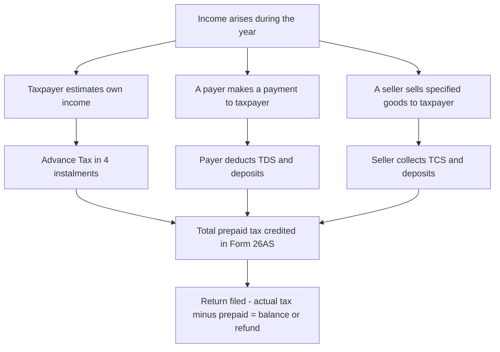
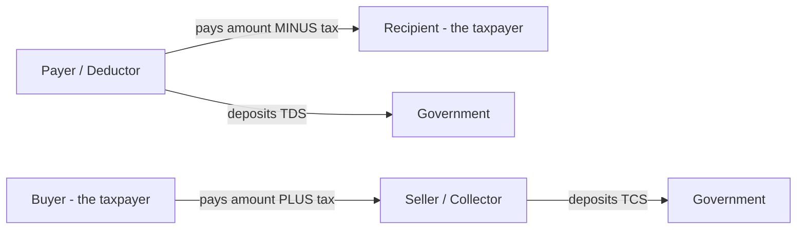
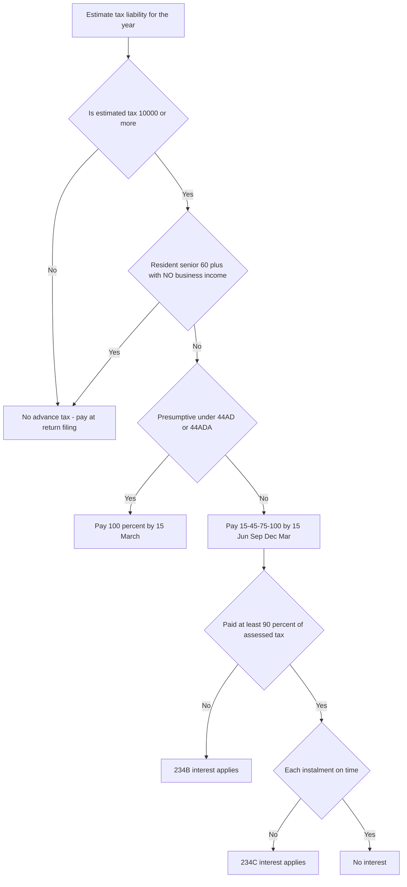
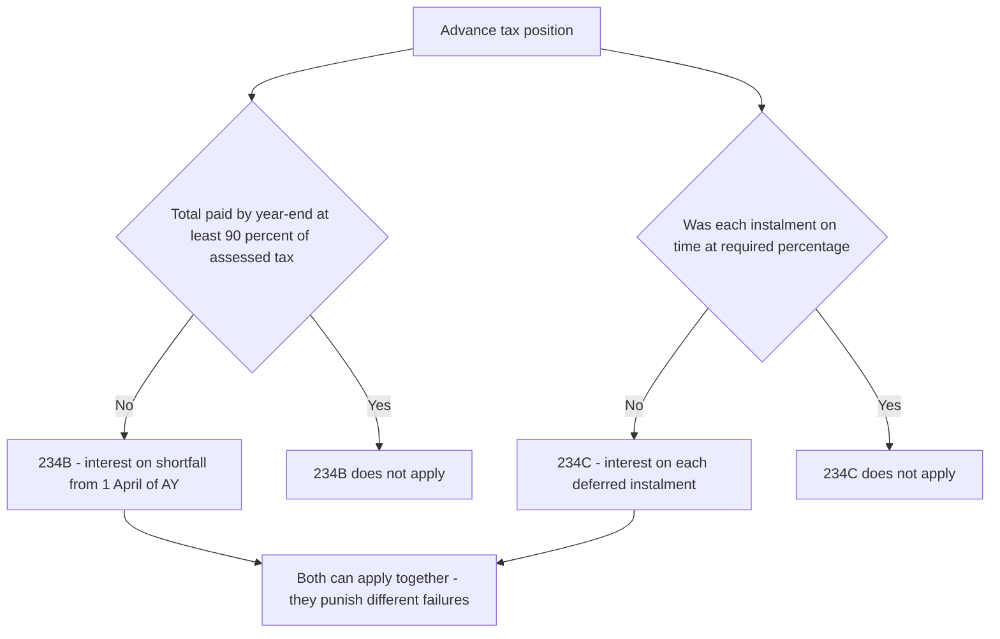

<!-- v2-deep -->

# Chapter 10 — Advance Tax, TDS & TCS

> *Flag: All rates, thresholds and instalment percentages below reflect the law as commonly examined for AY 2025-26. Always re-verify the exact figures and the applicable Assessment Year against current ICAI study material before the exam, as thresholds (especially in the 194-series) are amended almost every Finance Act. Where a figure is especially volatile it is marked "verify current ICAI material / AY".*

---

## 1. The Problem

Imagine you are the Government of India. Your entire machinery — defence, roads, salaries of civil servants, subsidies — runs on a **daily** cash outflow. Money leaves the treasury every single day.

Now look at how income tax "naturally" arrives. A person earns income throughout the year (April to March). Under the pure structure of the Act, they compute total income *after* the year ends, and file a return by 31st July (or later). Tax would then trickle in as one lump sum, **many months after** the income was earned.

This creates three brutal problems:

1. **A cash-flow mismatch for the State.** The government spends continuously but would receive tax only once a year, in arrears. It would have to borrow to bridge every month — expensive and unstable.
2. **A collection risk.** Give a person 15 months between earning ₹50 lakh and paying tax on it, and a large fraction of that money is gone — spent, invested illiquidly, or deliberately hidden. A promise to pay later is worth far less than money taken today.
3. **An information / evasion problem.** If the *only* touchpoint between the taxpayer and the department is a self-declared return, the department is blind. It has no independent record of who earned what. The informal economy simply never shows up.

So the core problem is this: **How does the State get a steady, reliable, hard-to-evade stream of tax — instead of a delayed, dodgeable lump sum?**

The answer is a philosophy: **do not wait for the year to end and do not rely on the taxpayer alone.** Collect tax *as income arises* (during the year, in instalments), and collect it *where income arises* (at the point a payment is made, from a third party who has no incentive to hide it). This chapter is the machinery of that philosophy: **Advance Tax, TDS, and TCS.**

**A fourth, subtler problem the design also solves — the "float" and the behavioural nudge.** Money in the taxpayer's pocket is money he is tempted to treat as his own. By skimming tax *before* the income ever reaches him (TDS) or forcing him to part with it *within* the year (advance tax), the law removes the psychological "endowment" — you never feel you own money that was never yours. This is why source collection has near-universal compliance while self-declared income has leakage: the design attacks the *temptation*, not just the *arithmetic*.

---

## 2. The Core Idea

There are exactly three mechanisms, and they differ on **who** pays and **when**:

| Mechanism | Who deposits the tax | When | Governing sections |
|---|---|---|---|
| **Advance Tax** | The **taxpayer himself**, on his *own estimated* income | *During* the year, in 4 instalments | Sec 207–211, 234B, 234C |
| **TDS (Tax Deducted at Source)** | The **payer** deducts before paying the recipient | *At the moment of payment/credit* | Sec 192–196, 234E, 271H |
| **TCS (Tax Collected at Source)** | The **seller** collects extra from the buyer | *At the moment of sale/receipt* | Sec 206C |

The unifying idea — the one sentence to hold in your head — is:

> **"Pay-as-you-earn" and "pay-where-you-earn."** Advance tax is the taxpayer prepaying on his own estimate; TDS/TCS is a *third party* skimming tax off a transaction and depositing it on the taxpayer's behalf.

Everything else — every rate, every threshold, every due date — is just detail hung on this skeleton. The final settlement happens when the return is filed: the taxpayer computes actual total tax, subtracts everything already paid (advance tax + TDS + TCS, all visible in **Form 26AS / the Annual Information Statement**), and pays the balance (self-assessment tax u/s 140A) or claims a refund.

**Three vocabulary distinctions the exam quietly relies on:**
- **Deductor / Collector** = the person who takes the tax out (payer / seller). **Deductee / Collectee** = the person from whom it is taken (recipient / buyer, i.e. the real taxpayer).
- **Deduct vs Deposit** are two separate acts with two separate defaults and two separate interest rates. Keep them apart.
- **TAN vs PAN.** A deductor must obtain a **TAN** (Tax Deduction and Collection Account Number, Sec 203A) to deduct/deposit and file returns — distinct from the **PAN** that identifies the taxpayer. Sec 194IA/194IB purchases by individuals are the notable exception where **no TAN is required** (the buyer uses PAN and a challan-cum-statement).

*Figure 10.1 — The three streams all feed one reservoir: the taxpayer's final liability.*



---

## 3. Why It's Built This Way

Before any section numbers, let us derive *why* each design choice exists. If you understand the WHY, the numbers become obvious rather than memorised.

**Why instalments for advance tax, and why front-loaded?**
The government needs steady cash across the year, so one payment won't do. But why is the schedule *back-loaded* toward larger cumulative percentages later (15% → 45% → 75% → 100%)? Because early in the year the taxpayer genuinely *cannot* know his income well — a businessman in June has little idea of his March profit. So the law asks for only 15% by June, then progressively more as the picture clarifies, reaching 100% by 15th March, two weeks before year-end. It balances the State's cash need against the fairness of not demanding tax on income that hasn't crystallised.

**Why does TDS exist at all when advance tax already covers "pay as you earn"?**
Because advance tax relies on the taxpayer's *honesty and diligence*. TDS removes both from the equation. When your employer pays your salary, *he* deducts the tax — you never touch it. The person with the incentive to comply (the payer, who faces penalties and disallowance) is different from the person with the incentive to evade (the recipient). This separation is the genius of source-based collection. It also generates a **paper trail**: every TDS entry tells the department "X paid Y this much," widening the tax net to people who would never have filed.

**Why thresholds (e.g., no TDS on rent below a limit)?**
If every ₹100 payment triggered TDS, the compliance cost (deduct, deposit, file quarterly returns, issue certificates) would crush small payers and clog the system for trivial revenue. Thresholds are a **cost-benefit cutoff**: deduct only where the amount is large enough that the revenue justifies the friction.

**Why different rates for different payments (1%, 2%, 5%, 10%, 30%)?**
TDS is only an *estimate* of final liability, deducted by someone who doesn't know the recipient's full tax position. So the rate roughly tracks the *expected effective tax* on that stream. A contractor's gross receipt is mostly turnover with thin margins → low rate (1–2%). Professional fees are almost pure income → higher rate (10%). Salary → the *actual* slab rate, because the employer *can* compute it precisely. Lottery winnings → flat 30%, because they are taxed at the maximum flat rate anyway.

**Why is TDS on gross, but the tax is really on net income?**
Because the deductor cannot possibly know the recipient's expenses, deductions, losses, or other income. So the law deliberately over-collects at a crude gross rate and lets the *taxpayer* reclaim the excess through his return (or pre-empt it via a Sec 197 lower-deduction certificate). TDS is intentionally a blunt instrument that errs on the side of the revenue; the fine-tuning happens at assessment. Understanding this resolves most "but that's too much tax!" confusions — TDS is a *deposit on account*, not the final tax.

**Why TCS (collect at source) in addition to TDS (deduct at source)?**
TDS works when someone *pays* the taxpayer. But what about a person who *spends* big — buying a car, buying liquor-vending rights, remitting money abroad? There is no incoming payment to deduct from. So the mirror-image tool: the **seller collects** an extra slice from the buyer. It catches high-value spenders and traders in sectors historically prone to under-reporting (scrap, minerals, alcohol).

**Why does the penalty ladder escalate the way it does?**
The State cannot audit everyone, so it must make non-compliance *self-defeating* at every level of severity. Merely charging the tax later (with no cost) would make delay free — so **interest** removes the time-value gain. But interest alone is just a loan rate; a payer who profits more than 1–1.5% a month would still default. So the law adds **disallowance** (40(a)(ia)) which strikes the payer's own taxable profit, then **penalty** (271C/271H) which is punitive not compensatory, then **prosecution** (276B/276BB) which threatens liberty. Each rung is aimed at a taxpayer who was willing to absorb the rung below it.

*Figure 10.2 — TDS vs TCS are mirror images around the transaction.*



---

## 4. Full Technical Content

### 4A. ADVANCE TAX (Sections 207–211, 234B, 234C)

**Sec 207 — Liability.** Advance tax is payable on the **current income** (income of the year for which it is being computed), estimated by the assessee.

**Sec 208 — The threshold (the WHY of ₹10,000).** Advance tax is payable only if the **estimated tax liability for the year is ₹10,000 or more**. Reason: for tiny liabilities, the machinery of four instalments is disproportionate; a small taxpayer can settle at return-filing without harming the State's cash flow. Note the ₹10,000 test is on the tax *after* reducing TDS/TCS deductible — i.e., on the amount actually left for the taxpayer to prepay.

**The senior-citizen relief (Sec 207(2)).** A **resident individual aged 60 or above** who does **NOT** have income under the head "Profits and Gains of Business or Profession (PGBP)" is **exempt from advance tax entirely**. Why? A retired senior's income is mostly interest/pension, on which TDS already applies, and asking a pensioner to run quarterly estimates is an unfair burden. Note the two conditions — *resident* + *no business income*. A senior with business income is NOT exempt. A **non-resident** senior, however old, is also NOT exempt.

**Sec 209 — Computation.**
```
Estimated total income  →  Tax on it at applicable rates
+ surcharge + health & education cess (4%)
− relief/rebate (e.g. 87A)
− TDS / TCS deductible on your income
= Advance tax payable
```
The critical logic: you subtract TDS/TCS **that is deductible/collectible** on your income, because that tax is already being handled by someone else. You only prepay the *gap*.

**A sharp edge in Sec 209(1) — the proviso on undeducted TDS.** You may reduce advance tax by TDS *deductible* on your income — but there is an important exception: where the payer has **paid/credited the income without deducting** the TDS he was liable to deduct, you **cannot** reduce your advance tax by that (un-deducted) amount for certain incomes. The idea: you cannot claim credit for tax that was never actually taken out and use it as a reason to under-pay advance tax. Practically, once you *know* TDS was not deducted, that income must be covered by your own advance tax.

**Sec 210 — Payment on the assessee's own account and pursuant to an AO's order.** Ordinarily the assessee pays advance tax on his own estimate. But the Assessing Officer can, u/s 210(3)/(4), **issue an order (and a demand notice u/s 156)** requiring advance tax where a person who was *previously assessed* has not paid. The assessee may counter with his own **lower estimate in Form 28A/28** if he believes his current income is lower. This is examined rarely but explains why advance tax is not purely voluntary.

**Sec 211 — Instalments and WHY the schedule looks like this.**

For **all assessees** (except those covered by presumptive taxation below):

| Due date | Cumulative advance tax payable | Logic |
|---|---|---|
| On or before **15 June** | **15%** | Barely into the year; only a rough sense of income |
| On or before **15 September** | **45%** | Half-year visible; catch up |
| On or before **15 December** | **75%** | Three-quarters clear |
| On or before **15 March** | **100%** | Full-year estimate; final top-up before 31 March |

**Presumptive taxpayers (Sec 44AD / 44ADA):** they pay **100% in a single instalment by 15 March**. Why the concession? Their income is a fixed presumptive percentage of turnover, knowable only near year-end, and the whole point of presumptive schemes is *reduced compliance*. Splitting into four would defeat that. **Trap:** this single-instalment concession is **only** for income declared under 44AD/44ADA. A presumptive assessee who *also* has salary, capital gains or house-property income must still bring *that* other income into the normal four-instalment schedule — the concession does not blanket his entire total income. (Verify the precise scope against current ICAI material.)

**Any advance tax paid on or before 31 March counts as advance tax of that year.** A crucial fairness rule: a payment made after 15 March but on/before 31 March is still "advance tax" (it reduces the 234B base), even though it may attract 234C for the March instalment shortfall. So the 15 March deadline governs *234C*, but 31 March governs *whether it is advance tax at all*.

**Memory hook — "15-45-75-100 on the 15th of J-S-D-M":** every instalment falls on the **15th**, in **June, September, December, March**. The cumulative jumps by **30 percentage points** each time after the first (15, +30=45, +30=75, +25=100 — the last step is only 25 because you're already near the top).

**Sec 234B — Interest for default in payment of advance tax.**
- *Trigger:* advance tax paid is **less than 90%** of assessed tax (or no advance tax paid at all, though liable).
- *Rate:* **1% per month or part of a month.**
- *Period:* from **1st April** of the AY to the date of determination of income / payment of self-assessment tax.
- *Base:* on the **shortfall** (assessed tax minus advance tax paid), **rounded down to the nearest ₹100** (as with all interest under the Act).
- *"Assessed tax" defined:* tax on total income **as assessed / self-assessed**, minus TDS/TCS, minus relief u/s 89/90/90A/91, minus AMT/MAT credit u/s 115JAA/115JD. Note: it is **net of TDS**, so TDS the taxpayer *received* protects him from 234B on that slice.
- *WHY 90%, not 100%?* Estimating one's own income perfectly is impossible; the law tolerates a 10% margin of error before penalising.
- *Interaction with self-assessment tax:* if the taxpayer pays self-assessment tax before the assessment, 234B interest runs only up to the **date of that payment** on the amount paid; a two-stage computation is required if part is paid earlier.

**Sec 234C — Interest for deferment (wrong *timing* of instalments).**
- *Trigger:* an instalment is **short** of the required cumulative percentage on its due date.
- *Rate:* **1% per month.**
- *Period:* **3 months** for the first three instalments (June, Sept, Dec) and **1 month** for the last (March).
- *WHY the tolerance bands?* For the June and September instalments the law only requires you to have paid **12% and 36%** respectively (not 15% and 45%) to escape 234C — because early estimation is hard. No 234C is charged on shortfalls arising from **capital gains, casual income (lottery/betting u/s 2(24)(ix)), dividend income (other than deemed dividend u/s 2(22)(e)), or first-time business income** that could not be foreseen — you compute that portion in the instalment *falling due after* the income arose, and pay the remainder by 31 March. This "unforeseen income" carve-out is a heavily examined point.
- *For presumptive 44AD/44ADA assessees:* 234C bites only if the whole 100% is not paid by 15 March.

*Figure 10.3 — Advance tax decision flow.*



*Figure 10.4 — How 234B and 234C divide the labour: one polices the year-end total, the other polices the timing within the year.*



---

### 4B. TDS — Tax Deducted at Source (Sections 192–196)

**The general mechanics (why the timing rule is "payment OR credit, whichever is earlier"):** Most non-salary TDS sections say deduct at the time of **credit to the account of the payee OR payment, whichever is earlier**. Reason: to stop a payer from parking a liability in the books (crediting the payee) while indefinitely delaying the actual cash payment — and thereby delaying TDS. The law grabs tax at the *earlier* event. The Act also plugs the obvious dodge: crediting a **"suspense account"** or any other name still counts as credit to the payee.

**Salary (Sec 192) is the great exception to the timing rule:** it is deducted only at the **time of actual payment**, never on mere credit, and always at the **average rate** on the estimated annual salary. This is because salary tax needs the full-year slab picture, which only crystallises as payments are made.

**Key sections you must know (rates for AY 2025-26 — verify against current ICAI):**

| Section | Nature of payment | Threshold (no TDS below) | Rate | The WHY of the rate |
|---|---|---|---|---|
| **192** | **Salary** | Basic exemption / where tax payable | **Average rate** (actual slab) | Employer knows full salary → can compute exact tax |
| **192A** | Premature PF withdrawal | ₹50,000 | 10% | Discourages early withdrawal; flat estimate |
| **194A** | Interest (other than securities) — banks, etc. | ₹40,000 (₹50,000 for seniors); ₹5,000 others | 10% | Interest is pure income |
| **194** | Dividend | ₹5,000 | 10% | Dividend is pure income (taxable in shareholder's hands) |
| **194C** | Payment to contractor/sub-contractor | ₹30,000 single / ₹1,00,000 aggregate p.a. | **1%** (individual/HUF payee), **2%** (others) | Mostly turnover, thin margin → low rate |
| **194H** | Commission or brokerage | ₹15,000 | 2% (5% up to 30-Sep-2024, **2% from 01-Oct-2024** — for a dated FY 2024-25 problem use 5% on pre-October payments; *verify current AY figure in ICAI material*) | Commission is income but modest margins |
| **194I** | Rent | ₹2,40,000 p.a. | 2% (plant & machinery), 10% (land/building/furniture) | Rent is income; P&M lower as it carries depreciation |
| **194J** | Professional / technical fees, royalty | ₹30,000 | 10% (2% for technical services / call-centres) | Professional fee ≈ pure income → higher rate |
| **194IA** | Transfer of immovable property (not agri land) | ₹50,00,000 | 1% | High-value asset; catch capital gains |
| **194IB** | Rent by individual/HUF (not liable to audit) | ₹50,000 **per month** | 2% (5% up to 30-Sep-2024, **2% from 01-Oct-2024** — for a dated FY 2024-25 problem use 5% on pre-October payments; *verify current AY figure in ICAI material*) | Brings big personal rents into the net |
| **194Q** | Purchase of goods (buyer with turnover > ₹10 cr) | ₹50,00,000 | 0.1% | Mirror of 206C(1H); trade paper trail |
| **194O** | E-commerce operator to participant | ₹5,00,000 (individual/HUF) | 0.1% (reduced from 1% w.e.f. 01-10-2024 — *verify current AY figure in ICAI material*) | Captures the gig / online economy |
| **194B / 194BB** | Winnings — lottery, crossword, horse races | ₹10,000 (aggregate for 194B) | **30%** | Taxed at max flat rate anyway; windfall |
| **195** | Payment to non-resident | No threshold | Rates in force / DTAA | Non-resident may vanish; catch tax before it leaves India |

**More sections that reward exam attention (verify current figures):**

| Section | Nature | Threshold | Rate | Note |
|---|---|---|---|---|
| **193** | Interest on securities | Varies (e.g. ₹5,000 on certain debentures) | 10% | The "securities" sibling of 194A |
| **194D** | Insurance commission | ₹15,000 | 5% (2% if payee is other than an individual — verify) | Distinguish from 194H |
| **194DA** | Payment under a life-insurance policy (taxable portion) | ₹1,00,000 | 5% on income component (2% recently — verify) | TDS only on the *income* part, not principal |
| **194G** | Commission on lottery tickets | ₹15,000 | 2% (verify) | Distinct from 194B on winnings |
| **194N** | Cash withdrawal from bank | > ₹1 crore (₹20 lakh if non-filer) | 2% (5% above ₹1 cr for non-filers) | The odd one — TDS on *your own money* to discourage cash |
| **194IC** | Payment under a joint-development agreement | No threshold | 10% | Real-estate JDAs |
| **194M** | Contract/commission/professional by individual/HUF not covered by 194C/H/J | ₹50,00,000 | 5% | Catches large personal payments; PAN-based, no TAN |
| **194R** | Benefit or perquisite in business/profession | ₹20,000 | 10% | On non-cash perks; deductor must ensure tax on benefits-in-kind |
| **194S** | Transfer of virtual digital asset (crypto) | ₹50,000 / ₹10,000 (specified persons) | 1% | The newest source; catches crypto trails |

**Sec 192 in depth (salary).** The employer must estimate the employee's total salary income for the year, allow eligible deductions (if the employee opts for the old regime and submits proofs), compute tax on the estimate, and deduct **1/12th each month** (the "average rate"). This is the *only* TDS section that uses the actual slab rate rather than a flat rate — because the employer has full information. The employee can report **other income and TDS on it** to the employer under Sec 192(2B) so that one consolidated deduction happens (but a *loss* reported can only be **loss from house property**, not other losses, and it cannot reduce salary TDS below the tax on salary less that one loss). If the employee has **two employers** in a year, he may furnish details of the former salary to the current employer (Form 12B) so the second employer deducts on the aggregate — otherwise each deducts on its own slice and the employee under-pays.

**Sec 197 — Lower / Nil deduction certificate.** If TDS at the normal rate would exceed the recipient's actual liability (e.g., a loss-making company still gets TDS on its interest), it can apply to the AO in **Form 13** for a certificate to deduct at a lower or nil rate. This fixes the over-deduction problem at source rather than through a slow refund.

**Sec 197A — Self-declaration (Form 15G / 15H).** A resident individual whose total income is below the taxable limit can file a **self-declaration** — **Form 15H** (senior citizen, 60+) or **Form 15G** (others) — so the bank does **not** deduct TDS on interest (194A) etc. Why two forms? Seniors get an easier eligibility test. This is the small-depositor's alternative to Sec 197 for common cases and a frequent MCQ.

**Sec 206AA — No PAN, higher TDS.** If the deductee does not furnish PAN, TDS is deducted at the **higher of** the normal rate **or 20%** (and for 194-O/194-Q, a specified higher cap — verify). Why? PAN is the thread that links the TDS to a person. No PAN = the department can't trace the credit = it penalises with a punitive rate to force PAN disclosure. **Note:** where Sec 206AA (20%) and the DTAA rate conflict for a non-resident, relief may still be available if the non-resident furnishes prescribed details — verify current position.

**Sec 206AB — Higher TDS on non-filers.** To punish people who *have* TDS deducted but never file returns, TDS is charged at the **higher of twice the normal rate / 5%** for a "specified person" (broadly, one who has not filed the return for the relevant preceding year and whose aggregate TDS/TCS was ₹50,000+ ). Where **both 206AA and 206AB** apply (no PAN *and* non-filer), the **higher** of the two results is taken. Scope has been narrowed over time — verify current applicability.

**Due dates for depositing TDS.**
- Tax deducted in **any month (April–February): by the 7th of the next month.**
- Tax deducted in **March: by 30th April.** (Extra time given because the year just closed and books are being finalised.)
- **194IA / 194IB / 194M / 194S** (individual buyer/tenant/payer): deposit via **challan-cum-statement within 30 days from the end of the month** of deduction — a different, longer window, and no separate return is filed.

**TDS certificates (the deductee's proof).**
- **Form 16** — annual salary certificate (Part A: TDS deposited; Part B: salary computation), issued by **15 June** after the FY.
- **Form 16A** — quarterly certificate for non-salary TDS, issued within **15 days** of the due date of the quarterly return.
- **Form 16B / 16C / 16D / 16E** — for 194IA / 194IB / 194M / 194S respectively.

**Quarterly TDS returns (statements):** Form **24Q** (salary), **26Q** (other resident payments), **27Q** (non-residents) — filed quarterly, due generally by the end of the month following the quarter (**Q1 31 Jul, Q2 31 Oct, Q3 31 Jan, Q4 31 May**).

**Consequences of TDS default (the enforcement logic — layers of pain):**

1. **Interest u/s 201(1A):**
   - Failure to **deduct**: **1% p.m.** from the date tax was deductible to the date it is actually deducted.
   - Failure to **deposit** (after deducting): **1.5% p.m.** from the date of deduction to the date of deposit. *Why higher (1.5%)?* Because failing to deposit after deducting means you *held the government's money* — that is far worse than merely failing to deduct, so it is punished harder.
2. **Disallowance u/s 40(a)(ia):** if TDS is not deducted/deposited, **30% of the expenditure is disallowed** while computing the payer's business income (100% for payments to non-residents u/s 40(a)(i)). This is the sharpest teeth — it hits the payer's *own* taxable profit, aligning his incentive with compliance. The disallowance is reversed (allowed) in the year the TDS is finally paid.
3. **Fee u/s 234E and penalty u/s 271H** for late/non-filing of TDS returns: **₹200 per day** (234E, capped at the TDS amount) plus penalty ₹10,000–₹1,00,000 (271H, no penalty if tax + interest + fee paid and return filed within one year).
4. **Penalty u/s 271C** — a separate penalty **equal to the tax not deducted** (distinct from the *interest*), for failure to deduct.

**The relief valve — Sec 201(1) proviso / Sec 40(a)(ia) proviso:** a payer who fails to deduct is **NOT treated as an assessee-in-default** (and the 30% disallowance is avoided) if the **resident payee has (a) furnished his return, (b) included that income, and (c) paid the tax**, and the payer obtains a **CA certificate in Form 26A**. The logic: if the tax reached the treasury through the recipient anyway, punishing the payer for the *tax* (as opposed to interest for the delay) would be double recovery. **But interest u/s 201(1A) up to the recipient's filing date still runs** — the time-value loss is real even if the tax was ultimately paid.

Additionally, **Sec 201** treats a defaulting deductor as an **"assessee in default"**, and failure to deposit tax deducted can attract **prosecution u/s 276B** (rigorous imprisonment 3 months–7 years). The escalation from interest → disallowance → penalty → prosecution is deliberate: the State makes non-compliance progressively unbearable.

---

### 4C. TCS — Tax Collected at Source (Section 206C)

The seller of certain goods/rights collects an *additional* amount from the buyer at the time of **debit of the amount to the buyer's account or receipt, whichever is earlier** and deposits it. Key items and rates (verify current):

| Item (Sec 206C) | Rate |
|---|---|
| Alcoholic liquor for human consumption | 1% |
| Timber / other forest produce | 2.5% |
| Scrap | 1% |
| Tendu leaves | 5% |
| Minerals (coal, lignite, iron ore) | 1% |
| Parking lot / toll plaza / mine or quarry lease | 2% |
| Motor vehicle above ₹10,00,000 | 1% |
| **206C(1H)** — Sale of goods, seller turnover > ₹10 cr, buyer receipts > ₹50 lakh | 0.1% |
| **206C(1G)** — Remittance under LRS / overseas tour package (above ₹7 lakh) | 5% (20% for tour packages / higher LRS as amended) |

**The logic of the item list:** notice these are historically **cash-heavy, under-reported, or high-value discretionary** categories — liquor, scrap, forest produce, luxury cars, foreign travel. TCS drags them into a documented trail. TCS collected is credited to the buyer and adjusted against his final tax, exactly like TDS.

**The 194Q vs 206C(1H) overlap (a classic exam trap).** A single sale of goods can attract *both* — TDS by the buyer (194Q) and TCS by the seller (206C(1H)). The law resolves it: **if the buyer is liable to deduct under 194Q and does so, the seller need NOT collect under 206C(1H).** In effect **194Q gets priority**; TCS(1H) is the fallback when the buyer is not obliged (e.g. buyer turnover ≤ ₹10 cr). Memorise: *buyer's TDS trumps seller's TCS.*

**No TCS where the buyer's item is subject to TDS.** 206C(1H) explicitly excludes goods on which TDS is deductible under any other provision and goods covered by 206C(1)/(1F)/(1G) — preventing double collection on the same transaction.

**Due date to deposit TCS:** within **7 days** from the end of the month of collection. **Quarterly return:** Form **27EQ**; certificate to buyer in **Form 27D**. Interest for late collection/deposit is **1% p.m.** under **Sec 206C(7)**, and non-collection can bring disallowance-style consequences and penalty u/s 271CA.

---

## 5. Worked Examples

### Example 1 — Advance tax: basic instalment schedule (easy)

**Facts:** Mr. Arjun (age 40, salaried + FD interest) estimates total tax liability for AY 2025-26 at **₹1,00,000**. TDS already deducted by his bank/employer during the year = **₹40,000**. Compute advance tax and instalments.

**Step 1 — Is advance tax payable?** Net liability after TDS = 1,00,000 − 40,000 = **₹60,000 ≥ ₹10,000** → Yes, advance tax applies (Sec 208).

**Step 2 — Advance tax base (Sec 209).** Advance tax payable = ₹60,000 (tax minus TDS deductible on his income).

**Step 3 — Instalments (Sec 211):**

| Due date | Cumulative % | Cumulative amount | Paid this instalment |
|---|---|---|---|
| 15 Jun | 15% | 9,000 | 9,000 |
| 15 Sep | 45% | 27,000 | 18,000 |
| 15 Dec | 75% | 45,000 | 18,000 |
| 15 Mar | 100% | 60,000 | 15,000 |

**Reconciliation:** 9,000 + 18,000 + 18,000 + 15,000 = **₹60,000** ✓ Matches net liability.

---

### Example 2 — 234C interest for deferment (medium)

**Facts:** Ms. Beena's assessed tax (net of TDS) for AY 2025-26 is **₹2,00,000**. She actually paid advance tax as: 15 Jun — ₹20,000; 15 Sep — ₹60,000; 15 Dec — ₹1,30,000; 15 Mar — ₹2,00,000 (cumulative). No capital gains/casual income. Compute 234C interest.

We test each instalment against the required cumulative amount. (For June/Sept, the 234C "safe harbour" is **12%** and **36%**; if she paid at least that, no interest for that instalment even if below 15%/45%.)

| Instalment | Required cumulative | Safe-harbour cumulative | Actually paid (cum.) | Shortfall? | Interest |
|---|---|---|---|---|---|
| 15 Jun | 15% = 30,000 | 12% = 24,000 | 20,000 | Yes (< 24,000) | 1% × 3 months × shortfall |
| 15 Sep | 45% = 90,000 | 36% = 72,000 | 60,000 | Yes (< 72,000) | 1% × 3 months × shortfall |
| 15 Dec | 75% = 1,50,000 | (75% strict) | 1,30,000 | Yes | 1% × 3 months × shortfall |
| 15 Mar | 100% = 2,00,000 | — | 2,00,000 | No | Nil |

**Shortfall computation** (234C uses the *required %* as the base once the safe-harbour is failed):

- **June:** required 15% = 30,000; paid 20,000; shortfall = 10,000. Interest = 10,000 × 1% × 3 = **₹300**
- **Sept:** required 45% = 90,000; paid 60,000; shortfall = 30,000. Interest = 30,000 × 1% × 3 = **₹900**
- **Dec:** required 75% = 1,50,000; paid 1,30,000; shortfall = 20,000. Interest = 20,000 × 1% × 3 = **₹600**
- **March:** no shortfall → **Nil**

**Total 234C interest = 300 + 900 + 600 = ₹1,800.**

*Note:* Because she paid the full ₹2,00,000 by 15 March, **234B does not apply** (she paid ≥ 90% of assessed tax by year-end). 234C punished only the *timing*.

---

### Example 3 — TDS across multiple sections + 201(1A) interest (exam-hard)

**Facts:** Zenith Pvt. Ltd. made the following payments during FY 2024-25 (AY 2025-26). Determine TDS in each case, then compute interest where a default occurred.

1. Rent for office building: **₹3,60,000** for the year (paid monthly ₹30,000).
2. Fees to a consultant CA (professional): **₹80,000**.
3. Payment to a contractor (a firm) for civil work: single bill **₹1,50,000**.
4. Commission to an agent: **₹40,000**.
5. Interest on a loan from a resident (non-bank): **₹1,00,000**.

**Step 1 — Test each against threshold and apply rate:**

| Payment | Section | Threshold | Crossed? | Rate | TDS |
|---|---|---|---|---|---|
| Rent (building) 3,60,000 | 194I | 2,40,000 | Yes | 10% | **36,000** |
| Professional fee 80,000 | 194J | 30,000 | Yes | 10% | **8,000** |
| Contractor (firm) 1,50,000 | 194C | 30,000 single | Yes | 2% (payee is firm) | **3,000** |
| Commission 40,000 | 194H | 15,000 | Yes | 2% | **800** |
| Interest 1,00,000 | 194A | 5,000 (non-bank) | Yes | 10% | **10,000** |

**Total TDS to be deducted = 36,000 + 8,000 + 3,000 + 800 + 10,000 = ₹57,800.**

**Step 2 — Default scenario.** Suppose Zenith deducted the ₹8,000 (professional fee) on **10 January 2025** but deposited it only on **15 May 2025** (due date was 7 February 2025). Compute 201(1A) interest.

- It *deducted* on time, so the 1% "failure-to-deduct" interest doesn't apply.
- It *failed to deposit* → **1.5% per month** from date of deduction (10 Jan) to date of deposit (15 May).
- Months (part of a month counts as a full month): Jan, Feb, Mar, Apr, May = **5 months**.
- Interest = 8,000 × 1.5% × 5 = **₹600.**

**Step 3 — Consequence beyond interest.** If Zenith had *not deducted at all* on the ₹80,000 professional fee, then u/s 40(a)(ia), **30% of ₹80,000 = ₹24,000 would be disallowed** as a deduction while computing Zenith's business income — inflating its taxable profit — until the TDS is eventually paid. This shows why deductors comply: the disallowance often hurts far more than the TDS itself.

---

### Example 4 — Advance tax with a senior citizen twist + 234B (reconciling)

**Facts:** Mr. Rao, **age 67, resident**, has pension income and bank interest only (**no business income**). Estimated tax for AY 2025-26 = ₹35,000, of which TDS on interest = ₹15,000. Is advance tax payable?

**Answer:** Although net liability (35,000 − 15,000 = 20,000) exceeds ₹10,000, Mr. Rao is a **resident senior citizen (60+) with NO PGBP income** → **exempt from advance tax u/s 207(2)**. He simply pays ₹20,000 as **self-assessment tax** at return filing, and **no 234B/234C interest** applies to him for non-payment of advance tax.

**Contrast:** If Mr. Rao *also* ran a small business, the exemption vanishes — he would owe advance tax and face 234B/234C on default. This single condition ("no business income") is a favourite examiner trap.

---

### Example 5 — 234C with unforeseen capital gains (exam-hard, the carve-out in action)

**Facts:** Mr. Karan estimates regular tax of ₹1,80,000 for AY 2025-26 and pays advance tax exactly on schedule against that estimate. On **20 December 2024** he unexpectedly sells listed shares, generating capital-gains tax of **₹60,000**. He pays this ₹60,000 along with the **15 March** instalment. His total advance tax paid = 1,80,000 + 60,000 = ₹2,40,000; assessed tax = ₹2,40,000. Is any 234C interest payable on the capital-gains portion?

**Reasoning:** Sec 234C contains a carve-out: where the shortfall is attributable to **capital gains** (or casual income, etc.) that **could not have been estimated earlier**, no 234C interest is charged **provided** the assessee pays the tax on that income in the **remaining instalments falling due after the income arose** (or by 31 March if it arose after the last instalment).

- The capital gain arose on 20 Dec 2024 — *after* the 15 Dec instalment. The next instalments are **15 March** only.
- Karan paid the ₹60,000 tax on the gain with the **15 March instalment** → condition satisfied.

**Conclusion:** **No 234C interest on the ₹60,000 capital-gains tax.** He is only tested on the regular ₹1,80,000, which he paid on time → **234C = Nil.**

**Examiner tweak:** if the gain had arisen on **1 September** (before the 15 Sep instalment) and he still waited till March to pay, the carve-out protects only up to the instalment *after* the income arose. He would have had to include it from the **15 September** instalment onward; paying only in March would attract 234C for Sept and Dec deferment on that slice. *The carve-out excuses ignorance of income that had not yet arisen — never deferment after it has arisen.*

---

### Example 6 — 206AA no-PAN and the 194Q vs 206C(1H) overlap (exam-hard)

**Facts (Part A):** Orbit Ltd. pays professional fees of ₹2,00,000 to Dr. Sen, who **does not furnish PAN**. Compute TDS.

- Normal 194J rate = 10% → ₹20,000.
- Sec 206AA: no PAN → **higher of normal rate or 20%** → 20%.
- TDS = 2,00,000 × 20% = **₹40,000.** (Not ₹20,000 — the punitive rate overrides.)

**Facts (Part B):** Alpha Ltd. (turnover ₹80 cr in the preceding year) buys goods worth ₹90,00,000 from Beta Ltd. (turnover ₹15 cr). Both the 194Q (buyer TDS) and 206C(1H) (seller TCS) tests are met. Who acts, and how much?

- Both provisions are triggered, but the tie-break rule gives **194Q priority**: if the buyer (Alpha) is liable to deduct and does so, the seller (Beta) need **not** collect under 206C(1H).
- Buyer's TDS u/s 194Q = 0.1% on value exceeding ₹50 lakh = (90,00,000 − 50,00,000) × 0.1% = 40,00,000 × 0.1% = **₹4,000.**
- Beta collects **nil** TCS on this transaction.

**Examiner tweak:** if the **buyer's turnover had been ₹8 cr** (below the ₹10 cr 194Q threshold), the buyer is *not* liable to deduct → the fallback kicks in and **Beta must collect TCS u/s 206C(1H)** at 0.1% on (90,00,000 − 50,00,000) = **₹4,000**. Same money, opposite party. Always test the buyer's 194Q liability *first*.

---

### Example 7 — Combined 234B + 234C (reconciling, the two-interest scenario)

**Facts:** Mr. Verma's assessed tax (net of TDS) for AY 2025-26 = **₹4,00,000**. He paid **no advance tax at all** during the year and paid the entire amount as self-assessment tax on **15 July 2025** (return filed same day). No unforeseen income. Compute 234B and 234C.

**234C (deferment of each instalment):** Required cumulative amounts were 15%/45%/75%/100% = 60,000 / 1,80,000 / 3,00,000 / 4,00,000; he paid nothing on each date.

| Instalment | Shortfall | Months | 234C |
|---|---|---|---|
| 15 Jun | 60,000 | 3 | 1,800 |
| 15 Sep | 1,80,000 | 3 | 5,400 |
| 15 Dec | 3,00,000 | 3 | 9,000 |
| 15 Mar | 4,00,000 | 1 | 4,000 |

**234C total = 1,800 + 5,400 + 9,000 + 4,000 = ₹20,200.**

**234B (shortfall at year-end):** He paid **< 90%** of ₹4,00,000 (he paid 0%) → 234B applies on the full ₹4,00,000.
- Period: **1 April 2025 → 15 July 2025** = April, May, June, July = **4 months** (part month = full).
- 234B = 4,00,000 × 1% × 4 = **₹16,000.**

**Total interest = 234C ₹20,200 + 234B ₹16,000 = ₹36,200.**

**Key learning (why both apply):** 234C punished the *four missed instalment dates within the year*; 234B punished *carrying the whole unpaid amount past 31 March into the next year*. They cover different time windows and are **not** mutually exclusive — a nil-advance-tax defaulter pays both. Note 234B stops on 15 July because that is when he cleared the dues.

---

## 6. Computation Format

**Advance tax computation (Sec 209) — standard format:**

```
Estimated income under each head            XXX
Gross Total Income                          XXX
Less: Chapter VI-A deductions              (XXX)
Total Income                                XXX
------------------------------------------------
Tax on total income at applicable rates     XXX
Add: Surcharge (if applicable)               XXX
Add: Health & Education Cess @ 4%            XXX
Less: Rebate u/s 87A                        (XXX)
------------------------------------------------
Tax liability                               XXX
Less: TDS / TCS deductible on income       (XXX)
Less: Relief u/s 89 / 90 / 91              (XXX)
Less: AMT / MAT credit u/s 115JD / 115JAA  (XXX)
------------------------------------------------
ADVANCE TAX PAYABLE                         XXX
   → split 15% / 45% / 75% / 100%
```

**234C interest per instalment:**
```
Interest = Shortfall in instalment × 1% × (3 months for Jun/Sep/Dec, 1 month for Mar)
Shortfall = Required cumulative advance tax − Advance tax actually paid up to that date
(Safe harbour: 12% by Jun, 36% by Sep escapes 234C; once failed, base = full required %)
Carve-out: no 234C on unforeseen capital gains / casual / dividend income if paid in the
           instalment(s) after it arose (or by 31 March)
```

**234B interest:**
```
Interest = (Assessed tax − Advance tax paid) × 1% × months from 1 April of AY to date of payment
Applies only if advance tax paid < 90% of assessed tax
Assessed tax = tax on total income − TDS/TCS − relief 89/90/91 − MAT/AMT credit
Round shortfall down to nearest ₹100
```

**201(1A) interest (deductor default):**
```
Not deducted:  Amount × 1%   × months (deductible date → actual deduction)
Not deposited: Amount × 1.5% × months (deduction date → deposit date)
Part of a month = full month
```

**Priority / tie-break quick rules:**
```
194Q vs 206C(1H)  → buyer's TDS (194Q) prevails; seller collects TCS only if buyer not liable
206AA vs 206AB    → if both apply, take the HIGHER resulting rate
Salary (192)      → deduct on PAYMENT only, at AVERAGE (slab) rate
Others            → deduct on CREDIT or PAYMENT, whichever earlier, at flat rate
```

---

## 7. Connections

- **To "Computation of Total Income & Tax Liability":** Advance tax/TDS/TCS are *not* new taxes — they are prepayments of the *same* liability computed in earlier chapters. The final tax (Chapter on tax computation) minus these prepayments = balance payable or refund.
- **To PGBP:** Sec 40(a)(ia) disallowance links TDS default directly into business-income computation. A PGBP question can hide a TDS trap. Sec 44AD/44ADA presumptive schemes also change the advance-tax instalment rule.
- **To "Return Filing & Self-Assessment" (Sec 140A):** self-assessment tax is what remains after advance tax + TDS + TCS. Form 26AS / AIS is the reconciliation ledger.
- **To Interest sections 234A/234B/234C:** 234A (late return filing, 1% p.m. on tax net of prepaid taxes) sits alongside 234B/234C; all are 1% p.m. and often examined together as a combined interest computation.
- **To Assessment / Refunds:** excess TDS is refunded with interest u/s 244A — the mirror of the interest the taxpayer pays.
- **To Non-Resident taxation / DTAA:** Sec 195 and the 206AA-vs-DTAA interaction connect this chapter to residential status and treaty relief.
- **To Capital Gains:** the 234C carve-out for unforeseen capital gains links the two chapters in numerical problems; 194IA TDS attaches to property-sale gains.

---

## 8. Traps & Examiner Tricks

1. **Senior-citizen advance-tax exemption needs BOTH conditions:** resident **and** no business income. Examiners give a senior with a small business and expect you to *not* exempt him. A non-resident senior is never exempt.
2. **234C safe harbour (12%/36%) vs required (15%/45%):** the tolerance applies only to the *first two* instalments and only decides *whether* interest triggers — once triggered, the shortfall is measured against the **full required %**, not the safe-harbour %.
3. **234B base is 90%:** paying 89% triggers 234B on the *entire* shortfall from assessed tax; paying 90%+ escapes it entirely. A one-percent miss is expensive.
4. **194C two rates:** 1% if payee is **individual/HUF**, 2% otherwise. Also two thresholds: ₹30,000 single bill *or* ₹1,00,000 aggregate in the year.
5. **194I two rates:** 2% for plant & machinery, 10% for land/building/furniture. Candidates apply a single rate and lose marks.
6. **"Credit or payment, whichever is earlier":** TDS liability can arise on *crediting* the payee even before cash is paid. Don't wait for payment. Salary (192) is the exception — payment only.
7. **Deduct vs deposit interest (201(1A)):** 1% for not deducting, **1.5%** for deducting-but-not-depositing. Mixing them up is common.
8. **No PAN → 20% (Sec 206AA):** if a question says the payee didn't give PAN, ignore the normal rate and apply the higher of normal or 20%.
9. **Presumptive taxpayers pay 100% by 15 March** — do NOT split them into four instalments; but only their 44AD/44ADA income gets this — other heads follow the normal schedule.
10. **TCS is ADDED to the buyer's price; TDS is DEDUCTED from the recipient's payment.** Direction matters in computation.
11. **March TDS deposit deadline is 30 April** (not 7 April) — a deliberate exception. But 194IA/IB/M/S use a 30-day challan-cum-statement window instead.
12. **Threshold is on the payment stream, not per bill for aggregate limits** — e.g., 194C's ₹1,00,000 aggregate catches many small bills that individually escape ₹30,000.
13. **194Q vs 206C(1H):** buyer's TDS prevails; the seller collects TCS only if the buyer is not liable. Test the buyer *first*.
14. **234C carve-out:** unforeseen capital gains / casual income / dividend escape 234C only if the tax is paid in the instalment(s) *after* the income arose — not if deferred beyond that.
15. **Any advance tax paid up to 31 March** still counts as advance tax (reduces 234B), even though it is late for the 15 March instalment (234C).
16. **Form 15G vs 15H:** 15H is for senior citizens (60+); 15G for others. Swapping them is a common MCQ error.
17. **"Assessed tax" for 234B is NET of TDS** — so TDS the taxpayer received cannot itself create a 234B liability; only the un-prepaid portion does.

---

## 9. First-Principles Recap

Start from the State's need: **steady, reliable, evasion-proof revenue.** From that single need, everything is derivable:

- Waiting until year-end fails → **collect during the year** → *advance tax*, in instalments front-weighted to reality (15-45-75-100).
- Relying on the taxpayer alone fails → **collect from the payer** → *TDS*, at the earlier of credit/payment, at rates approximating each income stream's tax, above thresholds that justify the friction.
- Some big-money flows are *outgoing* (spending), not incoming → **collect from the seller** → *TCS*, on discretionary/under-reported categories.
- Because early income is genuinely unknowable → **tolerances** (90% for 234B, 12%/36% safe harbour for 234C, unforeseen-income carve-outs) so the law penalises *dishonesty and delay*, not *honest uncertainty*.
- To make all three self-enforcing → **interest (234B/C, 201(1A)) + disallowance (40(a)(ia)) + penalty (271C/271H) + prosecution (276B)**, escalating in severity, plus **PAN/TAN linkage (206AA, 203A)** and **non-filer penalties (206AB)** so every rupee is traceable and lands in **Form 26AS/AIS**.
- Because over-collection at a crude gross rate is unfair → **relief valves** (Sec 197 lower-deduction certificate, 197A self-declaration, 201 proviso + Form 26A) that let the honest reclaim or pre-empt the excess.

If you can regenerate the schedule, the rates' logic, the tolerances, and the penalty ladder from "the State needs steady, traceable cash without punishing honest uncertainty," you never have to memorise them.

---

## 10. Quick-Revision Sheet

**Advance Tax**
- Payable if estimated tax **≥ ₹10,000** (Sec 208).
- Exempt: **resident senior (60+) with NO business income** (Sec 207(2)).
- Instalments (Sec 211): **15% / 45% / 75% / 100%** by **15 Jun / Sep / Dec / Mar**.
- Presumptive (44AD/44ADA): **100% by 15 March.**
- Any payment up to **31 March** still counts as advance tax (for 234B).
- **234B:** paid < 90% of assessed tax → 1% p.m. on shortfall from 1 April of AY to payment. Assessed tax = tax − TDS − relief 89/90/91 − MAT/AMT credit.
- **234C:** short instalment → 1% p.m. × 3 (first three) / × 1 (last); safe harbour 12%/36% for Jun/Sep; carve-out for unforeseen CG/casual/dividend income.
- Both 234B and 234C can apply together.

**TDS — key sections**
- 192 salary (average slab rate, on payment only); 194A interest (10%, threshold 40k/50k/5k); 194C contractor (1%/2%, 30k/1L); 194H commission (2%, 15k); 194I rent (2% P&M, 10% others, 2.4L); 194J professional (10%, 30k); 194IA property (1%, 50L); 194IB personal rent (2%, 50k/month); 194Q goods (0.1%, 50L, buyer > 10cr); 195 non-resident (rates in force, no threshold).
- Also: 193 securities, 194D insurance commission, 194N cash withdrawal, 194R benefits/perquisites, 194S crypto (1%).
- Timing: **credit or payment, whichever earlier** (salary = payment only).
- No PAN → **higher of normal or 20%** (206AA); non-filer → **2× / 5%** (206AB); both → higher.
- Deposit: **7th of next month**; **March by 30 April**; 194IA/IB/M/S = 30-day challan-cum-statement.
- Returns: 24Q/26Q/27Q quarterly (Q4 by 31 May); certificates Form 16 / 16A / 16B-E.
- Relief valves: 197 (lower/nil certificate, Form 13); 197A (Form 15G/15H); 201 proviso + Form 26A (payee paid the tax).

**TDS default**
- 201(1A): **1%** (not deducted) / **1.5%** (not deposited) p.m.
- 40(a)(ia): **30% expense disallowed** (100% for non-resident u/s 40(a)(i)); reversed when TDS paid.
- 234E: ₹200/day (capped at TDS); 271H penalty ₹10k–₹1L; 271C penalty = tax not deducted; 276B prosecution.

**TCS (206C)**
- Liquor 1%, scrap 1%, timber 2.5%, tendu 5%, minerals 1%, parking/toll/quarry 2%, motor vehicle > ₹10L 1%.
- 206C(1H) sale of goods 0.1% (turnover > 10cr, buyer > 50L); 206C(1G) LRS/tour 5%/20%.
- **194Q beats 206C(1H)** — buyer's TDS prevails; seller collects TCS only if buyer not liable.
- **Added** to buyer's price; deposit within **7 days** of month-end; return Form 27EQ, certificate 27D; interest 1% p.m. u/s 206C(7).

> *Final reminder: thresholds and 194-series rates change frequently. Before the exam, cross-check every figure here against the ICAI Study Material and the Finance Act applicable to your Assessment Year.*
