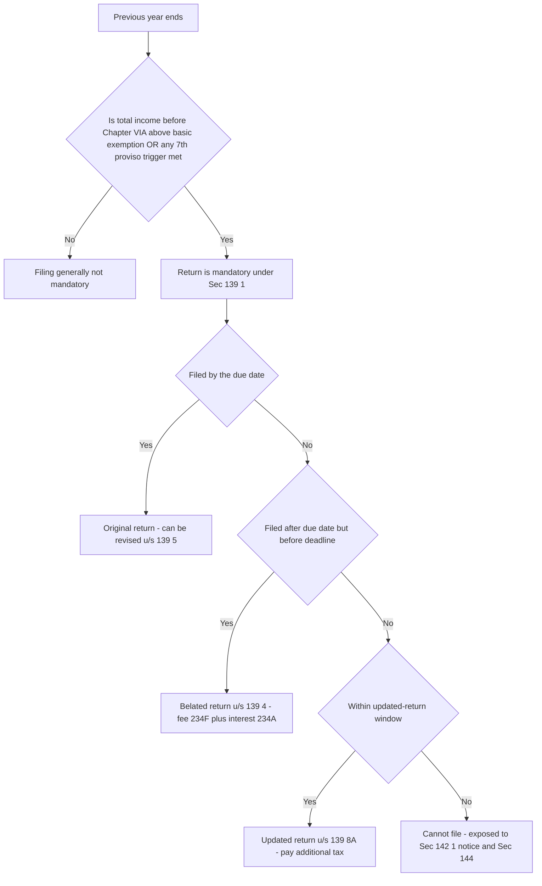
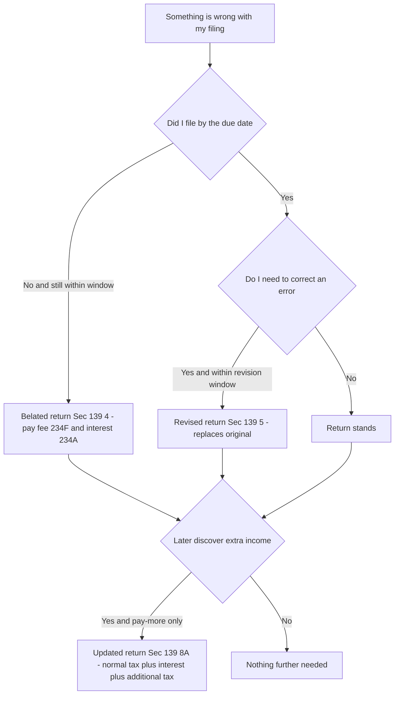
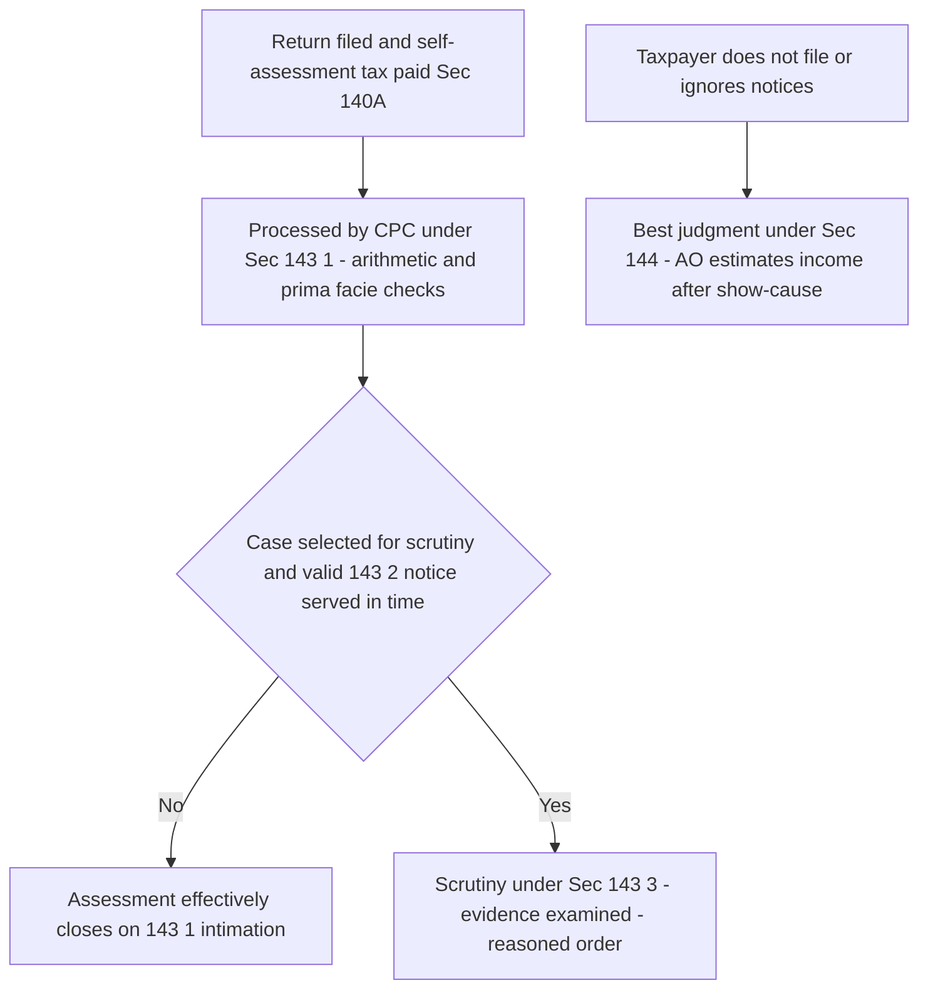

# Chapter 11 — Return Filing & Assessment

> **Rates / limits / dates flag:** Due dates, the basic exemption limit, the late-filing fee under Sec 234F, interest rates under Secs 234A/B/C, the additional-tax slabs for updated returns (Sec 139(8A)), and the time limits for issuing notices and completing assessments are all periodically re-set by Finance Acts and CBDT extensions. This chapter teaches the **architecture and the reason for each deadline** so the machinery is permanent knowledge. **Always verify the exact dates, fees, interest rates, and applicable Assessment Year against current ICAI study material for your attempt.**

---

## 1. The Problem — how does a government tax millions of people it has never met?

Imagine you are the tax department. There are crores of taxpayers — salaried people, traders, doctors, companies, freelancers. You cannot send an inspector to every kitchen table to add up each person's income. You do not know what anyone earned last year. You have no way to compute anybody's tax by yourself.

So you face a genuine design problem with two horns:

**Horn 1 — You must rely on the taxpayer to *tell* you.** Only the taxpayer knows his salary, his rent, his capital gains, his deductions. The only workable system is **self-declaration**: the taxpayer computes his own income and tax and reports it. This is why the Indian system is called a **self-assessment** system. The *return of income* is that declaration.

**Horn 2 — If you simply trust every declaration, everyone under-reports.** A pure honour system collapses instantly, because the rational taxpayer would declare zero. So self-declaration must be backed by a **credible threat of verification** — a machinery that says "we might check, and if you lied, we will re-compute and penalise you." That verification machinery is **assessment**.

Return filing and assessment are therefore two halves of one bargain:

- **The return** is the taxpayer saying: *"Here is my income, here is my tax, I have paid it."*
- **The assessment** is the department saying: *"We accept / correct / investigate that declaration."*

Neither works without the other. A declaration with no possibility of scrutiny is a joke; scrutiny with no declaration to check has nothing to bite on. The whole of Chapter XIV of the Income-tax Act, 1961 (Sections 139 to 158) is the plumbing that makes this two-sided bargain function at national scale.

---

## 2. The Core Idea

> **The taxpayer first *declares and self-assesses* his income by filing a return (Sec 139). The department then *responds* along a graded ladder of verification — from a silent arithmetic check, to a desk query, to a full investigation, to a punitive estimate when the taxpayer refuses to cooperate. The intensity of the department's response scales with how much cooperation and credibility the taxpayer offers.**

Two load-bearing ideas fall out of this:

1. **The return is a legal self-assessment, not a request.** When you file, you are not asking the department to compute your tax — you have already computed it and (ideally) paid it under Sec 140A (self-assessment tax). The return is the *record* of that computation.

2. **Assessment is a spectrum, not a single act.** There are four flavours, and they are ordered by escalating friction:

| Type | Section | Who does the work | Trigger |
|---|---|---|---|
| **Self-assessment** | 140A | The taxpayer | Every return |
| **Summary assessment** | 143(1) | The computer (CPC) | Every processed return |
| **Scrutiny assessment** | 143(3) | The Assessing Officer | Selected returns |
| **Best judgment assessment** | 144 | The AO, using estimates | Non-cooperation / non-filing |

The genius is that **99%+ of returns never meet a human**. The system is built so that the cheap, automated check (143(1)) handles the vast majority, and the expensive human scrutiny (143(3)) is reserved for a tiny selected sliver. Best judgment (144) is the punishment lane for those who won't play. Understand *why* the ladder is graded this way and you never have to memorise the four types — they simply *are* the four rational responses to four levels of taxpayer behaviour.

---

## 3. Why It's Built This Way — the design logic behind each rule

Before any section, absorb the design choices. Every rule below is one of these choices wearing a section number.

| Design choice | The problem it solves | How the Act implements it |
|---|---|---|
| Compulsory filing above a threshold | Can't chase everyone; focus on those with taxable capacity | Sec 139(1) — file if income exceeds basic exemption |
| Filing even when income is below limit, in some cases | High-value activity can hide income | Sec 139(1) 7th proviso — deposits, spends, turnover triggers |
| Fixed due dates staggered by complexity | Audited/complex cases need more time than salaried | Sec 139(1) — different dates for different classes |
| Allow late filing, but with a cost | Rigidity would deny relief to genuine latecomers; but no cost = no deadline | Sec 139(4) belated + Sec 234F fee + Sec 234A interest |
| Allow correction of honest mistakes | Humans err; punishing honest error deters filing | Sec 139(5) revised return |
| Allow voluntary "coming clean" later | Recover tax from those who under-reported, without a fight | Sec 139(8A) updated return + additional tax |
| A single lifelong identifier | Link every transaction to one person; stop identity-splitting | PAN (Sec 139A), linked to Aadhaar (Sec 139AA) |
| Automated arithmetic check | Catch obvious errors cheaply, at scale | Sec 143(1) |
| Selective human scrutiny | Deep-dive only where risk is high | Sec 143(3) after notice u/s 143(2) |
| Estimate when taxpayer won't cooperate | Non-cooperation cannot become a shield | Sec 144 best judgment |
| Reject junk returns early | An incomplete return can't be meaningfully assessed | Sec 139(9) defective return |

The spine of the whole chapter: **the law offers escalating carrots for cooperation and escalating sticks for non-cooperation.** File on time → no cost. File late → fee + interest. Don't file at all, or ignore notices → best judgment estimate + penalty + possible prosecution. Every deadline and every fee is calibrated to nudge you one rung toward voluntary compliance.


*Figure 1 — The filing decision tree: whether you must file, and which door you file through depending on how late you are.*

---

## 4. Full Technical Content

### 4.1 Who must file — Section 139(1)

The default rule: **every person whose total income (before giving effect to Chapter VI-A deductions and certain exemptions) exceeds the basic exemption limit must file a return.** The *reason* is precisely the "focus your effort" design choice — below the exemption limit there is no tax, so there is nothing to verify, so filing is not forced.

Two crucial "why" points examiners love:

1. **"Total income *before* Chapter VI-A deductions."** Suppose your gross total income is ₹4,50,000 and you claim ₹1,50,000 under Sec 80C, bringing taxable income to ₹3,00,000. If the exemption limit were, say, ₹2,50,000, a naive reading says "taxable income ₹3,00,000 > limit, must file" — but the subtle point is that the test is applied on income *before* the 80C deduction. **The logic:** the department wants to see the return precisely *because* you are claiming deductions; letting deductions pull you below the threshold and out of filing would hide the very claims they want to check. So the threshold is measured on the pre-deduction figure.

2. **Companies and firms must file regardless of income (even at a loss).** *Why:* these are formal entities the State has registered; a nil or loss return still carries information the department needs (and losses must be filed on time to be carried forward — see Connections).

**The 7th proviso to Sec 139(1) — mandatory filing even below the limit.** The problem this solves: a person can have low *declared* income but obvious high-value activity. So filing is compulsory (irrespective of income) if the person, broadly:

- deposited above a specified amount in current accounts,
- spent above a specified amount on foreign travel,
- paid electricity bills above a specified amount, or
- meets other high-value criteria CBDT notifies.

**Memory hook:** *"If you live large, you must file — even if you claim to earn small."* The proviso closes the gap between lifestyle and declaration.

**Resident holding foreign assets** must also file regardless of income (to enforce global-income disclosure for residents — connects to Chapter 2, residential status).

### 4.2 Due dates — Section 139(1)

The dates are **staggered by how much preparation the taxpayer's affairs require.** More complexity = more time. (Verify exact dates for your AY.)

| Class of assessee | Typical due date* |
|---|---|
| Assessee requiring audit under the Act (e.g. business/profession above turnover limits) | 31 October of the AY |
| A partner of a firm whose accounts are audited (and the spouse, in certain cases) | 31 October of the AY |
| Assessee required to furnish a transfer-pricing report (Sec 92E) | 30 November of the AY |
| Any other assessee (salaried, most individuals, non-audit) | 31 July of the AY |

*\*Verify against current ICAI material; CBDT frequently extends.*

**The why:** an audited business must first get its books audited (the auditor needs months after year-end), so it gets until 31 October. A transfer-pricing case involves cross-border documentation, so it gets the longest runway to 30 November. A salaried person has a Form 16 and little else, so 31 July suffices. The dates are not arbitrary — they track document-readiness.

### 4.3 The three "second chances" — belated, revised, updated

The Act deliberately builds in three ways to fix a filing situation after the due date, each targeting a different failure:

**(a) Belated return — Section 139(4): "I missed the deadline entirely."**
If you did not file by the due date, you may still file a **belated return** up to **three months before the end of the relevant assessment year, or before completion of assessment, whichever is earlier** (verify the exact cut-off for your AY). *Why allow it?* Rigidly barring late filers would leave genuine latecomers unable to report at all — worse for revenue. But lateness cannot be free, or the deadline means nothing. So belated filing carries a **price tag**: the late-filing fee under **Sec 234F** and interest under **Sec 234A** (both below).

**(b) Revised return — Section 139(5): "I filed, but I made a mistake."**
If, after filing (original *or* belated), you discover an **omission or wrong statement**, you may file a revised return up to the **same cut-off as the belated return** (three months before AY-end or before assessment completion, whichever is earlier). *Why:* honest people make honest errors; punishing correction would deter people from ever fixing mistakes. A revised return **replaces** the original — the original is treated as withdrawn. **Trap:** a revision is for a *bona fide* omission/error, not for laundering a deliberately false original once you sense scrutiny.

**(c) Updated return — Section 139(8A): "I want to come clean, later, and pay more tax."**
This is the newest and most conceptually interesting door. It lets a person file an **updated return within a specified number of years from the end of the relevant AY** (verify the exact window), **but only to disclose *additional* income and pay *additional* tax.** *The why is pure revenue-collection pragmatism:* the department would rather you voluntarily walk in and pay extra tax than spend years litigating to extract it. To make this worth the State's while (and to ensure it is not cost-free relative to timely filing), the updated return carries **additional tax over and above the normal tax and interest** — a percentage that **increases the longer you wait** (again, cooperation-scales design).

Hard limits on the updated return — you **cannot** file one if it:
- results in a **refund or reduces** your tax liability (it is a *pay-more* door, never a *get-back* door),
- shows a **loss**, or
- is filed in certain cases where a search/survey or assessment is already underway.


*Figure 2 — Choosing between belated, revised, and updated returns based on what went wrong and when you realised.*

### 4.4 Defective return — Section 139(9)

**The problem:** an incomplete return cannot be meaningfully assessed. If key annexures, tax computations, or proof of tax paid are missing, the department has nothing solid to verify. So the AO may declare the return **defective** and issue an intimation giving the assessee **15 days (extendable) to rectify** it. 

**The consequence with teeth:** if you do not fix the defect in time, the return is treated as **invalid** — i.e., as if you **never filed at all**. That is severe: you lose the filing date, become exposed to belated-filing costs, and may lose loss carry-forward. **Memory hook:** *"A defective return is a warning shot; an uncured defect makes the return vanish."*

### 4.5 PAN — Section 139A, and Aadhaar linking — Section 139AA

**Why PAN exists:** the entire self-assessment-plus-verification bargain depends on being able to **attribute every transaction to one identifiable person.** Without a unique key, a taxpayer could split identities, and the department could never aggregate a person's income across banks, employers, and property registrars. The **Permanent Account Number** is that key — a lifelong, unique 10-character identifier. It is mandatory for those carrying on business/profession above thresholds, for those who must file, and it must be **quoted in specified high-value transactions** (buying property, large cash deposits, etc.) so the department can stitch a person's financial footprint together.

**Why Aadhaar linking (Sec 139AA):** PAN alone can be duplicated — a determined evader could hold multiple PANs to fragment income. Aadhaar is biometrically unique, so **linking PAN to Aadhaar de-duplicates PANs and welds the tax identity to a single real human.** Quoting Aadhaar is required when applying for PAN and when filing a return. **Consequence of non-linking:** the PAN becomes **inoperative**, which cascades into higher TDS, inability to file smoothly, and blocked refunds — a deliberately painful nudge to comply.

### 4.6 The four assessments

**(a) Self-assessment — Section 140A.**
Before filing, the assessee computes tax on the returned income, subtracts TDS/TCS/advance tax already paid, adds interest under 234A/B/C and fee under 234F, and **pays the balance ("self-assessment tax")**. *Why first?* The whole system is self-assessment; the return must arrive already backed by payment, otherwise the department is chasing money on every single return. If you file without paying the self-assessment tax due, you are treated as an **assessee in default** for that amount.

**(b) Summary assessment / processing — Section 143(1).**
Every return is processed, almost entirely by the **Centralised Processing Centre (CPC)** computer. The system performs only **arithmetic and consistency checks** — no investigation. Specifically it:
- corrects arithmetical errors,
- disallows **internally inconsistent** claims (e.g., a deduction plainly incorrect from the return itself),
- disallows losses/deductions claimed in a **belated return** where the law bars them,
- matches tax credit with Form 26AS / prepaid taxes.
It then issues an **intimation** showing tax payable, refund due, or "no change." **Why keep it purely mechanical?** Because it runs on *every* return — it must be cheap, fast, and non-judgmental. Anything requiring judgment is pushed up to scrutiny. An intimation u/s 143(1) is **deemed a notice of demand** where tax is payable. Time limit: it must be sent within **nine months from the end of the financial year in which the return is filed** (verify current limit).

**(c) Scrutiny assessment — Section 143(3).**
This is the **human deep-dive**, but the department cannot pick you at will and silently. The gate is a **notice under Sec 143(2)**, which must be served within a **time limit (typically three months from the end of the FY in which the return is filed — verify)**. *Why a strict time limit on the notice?* Because the threat of scrutiny cannot hang over a taxpayer forever; certainty is itself a taxpayer right. **No valid 143(2) notice in time = no scrutiny.** The AO then examines evidence, calls for details (Sec 142(1)), may order a **special audit (Sec 142(2A))** in complex cases, and passes a reasoned assessment order determining the true total income and tax. Modern scrutiny is largely **faceless** (Sec 144B) — allocated to officers anonymously to reduce discretion and corruption. **Memory hook:** *"143(2) is the knock on the door; 143(3) is the interview."*

**(d) Best judgment assessment — Section 144.**
When the taxpayer **refuses to cooperate**, the department cannot be left helpless. Sec 144 lets the AO **estimate** income to the best of his judgment. It is triggered when the assessee:
- fails to file the return (original/belated/in response to Sec 142(1)),
- fails to comply with a Sec 142(1) notice or a Sec 142(2A) audit direction, or
- fails to comply with a Sec 143(2) scrutiny notice.

*Why estimation rather than "give up"?* Non-cooperation must not become a shield that pays. But because it is an estimate, natural justice requires the AO to give a **show-cause opportunity** before finalising, and the estimate must be **honest and based on material**, not vindictive or arbitrary. **Memory hook:** *"Won't talk? We'll estimate — and you carry the risk of the estimate."*


*Figure 3 — The assessment ladder: every return is processed (143(1)); a selected few are scrutinised (143(3)); the non-cooperative are estimated (144).*

### 4.7 Interest and fee for delay — the "price of lateness"

These are the sticks that make the deadlines real. Learn the *purpose* and the base each is charged on.

| Charge | Section | What it punishes | Broadly, how computed |
|---|---|---|---|
| Late-filing fee | 234F | Filing the return after the due date | A flat fee (a smaller amount if total income is below a specified level; a larger amount otherwise) — verify amounts |
| Interest for late filing | 234A | Time gap between due date and actual filing, on unpaid tax | 1% per month (or part) on tax unpaid, from due date to filing date — verify rate |
| Interest for default in advance tax | 234B | Not paying at least 90% of assessed tax as advance tax | 1% per month on shortfall from 1 April of AY — verify |
| Interest for deferment of advance tax | 234C | Not paying advance-tax instalments on the specified dates | 1% per month for each shortfall period — verify |

**The logical distinction (a favourite exam point):** **234A** punishes *late filing of the return*; **234B and 234C** punish *late payment of tax* (regardless of the return). You can trigger 234B/C even if you file the return on time, because advance-tax obligations run *during* the year, before any return exists. Conversely 234F (a fee, not interest) is a flat charge purely for missing the filing date, independent of any tax due. **Memory hook:** *"F for Filing-late-fee; A for filing After due date; B and C for the Bill you should have paid in advance."*

---

## 5. Worked Examples

### Example 1 (Easy) — Is Mr Rao even required to file, and by when?

Mr Rao, a salaried employee (no audit, no foreign assets), has for the previous year:
- Gross salary ₹6,20,000
- Deduction claimed u/s 80C ₹1,50,000
- Taxable income after deductions ₹4,70,000

Assume the basic exemption limit is ₹2,50,000.

**Step 1 — Apply the correct test.** Sec 139(1) tests income **before** Chapter VI-A deductions. Income before 80C = ₹6,20,000.
**Step 2 — Compare.** ₹6,20,000 > ₹2,50,000. **Filing is mandatory.** (Note the trap: even if the after-80C figure ₹4,70,000 had been below the limit, he would *still* have to file, because the test uses the pre-deduction figure.)
**Step 3 — Due date.** Salaried, non-audit → **31 July of the AY** (verify).

**Answer:** Mr Rao must file, and by 31 July of the assessment year.

### Example 2 (Moderate) — Belated filing: fee under 234F and interest under 234A

Same Mr Rao, but suppose his self-assessment tax still payable (after TDS) is **₹40,000**, and he actually files on **10 November** of the AY, i.e., after the 31 July due date. Assume the 234F fee is ₹5,000 (income above ₹5 lakh slab — verify) and the 234A rate is 1% per month or part of a month.

**Step 1 — Confirm it is a belated return.** Filed after 31 July, but (assume) within the belated-filing window → valid **belated return u/s 139(4)**.
**Step 2 — Late-filing fee, Sec 234F.** Flat **₹5,000** (verify slab).
**Step 3 — Interest u/s 234A.** Charged on unpaid tax of ₹40,000 from the due date (1 August) to the date of filing (10 November).
- Period: August, September, October, and part of November = **4 months** (part of a month counts as a full month).
- Interest = ₹40,000 × 1% × 4 = **₹1,600**.
**Step 4 — Total extra cost of lateness** = ₹5,000 (fee) + ₹1,600 (interest) = **₹6,600**, payable *in addition to* the ₹40,000 tax, as self-assessment tax under Sec 140A before filing.

**Reconciliation check:** Tax ₹40,000 + fee ₹5,000 + interest ₹1,600 = ₹46,600 total to deposit. Had he filed by 31 July with the tax paid, the fee and interest (₹6,600) would both have been zero. The gap is precisely the "price of lateness" — the sticks doing their job.

### Example 3 (Exam-hard) — Revised vs updated, and a defective-return twist

Ms Iyer, a non-audit individual, filed her **original return on 20 July** (before the 31 July due date) declaring total income ₹8,00,000, tax fully paid. Then three things happen in sequence:

**(i)** In September of the AY she realises she **forgot to include bank interest of ₹30,000.**
**(ii)** The CPC, while processing, finds she attached **no computation of income for a claimed deduction** and issues a **Sec 139(9) defective-return intimation** on 5 October, giving 15 days to cure.
**(iii)** Two years after the end of the AY, an old **freelance receipt of ₹1,00,000** she genuinely overlooked surfaces.

Advise Ms Iyer on the correct route for each, with reasons.

**Part (i) — the ₹30,000 omission discovered in September.**
- She filed the original *on time*, and the revised-return window (three months before AY-end or before assessment completion, whichever is earlier — verify) is still open in September.
- **Correct route: Revised return u/s 139(5).** *Reason:* it is a bona fide omission discovered before the window closes; a revision replaces the original with the corrected figures. She will pay tax on the extra ₹30,000 plus any interest under 234B/C if advance-tax was short — but **no 234F fee**, because the original was filed on time and a revised return relates back to it.

**Part (ii) — the defective return.**
- She must **cure the defect within 15 days** (extendable) by furnishing the missing computation.
- *Reason and consequence:* Sec 139(9). If she does **not** cure it, the return is treated as **invalid — as if never filed**, which would demolish her on-time status and expose her to belated costs and possible loss of any carry-forward. **This is the priority action**; a revised return is pointless if the base return is allowed to become invalid.

**Part (iii) — the ₹1,00,000 discovered two years after AY-end.**
- The revised/belated windows are long gone. But she wants to **disclose additional income and pay more tax.**
- **Correct route: Updated return u/s 139(8A)**, if she is within the specified multi-year window (verify).
- *Computation logic:* she pays **normal tax** on the ₹1,00,000 + **interest** (234A/B/C as applicable) + **additional tax** under Sec 139(8A) that rises the longer she waited. Suppose normal tax + interest on the ₹1,00,000 works out to ₹34,000, and the applicable additional tax is (say) 25% of (tax + interest) for that year's window (verify the rate): additional tax = 25% × ₹34,000 = ₹8,500. **Total payable = ₹34,000 + ₹8,500 = ₹42,500.**
- *Reason:* the updated return is a *pay-more-only* door; because it results in extra tax (not a refund or loss), it is permitted, and the additional tax is the price of the delay.

**Reconciliation of the whole scenario:** three different failures → three different, non-interchangeable remedies. Revise for an in-window bona fide error; cure the defect immediately or the return dies; use the updated return only to voluntarily pay more, later, at a premium. The examiner is testing whether you can *map each failure to its purpose-built door* — which you can, once you see the doors are graded by lateness and by whether tax goes up or down.

### Example 4 (Assessment scenario) — When does 144 replace 143(3)?

Mr Khanna files no return despite taxable income. The AO issues a **Sec 142(1) notice** requiring him to file; Mr Khanna ignores it. The AO then issues a **Sec 143(2)** notice; Mr Khanna ignores that too and does not respond to any query.

**Reasoning:**
- With **no return and total non-cooperation**, the AO cannot do a normal scrutiny under 143(3) (there is nothing filed to scrutinise and no cooperation to examine evidence).
- The AO invokes **Sec 144 — best judgment assessment**: he **estimates** Mr Khanna's income from available material (bank data, 26AS, past records).
- **Safeguard:** the AO must issue a **show-cause notice** before finalising, and the estimate must be **reasonable and evidence-based**, not arbitrary.

**Answer:** Best judgment assessment u/s 144. **Contrast with Example 3's cooperative taxpayer:** cooperation earns you the ordinary 143(3) path with a chance to explain; stonewalling earns you an estimate you may not like — the cooperation-scales principle in action.

---

## 6. Computation Format — cost of a late / updated filing

A clean, reusable template for "how much must I deposit before filing?" questions:

```
A. Tax on returned (or updated) total income            ....
B. Less: TDS / TCS / advance tax already paid           (....)
C. Balance tax (A - B)                                    ....
D. Add: Interest u/s 234A (late filing of return)         ....
        = Balance tax x 1% x months (part = full) from
          due date to date of filing
E. Add: Interest u/s 234B (advance-tax shortfall)         ....
F. Add: Interest u/s 234C (deferment of instalments)      ....
G. Add: Fee u/s 234F (flat, if filed after due date)      ....
H. Add: Additional tax u/s 139(8A) (ONLY for an          ....
        updated return) = specified % of (tax + interest)
------------------------------------------------------------
   Self-assessment tax payable u/s 140A (C+D+E+F+G+H)     ====
```

*Notes:* 234F and 234A apply only if filed after the due date. 234B/234C can apply even to an on-time return. Row H appears **only** for updated returns u/s 139(8A). Always verify current rates and fee amounts.

---

## 7. Connections — how this chapter wires into the rest of the syllabus

- **Loss carry-forward (Chapter on set-off, Secs 70–80):** losses under most heads (business loss, capital loss, etc.) can be **carried forward only if the return is filed by the Sec 139(1) due date.** House-property loss and unabsorbed depreciation are exceptions. This is *the* reason on-time filing is not merely a formality — miss the date and you may forfeit years of loss relief. Return filing and loss set-off are joined at the hip.
- **Advance tax (Sec 208–219):** the 234B/234C interest in this chapter is the enforcement arm of the advance-tax obligation — pay-as-you-earn. The return simply reconciles what you pre-paid against what you owe.
- **TDS/TCS (Chapter on deduction at source):** the 143(1) processing **matches your claimed credits against Form 26AS.** A mismatch is the single most common cause of a 143(1) demand or reduced refund — directly linking TDS accuracy to smooth assessment.
- **Residential status (Chapter 2):** a resident with foreign assets must file **irrespective of income** — the filing obligation enforces the global-income principle established there.
- **PAN quoting** threads through property (stamp-duty) and high-value transactions, tying capital-gains and other-source reporting back to a single identity.

---

## 8. Traps & Examiner Tricks

1. **The threshold is tested *before* Chapter VI-A deductions.** Students subtract 80C first and wrongly conclude "no need to file." Always compare the **pre-deduction** income to the exemption limit.
2. **234F is a *fee*, not interest, and not tax.** It is a flat amount, does not depend on tax due, and is not deductible or refundable. Do not compute it month-wise.
3. **234A vs 234B/234C confusion.** 234A = late *return*; 234B/234C = late *advance-tax payment*. You can owe 234B/C with a perfectly timely return. Part of a month counts as a **whole** month for all three.
4. **"Revised return" is not for latecomers.** You can revise only if you *filed* (original or belated). A revision replaces the original; it does not create a fresh right to file if you never filed at all — that would be belated (139(4)) or updated (139(8A)).
5. **Updated return is pay-more-only.** If the correction reduces tax, produces a refund, or shows a loss, an updated return is **not** available. This is the single most tested feature of Sec 139(8A).
6. **An uncured defective return becomes *invalid* — treated as never filed.** Students assume a defect is a minor formality. It can wipe out your filing date and loss carry-forward. Cure it first, before anything else.
7. **No 143(3) scrutiny without a valid, in-time 143(2) notice.** If the department misses the 143(2) time limit, it **cannot** scrutinise — a classic "the AO's order is bad in law" answer.
8. **143(1) is mechanical only.** It cannot make judgmental disallowances or investigate; if a question describes the CPC "examining evidence" or "calling for explanation," that is 143(3) territory, not 143(1).
9. **Best judgment (144) must still be reasonable.** An answer that lets the AO pick any number is wrong — the estimate must rest on material and follow a show-cause opportunity.
10. **PAN inoperative ≠ PAN cancelled.** Non-linking with Aadhaar makes PAN *inoperative* (higher TDS, blocked refunds), not deleted. Watch the wording.

---

## 9. First-Principles Recap

Strip everything away and the chapter is one bargain:

> The State cannot compute your tax, so **you declare it (return, Sec 139) and pre-pay it (self-assessment tax, Sec 140A)**. To keep the declaration honest, the State keeps a **graded verification machine**: a cheap automated check on every return **(143(1))**, a rare human deep-dive on selected ones **(143(3), gated by a timely 143(2) notice)**, and a punitive estimate for those who won't cooperate **(144)**. Because deadlines mean nothing without a price, lateness costs a **fee (234F)** and **interest (234A/B/C)**; because honesty should be rewarded, the law offers second chances graded by lateness — **revise** an error (139(5)), file **belated** (139(4)), or voluntarily **come clean and pay more** (139(8A)). Every person is welded to one identity via **PAN (139A) linked to Aadhaar (139AA)** so nothing can be hidden by splitting identities. Get the *purpose* — declare, verify, price lateness, reward honesty, fix identity — and every section number is just a label on a part you already understand.

---

## 10. Quick-Revision Sheet

**Who files (Sec 139(1)):** income **before Chapter VI-A** > basic exemption; companies/firms always; residents with foreign assets always; 7th proviso high-value triggers (big deposits, foreign travel, electricity, turnover) even if income is below the limit.

**Due dates (verify):** audit cases 31 Oct · TP report (92E) 30 Nov · everyone else 31 July.

**Return types:**
- Original — 139(1), on or before due date; only these can carry forward most losses.
- Belated — 139(4), after due date up to the cut-off; costs 234F + 234A.
- Revised — 139(5), to fix a bona fide error; replaces original; same cut-off.
- Updated — 139(8A), multi-year window; **pay-more only** (no refund/loss/reduction); normal tax + interest + rising additional tax.
- Defective — 139(9), cure in 15 days or return is **invalid**.

**Identity:** PAN — 139A (unique lifelong number, quote in high-value deals). Aadhaar link — 139AA (non-link → PAN inoperative).

**Assessments:**
- 140A — self-assessment (pay before filing).
- 143(1) — CPC summary/arithmetic; intimation within 9 months of FY-end of filing; **mechanical only**.
- 143(3) — scrutiny; **needs 143(2) notice in time** (approx. 3 months from FY-end of filing); faceless (144B).
- 144 — best judgment (non-filing / ignoring 142(1)/143(2)); estimate after show-cause.

**Price of lateness:**
- 234F — flat late-filing **fee**.
- 234A — 1%/month on unpaid tax, due date → filing date (late **return**).
- 234B — 1%/month, advance-tax shortfall (< 90% paid).
- 234C — 1%/month, missed advance-tax **instalments**. (Part month = full month.)

**One-line spine:** *Declare and pre-pay; the State verifies on a graded ladder; lateness is priced; honesty is given second chances; identity is fixed by PAN-Aadhaar.*

> **Reminder:** verify all dates, the 234F fee amounts, interest rates, the updated-return window and its additional-tax slabs, and the 143(1)/143(2) time limits against current ICAI material for your Assessment Year.
