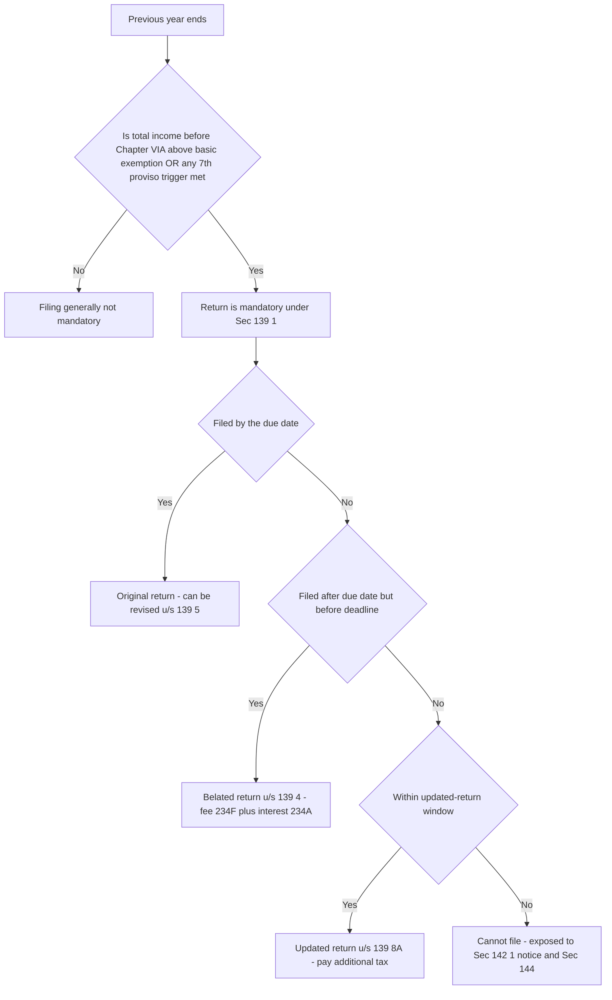
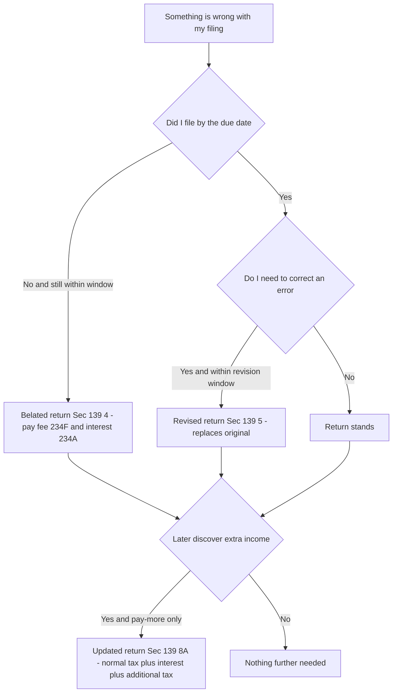
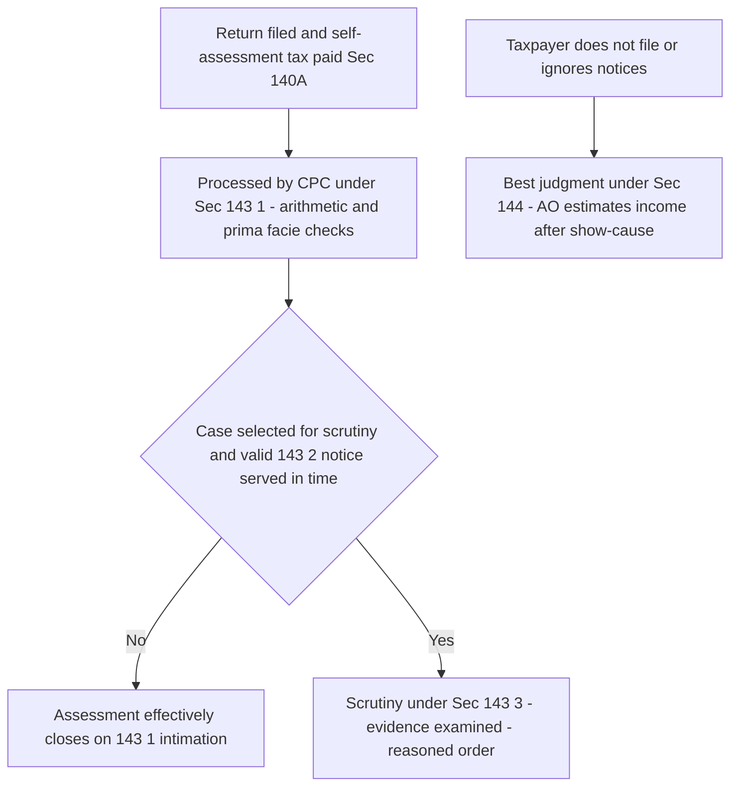
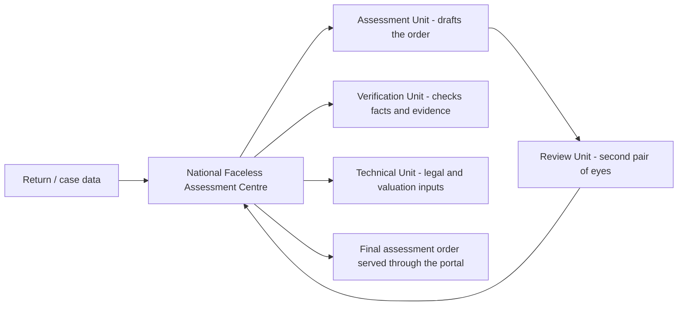

<!-- v2-deep -->

# Chapter 11 — Return Filing & Assessment

> **Rates / limits / dates flag:** Due dates, the basic exemption limit, the late-filing fee under Sec 234F, interest rates under Secs 234A/B/C, the additional-tax slabs for updated returns (Sec 139(8A)), and the time limits for issuing notices and completing assessments are all periodically re-set by Finance Acts and CBDT extensions. This chapter teaches the **architecture and the reason for each deadline** so the machinery is permanent knowledge. **Always verify the exact dates, fees, interest rates, and applicable Assessment Year against current ICAI study material for your attempt.**

---

## 1. The Problem — how does a government tax millions of people it has never met?

Imagine you are the tax department. There are crores of taxpayers — salaried people, traders, doctors, companies, freelancers. You cannot send an inspector to every kitchen table to add up each person's income. You do not know what anyone earned last year. You have no way to compute anybody's tax by yourself.

So you face a genuine design problem with two horns:

**Horn 1 — You must rely on the taxpayer to *tell* you.** Only the taxpayer knows his salary, his rent, his capital gains, his deductions. The only workable system is **self-declaration**: the taxpayer computes his own income and tax and reports it. This is why the Indian system is called a **self-assessment** system. The *return of income* is that declaration.

**Horn 2 — If you simply trust every declaration, everyone under-reports.** A pure honour system collapses instantly, because the rational taxpayer would declare zero. So self-declaration must be backed by a **credible threat of verification** — a machinery that says "we might check, and if you lied, we will re-compute and penalise you." That verification machinery is **assessment**.

Return filing and assessment are therefore two halves of one bargain:

- **The return** is the taxpayer saying: *"Here is my income, here is my tax, I have paid it."*
- **The assessment** is the department saying: *"We accept / correct / investigate that declaration."*

Neither works without the other. A declaration with no possibility of scrutiny is a joke; scrutiny with no declaration to check has nothing to bite on. The whole of Chapter XIV of the Income-tax Act, 1961 (Sections 139 to 158) is the plumbing that makes this two-sided bargain function at national scale.

**A third horn the exam loves — the *timing* problem.** Even if the taxpayer declares honestly, *when* he declares and *when* he pays matters enormously to a cash-strapped State. A government has salaries, subsidies, and infrastructure to fund *every month*, not once a year in a lump at year-end. If everyone were allowed to pay their whole year's tax on the last day, the State would have to borrow to bridge the gap and the taxpayer would enjoy an interest-free loan of the State's money. This is why the machinery is not just "declare and verify" but "declare, **pre-pay as you earn**, verify, and **charge interest for every day of timing slippage**." Hold this timing lens — it is the single idea that unifies advance tax (234B/C), self-assessment tax (140A), and late-filing interest (234A) into one family instead of four disconnected charges.

---

## 2. The Core Idea

> **The taxpayer first *declares and self-assesses* his income by filing a return (Sec 139). The department then *responds* along a graded ladder of verification — from a silent arithmetic check, to a desk query, to a full investigation, to a punitive estimate when the taxpayer refuses to cooperate. The intensity of the department's response scales with how much cooperation and credibility the taxpayer offers.**

Two load-bearing ideas fall out of this:

1. **The return is a legal self-assessment, not a request.** When you file, you are not asking the department to compute your tax — you have already computed it and (ideally) paid it under Sec 140A (self-assessment tax). The return is the *record* of that computation.

2. **Assessment is a spectrum, not a single act.** There are four flavours, and they are ordered by escalating friction:

| Type | Section | Who does the work | Trigger |
|---|---|---|---|
| **Self-assessment** | 140A | The taxpayer | Every return |
| **Summary assessment** | 143(1) | The computer (CPC) | Every processed return |
| **Scrutiny assessment** | 143(3) | The Assessing Officer | Selected returns |
| **Best judgment assessment** | 144 | The AO, using estimates | Non-cooperation / non-filing |

The genius is that **99%+ of returns never meet a human**. The system is built so that the cheap, automated check (143(1)) handles the vast majority, and the expensive human scrutiny (143(3)) is reserved for a tiny selected sliver. Best judgment (144) is the punishment lane for those who won't play. Understand *why* the ladder is graded this way and you never have to memorise the four types — they simply *are* the four rational responses to four levels of taxpayer behaviour.

**A fifth "re-opening" lane you should know exists.** Beyond the four core assessments there is a *reassessment* machinery — **income escaping assessment (Sec 147, initiated by a notice under Sec 148)** — which lets the department reopen a case, within limits, when it later has *information* that income escaped tax. For CA Intermediate you mainly need the *idea* (an already-closed assessment is not necessarily final forever; escaped income can be pulled back within statutory time limits after a proper notice), not the fine mechanics. Its purpose fits the same spine: the verification threat must not evaporate the instant an assessment closes, or under-reporting discovered late would go unpunished. **Verify the exact 147/148 time limits and preconditions against current ICAI material** — they have been rewritten heavily in recent Finance Acts.

---

## 3. Why It's Built This Way — the design logic behind each rule

Before any section, absorb the design choices. Every rule below is one of these choices wearing a section number.

| Design choice | The problem it solves | How the Act implements it |
|---|---|---|
| Compulsory filing above a threshold | Can't chase everyone; focus on those with taxable capacity | Sec 139(1) — file if income exceeds basic exemption |
| Filing even when income is below limit, in some cases | High-value activity can hide income | Sec 139(1) 7th proviso — deposits, spends, turnover triggers |
| Fixed due dates staggered by complexity | Audited/complex cases need more time than salaried | Sec 139(1) — different dates for different classes |
| Allow late filing, but with a cost | Rigidity would deny relief to genuine latecomers; but no cost = no deadline | Sec 139(4) belated + Sec 234F fee + Sec 234A interest |
| Allow correction of honest mistakes | Humans err; punishing honest error deters filing | Sec 139(5) revised return |
| Allow voluntary "coming clean" later | Recover tax from those who under-reported, without a fight | Sec 139(8A) updated return + additional tax |
| A single lifelong identifier | Link every transaction to one person; stop identity-splitting | PAN (Sec 139A), linked to Aadhaar (Sec 139AA) |
| Automated arithmetic check | Catch obvious errors cheaply, at scale | Sec 143(1) |
| Selective human scrutiny | Deep-dive only where risk is high | Sec 143(3) after notice u/s 143(2) |
| Estimate when taxpayer won't cooperate | Non-cooperation cannot become a shield | Sec 144 best judgment |
| Reject junk returns early | An incomplete return can't be meaningfully assessed | Sec 139(9) defective return |
| Bind the department to time limits too | Certainty is a taxpayer right; open-ended threat is oppressive | Time limits on 143(2) notice, 143(1)/143(3) completion, 148 reopening |

The spine of the whole chapter: **the law offers escalating carrots for cooperation and escalating sticks for non-cooperation.** File on time → no cost. File late → fee + interest. Don't file at all, or ignore notices → best judgment estimate + penalty + possible prosecution. Every deadline and every fee is calibrated to nudge you one rung toward voluntary compliance.

**The symmetry point examiners reward.** Notice the last row: the deadlines do not run in only one direction. Just as the *taxpayer* is bound by filing dates, the *department* is bound by time limits to issue the 143(2) notice, to send the 143(1) intimation, to complete a 143(3)/144 assessment, and to reopen under 148. The reason is a first principle of fairness: an open-ended power to reassess would let the State hold a sword over every citizen forever, which is itself a form of oppression. A student who writes "the AO can scrutinise anytime" has missed the deepest structural idea of the chapter — **certainty of assessment is a right, and it is manufactured by putting a clock on the department.**


*Figure 1 — The filing decision tree: whether you must file, and which door you file through depending on how late you are.*

---

## 4. Full Technical Content

### 4.1 Who must file — Section 139(1)

The default rule: **every person whose total income (before giving effect to Chapter VI-A deductions and certain exemptions) exceeds the basic exemption limit must file a return.** The *reason* is precisely the "focus your effort" design choice — below the exemption limit there is no tax, so there is nothing to verify, so filing is not forced.

Two crucial "why" points examiners love:

1. **"Total income *before* Chapter VI-A deductions."** Suppose your gross total income is ₹4,50,000 and you claim ₹1,50,000 under Sec 80C, bringing taxable income to ₹3,00,000. If the exemption limit were, say, ₹2,50,000, a naive reading says "taxable income ₹3,00,000 > limit, must file" — but the subtle point is that the test is applied on income *before* the 80C deduction. **The logic:** the department wants to see the return precisely *because* you are claiming deductions; letting deductions pull you below the threshold and out of filing would hide the very claims they want to check. So the threshold is measured on the pre-deduction figure.

2. **Companies and firms must file regardless of income (even at a loss).** *Why:* these are formal entities the State has registered; a nil or loss return still carries information the department needs (and losses must be filed on time to be carried forward — see Connections).

**The precise "before-deduction" list — a finer distinction the exam tests.** The threshold is tested on total income computed *before* giving effect not only to Chapter VI-A (Secs 80C to 80U) but also to certain **exemptions on capital gains** (broadly Secs 54 / 54B / 54D / 54EC / 54F etc.) and the specified proviso exemptions. **Why bundle capital-gains exemptions with 80C for this test?** Same logic: those exemptions are *conditional* (you must reinvest, hold, and not violate lock-ins). The department wants the return on record so it can later check whether the condition was honoured. Letting a rollover exemption push you below the filing line would hide the very claim that needs monitoring for years. **Memory hook:** *"The filing test looks at your income with its make-up removed — strip the deductions and the conditional exemptions, then compare."*

**Categories of "person" — do not equate person with individual.** Sec 139(1) speaks of every *person*, and "person" (Sec 2(31)) covers individual, HUF, firm/LLP, company, AOP/BOI, local authority, and artificial juridical person. The filing trigger differs by category:
- **Individual / HUF / AOP / BOI / artificial juridical person:** file if total income (pre-deduction) exceeds the basic exemption limit, or a 7th-proviso trigger is met.
- **Company and firm/LLP:** file **always** — even nil income, even a loss, even a dormant company.
- **Certain persons claiming specified exemptions** (e.g., charitable trusts, political parties, research associations, universities, and similar bodies) must file if their income *before* claiming those exemptions exceeds the limit — otherwise the exemption itself could hide unassessed income. **Verify the exact list for your AY.**

**The 7th proviso to Sec 139(1) — mandatory filing even below the limit.** The problem this solves: a person can have low *declared* income but obvious high-value activity. So filing is compulsory (irrespective of income) if the person, broadly:

- deposited above a specified amount in current accounts,
- spent above a specified amount on foreign travel,
- paid electricity bills above a specified amount, or
- meets other high-value criteria CBDT notifies (e.g., business turnover, professional gross receipts, or aggregate TDS/TCS above notified thresholds — verify current notified list).

**Memory hook:** *"If you live large, you must file — even if you claim to earn small."* The proviso closes the gap between lifestyle and declaration.

**Resident holding foreign assets** must also file regardless of income (to enforce global-income disclosure for residents — connects to Chapter 2, residential status). This obligation catches a resident and ordinarily resident who **holds any asset located outside India, or has signing authority in any foreign account, or is a beneficiary of any foreign asset** — even with zero Indian income. **Why so strict?** Foreign assets are exactly what the domestic verification machine cannot see; forcing a return is the only hook to bring them onto the record and into the global-income net.

### 4.2 Due dates — Section 139(1)

The dates are **staggered by how much preparation the taxpayer's affairs require.** More complexity = more time. (Verify exact dates for your AY.)

| Class of assessee | Typical due date* |
|---|---|
| Assessee requiring audit under the Act (e.g. business/profession above turnover limits) | 31 October of the AY |
| A partner of a firm whose accounts are audited (and the spouse, in certain cases) | 31 October of the AY |
| Assessee required to furnish a transfer-pricing report (Sec 92E) | 30 November of the AY |
| Any other assessee (salaried, most individuals, non-audit) | 31 July of the AY |

*\*Verify against current ICAI material; CBDT frequently extends.*

**The why:** an audited business must first get its books audited (the auditor needs months after year-end), so it gets until 31 October. A transfer-pricing case involves cross-border documentation, so it gets the longest runway to 30 November. A salaried person has a Form 16 and little else, so 31 July suffices. The dates are not arbitrary — they track document-readiness.

**A subtle sub-rule — the working partner rides on the firm's clock.** A *partner* of a firm whose accounts are subject to audit gets **31 October**, even though the partner personally may have only salary/interest from the firm. **Why?** The partner's share of profit cannot be finalised until the firm's audited accounts are done; forcing the partner to file by 31 July while the firm files by 31 October would be logically impossible. The due date follows the *dependency*, not the person. **Trap:** examiners give you "Mr A is a working partner in XYZ & Co, a firm liable to tax audit" and expect **31 October**, not 31 July — many students default to 31 July because Mr A is an individual.

**The tax-audit report has its own earlier deadline.** Where audit under the Act applies, the **audit report itself (Form 3CA/3CB + 3CD) must be furnished by a date *before* the return due date** (broadly one month before — verify). **Why earlier?** The return due date of 31 October presumes the audit is *already done and filed*; the report cannot be an afterthought squeezed in with the return. This is a favourite "sequence" trap: audit report first, then the return.

### 4.3 The three "second chances" — belated, revised, updated

The Act deliberately builds in three ways to fix a filing situation after the due date, each targeting a different failure:

**(a) Belated return — Section 139(4): "I missed the deadline entirely."**
If you did not file by the due date, you may still file a **belated return** up to **three months before the end of the relevant assessment year, or before completion of assessment, whichever is earlier** (verify the exact cut-off for your AY). *Why allow it?* Rigidly barring late filers would leave genuine latecomers unable to report at all — worse for revenue. But lateness cannot be free, or the deadline means nothing. So belated filing carries a **price tag**: the late-filing fee under **Sec 234F** and interest under **Sec 234A** (both below).

**The hidden penalty of belated filing — lost rights, not just a fee.** The cash cost (234F + 234A) is the *visible* penalty; the *invisible* and often larger penalty is the **forfeiture of most loss carry-forwards** (business loss, speculation loss, capital loss, loss under "other sources" from owning/maintaining racehorses). File belated and those losses cannot be carried to future years. **The two survivors:** *house-property loss* and *unabsorbed depreciation* can still be carried forward even on a belated return — because their carry-forward flows from different provisions (Sec 71B / Sec 32(2)) not tied to the 139(1) due date. **Memory hook:** *"Belated filing burns your losses — but the house and the depreciation survive the fire."*

**(b) Revised return — Section 139(5): "I filed, but I made a mistake."**
If, after filing (original *or* belated), you discover an **omission or wrong statement**, you may file a revised return up to the **same cut-off as the belated return** (three months before AY-end or before assessment completion, whichever is earlier). *Why:* honest people make honest errors; punishing correction would deter people from ever fixing mistakes. A revised return **replaces** the original — the original is treated as withdrawn. **Trap:** a revision is for a *bona fide* omission/error, not for laundering a deliberately false original once you sense scrutiny.

**Finer points on revision the exam probes:**
- **You can revise a return any number of times** within the window (each revised return replaces the last), so long as it is bona fide.
- **A belated return *can* be revised.** This is current law (the old bar on revising belated returns was removed). If a question is set in an old-style textbook it may say otherwise — go with current ICAI material.
- **A revised return substitutes the original *for all purposes* and relates back to the original filing date.** So if the original was on time, the revised one does not attract a 234F fee merely because it is filed later. But — a sharp trap — revision **cannot cure a late original**; if the original was belated, revising it does not retroactively make it on-time, and lost loss-carry-forwards stay lost.

**(c) Updated return — Section 139(8A): "I want to come clean, later, and pay more tax."**
This is the newest and most conceptually interesting door. It lets a person file an **updated return within a specified number of years from the end of the relevant AY** (verify the exact window), **but only to disclose *additional* income and pay *additional* tax.** *The why is pure revenue-collection pragmatism:* the department would rather you voluntarily walk in and pay extra tax than spend years litigating to extract it. To make this worth the State's while (and to ensure it is not cost-free relative to timely filing), the updated return carries **additional tax over and above the normal tax and interest** — a percentage that **increases the longer you wait** (again, cooperation-scales design).

Hard limits on the updated return — you **cannot** file one if it:
- results in a **refund or reduces** your tax liability (it is a *pay-more* door, never a *get-back* door),
- shows a **loss** (or increases a loss already declared),
- **reduces total tax already determined,** or
- is filed in certain barred cases — where a **search (Sec 132), requisition (Sec 132A), or survey (Sec 133A)** has been initiated against you, where **assessment/reassessment/revision is pending or completed** for that year, or where the department already has information under specified agreements against you (verify the full bar list).

**One updated return per year — and only if it results in extra tax to the exchequer.** You may file an updated return for a given AY **only once**; there is no serial-updating. And the ironclad test is directional: **the update must leave the government better off** (more tax, or converting a refund/loss claim into a smaller one within the permitted bounds). This single directional idea (money must flow *to* the State) is the master key to every 139(8A) question.

**How the additional tax is layered — the concept, not the exact %.** On top of the normal tax + interest that a timely filer would have paid, the updater pays an **additional tax computed as a percentage of (that tax + interest)**, and the percentage **steps up by the "band" of lateness** (a lower band for filing sooner after AY-end, a higher band for filing later in the window). **Verify the current bands and percentages for your AY** — they have been revised by Finance Acts. The examinable *concept* is: *the earlier you self-correct, the cheaper the premium; the later, the dearer* — a perfectly rational price schedule for a State trying to pull confessions forward in time.


*Figure 2 — Choosing between belated, revised, and updated returns based on what went wrong and when you realised.*

**A one-glance comparison the exam rewards you for reproducing:**

| Feature | Belated 139(4) | Revised 139(5) | Updated 139(8A) |
|---|---|---|---|
| Purpose | Missed the due date entirely | Fix a bona fide error in a filed return | Voluntarily disclose extra income later |
| Pre-condition | Did not file on time | Already filed (original or belated) | Filed or not — either way |
| Direction of tax | Any | Any (up or down) | **Only up** — never a refund/loss |
| Window (verify) | Up to ~3 months before AY-end / assessment | Same as belated | Multi-year from AY-end |
| Extra cost | 234F fee + 234A interest | None just for revising (relates back) | Normal tax + interest + **rising additional tax** |
| Loss carry-forward | Most losses **lost** | Follows the original's status | Cannot create/increase a loss |

### 4.4 Defective return — Section 139(9)

**The problem:** an incomplete return cannot be meaningfully assessed. If key annexures, tax computations, or proof of tax paid are missing, the department has nothing solid to verify. So the AO may declare the return **defective** and issue an intimation giving the assessee **15 days (extendable) to rectify** it.

**The consequence with teeth:** if you do not fix the defect in time, the return is treated as **invalid** — i.e., as if you **never filed at all**. That is severe: you lose the filing date, become exposed to belated-filing costs, and may lose loss carry-forward. **Memory hook:** *"A defective return is a warning shot; an uncured defect makes the return vanish."*

**What counts as a defect — the finer distinctions.** Broadly, a return is defective if it is not accompanied by, or does not contain, the statutorily required particulars — for example, the return is not filled in fully, the required statements/computations are missing, the **self-assessment tax with interest has not been paid before filing** where required, or (for accounts-keeping assessees) the return is unaccompanied by the required copies of accounts / audit report. **Verify the current defect list.**

**Two subtleties that separate a top answer:**
1. **Defective ≠ invalid ≠ non-est immediately.** The return is *not* dead the moment a defect exists. It becomes invalid **only if the defect is not cured in the allowed time.** During the cure window the return is alive. So a question that says "the AO treated the return as invalid the day he spotted a defect" describes an *improper* action — the AO must first give the 15-day (extendable) opportunity.
2. **AO's discretion to condone.** Even after the period expires, the AO *may* (before assessment) condone the delay and treat a belatedly-cured return as valid. This is a relief valve so an honest but slow taxpayer is not annihilated on a technicality. **The safe exam line:** *cure within 15 days to be safe; the AO's power to condone is a mercy, not a right you should rely on.*

### 4.5 PAN — Section 139A, and Aadhaar linking — Section 139AA

**Why PAN exists:** the entire self-assessment-plus-verification bargain depends on being able to **attribute every transaction to one identifiable person.** Without a unique key, a taxpayer could split identities, and the department could never aggregate a person's income across banks, employers, and property registrars. The **Permanent Account Number** is that key — a lifelong, unique 10-character identifier. It is mandatory for those carrying on business/profession above thresholds, for those who must file, and it must be **quoted in specified high-value transactions** (buying property, large cash deposits, etc.) so the department can stitch a person's financial footprint together.

**Who must obtain PAN — the layered triggers (Sec 139A).** Beyond "anyone with taxable income," PAN is required for, broadly: any person carrying on **business or profession whose total sales/turnover/gross receipts exceed a specified amount** in any year; a person required to file a return (including under the 7th proviso); a **resident (other than an individual) entering into a financial transaction of a specified aggregate amount** in a year, and the persons managing/representing it (directors, partners, trustees, karta, principal officer); and importers/exporters and certain others CBDT notifies. **Why cast the net wider than just taxpayers?** Because the department wants a PAN *before* the transaction, so the footprint is captured in real time — not reconstructed years later.

**Interchangeability of PAN and Aadhaar.** Where a person has linked the two, the law broadly permits **quoting Aadhaar in place of PAN** (and vice-versa) for filing and specified transactions, and allows a person who has Aadhaar but no PAN to be *allotted* a PAN on the strength of Aadhaar. **Why?** To reduce friction now that identity is welded to a single biometric key — a person should not be blocked merely for carrying one number and not the other.

**Why Aadhaar linking (Sec 139AA):** PAN alone can be duplicated — a determined evader could hold multiple PANs to fragment income. Aadhaar is biometrically unique, so **linking PAN to Aadhaar de-duplicates PANs and welds the tax identity to a single real human.** Quoting Aadhaar is required when applying for PAN and when filing a return. **Consequence of non-linking:** the PAN becomes **inoperative**, which cascades into higher TDS, inability to file smoothly, and blocked refunds — a deliberately painful nudge to comply.

**What "inoperative" actually does — the finer cascade.** While a PAN is inoperative, broadly: **no refund is made** for the period it is inoperative; **no interest is payable on such refund**; and **TDS/TCS is deducted/collected at the higher rates** applicable where PAN is not furnished. Crucially, an *inoperative* PAN is **not a cancelled or non-existent PAN** — the person is still treated as *having* a PAN (so, e.g., they are not automatically hit with fresh PAN-application obligations), but its benefits are frozen until relinked. **Trap:** examiners test whether you know the PAN still "exists" (so the higher-TDS regime for *no* PAN is applied by reason of *inoperativeness*, not by treating the person as PAN-less in the literal sense) — read the option wording carefully. **Verify current consequences and any exemptions (certain categories/States) for your AY.**

### 4.6 The four assessments

**(a) Self-assessment — Section 140A.**
Before filing, the assessee computes tax on the returned income, subtracts TDS/TCS/advance tax already paid, adds interest under 234A/B/C and fee under 234F, and **pays the balance ("self-assessment tax")**. *Why first?* The whole system is self-assessment; the return must arrive already backed by payment, otherwise the department is chasing money on every single return. If you file without paying the self-assessment tax due, you are treated as an **assessee in default** for that amount.

**The appropriation rule — a numerical trap under 140A.** When the amount you deposit falls short of (tax + interest + fee) due, the law prescribes the **order of appropriation**: the payment is **first adjusted against the fee, then the interest, and the balance against the tax** (verify the current order — recent law places fee first). **Why does the order matter?** Because whatever is *not* covered leaves you an "assessee in default" for *tax*, which triggers further interest and recovery; the appropriation order therefore decides how much unpaid *tax* remains. A careless student assumes the shortfall hits the fee last; the opposite is true — so the leftover default sits on tax. **Watch this in any "he paid ₹X but owed ₹Y" sub-question.**

**(b) Summary assessment / processing — Section 143(1).**
Every return is processed, almost entirely by the **Centralised Processing Centre (CPC)** computer. The system performs only **arithmetic and consistency checks** — no investigation. Specifically it:
- corrects arithmetical errors,
- disallows **internally inconsistent** claims (e.g., a deduction plainly incorrect from the return itself),
- disallows losses/deductions claimed in a **belated return** where the law bars them,
- disallows expenditure/deduction indicated in the audit report but not taken in the return, or income appearing in Form 26AS/16/16A not included in the return (broadly, subject to a prior intimation-and-response step),
- matches tax credit with Form 26AS / prepaid taxes.
It then issues an **intimation** showing tax payable, refund due, or "no change." **Why keep it purely mechanical?** Because it runs on *every* return — it must be cheap, fast, and non-judgmental. Anything requiring judgment is pushed up to scrutiny. An intimation u/s 143(1) is **deemed a notice of demand** where tax is payable, and is **deemed a refund order** where a refund is due. Time limit: it must be sent within **nine months from the end of the financial year in which the return is filed** (verify current limit).

**The "no adjustment without a hearing" safeguard.** Before making any adjustment that *increases* tax or *reduces* a refund/loss, the CPC must give the assessee an **intimation (in writing/electronic) proposing the adjustment**, and if no response comes within **30 days**, it may proceed. **Why?** Even a "mechanical" adjustment can be wrong (a genuine 26AS mismatch, a timing difference); natural justice needs a chance to explain before money changes hands. **Trap:** a question describing the CPC silently raising a demand with *no* prior proposal describes a *defective* 143(1) action.

**(c) Scrutiny assessment — Section 143(3).**
This is the **human deep-dive**, but the department cannot pick you at will and silently. The gate is a **notice under Sec 143(2)**, which must be served within a **time limit (typically three months from the end of the FY in which the return is filed — verify)**. *Why a strict time limit on the notice?* Because the threat of scrutiny cannot hang over a taxpayer forever; certainty is itself a taxpayer right. **No valid 143(2) notice in time = no scrutiny.** The AO then examines evidence, calls for details (Sec 142(1)), may order a **special audit (Sec 142(2A))** in complex cases, and passes a reasoned assessment order determining the true total income and tax. Modern scrutiny is largely **faceless** (Sec 144B) — allocated to officers anonymously to reduce discretion and corruption. **Memory hook:** *"143(2) is the knock on the door; 143(3) is the interview."*

**Inquiry before assessment — Sec 142(1) is the AO's information subpoena.** Distinct from the 143(2) *gateway* notice, a **Sec 142(1) notice** lets the AO **(i) require a person who has not filed to file a return, (ii) require production of specified accounts/documents, and (iii) require any information/statement on the assessee's affairs.** It can be issued whether or not a return was filed. **Why keep it separate from 143(2)?** Because 143(2) merely *opens* the scrutiny gate; 142(1) is the *working tool* that gathers the material inside. A very common trap conflates the two — remember **142(1) = "give me your papers/return"; 143(2) = "I am selecting you for scrutiny."**

**Special audit — Sec 142(2A).** Where the accounts are complex, voluminous, or the AO doubts their correctness (in the interests of revenue), he may — with prior approval of the higher authority and after giving the assessee an opportunity — direct the assessee to get the accounts **audited by a nominated Chartered Accountant** and furnish that report. **Why give this power?** A regular scrutiny AO may lack the forensic depth to unravel a tangled set of books; the special audit imports expert firepower. The **cost is borne by the department** (per current law — verify). **Trap:** the special audit is *directed by the AO on the assessee*, it is not the assessee's own tax audit and not a favour to the assessee.

**Time limit to *complete* scrutiny/best-judgment.** Beyond the notice deadline, the *order* under 143(3)/144 must itself be passed within a statutory period from the end of the relevant AY (this outer limit has been compressed by recent Finance Acts — **verify the exact months for your AY**). **Why?** The same certainty principle: an opened scrutiny must also *close* within a bound, or the taxpayer is left in limbo.

**(d) Best judgment assessment — Section 144.**
When the taxpayer **refuses to cooperate**, the department cannot be left helpless. Sec 144 lets the AO **estimate** income to the best of his judgment. It is triggered when the assessee:
- fails to file the return (original/belated/in response to Sec 142(1)),
- fails to comply with a Sec 142(1) notice or a Sec 142(2A) audit direction, or
- fails to comply with a Sec 143(2) scrutiny notice.

*Why estimation rather than "give up"?* Non-cooperation must not become a shield that pays. But because it is an estimate, natural justice requires the AO to give a **show-cause opportunity** before finalising, and the estimate must be **honest and based on material**, not vindictive or arbitrary. **Memory hook:** *"Won't talk? We'll estimate — and you carry the risk of the estimate."*

**Two finer distinctions on 144:**
1. **The show-cause can be dispensed with in one situation** — where a 142(1) notice to *produce documents/information* was already issued and defied; the law does not require a *second* opportunity to be given afresh in that narrow case (verify wording). Otherwise a show-cause is mandatory.
2. **Best judgment is not a penalty computation.** The AO must still *estimate income*, honestly, on available material — he cannot simply pick a punitive figure. An estimate with **no rational basis is bad in law** and gets struck down in appeal. So "best judgment" means *best honest estimate*, not "worst-case punishment."


*Figure 3 — The assessment ladder: every return is processed (143(1)); a selected few are scrutinised (143(3)); the non-cooperative are estimated (144).*

**The faceless assessment idea (Sec 144B) — why it exists and what it changes.** Traditionally the AO who met the taxpayer also decided his case — a design that invited local pressure, favouritism, and corruption. **Faceless assessment** breaks the case into functions handled by **anonymised, randomly-allocated units** (assessment unit, verification unit, technical unit, review unit) coordinated by a **National Faceless Assessment Centre**, with communication only through the portal and **no physical interface**. The taxpayer does not know *which* officer, and the officer does not know *whom* he is assessing beyond the file. **The first-principles payoff:** removing the human relationship removes the channel for both intimidation and inducement, and the mandatory *review* step adds a second pair of eyes. **Personal hearing** is generally through video-conferencing, on request, in specified circumstances. **Verify current scope/exclusions.**


*Figure 4 — Faceless assessment splits one officer's job across anonymous units so no single human owns the taxpayer relationship.*

### 4.7 Interest and fee for delay — the "price of lateness"

These are the sticks that make the deadlines real. Learn the *purpose* and the base each is charged on.

| Charge | Section | What it punishes | Broadly, how computed |
|---|---|---|---|
| Late-filing fee | 234F | Filing the return after the due date | A flat fee (a smaller amount if total income is below a specified level; a larger amount otherwise) — verify amounts |
| Interest for late filing | 234A | Time gap between due date and actual filing, on unpaid tax | 1% per month (or part) on tax unpaid, from due date to filing date — verify rate |
| Interest for default in advance tax | 234B | Not paying at least 90% of assessed tax as advance tax | 1% per month on shortfall from 1 April of AY — verify |
| Interest for deferment of advance tax | 234C | Not paying advance-tax instalments on the specified dates | 1% per month for each shortfall period — verify |

**The logical distinction (a favourite exam point):** **234A** punishes *late filing of the return*; **234B and 234C** punish *late payment of tax* (regardless of the return). You can trigger 234B/C even if you file the return on time, because advance-tax obligations run *during* the year, before any return exists. Conversely 234F (a fee, not interest) is a flat charge purely for missing the filing date, independent of any tax due. **Memory hook:** *"F for Filing-late-fee; A for filing After due date; B and C for the Bill you should have paid in advance."*

**Finer mechanics that decide marks in a numerical:**
- **The base for 234A is "tax on total income *less* prepaid taxes" (TDS/TCS/advance tax/relief)** — i.e., the *unpaid* tax, not the gross tax. If your tax was fully covered by TDS, 234A interest can be **nil even if you file years late** (the fee 234F still bites). **Trap:** students charge 234A on gross tax and inflate the answer.
- **Part of a month = a full month** for 234A, 234B, and 234C. Never pro-rate days.
- **234B runs from 1 April of the AY** to the date of determination/payment; **234C runs only for the specified deferment periods** attached to each instalment date and then *stops* — it is not a running charge to year-end. So the same shortfall can attract **234C first (per-instalment) and then 234B** (overall) without double-counting the *periods*.
- **234F is capped/tiered by total income** (a smaller fee where total income does not exceed a specified small amount; a larger fee otherwise) and is a **flat fee, never month-wise** — verify current amounts.

**Why interest and not just a fee?** Interest is *compensatory* — it prices the *time value* of the money the State did not have. That is why 234A/B/C scale with **time and amount**. The 234F *fee* is *regulatory* — it prices the *act* of missing a filing date, independent of any tax, which is why it is flat. Keeping this "compensation vs regulation" distinction straight tells you instantly which charges are month-and-amount driven (A/B/C) and which is not (F).

---

## 5. Worked Examples

### Example 1 (Easy) — Is Mr Rao even required to file, and by when?

Mr Rao, a salaried employee (no audit, no foreign assets), has for the previous year:
- Gross salary ₹6,20,000
- Deduction claimed u/s 80C ₹1,50,000
- Taxable income after deductions ₹4,70,000

Assume the basic exemption limit is ₹2,50,000.

**Step 1 — Apply the correct test.** Sec 139(1) tests income **before** Chapter VI-A deductions. Income before 80C = ₹6,20,000.
**Step 2 — Compare.** ₹6,20,000 > ₹2,50,000. **Filing is mandatory.** (Note the trap: even if the after-80C figure ₹4,70,000 had been below the limit, he would *still* have to file, because the test uses the pre-deduction figure.)
**Step 3 — Due date.** Salaried, non-audit → **31 July of the AY** (verify).

**Answer:** Mr Rao must file, and by 31 July of the assessment year.

### Example 2 (Moderate) — Belated filing: fee under 234F and interest under 234A

Same Mr Rao, but suppose his self-assessment tax still payable (after TDS) is **₹40,000**, and he actually files on **10 November** of the AY, i.e., after the 31 July due date. Assume the 234F fee is ₹5,000 (income above ₹5 lakh slab — verify) and the 234A rate is 1% per month or part of a month.

**Step 1 — Confirm it is a belated return.** Filed after 31 July, but (assume) within the belated-filing window → valid **belated return u/s 139(4)**.
**Step 2 — Late-filing fee, Sec 234F.** Flat **₹5,000** (verify slab).
**Step 3 — Interest u/s 234A.** Charged on unpaid tax of ₹40,000 from the due date (1 August) to the date of filing (10 November).
- Period: August, September, October, and part of November = **4 months** (part of a month counts as a full month).
- Interest = ₹40,000 × 1% × 4 = **₹1,600**.
**Step 4 — Total extra cost of lateness** = ₹5,000 (fee) + ₹1,600 (interest) = **₹6,600**, payable *in addition to* the ₹40,000 tax, as self-assessment tax under Sec 140A before filing.

**Reconciliation check:** Tax ₹40,000 + fee ₹5,000 + interest ₹1,600 = ₹46,600 total to deposit. Had he filed by 31 July with the tax paid, the fee and interest (₹6,600) would both have been zero. The gap is precisely the "price of lateness" — the sticks doing their job.

**Examiner-tweak variation — what if TDS had fully covered the tax?** Suppose instead Mr Rao's entire tax was already covered by TDS, so unpaid tax = **₹0**, but he still files on 10 November. Now **234A interest = ₹0** (1% of nothing over any number of months is nothing) — but the **234F fee of ₹5,000 still applies**, because the fee is triggered by the *act* of late filing, not by unpaid tax. This is the classic "compensation vs regulation" split: no unpaid tax ⇒ no compensatory interest, but the regulatory fee bites regardless. Students who tie 234F to tax due get this wrong.

### Example 3 (Exam-hard) — Revised vs updated, and a defective-return twist

Ms Iyer, a non-audit individual, filed her **original return on 20 July** (before the 31 July due date) declaring total income ₹8,00,000, tax fully paid. Then three things happen in sequence:

**(i)** In September of the AY she realises she **forgot to include bank interest of ₹30,000.**
**(ii)** The CPC, while processing, finds she attached **no computation of income for a claimed deduction** and issues a **Sec 139(9) defective-return intimation** on 5 October, giving 15 days to cure.
**(iii)** Two years after the end of the AY, an old **freelance receipt of ₹1,00,000** she genuinely overlooked surfaces.

Advise Ms Iyer on the correct route for each, with reasons.

**Part (i) — the ₹30,000 omission discovered in September.**
- She filed the original *on time*, and the revised-return window (three months before AY-end or before assessment completion, whichever is earlier — verify) is still open in September.
- **Correct route: Revised return u/s 139(5).** *Reason:* it is a bona fide omission discovered before the window closes; a revision replaces the original with the corrected figures. She will pay tax on the extra ₹30,000 plus any interest under 234B/C if advance-tax was short — but **no 234F fee**, because the original was filed on time and a revised return relates back to it.

**Part (ii) — the defective return.**
- She must **cure the defect within 15 days** (extendable) by furnishing the missing computation.
- *Reason and consequence:* Sec 139(9). If she does **not** cure it, the return is treated as **invalid — as if never filed**, which would demolish her on-time status and expose her to belated costs and possible loss of any carry-forward. **This is the priority action**; a revised return is pointless if the base return is allowed to become invalid.

**Part (iii) — the ₹1,00,000 discovered two years after AY-end.**
- The revised/belated windows are long gone. But she wants to **disclose additional income and pay more tax.**
- **Correct route: Updated return u/s 139(8A)**, if she is within the specified multi-year window (verify).
- *Computation logic:* she pays **normal tax** on the ₹1,00,000 + **interest** (234A/B/C as applicable) + **additional tax** under Sec 139(8A) that rises the longer she waited. Suppose normal tax + interest on the ₹1,00,000 works out to ₹34,000, and the applicable additional tax is (say) 25% of (tax + interest) for that year's window (verify the rate): additional tax = 25% × ₹34,000 = ₹8,500. **Total payable = ₹34,000 + ₹8,500 = ₹42,500.**
- *Reason:* the updated return is a *pay-more-only* door; because it results in extra tax (not a refund or loss), it is permitted, and the additional tax is the price of the delay.

**Reconciliation of the whole scenario:** three different failures → three different, non-interchangeable remedies. Revise for an in-window bona fide error; cure the defect immediately or the return dies; use the updated return only to voluntarily pay more, later, at a premium. The examiner is testing whether you can *map each failure to its purpose-built door* — which you can, once you see the doors are graded by lateness and by whether tax goes up or down.

**Examiner-tweak variation — what if part (iii) were a *loss* she forgot to claim?** Suppose instead of extra income, Ms Iyer discovered she had *omitted a business loss of ₹1,00,000* that would have *reduced* her tax. Now the updated return is **not available** — 139(8A) cannot be used to declare/increase a loss or reduce tax. Her only levers would have been a timely revised return (window closed) or, in a genuine hardship case, a **CBDT condonation-of-delay application (Sec 119(2)(b))** to admit a belated claim (verify). The direction of tax is the switch: money must flow *to* the State for 139(8A) to open.

### Example 4 (Assessment scenario) — When does 144 replace 143(3)?

Mr Khanna files no return despite taxable income. The AO issues a **Sec 142(1) notice** requiring him to file; Mr Khanna ignores it. The AO then issues a **Sec 143(2)** notice; Mr Khanna ignores that too and does not respond to any query.

**Reasoning:**
- With **no return and total non-cooperation**, the AO cannot do a normal scrutiny under 143(3) (there is nothing filed to scrutinise and no cooperation to examine evidence).
- The AO invokes **Sec 144 — best judgment assessment**: he **estimates** Mr Khanna's income from available material (bank data, 26AS, past records).
- **Safeguard:** the AO must issue a **show-cause notice** before finalising, and the estimate must be **reasonable and evidence-based**, not arbitrary.

**Answer:** Best judgment assessment u/s 144. **Contrast with Example 3's cooperative taxpayer:** cooperation earns you the ordinary 143(3) path with a chance to explain; stonewalling earns you an estimate you may not like — the cooperation-scales principle in action.

### Example 5 (Numerical — the 140A appropriation trap)

Mr Sen's return for the AY shows **tax on total income ₹92,000**, against which **TDS ₹50,000** is available. He files on **15 September** (due date was 31 July), so **234F fee ₹5,000** and **234A interest** apply. He deposits only **₹40,000** as self-assessment tax before filing. Compute what remains, and his status.

**Step 1 — Establish what was due before appropriation.**
- Balance tax after TDS = ₹92,000 − ₹50,000 = **₹42,000**.
- 234A interest: unpaid tax ₹42,000 × 1% × months. Due date 1 Aug → filed 15 Sep = Aug + part-Sep = **2 months**. Interest = ₹42,000 × 1% × 2 = **₹840**.
- 234F fee = **₹5,000**.
- Total due before filing = ₹42,000 + ₹840 + ₹5,000 = **₹47,840**.

**Step 2 — Apply the appropriation order (fee → interest → tax; verify current order).**
- He paid **₹40,000**.
- First to fee ₹5,000 → ₹35,000 left.
- Then to interest ₹840 → ₹34,160 left.
- Then to tax: ₹34,160 covers part of the ₹42,000 tax → **unpaid tax remaining = ₹42,000 − ₹34,160 = ₹7,840**.

**Step 3 — Status and consequence.** Mr Sen is an **assessee in default** for the **₹7,840 of unpaid tax**, which will attract further recovery and continuing 234B-type interest exposure on the shortfall. **Reconciliation:** paid ₹40,000 = fee ₹5,000 + interest ₹840 + tax ₹34,160 = ₹40,000 ✓; still owed = ₹7,840 (tax) which ties to ₹47,840 − ₹40,000 = ₹7,840 ✓.

**The lesson:** because fee and interest are appropriated *first*, the entire ₹7,840 shortfall lands on *tax* (the worst place for it to land, since only tax default makes him an "assessee in default" and keeps the recovery meter running). Had appropriation hit tax first, the leftover would have been "only" fee/interest — a much softer default. The order is deliberately taxpayer-adverse to push full payment.

### Example 6 (Concept check — which second-chance door, and is it even open?)

For each independent situation, name the correct provision (assume standard windows; verify for your AY):

**(a)** Filed on time; realises 2 months later he double-claimed an 80D deduction that *increases* his tax. → **Revised return 139(5)** (window open; direction of tax is irrelevant for revision).
**(b)** Never filed; due date passed 1 month ago; still within the belated window; has unpaid tax. → **Belated return 139(4)** (with 234F + 234A).
**(c)** Filed and assessed under 143(3) last year; now wants to add income for that same year. → **Updated return is barred** where assessment is already completed for that year; the escaped income route is **reassessment 147/148 by the department**, not a 139(8A) return by him.
**(d)** Filed on time; a **search under Sec 132** was initiated against him this month; he now wants to file an updated return disclosing more income. → **Barred** — 139(8A) is unavailable where a search/survey/requisition has been initiated for that year.
**(e)** Return declared **invalid** because he never cured a 139(9) defect; the belated window is still open. → He may **file a fresh belated return u/s 139(4)** (the invalid one is "never filed," so a fresh belated filing is his route), bearing 234F + 234A and the loss-carry-forward consequences.

**Why this set is exam-realistic:** it forces the two switches that decide every second-chance question — **(1) is the window open?** and **(2) does tax go up (updated OK) or is the department already involved (updated barred)?** Get those two switches right and you never misroute.

---

## 6. Computation Format — cost of a late / updated filing

A clean, reusable template for "how much must I deposit before filing?" questions:

```
A. Tax on returned (or updated) total income            ....
B. Less: TDS / TCS / advance tax already paid           (....)
C. Balance tax (A - B)                                    ....
D. Add: Interest u/s 234A (late filing of return)         ....
        = Balance tax x 1% x months (part = full) from
          due date to date of filing
E. Add: Interest u/s 234B (advance-tax shortfall)         ....
F. Add: Interest u/s 234C (deferment of instalments)      ....
G. Add: Fee u/s 234F (flat, if filed after due date)      ....
H. Add: Additional tax u/s 139(8A) (ONLY for an          ....
        updated return) = specified % of (tax + interest)
------------------------------------------------------------
   Self-assessment tax payable u/s 140A (C+D+E+F+G+H)     ====
```

*Notes:* 234F and 234A apply only if filed after the due date. 234B/234C can apply even to an on-time return. Row H appears **only** for updated returns u/s 139(8A). Always verify current rates and fee amounts.

**Appropriation rider (for shortfall questions).** If the amount actually deposited is *less* than the total above, appropriate it in the statutory order — **fee (G) first, then interest (D/E/F), then tax (C)** (verify current order). Whatever remains uncovered is treated as unpaid **tax**, making the assessee an **assessee in default** for that balance. Always state the appropriation explicitly in a shortfall answer — markers award the reasoning, not just the final number.

---

## 7. Connections — how this chapter wires into the rest of the syllabus

- **Loss carry-forward (Chapter on set-off, Secs 70–80):** losses under most heads (business loss, capital loss, etc.) can be **carried forward only if the return is filed by the Sec 139(1) due date.** House-property loss and unabsorbed depreciation are exceptions. This is *the* reason on-time filing is not merely a formality — miss the date and you may forfeit years of loss relief. Return filing and loss set-off are joined at the hip.
- **Advance tax (Sec 208–219):** the 234B/234C interest in this chapter is the enforcement arm of the advance-tax obligation — pay-as-you-earn. The return simply reconciles what you pre-paid against what you owe. The advance-tax **instalment dates** (15 Jun / 15 Sep / 15 Dec / 15 Mar, with the specified cumulative percentages — verify) are exactly the dates 234C polices, so this chapter and the advance-tax chapter must be revised together.
- **TDS/TCS (Chapter on deduction at source):** the 143(1) processing **matches your claimed credits against Form 26AS.** A mismatch is the single most common cause of a 143(1) demand or reduced refund — directly linking TDS accuracy to smooth assessment. An **inoperative PAN** pushes TDS to the higher no-PAN rate — connecting 139AA to the TDS machinery.
- **Residential status (Chapter 2):** a resident with foreign assets must file **irrespective of income** — the filing obligation enforces the global-income principle established there.
- **PAN quoting** threads through property (stamp-duty) and high-value transactions, tying capital-gains and other-source reporting back to a single identity.
- **Penalties and prosecution (assessment-procedure chapter):** the sticks in this chapter (234A/B/C/F) are *civil* charges; on top of them sit **penalties for under-reporting/misreporting (Sec 270A)** and, for wilful failure to file or evasion, **prosecution** — the escalation beyond mere interest. Non-cooperation that triggers a 144 estimate often travels with a 270A penalty exposure.
- **Return processing vs assessment finality:** a 143(1) intimation is *not* an assessment; the department can still select the case for 143(3) scrutiny within the notice window, and thereafter reopen under 147/148 for escaped income — so "I got my refund" does *not* mean "my case is closed forever." This defeats a common student assumption.

---

## 8. Traps & Examiner Tricks

1. **The threshold is tested *before* Chapter VI-A deductions.** Students subtract 80C first and wrongly conclude "no need to file." Always compare the **pre-deduction** income to the exemption limit — and remember certain **capital-gains rollover exemptions** are added back too for this test.
2. **234F is a *fee*, not interest, and not tax.** It is a flat amount, does not depend on tax due, and is not deductible or refundable. Do not compute it month-wise. It bites **even when unpaid tax is nil.**
3. **234A vs 234B/234C confusion.** 234A = late *return*; 234B/234C = late *advance-tax payment*. You can owe 234B/C with a perfectly timely return. Part of a month counts as a **whole** month for all three. **234A is charged only on *unpaid* tax** (after TDS/advance tax) — nil if prepaid taxes already covered the bill.
4. **"Revised return" is not for latecomers.** You can revise only if you *filed* (original or belated). A revision replaces the original; it does not create a fresh right to file if you never filed at all — that would be belated (139(4)) or updated (139(8A)). Revision **cannot un-belate** a late original or restore lost loss carry-forwards.
5. **Updated return is pay-more-only.** If the correction reduces tax, produces a refund, or shows/increases a loss, an updated return is **not** available. It is also **barred** where a search/survey has begun or an assessment is pending/complete, and can be filed **only once** per AY. This cluster is the single most tested feature of Sec 139(8A).
6. **An uncured defective return becomes *invalid* — treated as never filed.** Students assume a defect is a minor formality. It can wipe out your filing date and loss carry-forward. Cure it first, before anything else. But note: the return is *not* invalid until the cure period lapses, and the AO may condone a late cure.
7. **No 143(3) scrutiny without a valid, in-time 143(2) notice.** If the department misses the 143(2) time limit, it **cannot** scrutinise — a classic "the AO's order is bad in law" answer. Do not confuse the **143(2) gateway notice** with the **142(1) inquiry notice**.
8. **143(1) is mechanical only — but not lawless.** It cannot make judgmental disallowances or investigate; and even its permitted adjustments require a **prior proposal + 30-day response** before increasing tax/reducing a refund. If a question describes the CPC "examining evidence," "calling for explanation of a transaction," or "silently raising demand with no prior intimation," that is a defective or wrong-lane action.
9. **Best judgment (144) must still be reasonable.** An answer that lets the AO pick any number is wrong — the estimate must rest on material and follow a show-cause opportunity (save the narrow dispensation). It is a *best honest estimate*, not a punishment figure.
10. **PAN inoperative ≠ PAN cancelled.** Non-linking with Aadhaar makes PAN *inoperative* (higher TDS, blocked refunds, no interest on refund), not deleted. The person still "has" a PAN. Watch the wording.
11. **Working partner of an audited firm → 31 October, not 31 July.** The due date follows the *dependency* (the firm's audit), not the individual label.
12. **Audit report has its own earlier deadline** (broadly one month before the return due date). Sequence: audit report → return. A question giving both dates tests whether you keep the order.
13. **140A appropriation order is fee → interest → tax.** A shortfall therefore leaves *tax* unpaid, making the person an assessee-in-default. Do not appropriate to tax first.
14. **A 143(1) intimation/refund is not final.** Scrutiny (143(2)/143(3)) and reassessment (147/148) can still follow within their windows. "Refund received" ≠ "case closed."

---

## 9. First-Principles Recap

Strip everything away and the chapter is one bargain:

> The State cannot compute your tax, so **you declare it (return, Sec 139) and pre-pay it (advance tax during the year + self-assessment tax at filing, Sec 140A)**. To keep the declaration honest, the State keeps a **graded verification machine**: a cheap automated check on every return **(143(1), mechanical but with a prior-proposal safeguard)**, a rare human deep-dive on selected ones **(143(3), gated by a timely 143(2) notice, worked with 142(1) inquiries and — if needed — a 142(2A) special audit, now largely faceless under 144B)**, a punitive estimate for those who won't cooperate **(144)**, and a re-opening lane for income that escaped **(147/148)** — every one of these clocked by time limits so the threat cannot hang forever. Because deadlines mean nothing without a price, lateness costs a **regulatory fee (234F)** and **compensatory interest (234A on unpaid tax; 234B/234C on advance-tax slippage)**; because honesty should be rewarded, the law offers second chances graded by lateness and by the *direction of tax* — **revise** an error either way (139(5)), file **belated** at a cost (139(4)), or voluntarily **come clean and pay more** (139(8A), pay-more-only). Every person is welded to one identity via **PAN (139A) linked to Aadhaar (139AA)** so nothing can be hidden by splitting identities. Get the *purpose* — declare, pre-pay, verify on a clocked ladder, price lateness, reward honest correction, fix identity — and every section number is just a label on a part you already understand.

---

## 10. Quick-Revision Sheet

**Who files (Sec 139(1)):** income **before Chapter VI-A** (and before specified capital-gains rollover exemptions) > basic exemption; companies/firms always; residents with foreign assets always; certain exemption-claiming bodies if pre-exemption income exceeds limit; 7th proviso high-value triggers (big deposits, foreign travel, electricity, turnover, high TDS/TCS) even if income is below the limit.

**Due dates (verify):** audit cases & partners of audited firms 31 Oct · TP report (92E) 30 Nov · everyone else 31 July. **Audit report itself is due ~1 month earlier than the return.**

**Return types:**
- Original — 139(1), on or before due date; only these can carry forward most losses.
- Belated — 139(4), after due date up to the cut-off; costs 234F + 234A; **most losses forfeited** (house-property loss & unabsorbed depreciation survive).
- Revised — 139(5), to fix a bona fide error (up or down); replaces original; relates back; same cut-off; can revise a belated return; any number of times.
- Updated — 139(8A), multi-year window; **pay-more only** (no refund/loss/reduction); **once per AY**; barred if search/survey/assessment involved; normal tax + interest + rising additional tax.
- Defective — 139(9), cure in 15 days (extendable) or return is **invalid** (never filed); AO may condone late cure.

**Identity:** PAN — 139A (unique lifelong number, quote in high-value deals; wide who-must-obtain list). Aadhaar link — 139AA (non-link → PAN **inoperative**: higher TDS, no refund, no interest on refund — not cancelled).

**Assessments:**
- 140A — self-assessment (pay before filing); shortfall appropriated **fee → interest → tax**; leftover = tax default.
- 143(1) — CPC summary/arithmetic; intimation within 9 months of FY-end of filing; **mechanical only**; adjustments need prior proposal + 30-day response; deemed demand/refund order.
- 142(1) — inquiry notice (produce return/accounts/information); 142(2A) — AO-directed **special audit** by a CA, department pays.
- 143(3) — scrutiny; **needs 143(2) notice in time** (approx. 3 months from FY-end of filing); order within outer time limit; **faceless (144B)** — anonymous units + review + VC hearing.
- 144 — best judgment (non-filing / ignoring 142(1)/143(2)/142(2A)); **honest estimate** after show-cause.
- 147/148 — reassessment of **escaped income** within statutory limits (idea-level; verify).

**Price of lateness:**
- 234F — flat late-filing **fee** (tiered by total income); bites even if tax nil.
- 234A — 1%/month on **unpaid** tax, due date → filing date (late **return**).
- 234B — 1%/month, advance-tax shortfall (< 90% paid), from 1 April of AY.
- 234C — 1%/month, missed advance-tax **instalments** (per-instalment periods only). (Part month = full month for all three; A/B/C compensatory, F regulatory.)

**One-line spine:** *Declare and pre-pay; the State verifies on a clocked, graded ladder; lateness is priced by compensation and a flat fee; honest correction is given second chances graded by lateness and direction of tax; identity is fixed by PAN-Aadhaar.*

> **Reminder:** verify all dates, the 234F fee amounts, interest rates, the updated-return window and its additional-tax slabs, the 143(1)/143(2)/143(3)/144 and 147/148 time limits, the 140A appropriation order, and the current 7th-proviso and PAN-inoperative consequences against current ICAI material for your Assessment Year.
