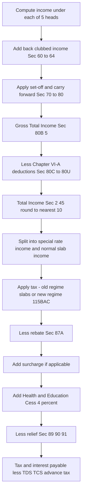
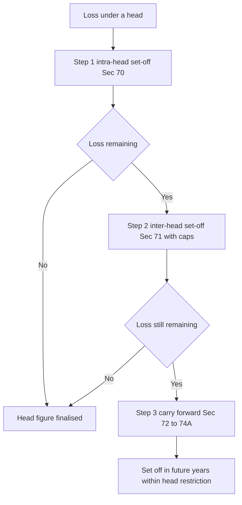

# Chapter 12 — Computation of Total Income & Tax Liability

> **Rates / limits / regime flag:** Slab rates, the default status of the new regime (Sec 115BAC), the rebate ceiling under Sec 87A, surcharge thresholds and caps, and even the LTCG rate under Sec 112A have all been repeatedly amended by recent Finance Acts. This chapter fixes the **sequence and the logic** — which never changes — and treats the numbers as *plug-in values*. **Always verify the exact slab rates, the 87A rebate limit, surcharge slabs and the applicable Assessment Year against current ICAI study material for your attempt.** Figures used here reflect the widely examined **AY 2025-26** position; confirm before your sitting.

---

## 1. The Problem — Five separate streams, one taxpayer, one tax

Every earlier chapter taught you to compute income under *one* head in isolation. A salaried consultant might simultaneously draw a salary, rent out a flat, trade in shares, run a small proprietary side-business, and earn bank interest. By the time you finish Chapters 3 to 6 you can compute each of these five figures perfectly — but the Income-tax Act does **not** tax a person head-by-head. It taxes a *person* on a *single* number called **Total Income**.

So a real problem appears the moment you have more than one source:

**Problem 1 — Heads must be combined, but not naively.** You cannot simply add five positive numbers. What if the house property shows a *loss* (interest on housing loan exceeds rent)? What if the business made a loss? Losses in one head may or may not be allowed to reduce income of another head, and the rules differ by head. A wrong set-off produces the wrong Total Income and the wrong tax.

**Problem 2 — Some income isn't really the taxpayer's — it was diverted.** A person can try to shrink his own income by parking assets in a spouse's or minor child's name. The law must *claw that income back* (clubbing) **before** it lets losses and deductions apply, or the whole edifice can be gamed.

**Problem 3 — Not all income is taxed at the same rate.** Long-term capital gains, short-term gains on listed shares, and lottery winnings each carry their **own** special rate. If you dumped them into the slab system, you would either over-tax or under-tax them. So Total Income must be *split* into "special-rate income" and "normal-rate income" before tax is applied.

**Problem 4 — Deductions, rebates, surcharge and cess each attach at a different stage.** Chapter VI-A deductions come off *before* Total Income; the 87A rebate comes off the *tax*; surcharge is a percentage *of tax*; cess sits *on top of tax-plus-surcharge*. Apply them in the wrong order and every downstream figure is wrong.

The single skill this chapter builds is **assembly** — taking five verified head-figures and driving them through a **fixed pipeline** to arrive at tax payable. In the exam this is the "full computation" question, and it is where marks are won or lost not on knowing a section, but on **doing the steps in the right order**.

---

## 2. The Core Idea

> **Total Income is built bottom-up in a strict, non-negotiable order — aggregate the five heads, claw back clubbed income, apply inter-head set-off and carry-forward, arrive at Gross Total Income, subtract Chapter VI-A deductions to get Total Income, then split it into special-rate and slab-rate portions, apply the chosen regime's rates, and finally layer rebate → surcharge → cess → relief to reach the tax actually payable.**

The order is not a convention — it is *logically forced*. Each step consumes the output of the previous one and cannot run before it:

1. You cannot set off a loss until you know each head's figure (so **aggregation** precedes **set-off**).
2. You cannot set off *your* losses against income that was never truly yours (so **clubbing** precedes **set-off**).
3. Chapter VI-A deductions are capped at Gross Total Income and cannot be claimed against most special-rate incomes (so **GTI** must exist first, and **special incomes** must be identified).
4. A rebate is a discount *on tax*, so **tax** must be computed before **rebate**; surcharge is a levy on high **tax**, so it follows; cess funds education and health *on the whole tax bill*, so it sits last but one; relief for double-taxed or bunched income is the final adjustment.

Memorise the pipeline as a chant: **Heads → Club → Set-off → GTI → VI-A → TI → Rate → Rebate → Surcharge → Cess → Relief → Tax Payable → less prepaid taxes.** Everything else in this chapter is that chant, expanded.


*Figure 1 — The master computation pipeline. Every full-computation question is a walk down this single ladder.*

---

## 3. Why It's Built This Way — the design logic behind each stage

Before the sections, understand *why* each rung exists. Every rule below is one of these design choices in disguise.

| Stage | The problem it solves | How the Act implements it |
|---|---|---|
| Five separate heads (Sec 14) | Different incomes need different rules | Salary, House Property, PGBP, Capital Gains, Other Sources |
| Clubbing (Sec 60-64) | Income-splitting within a family | Deemed inclusion in transferor's income |
| Set-off (Sec 70-71) | Loss in one activity is a real economic loss | Intra-head then inter-head adjustment |
| Carry-forward (Sec 72-74A) | A loss too big for this year is still real | Carried to future years with head restrictions |
| GTI cap on VI-A (Sec 80A) | You cannot deduct more than you earned | VI-A deductions ≤ GTI, cannot create a loss |
| Special rates (111A, 112, 112A, 115BB) | Some income is not "ordinary" | Taxed at flat rates, outside the slab |
| Rebate 87A | Small taxpayers should pay nothing | Rebate wipes out tax below a threshold |
| Surcharge | The very rich should pay proportionately more | Percentage add-on above income thresholds |
| Cess | Earmarked funding for health and education | 4 percent on tax + surcharge |
| Relief 89 / 90 / 91 | Bunching of arrears and double taxation are unjust | Spread-back and foreign-tax credit |

The elegance is that **the pipeline is a filter that gets progressively narrower and more precise.** Early stages decide *how much* is income; middle stages decide *how much is taxable*; late stages decide *how much tax*; the last stage decides *how much cash to send the government*. Each stage answers exactly one question, and answers it completely, before handing off.

---

## 4. Full Technical Content

### 4.1 Stage 1 — Aggregate the five heads (Sec 14)

Section 14 classifies **all** income into five heads. You compute each head's net figure using its own chapter's rules, then list them:

| Head | Governing sections | Note |
|---|---|---|
| Salaries | 15-17 | After standard deduction |
| Income from House Property | 22-27 | After 30 percent standard deduction and interest |
| Profits & Gains of Business or Profession | 28-44 | After all allowances / disallowances |
| Capital Gains | 45-55A | Split into STCG and LTCG, some at special rates |
| Income from Other Sources | 56-59 | The residuary head |

At this stage a head can be **negative** (a loss) — except that certain heads (e.g., salary) cannot be negative, and long-term capital *gain* cannot be reduced by a short-term loss beyond the set-off rules. Keep each head's figure separate; do not net across heads yet.

### 4.2 Stage 2 — Clubbing of income (Sec 60-64)

**Why first:** If a taxpayer transfers *income* without transferring the *asset*, or diverts income to a spouse / minor / son's wife, the Act treats that income as still belonging to the transferor. This must happen **before** set-off, because otherwise a taxpayer could shed income to a relative and then set his own losses against a now-artificially-low income.

Key provisions (each detailed in the clubbing chapter):
- **Sec 60** — transfer of income without transfer of asset → clubbed.
- **Sec 64(1)(ii)/(iv)/(vi)/(vii)** — income to spouse / son's wife from transferred assets → clubbed.
- **Sec 64(1A)** — minor child's income clubbed with the parent whose income is higher, with an exemption of **₹1,500 per child** (Sec 10(32)).
- **Sec 64(2)** — income of HUF from converted individual property.

The clubbed amount is added to the *relevant head* of the transferor (e.g., clubbed interest goes under Other Sources).

### 4.3 Stage 3 — Set-off and carry-forward (Sec 70-80)

This is the most error-prone stage. Two levels:

**Intra-head set-off (Sec 70):** A loss under a head is first set off against income under the *same* head. Exceptions that examiners love:
- **Speculation business loss** — only against speculation profit.
- **Long-term capital loss (LTCL)** — only against **long-term** capital gain (never STCG).
- **Short-term capital loss (STCL)** — against STCG **or** LTCG.
- **Loss from owning/maintaining race horses** — only against same.

**Inter-head set-off (Sec 71):** A loss remaining under one head is set off against income under *another* head, **with restrictions**:
- **House property loss** — set off against any head but **capped at ₹2,00,000** per year against other heads (Sec 71(3A)); the balance is carried forward.
- **Capital gains loss** — *cannot* be set off against any other head at all.
- **Business loss** — cannot be set off against **salary**.
- **Casual income (lottery etc.)** — no loss can be set off against it, and it cannot be reduced by any deduction.

**Carry-forward (Sec 72-74A):** What survives set-off is carried forward, each with its own life and its own restriction on *what it can later be set off against*:

| Loss type | Section | Carry-forward period | Can be set off in future only against |
|---|---|---|---|
| House property loss | 71B | 8 years | House property income |
| Non-speculation business loss | 72 | 8 years | Business income (any business) |
| Speculation loss | 73 | 4 years | Speculation income |
| Specified business (35AD) loss | 73A | Indefinite | Specified business income |
| Short-term capital loss | 74 | 8 years | STCG or LTCG |
| Long-term capital loss | 74 | 8 years | LTCG only |
| Race-horse loss | 74A | 4 years | Race-horse income |
| Unabsorbed depreciation | 32(2) | Indefinite | Any income except salary |

> **Memory hook:** *"Business and capital losses need the return filed on time (Sec 139(1)) to be carried forward; house property loss and unabsorbed depreciation do not."* This is Sec 80's condition — file late and you forfeit carry-forward of business/capital/speculation/race-horse losses.

The output of this stage — each head's figure after all legitimate set-offs — sums to **Gross Total Income**.


*Figure 2 — The three-step waterfall for any loss: same head first, other heads next subject to caps, then carry forward.*

### 4.4 Stage 4 — Gross Total Income (Sec 80B(5))

**GTI = sum of the five heads after clubbing and set-off, before Chapter VI-A deductions.** This definition matters because Chapter VI-A caps most deductions at GTI — you cannot deduct your way into a loss.

### 4.5 Stage 5 — Chapter VI-A deductions (Sec 80C to 80U)

**Why after GTI, not within a head:** These deductions are *policy incentives* (save, insure, donate, repay education loans) granted to the *person*, not features of any income stream. So they sit after all heads are combined.

**Two golden restrictions (Sec 80A):**
1. Total Chapter VI-A deductions **cannot exceed GTI** — they can reduce Total Income to nil but never below.
2. Deductions under this Chapter are **not allowed against**: LTCG (112/112A), STCG on listed shares (111A), and casual income (115BB). So you must **first remove these special-rate incomes from GTI** and grant VI-A deductions only against the *balance*.

The most examined deductions (verify limits for your AY):

| Section | For | Ceiling / rule |
|---|---|---|
| 80C | LIC, PPF, ELSS, principal on housing loan, tuition fees, 5-yr FD | ₹1,50,000 (combined with 80CCC & 80CCD(1)) |
| 80CCD(1B) | Additional NPS self-contribution | ₹50,000 (over and above 80C) |
| 80CCD(2) | Employer's NPS contribution | 10 percent of salary (14 percent for govt / new regime) |
| 80D | Health insurance premium | ₹25,000 self/family; ₹50,000 if senior; +₹50,000 for senior parents |
| 80DD / 80DDB / 80U | Disabled dependant / medical treatment / self-disability | Fixed amounts |
| 80E | Interest on education loan | No cap, 8 years |
| 80EEA | Interest on affordable housing loan | ₹1,50,000 (subject to conditions) |
| 80G | Donations | 50 percent or 100 percent, some with 10 percent-of-adjusted-GTI cap |
| 80GG | Rent paid (no HRA) | Least of ₹5,000 p.m. / 25 percent of AGTI / rent minus 10 percent AGTI |
| 80TTA / 80TTB | Savings interest / senior citizen interest | ₹10,000 / ₹50,000 |

> **Critical trap:** Under the **default new regime (Sec 115BAC)**, almost all Chapter VI-A deductions are **not available** — the only survivors are **80CCD(2)** (employer NPS) and **80CCH** (Agniveer). Standard deduction from salary and family pension deduction *are* allowed. So the regime choice at Stage 6 actually decides how much of Stage 5 you may claim. In practice you compute Stage 5 conditionally on the regime.

### 4.6 Stage 6 — Total Income (Sec 2(45)) and rounding (Sec 288A)

**Total Income = GTI − Chapter VI-A deductions.** Round off to the nearest **₹10** (Sec 288A). This is the figure on which tax is charged.

### 4.7 Stage 7 — Split Total Income and apply rates

Total Income is now split:
- **Special-rate income** — taxed at flat rates regardless of slab.
- **Normal income (balance)** — taxed at slab / regime rates.

**Special rates (verify for AY):**

| Income | Section | Rate |
|---|---|---|
| STCG on listed equity (STT paid) | 111A | 15 percent (20 percent for transfers on/after 23-Jul-2024) |
| LTCG on listed equity above threshold | 112A | 10 percent above ₹1,00,000 (12.5 percent above ₹1,25,000 for transfers on/after 23-Jul-2024) |
| Other LTCG | 112 | 20 percent with indexation / 12.5 percent without (post-23-Jul-2024) |
| Winnings — lottery, betting, games | 115BB / 115BBJ | 30 percent flat, no deduction, no basic-exemption benefit |

> **Basic-exemption absorption:** A **resident individual/HUF** may use the *unexhausted* basic exemption limit against **111A and 112/112A** income (but never against 115BB casual income). Non-residents cannot.

**Slab rates on the balance.** The taxpayer chooses (or defaults into) one of two regimes.

**New regime (Sec 115BAC) — the DEFAULT** since AY 2024-25. To *opt out* into the old regime, a person with business income must file **Form 10-IEA**; a salaried person without business income may simply choose each year in the return.

*New regime slabs (AY 2025-26 — verify):*

| Total Income slab | Rate |
|---|---|
| Up to ₹3,00,000 | Nil |
| ₹3,00,001 – ₹7,00,000 | 5 percent |
| ₹7,00,001 – ₹10,00,000 | 10 percent |
| ₹10,00,001 – ₹12,00,000 | 15 percent |
| ₹12,00,001 – ₹15,00,000 | 20 percent |
| Above ₹15,00,000 | 30 percent |

*Old regime slabs (individual < 60 yrs):*

| Total Income slab | Rate |
|---|---|
| Up to ₹2,50,000 | Nil |
| ₹2,50,001 – ₹5,00,000 | 5 percent |
| ₹5,00,001 – ₹10,00,000 | 20 percent |
| Above ₹10,00,000 | 30 percent |

Basic exemption is **₹3,00,000** for resident seniors (60-80) and **₹5,00,000** for super-seniors (80+) under the *old* regime only; the new regime gives everyone the same ₹3,00,000.

### 4.8 Stage 8 — Rebate under Sec 87A

**Why:** A relief so that small taxpayers pay **zero**. It is a rebate *on tax*, available only to a **resident individual**.

| Regime | Total Income ceiling | Maximum rebate |
|---|---|---|
| Old | ₹5,00,000 | ₹12,500 |
| New (115BAC) | ₹7,00,000 | ₹25,000 |

**Marginal relief (new regime):** Just above ₹7,00,000, the tax must not exceed the income in excess of ₹7,00,000 — so a person earning ₹7,10,000 does not pay ₹25,500 tax on ₹10,000 of extra income. Rebate is **not** available against tax on **112A LTCG** (and, under some readings, other special incomes) — verify current position.

### 4.9 Stage 9 — Surcharge

**Why:** Progressivity beyond the top slab — the very rich pay an extra percentage *of their tax*.

*Surcharge rates (verify):*

| Total Income | Surcharge (old regime) | Surcharge (new regime) |
|---|---|---|
| ₹50 lakh – ₹1 crore | 10 percent | 10 percent |
| ₹1 crore – ₹2 crore | 15 percent | 15 percent |
| ₹2 crore – ₹5 crore | 25 percent | 25 percent |
| Above ₹5 crore | 37 percent | **25 percent (capped)** |

**Two crucial caps:**
1. Surcharge on tax attributable to **111A, 112, 112A and dividend** income is **capped at 15 percent**, even if total income exceeds ₹2 crore.
2. **Marginal relief** applies at every threshold: the increase in (tax + surcharge) cannot exceed the increase in income above the threshold.

### 4.10 Stage 10 — Health & Education Cess

**Flat 4 percent** on (tax after rebate + surcharge). It funds health and education and is **not** subject to any exemption.

### 4.11 Stage 11 — Relief (Sec 89, 90, 91) and AMT

- **Sec 89(1)** — relief for **salary arrears / advance** received in a lump sum, spreading the bunched amount back over the years it related to (Form 10E must be filed). This directly cures the "bunching" injustice.
- **Sec 90 / 90A** — foreign tax credit where a **DTAA** exists.
- **Sec 91** — unilateral relief where no DTAA exists.
- **AMT (Sec 115JC)** — Alternate Minimum Tax at 18.5 percent (plus surcharge/cess) of *adjusted total income* applies to non-corporate taxpayers claiming certain deductions; the higher of normal tax and AMT is payable, with AMT credit carried forward. (Largely irrelevant if the new regime is chosen.)

### 4.12 Stage 12 — Tax payable and rounding (Sec 288B)

From tax-plus-cess-minus-relief, subtract **prepaid taxes**: TDS, TCS, advance tax and self-assessment tax. Add **interest under Sec 234A/B/C** for defaults. The final tax payable (or refund) is **rounded to the nearest ₹10** (Sec 288B).

---

## 5. Worked Examples

### Example 1 — The clean single-regime computation (easy)

*Mr. A, resident, age 40, AY 2025-26, opts for the OLD regime. Salary income ₹8,00,000 (after standard deduction). Bank savings interest ₹12,000. He invested ₹1,50,000 in PPF (80C) and paid ₹20,000 health insurance (80D).*

| Step | ₹ |
|---|---|
| Salaries | 8,00,000 |
| Income from Other Sources (interest) | 12,000 |
| **Gross Total Income** | **8,12,000** |
| Less 80C (PPF) | (1,50,000) |
| Less 80D | (20,000) |
| Less 80TTA (savings interest, max ₹10,000) | (10,000) |
| **Total Income** | **6,32,000** |

*Tax (old slabs):* 0–2.5L nil; 2.5–5L @5% = ₹12,500; 5L–6.32L @20% = ₹26,400. **Tax = ₹38,900.**
87A? Total income > ₹5L → no rebate.
Cess @4% = ₹1,556. **Tax payable = ₹40,456 → ₹40,460 (rounded).**

*Reconciliation:* 12,500 + 26,400 = 38,900; + 1,556 cess = 40,456; rounded to 40,460. ✓

### Example 2 — Set-off, special-rate income, and the VI-A cap (medium)

*Ms. B, resident, age 45, AY 2025-26, OLD regime. Business income ₹6,00,000. House property LOSS ₹2,80,000. LTCG on sale of land (Sec 112, indexed) ₹3,00,000. STCG on listed shares (111A) ₹1,00,000. She paid ₹1,50,000 into ELSS (80C).*

**Stage 3 — set-off:** House property loss ₹2,80,000. Inter-head set-off against other heads is **capped at ₹2,00,000** (Sec 71(3A)). Set off ₹2,00,000 against business income → business income becomes ₹4,00,000. Balance HP loss ₹80,000 is **carried forward** (Sec 71B).

*Can HP loss be set against LTCG/STCG?* The ₹2,00,000 cap is the overall inter-head limit; here we absorbed it against business income. We will **not** touch the special-rate incomes (better to preserve them for their own rates and the basic-exemption absorption). GTI is built as follows:

| Head | ₹ |
|---|---|
| Business income (after ₹2L HP set-off) | 4,00,000 |
| LTCG (Sec 112) | 3,00,000 |
| STCG (Sec 111A) | 1,00,000 |
| **Gross Total Income** | **8,00,000** |

**Stage 5 — VI-A:** 80C ELSS ₹1,50,000. But it **cannot** be claimed against LTCG (112) or STCG (111A). So 80C is set only against the **normal income** of ₹4,00,000 → normal income becomes ₹2,50,000.

| | ₹ |
|---|---|
| Normal income after 80C | 2,50,000 |
| LTCG (112) | 3,00,000 |
| STCG (111A) | 1,00,000 |
| **Total Income** | **6,50,000** |

**Stage 7 — tax with basic-exemption absorption (resident):**
- Normal income ₹2,50,000 falls exactly at the ₹2,50,000 exemption limit → tax nil, and the basic exemption is **fully used up** by normal income, so **nothing is left** to shelter the special incomes.
- STCG 111A: ₹1,00,000 @ 15% = ₹15,000.
- LTCG 112: ₹3,00,000 @ 20% = ₹60,000.
- **Tax before rebate = ₹75,000.**

**Stage 8 — 87A:** Total income ₹6,50,000 > ₹5,00,000 (old regime) → no rebate.
**Cess @4%** on ₹75,000 = ₹3,000. **Tax payable = ₹78,000.**

*Reconciliation:* 15,000 + 60,000 = 75,000; cess 3,000; total 78,000. Carried-forward HP loss ₹80,000 noted for future. ✓

*Teaching point:* Had the normal income been *below* ₹2,50,000, the unused exemption would have been absorbed **against the STCG first** (lower-rate benefit is preserved for LTCG), reducing tax further. This is the classic examiner variation.

### Example 3 — Full multi-head computation, both regimes compared (exam-hard)

*Mr. C, resident, age 52, AY 2025-26. Compute Total Income and tax under BOTH regimes and advise.*

- Salary: Basic + DA ₹12,00,000; HRA received ₹2,40,000 (exempt u/s 10(13A) = ₹1,80,000 under old regime); professional tax ₹2,500.
- House property (self-occupied): interest on housing loan ₹2,10,000.
- Business income: ₹3,00,000.
- LTCG on listed shares (112A, STT paid), transfer in June 2024: ₹1,60,000.
- Interest on savings account: ₹18,000; interest on FD: ₹40,000.
- Investments: 80C ₹1,50,000; 80D ₹25,000; 80CCD(1B) NPS ₹50,000; employer NPS contribution 80CCD(2) ₹1,20,000 (10% of salary).

**Step A — Salary figure.**

| | Old regime ₹ | New regime ₹ |
|---|---|---|
| Basic + DA | 12,00,000 | 12,00,000 |
| HRA received | 2,40,000 | 2,40,000 |
| Less HRA exemption 10(13A) | (1,80,000) | (0) — not available |
| Gross salary | 12,60,000 | 14,40,000 |
| Less standard deduction | (50,000) | (75,000) |
| Less professional tax | (2,500) | (0) — not available |
| **Salary income** | **12,07,500** | **13,65,000** |

*(New regime: standard deduction ₹75,000 for AY 2025-26; HRA exemption and professional tax not allowed. Verify figures.)*

**Step B — House property (self-occupied).** Interest deduction capped at ₹2,00,000 (old regime). Under new regime, self-occupied interest is **not** allowed.
- Old: House property loss = **(₹2,00,000)**.
- New: **Nil**.

**Step C — assemble GTI.**

| Head | Old ₹ | New ₹ |
|---|---|---|
| Salary | 12,07,500 | 13,65,000 |
| House property | (2,00,000) | 0 |
| Business | 3,00,000 | 3,00,000 |
| LTCG 112A | 1,60,000 | 1,60,000 |
| Other sources (18,000 + 40,000) | 58,000 | 58,000 |
| **Gross Total Income** | **15,25,500** | **18,83,000** |

*(HP loss of ₹2,00,000 is within the ₹2,00,000 inter-head cap, so fully set off in the old regime.)*

**Step D — Chapter VI-A.** Deductions cannot be set against LTCG (112A). Separate the LTCG.

*Old regime:*
| | ₹ |
|---|---|
| Income other than LTCG (15,25,500 − 1,60,000) | 13,65,500 |
| Less 80C | (1,50,000) |
| Less 80CCD(1B) | (50,000) |
| Less 80D | (25,000) |
| Less 80CCD(2) employer NPS | (1,20,000) |
| Less 80TTA (savings, max 10,000) | (10,000) |
| Net normal income | 10,10,500 |
| Add LTCG 112A | 1,60,000 |
| **Total Income** | **11,70,500** |

*New regime:* only **80CCD(2)** survives.
| | ₹ |
|---|---|
| Income other than LTCG (18,83,000 − 1,60,000) | 17,23,000 |
| Less 80CCD(2) | (1,20,000) |
| Net normal income | 16,03,000 |
| Add LTCG 112A | 1,60,000 |
| **Total Income** | **17,63,000** |

**Step E — tax on Total Income.**

*Old regime:* Normal income ₹10,10,500.
- 0–2.5L: nil
- 2.5–5L @5% = 12,500
- 5–10L @20% = 1,00,000
- 10,00,000–10,10,500 @30% = 3,150
- Tax on normal = **1,15,650**
- LTCG 112A: gain ₹1,60,000; first ₹1,00,000 exempt; balance ₹60,000 @10% = **6,000** (transfer before 23-Jul-2024, so 10% and ₹1,00,000 threshold — verify).
- Tax before rebate = 1,21,650. 87A? TI > ₹5L → no.
- Surcharge? TI < ₹50L → none.
- Cess @4% = 4,866. **Old-regime tax = ₹1,26,516 → ₹1,26,520.**

*New regime:* Normal income ₹16,03,000.
- 0–3L: nil
- 3–7L @5% = 20,000
- 7–10L @10% = 30,000
- 10–12L @15% = 30,000
- 12–15L @20% = 60,000
- 15,00,000–16,03,000 @30% = 30,900
- Tax on normal = **1,70,900**
- LTCG 112A: ₹60,000 @10% = **6,000**.
- Tax before rebate = 1,76,900. 87A? TI > ₹7L → no. Surcharge? none.
- Cess @4% = 7,076. **New-regime tax = ₹1,83,976 → ₹1,83,980.**

**Step F — advise.** Old regime tax ₹1,26,520 vs new regime ₹1,83,980. **The old regime saves ₹57,460**, driven by the large HRA exemption, self-occupied interest, and ₹2,00,000+ of Chapter VI-A deductions. Mr. C should **opt out into the old regime** (file the return accordingly).

*Reconciliation check (old):* 12,500 + 1,00,000 + 3,150 = 1,15,650 normal tax; + 6,000 LTCG = 1,21,650; + cess 4,866 = 1,26,516 → 1,26,520. ✓

*Teaching point:* The regime decision is *not* a slab comparison — it is a comparison of **entire computations**, because the regime changes which deductions and exemptions exist. Always compute both fully.

---

## 6. Computation Format (the master template)

Reproduce this skeleton in every full-computation answer — examiners award method marks for the structure itself.

```
COMPUTATION OF TOTAL INCOME OF <Name> FOR AY <____>            Regime: Old / New

I.   Income from Salaries                                             xxx
II.  Income from House Property                                       xxx
III. Profits & Gains of Business or Profession                       xxx
IV.  Capital Gains  (show STCG-111A, LTCG-112A, LTCG-112 separately) xxx
V.   Income from Other Sources                                       xxx
     -----------------------------------------------------------------
     Add: Income clubbed u/s 60-64                                   xxx
     Less/Adjust: Inter-head set-off u/s 71  (HP loss cap 2,00,000)  xxx
     -----------------------------------------------------------------
     GROSS TOTAL INCOME (Sec 80B(5))                                 xxx
     Less: Deductions under Chapter VI-A (Sec 80C-80U)              (xxx)
           [not against 111A/112/112A/115BB incomes]
     -----------------------------------------------------------------
     TOTAL INCOME (Sec 2(45))  [round off to nearest ₹10, Sec 288A]  xxx
     =================================================================

COMPUTATION OF TAX LIABILITY
     Tax on special-rate income (111A @15/20%; 112A; 112; 115BB @30%) xxx
     Tax on balance at slab / regime rates                           xxx
     [resident: absorb unused basic exemption vs 111A then 112/112A]
     -----------------------------------------------------------------
     Tax before rebate                                               xxx
     Less: Rebate u/s 87A                                           (xxx)
     Add:  Surcharge (with 15% cap on 111A/112/112A; marginal relief) xxx
     -----------------------------------------------------------------
     Add:  Health & Education Cess @ 4%                              xxx
     Less: Relief u/s 89 / 90 / 91                                  (xxx)
     -----------------------------------------------------------------
     TAX AND INTEREST PAYABLE                                        xxx
     Less: TDS / TCS / Advance tax / Self-assessment tax            (xxx)
     Add:  Interest u/s 234A / 234B / 234C                           xxx
     -----------------------------------------------------------------
     NET TAX PAYABLE / (REFUND) [round off to nearest ₹10, Sec 288B] xxx
     =================================================================
```

---

## 7. Connections

- **All head chapters (3-6, 11):** their output figures are the *inputs* to Stage 1. This chapter is where they converge.
- **Clubbing chapter (Sec 60-64):** feeds Stage 2; a clubbing error propagates through the entire pipeline.
- **Set-off & carry-forward chapter (Sec 70-80):** is Stage 3; the return-filing deadline (Sec 139(1)) links to carry-forward via Sec 80.
- **Deductions chapter (Chapter VI-A):** is Stage 5; the regime choice (Sec 115BAC) toggles it on/off.
- **Basic Concepts (Chapter 1):** residential status decides basic-exemption absorption and 87A eligibility; the definition of "person" and "assessment year" frame the whole exercise.
- **Advance tax / TDS / Return filing (later chapters):** Stage 12's prepaid-tax subtraction and Sec 234 interest connect forward.
- **Capital Gains (Chapter 6):** supplies the special-rate incomes (111A/112/112A) that must be carved out at Stages 5 and 7.

---

## 8. Traps & Examiner Tricks

1. **Netting heads before set-off.** Students add a house-property loss straight into salary without the **₹2,00,000 cap** (Sec 71(3A)). Always apply intra-head first, then capped inter-head, then carry forward.
2. **Claiming VI-A against special incomes.** 80C etc. **cannot** reduce LTCG (112/112A), STCG (111A) or casual income (115BB). Carve these out *before* deductions.
3. **Forgetting basic-exemption absorption order.** For residents, unused exemption is used against **STCG 111A first**, then LTCG — never against casual income. Non-residents get **no** absorption.
4. **Applying 87A rebate on LTCG tax.** Rebate does not shelter 112A LTCG tax (verify current stance). Also, 87A is only for **residents**.
5. **Wrong regime deductions.** Under the **default new regime**, HRA, LTA, self-occupied interest, professional tax and almost all VI-A deductions vanish; only 80CCD(2)/80CCH and standard deduction survive. Do not carry old-regime deductions into a new-regime computation.
6. **Ignoring surcharge caps and marginal relief.** The 15 percent cap on 111A/112/112A surcharge and marginal relief at every threshold are favourite adjustments.
7. **Cess base error.** Cess is 4 percent of **(tax after rebate + surcharge)** — not on tax before surcharge.
8. **Rounding at the wrong place.** Round **Total Income** (288A) and **net tax payable** (288B) to the nearest ₹10 — not every intermediate figure.
9. **Carry-forward without timely return.** Business, speculation, capital and race-horse losses need the return filed by the Sec 139(1) due date (Sec 80); HP loss and unabsorbed depreciation do not.
10. **Salary can never be negative,** and **business loss cannot be set off against salary** (Sec 71(2A)).

---

## 9. First-Principles Recap

Strip away the sections and this is the whole chapter in five sentences:

1. A person is taxed on **one number**, so five head-figures must be **assembled**, not just listed.
2. Income that was **diverted** to family is clawed back first (clubbing), so that losses and deductions apply to the taxpayer's *true* income.
3. A **loss** is a real economic fact, so the law lets it offset income — but only within rules that stop abuse, then carries the rest forward.
4. Because some income is **not ordinary** (long gains, listed-share gains, windfalls), it is carved out and taxed at its **own rate**, outside the slab and outside most deductions.
5. Tax itself is then **discounted** (rebate), **surcharged** (for the rich), **cessed** (for health/education) and **relieved** (for bunching and double taxation) — in that fixed order — before prepaid taxes are subtracted to reach the cheque you write.

If you can re-derive the pipeline from these five ideas, you never need to memorise the order — it *is* the logic.

---

## 10. Quick-Revision Sheet

**The pipeline (chant it):** Heads → Club → Set-off → **GTI** → VI-A → **TI** → Split rates → Rebate → Surcharge → Cess → Relief → **Tax payable** → less prepaid.

| Stage | Section | One-line rule |
|---|---|---|
| 5 heads | 14 | Compute each head net |
| Clubbing | 60-64 | Add diverted income back; minor exemption ₹1,500 (Sec 10(32)) |
| Set-off | 70-71 | Intra-head → inter-head; HP loss inter-head cap ₹2,00,000 |
| Carry-forward | 72-74A | Each loss has its own life & restriction; needs timely return (Sec 80) |
| GTI | 80B(5) | Sum of heads after set-off |
| VI-A | 80C-80U | ≤ GTI; not against 111A/112/112A/115BB |
| Total Income | 2(45), 288A | GTI − VI-A; round to ₹10 |

**Special rates (verify AY):** 111A STCG 15%/20% · 112A LTCG 10% over ₹1L (12.5% over ₹1.25L post-23-Jul-24) · 112 LTCG 20% indexed / 12.5% · 115BB casual 30%.

**Slabs (AY 2025-26 — verify):**
- *New (default):* 0–3L nil; 3–7L 5%; 7–10L 10%; 10–12L 15%; 12–15L 20%; >15L 30%.
- *Old:* 0–2.5L nil; 2.5–5L 5%; 5–10L 20%; >10L 30%. (Seniors 3L; super-seniors 5L.)

**87A rebate:** Old — TI ≤ ₹5L → up to ₹12,500. New — TI ≤ ₹7L → up to ₹25,000 (+ marginal relief). Residents only.

**Surcharge:** 10% (>50L) · 15% (>1cr) · 25% (>2cr) · 37% (>5cr, but new regime caps at 25%). Cap 15% on 111A/112/112A/dividend. Marginal relief everywhere.

**Cess:** 4% on (tax after rebate + surcharge).

**Relief:** 89 (arrears, Form 10E) · 90/90A (DTAA) · 91 (no DTAA). **AMT** 115JC @18.5% for certain deduction-claimers.

**Prepaid & interest:** less TDS/TCS/advance/self-assessment; add 234A/B/C; round net to ₹10 (288B).

> **Final flag:** Every rate, ceiling, surcharge slab and the 87A limit here is a *plug-in value* subject to Finance Act changes. The **sequence** is permanent; the **numbers** are not. Confirm both against current ICAI material for your Assessment Year.
