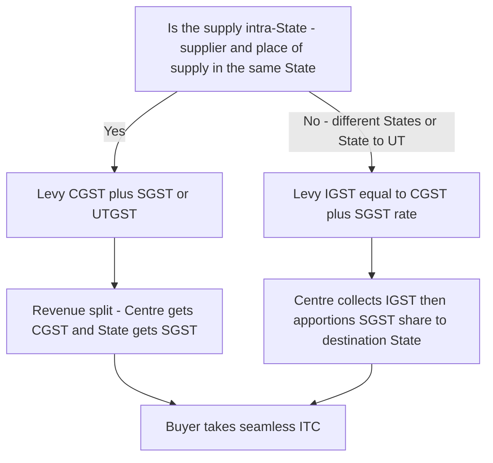
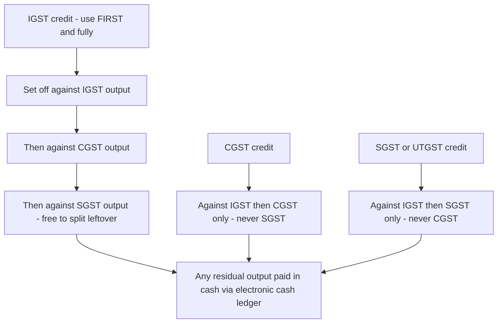
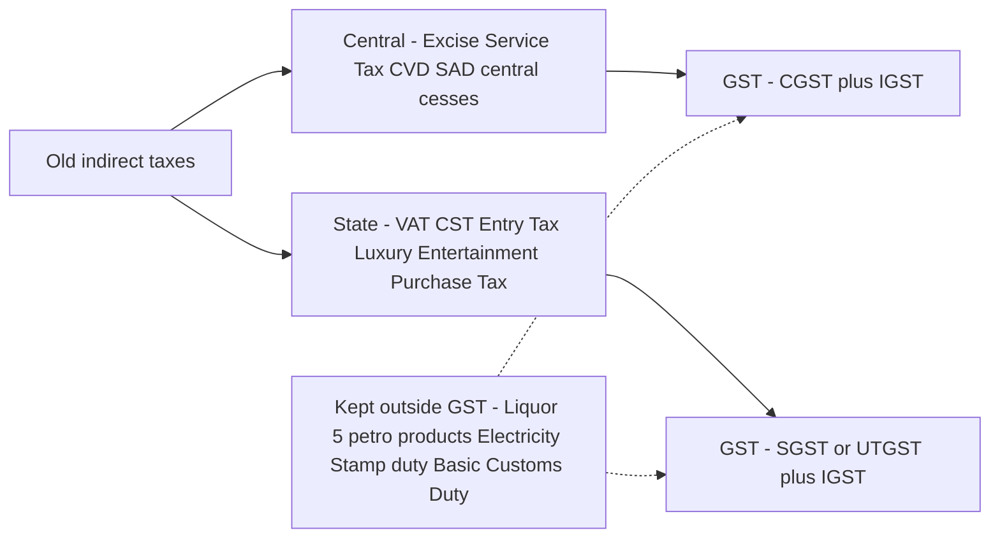

<!-- v2-deep -->

# Chapter 13 — GST: Concept & Framework

> "Verify current rates, thresholds and the latest amendments in the ICAI Study Material and RTP for your specific attempt. This chapter teaches the permanent logic; the numbers move."

---

## 1. The Problem — Why the Old System Had to Die

Before 1 July 2017, India did not have "an" indirect tax. It had a *web* of them, and the web had three structural diseases. To understand GST you must first *feel* the pain it cures — because every single rule in the GST law is a scar tissue over one of these three wounds.

### Disease 1 — Cascading (tax on tax)

Under the old regime, taxes were charged on a base that already *included* an earlier tax. The classic villain was Central Excise + VAT.

Excise duty was levied by the Centre on **manufacture**. VAT was levied by the State on **sale**. But VAT was charged on the value *inclusive of excise* — so the State taxed the Centre's tax. Then at the next stage of the supply chain, the trader paid tax again on a value that embedded both. There was no mechanism to take **credit of Central Excise against State VAT** — they were levied by different governments under different laws, and credit never crossed that boundary.

Let us make it bite with numbers. Take a good with a factory value of ₹1,000. Suppose Excise is 12.5% and VAT is 14.5%, and the manufacturer sells to a wholesaler, who adds ₹200 margin and sells to a retailer.

| Stage | Base | Excise 12.5% | VAT 14.5% (on base + excise) | Invoice price |
|---|---|---|---|---|
| Manufacturer | 1,000 | 125 | 163.13 (on 1,125) | 1,288.13 |
| Wholesaler (adds ₹200) | 1,488.13 + 200 = wait | — | 14.5% on full price again | — |

Notice the trap already: VAT of ₹163.13 was charged on ₹1,125, i.e. **VAT was charged on the ₹125 of excise**. That ₹18.13 is pure tax-on-tax. At the wholesaler stage, VAT credit of the earlier VAT was available (within a State), but the **excise embedded in the price was never creditable to the trader** — it sat in the cost and got re-taxed by VAT at every subsequent sale. Multiply this across a five-stage chain and the effective tax rate on the consumer balloons far above the nominal rates. The consumer pays tax on tax on tax.

**Why couldn't the old law just allow the credit?** Because credit is only possible when the *same authority* levies both the input tax and the output tax under the *same statute*. Excise was a Union List entry (Entry 84); VAT/sales tax was a State List entry (Entry 54). A State legislature had no constitutional power to grant a rebate of a *Central* tax, and Parliament had no power to force States to do so. The cascade was therefore not a drafting oversight — it was a **structural consequence of divided taxing power**. That is precisely why curing the cascade required a *constitutional* amendment (Section 3), not merely a better VAT law.

> **Memory hook — "Cascade = waterfall of taxes, each pool taxing the pool above it."**

### Disease 2 — Fragmented, non-fungible credit (credit silos)

Even where credit *existed*, it lived in sealed silos:

- **CENVAT credit** (excise + service tax) — one pool, run by the Centre.
- **VAT credit** — a separate pool in each State, and it did not travel across State borders.
- Service tax could not be set off against VAT, and vice versa. A manufacturer who paid service tax on, say, an audit fee could not use it against his VAT liability on the goods he sold.

So a business accumulated **stranded credits** — genuine taxes paid that could never be used because the output tax belonged to a different silo or a different government. Stranded credit is a cost. Cost enters price. Price gets taxed again. The disease compounds Disease 1.

**A finer distinction the exam tests — the goods/services divide within CENVAT.** Even inside the single CENVAT pool, the pre-GST rules restricted how far a manufacturer could use service-tax credit and how far a service provider could use excise credit (definitions of "input", "input service" and "capital goods" were litigated endlessly). GST's answer is radical: it collapses the *goods vs services* distinction for **credit** purposes almost entirely — tax paid on *any* business input (goods or services) feeds one common electronic credit ledger. Remembering that GST unified credit across **both** the government divide *and* the goods/services divide is the deeper insight examiners reward over the shallow "GST removed cascading."

### Disease 3 — The inter-State barrier (CST and check-posts)

When goods moved *between* States, a special tax — **Central Sales Tax (CST)** — was levied by the origin State. CST was **non-creditable**: the buyer in the destination State could not claim credit of the CST paid. It was a pure, sticking cost on inter-State trade.

The consequence was economically absurd: it was cheaper to buy *within* your State than across a border, even if the out-of-State supplier was more efficient. India — a single political nation — was **not a single economic market**. Add the physical friction of State check-posts (trucks queuing for hours for entry-tax and octroi verification), and inter-State commerce carried a permanent tax-and-time penalty.

**The hidden distortion — warehouse geography.** Because CST stuck but a *stock transfer* to one's own branch (against Form F) did not attract CST, large companies built a warehouse in **every** State purely to convert inter-State sales into intra-State sales and dodge CST. Supply chains were designed around *tax lines*, not *logistics efficiency*. GST's e-way bill + IGST credit made this obsolete: a firm can now serve the country from one optimally located warehouse. When an examiner asks "how did GST improve ease of doing business", the *warehouse-consolidation* point scores higher than a generic "removed barriers."

> **The one-line indictment:** the old system taxed *production and sales* in silos, punished credit from crossing government boundaries, and put a tariff wall around every State. It raised prices, distorted where businesses located, and broke the national market.

---

## 2. The Core Idea — One Value-Added Tax on Consumption

GST is the cure, and the cure is a single sentence:

> **GST is a single, destination-based tax on the *value added* at each stage of supply, where tax paid on inputs is fully creditable against tax on outputs — so that the tax finally sticks only on the value consumed, and only in the State of consumption.**

Unpack the three load-bearing words.

**"Value added."** Each supplier pays tax on his full output, but *subtracts* (as Input Tax Credit) the tax already paid on his inputs. Net, he only funds the tax on the value *he* added. The tax does not pile on itself — the cascade is broken by design.

**"Destination-based / consumption tax."** GST is not a tax on manufacture (like excise) or on the origin sale (like CST). It is a tax that accrues to the jurisdiction where the goods or services are **finally consumed**. Production States do not hoard the revenue; consuming States earn it. This is why GST is called a *destination-based consumption tax*, and it is the reason IGST is engineered the way it is (Section 3 below).

**"Full seamless credit."** Credit must flow across the entire chain and — critically — across the goods/services divide and across the Centre/State divide, subject to the law's ordering rules. One fungible pool replaces the old silos.

Here is the anti-cascade mechanic on the same ₹1,000 good, now under GST at (say) 18%:

| Stage | Value added | Output GST 18% | ITC available | **Net GST paid to govt** |
|---|---|---|---|---|
| Manufacturer | 1,000 | 180 | 0 | 180 |
| Wholesaler (+200) | 200 | 216 (on 1,200) | 180 | 36 |
| Retailer (+300) | 300 | 270 (on 1,500) | 216 | 54 |
| **Total to govt** | | | | **270** |
| Consumer pays | 1,500 × 18% = **270** | | | |

Reconcile: net collections 180 + 36 + 54 = **270**, exactly 18% of the final consumer value ₹1,500. **No tax-on-tax.** The government's total take equals the single rate applied once to the final consumption value. That is the whole game. Everything else in the GST law is plumbing to make this identity hold true in messy real-world situations.

> **Memory hook — "GST take = rate × final consumption. If your answer isn't that, credit leaked somewhere."**

### Why "value-added" and "consumption" are the *same* number — the deeper identity

Students often treat "tax on value added" and "tax on final consumption" as two different ideas that happen to agree. They are not two ideas; they are two *views* of one identity. The sum of value additions along any chain **is** the final selling price:

> ₹1,000 (Mfr) + ₹200 (WS) + ₹300 (Ret) = ₹1,500 = final consumer price.

Because tax is charged on each increment and each increment sums to the whole, taxing the increments (value-added view) must collect the same total as taxing the whole once (consumption view). This is why VAT-type taxes are called *equivalent* to a single-stage retail sales tax — but they are **collected in instalments** along the chain. The instalment design is deliberate: it makes the tax **self-policing**, because every buyer wants a proper tax invoice to claim ITC, and that demand for invoices pulls the previous seller into the tax net. A single-point retail tax has no such enforcement ally and leaks massively at the final stage.

> **First-principles takeaway:** GST fights *evasion* not just cascading — the ITC mechanism turns every buyer into an unpaid tax inspector of his supplier.

### Where the identity legitimately breaks (preview)

The "rate × final consumption" identity holds **only when credit flows unbroken**. It legitimately breaks in four situations you must recognise on sight:

1. **A composition dealer** sits in the chain — he pays a low flat rate but passes on **no** ITC, so the cascade partially returns at that link.
2. **A blocked credit under Section 17(5)** — e.g. inputs used for an exempt output, or a blocked item — the tax sticks as cost.
3. **An exempt supply** somewhere in the chain — no output tax, so upstream ITC is denied (Section 17(2)), and that denied tax re-enters cost.
4. **An unregistered supplier** below the threshold — he charges no GST but also cannot pass credit; his own input tax sticks.

When a problem's reconciliation does *not* equal rate × final value, do not assume you erred — first scan the facts for one of these four leaks. This is a favourite examiner "twist."

---

## 3. Why It's Built This Way — The Dual Structure and IGST

Here is the question that shapes the *entire* architecture of Indian GST: **who gets to levy it — the Centre or the States?**

### The constitutional knot

Pre-GST, the Constitution split taxing powers: the Centre could tax manufacture and services; States could tax the sale of goods. Neither could tax the other's domain. A *single* national GST would have required one government to surrender its taxing power to the other — politically impossible and constitutionally fraught in a federation.

The **Constitution (101st Amendment) Act, 2016** solved it by inserting **Article 246A**, which gives **both** the Union and the States a *concurrent* power to levy GST on the same supply. It also inserted **Article 269A** (the Centre levies and collects IGST on inter-State supply, then apportions it) and created the **GST Council** under **Article 279A**. This is why India could not adopt a single unified GST like some countries: our federal structure demanded that both tiers of government keep a hand on the tax.

**The finer constitutional points examiners probe:**

- **Article 246A is a *special* power** that overrides the usual Article 246 (Union/State/Concurrent List) scheme *for GST*. It is the source of *both* the CGST Act and every SGST Act.
- **Article 246A itself carves out petroleum** — it expressly says the GST power over the five petroleum products takes effect from a date the **GST Council recommends**. So the exclusion of petro-products is written into the Constitution, not merely into the CGST Act. That is why it needs a Council decision (not just a Finance Act) to bring them in.
- **Article 279A(5)** separately lists the goods (the five petro-products) on which the Council will decide the levy date. Do not confuse 246A (the power) with 279A(5) (the Council's mandate over petro timing).
- **Article 366(12A)** defines "goods and services tax" as *any tax on supply of goods or services or both, except taxes on the supply of alcoholic liquor for human consumption*. Liquor's exclusion is therefore hard-wired into the very *definition* of GST — no Council vote can bring it in without another constitutional amendment. Contrast this with petroleum, which needs only a Council notification. **This is a razor-sharp distinction:** liquor is out *by definition* (needs amendment); petro is out *by timing* (needs Council decision).

### The dual GST — CGST + SGST/UTGST

The answer to "Centre or State?" is **both, simultaneously, on the same transaction.** Every **intra-State** supply attracts two taxes levied in parallel:

- **CGST** (Central GST) — levied by the Centre under the **CGST Act, 2017**.
- **SGST** (State GST) — levied by the State under its **SGST Act** — or **UTGST** (under the **UTGST Act, 2017**) for Union Territories *without* a legislature.

They share the *same* value and are split from a single rate. If the rate on a good is 18%, an intra-State sale carries **9% CGST + 9% SGST**. The taxpayer sees one 18% burden; the revenue is simply divided between the two governments.

> **Why dual and not a single merged tax?** Because Article 246A gives concurrent power. A dual levy lets each government tax the *same base* without either surrendering sovereignty. The rate is harmonised (fixed on GST Council recommendation) so the taxpayer never faces two different tax authorities fighting over the base.

**Why the rate splits *evenly* (9 + 9), and can it split unevenly?** The CGST and SGST halves are equal in current practice, but nothing in the *concept* forces a 50:50 split — the split is whatever the Council notifies for CGST and SGST rates. For exams, treat an 18% rate as 9% + 9% unless told otherwise, but understand that the *equality is a policy choice, not a mathematical necessity*. The base (value under Section 15) is identical for both halves; only the rate is halved.

**Union Territories:** UTs *with* a legislature — currently **Delhi, Puducherry, and Jammu & Kashmir** — behave like States and levy **SGST**. UTs *without* a legislature (e.g. Chandigarh, Andaman & Nicobar, Lakshadweep, Ladakh, Dadra & Nagar Haveli and Daman & Diu) levy **UTGST**. *(Verify the current UT list with ICAI for your attempt — the roster has changed over the years.)*

**Why does J&K get SGST and not UTGST?** Because whether a UT levies SGST or UTGST turns on **one test only: does it have its own legislature?** A legislature can enact a "State" GST Act; a UT without one cannot, so Parliament legislates UTGST *for* it. J&K and Puducherry and Delhi have legislatures → SGST. The test is *legislature*, not *statehood* — this is why "Delhi is a UT but charges SGST" is not a contradiction.

### The inter-State problem, and IGST — the masterstroke

Now the hard case. Supplier in Maharashtra sells to a buyer in Gujarat. If we naively charged Maharashtra-SGST, the revenue would sit with the **origin** State — but GST is a **destination** tax; the good is consumed in Gujarat, so Gujarat must ultimately get the SGST portion. And the Gujarat buyer needs **seamless credit** of whatever tax he paid, so he isn't stuck with a non-creditable cost like the old CST.

The **IGST Act, 2017** solves both at once. On an inter-State supply, the Centre levies a single **Integrated GST = CGST rate + SGST rate** (so IGST ≈ 18% in our example, one combined levy). Mechanically:

1. The Maharashtra supplier charges **IGST** and pays it to the Centre. He can use his input credits (of any type) to discharge it.
2. The Gujarat buyer takes **full ITC of the IGST** — no stranded cost, the CST wound is healed.
3. When the buyer sells onward, the **fund transfers** between the Centre and the destination State settle the accounts, so the SGST component finally lands in the **consuming State's** treasury.

IGST is therefore a **clearing mechanism**, not really a "third tax." It lets credit flow *unbroken across State borders* while ensuring the revenue reaches the destination State. It replaces CST and demolishes the inter-State barrier — India finally becomes one economic market.

**The fund-settlement mechanics (Article 269A + the apportionment logic).** Trace where the money physically sits and why a settlement is *needed*:

- On the MH→GJ sale, the Centre banks the full IGST. Part of that (the SGST component) morally belongs to Gujarat, but Gujarat hasn't received it yet.
- The Gujarat buyer then uses that IGST credit to pay *his* CGST and SGST on the onward Gujarat sale. When he uses IGST credit to discharge **SGST**, Gujarat's SGST account is being paid from *IGST money held by the Centre*.
- So the Centre must **transfer** the corresponding amount from the IGST pool to Gujarat's SGST account. Symmetrically, when IGST credit is used to pay CGST, the State-held IGST that funded it moves to the Centre's CGST account.
- These cross-transfers are the "apportionment" under **Article 269A** and Section 17 of the IGST Act. Net effect: the SGST revenue **follows the credit to the destination State**, automatically.

> **Deeper why:** IGST is engineered so that the *act of a downstream taxpayer claiming credit* is what triggers the revenue to reach the correct government. No State has to invoice another; the credit chain does the accounting. This is the elegance the examiner wants you to articulate.

> **Memory hook — "IGST = CGST + SGST, collected by the Centre, then routed to the destination. It's a plumbing pipe, not a new tax."**

*Figure 13.1 — The charge decision: intra-State levies two parallel taxes; inter-State levies one integrated tax that the Centre routes to the consuming State.*

### The credit fungibility rules (why IGST is the "master pool")

Because IGST is CGST + SGST fused together, the ITC set-off order (Sections 49, 49A, 49B of the CGST Act, with Rule 88A) is built around it:

- **IGST credit** must be used **first**, and can be set off against **IGST, then CGST, then SGST** (in that order, taxpayer's choice between CGST/SGST after IGST).
- **CGST credit** — against IGST then CGST. **CGST can NEVER be set off against SGST.**
- **SGST/UTGST credit** — against IGST then SGST. **SGST can NEVER be set off against CGST.**

The "CGST ↮ SGST cannot cross" rule is not arbitrary: CGST is the Centre's money and SGST is the State's money. Letting them offset each other would mean one government paying the other's dues from its own pocket. IGST, being jointly owned and centrally apportioned, is the bridge that lets credit ultimately reach either side.

**A subtlety in Rule 88A that trips students.** Rule 88A says IGST credit must be *fully exhausted first*, but *after* exhausting IGST, the taxpayer has **freedom to allocate** the remaining IGST credit between CGST and SGST in **any proportion** he likes. The old Section 49A had briefly forced a rigid "IGST→CGST fully, then IGST→SGST" order that could leave one head with a cash payment while credit lay in another — Rule 88A relaxed this. **Exam-safe rule:** exhaust IGST first (mandatory); then, within IGST, choose the CGST/SGST split to *minimise cash outflow*. A smart student steers leftover IGST toward whichever head would otherwise need cash. *(Verify the exact current wording of Section 49/49A/49B and Rule 88A in your ICAI material — this area was amended.)*

> **Memory hook — "IGST first, then its own kind. Central and State money never touch directly; IGST is the neutral middleman."**

*Figure 13.3 — The set-off waterfall: IGST credit drains first across all heads, then each of CGST and SGST credit stays on its own side, and only the un-creditable remainder is paid in cash.*

---

## 4. Full Technical Content — Sections, Definitions, Thresholds

### 4.1 The statutory architecture

| Act / Instrument | What it does | Levied/administered by |
|---|---|---|
| **Constitution (101st Amendment) Act, 2016** | Inserted Arts. 246A, 269A, 279A — the enabling power | — |
| **CGST Act, 2017** | Levies CGST on intra-State supply; contains most machinery provisions (registration, ITC, returns, assessment) that SGST Acts adopt by reference | Centre |
| **SGST Acts, 2017** (one per State) | Levies SGST on intra-State supply | Each State |
| **UTGST Act, 2017** | Levies UTGST in UTs without legislature | Centre (for those UTs) |
| **IGST Act, 2017** | Levies IGST on inter-State supply and imports; place-of-supply and apportionment rules | Centre |
| **GST (Compensation to States) Act, 2017** | Compensation cess to fund States' revenue shortfall in the transition years | Centre |

**Why the CGST Act is the "mother statute."** Notice that each SGST Act largely *mirrors* the CGST Act and adopts its machinery by reference. This is deliberate: if all 30-plus SGST Acts wrote their own registration, ITC and return rules, you would rebuild the fragmentation GST was meant to kill. Harmonising the machinery through one model (the CGST Act) is what makes GST feel like *one* tax to a business operating in many States. When a question references "Section 16" or "Section 22" without naming an Act, it means the CGST Act — the SGST equivalent is identically numbered.

**Charging sections to remember:**
- **Section 9, CGST Act** — the charging section for CGST (levy on all intra-State supplies of goods/services except alcoholic liquor for human consumption, on value under Section 15, at notified rates; also houses reverse charge and the e-commerce operator provisions). **Section 9(2)** keeps the five petro-products outside the CGST levy until the Council-notified date. **Section 9(3)** is reverse charge on notified supplies; **Section 9(4)** is reverse charge on purchases from unregistered persons (notified categories); **Section 9(5)** shifts liability to the **e-commerce operator** for notified services (e.g. certain passenger transport, accommodation).
- **Section 5, IGST Act** — the charging section for IGST (on inter-State supplies and on imports of goods/services). **Section 5(1) proviso** is critical: **IGST on imported goods** is levied and collected under the **Customs Act (Section 3, Customs Tariff Act) at the point of customs clearance**, *not* by the GST machinery — even though it is "IGST." This is a classic exam catch.

### 4.2 The founding definitions (each wrapped in its reason)

**"Supply" — Section 7, CGST Act.** The old system needed *manufacture* (excise), *sale* (VAT), and *provision of service* (service tax) as separate taxable events — three events, three taxes, three sets of litigation. GST needs **one** taxable event to run one tax, so it invents the umbrella word **supply**: all forms of supply of goods or services *for consideration in the course or furtherance of business* — sale, transfer, barter, exchange, licence, rental, lease, disposal. Certain activities are treated as supply *even without consideration* (Schedule I), and Schedule II classifies borderline cases as goods vs services, while Schedule III lists activities that are **neither** (e.g. services by an employee to employer, sale of land). *(Supply is the subject of its own chapter; here, grasp only that it is the single unifying trigger.)*

**"Goods" — Section 2(52)** — every kind of movable property except money and securities (includes actionable claims, growing crops as agreed to be severed). **"Services" — Section 2(102)** — anything other than goods, money and securities (but includes activities relating to use of money for a separate consideration). Note the deliberate design: between them, goods + services cover *everything* except money/securities — no gaps for a transaction to escape through, unlike the old fragmented base.

**Why "money" and "securities" are excluded from both.** If money itself were "goods," then handing over ₹100 in exchange for ₹100 would be a taxable supply — absurd. Money is the *measure* of consideration, not a supply. Securities (shares, bonds) are excluded because their *trading* is a financial transaction, not consumption — though a *service* rendered in relation to them (brokerage, a separate fee for use of money) is taxable. The design principle: GST taxes **consumption of goods/services**, not the **movement of money or capital**.

**"Consideration" — Section 2(31)** and **"business" — Section 2(17).** These two words police the *outer boundary* of supply. No consideration + not in Schedule I → generally no supply. Not in course/furtherance of business → no supply (so a private individual selling old furniture is outside GST). Examiners test the boundary by giving facts that *look* commercial but fail one limb (e.g. a genuine gift, or a personal-capacity sale).

**"Intra-State supply" — Section 8, IGST Act** and **"Inter-State supply" — Section 7, IGST Act.** These are defined by comparing the **location of the supplier** with the **place of supply**:
- Same State/UT → **intra-State** → CGST + SGST/UTGST.
- Different States/UTs (or one is a UT/State and the other differs), imports, exports, or supply to/from an SEZ → **inter-State** → IGST.

This is why "place of supply" rules (in the IGST Act) are so important — they mechanically decide *which* tax applies and *which State* gets the money. Destination-based taxation lives or dies on the place-of-supply rules.

**The SEZ trap — always inter-State.** A supply **to or from a Special Economic Zone** developer/unit is treated as **inter-State (IGST)** *even if the SEZ is physically in the same State* as the supplier. The logic: an SEZ is treated as *outside the customs/domestic territory* for tax purposes, so a supply to it is like an export. Do not apply the "same State → CGST+SGST" reflex when an SEZ is in the facts. (Such supplies to SEZ can also be made as **zero-rated** — with or without payment of IGST — but the *nature* is inter-State.)

**"Input Tax Credit" — Section 2(63) / eligibility in Section 16.** ITC is the operative tool that breaks the cascade. Section 16 sets the four conditions to claim it (possession of tax invoice; receipt of goods/services; tax actually paid to the government by the supplier; and the recipient has furnished the return) plus the requirement that the credit appears in the auto-populated statement. Section 17 restricts ITC where inputs are used for exempt supplies or personal use, and Section 17(5) lists **blocked credits**. *(ITC has its own dedicated chapter — here, understand only that Section 16 is the anti-cascade engine.)*

### 4.3 Thresholds (the exemption for small suppliers)

The law does not want to crush tiny traders with compliance. **Section 22, CGST Act** sets the registration threshold — a supplier must register once aggregate turnover in a financial year exceeds the limit.

| Category | Threshold for **goods** | Threshold for **services** |
|---|---|---|
| Normal States | ₹40 lakh | ₹20 lakh |
| **Special category / specified States** (e.g. certain North-Eastern and hill States) | ₹20 lakh | ₹10 lakh |

*Aggregate turnover* (Section 2(6)) = all taxable + exempt + export + inter-State supplies of a person on the same PAN, computed **all-India**, excluding GST itself. **Verify the exact threshold amounts and the current list of special-category States in the ICAI material for your attempt — these are frequently tweaked.**

**Three finer points the exam loves:**

1. **The ₹40 lakh goods limit is conditional.** It applies only to a supplier engaged **exclusively in supply of goods**. The moment a person supplies *any* service (beyond a small permitted proportion), or supplies notified goods (e.g. ice cream, pan masala, tobacco), or makes inter-State supplies, the ₹40 lakh benefit is lost and the ₹20 lakh limit (or compulsory registration) applies. So a "goods dealer" who also does a bit of service is **not** on ₹40 lakh.
2. **Aggregate turnover is PAN-based and all-India.** A trader with a ₹15 lakh branch in Maharashtra and ₹15 lakh in Karnataka has ₹30 lakh aggregate turnover — he must test the *combined* figure, not each State separately. This catches students who compute State-by-State.
3. **Compulsory registration (Section 24) overrides the threshold entirely.** Certain persons must register *regardless of turnover* — inter-State suppliers of goods, casual taxable persons, persons liable under reverse charge, e-commerce operators and those supplying through them, non-resident taxable persons, agents, input service distributors. So "turnover only ₹5 lakh, therefore no registration" is **wrong** if the person is, say, making inter-State supplies of goods. Always screen for Section 24 first.

**Composition scheme — Section 10.** For small suppliers below a notified turnover (broadly ₹1.5 crore for goods; a separate lower limit and a 6% scheme for small service providers), GST offers a *simplified* flat-rate levy on turnover with **no ITC** and no tax collection from customers. The trade-off: less compliance, but the cascade returns for that link (no credit). It exists because forcing micro-businesses into full invoice-matching would defeat the "ease" promise. *(Detailed in the registration/levy chapter.)*

**The composition rates (verify current figures):** broadly **1%** of turnover for traders and manufacturers (0.5% CGST + 0.5% SGST), **5%** for restaurants (2.5% + 2.5%), and a **6%** optional scheme for small service providers/mixed suppliers under Section 10(2A) up to ₹50 lakh turnover. A composition dealer **cannot** make inter-State outward supplies, **cannot** collect tax from customers, **cannot** claim ITC, and issues a **bill of supply** (not a tax invoice). *(Confirm rates/limits with ICAI for your attempt.)*

### 4.4 Taxes subsumed — what GST swallowed

GST replaced a long list of central and state levies. The subsumption is the physical embodiment of "one nation, one tax."

| Central taxes subsumed | State taxes subsumed |
|---|---|
| Central Excise Duty (incl. Additional Excise Duties) | State VAT / Sales Tax |
| Service Tax | Central Sales Tax (levied by Centre, collected by States) |
| Additional Customs Duty (CVD) | Luxury Tax |
| Special Additional Duty of Customs (SAD) | Entry Tax (all forms) / Octroi |
| Central Surcharges and Cesses (relating to supply) | Entertainment Tax (except that levied by local bodies) |
| — | Taxes on advertisements; Purchase Tax |
| — | Taxes on lotteries, betting and gambling; State cesses/surcharges on supply |

**Why CVD and SAD (customs duties) got subsumed but Basic Customs Duty did not.** CVD and SAD were *countervailing* duties — they existed only to *replicate domestic excise and VAT* on imports so that imports and domestic goods bore equal tax. Once GST (via **IGST on imports**) does that job directly, CVD and SAD are redundant and were folded in. **Basic Customs Duty**, by contrast, is a genuine *tariff/trade-policy* instrument (protects domestic industry, negotiated in trade agreements) — it is not a consumption tax, so it stays outside GST. This "countervailing = subsumed, protective tariff = retained" distinction is a high-value exam point.

**What GST did NOT subsume (still taxed separately — memorise the exclusions):**
- **Basic Customs Duty (BCD)** on imports — a tariff, not a domestic consumption tax (though IGST is charged on imports *in addition*).
- **Alcoholic liquor for human consumption** — constitutionally kept out (Article 366(12A) definition); States still levy State Excise + VAT on it.
- **Five petroleum products** — petroleum crude, high-speed diesel, motor spirit (petrol), natural gas, aviation turbine fuel — **currently** outside GST (they will be brought in from a date the GST Council notifies; till then excise + VAT continue).
- **Electricity** and **stamp duty on immovable property** — outside GST.
- **Tobacco** — *inside* GST, but the Centre can *also* levy Central Excise on it (a deliberate double-lever for a demerit good).

**The two-tier logic of the exclusions.** Group them by *how hard they are to bring in*:
- **Out by definition (needs a constitutional amendment):** alcoholic liquor — excluded in Article 366(12A) itself.
- **Out by timing (needs only a GST Council notification):** the five petro-products — the power already exists in Article 246A, only the *date* is pending.
- **Never was a GST-type levy (structurally different tax):** Basic Customs Duty (a tariff), stamp duty (a tax on the *instrument/document*), electricity duty (a State entry). These are not "kept out of GST" so much as "not the kind of thing GST covers."

> **Memory hook — the "5 kept-out kings": Liquor, the 5 Petro-products, Electricity, real-estate Stamp duty, and Customs BCD. Everything else GST ate.**

*Figure 13.2 — Subsumption map: most central and state indirect taxes folded into the dual GST; a short list of exclusions remains under the old levies.*

### 4.5 The GST Council — Article 279A

If both the Centre and 30-plus States levy GST independently, you get chaos: 30 different rates, 30 definitions of "supply," 30 threshold limits. That would rebuild the fragmentation GST was meant to destroy. The **GST Council** exists precisely to prevent this — it is the institutional guarantor of "one tax."

**Constitution & composition (Art. 279A):**
- **Chairperson:** the **Union Finance Minister**.
- **Members:** the **Union Minister of State** for Finance/Revenue, and the **Finance/Taxation Minister (or any nominated minister) of each State**.
- **Vice-Chairperson:** chosen from among the State ministers.

**Function:** it *recommends* to the Union and the States on essentially everything that must stay uniform — the taxes to be subsumed, model laws, rates (including floor rates and bands), threshold limits, exemptions, special provisions for special-category States, and the date to bring petroleum products into GST.

**Decision-making (the weighted vote — a favourite exam point):**
- **Quorum** = one-half of total members.
- Every decision needs a **majority of not less than three-fourths of the weighted votes** of members present and voting, where:
  - the **Centre's vote = one-third** of total votes cast, and
  - **all States together = two-thirds** of total votes cast.

Why this weighting? It is a **mutual veto** designed for cooperative federalism. The Centre (one-third) cannot force anything through alone; the States (two-thirds) cannot override the Centre alone either — because 3/4 approval requires *both* sides to substantially agree. Neither tier can bulldoze the other. This is the political engine that keeps the tax genuinely national yet federal.

**Prove the mutual veto with the arithmetic (exam-favourite).** Show *why* neither side can act alone:
- To pass, you need **≥ 75%** of the votes cast.
- The **Centre alone** holds **33.3%** — far below 75%, so the Centre *cannot* pass anything without substantial State support. Conversely, if the Centre votes *against*, the maximum "yes" from States is 66.6%, which is **below 75%** — so **the Centre effectively has a veto** (nothing passes over the Centre's objection).
- The **States together** hold **66.6%**. Even if *every* State agreed, 66.6% < 75%, so **the States cannot pass anything without the Centre either.** And to reach 75%, you need the Centre's 33.3% *plus* States contributing at least 41.7% out of their 66.6% — i.e. roughly **63% of the States' weight** must also agree.
- Therefore the 3/4 bar mathematically forces **Centre + a large majority of States** to align. That is cooperative federalism encoded as a fraction.

**The Article 279A(4) list — what the Council recommends on:** rates including floor rates with bands; taxes/cesses to be subsumed; goods and services exempt; model GST laws, principles of levy, place of supply; threshold turnover limits; special rates for a specified period to raise resources during a natural calamity; special provisions for the North-Eastern and hill States; and the petroleum levy date. Knowing that this is a **recommendatory mandate over rates + exemptions + laws + thresholds** is enough for most questions.

Note: Council recommendations are **recommendatory**, not binding (as clarified by the Supreme Court in the *Mohit Minerals* line of reasoning) — but in practice they anchor the whole structure because both governments legislate in line with them. The Court's reasoning: since *both* Parliament and State legislatures have *simultaneous* power under Article 246A, the Council's role must be to foster *dialogue*, not to command either legislature — otherwise the concurrent power would be hollow.

---

## 5. Worked Examples

### Example 1 — Proving the cascade is dead (multi-stage intra-State chain)

*Facts:* All parties in Karnataka (intra-State). GST rate 18% (9% CGST + 9% SGST). Chain: Manufacturer → Distributor → Retailer → Consumer. Manufacturer's base value ₹10,000; Distributor adds ₹4,000 margin; Retailer adds ₹6,000 margin.

**Step 1 — Manufacturer.**
Output value 10,000. GST = 1,800 (CGST 900 + SGST 900). ITC = 0.
**Net to govt = 1,800.** Invoice to Distributor = 10,000 + 1,800 = 11,800.

**Step 2 — Distributor.**
Sale value 10,000 + 4,000 = 14,000. Output GST = 2,520 (CGST 1,260 + SGST 1,260).
ITC = 1,800 (900 CGST + 900 SGST). CGST offset against CGST, SGST against SGST.
**Net CGST = 1,260 − 900 = 360; Net SGST = 1,260 − 900 = 360. Net to govt = 720.**
Invoice to Retailer = 14,000 + 2,520 = 16,520.

**Step 3 — Retailer.**
Sale value 14,000 + 6,000 = 20,000. Output GST = 3,600 (CGST 1,800 + SGST 1,800).
ITC = 2,520 (1,260 + 1,260).
**Net CGST = 1,800 − 1,260 = 540; Net SGST = 540. Net to govt = 1,080.**
Consumer pays = 20,000 + 3,600 = 23,600.

**Step 4 — Reconciliation.**
Total net GST to government = 1,800 + 720 + 1,080 = **3,600.**
Check: final consumption value 20,000 × 18% = **3,600.** ✔
Split: CGST 900 + 360 + 540 = **1,800**; SGST 900 + 360 + 540 = **1,800.** ✔
**Conclusion:** the government collects exactly 18% of ₹20,000, once. Each dealer funded tax only on *his own* value addition (Mfr on 10,000, Dist on 4,000, Ret on 6,000 → 1,800 + 720 + 1,080). The cascade is gone.

### Example 2 — Inter-State supply and the IGST credit flow

*Facts:* Rate 18%. Step A: **Manufacturer in Maharashtra** sells to **Distributor in Gujarat** (inter-State) for ₹1,00,000. Step B: the Gujarat distributor adds ₹20,000 and sells to a **consumer in Gujarat** (intra-State).

**Step A — Inter-State (Maharashtra → Gujarat).**
Because location of supplier (MH) ≠ place of supply (GJ), this is inter-State → **IGST**.
IGST = 18% × 1,00,000 = **18,000.** Manufacturer (assume no input credit) pays ₹18,000 IGST **to the Centre.**
Invoice = 1,00,000 + 18,000 = 1,18,000. Gujarat distributor takes **full ITC of ₹18,000 IGST** (no CST-style sticking cost).

**Step B — Intra-State (within Gujarat).**
Sale value = 1,00,000 + 20,000 = 1,20,000. Output = CGST 9% (10,800) + SGST 9% (10,800) = 21,600.
Now apply the set-off order. **IGST credit ₹18,000 is used first**, against CGST then SGST:
- Against CGST 10,800 → use 10,800 of IGST credit. CGST payable in cash = 0. IGST credit left = 7,200.
- Against SGST 10,800 → use remaining 7,200 IGST credit. **SGST payable in cash = 10,800 − 7,200 = 3,600.**

**Cash paid by distributor in Step B = 0 (CGST) + 3,600 (SGST) = 3,600.**

**Reconciliation of where the money lands (destination principle):**
- Centre collected ₹18,000 IGST in Step A.
- In Step B, the distributor extinguished ₹10,800 CGST and ₹7,200 SGST using that IGST credit, and paid ₹3,600 SGST in cash.
- The consumer ultimately bore 18% of ₹1,20,000 = **₹21,600** (10,800 CGST-equivalent + 10,800 SGST-equivalent).
- Through the IGST apportionment machinery, the **SGST share flows to Gujarat — the State of consumption — not Maharashtra**, the origin. ✔

**Teaching point:** the manufacturer's home State (Maharashtra) collected *nothing* in net SGST terms — correct, because the good was consumed in Gujarat. IGST silently transferred the State's share to the destination. Compare the old world: CST would have stuck ~2% on the ₹1,00,000 as a dead, non-creditable cost sitting with Maharashtra. GST healed it.

### Example 3 — The ITC set-off order under Section 49A/Rule 88A

*Facts:* A registered dealer in Delhi has the following for a tax period. Output liability: IGST ₹10,000; CGST ₹8,000; SGST ₹8,000. Available ITC: IGST ₹12,000; CGST ₹3,000; SGST ₹5,000. Compute cash payable.

**Rule:** IGST credit must be fully utilised first; then CGST credit (IGST→CGST); then SGST credit (IGST→SGST). CGST credit cannot touch SGST and vice-versa.

**Step 1 — Utilise IGST credit ₹12,000 (first, in order IGST→CGST→SGST).**
- Against IGST output 10,000 → use 10,000. IGST output cleared. IGST credit left = 2,000.
- Against CGST output 8,000 → use remaining 2,000 IGST credit. CGST output now 6,000 remaining. IGST credit exhausted.

**Step 2 — Utilise CGST credit ₹3,000 (against remaining CGST 6,000).**
- CGST payable in cash = 6,000 − 3,000 = **3,000.**

**Step 3 — Utilise SGST credit ₹5,000 (against SGST output 8,000).**
- SGST payable in cash = 8,000 − 5,000 = **3,000.**

**Step 4 — Reconcile.**
| Head | Output | Credit used | Cash |
|---|---|---|---|
| IGST | 10,000 | 10,000 (own IGST) | 0 |
| CGST | 8,000 | 2,000 (IGST) + 3,000 (CGST) | 3,000 |
| SGST | 8,000 | 5,000 (SGST) | 3,000 |
| **Total** | 26,000 | 20,000 | **6,000** |

Total credit ₹20,000 + cash ₹6,000 = ₹26,000 = total output liability. ✔
**Cash payable = CGST ₹3,000 + SGST ₹3,000 = ₹6,000.** Note we could NOT use the leftover SGST against CGST — that is why ₹3,000 CGST had to be paid in cash even though SGST credit was fully consumed only on SGST. This asymmetry is the "Central and State money never cross" rule in action.

### Example 4 — The examiner's twist: allocating leftover IGST to minimise cash (Rule 88A freedom)

*Facts:* Output: IGST ₹0; CGST ₹5,000; SGST ₹5,000. ITC: IGST ₹6,000; CGST ₹0; SGST ₹4,000. Compute the **minimum** cash payable, using the Rule 88A freedom to split leftover IGST.

**Why this is a trap.** A student who blindly applies "IGST → CGST fully, then IGST → SGST" (the old rigid order) gets a *worse* answer. Watch both routes.

**Naive route (IGST to CGST first, fully):**
- IGST ₹6,000 → CGST ₹5,000 (cleared) → ₹1,000 IGST left → SGST: 1,000 of IGST + 4,000 SGST credit = ₹5,000 (SGST cleared). Cash = **0**.

Here the naive route *also* happens to give zero — so change the numbers to expose the trap.

*Revised facts:* Output CGST ₹5,000; SGST ₹5,000. ITC: IGST ₹6,000; CGST ₹4,000; SGST ₹0.

**Naive route (leftover IGST steered to SGST is what we need, but a careless student steers to CGST):**
- Careless: IGST ₹6,000 → CGST ₹5,000 (cleared), ₹1,000 IGST left → SGST ₹5,000: use ₹1,000 IGST, SGST cash = ₹4,000. Then CGST credit ₹4,000 sits **unused** (CGST output already cleared). **Cash = ₹4,000.** Bad.
- Smart (Rule 88A): use **CGST credit ₹4,000** against CGST output first; then IGST ₹6,000 covers remaining CGST ₹1,000 and SGST ₹5,000 (1,000 + 5,000 = 6,000, exactly). **Cash = ₹0.**

**Reconciliation (smart route):**
| Head | Output | Credit used | Cash |
|---|---|---|---|
| CGST | 5,000 | 4,000 (CGST) + 1,000 (IGST) | 0 |
| SGST | 5,000 | 5,000 (IGST) | 0 |
| **Total** | 10,000 | 10,000 | **0** |

**Teaching point:** IGST must be exhausted first (mandatory), but *which head* the IGST relieves is your choice — steer IGST toward the head that has **no other credit**, and use the head-specific credit (here CGST ₹4,000) on its own head. Always park scarce IGST where it is the *only* available reliever. This single tactic converts a ₹4,000 cash outflow into ₹0.

### Example 5 — A leak in the chain: the composition dealer breaks the identity

*Facts:* Intra-State chain, rate 18%. Manufacturer (regular) base ₹10,000 → sells to a **composition** wholesaler (composition tax 1% of turnover, no ITC, no tax collected from customer) who adds ₹5,000 → sells to a regular retailer who adds ₹5,000 → consumer. Show why "rate × final value" fails.

**Stage 1 — Manufacturer (regular).**
Output 10,000; GST 1,800; ITC 0; **net to govt 1,800**. Invoice to wholesaler = 11,800.

**Stage 2 — Composition wholesaler.**
Cannot claim the ₹1,800 ITC → the ₹1,800 becomes his **cost**. His cost base = 11,800. He adds ₹5,000 margin → sells at 16,800 (he **cannot** show GST separately). He pays composition tax = 1% × 16,800 = **₹168** to govt out of his own pocket. **Net to govt 168.**

**Stage 3 — Retailer (regular).**
He buys at 16,800 with **no ITC** (composition dealer issues a bill of supply, no tax invoice). His cost = 16,800; adds ₹5,000 → value 21,800; output GST 18% = **3,924** (CGST 1,962 + SGST 1,962); ITC = 0. **Net to govt 3,924.** Consumer pays 21,800 + 3,924 = 25,724.

**Reconciliation — watch the identity break.**
- Total net to govt = 1,800 + 168 + 3,924 = **5,892.**
- Naive "rate × final value" = 18% × 21,800 = 3,924 — **does not match 5,892.**
- The gap = ₹1,968 ≈ the ₹1,800 stranded manufacturer tax **plus** the ₹168 composition tax, both of which got **re-taxed** downstream because they sat inside the cost that the retailer marked up and charged 18% on. The cascade returned at the composition link.

**Teaching point:** the moment ITC is severed anywhere in the chain (composition, exempt supply, blocked credit, or an unregistered link), tax embedded in cost gets taxed again and the clean "rate × final value" identity **fails**. When a computed reconciliation refuses to tie, do not hunt for an arithmetic slip first — scan the facts for a **broken-credit link**. Recognising *which* link broke and *why* the numbers no longer reconcile is exactly the higher-order skill examiners test.

---

## 6. Format / Summary

**The GST identity (memorise this as your sanity check):**

> **Net GST to government (whole chain) = Applicable rate × Final consumption value.**
> If a computation violates this, ITC has leaked (blocked credit, composition dealer in the chain, exempt supply, or an error).

**Which tax applies — one-line test:**

| Location of supplier vs Place of supply | Nature | Tax(es) |
|---|---|---|
| Same State/UT | Intra-State (Sec 8 IGST Act) | CGST + SGST / UTGST |
| Different State/UT, import, export, SEZ | Inter-State (Sec 7 IGST Act) | IGST |

**ITC set-off order (Sec 49, 49A, 49B; Rule 88A):**

| Credit of | Can be used against (in order) | Never against |
|---|---|---|
| IGST | IGST → CGST → SGST (must exhaust first; free to split leftover) | — |
| CGST | IGST → CGST | SGST |
| SGST/UTGST | IGST → SGST | CGST |

**GST Council vote:** Centre = 1/3, States (together) = 2/3; decision needs ≥ **3/4** of weighted votes; quorum = 1/2. Arithmetic: Centre's 1/3 < 3/4 (no unilateral Centre power) and States' 2/3 < 3/4 (no unilateral State power) → mutual veto.

**Constitutional anchor of exclusions:** liquor out *by definition* (Art. 366(12A) — needs amendment); petro out *by timing* (Art. 246A/279A(5) — needs Council date); BCD/stamp/electricity are structurally different taxes.

---

## 7. Connections

- **→ Supply (Ch. on Sec 7 & Schedules):** the single taxable event that replaced manufacture/sale/service. GST's whole reach depends on the width of "supply."
- **→ Charge & Composition (Sec 9 CGST, Sec 5 IGST, Sec 10):** the charging sections that turn "supply" into a levy; reverse charge (Sec 9(3)/(4)) and e-commerce operator liability (Sec 9(5)) sit here.
- **→ Place of Supply (IGST Act, Sec 10–14):** the rules that decide intra vs inter-State — i.e. the destination principle in operation. Get these wrong and you charge the wrong tax to the wrong State.
- **→ Time & Value of Supply (Sec 12–15):** *when* and on *what amount* the tax bites; Section 15 (transaction value) feeds every computation above.
- **→ Input Tax Credit (Sec 16–18):** the anti-cascade engine in full; blocked credits (Sec 17(5)) are the main way the "rate × consumption" identity breaks.
- **→ Registration (Sec 22–25):** thresholds, compulsory registration (Sec 24), and aggregate turnover flow directly from Section 4.3 here.
- **→ Payment of Tax (Sec 49):** the electronic cash/credit ledgers and the set-off order used in Examples 3 and 4.
- **→ Customs / Imports:** IGST on imports (Sec 5 IGST Act, collected under the Customs Tariff Act) links GST to the Customs Act; BCD stays outside GST.

---

## 8. Traps & Examiner Tricks

1. **"IGST is a third, separate tax."** No — IGST **= CGST rate + SGST rate**, collected by the Centre and apportioned to the destination State. Treat it as a clearing pipe, not a new burden.
2. **Offsetting CGST against SGST.** A classic wrong answer. **They can never be set off against each other.** Only IGST bridges them. Watch for this in payment problems (as in Example 3, where SGST credit couldn't relieve CGST).
3. **Forgetting IGST must be used first.** Post-Rule 88A, IGST credit must be fully exhausted before CGST/SGST credit is touched. Students who set off "head against same head first" get the cash figure wrong.
4. **Ignoring the Rule 88A freedom.** After exhausting IGST, you may split leftover IGST between CGST and SGST *freely* — steer it to the head lacking other credit to minimise cash (Example 4). A rigid split can needlessly force a cash payment.
5. **Wrong threshold for services.** The ₹40 lakh limit is for **goods only, and only if the supplier deals exclusively in goods**; services stay at **₹20 lakh** (₹10 lakh in special-category States). Examiners love mixing a service (or a bit of service) into a "₹40 lakh" fact pattern to knock out the higher limit.
6. **Forgetting compulsory registration (Sec 24).** "Turnover below threshold → no registration" is wrong if the person makes inter-State supplies of goods, is a casual/non-resident taxable person, is liable under reverse charge, or supplies through an e-commerce operator. Screen Section 24 first.
7. **Origin vs destination confusion.** In inter-State problems, the SGST share goes to the **consuming** State, not the supplier's State. Tag the *place of supply*, not the seller's address.
8. **SEZ treated as intra-State.** A supply to/from an SEZ is **inter-State (IGST)** *even within the same State*. Don't apply the same-State reflex when an SEZ appears.
9. **IGST on imports charged "under GST law."** IGST on imported **goods** is levied and collected at customs under the **Customs Tariff Act**, along with BCD — not through the normal GST charging mechanism. And BCD itself is **not** subsumed.
10. **Assuming petroleum/liquor attract GST.** The five petro-products and alcoholic liquor are **outside** GST *currently*. Liquor is out by the **constitutional definition** (needs amendment to include); petro is out by **timing** (needs a Council date). Basic Customs Duty and electricity are outside too. Tobacco is *inside* GST but can *also* bear central excise.
11. **GST Council vote fractions flipped.** Centre = **1/3** (not 1/4), States = **2/3**, threshold = **3/4**. Easy to invert under pressure. Remember each side alone is below 3/4 → mutual veto.
12. **"Manufacture is the taxable event."** That was excise. Under GST the taxable event is **supply** — there is no tax at the moment of manufacture.
13. **Composition/exempt dealer breaks the identity.** If a composition or exempt supplier sits in the chain, ITC is denied and the "rate × final value" reconciliation *won't* hold — the cascade partially returns (Example 5). Read the facts for "composition," "exempt," or "unregistered."
14. **UTGST vs SGST.** The test is **legislature**, not statehood. Delhi, Puducherry and J&K have legislatures → **SGST**. Chandigarh, A&N, Lakshadweep, Ladakh, DNH&DD → **UTGST**. Don't write "SGST" for Chandigarh.
15. **"Council recommendations are binding."** They are **recommendatory** (Supreme Court, *Mohit Minerals*). Both legislatures have concurrent power; the Council persuades, it does not command.

---

## 9. First-Principles Recap

Start from the wound and rebuild the entire law from memory:

1. **Old India had three diseases** — cascading (tax on tax), silo'd non-fungible credit, and inter-State barriers (CST + check-posts). And the cascade was structural: divided taxing power meant no government *could* grant credit of another's tax. Price rose, the national market fractured, warehouses multiplied to dodge CST.
2. **The cure is one idea:** a single tax on *value added*, that is *destination-based* (accrues where consumed), with *seamless credit* across the whole chain. Value-added view = consumption view, collected in self-policing instalments. Net take = rate × final consumption. Cascade dead — *unless* a credit link breaks.
3. **But India is a federation** — Article 246A gives Centre and States *concurrent* power. So the single idea is delivered as a **dual tax**: CGST + SGST/UTGST on intra-State supply. The SGST/UTGST choice turns on whether a UT has a legislature.
4. **Inter-State trade would break the destination principle and the credit chain** → invent **IGST** (= CGST + SGST), collected by the Centre and routed to the consuming State via Article 269A apportionment; the buyer's act of claiming credit is what pulls the revenue to the destination. CST barrier healed.
5. **Credit is the engine**, so the set-off order protects government ownership: IGST first (then free to split); CGST↮SGST never cross — because that would be one government paying the other's dues.
6. **To keep 30+ governments uniform**, create the **GST Council** with a 1/3–2/3 weighting and a 3/4 pass bar — arithmetic that forces Centre + a large majority of States to agree. Cooperative federalism institutionalised; recommendations persuade, not command.
7. **Sweep the old taxes in** (excise, service tax, VAT, CST, entry, luxury, CVD, SAD…) — countervailing duties folded in because IGST-on-imports now does their job — and keep out the protected few (liquor by definition, 5 petro by timing, electricity/stamp/BCD as structurally different taxes).

Every provision you meet later — supply, place of supply, ITC conditions, returns — is just machinery to make step 2's identity hold in a messy, federal, multi-stage economy.

---

## 10. Quick-Revision Sheet

**One-liner:** GST = single, destination-based, value-added, consumption tax with seamless credit; delivered as a dual levy because India is a federation.

**Constitutional pillars:** Art. **246A** (concurrent power; also carves out petro timing), Art. **269A** (IGST levy & apportionment), Art. **279A** (GST Council; 279A(5) petro list), Art. **366(12A)** (defines GST, excludes liquor). Enabled by the **101st Amendment, 2016**.

**Charging sections:** CGST **Sec 9** (9(3)/(4) RCM, 9(5) e-commerce operator); IGST **Sec 5** (imports via Customs Tariff Act). Taxable event = **supply (Sec 7 CGST)**.

**Which tax:** same State → **CGST + SGST/UTGST**; different States/import/export/SEZ → **IGST** (= CGST + SGST rate, Centre collects, destination gets SGST share). SEZ = inter-State even within the same State.

**Set-off order (Rule 88A):** IGST first, fully (IGST→CGST→SGST, leftover split freely); CGST (IGST→CGST, never SGST); SGST (IGST→SGST, never CGST).

**Thresholds:** goods **₹40 L** (only if *exclusively* goods) / services **₹20 L** (special States ₹20 L / ₹10 L). Aggregate turnover = PAN-based, all-India, excl. GST. Compulsory registration (Sec 24) overrides thresholds. Composition ~₹1.5 cr goods (1%), restaurants 5%, small services 6% up to ₹50 L — **no ITC, bill of supply, no inter-State outward supply.** *Verify current figures with ICAI.*

**Taxes subsumed:** Central — Excise, Service Tax, CVD, SAD, central cesses. State — VAT, CST, Entry/Octroi, Luxury, Entertainment (non-local), Purchase, betting/lottery. (CVD/SAD in because IGST-on-imports replaces them; BCD out as a tariff.)

**Kept OUT:** Alcoholic liquor (by definition — needs amendment); 5 petro-products (by timing — needs Council date: crude, HSD, petrol, natural gas, ATF); electricity; stamp duty; Basic Customs Duty. (Tobacco IN + central excise possible.)

**GST Council:** Chair = Union FM; members = MoS Finance + State FMs; Vice-Chair from States. Vote: Centre **1/3**, States **2/3**, pass at **3/4**; quorum 1/2 → mutual veto. Recommendations persuasive, not binding (*Mohit Minerals*).

**Sanity check for any sum:** total net GST = **rate × final consumption value**; if not, a credit link leaked (composition / exempt / blocked / unregistered).

> **Reminder:** confirm current rates, thresholds, the UT/special-State lists, section-number amendments (49/49A/49B, Rule 88A) and the latest amendments in the ICAI Study Material and RTP/MTP for your exam attempt.
