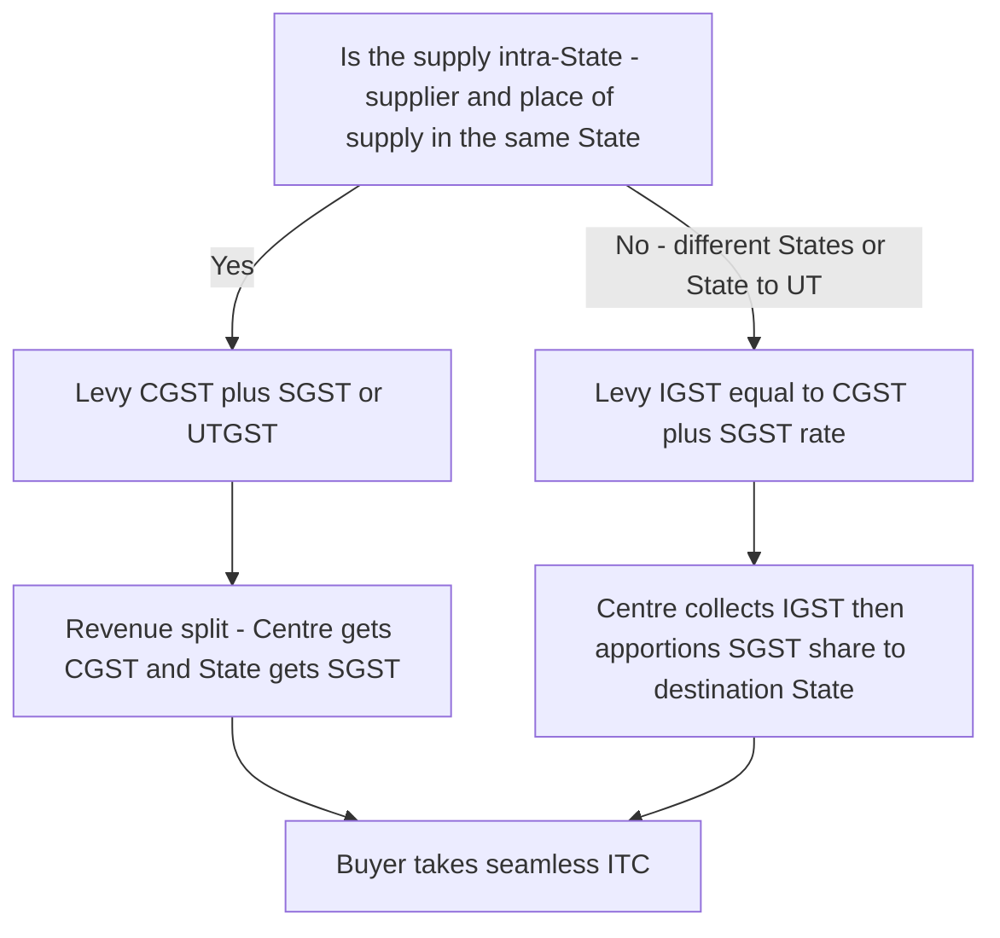
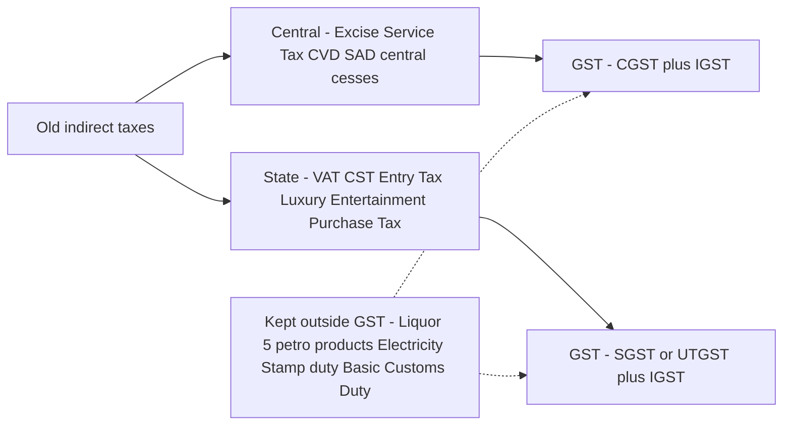

# Chapter 13 — GST: Concept & Framework

> "Verify current rates, thresholds and the latest amendments in the ICAI Study Material and RTP for your specific attempt. This chapter teaches the permanent logic; the numbers move."

---

## 1. The Problem — Why the Old System Had to Die

Before 1 July 2017, India did not have "an" indirect tax. It had a *web* of them, and the web had three structural diseases. To understand GST you must first *feel* the pain it cures — because every single rule in the GST law is a scar tissue over one of these three wounds.

### Disease 1 — Cascading (tax on tax)

Under the old regime, taxes were charged on a base that already *included* an earlier tax. The classic villain was Central Excise + VAT.

Excise duty was levied by the Centre on **manufacture**. VAT was levied by the State on **sale**. But VAT was charged on the value *inclusive of excise* — so the State taxed the Centre's tax. Then at the next stage of the supply chain, the trader paid tax again on a value that embedded both. There was no mechanism to take **credit of Central Excise against State VAT** — they were levied by different governments under different laws, and credit never crossed that boundary.

Let us make it bite with numbers. Take a good with a factory value of ₹1,000. Suppose Excise is 12.5% and VAT is 14.5%, and the manufacturer sells to a wholesaler, who adds ₹200 margin and sells to a retailer.

| Stage | Base | Excise 12.5% | VAT 14.5% (on base + excise) | Invoice price |
|---|---|---|---|---|
| Manufacturer | 1,000 | 125 | 163.13 (on 1,125) | 1,288.13 |
| Wholesaler (adds ₹200) | 1,488.13 + 200 = wait | — | 14.5% on full price again | — |

Notice the trap already: VAT of ₹163.13 was charged on ₹1,125, i.e. **VAT was charged on the ₹125 of excise**. That ₹18.13 is pure tax-on-tax. At the wholesaler stage, VAT credit of the earlier VAT was available (within a State), but the **excise embedded in the price was never creditable to the trader** — it sat in the cost and got re-taxed by VAT at every subsequent sale. Multiply this across a five-stage chain and the effective tax rate on the consumer balloons far above the nominal rates. The consumer pays tax on tax on tax.

> **Memory hook — "Cascade = waterfall of taxes, each pool taxing the pool above it."**

### Disease 2 — Fragmented, non-fungible credit (credit silos)

Even where credit *existed*, it lived in sealed silos:

- **CENVAT credit** (excise + service tax) — one pool, run by the Centre.
- **VAT credit** — a separate pool in each State, and it did not travel across State borders.
- Service tax could not be set off against VAT, and vice versa. A manufacturer who paid service tax on, say, an audit fee could not use it against his VAT liability on the goods he sold.

So a business accumulated **stranded credits** — genuine taxes paid that could never be used because the output tax belonged to a different silo or a different government. Stranded credit is a cost. Cost enters price. Price gets taxed again. The disease compounds Disease 1.

### Disease 3 — The inter-State barrier (CST and check-posts)

When goods moved *between* States, a special tax — **Central Sales Tax (CST)** — was levied by the origin State. CST was **non-creditable**: the buyer in the destination State could not claim credit of the CST paid. It was a pure, sticking cost on inter-State trade.

The consequence was economically absurd: it was cheaper to buy *within* your State than across a border, even if the out-of-State supplier was more efficient. India — a single political nation — was **not a single economic market**. Add the physical friction of State check-posts (trucks queuing for hours for entry-tax and octroi verification), and inter-State commerce carried a permanent tax-and-time penalty.

> **The one-line indictment:** the old system taxed *production and sales* in silos, punished credit from crossing government boundaries, and put a tariff wall around every State. It raised prices, distorted where businesses located, and broke the national market.

---

## 2. The Core Idea — One Value-Added Tax on Consumption

GST is the cure, and the cure is a single sentence:

> **GST is a single, destination-based tax on the *value added* at each stage of supply, where tax paid on inputs is fully creditable against tax on outputs — so that the tax finally sticks only on the value consumed, and only in the State of consumption.**

Unpack the three load-bearing words.

**"Value added."** Each supplier pays tax on his full output, but *subtracts* (as Input Tax Credit) the tax already paid on his inputs. Net, he only funds the tax on the value *he* added. The tax does not pile on itself — the cascade is broken by design.

**"Destination-based / consumption tax."** GST is not a tax on manufacture (like excise) or on the origin sale (like CST). It is a tax that accrues to the jurisdiction where the goods or services are **finally consumed**. Production States do not hoard the revenue; consuming States earn it. This is why GST is called a *destination-based consumption tax*, and it is the reason IGST is engineered the way it is (Section 3 below).

**"Full seamless credit."** Credit must flow across the entire chain and — critically — across the goods/services divide and across the Centre/State divide, subject to the law's ordering rules. One fungible pool replaces the old silos.

Here is the anti-cascade mechanic on the same ₹1,000 good, now under GST at (say) 18%:

| Stage | Value added | Output GST 18% | ITC available | **Net GST paid to govt** |
|---|---|---|---|---|
| Manufacturer | 1,000 | 180 | 0 | 180 |
| Wholesaler (+200) | 200 | 216 (on 1,200) | 180 | 36 |
| Retailer (+300) | 300 | 270 (on 1,500) | 216 | 54 |
| **Total to govt** | | | | **270** |
| Consumer pays | 1,500 × 18% = **270** | | | |

Reconcile: net collections 180 + 36 + 54 = **270**, exactly 18% of the final consumer value ₹1,500. **No tax-on-tax.** The government's total take equals the single rate applied once to the final consumption value. That is the whole game. Everything else in the GST law is plumbing to make this identity hold true in messy real-world situations.

> **Memory hook — "GST take = rate × final consumption. If your answer isn't that, credit leaked somewhere."**

---

## 3. Why It's Built This Way — The Dual Structure and IGST

Here is the question that shapes the *entire* architecture of Indian GST: **who gets to levy it — the Centre or the States?**

### The constitutional knot

Pre-GST, the Constitution split taxing powers: the Centre could tax manufacture and services; States could tax the sale of goods. Neither could tax the other's domain. A *single* national GST would have required one government to surrender its taxing power to the other — politically impossible and constitutionally fraught in a federation.

The **Constitution (101st Amendment) Act, 2016** solved it by inserting **Article 246A**, which gives **both** the Union and the States a *concurrent* power to levy GST on the same supply. It also inserted **Article 269A** (the Centre levies and collects IGST on inter-State supply, then apportions it) and created the **GST Council** under **Article 279A**. This is why India could not adopt a single unified GST like some countries: our federal structure demanded that both tiers of government keep a hand on the tax.

### The dual GST — CGST + SGST/UTGST

The answer to "Centre or State?" is **both, simultaneously, on the same transaction.** Every **intra-State** supply attracts two taxes levied in parallel:

- **CGST** (Central GST) — levied by the Centre under the **CGST Act, 2017**.
- **SGST** (State GST) — levied by the State under its **SGST Act** — or **UTGST** (under the **UTGST Act, 2017**) for Union Territories *without* a legislature.

They share the *same* value and are split from a single rate. If the rate on a good is 18%, an intra-State sale carries **9% CGST + 9% SGST**. The taxpayer sees one 18% burden; the revenue is simply divided between the two governments.

> **Why dual and not a single merged tax?** Because Article 246A gives concurrent power. A dual levy lets each government tax the *same base* without either surrendering sovereignty. The rate is harmonised (fixed on GST Council recommendation) so the taxpayer never faces two different tax authorities fighting over the base.

**Union Territories:** UTs *with* a legislature — currently **Delhi, Puducherry, and Jammu & Kashmir** — behave like States and levy **SGST**. UTs *without* a legislature (e.g. Chandigarh, Andaman & Nicobar, Lakshadweep, Ladakh, Dadra & Nagar Haveli and Daman & Diu) levy **UTGST**. *(Verify the current UT list with ICAI for your attempt — the roster has changed over the years.)*

### The inter-State problem, and IGST — the masterstroke

Now the hard case. Supplier in Maharashtra sells to a buyer in Gujarat. If we naively charged Maharashtra-SGST, the revenue would sit with the **origin** State — but GST is a **destination** tax; the good is consumed in Gujarat, so Gujarat must ultimately get the SGST portion. And the Gujarat buyer needs **seamless credit** of whatever tax he paid, so he isn't stuck with a non-creditable cost like the old CST.

The **IGST Act, 2017** solves both at once. On an inter-State supply, the Centre levies a single **Integrated GST = CGST rate + SGST rate** (so IGST ≈ 18% in our example, one combined levy). Mechanically:

1. The Maharashtra supplier charges **IGST** and pays it to the Centre. He can use his input credits (of any type) to discharge it.
2. The Gujarat buyer takes **full ITC of the IGST** — no stranded cost, the CST wound is healed.
3. When the buyer sells onward, the **fund transfers** between the Centre and the destination State settle the accounts, so the SGST component finally lands in the **consuming State's** treasury.

IGST is therefore a **clearing mechanism**, not really a "third tax." It lets credit flow *unbroken across State borders* while ensuring the revenue reaches the destination State. It replaces CST and demolishes the inter-State barrier — India finally becomes one economic market.

> **Memory hook — "IGST = CGST + SGST, collected by the Centre, then routed to the destination. It's a plumbing pipe, not a new tax."**

*Figure 13.1 — The charge decision: intra-State levies two parallel taxes; inter-State levies one integrated tax that the Centre routes to the consuming State.*

### The credit fungibility rules (why IGST is the "master pool")

Because IGST is CGST + SGST fused together, the ITC set-off order (Sections 49, 49A, 49B of the CGST Act, with Rule 88A) is built around it:

- **IGST credit** must be used **first**, and can be set off against **IGST, then CGST, then SGST** (in that order, taxpayer's choice between CGST/SGST after IGST).
- **CGST credit** — against IGST then CGST. **CGST can NEVER be set off against SGST.**
- **SGST/UTGST credit** — against IGST then SGST. **SGST can NEVER be set off against CGST.**

The "CGST ↮ SGST cannot cross" rule is not arbitrary: CGST is the Centre's money and SGST is the State's money. Letting them offset each other would mean one government paying the other's dues from its own pocket. IGST, being jointly owned and centrally apportioned, is the bridge that lets credit ultimately reach either side.

> **Memory hook — "IGST first, then its own kind. Central and State money never touch directly; IGST is the neutral middleman."**

---

## 4. Full Technical Content — Sections, Definitions, Thresholds

### 4.1 The statutory architecture

| Act / Instrument | What it does | Levied/administered by |
|---|---|---|
| **Constitution (101st Amendment) Act, 2016** | Inserted Arts. 246A, 269A, 279A — the enabling power | — |
| **CGST Act, 2017** | Levies CGST on intra-State supply; contains most machinery provisions (registration, ITC, returns, assessment) that SGST Acts adopt by reference | Centre |
| **SGST Acts, 2017** (one per State) | Levies SGST on intra-State supply | Each State |
| **UTGST Act, 2017** | Levies UTGST in UTs without legislature | Centre (for those UTs) |
| **IGST Act, 2017** | Levies IGST on inter-State supply and imports; place-of-supply and apportionment rules | Centre |
| **GST (Compensation to States) Act, 2017** | Compensation cess to fund States' revenue shortfall in the transition years | Centre |

**Charging sections to remember:**
- **Section 9, CGST Act** — the charging section for CGST (levy on all intra-State supplies of goods/services except alcoholic liquor for human consumption, on value under Section 15, at notified rates; also houses reverse charge and the e-commerce operator provisions).
- **Section 5, IGST Act** — the charging section for IGST (on inter-State supplies and on imports of goods/services).

### 4.2 The founding definitions (each wrapped in its reason)

**"Supply" — Section 7, CGST Act.** The old system needed *manufacture* (excise), *sale* (VAT), and *provision of service* (service tax) as separate taxable events — three events, three taxes, three sets of litigation. GST needs **one** taxable event to run one tax, so it invents the umbrella word **supply**: all forms of supply of goods or services *for consideration in the course or furtherance of business* — sale, transfer, barter, exchange, licence, rental, lease, disposal. Certain activities are treated as supply *even without consideration* (Schedule I), and Schedule II classifies borderline cases as goods vs services, while Schedule III lists activities that are **neither** (e.g. services by an employee to employer, sale of land). *(Supply is the subject of its own chapter; here, grasp only that it is the single unifying trigger.)*

**"Goods" — Section 2(52)** — every kind of movable property except money and securities (includes actionable claims, growing crops as agreed to be severed). **"Services" — Section 2(102)** — anything other than goods, money and securities (but includes activities relating to use of money for a separate consideration). Note the deliberate design: between them, goods + services cover *everything* except money/securities — no gaps for a transaction to escape through, unlike the old fragmented base.

**"Intra-State supply" — Section 8, IGST Act** and **"Inter-State supply" — Section 7, IGST Act.** These are defined by comparing the **location of the supplier** with the **place of supply**:
- Same State/UT → **intra-State** → CGST + SGST/UTGST.
- Different States/UTs (or one is a UT/State and the other differs), imports, exports, or supply to/from an SEZ → **inter-State** → IGST.

This is why "place of supply" rules (in the IGST Act) are so important — they mechanically decide *which* tax applies and *which State* gets the money. Destination-based taxation lives or dies on the place-of-supply rules.

**"Input Tax Credit" — Section 2(63) / eligibility in Section 16.** ITC is the operative tool that breaks the cascade. Section 16 sets the four conditions to claim it (possession of tax invoice; receipt of goods/services; tax actually paid to the government by the supplier; and the recipient has furnished the return) plus the requirement that the credit appears in the auto-populated statement. Section 17 restricts ITC where inputs are used for exempt supplies or personal use, and Section 17(5) lists **blocked credits**. *(ITC has its own dedicated chapter — here, understand only that Section 16 is the anti-cascade engine.)*

### 4.3 Thresholds (the exemption for small suppliers)

The law does not want to crush tiny traders with compliance. **Section 22, CGST Act** sets the registration threshold — a supplier must register once aggregate turnover in a financial year exceeds the limit.

| Category | Threshold for **goods** | Threshold for **services** |
|---|---|---|
| Normal States | ₹40 lakh | ₹20 lakh |
| **Special category / specified States** (e.g. certain North-Eastern and hill States) | ₹20 lakh | ₹10 lakh |

*Aggregate turnover* (Section 2(6)) = all taxable + exempt + export + inter-State supplies of a person on the same PAN, computed **all-India**, excluding GST itself. **Verify the exact threshold amounts and the current list of special-category States in the ICAI material for your attempt — these are frequently tweaked.**

**Composition scheme — Section 10.** For small suppliers below a notified turnover (broadly ₹1.5 crore for goods; a separate lower limit and a 6% scheme for small service providers), GST offers a *simplified* flat-rate levy on turnover with **no ITC** and no tax collection from customers. The trade-off: less compliance, but the cascade returns for that link (no credit). It exists because forcing micro-businesses into full invoice-matching would defeat the "ease" promise. *(Detailed in the registration/levy chapter.)*

### 4.4 Taxes subsumed — what GST swallowed

GST replaced a long list of central and state levies. The subsumption is the physical embodiment of "one nation, one tax."

| Central taxes subsumed | State taxes subsumed |
|---|---|
| Central Excise Duty (incl. Additional Excise Duties) | State VAT / Sales Tax |
| Service Tax | Central Sales Tax (levied by Centre, collected by States) |
| Additional Customs Duty (CVD) | Luxury Tax |
| Special Additional Duty of Customs (SAD) | Entry Tax (all forms) / Octroi |
| Central Surcharges and Cesses (relating to supply) | Entertainment Tax (except that levied by local bodies) |
| — | Taxes on advertisements; Purchase Tax |
| — | Taxes on lotteries, betting and gambling; State cesses/surcharges on supply |

**What GST did NOT subsume (still taxed separately — memorise the exclusions):**
- **Basic Customs Duty (BCD)** on imports — a tariff, not a domestic consumption tax (though IGST is charged on imports *in addition*).
- **Alcoholic liquor for human consumption** — constitutionally kept out; States still levy State Excise + VAT on it.
- **Five petroleum products** — petroleum crude, high-speed diesel, motor spirit (petrol), natural gas, aviation turbine fuel — **currently** outside GST (they will be brought in from a date the GST Council notifies; till then excise + VAT continue).
- **Electricity** and **stamp duty on immovable property** — outside GST.
- **Tobacco** — *inside* GST, but the Centre can *also* levy Central Excise on it (a deliberate double-lever for a demerit good).

> **Memory hook — the "5 kept-out kings": Liquor, the 5 Petro-products, Electricity, real-estate Stamp duty, and Customs BCD. Everything else GST ate.**

*Figure 13.2 — Subsumption map: most central and state indirect taxes folded into the dual GST; a short list of exclusions remains under the old levies.*

### 4.5 The GST Council — Article 279A

If both the Centre and 30-plus States levy GST independently, you get chaos: 30 different rates, 30 definitions of "supply," 30 threshold limits. That would rebuild the fragmentation GST was meant to destroy. The **GST Council** exists precisely to prevent this — it is the institutional guarantor of "one tax."

**Constitution & composition (Art. 279A):**
- **Chairperson:** the **Union Finance Minister**.
- **Members:** the **Union Minister of State** for Finance/Revenue, and the **Finance/Taxation Minister (or any nominated minister) of each State**.
- **Vice-Chairperson:** chosen from among the State ministers.

**Function:** it *recommends* to the Union and the States on essentially everything that must stay uniform — the taxes to be subsumed, model laws, rates (including floor rates and bands), threshold limits, exemptions, special provisions for special-category States, and the date to bring petroleum products into GST.

**Decision-making (the weighted vote — a favourite exam point):**
- **Quorum** = one-half of total members.
- Every decision needs a **majority of not less than three-fourths of the weighted votes** of members present and voting, where:
  - the **Centre's vote = one-third** of total votes cast, and
  - **all States together = two-thirds** of total votes cast.

Why this weighting? It is a **mutual veto** designed for cooperative federalism. The Centre (one-third) cannot force anything through alone; the States (two-thirds) cannot override the Centre alone either — because 3/4 approval requires *both* sides to substantially agree. Neither tier can bulldoze the other. This is the political engine that keeps the tax genuinely national yet federal.

Note: Council recommendations are **recommendatory**, not binding (as clarified by the Supreme Court in the *Mohit Minerals* line of reasoning) — but in practice they anchor the whole structure because both governments legislate in line with them.

---

## 5. Worked Examples

### Example 1 — Proving the cascade is dead (multi-stage intra-State chain)

*Facts:* All parties in Karnataka (intra-State). GST rate 18% (9% CGST + 9% SGST). Chain: Manufacturer → Distributor → Retailer → Consumer. Manufacturer's base value ₹10,000; Distributor adds ₹4,000 margin; Retailer adds ₹6,000 margin.

**Step 1 — Manufacturer.**
Output value 10,000. GST = 1,800 (CGST 900 + SGST 900). ITC = 0.
**Net to govt = 1,800.** Invoice to Distributor = 10,000 + 1,800 = 11,800.

**Step 2 — Distributor.**
Sale value 10,000 + 4,000 = 14,000. Output GST = 2,520 (CGST 1,260 + SGST 1,260).
ITC = 1,800 (900 CGST + 900 SGST). CGST offset against CGST, SGST against SGST.
**Net CGST = 1,260 − 900 = 360; Net SGST = 1,260 − 900 = 360. Net to govt = 720.**
Invoice to Retailer = 14,000 + 2,520 = 16,520.

**Step 3 — Retailer.**
Sale value 14,000 + 6,000 = 20,000. Output GST = 3,600 (CGST 1,800 + SGST 1,800).
ITC = 2,520 (1,260 + 1,260).
**Net CGST = 1,800 − 1,260 = 540; Net SGST = 540. Net to govt = 1,080.**
Consumer pays = 20,000 + 3,600 = 23,600.

**Step 4 — Reconciliation.**
Total net GST to government = 1,800 + 720 + 1,080 = **3,600.**
Check: final consumption value 20,000 × 18% = **3,600.** ✔
Split: CGST 900 + 360 + 540 = **1,800**; SGST 900 + 360 + 540 = **1,800.** ✔
**Conclusion:** the government collects exactly 18% of ₹20,000, once. Each dealer funded tax only on *his own* value addition (Mfr on 10,000, Dist on 4,000, Ret on 6,000 → 1,800 + 720 + 1,080). The cascade is gone.

### Example 2 — Inter-State supply and the IGST credit flow

*Facts:* Rate 18%. Step A: **Manufacturer in Maharashtra** sells to **Distributor in Gujarat** (inter-State) for ₹1,00,000. Step B: the Gujarat distributor adds ₹20,000 and sells to a **consumer in Gujarat** (intra-State).

**Step A — Inter-State (Maharashtra → Gujarat).**
Because location of supplier (MH) ≠ place of supply (GJ), this is inter-State → **IGST**.
IGST = 18% × 1,00,000 = **18,000.** Manufacturer (assume no input credit) pays ₹18,000 IGST **to the Centre.**
Invoice = 1,00,000 + 18,000 = 1,18,000. Gujarat distributor takes **full ITC of ₹18,000 IGST** (no CST-style sticking cost).

**Step B — Intra-State (within Gujarat).**
Sale value = 1,00,000 + 20,000 = 1,20,000. Output = CGST 9% (10,800) + SGST 9% (10,800) = 21,600.
Now apply the set-off order. **IGST credit ₹18,000 is used first**, against CGST then SGST:
- Against CGST 10,800 → use 10,800 of IGST credit. CGST payable in cash = 0. IGST credit left = 7,200.
- Against SGST 10,800 → use remaining 7,200 IGST credit. **SGST payable in cash = 10,800 − 7,200 = 3,600.**

**Cash paid by distributor in Step B = 0 (CGST) + 3,600 (SGST) = 3,600.**

**Reconciliation of where the money lands (destination principle):**
- Centre collected ₹18,000 IGST in Step A.
- In Step B, the distributor extinguished ₹10,800 CGST and ₹7,200 SGST using that IGST credit, and paid ₹3,600 SGST in cash.
- The consumer ultimately bore 18% of ₹1,20,000 = **₹21,600** (10,800 CGST-equivalent + 10,800 SGST-equivalent).
- Through the IGST apportionment machinery, the **SGST share flows to Gujarat — the State of consumption — not Maharashtra**, the origin. ✔

**Teaching point:** the manufacturer's home State (Maharashtra) collected *nothing* in net SGST terms — correct, because the good was consumed in Gujarat. IGST silently transferred the State's share to the destination. Compare the old world: CST would have stuck ~2% on the ₹1,00,000 as a dead, non-creditable cost sitting with Maharashtra. GST healed it.

### Example 3 — The ITC set-off order under Section 49A/Rule 88A

*Facts:* A registered dealer in Delhi has the following for a tax period. Output liability: IGST ₹10,000; CGST ₹8,000; SGST ₹8,000. Available ITC: IGST ₹12,000; CGST ₹3,000; SGST ₹5,000. Compute cash payable.

**Rule:** IGST credit must be fully utilised first; then CGST credit (IGST→CGST); then SGST credit (IGST→SGST). CGST credit cannot touch SGST and vice-versa.

**Step 1 — Utilise IGST credit ₹12,000 (first, in order IGST→CGST→SGST).**
- Against IGST output 10,000 → use 10,000. IGST output cleared. IGST credit left = 2,000.
- Against CGST output 8,000 → use remaining 2,000 IGST credit. CGST output now 6,000 remaining. IGST credit exhausted.

**Step 2 — Utilise CGST credit ₹3,000 (against remaining CGST 6,000).**
- CGST payable in cash = 6,000 − 3,000 = **3,000.**

**Step 3 — Utilise SGST credit ₹5,000 (against SGST output 8,000).**
- SGST payable in cash = 8,000 − 5,000 = **3,000.**

**Step 4 — Reconcile.**
| Head | Output | Credit used | Cash |
|---|---|---|---|
| IGST | 10,000 | 10,000 (own IGST) | 0 |
| CGST | 8,000 | 2,000 (IGST) + 3,000 (CGST) | 3,000 |
| SGST | 8,000 | 5,000 (SGST) | 3,000 |
| **Total** | 26,000 | 20,000 | **6,000** |

Total credit ₹20,000 + cash ₹6,000 = ₹26,000 = total output liability. ✔
**Cash payable = CGST ₹3,000 + SGST ₹3,000 = ₹6,000.** Note we could NOT use the leftover SGST against CGST — that is why ₹3,000 CGST had to be paid in cash even though SGST credit was fully consumed only on SGST. This asymmetry is the "Central and State money never cross" rule in action.

---

## 6. Format / Summary

**The GST identity (memorise this as your sanity check):**

> **Net GST to government (whole chain) = Applicable rate × Final consumption value.**
> If a computation violates this, ITC has leaked (blocked credit, composition dealer in the chain, or an error).

**Which tax applies — one-line test:**

| Location of supplier vs Place of supply | Nature | Tax(es) |
|---|---|---|
| Same State/UT | Intra-State (Sec 8 IGST Act) | CGST + SGST / UTGST |
| Different State/UT, import, export, SEZ | Inter-State (Sec 7 IGST Act) | IGST |

**ITC set-off order (Sec 49, 49A, 49B; Rule 88A):**

| Credit of | Can be used against (in order) | Never against |
|---|---|---|
| IGST | IGST → CGST → SGST (must exhaust first) | — |
| CGST | IGST → CGST | SGST |
| SGST/UTGST | IGST → SGST | CGST |

**GST Council vote:** Centre = 1/3, States (together) = 2/3; decision needs ≥ **3/4** of weighted votes; quorum = 1/2.

---

## 7. Connections

- **→ Supply (Ch. on Sec 7 & Schedules):** the single taxable event that replaced manufacture/sale/service. GST's whole reach depends on the width of "supply."
- **→ Charge & Composition (Sec 9 CGST, Sec 5 IGST, Sec 10):** the charging sections that turn "supply" into a levy; reverse charge and e-commerce operator liability sit here.
- **→ Place of Supply (IGST Act, Sec 10–14):** the rules that decide intra vs inter-State — i.e. the destination principle in operation. Get these wrong and you charge the wrong tax to the wrong State.
- **→ Time & Value of Supply (Sec 12–15):** *when* and on *what amount* the tax bites; Section 15 (transaction value) feeds every computation above.
- **→ Input Tax Credit (Sec 16–18):** the anti-cascade engine in full; blocked credits (Sec 17(5)) are the main way the "rate × consumption" identity breaks.
- **→ Payment of Tax (Sec 49):** the electronic cash/credit ledgers and the set-off order used in Example 3.
- **→ Customs / Imports:** IGST on imports (Sec 5 IGST Act) links GST to the Customs Act; BCD stays outside GST.

---

## 8. Traps & Examiner Tricks

1. **"IGST is a third, separate tax."** No — IGST **= CGST rate + SGST rate**, collected by the Centre and apportioned to the destination State. Treat it as a clearing pipe, not a new burden.
2. **Offsetting CGST against SGST.** A classic wrong answer. **They can never be set off against each other.** Only IGST bridges them. Watch for this in payment problems (as in Example 3, where SGST credit couldn't relieve CGST).
3. **Forgetting IGST must be used first.** Post-Rule 88A, IGST credit must be fully exhausted before CGST/SGST credit is touched. Students who set off "head against same head first" get the cash figure wrong.
4. **Wrong threshold for services.** The ₹40 lakh limit is for **goods**; services stay at **₹20 lakh** (₹10 lakh in special-category States). Examiners love mixing a service provider into a "₹40 lakh" fact pattern.
5. **Origin vs destination confusion.** In inter-State problems, the SGST share goes to the **consuming** State, not the supplier's State. Tag the *place of supply*, not the seller's address.
6. **Assuming petroleum/liquor attract GST.** The five petro-products and alcoholic liquor are **outside** GST *currently*. Basic Customs Duty and electricity too. Tobacco is *inside* GST but can *also* bear central excise.
7. **GST Council vote fractions flipped.** Centre = **1/3** (not 1/4), States = **2/3**, threshold = **3/4**. Easy to invert under pressure.
8. **"Manufacture is the taxable event."** That was excise. Under GST the taxable event is **supply** — there is no tax at the moment of manufacture.
9. **Composition dealer breaks the identity.** If a composition supplier sits in the chain, ITC is denied to him and often to his buyer, so the "rate × final value" reconciliation *won't* hold — the cascade partially returns. Read the facts for the word "composition."
10. **UTGST vs SGST.** Delhi, Puducherry and J&K have legislatures → **SGST**. Chandigarh, A&N, Lakshadweep, Ladakh, DNH&DD → **UTGST**. Don't write "SGST" for Chandigarh.

---

## 9. First-Principles Recap

Start from the wound and rebuild the entire law from memory:

1. **Old India had three diseases** — cascading (tax on tax), silo'd non-fungible credit, and inter-State barriers (CST + check-posts). Price rose, the national market fractured.
2. **The cure is one idea:** a single tax on *value added*, that is *destination-based* (accrues where consumed), with *seamless credit* across the whole chain. Net take = rate × final consumption. Cascade dead.
3. **But India is a federation** — Article 246A gives Centre and States *concurrent* power. So the single idea is delivered as a **dual tax**: CGST + SGST/UTGST on intra-State supply.
4. **Inter-State trade would break the destination principle and the credit chain** → invent **IGST** (= CGST + SGST), collected by the Centre and routed to the consuming State; buyer gets full ITC. CST barrier healed.
5. **Credit is the engine**, so the set-off order protects government ownership: IGST first; CGST↮SGST never cross.
6. **To keep 30+ governments uniform**, create the **GST Council** with a 1/3–2/3 mutual-veto vote — cooperative federalism institutionalised.
7. **Sweep the old taxes in** (excise, service tax, VAT, CST, entry, luxury…) and keep out the politically/constitutionally protected few (liquor, 5 petro-products, electricity, stamp duty, BCD).

Every provision you meet later — supply, place of supply, ITC conditions, returns — is just machinery to make step 2's identity hold in a messy, federal, multi-stage economy.

---

## 10. Quick-Revision Sheet

**One-liner:** GST = single, destination-based, value-added, consumption tax with seamless credit; delivered as a dual levy because India is a federation.

**Constitutional pillars:** Art. **246A** (concurrent power), Art. **269A** (IGST levy & apportionment), Art. **279A** (GST Council). Enabled by the **101st Amendment, 2016**.

**Charging sections:** CGST **Sec 9**; IGST **Sec 5**. Taxable event = **supply (Sec 7 CGST)**.

**Which tax:** same State → **CGST + SGST/UTGST**; different States/import/export/SEZ → **IGST** (= CGST + SGST rate, Centre collects, destination gets SGST share).

**Set-off order (Rule 88A):** IGST first (IGST→CGST→SGST); CGST (IGST→CGST, never SGST); SGST (IGST→SGST, never CGST).

**Thresholds:** goods **₹40 L** / services **₹20 L** (special States ₹20 L / ₹10 L). Composition ~₹1.5 cr goods (no ITC). *Verify current figures with ICAI.*

**Taxes subsumed:** Central — Excise, Service Tax, CVD, SAD, central cesses. State — VAT, CST, Entry/Octroi, Luxury, Entertainment (non-local), Purchase, betting/lottery.

**Kept OUT:** Alcoholic liquor; 5 petro-products (crude, HSD, petrol, natural gas, ATF); electricity; stamp duty; Basic Customs Duty. (Tobacco IN + central excise possible.)

**GST Council:** Chair = Union FM; members = MoS Finance + State FMs. Vote: Centre **1/3**, States **2/3**, pass at **3/4**; quorum 1/2. Recommendations are persuasive, not binding.

**Sanity check for any sum:** total net GST = **rate × final consumption value**; if not, credit leaked.

> **Reminder:** confirm current rates, thresholds, the UT/special-State lists, and the latest amendments in the ICAI Study Material and RTP/MTP for your exam attempt.
