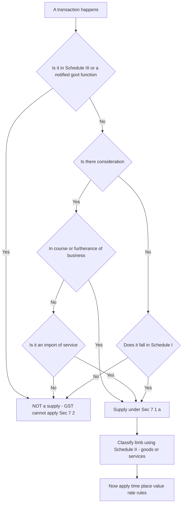
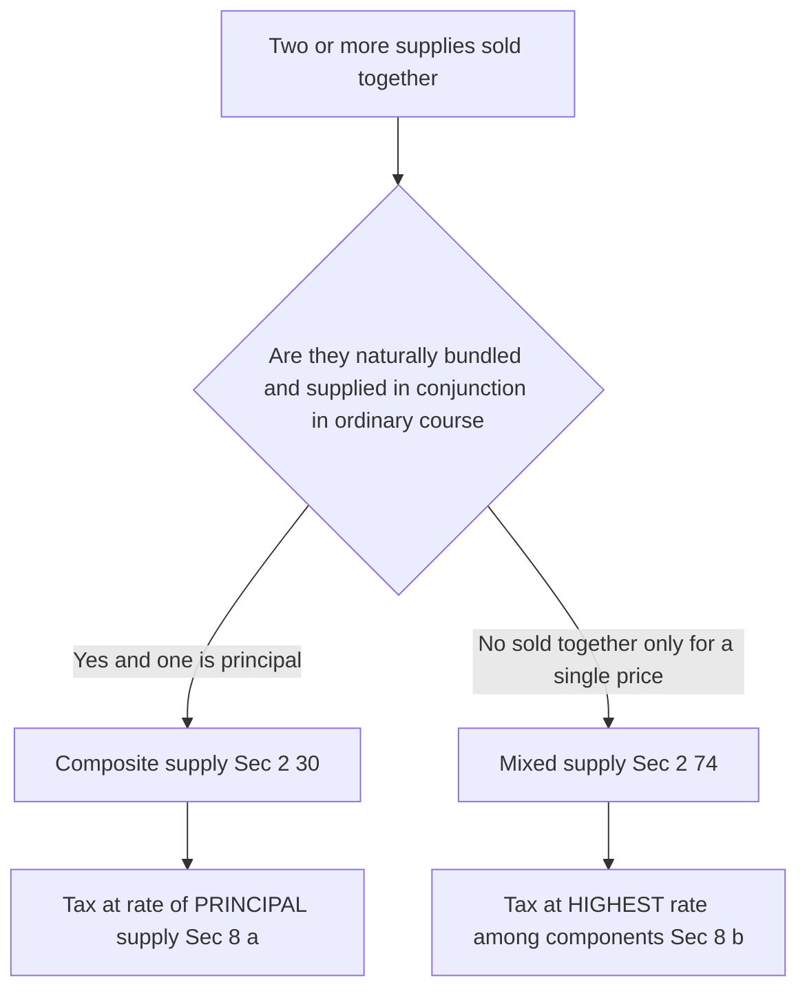

# Chapter 14 — Supply under GST

> **Applicable-law flag:** This chapter teaches the *architecture* of "supply" — Sections 7 and 8 of the CGST Act, 2017 read with Schedules I, II and III. The concepts are structurally stable, but Schedule entries, activity-specific clarifications, and the treatment of a few borderline items (actionable claims, high-sea sales, vouchers) have been fine-tuned by amendments and circulars. **Before your attempt, verify the current text of Sec 7, the three Schedules, and the latest ICAI Study Material / RTP amendments for your exam sitting.** If you understand *why* an item lands in a Schedule, memorising the list becomes almost unnecessary.

---

## 1. The Problem — what event should GST tax, and why the old answer was a disaster

Every indirect tax must first answer one question before it can charge a single rupee: **what is the taxable event?** — the precise happening that switches the tax on.

Before 1 July 2017, India answered this question *many times over*, once for each tax, and each answer was different:

- **Central Excise** taxed *manufacture* — the moment goods were *produced* in a factory.
- **VAT / CST** taxed *sale* — the transfer of property in goods for a price.
- **Service tax** taxed *provision of a service* — an activity done for another for consideration.
- **Entry tax, octroi** taxed *entry of goods into a local area*.
- **Luxury tax, entertainment tax** taxed still other events.

Because each tax fixed on a *different* event, three ruinous problems followed:

1. **Classification wars.** Is a restaurant meal a *sale* of food (VAT) or a *service* of serving it (service tax)? Is a software licence *goods* or a *service*? Is a works contract (build-a-building) a sale of materials or a service of construction? Litigation ran for decades because the *tax depended on the label*, and each label carried a different tax at a different rate to a different government.

2. **Cascading (tax-on-tax).** Excise was charged at the factory; then VAT was charged on a value that *included* the excise. Tax piled on tax, because credit could not cross the boundary between a Central tax (excise) and a State tax (VAT). The final price carried hidden layers of tax-upon-tax.

3. **Gaps and overlaps.** Some transactions escaped every tax; others were taxed twice (both VAT and service tax on the same works contract), forcing artificial 70:30 splits.

The root cause of all three was the **multiplicity of taxable events**. Fix that, and the mess dissolves.

---

## 2. The Core Idea

> **GST abolishes "manufacture", "sale" and "provision of service" as separate taxable events and replaces all of them with ONE unifying event: *supply*. Tax is triggered when there is a "supply" of goods or services. Section 9 (the charge) says "there shall be levied a tax… on all *intra-State supplies*"; the entire question of "what is taxable" collapses into "what is a supply".**

Read that again. The whole complicated pre-GST apparatus — three central events, several state events, all with their own case law — is compressed into a single word. If a transaction is a **supply**, GST *can* apply. If it is **not a supply**, GST *cannot* apply, no matter how much money changes hands.

This is why "supply" is the *single most important definition in the entire GST law*. Every later concept — time of supply (when to pay), place of supply (which State/IGST), value of supply (how much), input tax credit (what you can net off) — all of them presuppose that a supply exists. **Supply is the gate; everything else is inside the gate.**

The chapter's job is therefore to answer four sub-questions, and Sections 7–8 are built to answer exactly these:

- **What counts as a supply?** → *Scope of supply*, Sec 7(1).
- **Can something be a supply even with NO money?** → *Schedule I*, Sec 7(1)(c).
- **When we have a supply, is it of GOODS or SERVICES?** (the rate/rules differ) → *Schedule II*, Sec 7(1A).
- **What is carved OUT — declared "neither goods nor services"?** → *Schedule III*, Sec 7(2).
- **When two things are bundled, how do we tax the bundle?** → *Composite vs mixed supply*, Sec 8.

---

## 3. Why it's built this way

**Why one event instead of many?** Because the *label* was the source of every dispute and every cascade. If "sale vs service" no longer changes *whether* you are taxed (both are "supply", both attract GST, and — crucially — credit flows freely across both), the incentive to litigate the label largely vanishes. A restaurant meal, a software licence, a works contract — all are simply *supplies*, all taxed, all creditable. The war ends because the prize is gone.

**Why must "supply" be defined so widely (an inclusive, not exhaustive, list)?** Because a tax on value added must catch value *wherever* it is created — in a sale, a lease, a licence, a barter, an exchange, a disposal. If the definition were a closed list, taxpayers would engineer transactions to sit *just outside* it. So Sec 7(1)(a) uses "**includes**" and lists *forms* (sale, transfer, barter, exchange, licence, rental, lease, disposal) as illustrations, not boundaries.

**Why bring in transactions with NO consideration (Schedule I)?** Because the ordinary meaning of supply requires a *price*, and businesses would otherwise avoid tax by *gifting*. If a company could ship goods to its own branch in another state, or a manufacturer could give away stock, tax-free simply by not charging a price, the base would leak badly and input credit already taken would be enjoyed with no output tax. Schedule I plugs this by *deeming* four specific consideration-free transactions to be supplies anyway.

**Why classify goods vs services at all if both are taxed?** Because *time of supply*, *place of supply* and sometimes the *rate* differ between the two. The tax is unified, but the *machinery* still needs to know which limb to run. Schedule II is the rulebook that settles the classification for the historically-contested cases (works contracts, restaurant supply, leasing, etc.).

**Why carve out Schedule III (neither goods nor services)?** Because some activities are *not economic supplies at all* in the sense GST intends to tax — an employee working for salary, a court's functions, the sale of a completed building (immovable property, outside GST by design), the sale of land. Rather than argue each one, the law *declares* them out.

---

## 4. Full Technical Content — Sections 7 & 8 with the "why"

### 4.1 Section 7(1) — Scope of Supply (the four gates)

Section 7(1) says the expression "supply" **includes**:

| Clause | What it captures | Key requirement |
|---|---|---|
| **7(1)(a)** | All *forms* of supply of goods or services — sale, transfer, barter, exchange, licence, rental, lease, disposal | (i) made or agreed to be made **for a consideration** AND (ii) **in the course or furtherance of business** |
| **7(1)(b)** | **Import of services** | **for a consideration** — whether or not in the course or furtherance of business |
| **7(1)(c)** | Activities in **Schedule I** | made **WITHOUT consideration** (the four deemed supplies) |
| ~~7(1)(d)~~ | *(originally referred Schedule II — see 7(1A) below)* | — |

> **Memory hook — the "C + B" test.** For the *general* limb 7(1)(a): a transaction is a supply if it has **C**onsideration **and** is in the course/furtherance of **B**usiness. Both together. Knock out either one and 7(1)(a) fails — you then fall to check 7(1)(b) (imported service) or 7(1)(c) (Schedule I).

Note the deliberate asymmetries, each with a reason:

- **7(1)(b) — import of services** needs consideration but **NOT** business purpose. *Why?* Cross-border services (e.g., an individual downloading a paid foreign online course) would otherwise escape both the exporting country's tax and India's tax. To protect the base and to level the field with domestic service providers, imported services for a price are taxed even if you consume them personally.
- **7(1)(c) — Schedule I** needs business purpose (implicit) but **NO** consideration. It is the anti-avoidance limb.

### 4.2 The two ingredients of 7(1)(a): Consideration and Business

**Consideration [Sec 2(31)]** — widely defined. It includes:
- any **payment** in money or otherwise, and
- the **monetary value of any act or forbearance** (doing something, or refraining),

made by the recipient *or by any other person*, in respect of, in response to, or for the inducement of the supply.

*But* — a **subsidy given by the Central or State Government is expressly excluded** from consideration. And a **deposit** is not consideration *unless* the supplier applies it as consideration for the supply.

> **Why "or by any other person"?** So that a payment routed through a third party (e.g., a parent paying for a child's service) still counts — you cannot dodge tax by having someone else pay.

**Business [Sec 2(17)]** — also very wide. It includes any trade, commerce, manufacture, profession, vocation, adventure, wager or *any similar activity, whether or not it is for a pecuniary benefit*, and *whether or not there is volume, frequency, continuity or regularity*. It also covers activities incidental/ancillary to the main business, one-off "adventures", and the activities of clubs/associations to their members.

> **Why so wide?** Because "value added" happens in commercial activity of every shape. A one-off "adventure in the nature of trade" adds value just as a regular business does; excluding it would create a loophole. The width of Sec 2(17) is what makes the "furtherance of business" test easy to satisfy for almost anything a firm does.

### 4.3 Section 7(1A) — once it IS a supply, classify it using Schedule II

Section 7(1A): *"where certain activities or transactions constitute a supply in accordance with 7(1), they shall be treated either as a supply of **goods** or a supply of **services** as referred to in **Schedule II**."*

The 2018 amendment (retrospective from 1 July 2017) is **conceptually crucial**: Schedule II *no longer decides whether something is a supply* — it only decides the *goods-vs-services classification* of things that are **already** supplies under 7(1). First cross the supply gate (7(1)); *then* use Schedule II to label the limb.

### 4.4 Section 7(2) — what is NOT a supply (Schedule III + notified govt activities)

Section 7(2): notwithstanding anything in 7(1), the following shall be treated as **neither a supply of goods nor a supply of services**:
- (a) activities/transactions in **Schedule III**;
- (b) activities of the Central/State Government or local authority as *public authorities*, as may be notified.

Section 7(3) empowers the Government, on GST Council recommendation, to notify that a transaction is to be treated as a supply of goods (not services) or vice-versa.

### 4.5 Schedule I — Supply WITHOUT consideration (the four deemed supplies)

These are treated as supply **even though no consideration is charged**. There are exactly **four** entries. Learn them by their *reason*, not the words.

| # | Deemed supply | The reason (why the law refuses to let it be free) |
|---|---|---|
| **1** | **Permanent transfer / disposal of business assets** where **input tax credit has been availed** on those assets | You took credit when you bought the asset (reduced your tax). If you then give it away tax-free, the credit is a pure leakage. Tax on disposal reverses the enjoyed credit. **No ITC availed → not covered.** |
| **2** | Supply between **related persons** or **distinct persons** [Sec 25], when made **in the course/furtherance of business** — *except* gifts by an **employer to employee up to ₹50,000** in a financial year | Related/branch parties can set an artificial ₹0 price to dodge tax. So inter-branch stock transfers and related-party supplies are taxed at open-market value even without a price. |
| **3** | Supply by a **principal to his agent** (agent to supply on principal's behalf) **or** by an **agent to his principal** (agent to receive on principal's behalf) | Goods moving to/from an agent who will supply them are commercially "in the pipeline"; taxing the transfer keeps the credit chain intact. |
| **4** | **Import of *services*** by a person from a **related person** or from his **own establishment outside India**, in the course/furtherance of business | An Indian arm receiving services free from its foreign parent would otherwise import untaxed value. Deeming it a supply protects the base (mirrors 7(1)(b) for the free-of-charge, related case). |

> **Distinct persons [Sec 25(4)/(5)]:** the *same* legal entity registered in two States (or two registrations in one State) are treated as *distinct persons*. This is the engine that makes **branch/stock transfers between States taxable** — the anti-cascade design needs tax (and hence credit) to move with the goods across the State line.

> **The ₹50,000 employee gift line:** gifts *up to* ₹50,000 per employee per year are outside GST; *beyond* ₹50,000 the *whole* amount (per ICAI's view, the value exceeding the exemption logic — verify current ICAI treatment) becomes a supply. Note: perquisites provided by an employer to an employee *in terms of the employment contract* are **not** supplies (Schedule III entry 1 — services by employee to employer).

### 4.6 Schedule II — Goods vs Services classification (settling the old wars)

Schedule II tells you, for historically-disputed transactions, whether the (already-established) supply is **goods** or **services**. The organising principle:

> **Transfer of *title/ownership* → goods. Transfer of *right to use* without title, or an *activity/obligation* → services.**

| Transaction | Treated as | Why |
|---|---|---|
| Transfer of **title** in goods | **Goods** | Ownership passes → classic goods |
| Transfer of **right in goods / undivided share** without transfer of title | **Services** | You get *use*, not *ownership* |
| Transfer of title **under an agreement that property passes at a future date** (hire-purchase) | **Goods** | Title *will* pass → goods |
| **Lease, tenancy, licence to occupy land**; letting of commercial/residential building | **Services** | Right to *use* immovable property |
| **Treatment or process** applied to another's goods (job work) | **Services** | An activity on someone else's goods |
| **Transfer of business assets** (assets put to private/non-business use, or ceasing to be a taxable person) | Goods / Services as specified | Anti-leakage on business assets |
| **Renting of immovable property** | **Services** | Right to use |
| **Construction** of a building/complex intended for sale (except where *entire* consideration received *after* completion certificate) | **Services** | Ongoing activity; but a *completed* building is immovable property → out (Sch III) |
| **Temporary transfer / permitting use of intellectual property (IPR)** | **Services** | Right to use, no title transfer |
| **Development, design, programming of IT software** | **Services** | Activity/creation |
| **Agreeing to the obligation to refrain / to tolerate an act / to do an act** | **Services** | Forbearance = a service |
| **Works contract** [Sec 2(119)] (building, construction, fabrication, etc. of immovable property) | **Services** | *Ends the VAT-vs-service-tax war by fiat* |
| **Restaurant supply** — food/drink for human consumption as part of a service | **Services** | *Ends the sale-vs-service war for food* — the composite is declared a service |
| Supply of goods by an **unincorporated association/body** to a member for consideration | **Goods** | — |

> **The two most examined "declared services":** (a) **Works contract** and (b) **Restaurant/outdoor catering** are declared **services** by Schedule II. Historically both were taxed under *two* laws (VAT + service tax) with artificial splits. Schedule II abolishes the split by *legislative declaration* — the single most direct example of "one event ends classification war."

### 4.7 Schedule III — Neither goods nor services ("negative list of supply")

These are declared outside the scope of supply entirely (Sec 7(2)(a)). Learn the *logic buckets*:

| Entry | Item | Why it is out |
|---|---|---|
| 1 | **Services by an employee to the employer** in the course of employment | Salary is not a commercial supply; taxing it would tax wages |
| 2 | Services by any **court or Tribunal** | Sovereign judicial function, not commerce |
| 3 | Functions/duties of **MPs, MLAs, constitutional post-holders**; services by a person as **Chairperson/Member/Director in a body established by government** where not an employee | Public/constitutional functions |
| 4 | Services of **funeral, burial, crematorium, mortuary** including transportation of the deceased | Not an economic supply the state wishes to tax |
| 5 | **Sale of land** and (subject to Sch II para 5(b)) **sale of building** (completed) | Immovable property is outside GST by constitutional/design choice; land has no "value added" in the GST sense |
| 6 | **Actionable claims** other than **lottery, betting and gambling** | Ordinary debts/claims are not goods-in-substance |
| 7 | Supply of **goods from a place outside India to another place outside India** without entering India (merchant/high-sea trading in transit) | Goods never entered India — no Indian value added |
| 8 | (a) **High-sea sales** (supply of warehoused goods before clearance for home consumption); (b) supply of goods before entry for home consumption | Taxed later at import stage; avoids double taxation |

> **Memory hook for Schedule III — "ELF-CAG… out":** **E**mployment services, **L**and & completed buildings, **F**uneral services, **C**ourt/constitutional functions, **A**ctionable claims (non-lottery), **G**oods outside India / high-sea sales. All *declared out*.

### 4.8 Section 8 — Composite and Mixed Supply (taxing bundles)

Once you know each item is a supply, a practical problem remains: businesses sell *bundles* (a laptop + carry-bag; a hotel room + breakfast; a gift-hamper of chocolates + juice + tie). Each component might carry a *different rate*. How is the bundle taxed?

Two definitions, then one rule each:

**Composite supply [Sec 2(30)]** — two or more taxable supplies **naturally bundled and supplied in conjunction** in the *ordinary course of business*, one of which is a **principal supply** [Sec 2(90) — the *predominant* element to which the others are ancillary]. The components are *not* sold separately in the normal course.

> **Section 8(a) rule:** a composite supply is taxed at the rate of the **PRINCIPAL supply**. The whole bundle inherits the principal item's rate/character.

**Mixed supply [Sec 2(74)]** — two or more individual supplies made **together for a single price**, which are **NOT** a composite supply (i.e., they are *not* naturally bundled — each *could* be sold on its own).

> **Section 8(b) rule:** a mixed supply is taxed at the rate of that particular supply which attracts the **HIGHEST** rate of tax.

> **Why these two opposite rules?** The rules are *anti-abuse and pro-natural-commerce* at once. If items are *genuinely, naturally* bundled (you cannot sensibly buy a hotel room without the incidental services), the law respects commercial reality and charges the principal item's rate. But if a seller *artificially* staples together unrelated items under one price — perhaps to drag a high-rate item down to a low-rate item's tax — the law refuses the trick and charges the **highest** rate. Natural bundle → principal rate (fair); artificial bundle → highest rate (deterrent).

> **Memory hook:** **Co**mposite → **Co**re (principal) rate. **Mix**ed → **Max** rate.

### 4.9 Decision flow — is it a supply, and how is it taxed?

*Figure 14.1 — The supply gate. Cross Sec 7 first; classification and the rest of GST live beyond the gate.*

*Figure 14.2 — Composite vs mixed: natural bundle takes the core rate, artificial bundle takes the max rate.*

---

## 5. Worked Examples

### Example 1 — The four-gate test on ordinary and odd transactions

Classify each as *supply / not supply*, citing the gate.

| # | Transaction | C? | B? | Verdict & reason |
|---|---|---|---|---|
| (a) | A trader sells goods worth ₹1,00,000 to a customer | Yes | Yes | **Supply** — Sec 7(1)(a); both C and B present |
| (b) | A salaried employee receives ₹80,000 salary | Yes | — | **Not a supply** — Schedule III entry 1 (employee-to-employer service is excluded), Sec 7(2)(a) |
| (c) | A firm barters 100 chairs for 20 tables with another firm | Yes (barter is consideration in kind) | Yes | **Supply** — 7(1)(a) expressly lists *barter/exchange*; monetary value of goods received is consideration |
| (d) | An individual (not in business) imports a paid online design course from a US website for personal use, pays ₹15,000 | Yes | **No** | **Supply** — Sec **7(1)(b)**: import of service for consideration is a supply *even without business* purpose |
| (e) | A person sells his ancestral agricultural land for ₹50 lakh | Yes | Maybe | **Not a supply** — Schedule III entry 5 (sale of land), Sec 7(2)(a). Land is out regardless |

**Reconciliation of the logic:** (a) passes C+B → 7(1)(a). (b) and (e) are *declared out* by Schedule III, so we never even test C/B. (c) shows "consideration" need not be money. (d) is the key trap: no business, yet taxable, because 7(1)(b) drops the business requirement for imported services.

### Example 2 — Schedule I: the tax-free-looking transactions that are taxed

*ABC Ltd is registered in Maharashtra and Gujarat (same PAN, two GSTINs → distinct persons under Sec 25). During the year:*

1. It transfers finished goods (open-market value ₹5,00,000) from its Maharashtra unit to its Gujarat unit for internal use — **no invoice value charged.**
2. It donates a delivery van (originally bought for ₹8,00,000 on which it **had availed ITC of ₹1,44,000**) to a charity — free of charge.
3. It gives each of its 3 senior managers a Diwali gift worth ₹70,000.

**Required:** Which are supplies? On what value?

**Solution.**

**Item 1 — Branch transfer between distinct persons.** Schedule I entry 2 deems supplies between *distinct persons* in the course of business to be supplies **even without consideration**. → **Supply.** Value = open-market value = **₹5,00,000** (per Rule 28 valuation for distinct persons). *Why taxed:* the anti-cascade design needs GST (and matching ITC in Gujarat) to travel with goods across the State border; otherwise credit chains break.

**Item 2 — Disposal of business asset on which ITC was availed.** Schedule I entry 1: permanent transfer/disposal of business assets **where ITC has been availed** is a supply even without consideration. → **Supply.** The company enjoyed ₹1,44,000 credit; giving the van away free would let that credit sit un-reversed. Value = open-market value of the van at disposal. *If no ITC had been availed → NOT a supply.*

**Item 3 — Gifts to employees.** Schedule I entry 2 proviso: gifts by employer to employee **up to ₹50,000** per employee per FY are **not** a supply; **beyond ₹50,000** it becomes a supply. Each gift is ₹70,000 (> ₹50,000). → Each is a **supply**. (Verify current ICAI treatment of whether the whole ₹70,000 or only the excess is taxed; ICAI generally treats the gift as a supply once the ₹50,000 threshold is breached.)

**Reconciliation:** all three *looked* free, yet each is caught — by the exact anti-avoidance reason it was written for: cross-border credit (1), un-reversed ITC (2), disguised remuneration (3).

### Example 3 — Composite vs Mixed supply computation

*Compute the GST for each bundle. Assume rates: laptop 18%, laptop bag 28% (illustrative — verify current rates); packaged snacks 12%, aerated drinks 28%, chocolates 18%; transport/insurance ancillary.*

**Bundle A — Laptop supplied with a carry-bag, single price ₹50,000.**
A laptop is *ordinarily* sold with a bag as a natural accompaniment; the bag is ancillary; the laptop is the **principal supply**. → **Composite supply** (Sec 2(30)). Taxed at the **principal** rate (Sec 8(a)) = laptop @ **18%**.
GST = 50,000 × 18% = **₹9,000**.

**Bundle B — A gift hamper for ₹2,000 containing packaged snacks (12%), chocolates (18%) and a bottle of aerated drink (28%), single price.**
These items are *not* naturally bundled — each is independently sellable; they are stapled together for a single price. → **Mixed supply** (Sec 2(74)). Taxed at the **highest** rate among components (Sec 8(b)) = **28%** (aerated drink).
GST = 2,000 × 28% = **₹560**.

**Bundle C — Goods worth ₹1,00,000 supplied with transportation (₹5,000) and insurance (₹2,000) in transit, one contract.**
The supply of goods is the principal; transport and insurance are naturally supplied in conjunction to deliver those goods. → **Composite supply**; principal = the goods. Taxed at the **goods' rate** on the whole ₹1,07,000. If the goods are @18%:
GST = 1,07,000 × 18% = **₹19,260**.

**Reconciliation of the tax logic:** In A and C, respecting the natural bundle gives the *fair* (principal) rate — the customer genuinely buys "a laptop" and "delivered goods". In B, the artificial staple triggers the *deterrent* rule: the seller cannot shelter a 28% drink inside a 12%-snack bundle; the whole ₹2,000 bears 28%. Same section (8), opposite outcomes, driven by whether the bundle is natural.

---

## 6. Format / Summary Sheet

**The one-line skeleton to reproduce in an exam:**

> *Supply [Sec 7] = (a) all forms of supply of goods/services for consideration in the course/furtherance of business; (b) import of services for consideration [business not needed]; (c) Schedule I activities without consideration. Classify goods-vs-services by Schedule II [Sec 7(1A)]. Schedule III + notified govt functions are NOT supply [Sec 7(2)]. Bundles: composite → principal rate [Sec 8(a)]; mixed → highest rate [Sec 8(b)].*

| Provision | Section | One-line function |
|---|---|---|
| Scope of supply | 7(1) | The four inclusion gates |
| Import of service | 7(1)(b) | Taxed for consideration, no business needed |
| Deemed supply w/o consideration | 7(1)(c) + Sch I | Anti-avoidance: 4 entries |
| Goods vs services | 7(1A) + Sch II | Classification of an existing supply |
| Not a supply | 7(2) + Sch III | Negative list of supply |
| Power to reclassify | 7(3) | Govt may notify goods↔services |
| Composite supply | 2(30), 8(a) | Natural bundle → principal rate |
| Mixed supply | 2(74), 8(b) | Artificial bundle → highest rate |
| Consideration | 2(31) | Money or value of act/forbearance; excludes govt subsidy |
| Business | 2(17) | Extremely wide; even one-off adventures |
| Distinct persons | 25(4)/(5) | Same PAN, different GSTIN → separate persons |

---

## 7. Connections

- **→ Charge (Sec 9 CGST / Sec 5 IGST):** the charge attaches to "supply". No supply → no charge. This chapter defines the trigger the next chapter *pulls*.
- **→ Time of Supply (Sec 12/13):** *when* to pay presupposes a supply exists; goods-vs-services classification (Sch II) selects which time-of-supply section applies.
- **→ Place of Supply (IGST Sec 10–13):** decides intra-State (CGST+SGST) vs inter-State (IGST). *Distinct-persons* branch supplies (Sch I) are typically inter-State → IGST.
- **→ Value of Supply (Sec 15) & Rules 27–31:** Schedule I supplies with no price are valued at open-market value (Rule 28 for distinct/related persons).
- **→ Input Tax Credit (Sec 16–17):** Schedule I entry 1 exists *because* ITC was availed — supply and ITC are two ends of the same anti-leakage design.
- **→ Composition & Registration:** "aggregate turnover" is built on the value of *supplies*; whether an activity is a supply feeds the registration threshold.

---

## 8. Traps & Examiner Tricks

1. **"No money changed hands, so no GST."** *Wrong* — check Schedule I. Branch transfers, related-party supplies, ITC-availed asset disposals, and free imports from a foreign parent are all supplies *without* consideration.
2. **Import of service for personal use.** Students reflexively apply the "furtherance of business" test and say "not a supply." *Trap:* Sec 7(1)(b) drops the business requirement — a paid imported service is a supply even for a private individual.
3. **Schedule II decides "supply or not."** *Wrong post-2018.* After Sec 7(1A), Schedule II *only* classifies goods-vs-services for something *already* a supply under 7(1). Cross the 7(1) gate first.
4. **Composite treated as mixed (or vice-versa).** Ask: *would these normally be sold separately?* Naturally bundled (laptop+bag, hotel+breakfast) = composite → principal rate. Independently sellable but sold for one price (gift hamper) = mixed → highest rate.
5. **Sale of land / completed building taxed.** *Wrong* — Schedule III entry 5. But an *under-construction* flat (before completion certificate / part payment before completion) is a **service** under Sch II para 5(b) and IS taxed. Watch the completion-certificate line.
6. **Employee perquisites.** Salary and contractual perquisites → Schedule III (not supply). But an employer gift *above ₹50,000* → Schedule I supply. Don't confuse the two.
7. **Actionable claims.** Generally *not* a supply (Sch III entry 6) — *except* lottery, betting and gambling, which ARE supplies. Note recent amendments on online gaming/casinos — verify current ICAI position.
8. **"Distinct persons" only across States?** Two registrations even within the *same* State, and an establishment in another State/country, are distinct persons — Schedule I entry 2 bites there too.
9. **Subsidy in the price.** A *government* subsidy is excluded from consideration (Sec 2(31)); a *non-government* subsidy is included. Examiners flip this.
10. **Composite supply ≠ works contract.** A works contract and restaurant supply are *declared services by Sch II* (not analysed via Sec 8). Don't run the composite/mixed test on them — the statute already labelled them.

---

## 9. First-Principles Recap

Start from the disease: **many taxable events → classification wars + cascading + gaps.** The cure is **one taxable event: supply.** From that single move, everything else is forced:

1. If supply is the only trigger, it must be defined *widely* → inclusive list of forms (7(1)(a)), with two ingredients, **consideration + business**.
2. A wide definition invites two escapes — *"no price"* and *"cross-border free"* — so the law adds **Schedule I** (deemed supply without consideration) and **7(1)(b)** (import of service without business).
3. Even under one tax, *timing, place and sometimes rate* differ for goods vs services, so a **classification rulebook (Schedule II)** settles the old disputes by fiat — works contract and restaurant = services, war over.
4. Some activities are simply *not the kind of value-adding commerce GST targets* (employment, land, courts, funerals), so they are **declared out (Schedule III)**.
5. Real businesses sell **bundles**, so **Sec 8** adds a fair rule for natural bundles (principal rate) and a deterrent rule for artificial ones (highest rate).

If you can regenerate Sections 7, 8 and the three Schedules from those five pressures, you have understood "supply" — no list-memorising required.

---

## 10. Quick-Revision Sheet

**THE GATE (Sec 7(1)) — a supply is:**
- (a) **forms** of supply (sale/transfer/barter/exchange/licence/rental/lease/disposal) — needs **Consideration + Business** ("C+B")
- (b) **import of service** for consideration — **no business needed**
- (c) **Schedule I** — deemed supply **without consideration**

**SCHEDULE I (no-consideration supplies) — 4 entries:**
1. Permanent disposal of business asset **where ITC availed**
2. Supply between **related / distinct persons** in business (gift to employee ≤ ₹50,000 exempt)
3. **Principal ↔ agent** supplies
4. **Import of service** from **related person / own foreign establishment** for business

**SCHEDULE II (goods vs services)** — title passes → **goods**; right-to-use / activity / forbearance → **services**. Declared **services**: works contract, restaurant supply, renting/lease of immovable property, job work, IPR temporary transfer, IT software development, agreeing to refrain/tolerate/do.

**SCHEDULE III (NOT supply) — "ELF-CAG":** **E**mployment, **L**and & completed buildings, **F**uneral, **C**ourt/constitutional functions, **A**ctionable claims (except lottery/betting/gambling), **G**oods sold outside India / high-sea sales.

**BUNDLES (Sec 8):**
- **Composite** (natural bundle, has a principal) → **rate of PRINCIPAL supply** [8(a)] — *"Composite = Core rate"*
- **Mixed** (single price, not naturally bundled) → **HIGHEST rate** [8(b)] — *"Mixed = Max rate"*

**KEY DEFINITIONS:** Consideration 2(31) (money/act/forbearance; govt subsidy & unadjusted deposit excluded). Business 2(17) (very wide, includes one-off adventures). Distinct persons 25(4)/(5) (same PAN, different GSTIN). Principal supply 2(90).

**GOLDEN LINE:** *"No supply, no GST"* — everything downstream (time, place, value, ITC) lives beyond the Sec 7 gate.

> **Exam reminder:** verify current Schedule entries, the ₹50,000 gift treatment, actionable-claim/online-gaming amendments, and illustrative rates against the latest ICAI Study Material / RTP for your attempt.
