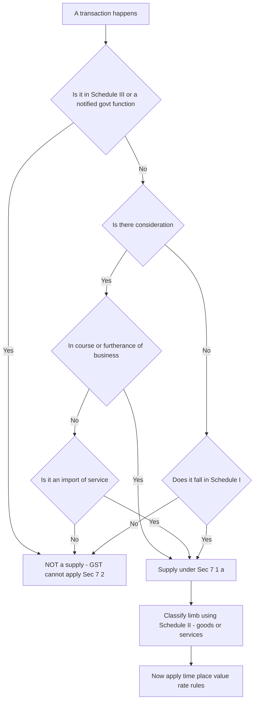
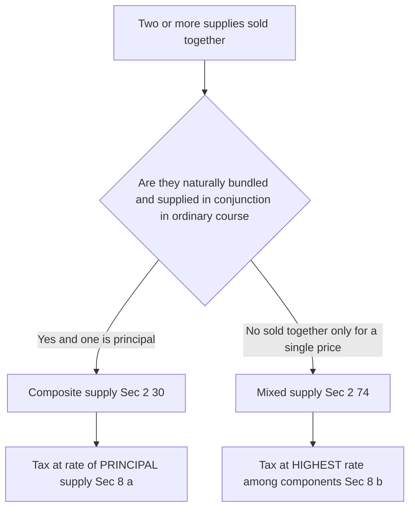
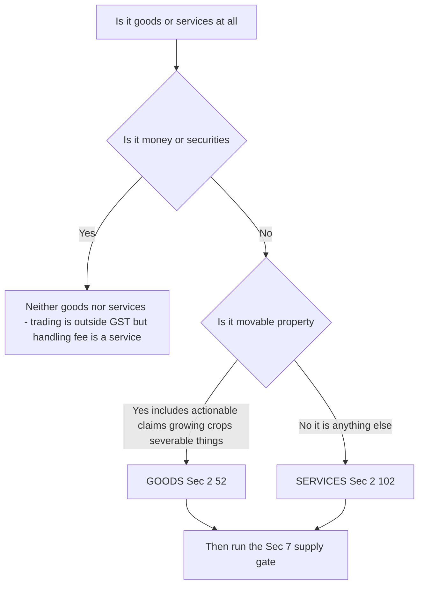
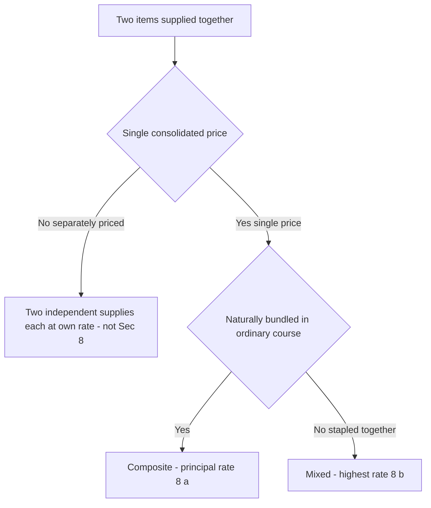

<!-- v2-deep -->

# Chapter 14 — Supply under GST

> **Applicable-law flag:** This chapter teaches the *architecture* of "supply" — Sections 7 and 8 of the CGST Act, 2017 read with Schedules I, II and III. The concepts are structurally stable, but Schedule entries, activity-specific clarifications, and the treatment of a few borderline items (actionable claims, high-sea sales, vouchers, online gaming) have been fine-tuned by amendments and circulars. **Before your attempt, verify the current text of Sec 7, the three Schedules, and the latest ICAI Study Material / RTP amendments for your exam sitting.** If you understand *why* an item lands in a Schedule, memorising the list becomes almost unnecessary.

---

## 1. The Problem — what event should GST tax, and why the old answer was a disaster

Every indirect tax must first answer one question before it can charge a single rupee: **what is the taxable event?** — the precise happening that switches the tax on.

Before 1 July 2017, India answered this question *many times over*, once for each tax, and each answer was different:

- **Central Excise** taxed *manufacture* — the moment goods were *produced* in a factory.
- **VAT / CST** taxed *sale* — the transfer of property in goods for a price.
- **Service tax** taxed *provision of a service* — an activity done for another for consideration.
- **Entry tax, octroi** taxed *entry of goods into a local area*.
- **Luxury tax, entertainment tax** taxed still other events.

Because each tax fixed on a *different* event, three ruinous problems followed:

1. **Classification wars.** Is a restaurant meal a *sale* of food (VAT) or a *service* of serving it (service tax)? Is a software licence *goods* or a *service*? Is a works contract (build-a-building) a sale of materials or a service of construction? Litigation ran for decades because the *tax depended on the label*, and each label carried a different tax at a different rate to a different government.

2. **Cascading (tax-on-tax).** Excise was charged at the factory; then VAT was charged on a value that *included* the excise. Tax piled on tax, because credit could not cross the boundary between a Central tax (excise) and a State tax (VAT). The final price carried hidden layers of tax-upon-tax.

3. **Gaps and overlaps.** Some transactions escaped every tax; others were taxed twice (both VAT and service tax on the same works contract), forcing artificial 70:30 splits.

The root cause of all three was the **multiplicity of taxable events**. Fix that, and the mess dissolves.

> **Why the "taxable event" matters beyond theory.** The taxable event is not just an academic label — it fixes *the moment a liability is born*. Everything the assessee later does (raise the invoice, deposit tax, claim credit) hangs off that moment. Under the old system the same commercial deal could give birth to *three* liabilities at *three* different moments to *three* different treasuries. A single taxable event means a single birth-moment, a single liability, a single credit stream — which is why "supply" had to be defined before any other GST machinery could be written.

---

## 2. The Core Idea

> **GST abolishes "manufacture", "sale" and "provision of service" as separate taxable events and replaces all of them with ONE unifying event: *supply*. Tax is triggered when there is a "supply" of goods or services. Section 9 (the charge) says "there shall be levied a tax… on all *intra-State supplies*"; the entire question of "what is taxable" collapses into "what is a supply".**

Read that again. The whole complicated pre-GST apparatus — three central events, several state events, all with their own case law — is compressed into a single word. If a transaction is a **supply**, GST *can* apply. If it is **not a supply**, GST *cannot* apply, no matter how much money changes hands.

This is why "supply" is the *single most important definition in the entire GST law*. Every later concept — time of supply (when to pay), place of supply (which State/IGST), value of supply (how much), input tax credit (what you can net off) — all of them presuppose that a supply exists. **Supply is the gate; everything else is inside the gate.**

The chapter's job is therefore to answer four sub-questions, and Sections 7–8 are built to answer exactly these:

- **What counts as a supply?** → *Scope of supply*, Sec 7(1).
- **Can something be a supply even with NO money?** → *Schedule I*, Sec 7(1)(c).
- **When we have a supply, is it of GOODS or SERVICES?** (the rate/rules differ) → *Schedule II*, Sec 7(1A).
- **What is carved OUT — declared "neither goods nor services"?** → *Schedule III*, Sec 7(2).
- **When two things are bundled, how do we tax the bundle?** → *Composite vs mixed supply*, Sec 8.

> **The two feeder definitions that quietly decide everything.** "Supply" is a supply *of goods or services*. So two upstream definitions gate the gate:
> - **Goods [Sec 2(52)]** = *every kind of movable property* other than money and securities, but **including actionable claims, growing crops, grass and things attached to or forming part of the land which are agreed to be severed before supply**. Note the deliberate carve-*in* of actionable claims and the carve-*out* of money and securities.
> - **Services [Sec 2(102)]** = *anything other than goods, money and securities*, but **including activities relating to the use of money or its conversion by cash or by any other mode, from one form/currency/denomination to another, for which a separate consideration is charged**.
>
> Together they are exhaustive and mutually exclusive: everything that is not money/securities is *either* goods *or* services. **Money and securities are neither** — trading in them is outside GST (the *facilitation fee/commission* for handling them, however, is a service). This is a favourite one-liner trap: buying/selling shares is not a supply, but the *brokerage* is.

---

## 3. Why it's built this way

**Why one event instead of many?** Because the *label* was the source of every dispute and every cascade. If "sale vs service" no longer changes *whether* you are taxed (both are "supply", both attract GST, and — crucially — credit flows freely across both), the incentive to litigate the label largely vanishes. A restaurant meal, a software licence, a works contract — all are simply *supplies*, all taxed, all creditable. The war ends because the prize is gone.

**Why must "supply" be defined so widely (an inclusive, not exhaustive, list)?** Because a tax on value added must catch value *wherever* it is created — in a sale, a lease, a licence, a barter, an exchange, a disposal. If the definition were a closed list, taxpayers would engineer transactions to sit *just outside* it. So Sec 7(1)(a) uses "**includes**" and lists *forms* (sale, transfer, barter, exchange, licence, rental, lease, disposal) as illustrations, not boundaries.

**Why bring in transactions with NO consideration (Schedule I)?** Because the ordinary meaning of supply requires a *price*, and businesses would otherwise avoid tax by *gifting*. If a company could ship goods to its own branch in another state, or a manufacturer could give away stock, tax-free simply by not charging a price, the base would leak badly and input credit already taken would be enjoyed with no output tax. Schedule I plugs this by *deeming* four specific consideration-free transactions to be supplies anyway.

**Why classify goods vs services at all if both are taxed?** Because *time of supply*, *place of supply* and sometimes the *rate* differ between the two. The tax is unified, but the *machinery* still needs to know which limb to run. Schedule II is the rulebook that settles the classification for the historically-contested cases (works contracts, restaurant supply, leasing, etc.).

**Why carve out Schedule III (neither goods nor services)?** Because some activities are *not economic supplies at all* in the sense GST intends to tax — an employee working for salary, a court's functions, the sale of a completed building (immovable property, outside GST by design), the sale of land. Rather than argue each one, the law *declares* them out.

**Why not simply tax "any transfer of value"?** Because GST is a tax on *supply in the course of commerce*, not a wealth or gift tax. If the trigger were "any value transfer", every personal gift, every inheritance, every private sale of a used car between friends would attract GST. The twin ingredients **consideration + business** (and their deliberate relaxations) draw the boundary between *commercial* value-addition — which GST taxes — and *personal/non-commercial* dealings — which it leaves alone. Schedule I and 7(1)(b) are surgical exceptions that pull back a few non-commercial or price-less transactions *only where the base would otherwise leak*, not a general rule.

---

## 4. Full Technical Content — Sections 7 & 8 with the "why"

### 4.1 Section 7(1) — Scope of Supply (the four gates)

Section 7(1) says the expression "supply" **includes**:

| Clause | What it captures | Key requirement |
|---|---|---|
| **7(1)(a)** | All *forms* of supply of goods or services — sale, transfer, barter, exchange, licence, rental, lease, disposal | (i) made or agreed to be made **for a consideration** AND (ii) **in the course or furtherance of business** |
| **7(1)(b)** | **Import of services** | **for a consideration** — whether or not in the course or furtherance of business |
| **7(1)(c)** | Activities in **Schedule I** | made **WITHOUT consideration** (the four deemed supplies) |
| ~~7(1)(d)~~ | *(originally referred Schedule II — see 7(1A) below)* | — |

> **Memory hook — the "C + B" test.** For the *general* limb 7(1)(a): a transaction is a supply if it has **C**onsideration **and** is in the course/furtherance of **B**usiness. Both together. Knock out either one and 7(1)(a) fails — you then fall to check 7(1)(b) (imported service) or 7(1)(c) (Schedule I).

Note the deliberate asymmetries, each with a reason:

- **7(1)(b) — import of services** needs consideration but **NOT** business purpose. *Why?* Cross-border services (e.g., an individual downloading a paid foreign online course) would otherwise escape both the exporting country's tax and India's tax. To protect the base and to level the field with domestic service providers, imported services for a price are taxed even if you consume them personally.
- **7(1)(c) — Schedule I** needs business purpose (implicit) but **NO** consideration. It is the anti-avoidance limb.

> **The four-quadrant map of Sec 7(1).** Every transaction sits in a box defined by two switches — *is there consideration?* and *is it in furtherance of business?* Seeing the whole grid stops you from tunnel-visioning on 7(1)(a).

| | **Consideration present** | **Consideration absent** |
|---|---|---|
| **In furtherance of business** | Supply under **7(1)(a)** (general rule) | Supply **only if** in **Schedule I** [7(1)(c)]; else NOT a supply |
| **NOT in furtherance of business** | Supply **only if** import of service [7(1)(b)]; else NOT a supply | **Never** a supply (e.g., a private individual gifting his own car) |

> Read the grid corner-to-corner: the *only* time no analysis is needed is the bottom-right (no price, no business → never a supply) and top-left (price + business → always test 7(1)(a) first). The two off-diagonal corners are where 7(1)(b) and Schedule I do their surgical work — and where examiners set traps.

### 4.2 The two ingredients of 7(1)(a): Consideration and Business

**Consideration [Sec 2(31)]** — widely defined. It includes:
- any **payment** in money or otherwise, and
- the **monetary value of any act or forbearance** (doing something, or refraining),

made by the recipient *or by any other person*, in respect of, in response to, or for the inducement of the supply.

*But* — a **subsidy given by the Central or State Government is expressly excluded** from consideration. And a **deposit** is not consideration *unless* the supplier applies it as consideration for the supply.

> **Why "or by any other person"?** So that a payment routed through a third party (e.g., a parent paying for a child's service) still counts — you cannot dodge tax by having someone else pay.

> **The deposit line, sharpened.** A security/earnest-money deposit is *not* consideration *when taken* — so no supply, no GST at that moment. It converts into consideration (and triggers tax) only *if and when the supplier appropriates it towards the price* (e.g., adjusts it against a bill, or forfeits it against a supply). Timing trap: GST arises on the *appropriation date*, not the receipt date. A refundable caution deposit that is returned in full never becomes consideration at all.

> **"Act or forbearance" — value need not be money.** A tenant who agrees *not* to sub-let, a distributor who agrees *not* to sell a rival's product, a landlord paid to *tolerate* early termination — each receives money for a *forbearance* or a *toleration*, which Sec 2(31) treats as consideration and Schedule II para 5(e) classifies as a service ("agreeing to the obligation to refrain / tolerate / do an act"). This pair — 2(31) + Sch II 5(e) — is a frequent two-mark trap.

**Business [Sec 2(17)]** — also very wide. It includes any trade, commerce, manufacture, profession, vocation, adventure, wager or *any similar activity, whether or not it is for a pecuniary benefit*, and *whether or not there is volume, frequency, continuity or regularity*. It also covers activities incidental/ancillary to the main business, one-off "adventures", and the activities of clubs/associations to their members.

> **Why so wide?** Because "value added" happens in commercial activity of every shape. A one-off "adventure in the nature of trade" adds value just as a regular business does; excluding it would create a loophole. The width of Sec 2(17) is what makes the "furtherance of business" test easy to satisfy for almost anything a firm does.

> **The "furtherance of business" nuance most students miss.** The phrase is *course OR furtherance* — so a transaction need not be the firm's *core* activity; it is enough that it *advances* the business. Selling old office furniture, disposing of factory scrap, a bank auctioning a defaulter's pledged goods — none is the firm's main trade, yet each is "in furtherance of business" and hence a supply. Conversely, a truly *personal* act by a businessman (selling his own residential flat, gifting his personal watch) is outside business even though he happens to run a business. The test attaches to the *transaction's purpose*, not the *person's occupation*.

### 4.3 Section 7(1A) — once it IS a supply, classify it using Schedule II

Section 7(1A): *"where certain activities or transactions constitute a supply in accordance with 7(1), they shall be treated either as a supply of **goods** or a supply of **services** as referred to in **Schedule II**."*

The 2018 amendment (retrospective from 1 July 2017) is **conceptually crucial**: Schedule II *no longer decides whether something is a supply* — it only decides the *goods-vs-services classification* of things that are **already** supplies under 7(1). First cross the supply gate (7(1)); *then* use Schedule II to label the limb.

> **Why the retrospective 2018 fix was needed.** As originally enacted, 7(1)(d) said "the activities to be treated as supply of goods or services *as referred to in Schedule II*" — sloppy drafting that read as if an entry in Schedule II could *itself make* something a supply, bypassing the consideration/business tests. That would have taxed, e.g., a *free* transfer of business assets merely because Schedule II mentions "transfer of business assets". The amendment deleted 7(1)(d), inserted 7(1A), and made Schedule II a pure *classifier*, not a *gate*. Post-amendment logic is strictly two-step: **(1) is it a supply at all under 7(1)? → (2) if yes, goods or services under Sch II?** Never let Schedule II answer step (1).

### 4.4 Section 7(2) — what is NOT a supply (Schedule III + notified govt activities)

Section 7(2): notwithstanding anything in 7(1), the following shall be treated as **neither a supply of goods nor a supply of services**:
- (a) activities/transactions in **Schedule III**;
- (b) activities of the Central/State Government or local authority as *public authorities*, as may be notified.

Section 7(3) empowers the Government, on GST Council recommendation, to notify that a transaction is to be treated as a supply of goods (not services) or vice-versa.

> **The "notwithstanding" is the whole point.** Sec 7(2) opens with a *non-obstante* clause — it overrides 7(1). So even if an activity would sail through all four gates of 7(1) (has consideration, is in business), if it is listed in Schedule III it is *still* not a supply. **Schedule III is the master switch that wins over everything in 7(1).** In the decision flow you therefore test Schedule III *first*, before wasting effort on consideration/business.

### 4.5 Schedule I — Supply WITHOUT consideration (the four deemed supplies)

These are treated as supply **even though no consideration is charged**. There are exactly **four** entries. Learn them by their *reason*, not the words.

| # | Deemed supply | The reason (why the law refuses to let it be free) |
|---|---|---|
| **1** | **Permanent transfer / disposal of business assets** where **input tax credit has been availed** on those assets | You took credit when you bought the asset (reduced your tax). If you then give it away tax-free, the credit is a pure leakage. Tax on disposal reverses the enjoyed credit. **No ITC availed → not covered.** |
| **2** | Supply between **related persons** or **distinct persons** [Sec 25], when made **in the course/furtherance of business** — *except* gifts by an **employer to employee up to ₹50,000** in a financial year | Related/branch parties can set an artificial ₹0 price to dodge tax. So inter-branch stock transfers and related-party supplies are taxed at open-market value even without a price. |
| **3** | Supply by a **principal to his agent** (agent to supply on principal's behalf) **or** by an **agent to his principal** (agent to receive on principal's behalf) | Goods moving to/from an agent who will supply them are commercially "in the pipeline"; taxing the transfer keeps the credit chain intact. |
| **4** | **Import of *services*** by a person from a **related person** or from his **own establishment outside India**, in the course/furtherance of business | An Indian arm receiving services free from its foreign parent would otherwise import untaxed value. Deeming it a supply protects the base (mirrors 7(1)(b) for the free-of-charge, related case). |

> **Distinct persons [Sec 25(4)/(5)]:** the *same* legal entity registered in two States (or two registrations in one State) are treated as *distinct persons*. This is the engine that makes **branch/stock transfers between States taxable** — the anti-cascade design needs tax (and hence credit) to move with the goods across the State line.

> **Related persons [Explanation to Sec 15]** — a *different* concept from distinct persons. Persons are "related" if: one *controls* the other; both are controlled by a third; they are *employer and employee*; one holds ≥25% of the other; one directly/indirectly controls the other; they are members of the *same family*; or they are legally recognised *partners in business* / sole-agent-distributor. **Why it matters here:** Schedule I entry 2 catches supplies between related persons *even for free*, because a controlling relationship lets them rig a ₹0 price. Do not confuse "related persons" (relationship-based, Sec 15) with "distinct persons" (registration-based, Sec 25) — an exam may test either label.

> **Entry 3 — the agent trap.** Not every principal→"agent" transfer is caught. The deeming applies where goods are supplied *by the agent in his own invoice/name on behalf of the principal* (a del credere / commission agent who issues invoices in his own name), so that goods flow through the agent's books. A *pure* commission agent who merely arranges a deal but never takes/handles the goods in his own name is **not** covered by entry 3 for the goods — he only supplies an *agency service* (which is a normal 7(1)(a) supply). Test: *does the agent undertake to supply/receive the goods on the principal's behalf under his own invoice?* If yes → Schedule I entry 3.

> **The ₹50,000 employee gift line:** gifts *up to* ₹50,000 per employee per year are outside GST; *beyond* ₹50,000 the *whole* amount (per ICAI's view, the value exceeding the exemption logic — verify current ICAI treatment) becomes a supply. Note: perquisites provided by an employer to an employee *in terms of the employment contract* are **not** supplies (Schedule III entry 1 — services by employee to employer). **Two distinct doors:** a *contractual* perquisite → Sch III (out); a *gratuitous gift* above ₹50,000 → Sch I (in). The examiner picks whichever door you did not look through.

### 4.6 Schedule II — Goods vs Services classification (settling the old wars)

Schedule II tells you, for historically-disputed transactions, whether the (already-established) supply is **goods** or **services**. The organising principle:

> **Transfer of *title/ownership* → goods. Transfer of *right to use* without title, or an *activity/obligation* → services.**

| Transaction | Treated as | Why |
|---|---|---|
| Transfer of **title** in goods | **Goods** | Ownership passes → classic goods |
| Transfer of **right in goods / undivided share** without transfer of title | **Services** | You get *use*, not *ownership* |
| Transfer of title **under an agreement that property passes at a future date** (hire-purchase) | **Goods** | Title *will* pass → goods |
| **Lease, tenancy, licence to occupy land**; letting of commercial/residential building | **Services** | Right to *use* immovable property |
| **Treatment or process** applied to another's goods (job work) | **Services** | An activity on someone else's goods |
| **Transfer of business assets** (assets put to private/non-business use, or ceasing to be a taxable person) | Goods / Services as specified | Anti-leakage on business assets |
| **Renting of immovable property** | **Services** | Right to use |
| **Construction** of a building/complex intended for sale (except where *entire* consideration received *after* completion certificate) | **Services** | Ongoing activity; but a *completed* building is immovable property → out (Sch III) |
| **Temporary transfer / permitting use of intellectual property (IPR)** | **Services** | Right to use, no title transfer |
| **Development, design, programming of IT software** | **Services** | Activity/creation |
| **Agreeing to the obligation to refrain / to tolerate an act / to do an act** | **Services** | Forbearance = a service |
| **Works contract** [Sec 2(119)] (building, construction, fabrication, etc. of immovable property) | **Services** | *Ends the VAT-vs-service-tax war by fiat* |
| **Restaurant supply** — food/drink for human consumption as part of a service | **Services** | *Ends the sale-vs-service war for food* — the composite is declared a service |
| Supply of goods by an **unincorporated association/body** to a member for consideration | **Goods** | — |

> **The two most examined "declared services":** (a) **Works contract** and (b) **Restaurant/outdoor catering** are declared **services** by Schedule II. Historically both were taxed under *two* laws (VAT + service tax) with artificial splits. Schedule II abolishes the split by *legislative declaration* — the single most direct example of "one event ends classification war."

> **Goods-→-services flips to memorise as a set (Sch II).** The following *look* like goods transactions but are declared **services**: (i) transfer of *right in goods without title*; (ii) *any lease/tenancy/licence to occupy land or building*; (iii) *job work* (process on another's goods); (iv) *temporary* transfer of IPR; (v) *renting* of immovable property; (vi) *works contract*; (vii) *restaurant/catering* supply of food. The common thread: **no ownership passes, only use or activity.** Conversely, *hire-purchase* is declared **goods** even though possession precedes title, because title *is* agreed to pass eventually.

> **Transfer of business assets — the three fine cases in Sch II para 4 (often confused with Sch I entry 1).** (a) Business assets *transferred/disposed* so as to *no longer form part of the business* → treated as **supply of goods** (this is the goods-vs-services *label*; whether it is a supply *at all* without consideration is decided by Sch I entry 1, which needs ITC to have been availed). (b) Business assets *put to private use* or made available for a *non-business* purpose → **supply of services** (use, not title). (c) On a person *ceasing to be a taxable person*, business assets are *deemed supplied* immediately before, **unless** the business is *transferred as a going concern* or carried on by a successor. Keep Sch II para 4 (the *label*) and Sch I entry 1 (the *is-it-a-supply-without-price* gate) in separate mental boxes.

### 4.7 Schedule III — Neither goods nor services ("negative list of supply")

These are declared outside the scope of supply entirely (Sec 7(2)(a)). Learn the *logic buckets*:

| Entry | Item | Why it is out |
|---|---|---|
| 1 | **Services by an employee to the employer** in the course of employment | Salary is not a commercial supply; taxing it would tax wages |
| 2 | Services by any **court or Tribunal** | Sovereign judicial function, not commerce |
| 3 | Functions/duties of **MPs, MLAs, constitutional post-holders**; services by a person as **Chairperson/Member/Director in a body established by government** where not an employee | Public/constitutional functions |
| 4 | Services of **funeral, burial, crematorium, mortuary** including transportation of the deceased | Not an economic supply the state wishes to tax |
| 5 | **Sale of land** and (subject to Sch II para 5(b)) **sale of building** (completed) | Immovable property is outside GST by constitutional/design choice; land has no "value added" in the GST sense |
| 6 | **Actionable claims** other than **lottery, betting and gambling** | Ordinary debts/claims are not goods-in-substance |
| 7 | Supply of **goods from a place outside India to another place outside India** without entering India (merchant/high-sea trading in transit) | Goods never entered India — no Indian value added |
| 8 | (a) **High-sea sales** (supply of warehoused goods before clearance for home consumption); (b) supply of goods before entry for home consumption | Taxed later at import stage; avoids double taxation |

> **Memory hook for Schedule III — "ELF-CAG… out":** **E**mployment services, **L**and & completed buildings, **F**uneral services, **C**ourt/constitutional functions, **A**ctionable claims (non-lottery), **G**oods outside India / high-sea sales. All *declared out*.

> **Actionable claim — the hard bit.** An *actionable claim* [Sec 3 of Transfer of Property Act, imported via Sec 2(1)] is a claim to an *unsecured debt* or to a *beneficial interest in movable property not in possession*. Even though Sec 2(52) *includes* actionable claims within "goods", **Schedule III entry 6 pulls most of them back out** — so a normal actionable claim (e.g., an unsecured book debt, a bill discounted) is **not a supply**. The exceptions that ARE supplies: **lottery, betting and gambling** (and note recent amendments extending taxation to specified actionable claims like *online money gaming, casinos, horse racing* — **verify current ICAI position for your attempt**). So the chain is: 2(52) puts actionable claims *into* goods → Sch III takes *ordinary* ones *out* → the lottery/betting/gambling (and notified gaming) subset stays *in*.

> **Schedule III entries 7 & 8 — the "in-bond / in-transit" logic.** Entries 7 and 8 were inserted to stop *double taxation and taxation of value never added in India*. Entry 7 = pure third-country-to-third-country sale (goods never touch India). Entry 8(a) = **high-sea sale** — goods sold *while on the high seas / before crossing the customs frontier*, i.e., the buyer, not the original importer, files the bill of entry and pays IGST at import. Entry 8(b) = supply of *warehoused goods to any person before clearance for home consumption* (sale of goods lying in a customs bonded warehouse). The unifying rule: **these are taxed once, later, at the import stage under the Customs Tariff Act; taxing the intermediate transfer too would double-tax.**

### 4.8 Section 8 — Composite and Mixed Supply (taxing bundles)

Once you know each item is a supply, a practical problem remains: businesses sell *bundles* (a laptop + carry-bag; a hotel room + breakfast; a gift-hamper of chocolates + juice + tie). Each component might carry a *different rate*. How is the bundle taxed?

Two definitions, then one rule each:

**Composite supply [Sec 2(30)]** — two or more taxable supplies **naturally bundled and supplied in conjunction** in the *ordinary course of business*, one of which is a **principal supply** [Sec 2(90) — the *predominant* element to which the others are ancillary]. The components are *not* sold separately in the normal course.

> **Section 8(a) rule:** a composite supply is taxed at the rate of the **PRINCIPAL supply**. The whole bundle inherits the principal item's rate/character.

**Mixed supply [Sec 2(74)]** — two or more individual supplies made **together for a single price**, which are **NOT** a composite supply (i.e., they are *not* naturally bundled — each *could* be sold on its own).

> **Section 8(b) rule:** a mixed supply is taxed at the rate of that particular supply which attracts the **HIGHEST** rate of tax.

> **Why these two opposite rules?** The rules are *anti-abuse and pro-natural-commerce* at once. If items are *genuinely, naturally* bundled (you cannot sensibly buy a hotel room without the incidental services), the law respects commercial reality and charges the principal item's rate. But if a seller *artificially* staples together unrelated items under one price — perhaps to drag a high-rate item down to a low-rate item's tax — the law refuses the trick and charges the **highest** rate. Natural bundle → principal rate (fair); artificial bundle → highest rate (deterrent).

> **Memory hook:** **Co**mposite → **Co**re (principal) rate. **Mix**ed → **Max** rate.

> **The tests, made operational.** Two questions separate them, and you must ask them *in order*:
> 1. **Are the items sold for a single price?** If they are *separately priced and separately invoiced*, it is usually *neither* a composite nor a mixed supply — it is just two independent supplies, each at its own rate. Single price is a *precondition* for both.
> 2. **If single-priced, are they *naturally bundled*?** *Yes* → composite (tax at principal rate). *No* → mixed (tax at highest rate).
>
> **How to judge "naturally bundled" (ICAI indicators):** the *perception of the recipient* (do buyers expect them together?); *industry practice* (is it standard to bundle them?); *whether the main element is the reason the buyer buys* and the rest are merely incidental; *whether the elements cannot be supplied separately in the ordinary course*. No single indicator is decisive — weigh them.

> **Principal supply [Sec 2(90)] — the tie-breaker.** In a composite supply, one element is *predominant* and the others are *ancillary means* of enjoying it. In "goods + freight + insurance", the *goods* are why the buyer contracts; freight/insurance merely deliver them → goods are principal. Identifying the principal supply is the *entire* game in Sec 8(a), because the whole bundle borrows the principal's rate *and* its goods/services character (which then drives time-of-supply and place-of-supply too).

### 4.9 Decision flow — is it a supply, and how is it taxed?

*Figure 14.1 — The supply gate. Cross Sec 7 first; classification and the rest of GST live beyond the gate.*

*Figure 14.2 — Composite vs mixed: natural bundle takes the core rate, artificial bundle takes the max rate.*

*Figure 14.3 — The upstream filter. Before the supply gate even opens the thing must be goods or services and money and securities are neither.*

*Figure 14.4 — The single-price precondition. Separate pricing exits Sec 8 entirely before the natural-bundle test is even reached.*

---

## 5. Worked Examples

### Example 1 — The four-gate test on ordinary and odd transactions

Classify each as *supply / not supply*, citing the gate.

| # | Transaction | C? | B? | Verdict & reason |
|---|---|---|---|---|
| (a) | A trader sells goods worth ₹1,00,000 to a customer | Yes | Yes | **Supply** — Sec 7(1)(a); both C and B present |
| (b) | A salaried employee receives ₹80,000 salary | Yes | — | **Not a supply** — Schedule III entry 1 (employee-to-employer service is excluded), Sec 7(2)(a) |
| (c) | A firm barters 100 chairs for 20 tables with another firm | Yes (barter is consideration in kind) | Yes | **Supply** — 7(1)(a) expressly lists *barter/exchange*; monetary value of goods received is consideration |
| (d) | An individual (not in business) imports a paid online design course from a US website for personal use, pays ₹15,000 | Yes | **No** | **Supply** — Sec **7(1)(b)**: import of service for consideration is a supply *even without business* purpose |
| (e) | A person sells his ancestral agricultural land for ₹50 lakh | Yes | Maybe | **Not a supply** — Schedule III entry 5 (sale of land), Sec 7(2)(a). Land is out regardless |

**Reconciliation of the logic:** (a) passes C+B → 7(1)(a). (b) and (e) are *declared out* by Schedule III, so we never even test C/B. (c) shows "consideration" need not be money. (d) is the key trap: no business, yet taxable, because 7(1)(b) drops the business requirement for imported services.

### Example 2 — Schedule I: the tax-free-looking transactions that are taxed

*ABC Ltd is registered in Maharashtra and Gujarat (same PAN, two GSTINs → distinct persons under Sec 25). During the year:*

1. It transfers finished goods (open-market value ₹5,00,000) from its Maharashtra unit to its Gujarat unit for internal use — **no invoice value charged.**
2. It donates a delivery van (originally bought for ₹8,00,000 on which it **had availed ITC of ₹1,44,000**) to a charity — free of charge.
3. It gives each of its 3 senior managers a Diwali gift worth ₹70,000.

**Required:** Which are supplies? On what value?

**Solution.**

**Item 1 — Branch transfer between distinct persons.** Schedule I entry 2 deems supplies between *distinct persons* in the course of business to be supplies **even without consideration**. → **Supply.** Value = open-market value = **₹5,00,000** (per Rule 28 valuation for distinct persons). *Why taxed:* the anti-cascade design needs GST (and matching ITC in Gujarat) to travel with goods across the State border; otherwise credit chains break.

**Item 2 — Disposal of business asset on which ITC was availed.** Schedule I entry 1: permanent transfer/disposal of business assets **where ITC has been availed** is a supply even without consideration. → **Supply.** The company enjoyed ₹1,44,000 credit; giving the van away free would let that credit sit un-reversed. Value = open-market value of the van at disposal. *If no ITC had been availed → NOT a supply.*

**Item 3 — Gifts to employees.** Schedule I entry 2 proviso: gifts by employer to employee **up to ₹50,000** per employee per FY are **not** a supply; **beyond ₹50,000** it becomes a supply. Each gift is ₹70,000 (> ₹50,000). → Each is a **supply**. (Verify current ICAI treatment of whether the whole ₹70,000 or only the excess is taxed; ICAI generally treats the gift as a supply once the ₹50,000 threshold is breached.)

**Reconciliation:** all three *looked* free, yet each is caught — by the exact anti-avoidance reason it was written for: cross-border credit (1), un-reversed ITC (2), disguised remuneration (3).

### Example 3 — Composite vs Mixed supply computation

*Compute the GST for each bundle. Assume rates: laptop 18%, laptop bag 28% (illustrative — verify current rates); packaged snacks 12%, aerated drinks 28%, chocolates 18%; transport/insurance ancillary.*

**Bundle A — Laptop supplied with a carry-bag, single price ₹50,000.**
A laptop is *ordinarily* sold with a bag as a natural accompaniment; the bag is ancillary; the laptop is the **principal supply**. → **Composite supply** (Sec 2(30)). Taxed at the **principal** rate (Sec 8(a)) = laptop @ **18%**.
GST = 50,000 × 18% = **₹9,000**.

**Bundle B — A gift hamper for ₹2,000 containing packaged snacks (12%), chocolates (18%) and a bottle of aerated drink (28%), single price.**
These items are *not* naturally bundled — each is independently sellable; they are stapled together for a single price. → **Mixed supply** (Sec 2(74)). Taxed at the **highest** rate among components (Sec 8(b)) = **28%** (aerated drink).
GST = 2,000 × 28% = **₹560**.

**Bundle C — Goods worth ₹1,00,000 supplied with transportation (₹5,000) and insurance (₹2,000) in transit, one contract.**
The supply of goods is the principal; transport and insurance are naturally supplied in conjunction to deliver those goods. → **Composite supply**; principal = the goods. Taxed at the **goods' rate** on the whole ₹1,07,000. If the goods are @18%:
GST = 1,07,000 × 18% = **₹19,260**.

**Reconciliation of the tax logic:** In A and C, respecting the natural bundle gives the *fair* (principal) rate — the customer genuinely buys "a laptop" and "delivered goods". In B, the artificial staple triggers the *deterrent* rule: the seller cannot shelter a 28% drink inside a 12%-snack bundle; the whole ₹2,000 bears 28%. Same section (8), opposite outcomes, driven by whether the bundle is natural.

### Example 4 — The examiner's tweaks on Example 3 (train the discriminators)

*Same rate assumptions. Decide the treatment; each sub-part changes ONE fact.*

**(i) The laptop and the bag in Bundle A are shown as two separate line items, separately priced (₹47,000 + ₹3,000).**
Single price is the *precondition* for Sec 8. Here they are *separately priced and invoiced* → **not a bundle at all under Sec 8**. Tax each on its own: laptop ₹47,000 @18% = ₹8,460; bag ₹3,000 @28% = ₹840. **Total GST = ₹9,300.** *Lesson:* separate pricing exits Sec 8 (see Figure 14.4) and can *raise* the tax versus a composite (₹9,300 vs ₹9,000), because the high-rate bag is no longer sheltered by the principal.

**(ii) A hotel offers "room + complimentary breakfast" for a single ₹8,000 tariff (room 12%, restaurant service 5% — illustrative, verify).**
Breakfast is *naturally bundled* with a hotel stay (buyers expect it; industry standard); the **accommodation is the principal supply**. → **Composite supply**; tax the whole ₹8,000 at the **room rate 12%** = **₹960.** *Tweak trap:* students wrongly split it or apply the food rate. The principal (room) governs.

**(iii) A distributor sells a carton = 10 identical shampoo bottles for ₹900 single price (shampoo 18%).**
Only *one type* of supply is involved (all shampoo). Sec 8 needs *two or more different supplies*. → **Neither composite nor mixed**; it is a plain single supply. Tax ₹900 @18% = **₹162.** *Lesson:* "single price" alone does not make a mixed supply — you need *distinct* supplies with *different* characters.

**(iv) Bundle B (the ₹2,000 hamper) is instead priced by listing each item's MRP separately on the invoice, though delivered together.**
Separate pricing again removes it from Sec 8. Each item taxed at its own rate on its own value — the 28% "highest-rate" penalty of Sec 8(b) no longer applies. *Planning insight:* a seller can *lawfully* avoid the mixed-supply penalty by pricing components separately — provided the separate pricing is genuine and not a sham.

**Reconciliation:** across (i)–(iv), the decisive discriminators are, in order: *are there ≥2 different supplies?* → *is there a single price?* → *natural bundle or not?* Miss the first two and you will misclassify.

### Example 5 — Import of service and the related-person overlay (7(1)(b) vs Schedule I entry 4)

*Indus Ltd, a manufacturer in India, in the course of business during the year:*
1. Pays ₹4,00,000 to an *unrelated* US consultancy for market-research services.
2. Receives *free* technical support from its *own parent* company established in Germany (open-market value ₹6,00,000); no charge is raised.
3. Its proprietor personally hires a foreign architect to design his *private residence* and pays ₹2,00,000 from personal funds.

**Required:** Which are supplies, and under which limb?

**Solution.**

**Item 1 — Import of service for consideration, unrelated party.** Consideration present; import of service. → **Supply under Sec 7(1)(b)** (business is present anyway, but not even required). Taxable under **reverse charge** in Indus Ltd's hands (import of service → recipient pays). *Gate used:* 7(1)(b).

**Item 2 — Free import of service from own foreign establishment.** No consideration, so 7(1)(b) (which needs consideration) *fails*. But **Schedule I entry 4** deems *import of services from a related person / own establishment outside India, in the course of business*, a supply **even without consideration**. → **Supply**; valued at open-market value ₹6,00,000; reverse charge. *Gate used:* 7(1)(c) + Sch I entry 4. *Why the law needs both limbs:* 7(1)(b) catches *paid* imports; Sch I entry 4 plugs the *free, related-party* gap.

**Item 3 — Personal import by an individual, not in business.** Consideration present; import of service. Business is *not* required for 7(1)(b). → **Supply under Sec 7(1)(b)** even though it is for a private residence. (Contrast: had it been a *free* gift of design from a *related* foreign person to a *non-business* individual, neither 7(1)(b) — no consideration — nor Sch I entry 4 — needs business — would bite, and it would *not* be a supply.)

**Reconciliation:** the trio maps the exact boundary — *paid* import (1 & 3) → 7(1)(b) regardless of business; *free* import needs *both* a related party *and* business to be caught (2) via Sch I entry 4. Change either fact and the answer flips.

### Example 6 — Actionable claims, securities and the "goods or services at all?" filter

*State with reasons whether GST applies. (Rates immaterial.)*

1. Mr A sells listed equity shares worth ₹10,00,000 through a broker; the broker charges ₹5,000 brokerage.
2. A company sells a lottery ticket scheme; total face value ₹50,00,000.
3. A bank sells a pool of its *unsecured* overdue loan receivables (book debts) to an asset reconstruction company at a discount.
4. A money-changer converts ₹1,00,000 into US dollars and charges a ₹500 fee.

**Solution.**

**Item 1 — Shares.** Securities are **excluded** from both "goods" [2(52)] and "services" [2(102)] → the *sale of shares is neither goods nor services*, hence **not a supply**. **But** the **brokerage ₹5,000 is a service** (facilitation), fully taxable. *Split-answer trap:* the principal transaction is out; the intermediary's fee is in.

**Item 2 — Lottery.** A lottery is an *actionable claim*, and while ordinary actionable claims are carved out by Sch III entry 6, **lottery, betting and gambling are the exception that remains a supply**. → **Supply** (of goods, being an actionable claim within 2(52)); taxable. *(Verify current valuation/rate mechanism for lottery per latest ICAI material.)*

**Item 3 — Unsecured book debts.** These are *actionable claims* other than lottery/betting/gambling → **Schedule III entry 6** → **not a supply.** Selling/assigning ordinary receivables is outside GST.

**Item 4 — Currency conversion.** Trading in *money* itself is neither goods nor services, **but** Sec 2(102) expressly *includes* "activities relating to the use of money or its conversion… for which a *separate consideration* is charged" within **services**. The ₹500 conversion fee is therefore a **taxable service**; the ₹1,00,000 principal is not a supply. *Same pattern as item 1:* principal out, service fee in.

**Reconciliation:** items 1, 3, 4 all show the recurring architecture — the *underlying* money/securities/actionable-claim is outside GST, but the *facilitation fee/commission* riding on it is a taxable service. Item 2 is the single actionable-claim category the law deliberately keeps *in*.

---

## 6. Format / Summary Sheet

**The one-line skeleton to reproduce in an exam:**

> *Supply [Sec 7] = (a) all forms of supply of goods/services for consideration in the course/furtherance of business; (b) import of services for consideration [business not needed]; (c) Schedule I activities without consideration. Classify goods-vs-services by Schedule II [Sec 7(1A)]. Schedule III + notified govt functions are NOT supply [Sec 7(2)]. Bundles: composite → principal rate [Sec 8(a)]; mixed → highest rate [Sec 8(b)].*

| Provision | Section | One-line function |
|---|---|---|
| Scope of supply | 7(1) | The four inclusion gates |
| Import of service | 7(1)(b) | Taxed for consideration, no business needed |
| Deemed supply w/o consideration | 7(1)(c) + Sch I | Anti-avoidance: 4 entries |
| Goods vs services | 7(1A) + Sch II | Classification of an existing supply |
| Not a supply | 7(2) + Sch III | Negative list of supply |
| Power to reclassify | 7(3) | Govt may notify goods↔services |
| Composite supply | 2(30), 8(a) | Natural bundle → principal rate |
| Mixed supply | 2(74), 8(b) | Artificial bundle → highest rate |
| Principal supply | 2(90) | Predominant element of a composite bundle |
| Consideration | 2(31) | Money or value of act/forbearance; excludes govt subsidy & unadjusted deposit |
| Business | 2(17) | Extremely wide; even one-off adventures |
| Goods | 2(52) | Movable property incl. actionable claims; excl. money & securities |
| Services | 2(102) | Anything other than goods, money & securities |
| Distinct persons | 25(4)/(5) | Same PAN, different GSTIN → separate persons |
| Related persons | Expl. to Sec 15 | Control/holding/family/employer-employee etc. |

---

## 7. Connections

- **→ Charge (Sec 9 CGST / Sec 5 IGST):** the charge attaches to "supply". No supply → no charge. This chapter defines the trigger the next chapter *pulls*.
- **→ Time of Supply (Sec 12/13):** *when* to pay presupposes a supply exists; goods-vs-services classification (Sch II) selects which time-of-supply section applies. Composite/mixed classification also decides *which* time-of-supply limb runs on the whole bundle.
- **→ Place of Supply (IGST Sec 10–13):** decides intra-State (CGST+SGST) vs inter-State (IGST). *Distinct-persons* branch supplies (Sch I) are typically inter-State → IGST.
- **→ Value of Supply (Sec 15) & Rules 27–31:** Schedule I supplies with no price are valued at open-market value (Rule 28 for distinct/related persons). "Consideration" and "related persons" defined here feed directly into valuation.
- **→ Input Tax Credit (Sec 16–17):** Schedule I entry 1 exists *because* ITC was availed — supply and ITC are two ends of the same anti-leakage design.
- **→ Reverse Charge (Sec 9(3)/9(4), IGST Sec 5):** import of service under 7(1)(b) and Sch I entry 4 is collected from the *recipient* under reverse charge — the supply gate and the collection mechanism meet here.
- **→ Composition & Registration:** "aggregate turnover" is built on the value of *supplies*; whether an activity is a supply feeds the registration threshold.

---

## 8. Traps & Examiner Tricks

1. **"No money changed hands, so no GST."** *Wrong* — check Schedule I. Branch transfers, related-party supplies, ITC-availed asset disposals, and free imports from a foreign parent are all supplies *without* consideration.
2. **Import of service for personal use.** Students reflexively apply the "furtherance of business" test and say "not a supply." *Trap:* Sec 7(1)(b) drops the business requirement — a paid imported service is a supply even for a private individual.
3. **Schedule II decides "supply or not."** *Wrong post-2018.* After Sec 7(1A), Schedule II *only* classifies goods-vs-services for something *already* a supply under 7(1). Cross the 7(1) gate first.
4. **Composite treated as mixed (or vice-versa).** Ask: *would these normally be sold separately?* Naturally bundled (laptop+bag, hotel+breakfast) = composite → principal rate. Independently sellable but sold for one price (gift hamper) = mixed → highest rate.
5. **Sale of land / completed building taxed.** *Wrong* — Schedule III entry 5. But an *under-construction* flat (before completion certificate / part payment before completion) is a **service** under Sch II para 5(b) and IS taxed. Watch the completion-certificate line.
6. **Employee perquisites.** Salary and contractual perquisites → Schedule III (not supply). But an employer gift *above ₹50,000* → Schedule I supply. Don't confuse the two.
7. **Actionable claims.** Generally *not* a supply (Sch III entry 6) — *except* lottery, betting and gambling, which ARE supplies. Note recent amendments on online gaming/casinos — verify current ICAI position.
8. **"Distinct persons" only across States?** Two registrations even within the *same* State, and an establishment in another State/country, are distinct persons — Schedule I entry 2 bites there too.
9. **Subsidy in the price.** A *government* subsidy is excluded from consideration (Sec 2(31)); a *non-government* subsidy is included. Examiners flip this.
10. **Composite supply ≠ works contract.** A works contract and restaurant supply are *declared services by Sch II* (not analysed via Sec 8). Don't run the composite/mixed test on them — the statute already labelled them.
11. **Securities/money "sale" taxed.** *Wrong* — both are excluded from goods and services (2(52)/2(102)), so the *trade* is outside GST; only the *brokerage/commission/conversion fee* is a taxable service. Split your answer.
12. **Single price = mixed supply.** *Not automatic.* Single price is only the *precondition*. If the items are naturally bundled it is *composite*; if only one type of supply is involved it is a *plain single supply*. And separate pricing exits Sec 8 altogether.
13. **"Distinct persons" vs "related persons" mixed up.** Distinct persons = *registration*-based (Sec 25, same PAN); related persons = *relationship*-based (Sec 15, control/holding/family). Schedule I entry 2 uses *both* — cite the right one.
14. **Deposit taxed on receipt.** *Wrong* — a deposit is not consideration until the supplier *appropriates* it (Sec 2(31)); tax arises on appropriation/forfeiture, not receipt.
15. **Free perquisite by contract taxed as gift.** A perquisite *provided under the employment contract* is Schedule III (out); only a *gratuitous* gift over ₹50,000 is Schedule I (in). The source (contract vs bounty) decides the door.
16. **High-sea sale taxed twice.** *Wrong* — Sch III entries 7/8 keep the in-transit/in-bond transfer out; IGST is charged *once*, later, at the import/home-consumption stage.

---

## 9. First-Principles Recap

Start from the disease: **many taxable events → classification wars + cascading + gaps.** The cure is **one taxable event: supply.** From that single move, everything else is forced:

1. If supply is the only trigger, it must be defined *widely* → inclusive list of forms (7(1)(a)), with two ingredients, **consideration + business**.
2. A wide definition invites two escapes — *"no price"* and *"cross-border free"* — so the law adds **Schedule I** (deemed supply without consideration) and **7(1)(b)** (import of service without business).
3. Even under one tax, *timing, place and sometimes rate* differ for goods vs services, so a **classification rulebook (Schedule II)** settles the old disputes by fiat — works contract and restaurant = services, war over.
4. Some activities are simply *not the kind of value-adding commerce GST targets* (employment, land, courts, funerals), so they are **declared out (Schedule III)**.
5. Real businesses sell **bundles**, so **Sec 8** adds a fair rule for natural bundles (principal rate) and a deterrent rule for artificial ones (highest rate).

Two more pressures complete the design:

6. Before the supply gate can even open, the thing must *be* goods or services — so 2(52) and 2(102) draw an exhaustive, mutually-exclusive line and push *money and securities* outside GST (their handling *fee* stays in). This is the upstream filter.
7. The width that closes loopholes also risks over-reach (it could tax debts, in-transit goods, personal gifts) — so the law *pulls back* precisely where no Indian value is added or where double taxation looms (actionable claims, high-sea/in-bond sales), leaving only the value-adding core in the net.

If you can regenerate Sections 7, 8 and the three Schedules from those seven pressures, you have understood "supply" — no list-memorising required.

---

## 10. Quick-Revision Sheet

**UPSTREAM FILTER (before Sec 7):** everything is *goods* [2(52), movable property incl. actionable claims] **or** *services* [2(102), anything else] — **except money & securities (neither).** Trading in money/securities is out; the *fee/commission/conversion charge* is a service.

**THE GATE (Sec 7(1)) — a supply is:**
- (a) **forms** of supply (sale/transfer/barter/exchange/licence/rental/lease/disposal) — needs **Consideration + Business** ("C+B")
- (b) **import of service** for consideration — **no business needed**
- (c) **Schedule I** — deemed supply **without consideration**

**FOUR-QUADRANT SHORTCUT:** price + business → test 7(1)(a); price, no business → only 7(1)(b); no price, business → only Sch I; no price, no business → never a supply.

**SCHEDULE I (no-consideration supplies) — 4 entries:**
1. Permanent disposal of business asset **where ITC availed**
2. Supply between **related / distinct persons** in business (gift to employee ≤ ₹50,000 exempt)
3. **Principal ↔ agent** supplies (agent handles goods under own invoice)
4. **Import of service** from **related person / own foreign establishment** for business

**SCHEDULE II (goods vs services)** — title passes → **goods** (incl. hire-purchase); right-to-use / activity / forbearance → **services**. Declared **services**: works contract, restaurant supply, renting/lease of immovable property, job work, IPR temporary transfer, IT software development, agreeing to refrain/tolerate/do.

**SCHEDULE III (NOT supply) — "ELF-CAG":** **E**mployment, **L**and & completed buildings, **F**uneral, **C**ourt/constitutional functions, **A**ctionable claims (except lottery/betting/gambling + notified gaming), **G**oods sold outside India / high-sea / in-bond sales.

**BUNDLES (Sec 8):** *precondition = single price + ≥2 different supplies.*
- **Composite** (natural bundle, has a principal) → **rate of PRINCIPAL supply** [8(a)] — *"Composite = Core rate"*
- **Mixed** (single price, not naturally bundled) → **HIGHEST rate** [8(b)] — *"Mixed = Max rate"*
- *Separately priced* → not Sec 8 at all (each at own rate); *one type only* → plain single supply.

**KEY DEFINITIONS:** Consideration 2(31) (money/act/forbearance; govt subsidy & unadjusted deposit excluded). Business 2(17) (very wide, includes one-off adventures). Distinct persons 25(4)/(5) (same PAN, different GSTIN). Related persons Expl. to Sec 15 (control/holding/family). Principal supply 2(90).

**GOLDEN LINE:** *"No supply, no GST"* — everything downstream (time, place, value, ITC) lives beyond the Sec 7 gate.

> **Exam reminder:** verify current Schedule entries, the ₹50,000 gift treatment, actionable-claim/online-gaming amendments, lottery valuation, and illustrative rates against the latest ICAI Study Material / RTP for your attempt.
