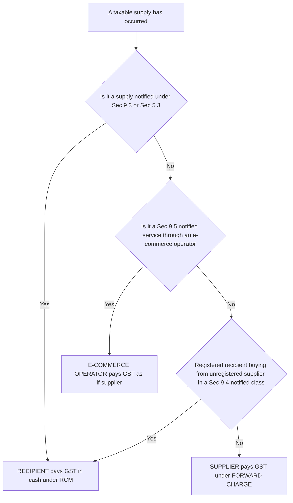
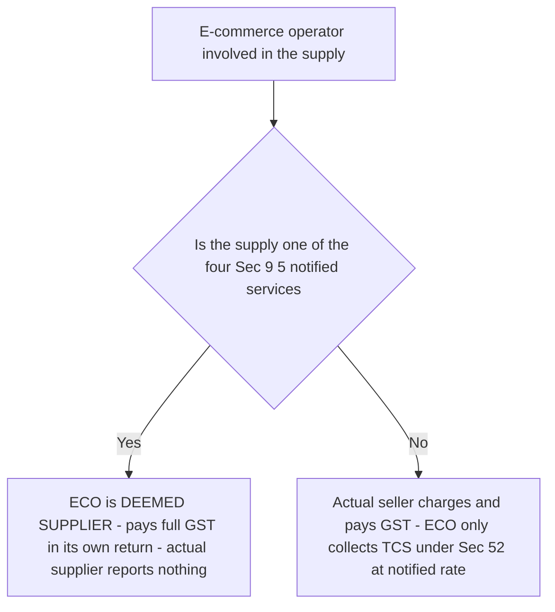
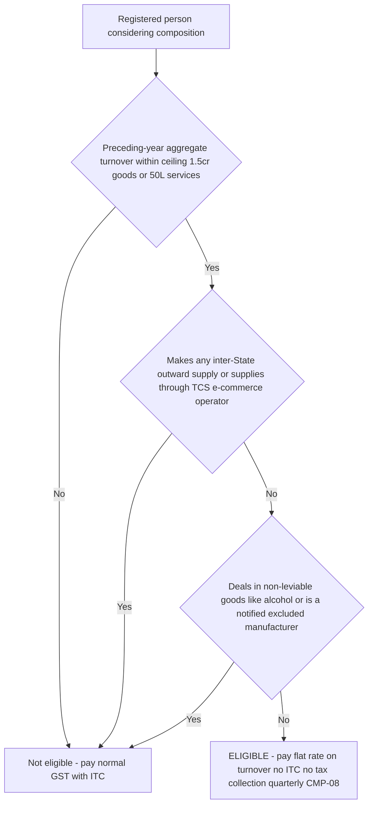

<!-- v2-deep -->

# Chapter 15 — Charge of GST (Levy & Reverse Charge)

> *Flag: All rates, thresholds, notified RCM lists and composition ceilings below reflect the CGST Act 2017 and IGST Act 2017 as commonly examined. Rates and notifications (especially RCM notifications 4/2017-CT(R), 13/2017-CT(R), 7/2019-CT(R) and the composition rates in Sec 10) are amended frequently. Always re-verify the exact figures, the notified lists, and the applicable date against current ICAI study material for your attempt.*

---

## 1. The Problem

You now know (from the earlier chapters) *what* a supply is, *where* it is taxable, and *when* it is taxable. But knowing that a transaction is a taxable supply is useless until the law answers three brutally practical questions:

1. **On what authority is the tax even charged?** A tax on citizens cannot exist by administrative wish. Article 265 of the Constitution says plainly: *"No tax shall be levied or collected except by authority of law."* So somewhere there must be a single **charging section** — the legal switch that turns "this is a supply" into "therefore ₹X of tax is payable." Without it, the entire GST apparatus is unconstitutional.

2. **Who actually hands the money to the government?** The natural answer is "the seller collects GST from the buyer and deposits it." That works beautifully — *when the seller is a registered, traceable, well-behaved business.* But GST's tax base deliberately reaches into corners where the supplier is a small unregistered farmer, an individual advocate, a goods-transport operator with one truck, or a company sitting *outside India* altogether. If the law insisted "only the supplier pays," those supplies would either escape tax entirely or be impossible to enforce. The department would be chasing thousands of tiny, invisible, or foreign suppliers. **How do you tax a supply when the supplier is unregistered, hard to trace, or beyond your jurisdiction?**

3. **What about the corner shop?** GST's compliance machinery — invoice-level returns, input tax credit matching, monthly filings — is built for organised business. Impose that full machinery on a ₹40-lakh-turnover kirana store or a small dhaba and you crush it under paperwork it cannot handle, while collecting a trivial amount of tax. **How do you keep small dealers inside the tax net without destroying them with compliance?**

This chapter is the answer to all three. The charging section (Sec 9 / Sec 5) answers the first. The **reverse charge mechanism** answers the second. The **composition levy** answers the third. Every rule below is a solution — read it as one.

A fourth, quieter question hides inside the first: **when the same supply crosses a State line, whose treasury gets the money — and how do we keep the *total* tax identical so trade isn't distorted?** GST answers this by splitting the levy between two mirror-image charging sections (Sec 9 CGST and Sec 5 IGST) engineered to sum to the same figure whichever direction the goods travel. Keep that neutrality goal in view; half the exam traps in this chapter are the examiner testing whether you understand that the *total* never changes — only its *composition* (CGST+SGST vs IGST) and its *collector* (supplier vs recipient vs platform).

---

## 2. The Core Idea

Strip away the detail and GST's charge stands on three pillars:

> **One levy, collected in whichever way is easiest to enforce, with a simplified lane for the small.**

- **The levy itself** is a single tax on the *value of supply*, at the notified rate. That is Sec 9 of the CGST Act (for intra-State supply) and Sec 5 of the IGST Act (for inter-State supply). This is the constitutional switch.

- **The default collection route is Forward Charge**: the *supplier* collects GST from the recipient and pays it to the government. This is how ~95% of GST flows.

- **Where forward charge would fail, the law flips the burden — Reverse Charge**: the *recipient* pays the GST directly to the government, on the supplier's behalf. Same tax, same rate — only the *person liable to pay* changes. It is not a new tax; it is a change of collection agent, chosen precisely because the recipient (a large, registered, traceable business) is far easier to hold accountable than the supplier.

- **For small dealers, the law offers Composition Levy (Sec 10)**: pay a tiny flat percentage of turnover, file quarterly, forget invoice-level tax and input credit. It trades away ITC and inter-State sales in exchange for near-zero compliance.

Hold this one sentence: **the tax never changes; only *who pays* and *how much paperwork* changes, and each variation is chosen to make collection actually work.**

**Three axes, one supply.** It helps to see that any single supply is classified along three independent axes, and the charge chapter is nothing more than reading those three dials:

1. **Territory dial** — intra-State (→ CGST + SGST, Sec 9) vs inter-State/import (→ IGST, Sec 5). Set by *Place of Supply*.
2. **Collector dial** — forward charge (supplier) vs reverse charge (recipient) vs Sec 9(5) (e-commerce operator). Set by the *notified lists*.
3. **Regime dial** — normal taxpayer (value × rate, with ITC) vs composition dealer (turnover × flat rate, no ITC). Set by *Sec 10 eligibility*.

Every worked example in Part 5 is just a specific setting of these three dials. When an examiner "tweaks" a problem, they are almost always flipping exactly one dial — spot which, and the answer follows.

---

## 3. Why It's Built This Way

**Why a separate charging section at all?** Because a modern tax statute separates *definitional* provisions (what is a supply, what is value, what is the rate) from the *operative* provision that says "tax **shall be levied**." The word "levy" is the legal trigger. Courts read the charging section strictly: if a transaction does not fall squarely inside it, no tax can be demanded, however much the department wishes otherwise. So GST needed one clean sentence to charge the tax — and it lives in Sec 9(1)/5(1).

**Levy vs collection — a distinction the examiner loves.** "Levy" and "collection" are two different legal events. *Levy* is the imposition of the charge (the liability arises the instant a taxable supply happens); *collection* is the machinery by which the government actually gets the money (returns, cash ledger, ITC set-off). Sec 9(1) itself distinguishes them — "there shall be *levied* … and *collected* in such manner as may be prescribed." This is why forward charge, reverse charge and Sec 9(5) can all coexist under *one* levy: the tax is levied once; only the *manner and person of collection* differ. If a student says "RCM is a separate tax," they have confused collection with levy — it is the *same* levy collected from a different person.

**Why split CGST and IGST?** India is a federation. The Constitution (101st Amendment, Article 246A + Article 269A) lets *both* the Centre and the States tax the same supply — but neither may tax across the country. So:
- An **intra-State** supply (within one State) is taxed *twice over the same base*: **CGST** to the Centre + **SGST** to the State, each at half the rate. Sec 9 of the CGST Act charges the CGST half; a parallel SGST Act charges the other.
- An **inter-State** supply is taxed by a single **IGST** (Centre collects, then apportions the State's share). Sec 5 of the IGST Act charges it. IGST rate = CGST + SGST rate, so the total is identical whichever way the goods move — that neutrality is the whole point of "one nation, one tax."

**Why does IGST exist as a *third* tax rather than just letting the destination State charge SGST?** Because when goods move from Maharashtra to Gujarat, Maharashtra has no constitutional power to charge Gujarat's SGST, and Gujarat cannot easily reach a Maharashtra seller. IGST solves this with a single Central levy that *travels with the supply*: the Centre collects the full IGST, the exporting State transfers the credit, and the Centre settles the destination State's share through the IGST settlement mechanism. IGST is thus a **clearing-house tax** — its real job is to move ITC seamlessly across State borders so the credit chain never breaks. This is also why *imports* bear IGST (not CGST+SGST): an import has no originating Indian State, so only the Centre's IGST can apply, with the destination State compensated on settlement.

**Why reverse charge?** Follow the anti-cascade logic. GST wants to tax value addition *everywhere*, including services bought from people outside the organised net. But you cannot register and audit every roadside transporter or every foreign software vendor. So the law makes the *recipient* — who is registered, keeps books, and files returns — pay the tax and (usually) claim it back as ITC. The government's money is secured from a party it can actually reach. Reverse charge is enforcement pragmatism, not extra taxation.

**Why is RCM tax paid in *cash* and not by ITC — if it's ITC-neutral anyway?** Because allowing ITC to *discharge* the RCM liability would let the recipient conjure the tax and the credit in the same breath, giving the treasury nothing at the moment of supply. By forcing cash first, the government secures real revenue on the notified (hard-to-trace) supply *now*, and returns it as credit *later* only if the input is genuinely used for taxable business. The cash-first rule is the anti-abuse spine of RCM — it is not an accident, and the examiner tests it relentlessly.

**Why composition?** The genius of GST — invoice matching and seamless ITC — is also its burden. A tiny dealer selling to final consumers gains almost nothing from ITC (his customers can't use it either) but would drown in monthly returns. Composition says: give up ITC and inter-State ambitions, pay a token flat rate on turnover, file once a quarter. The State loses little revenue (these are small players) and gains compliance from businesses that would otherwise stay informal. It is a deliberate, rational trade.

**Why does composition forbid ITC *and* forbid tax collection together?** Because the two are a matched pair. A composition dealer's flat rate (say 1%) is far below the normal rate (say 18%) precisely *because* he cannot pass on ITC to his buyer. If he were allowed to *collect* 18% from customers while paying only 1% to the government, he would pocket a 17% windfall and destroy the revenue logic. So the law bundles the two: no ITC in, no tax out. The flat rate is his *entire* GST cost, borne out of margin — which is exactly why it only makes sense for a dealer selling to final consumers who could not have used ITC anyway.

---

## 4. Full Technical Content

### 4.1 The Charging Section — Sec 9 CGST Act / Sec 5 IGST Act

**Sec 9(1), CGST Act — the core levy:**

> *"There shall be levied a tax called the central goods and services tax on all intra-State supplies of goods or services or both, except on the supply of alcoholic liquor for human consumption, on the value determined under section 15 and at such rates, not exceeding 20%, as may be notified by the Government on the recommendations of the Council, and collected in such manner as may be prescribed, and shall be paid by the taxable person."*

Unpack every clause — each is load-bearing:

| Clause | What it means | Why it matters |
|---|---|---|
| "shall be levied a tax called CGST" | The constitutional switch is thrown | Without this, no CGST can be demanded |
| "on all intra-State supplies of goods or services or both" | Scope = supplies within a State | Inter-State supplies go to Sec 5 IGST instead |
| "except alcoholic liquor for human consumption" | Alcohol is *constitutionally* outside GST | States still levy State Excise/VAT on it |
| "on the value determined under section 15" | Base = transaction value (Sec 15) | Links charge to valuation rules |
| "rates not exceeding 20%" | Statutory ceiling per Act | So CGST + SGST caps at 40%; actual rates (0/5/12/18/28) are *notified*, not in the Act |
| "shall be paid by the taxable person" | Default liability = supplier | This is **forward charge** |

**A finer point on "alcoholic liquor for human consumption."** The exclusion is narrow and literal. Alcohol used for *industrial* purposes (denatured/industrial alcohol, extra-neutral alcohol supplied for manufacturing) is **not** "for human consumption" and can therefore fall inside GST. So "is alcohol taxed under GST?" is a trap question — the correct answer is: *alcoholic liquor for human consumption* is outside; other alcohols are not automatically excluded. Similarly, the phrase covers the *supply of the liquor itself* — a restaurant that serves food alongside liquor is still taxable under GST on the *food and service*; only the liquor component sits outside GST (and attracts State VAT).

**Why "not exceeding 20%" and not the actual rate?** The statute fixes only a *ceiling*; the operative rates (currently 0%, 5%, 12%, 18%, 28%, plus compensation cess on demerit goods) live in *rate notifications* the Council can revise without amending the Act. This is deliberate — Parliament sets an outer limit (democratic control over the maximum tax burden) while leaving rate-fine-tuning to the nimbler notification route. Exam consequence: never quote a rate as "in the Act" — rates are *notified*; only the 20%/40% ceilings are statutory.

**The five special sub-sections of Sec 9** (these are examiner favourites):

- **Sec 9(1) proviso — Petroleum products:** GST on petroleum crude, high-speed diesel, petrol (motor spirit), natural gas and aviation turbine fuel shall be levied **with effect from a date notified** by the Government on the Council's recommendation. Translation: these five are *within* GST constitutionally but **not yet notified**, so currently they bear the old regime (Central Excise + State VAT). Alcohol (above) is *permanently* out; petroleum is *temporarily* out.

- **Sec 9(2):** covers the petroleum-product deferral mechanism (levy from notified date).

- **Sec 9(3) — Reverse charge on notified supplies:** the Government may notify categories of goods/services where **tax is paid by the recipient** on reverse charge. (See 4.3.)

- **Sec 9(4) — Reverse charge on supplies from unregistered persons:** where a *registered* person receives supplies from an *unregistered* supplier, tax may be paid by the recipient on reverse charge, for **notified classes of registered persons** and notified supplies. (Currently narrow — see 4.3.)

- **Sec 9(5) — Electronic Commerce Operator (ECO):** for **notified services** (e.g. passenger transport by cab aggregators, accommodation by unregistered hotels, restaurant services through the ECO), the **e-commerce operator** (Ola, Uber, Zomato, etc.) is made liable to pay GST *as if it were the supplier*. Rationale: the platform is the single traceable choke-point; taxing thousands of individual drivers/restaurants is impractical.

**Mnemonic for the five sub-sections — "3-4-5 = who else can pay":** 9(**3**) notified supplies → recipient; 9(**4**) unregistered supplier → registered recipient; 9(**5**) e-commerce → the operator. The lower two (9(1), 9(2)) fix the *levy*; the upper three (9(3)–9(5)) redirect the *payer*.

**Sec 5, IGST Act** mirrors Sec 9 word-for-word for **inter-State** supplies and **imports**, with two extra points: the rate ceiling is **40%** (since IGST = CGST + SGST), and IGST is also the tax on **import of goods** (collected as a customs duty under the Customs Tariff Act) and **import of services**.

**One structural asymmetry between Sec 9 and Sec 5 worth memorising:** Sec 9(4) (RCM on unregistered-supplier purchases) has a direct twin in Sec 5(4) IGST, but the **Sec 9(5) ECO mechanism** and the **composition scheme (Sec 10)** are creatures of the *CGST* framework applied intra-State — composition, in particular, is unavailable to a person making inter-State outward supplies precisely because it is built on the CGST/SGST (intra-State) machinery, not IGST. This is the deep reason (not just a rule) behind "one inter-State outward supply kills composition."

### 4.2 Forward Charge (the default)

Under forward charge the **supplier**:
1. adds GST to the invoice value,
2. **collects** it from the recipient,
3. **deposits** it with the government (after netting his own input tax credit), and
4. files returns reporting it.

The recipient simply pays the tax-inclusive invoice and claims the GST as ITC (if eligible). This is the ordinary flow for almost all registered-supplier transactions.

**The GTA "option to forward charge" — the one place a supplier can *choose* his lane.** A Goods Transport Agency is, by default, a Sec 9(3) reverse-charge service (recipient pays 5%, no ITC to the GTA on that route). But the GTA may *opt* to pay under **forward charge at 12% (with full ITC)** by filing the prescribed declaration (Annexure V) for the financial year. Once opted, the *recipient does not pay RCM* — the GTA charges 12% on the invoice and collects it. This single toggle is the source of dozens of exam variations: the *same* freight is RCM-at-5% or forward-charge-at-12% depending purely on whether the GTA exercised the option. Always read the facts for "GTA has/has not opted for 12% forward charge."

### 4.3 Reverse Charge Mechanism (RCM) — Sec 2(98), Sec 9(3)/(4)/(5)

**Definition — Sec 2(98):** *"reverse charge"* means the liability to pay tax by the **recipient** of supply of goods or services (or both) instead of the supplier, under Sec 9(3)/(4) of CGST or Sec 5(3)/(4) of IGST.

**Key operating rules of RCM — memorise the logic, not a list:**

1. **The recipient pays in cash, not from ITC.** RCM liability must be discharged through the **electronic cash ledger**; you cannot use input tax credit to *pay* an RCM liability. (You first pay it in cash; *then* you may claim that same amount back as ITC if the inward supply is used for business — subject to eligibility.) Reason: the government wants the actual cash secured.

2. **Compulsory registration — Sec 24(iii).** A person *required to pay tax under reverse charge* must register **regardless of turnover** — the ₹20 lakh/₹40 lakh threshold does *not* protect him. Reason: RCM only works if the recipient is in the tax net.

3. **Self-invoicing — Sec 31(3)(f).** When a registered recipient buys from an *unregistered* supplier under RCM, the **recipient must issue an invoice to himself** (and a payment voucher). Reason: the unregistered supplier issues no tax invoice, so a document must exist to support the tax and the ITC.

4. **Composition dealers are hit hard by RCM.** A composition dealer pays his flat composition rate on outward supplies *and* must additionally pay RCM (at the *normal* rate) on notified inward supplies — with **no ITC** available to him. RCM is one of the real costs of being in composition.

5. **Time of supply is different under RCM** (covered in the Time of Supply chapter): for goods, the *earliest* of date of receipt of goods / date of payment / 30 days from invoice; for services, earliest of date of payment / 60 days from invoice.

6. **A pure RCM-only recipient is *not* automatically forced to file as a supplier of nothing — but the ITC is conditional.** The RCM tax becomes creditable only after it is *actually paid in cash* and the self-invoice/payment-voucher exists. If the recipient is a person making *only exempt* outward supplies, the RCM cash still has to be paid but the ITC is *blocked* (no taxable output to use it against) — so for such a person RCM is a *real, non-recoverable cost*, not a wash. This is the sharp edge students miss: "RCM is ITC-neutral" is true only when the recipient has taxable outputs.

**Sec 9(3) — Notified goods under RCM (illustrative, verify current list):**

| Supply of goods | Supplier | Recipient who pays RCM |
|---|---|---|
| Cashew nuts (not shelled/peeled) | Agriculturist | Any registered person |
| Tobacco leaves | Agriculturist | Any registered person |
| Silk yarn | Manufacturer of silk yarn from cocoons | Any registered person |
| Raw cotton | Agriculturist | Any registered person |
| Lottery | State Govt / UT / local authority | Lottery distributor/selling agent |

**Sec 9(3) — Notified services under RCM (the exam heavyweight — Notification 13/2017; illustrative):**

| Service | Supplier | Recipient liable under RCM |
|---|---|---|
| **Goods Transport Agency (GTA)** consignment (where GTA has *not* opted 12% forward charge) | GTA | Specified recipients — factory, registered society, co-op, **any registered person**, body corporate, partnership firm, casual taxable person |
| **Legal services** by advocate / firm of advocates | Individual advocate / senior advocate / firm | **Any business entity** located in taxable territory |
| Services by an **arbitral tribunal** | Arbitral tribunal | Any business entity |
| **Sponsorship** services | Any person | Body corporate or partnership firm |
| Services by **Government / local authority** (excluding some, e.g. renting of immovable property to unregistered person, postal, aircraft/vessel, transport of goods/passengers) | Central/State Govt, local authority | Any business entity |
| Services by a **director** of a company to the company (in personal, not employee, capacity) | Director | The company / body corporate |
| Services by an **insurance agent** | Insurance agent | Insurance company |
| Services by a **recovery agent** | Recovery agent | Bank / NBFC / financial institution |
| **Renting of a motor vehicle** (passenger, where fuel cost included, to a body corporate, supplier not charging 12%) | Any person other than body corporate | Body corporate |
| Import of service | Person located outside India | Recipient (importer) in India |

*Memory hook — think "the recipient is always the bigger, traceable, registered party." GTA → the business shipping goods; advocate → the business client; director → the company; import → the Indian importer. The State collects from the party it can actually audit.*

**The two "sub-conditions" the examiner hides inside these rows:**

- **Legal / sponsorship / Government services turn on the recipient being a "business entity."** If the recipient is *not* a business entity (e.g. an individual taking legal advice for a personal dispute), there is **no RCM** — and typically the service is *exempt* anyway (legal services to an individual/non-business). Also, legal/Government-service RCM commonly carries a **turnover carve-out**: a business entity whose turnover is *below the registration threshold* in the preceding year is often exempt from RCM on such services. *Verify the exact carve-out for your attempt.*

- **Director's services — "personal capacity" is the pivot.** A director's *remuneration as an employee* (salary, under a contract of employment, treated as Schedule III "services by employee to employer") is **outside GST entirely** — no RCM. Only fees paid to a director in his *independent/non-employee* capacity (sitting fees, commission to a non-executive director) attract RCM in the company's hands. So the same person generates *no GST* on his salary and *RCM* on his sitting fees. A classic bifurcation question.

**Sec 9(4) — Supplies from unregistered suppliers:** Originally sweeping (any purchase from an unregistered person triggered RCM), it was suspended and then **restricted to notified classes** to avoid crushing every business. Currently the principal live case is the **real-estate promoter**: a builder must pay RCM on shortfall purchases of inputs/input services from unregistered suppliers below the 80% procurement threshold, and on cement bought from unregistered persons. *Verify the current notified list for your attempt.*

**Why 9(4) was gutted — the first-principles story.** The original Sec 9(4) forced *every* registered person to self-invoice and pay RCM on *every* rupee bought from *any* unregistered supplier (a chai vendor, a stationery shop). The compliance cost was catastrophic and swamped the ITC-neutral benefit, so it was first given a tiny daily de-minimis, then suspended, then re-enacted (2019) in a *narrowed* form aimed only at *notified classes* (chiefly real-estate promoters). The lesson the examiner wants: 9(4) is **not** a general "buy-from-unregistered = RCM" rule anymore; it bites only where *notified*.

**Sec 9(5) — E-Commerce Operator liability:** For notified services the **ECO pays GST as if it were the supplier**: (i) passenger transport by radio-taxi/motor-cab/motorcycle/omnibus (Ola, Uber), (ii) accommodation in hotels/clubs where the *actual supplier is unregistered* (via Oyo, etc.), (iii) house-keeping (plumbing, carpentry) where actual supplier is unregistered, (iv) **restaurant service** supplied through the platform (Zomato, Swiggy) other than by restaurants in specified premises. If the ECO has no physical presence in the taxable territory, its **representative** (or an appointed person) is liable.

**Sec 9(5) vs Sec 52 (TCS) — the distinction that decides marks.** Do not confuse the *two entirely different* things an e-commerce operator does:
- Under **Sec 9(5)**, for the four notified services, the ECO is the **deemed supplier** — it pays the *whole* GST on the supply itself, files it in its own returns, and the actual driver/restaurant reports nothing on that supply.
- Under **Sec 52 (TCS)**, for *all other* e-commerce supplies (e.g. a registered seller selling a phone through Amazon), the ECO is *not* the supplier; it merely **collects tax at source (currently 0.5% CGST + 0.5% SGST = 1%, verify)** on the net value and deposits it, while the *actual seller* charges and pays the GST.

So the acid test: *Is the supply one of the four Sec 9(5) notified services?* If yes → ECO pays full GST as supplier. If no → the seller pays GST and the ECO merely does TCS under Sec 52.

*Figure 15.1 — The charge decision tree: who is liable to pay the GST on a given supply.*

*Figure 15.2 — E-commerce operator: Sec 9(5) deemed-supplier liability vs Sec 52 tax collected at source.*

### 4.4 Composition Levy — Sec 10, CGST Act

**What it is:** an *optional* scheme letting a small registered person pay tax at a **flat low percentage of turnover** instead of the normal rate on value, with **no input tax credit** and drastically reduced compliance (quarterly payment via **CMP-08**, annual return **GSTR-4**).

**Sec 10(1)/(2) — Composition for goods (and restaurant service):**

- **Eligibility threshold:** aggregate turnover in the **preceding** financial year up to **₹1.5 crore** (₹75 lakh for specified **Special Category States** — e.g. the North-Eastern States, Himachal, etc.). *Verify the current figure and State list.*
- **Rates (of turnover in State/UT):**

| Category of registered person | CGST | SGST | Total |
|---|---|---|---|
| **Manufacturers** (other than notified goods e.g. ice-cream, pan masala, tobacco, aerated water) | 0.5% | 0.5% | **1%** |
| **Traders / other suppliers of goods** | 0.5% | 0.5% | **1%** (of turnover of *taxable* supplies) |
| **Restaurants** (supply of food/drink, not serving alcohol) | 2.5% | 2.5% | **5%** |

*Note: for a trader, the 1% is on turnover of **taxable** supplies of goods and services in the State; for a manufacturer/restaurant it is on total turnover in the State.*

**"Aggregate turnover" vs "turnover in State" — two different measuring sticks in the same section.** This is one of the most-tested subtleties:
- **Eligibility** (the ₹1.5 cr / ₹50 L test) is measured on **aggregate turnover** — an *all-India, same-PAN* figure that *includes exempt supplies, exports and inter-State supplies*, but *excludes* taxes and inward RCM value.
- **The tax base** (what you multiply the 1%/5%/6% by) is **turnover in the State/UT**, and for a *trader* it is further narrowed to **taxable** turnover only.

So exempt supplies **count for eligibility** (they can push you over ₹1.5 cr) but are **excluded from a trader's tax base**. Examiners deliberately give exempt sales and dare you to either (a) forget them in the eligibility test, or (b) wrongly tax them in a trader's base. Read every turnover figure twice: *"is this line testing eligibility or the tax base?"*

**Sec 10(2A) — Composition for service providers (and mixed suppliers):**
- A **separate scheme** for suppliers of *services* (or mixed goods+services) who could not use 10(1) because they supply services beyond the small permitted limit.
- **Threshold:** aggregate turnover in the preceding FY up to **₹50 lakh**.
- **Rate:** **6%** (3% CGST + 3% SGST) of turnover.

**The permitted-services sweetener in 10(1):** a *goods* composition dealer may *also* supply services up to the higher of **₹5 lakh** or **10% of turnover** in the preceding year, without losing 10(1) eligibility. Reason: a small trader who also does a little repair/installation work shouldn't be thrown out of the scheme.

**10(1) permitted-services limit vs 10(2A) — don't cross the wires.** These two provisions solve *opposite* problems:
- **10(1) with the 10%/₹5 L sweetener** is for a *goods* dealer who does a *little* service on the side — he stays at **1%/5%**.
- **10(2A)** is for a *service* provider (or someone whose services *exceed* that sweetener) — he pays **6%** and is capped at **₹50 L**, not ₹1.5 cr.
Trap: a manufacturer with ₹1.3 cr goods turnover who also earns ₹20 L of service income has service > higher of (₹5 L, 10% of ₹1.3 cr = ₹13 L), so he *breaches 10(1)*; but his aggregate turnover (₹1.5 cr) *exceeds* the ₹50 L 10(2A) ceiling too — so he is **out of composition altogether** and must pay normal GST. The two schemes do not stack.

**Sec 10(2) — Conditions (WHO can opt) — every one is a design choice:**

| Condition | Why it exists |
|---|---|
| **No inter-State outward supplies** | Composition is intra-State by design; inter-State means IGST + full compliance |
| **No supply through an e-commerce operator** that collects TCS | ECO sales imply organised, often inter-State trade — inconsistent with the simple scheme |
| **Not a supplier of goods/services *not leviable* to GST** (e.g. alcohol dealer) | Can't compound tax on things outside GST |
| **Not a manufacturer of notified goods** (ice-cream, pan masala, tobacco, aerated water, fly-ash bricks etc.) | High-value/sin goods excluded to protect revenue |
| **Not a casual taxable person or non-resident taxable person** | These are transient — the scheme assumes an ongoing small business |
| **All registrations under the same PAN must opt together** | Prevents splitting a big business into "small" pieces to abuse the scheme |
| **Cannot collect tax from customers** and **cannot claim ITC** | It's a *turnover* tax, not a value-added tax — this is the core trade-off |
| **Must pay RCM at normal rates** on notified inward supplies | The RCM logic (4.3) overrides the composition simplicity |
| **Must issue a *Bill of Supply*, not a tax invoice**, stating *"composition taxable person, not eligible to collect tax on supplies"* | Warns the buyer that no ITC flows from this purchase |
| **Must display "composition taxable person"** on notice boards and signboards | Transparency to customers and department |

**Two conditions students routinely misstate:**
- **"No inter-State supply" is about *outward* supply only.** A composition dealer may freely *buy* from other States (inter-State *inward* purchase is fine); what he cannot do is *sell* inter-State. The reason: his outward liability rides on the intra-State CGST/SGST machinery; an inter-State sale would require IGST, which the flat scheme cannot handle.
- **The e-commerce bar is about supplying *through* an ECO that must collect TCS.** Selling your own goods from your own website is fine; it is routing sales through a *marketplace* (Amazon/Flipkart) — with its TCS and typically inter-State reach — that is barred.

**Sec 10(3)/(5) — Exit and penalty:** the option **lapses automatically** the day turnover crosses the ceiling during the year (from then he becomes a normal taxpayer). If a person opts wrongly (was ineligible) or breaches conditions, he pays **tax at normal rates** on the tainted supplies plus a **penalty** (Sec 10(5) → treated like Sec 73/74 demand).

**The exit mechanics the examiner probes:**
- On crossing the ceiling, the dealer files **CMP-04** (intimation of withdrawal) and becomes a normal taxpayer *from that day forward* — the transition is **prospective**, not retrospective. Turnover earned *before* the breach stays taxed at the composition rate; only turnover *after* the breach is at normal rates.
- On becoming a normal taxpayer, he becomes eligible to claim **ITC on his opening stock** (inputs, inputs in semi-finished/finished goods) held on the date of transition, by filing **ITC-01** within the prescribed window — a small mercy that softens the switch. *Verify current form references and timelines.*

*Figure 15.3 — Composition eligibility gate under Sec 10: turnover, then the disqualifiers.*

---

## 5. Worked Examples

### Example 1 — Forward charge vs the value base (Sec 9 + Sec 15)

**Facts:** Radhika Traders (Maharashtra, registered) sells goods to a customer in Maharashtra for a taxable value of ₹1,00,000. Applicable GST rate = 18%.

**Solution:**
- This is an **intra-State** supply → CGST (Sec 9) + SGST apply, each at half of 18% = **9%**.
- CGST = 9% × ₹1,00,000 = **₹9,000**
- SGST = 9% × ₹1,00,000 = **₹9,000**
- Invoice value = ₹1,00,000 + ₹9,000 + ₹9,000 = **₹1,18,000**
- Radhika (the supplier) **collects ₹18,000** from the customer and deposits it (net of her own ITC). This is forward charge — the default under Sec 9(1).

*Reconciliation:* If instead the customer were in Gujarat (inter-State), the same 18% would be a single **IGST of ₹18,000** under Sec 5 IGST — identical total, only the split changes. Tax neutrality across State lines. Verified.

### Example 2 — Reverse charge on legal + GTA services

**Facts:** Vega Industries Pvt Ltd (registered, Karnataka) incurs the following in a month:
- (a) Legal fees of ₹2,00,000 to an individual advocate (intra-State). GST rate 18%.
- (b) Freight of ₹50,000 to a Goods Transport Agency that has **not** opted for 12% forward charge (intra-State). RCM rate on GTA = 5%.
- (c) Purchase of stationery ₹40,000 from a *registered* dealer, GST 18% (forward charge).

**Which supplies are RCM, and what does Vega pay?**

**Solution:**

| Item | Charge type | Reason | GST computation | Who pays |
|---|---|---|---|---|
| (a) Legal fees | **RCM** | Sec 9(3) — advocate to business entity | 18% × ₹2,00,000 = ₹36,000 → CGST ₹18,000 + SGST ₹18,000 | **Vega**, in cash |
| (b) GTA freight | **RCM** | Sec 9(3) — GTA not on 12% forward charge, recipient is registered | 5% × ₹50,000 = ₹2,500 → CGST ₹1,250 + SGST ₹1,250 | **Vega**, in cash |
| (c) Stationery | Forward charge | Registered supplier, no notification | 18% × ₹40,000 = ₹7,200 | The dealer collects it |

**RCM cash liability for Vega = ₹36,000 + ₹2,500 = ₹38,500** (CGST ₹19,250 + SGST ₹19,250), paid through the **electronic cash ledger** — *not* set off against ITC.

**Then** Vega may claim **₹38,500 as input tax credit** (both are business inputs and eligible), so the *net* economic cost of RCM is nil — but the **cash must move first**. For the stationery, Vega pays the dealer ₹47,200 and claims ₹7,200 ITC normally.

*Reconciliation:* Note the advocate and the small GTA never touch the tax — the government secured ₹38,500 from Vega, a large auditable company, exactly as RCM intends. Also note: even if Vega were below the registration threshold, receiving these RCM supplies would force registration under Sec 24(iii). Verified.

**Examiner tweak — what if the GTA had opted for 12% forward charge?** Then item (b) flips out of RCM entirely: the GTA charges 12% × ₹50,000 = ₹6,000 *on its own invoice* and collects it from Vega. Vega's RCM cash liability drops to ₹36,000 (only the legal fees), and it claims the ₹6,000 GTA GST as ordinary forward-charge ITC. One toggle in the facts moves ₹2,500 from "Vega pays in cash under RCM" to "GTA collects ₹6,000 under forward charge" — different rate, different payer, different ledger. This is the single most common GTA trap.

### Example 3 — Composition levy, trader (Sec 10(1))

**Facts:** Kirti Stores, a **trader** in Rajasthan (not a special-category State), opted for composition. Turnover for the year:
- Taxable supplies of goods within Rajasthan: ₹80,00,000
- Exempt supplies of goods: ₹10,00,000
- Interest earned on a fixed deposit: ₹5,00,000
- Also received GTA freight service under RCM: freight ₹1,00,000 (RCM rate 5%)

Preceding-year turnover was ₹1.2 crore (within ₹1.5 crore). Compute total GST payable.

**Solution:**

*Step 1 — Composition tax on outward supplies.* For a **trader**, the rate is **1% of the turnover of *taxable* supplies of goods** in the State (exempt supplies are **excluded** for a trader; interest on FD is an *exempt service*, also excluded).
- Taxable turnover = ₹80,00,000
- Composition tax = 1% × ₹80,00,000 = **₹80,000** → CGST ₹40,000 + SGST ₹40,000

*Step 2 — RCM on inward GTA (Sec 9(3) overrides composition simplicity).* Composition dealers still pay RCM at **normal** rates.
- RCM = 5% × ₹1,00,000 = **₹5,000** → CGST ₹2,500 + SGST ₹2,500, paid in **cash**, **no ITC** available to a composition dealer.

*Step 3 — Total GST payable by Kirti Stores* = ₹80,000 (composition) + ₹5,000 (RCM) = **₹85,000**.

*Reconciliation:* Kirti collects **no** tax from customers (issues a Bill of Supply), claims **no** ITC, and the FD interest and exempt goods correctly drop out of a *trader's* 1% base. If Kirti had been a **manufacturer**, the 1% would apply to **total** turnover in the State (₹90,00,000 of goods, still excluding pure exempt-service interest), i.e. ₹90,000 — illustrating why "trader vs manufacturer" changes the base. Verified.

### Example 4 — Composition for a service provider (Sec 10(2A)) + turnover breach

**Facts:** Nitin runs a small event-management **service** business in Kerala. Preceding-year turnover ₹42 lakh, so he opted for the **6% service composition** (Sec 10(2A)) on 1 April. During the year his turnover reaches ₹50,00,000 on 15 December and rises to ₹58,00,000 by 31 March.

**Solution:**
- Nitin is eligible on 1 April (₹42 lakh < ₹50 lakh preceding-year ceiling).
- On the **turnover of ₹50,00,000** earned *up to the day he crosses the ceiling*, composition applies at **6%** → 6% × ₹50,00,000 = **₹3,00,000** (CGST ₹1,50,000 + SGST ₹1,50,000).
- **Sec 10(3):** the moment turnover **exceeds ₹50 lakh** (on 15 December), the composition option **lapses**. From that point Nitin becomes a **normal taxpayer**: on the further ₹8,00,000 he charges GST at the **normal rate** (say 18%) *and* can claim ITC on inputs from that date. Normal-rate GST = 18% × ₹8,00,000 = **₹1,44,000** (before ITC).

*Reconciliation:* The scheme protected him only while genuinely small; growth automatically ejected him — no revenue leakage. He must also file the intimation of withdrawal and shift to normal returns. Verified.

### Example 5 — E-commerce operator: Sec 9(5) vs Sec 52 TCS (the split-bill problem)

**Facts:** "QuickPlate", an e-commerce operator, processes the following in a day (all intra-State, Delhi):
- (a) Restaurant meals worth ₹4,00,000 supplied *through* QuickPlate by various small restaurants (not in specified premises). Restaurant GST rate 5%.
- (b) Sale of packaged kitchenware worth ₹2,00,000 by a *registered* seller "PanMart" through QuickPlate. GST rate 18%.

**Who pays what?**

**Solution:**

*Item (a) — restaurant service through the platform = a Sec 9(5) notified service.* QuickPlate is the **deemed supplier** and pays the *whole* GST itself:
- GST = 5% × ₹4,00,000 = **₹20,000** (CGST ₹10,000 + SGST ₹10,000), paid by **QuickPlate** in its own return. The restaurants report **nothing** on these supplies. (Note: no ITC on inputs of the restaurant service flows to QuickPlate — the 5% restaurant rate is a no-ITC rate.)

*Item (b) — kitchenware by a registered seller = NOT a Sec 9(5) service, so ordinary e-commerce.* PanMart is the real supplier:
- **PanMart** charges and pays GST = 18% × ₹2,00,000 = **₹36,000**.
- **QuickPlate** merely collects **TCS under Sec 52** on the net value = 1% × ₹2,00,000 = **₹2,000** (0.5% CGST + 0.5% SGST, *verify rate*), which PanMart later claims back in its electronic cash ledger.

*Reconciliation:* Two supplies, two totally different roles for the *same* operator. On the restaurant meals QuickPlate is a taxpayer for ₹20,000; on the kitchenware it is a mere tax-collector for ₹2,000 while PanMart bears the ₹36,000 GST. The acid test — "is it one of the four Sec 9(5) services?" — cleanly separated them. Verified.

### Example 6 — Composition eligibility trap: exempt supply pushes over the ceiling

**Facts:** Meghna Handlooms (Gujarat trader) had preceding-year figures: taxable intra-State goods ₹1,40,00,000 + exempt (nil-rated fabric) goods ₹18,00,000. She wants composition this year and assumes "my taxable turnover is only ₹1.4 cr, under ₹1.5 cr, so I qualify." Is she right? If she wrongly opts, what is the consequence?

**Solution:**
- **Eligibility is tested on *aggregate turnover*, which *includes* exempt supplies.** Aggregate turnover = ₹1,40,00,000 + ₹18,00,000 = **₹1,58,00,000**, which **exceeds ₹1.5 crore.** Meghna is therefore **NOT eligible** for composition — her mistake was applying the ceiling to *taxable* turnover (that narrowing applies to the *tax base* for a trader, **not** to the eligibility test).
- **Consequence of wrong opt-in (Sec 10(5)):** she is treated as a normal taxpayer for the year, must pay tax at **normal rates** on her taxable supplies (with ITC now allowed), and is liable to a **penalty** under Sec 10(5) read with Sec 73/74. Any Bills of Supply she issued are invalid tax documents.

*Reconciliation:* This is the exact mirror of Example 3 — there, exempt supplies were correctly *excluded from a trader's tax base*; here, exempt supplies are correctly *included in the eligibility test*. Same exempt figure, opposite treatment, because *eligibility* and *tax base* are measured differently. Verified.

### Example 7 — Director's remuneration bifurcation (Schedule III vs Sec 9(3) RCM)

**Facts:** Orion Ltd pays, in a month, to Mr. Rao (a **whole-time executive director**, i.e. an employee) a salary of ₹5,00,000; and to Ms. Iyer (a **non-executive/independent director**, not an employee) sitting fees of ₹1,20,000. GST rate 18%. What GST, if any, does Orion pay?

**Solution:**
- **Mr. Rao's ₹5,00,000 salary** is consideration for *services by an employee to the employer in the course of employment* → **Schedule III** (neither supply of goods nor services) → **outside GST**. No GST, no RCM. Nil.
- **Ms. Iyer's ₹1,20,000 sitting fees** are for services by a director in her *independent (non-employee) capacity* → **Sec 9(3) RCM** in the company's hands:
  - GST = 18% × ₹1,20,000 = **₹21,600** (CGST ₹10,800 + SGST ₹10,800 if intra-State), paid by **Orion in cash**, then claimable as ITC (subject to eligibility).

*Reconciliation:* The identical label "director's payment" splits into a *zero-GST* line (employment → Schedule III) and an *RCM* line (independent capacity → Sec 9(3)). The pivot is the *capacity* in which the service is rendered, evidenced by whether it is under a contract of employment. Verified.

---

## 6. Format / Summary

**Charge-of-GST reference card:**

| Question | Provision | Answer |
|---|---|---|
| Legal authority to charge | Sec 9(1) CGST / Sec 5(1) IGST | Levy on value (Sec 15) at notified rate |
| Intra-State supply | Sec 9 CGST + SGST Act | CGST + SGST, half rate each |
| Inter-State supply / imports | Sec 5 IGST | Single IGST = CGST + SGST rate |
| Outside GST permanently | — | Alcoholic liquor for human consumption |
| Outside GST till notified | Sec 9(2) proviso | 5 petroleum products |
| Default payer | Sec 9(1) | Supplier (forward charge) |
| Recipient pays | Sec 9(3)/(4), 5(3)/(4) | Notified goods/services; unregistered supplier (notified) |
| Platform pays | Sec 9(5) | E-commerce operator on notified services |
| Small-dealer scheme | Sec 10(1) / 10(2A) | 1% / 5% / 6% flat on turnover, no ITC |

**Levy vs collection (one line):** *One levy (Sec 9(1)) is imposed the instant a taxable supply happens; forward charge, RCM and Sec 9(5) are merely three manners of collecting that same levy from three different persons.*

**RCM discharge rule (one line):** *Pay in cash first (no ITC to pay it), self-invoice if supplier unregistered, register compulsorily under Sec 24 — then claim ITC if eligible.*

**Composition trade-off (one line):** *Give up ITC, tax-collection, and inter-State sales; gain a flat low rate and quarterly filing.*

**Two-measuring-sticks rule (one line):** *Composition eligibility is tested on all-India aggregate turnover including exempt supplies; the composition tax base is turnover in the State, narrowed to taxable turnover for a trader.*

---

## 7. Connections

- **Supply (Sec 7) & Schedule I/II/III:** the charge only bites on a "supply." No supply → no levy, however the money moves. Schedule III (employee-to-employer, etc.) is the reason a director's *salary* escapes even RCM.
- **Value of Supply (Sec 15):** the charging section pins the tax to the Sec 15 value — the two are read together.
- **Place of Supply (IGST Act):** decides intra vs inter-State, i.e. *which* charging section (Sec 9 vs Sec 5) fires — the "territory dial."
- **Time of Supply (Sec 12/13):** RCM has its **own** time-of-supply rules — the "pay in cash" duty crystallises there.
- **Registration (Sec 22–24):** Sec 24(iii) forces RCM recipients to register with no threshold; composition needs registration under Sec 10; Sec 24 also compulsorily registers ECOs and inter-State suppliers.
- **Input Tax Credit (Sec 16–17):** forward charge feeds the ITC chain; RCM tax is claimable as ITC; composition dealers get **zero** ITC — the scheme's price; a dealer *exiting* composition claims opening-stock ITC via ITC-01.
- **TCS by e-commerce (Sec 52):** the counterpart to Sec 9(5) — the ECO collects TCS on supplies where it is *not* the deemed supplier.
- **Exemptions:** an exempt supply is *within* the charging section but relieved by notification; distinguish from alcohol/petroleum which are *outside* the charge; note exempt supplies still count for composition *eligibility*.

---

## 8. Traps & Examiner Tricks

1. **"RCM can be paid using ITC."** *False.* RCM must be paid in **cash** via the electronic cash ledger; ITC can be *claimed afterwards* but never *used to pay* the RCM itself.
2. **Threshold exemption saves an RCM recipient.** *No.* Sec 24(iii): anyone liable under RCM must register **regardless of turnover**.
3. **Alcohol vs petroleum confusion.** Alcohol for human consumption is **permanently outside** GST (constitutionally); the five petroleum products are **inside but not yet notified**. Don't swap them. And *industrial* alcohol is not automatically outside GST.
4. **Composition dealer collects GST / issues a tax invoice.** *Never.* He issues a **Bill of Supply**, collects **no** tax, and shows the "composition taxable person" declaration.
5. **Applying 1% to a trader's total (incl. exempt) turnover.** For a **trader**, the 1% is on **taxable** supplies only; for a **manufacturer/restaurant** it's on **total** turnover in the State. Examiners plant exempt supplies and FD interest to test this.
6. **Composition ceiling mix-up.** ₹1.5 crore (goods, Sec 10(1)) vs ₹50 lakh (services, Sec 10(2A)) vs ₹75 lakh (special-category States). And the *permitted extra services* limit in 10(1) is higher of ₹5 lakh or 10% of turnover.
7. **Composition + inter-State sale.** A single inter-State **outward** supply disqualifies composition. (Inter-State *inward* purchases are fine.)
8. **Forgetting RCM on a composition dealer.** He still pays RCM at **normal** rates on notified inward supplies, with no ITC — a common missed line in computations.
9. **GTA trap.** RCM applies only where the GTA has **not** opted for the 12% forward-charge rate. If the GTA charges 12% forward, the recipient does **not** pay RCM.
10. **Sec 9(5) ECO vs Sec 9(3).** Under 9(5) the ECO pays as *deemed supplier* (e.g. Uber, Zomato); don't confuse with ordinary TCS by e-commerce operators under Sec 52.
11. **Eligibility vs tax base for composition.** Eligibility (₹1.5 cr/₹50 L) uses **aggregate turnover including exempt supplies**; the tax base uses **State turnover, taxable-only for traders**. The same exempt figure is *counted* for eligibility but *excluded* from a trader's base (Examples 3 and 6).
12. **Director's salary treated as RCM.** *Wrong.* An executive/employee director's salary is **Schedule III → outside GST**; only fees to a director in his *independent* capacity attract Sec 9(3) RCM.
13. **"Levy" and "collection" treated as the same event.** RCM/9(5) are *collection* mechanisms under *one* levy — not separate taxes. Answers that call RCM "a different levy" lose the conceptual mark.
14. **Legal-service RCM applied where recipient is not a business entity / is below threshold.** No RCM if the recipient is not a business entity; and note the turnover carve-out for small business-entity recipients on legal/Government services (*verify*).
15. **Composition transition treated as retrospective.** On crossing the ceiling the switch to normal tax is **prospective** from the day of breach; pre-breach turnover stays at the composition rate.

---

## 9. First-Principles Recap

Start from Article 265: no tax without law. GST therefore needs a single sentence that *levies* the tax — Sec 9 (CGST, intra-State) and Sec 5 (IGST, inter-State), each charging tax on the Sec 15 value at a notified rate, capped by statute. Because India is a federation, an intra-State supply is split into CGST + SGST while an inter-State supply bears one IGST — engineered so the total is identical either way (one nation, one tax). Remember the levy/collection split: the tax is *levied* once the instant a taxable supply occurs; everything else in this chapter is about the *manner and person of collection*.

The **default** is that the supplier collects and pays (forward charge). But the tax base deliberately includes suppliers the department cannot easily reach — the unregistered, the tiny, the foreign, the platform-based. For those, forcing the supplier to pay would mean the tax escapes. So the law **flips the collection agent to the recipient** (reverse charge) — always choosing the larger, registered, auditable party — securing the cash first and letting ITC neutralise the cost. Where even the recipient is diffuse (thousands of drivers or restaurants), the law reaches for the single choke-point instead and taxes the **e-commerce operator** as deemed supplier (Sec 9(5)). Same tax, smarter collection point in every case.

Finally, GST's own compliance machinery would crush the smallest dealers. So the law offers them a **flat turnover tax with almost no paperwork** (composition), on the honest condition that they surrender ITC, tax collection, and inter-State reach. The flat rate is low *because* no ITC is passed on — that is why "no ITC" and "no tax collection" are bundled. Grow past the ceiling and you graduate automatically (and prospectively) to the normal regime.

Every rule in this chapter is one of three answers: *how is the tax authorised* (the charge), *how do we actually collect it* (forward vs reverse vs ECO), and *how do we keep the small alive* (composition). Read any problem by setting three dials — territory, collector, regime — and the answer falls out.

---

## 10. Quick-Revision Sheet

**Charge**
- Sec 9(1) CGST: levy on intra-State supply, value u/s 15, rate ≤ 20%, paid by taxable person (forward charge).
- Sec 5 IGST: inter-State supply + imports, single IGST (= CGST+SGST), ceiling 40%.
- Out of GST: alcohol for human consumption (permanent); petroleum ×5 (till notified — Sec 9(2)). Industrial alcohol not auto-excluded.
- Levy ≠ collection: one levy, three collection routes (FC / RCM / ECO).
- Special sub-sections: 9(3) RCM notified supplies · 9(4) RCM from unregistered (notified classes) · 9(5) ECO deemed supplier.

**Reverse Charge (Sec 2(98), 9(3)/(4)/(5))**
- Recipient pays; **cash only** (no ITC to pay it); claim ITC after (blocked if only exempt outputs).
- **Compulsory registration** — Sec 24(iii), no threshold.
- **Self-invoice** — Sec 31(3)(f) — when supplier unregistered.
- Key 9(3) services: **GTA** (unless 12% FC), **advocate/legal** (recipient = business entity; threshold carve-out), arbitral tribunal, **sponsorship**, Govt services, **director** to company (independent capacity only; salary = Schedule III, out), insurance agent, recovery agent, motor-vehicle renting to body corporate, **import of service**.
- 9(4): narrowed to notified classes (chiefly real-estate promoter — 80% procurement, cement).
- 9(5) ECO deemed supplier: cab aggregators, restaurant via platform (Zomato/Swiggy), unregistered-hotel accommodation, house-keeping. Contrast Sec 52 TCS for all other e-commerce.

**Composition (Sec 10)**
- 10(1) goods: preceding-year **aggregate turnover ≤ ₹1.5 cr** (₹75 L special States) — *includes exempt supplies*.
  - Manufacturer **1%** (total State turnover) · Trader **1%** (taxable State turnover) · Restaurant **5%** (total).
  - May supply services up to higher of ₹5 L or 10% of turnover.
- 10(2A) service providers: aggregate turnover ≤ **₹50 L**, rate **6%**. Does not stack with the 10(1) sweetener.
- Conditions: no inter-State **outward** supply (inward OK) · no supply via TCS e-commerce operator · not dealing in non-leviable goods · not a notified excluded manufacturer (ice-cream, pan masala, tobacco, aerated water) · not CTP/NRTP · all same-PAN registrations opt together.
- **No ITC · no tax collection · Bill of Supply · quarterly CMP-08 · annual GSTR-4 · pay RCM at normal rates.**
- Eligibility = aggregate turnover (incl. exempt); tax base = State turnover (taxable-only for trader) — *two measuring sticks*.
- Sec 10(3): option lapses the day turnover crosses the ceiling (prospective; file CMP-04; claim opening-stock ITC via ITC-01) · Sec 10(5): wrong opt-in → normal tax + penalty.

*Flag once more: confirm all rates, thresholds and notified RCM/ECO/composition lists against the latest ICAI material and notifications for your exam attempt.*
