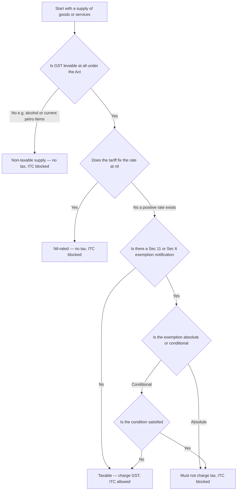
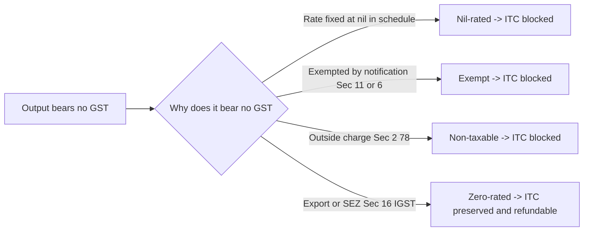

# Chapter 16 — Exemptions from GST

> *Verify current rates, thresholds, notification numbers and the latest amendments in the ICAI Study Material and RTP/MTP for your specific attempt. GST exemption entries are amended almost every Council meeting; this chapter teaches the logic and structure so you can slot in whatever the current entry says.*

---

## 1. The Problem — A Tax That Taxes Everything Taxes the Poor Hardest

GST is, by design, a tax on **consumption**. Whoever finally consumes a good or service bears the tax. That is elegant and neutral — until you remember *what* people consume.

A billionaire and a daily-wage labourer both consume rice, both fall sick and need a doctor, both send children to school, both take a bus. If GST sat on every one of those transactions at, say, 18%, the labourer — who spends nearly 100% of income on such essentials — would hand over a far larger *share* of income in tax than the billionaire, who spends only a sliver of income on food and saves the rest. A flat consumption tax is inherently **regressive**: it bites hardest at the bottom.

Three concrete problems flow from this:

1. **Equity / regressivity.** Taxing bread, medicine, schooling and public transport transfers the tax burden onto exactly the people least able to pay.
2. **Merit goods get under-consumed.** Health and education produce benefits for society beyond the individual buyer (a healthier, better-educated population). Tax them and people buy *less* of them than society wants — the opposite of what good policy intends.
3. **Administrative dead-weight.** Bringing a tiny farmer selling unbranded grain, or a single auto-rickshaw driver, into the full GST net — returns, invoices, ITC chains — costs the government more to administer than it collects, and crushes the small player.

A pure "tax everything" GST would be politically impossible and socially cruel. The tax has to have a **release valve**. That valve is the **exemption**.

---

## 2. The Core Idea — Carve Essentials and Merit Goods Out of the Charge

The core idea is disarmingly simple:

> **Levy GST broadly on almost everything, so the base is wide and rates can stay low — but surgically carve out a defined list of essential goods, merit services and small suppliers, on which no tax is charged.**

Two things make this the *right* tool:

- **Wide base, low rate.** Because so few things are exempt, the taxable base stays large, which lets the average rate stay low. A narrow-base/high-rate tax would just push more consumption into the exempt zone and distort behaviour. Exemptions are meant to be the *exception*, deliberately kept short.
- **Targeted relief.** Instead of a blanket low rate on everything, the government exempts *specifically* the things poor households and society most need — food staples, health, education, public transport, agriculture — leaving discretionary and luxury consumption fully taxed.

But — and this is the subtle sting that half the exam questions live on — **an exemption is not an unambiguous "gift."** When output is exempt, the supplier **cannot claim input tax credit (ITC)** on the GST it paid on its own purchases. That blocked ITC becomes a hidden cost baked into the price. So exemption *helps* a supplier at the very end of the chain (final consumer of an exempt service) but can *hurt* a supplier in the middle. Understanding *when exemption helps and when it hurts* is the conceptual heart of this chapter.

---

## 3. Why It's Built This Way — The Anti-Cascade Logic Turned Inside Out

Recall the one-line thesis of the whole GST system: **GST kills cascading (tax-on-tax) by letting every business claim credit for the tax embedded in its inputs.** Tax flows down the chain and is finally borne only by the consumer.

Exemption deliberately **breaks that chain** — and understanding *why breaking it has consequences* explains every downstream rule.

Picture the credit chain as a relay race passing a baton (ITC) from runner to runner. Each business collects tax on its output, subtracts the tax it paid on inputs, and remits only the difference. The baton keeps moving until the consumer, who has no one to pass it to, absorbs it.

Now **exempt one runner in the middle.** That runner:
- charges **no** output tax (good for its customer), **but**
- **cannot pass on the baton** — its own input tax has nowhere to go, so it **must absorb that input tax as a cost** and quietly bury it in the price.

The next runner down the chain, if taxable, now pays tax on a price that *already contains* buried, un-credited tax — **cascading sneaks back in.** This is exactly the evil GST was built to destroy, reappearing at the boundary of an exemption.

That single fact drives the design choices:

| Design choice | Reason rooted in the chain logic |
|---|---|
| Exemptions are kept **short and mostly at the end of the chain** (final consumer services like health, education, public transport) | If you exempt an *intermediate* supply, blocked ITC cascades into later taxable supplies. Exempting *final* supplies avoids that — there is no next runner. |
| **ITC is blocked** on exempt output (Sec 17(2), CGST Act) | You cannot claim credit for tax on inputs used to make a supply on which you collected no tax. Allowing it would be a refund of tax never collected — a subsidy, not credit relief. |
| **Zero-rating** (exports/SEZ) is treated *completely differently* from exemption | Exports must leave India *tax-free* to compete globally, so the government must *refund* embedded input tax rather than block it. Same "0% on output" but opposite ITC treatment — see §4.6. |
| Government retains a **power to grant exemption by notification** (Sec 11 CGST / Sec 6 IGST) rather than writing it into the Act | Essentials change; the Council must be able to add/remove entries fast without amending the statute. |

So exemptions are not an afterthought — they are the pressure-release valve, and their design is dictated by the need to *not* reintroduce the cascading the whole system exists to prevent.

---

## 4. Full Technical Content

### 4.1 The Power to Exempt — Section 11 CGST Act / Section 6 IGST Act

Exemption is not automatic; it flows from a statutory **power delegated to the Government** (on the GST Council's recommendation). Learn the structure, because the exam tests the *type* of exemption.

**Section 11(1) — General exemption by notification.** The Government may, if satisfied it is in the *public interest*, on the Council's recommendation, by **notification**, exempt goods or services **wholly or partly** from tax, either **absolutely** or **subject to conditions**.

- *Wholly* = 100% exemption (nil). *Partly* = concessional rate.
- *Absolutely* = the exemption is compulsory; the supplier **has no choice** and **must not** charge tax.
- *Conditionally* = exemption available only if stated conditions are met.

**Section 11(2) — Special order (ad-hoc) exemption.** Under *exceptional circumstances* specified in the order, the Government may exempt any goods/services by **special order** (not a general notification) — used for one-off situations (e.g., relief supplies after a disaster).

**Section 11(3) — Explanatory clarification.** The Government may insert an explanation in a notification within **one year** of issue to clarify scope, and it takes effect **retrospectively**.

The identical structure appears in **Section 6 of the IGST Act** for inter-State supplies, and Section 8(1) of the UTGST Act. A supply is typically exempted under *both* CGST and IGST notifications so that intra-State and inter-State versions are treated alike.

> **Memory hook — "11 = eleven-th-hour relief."** Section **11** is where the Government pulls goods/services *out* of the charge. Sub-sections: **(1) notification** (the normal route), **(2) special order** (emergency), **(3) explanation** (retrospective clarity, 1-year window).

### 4.2 Definition of "Exempt Supply" — Section 2(47) CGST Act

This definition is load-bearing; almost every ITC and registration question turns on it.

> **"Exempt supply"** means supply of any goods or services or both which **(a)** attracts a **nil rate** of tax, **or (b)** is **wholly exempt** from tax under Section 11 (CGST) or Section 6 (IGST), **and includes non-taxable supply.**

Unpack the three buckets folded into this one definition:

1. **Nil-rated** — the tariff schedule fixes the rate itself at 0% (nil).
2. **Wholly exempt** — a positive rate exists in the schedule, but a Sec 11/6 notification switches it off.
3. **Non-taxable supply — Sec 2(78):** a supply on which GST is **not leviable at all** under the Act (e.g., **alcoholic liquor for human consumption**; and the *currently* out-of-GST petroleum items — petrol, diesel, ATF, natural gas, crude — which remain under VAT/excise). These are outside GST's charging section entirely.

**Why lump all three together?** Because for the two consequences that matter most — **(i) blocked ITC** and **(ii) counting toward aggregate turnover for registration** — the law treats them identically. Whether output is nil-rated, notified-exempt, or non-taxable, the supplier gets **no ITC** on related inputs, and the value **still counts in aggregate turnover** (Sec 2(6)). Grouping them under one definition saves the Act from writing the same consequence three times.

### 4.3 The Exemption Notification Structure — Goods vs Services

Exemptions live in **notifications**, not in the Act's body. Know the two flagship pairs (numbers as originally issued — always confirm current amended text for your attempt):

| Subject | Rate notification (positive/nil rates) | Exemption notification (wholly exempt) |
|---|---|---|
| **Goods** | Notification No. **1/2017-CT(Rate)** — the rate schedules (0%, 5%, 12%, 18%, 28%) | Notification No. **2/2017-CT(Rate)** — list of exempt goods |
| **Services** | Notification No. **11/2017-CT(Rate)** — service rates | Notification No. **12/2017-CT(Rate)** — list of exempt services |

Parallel IGST versions exist (e.g., 9/2017-IT(Rate) for exempt services). **Notification 12/2017-CT(Rate)** is the single most exam-relevant document in this chapter — it is a numbered list of service **entries**, each with:
- a **description** of the exempt service,
- often a **condition** (making it a conditional exemption), and
- sometimes an **explanation / definition** of terms used.

The exam pattern: give you a service, ask whether a *specific entry* covers it, and whether *conditions* are met.

### 4.4 Absolute vs Conditional Exemption — and the Consequence

This distinction is a favourite trap.

- **Absolute exemption**: no conditions. The supplier **cannot opt to pay tax**; charging tax on an absolutely-exempt supply is *wrong* and the recipient cannot claim ITC on it. Example: services by way of **transmission or distribution of electricity by an electricity utility**; RBI services; services to the public by way of **public conveniences** (toilets).
- **Conditional exemption**: available only if the stated condition is satisfied. Miss the condition → the supply is **taxable**. Examples: **hotel accommodation** exemption applies only up to a specified declared tariff per unit per day; **transport of goods by GTA** exemption depends on the type of goods/consignment value; **charitable activities** exemption applies only to entities registered under **Section 12AA/12AB of the Income-tax Act** *and* only for the defined "charitable activities."

**Contrast with the concept of "waiver."** Under Sec 11, an *absolute* exemption is **mandatory** — this echoes the old settled principle (*CCE v. Indian Petro Chemicals*) that where an exemption is unconditional, the assessee has no liberty to forgo it. Conditional exemptions, by contrast, apply only when you *qualify*.

> **Memory hook — "Absolute = No choice, no ITC, don't you dare charge tax."** If you *see* tax charged on an absolutely-exempt supply, the ITC on it is *ineligible* — a classic wrong-answer bait in ITC sums.

### 4.5 Key Exempt Supplies — Organised by the WHY

Do not memorise the list as random trivia. Each cluster maps onto one of the three problems from §1: **equity (essentials), merit goods, or small-supplier relief.** Group them and the list almost writes itself.

#### (a) Health care — *merit good + equity*
- Services by a **clinical establishment, an authorised medical practitioner, or para-medics** by way of **health care services** (diagnosis, treatment or care for illness, injury, deformity, abnormality or pregnancy) — **exempt**.
- Services by way of **transportation of a patient in an ambulance** — exempt.
- **Not exempt (taxable):** purely **cosmetic/plastic surgery** (unless to restore anatomy/functions affected by trauma/congenital defect); hair transplant; **room rent above the notified threshold** in a hospital (a specified daily room charge above the limit is taxable — a recent, verify-current-status entry). Renting of premises to a doctor by the hospital may be taxable.

#### (b) Education — *merit good + equity*
- Services provided by an **educational institution to its students, faculty and staff** — exempt. An "educational institution" = pre-school up to higher secondary; institution providing education as part of a curriculum for a **recognised qualification**; approved vocational education courses.
- Services **to** an educational institution (up to higher secondary) by way of **transportation of students/faculty, catering (incl. mid-day meals), security, cleaning, house-keeping, and admission/examination services** — exempt (note the *up to higher secondary* limitation for most input services).
- **Not exempt:** coaching/tuition by private coaching centres (no recognised qualification); services *to* higher-education institutions other than admission/exam services.

#### (c) Agriculture — *essentials + small-supplier relief*
- Services relating to **cultivation of plants and rearing of animals** (agriculture) — including **cultivation, harvesting, threshing, plant protection, supply of farm labour, warehousing of agricultural produce, loading/unloading, packing, renting of agro-machinery, and services by a commission agent for sale/purchase of agricultural produce** — exempt.
- Many **unprocessed agricultural food items** are exempt *goods* (fresh fruit and vegetables, unbranded food grains, milk, etc. under Notification 2/2017).
- **Why:** taxing the farmer at the base of the food chain would cascade into every food price and hammer the poor — plus millions of tiny farmers are impossible to bring into the ITC net.

#### (d) Transport & essential public services — *equity*
- **Public transport of passengers:** transport by **non-air-conditioned stage/contract carriage**, **metro/monorail**, **public transport in a vessel**, and **metered auto/e-rickshaw/non-AC radio taxi** (verify current entries) — exempt, because the poor depend on it.
- **Transport of goods:** by **road (except GTA and courier)** and by **inland waterways** — exempt. Transport of *specified goods* (e.g., agricultural produce, milk, salt, food grains) by a GTA or by rail — exempt.
- **Electricity** transmission/distribution by a utility — exempt (absolute).
- **Toll charges** for access to a road or bridge — exempt.

#### (e) Others frequently tested
- **Charitable activities** by an entity registered u/s 12AA/12AB of the Income-tax Act (defined narrowly: public health care for the terminally ill/HIV/addiction, advancement of religion/spirituality/yoga, education/skill to abandoned/orphaned/homeless children, prisoners, persons over 65 in rural areas).
- **Religious/ specified services** — conduct of religious ceremonies; renting of religious precincts owned by a registered charitable/religious trust, *below notified rent thresholds*.
- **Financial:** services by way of **extending deposits/loans where consideration is interest or discount** (interest itself is exempt) — but processing fees are taxable.
- **Government services**, most services **by** Government to business below a threshold, and various **RBI / SEBI / IRDA** functions.
- **Legal services** by an individual advocate/firm of advocates to a business up to a turnover threshold, and to non-business persons — exempt (business recipients above threshold pay under **reverse charge**, which is a *separate* mechanism, not exemption).
- **Renting of residential dwelling for use as residence** (to an unregistered person) — exempt; the position for registered recipients is under reverse charge — *verify current wording*.

### 4.6 The Big Four — Nil-Rated vs Exempt vs Non-Taxable vs Zero-Rated

This is the conceptual crown jewel of the chapter and the highest-yield exam topic. Three of these terms *look* alike (all mean "0% on output") but their **ITC treatment differs**, and that difference is the whole point.

The single question that separates them: **"Was output tax actually leviable, and is the input tax credit preserved or lost?"**

| Concept | Governing idea | Output tax charged | Is it "leviable" under the Act? | ITC on inputs | In aggregate turnover? |
|---|---|---|---|---|---|
| **Nil-rated** | Schedule fixes rate at 0% | None (0%) | Yes — leviable, rate happens to be nil | **Blocked** | Yes |
| **Exempt (Sec 11/6)** | Positive rate switched off by notification | None | Yes — leviable, then exempted | **Blocked** | Yes |
| **Non-taxable (Sec 2(78))** | Outside the charging section altogether (e.g., alcohol, current petro items) | None | **No** — GST not leviable at all | **Blocked** | Yes (it is an exempt supply per 2(47)) |
| **Zero-rated (Sec 16 IGST)** | Export / supply to SEZ — must leave India tax-free | None (net) | Yes — but rated at zero *with credit preserved* | **ALLOWED / refundable** | Yes |

**The crucial contrast — and WHY it matters:**

- Nil-rated, exempt and non-taxable all share the **same painful consequence: ITC is blocked** (Sec 17(2): where goods/services are used partly for exempt supplies, credit is restricted to the taxable portion). The embedded input tax becomes a cost. Grouping them under "exempt supply" [2(47)] is precisely so this single ITC-blocking rule catches all three.

- **Zero-rated is the deliberate opposite.** Sec 16 of the IGST Act says exports and supplies to SEZ units/developers are "zero-rated," and Sec 16(2)/17(2) *expressly preserve the ITC* even though the output bears no tax. The exporter can either (i) export under a **LUT/bond without paying IGST and claim refund of unutilised ITC**, or (ii) **pay IGST and claim refund of the tax paid.** 

**Why the difference?** Policy intent is night-and-day.
- *Exemption* says: "This is an essential; don't burden the domestic consumer — and we accept a little cascading as the price." Blocking ITC is acceptable because the supply stays within India and the relief is at the consumer end.
- *Zero-rating* says: "**Do not export our taxes.**" A core principle of international trade is that goods should be taxed in the country of *consumption*, not production. If India exported goods carrying embedded Indian GST, our exports would be uncompetitive abroad. So the law must **strip out every rupee of embedded tax** — which means *refunding* input tax, not blocking it. Merely exempting exports would leave embedded input tax in the price; zero-rating with refund makes them truly tax-free.

> **Memory hook — "Exempt = tax dies AND credit dies. Zero-rated = tax dies BUT credit lives."** Or: *Exempt is a dead-end for ITC; zero-rated is a green corridor for ITC.* Nil-rated and non-taxable are just two other flavours of "credit dies."

**A second-order trap:** if a registered person makes an exempt supply, they **cannot issue a tax invoice** — they issue a **bill of supply** (Sec 31(3)(c)). And they cannot collect any amount "as tax" on it (Sec 32).

---

## 5. Worked Examples

> Each example reconciles every rupee. Rates used are illustrative — confirm current rates for your attempt.

### Example 1 — Exempt output blocks ITC (the hidden cost of exemption)

**Facts.** *Wellness Clinic Pvt Ltd* provides **health care services** (exempt). During a month it incurs:
- Medical consumables purchased: ₹10,00,000 + GST @ 12% = ₹1,20,000
- Rent of premises: ₹2,00,000 + GST @ 18% = ₹36,000
- It charges patients ₹25,00,000 for treatment.

**Required.** GST payable, ITC available, and the economic effect.

**Solution.**

| Item | Amount (₹) |
|---|---|
| Output — health care (exempt supply) | 25,00,000 |
| **Output GST** (exempt → nil) | **0** |
| Input GST paid (1,20,000 + 36,000) | 1,56,000 |
| **ITC available** (Sec 17(2): inputs used for exempt supply) | **0 — fully blocked** |
| Net GST payable to Government | 0 |
| **Un-creditable input tax absorbed as cost** | **1,56,000** |

**Reconciliation & lesson.** The clinic pays *no* GST on output (patients are spared) but *swallows* ₹1,56,000 of input GST it can never recover. That ₹1,56,000 is a real cost — it will be recovered by pricing treatment higher. **Exemption at the consumer end helps the consumer directly but leaves buried input tax.** This is the "exemption is not a pure gift" point in numbers.

### Example 2 — Common inputs used for BOTH taxable and exempt supplies (Rule 42 apportionment)

**Facts.** *EduServe LLP* runs (i) a **recognised higher-secondary school** (exempt output ₹40,00,000) and (ii) a **commercial coaching centre** (taxable output ₹60,00,000, GST @ 18%). Common input services (shared admin, IT, audit) bore input GST of **₹2,00,000** during the month. There is no exclusively-exempt or exclusively-taxable common credit for this part — treat the ₹2,00,000 as **common credit** to be apportioned.

**Required.** ITC allowable on the common credit and the reversal.

**Solution (Rule 42 logic).** Common credit is split in the ratio of **exempt turnover to total turnover**; the exempt portion must be reversed.

| Step | Amount (₹) |
|---|---|
| Total turnover (40,00,000 + 60,00,000) | 1,00,00,000 |
| Exempt turnover (school) | 40,00,000 |
| Exempt ratio = 40,00,000 / 1,00,00,000 | 0.40 (40%) |
| Common ITC (C2) | 2,00,000 |
| **ITC to reverse** (D1 = 40% × 2,00,000) | **80,000** |
| **ITC allowed** (2,00,000 − 80,000) | **1,20,000** |

**Now the output side (coaching):**

| Item | Amount (₹) |
|---|---|
| Taxable output — coaching | 60,00,000 |
| Output GST @ 18% | 10,80,000 |
| Less: eligible common ITC | (1,20,000) |
| **Net GST payable (this credit block only)** | **9,60,000** |

**Reconciliation & lesson.** Of ₹2,00,000 common input tax, exactly 40% (the exempt share) is *reversed* and becomes cost; 60% is usable. **Making even one exempt supply forces you to reverse the proportionate ITC on common inputs** — Sec 17(2) read with Rule 42. Reconciles: 80,000 reversed + 1,20,000 allowed = 2,00,000. 

### Example 3 — Zero-rated vs Exempt: the ITC treatment flips

**Facts.** *TexPort Ltd* has two divisions with identical cost structures. Each buys inputs of ₹50,00,000 + IGST @ 18% = ₹9,00,000.
- **Division A** exports garments (turnover ₹80,00,000) — **zero-rated**, under **LUT without payment of tax.**
- **Division B** supplies **exempt goods** domestically (turnover ₹80,00,000).

**Required.** Compare ITC outcome and cash effect.

**Solution.**

| | Division A (Zero-rated export) | Division B (Exempt supply) |
|---|---|---|
| Output tax | 0 (zero-rated) | 0 (exempt) |
| Input IGST paid | 9,00,000 | 9,00,000 |
| ITC status | **Preserved — Sec 16 IGST** | **Blocked — Sec 17(2)** |
| Refund of unutilised ITC (under LUT) | **9,00,000 refundable** | **Nil** |
| Input tax that becomes a cost | **0** | **9,00,000** |

**Reconciliation & lesson.** Same 0% output, opposite result. The exporter recovers **every rupee** of the ₹9,00,000 (refund) → export truly tax-free. The exempt supplier **loses all ₹9,00,000** to cost. This is precisely *why the distinction between "exempt" and "zero-rated" matters* — never conflate them.

### Example 4 — Conditional exemption: miss the condition, lose the exemption

**Facts.** *StayEasy* operates a lodge. Assume the exemption for hotel accommodation applies only where the **value of supply of a unit is ≤ ₹1,000 per day** (illustrative threshold — verify current limit; the ₹1,000/day residential-unit exemption has itself been amended, confirm for your attempt). In a day it lets:
- 20 rooms at ₹900/day
- 10 rooms at ₹1,500/day
GST rate on taxable rooms = 12%.

**Required.** Value of exempt vs taxable supply and GST payable.

**Solution.**

| Category | Rooms | Rate/day (₹) | Value (₹) | Treatment | GST (₹) |
|---|---|---|---|---|---|
| ≤ ₹1,000 unit | 20 | 900 | 18,000 | **Exempt** (condition met) | 0 |
| > ₹1,000 unit | 10 | 1,500 | 15,000 | **Taxable** (condition failed) @12% | 1,800 |
| **Total** | 30 | — | 33,000 | — | **1,800** |

**Reconciliation & lesson.** The *same service* is exempt for the cheap rooms and taxable for the pricier ones — the **condition (price per unit)** decides. Conditional exemptions require you to test the condition line by line. GST payable = ₹1,800; exempt value = ₹18,000.

---

## 6. Formats & Summary

### Decision format — "Is this supply exempt?"

*Figure 16.1 — The exemption decision tree; note every 0%-output branch except taxable ends in blocked ITC.*

### ITC treatment map — the Big Four

*Figure 16.2 — Same zero output tax, four routes; only zero-rating keeps the credit alive.*

### Master comparison table

| Feature | Nil-rated | Exempt (Sec 11/6) | Non-taxable (2(78)) | Zero-rated (Sec 16 IGST) |
|---|---|---|---|---|
| Output GST | 0% | Nil | Not leviable | 0% (with credit) |
| Legal source | Rate schedule | Exemption notification | Outside charging section | IGST Sec 16 |
| Is it "exempt supply" per 2(47)? | Yes | Yes | Yes (included) | **No** |
| ITC on inputs | Blocked | Blocked | Blocked | **Allowed/Refundable** |
| Document issued | Bill of supply | Bill of supply | Bill of supply | Tax invoice (export) |
| Counts in aggregate turnover | Yes | Yes | Yes | Yes |
| Typical example | Certain grains | Health, education | Alcohol, petrol | Exports, SEZ |

### Sec 11 quick-structure

| Provision | What it does | Key tag |
|---|---|---|
| 11(1) | General exemption by **notification** — wholly/partly, absolute/conditional | Normal route |
| 11(2) | **Special order** exemption under exceptional circumstances | Emergency |
| 11(3) | Retrospective **explanation** within 1 year | Clarity |

---

## 7. Connections

- **Chapter on Charge of GST (Sec 9 CGST / 5 IGST):** exemption is the mirror image of the charging section — Sec 11 *removes* what Sec 9 *imposes*. No charge, no exemption question.
- **Chapter on Input Tax Credit (Sec 16, 17, Rules 42/43):** this is where exemption bites hardest. **Sec 17(2)** blocks ITC on exempt supplies; **Rules 42/43** do the proportionate reversal (Example 2). You cannot understand ITC reversal without exemptions.
- **Chapter on Registration (Sec 22, 24; aggregate turnover 2(6)):** exempt supplies **count toward aggregate turnover**, so they can *drag you into* registration even though you owe no tax on them. A person making **only exempt supplies** is **not liable to register** (Sec 23) — but the moment one taxable supply appears, all turnover counts.
- **Chapter on Zero-rated supplies & Refunds (Sec 16 IGST; Sec 54 CGST):** the natural contrast partner — exports get refund of ITC precisely because they are *not* merely exempt.
- **Chapter on Tax Invoice (Sec 31, 32):** exempt supply → **bill of supply**, and you must **not collect tax** on it.
- **Reverse Charge (Sec 9(3)/(4)):** don't confuse "recipient pays under RCM" (still taxable, ITC generally available) with "exempt" (no tax, no ITC). Legal services and residential renting to registered persons are RCM, *not* exemption.

---

## 8. Traps & Examiner Tricks

1. **"Exempt = good for everyone" — FALSE.** For a mid-chain supplier, exemption *blocks ITC* and can raise costs. Watch for questions asking whether a business *benefits* from exemption.
2. **Nil-rated ≠ Zero-rated.** The single most common confusion. Nil-rated = 0% in the schedule, **ITC blocked**. Zero-rated = exports/SEZ, **ITC preserved/refundable**. If the sum says "exporter," think *refund*, never *reversal*.
3. **Non-taxable supply is still an "exempt supply."** Sec 2(47) *includes* non-taxable supply. So alcohol turnover **counts in aggregate turnover** and **blocks ITC** — students who exclude it get registration and Rule 42 sums wrong.
4. **Absolute exemption is mandatory.** You cannot "opt to pay tax" on an absolutely-exempt supply; and if someone wrongly charges tax on it, the **recipient's ITC is ineligible**.
5. **Conditional exemption — test the condition per unit/limit.** The hotel/room-rent, GTA, charitable-trust, and religious-precinct-rent entries are exempt *only* within limits. Examiners set values just over the threshold (Example 4).
6. **Coaching vs education.** A private coaching/tuition centre is **taxable** — it does not lead to a *recognised* qualification. Only "educational institutions" as defined are exempt.
7. **Interest is exempt, fees are not.** On a loan, the *interest/discount* is exempt but **processing/documentation charges are taxable.** Split them.
8. **Bill of supply, not tax invoice**, and **no tax to be collected** (Sec 32) on exempt supplies — a compliance-format trap.
9. **Rule 42 reversal is compulsory the moment there is any exempt output** — students forget that exempt turnover forces reversal of *common* ITC even when most output is taxable (Example 2).
10. **"Wholly" vs "partly" exempt.** Partly exempt = concessional rate = *still taxable* at the lower rate, so ITC is **not** blocked (it's a taxable supply). Only *wholly* exempt blocks ITC.

---

## 9. First-Principles Recap

Reason it out from scratch, and you never need to memorise a list:

1. **GST is a consumption tax → it is regressive → taxing essentials and merit goods is unfair and socially harmful.** Therefore the law needs a carve-out. → **Exemption.**
2. **A carve-out must be flexible** (essentials change) → so it is done by **notification under Sec 11 / Sec 6**, not hard-coded in the Act.
3. **The credit chain only works if tax flows through.** Break it with an exemption and the broken runner **cannot pass ITC** → so **Sec 17(2) blocks ITC** on exempt output, and to avoid re-introducing cascading, exemptions are kept **short and near the consumer end**.
4. **Because "no output tax" can arise four ways** (nil in schedule / notified exempt / outside charge / zero-rated), the law must decide *which ones keep credit*. **Only zero-rating keeps credit** — because its purpose is to make **exports tax-free**, and taxing exports is economically self-defeating. The other three block credit because their purpose is domestic relief, and the buried input tax is an accepted cost.
5. **Since blocked-credit supplies still consume resources, they must still count in turnover** (registration) and must be **documented by a bill of supply** with **no tax collected.**

Everything in this chapter is a consequence of those five sentences.

---

## 10. Quick-Revision Sheet

**Power to exempt**
- **Sec 11 CGST / Sec 6 IGST.** 11(1) notification (wholly/partly; absolute/conditional); 11(2) special order (emergency); 11(3) explanation retrospective within 1 year.

**Definitions**
- **Exempt supply — 2(47):** nil-rated **+** wholly exempt (Sec 11/6) **+** *includes* non-taxable supply.
- **Non-taxable supply — 2(78):** GST not leviable at all (alcohol; current petro items).

**Key notifications** (verify current text): Goods rates **1/2017-CT(R)**, exempt goods **2/2017-CT(R)**; Service rates **11/2017-CT(R)**, **exempt services 12/2017-CT(R)**.

**The Big Four — one-line each**
- **Nil-rated:** 0% in schedule → ITC **blocked**.
- **Exempt:** rate switched off by notification → ITC **blocked**.
- **Non-taxable:** outside charge → ITC **blocked** (still an exempt supply).
- **Zero-rated (Sec 16 IGST):** exports/SEZ → ITC **preserved/refundable** (LUT-no-tax + refund, or pay-tax + refund).

**Golden line:** *Exempt = tax dies and credit dies; Zero-rated = tax dies but credit lives.*

**Key exempt clusters (why → what)**
- Merit/equity → **Health care** (not cosmetic; room rent above limit taxable) & **Education** (institution to students; specified services to schools; coaching taxable).
- Essentials/small-supplier → **Agriculture** (cultivation, harvesting, warehousing of produce, commission agent; unbranded grains/fresh produce).
- Equity → **Transport** (non-AC public passenger transport; goods by road except GTA/courier; electricity; tolls).
- Others → **Charitable (12AA/12AB)**, religious ceremonies, **interest on loans/deposits** (fees taxable), specified Government/RBI services.

**Consequences of exemption**
- ITC blocked (Sec 17(2)); **common ITC reversed** proportionately (Rule 42/43).
- Exempt turnover **counts in aggregate turnover** (2(6)); person making **only** exempt supplies **need not register** (Sec 23).
- Issue **bill of supply** (Sec 31(3)(c)); **do not collect tax** (Sec 32).
- **Absolute** exemption = mandatory (can't opt to pay; wrong tax = no ITC to recipient). **Conditional** = test the condition. **Partly** exempt = concessional rate = still taxable = ITC allowed.

**Top traps:** nil-rated ≠ zero-rated; non-taxable is still "exempt"; interest exempt but fees taxable; coaching ≠ education; conditional limits (hotel/GTA/charity); any exempt output → Rule 42 reversal.

> *Final reminder: exemption entries, thresholds and rates are amended frequently. Lock in the exact current entries, room-rent limits, hotel-tariff slabs, and RCM boundaries from the latest ICAI Study Material and amendments applicable to your examination attempt.*
