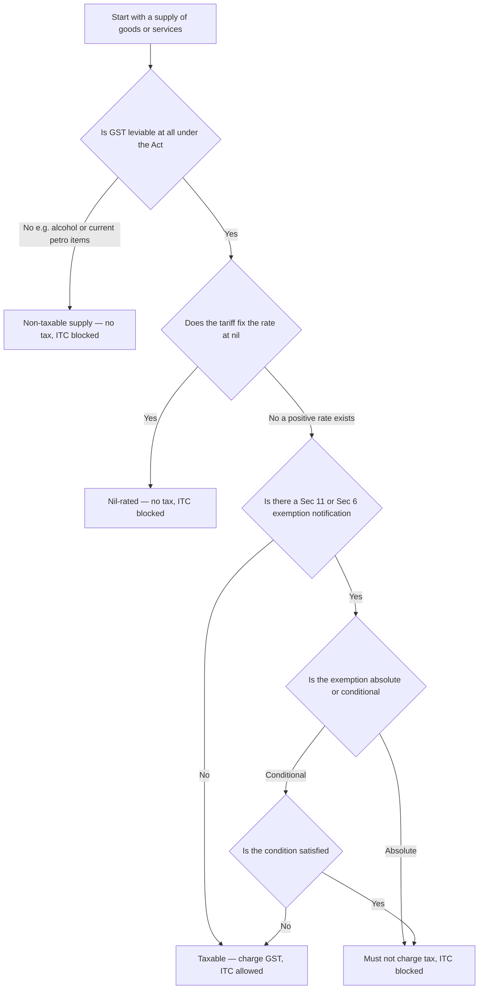
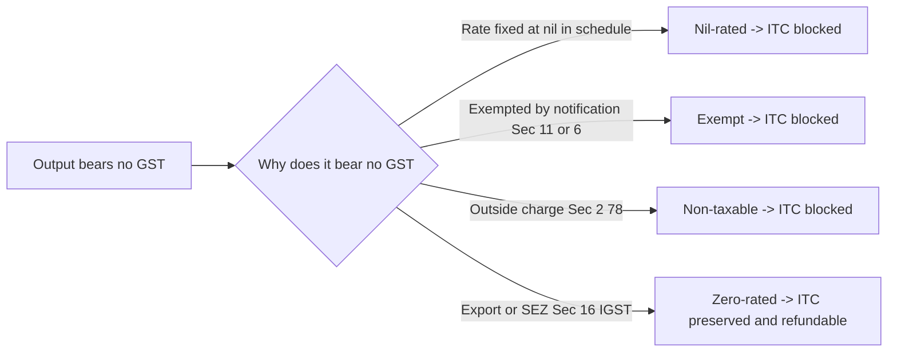
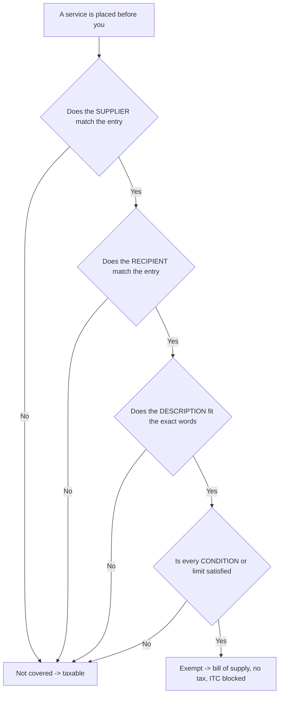
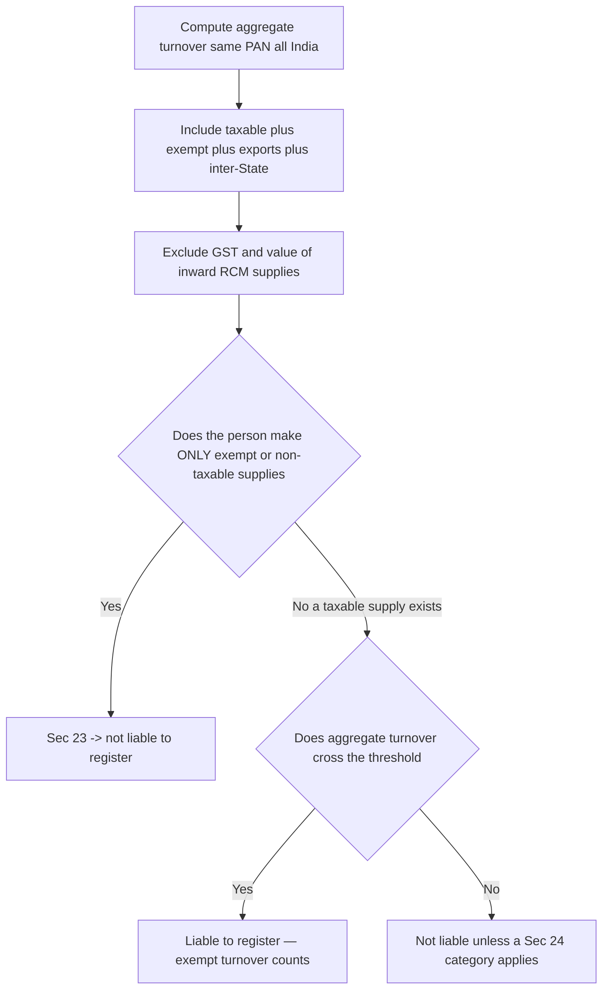

<!-- v2-deep -->

# Chapter 16 — Exemptions from GST

> *Verify current rates, thresholds, notification numbers and the latest amendments in the ICAI Study Material and RTP/MTP for your specific attempt. GST exemption entries are amended almost every Council meeting; this chapter teaches the logic and structure so you can slot in whatever the current entry says.*

---

## 1. The Problem — A Tax That Taxes Everything Taxes the Poor Hardest

GST is, by design, a tax on **consumption**. Whoever finally consumes a good or service bears the tax. That is elegant and neutral — until you remember *what* people consume.

A billionaire and a daily-wage labourer both consume rice, both fall sick and need a doctor, both send children to school, both take a bus. If GST sat on every one of those transactions at, say, 18%, the labourer — who spends nearly 100% of income on such essentials — would hand over a far larger *share* of income in tax than the billionaire, who spends only a sliver of income on food and saves the rest. A flat consumption tax is inherently **regressive**: it bites hardest at the bottom.

*Put a number on it.* A household earning ₹10,000/month that spends every rupee on food, medicine and bus fares taxed at 18% would surrender ₹1,800 — **18% of income** — as tax. A household earning ₹10,00,000/month that spends only ₹2,00,000 on the same essentials and saves the rest pays ₹36,000 — just **3.6% of income**. Same rate, radically different burden *as a fraction of income*. This "burden falls as income rises" pattern is the technical definition of regressivity, and it is the single fact that forces exemptions to exist. Exempt those essentials and the poor household's effective rate collapses toward zero while the rich household — which spends most of its money on taxed discretionary goods — is barely relieved. Exemption is therefore a **crude but self-targeting redistribution tool**: it channels relief to whoever spends the largest income-share on the exempt item, which is precisely the poor.

Three concrete problems flow from this:

1. **Equity / regressivity.** Taxing bread, medicine, schooling and public transport transfers the tax burden onto exactly the people least able to pay.
2. **Merit goods get under-consumed.** Health and education produce benefits for society beyond the individual buyer (a healthier, better-educated population). Tax them and people buy *less* of them than society wants — the opposite of what good policy intends. Economists call this a *positive externality*: the buyer captures only part of the benefit, so left to the market the good is under-purchased; a tax makes the under-consumption worse, an exemption partially corrects it.
3. **Administrative dead-weight.** Bringing a tiny farmer selling unbranded grain, or a single auto-rickshaw driver, into the full GST net — returns, invoices, ITC chains — costs the government more to administer than it collects, and crushes the small player.

A pure "tax everything" GST would be politically impossible and socially cruel. The tax has to have a **release valve**. That valve is the **exemption**.

> **Exemption vs threshold vs composition — three different release valves, don't confuse them.** GST actually has *three* pressure valves and the exam loves to blur them. **Exemption** removes a *supply* from tax regardless of who makes it (rice is exempt whether sold by a giant or a hawker). The **registration threshold** (Sec 22 — ₹20/10 lakh services, ₹40/20 lakh goods; *verify current*) removes a *small person* from the net regardless of what they sell. **Composition** (Sec 10) keeps a small person *inside* the net but at a flat concessional rate with no ITC. Exemption is supply-based; threshold and composition are person-based. Knowing which valve a question is really about is half the marks.

---

## 2. The Core Idea — Carve Essentials and Merit Goods Out of the Charge

The core idea is disarmingly simple:

> **Levy GST broadly on almost everything, so the base is wide and rates can stay low — but surgically carve out a defined list of essential goods, merit services and small suppliers, on which no tax is charged.**

Two things make this the *right* tool:

- **Wide base, low rate.** Because so few things are exempt, the taxable base stays large, which lets the average rate stay low. A narrow-base/high-rate tax would just push more consumption into the exempt zone and distort behaviour. Exemptions are meant to be the *exception*, deliberately kept short.
- **Targeted relief.** Instead of a blanket low rate on everything, the government exempts *specifically* the things poor households and society most need — food staples, health, education, public transport, agriculture — leaving discretionary and luxury consumption fully taxed.

But — and this is the subtle sting that half the exam questions live on — **an exemption is not an unambiguous "gift."** When output is exempt, the supplier **cannot claim input tax credit (ITC)** on the GST it paid on its own purchases. That blocked ITC becomes a hidden cost baked into the price. So exemption *helps* a supplier at the very end of the chain (final consumer of an exempt service) but can *hurt* a supplier in the middle. Understanding *when exemption helps and when it hurts* is the conceptual heart of this chapter.

**Exemption is not the only way to get "no tax" — and the alternatives behave differently.** Keep these four legal devices distinct in your head, because they are drafted by different sections and carry different ITC consequences:

| Device | Mechanism | ITC on inputs | Typical use |
|---|---|---|---|
| **Exclusion (Schedule III)** | The activity is deemed *neither goods nor services* — it is outside "supply" itself | No ITC (not a supply) | Salary to employee, sale of land/building, court fees, funeral services |
| **Non-levy (out of Sec 9 charge)** | GST simply not leviable on the item | Blocked | Alcohol, current petro products |
| **Exemption (Sec 11/6)** | Leviable, but switched off by notification | Blocked | Health, education, agriculture |
| **Zero-rating (Sec 16 IGST)** | Leviable, rated at zero *with credit* | **Preserved / refundable** | Exports, SEZ supplies |

The exam trap: a **Schedule III** entry (e.g., sale of land, actionable claims other than lottery/betting/gambling, services by an employee to employer) is *not* an exempt supply at all — it is *not a supply*, so it does **not** even enter the exempt-supply definition and (per a clarification) is **not** included in the "value of exempt supply" for Rule 42 reversal *except* where the law specifically deems it so (e.g., sale of land/building and certain securities are treated as exempt-supply value only for apportionment). Treat "outside supply" and "exempt supply" as different postcodes.

---

## 3. Why It's Built This Way — The Anti-Cascade Logic Turned Inside Out

Recall the one-line thesis of the whole GST system: **GST kills cascading (tax-on-tax) by letting every business claim credit for the tax embedded in its inputs.** Tax flows down the chain and is finally borne only by the consumer.

Exemption deliberately **breaks that chain** — and understanding *why breaking it has consequences* explains every downstream rule.

Picture the credit chain as a relay race passing a baton (ITC) from runner to runner. Each business collects tax on its output, subtracts the tax it paid on inputs, and remits only the difference. The baton keeps moving until the consumer, who has no one to pass it to, absorbs it.

Now **exempt one runner in the middle.** That runner:
- charges **no** output tax (good for its customer), **but**
- **cannot pass on the baton** — its own input tax has nowhere to go, so it **must absorb that input tax as a cost** and quietly bury it in the price.

The next runner down the chain, if taxable, now pays tax on a price that *already contains* buried, un-credited tax — **cascading sneaks back in.** This is exactly the evil GST was built to destroy, reappearing at the boundary of an exemption.

**The counter-intuitive result — "exemption in the middle can raise the total tax."** Because the exempt runner buries un-credited input tax in its price, and the *next* runner taxes that inflated price, the government can actually collect *more* total tax on a chain with a mid-stream exemption than on a fully taxable chain. A mid-chain exemption is thus sometimes worse for the final consumer than no exemption at all. This is why the theory of exemptions holds that **exemptions are only unambiguously beneficial when granted at the final (consumer-facing) stage.** Exam questions that ask "does exempting the intermediate service help the final consumer?" are testing exactly this: often the honest answer is *no*.

That single fact drives the design choices:

| Design choice | Reason rooted in the chain logic |
|---|---|
| Exemptions are kept **short and mostly at the end of the chain** (final consumer services like health, education, public transport) | If you exempt an *intermediate* supply, blocked ITC cascades into later taxable supplies. Exempting *final* supplies avoids that — there is no next runner. |
| **ITC is blocked** on exempt output (Sec 17(2), CGST Act) | You cannot claim credit for tax on inputs used to make a supply on which you collected no tax. Allowing it would be a refund of tax never collected — a subsidy, not credit relief. |
| **Zero-rating** (exports/SEZ) is treated *completely differently* from exemption | Exports must leave India *tax-free* to compete globally, so the government must *refund* embedded input tax rather than block it. Same "0% on output" but opposite ITC treatment — see §4.6. |
| Government retains a **power to grant exemption by notification** (Sec 11 CGST / Sec 6 IGST) rather than writing it into the Act | Essentials change; the Council must be able to add/remove entries fast without amending the statute. |

So exemptions are not an afterthought — they are the pressure-release valve, and their design is dictated by the need to *not* reintroduce the cascading the whole system exists to prevent.

---

## 4. Full Technical Content

### 4.1 The Power to Exempt — Section 11 CGST Act / Section 6 IGST Act

Exemption is not automatic; it flows from a statutory **power delegated to the Government** (on the GST Council's recommendation). Learn the structure, because the exam tests the *type* of exemption.

**Section 11(1) — General exemption by notification.** The Government may, if satisfied it is in the *public interest*, on the Council's recommendation, by **notification**, exempt goods or services **wholly or partly** from tax, either **absolutely** or **subject to conditions**.

- *Wholly* = 100% exemption (nil). *Partly* = concessional rate.
- *Absolutely* = the exemption is compulsory; the supplier **has no choice** and **must not** charge tax.
- *Conditionally* = exemption available only if stated conditions are met.

**Section 11(2) — Special order (ad-hoc) exemption.** Under *exceptional circumstances* specified in the order, the Government may exempt any goods/services by **special order** (not a general notification) — used for one-off situations (e.g., relief supplies after a disaster).

**Section 11(3) — Explanatory clarification.** The Government may insert an explanation in a notification within **one year** of issue to clarify scope, and it takes effect **retrospectively**.

The identical structure appears in **Section 6 of the IGST Act** for inter-State supplies, and Section 8(1) of the UTGST Act. A supply is typically exempted under *both* CGST and IGST notifications so that intra-State and inter-State versions are treated alike.

**Two finer points the exam probes:**

- **"Public interest" and "on the recommendation of the Council" are both preconditions.** The Government cannot exempt on its own whim; the twin gate is (i) Council recommendation and (ii) satisfaction that it is in the public interest. A question that says "the Central Government unilaterally exempted X without the Council" is flagging an invalid exemption.
- **A notification generally takes effect from the date stated in it** (prospective unless the notification itself provides otherwise); only the **11(3) explanation** is expressly retrospective within the one-year window. Do not assume every exemption is backdated.
- **Effective date of a notification (Sec 11(4)-type mechanics):** unless a later date is specified, a rate/exemption notification comes into force on the date of its issue/publication. Watch for questions dating a supply *just before* an exemption's commencement — it stays taxable.

> **Memory hook — "11 = eleven-th-hour relief."** Section **11** is where the Government pulls goods/services *out* of the charge. Sub-sections: **(1) notification** (the normal route), **(2) special order** (emergency), **(3) explanation** (retrospective clarity, 1-year window).

### 4.2 Definition of "Exempt Supply" — Section 2(47) CGST Act

This definition is load-bearing; almost every ITC and registration question turns on it.

> **"Exempt supply"** means supply of any goods or services or both which **(a)** attracts a **nil rate** of tax, **or (b)** is **wholly exempt** from tax under Section 11 (CGST) or Section 6 (IGST), **and includes non-taxable supply.**

Unpack the three buckets folded into this one definition:

1. **Nil-rated** — the tariff schedule fixes the rate itself at 0% (nil).
2. **Wholly exempt** — a positive rate exists in the schedule, but a Sec 11/6 notification switches it off.
3. **Non-taxable supply — Sec 2(78):** a supply on which GST is **not leviable at all** under the Act (e.g., **alcoholic liquor for human consumption**; and the *currently* out-of-GST petroleum items — petrol, diesel, ATF, natural gas, crude — which remain under VAT/excise). These are outside GST's charging section entirely.

**Why lump all three together?** Because for the two consequences that matter most — **(i) blocked ITC** and **(ii) counting toward aggregate turnover for registration** — the law treats them identically. Whether output is nil-rated, notified-exempt, or non-taxable, the supplier gets **no ITC** on related inputs, and the value **still counts in aggregate turnover** (Sec 2(6)). Grouping them under one definition saves the Act from writing the same consequence three times.

**A subtle drafting point — "wholly" is doing real work.** Sec 2(47)(b) says *wholly* exempt. A **partly** exempt supply (concessional-rate) is deliberately **not** an exempt supply — it is a *taxable supply at a lower rate*, so ITC is **fully available** on it. This one word is why §4.4's "partly exempt = ITC allowed" rule holds. Students who read "exempt" loosely reverse ITC they were entitled to keep.

**And "supply" is a precondition.** If a transaction is not a "supply" at all (Schedule III — e.g., employee services, sale of land), it never reaches Sec 2(47). It is therefore *not* an exempt supply, though — as noted in §2 — the *value* of certain Schedule-III/exempt-adjacent items (sale of land, sale of building after completion, certain securities) is separately deemed to be exempt-supply value **only for Rule 42/43 apportionment** by an explanation to those rules. Keep "is it a supply?" and "is it exempt?" as two sequential gates.

### 4.3 The Exemption Notification Structure — Goods vs Services

Exemptions live in **notifications**, not in the Act's body. Know the two flagship pairs (numbers as originally issued — always confirm current amended text for your attempt):

| Subject | Rate notification (positive/nil rates) | Exemption notification (wholly exempt) |
|---|---|---|
| **Goods** | Notification No. **1/2017-CT(Rate)** — the rate schedules (0%, 5%, 12%, 18%, 28%) | Notification No. **2/2017-CT(Rate)** — list of exempt goods |
| **Services** | Notification No. **11/2017-CT(Rate)** — service rates | Notification No. **12/2017-CT(Rate)** — list of exempt services |

Parallel IGST versions exist (e.g., 9/2017-IT(Rate) for exempt services). **Notification 12/2017-CT(Rate)** is the single most exam-relevant document in this chapter — it is a numbered list of service **entries**, each with:
- a **description** of the exempt service,
- often a **condition** (making it a conditional exemption), and
- sometimes an **explanation / definition** of terms used.

The exam pattern: give you a service, ask whether a *specific entry* covers it, and whether *conditions* are met.

**How to actually read an entry (the four-part test).** Every 12/2017 entry can be dissected into: **(1) the supplier** — does the exemption require a specific kind of provider (e.g., "by a clinical establishment", "by an educational institution", "by an individual advocate")? **(2) the recipient** — is it restricted by who receives it (e.g., "to an educational institution", "to a business entity with turnover up to ₹X")? **(3) the service description** — does the activity fit the exact words? **(4) the condition/limit** — is any threshold, tariff cap, or registration requirement satisfied? A supply is exempt only if **all four** align. Examiners break exactly one of these four to make an otherwise-exempt-looking supply taxable — train yourself to check all four in order.

### 4.4 Absolute vs Conditional Exemption — and the Consequence

This distinction is a favourite trap.

- **Absolute exemption**: no conditions. The supplier **cannot opt to pay tax**; charging tax on an absolutely-exempt supply is *wrong* and the recipient cannot claim ITC on it. Example: services by way of **transmission or distribution of electricity by an electricity utility**; RBI services; services to the public by way of **public conveniences** (toilets).
- **Conditional exemption**: available only if the stated condition is satisfied. Miss the condition → the supply is **taxable**. Examples: **hotel accommodation** exemption applies only up to a specified declared tariff per unit per day; **transport of goods by GTA** exemption depends on the type of goods/consignment value; **charitable activities** exemption applies only to entities registered under **Section 12AA/12AB of the Income-tax Act** *and* only for the defined "charitable activities."

**Contrast with the concept of "waiver."** Under Sec 11, an *absolute* exemption is **mandatory** — this echoes the old settled principle (*CCE v. Indian Petro Chemicals*) that where an exemption is unconditional, the assessee has no liberty to forgo it. Conditional exemptions, by contrast, apply only when you *qualify*.

**Why the law forces absolute exemptions to be mandatory.** If suppliers could *choose* to pay tax on an absolutely-exempt supply, they would charge tax whenever it let them unlock ITC — turning the exemption into a back-door credit refund and distorting prices. Making it mandatory slams that door: no tax, no ITC, no games. A conditional exemption doesn't need this rule because failing the condition already re-opens the taxable route legitimately.

**Where conditional exemption meets ITC timing.** If you are unsure at the time of supply whether a condition will be met (e.g., a threshold measured over the year), you may end up having treated a supply as exempt that later turns taxable, or vice-versa — triggering credit re-computation. The safe exam approach: test the condition on the **facts as given for that transaction/period** and do not assume future events.

> **Memory hook — "Absolute = No choice, no ITC, don't you dare charge tax."** If you *see* tax charged on an absolutely-exempt supply, the ITC on it is *ineligible* — a classic wrong-answer bait in ITC sums.

### 4.5 Key Exempt Supplies — Organised by the WHY

Do not memorise the list as random trivia. Each cluster maps onto one of the three problems from §1: **equity (essentials), merit goods, or small-supplier relief.** Group them and the list almost writes itself.

#### (a) Health care — *merit good + equity*
- Services by a **clinical establishment, an authorised medical practitioner, or para-medics** by way of **health care services** (diagnosis, treatment or care for illness, injury, deformity, abnormality or pregnancy) — **exempt**.
- Services by way of **transportation of a patient in an ambulance** — exempt.
- Services by way of **giving on rent to a clinical establishment**, and **services by a veterinary clinic** in relation to health care of animals/birds — exempt (verify exact wording).
- **Not exempt (taxable):** purely **cosmetic/plastic surgery** (unless to restore anatomy/functions affected by trauma/congenital defect); hair transplant; **room rent above the notified threshold** in a hospital (a specified daily room charge above the limit — commonly cited as above ₹5,000 per day per patient excluding ICU/CCU/ICCU/NICU, taxed at the notified rate; verify current status/rate). Renting of premises to a doctor by the hospital may be taxable.
- **Composite supply nuance:** a hospital's **package** (room + medicine + doctor + food) supplied to an in-patient is treated as a *composite supply of health care services*, the principal supply, and rides on the exemption — food supplied to *in-patients* as advised by the doctor is part of exempt health care, but food to attendants/visitors from the canteen is taxable.

#### (b) Education — *merit good + equity*
- Services provided by an **educational institution to its students, faculty and staff** — exempt. An "educational institution" = pre-school up to higher secondary; institution providing education as part of a curriculum for a **recognised qualification**; approved vocational education courses.
- Services **to** an educational institution (up to higher secondary) by way of **transportation of students/faculty, catering (incl. mid-day meals), security, cleaning, house-keeping, and admission/examination services** — exempt (note the *up to higher secondary* limitation for most input services).
- Services provided **by** an educational institution by way of conduct of **entrance examination** against a fee — exempt.
- **Not exempt:** coaching/tuition by private coaching centres (no recognised qualification); services *to* higher-education institutions other than admission/exam services; **placement/campus-recruitment** services; sale of **uniforms, books, stationery** by third parties.

#### (c) Agriculture — *essentials + small-supplier relief*
- Services relating to **cultivation of plants and rearing of animals** (agriculture) — including **cultivation, harvesting, threshing, plant protection, supply of farm labour, warehousing of agricultural produce, loading/unloading, packing, renting of agro-machinery, and services by a commission agent for sale/purchase of agricultural produce** — exempt.
- Many **unprocessed agricultural food items** are exempt *goods* (fresh fruit and vegetables, unbranded food grains, milk, etc. under Notification 2/2017).
- **Sharp line — "agricultural produce" is defined narrowly.** It means produce out of cultivation of plants / rearing of animals on which **no further processing is done, or only such processing as a cultivator/producer does which does not alter its essential characteristics but makes it marketable for the primary market.** So **loading, warehousing of *processed* produce** (e.g., tea, coffee, jaggery, pulses that are milled/polished, sugar) is **taxable** — the processing pushed it past the "primary market" line. This "primary produce vs processed" cut is a repeat exam question.
- **Why:** taxing the farmer at the base of the food chain would cascade into every food price and hammer the poor — plus millions of tiny farmers are impossible to bring into the ITC net.

#### (d) Transport & essential public services — *equity*
- **Public transport of passengers:** transport by **non-air-conditioned stage/contract carriage**, **metro/monorail**, **public transport in a vessel**, and **metered auto/e-rickshaw/non-AC radio taxi** (verify current entries) — exempt, because the poor depend on it. **Contrast:** AC contract carriage, radio taxi, and app-based cab aggregators are **taxable** (comfort/discretionary).
- **Transport of goods:** by **road (except GTA and courier)** and by **inland waterways** — exempt. Transport of *specified goods* (e.g., agricultural produce, milk, salt, food grains, organic manure, newspapers/magazines, relief materials, defence equipment) by a **GTA or by rail** — exempt.
- **GTA also has a value-based exemption** for a single carriage/consignment below notified limits (e.g., where consideration for a single consignee's goods in a carriage is up to ₹750, or all goods in a single carriage up to ₹1,500 — *verify current figures*).
- **Electricity** transmission/distribution by a utility — exempt (absolute).
- **Toll charges** for access to a road or bridge — exempt.

#### (e) Others frequently tested
- **Charitable activities** by an entity registered u/s 12AA/12AB of the Income-tax Act (defined narrowly: public health care for the terminally ill/HIV/addiction, advancement of religion/spirituality/yoga, education/skill to abandoned/orphaned/homeless children, prisoners, persons over 65 in rural areas). *Note:* only "charitable activities" as **defined** are exempt — a charitable trust running an unrelated commercial activity (renting a hall, selling goods) is **taxable** on that.
- **Religious/ specified services** — conduct of religious ceremonies; renting of religious precincts owned by a registered charitable/religious trust, *below notified rent thresholds* (commonly cited: rooms up to ₹1,000/day, halls/community open space up to ₹10,000/day, shops up to ₹10,000/month — *verify current limits*).
- **Financial:** services by way of **extending deposits/loans where consideration is interest or discount** (interest itself is exempt) — but processing fees are taxable. Also exempt: **inter-se sale/purchase of foreign currency among banks**, and various services rendered *between* banks/financial institutions (verify).
- **Government services**, most services **by** Government to business below a threshold, and various **RBI / SEBI / IRDA** functions. Pure services (excluding works contract/goods) provided **to** Government/local authority in relation to functions under Articles 243G/243W — exempt.
- **Legal services** by an individual advocate/firm of advocates to a business up to a turnover threshold, and to non-business persons — exempt (business recipients above threshold pay under **reverse charge**, which is a *separate* mechanism, not exemption).
- **Renting of residential dwelling for use as residence** — exempt when let to an **unregistered person**; where the recipient is a **registered person**, the position is under **reverse charge** (recipient pays), and where a registered person takes it in a *personal* capacity for own residence a carve-back applies — *verify current wording*.
- **Services by way of admission to** specified events (recognised sporting events, and cultural/religious/circus/theatre etc. where the admission charge is below a notified per-person limit) — exempt.

### 4.6 The Big Four — Nil-Rated vs Exempt vs Non-Taxable vs Zero-Rated

This is the conceptual crown jewel of the chapter and the highest-yield exam topic. Three of these terms *look* alike (all mean "0% on output") but their **ITC treatment differs**, and that difference is the whole point.

The single question that separates them: **"Was output tax actually leviable, and is the input tax credit preserved or lost?"**

| Concept | Governing idea | Output tax charged | Is it "leviable" under the Act? | ITC on inputs | In aggregate turnover? |
|---|---|---|---|---|---|
| **Nil-rated** | Schedule fixes rate at 0% | None (0%) | Yes — leviable, rate happens to be nil | **Blocked** | Yes |
| **Exempt (Sec 11/6)** | Positive rate switched off by notification | None | Yes — leviable, then exempted | **Blocked** | Yes |
| **Non-taxable (Sec 2(78))** | Outside the charging section altogether (e.g., alcohol, current petro items) | None | **No** — GST not leviable at all | **Blocked** | Yes (it is an exempt supply per 2(47)) |
| **Zero-rated (Sec 16 IGST)** | Export / supply to SEZ — must leave India tax-free | None (net) | Yes — but rated at zero *with credit preserved* | **ALLOWED / refundable** | Yes |

**The crucial contrast — and WHY it matters:**

- Nil-rated, exempt and non-taxable all share the **same painful consequence: ITC is blocked** (Sec 17(2): where goods/services are used partly for exempt supplies, credit is restricted to the taxable portion). The embedded input tax becomes a cost. Grouping them under "exempt supply" [2(47)] is precisely so this single ITC-blocking rule catches all three.

- **Zero-rated is the deliberate opposite.** Sec 16 of the IGST Act says exports and supplies to SEZ units/developers are "zero-rated," and Sec 16(2)/17(2) *expressly preserve the ITC* even though the output bears no tax. The exporter can either (i) export under a **LUT/bond without paying IGST and claim refund of unutilised ITC**, or (ii) **pay IGST and claim refund of the tax paid.** 

**Why the difference?** Policy intent is night-and-day.
- *Exemption* says: "This is an essential; don't burden the domestic consumer — and we accept a little cascading as the price." Blocking ITC is acceptable because the supply stays within India and the relief is at the consumer end.
- *Zero-rating* says: "**Do not export our taxes.**" A core principle of international trade is that goods should be taxed in the country of *consumption*, not production (the "destination principle"). If India exported goods carrying embedded Indian GST, our exports would be uncompetitive abroad. So the law must **strip out every rupee of embedded tax** — which means *refunding* input tax, not blocking it. Merely exempting exports would leave embedded input tax in the price; zero-rating with refund makes them truly tax-free.

**One more twist — an exempt/nil supply that is *exported* becomes zero-rated.** Sec 16(1) IGST applies to exports **irrespective of whether the goods/services are otherwise exempt**. A recent amendment further clarified that **for exempt/nil-rated exported goods, refund is available only via the "with-payment" route in limited cases or the LUT-refund route** — the practical upshot is that even exempt goods, when exported, can carry ITC refund because zero-rating overrides the domestic exemption's ITC block. This "export of an exempt good" is a favourite RTP twist: the domestic sale blocks ITC, the export unlocks it.

> **Memory hook — "Exempt = tax dies AND credit dies. Zero-rated = tax dies BUT credit lives."** Or: *Exempt is a dead-end for ITC; zero-rated is a green corridor for ITC.* Nil-rated and non-taxable are just two other flavours of "credit dies."

**A second-order trap:** if a registered person makes an exempt supply, they **cannot issue a tax invoice** — they issue a **bill of supply** (Sec 31(3)(c)). And they cannot collect any amount "as tax" on it (Sec 32).

### 4.7 Exemption and Registration — the Turnover Interplay

Because exempt supplies **count in aggregate turnover** (Sec 2(6) — the all-India, same-PAN sum of taxable + exempt + exports + inter-State supplies, excluding GST and inward RCM), exemption and registration interlock in ways the exam repeatedly tests:

- **Only exempt supplies → not liable to register (Sec 23(1)(a)).** A person *exclusively* engaged in supplying wholly-exempt/nil/non-taxable goods or services is **not required to register**, however large the turnover. A farmer selling only exempt produce, or a person supplying only exempt health care, stays out.
- **But mixed supplies → all turnover counts.** The instant a person makes *one* taxable supply and crosses the threshold, **aggregate turnover includes the exempt supplies too** for deciding registration liability. So exempt turnover can *push a person over* the threshold even though the exempt part owes no tax.
- **Reverse-charge liability overrides Sec 23.** Note Sec 24 mandatory-registration categories: a person otherwise exempt-only but liable to pay tax **under reverse charge** must still register — Sec 23's shelter does not cover them (this interplay was amended; *verify current Sec 23 vs Sec 24 override wording*).
- **Aggregate turnover excludes** the value of inward supplies on which you pay RCM, and excludes CGST/SGST/IGST/cess — but **includes** exempt outward supplies. A very common numerical: compute aggregate turnover for a person with taxable + exempt + export + RCM-inward figures.

### 4.8 Withdrawal and Amendment of Exemptions

Exemption entries are **dynamic**. The Council adds and deletes entries frequently (health room-rent, hotel tariffs, and job-work entries are perennially amended). Two consequences:

- **Rate/exemption change mid-transaction → apply the "time of supply" rules (Sec 14).** When an exemption is *withdrawn* (supply becomes taxable) or *granted* (becomes exempt) between the date of supply, invoice and payment, Sec 14 fixes which regime applies. Do not guess by invoice date alone.
- **Transition of ITC on withdrawal/grant.** If a previously-exempt supply becomes **taxable**, the supplier can now claim ITC — including, under Sec 18(1), credit on inputs/inputs-in-stock/capital goods (reduced for use) held on the day before it became taxable. Conversely, if a taxable supply becomes **exempt**, Sec 18(4) requires **reversal** of ITC on inputs in stock and capital goods (reduced) relatable to that supply. This is where the exemption chapter feeds directly into ITC Sec 18 — a high-value cross-topic.

---

## 5. Worked Examples

> Each example reconciles every rupee. Rates used are illustrative — confirm current rates for your attempt.

### Example 1 — Exempt output blocks ITC (the hidden cost of exemption)

**Facts.** *Wellness Clinic Pvt Ltd* provides **health care services** (exempt). During a month it incurs:
- Medical consumables purchased: ₹10,00,000 + GST @ 12% = ₹1,20,000
- Rent of premises: ₹2,00,000 + GST @ 18% = ₹36,000
- It charges patients ₹25,00,000 for treatment.

**Required.** GST payable, ITC available, and the economic effect.

**Solution.**

| Item | Amount (₹) |
|---|---|
| Output — health care (exempt supply) | 25,00,000 |
| **Output GST** (exempt → nil) | **0** |
| Input GST paid (1,20,000 + 36,000) | 1,56,000 |
| **ITC available** (Sec 17(2): inputs used for exempt supply) | **0 — fully blocked** |
| Net GST payable to Government | 0 |
| **Un-creditable input tax absorbed as cost** | **1,56,000** |

**Reconciliation & lesson.** The clinic pays *no* GST on output (patients are spared) but *swallows* ₹1,56,000 of input GST it can never recover. That ₹1,56,000 is a real cost — it will be recovered by pricing treatment higher. **Exemption at the consumer end helps the consumer directly but leaves buried input tax.** This is the "exemption is not a pure gift" point in numbers.

### Example 2 — Common inputs used for BOTH taxable and exempt supplies (Rule 42 apportionment)

**Facts.** *EduServe LLP* runs (i) a **recognised higher-secondary school** (exempt output ₹40,00,000) and (ii) a **commercial coaching centre** (taxable output ₹60,00,000, GST @ 18%). Common input services (shared admin, IT, audit) bore input GST of **₹2,00,000** during the month. There is no exclusively-exempt or exclusively-taxable common credit for this part — treat the ₹2,00,000 as **common credit** to be apportioned.

**Required.** ITC allowable on the common credit and the reversal.

**Solution (Rule 42 logic).** Common credit is split in the ratio of **exempt turnover to total turnover**; the exempt portion must be reversed.

| Step | Amount (₹) |
|---|---|
| Total turnover (40,00,000 + 60,00,000) | 1,00,00,000 |
| Exempt turnover (school) | 40,00,000 |
| Exempt ratio = 40,00,000 / 1,00,00,000 | 0.40 (40%) |
| Common ITC (C2) | 2,00,000 |
| **ITC to reverse** (D1 = 40% × 2,00,000) | **80,000** |
| **ITC allowed** (2,00,000 − 80,000) | **1,20,000** |

**Now the output side (coaching):**

| Item | Amount (₹) |
|---|---|
| Taxable output — coaching | 60,00,000 |
| Output GST @ 18% | 10,80,000 |
| Less: eligible common ITC | (1,20,000) |
| **Net GST payable (this credit block only)** | **9,60,000** |

**Reconciliation & lesson.** Of ₹2,00,000 common input tax, exactly 40% (the exempt share) is *reversed* and becomes cost; 60% is usable. **Making even one exempt supply forces you to reverse the proportionate ITC on common inputs** — Sec 17(2) read with Rule 42. Reconciles: 80,000 reversed + 1,20,000 allowed = 2,00,000. 

### Example 3 — Zero-rated vs Exempt: the ITC treatment flips

**Facts.** *TexPort Ltd* has two divisions with identical cost structures. Each buys inputs of ₹50,00,000 + IGST @ 18% = ₹9,00,000.
- **Division A** exports garments (turnover ₹80,00,000) — **zero-rated**, under **LUT without payment of tax.**
- **Division B** supplies **exempt goods** domestically (turnover ₹80,00,000).

**Required.** Compare ITC outcome and cash effect.

**Solution.**

| | Division A (Zero-rated export) | Division B (Exempt supply) |
|---|---|---|
| Output tax | 0 (zero-rated) | 0 (exempt) |
| Input IGST paid | 9,00,000 | 9,00,000 |
| ITC status | **Preserved — Sec 16 IGST** | **Blocked — Sec 17(2)** |
| Refund of unutilised ITC (under LUT) | **9,00,000 refundable** | **Nil** |
| Input tax that becomes a cost | **0** | **9,00,000** |

**Reconciliation & lesson.** Same 0% output, opposite result. The exporter recovers **every rupee** of the ₹9,00,000 (refund) → export truly tax-free. The exempt supplier **loses all ₹9,00,000** to cost. This is precisely *why the distinction between "exempt" and "zero-rated" matters* — never conflate them.

### Example 4 — Conditional exemption: miss the condition, lose the exemption

**Facts.** *StayEasy* operates a lodge. Assume the exemption for hotel accommodation applies only where the **value of supply of a unit is ≤ ₹1,000 per day** (illustrative threshold — verify current limit; the ₹1,000/day residential-unit exemption has itself been amended, confirm for your attempt). In a day it lets:
- 20 rooms at ₹900/day
- 10 rooms at ₹1,500/day
GST rate on taxable rooms = 12%.

**Required.** Value of exempt vs taxable supply and GST payable.

**Solution.**

| Category | Rooms | Rate/day (₹) | Value (₹) | Treatment | GST (₹) |
|---|---|---|---|---|---|
| ≤ ₹1,000 unit | 20 | 900 | 18,000 | **Exempt** (condition met) | 0 |
| > ₹1,000 unit | 10 | 1,500 | 15,000 | **Taxable** (condition failed) @12% | 1,800 |
| **Total** | 30 | — | 33,000 | — | **1,800** |

**Reconciliation & lesson.** The *same service* is exempt for the cheap rooms and taxable for the pricier ones — the **condition (price per unit)** decides. Conditional exemptions require you to test the condition line by line. GST payable = ₹1,800; exempt value = ₹18,000.

### Example 5 — Aggregate turnover: exempt supplies drag you toward registration

**Facts.** *Mr. Rao*, a proprietor in Telangana (a "normal" State, threshold for goods ₹40 lakh — *verify current*), during FY has:
- Taxable supply of goods (intra-State): ₹28,00,000
- Exempt supply of goods (unbranded pulses): ₹9,00,000
- Supply of **alcoholic liquor for human consumption** (non-taxable supply): ₹6,00,000
- Inward supply on which he pays GST under **reverse charge**: ₹3,00,000

**Required.** Is Mr. Rao liable to register?

**Solution.**

| Component | Include in aggregate turnover? | Amount (₹) |
|---|---|---|
| Taxable goods | Yes | 28,00,000 |
| Exempt goods (pulses) | Yes (exempt supply) | 9,00,000 |
| Alcoholic liquor (non-taxable) | Yes — 2(47) *includes* non-taxable supply | 6,00,000 |
| Inward RCM supplies | **No** — value of inward RCM is excluded | — |
| **Aggregate turnover** | | **43,00,000** |

**Conclusion & reconciliation.** Aggregate turnover = ₹43,00,000 **> ₹40,00,000** → **Mr. Rao is liable to register.** Note the sting: on the taxable ₹28 lakh alone he'd be *under* the ₹40 lakh limit, but the **exempt pulses and non-taxable liquor push him over** — even though he owes no GST on either. This is the "exempt supplies count in turnover" trap in numbers. (If he made *only* the exempt + non-taxable supplies and no taxable supply, Sec 23 would exempt him from registration entirely — the taxable ₹28 lakh is what activates the whole-turnover test.)

### Example 6 — Interest is exempt, but fees are taxable: split the composite bill

**Facts.** *TrustBank* sanctions a loan to a business customer and, in a month, bills:
- Interest on the loan: ₹4,00,000
- Loan **processing fee**: ₹50,000
- **Documentation/inspection charges**: ₹20,000
GST rate on taxable banking services = 18%.

**Required.** Value of exempt vs taxable supply and GST payable.

**Solution.**

| Item | Nature | Value (₹) | GST @18% (₹) |
|---|---|---|---|
| Interest on loan | **Exempt** (consideration is interest — Notn 12/2017) | 4,00,000 | 0 |
| Processing fee | **Taxable** (a fee, not interest) | 50,000 | 9,000 |
| Documentation/inspection | **Taxable** | 20,000 | 3,600 |
| **Total** | | 4,70,000 | **12,600** |

**Reconciliation & lesson.** Only the **interest/discount** component rides the exemption; every **fee/charge** is taxable. GST payable = ₹12,600 on ₹70,000 of taxable fees. Examiners lump everything into one "loan servicing" figure hoping you'll exempt the whole thing — always *carve out the interest* and tax the rest. (Same logic: on a credit-card outstanding, the *interest* is exempt but **not** where a separate charge/EMI-conversion fee is levied — verify current EMI/credit-card carve-outs.)

### Example 7 — Absolute exemption wrongly charged: the recipient's ITC is dead

**Facts.** *PowerGrid Utility* (an electricity transmission utility) supplies **transmission of electricity** (an **absolute** exemption) to *FactoryCo*, and — mistakenly — raises an invoice charging GST of ₹90,000 on a ₹5,00,000 charge. FactoryCo makes fully taxable outputs and wants to claim that ₹90,000 as ITC. In the same period FactoryCo has legitimate ITC of ₹2,00,000 and output tax of ₹3,50,000.

**Required.** Can FactoryCo claim the ₹90,000? Compute net tax.

**Solution.**

| Item | Amount (₹) | Treatment |
|---|---|---|
| Output tax (FactoryCo) | 3,50,000 | Payable |
| Legitimate ITC | 2,00,000 | Allowed |
| ITC on PowerGrid's ₹90,000 | 90,000 | **Ineligible** — tax wrongly charged on an absolutely-exempt supply is not a valid tax; no ITC (Sec 16 requires tax to be *actually payable*/leviable) |
| **Net tax payable** | | **3,50,000 − 2,00,000 = 1,50,000** |

**Reconciliation & lesson.** Because transmission of electricity is **absolutely exempt**, the supplier **must not** charge GST; the ₹90,000 is not legally "tax." FactoryCo **cannot** claim it as ITC and must pay ₹1,50,000 from the eligible credit only. FactoryCo's remedy is to recover the ₹90,000 *from PowerGrid* (who should not have collected it), not to offset it. **Absolute exemption = no choice to tax, and any tax charged is a dead credit for the recipient** — the exact bait flagged in §4.4.

---

## 6. Formats & Summary

### Decision format — "Is this supply exempt?"

*Figure 16.1 — The exemption decision tree; note every 0%-output branch except taxable ends in blocked ITC.*

### ITC treatment map — the Big Four

*Figure 16.2 — Same zero output tax, four routes; only zero-rating keeps the credit alive.*

### Reading a 12/2017 service entry — the four-part test

*Figure 16.3 — Examiners break exactly one of the four gates supplier recipient description condition to flip an exempt-looking supply to taxable.*

### Turnover and registration interplay

*Figure 16.4 — Exempt turnover is invisible for tax but fully visible for the registration threshold.*

### Master comparison table

| Feature | Nil-rated | Exempt (Sec 11/6) | Non-taxable (2(78)) | Zero-rated (Sec 16 IGST) |
|---|---|---|---|---|
| Output GST | 0% | Nil | Not leviable | 0% (with credit) |
| Legal source | Rate schedule | Exemption notification | Outside charging section | IGST Sec 16 |
| Is it "exempt supply" per 2(47)? | Yes | Yes | Yes (included) | **No** |
| ITC on inputs | Blocked | Blocked | Blocked | **Allowed/Refundable** |
| Document issued | Bill of supply | Bill of supply | Bill of supply | Tax invoice (export) |
| Counts in aggregate turnover | Yes | Yes | Yes | Yes |
| Typical example | Certain grains | Health, education | Alcohol, petrol | Exports, SEZ |

### Sec 11 quick-structure

| Provision | What it does | Key tag |
|---|---|---|
| 11(1) | General exemption by **notification** — wholly/partly, absolute/conditional | Normal route |
| 11(2) | **Special order** exemption under exceptional circumstances | Emergency |
| 11(3) | Retrospective **explanation** within 1 year | Clarity |

### Four "no-tax" devices at a glance

| Device | Is it a "supply"? | Is it "exempt supply"? | ITC |
|---|---|---|---|
| Schedule III (e.g., salary, sale of land) | **No** | No | No (not a supply) |
| Non-taxable (alcohol, petro) | Yes | Yes (included) | Blocked |
| Exempt / nil (Sec 11 / schedule) | Yes | Yes | Blocked |
| Zero-rated (export / SEZ) | Yes | **No** | Preserved / refundable |

---

## 7. Connections

- **Chapter on Charge of GST (Sec 9 CGST / 5 IGST):** exemption is the mirror image of the charging section — Sec 11 *removes* what Sec 9 *imposes*. No charge, no exemption question.
- **Chapter on Supply / Schedule III:** the *first* gate is "is it a supply at all?" Schedule III items are outside supply and never reach the exemption question — don't mislabel them "exempt."
- **Chapter on Input Tax Credit (Sec 16, 17, 18, Rules 42/43):** this is where exemption bites hardest. **Sec 17(2)** blocks ITC on exempt supplies; **Rules 42/43** do the proportionate reversal (Example 2); **Sec 18(1)/(4)** handle credit when a supply moves between exempt and taxable (§4.8). You cannot understand ITC reversal without exemptions.
- **Chapter on Registration (Sec 22, 23, 24; aggregate turnover 2(6)):** exempt supplies **count toward aggregate turnover**, so they can *drag you into* registration even though you owe no tax on them (Example 5). A person making **only exempt supplies** is **not liable to register** (Sec 23) — but the moment one taxable supply appears, all turnover counts, and a Sec 24 RCM liability can override the shelter.
- **Chapter on Composition (Sec 10):** composition is a *person-based* concessional route, distinct from *supply-based* exemption — a composition dealer still pays a flat tax and gets no ITC, whereas an exempt supply bears no tax at all.
- **Chapter on Time of Supply (Sec 14):** when an exemption is granted or withdrawn mid-transaction, Sec 14 fixes which regime applies.
- **Chapter on Zero-rated supplies & Refunds (Sec 16 IGST; Sec 54 CGST):** the natural contrast partner — exports get refund of ITC precisely because they are *not* merely exempt.
- **Chapter on Tax Invoice (Sec 31, 32):** exempt supply → **bill of supply**, and you must **not collect tax** on it.
- **Reverse Charge (Sec 9(3)/(4)):** don't confuse "recipient pays under RCM" (still taxable, ITC generally available) with "exempt" (no tax, no ITC). Legal services and residential renting to registered persons are RCM, *not* exemption.

---

## 8. Traps & Examiner Tricks

1. **"Exempt = good for everyone" — FALSE.** For a mid-chain supplier, exemption *blocks ITC* and can raise costs (and can even raise total tax on the chain — §3). Watch for questions asking whether a business *benefits* from exemption.
2. **Nil-rated ≠ Zero-rated.** The single most common confusion. Nil-rated = 0% in the schedule, **ITC blocked**. Zero-rated = exports/SEZ, **ITC preserved/refundable**. If the sum says "exporter," think *refund*, never *reversal*.
3. **Non-taxable supply is still an "exempt supply."** Sec 2(47) *includes* non-taxable supply. So alcohol turnover **counts in aggregate turnover** and **blocks ITC** — students who exclude it get registration and Rule 42 sums wrong (Example 5).
4. **Absolute exemption is mandatory.** You cannot "opt to pay tax" on an absolutely-exempt supply; and if someone wrongly charges tax on it, the **recipient's ITC is ineligible** (Example 7).
5. **Conditional exemption — test the condition per unit/limit.** The hotel/room-rent, GTA value limit, charitable-trust, religious-precinct-rent and event-admission entries are exempt *only* within limits. Examiners set values just over the threshold (Example 4).
6. **Coaching vs education.** A private coaching/tuition centre is **taxable** — it does not lead to a *recognised* qualification. Only "educational institutions" as defined are exempt.
7. **Interest is exempt, fees are not.** On a loan, the *interest/discount* is exempt but **processing/documentation charges are taxable.** Split them (Example 6).
8. **Bill of supply, not tax invoice**, and **no tax to be collected** (Sec 32) on exempt supplies — a compliance-format trap.
9. **Rule 42 reversal is compulsory the moment there is any exempt output** — students forget that exempt turnover forces reversal of *common* ITC even when most output is taxable (Example 2).
10. **"Wholly" vs "partly" exempt.** Partly exempt = concessional rate = *still taxable* at the lower rate, so ITC is **not** blocked (it's a taxable supply). Only *wholly* exempt blocks ITC.
11. **Schedule III ≠ exempt.** Salary, sale of land, and services by an employee to employer are *not supplies at all*; they don't enter Sec 2(47). Don't count them as "exempt supplies" for turnover/Rule 42 unless the law specifically deems their value in (sale of land/building for apportionment).
12. **"Agricultural produce" is narrow.** Warehousing/loading of *processed* produce (tea, coffee, milled pulses, sugar) is **taxable** — only primary-market produce qualifies. Examiners slip a processed item into an "agriculture" list.
13. **Composite supply of health care.** In-patient package (room+meds+food per doctor's advice) is exempt as health care; canteen food to attendants/visitors is taxable — don't exempt the whole hospital bill.
14. **Export of an exempt good is zero-rated.** The domestic exemption blocks ITC, but exporting the same good unlocks refund via zero-rating (§4.6) — a reversal-of-outcome trap.
15. **Sec 23 shelter is lost if a Sec 24 (RCM) liability arises.** "Only exempt supplies, no registration" is true *until* an RCM liability drags the person into mandatory registration.

---

## 9. First-Principles Recap

Reason it out from scratch, and you never need to memorise a list:

1. **GST is a consumption tax → it is regressive → taxing essentials and merit goods is unfair and socially harmful.** Therefore the law needs a carve-out. → **Exemption.**
2. **A carve-out must be flexible** (essentials change) → so it is done by **notification under Sec 11 / Sec 6**, not hard-coded in the Act.
3. **The credit chain only works if tax flows through.** Break it with an exemption and the broken runner **cannot pass ITC** → so **Sec 17(2) blocks ITC** on exempt output, and to avoid re-introducing cascading, exemptions are kept **short and near the consumer end**.
4. **Because "no output tax" can arise four ways** (nil in schedule / notified exempt / outside charge / zero-rated), the law must decide *which ones keep credit*. **Only zero-rating keeps credit** — because its purpose is to make **exports tax-free** (destination principle), and taxing exports is economically self-defeating. The other three block credit because their purpose is domestic relief, and the buried input tax is an accepted cost.
5. **Since blocked-credit supplies still consume resources, they must still count in turnover** (registration) and must be **documented by a bill of supply** with **no tax collected.**

Everything in this chapter is a consequence of those five sentences.

---

## 10. Quick-Revision Sheet

**Power to exempt**
- **Sec 11 CGST / Sec 6 IGST.** 11(1) notification (wholly/partly; absolute/conditional; needs Council recommendation + public interest); 11(2) special order (emergency); 11(3) explanation retrospective within 1 year.

**Definitions**
- **Exempt supply — 2(47):** nil-rated **+** wholly exempt (Sec 11/6) **+** *includes* non-taxable supply.
- **Non-taxable supply — 2(78):** GST not leviable at all (alcohol; current petro items).
- **Aggregate turnover — 2(6):** taxable + exempt + exports + inter-State (same PAN, all-India); **excludes** GST and inward RCM value.

**Key notifications** (verify current text): Goods rates **1/2017-CT(R)**, exempt goods **2/2017-CT(R)**; Service rates **11/2017-CT(R)**, **exempt services 12/2017-CT(R)**.

**The Big Four — one-line each**
- **Nil-rated:** 0% in schedule → ITC **blocked**.
- **Exempt:** rate switched off by notification → ITC **blocked**.
- **Non-taxable:** outside charge → ITC **blocked** (still an exempt supply).
- **Zero-rated (Sec 16 IGST):** exports/SEZ → ITC **preserved/refundable** (LUT-no-tax + refund, or pay-tax + refund).

**Golden line:** *Exempt = tax dies and credit dies; Zero-rated = tax dies but credit lives.*

**Four no-tax devices:** Schedule III (*not a supply*) / Non-taxable / Exempt-nil / Zero-rated — only zero-rated keeps ITC; only Schedule III is outside "supply."

**Key exempt clusters (why → what)**
- Merit/equity → **Health care** (not cosmetic; room rent above limit taxable; in-patient package exempt) & **Education** (institution to students; specified input services to schools *up to higher secondary*; coaching taxable).
- Essentials/small-supplier → **Agriculture** (cultivation, harvesting, warehousing of *primary* produce, commission agent; unbranded grains/fresh produce — *processed produce taxable*).
- Equity → **Transport** (non-AC public passenger transport; goods by road except GTA/courier; specified goods by GTA/rail; GTA value limits; electricity; tolls).
- Others → **Charitable (12AA/12AB, defined activities only)**, religious ceremonies & precinct-rent within limits, **interest on loans/deposits** (fees taxable), residential dwelling as residence (RCM if registered recipient), specified Government/RBI services, event-admission below limit.

**Consequences of exemption**
- ITC blocked (Sec 17(2)); **common ITC reversed** proportionately (Rule 42/43); switching taxable⇄exempt triggers Sec 18(1)/(4) credit claim/reversal.
- Exempt turnover **counts in aggregate turnover** (2(6)); person making **only** exempt supplies **need not register** (Sec 23) — unless a Sec 24/RCM liability arises.
- Issue **bill of supply** (Sec 31(3)(c)); **do not collect tax** (Sec 32).
- **Absolute** exemption = mandatory (can't opt to pay; wrong tax = no ITC to recipient). **Conditional** = test the condition. **Partly** exempt = concessional rate = still taxable = ITC allowed.

**Top traps:** nil-rated ≠ zero-rated; non-taxable is still "exempt"; Schedule III is *not* a supply; interest exempt but fees taxable; coaching ≠ education; processed produce ≠ agricultural produce; conditional limits (hotel/GTA/charity/events); any exempt output → Rule 42 reversal; export of exempt good → zero-rated refund.

> *Final reminder: exemption entries, thresholds and rates are amended frequently. Lock in the exact current entries, room-rent limits, hotel-tariff slabs, GTA value limits, and RCM boundaries from the latest ICAI Study Material and amendments applicable to your examination attempt.*
