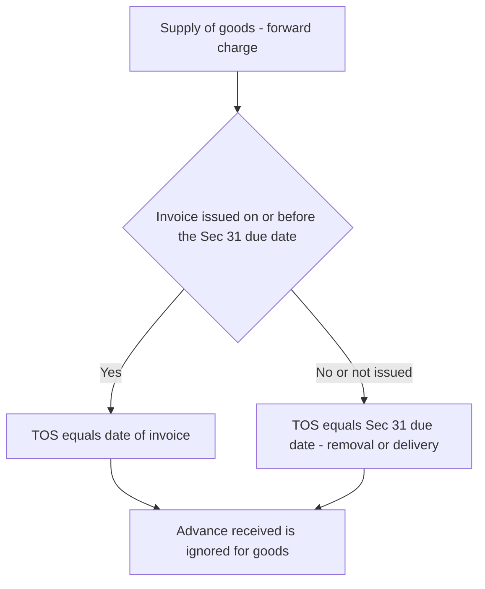
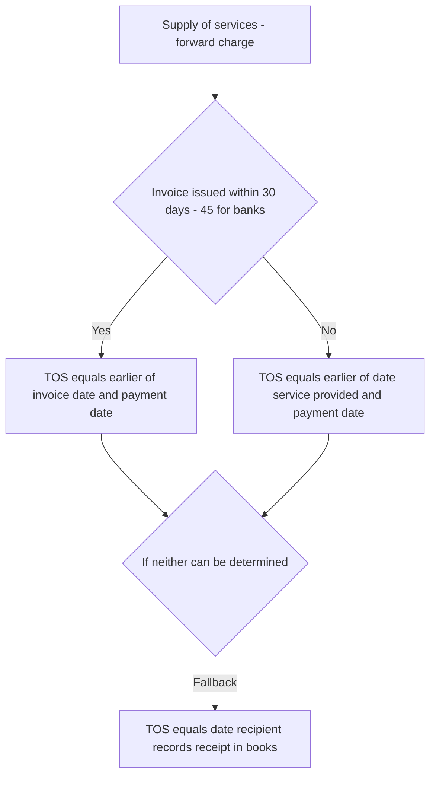
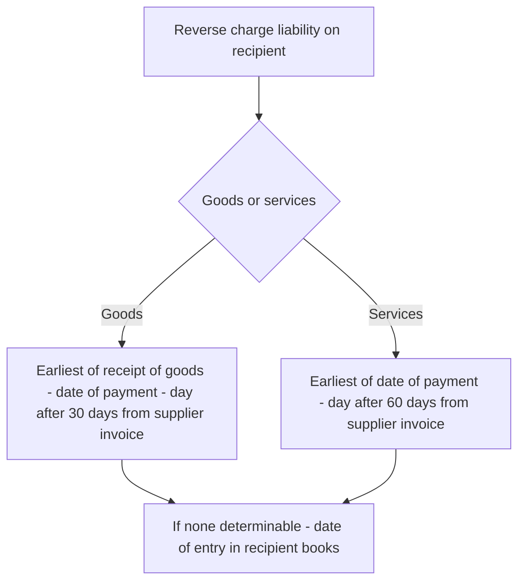
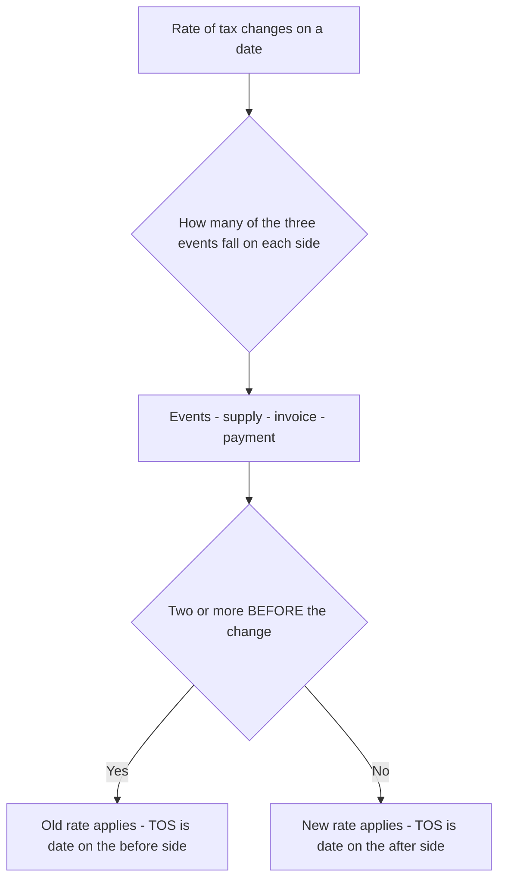

# Chapter 17 — Time of Supply

> **Rates / thresholds / amendments flag:** Time-of-supply *provisions* (Secs 12–14 of the CGST Act, 2017) are structurally stable, but the surrounding machinery moves — the removal of the 30-day supplementary-invoice window, the abolition of the earlier "goods on payment" trigger, tweaks to reverse-charge lists, and e-invoicing timelines have all been amended. This chapter teaches the **logic that fixes the taxable moment** so the mechanism is permanent. **Always verify the exact triggers, the current reverse-charge list, and the applicable amendments against current ICAI study material for your attempt.**

---

## 1. The Problem — GST is a tax on an *event*, but events are stretched out in time

GST is charged on the *supply* of goods or services (Sec 9, CGST Act). Good. But a "supply" is not a single instant — it is a **process** smeared across days, weeks, sometimes months. Consider one perfectly ordinary transaction:

- **1 June** — a customer places an order and pays a 20% advance.
- **10 June** — you dispatch the goods.
- **12 June** — the goods reach the customer.
- **15 June** — you raise the tax invoice.
- **20 July** — the customer pays the balance.

The transaction touches *five* different dates. But the tax law needs a **single, unambiguous date** — one moment it can point to and say *"tax became payable here."* Without that single moment, three things collapse:

**Problem 1 — You cannot fix the *rate*.** Suppose GST on this item is 12% until 30 June and rises to 18% from 1 July. Which rate applies — the June rate or the July rate? The answer depends entirely on *which* of those five dates the law treats as decisive. The rate is frozen at the "time of supply"; get the time wrong and every rupee of tax is wrong.

**Problem 2 — You cannot fix the *return period*.** GST is paid month by month. Does this supply belong in the June return (GSTR-3B for June, paid ~20 July) or the July return? If you report it late, you owe **interest under Sec 50** and possibly a late fee. If you report it early, you have parked the government's money before you needed to. The month is decided by the time of supply.

**Problem 3 — You cannot enforce *anything* consistently.** Two honest taxpayers doing the identical deal could pick different dates and pay different tax in different months. A tax that lets each person choose their own moment is unadministrable. The law must **legislate the moment** so it is the same for everyone.

So the "time of supply" (TOS) is not a bookkeeping nicety. It is the **coordinate on the time axis** at which the charge under Sec 9 crystallises. Sec 9 tells you *whether* and *how much*; **time of supply tells you *when*, and through "when," it silently also fixes *which rate*.**

---

## 2. The Core Idea

> **The time of supply is the *earliest* of a small set of legally-fixed trigger events — normally issue of invoice, receipt of payment, or (for goods under reverse charge) receipt of the goods. The law picks the *earliest* trigger because it wants the tax in its hands at the first sign that value has changed hands — but it also caps *how late* the invoice trigger can be, so a supplier cannot delay tax simply by delaying his own paperwork.**

Two design instincts run through every rule in this chapter, and if you hold them firmly you can *derive* almost every provision instead of memorising it:

1. **"Earliest of" — the revenue-protection instinct.** The moment *any* recognised marker of the supply appears (money in, or invoice out), tax is due. The government does not wait for the transaction to fully complete. Cash flow to the exchequer is front-loaded.

2. **"Don't let the taxpayer control the clock" — the anti-manipulation instinct.** The invoice is issued *by the supplier*. If TOS depended purely on when he chose to invoice, he could postpone tax indefinitely. So the law imposes a **statutory last date for the invoice** (Sec 31), and if the invoice is late, TOS falls back to an event the taxpayer *cannot* game.

Everything else — the goods-vs-services split, the reverse-charge rules, vouchers, the residual rule, the rate-change rules — is these two instincts applied to different fact patterns.

---

## 3. Why It's Built This Way — the design logic before the sections

Before touching a single sub-section, understand the choices the legislature made. Each rule below is one of these choices in disguise.

| Design choice | The problem it solves | How the Act implements it |
|---|---|---|
| A single legislated moment | Supply is stretched across many dates | Secs 12/13 define ONE "time of supply" |
| "Earliest of" triggers | Front-load revenue; catch value the moment it moves | TOS = earliest of invoice / payment / (goods receipt) |
| Statutory last date for invoice | Supplier could delay tax by delaying invoice | Link TOS to Sec 31 due date, not actual invoice date |
| Goods vs services treated differently | Goods = a physical event you can see; services = often continuous, invisible | Sec 12 (goods) vs Sec 13 (services) |
| Reverse charge has its own clock | Recipient pays; supplier's invoice is not a reliable marker | Sec 12(3)/13(3): use goods-receipt / payment / date-of-payment-to-supplier |
| Residual rule | Some cases fit no trigger | Fall back to due date of return or date of tax payment |
| Change-in-rate rule (Sec 14) | Straddling supplies span the rate change | Special "2-of-3" rule *overrides* Secs 12/13 |

### 3.1 Why the advance is (mostly) not taxed for goods any more

Historically GST taxed *advances on goods* at receipt — the "payment" trigger fired even before dispatch. This was an administrative nightmare for small dealers (tax on money before you have even shipped, then reconcile later). By a 2017 notification the government **removed the "receipt of payment" trigger for supply of goods** for all registered persons. So today, for **goods under forward charge, an advance does NOT create a time of supply** — only the invoice (or its due date) matters. **Advances on *services*, however, remain fully taxable at receipt.** Keep this asymmetry burning in your mind; it is the single most examined trap in this chapter.

> **Verify for your attempt:** the notification excluding advances-on-goods from TOS is a rate-notification and could be amended. ICAI has consistently examined the current position (advances on goods not taxed; advances on services taxed). Confirm before your sitting.

---

## 4. Full Technical Content — with the "why" welded to each provision

### 4.1 The building-block dates you must define first

Two phrases recur; nail them once.

**"Date of receipt of payment" (per the CGST Rules / Sec 12–13 explanation)** = the **earlier** of:
- (a) the date the payment is **entered in the books** of the supplier, or
- (b) the date the payment is **credited to his bank account**.

*Why the earlier?* Same revenue-protection instinct — whichever proof of payment appears first fixes the moment.

**"Date of issue of invoice"** = the actual date on the invoice — *but* the law constantly compares it to the **due date of issuing the invoice under Sec 31**, because the due date is the anti-manipulation backstop.

### 4.2 Sec 31 — the invoice due dates (the backstop you cannot skip)

Time of supply for goods/services under forward charge leans on Sec 31, so learn these first.

| Supply | Sec 31 due date for the invoice |
|---|---|
| **Goods — movement involved** | On or **before removal** of goods for supply |
| **Goods — no movement** | On or before **delivery** / making available to recipient |
| **Continuous supply of goods** | On or before each **statement/payment** is issued/received |
| **Services (general)** | Within **30 days** of supply of service |
| **Services by banks/NBFCs/insurers** | Within **45 days** of supply of service |

*Why a deadline at all?* Because the invoice is the supplier's own document. Sec 31 says "you must invoice by this date," and Sec 12/13 then says "if you invoice late, we tax you as if you had invoiced on time." The two sections lock together to defeat delay.

### 4.3 Time of supply of GOODS — forward charge (Sec 12(2))

> **TOS of goods = the EARLIER of:**
> **(a) date of issue of invoice, OR the last date on which the invoice *should* have been issued under Sec 31; and**
> **(b) — [the "date of receipt of payment" limb, which has been *removed by notification* for registered suppliers of goods].**

Because limb (b) is switched off for goods, in practice:

> **TOS of goods (forward charge) = date of invoice, OR if the invoice is late/not issued, the Sec 31 due date (i.e. removal for movement cases; delivery otherwise) — whichever of the two applies. The advance is ignored.**

**Worked micro-logic.** Goods removed 10 June, invoice raised 15 June. Sec 31 due date = removal = 10 June. TOS = *earlier* of actual invoice (15 June) and due date (10 June) = **10 June**. The late invoice bought the supplier nothing — exactly the anti-manipulation design at work.

*Figure 17.1 — Time of supply of goods under forward charge. The payment trigger is switched off, so only invoice timing (capped by the Sec 31 due date) matters.*

### 4.4 Time of supply of SERVICES — forward charge (Sec 13(2))

Services are different in kind. A service is often **invisible and continuous** — consulting, a subscription, a running contract. There is no "removal" you can photograph. So the law keeps the **payment trigger alive** and uses the **30/45-day invoice window** as the anti-manipulation cap.

> **TOS of services = the EARLIEST of:**
> **(a) if invoice issued *within* the Sec 31 window (30/45 days): the EARLIER of (i) date of invoice or (ii) date of receipt of payment; OR**
> **(b) if invoice NOT issued within the window: the EARLIER of (i) date of *provision* of service or (ii) date of receipt of payment; OR**
> **(c) if neither (a) nor (b) applies: the date the recipient shows receipt of the service in his books.**

Decoded into a decision the way you would actually apply it:

1. Was the invoice issued within 30 days (45 for banks etc.)?
2. **Yes →** TOS = earlier of *invoice date* and *payment date*.
3. **No →** TOS = earlier of *date service was provided* and *payment date*.

Notice the elegant symmetry with goods: a **timely** invoice lets you use the invoice date; a **late** invoice throws you back onto an event you cannot manipulate (the actual provision of service). Same instinct, adapted to a continuous supply.

**Advances on services ARE taxed.** Because the payment limb is live, if a client pays you an advance on 1 June for a service invoiced 15 July, the *advance* fixes TOS at 1 June for that portion. This is the asymmetry against goods.

*Figure 17.2 — Time of supply of services under forward charge. The payment trigger stays live, so advances are taxable; the 30/45-day window is the anti-delay cap.*

### 4.5 Reverse charge — why the clock is completely different (Secs 12(3) & 13(3))

Under **reverse charge (RCM)**, the *recipient* pays the tax, not the supplier. Now think about the design instinct: the trigger events for forward charge (invoice, payment received) are all **the supplier's actions**. But under RCM the supplier may be an unregistered person, a farmer, a foreign entity — someone who may not issue a GST invoice at all and certainly is not the one paying tax. **Using the supplier's invoice as the anchor would be unreliable and unenforceable against the person who actually owes the tax.**

So RCM anchors TOS to events **within the recipient's own control and records** — when *he* got the goods, when *he* paid the supplier — plus a hard backstop.

**Reverse charge on GOODS — TOS = EARLIEST of (Sec 12(3)):**
1. date of **receipt of the goods**;
2. date of **payment** (as entered in recipient's books or debited from bank, whichever earlier);
3. the day **immediately after 30 days** from the date of the supplier's invoice.
> If none can be determined → date of **entry in the recipient's books of account**.

**Reverse charge on SERVICES — TOS = EARLIEST of (Sec 13(3)):**
1. date of **payment**;
2. the day **immediately after 60 days** from the date of the supplier's invoice.
> If neither → date of **entry in the recipient's books**.
> **Special case — associated enterprises where the supplier is *outside India*:** TOS = **earlier of** date of entry in recipient's books **or** date of payment. (Cross-border related-party services have no reliable invoice, so the law leans entirely on the recipient's books/payment.)

Why 30 days for goods but **60 days** for services? Services take longer to complete and invoice, so the recipient is given a longer runway before the "invoice + N days" backstop bites — the same 30-vs-45/60 leniency logic that services get everywhere in GST.

*Figure 17.3 — Reverse charge time of supply. Anchored to the recipient's own events because the supplier's invoice is not a reliable marker when the recipient pays the tax.*

### 4.6 Vouchers (Sec 12(4) for goods / 13(4) for services)

A voucher is a **prepaid instrument** — a gift card, a meal coupon. The problem: has a "supply" happened when the voucher is *sold*, or only when it is *redeemed* for actual goods/services? The answer turns on whether we already know *what* will be bought (and hence its tax rate).

> **Rule: TOS of a voucher =**
> - **If the supply is *identifiable* at the time the voucher is issued → date of *issue* of the voucher.**
> - **If the supply is NOT identifiable at issue → date of *redemption* of the voucher.**

*Why?* GST needs to know the rate. A single-purpose voucher (e.g. a coupon redeemable only for a specific 18% product) already tells us the rate, so tax it at issue. A general "₹1,000 gift card" usable across a store of mixed-rate goods gives us no rate yet, so we must **wait until redemption** to know what was actually supplied. **Rate-certainty drives the timing** — the same logic as Sec 9 needing a rate.

### 4.7 Residual rule (Sec 12(5) / 13(5))

Some cases fit none of the above (records missing, unusual facts). The law needs a guaranteed fallback so a supply can never escape a TOS.

> **Residual TOS =**
> - **where a periodical return must be filed → the date on which that return is *due* to be filed; OR**
> - **in any other case → the date on which the *tax is paid*.**

This is pure gap-filling. It ties TOS to the next hard administrative deadline (the return due date), so there is always a determinable moment.

### 4.8 Time of supply for interest, late fee, penalty for delayed payment (Sec 12(6) / 13(6))

If a supplier charges **interest / late fee / penalty for delayed payment** of consideration, the TOS of *that extra amount* is the **date the supplier *receives* it**. Reason: this add-on is contingent and only becomes real when actually collected, so taxing it on receipt matches its nature.

### 4.9 Change in rate of tax — Sec 14 (overrides Secs 12 & 13)

This is the section examiners love, and it exists for one reason: some supplies **straddle** the moment the rate changes. Three events matter — **(1) supply of goods/service, (2) issue of invoice, (3) receipt of payment** — and the rate change sits somewhere in the middle. Sec 14 gives a clean **"2-out-of-3" majority rule**: look at whether invoice and payment happened *before* or *after* the rate change; whichever period holds the majority (2 of the 3 events) decides the rate.

> **Sec 14 logic (applies where supply is *before* OR *after* the rate change):**

**Case A — Supply *completed BEFORE* the rate change:**

| Invoice | Payment | Time of supply | Rate |
|---|---|---|---|
| After change | After change | earlier of invoice/payment | **NEW** |
| Before change | After change | date of invoice | **OLD** |
| After change | Before change | date of payment | **OLD** |

**Case B — Supply *provided AFTER* the rate change:**

| Invoice | Payment | Time of supply | Rate |
|---|---|---|---|
| Before change | After change | date of payment | **NEW** |
| Before change | Before change | earlier of invoice/payment | **OLD** |
| After change | Before change | date of invoice | **NEW** |

**The shortcut that makes this memoryless — the "2 of 3" test.** Take the three events {supply, invoice, payment}. If **two or more** fall on the *same side* of the rate-change date, that side wins:
- Supply before + (any two of the three before) → **old rate**; majority after → **new rate**.
- Equivalently: when **supply and one other event** are on the same side, that side's rate applies; when supply is alone, the **invoice-and-payment pair** decides.

You never need the two tables above if you internalise: **the majority of the three events wins, and the "time of supply" is the date of whichever event(s) sit on the winning side.**

> **Payment-date relief under Sec 14:** for the purpose of Sec 14, if payment is credited to the bank account **more than 4 working days after** the rate change, the date of receipt of payment is taken as the **date of bank credit** (not book entry). This narrow proviso stops manipulation of the "book entry" date around a rate change.

*Figure 17.4 — Change in rate of tax under Sec 14. The majority of the three events (supply, invoice, payment) decides the rate and the time of supply.*

---

## 5. Worked Examples — full, reconciling determinations

### Example 1 — Goods, forward charge, late invoice, with an advance

**Facts.** Rex Ltd manufactures fans (registered, forward charge). For an order:
- 5 August — customer pays 30% advance (₹30,000 of ₹1,00,000).
- 12 August — goods **removed** from factory for delivery.
- 18 August — tax **invoice** issued.
- 2 September — balance ₹70,000 received.

**Determine the time of supply.**

**Step 1 — Which rule?** Goods, forward charge → **Sec 12(2)**.
**Step 2 — Payment trigger?** For goods, the receipt-of-payment trigger is **removed**. So the 5 August advance and the 2 September balance are **both irrelevant** to TOS.
**Step 3 — Invoice vs Sec 31 due date.** Movement is involved → invoice due **on/before removal = 12 August**. Actual invoice = 18 August (late).
**Step 4 — TOS = earlier of actual invoice (18 Aug) and due date (12 Aug) = 12 August.**

**Reconciliation.** The whole ₹1,00,000 is taxed with TOS 12 August (August return). The late invoice did not defer tax; the advance did not accelerate it. Both design instincts visible in one example.

---

### Example 2 — Services, forward charge, advance received, invoice within window

**Facts.** Vega Consultants (registered) render advisory services.
- 10 June — client pays ₹40,000 advance.
- 28 June — service **completed**.
- 5 July — **invoice** for full ₹1,50,000 issued.
- 20 July — balance ₹1,10,000 received.

**Determine the time(s) of supply.**

**Step 1 — Rule.** Services, forward charge → **Sec 13(2)**. Payment trigger is **live**.
**Step 2 — Invoice within window?** Service completed 28 June; invoice 5 July → **7 days**, well within 30 days. So use: TOS = **earlier of invoice date and payment date**, applied to each receipt.
**Step 3 — The advance (₹40,000).** Earlier of payment (10 June) and invoice (5 July) = **10 June**. So ₹40,000 has **TOS 10 June** (June return).
**Step 4 — The balance (₹1,10,000).** Earlier of payment (20 July) and invoice (5 July) = **5 July**. So ₹1,10,000 has **TOS 5 July** (July return).

**Reconciliation.** Total consideration ₹1,50,000 = ₹40,000 (taxed June) + ₹1,10,000 (taxed July). The advance-on-service was taxed at receipt — the exact opposite of goods in Example 1. Split TOS is normal for services with advances.

---

### Example 3 — Reverse charge on goods

**Facts.** Orion Ltd buys goods from an unregistered dealer; the supply is under **RCM**.
- Supplier's invoice dated 1 October.
- Goods **received** by Orion 6 October.
- Orion **pays** the supplier 25 October.

**Determine the time of supply.**

**Rule — Sec 12(3):** earliest of
- receipt of goods = **6 October**;
- date of payment = **25 October**;
- day after 30 days from invoice = 1 Oct + 30 = 31 Oct → **1 November**.

**TOS = earliest = 6 October.** Orion accounts for RCM tax in its **October** return. Note TOS is anchored to *Orion's* events (its receipt of goods), not the supplier's invoice date — because Orion is the one paying the tax.

---

### Example 4 — Reverse charge on services, invoice-plus-60-days backstop bites

**Facts.** Orion Ltd receives legal services (RCM) from an advocate.
- Advocate's invoice dated 1 October.
- Orion **pays** on 20 December.

**Rule — Sec 13(3):** earliest of
- date of payment = **20 December**;
- day after 60 days from invoice = 1 Oct + 60 = 30 Nov → **1 December**.

**TOS = earliest = 1 December.** Because Orion delayed payment past the 60-day backstop, the *"invoice + 60 days"* limb fires first. Orion cannot defer RCM tax to December simply by paying late — the backstop pulls TOS into the **December return** period (1 Dec), and interest would run if reported later. Anti-manipulation instinct again.

---

### Example 5 — Change in rate of tax (Sec 14)

**Facts.** GST rate on a service rises from **12% to 18% on 1 September**. For one engagement:
- Service **provided**: 20 August (**before** change).
- **Invoice** issued: 3 September (**after** change).
- **Payment** received: 28 August (**before** change).

**Determine TOS and the applicable rate.**

**Step 1 — Supply is before the change → Case A.**
**Step 2 — 2-of-3 test.** Events: supply (20 Aug, before), invoice (3 Sep, after), payment (28 Aug, before). **Two events (supply + payment) are before** the change → **old side wins → OLD rate 12%.**
**Step 3 — TOS is the date on the winning (before) side that the table specifies.** Invoice after + payment before → TOS = **date of payment = 28 August**, rate **12%**.

**Reconciliation with the table.** Case A, "invoice after / payment before" → TOS = payment date, OLD rate. Matches. Had the payment *also* been on 3 September (after), then supply alone would be before, invoice+payment both after → majority after → **18%**, TOS = earlier of invoice/payment = 3 September. The single moving fact (payment side) flips the rate — exactly what Sec 14 is designed to resolve cleanly.

---

### Example 6 — Voucher

**Facts.** A retail chain sells (a) a coupon redeemable only against a specific 18% branded appliance, issued 10 May, redeemed 2 July; and (b) a generic ₹5,000 store gift card usable on any product, issued 10 May, redeemed 2 July.

- **(a) Single-purpose (supply identifiable at issue):** TOS = **date of issue = 10 May** (rate is already known — 18%).
- **(b) General gift card (supply not identifiable at issue):** TOS = **date of redemption = 2 July** (only then is it known what was bought and at what rate).

**Reconciliation.** Same two dates, opposite TOS — driven purely by whether the rate was knowable at issue. That is the whole of Sec 12(4)/13(4).

---

## 6. Format / Summary Table

| Scenario | Section | Time of supply = |
|---|---|---|
| **Goods — forward charge** | 12(2) | Date of invoice, or if late/none, **Sec 31 due date** (removal/delivery). *Advance ignored.* |
| **Services — forward charge** | 13(2) | Invoice in 30/45 days → **earlier of invoice or payment**; else **earlier of provision or payment**; else recipient's book entry. *Advance taxed.* |
| **Goods — reverse charge** | 12(3) | **Earliest** of: receipt of goods / payment / (invoice + 30 days + 1). Else book entry. |
| **Services — reverse charge** | 13(3) | **Earliest** of: payment / (invoice + 60 days + 1). Else book entry. Assoc. enterprise (foreign supplier) → earlier of book entry or payment. |
| **Voucher** | 12(4)/13(4) | Identifiable at issue → **issue date**; else **redemption date**. |
| **Residual** | 12(5)/13(5) | Return due date; else date tax is paid. |
| **Interest/late fee/penalty** | 12(6)/13(6) | **Date of receipt** of that amount. |
| **Change in rate** | 14 | **2-of-3** of {supply, invoice, payment} on same side → that side's rate; TOS = date on winning side. |

**One-line spine:** *Forward charge on goods watches the invoice; forward charge on services watches invoice-or-payment; reverse charge watches the recipient's own goods-receipt/payment plus an invoice-plus-N-days backstop; rate changes are decided by majority of three events.*

---

## 7. Connections

- **Sec 9 (Charge) → Sec 12–14 (Time):** Sec 9 says *whether* and *how much*; TOS says *when*, and *when* silently fixes *which rate* (Sec 14).
- **Sec 31 (Tax invoice):** TOS of forward-charge supplies is bolted to the Sec 31 invoice due dates. You cannot solve a TOS problem without knowing Sec 31 — study them together.
- **Sec 13 of IGST Act / place of supply:** *Time* and *place* of supply together decide *which* tax (CGST+SGST vs IGST) applies *when*. TOS fixes the tax period; place of supply fixes the tax's identity.
- **Sec 50 (Interest):** get TOS wrong → wrong return period → interest for delayed payment. TOS errors are expensive.
- **Reverse charge (Sec 9(3)/9(4)):** TOS under RCM (12(3)/13(3)) only matters once you have determined a supply *is* under RCM — link to the RCM chapter.
- **Value of supply (Sec 15):** advances on services are taxed at TOS but the *value* on which tax is computed comes from Sec 15.

---

## 8. Traps & Examiner Tricks

1. **Advance on GOODS is NOT taxed; advance on SERVICES IS.** The single most tested distinction. If the question gives an advance on goods, ignore it for TOS; on services, it fixes a TOS.
2. **Late invoice does not defer tax on goods.** TOS drops to the Sec 31 due date (removal/delivery), not the actual invoice date. Students wrongly use the late invoice date.
3. **RCM services backstop is 60 days, goods is 30 days.** Swapping them is a classic error. Also: the trigger is the day *immediately after* the 30/60 days, i.e. invoice date + N + 1.
4. **RCM anchors to the recipient's events, not the supplier's invoice date** (except via the +30/+60 backstop). Do not use "date of invoice" as a standalone RCM trigger.
5. **Sec 14 overrides Secs 12/13.** The instant a question mentions a rate change straddling the supply, abandon the normal rules and run the 2-of-3 test.
6. **"Receipt of payment" = earlier of book entry or bank credit.** Not just bank credit (except the Sec 14 >4-working-days proviso).
7. **Voucher timing is about rate-certainty, not about when cash was taken.** Single-purpose = issue; general = redemption.
8. **Splitting the invoice value across two TOS.** For services with an advance, the advance and the balance can have *different* TOS in *different* months — you must split (Example 2).
9. **Continuous supply** has its own Sec 31 invoice dates (tied to statements/payments); do not apply the plain 30-day rule.

---

## 9. First-Principles Recap

Start from nothing and rebuild the chapter:

1. GST taxes a *supply*, but a supply is smeared across many dates. The tax needs **one** date. → *Time of supply exists.*
2. The exchequer wants money early and cannot let taxpayers stall. → **Earliest-of triggers**, capped by a **statutory invoice deadline (Sec 31)**.
3. **Goods** are a visible physical event; the invoice (capped at removal/delivery) is a reliable marker, and taxing advances on goods was a nuisance, so the payment trigger was switched off. → *Goods TOS watches the invoice only.*
4. **Services** are often continuous and invisible; there is no "removal," so the **payment trigger stays live** and a **30/45-day invoice window** is the anti-delay cap. → *Services TOS = earlier of invoice/payment (or provision/payment if invoice is late); advances taxed.*
5. Under **reverse charge** the recipient pays, so the supplier's invoice is not a trustworthy anchor. → *Anchor to the recipient's goods-receipt/payment, with an invoice+30/60-day backstop.*
6. **Vouchers** need a known rate; if the supply is identifiable at issue, tax at issue, else at redemption.
7. Any gap → **residual rule** (return due date / date tax paid).
8. When the **rate changes** mid-transaction, whichever period holds **2 of the 3 events** (supply, invoice, payment) wins the rate, and TOS is the date on that winning side (Sec 14, overriding 12/13).

Every provision in the chapter is one of these eight sentences. You did not memorise; you *derived*.

---

## 10. Quick-Revision Sheet

**Core moment:** TOS = earliest legally-fixed trigger; invoice trigger capped by Sec 31 due date.

**Goods — forward (Sec 12(2)):** invoice date, else Sec 31 due date (removal / delivery). **Advance IGNORED.**

**Services — forward (Sec 13(2)):**
- Invoice within 30 days (45 = banks/NBFC/insurer) → **earlier of invoice or payment**.
- Invoice late → **earlier of provision or payment**.
- Else → recipient's book entry. **Advance TAXED.**

**Goods — RCM (Sec 12(3)):** earliest of — receipt of goods / payment / (invoice **+30** days +1). Else book entry.

**Services — RCM (Sec 13(3)):** earliest of — payment / (invoice **+60** days +1). Else book entry. Foreign associated enterprise → earlier of book entry or payment.

**Voucher (12(4)/13(4)):** identifiable at issue → **issue**; else → **redemption**.

**Residual (12(5)/13(5)):** return due date; else date tax paid.

**Interest/late fee/penalty (12(6)/13(6)):** date of **receipt**.

**Receipt of payment** = earlier of book entry or bank credit.

**Change in rate (Sec 14) — 2-of-3 rule (overrides 12/13):**
- Supply **before** change: both invoice+payment after → NEW (earlier of the two); one before → OLD (that date).
- Supply **after** change: both invoice+payment before → OLD (earlier of the two); one after → NEW (that date).
- Shortcut: majority of {supply, invoice, payment} on one side → that side's rate; TOS = date on winning side. Payment >4 working days after change → use bank-credit date.

**Golden asymmetries to never forget:** advance on goods = ignored / advance on services = taxed; RCM goods +30 / RCM services +60; single-purpose voucher = issue / general = redemption.

> **Flag:** verify the advance-on-goods exclusion, the current RCM list, and any Sec 14 / e-invoicing amendments in the latest ICAI material for your attempt.
