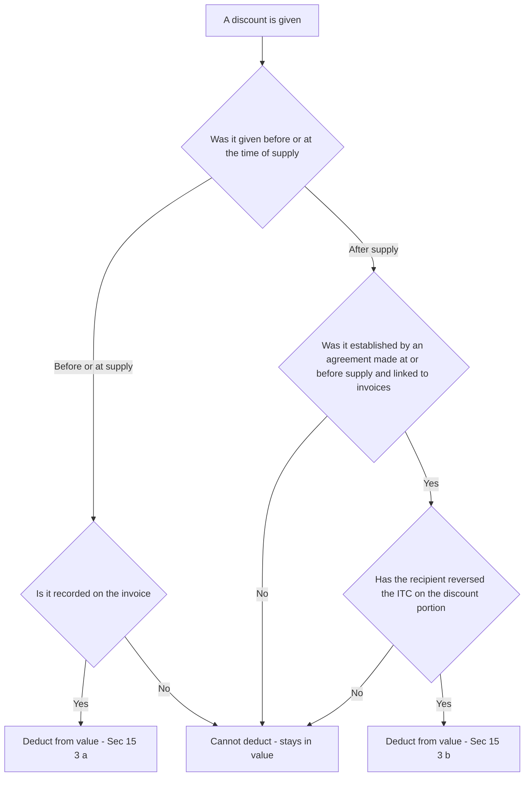
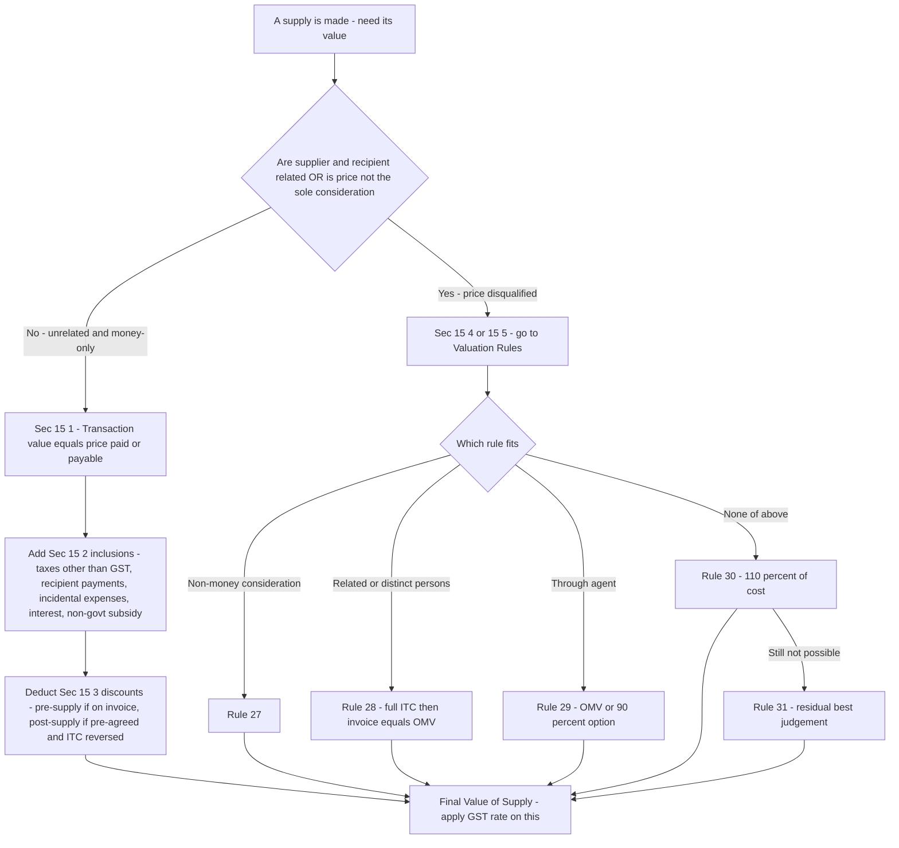
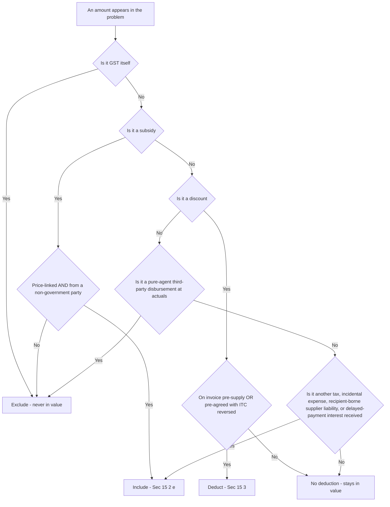

<!-- v2-deep -->

# Chapter 18 — Value of Supply

> **Rates / thresholds / amendments flag:** This chapter teaches the *logic and mechanism* of valuation under Section 15 of the CGST Act, 2017 and the Chapter IV Valuation Rules (Rules 27–35 of the CGST Rules). The *rules* here are extremely stable, but the specific rates used inside the examples, the notified TCS rate, and any fresh amendments to the Rules must be **verified against current ICAI study material for your attempt.** The framework below is permanent knowledge.

---

## 1. The Problem — Why GST cannot just say "tax the price"

GST is an **ad valorem** tax: it is a *percentage of value*, not a flat rupee amount per unit. CGST + SGST at 18% on a ₹1,000 sale is ₹180; the whole revenue of the nation hangs on that word **value**. So the single most dangerous question in the entire GST law is deceptively simple:

> **Value of *what*, exactly?**

If the law naively answered "the price on the invoice," four separate leaks would open up immediately — and each one is a genuine revenue hole, not a technicality:

**Problem 1 — Parties can simply write a smaller number.** A seller and buyer who are friends, relatives, or two arms of the same company can agree to show ₹100 on the invoice for something worth ₹1,000, settle the real ₹900 in cash or as a "loan," and starve the exchequer. Price is whatever two people *say* it is; the tax base cannot be left to their honesty.

**Problem 2 — The "price" is often not the whole consideration.** Suppose I sell you a machine for ₹1,00,000 but I also make you pay the ₹5,000 freight, ₹2,000 installation, and a ₹3,000 municipal levy separately. Economically you paid ₹1,10,000 to *get that machine working*. If tax only hit the ₹1,00,000 "price," every seller would unbundle charges into a dozen side-invoices and shrink the taxable base to nothing.

**Problem 3 — Sometimes there is no price at all.** I give goods to my sister-concern for free (stock transfer to another State), or I barter a designing service for a laptop, or I pay partly in old-gold exchange. There is a *supply* — GST is due — but no clean money price exists to tax. The law still needs a number.

**Problem 4 — Subsidies and discounts distort the raw price in opposite directions.** A government subsidy can make the sticker price *artificially low* (the supplier's true realisation is higher). A trade discount can make the invoice *artificially high* relative to what the buyer really pays. Tax should follow economic reality, not the raw figure.

The **cascade-killing promise of GST** — tax only on the *value added* at each stage — only works if "value" at each stage is measured honestly and consistently. A wrong value poisons the whole chain, because the buyer's input tax credit (ITC) equals the tax the seller charged on that value. **Get value wrong and you either under-tax the nation or over-credit the buyer.** That is why an entire, carefully lawyered mechanism — Section 15 plus a ladder of fallback Rules — exists purely to pin down one number.

**A fifth, quieter problem the design also anticipates — the *currency* and *timing* of value.** Even when there *is* a clean price, it may be denominated in dollars (imports), or bundled with tax (MRP-style retail), or realised over months in a credit sale where "late-payment interest" trickles in later. A robust valuation regime must therefore also fix *the rate of exchange* (Rule 34), *how to strip embedded tax* (Rule 35), and *when* a delayed-payment charge enters value (Sec 15(2)(d) read with time of supply). Value is not only "how much" but "how much, in what currency, net of what, as at what moment." Hold this wider frame — the exam loves to hide a Rule 34/35 twist inside an otherwise ordinary Sec 15 sum.

---

## 2. The Core Idea

> **The default value of a supply is the *transaction value* — the actual price paid or payable — but ONLY when (a) the two parties are unrelated and (b) the price is the *sole* consideration. The law then surgically adds back things sellers try to strip out of the price (Sec 15(2)) and subtracts things that were never really part of it (Sec 15(3)). If, and only if, the transaction value cannot be trusted or does not exist, the law climbs a fallback ladder of Valuation Rules to *construct* a value.**

Three load-bearing ideas fall out of this and organise the whole chapter:

1. **Trust the price by default.** In an arm's-length cash deal, the price two independent parties struck *is* the fairest measure of value. The law is not paternalistic; it accepts the market. This is the "transaction value" of **Sec 15(1)**.

2. **But police the price.** Because sellers game the raw figure, Sec 15(2) forces certain amounts *in* (inclusions) and Sec 15(3) allows certain amounts *out* (discounts) — each adjustment is a direct answer to Problems 2 and 4 above.

3. **Replace the price only as a last resort.** When trust breaks (related parties — Problem 1) or the price is missing (barter, free supply — Problem 3), Sec 15(4)/(5) hands over to the Valuation Rules, which reconstruct value from open-market prices, cost, or a residual best-judgement method — always the *closest available proxy* for a real arm's-length price.

Everything else is detail hanging off these three hooks.

**One sharpening most students miss — "transaction value" is a *legal term of art*, not "the invoice figure."** The transaction value under Sec 15(1) is the price *after* the surgery of 15(2) and 15(3). So when an exam says "transaction value is ₹X," it usually means the *raw price* — you must still run the inclusions and exclusions to reach the *value of supply*. Read "transaction value" as "the starting price that is then adjusted," never as "the final answer." This one habit prevents a large family of silly mistakes.

---

## 3. Why It's Built This Way — the design logic behind each lever

Before a single sub-section, understand the *design choices*, because every rule below is one of these in disguise:

| Design choice | The problem it solves | How the Act implements it |
|---|---|---|
| Accept the actual price by default | Don't second-guess honest markets; keep compliance simple | Transaction value, Sec 15(1) |
| Two conditions on that default | Price is only trustworthy if arm's-length and cash | "Not related" + "price is sole consideration", Sec 15(1) |
| Force incidental charges back in | Sellers unbundle to shrink the base (Problem 2) | Inclusions, Sec 15(2) |
| Add non-GST taxes/levies to value | Otherwise base excludes real cost borne | Sec 15(2)(a) |
| Add third-party payments the buyer owed the supplier | Consideration routed around the invoice | Sec 15(2)(b) |
| Add interest, late fee, penalty for delayed payment | These are part of the real price of credit | Sec 15(2)(d) |
| Add non-refundable subsidies | Subsidy props up a low sticker price (Problem 4) | Sec 15(2)(e) |
| Allow only *disclosed* discounts out | Discounts are real, but fake post-hoc discounts hide value (Problem 4) | Sec 15(3) — pre-supply vs post-supply conditions |
| Fallback Valuation Rules | No price, or untrustworthy price (Problems 1 & 3) | Sec 15(4)/(5) → Rules 27–35 |

The elegance to internalise: **Section 15 is a filter, not a formula.** It starts from the invoice price and makes *minimal, targeted* corrections. It never rebuilds value from scratch unless the price itself is disqualified. This "least intervention" philosophy is why GST valuation is far simpler than the old Central Excise valuation regime — and why the exam rewards you for knowing *which lever applies*, not for memorising a mega-formula.

One more foundational note on scope: **GST value under Sec 15 is exclusive of the GST itself.** You compute value first, then apply the rate. CGST, SGST/UTGST, IGST and the Compensation Cess are *not* part of the value (Sec 15(2)(a) deliberately carves them out — see below). Tax is not levied on tax.

**Why a *ladder* of Rules and not a single formula — the deeper reason.** A single formula (say, "always use cost + 10%") would be either too crude (it ignores a perfectly good market price sitting right there) or too manipulable (cost figures can be dressed). By ranking methods — market price first, comparable price next, cost only when no market exists, best-judgement only when even cost fails — the law guarantees that value is always the *most reliable evidence available in that fact pattern*. The ladder is an *evidence hierarchy*, exactly like the "best evidence" idea in auditing: prefer external, objective, market-tested numbers; fall back to internal, constructed numbers only under compulsion. Recognising the ladder as an evidence hierarchy tells you *why* you can never skip a rung upward: you would be choosing weaker evidence over stronger.

**Why two gatekeeper conditions and not one.** "Unrelated" polices *who* the parties are; "sole consideration" polices *what* changed hands. They fail independently: two unrelated strangers can still barter (money-only fails though they are unrelated), and a parent–subsidiary can still transact in pure cash at a rigged number (relatedness fails though it is money-only). Because the failure modes are orthogonal, the law needs both switches — and the exam routinely trips only *one* of them to test whether you check both.

---

## 4. Full Technical Content — Section 15 and the Valuation Rules, with the "why"

### 4.1 The charging link — why Sec 15 even exists

Sec 15 does not levy tax; the charging sections (Sec 9 of CGST, Sec 5 of IGST) do. Sec 9(1) says CGST is levied "on the value of supply *determined under Section 15*." So **Sec 15 is the plug that feeds a number into the charging section.** No value, no charge. This is the mechanical reason the whole chapter matters.

A subtle consequence worth stating: because Sec 15 is *common* to CGST, SGST/UTGST and IGST (IGST Sec 5 also borrows Sec 15 via the IGST Act), **there is exactly one "value of supply" for a transaction**, whether it turns out to be intra-State (CGST+SGST) or inter-State (IGST). The place of supply decides *which* tax and *how many* heads; Sec 15 decides *the base*. Never compute two different values for the two heads — split the *tax*, not the *value*.

### 4.2 Sec 15(1) — Transaction value: the default, and its two gatekeeper conditions

> **Sec 15(1): "The value of a supply of goods or services or both shall be the *transaction value*, which is the *price actually paid or payable* for the said supply of goods or services or both where — (i) the supplier and the recipient of the supply are *not related*, and (ii) the *price is the sole consideration* for the supply."**

Unpack the four key phrases:

- **"Price actually paid or payable"** — actual, not notional; and *payable* means an amount owed but not yet paid still counts. You cannot escape value by delaying payment.
- **"Not related"** — because related parties can rig the price (Problem 1). "Related persons" is defined in the **Explanation to Sec 15**: persons are related if they are officers/directors of one another's business, legally recognised partners, employer–employee, one holds ≥25% of shares in both / in the other, one controls the other, both are controlled by a third, together they control a third, they are members of the same family, or they are sole agent/distributor of each other. *Persons associated in business where one is the sole agent, sole distributor, or sole concessionaire of the other are deemed related.*
- **"Sole consideration"** — because if the buyer also gives something *other than money* (a barter, an exchange, a free mould), the money price alone understates value (Problem 3 in mild form). If there is additional non-monetary consideration, transaction value under 15(1) may still be used *after adding the money value of that extra consideration* — but if it cannot be so quantified cleanly, you fall to the Rules.

**Memory hook — "R.S." disqualifies the price: Related, or not Sole consideration.** If either is true, Sec 15(1) is off the table and you go to the Rules (via 15(4)).

**Finer distinction 1 — "related" is a *status* test, not a *price* test.** Note what Sec 15(1) does *not* say: it does not say "value = price unless the price looks too low." Relatedness disqualifies the price *automatically*, even if the related-party price happens to be perfectly fair. That is why the escape hatch lives in the *Rules* (especially Rule 28's full-ITC proviso and the OMV route), not in a "reasonableness" test inside 15(1). Conversely, an *unrelated* deal at a suspiciously low price is **still governed by 15(1)** — the department cannot substitute value merely because it thinks unrelated strangers underpriced. Low price between strangers is their business; the law trusts arm's-length bargaining.

**Finer distinction 2 — the family/HUF edge of the Explanation.** "Members of the same family" pulls in spouse, children, and *dependent* parents/grandparents/siblings (per the definition of "family" in the Act) — but a married, financially independent sibling is generally *not* "family" for this purpose. Examiners test whether you know that not every relative is a "related person." Flag any borderline relationship and reason from the statutory list rather than intuition. *(Verify the exact "family" definition wording in current ICAI material.)*

**Finer distinction 3 — the ₹25% cross-holding trigger.** One person holding ≥25% of the voting shares *in both* enterprises makes them related. A 24% holding does not. This is a bright-line the examiner can dial just under or over the threshold — read the percentage carefully.

### 4.3 Sec 15(2) — Inclusions: what must be ADDED to the transaction value

These are the "add-backs" — amounts sellers try to keep off the taxable price. **Every clause answers "the seller shifted real cost off the invoice; drag it back."** There are five clauses, (a) through (e).

| Clause | What is included | The WHY | Watch-out |
|---|---|---|---|
| **15(2)(a)** | Any taxes, duties, cesses, fees, charges levied under *any law other than* CGST/SGST/UTGST/IGST/GST-Compensation-Cess Acts, **if charged separately by the supplier** | These are real amounts the recipient pays to *get* the supply; only GST itself is excluded (no tax on tax) | Examples included: municipal taxes, TCS under Income-tax Act *(see trap 8.6)*, entertainment tax by local body. **GST itself is NOT included.** |
| **15(2)(b)** | Amount the *supplier* is liable to pay but which the *recipient* has paid, and which is **not** already in the price | Consideration routed around the invoice — the buyer discharged the seller's obligation, so it is part of the real price | e.g. buyer pays a fee the supplier legally owed |
| **15(2)(c)** | **Incidental expenses** — commission, packing, and any amount charged for anything done by the supplier *at the time of, or before, delivery* | These are costs of *making the supply delivery-ready*; unbundling them into side-charges would shrink the base (Problem 2) | Packing, weighing, loading, inspection, testing, design charges before supply |
| **15(2)(d)** | **Interest, late fee, or penalty for delayed payment** of any consideration | The price of credit is part of the price; a buyer who pays late effectively bought on more expensive terms | Time of supply of this interest is *when the supplier receives it* (Sec 12/13) — it is taxed when actually received, not accrued |
| **15(2)(e)** | **Subsidies directly linked to the price**, EXCLUDING subsidies given by the Central/State Government | A price-linked subsidy from a *non-government* party props up an artificially low sticker price; the supplier's true realisation includes it | **Government subsidies are NOT included** — deliberately excluded to avoid taxing public support. Subsidy is added in the hands of the *supplier who receives it*. |

**Memory hook for inclusions — "T-P-I-I-S":** **T**axes (other than GST), **P**ayments made by recipient on supplier's behalf, **I**ncidental expenses, **I**nterest/late fee/penalty, **S**ubsidy (non-government, price-linked).

Two of these repay careful thought:

- **15(2)(a) and the "no tax on tax" principle.** The clause *includes* every other levy but *excludes* GST. This is the statutory expression of the anti-cascade promise: GST is charged on a value that is itself free of GST, but not free of, say, a municipal levy the buyer genuinely paid.

- **15(2)(e) subsidies — direction of the flow matters.** A subsidy is included in the value only if it is (i) *directly linked to the price* and (ii) *not from the government*. A lump-sum or non-price-linked grant is out. A government subsidy is out. The reason: value should reflect what the *supply* is worth to the market; a private party paying part of the price on the buyer's behalf is really topping up the price.

**Now the finer distinctions the exam mines out of these five clauses:**

- **"Charged separately" is the trigger for 15(2)(a), not for the whole of 15(2).** Clause (a) only bites when the *other* tax is shown as a separate line. If a municipal levy is already *baked into* the basic price, you do not add it again — it is already in. Watch for double counting: an examiner may list "basic price ₹5,00,000 (inclusive of local cess)" and then also list "local cess ₹20,000" as a distractor.

- **15(2)(b) — the "on behalf of the supplier" test.** The buyer paying *its own* obligation is *not* an add-back. Only when the buyer discharges a liability that *the supplier* was legally bound to pay does it come back in. Classic fact pattern: freight. If the *supplier* was contractually liable for freight but the *buyer* paid the transporter directly, add it. If the *buyer* was always liable for its own inward freight (FOR-buyer terms), it is not the supplier's cost and there is nothing to add under (b). Read *whose obligation it was*.

- **15(2)(c) — the "before or at the time of delivery" cut-off.** Only charges for things the supplier does *up to and including delivery* are incidental expenses that must be included. A charge for something done *after* delivery — e.g. an *optional*, separately-contracted post-delivery maintenance visit — is a *separate supply*, valued on its own, not glued into the goods' value. The word "delivery" is the hinge: pre-delivery loading/packing/inspection = include; a genuinely post-delivery, independent service = value separately. (Do not confuse this with a *composite supply* where a bundled ancillary is naturally tied to the principal supply — there you tax the whole bundle at the principal rate.)

- **15(2)(d) — interest is on *delayed payment*, and it is taxed on *receipt*.** Two traps in one clause. First, the interest, late fee or penalty must relate to *delayed payment of the consideration* — a *penalty for breach of some other contractual term* (say, damages for defective quality) may be a different animal (possibly a separate "tolerating an act" service or not a supply at all) — read what the charge is *for*. Second, even genuine delayed-payment interest enters value only *when received* (Sec 12(6)/13(6)), so an accrued-but-unpaid interest is not yet valued. Many students add accrued interest — wrong.

- **15(2)(e) — "directly linked to the price" is doing heavy lifting.** A subsidy that reduces the *per-unit* or *per-transaction* price is price-linked and (if non-government) included. A capital subsidy, a research grant, or a lump-sum viability-gap payment not tied to unit price is *not* price-linked and stays out even from a private party. And regardless of linkage, a **Central/State Government** subsidy is always out. Ask two questions in order: (1) *price-linked?* — if no, out; (2) *from government?* — if yes, out.

### 4.4 Sec 15(3) — Exclusions: discounts that come OUT of value

> **A discount is a genuine reduction in the real price — so it should reduce value. But a fake, undisclosed, after-the-fact "discount" is just a way to hide value (Problem 4). So the law splits discounts by *timing* and imposes conditions on the risky kind.**

| Discount type | Condition to be deducted (Sec 15(3)) | The WHY |
|---|---|---|
| **Before/at the time of supply** — 15(3)(a) | Must be **recorded in the invoice** | If it's on the face of the invoice, it's transparent and real; no manipulation risk |
| **After the supply** — 15(3)(b) | Allowed ONLY if **(i)** it is established in terms of an *agreement entered into at or before the time of supply* AND *linked to relevant invoices*, AND **(ii)** the **ITC attributable to the discount has been reversed by the recipient** | Post-supply discounts are the classic dodge. Both conditions plug it: the deal must pre-exist (not invented later), and the buyer must give back the credit he took on the discounted portion (else the chain over-credits) |

**Why the ITC-reversal condition is non-negotiable.** Recall GST's chain: the buyer claimed ITC equal to the tax the seller charged. If the seller later reduces value via a discount (and reduces his output tax by a credit note), but the buyer keeps the *full* ITC, the buyer now holds more credit than tax that exists in the system — a leak. So the law says: you may reduce value post-supply only if the buyer *reverses* the matching ITC. This is a beautiful, self-consistent anti-cascade safeguard.

**Trap to bank now:** a post-supply discount decided *after* the supply with **no pre-existing agreement** (e.g. a year-end volume bonus dreamt up in March) is **NOT deductible** — value stays gross. Only *pre-agreed* post-supply discounts qualify.

**Finer distinction — the four cumulative locks on a post-supply discount.** To deduct a post-supply discount you need *all four*: (1) an agreement existing *at or before* the time of supply; (2) the discount *linked to specific relevant invoices*; (3) a *credit note* issued by the supplier (to reduce his output tax); and (4) *ITC reversal* by the recipient. Miss any one and the discount stays in value. Examiners love to give three of the four and withhold the fourth (usually the ITC reversal, or the pre-existing agreement). Treat the four as a checklist.

**Finer distinction — "linked to relevant invoices" defeats the blanket year-end rebate.** Even a *pre-agreed* discount fails if it cannot be tied back to particular invoices. A flat "2% turnover rebate" that cannot be mapped to the underlying supplies struggles the linkage test. So a discount can be pre-agreed yet still non-deductible for want of invoice-linkage — a two-step trap.

**Edge — free samples and "buy-one-get-one".** A genuine *free sample* given without consideration to an unrelated party is not a "discount" at all — it is a separate question of whether it is even a supply (and of ITC on the samples). Do not force it into 15(3). BOGO ("buy one get one free") is really *two units supplied for one price* — value the whole consideration for both units; it is a price structure, not a Sec 15(3) discount. Classify the arrangement *before* reaching for the discount clause.

*Figure 2 — Discount gate: pre-supply discounts pass if disclosed on the invoice; post-supply discounts pass only through both locks (pre-agreement AND ITC reversal).*

### 4.5 Sec 15(4) & 15(5) — the handover to Rules

> **Sec 15(4):** Where value *cannot be determined* under 15(1) — i.e. parties are related, or price is not the sole consideration — value "shall be determined in such manner as may be prescribed" → the **Valuation Rules (Rules 27–31)**.
>
> **Sec 15(5):** Notwithstanding 15(1)/(4), the value of *notified* supplies shall be determined as prescribed → special Rules (32–35), covering specific sectors (foreign exchange, air travel agents, life insurance, second-hand goods, tokens/vouchers, pure agents, rate of exchange).

**Note the force of "notwithstanding" in 15(5).** For the *notified* supplies (forex, air-agent, insurance, second-hand goods, etc.), the special Rule *overrides* even a perfectly good transaction value. You do **not** first try 15(1) and only then reach Rule 32 — for those sectors the special Rule is the *primary* method. This is the opposite hierarchy from 15(4)'s Rules, which are strictly *fallbacks*. Getting this direction wrong (e.g. computing an air agent's value on the full fare "because there was a price") is a conceptual error, not a small slip.

### 4.6 The Valuation Rules ladder (Rules 27–31) — how value is *constructed* when the price fails

The Rules are a **sequential ladder**: you use Rule 27, and only if it can't apply do you drop to 28, then 29, 30, 31. **The philosophy throughout: find the closest available proxy to a real arm's-length price.**

| Rule | Applies when | How value is built | The WHY |
|---|---|---|---|
| **Rule 27** | Consideration is **not wholly in money** (barter, exchange) | (a) **Open market value (OMV)**; if not available → (b) money consideration **+ money-equivalent of the non-money part**; if not → (c) value of **like kind and quality** supply; if not → (d) Rule 30 or 31 | Problem 3: no clean price. Start from what the same thing sells for in the open market |
| **Rule 28** | Supply between **related / distinct persons** (not through agent) | (a) **OMV**; else (b) value of **like kind and quality**; else (c) Rule 30/31. **Proviso 1:** where recipient is eligible for **full ITC**, the value declared on the invoice is **deemed to be the OMV** | Problem 1: price is rigged. But if the buyer gets full ITC, any value is revenue-neutral (tax paid = credit taken), so the law pragmatically accepts the invoice |
| **Rule 29** | Supply made **through an agent** | (a) **OMV**, OR at supplier's option **90% of the price** charged by the recipient-agent to *his* unrelated customer (for like goods); else (b) Rule 30/31 | Agent situations have a natural downstream price to anchor to — the 90% option gives a clean proxy |
| **Rule 30** | Value not determinable by 27–29 | **110% of cost** of production / acquisition / provision (cost-plus) | When no market anchor exists, build up from cost + a standard 10% margin |
| **Rule 31** | Value not determinable even by 30 | **Residual / best-judgement** — reasonable means consistent with the principles of Sec 15 | The final safety net; for *services*, the supplier may skip Rule 30 and use Rule 31 directly |

**Memory hook — the ladder "OMV → Like → Cost+10% → Best judgement."** OMV is always the first choice in every rule, because it is the truest proxy for an arm's-length price. Cost-plus (Rule 30, 110%) and best-judgement (Rule 31) are only for when no market comparison exists.

**Define the anchors precisely — the exam quietly rewards exact definitions:**

- **Open Market Value (OMV):** the *full money value* (excluding GST) that a person would pay at the *same time* the supply is made, in a transaction where supplier and recipient are *unrelated* and price is the *sole consideration*. Note the built-in constraints: *same time* and *arm's-length* — an OMV from a different period or a related deal does not qualify.
- **"Like kind and quality":** a supply *closely or substantially resembling* the one being valued in respect of characteristics, quality, quantity, functional components, materials, and reputation. It is the comparable-uncontrolled-price idea: near-identical goods/services, not a loose analogue.

**Rule 28 second proviso — the *goods for further supply as such* option.** Beyond the full-ITC proviso, Rule 28 has a second proviso: where the recipient intends to supply the goods *as such* (i.e. onward, unchanged, like a distributor), the supplier *may* declare, as OMV, an amount equal to **90% of the price charged by the recipient to his unrelated customer** — mirroring the agent logic of Rule 29. Know that this optional 90% route exists for related-party *distributors*, not only for agents. *(Verify current wording in ICAI material.)*

**Rule 29 finer point — the 90% option is the *supplier's* choice and needs a downstream unrelated price.** It only works if the agent onward-sells *like goods to an unrelated customer* and that price is known. If the agent's onward customer is himself related, the 90% anchor collapses and you are back to OMV / Rule 30–31.

**Rule 30 finer point — "cost" means cost as per the ordinary principles (for goods, generally cost of acquisition/production; the ICAI material aligns this with cost-accounting/CAS notions), then +10%.** The 10% is a *fixed statutory margin*, not a negotiable markup. Do not "adjust" it.

**Rule 31 finer point — the services shortcut.** Ordinarily the ladder is strict (30 before 31). But the *proviso to Rule 31* lets a *supplier of services* **skip Rule 30 and go straight to Rule 31** (best judgement). Rationale: a service often has no meaningful "cost of production" to mark up, so forcing cost-plus is artificial. Goods enjoy no such shortcut.

*Figure 1 — The valuation decision spine: trust the price (Sec 15) unless it is disqualified, then climb the Rules ladder. Read left path first; the right path is the exception.*

### 4.7 Selected special valuation Rules (Rule 32) — because some sectors have no ordinary "value"

Rule 32 lets certain notified suppliers use a *simplified* value. Know the four exam-favourite ones:

- **Rule 32(2) — Foreign exchange / money changing.** Value = difference between the buying/selling rate and the RBI reference rate × units; or a slab method if no reference rate. *Why: a money-changer's "value added" is the spread, not the face value of currency moved.*
- **Rule 32(3) — Air travel agent.** Value = **5% of basic fare** for domestic, **10%** for international. *Why: the agent's supply is the booking service, proxied as a fixed slice of fare.*
- **Rule 32(4) — Life insurance.** Value = gross premium less the portion allocated to investment/savings (if intimated); or 25% of first-year premium and 12.5% thereafter (for other than pure-risk policies). *Why: only the risk-cover portion is a "service"; the savings portion is not consumption.*
- **Rule 32(5) — Second-hand goods (margin scheme).** Value = **selling price minus purchase price** (the margin), where no ITC was taken on purchase; if negative, ignored. *Why: taxing the full resale price of used goods would double-tax value already taxed when new — the margin scheme taxes only the fresh value the dealer added.*
- **Rule 33 — Pure agent.** Expenses incurred by a supplier as a **pure agent** of the recipient (separately shown) are **excluded** from value. *Why: a pure agent merely passes through third-party costs; those are not his own supply's value.*

**Deeper on Rule 32(2) — the two methods for forex.** Method 1 (rate-difference): value = |transaction rate − RBI reference rate| × units of currency; if no RBI reference rate is available (e.g. an exotic currency), value = 1% of the gross rupee amount. Method 2 (optional slab, exercised for the whole financial year): **1% of gross amount up to ₹1,00,000 (min ₹250); ₹1,000 + 0.5% on the slab above ₹1,00,000 up to ₹10,00,000; ₹5,500 + 0.1% above ₹10,00,000 (capped at ₹60,000).** The point is conceptual — the money-changer is taxed on the *spread/service*, never on the face value of currency exchanged. *(Verify slab figures against current ICAI material.)*

**Deeper on Rule 33 — the *pure agent* is a strict five-limb test, not a loose "reimbursement."** To exclude a payment as pure-agent expenditure, *all* the conditions must hold: the supplier (i) acts as *pure agent* on *authorisation* of the recipient when making the payment to the third party; (ii) the payment is *separately indicated* in the invoice; (iii) the supplies procured as pure agent are *in addition to* the services he supplies on his own account. The recipient must be *liable* to make the third-party payment, and the supplier merely fronts it, recovering the *actual* amount without markup. Contrast: if the supplier marks up the reimbursement, or was himself liable, it is *not* pure-agent — it becomes part of his value. Classic example: a customs broker paying statutory port fees on the importer's behalf (excluded) versus the broker's own agency fee (included).

**Deeper on Rule 32(5) margin scheme — the "no ITC availed" gate and the depreciation variant.** The margin scheme is available only where *no ITC was availed on the purchase* (typically because bought from an unregistered person or an individual). Where the goods are *repossessed* from a defaulting borrower who was unregistered, the purchase value is deemed to be reduced by a fixed percentage for every quarter (or part) between the date of purchase and the date of disposal — a depreciation-style haircut. And a *negative margin is ignored* (value nil, no negative tax). *(Verify the repossession percentage and quarter mechanics against current ICAI material.)*

### 4.8 Rule 34 & 35

- **Rule 34 — Rate of exchange** for imports/exports: the notified rate on the date of time of supply.
- **Rule 35 — Value inclusive of tax:** when the price *already includes* GST, extract value by back-calculation: **Value = Tax-inclusive amount × 100 ÷ (100 + GST rate)**. *The single most common computational sub-step in the exam — commit it.*

**Rule 34 finer point — goods vs services use different rate sources.** For the value of *taxable goods*, the applicable rate of exchange is the rate *notified by the CBIC (Customs) under section 14 of the Customs Act* as on the date of time of supply. For *services*, it is the rate as per *generally accepted accounting principles* on the date of time of supply. Same idea (fix the currency at the moment value crystallises) but two different rate sources — a fine distinction the examiner can test in one line. *(Verify against current ICAI material.)*

**Rule 35 finer point — the divisor when the supply is split across CGST + SGST.** The divisor uses the *total* GST rate. For an intra-State supply at 18% (9%+9%), you still divide by 1.18, then split the extracted tax equally into 9% CGST and 9% SGST — you do *not* divide twice by 1.09. The extracted tax is one 18% figure, then halved.

---

## 5. Worked Examples — every rupee reconciled

> All rates below are illustrative; **verify the applicable GST rate for the goods/service in the exam.** I use CGST 9% + SGST 9% (intra-State, 18% total) or IGST 18% (inter-State) unless stated.

### Example 1 — The classic "inclusions and discount" build-up (Sec 15(1)+(2)+(3))

**Facts.** Ashok Ltd. (Maharashtra) supplies a machine to an *unrelated* buyer in Maharashtra. Details:

| Particular | Amount (₹) |
|---|---|
| Basic price of machine | 5,00,000 |
| Municipal tax charged separately by supplier | 20,000 |
| Packing and forwarding charged separately | 15,000 |
| Installation charges (done before delivery) | 25,000 |
| Late-payment interest actually received later | 8,000 |
| Subsidy received from a private trade body (price-linked) | 30,000 |
| Trade discount shown on the invoice | 40,000 |
| Weight-based cash discount for early payment, per pre-supply agreement, given after supply (buyer reverses matching ITC) | 10,000 |

GST rate 18% (CGST 9% + SGST 9%). **Compute the value of supply and the tax.**

**Reasoning first — apply each lever:**
- Parties unrelated, price is money → **Sec 15(1) applies**; start at basic price ₹5,00,000.
- Municipal tax (non-GST levy, charged separately) → **include, 15(2)(a)** → +20,000.
- Packing/forwarding → incidental expense **15(2)(c)** → +15,000.
- Installation before delivery → incidental expense **15(2)(c)** → +25,000.
- Late-payment interest → **15(2)(d)**, included when received → +8,000.
- Private (non-government) price-linked subsidy → **15(2)(e)** → +30,000.
- Invoice trade discount → pre-supply, on invoice → **deduct 15(3)(a)** → −40,000.
- Post-supply discount, pre-agreed + ITC reversed → **deduct 15(3)(b)** → −10,000.

**Computation:**

| Step | ₹ |
|---|---|
| Basic price | 5,00,000 |
| Add: Municipal tax 15(2)(a) | 20,000 |
| Add: Packing & forwarding 15(2)(c) | 15,000 |
| Add: Installation 15(2)(c) | 25,000 |
| Add: Late-payment interest 15(2)(d) | 8,000 |
| Add: Non-govt price-linked subsidy 15(2)(e) | 30,000 |
| **Sub-total** | **5,98,000** |
| Less: Invoice trade discount 15(3)(a) | (40,000) |
| Less: Pre-agreed post-supply discount 15(3)(b) | (10,000) |
| **Value of Supply** | **5,48,000** |
| CGST @ 9% | 49,320 |
| SGST @ 9% | 49,320 |
| **Total invoice value** | **6,46,640** |

**Reconciliation check:** 5,98,000 − 50,000 = 5,48,000. Tax = 5,48,000 × 18% = 98,640, split 49,320 + 49,320. Total = 5,48,000 + 98,640 = 6,46,640. ✓

*Note if the facts had said the subsidy was from the State Government: it would be **excluded** (15(2)(e)), dropping value to 5,18,000.*

### Example 2 — Price includes GST (Rule 35 back-calculation)

**Facts.** A retailer sells goods for a *single all-inclusive* price of ₹1,18,000, and the GST rate is 18%. The invoice does not separately show tax. **Find the value of supply and the tax.**

**Reasoning.** The price already embeds GST, so we must strip it out using **Rule 35**: Value = Tax-inclusive ÷ (1 + rate).

**Computation:**
- Value = 1,18,000 × 100 ÷ (100 + 18) = 1,18,000 ÷ 1.18 = **₹1,00,000**
- GST = 1,18,000 − 1,00,000 = **₹18,000** (CGST 9,000 + SGST 9,000)

**Reconciliation:** 1,00,000 + 18,000 = 1,18,000. ✓ *Common error: applying 18% *on* 1,18,000 (giving 21,240) — that double-counts tax. The divisor method is mandatory when price is tax-inclusive.*

### Example 3 — Related-party / distinct-person supply (Sec 15(4) → Rule 28)

**Facts.** Surya Ltd. (Gujarat) transfers goods to its own branch in Rajasthan (a *distinct person* under Sec 25). The goods are also sold to independent customers at an **open market value of ₹2,00,000**. Surya declares ₹1,50,000 on the stock-transfer invoice. Consider two scenarios; GST (IGST) 18%.

**Scenario A — the Rajasthan branch is NOT eligible for full ITC (it makes some exempt supplies).**
- Parties are distinct persons → Sec 15(1) fails → **Rule 28**.
- Rule 28(a): use **OMV = ₹2,00,000**.
- **Value = ₹2,00,000; IGST @18% = ₹36,000.**

**Scenario B — the Rajasthan branch IS eligible for FULL ITC.**
- Rule 28 **first proviso**: where the recipient is eligible for full ITC, the **value declared in the invoice is deemed to be the OMV.**
- So the ₹1,50,000 declared value is *accepted*.
- **Value = ₹1,50,000; IGST @18% = ₹27,000.**

**Why the difference is *not* a loophole.** In Scenario B, whatever IGST Surya charges, the branch takes back as ITC — the transaction is **revenue-neutral** to the exchequer. So the law does not waste effort policing the value; it accepts the invoice. In Scenario A, the branch *cannot* fully credit the tax, so an understated value would permanently under-tax the chain — hence OMV is forced. **The ITC position drives the answer.** This is the single most tested nuance in related-party valuation.

**Reconciliation:** Scenario A: 2,00,000 × 18% = 36,000. ✓ Scenario B: 1,50,000 × 18% = 27,000. ✓

### Example 4 — Non-monetary consideration / exchange (Rule 27)

**Facts.** Mr. Rao supplies a new laptop and, as part payment, takes the customer's *old* laptop valued (money-equivalent) at ₹8,000 plus ₹40,000 cash. The **open market value** of the new laptop (its normal cash selling price) is ₹52,000. GST 18%.

**Reasoning.** Consideration is *not wholly in money* (part is the old laptop) → Sec 15(1) "sole consideration" condition fails → **Rule 27**.
- Rule 27(a): **OMV first** = ₹52,000 (available).
- (We do *not* need to fall to (b) money + money-equivalent = 40,000 + 8,000 = 48,000, because OMV exists and takes priority.)
- **Value = ₹52,000; GST @18% = ₹9,360.**

**Reconciliation & teaching point:** Had the OMV *not* been available, Rule 27(b) would give 40,000 + 8,000 = ₹48,000. The two answers differ (52,000 vs 48,000) precisely because the ladder is **sequential** — you must justify *why* you are on a given rung. Using 48,000 when OMV is available is a marking error. ✓

### Example 5 — Second-hand goods margin scheme (Rule 32(5))

**Facts.** A used-car dealer buys a second-hand car from an individual for ₹3,00,000 (no GST charged, no ITC taken), spends nothing on it, and resells for ₹3,50,000. GST 18% (assume, for illustration).

**Reasoning.** Margin scheme applies (no ITC on purchase) → value = **selling − purchase margin** = 3,50,000 − 3,00,000 = **₹50,000.**
- **GST @18% on ₹50,000 = ₹9,000.**

**Why:** the car's value was already taxed when new; taxing the full ₹3,50,000 resale would double-tax. GST hits only the ₹50,000 the dealer added. On a resale at a *loss*, the negative margin is **ignored** — value is nil, no tax. ✓

### Example 6 — The "distractor-heavy" inclusion sum (traps embedded)

**Facts.** Meghna Traders (Karnataka) supplies goods intra-State to an *unrelated* customer. GST 18%.

| Particular | ₹ |
|---|---|
| List price of goods (before taxes and discounts) | 8,00,000 |
| Tax levied by Municipal Authority on the sale, charged separately | 25,000 |
| CGST and SGST charged separately on the supply | 1,53,000 |
| Packing charges (before delivery) | 12,000 |
| Subsidy received from the Central Government (price-linked) | 50,000 |
| Subsidy received from an NGO (price-linked) | 40,000 |
| Inspection charges before dispatch, charged to buyer | 8,000 |
| Discount of 2% on list price, shown on the invoice | (16,000) |
| Discount of 1% on list price given as a year-end incentive, decided *after* supply with **no prior agreement** | (8,000) |
| Freight paid by the *buyer* who was itself contractually liable (FOR-factory terms) | 20,000 |

**Compute the value of supply.**

**Reasoning — trap by trap:**
- List price ₹8,00,000 → **base** (Sec 15(1); parties unrelated, money only).
- Municipal tax charged separately → non-GST levy → **include 15(2)(a)** → +25,000.
- **CGST + SGST ₹1,53,000 → EXCLUDE.** GST is never part of value (15(2)(a) carve-out). *Trap: this is a distractor to tempt an add-back.* → +0.
- Packing before delivery → **15(2)(c)** → +12,000.
- **Central Government subsidy → EXCLUDE** (15(2)(e) excludes government subsidies), even though price-linked. → +0.
- NGO (non-government) price-linked subsidy → **include 15(2)(e)** → +40,000.
- Inspection before dispatch → incidental expense **15(2)(c)** → +8,000.
- 2% invoice discount, pre-supply, on invoice → **deduct 15(3)(a)** → −16,000.
- 1% year-end incentive, post-supply, **no prior agreement** → **NOT deductible** (fails 15(3)(b)); value stays gross → −0.
- Freight paid by the buyer who was *itself* liable → **not** the supplier's obligation, so *nothing* to add under 15(2)(b); and it was never in the supplier's price → +0.

**Computation:**

| Step | ₹ |
|---|---|
| List price | 8,00,000 |
| Add: Municipal tax 15(2)(a) | 25,000 |
| Add: Packing 15(2)(c) | 12,000 |
| Add: Inspection 15(2)(c) | 8,000 |
| Add: NGO price-linked subsidy 15(2)(e) | 40,000 |
| **Sub-total** | **8,85,000** |
| Less: Invoice discount 15(3)(a) | (16,000) |
| **Value of Supply** | **8,69,000** |
| CGST @ 9% | 78,210 |
| SGST @ 9% | 78,210 |
| **Total invoice value** | **10,25,420** |

**Reconciliation:** 8,85,000 − 16,000 = 8,69,000. Tax = 8,69,000 × 18% = 1,56,420 (78,210 + 78,210). Total = 8,69,000 + 1,56,420 = 10,25,420. ✓ *Four traps neutralised: GST not added, government subsidy excluded, no-agreement post-supply discount denied, buyer-liable freight ignored.*

### Example 7 — Air travel agent (Rule 32(3)) with a twist on "basic fare"

**Facts.** Yatra Agents books a domestic air ticket. Total fare collected from the passenger: ₹18,000, comprising **basic fare ₹10,000**, airline fuel surcharge and other charges ₹6,000, and airline's own taxes ₹2,000. Agent's GST rate 18%. **Compute the value of the agent's supply and GST.**

**Reasoning.** Under Rule 32(3), the air travel agent's *value of supply of services* is a **fixed 5% of the basic fare** for domestic (10% for international) — **not** 5% of the total fare. "Basic fare" means that part of the fare on which commission is normally paid by the airline; surcharges and taxes are excluded from it.
- Value = 5% × **₹10,000** (basic fare only) = **₹500.**
- GST @18% on ₹500 = **₹90.**

**Reconciliation & trap:** A careless student uses 5% × 18,000 = ₹900 (value) — wrong, because the ₹6,000 charges and ₹2,000 airline taxes are *not* basic fare. Value = ₹500; GST = ₹90. ✓ *This is a two-layer question: know the rule (5% domestic) AND the definition of "basic fare."* Note this is Rule 32(3) as the *primary* method under Sec 15(5) — it overrides transaction value; you never tax the agent on the full ₹18,000. Separately, the agent may *also* charge the passenger a service/convenience fee — that is a *different* supply valued on its own transaction value, not under Rule 32(3).

### Example 8 — Pure agent exclusion (Rule 33)

**Facts.** Lex Consultants, a firm of company secretaries, incorporates a company for a client. Its invoice shows: **professional fee ₹40,000**; **ROC registration/filing fees paid to the Ministry ₹15,000** (statutory fee the *client* is liable to pay, paid by Lex on the client's authorisation and recovered at actuals, shown separately); **out-of-pocket courier and printing borne by Lex ₹3,000**. GST 18%. **Compute the value of supply.**

**Reasoning.**
- Professional fee ₹40,000 → the firm's own service → **include.**
- ROC statutory fee ₹15,000 → the *client* is liable to the ROC; Lex merely fronts it on authorisation, recovers actuals, shows it separately → satisfies the **pure-agent** conditions → **exclude (Rule 33).**
- Courier & printing ₹3,000 → these are Lex's *own* input costs of rendering its service (Lex was not acting as the client's agent to a third party for them) → **include** as part of value (they are incidental to Lex's own supply).

**Computation:**

| Step | ₹ |
|---|---|
| Professional fee | 40,000 |
| Add: Own out-of-pocket (courier, printing) | 3,000 |
| Less: ROC statutory fee — pure agent (Rule 33) | Excluded |
| **Value of Supply** | **43,000** |
| CGST @ 9% | 3,870 |
| SGST @ 9% | 3,870 |
| **Total (excl. the ₹15,000 recovered)** | **50,740** |

**Reconciliation & teaching point:** Value = 43,000; GST = 7,740; the ₹15,000 ROC fee is recovered *outside* the value. *Trap: students either exclude the ₹3,000 (wrong — it is Lex's own cost, not a pure-agent pass-through) or include the ₹15,000 (wrong — it is a genuine pure-agent disbursement). The test is always "whose liability was it, and did the supplier merely pass through actuals on authorisation?"* ✓

---

## 6. Format / Summary — the one-page valuation worksheet

Use this exact skeleton in the exam for any Sec 15 build-up problem:

| Line | Particular | ₹ |
|---|---|---|
| 1 | Price actually paid or payable (Sec 15(1)) | XXX |
| 2 | **Add** — Non-GST taxes, duties, cesses, fees charged separately (15(2)(a)) | XXX |
| 3 | **Add** — Amounts supplier liable to pay, but paid by recipient (15(2)(b)) | XXX |
| 4 | **Add** — Incidental expenses: commission, packing, pre-delivery charges (15(2)(c)) | XXX |
| 5 | **Add** — Interest / late fee / penalty for delayed payment (15(2)(d)) | XXX |
| 6 | **Add** — Subsidies price-linked, **non-government** (15(2)(e)) | XXX |
| 7 | **Less** — Discount on invoice, pre/at supply (15(3)(a)) | (XXX) |
| 8 | **Less** — Post-supply discount, pre-agreed + ITC reversed (15(3)(b)) | (XXX) |
| 9 | **= VALUE OF SUPPLY** | **XXX** |
| 10 | CGST + SGST (intra-State) OR IGST (inter-State) on line 9 | XXX |
| 11 | **Invoice value** = line 9 + line 10 | **XXX** |

**Decision cheat-sheet — which valuation route?**

| Situation | Route |
|---|---|
| Unrelated + money only | Sec 15(1) transaction value |
| Non-monetary / part-exchange | Rule 27 (OMV → money+equivalent → like → 30/31) |
| Related / distinct persons | Rule 28 (OMV; invoice=OMV if full ITC) |
| Through agent | Rule 29 (OMV or 90% option) |
| No anchor available | Rule 30 (110% of cost) |
| Nothing works | Rule 31 (best judgement) |
| Price includes GST | Rule 35 divisor: × 100 ÷ (100 + rate) |
| Notified sector (forex/air/insurance/2nd-hand) | Rule 32 — **overrides** transaction value (Sec 15(5)) |
| Pure-agent disbursement | Rule 33 — exclude from value |

**"Include or exclude?" quick table — the reflex answers examiners test:**

| Item | In value? | Basis |
|---|---|---|
| GST (CGST/SGST/IGST/Cess) itself | **No** | 15(2)(a) carve-out |
| Any *other* tax/levy charged separately | **Yes** | 15(2)(a) |
| Government subsidy (price-linked) | **No** | 15(2)(e) |
| Non-government subsidy (price-linked) | **Yes** | 15(2)(e) |
| Non-price-linked grant (any source) | **No** | not "directly linked to price" |
| Packing / inspection / loading before delivery | **Yes** | 15(2)(c) |
| Delayed-payment interest (on receipt) | **Yes** | 15(2)(d) |
| Accrued but unreceived interest | **Not yet** | timed to receipt |
| Invoice discount (pre-supply) | **Deduct** | 15(3)(a) |
| Post-supply discount, all four conditions met | **Deduct** | 15(3)(b) |
| Post-supply discount, no prior agreement | **No deduction** | fails 15(3)(b) |
| TCS under Income-tax Act | **No** | CBIC clarification *(verify)* |
| Pure-agent statutory disbursement (actuals) | **No** | Rule 33 |
| Supplier's own out-of-pocket costs | **Yes** | own supply cost |

---

## 7. Connections — where valuation plugs into the rest of GST

- **→ Charge of tax (Sec 9 CGST / Sec 5 IGST):** value is the *base* those charging sections multiply by the rate. Valuation feeds the charge.
- **→ Time of supply (Chapter 17):** valuation answers *how much*; time of supply answers *when*. Note the crossover: interest/late-fee under 15(2)(d) is valued *and* timed to **receipt** (Sec 12(6)/13(6)). Rule 34 also borrows the *date of time of supply* to fix the exchange rate — so you sometimes must settle time of supply *before* you can value.
- **→ Input Tax Credit:** the recipient's ITC equals the tax on *this* value. This is why Rule 28's "full ITC → invoice = OMV" concession works, and why post-supply discounts (15(3)(b)) demand ITC reversal. Valuation and ITC are two ends of the same rupee.
- **→ Registration / distinct persons (Sec 25):** branches in different States are *distinct persons*, so inter-branch stock transfers are supplies needing valuation under Rule 28 — a favourite exam link.
- **→ Schedule I (supply without consideration):** stock transfers between distinct persons and certain related-party transactions are *deemed supplies even without price* — Schedule I creates the supply, Rule 27/28 then *values* it. Schedule I and valuation are a matched pair: one says "this is a supply," the other says "here is its value."
- **→ Composite & mixed supply (Chapter on Supply):** valuation applies to the *single* value of a composite supply taxed at the principal-supply rate; you value the bundle, not the parts. Contrast a *mixed* supply, valued as one bundle but taxed at the *highest* rate.
- **→ Import valuation (Customs):** IGST on imports is levied on **assessable value + Basic Customs Duty** (a Customs-law valuation), *not* Sec 15 — a deliberate carve-out worth flagging.
- **→ Reverse charge:** even where the *recipient* pays tax under RCM, the *value* on which he pays is still determined under Sec 15 — the valuation logic does not change with who is liable.

---

## 8. Traps & Examiner Tricks

**8.1 GST is never part of value.** Sec 15(2)(a) includes *other* taxes but explicitly excludes CGST/SGST/UTGST/IGST/Compensation Cess. Students wrongly add back GST. Value is always GST-exclusive; tax sits *on top*.

**8.2 Government subsidy vs private subsidy.** Only **non-government** price-linked subsidies are included (15(2)(e)). A Central/State Government subsidy is **excluded**. Examiners plant a "subsidy from State Government" precisely to catch the reflex "add all subsidies." And note the *second* gate: even a *private* subsidy must be **price-linked** — a non-price-linked private grant stays out.

**8.3 Post-supply discount without a prior agreement.** A discount decided *after* supply with **no pre-existing agreement** is **NOT deductible** (fails 15(3)(b)). Only pre-agreed, invoice-linked, ITC-reversed post-supply discounts come out. Value stays gross otherwise.

**8.4 Rule 28 full-ITC proviso.** When the related/distinct recipient gets **full ITC**, the *invoice value is accepted as OMV*. Weak students force OMV even here and over-value the supply. The ITC eligibility of the *recipient* is the switch.

**8.5 The valuation ladder is sequential, not a menu.** You cannot pick Rule 30 (cost+10%) if OMV under Rule 27/28 is available. Always justify *why the higher rung failed* before descending. (See Example 4.)

**8.6 TCS under the Income-tax Act.** Per CBIC clarification, TCS collected under the Income-tax Act is a *tax on income* not on the goods, and is **not** included in the value of supply — do not treat it like an excise-type levy under 15(2)(a). *(Verify the current clarification position in ICAI material.)*

**8.7 Tax-inclusive price.** If the price "includes GST," you **must** back-calculate with Rule 35 (× 100 ÷ (100+rate)). Applying the rate *on* the inclusive figure double-taxes. (See Example 2.)

**8.8 Interest under 15(2)(d) is taxed on receipt.** Do not add accrued-but-unreceived delayed-payment interest to value; its time of supply is the date of *receipt*.

**8.9 "Free of cost" supplies between unrelated parties.** A genuinely free supply to an *unrelated* party (no consideration at all) is generally **not a supply** (outside Schedule I) — no valuation question arises. But the *same* free transfer between *related/distinct persons* **is** a supply (Schedule I) and **must** be valued under Rule 28. Test *relatedness* before valuing.

**8.10 Related persons definition.** Employer–employee are related — but *gifts up to ₹50,000 per year* by employer to employee are not treated as supply (Schedule I proviso). Also, sole agent/distributor/concessionaire relationships are *deemed* related. Examiners test the edges of the Explanation to Sec 15.

**8.11 "Basic fare" in Rule 32(3), not "total fare."** The air agent's 5%/10% is on *basic fare* — surcharges, airline fuel charges, and airline taxes are excluded from the base. (See Example 7.) The most common wrong answer applies the percentage to the total ticket price.

**8.12 Pure agent vs own cost.** Only a *third-party* liability of the *recipient*, fronted by the supplier at *actuals on authorisation and shown separately*, is excluded under Rule 33. The supplier's *own* out-of-pocket costs (his courier, his travel) are part of *his* value and must be included. Students over-apply the pure-agent exclusion. (See Example 8.)

**8.13 Whose obligation was it? (15(2)(b) freight trap).** Add a buyer-paid amount only if it discharged the *supplier's* liability. Freight the *buyer* was itself liable for (FOR-factory / ex-works terms) adds nothing. Read the delivery terms.

**8.14 Sec 15(5) notified supplies override transaction value.** For forex, air-agent, insurance, second-hand goods etc., you do *not* first compute a transaction value — the special Rule is *primary*. Applying 15(1) to these sectors is a conceptual error, not a rounding slip.

**8.15 Negative margin in Rule 32(5) is ignored, not carried.** A loss-making resale of second-hand goods gives *nil* value for that supply — you cannot set the negative margin off against other supplies.

**8.16 One value, split tax.** Compute a single value of supply, then apportion into CGST+SGST (intra-State) or charge IGST (inter-State). Never compute two separate values for the two heads.

*Figure 3 — The line-item classifier: for each rupee in the problem, ask this chain to decide include, exclude, or deduct.*

---

## 9. First-Principles Recap — rebuild the chapter from one sentence

Start from: **"GST is a percentage of value, so the law must pin down one trustworthy number."**

1. The fairest number is the **price two independent parties actually agreed** → transaction value, **Sec 15(1)**.
2. That price is only trustworthy if the parties are **unrelated** and the price is the **sole consideration** — the two gatekeeper conditions.
3. Because sellers **strip real cost off the invoice**, the law drags it back → **inclusions, Sec 15(2)**: other taxes, recipient-borne payments, incidental expenses, delayed-payment interest, non-government price-linked subsidy.
4. Because **genuine discounts** are real reductions but **fake post-hoc discounts** hide value, the law lets pre-supply invoice discounts out freely and post-supply discounts out only if **pre-agreed and ITC-reversed** → **exclusions, Sec 15(3)**.
5. When the price is **disqualified** (related parties) or **missing** (barter, free supply), the law **constructs** value via a sequential ladder — **Rules 27–31** — always chasing the closest proxy to an arm's-length price: **OMV → like-kind → cost+10% → best judgement**.
6. Special sectors with no ordinary "value" (forex, air agents, insurance, second-hand goods, pure agents) get **simplified Rules 32–33**; a tax-inclusive price is unwound by **Rule 35**, and a foreign-currency supply is fixed at the **Rule 34** rate.

Everything in the chapter is one of these six moves. If you can regenerate the six, you never need to memorise the sections — they fall out of the logic.

**The single deepest through-line:** every rule is chasing *one* thing — **what an unrelated buyer, paying only money, would really part with to get this exact supply at this exact moment.** Inclusions push a shrunk invoice *up* toward that number; disallowed discounts stop a padded invoice from being pulled *below* it; the Rules *reconstruct* it when the invoice is untrustworthy or absent; and the full-ITC and pure-agent concessions relax the effort only where getting it "wrong" costs the exchequer nothing. Hold that sentence and you can defend any answer.

---

## 10. Quick-Revision Sheet

**Default (Sec 15(1)):** Value = transaction value = price paid/payable, **IF** (i) unrelated **AND** (ii) price = sole consideration. Fail either → Rules.

**Inclusions — "T-P-I-I-S" (Sec 15(2)):**
- **T** — taxes/duties/cesses/fees *other than* GST, charged separately (a)
- **P** — supplier's liability paid by recipient (b)
- **I** — incidental expenses: commission, packing, pre-delivery charges (c)
- **I** — interest/late fee/penalty for delayed payment; taxed on **receipt** (d)
- **S** — **non-government** price-linked subsidy (e)

**Exclusions — discounts (Sec 15(3)):**
- Pre/at supply → deduct if **on invoice** (a)
- Post supply → deduct only if **pre-agreed + invoice-linked + credit note + recipient reverses ITC** (b) — all four

**Never in value:** GST itself; government subsidies; non-price-linked grants; TCS (Income-tax Act); pure-agent pass-through (Rule 33); supplier's *own* out-of-pocket recovered — **that one is IN** (careful).

**Valuation Rules ladder:**
| Rule | Trigger | Method |
|---|---|---|
| 27 | Non-money consideration | OMV → money+equiv → like → 30/31 |
| 28 | Related/distinct persons | OMV; **full ITC ⇒ invoice = OMV**; distributor ⇒ optional 90% |
| 29 | Through agent | OMV or **90%** of agent's onward price |
| 30 | No anchor | **110% of cost** |
| 31 | Nothing else | Best judgement (services may use directly, skipping 30) |

**Definitions to quote:** OMV = full money value (ex-GST) at *same time*, *unrelated*, *sole consideration*. "Like kind and quality" = substantially resembling in characteristics, quality, quantity, function, reputation.

**Special (Rule 32, primary under Sec 15(5) — override transaction value):**
- 32(2) forex — spread/reference-rate method or annual slab
- 32(3) air agent — **5% domestic / 10% international of *basic fare***
- 32(4) life insurance — gross premium less investment portion; or 25%/12.5%
- 32(5) second-hand **margin scheme** — SP − PP; no ITC availed; **negative ignored**
- 33 pure agent — actuals, authorised, separate, third-party liability of recipient → **excluded**
- 34 rate of exchange — Customs Sec 14 rate (goods) / GAAP rate (services), at time of supply
- **35 tax-inclusive: × 100 ÷ (100 + rate)**

**Master switches to check first, every time:**
1. Related or distinct persons? → Rule 28 (mind the full-ITC proviso).
2. Consideration not wholly money? → Rule 27.
3. Notified sector (forex/air/insurance/2nd-hand)? → Rule 32 overrides — do NOT start at 15(1).
4. Price already includes GST? → Rule 35 divisor.
5. Any subsidy/discount? → test *government?* / *price-linked?* and *pre-agreed + ITC-reversed?*
6. Any pure-agent disbursement vs supplier's own cost? → Rule 33 excludes only the former.

> **Reminder:** verify current GST rates, the notified TCS position, the Rule 32 slab figures, the Rule 32(5) repossession percentages, and any fresh amendments to Rules 27–35 against **current ICAI study material for your attempt.**
