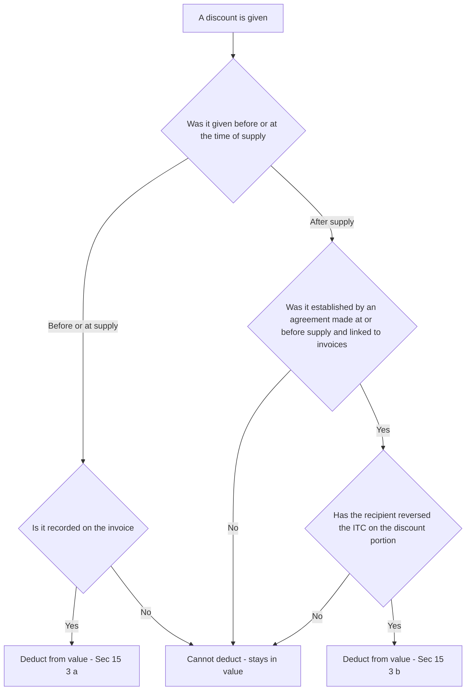
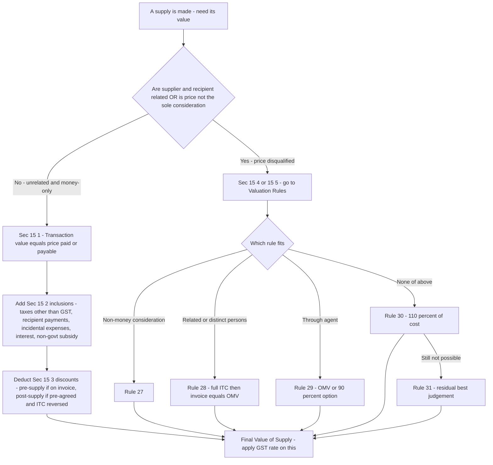

# Chapter 18 — Value of Supply

> **Rates / thresholds / amendments flag:** This chapter teaches the *logic and mechanism* of valuation under Section 15 of the CGST Act, 2017 and the Chapter IV Valuation Rules (Rules 27–35 of the CGST Rules). The *rules* here are extremely stable, but the specific rates used inside the examples, the notified TCS rate, and any fresh amendments to the Rules must be **verified against current ICAI study material for your attempt.** The framework below is permanent knowledge.

---

## 1. The Problem — Why GST cannot just say "tax the price"

GST is an **ad valorem** tax: it is a *percentage of value*, not a flat rupee amount per unit. CGST + SGST at 18% on a ₹1,000 sale is ₹180; the whole revenue of the nation hangs on that word **value**. So the single most dangerous question in the entire GST law is deceptively simple:

> **Value of *what*, exactly?**

If the law naively answered "the price on the invoice," four separate leaks would open up immediately — and each one is a genuine revenue hole, not a technicality:

**Problem 1 — Parties can simply write a smaller number.** A seller and buyer who are friends, relatives, or two arms of the same company can agree to show ₹100 on the invoice for something worth ₹1,000, settle the real ₹900 in cash or as a "loan," and starve the exchequer. Price is whatever two people *say* it is; the tax base cannot be left to their honesty.

**Problem 2 — The "price" is often not the whole consideration.** Suppose I sell you a machine for ₹1,00,000 but I also make you pay the ₹5,000 freight, ₹2,000 installation, and a ₹3,000 municipal levy separately. Economically you paid ₹1,10,000 to *get that machine working*. If tax only hit the ₹1,00,000 "price," every seller would unbundle charges into a dozen side-invoices and shrink the taxable base to nothing.

**Problem 3 — Sometimes there is no price at all.** I give goods to my sister-concern for free (stock transfer to another State), or I barter a designing service for a laptop, or I pay partly in old-gold exchange. There is a *supply* — GST is due — but no clean money price exists to tax. The law still needs a number.

**Problem 4 — Subsidies and discounts distort the raw price in opposite directions.** A government subsidy can make the sticker price *artificially low* (the supplier's true realisation is higher). A trade discount can make the invoice *artificially high* relative to what the buyer really pays. Tax should follow economic reality, not the raw figure.

The **cascade-killing promise of GST** — tax only on the *value added* at each stage — only works if "value" at each stage is measured honestly and consistently. A wrong value poisons the whole chain, because the buyer's input tax credit (ITC) equals the tax the seller charged on that value. **Get value wrong and you either under-tax the nation or over-credit the buyer.** That is why an entire, carefully lawyered mechanism — Section 15 plus a ladder of fallback Rules — exists purely to pin down one number.

---

## 2. The Core Idea

> **The default value of a supply is the *transaction value* — the actual price paid or payable — but ONLY when (a) the two parties are unrelated and (b) the price is the *sole* consideration. The law then surgically adds back things sellers try to strip out of the price (Sec 15(2)) and subtracts things that were never really part of it (Sec 15(3)). If, and only if, the transaction value cannot be trusted or does not exist, the law climbs a fallback ladder of Valuation Rules to *construct* a value.**

Three load-bearing ideas fall out of this and organise the whole chapter:

1. **Trust the price by default.** In an arm's-length cash deal, the price two independent parties struck *is* the fairest measure of value. The law is not paternalistic; it accepts the market. This is the "transaction value" of **Sec 15(1)**.

2. **But police the price.** Because sellers game the raw figure, Sec 15(2) forces certain amounts *in* (inclusions) and Sec 15(3) allows certain amounts *out* (discounts) — each adjustment is a direct answer to Problems 2 and 4 above.

3. **Replace the price only as a last resort.** When trust breaks (related parties — Problem 1) or the price is missing (barter, free supply — Problem 3), Sec 15(4)/(5) hands over to the Valuation Rules, which reconstruct value from open-market prices, cost, or a residual best-judgement method — always the *closest available proxy* for a real arm's-length price.

Everything else is detail hanging off these three hooks.

---

## 3. Why It's Built This Way — the design logic behind each lever

Before a single sub-section, understand the *design choices*, because every rule below is one of these in disguise:

| Design choice | The problem it solves | How the Act implements it |
|---|---|---|
| Accept the actual price by default | Don't second-guess honest markets; keep compliance simple | Transaction value, Sec 15(1) |
| Two conditions on that default | Price is only trustworthy if arm's-length and cash | "Not related" + "price is sole consideration", Sec 15(1) |
| Force incidental charges back in | Sellers unbundle to shrink the base (Problem 2) | Inclusions, Sec 15(2) |
| Add non-GST taxes/levies to value | Otherwise base excludes real cost borne | Sec 15(2)(a) |
| Add third-party payments the buyer owed the supplier | Consideration routed around the invoice | Sec 15(2)(b) |
| Add interest, late fee, penalty for delayed payment | These are part of the real price of credit | Sec 15(2)(d) |
| Add non-refundable subsidies | Subsidy props up a low sticker price (Problem 4) | Sec 15(2)(e) |
| Allow only *disclosed* discounts out | Discounts are real, but fake post-hoc discounts hide value (Problem 4) | Sec 15(3) — pre-supply vs post-supply conditions |
| Fallback Valuation Rules | No price, or untrustworthy price (Problems 1 & 3) | Sec 15(4)/(5) → Rules 27–35 |

The elegance to internalise: **Section 15 is a filter, not a formula.** It starts from the invoice price and makes *minimal, targeted* corrections. It never rebuilds value from scratch unless the price itself is disqualified. This "least intervention" philosophy is why GST valuation is far simpler than the old Central Excise valuation regime — and why the exam rewards you for knowing *which lever applies*, not for memorising a mega-formula.

One more foundational note on scope: **GST value under Sec 15 is exclusive of the GST itself.** You compute value first, then apply the rate. CGST, SGST/UTGST, IGST and the Compensation Cess are *not* part of the value (Sec 15(2)(a) deliberately carves them out — see below). Tax is not levied on tax.

---

## 4. Full Technical Content — Section 15 and the Valuation Rules, with the "why"

### 4.1 The charging link — why Sec 15 even exists

Sec 15 does not levy tax; the charging sections (Sec 9 of CGST, Sec 5 of IGST) do. Sec 9(1) says CGST is levied "on the value of supply *determined under Section 15*." So **Sec 15 is the plug that feeds a number into the charging section.** No value, no charge. This is the mechanical reason the whole chapter matters.

### 4.2 Sec 15(1) — Transaction value: the default, and its two gatekeeper conditions

> **Sec 15(1): "The value of a supply of goods or services or both shall be the *transaction value*, which is the *price actually paid or payable* for the said supply of goods or services or both where — (i) the supplier and the recipient of the supply are *not related*, and (ii) the *price is the sole consideration* for the supply."**

Unpack the four key phrases:

- **"Price actually paid or payable"** — actual, not notional; and *payable* means an amount owed but not yet paid still counts. You cannot escape value by delaying payment.
- **"Not related"** — because related parties can rig the price (Problem 1). "Related persons" is defined in the **Explanation to Sec 15**: persons are related if they are officers/directors of one another's business, legally recognised partners, employer–employee, one holds ≥25% of shares in both / in the other, one controls the other, both are controlled by a third, together they control a third, they are members of the same family, or they are sole agent/distributor of each other. *Persons associated in business where one is the sole agent, sole distributor, or sole concessionaire of the other are deemed related.*
- **"Sole consideration"** — because if the buyer also gives something *other than money* (a barter, an exchange, a free mould), the money price alone understates value (Problem 3 in mild form). If there is additional non-monetary consideration, transaction value under 15(1) may still be used *after adding the money value of that extra consideration* — but if it cannot be so quantified cleanly, you fall to the Rules.

**Memory hook — "R.S." disqualifies the price: Related, or not Sole consideration.** If either is true, Sec 15(1) is off the table and you go to the Rules (via 15(4)).

### 4.3 Sec 15(2) — Inclusions: what must be ADDED to the transaction value

These are the "add-backs" — amounts sellers try to keep off the taxable price. **Every clause answers "the seller shifted real cost off the invoice; drag it back."** There are five clauses, (a) through (e).

| Clause | What is included | The WHY | Watch-out |
|---|---|---|---|
| **15(2)(a)** | Any taxes, duties, cesses, fees, charges levied under *any law other than* CGST/SGST/UTGST/IGST/GST-Compensation-Cess Acts, **if charged separately by the supplier** | These are real amounts the recipient pays to *get* the supply; only GST itself is excluded (no tax on tax) | Examples included: municipal taxes, TCS under Income-tax Act *(see trap 8.6)*, entertainment tax by local body. **GST itself is NOT included.** |
| **15(2)(b)** | Amount the *supplier* is liable to pay but which the *recipient* has paid, and which is **not** already in the price | Consideration routed around the invoice — the buyer discharged the seller's obligation, so it is part of the real price | e.g. buyer pays a fee the supplier legally owed |
| **15(2)(c)** | **Incidental expenses** — commission, packing, and any amount charged for anything done by the supplier *at the time of, or before, delivery* | These are costs of *making the supply delivery-ready*; unbundling them into side-charges would shrink the base (Problem 2) | Packing, weighing, loading, inspection, testing, design charges before supply |
| **15(2)(d)** | **Interest, late fee, or penalty for delayed payment** of any consideration | The price of credit is part of the price; a buyer who pays late effectively bought on more expensive terms | Time of supply of this interest is *when the supplier receives it* (Sec 12/13) — it is taxed when actually received, not accrued |
| **15(2)(e)** | **Subsidies directly linked to the price**, EXCLUDING subsidies given by the Central/State Government | A price-linked subsidy from a *non-government* party props up an artificially low sticker price; the supplier's true realisation includes it | **Government subsidies are NOT included** — deliberately excluded to avoid taxing public support. Subsidy is added in the hands of the *supplier who receives it*. |

**Memory hook for inclusions — "T-P-I-I-S":** **T**axes (other than GST), **P**ayments made by recipient on supplier's behalf, **I**ncidental expenses, **I**nterest/late fee/penalty, **S**ubsidy (non-government, price-linked).

Two of these repay careful thought:

- **15(2)(a) and the "no tax on tax" principle.** The clause *includes* every other levy but *excludes* GST. This is the statutory expression of the anti-cascade promise: GST is charged on a value that is itself free of GST, but not free of, say, a municipal levy the buyer genuinely paid.

- **15(2)(e) subsidies — direction of the flow matters.** A subsidy is included in the value only if it is (i) *directly linked to the price* and (ii) *not from the government*. A lump-sum or non-price-linked grant is out. A government subsidy is out. The reason: value should reflect what the *supply* is worth to the market; a private party paying part of the price on the buyer's behalf is really topping up the price.

### 4.4 Sec 15(3) — Exclusions: discounts that come OUT of value

> **A discount is a genuine reduction in the real price — so it should reduce value. But a fake, undisclosed, after-the-fact "discount" is just a way to hide value (Problem 4). So the law splits discounts by *timing* and imposes conditions on the risky kind.**

| Discount type | Condition to be deducted (Sec 15(3)) | The WHY |
|---|---|---|
| **Before/at the time of supply** — 15(3)(a) | Must be **recorded in the invoice** | If it's on the face of the invoice, it's transparent and real; no manipulation risk |
| **After the supply** — 15(3)(b) | Allowed ONLY if **(i)** it is established in terms of an *agreement entered into at or before the time of supply* AND *linked to relevant invoices*, AND **(ii)** the **ITC attributable to the discount has been reversed by the recipient** | Post-supply discounts are the classic dodge. Both conditions plug it: the deal must pre-exist (not invented later), and the buyer must give back the credit he took on the discounted portion (else the chain over-credits) |

**Why the ITC-reversal condition is non-negotiable.** Recall GST's chain: the buyer claimed ITC equal to the tax the seller charged. If the seller later reduces value via a discount (and reduces his output tax by a credit note), but the buyer keeps the *full* ITC, the buyer now holds more credit than tax that exists in the system — a leak. So the law says: you may reduce value post-supply only if the buyer *reverses* the matching ITC. This is a beautiful, self-consistent anti-cascade safeguard.

**Trap to bank now:** a post-supply discount decided *after* the supply with **no pre-existing agreement** (e.g. a year-end volume bonus dreamt up in March) is **NOT deductible** — value stays gross. Only *pre-agreed* post-supply discounts qualify.

*Figure 2 — Discount gate: pre-supply discounts pass if disclosed on the invoice; post-supply discounts pass only through both locks (pre-agreement AND ITC reversal).*

### 4.5 Sec 15(4) & 15(5) — the handover to Rules

> **Sec 15(4):** Where value *cannot be determined* under 15(1) — i.e. parties are related, or price is not the sole consideration — value "shall be determined in such manner as may be prescribed" → the **Valuation Rules (Rules 27–31)**.
>
> **Sec 15(5):** Notwithstanding 15(1)/(4), the value of *notified* supplies shall be determined as prescribed → special Rules (32–35), covering specific sectors (foreign exchange, air travel agents, life insurance, second-hand goods, tokens/vouchers, pure agents, rate of exchange).

### 4.6 The Valuation Rules ladder (Rules 27–31) — how value is *constructed* when the price fails

The Rules are a **sequential ladder**: you use Rule 27, and only if it can't apply do you drop to 28, then 29, 30, 31. **The philosophy throughout: find the closest available proxy to a real arm's-length price.**

| Rule | Applies when | How value is built | The WHY |
|---|---|---|---|
| **Rule 27** | Consideration is **not wholly in money** (barter, exchange) | (a) **Open market value (OMV)**; if not available → (b) money consideration **+ money-equivalent of the non-money part**; if not → (c) value of **like kind and quality** supply; if not → (d) Rule 30 or 31 | Problem 3: no clean price. Start from what the same thing sells for in the open market |
| **Rule 28** | Supply between **related / distinct persons** (not through agent) | (a) **OMV**; else (b) value of **like kind and quality**; else (c) Rule 30/31. **Proviso 1:** where recipient is eligible for **full ITC**, the value declared on the invoice is **deemed to be the OMV** | Problem 1: price is rigged. But if the buyer gets full ITC, any value is revenue-neutral (tax paid = credit taken), so the law pragmatically accepts the invoice |
| **Rule 29** | Supply made **through an agent** | (a) **OMV**, OR at supplier's option **90% of the price** charged by the recipient-agent to *his* unrelated customer (for like goods); else (b) Rule 30/31 | Agent situations have a natural downstream price to anchor to — the 90% option gives a clean proxy |
| **Rule 30** | Value not determinable by 27–29 | **110% of cost** of production / acquisition / provision (cost-plus) | When no market anchor exists, build up from cost + a standard 10% margin |
| **Rule 31** | Value not determinable even by 30 | **Residual / best-judgement** — reasonable means consistent with the principles of Sec 15 | The final safety net; for *services*, the supplier may skip Rule 30 and use Rule 31 directly |

**Memory hook — the ladder "OMV → Like → Cost+10% → Best judgement."** OMV is always the first choice in every rule, because it is the truest proxy for an arm's-length price. Cost-plus (Rule 30, 110%) and best-judgement (Rule 31) are only for when no market comparison exists.

*Figure 1 — The valuation decision spine: trust the price (Sec 15) unless it is disqualified, then climb the Rules ladder. Read left path first; the right path is the exception.*

### 4.7 Selected special valuation Rules (Rule 32) — because some sectors have no ordinary "value"

Rule 32 lets certain notified suppliers use a *simplified* value. Know the four exam-favourite ones:

- **Rule 32(2) — Foreign exchange / money changing.** Value = difference between the buying/selling rate and the RBI reference rate × units; or a slab method if no reference rate. *Why: a money-changer's "value added" is the spread, not the face value of currency moved.*
- **Rule 32(3) — Air travel agent.** Value = **5% of basic fare** for domestic, **10%** for international. *Why: the agent's supply is the booking service, proxied as a fixed slice of fare.*
- **Rule 32(4) — Life insurance.** Value = gross premium less the portion allocated to investment/savings (if intimated); or 25% of first-year premium and 12.5% thereafter (for other than pure-risk policies). *Why: only the risk-cover portion is a "service"; the savings portion is not consumption.*
- **Rule 32(5) — Second-hand goods (margin scheme).** Value = **selling price minus purchase price** (the margin), where no ITC was taken on purchase; if negative, ignored. *Why: taxing the full resale price of used goods would double-tax value already taxed when new — the margin scheme taxes only the fresh value the dealer added.*
- **Rule 33 — Pure agent.** Expenses incurred by a supplier as a **pure agent** of the recipient (separately shown) are **excluded** from value. *Why: a pure agent merely passes through third-party costs; those are not his own supply's value.*

### 4.8 Rule 34 & 35

- **Rule 34 — Rate of exchange** for imports/exports: the notified rate on the date of time of supply.
- **Rule 35 — Value inclusive of tax:** when the price *already includes* GST, extract value by back-calculation: **Value = Tax-inclusive amount × 100 ÷ (100 + GST rate)**. *The single most common computational sub-step in the exam — commit it.*

---

## 5. Worked Examples — every rupee reconciled

> All rates below are illustrative; **verify the applicable GST rate for the goods/service in the exam.** I use CGST 9% + SGST 9% (intra-State, 18% total) or IGST 18% (inter-State) unless stated.

### Example 1 — The classic "inclusions and discount" build-up (Sec 15(1)+(2)+(3))

**Facts.** Ashok Ltd. (Maharashtra) supplies a machine to an *unrelated* buyer in Maharashtra. Details:

| Particular | Amount (₹) |
|---|---|
| Basic price of machine | 5,00,000 |
| Municipal tax charged separately by supplier | 20,000 |
| Packing and forwarding charged separately | 15,000 |
| Installation charges (done before delivery) | 25,000 |
| Late-payment interest actually received later | 8,000 |
| Subsidy received from a private trade body (price-linked) | 30,000 |
| Trade discount shown on the invoice | 40,000 |
| Weight-based cash discount for early payment, per pre-supply agreement, given after supply (buyer reverses matching ITC) | 10,000 |

GST rate 18% (CGST 9% + SGST 9%). **Compute the value of supply and the tax.**

**Reasoning first — apply each lever:**
- Parties unrelated, price is money → **Sec 15(1) applies**; start at basic price ₹5,00,000.
- Municipal tax (non-GST levy, charged separately) → **include, 15(2)(a)** → +20,000.
- Packing/forwarding → incidental expense **15(2)(c)** → +15,000.
- Installation before delivery → incidental expense **15(2)(c)** → +25,000.
- Late-payment interest → **15(2)(d)**, included when received → +8,000.
- Private (non-government) price-linked subsidy → **15(2)(e)** → +30,000.
- Invoice trade discount → pre-supply, on invoice → **deduct 15(3)(a)** → −40,000.
- Post-supply discount, pre-agreed + ITC reversed → **deduct 15(3)(b)** → −10,000.

**Computation:**

| Step | ₹ |
|---|---|
| Basic price | 5,00,000 |
| Add: Municipal tax 15(2)(a) | 20,000 |
| Add: Packing & forwarding 15(2)(c) | 15,000 |
| Add: Installation 15(2)(c) | 25,000 |
| Add: Late-payment interest 15(2)(d) | 8,000 |
| Add: Non-govt price-linked subsidy 15(2)(e) | 30,000 |
| **Sub-total** | **5,98,000** |
| Less: Invoice trade discount 15(3)(a) | (40,000) |
| Less: Pre-agreed post-supply discount 15(3)(b) | (10,000) |
| **Value of Supply** | **5,48,000** |
| CGST @ 9% | 49,320 |
| SGST @ 9% | 49,320 |
| **Total invoice value** | **6,46,640** |

**Reconciliation check:** 5,98,000 − 50,000 = 5,48,000. Tax = 5,48,000 × 18% = 98,640, split 49,320 + 49,320. Total = 5,48,000 + 98,640 = 6,46,640. ✓

*Note if the facts had said the subsidy was from the State Government: it would be **excluded** (15(2)(e)), dropping value to 5,18,000.*

### Example 2 — Price includes GST (Rule 35 back-calculation)

**Facts.** A retailer sells goods for a *single all-inclusive* price of ₹1,18,000, and the GST rate is 18%. The invoice does not separately show tax. **Find the value of supply and the tax.**

**Reasoning.** The price already embeds GST, so we must strip it out using **Rule 35**: Value = Tax-inclusive ÷ (1 + rate).

**Computation:**
- Value = 1,18,000 × 100 ÷ (100 + 18) = 1,18,000 ÷ 1.18 = **₹1,00,000**
- GST = 1,18,000 − 1,00,000 = **₹18,000** (CGST 9,000 + SGST 9,000)

**Reconciliation:** 1,00,000 + 18,000 = 1,18,000. ✓ *Common error: applying 18% *on* 1,18,000 (giving 21,240) — that double-counts tax. The divisor method is mandatory when price is tax-inclusive.*

### Example 3 — Related-party / distinct-person supply (Sec 15(4) → Rule 28)

**Facts.** Surya Ltd. (Gujarat) transfers goods to its own branch in Rajasthan (a *distinct person* under Sec 25). The goods are also sold to independent customers at an **open market value of ₹2,00,000**. Surya declares ₹1,50,000 on the stock-transfer invoice. Consider two scenarios; GST (IGST) 18%.

**Scenario A — the Rajasthan branch is NOT eligible for full ITC (it makes some exempt supplies).**
- Parties are distinct persons → Sec 15(1) fails → **Rule 28**.
- Rule 28(a): use **OMV = ₹2,00,000**.
- **Value = ₹2,00,000; IGST @18% = ₹36,000.**

**Scenario B — the Rajasthan branch IS eligible for FULL ITC.**
- Rule 28 **first proviso**: where the recipient is eligible for full ITC, the **value declared in the invoice is deemed to be the OMV.**
- So the ₹1,50,000 declared value is *accepted*.
- **Value = ₹1,50,000; IGST @18% = ₹27,000.**

**Why the difference is *not* a loophole.** In Scenario B, whatever IGST Surya charges, the branch takes back as ITC — the transaction is **revenue-neutral** to the exchequer. So the law does not waste effort policing the value; it accepts the invoice. In Scenario A, the branch *cannot* fully credit the tax, so an understated value would permanently under-tax the chain — hence OMV is forced. **The ITC position drives the answer.** This is the single most tested nuance in related-party valuation.

**Reconciliation:** Scenario A: 2,00,000 × 18% = 36,000. ✓ Scenario B: 1,50,000 × 18% = 27,000. ✓

### Example 4 — Non-monetary consideration / exchange (Rule 27)

**Facts.** Mr. Rao supplies a new laptop and, as part payment, takes the customer's *old* laptop valued (money-equivalent) at ₹8,000 plus ₹40,000 cash. The **open market value** of the new laptop (its normal cash selling price) is ₹52,000. GST 18%.

**Reasoning.** Consideration is *not wholly in money* (part is the old laptop) → Sec 15(1) "sole consideration" condition fails → **Rule 27**.
- Rule 27(a): **OMV first** = ₹52,000 (available).
- (We do *not* need to fall to (b) money + money-equivalent = 40,000 + 8,000 = 48,000, because OMV exists and takes priority.)
- **Value = ₹52,000; GST @18% = ₹9,360.**

**Reconciliation & teaching point:** Had the OMV *not* been available, Rule 27(b) would give 40,000 + 8,000 = ₹48,000. The two answers differ (52,000 vs 48,000) precisely because the ladder is **sequential** — you must justify *why* you are on a given rung. Using 48,000 when OMV is available is a marking error. ✓

### Example 5 — Second-hand goods margin scheme (Rule 32(5))

**Facts.** A used-car dealer buys a second-hand car from an individual for ₹3,00,000 (no GST charged, no ITC taken), spends nothing on it, and resells for ₹3,50,000. GST 18% (assume, for illustration).

**Reasoning.** Margin scheme applies (no ITC on purchase) → value = **selling − purchase margin** = 3,50,000 − 3,00,000 = **₹50,000.**
- **GST @18% on ₹50,000 = ₹9,000.**

**Why:** the car's value was already taxed when new; taxing the full ₹3,50,000 resale would double-tax. GST hits only the ₹50,000 the dealer added. On a resale at a *loss*, the negative margin is **ignored** — value is nil, no tax. ✓

---

## 6. Format / Summary — the one-page valuation worksheet

Use this exact skeleton in the exam for any Sec 15 build-up problem:

| Line | Particular | ₹ |
|---|---|---|
| 1 | Price actually paid or payable (Sec 15(1)) | XXX |
| 2 | **Add** — Non-GST taxes, duties, cesses, fees charged separately (15(2)(a)) | XXX |
| 3 | **Add** — Amounts supplier liable to pay, but paid by recipient (15(2)(b)) | XXX |
| 4 | **Add** — Incidental expenses: commission, packing, pre-delivery charges (15(2)(c)) | XXX |
| 5 | **Add** — Interest / late fee / penalty for delayed payment (15(2)(d)) | XXX |
| 6 | **Add** — Subsidies price-linked, **non-government** (15(2)(e)) | XXX |
| 7 | **Less** — Discount on invoice, pre/at supply (15(3)(a)) | (XXX) |
| 8 | **Less** — Post-supply discount, pre-agreed + ITC reversed (15(3)(b)) | (XXX) |
| 9 | **= VALUE OF SUPPLY** | **XXX** |
| 10 | CGST + SGST (intra-State) OR IGST (inter-State) on line 9 | XXX |
| 11 | **Invoice value** = line 9 + line 10 | **XXX** |

**Decision cheat-sheet — which valuation route?**

| Situation | Route |
|---|---|
| Unrelated + money only | Sec 15(1) transaction value |
| Non-monetary / part-exchange | Rule 27 (OMV → money+equivalent → like → 30/31) |
| Related / distinct persons | Rule 28 (OMV; invoice=OMV if full ITC) |
| Through agent | Rule 29 (OMV or 90% option) |
| No anchor available | Rule 30 (110% of cost) |
| Nothing works | Rule 31 (best judgement) |
| Price includes GST | Rule 35 divisor: × 100 ÷ (100 + rate) |

---

## 7. Connections — where valuation plugs into the rest of GST

- **→ Charge of tax (Sec 9 CGST / Sec 5 IGST):** value is the *base* those charging sections multiply by the rate. Valuation feeds the charge.
- **→ Time of supply (Chapter 17):** valuation answers *how much*; time of supply answers *when*. Note the crossover: interest/late-fee under 15(2)(d) is valued *and* timed to **receipt** (Sec 12(6)/13(6)).
- **→ Input Tax Credit:** the recipient's ITC equals the tax on *this* value. This is why Rule 28's "full ITC → invoice = OMV" concession works, and why post-supply discounts (15(3)(b)) demand ITC reversal. Valuation and ITC are two ends of the same rupee.
- **→ Registration / distinct persons (Sec 25):** branches in different States are *distinct persons*, so inter-branch stock transfers are supplies needing valuation under Rule 28 — a favourite exam link.
- **→ Composite & mixed supply (Chapter on Supply):** valuation applies to the *single* value of a composite supply taxed at the principal-supply rate; you value the bundle, not the parts.
- **→ Import valuation (Customs):** IGST on imports is levied on **assessable value + Basic Customs Duty** (a Customs-law valuation), *not* Sec 15 — a deliberate carve-out worth flagging.

---

## 8. Traps & Examiner Tricks

**8.1 GST is never part of value.** Sec 15(2)(a) includes *other* taxes but explicitly excludes CGST/SGST/UTGST/IGST/Compensation Cess. Students wrongly add back GST. Value is always GST-exclusive; tax sits *on top*.

**8.2 Government subsidy vs private subsidy.** Only **non-government** price-linked subsidies are included (15(2)(e)). A Central/State Government subsidy is **excluded**. Examiners plant a "subsidy from State Government" precisely to catch the reflex "add all subsidies."

**8.3 Post-supply discount without a prior agreement.** A discount decided *after* supply with **no pre-existing agreement** is **NOT deductible** (fails 15(3)(b)). Only pre-agreed, invoice-linked, ITC-reversed post-supply discounts come out. Value stays gross otherwise.

**8.4 Rule 28 full-ITC proviso.** When the related/distinct recipient gets **full ITC**, the *invoice value is accepted as OMV*. Weak students force OMV even here and over-value the supply. The ITC eligibility of the *recipient* is the switch.

**8.5 The valuation ladder is sequential, not a menu.** You cannot pick Rule 30 (cost+10%) if OMV under Rule 27/28 is available. Always justify *why the higher rung failed* before descending. (See Example 4.)

**8.6 TCS under the Income-tax Act.** Per CBIC clarification, TCS collected under the Income-tax Act is a *tax on income* not on the goods, and is **not** included in the value of supply — do not treat it like an excise-type levy under 15(2)(a). *(Verify the current clarification position in ICAI material.)*

**8.7 Tax-inclusive price.** If the price "includes GST," you **must** back-calculate with Rule 35 (× 100 ÷ (100+rate)). Applying the rate *on* the inclusive figure double-taxes. (See Example 2.)

**8.8 Interest under 15(2)(d) is taxed on receipt.** Do not add accrued-but-unreceived delayed-payment interest to value; its time of supply is the date of *receipt*.

**8.9 "Free of cost" supplies between unrelated parties.** A genuinely free supply to an *unrelated* party (no consideration at all) is generally **not a supply** (outside Schedule I) — no valuation question arises. But the *same* free transfer between *related/distinct persons* **is** a supply (Schedule I) and **must** be valued under Rule 28. Test *relatedness* before valuing.

**8.10 Related persons definition.** Employer–employee are related — but *gifts up to ₹50,000 per year* by employer to employee are not treated as supply (Schedule I proviso). Also, sole agent/distributor/concessionaire relationships are *deemed* related. Examiners test the edges of the Explanation to Sec 15.

---

## 9. First-Principles Recap — rebuild the chapter from one sentence

Start from: **"GST is a percentage of value, so the law must pin down one trustworthy number."**

1. The fairest number is the **price two independent parties actually agreed** → transaction value, **Sec 15(1)**.
2. That price is only trustworthy if the parties are **unrelated** and the price is the **sole consideration** — the two gatekeeper conditions.
3. Because sellers **strip real cost off the invoice**, the law drags it back → **inclusions, Sec 15(2)**: other taxes, recipient-borne payments, incidental expenses, delayed-payment interest, non-government price-linked subsidy.
4. Because **genuine discounts** are real reductions but **fake post-hoc discounts** hide value, the law lets pre-supply invoice discounts out freely and post-supply discounts out only if **pre-agreed and ITC-reversed** → **exclusions, Sec 15(3)**.
5. When the price is **disqualified** (related parties) or **missing** (barter, free supply), the law **constructs** value via a sequential ladder — **Rules 27–31** — always chasing the closest proxy to an arm's-length price: **OMV → like-kind → cost+10% → best judgement**.
6. Special sectors with no ordinary "value" (forex, air agents, insurance, second-hand goods, pure agents) get **simplified Rules 32–33**; a tax-inclusive price is unwound by **Rule 35**.

Everything in the chapter is one of these six moves. If you can regenerate the six, you never need to memorise the sections — they fall out of the logic.

---

## 10. Quick-Revision Sheet

**Default (Sec 15(1)):** Value = transaction value = price paid/payable, **IF** (i) unrelated **AND** (ii) price = sole consideration. Fail either → Rules.

**Inclusions — "T-P-I-I-S" (Sec 15(2)):**
- **T** — taxes/duties/cesses/fees *other than* GST, charged separately (a)
- **P** — supplier's liability paid by recipient (b)
- **I** — incidental expenses: commission, packing, pre-delivery charges (c)
- **I** — interest/late fee/penalty for delayed payment; taxed on **receipt** (d)
- **S** — **non-government** price-linked subsidy (e)

**Exclusions — discounts (Sec 15(3)):**
- Pre/at supply → deduct if **on invoice** (a)
- Post supply → deduct only if **pre-agreed + invoice-linked + recipient reverses ITC** (b)

**Never in value:** GST itself; government subsidies; TCS (Income-tax Act); pure-agent pass-through (Rule 33).

**Valuation Rules ladder:**
| Rule | Trigger | Method |
|---|---|---|
| 27 | Non-money consideration | OMV → money+equiv → like → 30/31 |
| 28 | Related/distinct persons | OMV; **full ITC ⇒ invoice = OMV** |
| 29 | Through agent | OMV or **90%** of agent's onward price |
| 30 | No anchor | **110% of cost** |
| 31 | Nothing else | Best judgement (services may use directly) |

**Special:** 32(3) air agent 5%/10% of basic fare; 32(4) life insurance; 32(5) second-hand **margin scheme** (SP − PP, negative ignored); 33 pure agent excluded; **35 tax-inclusive: × 100 ÷ (100 + rate).**

**Master switches to check first, every time:**
1. Related or distinct persons? → Rule 28 (mind the full-ITC proviso).
2. Consideration not wholly money? → Rule 27.
3. Price already includes GST? → Rule 35 divisor.
4. Any subsidy/discount? → test *government?* and *pre-agreed + ITC-reversed?*

> **Reminder:** verify current GST rates, the notified TCS position, and any fresh amendments to Rules 27–35 against **current ICAI study material for your attempt.**

